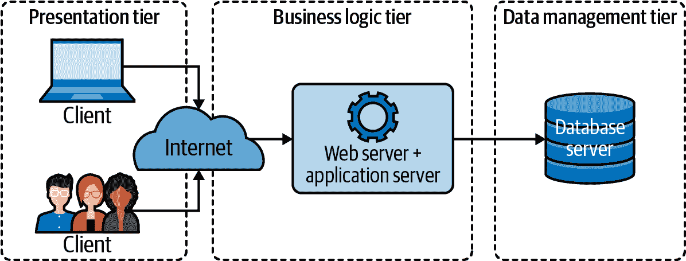

# 第一章：什么是“云原生”应用程序？

> 语言中最危险的短语是：“我们一直都是这样做的。”¹
> 
> 格雷斯·霍普，《计算机世界》（1976 年 1 月）

如果你正在阅读这本书，那么毫无疑问你至少听过*云原生*这个术语。更有可能的是，你可能已经看过一些由供应商撰写的充满兴奋和目光中有美元符号的无数文章。如果这是你迄今对该术语的主要经历，那么你可能会原谅认为这个术语是模糊和炒作的，只是另一个可能起源于有用内容但后来被试图向你销售某些东西的人接管的市场表达。参见：敏捷开发，DevOps。

基于类似的原因，搜索“云原生定义”的网络搜索可能会让你认为使一个应用程序成为云原生只需要使用“正确”的语言²或框架，或者使用“正确”的技术。当然，你选择的语言可以显著地简化或加大你的生活，但这既不是必要条件也不是充分条件来使一个应用程序成为云原生。

那么，云原生仅仅是应用程序运行的*地点*问题吗？术语*云原生*确实暗示了这一点。你只需将你那些笨拙的³老应用程序装入容器，并在 Kubernetes 中运行，现在你就是云原生了，对吗？不对。你所做的只是让你的应用程序更难部署，更难管理。⁴ 在 Kubernetes 中的笨拙应用程序依然是笨拙的。

那么，*什么*是云原生应用程序？在本章中，我们将确切地回答这个问题。首先，我们将审视计算服务范式的历史，特别是到目前为止，并讨论规模扩展的无情压力如何推动（并继续推动）提供高可靠性的技术的发展和采纳。最后，我们将确定与这类应用程序相关联的具体特征。

# 迄今为止的故事

网络应用程序的故事就是规模扩展的故事。

20 世纪 50 年代后期引入了大型机计算机。当时，每个程序和数据片段都存储在一台巨大的机器中，用户通过自身没有计算能力的哑终端访问。所有的逻辑和数据都聚集在一起，形成一个庞大而简单的单体。那时候是一个更简单的时代。

1980 年代随着廉价的网络连接 PC 的到来，一切都发生了变化。与哑终端不同，PC 能够进行一些计算，使得可以将一些应用程序逻辑卸载到它们身上。这种新的多层架构——将表示逻辑、业务逻辑和数据分开（图 1-1）——首次使得网络应用程序的各个组件可以独立修改或替换。

###### 图 1-1\. 传统的三层架构，明确定义了表示层、业务逻辑层和数据层组件

在 1990 年代，全球网络的普及和随后的“点 com”黄金热潮向世界展示了软件即服务（SaaS）。整个行业建立在 SaaS 模型之上，推动了更复杂、资源需求更大的应用程序的发展，这些应用程序开发、维护和部署难度也因此增加。突然之间，经典的多层架构已经不再足够。作为回应，业务逻辑开始分解成可以独立开发、维护和部署的子组件，引领微服务时代的来临。

2006 年，亚马逊推出了亚马逊网络服务（AWS），其中包括弹性计算云（EC2）服务。尽管 AWS 并不是第一个基础设施即服务（IaaS）提供商，但它彻底改变了数据存储和计算资源的按需可用性，将云计算——以及快速扩展的能力——带给了大众，催生了大规模资源向“云端”的迁移。

不幸的是，组织很快就意识到在大规模运行中生活并不容易。糟糕的事情屡屡发生，当你处理数百甚至数千个资源时，糟糕的事情会频频发生。流量会急剧上升或下降，重要的硬件会故障，上游依赖突然变得不可预测且无法访问。即使一段时间内没有发生问题，你仍然需要部署和管理所有这些资源。在这种规模下，人类手动跟上所有这些问题是不可能的（或者至少是极其不切实际的）。

# 什么是云原生？

从根本上讲，一个真正的云原生应用程序融合了我们在过去 60 年中运行大规模网络应用程序所学到的一切。它们在面对急剧变化的负载时具备可伸缩性，在环境不确定性面前表现坚韧，并且在面对不断变化的需求时易于管理。换句话说，云原生应用程序是为了在残酷而不确定的宇宙中生存而构建的。

那么我们如何*定义*“云原生”这个术语呢？幸运的是，我们大家不必自己定义。[云原生计算基金会](https://oreil.ly/621yd)——著名 Linux 基金会的一个分支机构，也是该领域的权威——已经为我们做好了这项工作。

> 云原生技术使组织能够在现代、动态的环境中（如公共、私有和混合云中）构建和运行可扩展的应用程序……
> 
> 这些技术使得系统松耦合、具有弹性、易管理且可观测。结合强大的自动化，工程师可以频繁且可预测地进行高影响变更，而减少不必要的劳动。⁶
> 
> 云原生计算基金会，CNCF 云原生定义 v1.0

根据此定义，云原生应用不仅仅是在云中运行的应用程序。它们还是*可扩展*、*松耦合*、*具有弹性*、*易管理*和*可观测*的。这些“云原生特性”共同构成了系统成为云原生的基础。

事实证明，这些词各自具有相当具体的含义，让我们来看看。

## 可扩展性

在云计算背景下，*可扩展性*可以定义为系统在面对需求显著上升或下降时继续按预期行为的能力。如果一个系统在需求急剧增加期间或之后无需重构即可执行其预期功能，则可以认为该系统具有可扩展性。

因为不可扩展的服务在初始条件下似乎可以完美运行，所以可扩展性并非在服务设计期间总是主要考虑因素。虽然这在短期内可能没问题，但那些无法远超其原始预期的服务也有其生命周期的限制价值。此外，对于可扩展性进行重构通常非常困难，因此考虑到可扩展性可以在长远节省时间和金钱。

服务可以按两种不同方式进行扩展，每种方式都有其自身的优缺点：

垂直扩展

一个系统可以通过调整已分配给它的硬件资源来进行*垂直扩展*（或*升级*）。例如，通过向运行在专用计算实例上的数据库添加内存或 CPU。垂直扩展的好处在于技术上相对直接，但任何给定实例只能升级到一定程度。

水平扩展

一个系统可以通过增加（或减少）服务实例来进行*水平扩展*（或*扩展外部*）。例如，通过增加负载均衡器后面的服务节点或 Kubernetes 中的容器数量，或其他容器编排系统中的容器。这种策略具有许多优点，包括冗余性和摆脱可用实例尺寸的限制。但更多的副本意味着更大的设计和管理复杂性，并非所有服务都可以进行水平扩展。

假设有两种服务扩展方式——**纵向扩展**和**横向扩展**——这是否意味着任何可以进行硬件纵向扩展（并能够利用增加的硬件资源）的服务都是“可扩展”的？如果你想挑毛病，那当然，到一定程度是的。但它有多可扩展呢？纵向扩展在本质上受限于可用计算资源的大小，因此仅能进行纵向扩展的服务根本就不太可扩展。如果你想要实现十倍、百倍或千倍的扩展，你的服务真的必须是横向可扩展的。

那么，横向可扩展的服务与不可扩展的服务有什么区别呢？归根结底只有一点：状态。一个不维护任何应用状态的服务——或者已经非常谨慎地设计了将其状态分布在服务副本之间的服务——将相对容易进行横向扩展。对于任何其他应用程序来说，这将是困难的。就是这么简单。

可扩展性、状态和冗余的概念将在第七章中更详细地讨论。

## 松散耦合

*松散耦合*是一种系统属性和设计策略，其中系统的各个组件对其他组件的了解极少。当一个组件的变化通常不需要对另一个组件进行变更时，可以说两个系统是*松散耦合*的。

例如，Web 服务器和 Web 浏览器可以被认为是松散耦合的：服务器可以更新或甚至完全替换而不影响我们的浏览器。在它们的情况下，这是可能的，因为标准 Web 服务器已经约定它们将使用一组标准协议进行通信。⁷ 换句话说，它们提供了一个*服务契约*。想象一下，如果世界上所有的 Web 浏览器每次 NGINX 或 httpd 发布新版本时都必须更新会是多么混乱！⁸

可以说，“松散耦合”只是微服务架构整体目标的重申：将组件分区，使得一个组件的变化不一定影响另一个组件。这可能确实如此。然而，这一原则经常被忽视，需要重申。松散耦合的好处——以及忽视它可能带来的后果——不容小觑。很容易创建一个“最坏的情况”系统，即管理和复杂性开销与具有多个服务的依赖性和纠缠性相结合的系统：可怕的*分布式单体*。

不幸的是，并没有什么魔法技术或协议可以防止你的服务紧密耦合。任何数据交换格式都可能被误用。然而，有几种方法可以帮助，比如使用声明式 API 和良好的版本控制实践，这些方法可以创建既松散耦合又可修改的服务。

这些技术和实践将在第八章中详细讨论和演示。

## 弹性

*弹性*（与*容错性*大致同义）是衡量系统如何抵御和恢复错误和故障的指标。如果系统能够继续正确运行——即使可能降低一定水平——而不是在系统的某个部分发生故障时完全失败，那么该系统可以被视为*具有弹性*。

当我们讨论弹性（以及其他“云原生特性”，尤其是在讨论弹性时），我们经常使用“系统”这个词。系统*（system）*根据使用方式不同，可以指任何复杂的互联服务网（比如整个分布式应用程序），也可以指密切相关组件的集合（比如单个功能或服务实例的副本），或者指运行在单台机器上的单个进程。每个系统由多个子系统组成，而每个子系统又由子子系统组成，子子系统本身又由子子子系统组成。这是无限递归的。

在系统工程的语言中，任何系统都可能存在缺陷或*故障*，在软件世界中我们常称之为*错误*。我们都太熟悉了，在特定条件下，任何故障都可能导致*错误*，这是指系统的实际行为与其预期行为之间的任何差异。错误有可能导致系统无法执行其所需功能：即*失败*。但事情并不止于此：子系统或组件中的故障会成为更大系统中的故障；任何未被正确包含的故障都有可能向上级联，最终导致整个系统失败。

在理想情况下，每个系统都应精心设计，以防止任何故障的发生，但这是一个不现实的目标。你无法防止每一种可能的故障，试图这样做是低效且无益的。然而，通过假设系统的所有组件都必然会失败——事实上是这样——并设计它们以应对潜在故障并限制故障的影响，你可以创建一个功能健全的系统，即使其中某些组件发生故障也能正常运行。

有许多设计系统弹性的方法。部署冗余组件可能是最常见的方法，但这也假设一个故障不会影响同一类型的所有组件。电路断路器和重试逻辑可以用来防止故障在组件之间传播。甚至可以对故障组件进行排除或者故意失败，以造福更大的系统。

我们将在第九章中更深入地讨论所有这些方法（以及更多内容）。

## 可管理性

系统的*可管理性*是指能够多么容易（或难）地修改其行为，以保持其安全、平稳运行，并与变化的需求保持一致。如果能在不必修改其代码的情况下充分改变其行为，系统就可以被视为*可管理的*。

作为一个系统属性，管理能力比一些更抢眼的属性如可扩展性或可观察性得到的关注要少。但在复杂的分布式系统中，它同样至关重要。

例如，想象一个假设系统，包括一个服务和一个数据库，服务通过一个 URL 引用数据库。如果需要将该服务更新为指向另一个数据库，如果 URL 是硬编码的，你可能需要更新代码并重新部署，这依赖于系统可能会很麻烦。当然，你可以更新 DNS 记录指向新位置，但如果需要重新部署开发版本的服务，其中包含自己的开发数据库，又该如何处理？

一个可管理的系统可以将这个值表示为一个可以轻松修改的环境变量；如果使用该服务部署在 Kubernetes 中，调整其行为可能只需更新 ConfigMap 中的一个值。更复杂的系统甚至可以提供一个声明性的 API，开发者可以用来告诉系统她期望的行为。没有一个单一的正确答案。¹⁰

管理能力不仅限于配置更改。它涵盖了系统行为的所有可能维度，无论是激活功能标志、轮换凭证或 TLS 证书，甚至（也许尤其是）部署或升级（或降级）系统组件。

可管理的系统设计用于适应性，并可以轻松调整以适应变化的功能、环境或安全需求。而不可管理的系统则往往更加脆弱，经常需要临时的，往往是手动的更改。管理此类系统所涉及的开销在根本上限制了其可扩展性、可用性和可靠性。

管理能力的概念及在 Go 中实施它们的一些首选实践将在第十章中更深入地讨论。

## 可观察性

系统的*可观察性*是衡量其内部状态如何能从其外部输出知识中推断出来的度量。当可以快速且一致地提出关于系统的新问题，而不需要大量先验知识或重新仪表化或构建新代码时，系统可以被认为是*可观察*的。

乍看之下，这听起来可能很简单：只需加入一些日志记录和几个仪表板，你的系统就可以被观察到了，对吗？几乎可以肯定不是这样的。尤其是在现代复杂系统中，几乎任何问题都是多个问题同时出现的体现。LAMP 堆栈时代已经结束了；现在的情况更加困难。

这并不是说度量、日志记录和跟踪不重要。相反，它们代表了观测性的基本组成部分。但仅仅存在它们还不够：数据不等于信息。它们需要以正确的方式使用。它们需要丰富。它们需要共同能够回答你甚至从未想过的问题。

检测和调试问题的能力是维护和发展强大系统的基本要求。但在分布式系统中，弄清楚问题出在*哪里*通常已经足够困难。复杂系统实在太……复杂。任何给定系统可能发生故障状态的数量与其每个组件的可能部分和完全故障状态数量的乘积成正比，而且不可能预测所有这些状态。仅仅关注我们预期会发生故障的事物的传统方法是不够的。

观测性中的新兴实践可以看作是监控演化的结果。多年来，我们在设计、构建和维护复杂系统的经验表明，传统的仪表化方法——包括但不限于仪表板、非结构化日志或对各种“已知未知”的警报——根本无法应对现代分布式系统所面临的挑战。

观测性是一个复杂而微妙的主题，但基本上归结为这样：充分仪表化你的系统，在真实的场景下，以便在未来能够回答你尚未想到的问题。

观测性的概念——以及一些实施建议——将在第十一章中更深入地讨论。

# 为什么云原生如此重要？

向“云原生”转变是环境压力和选择驱动的架构和技术适应的一个例子。这是进化的过程——适者生存。请跟我一起，我是一个生物学家出身。

亿万年前，在时间的黎明时代¹²，应用程序会构建和部署（通常手工操作）到一个或少数几个服务器上，在那里它们会被精心维护和培育。如果它们生病了，它们会被精心护理好。如果一个服务停止运行，你通常可以通过重新启动来修复它。观测性意味着登录到服务器运行`top`命令并查看日志。那是一个更简单的时代。

1997 年，工业化国家只有 11%的人口，全球仅有 2%的人口是常规互联网用户。随后的几年中，互联网接入和采用经历了指数级增长，到了 2017 年，工业化国家的比例飙升至 81%，全球也达到了 48%¹³，并持续增长。

所有这些用户及其资金对服务施加了压力，产生了显著的扩展激励。此外，随着用户的复杂程度和对 Web 服务依赖的增加，他们对其喜爱的 Web 应用程序既希望功能丰富又始终可用。

结果是，现在依然存在着对规模、复杂性和可靠性的显著进化压力。然而，这三个属性并不总是完美结合在一起，传统的方法简单地无法跟上。必须创造新的技术和实践方法。

幸运的是，公共云和 IaaS 的引入使得扩展基础设施相对简单化了。依赖性的缺陷通常可以通过大量来弥补。但这也带来了新的问题。如何管理一百台服务器？一千台？一万台？如何在它们上面安装或升级应用程序？当应用程序运行不正常时如何调试？你怎么知道它们的健康状态？在小规模时可能只是令人讨厌的问题，在大规模时往往变得非常棘手。

云原生之所以存在，是因为规模是我们所有问题的起因（和解决方案）。这不是魔术，也不是特别的。除了那些花哨的语言之外，云原生的技术和技术手段的存在，别无他用，只是为了能够利用“云”的好处（数量），同时弥补其缺陷（可靠性的不足）。

# 概要

在这一章中，我们谈到了计算历史的相当一部分，以及现在我们称之为“云原生”的东西并不是一种新现象，而是技术需求驱动创新，进而又驱动更多需求的必然结果。

但归根结底，所有这些花哨的话语都归结为一个核心问题：如今的应用程序必须能够可靠地为大量用户提供服务。我们称之为“云原生”的技术和技术手段，代表了构建具备可扩展性、适应性和弹性的服务的最佳现代实践。

那么这一切与 Go 语言有什么关系呢？事实证明，云原生基础设施需要云原生工具。在第二章中，我们将开始讨论这究竟意味着什么。

¹ Surden, Esther. “Privacy Laws May Usher in Defensive DP: Hopper.” *Computerworld*, 1976 年 1 月 26 日, 第 9 页。

² 那就是 Go 语言。别误会 —— 毕竟这本书还是关于 Go 语言的。

³ “拙劣解决方案”是指“一个笨拙或不优雅的解决方案”。这是一个迷人的词汇，背后有着迷人的历史。

⁴ 你是否曾经想过为什么那么多 Kubernetes 迁移失败？

⁵ 尤其是对我来说。我有机会写这本很酷的书。

⁶ 云原生计算基金会。《CNCF 云原生定义 v1.0》，GitHub，2020 年 12 月 7 日。[*https://oreil.ly/KJuTr*](https://oreil.ly/KJuTr)。

⁷ 那些记得 20 世纪 90 年代的浏览器大战的人会记得这并不总是严格正确的。

⁸ 或者如果每个网站都需要不同的浏览器。那会很糟糕，*不是吗？*

⁹ 如果你对完整的学术处理感兴趣，我强烈推荐由 Kishor S. Trivedi 和 Andrea Bobbio 撰写的[*可靠性与可用性工程*](https://oreil.ly/80wGT)。

¹⁰ 有一些错误的。

¹¹ 而且，它们两个都以*M*开头。非常令人困惑。

¹² 那时候是 20 世纪 90 年代。

¹³ 国际电信联盟（ITU）。"1997 至 2007 年每百名居民的互联网用户"和"2005 至 2017 年每百名居民的互联网用户"。*ICT 数据和统计（IDS）*。
