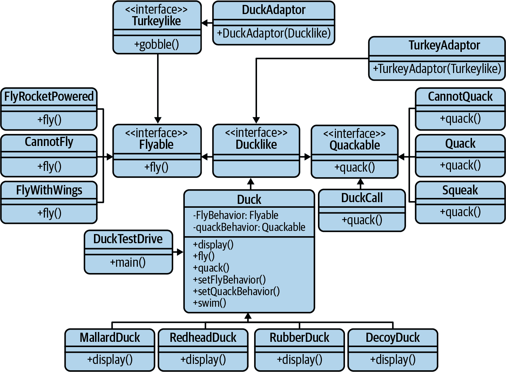

# 第二章。为什么 Go 主导了云原生世界

> 任何愚蠢的人都可以让事物变得更大、更复杂和更暴力。反其道而行之需要一些天才的触觉——以及大量的勇气。¹
> 
> E.F. 舒马赫，《小即美》（1973 年 8 月）

# Go 语言背后的动机

Go 的理念始于 2007 年 9 月的谷歌，这不可避免地是将一群聪明人聚在一起并且让他们感到沮丧的结果。

有关人士是罗伯特·格里塞默、罗布·派克和肯·汤普森；他们三人因各自在设计其他语言方面的工作而广受赞誉。他们集体关注的焦点是当时可用的整套编程语言，他们发现这些语言并不适合描述谷歌正在构建的分布式、可扩展和弹性服务的任务。²

本质上，当今普通的编程语言是在多处理器尚未普及、网络尚未如此普及的时代开发的。它们对多核处理和网络的支持——现代“云原生”服务的基本构建模块³——通常受到限制或需要非同寻常的努力来利用。简单来说，编程语言没有跟上现代软件开发的需求。

# 面向云原生世界的特性

他们的挫折很多，但所有这些挫折归结为一件事：他们正在使用的语言的不必要复杂性使得构建服务器软件变得更加困难。这些问题包括但不限于：⁴

程序的可理解性低

代码变得难以阅读。不必要的簿记和重复由功能重叠的特性加剧，这些特性往往鼓励聪明而不是清晰。

构建速度慢

语言的构建和多年的功能膨胀导致构建时间长达数分钟甚至数小时，即使在大型构建集群上也是如此。

效率低下

许多程序员对上述问题的反应是采用更灵活、动态的语言，有效地以表达能力换取效率和类型安全性。

更新成本高昂

甚至是语言的次要版本之间的不兼容性，以及它可能有的任何依赖项（及其传递依赖项！），经常使得更新成为一种令人沮丧的练习。

多年来，已经提出了多种——通常相当巧妙的——解决方案来解决这些问题，通常在过程中引入了额外的复杂性。显然，这些问题不能仅通过新的 API 或语言特性来解决。因此，Go 的设计师们设想了一种现代化的语言，这是第一种为云原生时代而构建的语言，支持现代网络化和多核计算，既富有表现力又易于理解，让用户能够专注于解决问题，而不是苦于语言的限制。

Go 语言的结果，与其具有的特性一样显著，还因其明确*不具备*的一些特性（和非特性）而闻名。这些特性（和非特性）及其背后的动机在以下章节中讨论。

## 组合和结构化类型

自 20 世纪 60 年代以来，基于“对象”和各种“类型”拥有各种属性的面向对象编程就已存在，但真正流行起来是在 20 世纪 90 年代初至中期，随着 Java 的发布和向 C++添加面向对象特性。从那时起，它已经成为主导的编程范式，甚至今天仍然如此。

面向对象编程的吸引力是令人着迷的，其背后的理论甚至具有某种直观上的意义。数据和行为可以与事物的*类型*相关联，这些可以被*子类型*继承。这些类型的*实例*可以被概念化为具有属性和行为的有形对象——是一个更大系统建模具体的、现实世界的概念的组成部分。

然而，在实践中，使用继承的面向对象编程通常要求认真考虑类型之间的关系并精心设计，并且必须忠实遵循特定的设计模式和实践。因此，正如在图 2-1 中所示，面向对象编程的趋势是将重点从开发算法转向开发和维护分类学和本体论。



###### 图 2-1。随着时间的推移，面向对象编程趋向于分类学

Go 语言并非不具备允许多态行为和代码重用的面向对象特性。它也有一种类似类型的概念，即*structs*，这些可以具有属性和行为。它所拒绝的是继承以及伴随其而来的复杂关系，而是选择通过*embedding*较简单的类型在其中来组装更复杂的类型：这种方法被称为*composition*。

具体而言，继承围绕着在类之间扩展“is a”的关系（即，汽车“是一个”机动车），而组合允许使用“has a”关系构建类型，以定义它们可以做什么（即，汽车“有一个”发动机）。在实践中，这允许更大的设计灵活性，同时允许创建的业务域不太容易受到“家庭成员”特异性的干扰。

类似地，虽然 Go 使用接口来描述行为契约，但它没有“is a”概念，因此等价性是通过检查类型的定义而不是其血统来确定的。例如，给定一个定义了`Area`方法的`Shape`接口，任何具有`Area`方法的类型将隐式满足`Shape`接口，而无需显式声明自己为`Shape`：

```go
type Shape interface {                  // Any Shape must have an Area
    Area() float64
}

type Rectangle struct {                 // Rectangle doesn't explicitly
    width, height float64               // declare itself to be a Shape
}

func (Rectangle r) Area() float64 {     // Rectangle has an Area method; it
    return r.width * r.height           // satisfies the Shape interface
}
```

这种*结构化类型*机制，在编译时被描述为*鸭子类型*⁵，大大减少了繁琐的分类体系的维护，这些分类体系使得像 Java 和 C++这样的更传统的面向对象语言负担过重，从而解放程序员专注于数据结构和算法。

## 可理解性

像 C++和 Java 这样的服务语言经常因笨拙、难以使用和冗长而受到批评。它们需要大量重复和仔细的账务记录，使得项目不得不背负冗余的样板代码，这些代码会妨碍程序员专注于解决问题以外的事务，并在所有结果复杂性的重压下限制项目的可扩展性。

Go 是为大型项目和众多贡献者设计的。其简约的设计（只有 25 个关键字和 1 种循环类型）以及其编译器的强烈观点，强烈倾向于清晰而非巧妙。⁶ 这反过来鼓励简单和高效率，而非混乱和复杂性。由此产生的代码相对容易消化、审查和维护，并且减少了“陷阱”。

## CSP 风格的并发

大多数主流语言提供了一些运行多个进程并发的方式，允许程序由独立执行的进程组成。正确使用并发可以非常有用，但它也引入了许多挑战，特别是关于事件排序、进程间通信和对共享资源访问的协调。

传统上，程序员通常通过允许进程共享一些内存来解决这些挑战，然后在此基础上用锁或互斥体包装以限制一次只能访问一个进程。但即使实施良好，这种策略也可能产生大量繁琐的账务开销。忘记锁定或解锁共享内存的可能性也很高，可能会引入竞态条件、死锁或并发修改。这类错误非常难以调试。

另一方面，Go 语言更倾向于基于一个称为“通信顺序进程（CSP）”的正式语言的策略，这个策略首次由托尼·霍尔在同名的影响力论文中描述⁷，该论文描述了通过通道进行消息传递来表达并发系统中的交互模式。

Go 通过像`goroutines`和`channels`这样的语言原语实现的并发模型，使得 Go 能够优雅地构建并发软件，而不完全依赖于锁定。它鼓励开发者限制共享内存，而是允许进程完全通过传递消息来互动。这个理念通常由 Go 的谚语总结：

> 不要通过共享内存进行通信。相反，通过通信来共享内存。
> 
> Go 谚语

## 快速构建

Go 语言的主要动机之一是当时某些语言的令人发狂的长构建时间，（10）即使在 Google 的大型编译集群上，也常常需要数分钟甚至数小时才能完成。这大大消耗了开发时间，削弱了开发者的生产力。鉴于 Go 的主要目的是增强而非阻碍开发者的生产力，长时间的构建过程必须消失。

本书范围之外，Go 编译器的具体细节（以及我的专业知识之外）。然而，简而言之，Go 语言的设计旨在提供一个自由于复杂关系的软件构建模型，极大简化了依赖分析，并消除了 C 风格的包含文件和库以及伴随其而来的开销。因此，即使在相对较低性能的硬件上，如 MacBook Pro，使用 2.4 GHz 8 核 Intel i9 处理器和 32 GB RAM，在 Kubernetes v1.20.2 上构建所有 180 万行 Go 代码也只需约 45 秒真实时间：（11）

```go
mtitmus:~/workspace/kubernetes[MASTER]$ time make

real    0m45.309s
user    1m39.609s
sys     0m43.559s
```

当然，这并非没有妥协。对 Go 语言的任何建议性改动都在一定程度上考虑其对构建时间的可能影响；一些原本有前途的提案因增加构建时间而被拒绝。

## 语言稳定性

Go 1 于 2012 年 3 月发布，定义了语言规范和一组核心 API 的规范。这自然导致了 Go 设计团队对 Go 1 用户的明确承诺，即使用 Go 1 编写的程序将在整个 Go 1 规范的生命周期内继续编译和正确运行，无需修改。也就是说，今天能工作的 Go 程序可以预期在未来的“点”版本（如 Go 1.1、Go 1.2 等）中仍然能够工作。（12）

这与许多其他语言形成鲜明对比，后者有时会热情地添加新功能，逐渐增加语言和其中任何写入的复杂性，最终导致一度优雅的语言变成一个庞大的功能景观，往往难以掌握。（13）

Go 团队认为这种卓越的语言稳定性是 Go 的重要特性；它使用户能够信任 Go 并在其基础上构建。它允许库被轻松消费和构建，并显著降低了更新成本，尤其是对于大型项目和组织而言。重要的是，它还允许 Go 社区使用 Go 并从中学习；花时间用这种语言写作，而不是写这种语言。

这并不意味着 Go 不会发展壮大：API 和核心语言肯定*可以*获取新的包和功能¹⁴，而且确实有许多关于此的提案¹⁵，但不会以破坏现有 Go 1 代码的方式。

话虽如此，很可能¹⁶实际上*永远*不会有 Go 2。更有可能的是，Go 1 将持续无限期兼容；并且在引入破坏性变更的不太可能事件中，Go 将提供一个转换实用程序，就像在转向 Go 1 时使用的 `go fix` 命令一样。

## 内存安全

Go 的设计者们非常努力地确保这门语言不受直接内存访问带来的各种错误和安全漏洞（更不用说繁琐的簿记了）。指针是严格类型化的，并且总是初始化为某个值（即使该值是 `nil`），指针算术明确禁止。内置的引用类型如映射和通道，内部表示为指向可变结构的指针，由 `make` 函数初始化。简而言之，Go 既不需要也不允许像 C 和 C++ 那样的手动内存管理和操作，这些对于复杂性和内存安全的后果不可低估。

对于程序员来说，Go 是一种具有垃圾收集功能的语言，这消除了需要为每个分配的字节仔细跟踪和释放内存的需求，减轻了程序员的很大负担。没有 `malloc` 的生活是自由的。

更重要的是，通过消除手动内存管理和操作——甚至是指针算术——Go 的设计者们使其有效地免疫了一整类内存错误和它们可能引入的安全漏洞。没有内存泄漏，没有缓冲区溢出，没有地址空间布局随机化。什么都没有。

当然，这种简单和开发便利性是有一些折衷的，虽然 Go 的垃圾收集器非常复杂，但也带来了一些开销。因此，Go 在纯粹的原始执行速度上无法与 C++ 和 Rust 等语言竞争。尽管如此，正如我们在下一节看到的，Go 在这个领域仍然表现出色。

## 性能

面对像 C++ 和 Java 这样静态类型的编译语言的缓慢构建和繁琐的簿记，许多程序员转向更动态、更流畅的语言，如 Python。虽然这些语言在许多方面表现出色，但相对于 Go、C++ 和 Java 等编译语言来说，它们的效率也很低。

这在 表 2-1 的基准测试中已经很明显。当然，总体而言，基准测试应该带着一颗谨慎的心看待，但有些结果确实非常引人注目。

表 2-1\. 常见服务语言的相对基准（秒）^(a)

|  | C++ | Go | Java | NodeJS | Python3 | Ruby | Rust |
| --- | --- | --- | --- | --- | --- | --- | --- |
| **Fannkuch-Redux** | `8.08` | `8.28` | `11.00` | `11.89` | `367.49` | `1255.50` | `7.28` |
| **FASTA** | `0.78` | `1.20` | `1.20` | `2.02` | `39.10` | `31.29` | `0.74` |
| **K-核苷酸** | `1.95` | `8.29` | `5.00` | `15.48` | `46.37` | `72.19` | `2.76` |
| **曼德布罗特集** | `0.84` | `3.75` | `4.11` | `4.03` | `172.58` | `259.25` | `0.93` |
| **N-体问题** | `4.09` | `6.38` | `6.75` | `8.36` | `586.17` | `253.50` | `3.31` |
| **谱范数** | `0.72` | `1.43` | `4.09` | `1.84` | `118.40` | `113.92` | `0.71` |
| ^(a) 戈伊，艾萨克。计算机语言基准测试游戏。2021 年 1 月 18 日。[*https://oreil.ly/bQFjc*](https://oreil.ly/bQFjc)。 |

在检查过程中，似乎可以将结果分为三类，分别对应生成它们所使用的语言类型：

+   编译型、严格类型检查且手动内存管理（C++、Rust）

+   编译型、严格类型检查且具有垃圾回收（Go、Java）

+   解释型、动态类型语言（Python、Ruby）

这些结果表明，尽管带有垃圾回收的语言通常比手动内存管理的语言稍慢，但这些差异似乎不足以在除了最苛刻的需求之外造成影响。

然而，解释型和编译型语言之间的差异是显著的。至少在这些例子中，Python，这种典型的动态语言，基准测试速度约为*编译型语言的十到一百倍慢*。当然，可以争论说这对许多——如果不是大多数——用途来说仍然完全足够，但对于云原生应用程序来说则不是这样，这些应用程序经常需要在不依赖潜在昂贵的升级的情况下忍受需求的显著波动。

## 静态链接

默认情况下，Go 程序直接编译成本地、静态链接的可执行二进制文件，其中包括所有必需的 Go 库和 Go 运行时。这会产生稍大一些的文件（大约对于一个“hello world”来说是 2MB 左右），但生成的二进制文件没有外部语言运行时需要安装，¹⁷ 或者外部库依赖需要升级或冲突，¹⁸ 可以轻松地分发给用户或部署到主机，而不用担心依赖性或环境冲突。

当你在使用容器时，这种能力特别有用。因为 Go 二进制文件不需要外部语言运行时甚至不需要分发，它们可以被构建成“空白”镜像，这些镜像没有父镜像。结果是一个非常小（仅几兆字节）的镜像，具有最小的部署延迟和数据传输开销。这些特点在像 Kubernetes 这样的编排系统中非常有用，这些系统可能需要定期获取镜像。

## 静态类型

在 Go 设计的早期阶段，其作者们不得不做出选择：是否要像 C++或 Java 那样*静态类型*，需要在使用之前明确定义变量，或者像 Python 那样*动态类型*，允许程序员在不定义变量的情况下为其赋值，因此编码速度通常更快？这并不是一个特别困难的决定；也没花多少时间。静态类型显然是明智的选择，但并不是任意的或基于个人偏好。¹⁹

首先，静态类型语言的类型正确性可以在编译时评估，使其更加高效（见表 2-1）。

Go 的设计者们明白，开发中花费的时间仅仅是项目总生命周期的一小部分，而在动态类型语言中提高编码速度的任何收益都被调试和维护这类代码的难度所弥补。毕竟，有哪个 Python 程序员没有因为试图将字符串用作整数而使其代码崩溃？

举例来说，看看以下 Python 代码片段：

```go
my_variable = 0

while my_variable < 10:
    my_varaible = my_variable + 1   # Typo! Infinite loop!
```

看到了吗？如果你还没看到，请继续尝试。这可能需要一秒钟。

任何程序员都可能犯这种微妙的拼写错误，这种错误恰好也能生成完全有效的可执行 Python 代码。这只是 Go 将在编译时捕获的整个错误类别中的两个微不足道的示例，而不是（天啊）在生产中，通常更接近引入它们的位置。毕竟，众所周知，在开发周期的早期捕获错误，修复起来更容易（更便宜）。

最后，我甚至会断言一些有些争议的事情：类型语言更易读。Python 通常被誉为尤其易读，因其宽容的特性和略带英语风格的语法，²⁰但如果给你看到以下 Python 函数签名，你会怎么做呢？

```go
def send(message, recipient):
```

`message`是一个字符串吗？`recipient`是在其他地方描述的某个类的实例吗？是的，这可以通过一些文档和一些合理的默认值来改进，但我们中的许多人都必须维护足够的代码，以知道这是一个相当遥远的愿望。显式定义的类型可以通过自动跟踪信息来引导开发，并减轻编写代码的心理负担，否则程序员将不得不通过为程序员和所有必须维护其代码的人提供文档来手动跟踪。

# 总结

如果第一章专注于什么使得*系统*云原生，那么这一章可以说是专注于什么使得*语言*，特别是 Go，成为构建云原生服务的良好选择。

然而，尽管云原生系统需要具备可伸缩性、松耦合性、弹性、可管理性和可观察性，一个面向云原生时代的语言必须能够做到不仅仅是构建具备这些特性的系统。毕竟，几乎任何语言在技术上都可以被用来构建这样的系统。那么是什么使得 Go 如此特别呢？

可以说，本章介绍的所有特性直接或间接地促进了前一章关于云原生特性的讨论。例如，并发性和内存安全性可以说有助于服务的可伸缩性，结构化类型允许松耦合，等等。但虽然 Go 是我所知道的唯一一个将所有这些特性集于一身的主流语言，它们是否真的那么新颖呢？

可能 Go 最引人注目的特性之一是其内置而非外挂的并发功能，这使得程序员能够更充分、更安全地利用现代网络和多核硬件。当然，Goroutines 和 channels 非常奇妙，使得构建具有弹性、高并发网络服务变得更加容易，但从技术上讲，如果考虑到像 Clojure 或 Crystal 这样不那么常见的语言，它们并非独一无二。

我认为 Go 真正优秀的地方在于其忠实地坚持清晰胜于聪明的原则，这一理念源于对于源代码是由人类为其他人类编写的的理解。²¹ 它能编译成机器码几乎是无关紧要。

Go 的设计是为了支持人们实际上的工作方式：团队协作，有时团队成员会变动，并且这些成员还可能同时从事其他工作。在这种环境下，代码的清晰度、“部落知识”的最小化以及快速迭代的能力是至关重要的。Go 的简洁性经常被误解和未被重视，但它使得程序员可以专注于解决问题，而不是与语言斗争。

在第三章中，我们将详细回顾 Go 语言的许多具体特性，从而近距离地看到这种简单性。

¹ Schumacher, E.F. “Small Is Beautiful.” *The Radical Humanist*, 1973 年 8 月, p. 22.

² 在“云原生”这个术语被创造出来之前，这些已经是“云原生”服务了。

³ 当然，在当时它们并不被称为“云原生”，对于 Google 而言它们只是“服务”。

⁴ Pike, Rob. “Google 内部的 Go 语言设计与软件工程.” Google, Inc., 2012\. [*https://oreil.ly/6V9T1*](https://oreil.ly/6V9T1).

⁵ 在使用鸭子类型的语言中，对象的类型不如其定义的方法重要。换句话说，“如果它像鸭子一样走路和嘎嘎叫，那么它一定是鸭子。”

⁶ Cheney, Dave. “清晰胜于巧妙。” *The Acme of Foolishness*, 2019 年 7 月 19 日。[*https://oreil.ly/vJs0X*](https://oreil.ly/vJs0X).

⁷ Hoare, C.A.R. “通信顺序进程。” *Communications of the ACM*, vol. 21, no. 8, 1978 年 8 月, pp. 666–77。[*https://oreil.ly/CHiLt*](https://oreil.ly/CHiLt).

⁸ 至少在“主流”语言中，无论这是什么意思。

⁹ Gerrand, Andrew. “并发不等于并行。” *Go Blog*, 2016 年 1 月 16 日。[*https://oreil.ly/WXf4g*](https://oreil.ly/WXf4g).

¹⁰ C++。我们在讨论 C++。

¹¹ 不包括注释；Openhub.net. “Kubernetes.” *Open Hub*, Black Duck Software, Inc., 2021 年 1 月 18 日。[*https://oreil.ly/y5Rty*](https://oreil.ly/y5Rty).

¹² Go Team. “Go 1 及 Go 程序的未来。” *Go Documentation*. [*https://oreil.ly/Mqn0I*](https://oreil.ly/Mqn0I).

¹³ 还记得 Java 1.1 吗？我记得 Java 1.1。当时虽然没有泛型、自动装箱或增强的`for`循环，但我们很开心。是的，我告诉你，很开心。

¹⁴ 我支持泛型团队。加油，参数化多态！

¹⁵ Go Team. “Go 提议变更。” *GitHub*, 2019 年 8 月 7 日。[*https://oreil.ly/folYF*](https://oreil.ly/folYF).

¹⁶ Pike, Rob. “悉尼 Golang Meetup—Rob Pike—Go 2 草案规范”（视频）。 *YouTube*, 2018 年 11 月 13 日。[*https://oreil.ly/YmMAd*](https://oreil.ly/YmMAd).

¹⁷ 没法和 Java 比。

¹⁸ 没法和 Python 比。

¹⁹ 在编程中，很少有像静态与动态类型、或者伟大的制表符与空格辩论一样引发讽刺评论的争论，对于这些，Go 的非官方立场是“闭嘴，谁在乎？”

²⁰ 我也因宽容的天性和有些像英语的语法而受到赞扬。

²¹ 或者在同一个人几个月思考其他事情后。
