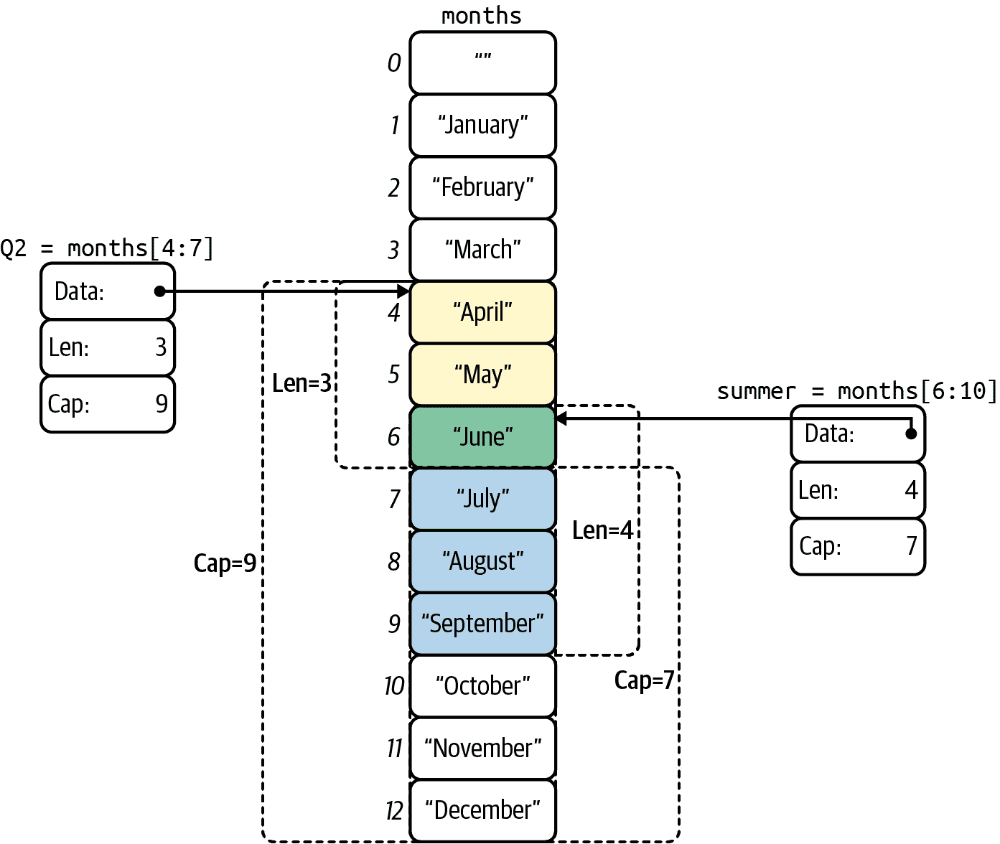
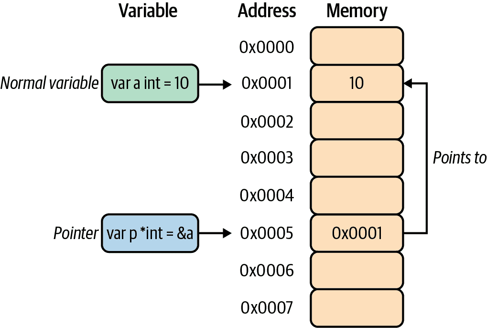

# 第三章。Go 语言基础

> 一种不影响编程思维方式的语言是不值得学习的。¹
> 
> Alan Perlis，ACM SIGPLAN Notices（1982 年 9 月）

没有一本编程书籍会完整，而不至少简短地回顾其所选择的语言，所以我们在这里！

本章与更初级的书籍略有不同，我们假设您至少熟悉常见的编码范例，但可能对 Go 语法的一些细节有些生疏。因此，本章将侧重于 Go 语言的微妙之处，以及其基础知识。如需更深入地了解后者，我建议阅读 [*Go 语言编程*](https://oreil.ly/9Ht4R)（Caleb Doxsey 著，O'Reilly 出版社）或 *Go 程序设计语言*（Alan A. A. Donovan 和 Brian W. Kernighan 著，Addison-Wesley Professional 出版社）。

如果您对该语言相对陌生，您肯定会希望继续阅读。即使您对 Go 语言有些了解，您可能也想浏览本章内容：这里会有一两个宝藏。如果您是该语言的老手，可以直接进入下一章（或以讽刺的方式阅读并评判我）。

# 基本数据类型

Go 的基本数据类型是更复杂类型的基础构件，可以分为三个子类别：

+   布尔类型仅包含一位信息 — `true` 或 `false` — 表示某种逻辑结论或状态。

+   表示简单浮点和有符号/无符号整数或复数的数值类型。

+   代表不可变的 Unicode 代码点序列的字符串。

## 布尔值

布尔数据类型代表两个逻辑真值，以某种形式存在²于每一种编程语言中。它由 `bool` 类型表示，是一种特殊的 1 位整数类型，具有两个可能的值：

+   `true`

+   `false`

Go 支持所有典型的逻辑操作：

```go
and := true && false
fmt.Println(and)        // "false"

or := true || false
fmt.Println(or)         // "true"

not := !true
fmt.Println(not)        // "false"
```

###### 注意

有趣的是，Go 语言不包含逻辑异或运算符。但是，存在 `^` 运算符，但它仅用于按位异或操作。

## 简单数值

Go 具有一小部分系统命名的、浮点、有符号和无符号整数：

有符号整数

`int8`，`int16`，`int32`，`int64`

无符号整数

`uint8`，`uint16`，`uint32`，`uint64`

浮点数

`float32`，`float64`

系统化命名很好，但代码是由人类用软软的人类大脑编写的，因此 Go 设计者提供了两个可爱的便利。

首先，有两种“机器相关”类型，简称为 `int` 和 `uint`，其大小根据可用硬件确定。如果您的数字的特定大小并不重要，这些类型非常方便。遗憾的是，并没有机器相关的浮点数类型。

其次，有两种整数类型具有助记别名：`byte`，是 `uint8` 的别名；`rune`，是 `uint32` 的别名。

###### 提示

对于大多数用途，通常只需使用`int`和`float64`就足够了。

## 复数

Go 提供两种大小的*复数*，如果你感觉有点富有想象力：³ `complex64` 和 `complex128`。这些可以通过浮点数后紧接着的`i`来表示为*虚数字面量*：

```go
var x complex64 = 3.1415i
fmt.Println(x)                  // "(0+3.1415i)"
```

复数非常有趣，但实际上并不经常使用，所以我在这里不会深入讨论它们。如果你像我希望的那样着迷于它们，《Go 编程语言》（Donovan 和 Kernighan）为它们提供了应有的全面解释。

## 字符串

*字符串*代表 Unicode 代码点序列。Go 中的字符串是不可变的：一旦创建，就无法更改字符串的内容。

Go 支持两种风格的字符串字面量，双引号风格（或解释字面量）和反引号风格（或原始字符串字面量）。例如，以下两个字符串字面量是等效的：

```go
// The interpreted form
"Hello\nworld!\n"

// The raw form
`Hello
world!`
```

在这个解释字符串字面量中，每个`\n`字符对将被转义为一个换行符字符，每个`\"`字符对将被转义为一个双引号字符。

在幕后，字符串实际上只是围绕 UTF-8 编码的`byte`值切片的包装器，因此可以对切片和数组应用的任何操作也可以应用于字符串。如果你对切片还不清楚，现在可以阅读到“切片”部分。

# 变量

变量可以通过使用`var`关键字将标识符与某些类型值配对，并且可以随时更新，其一般形式为：

```go
var name type = expression
```

然而，变量声明有相当大的灵活性：

+   带初始化：`var foo int = 42`

+   多个变量的情况：`var foo, bar int = 42, 1302`

+   带类型推断：`var foo = 42`

+   混合多种类型的变量：`var b, f, s = true, 2.3, "four"`

+   未初始化（参见“零值”）：`var s string`

###### 注意

Go 对于杂乱的事物非常有主张：它*讨厌*它们。如果在函数中声明了一个变量但没有使用它，你的程序将拒绝编译。

## 短变量声明

Go 提供了一些语法糖，允许在函数内部使用`:=`操作符同时声明和赋值变量，而不是使用具有隐式类型的`var`声明。

短变量声明的一般形式为：

```go
name := expression
```

这些可以用来声明单个和多个赋值：

+   带初始化：`percent := rand.Float64() * 100.0`

+   一次性多个变量：`x, y := 0, 2`

在实践中，短变量声明是 Go 中声明和初始化变量的最常见方式；`var`通常仅用于需要显式类型的局部变量，或者声明稍后将赋值的变量。

###### 警告

记住`:=`是一个声明，而`=`是一个赋值操作符。如果`:=`操作符仅尝试重新声明已存在的变量，将在编译时失败。

有趣的是（有时会令人困惑），如果短变量声明在其左侧同时包含新变量和现有变量，那么该短变量声明将像对现有变量进行赋值一样。

## 零值

当变量声明时没有明确的值时，它将被分配给其类型的*零值*：

+   整数：`0`

+   浮点数：`0.0`

+   布尔值：`false`

+   字符串：`""`（空字符串）

例如，让我们定义四个不同类型的变量，而不进行显式初始化：

```go
var i int
var f float64
var b bool
var s string
```

现在，如果我们要使用这些变量，我们会发现它们实际上已经初始化为它们的零值：

```go
fmt.Printf("integer: %d\n", i)   // integer: 0
fmt.Printf("float: %f\n", f)     // float: 0.000000
fmt.Printf("boolean: %t\n", b)   // boolean: false
fmt.Printf("string: %q\n", s)    // string: ""
```

您会注意到使用`fmt.Printf`函数，它允许更好地控制输出格式。如果您对这个函数或 Go 语言的格式化字符串不熟悉，请参阅下面的侧边栏。

## 空白标识符

*空白标识符*由`_`（下划线）运算符表示，充当匿名占位符。它可以像声明中的任何其他标识符一样使用，只是它不引入绑定。

它通常被用作在赋值中选择性地忽略不需要的值的一种方式，在支持多返回值且要求没有未使用变量的语言中，这非常有用。例如，如果您想处理`fmt.Printf`返回的任何潜在错误，但不关心它写入的字节数，⁴，您可以执行以下操作：

```go
str := "world"

_, err := fmt.Printf("Hello %s\n", str)
if err != nil {
    // Do something
}
```

空白标识符也可以用于仅因其副作用而导入包：

```go
import _ "github.com/lib/pq"
```

以这种方式导入的包将像正常加载和初始化一样运行，包括触发其`init`函数，但除此之外将被忽略且无需引用或直接使用。

## 常量

常量与变量非常相似，使用`const`关键字将标识符与某个类型化值关联。然而，常量在某些重要方面与变量不同。首先，最明显的是，试图修改一个常量将在编译时生成错误。其次，常量*必须*在声明时赋值：它们没有零值。

`var`和`const`均可在包级和函数级别使用，如下所示：

```go
const language string = "Go"

var favorite bool = true

func main() {
    const text = "Does %s rule? %t!"
    var output = fmt.Sprintf(text, language, favorite)

    fmt.Println(output)   // "Does Go rule? true!"
}
```

为了演示它们行为的相似性，前面的代码片段任意混合了常量和变量的显式类型定义以及类型推断。

最后，选择`fmt.Sprintf`对于本例并不重要，但如果您对 Go 语言的格式化字符串不清楚，可以参考“在 Go 中格式化 I/O”。

# 容器类型：数组、切片和映射

Go 语言有三种一流的容器类型，用于存储元素值的集合：

数组数组

一个固定长度的特定类型的零个或多个元素的序列。

切片

一个围绕可以在运行时调整大小的数组的抽象。

映射

允许将不同键与值“映射”或配对的关联数据结构。

作为容器类型，所有这些都有一个`length`属性，反映存储在该容器中的元素数量。可以使用内置函数`len`来查找任何数组、切片（包括字符串）或映射的长度。

## 数组

在 Go 语言中，与大多数其他主流语言一样，*数组* 是特定类型的零个或多个元素的固定长度序列。

可以通过包含长度声明来声明数组。数组的零值是一个包含指定长度的元素全为零值的数组。单个数组元素从`0`到`N-1`进行索引，并且可以使用熟悉的括号表示法访问：

```go
var a [3]int                    // Zero-value array of type [3]int
fmt.Println(a)                  // "[0 0 0]"
fmt.Println(a[1])               // "0"

a[1] = 42                       // Update second index
fmt.Println(a)                  // "[0 42 0]"
fmt.Println(a[1])               // "42"

i := a[1]
fmt.Println(i)                  // "42"
```

可以使用数组文字初始化数组，如下所示：

```go
b := [3]int{2, 4, 6}
```

您还可以让编译器为您计算数组元素的数量：

```go
b := [...]int{2, 4, 6}
```

在这两种情况下，`b`的类型都是`[3]int`。

与所有容器类型一样，可以使用`len`内置函数来发现数组的长度：

```go
fmt.Println(len(b))             // "3"
fmt.Println(b[len(b)-1])        // "6"
```

实际上，数组并不经常直接使用。相反，更常见的是使用 *切片*，一种行为（在所有实际目的上）类似于可调整大小数组的数组抽象类型。

## 切片

切片是 Go 语言中的一种数据类型，它们在传统数组周围提供了一个强大的抽象，使得与切片的操作看起来和感觉起来非常类似于操作数组。与数组一样，切片通过熟悉的括号表示法提供对特定类型元素序列的访问，索引从`0`到`N-1`。然而，数组是固定长度的，而切片可以在运行时调整大小。

如图 3-1 所示，切片实际上是一个轻量级数据结构，具有三个组件：

+   指向表示切片第一个元素的支持数组中某个元素的指针（不一定是数组的第一个元素）

+   一个长度，表示切片中的元素数量

+   一个容量，表示长度的上限值

如果未另行指定，则容量值等于切片起始位置到支持数组末尾的元素数。内置函数`len`和`cap`分别提供切片的长度和容量。



###### 图 3-1\. 由同一数组支持的两个切片

### 使用切片

创建切片与创建数组有所不同：切片仅根据其元素类型而不是其数量进行类型化。可以使用`make`内置函数创建具有非零长度的切片，如下所示：

```go
n := make([]int, 3)         // Create an int slice with 3 elements

fmt.Println(n)              // "[0 0 0]"
fmt.Println(len(n))         // "3"; len works for slices and arrays

n[0] = 8
n[1] = 16
n[2] = 32

fmt.Println(n)              // "[8 16 32]"
```

正如您所见，使用切片的感觉与使用数组的感觉非常相似。与数组一样，切片的零值是一个包含指定长度的零值元素的切片，切片中的元素像在数组中一样进行索引和访问。

切片文字与数组文字声明方式相同，只是省略了元素计数：

```go
m := []int{1}               // A literal []int declaration
fmt.Println(m)              // "[1]"
```

可以使用`append`内置函数扩展切片，它返回一个包含一个或多个附加到原始切片中的新值的扩展切片：

```go
m = append(m, 2)            // Append 2 to m
fmt.Println(m)              // "[1 2]"
```

`append`内置函数也是*可变参数*的，这意味着它除了要附加的切片之外还可以接受可变数量的参数。可变参数函数将在[“可变参数函数”](https://example.org/section_ch03_variadic_functions)中更详细地介绍：

```go
m = append(m, 2)            // Append to m from the previous snippet
fmt.Println(m)              // "[1 2]"

m = append(m, 3, 4)
fmt.Println(m)              // "[1 2 3 4]"

m = append(m, m...)         // Append m to itself
fmt.Println(m)              // "[1 2 3 4 1 2 3 4]"
```

注意`append`内置函数返回附加的切片，而不是在原地修改切片。其背后的原因是，如果目标具有足够的容量来容纳新元素，则从原始的底层数组构造一个新切片。如果没有，将自动分配一个新的底层数组。

###### 警告

注意`append` *返回* 附加的切片。未存储它是一个常见的错误。

### 切片操作符

数组和切片（包括字符串）支持*切片操作符*，其语法为`s[i:j]`，其中`i`和`j`在范围`0 ≤ i ≤ j ≤ cap(s)`内。

例如：

```go
s0 := []int{0, 1, 2, 3, 4, 5, 6}    // A slice literal
fmt.Println(s0)                     // "[0 1 2 3 4 5 6]"
```

在前面的片段中，我们定义了一个切片字面量。请记住，它与数组字面量非常相似，只是它不指示大小。

如果切片操作符的值`i`或`j`被省略，它们将默认为`0`和`len(s)`，分别：

```go
s1 := s0[:4]
fmt.Println(s1)                     // "[0 1 2 3]"

s2 := s0[3:]
fmt.Println(s2)                     // "[3 4 5 6]"
```

切片操作符将生成一个新的切片，其长度为`j - i`，由相同的数组支持。对此切片的更改将反映在底层数组中，随后反映在所有从同一数组派生的切片中：

```go
s0[3] = 42                          // Change reflected in all 3 slices
fmt.Println(s0)                     // "[0 1 2 42 4 5 6]"
fmt.Println(s1)                     // "[0 1 2 42]"
fmt.Println(s2)                     // "[42 4 5 6]"
```

此效果在[图 3-1](https://example.org/img_ch03_slice)中有更详细的说明。

### 字符串作为切片

关于 Go 如何在幕后实现字符串的主题实际上比你可能期望的要复杂得多，涉及到诸如字节、字符和符文之间的差异；Unicode 与 UTF-8 编码之间的区别；以及字符串与字符串字面量之间的差异。

目前，了解 Go 字符串本质上只是字节的只读切片就足够了，通常（但不是*必须*）包含一系列表示 Unicode 代码点的 UTF-8 序列，称为`符文`。Go 甚至允许您将字符串转换为`byte`或`rune`数组：

```go
s := "foö"          // Unicode: f=0x66 o=0x6F ö=0xC3B6
r := []rune(s)
b := []byte(s)
```

通过这种方式将字符串`s`强制转换，我们能够揭示它作为字节切片或符文切片的身份。我们可以通过使用`fmt.Printf`与`%T`（类型）和`%v`（值）标志（我们在[“在 Go 中格式化 I/O”](https://example.org/sidebar_ch03_printf)中介绍过）来输出结果来说明这一点：

```go
fmt.Printf("%7T %v\n", s, s)    // "string foö"
fmt.Printf("%7T %v\n", r, r)    // "[]int32 [102 111 246]"
fmt.Printf("%7T %v\n", b, b)    // "[]uint8 [102 111 195 182]"
```

注意字符串字面量`foö`的值包含一些字符的混合，其编码可以包含在一个字节中（`f`和`o`，编码分别为`102`和`111`），以及一个无法包含在一个字节中的字符（`ö`，编码为`195 182`）。

###### 注意

请记住，`byte`和`rune`类型是`uint8`和`int32`的助记别名。

每条语句打印传递给它的变量的类型和值。如预期的那样，字符串值`foö`被字面打印。然而，接下来的两行很有趣。`uint8`（字节）切片包含四个字节，这些字节表示字符串的 UTF-8 编码（两个 1 字节码点和一个 2 字节码点）。`int32`（rune）切片包含三个值，表示各个字符的码点。

关于 Go 中的字符串编码还有很多内容，但我们的空间有限。如果你有兴趣了解更多，请看 Rob Pike 的《Go 博客》中的“Go 中的字符串、字节、符文和字符”深入研究这个主题。

## 地图

Go 的*map*数据类型引用了*哈希表*：这是一种非常有用的关联数据结构，允许将不同的键任意地“映射”到值作为键值对。这种数据结构在当今主流的语言中很常见：如果你从这些语言中的一个转到 Go，则可能已经使用过它们，也许是 Python 的`dict`，Ruby 的`Hash`，或 Java 的`HashMap`的形式。

Go 中的地图类型写作`map[K]V`，其中`K`和`V`分别是其键和值的类型。任何可以使用`==`运算符进行比较的类型都可以用作键，并且`K`和`V`不需要是相同的类型。例如，可以将`string`键映射到`float32`值。

可以使用内置的`make`函数初始化地图，并且可以使用通常的`name[key]`语法引用其值。我们的老朋友`len`将返回地图中键/值对的数量；`delete`内置函数可以删除键/值对：

```go
freezing := make(map[string]float32)    // Empty map of string to float32

freezing["celsius"] = 0.0
freezing["fahrenheit"] = 32.0
freezing["kelvin"] = 273.2

fmt.Println(freezing["kelvin"])         // "273.2"
fmt.Println(len(freezing))              // "3"

delete(freezing, "kelvin")              // Delete "kelvin"
fmt.Println(len(freezing))              // "2"
```

地图也可以用*映射文字*来初始化和填充：

```go
freezing := map[string]float32{
    "celsius":    0.0,
    "fahrenheit": 32.0,
    "kelvin":     273.2,                // The trailing comma is required!
}
```

注意最后一行的尾随逗号。这不是可选的：如果缺少它，代码将拒绝编译。

### 地图成员测试

请求地图中不存在的键的值不会导致抛出异常（在 Go 中不存在异常），也不会返回某种`null`值。相反，它返回地图值类型的零值：

```go
foo := freezing["no-such-key"]          // Get non-existent key
fmt.Println(foo)                        // "0" (float32 zero value)
```

这可以是一个非常有用的功能，因为在处理地图时可以减少很多样板成员测试，但当你的地图实际上包含零值时，可能会有些棘手。幸运的是，访问地图也可以返回第二个可选的`bool`，指示键是否存在于地图中：

```go
newton, ok := freezing["newton"]        // What about the Newton scale?
fmt.Println(newton)                     // "0"
fmt.Println(ok)                         // "false"
```

在这个片段中，`newton`的值是`0.0`。但那真的是正确的值吗，⁵，还是只是没有匹配的键？幸运的是，由于`ok`也是`false`，我们知道是后者。

# 指针

好的。指针。全世界的本科生的梦魇和毁灭。如果你来自一个动态类型语言，指针的概念可能对你来说很陌生。虽然我们不会对这个主题深入探讨*过度*，但我们会尽力详细介绍，以便在这个主题上提供一些清晰度。

回到第一原则，"变量" 是内存中包含某个值的存储空间。通常，当你通过其名称引用变量（`foo = 10`）或通过表达式引用变量时（`s[i] = "foo"`），你直接读取或更新变量的值。

*指针* 存储变量的*地址*：存储值的内存位置。每个变量都有一个地址，使用指针允许我们间接读取或更新它们的变量的值（如 图 3-2 所示）：

检索变量的地址

可以通过使用 `&` 操作符来检索命名变量的地址。例如，表达式 `p := &a` 将获取 `a` 的地址并将其赋给 `p`。

指针类型

变量 `p`，你可以说它“指向” `a`，其类型为 `*int`，其中 `*` 表示它是一个指向 `int` 的指针类型。

解引用指针

要从 `p` 检索变量 `a` 的值，您可以使用在指针变量名称前加 `*` 的方法进行解引用，从而间接读取或更新 `a`。



###### 图 3-2\. 表达式 `p := &a` 获取 `a` 的地址并将其赋给 `p`

现在，将所有内容放在一起，看看以下内容：

```go
var a int = 10

var p *int = &a         // p of type *int points to a
fmt.Println(p)          // "0x0001"
fmt.Println(*p)         // "10"

*p = 20                 // indirectly update a
fmt.Println(a)          // "20"
```

指针可以像任何其他变量一样声明，如果没有明确初始化，则零值为 `nil`。它们也是可比较的，只有当它们包含相同地址（即它们指向相同变量）或者它们都是 `nil` 时才相等：

```go
var n *int
var x, y int

fmt.Println(n)              // "<nil>"
fmt.Println(n == nil)       // "true" (n is nil)

fmt.Println(x == y)         // "true" (x and y are both zero)
fmt.Println(&x == &x)       // "true" (*x is equal to itself)
fmt.Println(&x == &y)       // "false" (different vars)
fmt.Println(&x == nil)      // "false" (*x is not nil)
```

因为 `n` 从未初始化，其值为 `nil`，与 `nil` 比较返回 `true`。整数 `x` 和 `y` 均具有值 `0`，因此比较它们的值返回 `true`，但它们仍然是不同的变量，比较它们的指针仍然评估为 `false`。

# 控制结构

从另一种语言转到 Go 的任何程序员通常会发现其控制结构套件基本上是熟悉的，甚至对于那些受 C 语言强烈影响的人来说，在其实现和用法上有一些相当重要的偏差，这可能一开始看起来有些奇怪。

例如，控制结构语句不需要很多括号。好的。少一点混乱。没问题。

也只有一种循环类型。没有 `while`；只有 `for`。真的！尽管如此，它实际上非常酷。继续阅读，你就会明白我是什么意思。

## 有趣的 for

`for` 语句是 Go 的唯一循环构造，虽然没有显式的 `while` 循环，但 Go 的 `for` 可以提供所有其功能，有效地统一了您已习惯的所有入口控制循环类型。

Go 没有 `do-while` 的等价物。

### 通用的 for 语句

Go 语言中`for`循环的一般形式与其他 C 语言家族几乎完全相同，其中的三个语句——初始化语句、继续条件和后置语句——在传统风格下由分号分隔。在初始化语句中声明的任何变量将仅在`for`语句中作用域内有效：

```go
sum := 0

for i := 0; i < 10; i++ {
    sum += 1
}

fmt.Println(sum)        // "10"
```

在这个例子中，`i`被初始化为 0。在每次迭代结束时，`i`增加 1，如果仍然小于 10，则重复此过程。

###### 注意

与大多数 C 语言家族不同，`for`语句在其条件子句周围不需要括号，但必须使用大括号。

Go 语言中，与传统的 C 风格语言不同，`for`语句的初始化语句和后置语句都是完全可选的。正如下面的代码所示，这使得它更加灵活：

```go
sum, i := 0, 0

for i < 10 {            // Equivalent to: for ; i < 10;
    sum += i
    i++
}

fmt.Println(i, sum)     // "10 45"
```

前面例子中的`for`语句没有初始化或后置语句，只有一个裸条件。这实际上是一个大问题，因为这意味着`for`可以填补传统上由`while`循环占据的角色。

最后，在`for`语句中省略所有三个子句将创建一个无限循环的块，就像传统的`while (true)`一样：

```go
fmt.Println("For ever...")

for {
    fmt.Println("...and ever")
}
```

因为它缺少任何终止条件，所以前面片段中的循环将永远迭代下去。这是故意的。

### 遍历数组和切片

Go 提供了一个有用的关键字`range`，简化了对各种数据类型的循环遍历。

对于数组和切片，可以使用`range`结合`for`语句来获取每个元素的索引和值：

```go
s := []int{2, 4, 8, 16, 32}     // A slice of ints

for i, v := range s {           // range gets each index/value
    fmt.Println(i, "->", v)     // Output index and its value
}
```

在前面的例子中，变量`i`和`v`将在每次迭代中更新，分别包含切片`s`中每个元素的索引和值。因此，输出将类似于以下内容：

```go
0 -> 2
1 -> 4
2 -> 8
3 -> 16
4 -> 32
```

但如果你不需要这两个值呢？毕竟，如果你声明它们，Go 编译器会要求你使用它们。幸运的是，在 Go 的其他地方一样，可以通过使用“下划线运算符”来丢弃不需要的值：

```go
a := []int{0, 2, 4, 6, 8}
sum := 0

for _, v := range a {
    sum += v
}

fmt.Println(sum)    // "20"
```

与上一个例子类似，变量`v`将在每次迭代中更新，分别包含切片`a`中每个元素的值。但是，这次方便地忽略和丢弃了索引值，而 Go 编译器则满足了。

### 遍历映射

`range`关键字也可以与`for`语句一起用于遍历映射，每次迭代返回当前的键和值：

```go
m := map[int]string{
    1: "January",
    2: "February",
    3: "March",
    4: "April",
}

for k, v := range m {
    fmt.Println(k, "->", v)
}
```

注意，Go 的映射不是有序的，因此输出也不会有序：

```go
3 -> March
4 -> April
1 -> January
2 -> February
```

## `if`语句

在 Go 语言中，`if`语句的典型应用与其他 C 风格语言一致，唯一的区别是条件子句周围不需要括号，但必须使用大括号：

```go
if 7 % 2 == 0 {
    fmt.Println("7 is even")
} else {
    fmt.Println("7 is odd")
}
```

###### 注意

与大多数 C 语言家族不同，`if`语句在其条件子句周围不需要括号，但必须使用大括号。

有趣的是，Go 语言允许在`if`语句中的条件子句之前放置一个初始化语句，这是一种特别有用的习惯用法。例如：

```go
if _, err := os.Open("foo.ext"); err != nil {
    fmt.Println(err)
} else {
    fmt.Println("All is fine.")
}
```

注意`err`变量在检查其定义之前是如何被初始化的，这使得它与以下内容有些相似：

```go
_, err := os.Open("foo.go")
if err != nil {
    fmt.Println(err)
} else {
    fmt.Println("All is fine.")
}
```

但是这两个结构并不完全等价：在第一个示例中，`err`的作用域仅限于`if`语句；而在第二个示例中，`err`对整个包含函数可见。

## `switch`语句

与其他语言类似，Go 语言提供了一个`switch`语句，用于更简洁地表达一系列`if-then-else`条件语句。但是，它与传统实现有许多不同之处，使其更加灵活。

对于从 C 家族语言来的人来说，最明显的区别可能是默认情况下在情况之间没有`fallthrough`；可以通过使用`fallthrough`关键字显式添加此行为：

```go
i := 0

switch i % 3 {
case 0:
    fmt.Println("Zero")
    fallthrough
case 1:
    fmt.Println("One")
case 2:
    fmt.Println("Two")
default:
    fmt.Println("Huh?")
}
```

在本例中，`i % 3`的值为`0`，与第一个情况匹配，导致输出单词`Zero`。在 Go 语言中，默认情况下`switch`语句的情况不会贯穿，但存在显式的`fallthrough`语句意味着随后的情况也会执行，并打印`One`。最后，该情况没有`fallthrough`，导致`switch`的解析完成。总之，打印如下内容：

```go
Zero
One
```

Go 语言中的`switch`具有两个有趣的属性。首先，`case`表达式不需要是整数，甚至不必是常量：这些情况将从上到下进行评估，运行第一个其值等于条件表达式的情况。其次，如果`switch`表达式为空，它将被解释为`true`，并将匹配第一个其保护条件评估为`true`的情况。以下示例演示了这两个属性：

```go
hour := time.Now().Hour()

switch {
case hour >= 5 && hour < 9:
    fmt.Println("I'm writing")
case hour >= 9 && hour < 18:
    fmt.Println("I'm working")
default:
    fmt.Println("I'm sleeping")
}
```

`switch`没有条件，因此它与使用`switch true`完全等效。因此，它将匹配第一个条件也评估为`true`的语句。在我的情况下，`hour`为 23，因此输出为“I’m sleeping.”⁶

最后，就像`if`语句一样，语句可以在`switch`的条件表达式之前出现，这种情况下任何定义的值都将作用于`switch`。例如，可以将前面的示例重写如下：

```go
switch hour := time.Now().Hour(); {  // Empty expression means "true"
case hour >= 5 && hour < 9:
    fmt.Println("I'm writing")
case hour >= 9 && hour < 18:
    fmt.Println("I'm working")
default:
    fmt.Println("I'm sleeping")
}
```

注意末尾的分号：这个空表达式意味着`true`，因此该表达式等效于`switch hour := time.Now().Hour(); true`，并匹配第一个`true`条件。

# 错误处理

在 Go 语言中，错误被视为另一个值，由内置的`error`类型表示。这使得错误处理变得简单：符合 Go 语言习惯的函数可能在返回列表中包含一个`error`类型的值，如果不为`nil`，则表示存在错误状态，可以通过主要的执行路径来处理。例如，当`os.Open`函数无法打开文件时会返回一个非`nil`的错误值：

```go
file, err := os.Open("somefile.ext")
if err != nil {
    log.Fatal(err)
    return err
}
```

`error`类型的实际实现非常简单：它只是一个普遍可见的接口，声明了一个单一方法：

```go
type error interface {
    Error() string
}
```

这与许多语言中使用的异常非常不同，后者需要专门的异常捕获和处理系统，可能导致混乱和不直观的流程控制。

## 创建错误

有两种简单的方法来创建错误值，还有一种更复杂的方法。简单的方法是使用`errors.New`或`fmt.Errorf`函数；后者很方便，因为它还提供了字符串格式化功能：

```go
e1 := errors.New("error 42")
e2 := fmt.Errorf("error %d", 42)
```

然而，`error`是一个接口的事实允许你实现自己的错误类型，如果需要的话。例如，一个常见的模式是允许错误嵌套在其他错误中：

```go
type NestedError struct {
    Message string
    Err     error
}

func (e *NestedError) Error() string {
    return fmt.Sprintf("%s\n  contains: %s", e.Message, e.Err.Error())
}
```

关于错误的更多信息，以及在 Go 中进行错误处理的一些良好建议，请查看 Andrew Gerrand 在[*The Go Blog*](https://oreil.ly/YQ6if)上的“错误处理与 Go”。

# 在函数中玩乐趣：可变参数和闭包

Go 中的函数工作方式与其他语言非常相似：它们接收参数，执行一些工作，并（可选地）返回一些内容。

但是 Go 函数的灵活性远超过许多主流语言，并且还可以做许多其他语言无法做到的事情，比如返回或接受多个值，或者用作一级类型或匿名函数。

## 函数

在 Go 中声明函数与大多数其他语言类似：它们有一个名称，一个类型化参数列表，一个可选的返回类型列表和一个函数体。然而，Go 函数声明与其他 C 系列语言有所不同，它使用了专用的`func`关键字；每个参数的类型跟在其名称后面；并且返回类型放在函数定义头的末尾，可以完全省略（没有`void`类型）。

带有返回类型列表的函数必须以`return`语句结尾，除非由于存在无限循环或终端`panic`而导致函数无法到达结尾：

```go
func add(x int, y int) int {
    return x + y
}

func main() {
    sum := add(10, 5)
    fmt.Println(sum)        // "15"
}
```

另外，一点语法糖允许一系列参数或相同类型的返回值的类型只需写一次。例如，下面这些定义的`func foo`是等效的：

```go
func foo(i int, j int, a string, b string) { /* ... */ }
func foo(i, j int, a, b string)            { /* ... */ }
```

### 多返回值

函数可以返回任意数量的值。例如，以下`swap`函数接受两个字符串，并返回两个字符串。多返回值的返回类型列表必须用括号括起来：

```go
func swap(x, y string) (string, string) {
    return y, x
}
```

要从具有多个返回值的函数中接受多个值，可以使用多重赋值：

```go
a, b := swap("foo", "bar")
```

当运行时，变量`a`的值将是“bar”，而`b`将是“foo”。

### 递归

Go 允许*递归*函数调用，即函数调用自身。如果使用正确，递归可以是一个非常强大的工具，可以应用于许多类型的问题。经典例子是计算正整数`n`的阶乘，即所有小于或等于`n`的正整数的乘积：

```go
func factorial(n int) int {
    if n < 1 {
        return 1
    }
    return n * factorial(n-1)
}

func main() {
    fmt.Println(factorial(11))      // "39916800"
}
```

对于任何大于一的整数`n`，`factorial`将以`n - 1`作为参数调用自身。这可能会非常快速增加！

### 推迟执行

Go 语言的`defer`关键字可用于安排在包围函数返回之前执行函数调用，并且通常用于确保释放或清理资源。

例如，要推迟打印文本“cruel world”到函数调用的末尾，我们在其前面立即插入`defer`关键字：

```go
func main() {
    defer fmt.Println("cruel world")

    fmt.Println("goodbye")
}
```

当运行前面的代码片段时，它会产生以下输出，推迟输出最后打印：

```go
goodbye
cruel world
```

举一个不那么琐碎的例子，我们将创建一个空文件并尝试向其写入。提供了一个`closeFile`函数，在完成后关闭文件。但是，如果我们简单地在`main`的末尾调用它，可能会出现错误，导致`closeFile`永远不会被调用，文件仍处于打开状态。因此，我们使用`defer`确保在函数返回之前调用`closeFile`函数，无论它如何返回：

```go
func main() {
    file, err := os.Create("/tmp/foo.txt")  // Create an empty file
    defer closeFile(file)                   // Ensure closeFile(file) is called
    if err != nil {
        return
    }

    _, err = fmt.Fprintln(file, "Your mother was a hamster")
    if err != nil {
        return
    }

    fmt.Println("File written to successfully")
}

func closeFile(f *os.File) {
    if err := f.Close(); err != nil {
        fmt.Println("Error closing file:", err.Error())
    } else {
        fmt.Println("File closed successfully")
    }
}
```

运行此代码时，您应该获得以下输出：

```go
File written to successfully
File closed successfully
```

如果在函数中使用多个`defer`调用，每个都会被推送到堆栈上。当包围函数返回时，推迟的调用按照后进先出的顺序执行。例如：

```go
func main() {
    defer fmt.Println("world")
    defer fmt.Println("cruel")
    defer fmt.Println("goodbye")
}
```

运行此函数时，将输出以下内容：

```go
goodbye
cruel
world
```

推迟执行是确保资源清理的非常有用的功能。如果您正在处理外部资源，您会希望大量使用它们。

### 指针作为参数

指针的许多功能在与函数结合时变得显而易见。通常，函数参数是*按值传递*的：当调用函数时，它接收每个参数的副本，函数对副本的更改不会影响调用者。但是，指针包含对值的*引用*，而不是值本身，接收函数可以间接地修改传递给函数的值，从而可能影响函数调用者。

下面的函数演示了这两种情况：

```go
func main() {
    x := 5

    zeroByValue(x)
    fmt.Println(x)              // "5"

    zeroByReference(&x)
    fmt.Println(x)              // "0"
}

func zeroByValue(x int) {
    x = 0
}

func zeroByReference(x *int) {
    *x = 0                      // Dereference x and set it to 0
}
```

这种行为并不局限于指针。实际上，在底层，几种数据类型实际上是对内存位置的引用，包括切片、映射、函数和通道。在函数中对这些*引用类型*进行的更改可能会影响调用者，而无需显式解引用它们：

```go
func update(m map[string]int) {
    m["c"] = 2
}

func main() {
    m := map[string]int{ "a" : 0, "b" : 1}

    fmt.Println(m)                  // "map[a:0 b:1]"

    update(m)

    fmt.Println(m)                  // "map[a:0 b:1 c:2]"
}
```

在此示例中，当将映射`m`传递给`update`函数时，其长度为两个，它添加了一对`{ "c" : 2 }`。因为`m`是一个引用类型，它作为对底层数据结构的引用传递给`update`，因此在`update`函数返回后，`main`中的`m`中会反映出这个插入操作。

## 可变参数函数

*可变参数函数*是可以使用零个或多个尾随参数调用的函数。最熟悉的例子是`fmt.Printf`系列函数的成员，它们接受一个格式说明符字符串和任意数量的附加参数。

这是标准`fmt.Printf`函数的签名：

```go
func Printf(format string, a ...interface{}) (n int, err error)
```

注意它接受一个字符串和零个或多个`interface{}`值。如果你对`interface{}`语法有点生疏，我们将在“接口”中进行复习，但你可以将`interface{}`解释为“某种任意类型的东西”。然而，最有趣的是，最后一个参数包含省略号（`...`）。这是*可变参数运算符*，表示该函数可以接受任意数量的此类型参数。例如，你可以使用格式和两个不同类型的参数调用`fmt.Printf`：

```go
const name, age = "Kim", 22
fmt.Printf("%s is %d years old.\n", name, age)
```

在可变参数函数内部，可变参数参数是参数类型的切片。在下面的例子中，`product`方法的可变参数`factors`是`[]int`类型，可以相应地进行范围遍历：

```go
func product(factors ...int) int {
    p := 1

    for _, n := range factors {
        p *= n
    }

    return p
}

func main() {
    fmt.Println(product(2, 2, 2))   // "8"
}
```

在这个例子中，从`main`调用`product`使用了三个参数（尽管它可以使用任意数量的参数）。在`product`函数中，这些参数被转换为一个`[]int`切片，其值为`{2, 2, 2}`，这些值被迭代相乘以构建最终的返回值`8`。

### 将切片作为可变参数值传递

如果你的值已经是切片形式，但仍想将其传递给可变参数函数怎么办？你需要将其拆分为多个单独的参数吗？当然不需要。

在这种情况下，在调用可变参数函数时，你可以在变量名后面应用可变参数运算符：

```go
m := []int{3, 3, 3}
fmt.Println(product(m...))   // "27"
```

在这里，你有一个类型为`[]int`的变量`m`，你想将其传递给可变参数函数`product`。在调用`product(m...)`时使用可变参数运算符使这成为可能。

## 匿名函数和闭包

在 Go 语言中，函数是*一等公民*，可以像语言中的任何其他实体一样进行操作：它们有类型，可以赋值给变量，并且甚至可以被传递给其他函数并由其返回。

函数类型的零值是`nil`；调用`nil`函数值将导致恐慌：

```go
func sum(x, y int) int     { return x + y }
func product(x, y int) int { return x * y }

func main() {
    var f func(int, int) int    // Function variables have types

    f = sum
    fmt.Println(f(3, 5))        // "8"

    f = product                 // Legal: product has same type as sum
    fmt.Println(f(3, 5))        // "15"
}
```

函数可以在其他函数内部创建为*匿名函数*，可以像任何其他函数一样调用、传递或以其他方式处理。Go 语言的一个特别强大的特性是匿名函数可以访问其父函数的状态，并保留该访问权限*甚至在*父函数执行后。事实上，这就是*闭包*的定义。

###### 提示

*闭包*是一个嵌套函数，可以访问其父函数的变量，即使父函数已执行。

以`incrementor`函数为例。这个函数具有状态，以变量`i`的形式存在，并返回一个在返回值之前递增该值的匿名函数。可以说返回的函数*封闭*了变量`i`，使其成为一个真正的（尽管微不足道的）闭包：

```go
func incrementer() func() int {
    i := 0

    return func() int {    // Return an anonymous function
        i++                // "Closes over" parent function's i
        return i
    }
}
```

当我们调用 `incrementor` 时，它会创建其自己的新的本地值 `i`，并返回一个新的匿名函数，该函数将递增该值。对 `incrementor` 的后续调用将分别接收它们自己的 `i` 的副本。我们可以在以下示例中演示这一点：

```go
func main() {
    increment := incrementer()
    fmt.Println(increment())       // "1"
    fmt.Println(increment())       // "2"
    fmt.Println(increment())       // "3"

    newIncrement := incrementer()
    fmt.Println(newIncrement())    // "1"
}
```

正如你所见，`incrementer` 提供了一个新的函数 `increment`；每次调用 `increment` 时，它的内部计数器都会增加一次。但是当再次调用 `incrementer` 时，它将创建并返回一个全新的函数，带有自己全新的计数器。这两个函数互不影响。

# 结构体、方法和接口

当人们初次接触 Go 语言时，他们可能需要做的最大心理转变之一是，Go 并不是传统的面向对象语言。不完全是。当然，Go 有带方法的类型，看起来有点像对象，但它们没有规定的继承层次结构。相反，Go 允许通过*组合*将组件组装成整体。

例如，更严格的面向对象语言可能会有一个 `Car` 类来扩展一个抽象的 `Vehicle` 类；也许它会实现 `Wheels` 和 `Engine`。理论上这听起来很好，但是这些关系可能会变得复杂而难以管理。

另一方面，Go 的组合方法允许组件被“组合在一起”，而无需定义它们的本体关系。延续前面的例子，Go 可能有一个 `Car` 结构体，其中可以嵌入其各种部件，如 `Wheels` 和 `Engine`。此外，Go 中的方法可以为任何类型的数据定义；它们不再仅限于结构体。

## 结构体

在 Go 中，*struct* 实际上只是作为单个实体聚合的零个或多个字段，其中每个字段都是任意类型的命名值。可以使用以下 `type Name struct` 语法定义结构体。结构体从不是 `nil`：而是结构体的零值是其所有字段的零值：

```go
type Vertex struct {
    X, Y float64
}

func main() {
    var v Vertex            // Structs are never nil
    fmt.Println(v)          // "{0 0}"

    v = Vertex{}            // Explicitly define an empty struct
    fmt.Println(v)          // "{0 0}"

    v = Vertex{1.0, 2.0}    // Defining fields, in order
    fmt.Println(v)          // "{1 2}"

    v = Vertex{Y:2.5}       // Defining specific fields, by label
    fmt.Println(v)          // "{0 2.5}"
}
```

结构体字段可以使用标准点符号来访问：

```go
func main() {
    v := Vertex{X: 1.0, Y: 3.0}
    fmt.Println(v)                  // "{1 3}"

    v.X *= 1.5
    v.Y *= 2.5

    fmt.Println(v)                  // "{1.5 7.5}"
}
```

结构体通常通过引用创建和操作，因此 Go 提供了一些语法糖：可以使用点符号从结构体的指针访问结构体的成员；指针会自动解引用：

```go
func main() {
    var v *Vertex = &Vertex{1, 3}
    fmt.Println(v)                  // &{1 3}

    v.X, v.Y = v.Y, v.X
    fmt.Println(v)                  // &{3 1}
}
```

在这个示例中，`v` 是指向 `Vertex` 的指针，其 `X` 和 `Y` 成员值需要进行交换。如果你必须对指针进行解引用来执行此操作，你将不得不像这样做 `(*v).X, (*v).Y = (*v).Y, (*v).X`，显然这样做很糟糕。而自动指针解引用使你可以这样做 `v.X, v.Y = v.Y, v.X`，这要好得多。

## 方法

在 Go 语言中，*方法* 是附加到类型的函数，包括但不限于结构体。方法的声明语法与函数非常相似，只是在函数名之前加了一个额外的 *接收器参数*，指定方法附加到的类型。当调用方法时，实例可以通过接收器指定的名称访问。

例如，我们先前的 `Vertex` 类型可以通过附加一个 `Square` 方法来扩展，接收器名为 `v`，类型为 `*Vertex`：

```go
func (v *Vertex) Square() {    // Attach method to the *Vertex type
    v.X *= v.X
    v.Y *= v.Y
}

func main() {
    vert := &Vertex{3, 4}
    fmt.Println(vert)          // "&{3 4}"

    vert.Square()
    fmt.Println(vert)          // "&{9 16}"
}
```

###### 警告

接收器是类型特定的：附加到指针类型的方法只能在该类型的指针上调用。

除了结构体之外，还可以声明标准的复合类型，如结构体、切片或映射，并将方法附加到它们上。例如，我们声明了一个新类型，`MyMap`，它只是一个标准的 `map[string]int`，并附加了一个 `Length` 方法：

```go
type MyMap map[string]int

func (m MyMap) Length() int {
    return len(m)
}

func main() {
    mm := MyMap{"A":1, "B": 2}

    fmt.Println(mm)             // "map[A:1 B:2]"
    fmt.Println(mm["A"])        // "1"
    fmt.Println(mm.Length())    // "2"
}
```

结果是一个新类型 `MyMap`，它是（并且可以被用作）字符串到整数的映射 `map[string]int`，但同时具有返回映射长度的 `Length` 方法。

## 接口

在 Go 中，*接口* 只是一组方法签名。与其他具有接口概念的语言一样，它们用于描述其他类型的一般行为，而不与实现细节耦合。因此，接口可以被视为类型可能满足的 *合约*，为强大的抽象技术打开了大门。

例如，可以定义一个 `Shape` 接口，其中包含一个 `Area` 方法签名。任何想要成为 `Shape` 的类型必须有一个返回 `float64` 的 `Area` 方法：

```go
type Shape interface {
    Area() float64
}
```

现在我们定义了两种形状，`Circle` 和 `Rectangle`，它们通过为每个附加一个 `Area` 方法来满足 `Shape` 接口。注意，我们无需显式声明它们满足接口：如果一个类型具有接口的所有方法，它可以 *隐式满足* 接口。当你想设计被你不拥有或不控制的类型满足的接口时，这特别有用。

```go
type Circle struct {
    Radius float64
}

func (c Circle) Area() float64 {
    return math.Pi * c.Radius * c.Radius
}

type Rectangle struct {
    Width, Height float64
}

func (r Rectangle) Area() float64 {
    return r.Width * r.Height
}
```

因为 `Circle` 和 `Rectangle` 都隐式满足 `Shape` 接口，我们可以将它们传递给任何期望 `Shape` 的函数：

```go
func PrintArea(s Shape) {
    fmt.Printf("%T's area is %0.2f\n", s, s.Area())
}

func main() {
    r := Rectangle{Width:5, Height:10}
    PrintArea(r)                         // "main.Rectangle's area is 50.00"

    c := Circle{Radius:5}
    PrintArea(c)                         // "main.Circle's area is 78.54"
}
```

### 类型断言

类型断言可以应用于接口值，以“断言”其作为具体类型的身份。语法的一般形式为 `x.(T)`，其中 `x` 是接口的表达式，`T` 是所断言的类型。

参考我们之前使用的 `Shape` 接口和 `Circle` 结构体：

```go
var s Shape
s = Circle{}                // s is an expression of Shape
c := s.(Circle)             // Assert that s is a Circle
fmt.Printf("%T\n", c)       // "main.Circle"
```

### 空接口

一个奇特的构造是 *空接口*：`interface{}`。空接口不指定任何方法。它不携带任何信息；它什么也不说。⁷

类型为 `interface{}` 的变量可以保存任何类型的值，在处理需要处理任何类型值的代码时非常有用。`fmt.Println` 方法是一个使用这种策略的很好的例子。

然而，这也有其不利之处。与空接口一起工作需要做出某些假设，这些假设必须在运行时进行检查，并导致代码更加脆弱和效率更低。

## 使用类型嵌入进行组合

Go 不允许以传统面向对象的方式进行子类化或继承。相反，它允许类型在彼此之间*嵌入*，将嵌入类型的功能扩展到嵌入类型中。

这是 Go 的一个特别有用的功能，允许通过*组合*来重用功能——即通过结合现有类型的特性来创建新类型——而不是继承，从而消除了传统面向对象编程项目可能负担的复杂类型层次结构的需求。

### 接口嵌入

一个常见的接口嵌入示例来自于`io`包。具体来说，广泛使用的`io.Reader`和`io.Writer`接口，其定义如下：

```go
type Reader interface {
    Read(p []byte) (n int, err error)
}

type Writer interface {
    Write(p []byte) (n int, err error)
}
```

但是如果您希望有一个同时具有`io.Reader`和`io.Writer`方法的接口怎么办？嗯，您*可以*实现一个第三个接口，复制两者的方法，但随后必须保持所有接口的一致性。这不仅增加了不必要的维护开销：还会意外引入错误的好方法。

而不是走复制粘贴的路线，Go 允许您将两个现有接口嵌入到第三个接口中，以获取两者的特性。语法上，通过将嵌入接口作为匿名字段添加来实现，就像标准的`io.ReadWriter`接口所示：

```go
type ReadWriter interface {
    Reader
    Writer
}
```

这种组合的结果是一个新的接口，该接口具有所有嵌入其内的接口的方法。

###### 注意

只有接口可以嵌入到其他接口中。

### 结构体嵌入

嵌入不仅限于接口：结构体也可以嵌入到其他结构体中。

在上一节中`io.Reader`和`io.Writer`示例的结构体等价物来自于`bufio`包。具体来说，`bufio.Reader`（实现了`io.Reader`）和`bufio.Writer`（实现了`io.Writer`）。类似地，`bufio`还提供了`io.ReadWriter`的实现，它只是现有`bufio.Reader`和`bufio.Writer`类型的组合：

```go
type ReadWriter struct {
    *Reader
    *Writer
}
```

如您所见，嵌入结构体的语法与嵌入接口的语法相同：将嵌入类型作为未命名字段添加。在上述情况中，`bufio.ReadWriter`嵌入了指针类型的`bufio.Reader`和`bufio.Writer`。

###### 警告

就像任何指针一样，对结构体的嵌入指针具有`nil`的零值，在使用之前必须初始化为指向有效的结构体。

### 升级

那么，为什么你要使用组合而不是只添加一个结构字段呢？答案是，当类型被嵌入时，它的导出属性和方法被*提升*到包含类型中，允许直接调用它们。例如，`bufio.Reader`的`Read`方法可以直接从`bufio.ReadWriter`的实例中访问：

```go
var rw *bufio.ReadWriter = GetReadWriter()
var bytes []byte = make([]byte, 1024)

n, err := rw.Read(bytes) {
    // Do something
}
```

你无需知道或关心`Read`方法实际上附加到嵌入的`*bufio.Reader`上。不过，重要的是要知道，当调用提升方法时，方法的接收器仍然是嵌入类型，因此`rw.Read`的接收器是`ReadWriter`的`Reader`字段，而不是`ReadWriter`本身。

### 直接访问嵌入字段

有时，您需要直接引用嵌入字段。为此，您可以使用字段的类型名称作为字段名。在以下（有些牵强的）示例中，`UseReader`函数需要一个`*bufio.Reader`，但您拥有的是一个`*bufio.ReadWriter`实例：

```go
func UseReader(r *bufio.Reader) {
    fmt.Printf("We got a %T\n", r)      // "We got a *bufio.Reader"
}

func main() {
    var rw *bufio.ReadWriter = GetReadWriter()
    UseReader(rw.Reader)
}
```

正如您所见，此代码段使用您希望访问的字段的类型名称（`Reader`）作为字段名（`rw.Reader`）来从`rw`中检索`*bufio.Reader`。这对初始化也很方便：

```go
rw := &bufio.ReadWriter{Reader: &bufio.Reader{}, Writer: &bufio.Writer{}}
```

如果我们只是将`rw`创建为`&bufio.ReadWriter{}`，其嵌入字段将为`nil`，但这段代码生成了一个具有完全定义的`*bufio.Reader`和`*bufio.Writer`字段的`*bufio.ReadWriter`。虽然您通常不会对`&bufio.ReadWriter`这样做，但在紧急情况下可以使用此方法提供有用的模拟。

# 亮点：并发

并发编程的复杂性很多，远超出本文的范围。不过，可以说推理并发性是困难的，通常处理并发的方式会使其更加困难。在大多数语言中，处理进程编排的常见方法是创建一些共享的内存块，然后用锁包装它们以限制一次只能访问一个进程，这经常引入令人非常难以调试的错误，如竞态条件或死锁。

另一方面，Go 倾向于另一种策略：它提供了两个并发原语——goroutine 和通道（channels），可以一起使用来优雅地构建并发软件，不太依赖于锁定。它鼓励开发者限制共享内存，而是通过传递消息来允许进程彼此交互。

## Goroutines

Go 最强大的功能之一是`go`关键字。任何以`go`关键字前缀的函数调用都将像通常一样运行，但调用者可以在不等待函数返回的情况下继续进行。在底层，该函数作为轻量级的并发执行进程称为*goroutine*。

语法非常简单：一个函数`foo`，如果要顺序执行可以作为`foo()`，如果要作为并发的 goroutine 执行只需添加`go`关键字：`go foo()`：

```go
foo()       // Call foo() and wait for it to return
go foo()    // Spawn a new goroutine that calls foo() concurrently
```

Goroutine 还可以用于调用函数字面量：

```go
func Log(w io.Writer, message string) {
    go func() {
        fmt.Fprintln(w, message)
    }() // Don't forget the trailing parentheses!
}
```

## 通道

在 Go 语言中，*通道* 是一种类型化的原语，允许两个 goroutine 之间进行通信。它们充当管道，可以将值发送到另一端的 goroutine，然后接收。

可以使用 `make` 函数创建通道。每个通道可以传输特定类型的值，称为其*元素类型*。通道类型使用 `chan` 关键字后跟其元素类型编写。以下示例声明并分配了一个 `int` 通道：

```go
var ch chan int = make(chan int)
```

通道支持的两个主要操作是*发送*和*接收*，它们都使用 `<-` 运算符，箭头指示数据流的方向，如以下示例所示：

```go
ch <- val     // Sending on a channel
val = <-ch    // Receiving on a channel and assigning it to val
<-ch          // Receiving on a channel and discarding the result
```

### 通道阻塞

默认情况下，通道是*无缓冲*的。无缓冲通道具有非常有用的属性：对它们的发送会阻塞，直到另一个 goroutine 接收该通道，而接收则会阻塞，直到另一个 goroutine 发送到该通道。可以利用这种行为来同步两个 goroutine，如以下示例所示：

```go
func main() {
    ch := make(chan string)    // Allocate a string channel

    go func() {
       message := <-ch         // Blocking receive; assigns to message
       fmt.Println(message)    // "ping"
       ch <- "pong"            // Blocking send
    }()

    ch <- "ping"               // Send "ping"
    fmt.Println(<-ch)          // "pong"
}
```

虽然 `main` 函数和匿名 `goroutine` 可以并行运行，并且理论上可以以任何顺序运行，但无缓冲通道的阻塞行为保证输出始终是“ping”后跟“pong”。

### 通道缓冲

Go 语言的通道可以是*缓冲的*，在这种情况下，它们包含一个内部值队列，具有在初始化缓冲时指定的固定*容量*。对缓冲通道的发送仅在缓冲区满时阻塞；从通道接收仅在缓冲区为空时阻塞。在其他任何时间，发送和接收操作将写入或从缓冲区读取，并立即退出。

可以通过向 `make` 函数提供第二个参数来指定其容量来创建缓冲通道：

```go
ch := make(chan string, 2)    // Buffered channel with capacity 2

ch <- "foo"                   // Two non-blocking sends
ch <- "bar"

fmt.Println(<-ch)             // Two non-blocking receives
fmt.Println(<-ch)

fmt.Println(<-ch)             // The third receive will block
```

### 关闭通道

第三种可用的通道操作是*关闭*，它设置一个标志以指示不会再在其上发送更多值。内置的 `close` 函数可用于关闭通道：`close(ch)`。

###### 提示

通道关闭操作仅是一个标志，告诉接收方不再期望收到更多的值。您不需要*强制*显式关闭通道。

尝试在已关闭的通道上发送将引发 `panic`。从已关闭的通道接收将检索发送到通道的任何值（在其关闭之前），任何后续的接收操作将立即返回通道元素类型的零值。接收方还可以通过为接收表达式分配第二个 `bool` 参数来测试通道是否已关闭（及其缓冲区是否为空）：

```go
ch := make(chan string, 10)

ch <- "foo"

close(ch)                          // One value left in the buffer

msg, ok := <-ch
fmt.Printf("%q, %v\n", msg, ok)    // "foo", true

msg, ok = <-ch
fmt.Printf("%q, %v\n", msg, ok)    // "", false
```

###### 警告

虽然任何一方都可以关闭通道，但实际上只有发送方应该这样做。在已关闭的通道上无意地发送将会导致恐慌。

### 遍历通道

可以使用 `range` 关键字遍历打开或包含缓冲值的通道。该循环将阻塞，直到有值可供读取或通道被关闭。您可以在以下示例中看到其工作方式：

```go
ch := make(chan string, 3)

ch <- "foo"                 // Send three (buffered) values to the channel
ch <- "bar"
ch <- "baz"

close(ch)                   // Close the channel

for s := range ch {         // Range will continue to the "closed" flag
    fmt.Println(s)
}
```

在这个例子中，创建了缓冲通道`ch`，并在关闭之前发送了三个值。由于三个值在通道关闭之前被发送，因此在循环遍历该通道时，将输出所有三行内容后终止。

如果通道没有关闭，循环将停止并等待下一个值被发送到通道，可能会无限期地等待。

## 选择

Go 语言的`select`语句类似于`switch`语句，提供了一个便捷的机制来多路复用与多个通道的通信。`select`的语法与`switch`非常相似，具有一些`case`语句，指定在成功发送或接收操作时执行的代码：

```go
select {
case <-ch1:                         // Discard received value
    fmt.Println("Got something")

case x := <-ch2:                    // Assign received value to x
    fmt.Println(x)

case ch3 <- y:                      // Send y to channel
    fmt.Println(y)

default:
    fmt.Println("None of the above")
}
```

在前面的片段中，指定了三个主要情况，并具有三个不同的条件。如果通道`ch1`准备好读取，那么将读取（并丢弃）其值，并打印文本“得到了东西”。如果`ch2`准备好读取，则将读取其值并分配给变量`x`，然后打印`x`的值。最后，如果`ch3`准备好接收数据，则将值`y`发送到它之前打印`y`的值。

最后，如果没有`case`准备好，则将执行`default`语句。如果没有`default`，则`select`将阻塞，直到其一个`case`准备就绪，然后执行相关的通信并执行相关的语句。如果多个`case`都准备就绪，`select`将随机执行一个。

# 注意！

在使用`select`时，请记住，关闭的通道永远不会阻塞并且始终可读取。

### 实现通道超时

利用`select`在通道上进行多路复用的能力非常强大，可以使本来非常困难或乏味的任务变得简单。例如，在任意通道上实现超时，在某些语言中可能需要一些尴尬的线程工作，但使用`select`与调用`time.After`一起，后者返回一个在指定持续时间后发送消息的通道，可以轻松搞定：

```go
var ch chan int

select {
case m := <-ch:                        // Read from ch; blocks forever
    fmt.Println(m)

case <-time.After(10 * time.Second):   // time.After returns a channel
    fmt.Println("Timed out")
}
```

由于没有`default`语句，这个`select`将阻塞，直到其一个`case`条件变为真。如果在`time.After`返回的通道发出消息之前，`ch`不可用于读取，则第二个`case`将激活并且语句将超时。

# 总结

本章涵盖的内容如果能深入探讨到主题真正值得的细节水平，可能轻易就能写成一本书。但空间和时间有限（并且那本书已经写好⁸），所以我只能满足于此章作为对 Go 语言广泛且浅显的概述（至少在第二版出版之前）。

但是仅仅学习 Go 的语法和语法并不能让你走得太远。在第四章中，我将介绍一些在“云原生”环境中经常出现的 Go 编程模式。所以，如果你觉得这一章很有趣，你会喜欢下一章的。

¹ Perlis, Alan. *ACM SIGPLAN Notices* 17(9)，1982 年 9 月，第 7-13 页。

² 较早版本的 C、C++ 和 Python 缺乏本机的布尔类型，而是使用整数 `0`（表示 `false`）或 `1`（表示 `true`）来表示它们。一些语言如 Perl、Lua 和 Tcl 仍然使用类似的策略。

³ 看到我这样做了吗？

⁴ 你为什么要这样做？

⁵ 实际上，在牛顿标度上，水的冰点确实是 0.0，但这并不重要。

⁶ 显然，这段代码需要重新校准。

⁷ Pike, Rob. “Go Proverbs.” YouTube. 1 Dec. 2015\. [*https://oreil.ly/g8Rid*](https://oreil.ly/g8Rid).

⁸ 最后一次提醒，如果你还没有阅读过，去读一下*The Go Programming Language*，作者是 Donovan 和 Kernighan（Addison-Wesley Professional）。
