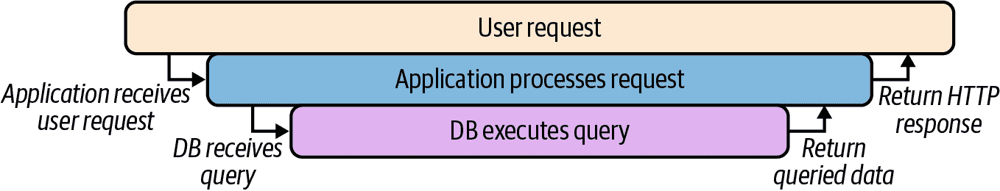
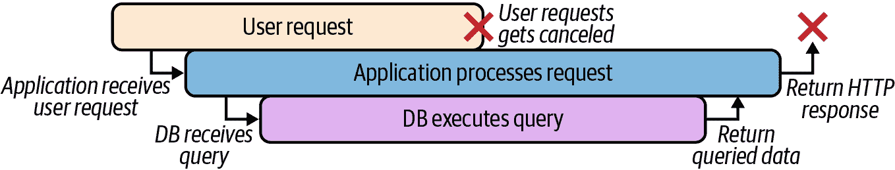
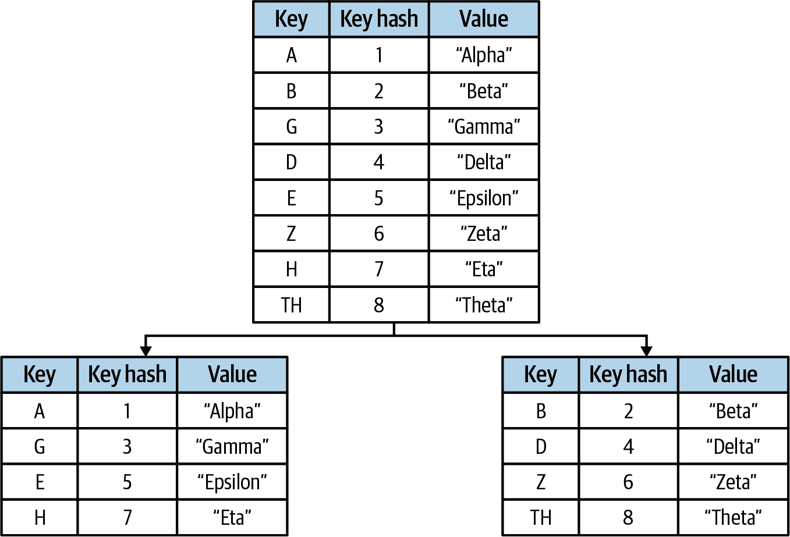

# 第四章：云原生模式

> 只有当我们训练自己去思考程序时不将其视为可执行代码的一部分时，进展才有可能。¹
> 
> Edsger W. Dijkstra，1979 年 8 月

1991 年，当时还在 Sun Microsystems 工作的 L·Peter·Deutsch²提出了*分布式计算的谬误*，列出了程序员在处理分布式应用程序时常常犯的一些错误假设：

+   *网络是可靠的*：交换机会出故障，路由器会配置错误

+   *延迟是零*：在网络中传输数据需要时间

+   *带宽是无限的*：网络一次只能处理那么多数据

+   *网络是安全的*：不要以明文方式共享秘密；一切都要加密

+   *拓扑不会改变*：服务器和服务会来来去去

+   *只有一个管理员*：多个管理员会导致异构解决方案

+   *传输成本为零*：数据传输需要时间和金钱

+   *网络是同构的*：每个网络都（有时非常）不同

如果我可以如此大胆，我还想再增加第九个：

+   *服务是可靠的*：您依赖的服务随时可能会失败

在本章中，我将介绍一些习惯用法模式——经过测试、证明的开发范式——旨在解决 Deutsch 所述条件中的一个或多个，并展示如何在 Go 语言中实现它们。本书讨论的模式都不是本书独创的——一些模式存在已久，就像分布式应用程序的存在一样——但大多数模式在此前未曾集中发表。其中许多模式是 Go 语言独有的，或者相对于其他语言具有新颖的实现。

不幸的是，本书不涵盖像[舱壁](https://oreil.ly/0hxmU)或[守门员](https://oreil.ly/0v5Jc)等基础架构级别的模式。主要是因为我们专注于 Go 语言中的应用层开发，而这些模式尽管不可或缺，但其功能位于完全不同的抽象级别。如果您有兴趣了解更多信息，我推荐 Justin Garrison 和 Kris Nova（O’Reilly）的*Cloud Native Infrastructure*以及 Brendan Burns（O’Reilly）的*Designing Distributed Systems*。

# 上下文包

本章大多数代码示例使用了`context`包，该包在 Go 1.7 中引入，提供了一种习惯用法，用于在进程间传递截止时间、取消信号和请求范围的值。它包含一个接口`context.Context`，其方法列在以下内容中：

```go
type Context interface {
    // Done returns a channel that's closed when this Context is cancelled.
    Done() <-chan struct{}

    // Err indicates why this context was cancelled after the Done channel is
    // closed. If Done is not yet closed, Err returns nil.
    Err() error

    // Deadline returns the time when this Context should be cancelled; it
    // returns ok==false if no deadline is set.
    Deadline() (deadline time.Time, ok bool)

    // Value returns the value associated with this context for key, or nil
    // if no value is associated with key. Use with care.
    Value(key interface{}) interface{}
}
```

这些方法中有三种可以用来了解`Context`值的取消状态或行为。第四种`Value`可以用来检索与任意键关联的值。在 Go 世界中，`Context`的`Value`方法是一些争议的焦点，将在“定义请求范围的值”中进一步讨论。

## 上下文能为你做什么

`context.Context`值通过直接将其传递给服务请求使用，可能进一步将其传递给一个或多个子请求。其有用之处在于，当`Context`被取消时，所有持有它（或派生`Context`；关于此更多内容请参见图 4-1、4-2 和 4-3）的函数都会收到信号，允许它们协调取消并减少浪费的工作量。

例如，用户向服务发出请求，后者再向数据库发出请求。在理想情况下，用户、应用程序和数据库请求可以像图 4-1 中所示的那样进行图示化。



###### 图 4-1\. 用户成功请求，服务到数据库

但如果用户在请求完全完成之前终止请求怎么办？在大多数情况下，无视请求的整体上下文，进程将继续运行（图 4-2），消耗资源以提供永远不会使用的结果。



###### 图 4-2\. 子进程不知道被取消的用户请求，仍将继续运行

然而，通过向每个后续请求共享`Context`，所有长时间运行的进程都可以收到同时发送的“完成”信号，允许取消信号在每个进程之间协调（图 4-3）。


###### 图 4-3\. 通过共享上下文，可以在进程之间协调取消信号。

重要的是，`Context`值也是线程安全的，即它们可以安全地被多个并发执行的 goroutine 使用，而不必担心意外行为。

## 创建上下文

可以使用两个函数之一获得全新的`context.Context`：

`func Background() Context`

返回一个从未被取消、没有值和没有截止时间的空`Context`。它通常由主函数、初始化和测试使用，并作为传入请求的顶层`Context`。

`func TODO() Context`

同样提供一个空的`Context`，但它旨在用作未确定使用哪个`Context`或父`Context`尚不可用时的占位符。

## 定义上下文的截止时间和超时

`context`包还包括一些方法，用于创建*派生*`Context`值，允许您通过应用超时或显式触发取消的函数钩子来控制取消行为。

`func WithDeadline(Context, time.Time) (Context, CancelFunc)`

接受特定时间，在此时间`Context`将被取消并且`Done`通道将被关闭。

`func WithTimeout(Context, time.Duration) (Context, CancelFunc)`

接受一个持续时间，在此之后`Context`将被取消并且`Done`通道将被关闭。

`func WithCancel(Context) (Context, CancelFunc)`

与之前的函数不同，`WithCancel` 不接受任何参数，只返回一个可调用的函数，用于显式取消 `Context`。

这三个函数都返回一个包含任何请求的修饰的派生 `Context`，以及一个 `context.CancelFunc`，一个零参数函数，可用于显式取消 `Context` 及其所有派生值。

###### 提示

当一个 `Context` 被取消时，所有*派生自它的* `Context` 也会被取消。*它派生自的* `Context` 不会被取消。

## 定义请求范围的值

最后，`context` 包包括一个函数，可用于定义一个可以从返回的 `Context`—以及所有派生自它的 `Context`—中访问的任意*请求范围*键值对的函数。

`func WithValue(parent Context, key, val interface{}) Context`

`WithValue` 返回一个派生自 `parent` 的 `Context`，其中 `key` 与值 `val` 关联。

## 使用一个 Context

当一个服务请求被发起时，无论是由传入请求还是由 `main` 函数触发，顶层进程将使用 `Background` 函数创建一个新的 `Context` 值，可能使用一个或多个 `context.With*` 函数对其进行修饰，然后将其传递给任何子请求。然后这些子请求只需要监视 `Done` 通道以获取取消信号。

例如，看一下以下的 `Stream` 函数：

```go
func Stream(ctx context.Context, out chan<- Value) error {
    // Create a derived Context with a 10s timeout; dctx
    // will be cancelled upon timeout, but ctx will not.
    // cancel is a function that will explicitly cancel dctx.
    dctx, cancel := context.WithTimeout(ctx, time.Second * 10)

    // Release resources if SlowOperation completes before timeout
    defer cancel()

    res, err := SlowOperation(dctx)
    if err != nil {                     // True if dctx times out
        return err
    }

    for {
        select {
        case out <- res:                // Read from res; send to out

        case <-ctx.Done():              // Triggered if ctx is cancelled
            return ctx.Err()
        }
    }
}
```

`Stream` 接收一个 `ctx Context` 作为输入参数，它将其发送到 `WithTimeout` 来创建 `dctx`，一个带有 10 秒超时的派生 `Context`。由于这个修饰，`SlowOperation(dctx)` 调用可能在十秒后超时并返回错误。然而，使用原始 `ctx` 的函数不会有这个超时修饰，也不会超时。

更进一步，原始的 `ctx` 值在围绕 `select` 语句的 `for` 循环中被用于从 `SlowOperation` 函数提供的 `res` 通道中检索值。请注意 `case <-ctx.Done()` 语句，在 `ctx.Done` 通道关闭时执行以返回适当的错误值。

# 本章布局

本章中每个模式的一般展示松散地基于著名的“四人帮”*设计模式*书中使用的展示方式，但更简单和不那么正式。每个模式以其目的的非常简要描述开头，以及使用它的原因，然后跟着以下部分：

适用性

Context 和描述此模式可能适用的地方。

参与者

该模式的组件列表及其角色。

实现

解决方案及其实现的讨论。

示例代码

代码如何在 Go 中实现的演示。

# 稳定性模式

这里介绍的稳定性模式解决了分布式计算的谬误中所指出的一个或多个假设。它们通常旨在由分布式应用程序应用，以提高它们自身以及所属的更大系统的稳定性。

## 电路断路器

电路断路器自动在可能的故障响应中降低服务功能，通过消除重复错误并提供合理的错误响应，防止更大或级联故障的发生。

### 适用性

如果将*分布式计算的谬误*概括为一个要点，那就是对于分布式、云原生系统来说，错误和故障是无法否认的生活事实。服务可能配置错误，数据库可能崩溃，网络可能分区。我们无法阻止它；我们只能接受并考虑它。

如果不这样做，可能会造成一些相当不愉快的后果。我们都见过它们，它们并不美观。有些服务可能会继续徒劳地尝试执行它们的工作，并向客户端返回无意义的数据；其他服务可能会发生灾难性失败，甚至可能陷入崩溃/重新启动的恶性循环中。这并不重要，因为最终它们都在浪费资源，掩盖了原始故障的来源，并使级联故障更有可能发生。

另一方面，一个服务假设其依赖项随时可能失败，当它们失败时可以合理地做出响应。电路断路器允许服务检测到这些故障，并通过暂时停止执行请求来“打开电路”，而不是提供符合服务通信契约的错误消息给客户端。

例如，想象一个服务（理想情况下）从客户端接收请求，执行数据库查询并返回响应。如果数据库失败了怎么办？该服务可能会继续徒劳地尝试查询，向日志中发送错误消息，最终超时或返回无用的错误。这样的服务可以使用电路断路器在数据库失败时“打开电路”，防止服务继续进行注定失败的数据库请求（至少一段时间内），并立即向客户端提供有意义的通知。

### 参与者

此模式包括以下参与者：

电路

与服务交互的函数。

断路器

一个与*Circuit*相同函数签名的闭包。

### 实施

本质上，电路断路器只是一种专门的[适配器](https://oreil.ly/bEeru)模式，`Breaker`包装`Circuit`以添加一些额外的错误处理逻辑。

就像此模式的命名来源——电气开关一样，`Breaker`有两种可能的状态：*closed*（关闭）和*open*（打开）。在关闭状态下，一切正常运行。`Breaker`从客户端接收的所有请求都原样转发到`Circuit`，并且将`Circuit`返回的所有响应再转发回客户端。在打开状态下，`Breaker`不会将请求转发到`Circuit`，而是通过响应详细的错误消息实现“快速失败”。

`Breaker`在内部跟踪`Circuit`返回的错误；如果`Circuit`返回的连续错误数超过定义的阈值，`Breaker`将*触发*并且其状态切换为*open*。

大多数 Circuit Breaker 的实现都包括一些逻辑，以在一段时间后自动关闭电路。但请记住，向已经发生故障的服务大量重试可能会导致其自身的问题，因此通常会包含某种退避逻辑，即随时间减少重试率的逻辑。退避的主题实际上非常微妙，但将在《再试请求》中详细讨论。

在多节点服务中，此实现可以扩展为包括一些共享存储机制，例如 Memcached 或 Redis 网络缓存，以跟踪电路状态。

### 示例代码

我们首先创建一个`Circuit`类型，该类型指定了与数据库或其他上游服务交互的函数签名。在实践中，这可以采用适合功能的任何形式。然而，它的返回列表中应包含一个`error`：

```go
type Circuit func(context.Context) (string, error)
```

在本例中，`Circuit`是一个接受`Context`值的函数，详细说明见《上下文包》。您的实现可能会有所不同。

`Breaker`函数接受符合`Circuit`类型定义的任何函数，以及一个无符号整数，表示电路自动打开之前允许的连续故障次数。作为返回，它提供另一个符合`Circuit`类型定义的函数：

```go
func Breaker(circuit Circuit, failureThreshold uint) Circuit {
    var consecutiveFailures int = 0
    var lastAttempt = time.Now()
    var m sync.RWMutex

    return func(ctx context.Context) (string, error) {
        m.RLock()                       // Establish a "read lock"

        d := consecutiveFailures - int(failureThreshold)

        if d >= 0 {
            shouldRetryAt := lastAttempt.Add(time.Second * 2 << d)
            if !time.Now().After(shouldRetryAt) {
                m.RUnlock()
                return "", errors.New("service unreachable")
            }
        }

        m.RUnlock()                     // Release read lock

        response, err := circuit(ctx)   // Issue request proper

        m.Lock()                        // Lock around shared resources
        defer m.Unlock()

        lastAttempt = time.Now()        // Record time of attempt

        if err != nil {                 // Circuit returned an error,
            consecutiveFailures++       // so we count the failure
            return response, err        // and return
        }

        consecutiveFailures = 0         // Reset failures counter

        return response, nil
    }
}
```

`Breaker`函数构造另一个函数，也是类型为`Circuit`的函数，它包装`circuit`以提供所需的功能。您可能会从《匿名函数和闭包》中认出这种形式：闭包是一个嵌套函数，可以访问其父函数的变量。正如您将看到的，本章实现的所有“稳定性”函数都是这样工作的。

闭包通过计算`circuit`返回的连续错误数来工作。如果该值达到故障阈值，则在不实际调用`circuit`的情况下返回错误“服务不可达”。对`circuit`的任何成功调用都会导致`consecutiveFailures`重置为 0，然后重新开始。

该闭包甚至包括一个自动重置机制，允许请求在数秒后再次调用`circuit`，并采用*指数退避*，即重试之间的延迟持续大致翻倍。尽管简单且相当普遍，实际上这并不是理想的退避算法。我们将在“退避算法”中详细讨论其原因。

## Debounce

Debounce 限制函数调用的频率，以便只有调用集群中的第一个或最后一个实际执行。

### 适用性

Debounce 是我们第二个以电气电路主题命名的模式。具体来说，它是根据一种现象命名的，即开关在打开或关闭时其触点会“弹跳”，导致电路在稳定之前会有些波动。这通常不是什么大问题，但这种“接触弹跳”在逻辑电路中可能会成为一个真正的问题，因为一系列开/关脉冲可能被解释为数据流。消除接触弹跳的做法是只传输开放或关闭接触的一个信号，称为“去弹跳”。

在服务的世界中，我们有时会执行一系列可能缓慢或昂贵的操作，而只需执行一个即可。使用 Debounce 模式，紧密聚集在时间上的一系列相似调用被限制为只有一个调用，通常是批处理中的第一个或最后一个。

多年来，这种技术一直在 JavaScript 世界中使用，以限制可能减慢浏览器速度的操作，只接受一系列用户事件中的第一个或者延迟调用，直到用户准备好。您可能以前就见过这种技术的应用。我们都熟悉使用搜索栏时的体验，只有在您暂停输入后才显示自动完成弹出窗口，或者连续点击按钮后只有第一个点击被响应的情况。

我们这些专注于后端服务的人可以从多年来一直致力于解决分布式系统中可靠性、延迟和带宽问题的前端同事那里学到很多。例如，这种方法可以用于检索一些更新缓慢的远程资源，而不会陷入浪费客户端和服务器时间的情况。

这种模式类似于“节流”，限制函数被调用的频率。但是 Debounce 限制了调用集群，而节流仅根据时间段限制。有关 Debounce 和 Throttle 模式之间的区别，请参阅“节流与 Debounce 的区别是什么？”。

### 参与者

此模式包括以下参与者：

电路

调节函数。

Debounce

与*Circuit*具有相同函数签名的闭包。

### 实施

实际上，Debounce 的实现与断路器的实现非常相似，因为它包装了*Circuit*以提供速率限制的逻辑。该逻辑实际上非常简单：在每次调用外部函数时——不论其结果如何——都会设置一个时间间隔。在该时间间隔到期之前进行的任何后续调用都将被忽略；在此之后进行的任何调用都将传递给内部函数。这种实现方式中，内部函数只调用一次，随后的调用将被忽略，被称为*函数-首先*，并且非常有用，因为它允许从内部函数获取的初始响应被缓存并返回。

函数-最后的实现会在一系列调用之后等待一段时间，然后才调用内部函数。当程序员希望某些输入后再进行函数调用时，例如搜索栏在输入暂停后进行自动完成时，这种变体在 JavaScript 世界中很常见。在后端服务中，函数-最后不太常见，因为它不能立即提供响应，但如果函数不需要立即结果，则它可能很有用。

### 示例代码

就像在断路器实现中一样，我们首先定义一个函数类型，其签名是我们想要限制的函数。与断路器类似，我们称之为`Circuit`；它与示例中声明的相同。同样，`Circuit`可以根据功能需求采取任何形式，但其返回值应包括一个`error`：

```go
type Circuit func(context.Context) (string, error)
```

与断路器实现的相似性是有意的：它们的兼容性使它们可以“链接”，如下所示：

```go
func myFunction func(ctx context.Context) (string, error) { /* ... */ }

wrapped := Breaker(Debounce(myFunction))
response, err := wrapped(ctx)
```

`Debounce`的函数-首先实现—`DebounceFirst`—与函数-最后相比非常直接，因为它只需跟踪上次调用的时间，并且如果在`d`时间段后再次调用，则返回缓存的结果：

```go
func DebounceFirst(circuit Circuit, d time.Duration) Circuit {
    var threshold time.Time
    var result string
    var err error
    var m sync.Mutex

    return func(ctx context.Context) (string, error) {
        m.Lock()

        defer func() {
            threshold = time.Now().Add(d)
            m.Unlock()
        }()

        if time.Now().Before(threshold) {
            return result, err
        }

        result, err = circuit(ctx)

        return result, err
    }
}
```

这个`DebounceFirst`的实现通过在互斥体中包装整个函数来确保线程安全。虽然这将强制在调用集群开始时重叠调用必须等待结果被缓存，但它也保证了`circuit`在集群开始时只被调用一次。`defer`确保了`threshold`的值，表示调用集群结束的时间（如果没有进一步的调用），在每次调用时重置。

我们的函数-最后实现有点笨拙，因为它涉及使用`time.Ticker`来确定自上次调用函数以来是否足够的时间已过，并且在需要时调用`circuit`。或者，我们可以在每次调用时创建一个新的`time.Ticker`，但如果频繁调用它，这可能会变得非常昂贵：

```go
type Circuit func(context.Context) (string, error)

func DebounceLast(circuit Circuit, d time.Duration) Circuit {
    var threshold time.Time = time.Now()
    var ticker *time.Ticker
    var result string
    var err error
    var once sync.Once
    var m sync.Mutex

    return func(ctx context.Context) (string, error) {
        m.Lock()
        defer m.Unlock()

        threshold = time.Now().Add(d)

        once.Do(func() {
            ticker = time.NewTicker(time.Millisecond * 100)

            go func() {
                defer func() {
                    m.Lock()
                    ticker.Stop()
                    once = sync.Once{}
                    m.Unlock()
                }()

                for {
                    select {
                    case <-ticker.C:
                        m.Lock()
                        if time.Now().After(threshold) {
                            result, err = circuit(ctx)
                            m.Unlock()
                            return
                        }
                        m.Unlock()
                    case <-ctx.Done():
                        m.Lock()
                        result, err = "", ctx.Err()
                        m.Unlock()
                        return
                    }
                }
            }()
        })

        return result, err
    }
}
```

与`DebounceFirst`类似，`DebounceLast`使用一个名为`threshold`的值来指示调用集群的结束（假设没有额外的调用）。然而，它们的相似性基本上就到此为止。

你会注意到几乎整个函数都在`sync.Once`值的`Do`方法内部运行，这确保（正如其名称所示）包含的函数仅执行一次。在这个块内部，使用`time.Ticker`来检查是否已经超过了`threshold`并调用`circuit`函数。最后，停止`time.Ticker`，重置`sync.Once`，循环准备重复执行。

## 重试

`Retry`通过透明地重试失败的操作来处理分布式系统中可能的瞬时故障。

### 适用性

当处理复杂的分布式系统时，瞬时错误是不可避免的。这些错误可能由各种（希望是临时的）条件引起，特别是如果下游服务或网络资源具有保护策略，如在高工作负载下暂时拒绝请求的节流，或者像自适应策略（例如根据需要增加容量的自动缩放）等。

这些故障通常会在一段时间后自行解决，因此在合理的延迟之后重复请求可能（但不保证）会成功。未考虑瞬时故障可能会导致系统变得过于脆弱。另一方面，实施自动重试策略可以显著提高服务的稳定性，从而使其及其上游消费者受益。

### 参与者

此模式包括以下参与者：

Effector

与服务交互的函数。

Retry

接受*Effector*并返回与*Effector*相同函数签名的闭包函数。

### 实现

这种模式与断路器或防抖动机制类似，其类型为*Effector*，定义了一个函数签名。该签名可以根据您的实现需求而灵活变化，但执行可能失败操作的函数必须符合*Effector*定义的签名。

*Retry*函数接受用户定义的*Effector*函数，并返回一个包装了用户定义函数以提供重试逻辑的*Effector*函数。除了用户定义的函数外，*Retry*还接受一个整数，描述最大重试次数，并且接受一个`time.Duration`，描述每次重试尝试之间的等待时间。如果`retries`参数为 0，则重试逻辑将失效。

###### 注意

尽管本文未包含在内，重试逻辑通常会包括某种退避算法。

### 示例代码

`Retry`函数的函数参数签名为`Effector`。它与之前模式的函数类型完全相同：

```go
type Effector func(context.Context) (string, error)
```

`Retry`函数本身相对直接，至少与我们迄今为止看到的函数相比是这样：

```go
func Retry(effector Effector, retries int, delay time.Duration) Effector {
    return func(ctx context.Context) (string, error) {
        for r := 0; ; r++ {
            response, err := effector(ctx)
            if err == nil || r >= retries {
                return response, err
            }

            log.Printf("Attempt %d failed; retrying in %v", r + 1, delay)

            select {
            case <-time.After(delay):
            case <-ctx.Done():
                return "", ctx.Err()
            }
        }
    }
}
```

您可能已经注意到保持 `Retry` 函数如此简洁的原因是：虽然它返回一个函数，但该函数没有任何外部状态。这意味着我们不需要任何复杂的机制来支持并发。

要使用 `Retry`，我们可以实现执行可能失败操作的函数，并且其签名与 `Effector` 类型匹配；在以下示例中，`EmulateTransientError` 扮演这个角色：

```go
var count int

func EmulateTransientError(ctx context.Context) (string, error) {
    count++

    if count <= 3 {
        return "intentional fail", errors.New("error")
    } else {
        return "success", nil
    }
}

func main() {
    r := Retry(EmulateTransientError, 5, 2*time.Second)

    res, err := r(context.Background())

    fmt.Println(res, err)
}
```

在 `main` 函数中，将 `EmulateTransientError` 函数传递给 `Retry`，提供函数变量 `r`。当调用 `r` 时，如果 `EmulateTransientError` 返回错误，则根据先前显示的重试逻辑再次调用，并在延迟后再次调用。最后，在第四次尝试后，`EmulateTransientError` 返回 `nil` 错误并退出。

## 速率限制

`Throttle` 将函数调用频率限制为单位时间内的某个最大调用次数。

### 适用性

`Throttle` 模式以用于管理液体流动的设备命名，例如调节汽车引擎中燃料的流量。像其名字来源的机制一样，`Throttle` 限制了在一段时间内可以调用函数的次数。例如：

+   用户每秒只允许发起 10 次服务请求。

+   客户端可能限制自身每 500 毫秒调用特定函数一次。

+   某账户在 24 小时内只允许进行三次失败的登录尝试。

可能最常见的应用 `Throttle` 的原因是应对可能饱和系统的尖峰活动，这些活动可能对满足请求造成不合理的压力或导致服务降级甚至失败。虽然系统可能通过扩展来增加足够的容量以满足用户需求，但这需要时间，并且系统可能无法快速反应。

### 参与者

此模式包括以下参与者：

`Effector`

调整函数。

速率限制

接受 *Effector* 并返回一个与 *Effector* 具有相同函数签名的闭包函数。

### 实现

`Throttle` 模式与本章描述的许多其他模式类似：它作为一个接受执行函数的函数来实现，返回一个具有相同签名的 `Throttle` 闭包，提供速率限制逻辑。

实现速率限制行为最常见的算法是[*令牌桶*](https://oreil.ly/5A5aP)，它使用一个类似于桶可以容纳某个最大令牌数量的比喻。当调用一个函数时，从桶中取出一个令牌，然后以某个固定速率重新填充。

当桶中的令牌不足以支付请求时，`Throttle` 处理请求的方式可以根据开发者的需求而变化。一些常见的策略包括：

返回错误

当您仅尝试限制不合理或潜在滥用的客户端请求数量时，这是最基本的策略。采用此策略的 RESTful 服务可能会以状态码`429 (Too Many Requests)`做出响应。

重播上次成功函数调用的响应

当服务或昂贵的函数调用可能在过早调用时提供相同结果时，此策略可能很有用。它在 JavaScript 世界中被广泛使用。

当可用令牌足够时，将请求排队以执行

当您希望最终处理所有请求时，此方法可能很有用，但它也更复杂，可能需要注意确保不会耗尽内存。

### 示例代码

以下示例实现了一个非常基本的“令牌桶”算法，使用了“错误”策略：

```go
type Effector func(context.Context) (string, error)

func Throttle(e Effector, max uint, refill uint, d time.Duration) Effector {
    var tokens = max
    var once sync.Once

    return func(ctx context.Context) (string, error) {
        if ctx.Err() != nil {
            return "", ctx.Err()
        }

        once.Do(func() {
            ticker := time.NewTicker(d)

            go func() {
                defer ticker.Stop()

                for {
                    select {
                    case <-ctx.Done():
                        return

                    case <-ticker.C:
                        t := tokens + refill
                        if t > max {
                            t = max
                        }
                        tokens = t
                    }
                }
            }()
        })

        if tokens <= 0 {
            return "", fmt.Errorf("too many calls")
        }

        tokens--

        return e(ctx)
    }
}
```

此`Throttle`实现与我们其他示例类似，它通过将效应函数`e`包装在包含速率限制逻辑的闭包中来实现。桶最初被分配`max`个令牌；每次触发闭包时，它都会检查是否有剩余令牌。如果有可用令牌，则将令牌计数减一并触发效应函数。如果没有，则返回错误。令牌的添加速率为每个`duration d`周期添加`refill`个令牌。

## 超时

一旦明确可能不会得到答案，超时允许一个进程停止等待答案。

### 适用性

分布式计算的谬误之一是“网络是可靠的”，而这个谬误之所以排在第一，是有原因的。交换机可能会失败，路由器和防火墙可能会配置错误；数据包可能会黑洞化。即使您的网络运行良好，也不能保证每个服务都能在发生故障时保证及时和有意义的响应——甚至可能根本不响应。

超时代表了对这一困境的常见解决方案，其简单至极几乎不足以称为一种模式：给定一个运行时间超长的服务请求或函数调用，调用者只需...停止等待。

但不要把“简单”或“常见”误认为是“无用的”。相反，超时策略的普遍性证明了其实用性。明智地使用超时可以提供一定程度的故障隔离，防止级联故障，并减少下游资源问题变成*您*的问题的可能性。

### 参与者

此模式包括以下参与者：

客户端

想要执行*SlowFunction*的客户端。

SlowFunction

实现所需功能的长时间运行函数，由*客户端*调用。

超时

围绕*SlowFunction*实现超时逻辑的包装函数。

### 实施

Go 语言有几种实现超时的方法，但惯用的方式是使用`context`包提供的功能。有关更多信息，请参见“上下文包”。

在理想情况下，任何可能长时间运行的函数都会直接接受 `context.Context` 参数。如果是这样，你的工作就相当简单了：只需传递一个由 `context.WithTimeout` 函数装饰的 `Context` 值即可：

```go
ctx := context.Background()
ctxt, cancel := context.WithTimeout(ctx, 10 * time.Second)
defer cancel()

result, err := SomeFunction(ctxt)
```

然而，并非总是这样，并且对于第三方库，你并不总能重构以接受 `Context` 值。在这些情况下，最佳做法可能是以一种尊重你的 `Context` 的方式包装函数调用。

例如，假设你有一个可能长时间运行的函数，它不仅不接受 `Context` 值，而且来自你无法控制的包。如果 *Client* 直接调用 *SlowFunction*，它将被迫等待函数完成，如果它确实完成的话。那么现在怎么办？

不直接调用 *SlowFunction*，而是在 goroutine 中调用它。这样一来，如果它在合理的时间内返回结果，你就可以捕获到它返回的结果。然而，这也允许你在没有返回时继续进行。

要做到这一点，我们可以利用我们之前见过的几个工具：`context.Context` 用于超时，通道用于通信结果，以及 `select` 来捕获先行动的那个。

### 示例代码

以下示例假设存在虚构函数 `Slow`，其执行可能在某个合理的时间内完成，也可能不会，并且其签名符合以下类型定义：

```go
type SlowFunction func(string) (string, error)
```

与其直接调用 `Slow`，我们改为提供一个 `Timeout` 函数，该函数将提供的 `SlowFunction` 包装成一个闭包，并返回一个 `WithContext` 函数，该函数向 `SlowFunction` 的参数列表中添加了一个 `context.Context`：

```go
type WithContext func(context.Context, string) (string, error)

func Timeout(f SlowFunction) WithContext {
    return func(ctx context.Context, arg string) (string, error) {
        chres := make(chan string)
        cherr := make(chan error)

        go func() {
            res, err := f(arg)
            chres <- res
            cherr <- err
        }()

        select {
        case res := <-chres:
            return res, <-cherr
        case <-ctx.Done():
            return "", ctx.Err()
        }
    }
}
```

在 `Timeout` 构造的函数内部，`Slow` 在一个 goroutine 中运行，并将其返回值发送到为此目的构造的通道中，如果它在某个时候确实完成的话。

以下 goroutine 语句是一个 `select` 块，选择了两个通道：`Slow` 函数响应通道的第一个和 `Context` 值的 `Done` 通道。如果前者先完成，闭包将返回 `Slow` 函数的返回值；否则返回 `Context` 提供的错误。

使用 `Timeout` 函数并不比直接消耗 `Slow` 复杂多少，除了不是一个函数调用，而是两个：调用 `Timeout` 获取闭包，并调用闭包本身：

```go
func main() {
    ctx := context.Background()
    ctxt, cancel := context.WithTimeout(ctx, 1*time.Second)
    defer cancel()

    timeout := Timeout(Slow)
    res, err := timeout(ctxt, "some input")

    fmt.Println(res, err)
}
```

最后，尽管通常首选使用 `context.Context` 实现服务超时，通道超时 *也可以* 使用 `time.After` 函数提供的通道来实现。参见 “实现通道超时” 了解如何实现的示例。

# 并发模式

云原生服务通常需要有效地处理多个进程并处理高（及高度变化的）负载水平，理想情况下无需扩展便能应对。因此，它需要高并发能力，并能够管理来自多个客户端的多个同时请求。虽然 Go 以其并发支持而闻名，但仍可能出现瓶颈。本文介绍了一些开发的模式来防止这些瓶颈。

## Fan-In

将多个输入通道复用到一个输出通道的 Fan-in 模式。

### 适用性

具有一些生成输出的工作线程的服务可能会发现将所有工作线程的输出合并以作为单一统一流进行处理很有用。对于这些情况，我们使用了 fan-in 模式，它可以通过将多个输入通道复用到单个目标通道来读取。

### 参与者

此模式包括以下参与者：

Sources

一组一个或多个具有相同类型的输入通道。被 *Funnel* 接受。

Destination

与 *Sources* 相同类型的输出通道。由 *Funnel* 创建和提供。

Funnel

接受 *Sources* 并立即返回 *Destination*。来自 *Sources* 的任何输入都将由 *Destination* 输出。

### 实现

*Funnel* 实现为一个函数，接收零到 N 个输入通道 (*Sources*)。对于 *Sources* 中的每个输入通道，*Funnel* 函数启动一个单独的 goroutine 从其分配的通道读取值并将其转发到所有 goroutine 共享的单个输出通道 (*Destination*)。

### 示例代码

`Funnel` 函数是一个可变函数，接收 `sources`：零到 N 个某种类型的通道 (`int` 在下面的示例中)：

```go
func Funnel(sources ...<-chan int) <-chan int {
    dest := make(chan int)                  // The shared output channel

    var wg sync.WaitGroup                   // Used to automatically close dest
                                            // when all sources are closed

    wg.Add(len(sources))                    // Set size of the WaitGroup

    for _, ch := range sources {            // Start a goroutine for each source
        go func(c <-chan int) {
            defer wg.Done()                 // Notify WaitGroup when c closes

            for n := range c {
                dest <- n
            }
        }(ch)
    }

    go func() {                             // Start a goroutine to close dest
        wg.Wait()                           // after all sources close
        close(dest)
    }()

    return dest
}
```

对于 `sources` 列表中的每个通道，`Funnel` 启动一个专用的 goroutine 从其分配的通道读取值并将其转发到 `dest`，一个所有 goroutine 共享的单输出通道。

注意使用 `sync.WaitGroup` 来确保适当关闭目标通道。首先创建一个 `WaitGroup` 并将其设置为源通道的总数。如果通道关闭，其关联的 goroutine 退出，调用 `wg.Done`。当所有通道都关闭时，WaitGroup 的计数器达到零，`wg.Wait` 引入的锁释放，并关闭 `dest` 通道。

使用 `Funnel` 相对来说是比较简单的：给定 N 个源通道（或 N 个通道的切片），将这些通道传递给 `Funnel`。返回的目标通道可以按通常的方式读取，并且在所有源通道关闭时将关闭：

```go
func main() {
    sources := make([]<-chan int, 0)        // Create an empty channel slice

    for i := 0; i < 3; i++ {
        ch := make(chan int)
        sources = append(sources, ch)       // Create a channel; add to sources

        go func() {                         // Run a toy goroutine for each
            defer close(ch)                 // Close ch when the routine ends

            for i := 1; i <= 5; i++ {
                ch <- i
                time.Sleep(time.Second)
            }
        }()
    }

    dest := Funnel(sources...)
    for d := range dest {
        fmt.Println(d)
    }
}
```

此示例创建了一个包含三个 `int` 通道的切片，在将值从 1 到 5 发送到这些通道后关闭它们。在一个单独的 goroutine 中，打印单个 `dest` 通道的输出。运行此示例将导致适当的 15 行打印，然后 `dest` 关闭并结束函数。

## Fan-Out

Fan-out 均匀分发来自输入通道的消息到多个输出通道。

### 适用性

Fan-out 从输入通道接收消息，均匀分布到输出通道，并且是用于并行化 CPU 和 I/O 利用的有用模式。

例如，想象一下，您有一个输入源，比如输入流上的`Reader`，或者消息代理上的监听器，为某些资源密集型工作提供输入。与其将输入和计算过程耦合在一起，这会将工作限制在单一串行过程中，您可能更喜欢通过将工作负载分布到一些并发工作进程中来并行化工作负载。

### Participants

此模式包括以下参与者：

Source

输入通道。被*Split*接受。

Destinations

与*Source*相同类型的输出通道。由*Split*创建和提供。

Split

接受*Source*并立即返回*Destinations*的函数。来自*Source*的任何输入将输出到*Destination*。

### 实现

Fan-out 在概念上可能相对简单，但细节中有魔鬼。

通常，fan-out 被实现为一个*Split*函数，该函数接受单个*Source*通道和表示所需*Destination*通道数的整数。*Split*函数创建*Destination*通道，并执行一些后台进程，从*Source*通道检索值并将其转发到*Destinations*之一。

转发逻辑的实现可以通过以下两种方式之一完成：

+   使用单个 goroutine 按循环顺序从*Source*读取值并将其转发到*Destinations*。这具有只需要一个主 goroutine 的优点，但如果下一个通道尚未准备好读取，它将减慢整个过程。

+   使用单独的 goroutine 处理每个*Destination*，它们竞争从*Source*读取下一个值并将其转发到各自的*Destination*。这需要稍多一些资源，但不太可能因单个运行缓慢的工作进程而陷入困境。

下一个示例采用后一种方法。

### 示例代码

在这个例子中，`Split`函数接受单个只接收通道`source`和描述要将输入拆分为的通道数`n`的整数。它返回一个与`source`类型相同的`n`个只发送通道的切片。

在内部，`Split`创建目标通道。对于每个创建的通道，它执行一个 goroutine，在`source`上的`for`循环中检索值，并将其转发到其分配的输出通道。实际上，每个 goroutine 竞争从`source`读取；如果有多个尝试读取，将随机确定“获胜者”。如果`source`被关闭，则所有 goroutine 终止，并且所有目标通道都关闭：

```go
func Split(source <-chan int, n int) []<-chan int {
    dests := make([]<-chan int, 0)          // Create the dests slice

    for i := 0; i < n; i++ {                // Create n destination channels
        ch := make(chan int)
        dests = append(dests, ch)

        go func() {                         // Each channel gets a dedicated
            defer close(ch)                 // goroutine that competes for reads

            for val := range source {
                ch <- val
            }
        }()
    }

    return dests
}
```

给定某种特定类型的通道，`Split` 函数将返回若干个目标通道。通常情况下，每个通道都会被传递给一个单独的 goroutine，就像下面的示例中所演示的那样：

```go
func main() {
    source := make(chan int)                // The input channel
    dests := Split(source, 5)               // Retrieve 5 output channels

    go func() {                             // Send the number 1..10 to source
        for i := 1; i <= 10; i++ {          // and close it when we're done
            source <- i
        }

        close(source)
    }()

    var wg sync.WaitGroup                   // Use WaitGroup to wait until
    wg.Add(len(dests))                      // the output channels all close

    for i, ch := range dests {
        go func(i int, d <-chan int) {
            defer wg.Done()

            for val := range d {
                fmt.Printf("#%d got %d\n", i, val)
            }
        }(i, ch)
    }

    wg.Wait()
}
```

此示例创建了一个输入通道`source`，将其传递给`Split`以接收其输出通道。同时，它在一个 goroutine 中将值 1 到 10 传递给`source`，同时在其他五个 goroutine 中从`dests`接收值。当输入完成时，关闭`source`通道，这将触发输出通道中的闭包，结束读取循环，每个读取 goroutine 调用`wg.Done`，释放`wg.Wait`上的锁，并允许函数结束。

## 未来

未来提供了一个值的占位符，这个值目前还不知道。

### 适用性

未来（也称为 Promises 或 Delays⁴）是一种同步构造，提供一个值的占位符，该值仍然由异步过程生成。

在 Go 语言中，这种模式不像其他一些语言那样经常使用，因为通道经常可以以类似的方式使用。例如，长时间运行的阻塞函数`BlockingInverse`（未显示）可以在返回结果的通道上执行 goroutine。`ConcurrentInverse` 函数正是这样做的，返回一个通道，可以在结果可用时读取：

```go
func ConcurrentInverse(m Matrix) <-chan Matrix {
    out := make(chan Matrix)

    go func() {
        out <- BlockingInverse(m)
        close(out)
    }()

    return out
}
```

使用`ConcurrentInverse`，可以构建一个函数来计算两个矩阵的逆乘积：

```go
func InverseProduct(a, b Matrix) Matrix {
    inva := ConcurrentInverse(a)
    invb := ConcurrentInverse(b)

    return Product(<-inva, <-invb)
}
```

看起来并不糟糕，但它带来了一些不利因素，使得它在像公共 API 这样的场景中并不理想。首先，调用者必须小心地在正确的时机调用`ConcurrentInverse`。要明白我的意思，请仔细看以下内容：

```go
return Product(<-ConcurrentInverse(a), <-ConcurrentInverse(b))
```

看到问题了吗？由于计算直到实际调用`ConcurrentInverse`才开始，这种结构将有效地串行执行，需要两倍的运行时间。

更重要的是，当以这种方式使用通道时，具有多个返回值的函数通常会为返回列表的每个成员分配一个专用的通道，当返回列表增长或需要多个 goroutine 读取值时，这可能变得很麻烦。

未来模式通过将复杂性封装在一个 API 中，为消费者提供了一个简单的接口，其方法可以正常调用，阻塞所有调用的例程，直到其所有结果都被解决。该值满足的接口甚至不必为此特别构建；任何对消费者方便的接口都可以使用。

### 参与者

这种模式包括以下参与者：

未来

由消费者接收的接口，用于检索最终的结果。

SlowFunction

围绕一些异步执行的函数的包装函数；提供*Future*。

InnerFuture

满足*Future*接口；包含一个附加方法，其中包含结果访问逻辑。

### 实现

提供给消费者的 API 非常简单明了：程序员调用 *SlowFunction*，它返回满足 *Future* 接口的值。 *Future* 可能是一个定制的接口，如下例所示，或者可能更像是一个可以传递给其自己函数的 `io.Reader`。

实际上，当调用 *SlowFunction* 时，它将核心函数作为一个 goroutine 执行。在执行过程中，它定义了用于捕获核心函数输出的通道，并将其包装在 *InnerFuture* 中。

*InnerFuture* 具有一个或多个方法，满足 *Future* 接口，从通道中检索核心函数返回的值，缓存它们并返回。如果通道上没有可用的值，请求将阻塞。如果已经检索到值，将返回缓存的值。

### 示例代码

在这个示例中，我们使用一个 `Future` 接口，`InnerFuture` 将满足它：

```go
type Future interface {
    Result() (string, error)
}
```

`InnerFuture` 结构体在内部用于提供并发功能。在这个示例中，它满足 `Future` 接口，但也可以选择满足类似于 `io.Reader` 的东西，通过附加 `Read` 方法，例如：

```go
type InnerFuture struct {
    once sync.Once
    wg   sync.WaitGroup

    res   string
    err   error
    resCh <-chan string
    errCh <-chan error
}

func (f *InnerFuture) Result() (string, error) {
    f.once.Do(func() {
        f.wg.Add(1)
        defer f.wg.Done()
        f.res = <-f.resCh
        f.err = <-f.errCh
    })

    f.wg.Wait()

    return f.res, f.err
}
```

在这个实现中，结构体本身包含一个通道和每个由 `Result` 方法返回的值的变量。当首次调用 `Result` 时，它尝试从通道中读取结果并将它们发送回 `InnerFuture` 结构体，以便后续对 `Result` 的调用可以立即返回缓存的值。

注意使用 `sync.Once` 和 `sync.WaitGroup`。前者按照其字面意思执行：确保传递给它的函数只调用一次。`WaitGroup` 用于使这个函数调用线程安全：第一次调用后的任何调用都将在 `wg.Wait` 处阻塞，直到通道读取完成。

`SlowFunction` 是围绕你想要并发运行的核心功能的包装器。它负责创建结果通道、在 goroutine 中运行核心功能，并创建并返回 `Future` 实现 (`InnerFuture` 在本示例中)：

```go
func SlowFunction(ctx context.Context) Future {
    resCh := make(chan string)
    errCh := make(chan error)

    go func() {
        select {
        case <-time.After(time.Second * 2):
            resCh <- "I slept for 2 seconds"
            errCh <- nil
        case <-ctx.Done():
            resCh <- ""
            errCh <- ctx.Err()
        }
    }()

    return &InnerFuture{resCh: resCh, errCh: errCh}
}
```

要使用这种模式，只需调用 `SlowFunction` 并使用返回的 `Future` 就像使用任何其他值一样：

```go
func main() {
    ctx := context.Background()
    future := SlowFunction(ctx)

    res, err := future.Result()
    if err != nil {
        fmt.Println("error:", err)
        return
    }

    fmt.Println(res)
}
```

这种方法提供了一个相当不错的用户体验。程序员可以创建一个 `Future` 并按其意愿访问它，甚至可以使用 `Context` 应用超时或截止时间。

## 分片

*分片* 将一个大数据结构分成多个分区，以局部化读/写锁的影响。

### 适用性

*分片* 一词通常在分布式状态的上下文中使用，用于描述在服务器实例之间分区的数据。这种 *水平分片* 常用于数据库和其他数据存储中，以分发负载并提供冗余。

有时可能会影响高度并发服务的稍有不同问题，这些服务具有用于保护共享数据结构免受冲突写入的锁定机制。在这种情况下，用于确保数据完整性的锁定也可能在进程开始花费更多时间等待锁定而不是执行其工作时创建瓶颈。这种不幸的现象被称为*锁争用*。

虽然在某些情况下可以通过扩展实例数量来解决这个问题，但这也会增加复杂性和延迟，因为需要建立分布式锁，并确保写入一致性。在服务实例内部减少围绕共享数据结构的锁争用的另一种替代策略是*垂直分片*，其中一个大数据结构被分割成两个或更多结构，每个结构代表整体的一部分。使用这种策略，一次只需要锁定整体结构的一部分，从而降低整体锁争用。

### 参与者

此模式包括以下参与者：

ShardedMap

围绕一个或多个*Shards*提供读取和写入访问的抽象，就好像*Shards*是一个单一映射。

Shard

代表单个数据分区的可单独锁定的集合。

### 实现

虽然惯用的 Go 强烈倾向于使用[通过通道进行内存共享](https://oreil.ly/BipeP)来保护共享资源，而不是使用锁，⁵但这并非总是可能的。映射对于并发使用特别不安全，因此使用锁作为同步机制是一种必要的恶。幸运的是，Go 提供了`sync.RWMutex`，专门用于此目的。

`RWMutex`提供了建立读取和写入锁定的方法，如下所示。使用此方法，只要没有打开写入锁定，任意数量的进程就可以建立同时读取锁定；只有在没有现有读取或写入锁定时，进程才能建立写入锁定。尝试建立额外的锁定将被阻塞，直到其前面的任何锁定被释放：

```go
var items = struct{                                 // Struct with a map and a
    sync.RWMutex                                    // composed sync.RWMutex
    m map[string]int
}{m: make(map[string]int)}

func ThreadSafeRead(key string) int {
    items.RLock()                                   // Establish read lock
    value := items.m[key]
    items.RUnlock()                                 // Release read lock
    return value
}

func ThreadSafeWrite(key string, value int) {
    items.Lock()                                    // Establish write lock
    items.m[key] = value
    items.Unlock()                                  // Release write lock
}
```

这种策略通常运行良好。然而，由于锁只允许一次访问一个进程，因此在读/写密集型应用程序中等待锁清除的平均时间可能会随着并发进程数量的增加而显著增加。由此产生的锁争用可能会潜在地成为关键功能的瓶颈。

垂直分片通过将底层数据结构（通常是一个映射）分割成几个可单独锁定的映射来减少锁争用。一个抽象层提供对底层分片的访问，就好像它们是一个单一结构（见图 4-5）。



###### 图 4-5\. 按键哈希垂直分片映射

在内部，这通过在本质上是映射的映射周围创建一个抽象层来实现。每当在映射抽象中读取或写入值时，都会为键计算一个哈希值，然后通过分片数量取模以生成一个分片索引。这使得映射抽象能够将必要的锁定隔离到仅限于该索引处的分片。

### 示例代码

在以下示例中，我们使用标准的`sync`和`crypto/sha1`包来实现一个基本的分片映射：`ShardedMap`。

在内部，`ShardedMap`只是指向一些`Shard`值的切片指针，但我们将其定义为一种类型，以便我们可以附加方法。每个`Shard`包括一个包含该分片数据的`map[string]interface{}`，以及一个组合的`sync.RWMutex`，以便可以单独锁定它：

```go
type Shard struct {
    sync.RWMutex                            // Compose from sync.RWMutex
    m map[string]interface{}                // m contains the shard's data
}

type ShardedMap []*Shard                    // ShardedMap is a *Shards slice
```

Go 语言没有任何构造函数的概念，因此我们提供了一个`NewShardedMap`函数来获取一个新的`ShardedMap`：

```go
func NewShardedMap(nshards int) ShardedMap {
    shards := make([]*Shard, nshards)       // Initialize a *Shards slice

    for i := 0; i < nshards; i++ {
        shard := make(map[string]interface{})
        shards[i] = &Shard{m: shard}
    }

    return shards                           // A ShardedMap IS a *Shards slice!
}
```

`ShardedMap`有两个未导出方法，`getShardIndex`和`getShard`，分别用于计算键的分片索引和检索键的正确分片。这些方法可以很容易地合并成一个单一方法，但将它们分开这样做使它们更易于测试：

```go
func (m ShardedMap) getShardIndex(key string) int {
    checksum := sha1.Sum([]byte(key))   // Use Sum from "crypto/sha1"
    hash := int(checksum[17])           // Pick an arbitrary byte as the hash
    return hash % len(m)                // Mod by len(m) to get index
}

func (m ShardedMap) getShard(key string) *Shard {
    index := m.getShardIndex(key)
    return m[index]
}
```

请注意，前面的示例有一个明显的缺陷：因为它实际上使用了一个字节大小的值作为哈希值，所以它只能处理多达 255 个分片。如果出于某种原因需要更多，您可以在其上进行一些二进制运算：`hash := int(sum[13]) << 8 | int(sum[17])`。

最后，我们向`ShardedMap`添加了方法，允许用户读取和写入值。显然，这些并不展示映射可能需要的所有功能。然而，请随意在与本书关联的 GitHub 存储库中实现它们作为练习。删除和包含方法会很不错：

```go
func (m ShardedMap) Get(key string) interface{} {
    shard := m.getShard(key)
    shard.RLock()
    defer shard.RUnlock()

    return shard.m[key]
}

func (m ShardedMap) Set(key string, value interface{}) {
    shard := m.getShard(key)
    shard.Lock()
    defer shard.Unlock()

    shard.m[key] = value
}
```

当您确实需要在所有表上建立锁时，通常最好同时进行。在下面的示例中，我们使用 goroutine 和我们的老朋友`sync.WaitGroup`来实现一个`Keys`函数：

```go
func (m ShardedMap) Keys() []string {
    keys := make([]string, 0)               // Create an empty keys slice

    mutex := sync.Mutex{}                   // Mutex for write safety to keys

    wg := sync.WaitGroup{}                  // Create a wait group and add a
    wg.Add(len(m))                          // wait value for each slice

    for _, shard := range m {               // Run a goroutine for each slice
        go func(s *Shard) {
            s.RLock()                       // Establish a read lock on s

            for key := range s.m {          // Get the slice's keys
                mutex.Lock()
                keys = append(keys, key)
                mutex.Unlock()
            }

            s.RUnlock()                     // Release the read lock
            wg.Done()                       // Tell the WaitGroup it's done
        }(shard)
    }

    wg.Wait()                               // Block until all reads are done

    return keys                             // Return combined keys slice
}
```

使用`ShardedMap`并不像使用标准映射那样简单，但虽然不同，它也不更复杂：

```go
func main() {
    shardedMap := NewShardedMap(5)

    shardedMap.Set("alpha", 1)
    shardedMap.Set("beta", 2)
    shardedMap.Set("gamma", 3)

    fmt.Println(shardedMap.Get("alpha"))
    fmt.Println(shardedMap.Get("beta"))
    fmt.Println(shardedMap.Get("gamma"))

    keys := shardedMap.Keys()
    for _, k := range keys {
        fmt.Println(k)
    }
}
```

除了复杂性以外，`ShardedMap`可能最大的缺点是与`interface{}`的使用相关联的类型安全丧失，以及随后需要进行类型断言。希望随着 Go 语言泛型的即将发布，这个问题很快就会（或者在您阅读此文时可能已经）成为历史！

# 总结

本章涵盖了相当多非常有趣且有用的惯用语。可能还有更多⁶，但这些是我认为最重要的，要么因为它们在实际应用中非常实用，要么因为它们展示了 Go 语言的一些有趣特性。通常是两者兼具。

在第五章中，我们将进入下一个层次，将我们在第三章和 4 章讨论的一些内容付诸实践，通过从头开始构建一个简单的键值存储来实现它们！

¹ 1979 年 8 月口述。由维奇·阿姆斯特鲁姆、托尼·霍尔、尼克劳斯·维尔特、威姆·费让和拉杰夫·乔西证实。《追求简单：纪念艾兹格·威尔布·迪克斯特教授的座谈会》，2000 年 5 月 12-13 日。

² L（是的，他的法定名字就是 L）是一个聪明而迷人的人类。有空时查一查他。

³ 埃里克·伽玛等人，《设计模式：可复用面向对象软件的基本原则》，第 1 版。Addison-Wesley Professional 出版，1994 年。

⁴ 虽然这些术语经常可以互换使用，但根据上下文的不同，它们的含义也会有所不同。我知道。请不要给我写任何愤怒的信件。

⁵ 请看《*Go 博客*》上的文章，“通过通信共享内存”。

⁶ 我漏掉了你最喜欢的内容吗？请告诉我，我会尽量在下一版中加入它！
