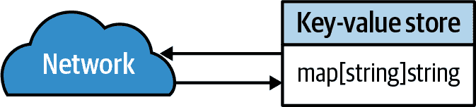
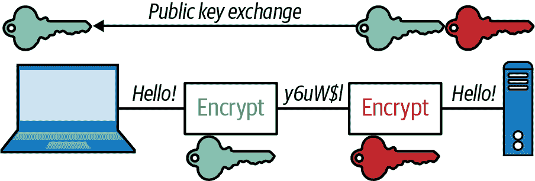
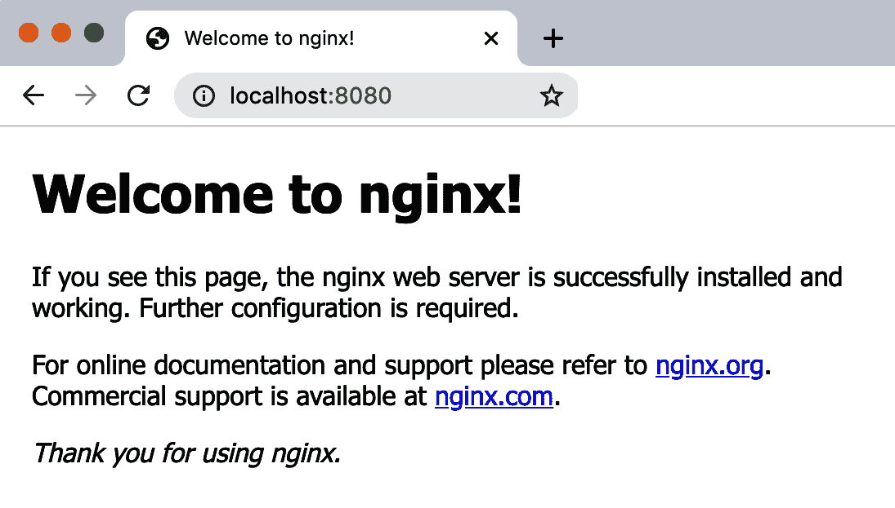

# 第五章：构建云原生服务

> 二战前生活简单。之后，我们有了系统。¹
> 
> Grace Hopper，《OCLC Newsletter》（1987 年）

在本章中，我们的真正工作终于开始了。

我们将整合讨论过的许多材料，创建一个服务，作为本书其余部分的起点。随着我们的进行，我们将在这里开始的基础上进行迭代，每一章都添加功能层，直到最后，我们将拥有一个真正的云原生应用程序。

当然，它不会“生产就绪”——例如，它将缺少重要的安全功能——但它将为我们提供一个坚实的基础来构建。

那我们要构建什么？

# 让我们构建一个服务！

好的。所以。我们需要建立一些东西。

它应该在概念上简单，足够直接地以其最基本的形式实现，但是复杂且适合扩展和分布。我们可以在本书的其余部分逐步完善它。我对此进行了深思熟虑，考虑了我们的应用程序将是什么不同的想法，但最终答案显而易见。

我们将构建一个分布式键值存储。

## 什么是键值存储？

键值存储是一种非关系数据库，它将数据存储为一组键值对。它们与我们熟知和喜爱的更为知名的关系数据库（如 Microsoft SQL Server 或 PostgreSQL）非常不同。² 在关系数据库将数据结构化到固定表和定义良好的数据类型之中时，键值存储则简单得多，允许用户将唯一标识符（键）与任意值关联起来。

换句话说，在其核心，键值存储实际上只是具有服务端点的映射，如图 5-1 所示。它们是可能的最简单的数据库。



###### 图 5-1\. 键值存储本质上是具有服务端点的映射

# 需求

到本章末尾，我们将建立一个简单的、非分布式的键值存储，它可以执行一个（单体）键值存储应该做的所有事情。

+   它必须能够存储任意的键值对。

+   它必须提供服务端点，允许用户放置、获取和删除键值对。

+   它必须能够以某种方式持久地存储其数据。

最后，我们希望服务是幂等的。但是为什么？

## 什么是幂等性以及为什么它很重要？

*幂等性*的概念起源于代数，它描述了某些数学运算的特定属性。幸运的是，这不是一本数学书。我们不打算谈论这个（除了本节末尾的侧边栏）。

在编程世界中，操作（例如方法或服务调用）如果调用一次与多次调用产生相同效果，则称为幂等操作。例如，赋值操作 `x=1` 是幂等的，因为无论您赋值多少次，`x` 都将始终为 `1`。类似地，HTTP 的 `PUT` 方法是幂等的，因为多次 `PUT` 同一个资源到同一位置不会改变任何内容：第二次也不会多一个 `PUT`。³ 然而，操作 `x+=1` 不是幂等的，因为每次调用它时都会产生新的状态。

较少讨论，但同样重要的是*空位性*的相关属性，其中函数或操作根本没有任何副作用。例如，赋值 `x=1` 和 HTTP `PUT` 是幂等的但不是空位的，因为它们触发了状态更改。将值分配给自身，例如 `x=x`，是空位的，因为它没有导致任何状态的改变。同样地，仅仅读取数据，如 HTTP `GET`，通常没有副作用，因此它也是空位的。

当然，在理论上这一切听起来都很好，但在现实世界中为什么我们要关心呢？事实证明，设计服务方法为幂等提供了一些非常实际的好处：

Idempotent 操作更安全。

如果您向服务发送请求，但没有得到响应，您可能会再次尝试。但如果它第一次就听到了您呢？⁴ 如果服务方法是幂等的，那么没有任何伤害。但如果不是，可能会有问题。这种情况比您想象的更常见。网络不可靠。响应可能延迟；数据包可能丢失。

幂等操作通常更简单。

幂等操作更加自包含和易于实现。例如，简单地将键值对添加到后备数据存储的幂等 `PUT` 方法与类似但非幂等的 `CREATE` 方法进行比较，如果数据存储已经包含键，则 `CREATE` 方法将返回错误。`PUT` 逻辑很简单：接收请求，设置值。另一方面，`CREATE` 需要额外的错误检查和处理，可能需要在任何服务副本之间进行分布式锁定和协调，使其难以扩展。

Idempotent 操作更声明性。

构建一个幂等的 API 鼓励设计者专注于最终状态，鼓励生成更*声明性*的方法：它们允许用户告诉服务*需要做什么*，而不是告诉它*如何做*。这可能看起来微妙，但声明性方法——与*命令式方法*相对——使用户不必处理低级构造，可以专注于他们的目标并最小化潜在的副作用。

实际上，幂等性在云原生环境中提供了如此大的优势，以至于一些非常聪明的人甚至进一步断言它是“云原生”的*同义词*⁵。我认为这种说法有些言过其实，但我*可以*说，如果你的服务旨在成为云原生，接受不到幂等性将会招来麻烦。

## 最终目标

这些要求非常繁琐，但它们代表了我们的键值存储可用的绝对最低要求。稍后我们将添加一些重要的基本功能，比如支持多用户和数据传输加密。更重要的是，我们将引入使服务更具可伸缩性、弹性并且能够在一个残酷不确定的宇宙中生存和繁荣的技术和技术。

# 生成 0：核心功能

好的，让我们开始吧。首先要做的是。在不用担心用户请求和持久性的情况下，让我们首先构建核心函数，稍后可以从我们决定使用的任何 Web 框架调用它。

存储任意键-值对

目前，我们可以用一个简单的映射来实现这个，但是什么样的映射呢？为了简单起见，我们将限制键和值为简单字符串，尽管以后我们可能会选择允许任意类型。我们将使用一个简单的 `map[string]string` 作为我们的核心数据结构。

允许键-值对的放置、获取和删除

在这一初始迭代中，我们将创建一个简单的 Go API，我们可以调用它执行基本的修改操作。通过这种方式分区功能将使测试和将来迭代更新变得更加容易。

## 您的超级简单 API

我们需要做的第一件事是创建我们的映射。我们键值存储的核心：

```go
var store = make(map[string]string)
```

它不是美吗？如此简单。别担心，稍后我们会让它变得更复杂。

我们将创建的第一个函数很恰当地是 `PUT`，它将用于向存储添加记录。它确实像其名称所示：接受 `key` 和 `value` 字符串，并将它们放入 `store` 中。 `PUT` 的函数签名包括一个 `error` 返回，稍后我们将需要它：

```go
func Put(key string, value string) error {
    store[key] = value

    return nil
}
```

因为我们有意选择创建一个幂等服务，`Put` 操作不会检查是否正在覆盖现有的键-值对，因此如果需要的话，它将乐意这样做。使用相同参数多次执行 `Put` 操作将产生相同的结果，而不管当前状态如何。

现在我们已经建立了一个基本模式，编写 `Get` 和 `Delete` 操作只是按照计划进行：

```go
var ErrorNoSuchKey = errors.New("no such key")

func Get(key string) (string, error) {
    value, ok := store[key]

    if !ok {
        return "", ErrorNoSuchKey
    }

    return value, nil
}

func Delete(key string) error {
    delete(store, key)

    return nil
}
```

但请仔细观察：看到 `Get` 返回错误时，它没有使用 `errors.New` 吗？相反，它返回了预先构建的 `ErrorNoSuchKey` 错误值。但是为什么？这是一个*哨兵错误*的例子，它允许使用服务确定确切收到的错误类型，并相应地做出响应。例如，它可能做类似于以下操作：

```go
if errors.Is(err, ErrorNoSuchKey) {
    http.Error(w, err.Error(), http.StatusNotFound)
    return
}
```

现在，你已经拥有了绝对最小的功能集（真的非常少），别忘了写测试。我们这里不会做这个，但如果你感到急于前进（或懒惰——懒惰也行），你可以从[为本书创建的 GitHub 仓库](https://oreil.ly/ois1B)获取代码。

# 第一代：单体应用

现在我们有了一个最小功能的键值 API，我们可以开始构建围绕它的服务。我们有几种不同的选项来做这件事。我们可以使用类似 GraphQL 的东西。市面上有一些不错的第三方包可供使用，但我们没有必要复杂的数据景观来需要它。我们还可以使用远程过程调用（RPC），它受到标准`net/rpc`包的支持，甚至是 gRPC，但这些需要额外的客户端开销，再次，我们的数据并不复杂到需要这么做。

这使我们只能选择表现状态转移（REST）。REST 并不是很多人的最爱，但*它*很简单，对我们的需求来说完全足够。

## 使用 net/http 构建 HTTP 服务器

Go 语言没有像 Django 或 Flask 那样复杂或悠久历史的 Web 框架。然而，它拥有一套强大的标准库，完全能够满足 80%的使用场景。更好的是：它们设计为可扩展，因此*确实*有一些 Go Web 框架在其基础上扩展。

现在，让我们看一下在 Go 语言中的标准 HTTP 处理程序惯用法，以一个“Hello World”为例，使用`net/http`实现：

```go
package main

import (
    "log"
    "net/http"
)

func helloGoHandler(w http.ResponseWriter, r *http.Request) {
    w.Write([]byte("Hello net/http!\n"))
}

func main() {
    http.HandleFunc("/", helloGoHandler)

    log.Fatal(http.ListenAndServe(":8080", nil))
}
```

在前面的示例中，我们定义了一个方法，`helloGoHandler`，它满足`http.HandlerFunc`的定义：

```go
type HandlerFunc func(http.ResponseWriter, *http.Request)
```

`http.ResponseWriter`和`*http.Request`参数可用于构造 HTTP 响应和检索请求。您可以使用`http.HandleFunc`函数将`helloGoHandler`注册为匹配给定模式的任何请求的处理函数（在本示例中为根路径）。

一旦注册了我们的处理程序，你就可以调用`ListenAndServe`，它监听地址`addr`。在我们的示例中，第二个参数设置为`nil`。

注意到`ListenAndServe`也被包装在`log.Fatal`调用中。这是因为`ListenAndServe`始终会停止执行流程，在错误发生时才会返回。因此，它始终返回非 nil 的错误，我们总是希望将其记录下来。

前面的示例是一个完整的程序，可以使用`go run`编译并运行：

```go
$ go run .
```

恭喜！你现在运行着世界上最小的 Web 服务。现在可以用`curl`或你喜欢的浏览器来测试它：

```go
$ curl http://localhost:8080
Hello net/http!
```

## 使用 gorilla/mux 构建 HTTP 服务器

对于许多 web 服务来说，`net/http` 和 `DefaultServeMux` 将足够了。但是，有时你会需要第三方 web 工具包提供的额外功能。一个受欢迎的选择是 [Gorilla](https://oreil.ly/15sGK)，尽管它相对较新，开发和资源比不上像 Django 或 Flask 这样的框架，但它基于 Go 的标准 `net/http` 包来提供一些优秀的增强功能。

`gorilla/mux` 包是 Gorilla web 工具包提供的几个包之一，它提供了一个 HTTP 请求路由器和调度器，完全可以取代 `DefaultServeMux`，Go 的默认服务处理器，以增强请求路由和处理的几个非常有用的功能。尽管我们目前还没有使用这些特性，但它们将在以后派上用场。如果你感兴趣和/或心急，你可以查看 [gorilla/mux 文档](https://oreil.ly/qfIph) 获取更多信息。

### 创建一个最小化服务

一旦你这样做了，使用最小化的 `gorilla/mux` 路由器只需添加一个导入和一行代码：初始化一个新的路由器，可以传递给 `ListenAndServe` 的 `handler` 参数：

```go
package main

import (
    "log"
    "net/http"

    "github.com/gorilla/mux"
)

func helloMuxHandler(w http.ResponseWriter, r *http.Request) {
    w.Write([]byte("Hello gorilla/mux!\n"))
}

func main() {
    r := mux.NewRouter()

    r.HandleFunc("/", helloMuxHandler)

    log.Fatal(http.ListenAndServe(":8080", r))
}
```

所以现在你应该可以用 `go run` 直接运行了，对吧？试试看：

```go
$ go run .
main.go:7:5: cannot find package "github.com/gorilla/mux" in any of:
        /go/1.15.8/libexec/src/github.com/gorilla/mux (from $GOROOT)
        /go/src/github.com/gorilla/mux (from $GOPATH)
```

结果证明你还不能这样做。因为现在你正在使用一个第三方包——一个不在标准库中的包——你必须使用 Go modules。

### 使用 Go modules 初始化你的项目

使用来自标准库之外的包需要使用 [Go modules](https://oreil.ly/QJzOi)，这是在 Go 1.12 中引入的，以替换几乎不存在的依赖管理系统，改为使用明确且实际上相当轻松的系统。所有管理依赖项的操作都将使用一小组 `go mod` 命令之一。

首先，你需要初始化你的项目。创建一个新的空目录，`cd` 进入该目录，然后在那里创建（或移动）你的服务的 Go 文件。你的目录现在应该只包含一个单独的 Go 文件。

接下来，使用 `go mod init` 命令初始化项目。通常，如果一个项目将被其他项目导入，它将必须使用其导入路径进行初始化。不过，对于像我们这样的独立服务来说，这就不那么重要了，所以你可以在选择名称时放松一点。我将使用 `example.com/gorilla`；你可以使用任何你喜欢的名称：

```go
$ go mod init example.com/gorilla
go: creating new go.mod: module example.com/gorilla
```

现在你的目录中将有一个（几乎）空的模块文件 `go.mod`：

```go
$ cat go.mod
module example.com/gorilla

go 1.15
```

接下来，我们将想要添加我们的依赖项，可以使用 `go mod tidy` 自动完成：

```go
$ go mod tidy
go: finding module for package github.com/gorilla/mux
go: found github.com/gorilla/mux in github.com/gorilla/mux v1.8.0
```

如果你检查你的 `go.mod` 文件，你会看到依赖项（以及版本号）已经被添加了：

```go
$ cat go.mod
module example.com/gorilla

go 1.15

require github.com/gorilla/mux v1.8.0
```

信不信由你，这就是你需要的全部。如果将来需要更改所需的依赖项，只需再次运行`go mod tidy`即可重新构建文件。现在再次尝试启动您的服务：

```go
$ go run .
```

由于服务在前台运行，您的终端应该暂停。从另一个终端使用`curl`调用端点或在浏览器中浏览到它应该提供预期的响应：

```go
$ curl http://localhost:8080
Hello gorilla/mux!
```

成功！但是您肯定希望您的服务不仅仅打印一个简单的字符串，对吧？当然希望。请继续阅读！

### URI 路径中的变量

Gorilla Web 工具包比标准的`net/http`包提供了丰富的附加功能，但其中一个特性现在特别有趣：使用变量段创建路径的能力，甚至可以选择包含正则表达式模式。使用`gorilla/mux`包，程序员可以使用格式`{name}`或`{name:pattern}`定义变量，如下所示：

```go
r := mux.NewRouter()
r.HandleFunc("/products/{key}", ProductHandler)
r.HandleFunc("/articles/{category}/", ArticlesCategoryHandler)
r.HandleFunc("/articles/{category}/{id:[0-9]+}", ArticleHandler)
```

`mux.Vars`函数方便地允许处理程序函数作为`map[string]string`检索变量名和值：

```go
vars := mux.Vars(request)
category := vars["category"]
```

在下一节中，我们将利用这种能力允许客户端对任意键执行操作。

### 如此多的匹配器

`gorilla/mux`提供的另一个功能是允许在路由中添加各种*匹配器*，以便程序员添加各种额外的匹配请求条件。这些条件包括（但不限于）特定的域或子域、路径前缀、方案、标头，甚至您自己创建的自定义匹配函数。

可以通过对 Gorilla 的`HandleFunc`实现返回的`*Route`值调用适当的函数来应用匹配器。每个匹配器函数都返回受影响的`*Route`，因此它们可以链接在一起。例如：

```go
r := mux.NewRouter()

r.HandleFunc("/products", ProductsHandler).
    Host("www.example.com").                // Only match a specific domain
    Methods("GET", "PUT").                  // Only match GET+PUT methods
    Schemes("http")                         // Only match the http scheme
```

查看[gorilla/mux 文档](https://oreil.ly/6ztZe)以获取可用匹配器函数的详尽列表。

## 构建 RESTful 服务

现在您已经知道如何使用 Go 的标准 HTTP 库，您可以使用它创建一个 RESTful 服务，客户端可以与之交互以执行在“您的超级简单 API”中构建的 API 调用。完成此操作后，您将实施绝对最小的可行键值存储。

### 您的 RESTful 方法

我们将尽力遵循 RESTful 约定，因此我们的 API 将考虑每个键值对作为一个独立的资源，具有可以使用各种 HTTP 方法操作的独特 URI。我们的三种基本操作——Put、Get 和 Delete——将使用不同的 HTTP 方法请求，我们在表 5-1 中进行了总结。

您的键值对资源的 URI 将采用`/v1/key/{key}`的形式，其中`{key}`是唯一的键字符串。`v1`段表示 API 版本。这种约定通常用于管理 API 更改，虽然这种做法并非必需或通用，但有助于管理可能会破坏现有客户端集成的未来更改的影响。

表 5-1\. 您的 RESTful 方法

| 功能 | 方法 | 可能的状态码 |
| --- | --- | --- |
| **将键值对放入存储中** | `PUT` | `201 (Created)` |
| **从存储中读取键值对** | `GET` | `200 (OK), 404 (Not Found)` |
| **删除键值对** | `DELETE` | `200 (OK)` |

在“URI 路径中的变量”中，我们讨论了如何使用`gorilla/mux`包注册包含变量段的路径，这将允许您定义一个处理*所有*键的单个变量路径，从而无需单独注册每个键。然后，在“如此多的匹配器”中，我们讨论了如何使用路由匹配器根据各种非路径标准将请求导向特定的处理程序函数，您可以使用它们为您支持的五种 HTTP 方法创建单独的处理程序函数。

### 实现创建函数

好的，现在你已经准备就绪了！那么，让我们继续实现创建键值对的处理程序函数。该函数必须确保满足几个要求：

+   它必须仅匹配 `/v1/key/{key}` 的 `PUT` 请求。

+   它必须调用“您的超级简单 API”中的 `Put` 方法。

+   当创建键值对时，必须响应 `201 (Created)`。

+   必须用 `500 (Internal Server Error)` 响应意外错误。

所有先前的要求都在 `keyValuePutHandler` 函数中实现。请注意如何从请求体中检索键的值：

```go
// keyValuePutHandler expects to be called with a PUT request for
// the "/v1/key/{key}" resource.
func keyValuePutHandler(w http.ResponseWriter, r *http.Request) {
    vars := mux.Vars(r)                     // Retrieve "key" from the request
    key := vars["key"]

    value, err := io.ReadAll(r.Body)        // The request body has our value
    defer r.Body.Close()

    if err != nil {                         // If we have an error, report it
        http.Error(w,
            err.Error(),
            http.StatusInternalServerError)
        return
    }

    err = Put(key, string(value))           // Store the value as a string
    if err != nil {                         // If we have an error, report it
        http.Error(w,
            err.Error(),
            http.StatusInternalServerError)
        return
    }

    w.WriteHeader(http.StatusCreated)       // All good! Return StatusCreated
}
```

现在您已经有了“键值创建”处理程序函数，可以将其注册到 Gorilla 请求路由器以供所需的路径和方法使用：

```go
func main() {
    r := mux.NewRouter()

    // Register keyValuePutHandler as the handler function for PUT
    // requests matching "/v1/{key}"
    r.HandleFunc("/v1/{key}", keyValuePutHandler).Methods("PUT")

    log.Fatal(http.ListenAndServe(":8080", r))
}
```

现在，您已经组装好了您的服务，可以在项目根目录下使用 `go run .` 运行它。现在就这样做，并发送一些请求来查看它的响应。

首先，使用我们的老朋友 `curl` 发送一个 `PUT`，其中包含一个短文本片段到 `/v1/key-a` 端点，创建一个名为 `key-a` 的键，其值为 `Hello, key-value store!`：

```go
$ curl -X PUT -d 'Hello, key-value store!' -v http://localhost:8080/v1/key-a
```

执行此命令将提供以下输出。完整输出非常冗长，因此我选择了可读性更好的相关部分：

```go
> PUT /v1/key-a HTTP/1.1
< HTTP/1.1 201 Created
```

第一部分以大于符号（`>`）开头，显示了有关请求的一些详细信息。最后一部分以小于符号（`<`）开头，提供了关于服务器响应的详细信息。

在此输出中，您可以看到确实向 `/v1/key-a` 端点发送了 `PUT` 请求，并且服务器响应了 `201 Created`—如预期那样。

如果使用不支持的 `GET` 方法访问 `/v1/key-a` 端点会发生什么？假设匹配函数工作正常，您应该收到一个错误消息：

```go
$ curl -X GET -v http://localhost:8080/v1/key-a
> GET /v1/key-a HTTP/1.1
< HTTP/1.1 405 Method Not Allowed
```

实际上，服务器响应了 `405 Method Not Allowed` 错误。一切似乎都运行正常。

### 实现读取函数

现在你的服务已经有了一个完全运作的`Put`方法，如果你能读取数据将会很好！接下来，我们将实现`Get`功能，它有以下要求：

+   它只能匹配`GET`请求的`/v1/key/{key}`。

+   它必须调用来自“你的超简单 API”的`Get`方法。

+   当请求的键不存在时，它必须响应`404 (Not Found)`。

+   如果键存在，则必须用请求的值和状态`200`作出响应。

+   必须对意外错误作出`500 (Internal Server Error)`的响应。

所有之前的需求都已在`keyValueGetHandler`函数中实现。注意在从键-值 API 中检索到值后，它是如何写入`w`（处理程序函数的`http.ResponseWriter`参数）的：

```go
func keyValueGetHandler(w http.ResponseWriter, r *http.Request) {
    vars := mux.Vars(r)                     // Retrieve "key" from the request
    key := vars["key"]

    value, err := Get(key)                  // Get value for key
    if errors.Is(err, ErrorNoSuchKey) {
        http.Error(w,err.Error(), http.StatusNotFound)
        return
    }
    if err != nil {
        http.Error(w, err.Error(), http.StatusInternalServerError)
        return
    }

    w.Write([]byte(value))                  // Write the value to the response
}
```

现在你有了“get”处理函数，你可以将其与请求路由器一起注册，与“put”处理程序并列：

```go
func main() {
    r := mux.NewRouter()

    r.HandleFunc("/v1/{key}", keyValuePutHandler).Methods("PUT")
    r.HandleFunc("/v1/{key}", keyValueGetHandler).Methods("GET")

    log.Fatal(http.ListenAndServe(":8080", r))
}
```

现在让我们启动你新改进的服务，看看它是否能正常工作：

```go
$ curl -X PUT -d 'Hello, key-value store!' -v http://localhost:8080/v1/key-a
> PUT /v1/key-a HTTP/1.1
< HTTP/1.1 201 Created

$ curl -v http://localhost:8080/v1/key-a
> GET /v1/key-a HTTP/1.1
< HTTP/1.1 200 OK
Hello, key-value store!
```

它有效了！现在你可以取回你的值，也能够测试幂等性。让我们重复请求，确保你得到相同的结果：

```go
$ curl -X PUT -d 'Hello, key-value store!' -v http://localhost:8080/v1/key-a
> PUT /v1/key-a HTTP/1.1
< HTTP/1.1 201 Created

$ curl -v http://localhost:8080/v1/key-a
> GET /v1/key-a HTTP/1.1
< HTTP/1.1 200 OK
Hello, key-value store!
```

成功了！但是如果你想用新值覆盖键会怎样呢？后续的`GET`请求会获取到新值吗？你可以通过稍微改变`curl`发送的值来测试：`Hello, again, key-value store!`

```go
$ curl -X PUT -d 'Hello, again, key-value store!' \
    -v http://localhost:8080/v1/key-a
> PUT /v1/key-a HTTP/1.1
< HTTP/1.1 201 Created

$ curl -v http://localhost:8080/v1/key-a
> GET /v1/key-a HTTP/1.1
< HTTP/1.1 200 OK
Hello, again, key-value store!
```

预料之中，`GET`响应返回了状态`200`和你的新值。

最后，要完成你的方法集，你只需要为`DELETE`方法创建一个处理程序。尽管如此，这留作练习。祝你好运！

## 使你的数据结构具备并发安全性

Go 语言中的映射不是原子性的，也不适合并发使用。不幸的是，你现在拥有一个服务，设计用于处理并发请求，但却包裹了这样一个映射。

那么你该怎么办呢？嗯，通常情况下，当程序员有一个需要并发执行 goroutine 读取和写入的数据结构时，他们会使用像互斥锁（也称为锁）这样的东西作为同步机制。通过这种方式使用互斥锁，你可以确保只有一个进程可以独占地访问特定的资源。

幸运的是，你不需要自己实现这个功能：⁷ Go 语言的`sync`包正好提供了你所需的，以`sync.RWMutex`的形式。以下语句利用组合的神奇力量创建了一个*匿名结构体*，其中包含你的映射和一个嵌入的`sync.RWMutex`：

```go
var myMap = struct{
    sync.RWMutex
    m map[string]string
}{m: make(map[string]string)}
```

`myMap`结构体包含来自嵌入的`sync.RWMutex`的所有方法，允许你在想要写入`myMap`映射时使用`Lock`方法获取写锁定：

```go
myMap.Lock()                                // Take a write lock
myMap.m["some_key"] = "some_value"
myMap.Unlock()                              // Release the write lock
```

如果另一个进程已经有读取或写入锁定，则`Lock`将会阻塞，直到该锁定被释放。

类似地，要从映射中读取，你使用`RLock`方法获取读锁定：

```go
myMap.RLock()                               // Take a read lock
value := myMap.m["some_key"]
myMap.RUnlock()                             // Release the read lock

fmt.Println("some_key:", value)
```

读锁比写锁更不限制性，任意数量的进程可以同时获取读锁。但是，`RLock`会阻塞，直到任何打开的写锁被释放。

### 将读写互斥体集成到您的应用程序中

现在您知道如何使用`sync.RWMutex`来实现基本的读写互斥体，可以回头将其整合到您为“您的超简单 API”创建的代码中。

首先，您将需要重构`store`映射。您可以像`myMap`一样构建它，即作为一个匿名结构体，其中包含映射和一个嵌入的`sync.RWMutex`：

```go
var store = struct{
    sync.RWMutex
    m map[string]string
}{m: make(map[string]string)}
```

现在您有了`store`结构体，可以更新`Get`和`Put`函数来建立适当的锁。因为`Get`只需要*读取*`store`映射，所以它只会使用`RLock`来获取读锁。另一方面，`Put`需要*修改*映射，因此需要使用`Lock`来获取写锁：

```go
func Get(key string) (string, error) {
    store.RLock()
    value, ok := store.m[key]
    store.RUnlock()

    if !ok {
        return "", ErrorNoSuchKey
    }

    return value, nil
}

func Put(key string, value string) error {
    store.Lock()
    store.m[key] = value
    store.Unlock()

    return nil
}
```

这里的模式很明显：如果一个函数需要修改映射（`Put`、`Delete`），它会使用`Lock`来获取写锁。如果只需要读取现有数据（`Get`），则会使用`RLock`来获取读锁。我们将`Delete`函数的创建留给读者作为练习。

###### 警告

不要忘记释放锁，并确保释放正确的锁类型！

# 第二代：持久化资源状态

分布式云原生应用程序面临的最棘手的挑战之一是如何处理状态。

有多种技术可用于在多个服务实例之间分发应用程序资源的状态，但目前我们只关注最小可行产品，并考虑两种维护应用程序状态的方式：

+   在“在事务日志文件中存储状态”中，您将使用基于文件的*事务日志*来记录每次修改资源的记录。如果服务崩溃、重新启动或以其他方式处于不一致状态，事务日志允许服务通过简单地重放事务来重建原始状态。

+   在“在外部数据库中存储状态”中，您将使用外部数据库而不是文件来存储事务日志。鉴于您正在构建的应用程序的性质，使用数据库可能看起来多余，但将数据外部化到专门设计用于此目的的另一个服务中是共享服务副本之间状态和提供弹性的常见手段。

您可能会想知道为什么要使用事务日志策略来记录事件，而不是仅使用数据库来存储值本身。当您打算大部分时间将数据存储在内存中，只在后台和启动时访问持久性机制时，这是有道理的。

这也为你提供了另一个机会：鉴于你正在创建两种不同的实现类似功能的实现——一个事务日志同时写入文件和数据库——你可以使用一个接口来描述这个功能，使得两种实现都能够满足。这在需要根据需求选择实现的情况下非常方便。

## 什么是事务日志？

在其最简单的形式下，*事务日志*只是一个日志文件，记录了数据存储执行的变更历史。如果服务崩溃、重新启动或者处于不一致状态，事务日志可以重新播放事务，以恢复服务的功能状态。

数据库管理系统通常使用事务日志来提供对崩溃或硬件故障的数据恢复能力。然而，虽然这种技术可以变得非常复杂，但我们将保持简单直接。

### 你的事务日志格式

在进入代码之前，让我们决定事务日志应包含什么。

假设当服务重新启动或者需要恢复其状态时才会读取您的事务日志，并且它将按顺序从头到尾顺序重放每个事件。因此，您的事务日志将包含一个有序的变更事件列表。为了速度和简单起见，事务日志通常是追加写的，因此例如从键值存储中删除记录时，会在日志中记录一个`delete`。

综合我们迄今讨论的所有内容，每个记录的事务事件都需要包含以下属性：

序列号

一个唯一的记录 ID，按单调递增顺序排列。

事件类型

描述所执行操作类型的描述；这可以是`PUT`或`DELETE`。

键

包含此事务影响的键的字符串。

值

如果事件是`PUT`，则是事务的值。

简单明了。希望我们能一直保持这种状态。

### 您的事务日志接口

我们要做的第一件事是定义一个`TransactionLogger`接口。目前，我们只会定义两个方法：`WritePut`和`WriteDelete`，分别用于将`PUT`和`DELETE`事件写入事务日志：

```go
type TransactionLogger interface {
    WriteDelete(key string)
    WritePut(key, value string)
}
```

毫无疑问，您将希望稍后添加其他方法，但我们将在需要时再解决这个问题。现在，让我们专注于第一种实现，并在遇到其他方法时添加到接口中。

## 在事务日志文件中存储状态

我们将采用的第一种方法是使用最基本（也是最常见）的事务日志形式，即仅追加日志文件，记录数据存储执行的变更历史。这种基于文件的实现有一些诱人的优点，但也有一些显著的缺点：

优点：

没有下游依赖

没有依赖于可能失败或者失去访问权限的外部服务。

技术上很简单

逻辑并不是特别复杂。我们可以快速启动。

缺点：

扩展性较差

当您想要扩展时，您需要一些额外的方式来在节点之间分发您的状态。

无控制的增长

这些日志必须存储在磁盘上，因此不能让它们无限增长。您需要一些方式来压缩它们。

### 设计您的事务记录器原型

在我们开始编码之前，让我们做一些设计决策。首先，为了简单起见，日志将以纯文本形式编写；二进制压缩格式可能更加时间和空间有效，但我们可以稍后优化。其次，每个条目将单独写在一行上；这将使以后更容易阅读数据。

最后，每个事务将包括“您的事务日志格式”中列出的四个字段，由制表符分隔。再次强调，这些字段是：

序列号

一个唯一的记录 ID，按单调递增顺序。

事件类型

行动类型的描述符；这可以是`PUT`或`DELETE`。

键

包含此事务受影响的键的字符串。

值

如果事件是`PUT`，则事务的值。

现在我们已经建立了这些基础，让我们继续定义一个类型，`FileTransactionLogger`，它将隐式地实现“您的事务记录器接口”中描述的`TransactionLogger`接口，通过定义`WritePut`和`WriteDelete`方法，分别用于写入`PUT`和`DELETE`事件到事务日志中：

```go
type FileTransactionLogger struct {
    // Something, something, fields
}

func (l *FileTransactionLogger) WritePut(key, value string) {
    // Something, something, logic
}

func (l *FileTransactionLogger) WriteDelete(key string) {
    // Something, something, logic
}
```

显然，这些方法细节有点少，但我们很快就会详细说明它们！

### 定义事件类型

提前考虑，我们可能希望`WritePut`和`WriteDelete`方法以异步方式运行。您可以使用某种类型的`events`通道来实现这一点，某个并发的 goroutine 可以从中读取并执行日志写入操作。听起来是个好主意，但是如果您要这样做，您需要某种内部表示“事件”的方式。

这应该不会给你太多麻烦。将我们在“您的事务日志格式”中列出的所有字段合并，得到如下的`Event`结构体：

```go
type Event struct {
    Sequence  uint64                // A unique record ID
    EventType EventType             // The action taken
    Key       string                // The key affected by this transaction
    Value     string                // The value of a PUT the transaction
}
```

看起来很简单，对吧？`Sequence`是序列号，`Key`和`Value`是不言自明的。但是... `EventType`是什么？好吧，它是我们说它是什么，我们将它定义为一个常量，我们可以用它来引用不同类型的事件，我们已经确定将包括一个`PUT`和一个`DELETE`事件。

这样做的一种方式可能是只分配一些常量`byte`值，如下所示：

```go
const (
    EventDelete byte = 1
    EventPut    byte = 2
)
```

当然，这会起作用，但是 Go 实际上提供了一种更好（也更符合惯例）的方式：`iota`。`iota`是一个预定义的值，可以在常量声明中使用，以构建一系列相关的常量值。

使用`iota`技术，你不必手动为常量分配值。相反，你可以像下面这样做：

```go
type EventType byte

const (
    _                     = iota         // iota == 0; ignore the zero value
    EventDelete EventType = iota         // iota == 1
    EventPut                             // iota == 2; implicitly repeat
)
```

当你只有像我们这里这样的两个常量时，这可能并不是什么大问题，但当你有一些相关的常量并且不想手动跟踪哪个值被分配给了什么时，这将非常方便。

###### 警告

如果你在这里像我们这样将`iota`用作枚举的序列化方式，请务必仅追加到列表中，并且不要重新排序或在中间插入值，否则你将无法在后续进行反序列化。

现在我们已经有了`TransactionLogger`的大致想法，以及两个主要的写入方法。我们还定义了一个描述单个事件的结构体，并创建了一个新的`EventType`类型，并使用`iota`定义了其合法值。现在我们终于准备好开始了。

### 实现你的 FileTransactionLogger

我们取得了一些进展。我们知道我们想要一个有写入事件方法的`TransactionLogger`实现，并在代码中创建了事件的描述。但`FileTransactionLogger`本身呢？

服务需要跟踪事务日志的物理位置，因此有一个代表该位置的`os.File`属性是有意义的。它还需要记住上次分配的序列号，以便能够正确设置每个事件的序列号；这可以作为一个无符号 64 位整数属性来保存。这很棒，但`FileTransactionLogger`实际上如何写入事件呢？

一个可能的方法是保持一个`io.Writer`，使得`WritePut`和`WriteDelete`方法可以直接操作它，但这将是单线程的方法，所以除非你显式地在 goroutine 中执行它们，否则可能会发现自己花费比你希望的更多时间在 I/O 上。或者，你可以从一个处理由独立 goroutine 处理的`Event`值切片的缓冲区创建一个缓冲区。绝对更加温暖，但也太复杂了。

毕竟，当我们可以使用标准的缓冲通道时，为什么还要经历那么多工作呢？遵循我们自己的建议，我们最终得到了一个`FileTransactionLogger`和`Write`方法，它们看起来如下：

```go
type FileTransactionLogger struct {
    events       chan<- Event       // Write-only channel for sending events
    errors       <-chan error       // Read-only channel for receiving errors
    lastSequence uint64             // The last used event sequence number
    file         *os.File           // The location of the transaction log
}

func (l *FileTransactionLogger) WritePut(key, value string) {
    l.events <- Event{EventType: EventPut, Key: key, Value: value}
}

func (l *FileTransactionLogger) WriteDelete(key string) {
    l.events <- Event{EventType: EventDelete, Key: key}
}

func (l *FileTransactionLogger) Err() <-chan error {
    return l.errors
}
```

现在你有了你的`FileTransactionLogger`，它有一个用于跟踪最近使用的事件序列号的`uint64`值，一个接收`Event`值的只写通道，以及将`Event`值发送到该通道的`WritePut`和`WriteDelete`方法。

但看起来可能还有一部分遗留下来：那里有一个`Err`方法，返回一个只读错误通道。这是有充分理由的。我们已经提到，事务日志的写入将由从`events`通道接收事件的 goroutine 并发执行。虽然这使得写入更高效，但也意味着`WritePut`和`WriteDelete`在遇到问题时不能简单地返回一个错误，因此我们提供了一个专用的错误通道来传达错误。

### 创建一个新的 FileTransactionLogger

如果你到目前为止一直在跟随，你可能已经注意到`FileTransactionLogger`中没有任何属性被初始化。如果你不修复这个问题，它将会导致一些问题。然而，Go 语言没有构造函数，所以为了解决这个问题，你需要定义一个构造函数，你可以称之为，缺乏更好名字的`NewFileTransactionLogger`：

```go
func NewFileTransactionLogger(filename string) (TransactionLogger, error) {
    file, err := os.OpenFile(filename, os.O_RDWR|os.O_APPEND|os.O_CREATE, 0755)
    if err != nil {
        return nil, fmt.Errorf("cannot open transaction log file: %w", err)
    }

    return &FileTransactionLogger{file: file}, nil
}
```

###### 警告

看看`NewFileTransactionLogger`如何返回一个指针类型，但其返回列表指定了明显不是指针的`TransactionLogger`接口类型？

这样做的原因很狡猾：虽然 Go 允许指针类型实现一个接口，但它不允许接口类型的指针。

`NewFileTransactionLogger`调用`os.OpenFile`函数打开由`filename`参数指定的文件。你会注意到它接受了几个通过二进制`OR`运算在一起设置行为的标志：

`os.O_RDWR`

以读/写模式打开文件。

`os.O_APPEND`

对这个文件的任何写入都会追加，而不是覆盖。

`os.O_CREATE`

如果文件不存在，则创建它。

除了我们在这里使用的三个标志外，还有很多其他标志。查看[os 包的文档](https://pkg.go.dev/os)以获取完整列表。

现在我们有一个确保事务日志文件正确创建的构造函数。但是通道怎么办？我们*可以*在`NewFileTransactionLogger`中创建通道并生成一个 goroutine，但这感觉像是我们添加了太多神秘的功能。相反，我们将创建一个`Run`方法。

### 追加条目到事务日志

到目前为止，还没有任何东西从`events`通道中读取，这不太理想。更糟糕的是，这些通道甚至还没有初始化。让我们通过创建一个`Run`方法来改变这一点，如下所示：

```go
func (l *FileTransactionLogger) Run() {
    events := make(chan Event, 16)              // Make an events channel
    l.events = events

    errors := make(chan error, 1)               // Make an errors channel
    l.errors = errors

    go func() {
        for e := range events {                 // Retrieve the next Event

            l.lastSequence++                    // Increment sequence number

            _, err := fmt.Fprintf(              // Write the event to the log
                l.file,
                "%d\t%d\t%s\t%s\n",
                l.lastSequence, e.EventType, e.Key, e.Value)

            if err != nil {
                errors <- err
                return
            }
        }
    }()
}
```

###### 注意

这个实现非常基础。它甚至不能正确处理带有空格或多行的条目！

`Run`函数执行了几个重要的步骤。

首先，它创建了一个带缓冲的`events`通道。在我们的`TransactionLogger`中使用带缓冲通道意味着只要缓冲区不满，调用`WritePut`和`WriteDelete`不会被阻塞。这使得消费服务可以处理短时间内的事件突发而不会因为磁盘 I/O 而减慢。如果缓冲区满了，那么写入方法将会阻塞，直到日志写入的 goroutine 赶上来。

其次，它创建了一个`errors`通道，这也是带缓冲的，我们将用它来传递任何在并发写入事件到事务日志的 goroutine 中出现的错误。缓冲值为`1`允许我们以非阻塞方式发送错误。

最后，它启动了一个 goroutine，从我们的`events`通道中检索`Event`值，并使用`fmt.Fprintf`函数将它们写入事务日志。如果`fmt.Fprintf`返回一个`error`，goroutine 将错误发送到`errors`通道并停止。

### 使用 bufio.Scanner 回放文件事务日志

即使是最好的事务日志如果从不被读取也是无用的。¹⁰ 但是我们该如何做呢？

你需要从头开始阅读日志并解析每一行；`io.ReadString` 和 `fmt.Sscanf` 让你可以轻松做到这一点。

通道，我们可靠的朋友，将允许您的服务将结果流式传输给消费者，同时检索它们。这可能开始感觉 routine，但停下来欣赏一下。在大多数其他语言中，这里最简单的方法是读取整个文件，将其存储在数组中，最后循环遍历该数组以重放事件。Go 的便利并发原语使得将数据流式传输给消费者变得几乎轻而易举，而且更节省空间和内存。

`ReadEvents` 方法¹¹演示了这一点：

```go
func (l *FileTransactionLogger) ReadEvents() (<-chan Event, <-chan error) {
    scanner := bufio.NewScanner(l.file)     // Create a Scanner for l.file
    outEvent := make(chan Event)            // An unbuffered Event channel
    outError := make(chan error, 1)         // A buffered error channel

    go func() {
        var e Event

        defer close(outEvent)               // Close the channels when the
        defer close(outError)               // goroutine ends

        for scanner.Scan() {
            line := scanner.Text()

            if err := fmt.Sscanf(line, "%d\t%d\t%s\t%s",
                &e.Sequence, &e.EventType, &e.Key, &e.Value); err != nil {

                outError <- fmt.Errorf("input parse error: %w", err)
                return
            }

            // Sanity check! Are the sequence numbers in increasing order?
            if l.lastSequence >= e.Sequence {
                outError <- fmt.Errorf("transaction numbers out of sequence")
                return
            }

            l.lastSequence = e.Sequence     // Update last used sequence #

            outEvent <- e                   // Send the event along
        }

        if err := scanner.Err(); err != nil {
            outError <- fmt.Errorf("transaction log read failure: %w", err)
            return
        }
    }()

    return outEvent, outError
}
```

`ReadEvents` 方法实际上可以说是两个功能合二为一：外部函数初始化文件读取器，并创建并返回事件和错误通道。内部函数并发运行，逐行摄取文件内容并将结果发送到通道。

有趣的是，`TransactionLogger` 的 `file` 属性是 `*os.File` 类型，它具有满足 `io.Reader` 接口的 `Read` 方法。`Read` 是相当底层的，但是，如果你愿意，你实际上可以使用它来检索数据。然而，`bufio` 包给了我们一个更好的方法：`Scanner` 接口，它提供了一个方便的方式来读取以换行符分隔的文本行。我们可以通过将一个 `io.Reader`—在这种情况下是 `os.File`—传递给 `bufio.NewScanner` 来获得一个新的 `Scanner` 值。

每次调用 `scanner.Scan` 方法都会将其推进到下一行，如果没有更多行则返回 `false`。随后调用 `scanner.Text` 返回该行。

注意内部匿名 goroutine 中的 `defer` 语句。这些语句确保输出通道始终关闭。因为 `defer` 的作用域是它们声明的函数，所以它们在 goroutine 结束时被调用，而不是在 `ReadEvents` 中。

您可能还记得“在 Go 中进行 I/O 格式化”中提到的 `fmt.Sscanf` 函数提供了一种简单（但有时过于简单）的解析简单字符串的方法。与 `fmt` 包中的其他方法一样，预期的格式是使用包含各种“动词”的格式字符串指定的：两个数字（`%d`）和两个字符串（`%s`），由制表符（`\t`）分隔。方便的是，`fmt.Sscanf` 允许您传递指向每个动词目标值的指针，它可以直接更新。¹²

###### 提示

Go 的格式化字符串有着悠久的历史，可以追溯到 C 的 `printf` 和 `scanf`，但多年来已经被许多其他语言采纳，包括 C++、Java、Perl、PHP、Ruby 和 Scala。你可能已经对它们很熟悉了，但如果你还不了解，现在就看看 [fmt 包的文档](https://pkg.go.dev/fmt) 吧。

每次循环结束时，最后使用的序列号将被更新为刚刚读取的值，并且事件将继续进行。一个小细节：注意每次迭代中重复使用相同的 `Event` 值，而不是创建新的值。这是因为 `outEvent` 通道发送的是结构体值，而不是指向结构体值的指针，因此它已经提供了我们发送到其中的任何值的副本。

最后，函数检查 `Scanner` 的错误。`Scan` 方法仅返回一个布尔值，这对于循环非常方便。当遇到错误时，`Scan` 返回 `false` 并通过 `Err` 方法暴露错误。

### 你的事务记录器接口（重定向）

现在你已经实现了一个完全功能的 `FileTransactionLogger`，是时候回顾一下，看看我们可以将哪些新方法用于集成到 `TransactionLogger` 接口中。实际上，有几个方法我们可能希望在任何实现中保留，这让我们得到了如下的 `TransactionLogger` 接口的最终形式：

```go
type TransactionLogger interface {
    WriteDelete(key string)
    WritePut(key, value string)
    Err() <-chan error

    ReadEvents() (<-chan Event, <-chan error)

    Run()
}
```

现在一切都解决了，你终于可以开始将事务日志集成到你的键值服务中了。

### 在你的 Web 服务中初始化 FileTransactionLogger

`FileTransactionLogger` 现在已经完成！现在要做的就是将它集成到你的 Web 服务中。这一步的第一步是添加一个新的函数，可以创建一个新的 `TransactionLogger` 值，读取和重放任何现有事件，并调用 `Run`。

首先，让我们在我们的 `service.go` 中添加一个 `TransactionLogger` 引用。你可以称之为 `logger`，因为命名很难：

```go
var logger TransactionLogger
```

现在你已经处理了这个细节，你可以定义你的初始化方法了，看起来可能像下面这样：

```go
func initializeTransactionLog() error {
    var err error

    logger, err = NewFileTransactionLogger("transaction.log")
    if err != nil {
        return fmt.Errorf("failed to create event logger: %w", err)
    }

    events, errors := logger.ReadEvents()
    e, ok := Event{}, true

    for ok && err == nil {
        select {
        case err, ok = <-errors:                // Retrieve any errors
        case e, ok = <-events:
            switch e.EventType {
            case EventDelete:                   // Got a DELETE event!
                err = Delete(e.Key)
            case EventPut:                      // Got a PUT event!
                err = Put(e.Key, e.Value)
            }
        }
    }

    logger.Run()

    return err
}
```

这个函数开始的方式正如你所预期的那样：它调用 `NewFileTransactionLogger` 并将其赋值给 `logger`。

接下来更有趣：它调用 `logger.ReadEvents`，并根据从中接收到的 `Event` 值重放结果。这通过在 `select` 中循环使用 `events` 和 `errors` 通道的情况来完成。注意 `select` 中的情况如何使用格式 `case foo, ok = <-ch`。通过这种方式读取通道返回的 `bool` 如果通道已关闭，`ok` 的值将为 `false`，设置 `ok` 的值并终止 `for` 循环。

如果我们从 `events` 通道获取了一个 `Event` 值，我们会适当地调用 `Delete` 或 `Put`；如果我们从 `errors` 通道获取到了一个错误，`err` 将被设置为非 `nil` 值，并且 `for` 循环将被终止。

### 将 `FileTransactionLogger` 集成到你的 Web 服务中

现在初始化逻辑已经放在一起，完成`TransactionLogger`的集成只需在 Web 服务中添加三个函数调用。这相当简单，所以我们不会在这里详细介绍。简而言之，您需要添加以下内容：

+   将`initializeTransactionLog`添加到`main`方法

+   将`logger.WriteDelete`到`keyValueDeleteHandler`

+   将`logger.WritePut`到`keyValuePutHandler`

我们将把实际的集成留给读者作为一个练习。¹³

### 未来的改进

我们可能已经完成了事务日志记录器的最小可行实现，但它仍然存在许多问题和改进的机会，例如：

+   没有任何测试。

+   没有`Close`方法以优雅地关闭文件。

+   服务关闭时仍有事件在写缓冲区中：事件可能会丢失。

+   事务日志中未对键和值进行编码：多行或空白将无法正确解析。

+   键和值的大小是无限制的：可以添加巨大的键或值，填满磁盘。

+   事务日志以纯文本形式写入：它将占用比其实际需求更多的磁盘空间。

+   日志将永久保留删除值的记录：它将无限增长。

所有这些在生产中都将是障碍。我鼓励您花时间考虑或甚至实施解决这些问题的方案。

## 在外部数据库中存储状态

数据库和数据是许多商业和 Web 应用程序的核心，因此 Go 语言在其核心库中包含了一个标准的 SQL（或类 SQL）数据库接口是非常合理的 [其核心库中](https://oreil.ly/NosgK)。

但是使用 SQL 数据库来支持我们的键值存储是否有意义呢？毕竟，依赖于另一个数据存储仅仅是多余的吗？是的，当然。但是将服务的数据外部化到专门设计用于此目的的另一个服务——数据库——是一种常见模式，允许状态在服务副本之间共享，并提供数据的弹性。此外，重点是展示您可能如何与数据库交互，而不是设计完美的应用程序。

在本节中，您将实现一个由外部数据库支持的事务日志，并满足`TransactionLogger`接口，就像您在“在事务日志文件中存储状态”中所做的那样。这肯定会起作用，并且正如前面提到的那样，甚至有一些好处，但它也有一些权衡之处：

优点：

外部化应用程序状态

减少对分布式状态的担忧，更接近“云原生”。

更容易扩展

不需要在副本之间共享数据使得扩展*更容易*（但并非*容易*）。

缺点：

引入一个瓶颈

如果您需要大规模扩展呢？如果所有副本都必须同时从数据库读取呢？

引入上游依赖

创建对可能失败的另一个资源的依赖。

需要初始化

如果`Transactions`表不存在怎么办？

增加了复杂性

另一个要管理和配置的事项。

### 在 Go 中操作数据库

数据库，特别是 SQL 和类 SQL 数据库，无处不在。你可以尝试避免它们，但如果你构建带有某种数据组件的应用程序，你最终将不得不与其交互。

幸运的是，Go 标准库的创建者提供了[`database/sql`包](https://oreil.ly/YKPZ6)，它提供了一个习惯用法和轻量级的接口，用于处理 SQL（和类 SQL）数据库。在本节中，我们将简要演示如何使用此包，并指出一些需要注意的地方。

`database/sql`包中最普遍的成员之一是`sql.DB`：Go 的主要数据库抽象和创建语句、事务执行查询和获取结果的入口点。尽管它的名字可能暗示着它映射到数据库或模式的某个特定概念，但它确实为你做了很多事情，包括但不限于与数据库的连接协商和管理数据库连接池。

我们稍后会详细介绍如何创建你的`sql.DB`。但首先，我们必须讨论数据库驱动程序。

### 导入数据库驱动程序

虽然`sql.DB`类型为与 SQL 数据库交互提供了一个通用接口，但它依赖于数据库驱动程序来实现特定数据库类型的具体细节。在撰写本文时，Go 仓库中列出了 45 个驱动程序 [链接](https://oreil.ly/QDQIe)。

在接下来的部分中，我们将使用一个 Postgres 数据库，因此我们将使用第三方[`lib/pq` Postgres 驱动实现](https://oreil.ly/hYW8r)。

要加载数据库驱动程序，请通过将其包别名定位为`_`来匿名导入驱动程序包。这将触发包可能有的任何初始化器，并告知编译器你不打算直接使用它：

```go
import (
    "database/sql"
    _ "github.com/lib/pq"       // Anonymously import the driver package
)
```

现在你已经完成了这一步，终于可以创建你的`sql.DB`值并访问数据库了。

### 实现你的 PostgresTransactionLogger

之前，我们介绍了`TransactionLogger`接口，它为通用事务日志定义了一个标准定义。你可能还记得它定义了用于启动记录器以及读取和写入日志事件的方法，如下所示：

```go
type TransactionLogger interface {
    WriteDelete(key string)
    WritePut(key, value string)
    Err() <-chan error

    ReadEvents() (<-chan Event, <-chan error)

    Run()
}
```

我们的目标现在是创建一个支持数据库的`TransactionLogger`实现。幸运的是，我们已经为此做了很多工作。回顾一下“实现你的 FileTransactionLogger”，我们看起来可以使用非常类似的逻辑创建`PostgresTransactionLogger`。

从`WritePut`、`WriteDelete`和`Err`方法开始，你可以像下面这样做：

```go
type PostgresTransactionLogger struct {
    events       chan<- Event       // Write-only channel for sending events
    errors       <-chan error       // Read-only channel for receiving errors
    db           *sql.DB            // The database access interface
}

func (l *PostgresTransactionLogger) WritePut(key, value string) {
    l.events <- Event{EventType: EventPut, Key: key, Value: value}
}

func (l *PostgresTransactionLogger) WriteDelete(key string) {
    l.events <- Event{EventType: EventDelete, Key: key}
}

func (l *PostgresTransactionLogger) Err() <-chan error {
    return l.errors
}
```

如果你将其与`FileTransactionLogger`进行比较，可以清楚地看到代码几乎是相同的。我们实际上只做了以下更改：

+   将类型显式更名为`PostgresTransactionLogger`

+   将`*os.File`替换为`*sql.DB`

+   删除`lastSequence`；可以让数据库处理排序。

### 创建一个新的 PostgresTransactionLogger

这都挺好的，但我们还没有讨论如何创建`sql.DB`。我知道你一定有这种感觉。悬念绝对折磨我，也折磨你。

就像我们在`NewFileTransactionLogger`函数中所做的那样，我们将为我们的`PostgresTransactionLogger`创建一个构造函数，我们将其称为（非常可预测的）`NewPostgresTransactionLogger`。然而，与`NewFileTransactionLogger`打开文件不同，它将建立与数据库的连接，如果失败则返回`error`。

然而，有一点需要注意。即，建立与 Postgres 连接的设置需要大量的参数。在最基本的情况下，我们需要知道数据库所在的主机、数据库的名称，以及用户名和密码。处理这个问题的一种方法是创建如下所示的函数，它简单地接受一堆字符串参数：

```go
func NewPostgresTransactionLogger(host, dbName, user, password string)
    (TransactionLogger, error) { ... }
```

然而，这种方法相当丑陋。另外，如果你需要额外的参数怎么办？你会将它追加到参数列表的末尾，这会打破已经使用此函数的任何代码吗？更糟糕的是，参数的顺序如果没有查看文档是不清楚的。

必须有更好的方法。因此，不要使用这种潜在的恐怖展示，你可以创建一个小的辅助结构体：

```go
type PostgresDBParams struct {
    dbName   string
    host     string
    user     string
    password string
}
```

与大堆字符串方法不同，这个结构体很小，易读，并且可以轻松扩展。要使用它，你可以创建一个`PostgresDBParams`变量并将其传递给你的构造函数。看起来是这样的：

```go
logger, err = NewPostgresTransactionLogger(PostgresDBParams{
    host:     "localhost",
    dbName:   "kvs",
    user:     "test",
    password: "hunter2"
})
```

新的构造函数看起来大致如下：

```go
func NewPostgresTransactionLogger(config PostgresDBParams) (TransactionLogger,
    error) {

    connStr := fmt.Sprintf("host=%s dbname=%s user=%s password=%s",
        config.host, config.dbName, config.user, config.password)

    db, err := sql.Open("postgres", connStr)
    if err != nil {
        return nil, fmt.Errorf("failed to open db: %w", err)
    }

    err = db.Ping()                 // Test the database connection
    if err != nil {
        return nil, fmt.Errorf("failed to open db connection: %w", err)
    }

    logger := &PostgresTransactionLogger{db: db}

    exists, err := logger.verifyTableExists()
    if err != nil {
        return nil, fmt.Errorf("failed to verify table exists: %w", err)
    }
    if !exists {
        if err = logger.createTable(); err != nil {
            return nil, fmt.Errorf("failed to create table: %w", err)
        }
    }

    return logger, nil
}
```

这做了很多事情，但基本上与`NewFileTransactionLogger`并没有太大的不同。

它首先使用`sql.Open`来获取`*sql.DB`值。请注意，传递给`sql.Open`的连接字符串包含多个参数；`lib/pq`包支持的参数比这里列出的多得多。请参阅[包文档](https://oreil.ly/uIgyN)获取完整列表。

许多驱动程序，包括`lib/pq`，实际上并不会立即创建到数据库的连接，因此它使用`db.Ping`来强制驱动程序建立和测试连接。

最后，它创建`PostgresTransactionLogger`并使用它来验证`transactions`表是否存在，如果需要则创建它。没有这一步，`PostgresTransactionLogger`将假设表已经存在，如果表不存在将会失败。

你可能已经注意到这里没有实现 `verifyTableExists` 和 `createTable` 方法。这完全是有意为之。作为一项练习，建议你深入阅读 [database/sql 文档](https://oreil.ly/xuFlE)，思考如何实现这些功能。如果你不愿意自己实现，可以在 [GitHub 仓库](https://oreil.ly/1MEIr) 中找到一个实现。

现在你有了一个建立到数据库的连接并返回新创建的 `TransactionLogger` 的构造函数。但是，再次需要启动事务。为此，你需要实现 `Run` 方法，创建 `events` 和 `errors` 通道，并生成事件摄取 goroutine。

### 使用 `db.Exec` 执行 SQL INSERT

对于 `FileTransactionLogger`，你实现了一个 `Run` 方法，初始化了通道并创建了负责写入事务日志的 goroutine。

`PostgresTransactionLogger` 非常类似。然而，与向文件追加一行不同，新日志记录器使用 `db.Exec` 执行 SQL `INSERT` 以实现相同的结果。

```go
func (l *PostgresTransactionLogger) Run() {
    events := make(chan Event, 16)              // Make an events channel
    l.events = events

    errors := make(chan error, 1)               // Make an errors channel
    l.errors = errors

    go func() {                                 // The INSERT query
        query := `INSERT INTO transactions
 (event_type, key, value)
 VALUES ($1, $2, $3)`

        for e := range events {                 // Retrieve the next Event

            _, err := l.db.Exec(                // Execute the INSERT query
                query,
                e.EventType, e.Key, e.Value)

            if err != nil {
                errors <- err
            }
        }
    }()
}
```

此 `Run` 方法的实现几乎与其 `FileTransactionLogger` 相当：它创建了缓冲的 `events` 和 `errors` 通道，并启动了一个 goroutine，从我们的 `events` 通道中检索 `Event` 值并将其写入事务日志。

与向文件追加不同，这个 goroutine 使用 `db.Exec` 执行 SQL 查询，向 `transactions` 表中添加一行。查询中的编号参数（`$1, $2, $3`）是占位符查询参数，必须在调用 `db.Exec` 函数时满足。

### 使用 `db.Query` 回放 postgres 事务日志

在 “使用 bufio.Scanner 回放文件事务日志” 中，你使用 `bufio.Scanner` 读取以前编写的事务日志条目。

Postgres 实现可能不会像描述的那样直接，但其原理相同：你指向数据源的顶部并读取到底部。

```go
func (l *PostgresTransactionLogger) ReadEvents() (<-chan Event, <-chan error) {
    outEvent := make(chan Event)                // An unbuffered events channel
    outError := make(chan error, 1)             // A buffered errors channel

    go func() {
        defer close(outEvent)                   // Close the channels when the
        defer close(outError)                   // goroutine ends

        query := `SELECT sequence, event_type, key, value FROM transactions
 ORDER BY sequence`

        rows, err := db.Query(query)            // Run query; get result set
        if err != nil {
            outError <- fmt.Errorf("sql query error: %w", err)
            return
        }

        defer rows.Close()                      // This is important!

        e := Event{}                            // Create an empty Event

        for rows.Next() {                       // Iterate over the rows

            err = rows.Scan(                    // Read the values from the
                &e.Sequence, &e.EventType,      // row into the Event.
                &e.Key, &e.Value)

            if err != nil {
                outError <- fmt.Errorf("error reading row: %w", err)
                return
            }

            outEvent <- e                       // Send e to the channel
        }

        err = rows.Err()
        if err != nil {
            outError <- fmt.Errorf("transaction log read failure: %w", err)
        }
    }()

    return outEvent, outError
}
```

所有有趣（或至少是新的）部分都发生在 goroutine 中。让我们来详细分析它们：

+   `query` 是一个包含 SQL 查询的字符串。此代码中的查询请求四列：`sequence`、`event_type`、`key` 和 `value`。

+   `db.Query` 发送 `query` 到数据库，并返回类型为 `*sql.Rows` 和 `error` 的值。

+   我们推迟调用 `rows.Close`。未能这样做可能导致连接泄漏！

+   `rows.Next` 允许我们迭代行；如果没有更多行或出现错误，它将返回 `false`。

+   `rows.Scan` 将当前行的列复制到调用中指定的值。

+   我们将事件 `e` 发送到输出通道中。

+   `Err` 返回可能导致 `rows.Next` 返回 `false` 的错误（如果有的话）。

### 在你的 Web 服务中初始化 `PostgresTransactionLogger`。

`PostgresTransactionLogger`几乎已经完成。现在让我们继续将其集成到 Web 服务中。

幸运的是，由于我们已经有了`FileTransactionLogger`，我们只需要改变一行代码：

```go
logger, err = NewFileTransactionLogger("transaction.log")
```

这变成了…

```go
logger, err = NewPostgresTransactionLogger("localhost")
```

是的。就是这样。真的。

因为这代表了`TransactionLogger`接口的完整实现，所以其他一切都保持不变。你可以像以前一样使用完全相同的方法与`PostgresTransactionLogger`交互。

### 未来的改进

与`FileTransactionLogger`一样，`PostgresTransactionLogger`代表了事务记录器的最小可行实现，并且有很大的改进空间。一些改进的方向包括但不限于：

+   我们假设数据库和表已存在，如果它们不存在，我们会收到错误。

+   连接字符串是硬编码的。甚至包括密码。

+   仍然没有`Close`方法来清理打开的连接。

+   服务可能在仍然存在于写缓冲区中的事件的情况下关闭：事件可能会丢失。

+   日志会永久保留已删除值的记录：它会无限增长。

所有这些都可能是生产中的(主要)障碍。我鼓励你花些时间考虑——甚至实施——解决这些问题的一个或多个方案。

# 第三代：实现传输层安全性

安全性。不管你喜欢与否，简单的事实是安全性是*任何*应用程序，无论是云原生还是其他类型的，都是至关重要的特性。不幸的是，安全性通常被视为事后处理，可能带来灾难性的后果。

传统环境中有丰富的工具和成熟的安全最佳实践，但对于云原生应用程序来说，情况要逊色一些。这些应用程序往往采用几个小型、通常是短暂的微服务形式。虽然这种架构提供了显著的灵活性和可扩展性优势，但也为潜在攻击者创造了明显的机会：每个服务之间的所有通信都通过网络传输，容易被窃听和篡改。

安全性的讨论可以占用一整本书的篇幅¹⁴，因此我们将专注于一种常见的技术：加密。对“传输中”的数据进行加密通常用于防止窃听和消息篡改，任何像 Go 这样的成熟语言都会使其相对容易实现。

## 传输层安全性

传输层安全性（TLS）是一种加密协议，旨在提供计算机网络上的通信安全性。它的使用广泛且普遍，适用于几乎所有的互联网通信。你很可能已经熟悉它（甚至正在使用它），它以 HTTPS 的形式广为人知——也称为 HTTP over TLS——它使用 TLS 来加密 HTTP 上的交换。

TLS 使用 *公钥密码学* 加密消息，其中双方各自拥有自己的 *密钥对*，包括一个可以公开的 *公钥* 和仅由所有者知晓的 *私钥*，如 Figure 5-2 所示。任何人都可以使用公钥加密消息，但只能用相应的私钥解密。利用这种协议，希望私密通信的两方可以交换它们的公钥，然后可以使用这些密钥来加密所有后续通信，这样只有拥有对应私钥的预期接收者的所有者才能阅读。



###### 图 5-2\. 公钥交换的一半

### 证书、证书颁发机构和信任

如果 TLS 有座右铭，那就是“信任但要验证”。实际上，去掉信任这部分。验证一切。

对一个服务来说，仅提供公钥是不够的。¹⁶ 相反，每个公钥都关联有一个 *数字证书*，这是一种用来证明密钥所有权的电子文档。证书表明公钥的所有者确实是所命名的主体（所有者），并描述了密钥的使用方式。这使得接收者可以将证书与各种“信任”进行比较，以决定是否接受其为有效。

首先，证书必须由 *证书颁发机构* 进行数字签名和验证，这是一个受信任的实体，用于发布数字证书。

第二，证书的主体必须与客户端尝试连接到的服务的域名匹配。除其他事项外，这有助于确保您接收的证书是有效的，且没有被中间人替换。

只有这样，您的对话才会继续。

###### 警告

Web 浏览器或其他工具通常会允许您选择是否继续，如果证书无法验证。例如，对于开发时使用自签名证书，这可能是有道理的。但一般来说，请注意警告。

## 私钥和证书文件

TLS（及其前身 SSL）已经存在了足够长的时间¹⁷，你可能会认为我们已经确定了一个单一的密钥容器格式，但你错了。搜索“密钥文件格式”将返回一大堆文件扩展名：*.csr*、*.key*、*.pkcs12*、*.der* 和 *.pem* 等等。

然而，在这些文件中，*.pem* 似乎是最常见的。它也恰好是 Go 的 `net/http` 包最容易支持的格式，因此我们将使用它。

### 隐私增强邮件（PEM）文件格式

隐私增强邮件（PEM）是一种常见的证书容器格式，通常存储在 *.pem* 文件中，但 *.cer* 或 *.crt*（用于证书）和 *.key*（用于公钥或私钥）也很常见。方便的是，PEM 也是 base64 编码的，因此可以在文本编辑器中查看，甚至可以安全地粘贴到（例如）电子邮件消息的正文中。¹⁸

*.pem* 文件通常是成对出现的，代表一个完整的密钥对：

*cert.pem*

服务器证书（包括由 CA 签名的公钥）。

*key.pem*

一把不共享的私钥。

未来，我们假设您的密钥配置如此。如果您还没有任何密钥并且需要为开发目的生成一些密钥，则可以在多个在线位置找到说明。如果您已经有其他格式的密钥文件，那么转换它超出了本书的范围。然而，互联网是一个神奇的地方，有很多在线教程可以在常见的密钥格式之间进行转换。

## 通过 HTTPS 保护您的 Web 服务

所以，既然我们已经确认安全性应该受到严肃对待，并且通过 TLS 进行通信是保护通信的最低起步步骤，我们应该如何做到这一点呢？

一种方法可能是在我们的服务前面放置一个反向代理，该代理可以处理 HTTPS 请求并将它们作为 HTTP 转发到我们的键值服务，但除非两者位于同一服务器上，否则我们仍然会通过网络发送未加密的消息。此外，额外的服务会增加一些我们可能宁愿避免的架构复杂性。也许我们可以让我们的键值服务提供 HTTPS？

实际上，我们可以。回顾一下“使用 net/http 构建 HTTP 服务器”，你可能会记得`net/http`包中包含一个名为`ListenAndServe`的函数，在其最基本的形式中，看起来像下面这样：

```go
func main() {
    http.HandleFunc("/", helloGoHandler)            // Add a root path handler

    http.ListenAndServe(":8080", nil)               // Start the HTTP server
}
```

在这个例子中，我们调用`HandleFunc`来为根路径添加一个处理函数，然后调用`ListenAndServe`来启动服务监听和服务。为了简单起见，我们忽略了`ListenAndServe`返回的任何错误。

这里没有太多的移动部分，这种设计有点好。为了贯彻这一理念，`net/http`的设计者们友好地提供了`ListenAndServe`函数的 TLS 启用变体，这是我们熟悉的：

```go
func ListenAndServeTLS(addr, certFile, keyFile string, handler Handler) error
```

正如您所见，`ListenAndServeTLS`看起来和感觉几乎与`ListenAndServe`完全相同，只是它有两个额外的参数：`certFile`和`keyFile`。如果您碰巧有证书和私钥 PEM 文件，那么通过`ListenAndServeTLS`服务 HTTPS 加密连接只是将这些文件的名称传递给它的问题：

```go
http.ListenAndServeTLS(":8080", "cert.pem", "key.pem", nil)
```

这看起来确实非常方便，但它有效吗？让我们启动我们的服务（使用自签名证书）并找出答案。

请打开我们的老朋友`curl`，让我们尝试插入一个键/值对。请注意，我们在 URL 中使用的是`https`方案，而不是`http`：

```go
$ curl -X PUT -d 'Hello, key-value store!' -v https://localhost:8080/v1/key-a
* SSL certificate problem: self signed certificate
curl: (60) SSL certificate problem: self signed certificate
```

哎呀，事情没有按计划进行。正如我们在“证书、证书颁发机构和信任”中提到的，TLS 希望任何证书都由证书颁发机构签名。它不喜欢自签名的证书。

幸运的是，我们可以在`curl`中通过名为`--insecure`的标志将此安全检查关闭：

```go
$ curl -X PUT -d 'Hello, key-value store!' --insecure -v \
    https://localhost:8080/v1/key-a
* SSL certificate verify result: self signed certificate (18), continuing anyway.
> PUT /v1/key-a HTTP/2
< HTTP/2 201
```

我们收到了一封严厉的警告，但是它起作用了！

## 传输层摘要

我们在短短几页中涵盖了相当多的内容。安全性的主题是广泛的，我们不可能全面覆盖，但至少我们介绍了 TLS，以及它如何作为一个相对低成本、高回报的安全策略的组成部分。

我们还演示了如何在 Go 的`net/http` Web 服务中实现 TLS，并且看到只要有有效的证书，就可以轻松地保护服务的通信。

# 将您的键值存储容器化

*容器*是一种轻量级操作系统级虚拟化¹⁹抽象，为进程提供了一定程度的隔离，既与宿主机隔离，又与其他容器隔离。容器的概念至少可以追溯到 2000 年，但是在 2013 年引入 Docker 后，容器才变得普及，并将容器化带入了主流。

重要的是，容器不是虚拟机：²⁰它们不使用虚拟化程序，而是共享主机的内核，而不是携带自己的客户操作系统。它们的隔离是通过巧妙地应用几个 Linux 内核功能实现的，包括`chroot`、cgroups 和内核命名空间。事实上，可以合理地认为容器只是一个方便的抽象概念，并且实际上并不存在所谓的“容器”。

尽管它们不是虚拟机，²¹容器确实提供了一些类似虚拟机的好处。其中最明显的是，它们允许将应用程序、其依赖项以及大部分环境打包到一个单一可分发的构建物——容器镜像中，并且可以在任何适当的主机上执行。

然而，好处并不止于此。如果需要，这里还有一些额外的好处：

灵活性

与携带整个操作系统和巨大内存占用的虚拟机不同，容器的镜像大小在兆字节范围内，并且启动时间以毫秒计算。对于 Go 应用程序尤其如此，其二进制文件几乎没有依赖关系。

隔离

这早已暗示过，但需要重复一下。容器在操作系统级别虚拟化 CPU、内存、存储和网络资源，为开发人员提供了与其他应用逻辑上隔离的 OS 的沙盒视图。

标准化和生产力

容器让您将应用程序及其依赖项（如特定版本的语言运行时和库）打包为单个可分发的二进制文件，使得您的部署可重现、可预测和可版本化。

编排

像 Kubernetes 这样复杂的容器编排系统提供了大量的好处。通过将您的应用程序容器化，您迈出了利用这些好处的第一步。

这里只有四个（非常）激励人心的论据。²² 换句话说，容器化非常、非常有用。

对于本书，我们将使用 Docker 来构建我们的容器镜像。虽然存在替代的构建工具，但 Docker 是今天最常用的容器化工具，其构建文件的语法称为 *Dockerfile*，允许您使用熟悉的 shell 脚本命令和实用程序。

话虽如此，这不是一本关于 Docker 或容器化的书籍，因此我们的讨论将主要限于使用 Go 与 Docker 的基础知识。如果您有兴趣了解更多信息，我建议阅读 [*Docker: Up & Running: Shipping Reliable Containers in Production*](https://oreil.ly/rqGoI)，作者是 Sean P. Kane 和 Karl Matthias（O’Reilly）。

## Docker（绝对）基础知识

在继续之前，重要的是要区分容器镜像和容器本身。*容器镜像* 本质上是一个可执行二进制文件，其中包含您的应用程序运行时及其依赖项。当运行镜像时，生成的进程即为 *容器*。可以多次运行镜像以创建多个（基本上）相同的容器。

在接下来的几页中，我们将创建一个简单的 Dockerfile，并构建和执行一个镜像。如果您还没有，请花点时间并 [安装 Docker 社区版 (CE)](https://oreil.ly/yYwKL)。

### Dockerfile

Dockerfile 本质上是构建文件，描述构建镜像所需的步骤。下面是一个非常简单但完整的示例：

```go
# The parent image. At build time, this image will be pulled and
# subsequent instructions run against it.
FROM ubuntu:20.04

# Update apt cache and install nginx without an approval prompt.
RUN apt-get update && apt-get install --yes nginx

# Tell Docker this image's containers will use port 80.
EXPOSE 80

# Run Nginx in the foreground. This is important: without a
# foreground process the container will automatically stop.
CMD ["nginx", "-g", "daemon off;"]
```

正如您所见，这个 Dockerfile 包括四个不同的命令：

`FROM`

指定此构建将扩展的 *基础镜像*，通常是常见的 Linux 发行版，如 `ubuntu` 或 `alpine`。在构建时，将拉取并运行此镜像，并应用后续命令。

`RUN`

将在当前镜像的基础上执行任何命令。结果将用于 Dockerfile 中的下一步。

`EXPOSE`

告诉 Docker 容器将使用哪个端口（或端口）。有关暴露端口和发布端口的更多信息，请参见“暴露和发布端口之间有什么区别？”。

`CMD`

在容器执行时要执行的命令。Dockerfile 中只能有一个 `CMD`。

这些是众多可用的 Dockerfile 指令中最常见的四个。完整列表请参阅 [官方 Dockerfile 参考](https://oreil.ly/8LGdP)。

正如您可能推测的那样，前面的示例以现有的 Linux 发行版镜像（Ubuntu 20.04）为基础，并安装了 Nginx，在启动容器时执行。

按照惯例，Dockerfile 的文件名是*Dockerfile*。继续创建一个名为*Dockerfile*的新文件，并将前面的示例粘贴到其中。

### 构建您的容器镜像

现在您有了一个简单的 Dockerfile，可以构建它！确保您在与 Dockerfile 相同的目录中，并输入以下内容：

```go
$ docker build --tag my-nginx .
```

这将指示 Docker 开始构建过程。如果一切正常（为什么不会呢？），您将看到 Docker 下载父镜像并运行`apt`命令的输出。第一次运行可能需要一两分钟。

最后，您将看到类似以下内容的行：`Successfully tagged my-nginx:latest`。

如果是这样，您可以使用`docker images`命令验证您的镜像现在是否存在。您应该会看到类似以下内容：

```go
$ docker images
REPOSITORY      TAG         IMAGE ID           CREATED               SIZE
my-nginx        latest      64ea3e21a388       29 seconds ago        159MB
ubuntu          20.04       f63181f19b2f       3 weeks ago           72.9MB
```

如果一切按计划进行，您将看到至少列出了两个镜像：我们的父镜像`ubuntu:20.04`和您自己的`my-nginx:latest`镜像。下一步：运行服务容器！

### 运行您的容器镜像

现在您已经构建了您的镜像，可以运行它。为此，您将使用`docker run`命令：

```go
$ docker run --detach --publish 8080:80 --name nginx my-nginx
61bb4d01017236f6261ede5749b421e4f65d43cb67e8e7aa8439dc0f06afe0f3
```

这将指示 Docker 使用您的`my-nginx`镜像运行一个容器。`--detach`标志将导致容器在后台运行。使用`--publish 8080:80`指示 Docker 将主机的 8080 端口发布到容器的 80 端口，因此任何连接到`localhost:8080`将被转发到容器的 80 端口。最后，`--name nginx`标志为容器指定一个名称；如果没有这个标志，将分配一个随机生成的名称。

运行此命令后，您会看到一行非常晦涩的内容，其中包含了 65 个十六进制字符，这就是*容器 ID*，可以用来代替其名称引用该容器。

### 运行您的容器镜像

要验证您的容器是否正在运行并且正在按预期执行操作，您可以使用`docker ps`命令列出所有正在运行的容器。这应该类似以下内容：

```go
$ docker ps
CONTAINER ID    IMAGE       STATUS          PORTS                   NAMES
4cce9201f484    my-nginx    Up 4 minutes    0.0.0.0:8080->80/tcp    nginx
```

前面的输出已经为简洁起见进行了编辑（您可能注意到缺少了`COMMAND`和`CREATED`列）。您的输出应包括七列：

`CONTAINER ID`

容器 ID 的前 12 个字符。您会注意到它与您的`docker run`的输出匹配。

`IMAGE`

此容器源镜像的名称（及标签，如果指定）。没有标签意味着`latest`。

`COMMAND`（未显示）

容器内运行的命令。除非在`docker run`中被覆盖，否则这将与 Dockerfile 中的`CMD`指令相同。在我们的例子中，这将是`nginx -g 'daemon off;'`。

`CREATED`（未显示）

容器创建的时间是多久之前。

`STATUS`

容器的当前状态（`up`、`exited`、`restarting` 等）及其停留在该状态的时间。如果状态发生变化，则时间将与 `CREATED` 不同。

`PORTS`

列出所有已暴露和已发布的端口（参见 “暴露和发布端口之间的区别是什么？”）。在我们的情况下，我们已在主机上发布了 `0.0.0.0:8080` 并将其映射到容器的 `80` 端口，因此所有对主机端口 8080 的请求都会转发到容器端口 80。

`NAMES`

容器的名称。如果未显式定义，Docker 将随机设置此名称。无论状态如何，不能在同一主机上同时存在两个具有相同名称的容器。要重用名称，您首先必须删除不需要的容器。

### 向发布的容器端口发出请求

如果您已经完成到这一步，则 `docker ps` 输出应显示一个名为 `nginx` 的容器，看起来已经发布了端口 8080 并将其转发到容器的端口 80。如果是这样，那么您现在可以向正在运行的容器发送请求。但是应该查询哪个端口呢？

好吧，Nginx 容器监听在端口 80 上。你能访问吗？实际上不能。因为在 `docker run` 期间它没有发布到任何网络接口上。任何尝试连接到未发布的容器端口都注定失败：

```go
$ curl localhost:80
curl: (7) Failed to connect to localhost port 80: Connection refused
```

您没有发布到端口 80，但是您*已经*发布了端口 8080 并将其转发到容器的端口 80。您可以使用我们的老朋友 `curl` 或通过浏览 `localhost:8080` 来验证这一点。如果一切正常，您将看到熟悉的 Nginx “欢迎”页面，如图 5-3 所示。



###### 图 5-3\. 欢迎来到 nginx！

### 运行多个容器

容器化的一个“杀手级特性”之一是：因为主机上的所有容器彼此隔离，所以可以在同一主机上运行大量容器，甚至包含不同技术和堆栈的容器，每个容器监听不同的已发布端口。例如，如果您想在已经运行的 `my-nginx` 容器旁边运行一个 `httpd` 容器，您完全可以做到这一点。

“但是”，你可能会说，“这两个容器都暴露了端口 80！它们不会冲突吗？”

很好的问题，答案是，幸运的是，不会。事实上，您可以拥有任意数量的容器*暴露*相同的端口，甚至同一镜像的多个实例，只要它们不尝试*发布*相同的端口到同一网络接口上。

例如，如果您想运行标准的 `httpd` 镜像，您可以再次使用 `docker run` 命令运行它，只要确保发布到不同的端口（在这种情况下是 8081）：

```go
$ docker run --detach --publish 8081:80 --name httpd httpd
```

如果一切顺利，这将在主机上生成一个监听端口 8081 的新容器。继续吧：使用 `docker ps` 和 `curl` 进行测试：

```go
$ curl localhost:8081
<html><body><h1>It works!</h1></body></html>
```

### 停止和删除您的容器

现在你已经成功运行了你的容器，如果你想再次使用相同名称运行新容器，你可能需要在某个时候停止并删除它。

要停止正在运行的容器，你可以使用 `docker stop` 命令，传递容器名称或容器 ID 的前几个字符（多少个字符无所谓，只要能唯一标识所需的容器）。使用容器 ID 停止我们的 `nginx` 容器看起来像这样：

```go
$ docker stop 4cce      # "docker stop nginx" will work too
4cce
```

成功运行 `docker stop` 的输出只是我们传递给命令的名称或 ID。你可以使用 `docker ps --all` 来验证你的容器是否真正停止了，该命令会显示*所有*容器，而不仅仅是运行中的：

```go
$ docker ps
CONTAINER ID    IMAGE       STATUS                      PORTS    NAMES
4cce9201f484    my-nginx    Exited (0) 3 minutes ago             nginx
```

如果你运行了 `httpd` 容器，它的状态也会显示为 `Up`。你可能也想停止它。

正如你所看到的，我们的 `nginx` 容器的状态已经变成 `Exited`，随后是它的退出代码——退出状态为 0 表示我们能够执行优雅关闭，并显示容器进入当前状态的时间。

现在你已经停止了容器，你可以自由地删除它。

###### 提示

无法删除正在运行的容器或正在运行的容器使用的镜像。

为此，你可以使用 `docker rm` 命令（或更新的 `docker container rm` 命令）来删除你的容器，再次传递容器名称或容器 ID 的前几个字符：

```go
$ docker rm 4cce            # "docker rm nginx" will work too
4cce
```

如前所述，输出的名称或 ID 表示成功。如果你继续运行 `docker ps --all`，你不应该再看到列出的容器了。

## 构建你的键值存储容器

现在你已经掌握了基础知识，可以开始将它们应用于容器化我们的键值服务。

幸运的是，Go 编译成静态链接二进制文件的能力使其特别适合容器化。而大多数其他语言必须构建到包含语言运行时的父镜像中，比如 Java 的 486MB 的 `openjdk:15` 或 Python 的 885MB 的 `python:3.9`[²³]，Go 二进制文件根本不需要运行时。它们可以放入一个“scratch”镜像：一个完全没有父级的镜像。

### 迭代 1：将你的二进制文件添加到一个 FROM scratch 镜像中

为此，你需要一个 Dockerfile。下面的示例是一个典型的用于容器化 Go 二进制文件的 Dockerfile 示例：

```go
# We use a "scratch" image, which contains no distribution files. The
# resulting image and containers will have only the service binary.
FROM scratch

# Copy the existing binary from the host.
COPY kvs .

# Copy in your PEM files.
COPY *.pem .

# Tell Docker we'll be using port 8080.
EXPOSE 8080

# Tell Docker to execute this command on a `docker run`.
CMD ["/kvs"]
```

这个 Dockerfile 与之前的相似，只是不再使用 `apt` 从仓库安装应用程序，而是使用 `COPY` 从正在构建的文件系统中检索编译好的二进制文件。在这种情况下，它假设存在一个名为 `kvs` 的二进制文件。为了让它工作，我们首先需要构建这个二进制文件。

为了使你的二进制文件能够在容器内可用，它必须满足几个标准：

+   它必须为 Linux 编译（或交叉编译）。

+   它必须是静态链接的。

+   它必须命名为`kvs`（因为 Dockerfile 期望如此）。

我们可以使用以下命令完成所有这些事情：

```go
$ CGO_ENABLED=0 GOOS=linux go build -a -o kvs
```

让我们来看看这些命令都做了什么：

+   `CGO_ENABLED=0`告诉编译器禁用`cgo`并静态链接任何 C 绑定。我们不会深入讨论这是什么，除了它强制静态链接，但我鼓励您查看[cgo 文档](https://oreil.ly/XUI8H)以了解更多。

+   `GOOS=linux`指示编译器生成 Linux 二进制文件，必要时进行交叉编译。

+   `-a`强制编译器重新构建任何已经是最新版本的包。

+   `-o kvs`指定二进制文件将命名为`kvs`。

执行该命令应该生成一个静态链接的 Linux 二进制文件。这可以通过使用`file`命令来验证：

```go
$ file kvs
kvs: ELF 64-bit LSB executable, x86-64, version 1 (SYSV), statically linked,
not stripped
```

###### 注意

Linux 二进制文件将在 Linux 容器中运行，即使在运行在 Docker 的 MacOS 或 Windows 中的容器中，但在 MacOS 或 Windows 上将不会运行。

很棒！现在让我们构建容器镜像，看看结果如何：

```go
$ docker build --tag kvs .
...output omitted.

$ docker images
REPOSITORY     TAG        IMAGE ID           CREATED               SIZE
kvs            latest     7b1fb6fa93e3       About a minute ago    6.88MB
node           15         ebcfbb59a4bd      7 days ago             936MB
python         3.9        2a93c239d591      8 days ago             885MB
openjdk        15         7666c92f41b0      2 weeks ago            486MB
```

小于 7MB！这大约比其他语言运行时的相对庞大的镜像小两个数量级。当您在大规模操作并且每天需要将镜像拉到数百个节点时，这会非常方便。

但它能运行吗？让我们看看：

```go
$ docker run --detach --publish 8080:8080 kvs
4a05617539125f7f28357d3310759c2ef388f456b07ea0763350a78da661afd3

$ curl -X PUT -d 'Hello, key-value store!' -v http://localhost:8080/v1/key-a
> PUT /v1/key-a HTTP/1.1
< HTTP/1.1 201 Created

$ curl http://localhost:8080/v1/key-a
Hello, key-value store!
```

看起来好像运行成功了！

现在您有了一个漂亮简单的 Dockerfile，它使用预编译的二进制文件构建镜像。不幸的是，这意味着您必须确保每次 Docker 构建时重新生成二进制文件（或者您的 CI 系统）。这并不是*太*糟糕，但这意味着您需要在构建工作机器上安装 Go。再次强调，这并不是太糟糕，但我们当然可以做得更好。

### 迭代 2：使用多阶段构建

在上一节中，您创建了一个简单的 Dockerfile，该文件将采用现有的 Linux 二进制文件并将其封装到基本的“scratch”镜像中。但如果您可以在 Docker 中执行*整个*镜像构建，包括 Go 编译呢？

一种方法可能是将`golang`镜像作为我们的父镜像。如果这样做，您的 Dockerfile 可以在部署时编译您的 Go 代码并运行生成的二进制文件。这可以在没有安装 Go 编译器的主机上构建，但生成的镜像将带有额外的 862MB（`golang:1.16`镜像的大小），完全不必要的构建机制。

另一种方法可能是使用两个 Dockerfile：一个用于构建二进制文件，另一个用于容器化第一个构建的输出。这更接近您希望的方式，但需要两个不同的 Dockerfile，需要按顺序构建或由单独的脚本管理。

引入多阶段 Docker 构建后，有了更好的方法，允许将多个不同的构建——甚至是完全不同的基础镜像——链接在一起，以便将一个阶段的工件选择性地复制到另一个阶段，留下你不希望在最终镜像中留下的所有东西。要使用这种方法，你定义一个具有两个阶段的构建：一个“构建”阶段生成 Go 二进制文件，一个“镜像”阶段使用该二进制文件生成最终镜像。

要做到这一点，你在我们的 Dockerfile 中使用多个`FROM`语句，每个定义一个新阶段的开始。每个阶段可以任意命名。例如，你可以将你的构建阶段命名为`build`，如下所示：

```go
FROM golang:1.16 as build
```

一旦你有了带有名称的阶段，你可以在你的 Dockerfile 中使用`COPY`指令将任何工件*从任何前期阶段*复制到当前工作目录。你的最终阶段可能有如下指令，它将文件`/src/kvs`从`build`阶段复制到当前工作目录：

```go
COPY --from=build /src/kvs .
```

将这些东西放在一起可以得到一个完整的、两阶段的 Dockerfile：

```go
# Stage 1: Compile the binary in a containerized Golang environment
#
FROM golang:1.16 as build

# Copy the source files from the host
COPY . /src

# Set the working directory to the same place we copied the code
WORKDIR /src

# Build the binary!
RUN CGO_ENABLED=0 GOOS=linux go build -o kvs

# Stage 2: Build the Key-Value Store image proper
#
# Use a "scratch" image, which contains no distribution files
FROM scratch

# Copy the binary from the build container
COPY --from=build /src/kvs .

# If you're using TLS, copy the .pem files too
COPY --from=build /src/*.pem .

# Tell Docker we'll be using port 8080
EXPOSE 8080

# Tell Docker to execute this command on a "docker run"
CMD ["/kvs"]
```

现在你有了完整的 Dockerfile，你可以以与之前完全相同的方式构建它。这次我们将它标记为`multipart`，这样你就可以比较这两个镜像：

```go
$ docker build --tag kvs:multipart .
...output omitted.

$ docker images
REPOSITORY     TAG           IMAGE ID           CREATED               SIZE
kvs            latest        7b1fb6fa93e3       2 hours ago           6.88MB
kvs            multipart     b83b9e479ae7       4 minutes ago         6.56MB
```

现在，你已经有一个单独的 Dockerfile，可以编译你的 Go 代码——无论构建工作机器上是否安装了 Go 编译器——并将生成的静态链接可执行二进制文件放入一个`FROM scratch`基础镜像中，以生成一个非常非常小的镜像，其中仅包含你的键值存储服务。

但你不必止步于此。如果你愿意，你还可以添加其他阶段，比如在构建步骤之前运行任何单元测试的`test`阶段。不过，我们现在不会进行这项练习，因为这更多的是相同的事情，但我鼓励你自己尝试。

## 外部化容器数据

容器被设计为短暂的，任何容器都应该被设计和运行，以便理解它可以（而且将）随时被销毁并重新创建，带走所有的数据。清楚地说，这是一个特性，并且是非常有意义的，但有时你可能*希望*你的数据能比你的容器更长久存活。

例如，将外部管理的文件直接挂载到否则通用容器的文件系统中的能力可以解耦配置与镜像，这样你就不必在只需更改设置时就重新构建它们。这是一个非常强大的策略，可能是容器数据外部化的最常见用例。事实上，Kubernetes 甚至提供了一个资源类型—`ConfigMap`—专门用于此目的。

同样地，您可能希望在容器生成的数据超越容器生命周期。例如，在主机上存储数据可以成为加速缓存的优秀策略。然而，需要记住云原生基础设施的一个现实：没有什么是永久的，甚至服务器也不例外。不要在主机上存储您不希望永久丢失的任何内容。

幸运的是，“纯”Docker 将数据限制在直接外部化到本地磁盘，²⁴ 但像 Kubernetes 这样的容器编排系统提供了[各种抽象](https://oreil.ly/vBXfA)，允许数据在主机丢失后幸存。

不幸的是，这本应该是关于 Go 的书籍，所以我们无法在这里详细讨论 Kubernetes。但如果您还没有，我强烈建议您仔细阅读[优秀的 Kubernetes 文档](https://oreil.ly/wxImg)，以及同样优秀的[*Kubernetes: Up and Running*](https://oreil.ly/e6rve) ，作者是布伦登·伯恩斯、乔·贝达和凯尔西·海塔华（O’Reilly）。

# 总结

这是一章很长的内容，我们涉及了许多不同的主题。考虑一下我们所取得的成就！

+   从第一原则出发，我们设计并实现了一个简单的单体键值存储，使用`net/http`和`gorilla/mux`构建了围绕由一个小型、独立且易于测试的 Go 库提供的功能的 RESTful 服务。

+   我们利用了 Go 语言强大的接口能力，实现了两种完全不同的事务记录器实现，一种基于本地文件并使用`os.File`、`fmt`和`bufio`包；另一种由 Postgres 数据库支持，使用了`database/sql`和`github.com/lib/pq`的 Postgres 驱动包。

+   我们讨论了安全性的重要性，涵盖了 TLS 的基础知识作为更大安全策略的一部分，并在我们的服务中实施了 HTTPS。

+   最后，我们涵盖了容器化技术，这是核心的云原生技术之一，包括如何构建镜像以及如何运行和管理容器。我们甚至将我们的应用程序及其构建过程都容器化了。

未来，当我们引入新概念时，我们将以各种方式扩展我们的键值服务，所以请继续关注。事情将变得更加有趣。

¹ 施比尔，菲利普。“格蕾丝·霍珀的智慧和机智。” *OCLC Newsletter*，1987 年 3 月/4 月，第 167 期。

² 某种“爱”的定义。

³ 如果发生这种情况，说明有很大问题。

⁴ 或者，就像我的儿子一样，只是假装没有听见你。

⁵ “云原生不是微服务的同义词... 如果云原生必须是任何东西的同义词，那将是幂等，这明确需要一个同义词。” —霍利·卡明斯（Cloud Native London 2018）。

⁶ 这不令人兴奋吗？

⁷ 这也是好事。互斥锁的正确实现可能相当乏味！

⁸ 我没告诉过你我们会把它搞得更复杂吗？

⁹ 那是谎言。可能还有很多更好的名字。

¹⁰ 到底什么才是一个“好”的事务日志呢？

¹¹ 取名字真难。

¹² 经过这么长时间，我仍然认为这非常棒。

¹³ 不客气。

¹⁴ 最好由比我更了解安全的人编写。

¹⁵ 这是极端简化，但对我们的目的足够了。我鼓励你更深入了解并纠正我。

¹⁶ 你不知道那把钥匙去过哪些地方。

¹⁷ SSL 2.0 发布于 1995 年，TLS 1.0 发布于 1999 年。有趣的是，SSL 1.0 存在一些相当严重的安全漏洞，从未公开发布过。

¹⁸ 请仅使用公钥。

¹⁹ 容器不是虚拟机。它们虚拟化操作系统而不是硬件。

²⁰ 重复有意为之。这是一个重要的观点。

²¹ 是的。我说过。再说一遍。

²² 初稿中还有几个，但这一章已经相当冗长。

²³ 公平地说，这些镜像压缩后分别为“仅”240MB 和 337MB。

²⁴ 我故意忽略了像亚马逊的弹性块存储这样的解决方案，它们确实有帮助，但也有自己的问题。
