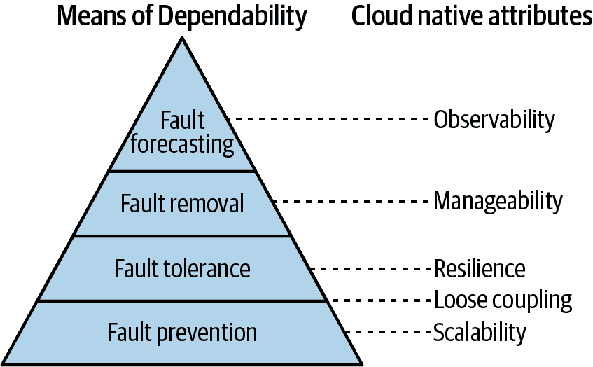
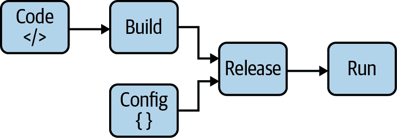

# 第六章。一切都关乎可靠性

> 一个程序最重要的特性是它是否实现了用户的意图。¹
> 
> C.A.R. 霍尔，《ACM 通讯》（1969 年 10 月）

查尔斯·安东尼·理查德（托尼）·霍尔教授是一个非常杰出的人。他发明了快速排序，创立了用于推理计算机程序正确性的霍尔逻辑，并创建了启发 Go 语言中喜爱的并发模型的形式化语言“通信顺序进程”（CSP）。哦，他还发明了空引用。尽管如此，请不要因此而抱怨他。他在 2009 年公开道歉³，称这是他的“十亿美元错误”。

托尼·霍尔（Tony Hoare）可以说是我们所知的编程之父。因此，当他说一个程序最重要的特性是它是否实现了用户的意图时，你可以信以为真。想想这个：霍尔明确地（而且完全正确地）指出，一个程序是否正确执行，取决于程序的*用户*的意图，而不是程序的*创建者*的意图。多么不方便啊，程序的用户的意图并不总是和其创建者的意图一致！

鉴于这一断言，一个用户对程序的第一个期望是“程序工作”。但程序何时才算“工作”呢？这实际上是一个相当大的问题，是云原生设计的核心所在。本章的第一个目标是探讨这个观念，并在过程中引入“可靠性”和“可信赖性”等概念，以更好地描述（并满足）用户的期望。最后，我们将简要回顾云原生开发中常用的一些实践，确保服务达到用户的期望。我们将在本书的其余部分深入讨论每一个实践。

# 云原生的意义何在？

在第一章中，我们花了几页的篇幅来定义“云原生”，从云原生计算基金会的定义开始，逐步深入讨论理想的云原生服务的特性。我们还花了几页时间讨论推动云原生成为一种事物的压力。

然而，我们没有花太多时间去讨论云原生的“为什么”。为什么会有云原生的概念？为什么我们希望系统成为云原生？它的目的是什么？它有什么特别之处？我为什么要关心它？

那么，*为什么*云原生存在？答案其实非常简单：一切都是为了可靠性。在本章的第一部分，我们将深入探讨可靠性的概念，它是什么，为什么如此重要，以及它如何贯穿我们称之为云原生的所有模式和技术。

# 一切关乎可靠性

IBM Garage 全球开发社区实践主管 Holly Cummins 曾经说过，“如果云原生必须成为任何东西的同义词，那它就应该是幂等性。”⁴ Cummins 非常聪明，她说了很多非常聪明的话，⁵ 但我认为她在这一点上只掌握了一半的真相。我认为幂等性非常重要——或许甚至是云原生的必要条件，但不足够。我会详细阐述。

软件的历史，特别是基于网络的软件，一直在努力满足日益复杂用户的期望。已经不再是那些服务可以在晚上“进行维护”的日子了。今天的用户对他们使用的服务依赖很重，并且期望这些服务可用并能迅速响应他们的请求。还记得你上次试图启动 Netflix 电影，花了你生命中最长的五秒钟吗？是的，就是那样。

用户并不关心你的服务需要维护。在你寻找那个神秘的延迟源时，他们不会耐心等待。他们只是想看完《绝命毒师》第二季。⁶

我们所关联的云原生的所有模式和技术——*每一个*——都存在的目的是允许服务在不可靠的环境中规模化部署、运行和维护，这是为了提供可靠的服务，让用户满意。

换句话说，如果“云原生”必须成为任何东西的同义词，那么它就是“可靠性”。

# 可靠性是什么，为什么这么重要？

我并非随意选择“可靠性”这个词。在*系统工程*领域中，这实际上是一个核心概念，这个领域充满了一些非常聪明的人，他们对复杂系统的设计和管理有很多聪明见解。在计算机环境中，可靠性的概念大约 35 年前由 Jean-Claude Laprie 严格定义过，⁷ 他根据用户的期望来定义系统的可靠性。多年来，Laprie 的原始定义已被各种作者调整和扩展，但这是我最喜欢的一种：

> 计算机系统的可靠性指的是其能够避免比用户可接受的更频繁或更严重的故障，以及停机时间比用户认可的更长的情况。⁸
> 
> 计算机系统可靠性的基本概念（2001）

换句话说，一个可靠的系统始终如用户所期望地执行，并且在出现问题时能够迅速修复。

根据这个定义，系统只有在能够*合理*地被信任时才是可靠的。显然，如果系统的任何组件发生故障就无法被视为可靠，或者如果系统需要数小时才能从故障中恢复，也不能被视为可靠。即使系统连续运行数月而没有中断，一个不可靠的系统仍然可能在一个坏日子之前濒临灾难：侥幸并不可靠。

不幸的是，客观衡量“用户期望”是很困难的。因此，如图 6-1 所示，可靠性是一个包含多个更具体和可量化属性（可用性、可靠性和可维护性）的总体概念，所有这些属性都面临着类似的威胁，可以通过类似的手段来克服。


###### 图 6-1\. 贡献于可靠性的系统属性和手段

因此，虽然“可靠性”这个概念本身可能有些模糊和主观，但其贡献的属性是定量和可测量的，足以为实际应用提供帮助：

可用性

系统在任意时刻执行其预期功能的能力。通常表达为系统接收请求成功的概率，定义为正常运行时间除以总时间。

可靠性

系统在给定时间间隔内执行其预期功能的能力。通常表达为平均无故障时间（MTBF：总时间除以故障次数）或故障率（故障次数除以总时间）。

可维护性

系统进行修改和维修的能力。可维护性有多种间接度量方法，从计算圈复杂度到跟踪改变系统行为所需的时间，以满足新要求或将其恢复到功能状态。

###### 注

后来的作者扩展了拉普里对可靠性的定义，包括几个与安全相关的属性，包括安全性、机密性和完整性。我不情愿地省略了这些内容，不是因为安全不重要（安全非常重要！），而是为了简洁起见。讨论安全问题需要一整本书的篇幅。

## 可靠性：不仅仅是运维的事情了

自网络服务引入以来，开发人员的工作是构建服务，系统管理员（“运维”）的工作是将这些服务部署到服务器上并保持其运行。这在一段时间内运作得很好，但它不幸地导致开发人员为了功能开发而牺牲了稳定性和运维。

幸运的是，在过去的十年左右，与 DevOps 运动同时出现了一波新技术，这些技术有潜力彻底改变各种技术人员的工作方式。

在运维方面，随着基础设施和平台即服务（IaaS/PaaS）以及像 Terraform 和 Ansible 这样的工具的可用性，与基础设施的工作从未像现在这样像编写软件。

在开发方面，像容器和无服务器函数这样的技术的普及为开发人员提供了整套“操作类”能力，特别是在虚拟化和部署方面。

结果，软件和基础设施之间曾经明显的界限变得日益模糊。甚至可以说，随着虚拟化等基础设施抽象化技术、容器编排框架如 Kubernetes 和服务网格等软件定义行为的不断进步和采纳，它们甚至可能已经融合了。现在一切都是软件。

对服务可靠性的日益增长需求推动了一整代全新的云原生技术的诞生。这些新技术及其提供的能力产生了显著影响，传统的开发者和运维角色正在适应它们。终于，隔阂正在消失，越来越多的可靠、高质量服务的快速生成成为其所有设计者、实施者和维护者共同努力的结果。

# 实现可靠性

这正是实践的时刻。如果你已经走到这一步，恭喜你。

到目前为止，我们已经讨论了拉普里对“可靠性”的定义，可以（非常）松散地解释为“用户满意”，并且我们已经讨论了贡献于此的可用性、可靠性和可维护性属性。这一切都很好，但是如果没有关于如何实现可靠性的可行建议，整个讨论只是纯粹的学术性质。

拉普里也这样认为，并定义了四大类技术，可以共同用于提高系统的可靠性（或者由于它们的缺乏而降低可靠性）：

故障预防

在系统构建过程中使用故障预防技术，以预防故障的发生或引入。

故障容忍

在系统设计和实施过程中使用故障容忍技术，以防止在存在故障时出现服务故障。

故障去除

使用故障去除技术来减少故障的数量和严重程度。

故障预测

使用故障预测技术来识别故障的存在、产生以及后果。

有趣的是，正如在图 6-2 中所示，这四个类别与我们在第 1 章中介绍的五个云原生属性非常相符。



###### 图 6-2\. 实现可靠性的四种手段及其对应的云原生属性

故障预防和容错构成金字塔底部的两个层次，与可伸缩性、松耦合和弹性相对应。设计可伸缩系统可预防云原生应用程序中常见的各种故障，而弹性技术允许系统在故障不可避免地发生时容忍这些故障。松耦合的技术既可以说属于预防，也可以说属于增强服务容错性的技术。这些技术共同促成了 Laprie 所称的*可靠性采购*：这是系统被赋予执行其指定功能能力的手段。

技术和设计有助于可管理性，旨在生成一个可以轻松修改的系统，简化在识别故障时的排除过程。同样，可观察性自然有助于在系统中预测故障。排除故障和预测技术共同构成了 Laprie 所称的*可靠性验证*：这是获得对系统执行其指定功能能力的信心的手段。

考虑这种关系的影响：35 年前纯粹是学术练习的东西，现在本质上已经被重新发现——显然是独立地作为多年积累经验的自然结果，用于构建可靠的生产系统。可靠性已经走了一整圈。

在接下来的章节中，我们将更全面地探讨这些关系，并预览后续章节，在这些章节中我们将详细讨论这两个显然不同的系统如何实际上相对应得非常密切。

## 故障预防

在我们“可靠性手段”的金字塔底部是专注于预防故障发生或引入的技术。正如资深程序员可以证明的那样，许多——如果不是大多数——类别的错误和故障可以在开发的最早阶段预测和预防。因此，许多故障预防技术在服务的设计和实施过程中发挥作用。

### 良好的编程实践

故障预防是软件工程的主要目标之一，也是任何开发方法论的明确目标，从配对编程到测试驱动开发和代码审查实践。许多这样的技术实际上可以归为“良好的编程实践”，关于这些实践已经有无数优秀的书籍和文章写成，因此我们在这里不会明确涵盖它们。

### 语言特性

选择编程语言也极大地影响您预防或修复故障的能力。一些程序员有时期望的语言特性，如动态类型、指针算术、手动内存管理和抛出异常等，往往会引入意外行为，难以发现和修复，甚至可能被恶意利用。

这些功能强烈推动了 Go 的许多设计决策，最终形成了我们今天拥有的强类型垃圾回收语言。要了解为什么 Go 特别适合开发云原生服务，请回顾第二章。

### 可扩展性

我们在第一章中简要介绍了可扩展性的概念，将其定义为系统在需求显著变化的情况下继续提供正确服务的能力。

在那一节中，我们介绍了两种不同的扩展方法——通过调整现有资源来进行垂直扩展（向上扩展），以及通过添加（或移除）服务实例来进行水平扩展（向外扩展）——以及每种方法的优缺点。

我们将在第七章更深入地探讨这些问题，特别是其中的陷阱和缺点。我们还将大谈关于状态带来的问题。¹¹ 不过，现在，简单地说，需要扩展服务会增加相当多的开销，包括但不限于成本、复杂性和调试。

尽管扩展资源最终通常是不可避免的，但是抵制诱惑在问题上投入硬件通常更好（也更便宜！），并通过考虑运行时效率和算法扩展尽可能推迟扩展事件。因此，我们将介绍一些 Go 的功能和工具，这些功能和工具使我们能够识别和修复像内存泄漏和锁争用这样在规模化系统中常见的问题。

### 松耦合

松耦合，我们在“松耦合”中首次定义，是确保系统组件尽可能少地了解其他组件的系统属性和设计策略。服务之间的耦合程度对系统的扩展能力、隔离和容忍故障有巨大而又常常被低估的影响。

自从微服务出现以来，就有人持反对意见，认为基于微服务的系统部署和维护过于复杂，这证据表明这样的架构不可行。我不同意，但我理解他们的观点，考虑到构建*分布式单块*是多么容易。分布式单块的特征是其组件之间的紧密耦合，导致应用程序同时具有微服务的所有复杂性和典型单块的所有混乱依赖关系。如果您必须一起部署大部分服务，或者如果健康检查失败会导致整个系统发生级联故障，那么您可能有一个分布式单块。

构建松耦合的系统说起来容易，做起来不容易，但只要有些纪律和合理的边界是可能的。在第八章中，我们将介绍如何使用数据交换合同来建立这些边界，以及不同的同步和异步通信模型以及用于实现它们并避免可怕的分布式单块的架构模式和包。

## 容错性

容错性有许多同义词——自修复、自愈、弹性——它们都描述了系统检测错误并防止其向全面故障演变的能力。通常，这包括两个部分：*错误检测*，在正常服务过程中发现错误；以及*恢复*，将系统恢复到可以再次激活的状态。

提供弹性的最常见策略可能是冗余：关键组件的复制（具有多个服务副本）或功能（重试服务请求）。这是一个广泛且非常有趣的领域，涉及一些微妙的陷阱，我们将在第九章详细探讨。

## 故障去除

故障去除，作为四种可靠性手段之一，是在错误显现之前减少故障数量和严重性的过程，即潜在的软件缺陷可能导致错误。

即使在理想条件下，系统也可能出现多种错误或其他异常行为。它可能未能执行预期的操作，或者完全执行了错误的操作，可能还是恶意的。更复杂的是，条件并非总是——或者说往往不是——理想的。

许多故障可以通过测试来识别，这允许您验证系统（或至少其组件）在已知的测试条件下的行为是否符合预期。

但是未知条件呢？需求会变化，现实世界并不在乎你的测试条件。幸运的是，通过努力，可以设计出一个足够可管理的系统，其行为通常可以调整以保持安全运行，顺畅运行，并符合变化的要求。

我们稍后将简要讨论这些内容。

### 验证和测试

在你的代码中找到潜在软件缺陷的确切四种方法：测试、测试、测试和运气不佳。

是的，我在开玩笑，但这并非毫无道理：如果你找不到你的软件缺陷，你的用户会找到它们。如果你幸运的话。如果不幸的话，那么它们将被寻找到的恶意行为者利用。

开个玩笑，软件开发中发现软件缺陷的两种常见方法：

静态分析

静态分析是在不实际执行程序的情况下进行的自动化、基于规则的代码分析。静态分析有助于提供早期反馈，强制执行一致的实践，并在不依赖人类知识或努力的情况下找出常见错误和安全漏洞。

动态分析

通过在受控条件下执行系统或子系统并评估其行为来验证其正确性。更普遍地称为“测试”。

软件测试的关键在于设计为*可测试性*的软件，通过减少其组件的*自由度*——可能状态的范围——来实现。高度可测试的函数具有单一目的，具有明确定义的输入和输出，几乎没有或没有*副作用*；即它们不修改其作用域之外的变量。尽管有些宅男，但这种方法可以最小化每个函数的*搜索空间*——所有可能解决方案的集合。

测试是软件开发中至关重要的步骤，但往往被忽视。Go 的创作者们理解了这一点，并通过`go test`命令和[测试包](https://oreil.ly/PrhXq)将单元测试和基准测试嵌入到语言本身中。不幸的是，深入探讨测试理论远超出了本书的范围，但我们会尽力浅尝其中在第九章中。

### 可管理性

当系统不按照需求行事时，存在缺陷。但是当这些需求改变时会发生什么呢？

设计*可管理性*，最早在“可管理性”中介绍，允许调整系统行为而无需更改代码。一个可管理的系统基本上有“旋钮”，允许实时控制，以确保系统安全、运行顺畅，并符合变化的需求。

可管理性可以采用多种形式，包括（但不限于！）调整和配置资源消耗，应用即时安全补救措施，可以打开或关闭功能的*特性标志*，甚至加载插件定义的行为。

显然，可管理性是一个广泛的主题。我们将在第十章中回顾 Go 提供的一些机制。

## 故障预测

在我们的“可依赖性手段”金字塔的顶端（图 6-2），*故障预测*建立在下面层次获得的知识和实施的解决方案基础之上，试图估计故障的当前数量、未来发生率及可能的后果。

这往往包括猜测和直觉，通常在起始假设不再成立时导致意外故障。更系统化的方法包括[故障模式和影响分析](https://oreil.ly/sNe6P)和压力测试，这些方法对理解系统可能的故障模式非常有用。

在设计为*可观察性*的系统中，我们将在第十一章深入讨论，故障模式指标可以被跟踪，以便在它们显现为错误之前进行预测和修正。此外，当意外故障发生时——它们总会发生——可观测的系统允许快速识别、隔离和修正底层故障。

# 十二要素应用程序的持续相关性

在 2010 年代初，Heroku 的开发者意识到，他们看到的 Web 应用程序一遍又一遍地以同样的根本缺陷被开发。

受现代应用开发中系统性问题的驱使，他们起草了*十二要素应用程序*。这是一套包含十二条规则和指南的开发方法论，用于构建 Web 应用程序，并扩展到云原生应用程序（尽管当时“云原生”并不是一个常用的术语）。这一方法论是为了构建无需重大更改工具、架构或开发实践即可扩展的 Web 应用程序。

+   使用声明性格式进行设置自动化，以减少新开发者加入项目所需的时间和成本。

+   与底层操作系统有清晰的契约，提供在执行环境之间最大的可移植性。

+   适合部署在现代云平台上，无需服务器和系统管理。

+   最小化开发与生产环境之间的差异，实现最大灵活性的持续部署。

+   能够在不显著改变工具、架构或开发实践的情况下进行扩展。

尽管在 2011 年首次发布时并未完全被重视，随着云原生开发复杂性变得更为广泛理解（和感受到），*十二要素应用程序*及其倡导的属性已开始被引用为任何服务成为云原生的最低标准。

## I. 代码库

> 一个代码库，在版本控制中跟踪，多次部署。
> 
> 十二要素应用程序

对于任何给定的服务，应有且仅有一个代码库用于生成多个不可变版本，以供部署到多个环境中。这些环境通常包括生产站点以及一个或多个暂存和开发站点。

将多个服务共享相同代码往往会导致模块之间的界限模糊，在时间上趋向于像单体应用，使得在不预期的方式下对服务的一个部分进行更改而影响另一个部分（或另一个服务！）变得更加困难。相反，共享代码应重构为可以单独进行版本控制并通过依赖管理器包含的库。

然而，将单个服务分布在多个代码库中几乎不可能自动应用服务生命周期中的构建和部署阶段。

## II. 依赖关系

> 明确声明和隔离（代码）依赖项。
> 
> 十二要素应用

对于代码库的任何给定版本，`go build`，`go test`和`go run`应该是确定性的：无论如何运行它们，它们应该具有相同的结果，而且产品对相同的输入应该始终以相同的方式响应。

但是，如果依赖项——一个程序员无法控制的导入代码包或安装的系统工具——以某种方式发生变化，导致构建失败，引入错误，或与服务不兼容呢？

大多数编程语言都提供了用于分发支持库的打包系统，Go 也不例外。¹³ 通过使用[Go 模块](https://oreil.ly/68ds1)来完全准确地声明所有依赖关系，您可以确保导入的包不会在不被察觉地改变下破坏您的构建。

在某种程度上来说，服务通常应尽量避免使用`os/exec`包的`Command`函数来外部调用像 ImageMagick 或`curl`这样的工具。

是的，你的目标工具可能在所有（或大多数）系统上都可用，但无法*保证*它们在当前或未来的任何可能运行的地方都存在并且与服务完全兼容。理想情况下，如果您的服务需要外部工具，那么该工具应该通过将其包含在服务的代码库中来*vendored*。

## III. 配置

> 将配置存储在环境中。
> 
> 十二要素应用

配置——在不同环境（测试、生产、开发环境等）之间可能变化的任何内容——应始终与代码清晰分离。在任何情况下，应用程序的配置都不应该被嵌入到代码中。

配置项可能包括但绝不限于：

+   数据库或其他上游服务依赖的 URL 或其他资源句柄——即使它在不久的将来可能不会更改。

+   任何类型的机密信息，如外部服务的密码或凭据。

+   每个环境值，例如部署的规范主机名。

通过将配置从代码中 *外部化* 到某个配置文件（通常是 YAML¹⁴），可以从存储库中随代码一起提交，也可以不提交。这当然比在代码中硬编码配置要好，但也不是理想的解决方案。

首先，如果配置文件存储在存储库外部，很容易意外地检入。更重要的是，这些文件往往会蔓延，不同环境的不同版本存储在不同的位置，这样会使得难以以一致的方式查看和管理配置。

或者，*你可以* 在存储库中为每个环境拥有不同版本的配置，但这可能会很笨重，并且往往会导致一些尴尬的存储库操作。

而不是将配置作为代码或者外部配置，*The Twelve Factor App* 建议将配置存储为 *环境变量*。以这种方式使用环境变量实际上有很多优点：

+   它们是标准的，并且在大多数操作系统和语言中都是通用的。

+   在不修改任何代码的情况下轻松在部署之间进行更改。

+   它们非常容易注入到容器中。

Go 有几个用于此目的的工具。

第一种——也是最基本的——是 `os` 包，它提供了 `os.Getenv` 函数用于此目的：

```go
name := os.Getenv("NAME")
place := os.Getenv("CITY")

fmt.Printf("%s lives in %s.\n", name, place)
```

对于更复杂的配置选项，有几个优秀的包可供选择。其中，[`spf13/viper`](https://oreil.ly/8giE4) 似乎特别受欢迎。Viper 的示例代码可能如下所示：

```go
viper.BindEnv("id")             // Will be uppercased automatically
viper.SetDefault("id", "13")    // Default value is "13"

id1 := viper.GetInt("id")
fmt.Println(id1)                // 13

os.Setenv("ID", "50")           // Typically done outside of the app!

id2 := viper.GetInt("id")
fmt.Println(id2)                // 50
```

此外，Viper 提供了许多标准包不具备的功能，例如默认值、类型化变量以及从命令行标志、各种格式的配置文件，甚至是像 etcd 和 Consul 这样的远程配置系统。

我们将在 第十章 深入探讨 Viper 和其他配置主题。

## IV. 后备服务

> 将后备服务视为已附加的资源。
> 
> 十二因素应用

后备服务是服务正常运行过程中通过网络消耗的任何下游依赖项（参见 “上游和下游依赖”）。服务不应区分相同类型的后备服务。无论是由同一组织管理的内部服务，还是由第三方管理的远程服务，都不应该有任何区别。

对于服务而言，每个不同的上游服务都应被视为另一个资源，每个都可以通过可配置的 URL 或其他资源句柄进行访问，如图 6-3 所示。所有资源都应被视为同样容易受到 *分布式计算的谬论* 的影响（如果需要，可以参考 第四章 进行复习）。


###### 图 6-3\. 每个上游服务应被视为另一个资源，每个都可通过可配置的 URL 或其他资源句柄进行寻址，每个同样受到分布式计算谬误的影响

换句话说，你自己团队的系统管理员运行的 MySQL 数据库应该和 AWS 管理的 RDS 实例没有区别。对于*任何*上游服务，无论它是运行在另一个半球的数据中心还是在同一台服务器上的 Docker 容器中，都应如此对待。

通过更改配置值，能够随意将任何资源替换为同类资源（内部管理或其他方式）的服务，可以更轻松地部署到不同的环境中，更容易进行测试，更易于维护。

## V. 构建、发布、运行

> 严格区分构建和运行阶段。
> 
> 十二要素应用

每个（非开发）部署——特定版本的构建代码和配置的结合——应该是不可变的，并具有唯一的标签。如果有必要，应该能够精确地重新创建一个部署，如果（千万不得已的话）需要将部署回滚到较早版本。

通常，这通过三个明确的阶段完成，如图 6-4 所示，并在以下内容中描述：

构建

在构建阶段，自动化流程检索特定版本的代码，获取依赖项，并编译一个我们称为*构建*的可执行工件。每个构建应始终具有唯一标识符，通常是时间戳或递增的构建编号。

发布

在发布阶段，特定的构建与目标部署的配置结合在一起。生成的*发布物*可以立即在执行环境中执行。和构建一样，发布物也应该有一个唯一的标识符。重要的是，使用相同构建版本生成发布物不应该涉及重新构建代码：为了确保环境一致性，每个环境特定的配置应使用相同的构建工件。

运行

在运行阶段，发布物被交付到部署环境，并通过启动服务的进程来执行。

理想情况下，每当部署新代码时，都应自动生成一个新版本化的构建。



###### 图 6-4\. 将代码库部署到（非开发）环境的过程应该在明确的构建、发布和运行阶段中执行

## VI. 进程

> 将应用程序作为一个或多个无状态进程执行。
> 
> 十二要素应用

服务过程应该是无状态的，并且彼此独立。任何需要持久化的数据都应存储在有状态的后端服务中，通常是数据库或外部缓存。

我们已经花了一些时间讨论无状态性——在下一章中我们会更多地讨论这一点，所以我们不会进一步深入这个问题。

然而，如果你有兴趣提前阅读，可以自由查看“状态与无状态”。

## VII. 数据隔离

> 每个服务管理自己的数据。
> 
> 云原生，数据隔离

每个服务应该是完全*自包含*的。也就是说，它应该管理自己的数据，并且只能通过专为此目的设计的 API 访问其数据。如果这听起来很熟悉，那很好！实际上，这是微服务的核心原则之一，我们将在“微服务系统架构”中进一步讨论。

很多时候，这将被实现为一种请求-响应服务，如 RESTful API 或 RPC 协议，通过监听来自某个端口的请求来导出。但这也可以采用异步、基于事件的服务形式，使用发布-订阅消息模式。这两种模式将在第八章中详细描述。

最后，尽管在 Go 世界中你不会看到这种情况，但某些语言和框架允许将应用服务器注入到执行环境中，以创建面向 Web 的服务。这种做法通过打破数据隔离和环境不可知性，限制了可测试性和可移植性，*强烈不建议*采用这种做法。

## VIII. 可扩展性

> 通过进程模型进行扩展。
> 
> 十二因素应用

服务应该能够通过增加更多实例来水平扩展。

我们在本书中多次谈到可扩展性。我们甚至将整个第七章专门讨论了这个问题。有充分的理由：可扩展性的重要性不可低估。

当然，仅仅加强运行服务的一个服务器确实很方便——在（非常）短期内这没问题，但在长期看来，纵向扩展是一种失败的策略。如果幸运的话，你最终会遇到一个无法再扩展的点。更有可能的是，你的单一服务器会在你无法扩展的速度下遭遇负载波动，或者突然死掉，而没有冗余的故障转移。¹⁶ 这两种情况都会导致大量不满的用户。我们会在第七章中进一步讨论可扩展性。

## IX. 可处置性

> 通过快速启动和优雅关闭来最大化健壮性。
> 
> 十二因素应用

云环境非常靠不住：已经配置好的服务器有时会在奇怪的时间消失。服务应该考虑到这一点，采用*可处置*的方式：服务实例应能够随时启动或停止，无论是否有意。

服务应该努力将启动时间最小化，以减少部署（或重新部署）服务的时间，从而实现弹性扩展。由于 Go 语言没有虚拟机或其他重大开销，因此在这方面表现特别出色。

容器提供快速的启动时间，并且在这方面也非常有用，但必须注意保持镜像大小小，以最小化每次部署新镜像时产生的数据传输开销。这是另一个 Go 语言的优点：它的自包含二进制文件通常可以安装到 `SCRATCH` 镜像中，无需外部语言运行时或其他外部依赖。我们在前一章中已经展示了这一点，在 “将您的键值存储容器化” 中。

服务还应当能够在收到 `SIGTERM` 信号时关闭，方法是保存所有需要保存的数据，关闭打开的网络连接，或完成未完成的工作，或将当前工作返回工作队列。

## X. 开发/生产对等性

> 开发、演示和生产环境应尽可能保持一致。
> 
> 十二要素应用

任何可能的开发与生产之间的差异都应尽可能小。当然，这包括代码差异，但远不止于此：

代码分歧

开发分支应该小而短命，应尽快进行测试并部署到生产环境中。这可以最小化环境之间的功能差异，并减少部署和回滚的风险。

堆栈分歧

而不是在开发和生产中使用不同的组件（例如，在 OS X 上使用 SQLite 而在 Linux 上使用 MySQL），环境应尽可能保持一致。轻量级容器是实现这一目标的绝佳工具。这可以最大程度地减少因几乎相同但又不完全相同的实现之间的不便差异而可能导致的问题。

人员分歧

以前，程序员编写代码，操作员部署代码很常见，但这种安排会造成冲突的激励机制和反生产的对抗性关系。让代码作者参与部署并对其在生产环境中的行为负责有助于打破开发与运维的隔阂，并且能够使稳定性与速度的激励机制保持一致。

这些方法共同作用，有助于缩小开发与生产之间的差距，从而促进快速、自动化和持续的部署。

## XI. 日志

> 将日志视为事件流。
> 
> 十二要素应用

日志——服务的永不停息的意识流——在分布式环境中尤为有用。通过提供对运行应用程序行为的可见性，良好的日志记录可以极大简化定位和诊断错误的任务。

传统上，服务将日志事件写入本地磁盘上的文件。然而，在云规模下，这只会使有价值的信息难以查找、访问不便且无法聚合。在像 Kubernetes 这样的动态、短暂的环境中，您的服务实例（及其日志文件）甚至可能在您查看它们之前就已经不存在了。

相反，云原生服务应将日志信息视为一系列事件流，直接将每个事件未经缓冲地写入`stdout`。它不应关注像路由或日志事件存储等实现细节，而是允许执行者决定如何处理它们。

尽管看似简单（甚至有些违反直觉），这一小改动却带来了极大的自由。

在本地开发中，程序员可以在终端中观察事件流以观察服务的行为。在部署中，执行环境可以捕获输出流并转发到一个或多个目的地，例如日志索引系统（如 Elasticsearch、Logstash 和 Kibana（ELK）或 Splunk）以进行审查和分析，或数据仓库以进行长期存储。

我们将在第十一章更详细地讨论日志和日志记录，以观测性为背景。

## XII. 管理流程

> 将管理/管理任务作为一次性过程运行。
> 
> 十二要素应用程序

在所有原始的十二要素中，这是唯一明显显露其年龄的要素。首先，它明确提倡进入环境手动执行任务。

明确一点：*对服务器实例进行手动更改会创建特定的个体（即“特别的雪花”）。这是不好的。*参见“特别的雪花”。

假设您拥有可以进入的环境，您应该假定它可以（并最终会）随时被销毁并重新创建。

暂时不考虑这一切，让我们将重点放在其最初的意图上：管理和管理任务应作为一次性过程运行。这可以有两种解释，每种都需要采用不同的方法：

+   如果您的任务是一个类似于数据修复或数据库迁移的管理流程，应将其作为短暂的过程运行。容器和函数是这类目的的极好载体。

+   如果您的更改是对服务或执行环境的更新，则应修改相应的服务或环境构建/配置脚本。

# 概要

在这一章中，我们考虑了“云原生的意义是什么？”这个问题。通常的答案是“在云中工作的计算机系统。”但“工作”可以指任何事情。我们当然可以做得更好。

因此，我们回到像托尼·霍尔和 J-C·拉普里这样的思想家，他们提供了答案的第一部分：*可靠性*。换句话说，计算机系统应该以用户可接受的方式运行，尽管处于基本不可靠的环境中。

显然，说起来容易，做起来难，所以我们审视了三种关于如何实现它的思考方法：

+   Laprie 学术中的“可靠性手段”，包括预防、容忍、排除和故障预测。

+   亚当·威金斯的《十二要素应用》，它采用了更具规范性（在某些地方略显过时）的方法。

+   我们自己的“云原生属性”，基于云原生计算基金会对“云原生”的定义，我们在第一章中介绍，并围绕整本书组织。

尽管本章本质上只是对理论的简短调查，但这里有许多重要的基础信息，描述了我们所称的“云原生”的动机和手段。

¹ C.A.R.霍尔。《计算机程序设计的公理基础》。*ACM 通讯*，1969 年 10 月，第 12 卷，第 10 期，第 576-583 页。[*https://oreil.ly/jOwO9*](https://oreil.ly/jOwO9).

² 当艾德斯格·W·迪科斯特拉（Edsger W. Dijkstra）创造出“GOTO 被认为有害”这个表达时，他正是在引用霍尔在结构化编程中的工作。

³ 托尼·霍尔。《空引用：十亿美元的错误》。*InfoQ.com*。2009 年 8 月 25 日。[*https://oreil.ly/4QWS8*](https://oreil.ly/4QWS8).

⁴ *云原生关乎文化，而非容器*。霍莉·卡明斯。云原生伦敦 2018 年。

⁵ 如果你有机会听她演讲，我强烈推荐你抓住机会。

⁶ 记得沃尔特那时对简的所作所为吗？真是太乱了。

⁷ J-C·拉普里。《可靠计算与容错：概念与术语》。第 15 届容错计算国际研讨会（FTCS-15），1985 年 6 月，第 2-11 页。[*https://oreil.ly/UZFFY*](https://oreil.ly/UZFFY).

⁸ A·阿维兹涅斯、J·拉普里和 B·兰德尔。《计算机系统可靠性基本概念》。LAAS-CNRS 研究报告 1145 号，2001 年 4 月。[*https://oreil.ly/4YXd1*](https://oreil.ly/4YXd1).

⁹ 如果你还没有，从[*Site Reliability Engineering: How Google Runs Production Systems*](https://oreil.ly/OJn99)开始。真的非常好。

¹⁰ 许多组织使用服务水平目标（SLO）来达到精确的目的。

¹¹ 应用状态很难，如果做得不对，对可伸缩性是一种毒药。

¹² 亚当·威金斯的《十二要素应用》。2011 年。[*https://12factor.net*](https://12factor.net).

¹³ 尽管那已经太久了！

¹⁴ 世界上最糟糕的配置语言（除了其他所有的）。

¹⁵ 亚当·威金斯。“端口绑定。” *十二要素应用.* 2011\. [*https://oreil.ly/bp8lC*](https://oreil.ly/bp8lC).

¹⁶ 可能是在凌晨三点钟。

¹⁷ “烘焙”有时用来指代创建新容器或服务器镜像的过程。
