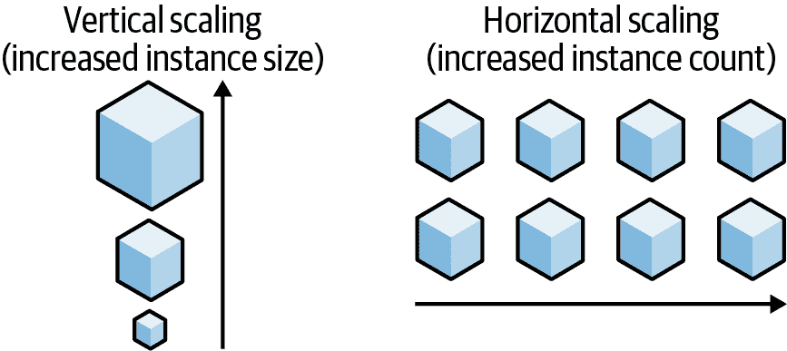
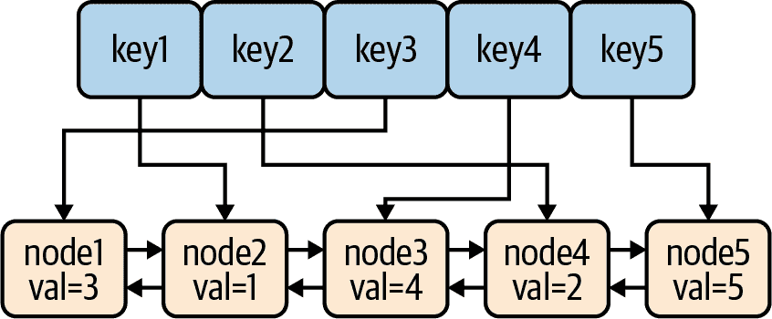
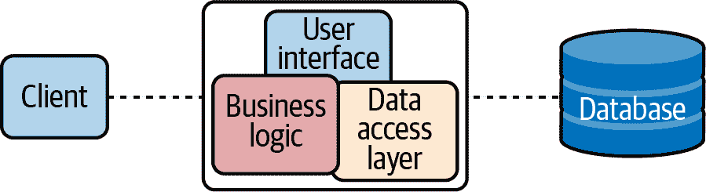
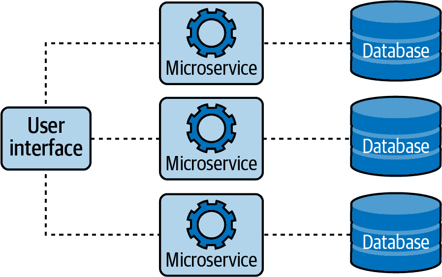
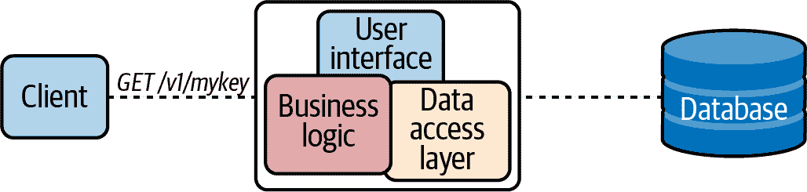
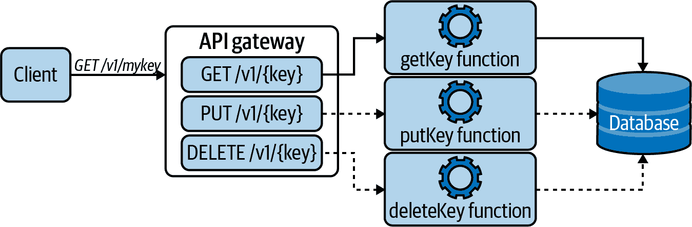

# 第七章：扩展性

> 一些最好的编程是在纸上完成的，真的。将其输入到计算机中只是一个小细节。¹
> 
> 马克斯·卡纳特-亚历山大，《代码简洁：软件基础知识》

2016 年夏天，我加入了一家小公司，该公司将各类表格和杂项文书数字化，这些文书通常是州和地方政府所熟悉和喜爱的。他们核心应用的状态相当典型于初创阶段的创业公司，因此我们着手工作，到了秋天，已经成功将其容器化，并用代码描述了其基础设施，并完全自动化了部署。

我们的一位客户是弗吉尼亚东南部的一个小型沿海城市，所以当第一个近十年来的大西洋第五级飓风“马修”预测将在附近登陆时，当地官员恪尽职守地宣布进入紧急状态，并使用我们的系统为市民创建必要的填写文书。然后他们将其发布到社交媒体上，同时有 50 万人同时登录。

当值班人员收到警报时，查看指标后发现服务器的聚合 CPU 使用率达到了 100%，并且数十万个请求超时。

所以，我们将所需的服务器数量增加了一个零，创建了一个“待办”任务来实现自动扩展，并继续我们的日常工作。在 24 小时内，高峰期已过，所以我们对服务器进行了扩展。

除了自动扩展的好处之外，我们从中学到了什么？²

首先，这凸显了一个事实，即如果没有扩展能力，我们的系统肯定会遭受长时间的停机。但是能够根据需求增加资源意味着即使在我们曾经预期的远远超出的负载下，我们也能为用户提供服务。作为额外的好处，如果任何一个服务器失败，其工作可以被分配给其他幸存者。

第二，拥有远多于所需的资源不仅是浪费的，而且是昂贵的。在需求减少时缩减我们的实例的能力意味着我们只需支付我们所需的资源费用。这对预算有限的初创公司来说是一个重大的优势。

不幸的是，因为不可扩展的服务在初始条件下似乎运行得很完美，所以在服务设计过程中，扩展性并不总是一个考虑因素。虽然这在短期内可能完全足够，但不能超出其最初预期的服务也意味着有限的生命周期价值。更重要的是，在服务难以重构以适应扩展性时，从一开始就考虑这一点可以在长远节省时间和金钱。

首先，这本书主要是一本 Go 语言书籍，或者至少更像是一本 Go 语言书籍，而不是基础设施或架构书籍。虽然我们会讨论可扩展的架构和消息传递模式等内容，但本章的大部分内容将集中展示如何使用 Go 语言来开发依赖于扩展性方程中的其他（非基础设施）部分的服务：效率。³

# 可扩展性是什么？

您可能还记得，可扩展性的概念最初是在第一章中首次介绍的，其中它被定义为系统在面对需求显著变化时继续提供正确服务的能力。按照这个定义，如果一个系统在负载急剧增加时无需重新设计即可执行其预期功能，那么可以认为该系统是可扩展的。

请注意，这个定义⁴ 实际上并没有说明任何增加物理资源的内容。相反，它强调了系统处理大幅需求波动的能力。这里“扩展”的对象是需求的大小。虽然增加资源是实现可扩展性的一种完全可接受的方法，但它并不完全等同于可扩展性。为了使事情变得更加混乱一点，术语“扩展”也可以应用于系统，这种情况下它确实意味着专用资源量的变化。

那么我们如何在不增加资源的情况下处理高需求呢？正如我们将在“推迟扩展：效率”中讨论的那样，考虑到*效率*的系统天生更具可扩展性，因为它们能够优雅地吸收高水平的需求，而不需要立即为每次剧烈的需求波动响应而添加硬件，也不需要因“以防万一”而大规模过度配置。

## 不同形式的扩展

不幸的是，即使是最有效的效率策略也有其极限，最终您会发现自己需要扩展服务以提供额外的资源。可以通过两种不同的方式来实现这一点（见图 7-1），每种方式都有其自身的优缺点：

垂直扩展

一个系统可以通过增加其资源分配来进行*垂直扩展*（或称为*向上扩展*）。在公共云中，通过更改实例大小，现有服务器可以相对容易地进行垂直扩展，但只能进行到没有更大的实例类型（或资金）为止。

水平扩展

一个系统可以通过复制系统或服务来进行*水平扩展*（或称为*向外扩展*），以减轻任何单个服务器的负担。使用这种策略的系统通常能够扩展以处理更大量的负载，但正如您将在“状态与无状态”中看到的那样，状态的存在可能会使某些系统难以或无法采用这种策略。



###### 图 7-1。垂直扩展可以是有效的短期解决方案；水平扩展在技术上更具挑战性，但可能是更好的长期策略。

这两个术语用于描述关于扩展的最常见的思考方式：拿整个系统，只是*多做*。然而，实际上还有许多其他的扩展策略在使用中。

可能其中最常见的是*功能分区*，如果你还不知道它的名字，你肯定已经对它非常熟悉了。功能分区涉及将复杂的系统分解为较小的功能单元，这些单元可以独立优化、管理和扩展。你可能会认出这是从基本程序设计到高级分布式系统设计的许多最佳实践的泛化。

另一种常见的方法是在具有大量数据的系统中 —— 特别是数据库中 —— 使用的*分片*。采用这种策略的系统通过将数据分割为称为*分片*的分区来分配负载，每个分片保存大数据集的特定子集。一个基本的例子在 “通过分片最小化锁定” 中展示。

# 四种常见的瓶颈

随着系统需求的增加，总会有一个点，其中一个资源无法跟上步伐，有效地阻碍了进一步扩展的努力。这个资源已经成为了*瓶颈*。

通过识别和解决瓶颈来使系统恢复可操作的性能水平。这可以通过增加瓶颈组件 —— 垂直扩展 —— 来实现，例如增加内存或升级 CPU。正如你可能从 “不同形式的扩展” 讨论中记得的那样，这种方法并不总是可行（或具有成本效益），而且永远不能依赖它。

然而，通常可以通过增强或减少对受影响组件的负担来解决瓶颈，利用系统仍然丰富的另一个资源。例如，数据库可以通过在 RAM 中缓存数据来避免磁盘 I/O 瓶颈；相反，一个内存需求高的服务可以将数据分页到磁盘上。水平扩展并不会使系统免疫：增加更多实例可能意味着更多的通信开销，这会给网络增加额外的负担。即使是高并发系统在需求增加时也可能成为它们自身内部工作方式的受害者，例如锁争用等现象也会发挥作用。有效地使用资源通常意味着进行权衡。

当然，修复瓶颈需要首先识别受限组件，虽然有许多不同的资源可能成为扩展努力的目标 —— 无论是通过实际扩展资源还是更有效地使用它 —— 这些努力往往集中在仅有的四种资源上：

CPU

系统中央处理器每单位时间可以执行的操作数，对许多系统来说是常见的瓶颈。CPU 的扩展策略包括缓存昂贵确定性操作的结果（以内存为代价），或者简单地增加处理器的大小或数量（以扩展为代价）。

内存

可以存储在主存储器中的数据量。尽管今天的系统可以存储数十甚至数百吉字节的数据，但即使如此，对于依赖内存以规避磁盘 I/O 速度限制的数据密集型系统来说，这仍然可能不足够。扩展策略包括将数据从内存转移到磁盘（以磁盘 I/O 为代价）或外部专用缓存（以网络 I/O 为代价），或者简单地增加可用内存的数量。

磁盘 I/O

数据可以从硬盘或其他持久存储介质读取和写入的速度。磁盘 I/O 是高度并行系统的常见瓶颈，这些系统读写大量磁盘，例如数据库。扩展策略包括将数据缓存在 RAM 中（以内存为代价）或使用外部专用缓存（以网络 I/O 为代价）。

网络 I/O

数据可以从网络上的特定点或总体发送的速度。网络 I/O 直接转化为每单位时间传输的数据量。网络 I/O 的扩展策略通常有限，⁵ 但网络 I/O 尤其适合各种优化策略，我们将很快讨论这些策略。

随着系统需求的增加，几乎肯定会发现系统受到其中一个资源的瓶颈限制，虽然可以应用效率策略，但这些策略往往以牺牲一个或多个其他资源为代价，因此最终可能会发现系统再次受到另一个资源的瓶颈限制。

# 状态和无状态

我们在 “应用状态与资源状态” 中简要讨论了无状态性，其中我们描述了应用状态——关于应用程序或客户端使用方式的服务器端数据——应尽可能避免。但这次，让我们花点时间讨论一下状态是什么，为什么它可能会有问题，以及我们可以采取什么措施。

结果表明，“状态”在定义上有些难以捉摸，所以我将尽我所能自行解释。对于本书的目的，我将状态定义为应用程序变量的集合，如果变更会影响应用程序行为。⁶

## 应用状态与资源状态

大多数应用程序都具有某种形式的状态，但并非所有状态都是平等的。它有两种形式，其中一种远不如另一种理想。

首先，有*应用状态*，它存在于应用程序需要在本地记住事件的任何时候。每当有人谈论*有状态*的应用程序时，他们通常指的是一种设计为使用这种本地状态的应用程序。“本地”是一个关键词。

其次，有*资源状态*，对每个客户端都是相同的，与客户端的操作无关，比如存储在外部数据存储或由配置管理管理的数据。这可能会引起误解，但说一个应用程序是*无状态*并不意味着它没有任何数据，只是它被设计成没有任何本地持久数据。它唯一的状态是资源状态，通常因为它的所有状态都存储在某个外部数据存储中。

为了说明两者之间的区别，想象一个跟踪客户会话并将其与某个应用程序上下文相关联的应用程序。如果用户的会话数据由应用程序在本地维护，那就被视为“应用程序状态”。但如果数据存储在外部数据库中，则可以将其视为远程资源，并且它将被视为“资源状态”。

应用程序状态有点像“反可扩展性”。多个有状态服务的实例会因为接收到的不同输入而迅速发现它们的各自状态开始分歧。服务器亲和力通过确保每个客户端的请求都发送到同一台服务器来提供对此特定情况的解决方法，但这种策略会带来相当大的数据风险，因为任何单个服务器的故障可能会导致数据丢失。

## 无状态的优势

到目前为止，我们已经讨论了应用程序状态和资源状态之间的差异，甚至提出了——尽管没有太多证据（尚）——应用程序状态是不好的。然而，无状态性提供了一些非常明显的优势：

可扩展性

最明显和经常被引用的好处是，无状态应用程序可以独立处理每个请求或交互，与先前的请求无关。这意味着任何服务副本都可以处理任何请求，允许应用程序在不丢失处理任何正在进行的会话或请求所需数据的情况下增长、收缩或重新启动。这在自动缩放服务时尤为重要，因为托管服务的实例、节点或 Pod 可以（并且通常会）意外创建和销毁。

耐久性

存在于一个地方的数据（例如单个服务副本）可以（并且在某个时候*会*）在该副本因任何原因而消失时丢失。请记住：所有东西在“云端”最终都会消失。

简单性

在没有任何应用程序状态的情况下，无状态服务免于… 嗯… 管理它们的状态。⁷ 不需要维护服务端状态同步、一致性和恢复逻辑⁸ 使得无状态 API 更简单，因此更易于设计、构建和维护。

可缓存性

无状态服务提供的 API 相对容易设计为可缓存。如果服务知道特定请求的结果无论何时谁发起都将始终相同，结果可以安全地存储以供以后轻松检索，从而提高效率并减少响应时间。

这些可能看起来是四种不同的事物，但在它们提供的内容上存在重叠。特别是无状态性使得服务更简单、更安全地构建、部署和维护。

# 延迟扩展：效率

在云计算的背景下，我们通常将可扩展性定义为系统增加网络和计算资源的能力。然而，经常被忽视的是在可扩展性中*效率*的角色。具体来说，系统处理需求变化时*不*需要添加（或极度过度预留）专用资源的能力。

虽然可以争论大多数时候大多数人不关心程序效率，但随着对服务的需求增加，这种说法开始不那么正确。如果一种语言有相对较高的每进程并发开销——这在动态类型语言中经常发生——它将比轻量级语言更快消耗所有可用内存或计算资源，因此需要更多的资源和扩展事件来支持同样的需求。

这在 Go 语言并发模型的设计中是一个主要考虑因素，它的 goroutine 实际上不是线程，而是轻量级的协程多路复用到多个操作系统线程上。每个协程的成本几乎只是分配堆栈空间，允许可能同时执行数百万个协程。

因此，在本节中，我们将介绍一些 Go 语言的特性和工具，它们允许我们避免常见的扩展问题，如内存泄漏和锁争用，并在出现这些问题时识别和修复它们。

## 使用 LRU 缓存进行高效缓存

将数据缓存到内存是一种非常灵活的效率策略，可以用来减轻从 CPU 到磁盘 I/O 或网络 I/O 的任何压力，甚至只是减少与远程或其他运行缓慢操作相关的延迟。

缓存的概念看起来当然*似乎*很简单。你有一些你希望记住值的东西——比如昂贵（但确定性的）计算的结果——然后将其放入映射中以备将来使用。对吧？

嗯，你可以这样做，但很快就会开始遇到问题。随着核心数和 goroutine 数量的增加，会发生什么？由于你没有考虑并发性，很快就会发现你的修改互相干扰，导致一些不愉快的结果。而且，由于我们忘记从映射中移除任何内容，它将继续无限增长，直到消耗掉所有内存。

我们需要的是一个缓存，它：

+   支持并发的读取、写入和删除操作

+   随着核心数和 goroutine 数量的增加，性能表现良好

+   不会无限增长以消耗所有可用内存

这个困境的一个常见解决方案是 LRU（最近最少使用）缓存：一种特别可爱的数据结构，跟踪每个键最近被“使用”（读取或写入）的时间。当添加一个值到缓存中导致超出预定义的容量时，缓存能够“淘汰”（删除）其最近最少使用的值。

讨论如何实现 LRU 缓存的详细内容超出了本书的范围，但我会说这个方法相当巧妙。如图 7-2 所示，LRU 缓存包含一个双向链表（实际上包含值）和一个将每个键关联到链表节点的映射。每当读取或写入一个键时，相应的节点就会移动到列表的底部，这样最近未使用的节点总是位于顶部。

有几种 Go 的 LRU 缓存实现可用，尽管目前核心库中没有（尚未）。可能最常见的是作为[golang/groupcache](https://oreil.ly/Q5pzk)库的一部分。然而，我更喜欢 HashiCorp 开源的扩展版本`groupcache`，[`hashicorp/golang-lru`](https://oreil.ly/25ESk)，它有更好的文档，并包含用于并发安全的`sync.RWMutexes`。



###### 图 7-2\. LRU 缓存包含一个映射和一个双向链表，使其能够在超出容量时丢弃过时项目

HashiCorp 的库包含两个构造函数，每个函数返回类型为`*Cache`和一个`error`的指针：

```go
// New creates an LRU cache with the given capacity.
func New(size int) (*Cache, error)

// NewWithEvict creates an LRU cache with the given capacity, and also accepts
// an "eviction callback" function that's called when an eviction occurs.
func NewWithEvict(size int,
    onEvicted func(key interface{}, value interface{})) (*Cache, error)
```

`*Cache`结构体有许多附加方法，其中最有用的是：

```go
// Add adds a value to the cache and returns true if an eviction occurred.
func (c *Cache) Add(key, value interface{}) (evicted bool)

// Check if a key is in the cache (without updating the recent-ness).
func (c *Cache) Contains(key interface{}) bool

// Get looks up a key's value and returns (value, true) if it exists.
// If the value doesn't exist, it returns (nil, false).
func (c *Cache) Get(key interface{}) (value interface{}, ok bool)

// Len returns the number of items in the cache.
func (c *Cache) Len() int

// Remove removes the provided key from the cache.
func (c *Cache) Remove(key interface{}) (present bool)
```

还有其他几种方法。请查看[GoDocs](https://oreil.ly/ODcff)获取完整列表。

在下面的示例中，我们创建并使用了一个容量为两个的 LRU 缓存。为了更好地突出淘汰过程，我们包含了一个回调函数，每当发生淘汰时会向`stdout`打印一些输出。请注意，我们决定在`init`函数中初始化`cache`变量，这是一个特殊的函数，在变量声明在评估其初始值后自动调用`main`函数之前：

```go
package main

import (
    "fmt"
    lru "github.com/hashicorp/golang-lru"
)

var cache *lru.Cache

func init() {
    cache, _ = lru.NewWithEvict(2,
        func(key interface{}, value interface{}) {
            fmt.Printf("Evicted: key=%v value=%v\n", key, value)
        },
    )
}

func main() {
    cache.Add(1, "a")           // adds 1
    cache.Add(2, "b")           // adds 2; cache is now at capacity

    fmt.Println(cache.Get(1))   // "a true"; 1 now most recently used

    cache.Add(3, "c")           // adds 3, evicts key 2

    fmt.Println(cache.Get(2))   // "<nil> false" (not found)
}
```

在上述程序中，我们创建了一个容量为两个的`cache`，这意味着添加第三个值将迫使淘汰最近最少使用的值。

在将 `{1:"a"}` 和 `{2:"b"}` 的值添加到缓存后，我们调用 `cache.Get(1)`，这使得 `{1:"a"}` 比 `{2:"b"}` 更近期被使用。因此，在下一步中当我们添加 `{3:"c"}` 时，`{2:"b"}` 将被驱逐，所以下一个 `cache.Get(2)` 不应返回任何值。

如果我们运行此程序，我们将能够看到它的实际效果。我们期望以下输出：

```go
$ go run lru.go
a true
Evicted: key=2 value=b
<nil> false
```

LRU 缓存是一个在大多数情况下作为全局缓存的优秀数据结构，但它也有一个局限性：在非常高的并发水平下——每秒数百万次操作——它将开始出现一些竞争问题。

不幸的是，在撰写本文时，Go 似乎仍然没有一个 *非常* 高吞吐量的缓存实现。⁹

## 高效的同步

Go 中一个常见的格言是 “不要通过共享内存来通信；通过通信来共享内存”。换句话说，通常情况下，通道优于共享数据结构。

这是一个非常强大的概念。毕竟，Go 的并发原语——goroutine 和通道——提供了一个强大而表达力强的同步机制，使得一组使用通道交换数据结构引用的 goroutine 通常可以完全不需要锁。

（如果您对通道和 goroutine 的细节有些模糊，不要紧张。花点时间翻回 “Goroutines”。没关系，我会等待的。）

话虽如此，Go *确实* 提供了更传统的锁机制，例如 `sync` 包。但是，如果通道如此出色，为什么我们还要使用像 `sync.Mutex` 这样的东西？在什么情况下会使用它？

事实证明，通道确实非常有用，但它们并非所有问题的解决方案。当您处理许多离散值时，通道非常出色，并且在传递数据所有权、分发工作单元或通信异步结果时是更好的选择。而互斥锁则非常适合同步访问缓存或其他大型状态结构。

归根结底，没有工具能解决所有问题。最终，最好的选择是使用最具表达力和/或最简单的选项。

### 通过通信来共享内存

多线程简单；加锁困难。

在本节中，我们将使用一个经典示例——最初在 Andrew Gerrand 的经典 *Go Blog* 文章 “Share Memory By Communicating”¹⁰ 中提出——来演示这个真理，并展示 Go 通道如何使并发更安全、更易于理解。

假设有一个虚构的程序，通过发送 GET 请求并等待响应来轮询 URL 列表。问题在于，每个请求可能要花费相当长的时间等待服务响应：从毫秒到秒甚至更长，具体取决于服务情况。这种操作显然非常适合使用一些并发机制，不是吗？

在传统的线程环境中，依赖锁定进行同步，你可能会像以下这样结构化其数据：

```go
type Resource struct {
    url        string
    polling    bool
    lastPolled int64
}

type Resources struct {
    data []*Resource
    lock *sync.Mutex
}
```

如你所见，我们不是拥有一堆 URL 字符串切片，而是有两个结构体——`Resource` 和 `Resources`——每一个都已经装配了许多同步结构，超出了我们实际关心的 URL 字符串范畴。

要以传统方式多线程轮询过程，你可能会有一个像以下这样在多个线程中运行的`Poller`函数：

```go
func Poller(res *Resources) {
    for {
        // Get the least recently polled Resource and mark it as being polled
        res.lock.Lock()

        var r *Resource

        for _, v := range res.data {
            if v.polling {
                continue
            }
            if r == nil || v.lastPolled < r.lastPolled {
                r = v
            }
        }

        if r != nil {
            r.polling = true
        }

        res.lock.Unlock()

        if r == nil {
            continue
        }

        // Poll the URL

        // Update the Resource's polling and lastPolled
        res.lock.Lock()
        r.polling = false
        r.lastPolled = time.Nanoseconds()
        res.lock.Unlock()
    }
}
```

这样做虽然能完成任务，但还有很大的改进空间。代码长达一页，难以阅读、难以推理，甚至不包括 URL 轮询逻辑或优雅地处理`Resources`池的耗尽。

现在让我们看看使用 Go 通道实现相同功能的示例。在这个例子中，`Resource`已经被简化为其基本组件（URL 字符串），而`Poller`是一个函数，它从输入通道接收`Resource`值，并在完成时将它们发送到输出通道：

```go
type Resource string

func Poller(in, out chan *Resource) {
    for r := range in {
        // Poll the URL

        // Send the processed Resource to out
        out <- r
    }
}
```

简直就像……简单。我们完全摒弃了`Poller`中的机械式锁定逻辑，我们的`Resource`数据结构不再包含繁琐的数据记录。事实上，剩下的都是重要的部分。

但是，如果我们想要多个`Poller`进程怎么办？这不正是我们一开始尝试做的吗？答案再次简单而又光辉：goroutines。看看下面的例子：

```go
for i := 0; i < numPollers; i++ {
    go Poller(in, out)
}
```

通过执行`numPollers`个 goroutines，我们创建了`numPollers`个并发进程，每个都从同一个通道读取和写入。

前面的示例中省略了很多内容，重点突出了相关部分。如果你想看一个完整、惯用的 Go 程序示例，使用这些思想，请参见[“通过通信共享内存”](https://oreil.ly/HF1Ay) 代码演示。

### 通过缓冲通道减少阻塞

在本章的某个地方，你可能会想：“当然，通道很棒，但是写入通道仍然会阻塞。”毕竟，每次在通道上的发送操作都会阻塞，直到有相应的接收，对吧？嗯，事实证明，这只是*大体上*是真的。至少，默认的非缓冲通道是这样的。

然而，正如我们在“通道缓冲”中首次描述的那样，可以创建具有内部消息缓冲区的通道。在这种缓冲通道上的发送操作仅在缓冲区满时阻塞，接收操作仅在缓冲区空时阻塞。

你可能还记得，缓冲通道可以通过将额外的容量参数传递给`make`函数来创建，以指定缓冲区的大小：

```go
ch := make(chan type, capacity)
```

缓冲通道在处理“突发”负载时特别有用。事实上，我们在第五章已经使用了这种策略，当我们初始化我们的`FileTransactionLogger`时。从该章节中提炼一些分散的逻辑，可以得到如下内容：

```go
type FileTransactionLogger struct {
    events       chan<- Event       // Write-only channel for sending events
    lastSequence uint64             // The last used event sequence number
}

func (l *FileTransactionLogger) WritePut(key, value string) {
    l.events <- Event{EventType: EventPut, Key: key, Value: value}
}

func (l *FileTransactionLogger) Run() {
    l.events = make(chan Event, 16)             // Make an events channel

    go func() {
        for e := range events {                 // Retrieve the next Event
            l.lastSequence++                    // Increment sequence number
        }
    }()
}
```

在这一段中，我们有一个 `WritePut` 函数，可以调用它向一个 `events` 通道发送消息，这个通道在 `Run` 函数中创建的匿名 goroutine 的 `for` 循环中接收。如果 `events` 是一个标准通道，每次发送都会阻塞，直到匿名 goroutine 完成接收操作。大部分情况下这可能没问题，但如果多个写入速度比 goroutine 处理它们的速度快，那么上游客户端将会被阻塞。

通过使用缓冲通道，我们使得这段代码能够处理最多 16 个紧密集中的写入请求。然而，第 17 次写入*会*被阻塞。

还需要考虑使用这样的缓冲通道会导致数据丢失的风险，即使在任何消费 goroutine 能够清空缓冲区之前程序终止。

### 最小化分片锁定

正如我们在“高效同步”中提到的那样，尽管通道很好用，但并不解决*所有*问题。一个常见的例子是大型中央数据结构，例如缓存，它不能轻易地分解为离散的工作单元。¹¹

当共享数据结构需要并发访问时，通常会使用锁定机制，例如 `sync` 包提供的互斥锁，就像我们在“使您的数据结构具有并发安全性”中所做的那样。例如，我们可以创建一个包含映射和嵌入的 `sync.RWMutex` 的结构体：

```go
var cache = struct {
    sync.RWMutex
    data map[string]string
}{data: make(map[string]string)}
```

当一个例程想要写入缓存时，它会小心地使用 `cache.Lock` 来建立写入锁，使用 `cache.Unlock` 在完成后释放锁。我们甚至可能希望将其包装在一个便利函数中，如下所示：

```go
func ThreadSafeWrite(key, value string) {
    cache.Lock()                                    // Establish write lock
    cache.data[key] = value
    cache.Unlock()                                  // Release write lock
}
```

根据设计，这限制了写入访问权限，只有持有锁的例程才能访问。这种模式通常运行良好。然而，正如我们在第四章讨论的那样，随着并发处理数据的进程数量增加，进程等待锁释放的平均时间也会增加。你可能记得这种不幸的情况的名称：锁争用。

虽然在某些情况下，通过增加实例的数量可以解决这个问题，但这也会增加复杂性和延迟，因为需要建立分布式锁定，并确保写入一致性。在一个服务实例内部减少共享数据结构周围的锁争用的替代策略是*垂直分片*，其中一个大型数据结构被分成两个或更多部分，每个部分代表整体的一部分。使用这种策略，每次只需锁定整体结构的一部分，从而减少总体锁争用。

你可能还记得我们在 “分片” 中详细讨论过垂直分片。如果你对垂直分片的理论或实现不清楚，请随时回顾那一部分。

## 内存泄漏可能导致…致命错误：运行时：内存不足

内存泄漏是一类 bug，即使在不再需要内存时也没有被释放。这些 bug 可能非常隐晦，并且经常困扰像 C++ 这样需要手动管理内存的语言。尽管垃圾收集确实通过试图回收程序不再使用的对象所占用的内存来帮助，但像 Go 这样的垃圾收集语言并不免于内存泄漏。数据结构仍然可能无限增长，未解决的 goroutine 仍然可能累积，甚至未停止的 `time.Ticker` 值也可能失控。

在本节中，我们将回顾一些特定于 Go 语言的内存泄漏的常见原因，以及如何解决它们。

### 泄漏的 goroutine

我并不知道关于这个问题的任何实际数据，¹² 但基于我个人的经验，我非常怀疑 goroutine 是 Go 中内存泄漏的主要来源之一。

每当执行一个 goroutine 时，它最初会分配一个小的内存堆栈 —— 2048 字节，可以根据其运行时的需求动态调整大小。确切的最大堆栈大小取决于许多因素，¹³ 但它基本上反映了可用物理内存的量。

通常情况下，当 goroutine 返回时，其堆栈要么被释放，要么被设置为待回收状态。¹⁴ 然而，无论是设计上的还是意外的，实际上并不是每个 goroutine 都会返回。例如：

```go
func leaky() {
    ch := make(chan string)

    go func() {
        s := <-ch
        fmt.Println("Message:", s)
    }()
}
```

在前面的示例中，`leaky` 函数创建一个通道并执行一个 goroutine 从该通道读取。`leaky` 函数返回时没有错误，但是如果你仔细观察，你会发现从未向 `ch` 发送任何值，因此该 goroutine 永远不会返回，其堆栈也永远不会被释放。甚至会有一些副作用：因为 goroutine 引用了 `ch`，垃圾收集器无法清理该值。

所以现在我们确实有一个真正的内存泄漏。如果这样的函数经常被调用，消耗的内存总量将会随着时间的推移而慢慢增加，直到完全耗尽。

这是一个人为构建的例子，但有很多原因使程序员可能希望创建长时间运行的 goroutine，因此通常很难知道这样的过程是否是故意创建的。

那么我们该怎么办？Dave Cheney 在这里提供了一些很好的建议：“在不知道 goroutine 如何结束时，你绝对不应该启动 goroutine…每次在程序中使用 `go` 关键字启动 goroutine 时，你必须知道该 goroutine 如何以及何时退出。如果你不知道答案，那就可能会导致内存泄漏。”¹⁵

这可能看起来像是显而易见的，甚至是琐碎的建议，但这非常重要。编写泄漏 goroutine 的函数非常容易，而这些泄漏可能很难识别和找出。

### 永远滴答作响的 `Ticker`

在你的 Go 代码中，经常会希望添加某种时间维度，以便将其在将来的某个时间点执行，或者以某个间隔重复执行。

`time` 包提供了两个有用的工具来为 Go 代码执行添加时间维度： `time.Timer`，它在将来的某个时间点触发；以及 `time.Ticker`，它在指定的间隔重复触发。

然而，`time.Timer` 有一个有限的有效生命周期，有明确定义的开始和结束；而 `time.Ticker` 则没有这样的限制。`time.Ticker` 可以永远存在。也许你可以看到这样的情况会导致什么结果。

定时器和 Ticker 使用了类似的机制：每个都提供一个通道，在每次触发时发送一个值。以下示例同时使用了两者：

```go
func timely() {
    timer := time.NewTimer(5 * time.Second)
    ticker := time.NewTicker(1 * time.Second)

    done := make(chan bool)

    go func() {
        for {
            select {
            case <-ticker.C:
                fmt.Println("Tick!")
            case <-done:
                return
            }
        }
    }()

    <-timer.C
    fmt.Println("It's time!")
    close(done)
}
```

`timely` 函数执行一个 goroutine，通过监听来自 `ticker` 的信号——每秒发生一次——或者来自返回 goroutine 的 `done` 通道，定期循环。 `<-timer.C` 这一行将阻塞，直到 5 秒计时器触发，允许关闭 `done`，触发 `case <-done` 条件并结束循环。

`timely` 函数按预期完成，并且 goroutine 有一个定义的返回，因此你可能会以为一切都没问题。但这里有一个非常隐匿的 bug：运行 `time.Ticker` 的值包含一个无法清理的活动 goroutine。因为我们从未停止计时器，所以 `timely` 包含了一个内存泄漏。

解决方法：始终确保停止你的定时器。`defer` 对此目的非常有效：

```go
func timelyFixed() {
    timer := time.NewTimer(5 * time.Second)
    ticker := time.NewTicker(1 * time.Second)
    defer ticker.Stop()                         // Be sure to stop the ticker!

    done := make(chan bool)

    go func() {
        for {
            select {
            case <-ticker.C:
                fmt.Println("Tick!")
            case <-done:
                return
            }
        }
    }()

    <-timer.C
    fmt.Println("It's time!")
    close(done)
}
```

通过调用 `ticker.Stop()`，我们关闭了底层的 `Ticker`，使其可以被垃圾回收器回收，并防止泄漏。

## 在效率上

在本节中，我们涵盖了一些常见的方法，用于改进程序的效率，从使用 LRU 缓存而不是映射以限制缓存的内存占用，到有效同步进程的方法，再到防止内存泄漏的方法。虽然这些部分可能看起来并不特别密切相关，但它们对构建可扩展的程序都是重要的。

当然，还有无数其他的方法，我本想也想包括进来，但由于时间和空间的基本限制，未能如愿。

在下一节中，我们将再次改变主题，讨论一些常见的服务架构及其对可扩展性的影响。虽然这些可能与 Go 特别相关性不大，但在云原生环境中，它们对可扩展性的研究至关重要。

# 服务架构

微服务的概念首次出现在 2010 年代初期，作为对早期面向服务架构（SOA）的改进和简化，同时也是对当时最常见的服务器端应用程序的反应——即包含在单个大型可执行文件中的*单体*架构。¹⁶

当时，微服务架构的想法——一个由多个小服务组成的单一应用程序，每个服务在自己的进程中运行并通过轻量级机制进行通信——是革命性的。与单体架构不同，后者要求重新构建和部署整个应用程序以实现任何系统变更，微服务可以通过完全自动化的部署机制独立部署。这听起来可能微不足道，甚至琐碎，但其影响是（并且仍然是）巨大的。

如果你问大多数程序员来比较单体和微服务，你可能会得到的大多数答案是关于单体运行速度慢、笨重，而微服务则小巧、灵活且是新宠。然而，一概而论总是不准确的，因此让我们花点时间思考一下这是否正确，以及单体有时是否可能是正确的选择。

我们将首先定义我们所说的单体和微服务。

## 单体系统架构

在*单体架构*中，一个服务的所有功能上的区别都耦合在一起。一个常见的例子是 Web 应用程序，其用户界面、数据层和业务逻辑通常混合在一起，往往在单个服务器上。

传统上，企业应用程序主要由三个部分构建，如图 7-3 所示：运行在用户机器上的客户端界面，包含所有应用数据的关系数据库，以及处理所有用户输入、执行所有业务逻辑并读写数据库数据的服务器端应用程序。



###### 图 7-3\. 在单体架构中，一个服务的所有功能上的区别都耦合在一起。

当时，这种模式是合理的。所有业务逻辑在单一进程中运行，使开发更加简单，甚至可以通过在负载均衡器后运行更多的单体来扩展，通常使用粘性会话以维持服务器关联性。一切都*非常好*，多年来这一直是构建 Web 应用程序的最常见方式。

即使在今天，对于相对较小或简单的应用程序（对于“小”和“简单”的某些定义），这种方式也非常有效（尽管我仍然强烈推荐无状态性而不是服务器关联性）。

然而，随着单体架构中功能数量和复杂性的增加，开始出现了一些困难：

+   单体应用通常作为单一的构件部署，因此即使是做出小的更改，通常也需要构建、测试和部署整个单体的新版本。

+   即使有着最好的意图和努力，单体代码随着时间推移往往会降低模块化，使得在一个服务的一部分进行更改而不会以意外的方式影响另一部分变得更加困难。

+   扩展应用程序意味着创建整个应用程序的副本，而不仅仅是需要扩展的部分。

单体应用程序越大越复杂，这些效果就越明显。到了 2000 年代早期到中期，这些问题是众所周知的，导致沮丧的程序员尝试将他们的大型复杂服务分解为更小、可以独立部署和可扩展的组件。到了 2012 年，这种模式甚至有了一个名字：微服务架构。

## 微服务系统架构

*微服务架构*的定义特征是将其功能组件划分为一组独立构建、测试、部署和扩展的离散子服务。

这在图 7-4 中有所说明，其中一个用户界面服务——可能是提供 HTML 的 Web 应用程序或公共 API——与客户端进行交互，但不是在本地处理业务逻辑，而是向一个或多个组件服务发出次要请求来处理某些特定功能。这些服务甚至可能会进一步请求更多的服务。



###### 图 7-4\. 在微服务架构中，功能组件被划分为离散的子服务

尽管微服务架构相比单体应用具有许多优势，但也需要考虑重要的成本。一方面，微服务提供了一些显著的好处：

+   明确定义的责任分离支持和强化了模块化，对于较大或多个团队非常有用。

+   微服务应该能够独立部署，这使得它们更易管理，可以隔离错误和故障。

+   在微服务系统中，不同的服务可以使用最适合其功能的技术——语言、开发框架、数据存储等。

不应低估这些好处：微服务的增强模块化和功能隔离通常会产生比具有相同功能的单体应用更易于维护的组件。由此产生的系统不仅更易于部署和管理，而且更易于理解、推理和扩展，适用于更多的程序员和团队。

###### 警告

在理论上混合不同技术可能听起来很吸引人，但要慎重使用。每种技术都增加了对工具和专业知识的新要求。采纳新技术——任何新技术的利弊¹⁷——应始终经过仔细考虑。

微服务的离散性使得它们比单体应用程序更容易维护、部署和扩展。然而，虽然这些确实是可以带来真正回报的真正好处，但也有一些缺点：

+   微服务的分布性质使它们容易受到分布式计算的谬误的影响（见第四章），这使得它们在编程和调试时变得更加困难。

+   在服务之间共享任何形式的状态通常会非常困难。

+   部署和管理多个服务可能非常复杂，并且往往需要高水平的运营成熟度。

因此，在这些因素的基础上，你会选择哪个？单体架构的相对简单性，还是微服务的灵活性和可扩展性？你可能已经注意到，大多数微服务的好处在于应用程序变得更大或者工作在其上的团队数量增加时才会显现出来。因此，许多作者建议先从单体架构开始，然后再进行分解。

个人观点上，我要提一下，我从未见过任何组织成功地拆分一个大型单体系统，但我见过很多尝试这样做的。这并不意味着不可能，只是很难。我不能告诉你应该从微服务开始构建你的系统，还是先用单体架构然后再进行拆分。如果我试图这么做，肯定会收到很多愤怒的邮件。但无论你做什么，请保持无状态。

## 无服务器架构

无服务器计算是 Web 应用程序架构中一个非常流行的话题，关于它已经消耗了大量的（数字）墨水。很多这种炒作是由主要的云提供商推动的，它们在无服务器方面投入了大量资源，但并非全部。

但无服务器计算，究竟是什么呢？

嗯，通常情况下，这要看你问的是谁。然而，就本书的目的而言，我们将其定义为一种实用计算形式，在这种形式中，由程序员编写的一些服务器端逻辑会在预定义的触发器下透明地在托管的短暂环境中执行。这有时也被称为“函数即服务”或“FaaS”。所有主要的云提供商都提供了 FaaS 实现，例如 AWS 的 Lambda 或 GCP 的 Cloud Functions。

这些函数非常灵活，可以有用地整合到许多架构中。事实上，正如我们将很快讨论的那样，甚至可以构建完全不使用传统服务，而完全由 FaaS 资源和第三方托管服务构建的*无服务器架构*。

### 无服务器计算的利与弊

和任何其他架构决策一样，选择部分或完全无服务器架构应该仔细权衡所有可用选项。尽管无服务器提供了一些明显的好处（一些是显而易见的（无需管理服务器！），其他一些则不那么明显（成本和能源节约）），但它与传统架构非常不同，并且具有自己的一系列缺点。

话虽如此，让我们开始权衡一下。让我们从优势开始：

运营管理

无服务器架构最明显的好处可能就是减少了操作开销。¹⁹ 没有需要规划和维护的服务器，也不需要购买许可证或安装软件。

可扩展性

使用无服务器函数时，负责根据需求扩展容量的是提供商而不是用户。因此，实施者可以花费较少的时间和精力来考虑和实现扩展规则。

降低成本

FaaS 提供商通常采用“按需付费”的模式，仅在运行函数时分配时间和内存时收费。这比部署传统服务到（可能是低效利用的）服务器要节省成本得多。

生产力

在 FaaS 模型中，工作单位是事件驱动函数。这种模型倾向于鼓励“首先考虑函数”的思维方式，导致的代码通常更简单、更易读，也更容易测试。

然而，并不是一切都是如此美好。无服务器架构确实存在一些真正的缺点，也需要考虑到：

启动延迟

当首次调用函数时，它必须由云提供商“启动”。这通常需要不到一秒钟，但在某些情况下，可能会为初始请求增加 10 秒或更多的延迟。这被称为*冷启动*延迟。此外，如果函数在几分钟内没有被调用——不同的供应商有所不同——则会被提供商“关闭”，因此当再次调用时就必须经历另一次冷启动。如果您的函数没有足够的空闲时间而被关闭，则通常不会成为问题，但如果您的负载特别“突发”，这可能是一个重大问题。

可观察性

尽管大多数云供应商为其 FaaS 服务提供了一些基本的监控功能，但通常相当基础。虽然第三方提供商一直在努力填补这一空白，但你的临时函数提供的数据质量和数量通常都不如人意。

测试

对于无服务器函数来说，单元测试通常比较简单，但集成测试却相当困难。模拟无服务器环境往往是困难的，甚至不可能，而模拟的效果也很难保证。

成本

虽然在需求较低时，“按需付费”的模式可能会更加便宜，但在某一点上，这种说法就不再成立了。事实上，非常高的负载水平可能变得相当昂贵。

显然，双方都有很多需要考虑的问题，而且尽管目前对无服务器的炒作很多，我认为这在某种程度上是有道理的。然而，虽然无服务器承诺（并且在很大程度上实现了）可扩展性和降低成本，但它确实有很多陷阱，包括但不限于测试和调试的挑战。更不用说对可观察性的运维负担增加了！²⁰

最后，正如我们将在下一节中看到的那样，无服务器架构也需要比传统架构更多的前期规划。虽然有些人可能认为这是一个积极的特点，但它确实增加了显著的复杂性。

### 无服务器服务

正如前面提到的，函数即服务（FaaS）足够灵活，可以作为完全不使用传统服务的整个无服务器架构的基础，而是完全基于 FaaS 资源和第三方托管服务构建。

举个例子，让我们以熟悉的三层系统为例，在这个系统中，客户端向服务发出请求，服务与数据库交互。一个很好的例子是我们在第五章开始的键值存储，其（尽管原始）单片架构可能看起来像图 7-5 所示。



###### 图 7-5\. 我们的原始键/值存储的单片架构

要将此单体架构转换为无服务器架构，我们需要使用*API 网关*：这是一个托管服务，配置为公开特定的 HTTP 端点，并将每个端点的请求定向到特定资源——通常是一个 FaaS 函数——该函数处理请求并发出响应。使用这种架构，我们的键/值存储可能看起来像图 7-6 所示。



###### 图 7-6\. API 网关将 HTTP 调用路由到无服务器处理程序函数

在这个例子中，我们用 API 网关替换了单体架构，该网关支持三个端点：`GET /v1/{key}`, `PUT /v1/{key}`, 和 `DELETE /v1/{key}`（`{key}`组件表示此路径将匹配任何字符串，并将其引用为`key`）。

API 网关被配置为将其三个端点的请求定向到不同的处理函数——`getKey`、`putKey`和`deleteKey`，分别执行处理该请求和与后备数据库交互的所有逻辑。

当然，这是一个非常简单的应用程序，并没有考虑到诸如身份验证之类的事情（可以由许多优秀的第三方服务提供，如 Auth0 或 Okta），但有些事情是显而易见的。

首先，有更多的移动部件需要你深入了解，这就需要相当多的前期规划和测试。例如，如果处理函数中出现错误会发生什么？请求会怎么样？它会被转发到其他目标，还是可能被发送到死信队列以供进一步处理？

不要低估这种复杂性增加的重要性！用分布式、完全托管的组件替换进程内交互，往往会引入各种问题和故障情况，在前者中根本不存在。你很可能已经把一个相对简单的问题变成了一个极其复杂的问题。复杂性会导致失败；简单性则能实现扩展。

其次，由于所有这些不同的组件，需要比单体或小型微服务系统更复杂的分布式监控。由于 FaaS 极大地依赖云提供商，这可能会有挑战，或者至少会显得尴尬。

最后，FaaS 的短暂性意味着所有状态，甚至像缓存这样的短期优化，都必须外部化到数据库、外部缓存（如 Redis）或网络文件/对象存储（如 S3）。同样，可以争论这是一件好事，但这确实增加了前期的复杂性。

# 摘要

写这一章非常困难，不是因为没有太多可以说的，而是因为可扩展性是一个如此庞大的主题，涉及到许多不同的内容我可以深入探讨。每一个这些内容在我的脑海中激烈地较量了好几个星期。

我甚至最终放弃了一些完全不错的架构内容，回过头来看，它们对本书来说简直不合适。幸运的是，我能够挽救一大块关于消息传递的工作，最终移入了第八章。我想它在那里更加合适。

在那几周里，我花了大量时间思考可扩展性的真正含义，以及效率在其中所起的作用。最终，我认为决定在解决扩展问题时花费大量时间在编程方案上——而不是基础设施方案上——是正确的。

总而言之，我认为最终的结果是不错的。我们确实涵盖了很多内容：

+   我们审查了扩展的不同方向，以及扩展出去通常是最佳的长期策略。

+   我们讨论了状态和无状态，以及应用状态为何是“反可扩展性”的本质。

+   我们学到了一些高效的内存缓存策略，以及避免内存泄漏的方法。

+   我们比较并对比了单片、微服务和无服务器架构。

那确实很多，虽然我希望能更详细地深入探讨一些问题，但我很高兴至少能触及到我所触及的内容。

¹ Kanat-Alexander, Max. *Code Simplicity: The Science of Software Design*. O’Reilly Media, 2012 年 3 月 23 日。

² 老实说，如果我们已经实现了自动缩放，我可能根本不会记得发生了这件事。

³ 如果你想了解更多关于云原生基础设施和架构的信息，已经有许多优秀的书籍写成。我特别推荐 Justin Garrison 和 Kris Nova 的 *Cloud Native Infrastructure*，以及 Pini Reznik、Jamie Dobson 和 Michelle Gienow 的 *Cloud Native Transformation*（均由 O’Reilly Media 出版）。

⁴ 这是我的定义。我承认它与其他常见的定义有所不同。

⁵ 一些云服务提供商对较小的实例施加了较低的网络 I/O 限制。在某些情况下，增加实例的大小可能会增加这些限制。

⁶ 如果你有更好的定义，请告诉我。我已经在考虑第二版了。

⁷ 我知道我在那里说了“状态”这个词很多次。写作真的很难。

⁸ 另见：幂等性。

⁹ 然而，如果你对在 Go 中实现高性能缓存感兴趣，请看 Manish Rai Jain 在 [*Dgraph Blog*](https://oreil.ly/N6lrh) 上关于该主题的出色文章，“Go 缓存的现状”。

¹⁰ Gerrand, Andrew. “通过通信共享内存。” *Go 博客*, 2010 年 7 月 13 日。[*https://oreil.ly/GTURp*](https://oreil.ly/GTURp) 本节部分内容基于 Google 的作品进行了修改和 [分享](https://oreil.ly/D8ntT)，并根据 [Creative Commons 4.0 归属许可协议](https://oreil.ly/la3YW) 使用。

¹¹ 你可能可以把通道硬塞到与缓存交互的解决方案中，但你可能会发现这比锁定更难以简化。

¹² 如果你有兴趣，告诉我！

¹³ Dave Cheney 写了一篇关于这个主题的优秀文章，题为 [*为什么 Goroutine 的堆栈是无限的？*](https://oreil.ly/PUCLF)，如果你对 Goroutine 内存分配的动态性感兴趣，我建议你去看看。

¹⁴ 有一篇由 Vincent Blanchon 撰写的关于 Goroutine 回收的很好的文章，题为 [*Go 如何回收 Goroutines?*](https://oreil.ly/GnoV2)。

¹⁵ Cheney, Dave. “不要在不知道如何停止的情况下启动 Goroutine。” dave.cheney.net, 2016 年 12 月 22 日。[*https://oreil.ly/VUlrY*](https://oreil.ly/VUlrY)。

¹⁶ 并不是它们已经消失了。

¹⁷ 是的，即使是在 Go 中也是如此。

¹⁸ Bowers, Daniel 等人。“2019 年计算基础设施技术成熟周期。”*Gartner*，Gartner 研究，2019 年 7 月 26 日，[*https://oreil.ly/3gkJh*](https://oreil.ly/3gkJh)。

¹⁹ 这可是名副其实的名字！

²⁰ 对不起，不存在所谓的 NoOps。
