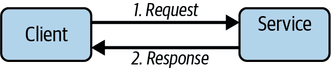
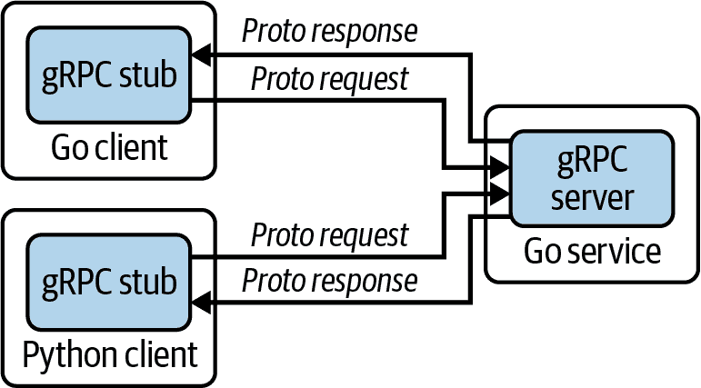
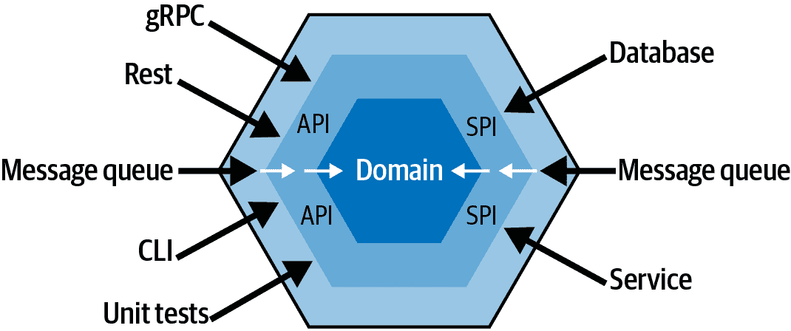

# 第八章 松散耦合

> 我们建造计算机的方式，就像我们建造城市一样——随着时间的推移，没有计划，在废墟上建造。
> 
> Ellen Ullman，《程序员的愚蠢化》（1998 年 5 月）

耦合是一种在理论上看起来很简单，但在实践中却非常具有挑战性的迷人主题之一。正如我们将讨论的那样，系统中引入耦合的方式有很多，这意味着它也是一个重要的主题。你可能想象得到，这一章是一个雄心勃勃的章节，我们将涵盖很多内容。

首先，我们将介绍这个主题，深入探讨“耦合”的概念，并讨论“松散”与“紧”耦合的相对优点。我们将介绍一些最常见的耦合机制，以及某些类型的紧耦合如何导致可怕的“分布式单块”。

接下来，我们将讨论服务间通信，以及脆弱的交换协议是引入分布式系统紧耦合的常见方式之一。我们将介绍今天使用的一些常见协议，以尽量减少两个服务之间的耦合程度。

在第三部分中，我们将稍微改变方向，远离分布式系统，转向服务本身的实现。我们将讨论服务作为代码实体，由于实现混合和违反关注点分离而导致的耦合，并介绍插件作为动态添加实现的一种方法。

最后，我们将讨论六边形架构，这是一种架构模式，将松散耦合作为其设计哲学的核心支柱。

在整章中，我们将尽力平衡理论、架构和实施。大部分章节将花费在有趣的内容上：讨论各种管理耦合的策略，特别是（但不仅限于）在分布式环境中，并通过扩展我们的示例键/值存储来演示。

# 紧耦合

“耦合”是描述组件之间直接知识程度的一种浪漫术语。例如，向服务发送请求的客户端从定义上来说与该服务是耦合的。然而，耦合的程度可以差异很大，从两个极端之间的任何地方都有可能。

“紧耦合”组件对另一个组件有大量了解。也许两者需要相同版本的共享库才能进行通信，或者客户端需要了解服务器的架构或数据库架构。在短期优化时很容易构建紧耦合系统，但它们有一个巨大的缺点：两个组件之间的耦合越紧密，一个组件的更改就越可能需要对另一个组件进行相应的更改。因此，紧耦合系统失去了微服务架构的许多优势。

相比之下，“松散耦合”的组件对彼此的直接了解很少。它们相对独立，通常通过具有变更鲁棒性的抽象进行交互。设计为松散耦合的系统需要更多的前期规划，但可以更自由地升级、重新部署，甚至完全重写，而不会对依赖于它们的系统产生很大影响。

简而言之，如果想知道你的系统有多紧密地耦合，就问问某个组件可以进行多少种和什么类型的更改，而不会对其他组件产生不利影响。

###### 注意

一定程度的耦合并不一定是坏事，特别是在系统早期的阶段。过度抽象和复杂化很容易陷入，但过早优化仍然是万恶之源。

## Tight Coupling Takes Many Forms

在分布式系统中，组件之间的紧耦合表现形式多种多样。然而，它们都有一个根本性缺陷——依赖另一个组件的某种属性，错误地假设这种属性不会变化。大多数情况下，可以将它们归为几个广泛的类别，根据它们耦合的资源。

### 脆弱的交换协议

还记得 SOAP（简单对象访问协议）吗？统计数据显示，可能不太记得了²。SOAP 是在 1990 年代末开发的消息传递协议，旨在实现可扩展性和实现中立性。SOAP 服务提供了一个*合同*，客户端可以遵循该合同格式化他们的请求³。合同的概念在当时是一种突破，但 SOAP 的实现过于脆弱：如果合同以任何方式改变，客户端必须随之更新。这一要求意味着 SOAP 客户端与其服务紧密耦合。

人们很快意识到这是一个问题，并且 SOAP 迅速失去了它的光芒。自此以后，REST 在很大程度上取代了它，虽然有了显著的改进，但往往也会引入自己的紧耦合。2016 年，Google 发布了 gRPC（gRPC 远程过程调用⁴），这是一个开源框架，具有许多有用的特性，其中包括允许组件之间的松耦合关系，这一点尤为重要。

我们将在“服务之间的通信”中讨论一些更为当代的选项，看看如何使用 Go 的`net/http`包构建 REST/HTTP 客户端，并通过 gRPC 前端扩展我们的键/值存储。

### 共享依赖

2016 年，Facebook 的 Ben Christensen 在微服务从业者峰会上[发表了演讲](https://oreil.ly/ZX2Oe)，讨论了另一种越来越常见的用于紧密耦合分布式服务的机制，并在过程中引入了“分布式单体”的术语。

本书中描述了一个反模式，即服务*必须*使用特定的库和库版本才能启动和相互交互。这些系统发现它们被一个全局依赖所累，因此更新这些共享库可能迫使所有服务同步升级。这种共享依赖紧密耦合了整个服务群。

### 共享的瞬时点

往往系统设计成这样，客户端期望服务立即响应。使用这种*请求-响应消息*模式的系统隐含地假设一个服务存在并随时准备好快速响应。但如果没有准备好，请求将失败。可以说它们在时间上*耦合*。

时间耦合并不一定是不良实践，有时甚至是可取的，特别是当人类等待及时响应时。我们甚至详细说明了如何在“请求-响应消息”部分构建这样的客户端。

但如果响应不一定受时间限制，那么一个更安全的方法可能是将消息发送到一个中间队列，接收者可以在准备好时从中检索，这种消息模式通常称为*发布-订阅消息*（简称“pub-sub”）。

### 固定地址

微服务需要互相通信是其本质。但要做到这一点，它们首先必须找到彼此。在网络上定位服务的这一过程称为*服务发现*。

传统上，服务位于相对固定、众所周知的网络位置，可以通过引用某些集中注册表来发现。最初这是通过手动维护的`hosts.txt`文件实现的，但随着网络规模的扩大，DNS 和 URL 的采用也在增加。

传统 DNS 适用于生命周期较长的服务，其网络位置变化不大，但短暂的基于微服务的应用程序的流行增加，服务实例的生命周期通常以秒或分钟计量，而不是以月或年计量。在这样动态的环境中，URL 和传统 DNS 变成了紧密耦合的另一种形式。

这种对动态、流动服务发现的需求推动了完全新策略的采用，比如*服务网格*，这是一个专门的层，用于促进分布式系统中资源之间的服务到服务通信。

###### 注意

不幸的是，本书无法涵盖服务发现或服务网格等迷人且快速发展的主题。但服务网格领域非常丰富，有许多成熟的开源项目和活跃的社区，比如[Envoy](https://oreil.ly/woDEQ)，[Linkerd](https://linkerd.io)，[Istio](https://oreil.ly/zggyu)，以及像[Hashicorp’s Consul](https://consul.io)这样的商业产品。

# 服务之间的通信

在分布式系统中，通信和消息传递是关键功能，所有分布式系统都依赖于某种形式的消息传递来接收指令和方向，交换信息，并提供结果和更新。当然，如果接收者无法理解消息，则消息就毫无意义。

为了使服务能够通信，它们必须首先建立一个隐式或显式的*契约*，定义消息的结构方式。尽管这样的契约是必要的，但它也有效地耦合了依赖它的组件。

以这种方式引入紧耦合其实非常容易，其程度反映在协议安全更改的能力上。例如，是否允许向后和向前兼容的更改，如协议缓冲区和 gRPC，或者即使是契约的小改动也会有效地破坏通信，就像 SOAP 的情况一样？

当然，数据交换协议及其契约并非跨服务通信的唯一变量。事实上，消息传递模式可以大致分为两类：

请求-响应（同步）

双向消息交换是一种请求者（客户端）向接收者（服务）发出请求并等待响应的过程。一个经典的例子是 HTML。

发布-订阅（异步）

单向消息交换是指请求者（发布者）将消息发送到事件总线或消息交换中心，而不是直接发送给特定的接收者。消息可以异步检索，并由一个或多个服务（订阅者）处理。

每种模式都有各种实现和特定的用例，各自具有优缺点。虽然我们无法涵盖每一个可能的细微差别，但我们将尽力提供可用的调查结果以及它们在 Go 语言中的实现方向。

# 请求-响应消息传递

如其名称所示，使用*请求-响应*或*同步*消息传递模式的系统通过协调的请求和响应进行通信，其中请求者（或客户端）向接收者（或服务）提交请求，并等待接收者响应（希望）所请求的数据或服务（见图 8-1）。

这种模式最明显的例子可能是 HTTP，它如此普遍和成熟，以至于已被扩展到超出其原始目的，并且现在支持常见的消息传递协议，如 REST 和 GraphQL。



###### 图 8-1\. 使用请求-响应消息传递模式的系统通过一系列协调的请求和响应进行通信

请求-响应模式的优点在于相对容易理解和实现，长期以来被认为是默认的消息传递模式，特别适用于公共服务。但它也是“点对点”的，涉及精确的一个请求者和接收者，并要求请求过程暂停，直到收到响应。

总的来说，这些特性使得请求-响应模式成为两个端点之间进行简单交换的良好选择，其中可以合理预期在相对较短的时间内获得响应，但在消息必须发送给多个接收者或响应可能比请求者愿意等待的时间更长的情况下则不是最理想的选择。

## 常见的请求-响应实现方式

多年来，为了各种目的开发了大量定制的请求-响应协议。随着时间的推移，这种情况已经大体上稳定下来，为三个主要实现方式让路。

REST

你可能已经非常熟悉 REST，我们在 “使用 net/http 构建 HTTP 服务器” 中详细讨论过。REST 有一些优点。它易于阅读和实现，使其成为面向外部服务的良好选择（这也是我们在 第五章 中选择它的原因）。我们将在 “使用 net/http 发出 HTTP 请求” 中进一步讨论。

远程过程调用（RPC）

远程过程调用（RPC）框架允许程序在不同的地址空间执行过程，通常是在另一台计算机上。Go 提供了一个标准的 Go 特定的 RPC 实现，即 `net/rpc`。还有两个重要的语言无关的 RPC 框架：Apache Thrift 和 gRPC。虽然设计和使用目标相似，但 gRPC 在采用和社区支持方面似乎处于领先地位。我们将在 “使用 gRPC 进行远程过程调用” 中详细讨论 gRPC。

GraphQL

GraphQL 是一个相对较新的技术，是一种查询和操作语言，通常被认为是 REST 的替代方案，在处理复杂数据集时特别强大。我们在本书中没有详细讨论 GraphQL，但我鼓励你在下次设计面向外部的 API 时 [深入了解](https://graphql.org)。

## 使用 net/http 发出 HTTP 请求

HTTP 可能是最常见的请求-响应协议，特别是针对面向公众服务的情况，支持流行的 API 格式，如 REST 和 GraphQL。如果你正在与 HTTP 服务进行交互，你需要一种方式来以编程方式发出请求并获取响应。

幸运的是，Go 标准库提供了出色的 HTTP 客户端和服务器实现，即 `net/http` 包。你可能还记得我们在 “使用 net/http 构建 HTTP 服务器” 中使用它构建了我们的键/值存储的第一次迭代。

`net/http` 包含了 GET、HEAD 和 POST 方法的便捷函数，以及其他内容。首先展示的是 `http.Get` 和 `http.Head` 的签名：

```go
// Get issues a GET to the specified URL
func Get(url string) (*http.Response, error)

// Head issues a HEAD to the specified URL
func Head(url string) (*http.Response, error)
```

前面的函数非常简单直接，两者的使用方式类似：每个都接受一个表示感兴趣的 URL 的`string`，并且每个都返回一个`error`值和一个指向`http.Response`结构体的指针。

`http.Response`结构体特别有用，因为它包含了有关服务对我们请求的响应的各种有用信息，包括返回的状态码和响应体。

`http.Response`结构体的一个小选择如下所示：

```go
type Response struct {
    Status     string       // e.g. "200 OK"
    StatusCode int          // e.g. 200

    // Header maps header keys to values.
    Header Header

    // Body represents the response body.
    Body io.ReadCloser

    // ContentLength records the length of the associated content. The
    // value -1 indicates that the length is unknown.
    ContentLength int64

    // Request is the request that was sent to obtain this Response.
    Request *Request
}
```

里面有一些有用的东西！特别感兴趣的是`Body`字段，它提供对 HTTP 响应体的访问。它是一个`ReadCloser`接口，告诉我们两件事情：响应体在需要时按需流式传输，它有一个我们期望调用的`Close`方法。

在接下来的示例中，我们演示了几个事情：如何使用`Get`便捷函数，如何关闭响应体，并且如何使用`io.ReadAll`来读取*整个*响应体作为字符串（如果你对这种事情感兴趣的话）：

```go
package main

import (
    "fmt"
    "io"
    "net/http"
)

func main() {
    resp, err := http.Get("http://example.com")     // Send an HTTP GET
    if err != nil {
        panic(err)
    }
    defer resp.Body.Close()                         // Close your response!

    body, err := io.ReadAll(resp.Body)          // Read body as []byte
    if err != nil {
        panic(err)
    }

    fmt.Println(string(body))
}
```

在最后一个示例中，我们使用`http.Get`函数来发出对 URL `http://example.com` 的 GET 请求，它返回一个指向`http.Response`结构体的指针和一个`error`值。

正如我们之前提到的，通过`resp.Body`变量提供对 HTTP 响应体的访问，它实现了`io.ReadCloser`。注意我们如何使用`defer`延迟调用`resp.Body.Close()`。这非常重要：不关闭你的响应体有时可能会导致一些不幸的内存泄漏。

因为`Body`实现了`io.Reader`，我们有许多不同的标准方法来检索其数据。在这种情况下，我们使用非常可靠的`io.ReadAll`，它方便地将整个响应体作为`[]byte`切片返回，我们简单地打印出来。

###### 警告

总是记得使用`Close()`来关闭你的响应体！

如果不这样做，可能会导致一些不幸的内存泄漏。

我们已经看过`Get`和`Head`函数，但是我们如何发出 POST 请求呢？幸运的是，它们也有类似的便捷函数。实际上有两个：`http.Post`和`http.PostForm`。它们各自的签名如下所示：

```go
// Post issues a POST to the specified URL
func Post(url, contentType string, body io.Reader) (*Response, error)

// PostForm issues a POST to the specified URL, with data's keys
// and values URL-encoded as the request body
func PostForm(url string, data url.Values) (*Response, error)
```

其中第一个函数`Post`期望一个提供请求体的`io.Reader`，例如 JSON 对象的文件。我们展示了如何在以下代码中上传 JSON 文本作为 POST：

```go
package main

import (
    "fmt"
    "io"
    "net/http"
    "strings"
)

const json = `{ "name":"Matt", "age":44 }`      // This is our JSON

func main() {
    in := strings.NewReader(json)               // Wrap JSON with an io.Reader

    // Issue HTTP POST, declaring our content-type as "text/json"
    resp, err := http.Post("http://example.com/upload", "text/json", in)
    if err != nil {
        panic(err)
    }
    defer resp.Body.Close()                     // Close your response!

    message, err := io.ReadAll(resp.Body)
    if err != nil {
        panic(err)
    }

    fmt.Printf(string(message))
}
```

## 使用 gRPC 进行远程过程调用

gRPC 是一个高效的、多语言的数据交换框架，最初由 Google 开发，作为*Stubby*的继任者，Stubby 是一个通用的 RPC 框架，在 Google 内部使用了超过一个 decade。它在 2015 年以 gRPC 的名称开源，并于 2017 年被 Cloud Native Computing Foundation 接管。

与 REST 不同，后者本质上是一组不受强制执行的最佳实践，gRPC 是一个功能齐全的数据交换框架，类似于其他 RPC 框架（如 SOAP、Apache Thrift、Java RMI 和 CORBA 等），允许客户端执行在不同系统上实现的特定方法，就像它们是本地函数一样。

这种方法与 REST 相比有许多优势，包括但不限于：

简洁性

其消息更紧凑，消耗较少的网络 I/O。

速度

其二进制交换格式在编组和解组时速度更快。

强类型

gRPC 是原生强类型的，消除了许多样板代码，并消除了常见的错误源。

功能丰富

它具有许多内置功能，如身份验证、加密、超时和压缩（仅举几例），否则您将不得不自行实现。

这并不意味着 gRPC 总是最佳选择。与 REST 相比：

基于契约驱动

gRPC 的契约使其不太适合面向外部的服务。

二进制格式

gRPC 数据不是人类可读的，这使得检查和调试变得更加困难。

###### 提示

gRPC 是一个非常庞大且丰富的主题，这个简短的部分无法完全涵盖。如果您有兴趣了解更多信息，我建议阅读官方的 [“gRPC 简介”](https://oreil.ly/10q7G) 和优秀的 [*gRPC 实战*](https://oreil.ly/Dxhjo)（由 Kasun Indrasiri 和 Danesh Kuruppu 撰写，O’Reilly Media 出版）。

### 使用协议缓冲定义接口

正如大多数 RPC 框架一样，gRPC 要求您定义一个 *服务接口*。默认情况下，gRPC 使用 [*协议缓冲*](https://oreil.ly/JKoyj) 来实现这一目的，尽管您也可以选择使用其他接口定义语言（IDL），如 JSON。

要定义服务接口，作者使用协议缓冲模式描述可以由客户端远程调用的服务方法，在 `.proto` 文件中编译为特定语言的接口（在我们的例子中是 Go 代码）。

如图 图 8-2 所示，gRPC 服务器实现生成的源代码以处理客户端调用，而客户端则有一个存根（stub），提供与服务器相同的方法。



###### 图 8-2\. 默认情况下，gRPC 使用协议缓冲作为其接口定义语言和底层消息交换格式；服务器和客户端可以使用 [任何支持的语言](https://oreil.ly/N0uWc) 编写。

是的，现在看起来似乎非常抽象。继续阅读获取更多细节！

### 安装协议编译器

在我们继续之前，我们首先需要安装协议缓冲编译器 `protoc` 和 Go 协议缓冲插件。我们将使用这些工具将 `.proto` 文件编译成 Go 服务接口代码。

1.  如果您使用的是 Linux 或 MacOS，安装 `protoc` 最简单和最容易的方法是使用包管理器。要在 Debian 衍生的 Linux 上安装它，可以使用 `apt` 或 `apt-get`：

    ```go
    $ apt install -y protobuf-compiler
    $ protoc --version
    ```

    在 MacOS 上安装 `protoc` 的最简单方法是使用 Homebrew：

    ```go
    $ brew install protobuf
    $ protoc --version
    ```

1.  运行以下命令安装 Go protocol buffers 插件：

    ```go
    $ go install google.golang.org/protobuf/cmd/protoc-gen-go
    ```

    编译器插件 `protoc-gen-go` 将被安装在 `$GOBIN` 中，默认为 `$GOPATH/bin`。必须将其添加到 `$PATH` 中，以便 `protoc` 能够找到它。

###### 警告

本书使用 protocol buffers 版本 3。安装后，请确保检查你的 `protoc` 版本，确保它是版本 3 或更高。

如果你使用其他操作系统，你选择的包管理器有旧版本，或者你只是想确保拥有最新和最棒的版本，你可以在 gRPC 的[Protocol Buffer Compiler Installation page](https://oreil.ly/b6RAD)找到安装预编译二进制文件的说明。

### 消息定义结构

Protocol buffers 是一种语言中立的机制，用于序列化结构化数据。你可以把它看作是 XML 的二进制版本。⁶ Protocol buffer 数据被结构化为*消息*，每个消息是一个小型信息记录，包含一系列名值对称为*字段*。

使用 protocol buffers 的第一步是通过在 `.proto` 文件中定义消息结构来定义消息结构。以下是一个基本示例：

##### 示例 8-1\. 一个 `.proto` 文件示例。`message` 定义定义了远程过程负载。

```go
syntax = "proto3";

option go_package = "github.com/cloud-native-go/ch08/point";

// Point represents a labeled position on a 2-dimensional surface
message Point {
  int32 x = 1;
  int32 y = 2;
  string label = 3;
}

// Line contains start and end Points
message Line {
  Point start = 1;
  Point end = 2;
  string label = 3;
}

// Polyline contains any number (including zero) of Points
message Polyline {
  repeated Point point = 1;
  string label = 2;
}
```

你可能已经注意到，protocol buffer 语法让人想起了 C/C++，完整的分号和注释语法。

文件的第一行指定你正在使用 `proto3` 语法：如果你不这样做，protocol buffer 编译器将假定你正在使用 `proto2`。这必须是文件的第一行，非空且非注释行。

第二行使用 `option` 关键字指定将包含生成代码的 Go 包的完整导入路径。

最后，我们有三个`message`定义，描述了有效负载消息的结构。在本示例中，我们有三个复杂度逐步增加的消息：

+   `Point` 包含 `x` 和 `y` 整数值，以及一个 `label` 字符串

+   `Line` 包含两个 `Point` 值

+   `Polyline` 使用 `repeated` 关键字指示它可以包含任意数量的 `Point` 值

每个 `message` 包含零个或多个具有名称和类型的字段。注意，消息定义中的每个字段都有一个唯一的*字段号*，用于标识消息二进制格式中的字段，一旦消息类型在使用中就不应更改。

如果这在你的脑海中引起了“紧耦合”的红旗，那么你就因关注而获得了一颗金星。因此，protocol buffers 明确支持[更新消息类型](https://oreil.ly/IeyL2)，包括标记字段为[保留字段](https://oreil.ly/I1Jiu)，以防止意外重用。

这个示例非常简单，但不要让它迷惑：协议缓冲能够进行一些非常复杂的编码。有关更多信息，请参见[协议缓冲语言指南](https://oreil.ly/UDl65)。

### 键值消息结构

那么我们是如何利用协议缓冲和 gRPC 来扩展我们在第五章中开始的示例键值存储呢？

假设我们希望实现与我们已经通过 RESTful 方法公开的`Get`、`Put`和`Delete`函数的 gRPC 等价物。这些的消息格式可能看起来像下面的`.proto`文件：

##### 示例 8-2。`keyvalue.proto`—将被传递给我们键值服务程序的消息

```go
syntax = "proto3";

option go_package = "github.com/cloud-native-go/ch08/keyvalue";

// GetRequest represents a request to the key-value store for the
// value associated with a particular key
message GetRequest {
  string key = 1;
}

// GetResponse represents a response from the key-value store for a
// particular value
message GetResponse {
  string value = 1;
}

// PutRequest represents a request to the key-value store for the
// value associated with a particular key
message PutRequest {
  string key = 1;
  string value = 2;
}

// PutResponse represents a response from the key-value store for a
// Put action.
message PutResponse {}

// DeleteRequest represents a request to the key-value store to delete
// the record associated with a key
message DeleteRequest {
  string key = 1;
}

// DeleteResponse represents a response from the key-value store for a
// Delete action.
message DeleteResponse {}
```

###### 提示

不要让消息定义的名称迷惑你：它们表示*消息*（名词），这些消息将被传递给我们在下一节中定义的函数（动词）。

在我们称之为*keyvalue.proto*的*.proto*文件中，我们有三个`Request`消息定义，描述了将从客户端发送到服务器的消息，以及三个`Response`消息定义，描述了服务器的响应消息。

你可能已经注意到，我们不包括在消息响应定义中的`error`或`status`值。正如你在“实现 gRPC 客户端”中看到的，这些是不必要的，因为它们包含在 gRPC 客户端函数的返回值中。

### 定义我们的服务方法

现在我们已经完成了消息定义，我们将需要描述使用这些消息的方法。

为   为了实现这一点，我们扩展了我们的*keyvalue.proto*文件，使用`rpc`关键字来定义我们的服务接口。编译修改后的*.proto*文件将生成包含服务接口代码和客户端存根的 Go 代码。

##### 示例 8-3。`keyvalue.proto`—我们键值服务的程序。

```go
service KeyValue {
  rpc Get(GetRequest) returns (GetResponse);

  rpc Put(PutRequest) returns (PutResponse);

  rpc Delete(DeleteRequest) returns (DeleteResponse);
}
```

###### 提示

与示例 8-2 中定义的消息相比，`rpc`定义表示将发送和接收消息的函数（动词）。

在这个例子中，我们为我们的服务添加了三个方法：

+   `获取`，接受一个`GetRequest`并返回一个`GetResponse`

+   `放置`，接受一个`PutRequest`并返回一个`PutResponse`

+   `删除`，接受一个`DeleteRequest`并返回一个`DeleteResponse`

请注意，我们在这里实际上并未实现功能。我们稍后会实现。

先前的方法都是*单一 RPC*定义的示例，其中客户端向服务器发送一个请求并得到一个单一的响应。这是四种服务方法类型中最简单的。各种流模式也被支持，但这些超出了这个简单 primer 的范围。[gRPC 文档](https://oreil.ly/rs3dN)详细讨论了这些内容。

### 编译你的协议缓冲

现在您已经有了一个包含消息和服务定义的 *.proto* 文件，接下来需要做的是生成您需要读写消息的类。为此，您需要在我们的 *keyvalue.proto* 上运行协议缓冲编译器 `protoc`。

如果您尚未安装 `protoc` 编译器和 Go 协议缓冲插件，请按照 “安装协议编译器” 中的说明进行安装。

现在您可以运行编译器，指定源目录（`$SOURCE_DIR`，默认为当前目录），目标目录（`$DEST_DIR`，通常与 `$SOURCE_DIR` 相同），以及 *keystore.proto* 的路径。因为我们需要生成 Go 代码，所以使用 `--go_out` 选项。`protoc` 还提供了生成其他支持语言代码的等效选项。

在这种情况下，我们将调用：

```go
$ protoc --proto_path=$SOURCE_DIR \
    --go_out=$DEST_DIR --go_opt=paths=source_relative \
    --go-grpc_out=$DEST_DIR --go-grpc_opt=paths=source_relative \
    $SOURCE_DIR/keyvalue.proto
```

使用 `go_opt` 和 `go-grpc_opt` 标志告诉 `protoc` 将输出文件放置在与输入文件相同的相对目录中。我们的 *keyvalue.proto* 文件将生成两个文件，分别命名为 *keyvalue.pb.go* 和 *keyvalue_grpc.pb.go*。

如果没有这些标志，输出文件将放置在一个以 Go 包的导入路径命名的目录中。例如，我们的 *keyvalue.proto* 文件将生成一个名为 `github.com/cloud-native-go/ch08/keyvalue/keyvalue.pb.go` 的文件。

### 实现 gRPC 服务

要实现我们的 gRPC 服务器，我们需要实现生成的服务接口，该接口定义了我们键值服务的服务器 API。它可以在 *keyvalue_grpc.pb.go* 中找到，命名为 `KeyValueServer`：

```go
type KeyValueServer interface {
    Get(context.Context, *GetRequest) (*GetResponse, error)
    Put(context.Context, *PutRequest) (*PutResponse, error)
    Delete(context.Context, *DeleteRequest) (*PutResponse, error)
}
```

如您所见，`KeyValueServer` 接口指定了我们的 `Get`、`Put` 和 `Delete` 方法：每个方法接受一个 `context.Context` 和一个请求指针，并返回一个响应指针和一个 `error`。

###### 提示

由于其简单性的副作用，很容易对 gRPC 服务器实现进行请求和响应的模拟。

要实现我们的服务器，我们将利用一个生成的结构体，该结构体提供了 `KeyValueServer` 接口的默认实现。在我们的情况下，它的名称是 `UnimplementedKeyValueServer`。它之所以被命名为“未实现”，是因为它包含了默认的“未实现”版本的所有客户端方法，看起来像以下内容：

```go
type UnimplementedKeyValueServer struct {}

func (*UnimplementedKeyValueServer) Get(context.Context, *GetRequest)
        (*GetResponse, error) {

    return nil, status.Errorf(codes.Unimplemented, "method not implemented")
}
```

通过嵌入 `UnimplementedKeyValueServer`，我们能够实现我们的键值 gRPC 服务器。以下代码演示了如何实现 `Get` 方法。为简洁起见，`Put` 和 `Delete` 方法被省略了。

```go
package main

import (
    "context"
    "log"
    "net"

    pb "github.com/cloud-native-go/ch08/keyvalue"
    "google.golang.org/grpc"
)

// server is used to implement KeyValueServer. It MUST embed the generated
// struct pb.UnimplementedKeyValueServer
type server struct {
    pb.UnimplementedKeyValueServer
}

func (s *server) Get(ctx context.Context, r *pb.GetRequest)
        (*pb.GetResponse, error) {

    log.Printf("Received GET key=%v", r.Key)

    // The local Get function is implemented back in Chapter 5
    value, err := Get(r.Key)

    // Return expects a GetResponse pointer and an err
    return &pb.GetResponse{Value: value}, err
}

func main() {
    // Create a gRPC server and register our KeyValueServer with it
    s := grpc.NewServer()
    pb.RegisterKeyValueServer(s, &server{})

    // Open a listening port on 50051
    lis, err := net.Listen("tcp", ":50051")
    if err != nil {
        log.Fatalf("failed to listen: %v", err)
    }

    // Start accepting connections on the listening port
    if err := s.Serve(lis); err != nil {
        log.Fatalf("failed to serve: %v", err)
    }
}
```

在前面的代码中，我们通过四个步骤来实现并启动我们的服务：

1.  *创建服务器结构体*。我们的 `server` 结构体嵌入了 `pb.UnimplementedKeyValueServer`。这不是可选的：gRPC 要求您的服务器结构体类似地嵌入其生成的 `UnimplementedXXXServer`。

1.  *实现服务方法。* 我们实现了生成的 `pb.KeyValueServer` 接口中定义的服务方法。有趣的是，因为 `pb.UnimplementedKeyValueServer` 包含了所有这些服务方法的存根，我们不必立即实现它们。

1.  *注册我们的 gRPC 服务器。* 在 `main` 函数中，我们创建了一个 `server` 结构体的新实例，并将其注册到 gRPC 框架中。这与我们在 “使用 net/http 构建 HTTP 服务器” 中注册处理函数的方式类似，不同之处在于我们注册的是整个实例而不是单个函数。

1.  *开始接受连接。* 最后，我们使用 `net.Listen` 打开一个监听端口⁷，将其通过 `s.Serve` 传递给 gRPC 框架以开始监听。

可以说 gRPC 提供了两全其美的功能，即提供了实现任何所需功能的自由，而无需担心构建通常与 RESTful 服务相关的许多测试和检查。

### 实现 gRPC 客户端

由于所有客户端代码都是生成的，使用 gRPC 客户端非常简单。

生成的客户端接口将命名为 `XXXClient`，在我们的情况下将是 `KeyValueClient`，如下所示：

```go
type KeyValueClient interface {
    Get(ctx context.Context, in *GetRequest, opts ...grpc.CallOption)
        (*GetResponse, error)

    Put(ctx context.Context, in *PutRequest, opts ...grpc.CallOption)
        (*PutResponse, error)

    Delete(ctx context.Context, in *DeleteRequest, opts ...grpc.CallOption)
        (*PutResponse, error)
}
```

我们在源 `.proto` 文件中描述的所有方法在这里都有详细说明，每个方法接受一个请求类型指针，并返回一个响应类型指针和一个错误。

此外，每个方法都接受一个 `context.Context`（如果你对这是什么或者如何使用它感到生疏，可以看看 “Context 包”），以及零个或多个 `grpc.CallOption` 实例。`CallOption` 用于在客户端执行调用时修改其行为。可以在 [gRPC API 文档](https://oreil.ly/t8fEz) 中找到更多详细信息。

我展示了如何在以下内容中创建和使用 gRPC 客户端：

```go
package main

import (
    "context"
    "log"
    "os"
    "strings"
    "time"

    pb "github.com/cloud-native-go/ch08/keyvalue"
    "google.golang.org/grpc"
)

func main() {
    // Set up a connection to the gRPC server
    conn, err := grpc.Dial("localhost:50051",
        grpc.WithInsecure(), grpc.WithBlock(), grpc.WithTimeout(time.Second))
    if err != nil {
        log.Fatalf("did not connect: %v", err)
    }
    defer conn.Close()

    // Get a new instance of our client
    client := pb.NewKeyValueClient(conn)

    var action, key, value string

    // Expect something like "set foo bar"
    if len(os.Args) > 2 {
        action, key = os.Args[1], os.Args[2]
        value = strings.Join(os.Args[3:], " ")
    }

    // Use context to establish a 1-second timeout.
    ctx, cancel := context.WithTimeout(context.Background(), time.Second)
    defer cancel()

    // Call client.Get() or client.Put() as appropriate.
    switch action {
    case "get":
        r, err := client.Get(ctx, &pb.GetRequest{Key: key})
        if err != nil {
            log.Fatalf("could not get value for key %s: %v\n", key, err)
        }
        log.Printf("Get %s returns: %s", key, r.Value)

    case "put":
        _, err := client.Put(ctx, &pb.PutRequest{Key: key, Value: value})
        if err != nil {
            log.Fatalf("could not put key %s: %v\n", key, err)
        }
        log.Printf("Put %s", key)

    default:
        log.Fatalf("Syntax: go run [get|put] KEY VALUE...")
    }
}
```

前面的示例解析命令行值以确定它应执行 `Get` 还是 `Put` 操作。

首先，它使用 `grpc.Dial` 函数与 gRPC 服务器建立连接，该函数接受一个目标地址字符串，以及一个或多个 `grpc.DialOption` 参数，用于配置连接的设置。在我们的情况下，我们使用：

+   `WithInsecure`，这会为此 `ClientConn` 禁用传输安全性。*不要在生产环境中使用不安全的连接。*

+   `WithBlock`，这会使 `Dial` 在建立连接之前阻塞，否则连接将在后台进行。

+   `WithTimeout`，如果指定的时间超过指定的时间，会使阻塞的 `Dial` 抛出错误。

接下来，它使用 `NewKeyValueClient` 获取一个新的 `KeyValueClient`，并获取各种命令行参数。

最后，基于 `action` 值，我们调用 `client.Get` 或 `client.Put`，两者都会返回适当的返回类型和一个错误。

再次强调，这些函数看起来和感觉上完全像本地函数调用。不需要检查状态码、手动构建自己的客户端或其他任何奇怪的操作。

# 使用插件实现本地资源的松耦合

乍一看，本地资源的松耦合——与远程或分布式资源相对——的主题似乎对“云原生”技术的讨论大多不相关。但你可能会惊讶地发现，这种模式经常会派上用场。

例如，构建能够接受来自不同类型输入源（如 REST 接口、gRPC 接口和聊天机器人接口）数据或生成不同类型输出（如生成不同类型日志或度量格式）的服务或工具通常非常有用。作为额外的奖励，支持这种模块化的设计也可以使为测试模拟资源变得非常简单。

正如我们将在“六边形架构”中看到的那样，甚至可以建立整个软件架构来围绕这个概念。

没有对插件技术的讨论可以完整无缺地进行而不回顾。

## 使用 plugin 包的进程内插件

Go 提供了一种原生的插件系统，以标准 [`plugin` 包](https://oreil.ly/zxt9W) 的形式存在。该包用于打开和访问 Go 插件，但实际上并不需要用它来构建插件本身。

正如我们将在接下来的内容中演示的那样，构建和使用 Go 插件的要求非常简单。它甚至不必知道自己是插件，甚至不需要导入 `plugin` 包。一个 Go 插件有三个真正的要求：必须位于 `main` 包中，必须导出一个或多个函数或变量，并且必须使用 `-buildmode=plugin` 构建标志编译。就是这样。

### 插件词汇

在继续之前，我们需要定义一些与插件特定的术语。以下每个术语描述了特定的插件概念，并在 `plugin` 包中有相应的类型或函数实现。我们将在示例中更详细地介绍这些内容。

插件

*插件* 是一个使用 `-buildmode=plugin` 构建标志构建的 Go `main` 包，具有一个或多个导出函数和变量。在 `plugin` 包中，它由 `Plugin` 类型表示。

打开

*打开* 一个插件是将其加载到内存中、验证它并发现其暴露的符号的过程。可以使用 `Open` 函数打开文件系统中已知位置的插件，它返回一个 `*Plugin` 值：

```go
func Open(path string) (*Plugin, error)
```

符号

插件 *符号* 是由插件包导出的任何变量或函数。可以通过“查找”来检索符号，它们在 `plugin` 包中由 `Symbol` 类型表示：

```go
type Symbol interface{}
```

查找

*查找* 描述了搜索和检索由插件暴露的符号的过程。`plugin` 包的 `Lookup` 方法提供了该功能，并返回一个 `Symbol` 值：

```go
func (p *Plugin) Lookup(symName string) (Symbol, error)
```

在下一节中，我们将呈现一个玩具示例，展示了这些资源如何被使用，并深入探讨了这个过程中的一些细节。

### 一个玩具插件示例

从 API 的审查中我们只能学到这么多，即使是像`plugin`包这样的极简包。因此，让我们建立一个玩具示例：一个程序，通过插件实现告诉您有关各种动物的信息。⁸

在本示例中，我们将创建三个独立的包，具有以下包结构：

```go
~/cloud-native-go/ch08/go-plugin
├── duck
│   └── duck.go
├── frog
│   └── frog.go
└── main
    └── main.go
```

`duck/duck.go` 和 `frog/frog.go` 文件分别包含一个插件的源代码。`main/main.go` 文件包含我们示例中的`main`函数，该函数将加载并使用我们通过构建`frog.go`和`duck.go`生成的插件。

此示例的完整源代码可在[本书的附带 GitHub 仓库](https://oreil.ly/9jRyU)中找到。

### `Sayer` 接口

为了使插件有用，访问它的函数需要知道要查找哪些符号，以及这些符号符合的合同是什么。

一个便捷的——但绝不是必须的——方法是使用一个接口，可以预期某个符号满足。在我们的具体实现中，我们的插件将仅公开一个名为`Animal`的符号，我们期望它符合以下`Sayer`接口：

```go
type Sayer interface {
    Says() string
}
```

此接口仅描述一个名为`Says`的方法，该方法返回一个描述动物发出声音的字符串。

### Go 插件代码

我们在`duck/duck.go`和`frog/frog.go`中拥有两个独立的插件源码。在接下来的代码片段中，第一个插件`duck/duck.go`被完整展示，并显示了插件实现的所有要求。

```go
package main

type duck struct{}

func (d duck) Says() string {
    return "quack!"
}

// Animal is exported as a symbol.
var Animal duck
```

正如本节介绍中所述，Go 插件的要求非常简单：只需是一个`main`包，导出一个或多个变量或函数即可。

前面的插件代码描述并仅导出了一个特性——`Animal`——它满足先前的`Sayer`接口。请记住，导出的包变量和符号在插件上作为共享库符号暴露出来，稍后可以进行查找。在这种情况下，我们的代码将特别查找导出的`Animal`符号。

在这个例子中，我们只有一个符号，但我们可以有无数个符号，没有明确的限制。如果我们想要，我们可以导出更多功能。

我们不会在这里展示`frog/frog.go`文件，因为它基本上是相同的。但重要的是要知道，插件的内部实现并不重要，只要它满足其消费者的期望即可。这些期望是：

+   插件公开一个名为`Animal`的符号。

+   `Animal` 符号遵循`Sayer`接口定义的约定。

### 构建插件

构建 Go 插件与构建任何其他 Go `main`包非常相似，只是您必须包含`-buildmode=plugin`的构建参数。

要构建我们的`duck/duck.go`插件代码，我们执行以下操作：

```go
$ go build -buildmode=plugin -o duck/duck.so duck/duck.go
```

结果是一个 ELF（可执行链接格式）格式的共享对象（`.so`）文件：

```go
$ file duck/duck.so
duck/duck.so: Mach-O 64-bit dynamically linked shared library x86_64
```

ELF 文件通常用于插件，因为一旦它们被内核加载到内存中，它们以一种允许轻松发现和访问符号的方式暴露符号。

### 使用我们的 Go 插件

现在我们已经构建了我们的插件，它们正静静地坐在那里，带有它们的 `.so` 扩展名，我们需要写一些代码来加载和使用它们。

请注意，即使我们已经完全构建并放置了我们的插件，我们还没有去使用 `plugin` 包。然而，现在我们想要实际使用我们的插件，我们可以改变这一点了。

寻找、打开和使用插件的过程需要几个步骤，接下来我将演示。

#### 导入插件包

首先要做的事情是导入 `plugin` 包，这将为我们提供打开和访问插件所需的工具。

在这个例子中，我们引入了四个包：`fmt`、`log`、`os`，以及与这个例子最相关的 `plugin`：

```go
import (
    "fmt"
    "log"
    "os"
    "plugin"
)
```

#### 找到我们的插件

要加载一个插件，我们必须找到它的相对或绝对文件路径。因此，插件二进制文件通常根据某种模式命名，并放置在可以轻松发现的位置，如用户的命令路径或其他标准固定位置。

为了简单起见，我们的实现假设我们的插件与用户选择的动物具有相同的名称，并位于执行位置相对路径下：

```go
if len(os.Args) != 2 {
    log.Fatal("usage: run main/main.go animal")
}

// Get the animal name, and build the path where we expect to
// find the corresponding shared object (.so) file.
name := os.Args[1]
module := fmt.Sprintf("./%s/%s.so", name, name)
```

重要的是，这种方法意味着我们的插件在编译时不需要被知道或甚至存在。通过这种方式，我们能够随时实现任何想要的插件，并根据需要动态加载和访问它们。

#### 打开我们的插件

现在我们认为已经知道了插件的路径，我们可以使用 `Open` 函数来“打开”它，将其加载到内存中，并发现其可用的符号。`Open` 函数返回一个 `*Plugin` 值，然后可以用来查找插件暴露的任何符号：

```go
// Open our plugin and get a *plugin.Plugin.
p, err := plugin.Open(module)
if err != nil {
    log.Fatal(err)
}
```

当使用 `Open` 函数首次打开插件时，会调用所有不在程序中的包的 `init` 函数。包的 `main` 函数不会运行。

当打开一个插件时，它的一个单一的规范化 `*Plugin` 值表示被加载到内存中。如果已经打开了特定路径，那么对 `Open` 的后续调用将返回相同的 `*Plugin` 值。

插件不能被加载超过一次，也不能被关闭。

#### 查找您的符号

要检索由我们的包导出的变量或函数（因此作为插件符号公开），我们必须使用 `Lookup` 方法找到它。不幸的是，`plugin` 包并没有提供列出插件暴露的所有符号的方法，所以您必须提前知道我们符号的名称：

```go
// Lookup searches for a symbol named "Animal" in plug-in p.
symbol, err := p.Lookup("Animal")
if err != nil {
    log.Fatal(err)
}
```

如果符号存在于插件 `p` 中，则 `Lookup` 返回一个 `Symbol` 值。如果符号在 `p` 中不存在，则返回一个非空的 `error`。

#### 断言并使用您的符号

现在我们有了我们的`Symbol`，我们可以将其转换为我们需要的形式，并根据需要使用它。为了使事情对我们来说更加简单，`Symbol`类型实质上是一个重新命名的`interface{}`值。来自`plugin`源代码：

```go
type Symbol interface{}
```

这意味着只要我们知道我们符号的类型，我们可以使用类型断言将其强制转换为可以根据需要使用的具体类型值：

```go
// Asserts that the symbol interface holds a Sayer.
animal, ok := symbol.(Sayer)
if !ok {
    log.Fatal("that's not a Sayer")
}

// Now we can use our loaded plug-in!
fmt.Printf("A %s says: %q\n", name, animal.Says())
```

在前面的代码中，我们断言`symbol`值是否满足`Sayer`接口。如果满足，则打印我们的动物说的内容。如果不满足，则我们能够优雅地退出。

### 执行我们的示例

现在我们已经编写了试图打开和访问插件的主要代码，我们可以像运行任何其他 Go `main`包一样运行它，将动物名称作为参数传递：

```go
$ go run main/main.go duck
A duck says: "quack!"

$ go run main/main.go frog
A frog says: "ribbit!"
```

我们甚至可以稍后实现任意插件而无需更改我们的主源代码：

```go
$ go run main/main.go fox
A fox says: "ring-ding-ding-ding-dingeringeding!"
```

## HashiCorp 的 Go 插件系统通过 RPC

HashiCorp 的[Go 插件系统](https://oreil.ly/owKQp)自 2016 年起广泛应用于 HashiCorp 内部及其他地方，比 Go 标准`plugin`包发布早约一年。

与使用共享库的 Go 插件不同，HashiCorp 的插件是通过使用`exec.Command`执行的独立进程，这比共享库有一些明显的优势：

它们不能使主机进程崩溃

因为它们是独立的进程，插件中的`panic`并不会自动使插件消费者崩溃。

它们更具版本灵活性

Go 插件以版本特定而闻名。HashiCorp 插件则不那么严格，只期望插件遵守合同。它还支持显式的协议版本控制。

它们相对安全

与整个消费进程的内存空间相比，HashiCorp 插件只能访问传递给它们的接口和参数。

尽管如此，它们确实有一些缺点：

更加冗长

HashiCorp 插件需要比 Go 插件更多的样板代码。

性能较差

因为与 HashiCorp 插件的所有数据交换都发生在 RPC 上，因此与 Go 插件的通信通常更加高效。

话虽如此，让我们来看看如何组装一个简单的插件。

### 另一个玩具插件示例

因此，为了能够比较苹果与苹果，我们将通过一个玩具示例来完成与标准`plugin`包中的示例功能相同的示例：“一个玩具插件示例”(#section_ch08_standard_plugin_example)：一个告诉您各种动物说什么的程序。

正如之前一样，我们将创建几个独立的包，其结构如下：

```go
~/cloud-native-go/ch08/hashicorp-plugin
├── commons
│   └── commons.go
├── duck
│   └── duck.go
└── main
    └── main.go
```

正如之前一样，`duck/duck.go`文件包含了插件的源代码，而`main/main.go`文件包含了我们示例的`main`函数，用于加载和使用插件。因为这两者都是独立编译以生成可执行文件的，所以这两个文件都在`main`包中。

`commons` 包是新的。它包含了一些资源，这些资源被插件和消费者共享，包括服务接口和一些 RPC 样板代码。

和之前一样，本示例的完整源代码可在 [本书的伴随 GitHub 仓库](https://oreil.ly/9jRyU) 中找到。

### 共享代码

`commons` 包含了一些资源，这些资源被插件和消费者共享，所以在我们的例子中，它被插件和客户端代码同时导入。

它包含了由底层的 `net/rpc` 机制使用的 RPC 存根，用于为主机定义服务抽象并允许插件构建它们的服务实现。

#### `Sayer` 接口

其中之一是 `Sayer` 接口。这是我们的服务接口，提供了插件服务实现必须符合的服务契约，也是主机可以期望的。

它与我们在 “Sayer 接口” 中使用的接口完全相同：

```go
type Sayer interface {
    Says() string
}
```

`Sayer` 接口只描述了一个方法：`Says`。尽管此代码是共享的，只要这个接口不改变，共享的契约就会得到满足，并且耦合度保持相当低。

#### `SayerPlugin` 结构体

其中较为复杂的公共资源是 `SayerPlugin` 结构体，如下所示。它是 `github.com/hashicorp/go-plugin` 包中主要的插件接口 `plugin.Plugin` 的实现。

###### 警告

在 *github.com/hashicorp/go-plugin* 存储库内的包声明是 `plugin`，而不是如其路径所示的 `go-plugin`。请相应地调整你的导入！

`Client` 和 `Server` 方法用于描述我们的服务，符合 Go 标准 `net/rpc` 包的期望。我们不会在本书中涵盖该包，但如果你感兴趣，可以在 [Go 文档](https://oreil.ly/uoe8k) 中找到丰富的信息：

```go
type SayerPlugin struct {
    Impl Sayer
}

func (SayerPlugin) Client(b *plugin.MuxBroker, c *rpc.Client)
        (interface{}, error) {

    return &SayerRPC{client: c}, nil
}

func (p *SayerPlugin) Server(*plugin.MuxBroker) (interface{}, error) {
    return &SayerRPCServer{Impl: p.Impl}, nil
}
```

这两个方法都接受一个 `plugin.MuxBroker`，用于在插件连接上创建多路复用流。虽然非常有用，但这是一个更高级的用例，我们在本书中没有时间涵盖。

#### `SayerRPC` 客户端的实现

`SayerPlugin` 的 `Client` 方法提供了一个 `Sayer` 接口的实现，通过 RPC 客户端进行通信，这个客户端被适当地命名为 `SayerRPC` 结构体，如下所示：

```go
type SayerRPC struct{ client *rpc.Client }

func (g *SayerRPC) Says() string {
    var resp string

    err := g.client.Call("Plugin.Says", new(interface{}), &resp)
    if err != nil {
        panic(err)
    }

    return resp
}
```

`SayerRPC` 使用 Go 的 RPC 框架远程调用插件中实现的 `Says` 方法。它调用附加到 `*rpc.Client` 的 `Call` 方法，传递任何参数（`Says` 没有参数，所以我们传递空的 `interface{}`），并检索响应，将其放入 `resp` 字符串中。

#### 握手配置

`HandshakeConfig` 被插件和主机都用来在主机和插件之间进行基本的握手。如果握手失败——例如插件使用了不同的协议版本编译——将显示一个用户友好的错误。这可以防止用户执行不良插件或直接执行插件。重要的是，这是一个用户体验特性，而不是安全特性：

```go
var HandshakeConfig = plugin.HandshakeConfig{
    ProtocolVersion:  1,
    MagicCookieKey:   "BASIC_PLUGIN",
    MagicCookieValue: "hello",
}
```

#### `SayerRPCServer` 服务器实现

`SayerPlugin` 的 `Server` 方法提供了一个 RPC 服务器的定义——`SayerRPCServer` 结构，以一种与 `net/rpc` 一致的方式提供实际的方法：

```go
type SayerRPCServer struct {
    Impl Sayer    // Impl contains our actual implementation
}

func (s *SayerRPCServer) Says(args interface{}, resp *string) error {
    *resp = s.Impl.Says()
    return nil
}
```

`SayerRPCServer` 并不实现 `Sayer` 服务。相反，它的 `Says` 方法调用一个我们将在构建插件时提供的 `Sayer` 实现——`Impl`。

### 我们的插件实现

现在我们已经组装了主机和插件之间共同的代码——`Sayer` 接口和 RPC 存根，我们可以构建我们的插件代码。本节中的代码代表了我们的 `main/main.go` 文件的全部内容。

就像标准的 Go 插件一样，HashiCorp 插件被编译成独立的可执行二进制文件，因此它们必须位于 `main` 包中。实际上，每个 HashiCorp 插件都是一个小型的、自包含的 RPC 服务器：

```go
package main
```

我们必须导入我们的 `commons` 包，以及 `hashicorp/go-plugin` 包，我们将引用它的内容作为 `plugin`：

```go
import (
    "github.com/cloud-native-go/ch08/hashicorp-plugin/commons"
    "github.com/hashicorp/go-plugin"
)
```

在我们的插件中，我们可以构建我们真正的实现。我们可以按照我们想要的方式构建它，只要它符合我们在 commons 包中定义的 `Sayer` 接口即可：

```go
type Duck struct{}

func (g *Duck) Says() string {
    return "Quack!"
}
```

最后，我们来到我们的 `main` 函数。它有点“样板化”，但是它是必不可少的：

```go
func main() {
    // Create and initialize our service implementation.
    sayer := &Duck{}

    // pluginMap is the map of plug-ins we can dispense.
    var pluginMap = map[string]plugin.Plugin{
        "sayer": &commons.SayerPlugin{Impl: sayer},
    }

    plugin.Serve(&plugin.ServeConfig{
        HandshakeConfig: handshakeConfig,
        Plugins:         pluginMap,
    })
}
```

`main` 函数做三件事。首先，在本例中，它创建并初始化我们的服务实现，一个 `*Duck` 值。

接下来，它将服务实现映射到`pluginMap`中的“sayer”名称。如果我们愿意，实际上我们可以实现几个插件，并在这里列出它们的不同名称。

最后，我们调用 `plugin.Serve`，这将启动 RPC 服务器，处理来自主机进程的任何连接，允许与主机的握手继续进行并根据主机的需要执行服务的方法。

### 我们的主机进程

现在我们有了我们的主机进程；主要命令充当客户端，查找、加载和执行插件进程。

正如你将看到的，使用 HashiCorp 插件与描述 Go 插件的步骤并没有太大的不同 “使用我们的 Go 插件”。

#### 导入 `hashicorp/go-plugin` 和 `commons` 包

像往常一样，我们从包声明和导入开始。导入主要是不那么有趣的，它们的必要性应该从代码的检查中清楚地体现出来。

其中两个是*有趣的*（但不奇怪的）是`github.com/hashicorp/go-plugin`，我们再次必须将其引用为`plugin`，以及我们的`commons`包，其中包含必须由主机和插件之间达成一致的接口和握手配置：

```go
package main

import (
    "fmt"
    "log"
    "os"
    "os/exec"

    "github.com/cloud-native-go/ch08/hashicorp-plugin/commons"
    "github.com/hashicorp/go-plugin"
)
```

#### 查找我们的插件

由于我们的插件是一个外部文件，我们必须找到它。同样，为了简单起见，我们的实现假设我们的插件与用户选择的动物名称相同，并位于相对于执行位置的路径中：

```go
func main() {
    if len(os.Args) != 2 {
        log.Fatal("usage: run main/main.go animal")
    }

    // Get the animal name, and build the path where we expect to
    // find the corresponding executable file.
    name := os.Args[1]
    module := fmt.Sprintf("./%s/%s", name, name)

    // Does the file exist?
    _, err := os.Stat(module)
    if os.IsNotExist(err) {
        log.Fatal("can't find an animal named", name)
    }
}
```

值得重申的是，这种方法的价值在于我们的插件——及其实现——在编译时不需要被了解，甚至不需要存在。我们能够随时实现任何插件，并根据需要动态使用它们。

#### 创建我们的插件客户端

HashiCorp RPC 插件与 Go 插件的第一个不同之处在于它检索实现的方式。在 Go 插件中，必须“打开”插件并“查找”其符号，而 HashiCorp 插件建立在 RPC 之上，因此需要一个 RPC 客户端。

实际上，这需要两个步骤和两个客户端：一个管理插件子进程生命周期的`*plugin.Client`，以及一个协议客户端——一个`plugin.ClientProtocol`实现，可以与插件子进程通信。

这个笨拙的 API 主要是历史遗留问题，但用于分离处理子进程管理的客户端和执行 RPC 管理的客户端：

```go
// pluginMap is the map of plug-ins we can dispense.
var pluginMap = map[string]plugin.Plugin{
    "sayer": &commons.SayerPlugin{},
}

// Launch the plugin process!
client := plugin.NewClient(&plugin.ClientConfig{
    HandshakeConfig: commons.HandshakeConfig,
    Plugins:         pluginMap,
    Cmd:             exec.Command(module),
})
defer client.Kill()

// Connect to the plugin via RPC
rpcClient, err := client.Client()
if err != nil {
    log.Fatal(err)
}
```

大部分这段代码是以`plugin.ClientConfig`的形式定义我们想要的插件参数。[可用客户端配置的完整列表](https://oreil.ly/z29Ys)很长。本示例仅使用了三个：

`HandshakeConfig`

握手配置。这必须与插件自身的握手配置匹配，否则我们将在下一步中出现错误。

`Plugins`

指定我们想要的插件名称和类型的映射。

`Cmd`

一个代表启动插件子进程的`*exec.Cmd`值。

在所有配置都完成之后，我们首先使用`plugin.NewClient`检索`*plugin.Client`值，我们称之为`client`。

一旦我们完成这些步骤，我们可以使用`client.Client`请求协议客户端。我们称之为`rpcClient`，因为它知道如何使用 RPC 与插件子进程进行通信。

#### 连接到我们的插件并分发我们的 Sayer

现在我们有了我们的协议客户端，我们可以使用它来分发我们的`Sayer`实现：

```go
    // Request the plug-in from the client
    raw, err := rpcClient.Dispense("sayer")
    if err != nil {
        log.Fatal(err)
    }

    // We should have a Sayer now! This feels like a normal interface
    // implementation, but is actually over an RPC connection.
    sayer := raw.(commons.Sayer)

    // Now we can use our loaded plug-in!
    fmt.Printf("A %s says: %q\n", name, sayer.Says())
}
```

使用协议客户端的`Dispense`函数，我们最终能够检索到我们的`Sayer`实现作为一个`interface{}`，我们可以断言为`commons.Sayer`值，并立即像使用本地值一样使用它。

在底层，我们的`sayer`实际上是一个`SayerRPC`值，调用其函数会触发在我们插件地址空间中执行的 RPC 调用。

在接下来的章节中，我们将介绍六边形架构，这是一种围绕松耦合概念构建的架构模式，通过使用易于交换的“端口和适配器”来连接其环境。

# 六边形架构

*六边形架构*，也被称为“端口和适配器”模式，是一种使用松耦合和*控制反转*作为其中心设计哲学的架构模式，以建立业务和外围逻辑之间的明确边界。

在六边形应用中，核心应用完全不知道外部世界的任何细节，完全通过松耦合的*端口*和技术特定的*适配器*进行操作。

此方法允许应用程序例如公开不同的 API（REST、gRPC、测试工具等）或使用不同的数据源（数据库、消息队列、本地文件等），而无需影响其核心逻辑或需要重大代码更改。

###### 注意

让我尴尬地花费了很长时间才意识到“六边形架构”这个名字实际上并没有任何意义。阿利斯泰尔·考克本，[六边形架构的作者](https://oreil.ly/sx5io)，选择这个形状是因为它给了他足够的空间来说明设计。

## 架构

如图 8-3 所示，六边形架构由概念上排列在和周围中心六边形的三个组件组成：

核心应用程序

应用程序本身由六边形表示。其中包含所有业务逻辑，但不直接引用任何技术、框架或真实世界设备。业务逻辑不应依赖于是否暴露 REST 或 gRPC API，或者从数据库或*.csv*文件获取数据。它对世界的唯一视图应通过端口。

端口和适配器

端口和适配器被表示在六边形的边缘上。端口允许不同类型的参与者“插入”并与核心服务交互。适配器可以“插入”端口，并在核心应用与参与者之间传输信号。

例如，您的应用程序可能有一个“数据端口”，可以插入“数据适配器”。一个数据适配器可能写入数据库，而另一个可能使用内存数据存储或自动化测试工具。

参与者

参与者可以是与核心应用程序交互的环境中的任何东西（用户、上游服务等），或者核心应用程序与之交互的东西（存储设备、下游服务等）。它们存在于六边形之外。



###### 图 8-3\. 六边形架构中的所有依赖关系均指向内部；六边形代表核心应用的领域和 API 层，而端口和适配器则表示为六边形边缘上的箭头，每个箭头与特定的参与者接口。

在传统的分层架构中，所有依赖关系都指向同一个方向，每个层次依赖于其下一层。

然而，在六边形架构中，所有的依赖关系都是向内指向的：核心业务逻辑不知道外部世界的任何细节，适配器知道如何在核心之间传递信息，并且外部世界的适配器知道如何与参与者交互。

## 实现一个六边形服务

为了说明这一点，我们将重构我们的老朋友键值存储。

如果您还记得在第五章中，我们的键值存储核心应用程序读写到内存映射中，可以通过 RESTful（或 gRPC）前端访问。在同一章节的后面，我们实现了一个事务记录器，它知道如何将所有事务写入*某处*并在系统重新启动时将它们全部读回来。

我们将在此处重现服务的重要片段，但如果您想复习我们所做的内容，请返回并进行复习。

到本书的这一点，我们已经积累了几种不同组件的不同实现，这些组件似乎是六边形架构中端口和适配器的良好候选者：

前端

回到“第 1 代：单片机”，我们实现了一个 REST 前端，然后在“使用 gRPC 进行远程过程调用”中实现了一个独立的 gRPC 前端。我们可以用一个“驱动”端口描述它们，可以将任一（或两者！）插入适配器中。

事务记录器

在“什么是事务日志？”中，我们创建了事务日志的两个实现。这些看起来是“驱动”端口和适配器的自然选择。

虽然所有这些逻辑已经存在，但我们需要进行一些重构，以使此架构变为“六边形”：

1.  我们最初的核心应用程序——最初在“第 0 代：核心功能”中描述——仅使用公共函数。我们将这些重构为结构方法，以便在“端口和适配器”格式中更容易使用。

1.  RESTful 和 gRPC 前端已经与六边形架构一致，因为核心应用程序不知道或不关心它们，但它们在一个`main`函数中构建。我们将这些转换为`FrontEnd`适配器，可以将我们的核心应用程序传递进去。这种模式是“驱动”端口的典型代表。

1.  事务记录器本身不需要进行大规模重构，但它们目前嵌入在前端逻辑中。在我们重构核心应用程序时，我们将添加一个事务记录器端口，以便可以将适配器传递到核心逻辑中。这种模式是“驱动”端口的典型代表。

在接下来的章节中，我们将开始按照六边形原则对现有组件进行重构。

### 我们重构后的组件

为了本示例，我们所有的组件都位于`github.com/cloud-native-go/examples/ch08/hexarch`包下：

```go
~/cloud-native-go/ch08/hexarch/
├── core
│   └── core.go
├── frontend
│   ├── grpc.go
│   └── rest.go
├── main.go
└── transact
    ├── filelogger.go
    └── pglogger.go
```

`core`

核心键值应用程序逻辑。重要的是，它没有依赖于 Go 标准库之外的任何东西。

`frontend`

包含 REST 和 gRPC 前端驱动适配器。这些依赖于 `core`。

`transact`

包含文件和 PostgreSQL 事务日志记录器驱动适配器。这些也依赖于 `core`。

`main.go`

将核心应用程序实例化，将驱动组件传递给它，并将其传递给驱动适配器。

完整的源代码也可以在[伴随的 GitHub 仓库](https://oreil.ly/SsujV)中找到。

现在我们有了非常高层次的结构，让我们继续实现我们的第一个插件。

### 我们的第一个插件

也许你还记得，我们还实现了一个*事务日志*，用来记录每次资源修改的情况，以便如果我们的服务崩溃、重新启动或以其他方式处于不一致状态时，可以通过重播事务来重建其完整状态。

在“你的事务日志接口”中，我们用 `TransactionLogger` 表示了一个通用的事务日志记录器：

```go
type TransactionLogger interface {
    WriteDelete(key string)
    WritePut(key, value string)
}
```

为简洁起见，我们仅定义了 `WriteDelete` 和 `WritePut` 方法。

“驱动”适配器的一个共同特点是核心逻辑作用于*它们*，因此核心应用程序必须了解端口。因此，此代码位于 `core` 包中。

### 我们的核心应用程序

在我们在“你的超级简单 API”的原始实现中，事务日志记录器被前端使用。在六边形架构中，我们将端口——以 `TransactionLogger` 接口的形式——移到核心应用程序中：

```go
package core

import (
    "errors"
    "log"
    "sync"
)

type KeyValueStore struct {
    m        map[string]string
    transact TransactionLogger
}

func NewKeyValueStore(tl TransactionLogger) *KeyValueStore {
    return &KeyValueStore{
        m:        make(map[string]string),
        transact: tl,
    }
}

func (store *KeyValueStore) Delete(key string) error {
    delete(store.m, key)
    store.transact.WriteDelete(key)
    return nil
}

func (store *KeyValueStore) Put(key string, value string) error {
    store.m[key] = value
    store.transact.WritePut(key, value)
    return nil
}
```

将之前的代码与原始形式在“第 0 代：核心功能”进行比较，你会看到一些重大的变化。

首先，`Put` 和 `Delete` 不再是纯函数：它们现在是一个新的 `KeyValueStore` 结构体的方法，该结构体还具有映射数据结构。我们还添加了一个 `NewKeyValueStore` 函数，该函数初始化并返回一个新的 `KeyValueStore` 指针值。

最后，`KeyValueStore` 现在有一个 `TransactionLogger`，它会适当地对 `Put` 和 `Delete` 进行操作。这是我们的端口。

### 我们的 TransactionLogger 适配器

在第五章中，我们创建了两个 `TransactionLogger` 实现：

+   在“实现你的 FileTransactionLogger”中，我们描述了一个基于文件的实现。

+   在“实现你的 PostgresTransactionLogger”中，我们描述了一个基于 PostgreSQL 的实现。

这两者都已移至 `transact` 包。除了考虑到 `TransactionLogger` 接口和 `Event` 结构现在位于 `core` 包中这一事实外，它们几乎没有任何改变。

但是，我们如何确定要加载哪一个？好吧，Go 没有注解或任何高级的依赖注入功能，¹⁰但仍然有几种方法可以做到这一点。

第一种选择是使用某种插件（这实际上是 Go 插件的一个主要用例）。如果您希望更改适配器不需要*任何*代码更改，这可能是有意义的。

更常见的是，您会看到某种“工厂”函数¹¹，该函数由初始化函数使用。虽然这仍然需要更改代码以添加适配器，但它们仅限于一个易于修改的位置。一个更复杂的方法可能接受参数或配置值以选择要使用的适配器。

`TransactionLogger`工厂函数的示例可能如下所示：

```go
func NewTransactionLogger(logger string) (core.TransactionLogger, error) {
    switch logger {
    case "file":
        return NewFileTransactionLogger(os.Getenv("TLOG_FILENAME"))

    case "postgres":
        return NewPostgresTransactionLogger(
            PostgresDbParams{
                dbName: os.Getenv("TLOG_DB_HOST"),
                host: os.Getenv("TLOG_DB_DATABASE"),
                user: os.Getenv("TLOG_DB_USERNAME"),
                password: os.Getenv("TLOG_DB_PASSWORD"),
            }
        )

    case "":
        return nil, fmt.Errorf("transaction logger type not defined")

    default:
        return nil, fmt.Errorf("no such transaction logger %s", s)
    }
}
```

在此示例中，`NewTransactionLogger`函数接受一个指定所需实现的字符串，返回我们的实现之一或一个`error`。我们使用`os.Getenv`函数从环境变量中检索适当的参数。

### 我们的前端端口

但是我们的前端怎么样？如果您还记得，现在我们有两个前端实现：

+   在“第一代：单体应用”中，我们使用`net/http`和`gorilla/mux`构建了一个 RESTful 接口。

+   在“使用 gRPC 进行远程过程调用”中，本章前面，我们使用 gRPC 构建了一个 RPC 接口。

这两个实现都包括一个`main`函数，其中我们配置并启动服务以侦听连接。

由于它们是“驱动程序”端口，我们需要将核心应用程序传递给它们，因此让我们根据以下接口将两个前端重构为结构体：

```go
package frontend

type FrontEnd interface {
    Start(kv *core.KeyValueStore) error
}
```

`FrontEnd`接口充当我们的“前端端口”，所有前端实现都应满足该接口。`Start`方法接受以`*core.KeyValueStore`形式提供的核心应用程序 API，并且还包括先前位于`main`函数中的设置逻辑。

有了这个，我们现在可以重构两个前端，使它们符合`FrontEnd`接口，首先是 RESTful 前端。与往常一样，此书及 gRPC 服务重构的完整源代码可在[此书的伴随 GitHub 仓库](https://oreil.ly/9jRyU)中找到：

```go
package frontend

import (
    "net/http"

    "github.com/cloud-native-go/examples/ch08/hexarch/core"
    "github.com/gorilla/mux"
)

// restFrontEnd contains a reference to the core application logic,
// and complies with the contract defined by the FrontEnd interface.
type restFrontEnd struct {
    store *core.KeyValueStore
}

// keyValueDeleteHandler handles the logic for the DELETE HTTP method.
func (f *restFrontEnd) keyValueDeleteHandler(w http.ResponseWriter,
        r *http.Request) {

    vars := mux.Vars(r)
    key := vars["key"]

    err := f.store.Delete(key)
    if err != nil {
        http.Error(w, err.Error(), http.StatusInternalServerError)
        return
    }
}

// ...other handler functions omitted for brevity.

// Start includes the setup and start logic that previously
// lived in a main function.
func (f *restFrontEnd) Start(store *core.KeyValueStore) error {
    // Remember our core application reference.
    f.store = store

    r := mux.NewRouter()

    r.HandleFunc("/v1/{key}", f.keyValueGetHandler).Methods("GET")
    r.HandleFunc("/v1/{key}", f.keyValuePutHandler).Methods("PUT")
    r.HandleFunc("/v1/{key}", f.keyValueDeleteHandler).Methods("DELETE")

    return http.ListenAndServe(":8080", r)
}
```

将之前的代码与我们在“第一代：单体应用”中生成的代码进行比较，一些差异是显而易见的：

+   现在，所有函数都是附加到`restFrontEnd`结构的方法。

+   所有对核心应用程序的调用都通过`restFrontEnd`结构中的`store`值进行。

+   创建路由器、定义处理程序并启动服务器现在都存在于`Start`方法中。

类似的更改将用于我们的 gRPC 前端实现，以使其与`FrontEnd`端口保持一致。

这种新的安排使得消费者更容易选择并插入“前端适配器”，如下所示。

### 把所有内容综合起来

在这里，我们有我们的 `main` 函数，我们在其中将所有组件插入我们的应用程序：

```go
package main

import (
    "log"

    "github.com/cloud-native-go/examples/ch08/hexarch/core"
    "github.com/cloud-native-go/examples/ch08/hexarch/frontend"
    "github.com/cloud-native-go/examples/ch08/hexarch/transact"
)

func main() {
    // Create our TransactionLogger. This is an adapter that will plug
    // into the core application's TransactionLogger port.
    tl, err := transact.NewTransactionLogger(os.Getenv("TLOG_TYPE"))
    if err != nil {
        log.Fatal(err)
    }

    // Create Core and tell it which TransactionLogger to use.
    // This is an example of a "driven agent"
    store := core.NewKeyValueStore(tl)
    store.Restore()

    // Create the frontend.
    // This is an example of a "driving agent."
    fe, err := frontend.NewFrontEnd(os.Getenv("FRONTEND_TYPE"))
    if err != nil {
        log.Fatal(err)
    }

    log.Fatal(fe.Start(store))
}
```

首先，我们根据环境变量 `TLOG_TYPE` 创建事务记录器。我们首先这样做是因为“事务记录器端口”是“被驱动”的，所以我们需要将其提供给应用程序以便插入。

然后，我们创建我们的 `KeyValueStore` 值，它代表我们的核心应用程序功能并提供一个供端口与之交互的 API，并为其提供任何驱动适配器。

接下来，我们创建任何“驱动”适配器。由于这些适配器作用于核心应用程序 API，我们将 API 提供给适配器，而不是反过来，就像我们与“被驱动”适配器一样。这意味着，如果需要的话，我们也可以在这里创建多个前端，通过创建一个新的适配器并将其传递给暴露核心应用程序 API 的 `KeyValueStore`。

最后，在我们的前端上调用 `Start`，指示它开始监听连接。终于，我们有了一个完整的六边形服务！

# 概要

我们在本章中涵盖了很多内容，但实际上只是浅尝辄止了组件可能发现自己紧密耦合的各种方式，以及管理每个紧密耦合组件的各种方式。

在本章的上半部分，我们专注于由服务通信方式可能导致的耦合问题。我们讨论了由脆弱的交换协议如 SOAP 引起的问题，并演示了 REST 和 gRPC，它们不那么脆弱，因为在一定程度上可以进行更改而不必强制客户端升级。我们还触及了“时间上”的耦合，其中一个服务隐含地期望另一个及时响应，以及如何使用发布-订阅消息传递来减轻这种情况。

在第二部分中，我们解决了一些系统可以最小化与本地资源耦合的方式。毕竟，即使是分布式服务也只是程序，受到与任何程序相同的架构和实现的限制。插件实现和六边形架构是通过强制关注点分离和控制反转来实现此目的的两种方式。

不幸的是，我们没有深入探讨一些其他引人入胜的主题，比如服务发现，但遗憾的是，在这个主题远离我之前，我必须在某个地方划一条线！

¹ 乌尔曼，埃伦。“编程的愚蠢化。” *Salon*，1998 年 5 月 12 日。[*https://oreil.ly/Eib3K*](https://oreil.ly/Eib3K)。

² 请离开我的草坪。

³ 在 XML 中，我们当时并不知道有更好的选择。

⁴ 在 Google，甚至缩写词也是递归的。

⁵ 实际上这是一个相当微妙的讨论。参见“服务架构”。

⁶ 如果你喜欢那种事情的话。

⁷ 如果你想要创意，这可以是一个[`FileListener`](https://oreil.ly/mViL3)，甚至是一个`stdio`流。

⁸ 是的，我知道这个动物的主题之前已经做过了。起诉我吧。

⁹ 所以，自然而然地，我们正在构建一个鸭子。显然。

¹⁰ 好了，终于摆脱了。

¹¹ 对不起。
