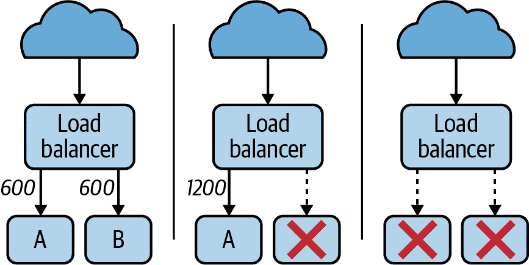
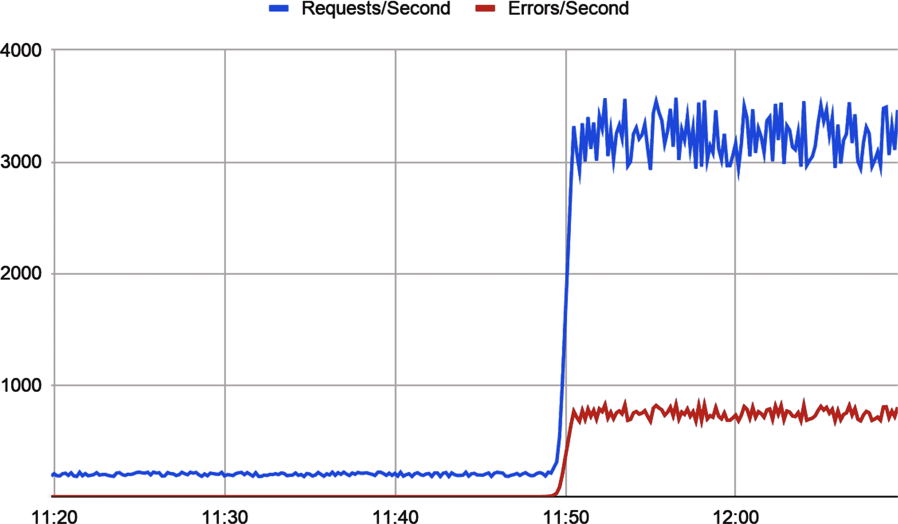
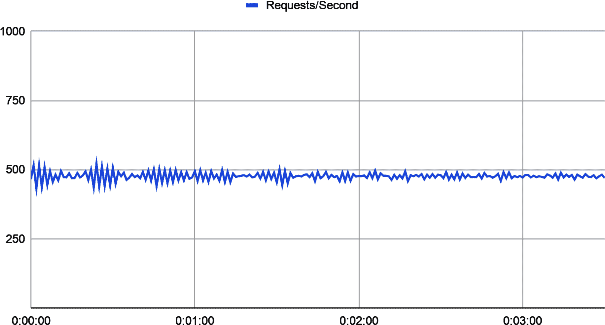
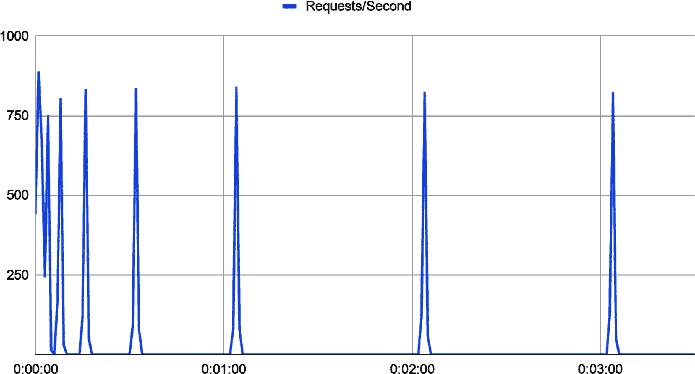
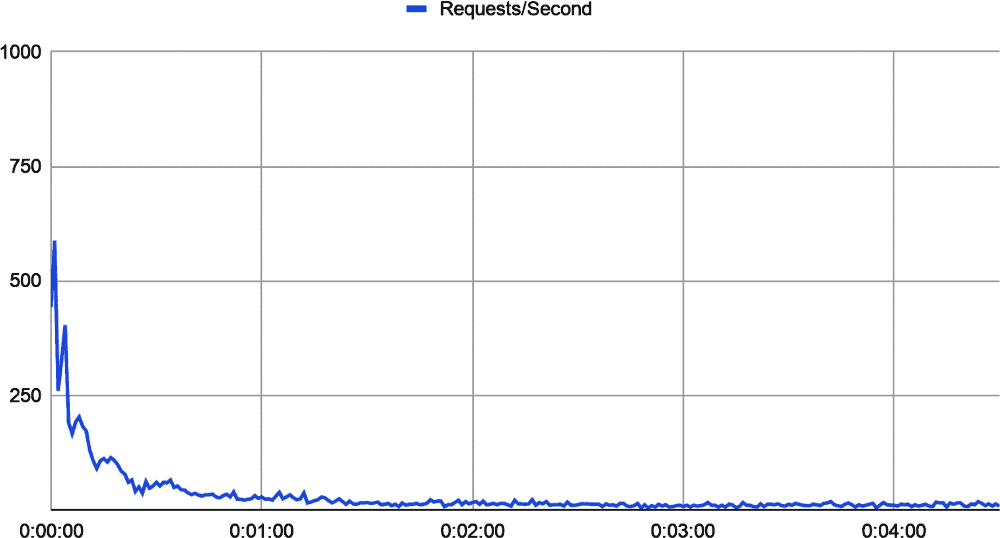

# 第九章：弹性

> 分布式系统是这样一种系统，其中你甚至不知道的一台计算机的故障可以使你自己的计算机无法使用。¹
> 
> 莱斯利·兰波特，DEC SRC 公告板（1987 年 5 月）

一个九月的深夜，正值两点多的时候，亚马逊内部网络的一部分悄然停止了运行。² 这个事件很短暂，也不是特别有趣，除非它碰巧影响了支持 DynamoDB 服务的大量服务器。

大多数情况下，这并不是什么大问题。任何受影响的服务器只需尝试从专用元数据服务中检索其成员数据，以重新连接到集群。如果失败了，它们将暂时自行下线并重试。

但这一次，当网络恢复时，一大群存储服务器同时请求从元数据服务获取其成员数据，压垮了它，以至于即使是以前未受影响的服务器的请求也开始超时。存储服务器们顺从地对超时做出响应，将自己脱机并重试（再次），进一步加重了元数据服务的压力，导致更多服务器脱机，如此循环。几分钟之内，故障扩散到整个集群。服务有效地停机，导致多个依赖服务也随之停机。

更糟糕的是，重试尝试的大量增加——一场“重试风暴”——给元数据服务带来了巨大压力，以至于甚至完全无法响应增加容量的请求。值班工程师不得不明确地阻止对元数据服务的请求，以减轻足够的压力，以允许他们手动扩展。

最终，在初次触发事件的网络小故障近五个小时后，正常运营恢复，结束了所有相关人员显然度过的漫长夜晚。

# 继续走下去：为什么弹性很重要

那么，亚马逊停机的根本原因是什么？是网络中断吗？是存储服务器的积极重试行为吗？是元数据服务的响应时间，或者可能是它有限的容量吗？

显然，那个清晨发生的事情并非单一根源所致。复杂系统的失败从未只有一个原因。³ 相反，系统失败了，就像复杂系统通常做的那样：一个子系统的故障引发了另一个子系统的潜在故障，导致*它*失败，然后是另一个，再一个，直到最终整个系统崩溃。但有趣的是，如果我们故事中的任何组件——网络、存储服务器、元数据服务——能够隔离并从系统其他部分的故障中恢复，整个系统很可能会在无需人工干预的情况下恢复正常。

不幸的是，这只是一个常见模式的例子。复杂系统以复杂（且常常令人惊讶）的方式失败，但它们不会一次性失败：它们逐个子系统地失败。因此，复杂系统中的弹性模式采取的形式是防护墙和安全阀，这些防护墙和安全阀可以在组件边界上隔离故障。频繁地，遏制的失败就是避免的失败。

这一特性，即系统抵御和从错误和故障中恢复的能力，称为*弹性*。一个系统如果在某个子系统出现故障时仍然能够继续正确运行（可能是在降级状态下），就可以被认为是*弹性*的。

# 一个系统若失败，意味着什么？

> 一切因忽视了一枚钉而失去了鞋，
> 
> 一切因忽视了一只鞋而失去了马；
> 
> 一切因忽视了一匹马而失去了骑士；
> 
> 一切因忽视一枚马蹄钉而失。
> 
> 本杰明·富兰克林，《致富之道》（1758 年）

如果我们想知道系统失败意味着什么，首先必须问什么是“系统”。

这一点非常重要。请耐心听我解释。

根据定义，*系统*是一组组件共同工作以实现整体目标。到目前为止，一切顺利。但这里的关键是：系统的每个组件——*子系统*——也是一个完整的系统，它本身又由更小的子系统组成，如此循环。

以汽车为例。它的引擎是数十个子系统之一，但它——和其他所有的子系统一样——也是一个非常复杂的系统，具有自己的多个子系统，包括冷却子系统，其中包括恒温器，恒温器包括温度开关，依此类推。这只是成千上万个组件和子组件及其子子组件中的一部分。这足以令人头晕：有那么多东西可能会出错。但当它们出错时会发生什么？

正如我们之前提到的——并在第六章中深入讨论——复杂系统的失败不会一次性发生。它们会按可预测的步骤逐步展开：

1.  所有系统都包含*缺陷*，在软件世界中我们常常称之为“bug”。比如汽车引擎中温度开关卡住的倾向就是一种缺陷。同样，元数据服务的容量有限以及 DynamoDB 案例中存储服务器的重试行为也算是缺陷。⁵ 在适当的条件下，缺陷可以被激发出来导致*错误*。

1.  *错误*是系统预期行为与实际行为之间的任何差异。许多错误可以被及时捕获和适当处理，但如果未能处理，它们单独或累积起来就会导致*失败*。例如汽车引擎中温度开关卡住的情况就是一个错误。

1.  最后，一个系统在无法提供正确服务时可以说正在经历*失败*。一个不再响应高温的温度开关可以说是失败了。子系统级别的故障会变成系统级别的缺陷。

最后值得重申的是：*子系统级别的故障变成了系统级别的故障*。一个卡住的温度开关导致恒温器失效，阻止冷却剂通过散热器流动，提高了引擎温度，导致其熄火并使汽车停止。⁷

这就是系统失败的方式。它始于一个组件的故障——一个子系统——这导致与其互动的一个或多个组件出现错误，以及与此类似的组件，依此类推，逐层上升，直至整个系统失败。

这不仅仅是学术上的问题。了解复杂系统如何失败——一个组件一个组件地——使得抵抗故障的手段更加清晰：如果故障可以在传播到系统级别之前被限制，系统可能能够恢复（或至少以自身条件失败）。

## 构建韧性

在一个完美的世界中，消除系统中的每一个可能故障是可能的，但这并不现实，试图这样做是浪费和低效的。相反，假设所有组件最终都会出现故障——事实确实如此——并在其发生时设计它们能够优雅地响应错误，你就可以构建一个功能健全的系统，即使其中的某些组件出现问题也能正常运行。

有很多方法可以增强系统的韧性。冗余性，例如部署多个相同类型的组件，可能是最常见的方法。像断路器和请求限制器这样的专门逻辑可以用来隔离特定类型的错误，防止其传播。甚至可以删除有故障的组件——或者故意允许它们失败——以造福更大系统的健康。

韧性是一个特别丰富的主题。在本章的其余部分中，我们将探讨几种这样的方法——以及更多。

# 级联故障

DynamoDB 案例研究之所以如此适合，是因为它展示了大规模发生故障的多种不同方式。

例如，存储服务器组的故障导致元数据服务的请求超时，进而导致更多存储服务器故障，增加了对元数据服务的压力，如此类推。这是一个特定的——尤其常见的——故障模式的绝佳示例，被称为*级联故障*。一旦级联故障开始，往往会非常迅速地扩展，通常在几分钟之内。

级联故障的机制可能有所不同，但它们共享的一点是某种正反馈机制。系统的某一部分经历了局部故障——容量减少，延迟增加等——导致其他组件试图补偿失败组件的方式加剧了问题，最终导致整个系统的失败。

级联故障的经典原因是过载，在图 9-1 中有所说明。当一组节点中的一个或多个节点失败时，导致负载灾难性地重新分配给幸存节点。负载的增加使剩余节点超载，导致它们因资源耗尽而失败，从而使整个系统崩溃。



###### 图 9-1\. 服务器过载是级联故障的常见原因；每台服务器每秒处理 600 个请求，因此当服务器 B 失败时，服务器 A 也会过载并失败

正反馈的性质通常使得通过增加容量来摆脱级联故障变得非常困难。新节点往往会在上线后迅速被压垮，通常会加剧导致系统崩溃的反馈。有时，唯一的解决方法是关闭整个服务——也许是通过明确阻止有问题的流量——以便恢复，然后慢慢重新引入负载。

但是，如何在一开始就防止级联故障呢？这将是下一节的主题（在某种程度上，也是本章的主题）。

## 防止过载

每个服务，无论设计和实现得多么完善，都有其功能上的限制。这在旨在处理和响应客户端请求的服务中尤为明显。⁸ 对于任何这样的服务，都存在某种请求频率，超过这个阈值就会开始出现问题。那么，我们如何防止大量请求意外（或故意！）导致我们的服务崩溃呢？

最终，处于这种情况的服务别无选择，只能拒绝一部分或全部请求。有两种主要策略可以做到这一点：

限流

限流是一种相对简单直接的策略，当请求以比预定频率更快的速度进来时启动，通常是通过拒绝处理这些请求。这通常被用作一种预防措施，以确保没有特定用户消耗比他们合理需要的资源更多。

负载抛弃

负载抛弃则更具适应性。使用这种策略的服务在接近过载条件时故意丢弃（“抛弃”）一部分负载，通过拒绝请求或陷入降级模式来实现。

这些策略并不是互斥的；一个服务可能根据自身需求选择使用其中一个或两个。

### 限流

正如我们在第四章中讨论的那样，限流模式的工作原理很像汽车的节流阀，只不过它不是限制进入引擎的燃料量，而是限制用户（无论是人类还是其他实体）在一定时间内向服务发出的请求数量。

我们在“节流”中提供的通用节流示例相对简单，并且在写作时实际上是全局有效的。然而，节流经常也会按用户基础应用，以提供类似使用配额的服务，这样任何一个调用者都不能消耗过多服务资源。

在接下来的内容中，我们展示了一个节流实现，虽然仍然使用令牌桶，⁹但在几个方面上相当不同。

首先，不再使用单个桶来控制所有传入请求，而是在以下实现中基于每个用户进行节流，返回一个接受“key”参数的函数，该参数用于表示用户名或其他唯一标识符。

其次，而不是在实施节流限制时尝试“重播”缓存值，返回的函数返回一个布尔值，指示何时施加了节流。请注意，当激活节流时，节流不返回`error`：节流不是错误条件，因此我们不将其视为错误。

最后，也许最有趣的是，它实际上并不使用定时器（`time.Ticker`）在某个常规时间段内显式地向桶中添加令牌。相反，它根据请求之间经过的时间来按需填充桶。这种策略意味着我们不必专门为填充桶而分配后台进程，这将更有效地扩展：

```go
// Effector is the function that you want to subject to throttling.
type Effector func(context.Context) (string, error)

// Throttled wraps an Effector. It accepts the same parameters, plus a
// "UID" string that represents a caller identity. It returns the same,
// plus a bool that's true if the call is not throttled.
type Throttled func(context.Context, string) (bool, string, error)

// A bucket tracks the requests associated with a UID.
type bucket struct {
    tokens uint
    time   time.Time
}

// Throttle accepts an Effector function, and returns a Throttled
// function with a per-UID token bucket with a capacity of max
// that refills at a rate of refill tokens every d.
func Throttle(e Effector, max uint, refill uint, d time.Duration) Throttled {
    // buckets maps UIDs to specific buckets
    buckets := map[string]*bucket{}

    return func(ctx context.Context, uid string) (bool, string, error) {
        b := buckets[uid]

        // This is a new entry! It passes. Assumes that capacity >= 1.
        if b == nil {
            buckets[uid] = &bucket{tokens: max - 1, time: time.Now()}

            str, err := e(ctx)
            return true, str, err
        }

        // Calculate how many tokens we now have based on the time
        // passed since the previous request.
        refillInterval := uint(time.Since(b.time) / d)
        tokensAdded := refill * refillInterval
        currentTokens := b.tokens + tokensAdded

        // We don't have enough tokens. Return false.
        if currentTokens < 1 {
            return false, "", nil
        }

        // If we've refilled our bucket, we can restart the clock.
        // Otherwise, we figure out when the most recent tokens were added.
        if currentTokens > max {
            b.time = time.Now()
            b.tokens = max - 1
        } else {
            deltaTokens := currentTokens - b.tokens
            deltaRefills := deltaTokens / refill
            deltaTime := time.Duration(deltaRefills) * d

            b.time = b.time.Add(deltaTime)
            b.tokens = currentTokens - 1
        }

        str, err := e(ctx)

        return true, str, err
    }
}
```

像“节流”中的示例一样，这个`Throttle`函数接受一个符合`Effector`合约的函数文字，加上一些定义底层令牌桶大小和补充速率的值。

然而，它不返回另一个`Effector`，而是返回一个`Throttled`函数，该函数除了用节流逻辑包装效应器外，还添加了一个“key”输入参数，表示唯一的用户标识符，以及一个布尔返回值，指示函数是否被节流（因此未执行）。

尽管您可能（或可能不）发现`Throttle`代码有趣，但它仍未准备好投入生产。首先，它并非完全安全用于并发使用。生产实现可能需要在`record`值上加锁，可能还有`bucket`映射。其次，没有办法清除旧记录。在生产环境中，我们可能想要使用像我们在“使用 LRU 缓存实现高效缓存”中描述的 LRU 缓存之类的东西。

在接下来的内容中，我们展示了如何在 RESTful web 服务中使用`Throttle`的玩具示例：

```go
var throttled = Throttle(getHostname, 1, 1, time.Second)

func getHostname(ctx context.Context) (string, error) {
    if ctx.Err() != nil {
        return "", ctx.Err()
    }

    return os.Hostname()
}

func throttledHandler(w http.ResponseWriter, r *http.Request) {
    ok, hostname, err := throttled(r.Context(), r.RemoteAddr)

    if err != nil {
        http.Error(w, err.Error(), http.StatusInternalServerError)
        return
    }

    if !ok {
        http.Error(w, "Too many requests", http.StatusTooManyRequests)
        return
    }

    w.WriteHeader(http.StatusOK)
    w.Write([]byte(hostname))
}

func main() {
    r := mux.NewRouter()
    r.HandleFunc("/hostname", throttledHandler)
    log.Fatal(http.ListenAndServe(":8080", r))
}
```

前面的代码创建了一个小型 Web 服务，具有一个（有些牵强的）端点 `/hostname`，该端点返回服务的主机名。当程序运行时，`throttled` 变量通过将 `getHostname` 函数包装起来创建，后者提供实际的服务逻辑，然后将其传递给我们之前定义的 `Throttle`。

当路由器接收到对 `/hostname` 端点的请求时，请求会转发到 `throttledHandler` 函数，该函数执行对 `throttled` 的调用，接收一个表示限流状态的 `bool`、主机名 `string` 和一个 `error` 值。如果出现定义的错误，我们返回 `500 Internal Server Error`，如果请求被限流，则返回 `429 Too Many Requests`。如果一切顺利，我们返回主机名和状态 `200 OK`。

注意，存储桶值是本地存储的，因此这种实现实际上也不能算是可以投入生产的状态。如果您希望它扩展到更大规模，可能需要将记录值存储在某种外部缓存中，以便多个服务副本可以共享这些值。

### 负载放弃

作为服务器负载增加超出其处理能力时的不可避免事实，最终一定会出现某些问题。

*负载放弃* 是一种技术，用于预测服务器接近饱和点的时间，并通过受控方式丢弃部分流量以减轻饱和。理想情况下，这将防止服务器过载并导致健康检查失败、高延迟服务或者完全无法控制地崩溃。

与基于配额的限流不同，负载放弃是一种响应性措施，通常是在资源（如 CPU、内存或请求队列深度）耗尽时才会启动。

或许最直接的负载放弃形式是对任务进行的限流，在某些资源超过特定阈值时丢弃请求。例如，如果您的服务提供 RESTful 端点，您可能选择返回 HTTP 503（服务不可用）。我们发现在第五章中的“使用 gorilla/mux 构建 HTTP 服务器”节中非常有效的 `gorilla/mux` web 工具包，通过支持在每个请求上调用的“中间件”处理函数，使这一过程变得相对简单：

```go
const MaxQueueDepth = 1000

// Middleware function, which will be called for each request.
// If queue depth is exceeded, it returns HTTP 503 (service unavailable).
func loadSheddingMiddleware(next http.Handler) http.Handler {
    return http.HandlerFunc(func(w http.ResponseWriter, r *http.Request) {
        // CurrentQueueDepth is fictional and for example purposes only.
        if CurrentQueueDepth() > MaxQueueDepth {
            log.Println("load shedding engaged")

            http.Error(w,
                err.Error(),
                http.StatusServiceUnavailable)
            return
        }

        next.ServeHTTP(w, r)
    })
}

func main() {
    r := mux.NewRouter()

    // Register middleware
    r.Use(loadSheddingMiddleware)

    log.Fatal(http.ListenAndServe(":8080", r))
}
```

每次请求都会调用 Gorilla Mux 中间件，每个中间件接收一个请求，对其进行处理，并将其传递给另一个中间件或最终处理程序。这使它们非常适合实现通用请求日志记录、头部操作、`ResponseWriter` 劫持，或者在我们的情况下，资源响应式负载放弃。

我们的中间件使用虚构的`CurrentQueueDepth()`（实际函数将取决于您的实现）来检查当前队列深度，如果值过高，则拒绝带有 HTTP 503（服务不可用）的请求。更复杂的实现甚至可以通过优先处理特别重要的请求来智能选择放弃哪些工作。

### 优雅的服务退化

资源敏感的负载抛弃效果很好，但在某些应用中，当服务接近超载时，通过显著降低响应质量，可以更加优雅地行事。这种*优雅的退化*将负载抛弃的概念推向更深层次，通过战略性地减少满足每个请求所需的工作量，而不仅仅是拒绝请求。

做这件事的方法多种多样，服务不能都以合理的方式退化，但常见的方法包括回退到缓存数据或使用更便宜的（虽然不那么精确的）算法。

# 重播：重试请求

当请求收到错误响应或根本没有收到响应时，应该再次尝试，对吧？嗯，有点像。重试是有道理的，但事情比这更复杂。

以这个片段为例，我在一个生产系统中找到了这样一个版本：

```go
res, err := SendRequest()
for err != nil {
    res, err = SendRequest()
}
```

看起来很诱人和直接，不是吗？它*会*重复失败的请求，但也*确实*会这样做。所以当这个逻辑部署到数百台服务器，并且向其中一个服务发出请求时失败时，整个系统都崩溃了。回顾服务指标，如图 9-2 所示。



###### 图 9-2\. “重试风暴”的解剖学

看起来当下游服务失败时，我们的服务——每个实例——都进入了其重试循环，每秒发出*成千上万*的请求，严重使网络瘫痪，以至于我们不得不基本上重新启动整个系统。

这实际上是一种非常常见的级联故障，被称为*重试风暴*。在重试风暴中，本意是增加组件的弹性的逻辑，反而对更大的系统产生了不利影响。很多时候，即使导致下游服务停机的条件得到解决，它也无法重新启动，因为立即承受了过多的负载。

但是，重试是好事，对吧？

是的，但无论何时实现重试逻辑，都应始终包含*退避算法*，我们将在下一节方便地讨论它。

## 退避算法

当由于任何原因而导致对下游服务的请求失败时，“最佳”实践是重试该请求。但应等待多长时间呢？如果等待时间过长，可能会延迟重要工作。如果时间太短，则可能会使目标或网络过载，甚至两者兼而有之。

通常的解决方案是实现一个退避算法，介绍一个延迟以减少尝试的频率，使其保持在安全和可接受的速率。

有各种各样的退避算法可供选择，其中最简单的是在重试之间包含一个短暂的固定时长暂停，如下所示：

```go
res, err := SendRequest()
for err != nil {
    time.Sleep(2 * time.Second)
    res, err = SendRequest()
}
```

在前面的代码片段中，`SendRequest`用于发出请求，返回字符串和错误值。然而，如果`err`不是`nil`，则代码进入循环，在收到非错误响应之前每两秒重试一次，无限重复。

在图 9-3 中，我们展示了使用这种方法模拟的 1,000 个实例生成的请求数量。¹⁰ 正如你所见，尽管固定延迟方法相较于没有任何退避的情况可以减少请求计数，但总体请求数量仍然相当高。



###### 图 9-3\. 使用两秒重试延迟的 1,000 个模拟实例的每秒请求量

如果您只有极少量的重试实例，固定时长的退避延迟可能会工作得很好，但随着足够数量的请求者仍然有可能使网络不堪重负，这种方法并不适合扩展。

然而，我们不能总是假设任何给定服务的实例数量足够小，以至于不会因重试而使网络超负荷，也不能假设我们的服务是唯一进行重试的服务。因此，许多退避算法实现了*指数退避*，其中重试之间的延迟持续时间大致每次尝试时加倍，直到某个固定的最大值。

一个非常常见（但有缺陷，您很快就会看到）的指数退避实现可能看起来像以下代码片段：

```go
res, err := SendRequest()
base, cap := time.Second, time.Minute

for backoff := base; err != nil; backoff <<= 1 {
    if backoff > cap {
        backoff = cap
    }
    time.Sleep(backoff)
    res, err = SendRequest()
}
```

在此代码片段中，我们指定了起始时长`base`和固定的最大时长`cap`。在循环中，`backoff`的值从`base`开始，每次迭代加倍，直到达到`cap`的最大值。

这种逻辑可能会让人觉得能够减轻网络负载和重试请求对下游服务的负担。然而，对 1,000 个节点进行模拟实现却讲述了另一个故事，详见图 9-4。



###### 图 9-4\. 使用指数退避的 1,000 个模拟实例的每秒请求量

看起来即使有 1,000 个节点的重试计划完全相同也并不是最佳选择，因为重试现在可能会聚集，可能在过程中生成足够的负载以引起问题。因此，在实践中，纯指数退避并不一定会像我们希望的那样有所帮助。

看起来我们需要一种方法来分散这些峰值，以便重试以大致恒定的速率发生。解决方案是添加一个称为*jitter*的随机元素。将我们之前的退避函数加入 jitter 后，得到的代码片段如下所示：

```go
res, err := SendRequest()
base, cap := time.Second, time.Minute

for backoff := base; err != nil; backoff <<= 1 {
    if backoff > cap {
        backoff = cap
    }

    jitter := rand.Int63n(int64(backoff * 3))
    sleep := base + time.Duration(jitter)
    time.Sleep(sleep)
    res, err = SendRequest()
}
```

在 1,000 个节点上运行此代码的模拟产生了 图 9-5 中呈现的模式。



###### 图 9-5\. 使用指数退避和抖动的 1,000 个模拟实例的请求/秒

###### 警告

`rand` 包的顶级函数每次程序运行时产生确定性的值序列。如果不使用 `rand.Seed` 函数提供一个新的种子值，它们的行为就像由 `rand.Seed(1)` 预先设定种子，并且总是产生相同的“随机”数序列。

当我们使用指数退避和抖动时，重试次数会在一个较短的间隔内减少，以免过度压力正在尝试上线的服务，并且会将它们分散在时间上，使其以大致恒定的速率发生。

谁会想到重试请求还有更多的内容呢？

## 断路器模式

我们在 第四章 中首次介绍了断路器模式，作为降低可能失败的方法调用的功能，以防止更大或级联的故障。该定义仍然有效，因为我们不打算过多扩展或更改它，所以我们不会在这里过于详细地讨论它。

总结一下，断路器模式跟踪对下游组件发出的连续失败请求的数量。如果失败计数超过某个阈值，则“打开”断路器，并且所有尝试发出额外请求的操作立即失败（或返回一些定义好的备用）。在等待一段时间后，断路器会自动“关闭”，恢复其正常状态，并允许正常发出请求。

###### 提示

不是所有的弹性模式都是防御性的。

有时做一个好邻居是值得的。

正确应用的断路器模式可以使系统恢复和级联故障之间产生巨大差异。除了显而易见地节省资源或阻塞网络以免被注定的请求之外，一个断路器（特别是带有退避功能的断路器）可以为发生故障的服务提供足够的空间来恢复，使其能够重新上线并恢复正确的服务。

断路器模式在 第四章 中有详细介绍，因此在这里我们只会简单提一下。查看 “断路器” 获取更多背景和代码示例。将抖动添加到示例的退避函数中留给读者作为练习¹¹。

## 超时

并非总是能够充分认识到超时的重要性。然而，客户端能够识别出请求不太可能被满足的能力，允许客户端释放它可能持有的资源，以及它可能代表的任何上游请求者。对于一个服务来说，这同样适用，它可能会发现自己持有请求，直到客户端放弃之后很久。

例如，想象一个查询数据库的基本服务。如果该数据库突然变慢，导致查询需要几秒钟才能完成，那么服务的请求——每个请求保持一个数据库连接——可能会累积，最终耗尽连接池。如果数据库是共享的，甚至可能导致其他服务失败，从而导致级联失败。

如果服务超时而不是继续持有数据库，它可能会降级服务而不是直接失败。

换句话说，如果你认为你将会失败，那就快速失败。

### 使用上下文进行服务端超时控制

我们首次在第四章介绍了`context.Context`作为 Go 在进程之间传递截止日期和取消信号的惯用方式。¹² 如果你想要回顾一下，或者只是想让自己在继续之前进入正确的思维状态，请看看“上下文包”。

你可能还记得，同一章节的后面，在“超时”一节中，我们介绍了*超时*模式，它使用`Context`不仅允许一个进程在明确得出结果不会到来时停止等待答案，还通知其他函数使用衍生的`Context`停止工作并释放它们可能持有的任何资源。

这种不仅可以取消本地函数，还可以取消子函数的能力非常强大，以至于通常认为，如果函数可能运行的时间比调用者想要等待的时间长，那么接受`Context`值是一种良好的做法，这几乎总是正确的，如果调用穿越网络。

因此，在 Go 标准库中分散的许多优秀的`Context`接受函数示例。这些示例可以在包括`sql`包中找到，它包含了许多接受`Context`的函数的版本。例如，`DB`结构体的`QueryRow`方法有一个等效的`QueryRowContext`，接受一个`Context`值。

使用这种技术提供基于 ID 值的用户名称的函数可能看起来像以下的样子：

```go
func UserName(ctx context.Context, id int) (string, error) {
    const query = "SELECT username FROM users WHERE id=?"

    dctx, cancel := context.WithTimeout(ctx, 15*time.Second)
    defer cancel()

    var username string
    err := db.QueryRowContext(dctx, query, id).Scan(&username)

    return username, err
}
```

`UserName`函数接受一个`context.Context`和一个整数`id`，但它还创建了自己的衍生`Context`，具有相当长的超时时间。这种方法提供了一个默认超时，自动在 15 秒后释放任何打开的连接——比许多客户端愿意等待的时间长——同时还能响应来自调用者的取消信号。

对外部取消信号的响应非常有用。`http`框架提供了另一个很好的例子，正如在以下的`UserGetHandler` HTTP 处理函数中演示的那样：

```go
func UserGetHandler(w http.ResponseWriter, r *http.Request) {
    vars := mux.Vars(r)
    id := vars["id"]

    // Get the request's context. This context is canceled when
    // the client's connection closes, the request is canceled
    // (with HTTP/2), or when the ServeHTTP method returns.
    rctx := r.Context()

    ctx, cancel := context.WithTimeout(rctx, 10*time.Second)
    defer cancel()

    username, err := UserName(ctx, id)

    switch {
    case errors.Is(err, sql.ErrNoRows):
        http.Error(w, "no such user", http.StatusNotFound)
    case errors.Is(err, context.DeadlineExceeded):
        http.Error(w, "database timeout", http.StatusGatewayTimeout)
    case err != nil:
        http.Error(w, err.Error(), http.StatusInternalServerError)
    default:
        w.Write([]byte(username))
    }
}
```

在`UserGetHandler`中，我们首先通过其`Context`方法获取请求的`Context`。方便的是，当客户端连接关闭、请求被取消（使用 HTTP/2）或`ServeHTTP`方法返回时，这个`Context`就会被取消。

我们从这里创建一个衍生的上下文，应用我们自己的显式超时，这将在 10 秒后无论如何都会取消`Context`。

由于衍生的上下文被传递给`UserName`函数，我们能够在关闭 HTTP 请求和关闭数据库连接之间划出直接因果关系：如果请求的`Context`关闭，所有衍生的`Context`也会关闭，最终以一种松耦合的方式确保所有打开的资源也被释放。

### 超时 HTTP/REST 客户端调用

回顾起“便利函数可能存在的陷阱”，我们曾经介绍过`http`“便利函数”如`http.Get`和`http.Post`的一个陷阱：它们使用默认超时时间。不幸的是，默认的超时时间值为`0`，这在 Go 语言中被解释为“没有超时”。

我们在此前提到的为客户端方法设置超时机制的机制是创建一个带有非零超时值的自定义`Client`值，如下所示：

```go
var client = &http.Client{
    Timeout: time.Second * 10,
}

response, err := client.Get(url)
```

这个方法运行得非常好，实际上，将会以与其`Context`被取消时完全相同的方式取消请求。但是如果您想要使用现有或衍生的`Context`值呢？为此，您需要访问底层的`Context`，可以通过使用`http.NewRequestWithContext`来获得，这是`http.NewRequest`接受`Context`的等效版本，允许程序员指定控制请求及其响应整个生命周期的`Context`。

这并不像看上去的那么大的偏离。事实上，查看`http.Client`上的`Get`方法的源代码会发现，在底层它只是使用`NewRequest`：

```go
func (c *Client) Get(url string) (resp *Response, err error) {
    req, err := NewRequest("GET", url, nil)
    if err != nil {
        return nil, err
    }

    return c.Do(req)
}
```

正如您所见，标准的`Get`方法调用`NewRequest`创建一个`*Request`值，传递了方法名和 URL（最后一个参数接受可选的`io.Reader`作为请求体，但在这里我们不需要）`Do`函数执行实际的请求。

不计算错误检查和返回，整个方法只包含一个调用。看起来，如果我们想要实现类似的接受`Context`值的功能，我们可以轻松地做到。

实现这个的一种方法可能是实现一个接受`Context`值的`GetContext`函数：

```go
type ClientContext struct {
    http.Client
}

func (c *ClientContext) GetContext(ctx context.Context, url string)
        (resp *http.Response, err error) {

    req, err := http.NewRequestWithContext(ctx, "GET", url, nil)
    if err != nil {
        return nil, err
    }

    return c.Do(req)
}
```

我们的新`GetContext`函数在功能上与规范的`Get`完全相同，只是它还接受一个`Context`值，用于调用`http.NewRequestWithContext`而不是`http.NewRequest`。

使用我们的新`ClientContext`与使用标准的`http.Client`值非常相似，只不过我们不是调用`client.Get`，而是调用`client.GetContext`（当然要传递`Context`值）：

```go
func main() {
    client := &ClientContext{}
    ctx, cancel := context.WithTimeout(context.Background(), 5*time.Second)
    defer cancel()

    response, err := client.GetContext(ctx, "http://www.example.com")
    if err != nil {
        log.Fatal(err)
    }

    bytes, _ := ioutil.ReadAll(response.Body)
    fmt.Println(string(bytes))
}
```

但它有效吗？这不是一个 *正确* 的测试，因为没有测试库，但我们可以通过将截止日期设置为 `0` 并运行它来手动试探：

```go
$ go run .
2020/08/25 14:03:16 Get "http://www.example.com": context deadline exceeded
exit status 1
```

看起来它确实能工作！太棒了。

### gRPC 客户端调用超时

就像 `http.Client` 一样，gRPC 客户端默认为“无超时”，但也允许显式设置超时。

正如我们在 “实现 gRPC 客户端” 中看到的那样，gRPC 客户端通常使用 `grpc.Dial` 函数来建立与客户端的连接，并且可以通过像 `grpc.WithInsecure` 和 `grpc.WithBlock` 这样的函数构造 `grpc.DialOption` 值列表将其传递给它以配置连接的设置方式。

其中一种选项是 `grpc.WithTimeout`，可用于配置客户端拨号超时：

```go
opts := []grpc.DialOption{
    grpc.WithInsecure(),
    grpc.WithBlock(),
    grpc.WithTimeout(5 * time.Second),
}
conn, err := grpc.Dial(serverAddr, opts...)
```

然而，虽然 `grpc.WithTimeout` 在表面上看起来可能很方便，但实际上它已经被弃用了相当长的时间，主要是因为其机制与首选的 `Context` 超时方法不一致（并且是多余的）。我们在这里展示它只是为了完整性的缘故。

###### 警告

`grpc.WithTimeout` 选项已被弃用，并将最终移除。请改用 `grpc.DialContext` 和 `context.WithTimeout`。

相反，设置 gRPC 拨号超时的首选方法是非常方便的（对我们而言）`grpc.DialContext` 函数，它允许我们使用（或重用）`context.Context` 值。这实际上是双重有用的，因为 gRPC 服务方法本来就接受 `Context` 值，所以实际上根本没有额外的工作要做：

```go
func TimeoutKeyValueGet() *pb.Response {
    // Use context to set a 5-second timeout.
    ctx, cancel := context.WithTimeout(context.Background(), 5 * time.Second)
    defer cancel()

    // We can still set other options as desired.
    opts := []grpc.DialOption{grpc.WithInsecure(), grpc.WithBlock()}

    conn, err := grpc.DialContext(ctx, serverAddr, opts...)
    if err != nil {
        grpclog.Fatalf(err)
    }
    defer conn.Close()

    client := pb.NewKeyValueClient(conn)

    // We can reuse the same Context in the client calls.
    response, err := client.Get(ctx, &pb.GetRequest{Key: key})
    if err != nil {
        grpclog.Fatalf(err)
    }

    return response
}
```

如广告所述，`TimeoutKeyValueGet` 使用 `grpc.DialContext` ——我们向其传递了一个带有 5 秒超时的 `context.Context` 值——而不是 `grpc.Dial`。除了显然不再包括 `grpc.WithTimeout` 外，`opts` 列表在其他方面是相同的。

请注意 `client.Get` 方法调用。如前所述，gRPC 服务方法接受 `Context` 参数，因此我们只需重用现有的 `Context`。重要的是，重用相同的 `Context` 值将在相同的超时计算下限制两个操作——`Context` 将超时，无论它如何使用——因此在计划超时值时务必考虑到这一点。

## 幂等性

正如我们在 第四章 顶部讨论的那样，云原生应用基本上存在于并受网络世界的所有特殊性影响。网络——所有网络——都是不可靠的，消息发送到达目的地的时间（或根本不到达）并不总是准时。

更重要的是，如果发送了消息却没有收到响应，那么你无法知道发生了什么。消息在传递到接收者时丢失了吗？接收者接收到消息了，但响应丢失了吗？也许一切都运行良好，只是往返时间比平常长一点？

在这种情况下，唯一的选择是重新发送消息。但仅仅指望运气是不够的。通过设计函数以实现*幂等性*，计划处理这种必然性非常重要。

你可能记得我们在 “什么是幂等性以及其重要性？” 简要介绍了幂等性的概念，其中我们将幂等操作定义为多次应用与单次应用具有相同效果的操作。正如 HTTP 的设计者所了解的那样，这也是任何云原生 API 的重要属性，保证任何通信可以安全重复执行（请参阅 “Web 上幂等性的起源” 以了解相关历史）。

实现幂等性的具体方法因服务而异，但在本节的其余部分我们将审查一些一致的模式。

### 如何使我的服务幂等？

幂等性并没有内建到任何特定框架的逻辑中。即使在 HTTP——以及由此推广的 REST 中——幂等性也是一种约定，而非明确强制执行的规范。如果真的希望，没有什么能阻止你实现一个非幂等的 GET 请求，不管是出于疏忽还是故意。¹⁶

幂等性有时如此棘手的原因之一是因为它依赖于内建到核心应用程序中的逻辑，而不是在 REST 或 gRPC API 层。例如，如果在第五章中，我们希望使我们的键值存储与传统的 CRUD（创建、读取、更新和删除）操作一致（因此*不*是幂等的），我们可能会做如下操作：

```go
var store = make(map[string]string)

func Create(key, value string) error {
    if _, ok := store[key]; ok {
        return errors.New("duplicate key")
    }

    store[key] = value
    return nil
}

func Update(key, value string) error {
    if _, ok := store[key]; !ok {
        return errors.New("no such key")
    }

    store[key] = value
    return nil
}

func Delete(key string) error {
    if _, ok := store[key]; ok {
        return errors.New("no such key")
    }

    delete(store, key)
    return nil
}
```

这种类似 CRUD 的服务实现可能完全出于善意，但如果这些方法中的任何一个必须重复执行，则会导致错误。更重要的是，在检查当前状态时涉及的逻辑量也相当大，在等效的幂等性实现中则是多余的，例如下面的实现：

```go
var store = make(map[string]string)

func Set(key, value string) {
    store[key] = value
}

func Delete(key string) {
    delete(store, key)
}
```

这个版本要简单得多，不仅仅是一种方式。首先，我们不再需要单独的“创建”和“更新”操作，因此可以将它们合并为单个`Set`函数。此外，不再需要在每个操作中检查当前状态，这减少了每种方法中的逻辑，随着服务复杂度的增加，这一好处将继续产生回报。

最后，如果一个操作需要重复执行，这没有什么大不了的。对于`Set`和`Delete`函数，多次相同的调用将产生相同的结果。它们是幂等的。

### 标量操作怎么样？

“因此”，你可能会说，“对于那些只能*完成*或*未完成*的操作来说这都很好，但对于更复杂的操作怎么办？例如标量值的操作？”

这是一个公平的问题。毕竟，把一件东西放在一个地方是一回事：它要么已经被放置了，要么没有。你只需不返回重新放置的错误。好吧。

但是像“向帐户 12345 添加 $500”这样的操作呢？这样的请求可能携带一个 JSON 负载，看起来像以下内容：

```go
{
    "credit":{
        "accountID": 12345,
        "amount": 500
    }
}
```

重复执行此操作将导致额外的 $500 存入帐户 12345，尽管帐户所有者可能不太介意，但银行可能会。

但是考虑一下，当我们向我们的 JSON 负载添加 `transactionID` 值时会发生什么：

```go
{
    "credit":{
        "accountID": 12345,
        "amount": 500,
        "transactionID": 789
    }
}
```

这可能需要一些更多的簿记工作，但这种方法为我们的困境提供了可行的解决方案。通过跟踪 `transactionID` 值，接收方可以安全地识别并拒绝重复的交易。达到幂等性！

# 服务冗余

冗余——系统关键组件或功能的重复，旨在提高系统的可靠性——通常是面对故障时增加韧性的第一道防线。

我们已经讨论过一种特定类型的冗余——消息冗余，也称为“重试”——在 “再玩一次：重试请求” 中。然而，在本节中，我们将考虑复制关键系统组件的价值，以便如果任何一个组件失败，一个或多个其他组件可以接管其工作。

在公共云中，这意味着将您的组件部署到多个服务器实例，理想情况下跨多个区域甚至多个地区。在像 Kubernetes 这样的容器编排平台上，这甚至可能只是将副本数量设置为大于一的值。

尽管这个主题很有趣，我们实际上不会在其上花费太多时间。服务复制是一个已经在许多其他来源中彻底讨论过的架构主题。¹⁷ 毕竟，这应该是一本 Go 语言的书。但是，如果我们在关于韧性的整章中甚至不提到它，我们会感到遗憾的。

## 冗余设计

设计一个系统，使其功能能够在多个实例之间复制的努力可能会带来显著的回报。但具体来说有多少呢？嗯...很多。如果你对数学感兴趣，可以随意查看下面的内容，但如果你不感兴趣，你可以相信我。

## 自动缩放

通常情况下，服务所受的负载量随时间变化而变化。典型的例子是用户面向的 Web 服务，白天负载增加，夜间减少。如果这样的服务建立在处理高峰负载的基础上，晚上就会浪费时间和金钱。如果只建立在处理夜间负载的基础上，白天就会过度负荷。

自动缩放是一种建立在负载均衡思想基础上的技术，通过自动添加或删除资源——无论是云服务器实例还是 Kubernetes Pod——来动态调整容量，以满足当前需求的各种流量模式，无论是预期的还是意外的。

作为额外的奖励，将自动缩放应用到您的集群可以根据服务需求调整资源大小，从而节省成本。

所有主要的云提供商都提供了扩展服务器实例的机制，并且它们的大多数托管服务都隐含或显式支持自动缩放。像 Kubernetes 这样的容器编排平台也包括支持自动缩放的功能，无论是 Pod 数量（水平自动缩放）还是它们的 CPU 和内存限制（垂直自动缩放）。

自动缩放机制在云提供商和编排平台之间差异很大，因此详细讨论如何收集指标和配置预测性自动缩放等内容超出了本书的范围。然而，有几个关键点需要记住：

+   设置合理的最大限制，以防止需求出现异常大的峰值（或者更糟的是，级联故障）完全超出预算。我们在“防止过载”中讨论的限流和负载放弃技术在这里也很有用。

+   减少启动时间。如果您使用服务器实例，请预先制作机器镜像，以减少启动时的配置时间。这在 Kubernetes 上不是很严重的问题，但容器镜像仍应保持较小并且启动时间合理短。

+   无论您的启动有多快，缩放都需要一定的时间。您的服务应该有一些余地，而不必进行缩放。

+   正如我们在“延迟扩展：效率”中讨论的那样，最好的扩展是永远不需要发生的扩展。

# 健康的健康检查

在“服务冗余”中，我们简要讨论了冗余的价值——系统关键组件或功能的复制，旨在提高整体系统的可靠性——以及它对提高系统韧性的价值。

多个服务实例意味着需要负载均衡机制——服务网格或专用负载均衡器——但当服务实例出现问题时会发生什么？当然，我们不希望负载均衡器继续向其发送流量。那么我们该怎么办？

进入*健康检查*。在其最简单和最常见的形式中，健康检查被实现为一个 API 端点，客户端——负载均衡器，以及监控服务、服务注册表等——可以使用该端点询问服务实例是否活着且健康。

健康检查就像布隆过滤器。失败的健康检查意味着服务不可用，但通过的健康检查意味着服务 *可能* 是“健康的”。（引用：Cindy Sridharan²⁰)

拥有一个可以告诉客户端服务实例健康（或不健康）的端点听起来很棒，但这也引发了一个问题，那就是什么是一个实例“健康”的确切含义？

###### 当服务实例失败时，通常是因为以下原因之一：

我们在服务和服务实例的上下文中使用“健康”一词，但是当我们说这个词时确切指的是什么呢？嗯，像通常情况一样，有简单的答案和复杂的答案。也可能有很多中间答案。

## 远程故障，如影响服务功能的某些依赖项——数据库或其他下游服务。

我们先从简单的答案开始。重新使用现有定义，当实例“可用”时，即能够提供正确的服务时，实例被认为是“健康的”。

提示

不幸的是，情况并非总是如此清晰。如果实例本身按预期运行，但下游依赖出现故障怎么办？健康检查是否应该区分这种情况？如果是，负载均衡器在每种情况下应该有不同的行为吗？如果所有服务副本都受到影响，实例是否应该被淘汰并替换？

不幸的是，对于这些问题并没有简单的答案，所以我不会提供答案，而是会提供次好的选择：讨论健康检查的三种最常见方法及其各自的优缺点。你的具体实现将取决于你的服务需求和负载平衡行为。

## 三种健康检查类型

实例何时被视为“健康”？

+   例如，服务可能提供一个 HTTP 端点（`/health` 和 `/healthz` 是常见的命名选择），如果副本健康则返回 `200 OK`，否则返回 `503 Service Unavailable`。更复杂的实现甚至可以针对不同的状态返回不同的状态码：HashiCorp 的 Consul 服务注册表将任何 `2XX` 状态视为成功，`429 Too Many Requests` 作为警告，其他任何状态视为失败。

+   本地故障，如应用程序错误或资源（CPU、内存、数据库连接等）耗尽。

这两种广泛的故障类别导致了三种（是的，三种）健康检查策略的出现，每种都有其自身有趣的利弊。

*存活检查* 只返回“成功”信号。它们不会额外尝试确定服务的状态，并且除了表明服务正在监听和可达之外，没有其他信息。但有时候这已经足够了。我们将在 “存活检查” 中更多地讨论存活检查。

*浅层健康检查* 比活跃性检查更进一步，通过验证服务实例可能能够正常工作来确认。这些健康检查仅测试本地资源，因此在许多实例同时出现故障的情况下不太可能失败，但它们无法确定特定请求服务实例是否会成功。我们将在“浅层健康检查”中详细介绍浅层健康检查。

*深层健康检查* 提供了对实例健康状态更好的理解，因为它们实际上检查了服务实例执行其功能的能力，还会测试像数据库之类的下游资源。虽然全面，但它们可能很昂贵，并且容易出现虚假阳性。我们将在“深层健康检查”中深入探讨深层健康检查。

### 活跃性检查

活跃性端点始终返回“成功”值，无论如何。虽然这可能看似微不足道到毫无用处——毕竟，一个不提供关于健康状态的健康检查有何价值——但活跃性探针实际上可以通过确认以下方式提供一些有用信息：

+   服务实例是否在预期端口上侦听并接受新连接

+   实例是否可以通过网络访问

+   任何防火墙、安全组或其他配置是否正确定义

当然，这种简单性是有可预见成本的。缺乏任何活跃健康检查逻辑使得活跃性检查在评估服务实例是否实际执行其功能方面的用途有限。

活跃性探针也很容易实现。使用 `net/http` 包，我们可以做到以下几点：

```go
func healthLivenessHandler(w http.ResponseWriter, r *http.Request) {
    w.WriteHeader(http.StatusOK)
    w.Write([]byte("OK"))
})

func main() {
    r := mux.NewRouter()
    http.HandleFunc("/healthz", healthLivenessHandler)
    log.Fatal(http.ListenAndServe(":8080", r))
}
```

前面的代码片段展示了进行活跃性检查时所需的少量工作。我们创建并注册了一个 `/healthz` 端点，它只返回一个 `200 OK`（以及为了完整起见的文本 `OK`）。

###### 警告

如果您使用 `gorilla/mux` 包，则任何注册的中间件（例如来自“负载卸载”的负载卸载函数）都可能影响您的健康检查！

### 浅层健康检查

浅层健康检查比活跃性检查更进一步，通过验证服务实例*可能*能够正常运行来确认，但停止于不会对数据库或其他下游依赖进行任何实际测试。

浅层健康检查可以评估可能对服务产生不利影响的任何条件，包括（但不限于）：

+   关键本地资源（内存、CPU、数据库连接）的可用性

+   能够读取或写入本地数据，检查磁盘空间、权限以及硬件故障，例如磁盘故障。

+   支持进程的存在，如监控或更新程序

浅层健康检查比存活性检查更为明确，它们的特异性意味着任何故障不太可能立即影响整个机群。²¹ 但是，浅层检查容易产生误报：如果由于某些涉及外部资源的问题导致服务停止，浅层检查将无法发现。在特异性增加的同时，你也在灵敏性上做出了牺牲。

浅层健康检查可能看起来像以下示例，测试服务读写本地磁盘的能力：

```go
func healthShallowHandler(w http.ResponseWriter, r *http.Request) {
    // Create our test file.
    // This will create a filename like /tmp/shallow-123456
    tmpFile, err := ioutil.TempFile(os.TempDir(), "shallow-")
    if err != nil {
        http.Error(w, err.Error(), http.StatusServiceUnavailable)
        return
    }
    defer os.Remove(tmpFile.Name())

    // Make sure that we can write to the file.
    text := []byte("Check.")
    if _, err = tmpFile.Write(text); err != nil {
        http.Error(w, err.Error(), http.StatusServiceUnavailable)
        return
    }

    // Make sure that we can close the file.
    if err := tmpFile.Close(); err != nil {
        http.Error(w, err.Error(), http.StatusServiceUnavailable)
        return
    }

    w.WriteHeader(http.StatusOK)
}

func main() {
    r := mux.NewRouter()
    http.HandleFunc("/healthz", healthShallowHandler)
    log.Fatal(http.ListenAndServe(":8080", r))
}
```

这同时检查可用的磁盘空间、写入权限和故障硬件，这可能是一个非常有用的测试项目，特别是如果服务需要写入到磁盘缓存或其他临时文件时。

细心的读者可能会注意到，它写入了用于临时文件的默认目录。在 Linux 上，这是`/tmp`，实际上是一个 RAM 驱动器。这也许是一个有用的测试项目，但如果你想在 Linux 上测试写入磁盘的能力，你需要指定一个不同的目录，否则这将成为一个完全不同的测试。

### 深度健康检查

深度健康检查直接检查服务与其相邻系统交互的能力。这通过识别依赖关系的问题（如无效凭证、与数据存储的连接丢失或其他意外的网络问题），显著提升了实例健康状态的理解能力。

然而，尽管彻底，深度健康检查可能会非常昂贵。它们可能会花费很长时间，并对依赖项造成负担，特别是如果你运行了太多或者运行得太频繁的话。

###### 小贴士

在健康检查中不要试图测试*每一个*依赖项，而是专注于服务操作所需的那些依赖项。

###### 小贴士

在测试多个下游依赖项时，如果可能的话同时评估它们。

此外，由于依赖项的失败会被报告为实例的失败，深度检查尤其容易产生误报。再加上与浅层检查相比更低的特异性——依赖项问题会影响整个机群——可能导致级联故障的潜在风险。

如果你在使用深度健康检查，你应该利用像断路器（我们在“断路器”中介绍过的）这样的策略，并且尽可能让你的负载均衡器“失效开放”（我们将在“开放失败”中讨论）。

这里有一个可能的深度健康检查的简单示例，通过调用假设服务的`GetUser`函数来评估数据库：

```go
func healthDeepHandler(w http.ResponseWriter, r *http.Request) {
    // Retrieve the context from the request and add a 5-second timeout
    ctx, cancel := context.WithTimeout(r.Context(), 5*time.Second)
    defer cancel()

    // service.GetUser is a hypothetical method on a service interface
    // that executes a database query
    if err := service.GetUser(ctx, 0); err != nil {
        http.Error(w, err.Error(), http.StatusServiceUnavailable)
        return
    }

    w.WriteHeader(http.StatusOK)
}

func main() {
    r := mux.NewRouter()
    http.HandleFunc("/healthz", healthDeepHandler)
    log.Fatal(http.ListenAndServe(":8080", r))
}
```

理想情况下，依赖项测试应执行实际的系统功能，同时在合理的程度上保持轻量级。例如，在这个示例中，`GetUser` 函数触发了一个数据库查询，满足了这两个标准。²²

“真实”的查询通常比仅仅对数据库进行 ping 操作更可取，原因有两点。首先，它们更能代表服务正在执行的操作。其次，它们允许利用端到端查询时间作为数据库健康状况的衡量标准。前面的示例确实做到了这一点——尽管方式非常二元化——通过使用 `Context` 设置一个硬性超时值，但您也可以选择包含更复杂的逻辑。

## 失败开放

如果您的所有实例同时决定它们都不健康了怎么办？如果您使用深度健康检查，这种情况实际上很容易发生（也许是定期发生）。根据负载均衡器的配置方式，您可能会发现自己的实例都不再提供流量服务，可能导致系统中的故障连锁反应。

幸运的是，一些负载均衡器通过“失败开放”策略处理这种情况非常巧妙。如果一个失败开放的负载均衡器没有健康的目标——即其所有目标的健康检查都失败了——它会将流量路由到所有目标上去。

这是一个略有违直觉的行为，但它使深度健康检查的使用变得更加安全，因为它允许流量继续流动，即使下游依赖可能出现故障。

# 总结

这是一个有趣的章节。关于弹性有很多值得说的内容，还有很多重要的支持运营背景。我不得不在哪些内容能进入书稿和哪些不能之间做出一些艰难的决定。尽管这一章约有 37 页，但实际上比我预期的长了一些，但我对结果非常满意。这是信息量不足和信息量过多之间的一个合理折中，也是运营背景和实际 Go 实现之间的一个折中。

我们审查了系统失败的含义，以及复杂系统如何失败（即逐个组件失败）。这自然引出了讨论一个特别恶性但常见的故障模式：级联故障。在级联故障中，系统试图恢复自身，却加速了其崩溃。我们涵盖了服务器端预防级联故障的常见措施：限流和负载调节。

在面对错误时进行重试可以极大地增强服务的弹性，但正如我们在 DynamoDB 案例研究中看到的那样，如果应用得不当，也可能导致级联故障。我们深入探讨了客户端可以采取的措施，包括断路器、超时和特别是指数退避算法。还涉及了几个漂亮的图表。我在图表上花费了很多时间。

所有这些都导致了关于服务冗余性的讨论，以及它如何影响可靠性（顺便加入了一点数学，增加乐趣），以及何时以及如何最佳地利用自动扩展。

当然，谈论自动扩展时不能不谈及资源“健康”问题。我们询问（并尽力回答）实例“健康”意味着什么，以及这如何转化为健康检查。我们涵盖了三种健康检查，并权衡了它们的优缺点，特别关注它们的相对灵敏度/特异性的权衡。

在第十章中，我们将暂时离开运营主题，深入探讨可管理性的主题：如何在行驶中的车辆上换轮胎的艺术和科学。

¹ Lamport, Leslie. *DEC SRC 公告板*，1987 年 5 月 28 日。[*https://oreil.ly/nD85V*](https://oreil.ly/nD85V)。

² 美国东部地区亚马逊 DynamoDB 服务中断及相关影响总结。Amazon AWS，2015 年 9 月。[*https://oreil.ly/Y1P5S*](https://oreil.ly/Y1P5S)。

³ Cook, Richard I. “复杂系统如何失败。” 1998 年。[*https://oreil.ly/WyJ4Q*](https://oreil.ly/WyJ4Q)。

⁴ 如果你对完整的学术研究感兴趣，我强烈推荐由 Kishor S. Trivedi 和 Andrea Bobbio 撰写的[*Reliability and Availability Engineering*](https://oreil.ly/tfKr1)（剑桥大学出版社）。

⁵ 更重要的是，许多故障只有事后才能显现。

⁶ 看吧？我们最终做到了。

⁷ 继续吧，问我如何知道这一点。

⁸ 尤其是如果服务在公共互联网的开放下水道上可用。

⁹ Wikipedia 贡献者。“令牌桶。” *维基百科，自由的百科全书*，2019 年 6 月 5 日。[*https://oreil.ly/vkOov*](https://oreil.ly/vkOov)。

¹⁰ 本节中用于模拟所有数据的代码可以在[关联的 GitHub 仓库](https://oreil.ly/m61X7)中找到。

¹¹ 在这里这样做感觉有些多余，但我承认我可能有点懒。

¹² 严格来说，还有请求范围的值，但此功能的正确性有争议。

¹³ Fielding, R. 等人。“超文本传输协议 — HTTP/1.1”，建议标准，RFC 2068，1997 年 6 月。[*https://oreil.ly/28rcs*](https://oreil.ly/28rcs)。

¹⁴ Berners-Lee, T. 等人。“超文本传输协议 — HTTP/1.0”，信息性，RFC 1945，1996 年 5 月。[*https://oreil.ly/zN7uo*](https://oreil.ly/zN7uo)。

¹⁵ Fielding, Roy Thomas. “体系结构风格与基于网络的软件架构设计。” *加州大学欧文分校*，2000 年，第 76-106 页。[*https://oreil.ly/swjbd*](https://oreil.ly/swjbd)。

¹⁶ 你这个怪物。

¹⁷ [*构建安全可靠的系统：设计、实施和维护系统的最佳实践*](https://oreil.ly/YPKyr) 由 Heather Adkins 及一众其他作者合著，是一个极好的例子。

¹⁸ 准备好了吗？我们要开始了。

¹⁹ 这假设组件的故障率绝对独立，这在现实世界中是非常不可能的。对待它就像你对待真空中的球形奶牛一样。

²⁰ Sridharan, Cindy (@copyconstruct)。"Health checks are like bloom filters…" 2018 年 8 月 5 日上午 3:21。推特。[*https://oreil.ly/Qpw3d*](https://oreil.ly/Qpw3d)。

²¹ 尽管我见过这种情况发生。

²² 这是一个虚构的函数，所以我们就认为这是真的吧。
