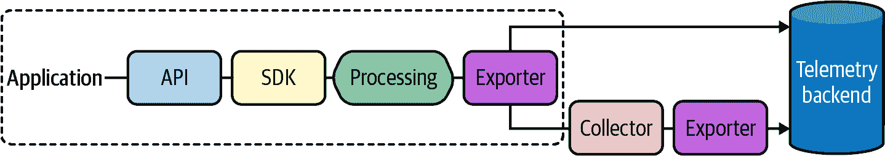

# 第十一章 可观测性

> 数据不是信息，信息不是知识，知识不是理解，理解不是智慧。¹
> 
> 克利福德·斯托尔，《高科技异端：一位计算机反对派的反思》

“云原生”即使对于计算来说也是一个相当新的概念。就我所知，这个术语“云原生”是在 2015 年中期云原生计算基金会成立之后才开始进入我们的词汇表的。²

作为一个行业，我们仍在努力弄清楚“云原生”究竟意味着什么，而每个主要公共云提供商都定期推出新服务——每一个看起来都比上一个提供更多抽象层，即使是我们所达成的一点共识也在随着时间而变化。

不过有一点是明确的：网络和硬件层面的功能（和故障）越来越被抽象化并且被 API 调用和事件所替代。每天我们都在向一个全软件定义的*一切*的世界迈进。我们面临的所有问题都变成了软件问题。

虽然我们肯定会在我们的软件运行的平台上牺牲相当一部分控制权，但我们在整体可管理性和可靠性方面获得了*巨大的*胜利，³使我们能够将有限的时间和注意力集中在我们的软件上。然而，这也意味着我们大多数的失败现在都源自我们自己的服务及其之间的交互。任何花哨的框架或协议都无法解决糟糕软件的问题。就像我在第一章中所说的那样，Kubernetes 中的一个笨拙的应用仍然是笨拙的。

在这个全新的软件定义、高度分布式的世界里，事情变得复杂起来。软件复杂，平台复杂，它们在一起就*真的*很复杂，我们往往不知道发生了什么。了解我们服务的可见性比以往任何时候都更为重要，而我们*唯一知道的*是现有的监控工具和技术根本无法胜任这项任务。显然，我们需要一些新的东西。不仅仅是新技术，甚至不仅仅是一套新的技术，而是一种全新的思考我们如何理解我们的系统的方式。

# 什么是可观测性？

可观测性现在是一个非常热门的话题。这是一件大事。但是可观测性到底是什么？它与传统的监控、日志、度量和追踪有什么不同（又有什么相似）？最重要的是，我们如何“实现可观测性”？

可观测性不仅仅是营销炒作，尽管基于它吸引了如此多的关注很容易这样认为。

实际上，这相当简单。可观测性是一个系统属性，与弹性或可管理性没有什么不同，它反映了一个系统的内部状态能够从其外部输出的知识中推断出来的程度。当能够快速而一致地对其提出新问题，而无需大量先前知识或重新仪器化或编写新代码时，可以认为一个系统是*可观测的*。一个可观测的系统能让你提出你之前没想过的问题。

最终，可观测性远远超出了工具的范畴，尽管有些供应商可能试图告诉你（并向你出售）。你无法“购买可观测性”就像你无法“购买可靠性”一样。任何工具都不会仅仅因为你使用它就使你的系统可观测，就像仅仅用锤子不会使桥梁结构安全一样。工具可以帮助你部分实现目标，但如何正确应用它们则取决于你自己。

这当然比说起来容易得多。在复杂系统中构建可观测性要求我们超越寻找“已知未知”的阶段，并接受我们常常甚至无法完全理解其在特定时间点的状态的事实。在复杂系统中理解*所有可能的*故障（或非故障）状态几乎是不可能的。实现可观测性的第一步是停止寻找特定的、预期的故障模式——“已知未知”，好像这不是事实一样。

## 为什么我们需要可观测性？

可观测性是传统监控的自然演变，受到云原生架构引入的新挑战的驱动。

首先是现代许多云原生系统的纯粹规模，这些系统越来越复杂，对我们有限的人类大脑和有限的人类注意力范围来说，有太多*东西*是难以处理的。多个并发运行的互连系统生成的所有数据，提供了比我们可以合理监视的更多事物，比我们可以合理处理的更多数据，以及比我们可以合理进行的更多相关性。

然而，更重要的是，云原生系统的性质与不久前的传统架构根本不同。它们的环境和功能要求不同，它们的功能方式——以及它们的故障方式——也不同，它们需要提供的保证也不同。

在现代应用程序的短暂性和其所在环境的复杂性中，如何监控分布式系统？如何在高度分布式系统的复杂网络中定位单个组件的缺陷？这些都是“可观测性”试图解决的问题。

## 可观测性与“传统”监控有何不同？

表面上，监控和可观测性之间的界限似乎模糊不清。毕竟，两者都是关于能够询问系统的问题。不同之处在于可以和能够被问到的问题类型。

传统上，监控侧重于通过提问来识别或预测某些已知的或以前观察到的故障模式。换句话说，它集中在“已知未知”。假设系统按预期行为运行，因此预计会以特定且可预测的方式失败。当发现新的故障模式时（通常是通过艰难的方式），其症状会被添加到监控套件中，然后整个过程重新开始。

当系统比较简单时，这种方法效果还不错，但也存在一些问题。首先，要向系统提出新问题通常意味着编写和部署新代码。这种方法不够灵活，显然不可扩展，而且非常令人恼火。

其次，在系统复杂度达到一定水平时，“未知未知”的数量开始超过“已知未知”的数量。故障更难预测，更不容易预测，并且几乎总是由于多个问题同时出现而导致。实际上，对每种可能的故障模式进行监控变得几乎不可能。

监控是对系统*执行的*一种操作，以确定它是否工作。另一方面，可观测性技术强调通过允许您相关事件和行为来理解系统。可观测性是系统拥有的一种*属性*，使您能够询问为什么它不工作。

# *“可观测性的三大支柱”*

*可观测性的三大支柱*是指可观测性工具包中最常见（也是最基础）的三种工具：日志记录、度量指标和追踪。我们将按照以下顺序依次讨论这三部分：

追踪

追踪（或*分布式追踪*）跟随请求在（通常是分布式的）系统中传播，允许重建整个端到端的请求流程作为一个称为*追踪*的有向无环图（DAG）。分析这些追踪可以提供关于系统组件如何相互交互的见解，从而能够精确定位故障和性能问题。

追踪将在“追踪”一节中详细讨论。

度量指标

度量指标涉及收集代表系统各个方面在特定时间点状态的数值数据点。收集的数据点，代表对同一主题在不同时间观察的观察结果，对于可视化和数学分析特别有用，并且可以用于突出趋势、识别异常并预测未来的行为。

我们将在“度量指标”一节中详细讨论度量指标。

日志记录

日志记录是将显著事件记录附加到不可变记录——日志——以供以后查看或分析的过程。日志可以采用多种形式，从磁盘上持续追加的文件到像[Elasticsearch](https://oreil.ly/Hf4Pn)这样的全文搜索引擎。日志为应用程序特定进程发出的事件提供了宝贵的、上下文丰富的洞察力。然而，重要的是要正确结构化日志条目；不这样做会极大地限制它们的实用性。

我们将在“Logging”更详细地讨论日志记录。

尽管这些方法各自有用，但真正可观测的系统将它们交织在一起，以便每个方法都可以引用其他方法。例如，度量可能用于跟踪一组行为异常的跟踪，而这些跟踪可能会突显可以帮助找出行为背后原因的日志记录。

如果本章中只记住一件事，请记住可观测性*仅仅是一个系统属性*，就像弹性或可管理性一样，并且没有工具、框架或供应商能“赋予”你可观测性。所谓的“三大支柱”只是可用于构建这种属性的技术。

# OpenTelemetry

截至撰写时，OpenTelemetry（或“OTel”，正如时髦的孩子们称呼它⁴）是云原生计算基金会“沙盒”成员项目中的大约四十几个项目之一，也可以说是整个 CNCF 项目目录中最有趣的项目之一。

与大多数 CNCF 项目不同，OpenTelemetry 并不是一个服务* per se*。相反，它是一种努力，旨在标准化遥测数据——跟踪、度量和（最终）日志的表达方式、收集方式和传输方式。其[多个仓库](https://oreil.ly/GpGD5)包括一系列规范，以及各种语言的 API 和参考实现，[包括 Go](https://oreil.ly/vSO7k)⁵。

仪表空间竞争激烈，多年来可能涌现出几十家供应商和工具，每家都有其独特的实现方式。OpenTelemetry 旨在统一这一领域——以及其中的所有供应商和工具——围绕一个单一的供应商中立规范，标准化遥测数据如何收集并发送到后端平台。此前也有过其他标准化尝试。事实上，OpenTelemetry 是两个早期项目的合并：OpenTracing 和 OpenCensus，它将它们统一并扩展为一个供应商中立标准集合。

在本章中，我们将回顾每个“三大支柱”，它们的核心概念，以及如何使用 OpenTelemetry 为您的代码添加仪表，并将结果遥测转发到您选择的后端。然而，重要的是要注意，OpenTelemetry 是一个涉及面广泛的主题，值得一本书来充分展示，但我会尽力提供足够的覆盖面，至少使其成为一个实用的介绍。在撰写本文时，并没有关于 OpenTelemetry 的全面资源，但我已从示例和少量文章（以及大量的源代码研究）中收集了我能获取的信息。

###### 注意

在撰写本章时，我了解到 Charity Majors⁶ 和 Liz Fong-Jones 正在努力撰写 [*Observability Engineering*](https://oreil.ly/FZw86)，预计将由 O’Reilly Media 在 2022 年 1 月发布。

## OpenTelemetry 组件

OpenTelemetry 扩展和统一了早期尝试创建遥测标准的努力，部分通过在 SDK 中包括抽象和扩展点，您可以插入自己的实现。例如，可以实现自定义导出器，与您选择的供应商进行接口。

为了实现这种模块化水平，OpenTelemetry 设计了以下核心组件：

规范

[OpenTelemetry 规范](https://oreil.ly/6Ld8Y)描述了所有 OpenTelemetry API、SDK 和数据协议的需求和期望。

API

基于规范的特定语言接口和实现，可以用于将 OpenTelemetry 添加到应用程序中。

SDK

具体的 OpenTelemetry 实现，位于 API 和导出器之间，提供功能如状态跟踪和批处理数据以供传输。SDK 还提供了多种配置选项，如请求过滤和事务采样。

导出器

进程内 SDK 插件，能够将数据发送到特定的目的地，可以是本地（如日志文件或 `stdout`），也可以是远程（如 [Jaeger](https://oreil.ly/uMAfg)，或商业解决方案如 [Honeycomb](https://oreil.ly/cBlnX) 或 [Lightstep](https://oreil.ly/KScdI)）。导出器将仪表化与后端解耦，使得可以更改目的地而无需重新仪表化代码。

收集器

一个可选但非常有用的与供应商无关的服务，可以在转发遥测数据到一个或多个目的地之前接收和处理遥测数据。它可以作为一个旁路进程与您的应用程序一起运行，也可以作为一个独立的代理在其他地方运行，从而为发送应用程序遥测提供更大的灵活性。这在企业常见的严格控制环境中特别有用。

您可能已经注意到了 OpenTelemetry 后端的缺失。嗯，并没有后端。OpenTelemetry 仅关注遥测数据的收集、处理和发送，并依赖于您提供遥测后端来接收和存储数据。

还有其他组件，但上述内容可以被认为是 OpenTelemetry 的核心组件。它们之间的关系在图 11-1 中有所说明。



###### 图 11-1\. OpenTelemetry 用于数据仪器化（API）、处理（SDK）和导出（导出器和收集器）的核心组件的高级视图；您需要自行提供后端

最后，项目的核心目标是广泛的语言支持。截至本文撰写时，OpenTelemetry 为 Go、Python、Java、Ruby、Erlang、PHP、JavaScript、.NET、Rust、C++和 Swift 提供了 API 和 SDK。

# 追踪

在本书的整个过程中，我们花了大量时间讨论微服务架构和分布式系统的好处。但不幸的现实——正如您可能已经清楚的那样——是这些架构也引入了各种新的和“有趣”的问题。

有人说，在分布式系统中修复故障感觉就像解决一起谋杀案一样，这是一种轻率的说法，意思是当*某件事*不起作用时，*系统*的某个地方通常是一个挑战，因为您往往不知道从哪里开始查找问题的源头，然后才能找到并修复它。

这正是*追踪*被发明来解决的问题类型。通过跟踪请求在系统中的传播——甚至跨进程、网络和安全边界——追踪可以帮助您（例如）精确定位组件故障、识别性能瓶颈，并分析服务依赖关系。

###### 提示

追踪通常是在分布式系统的背景下讨论的，但复杂的单体应用程序也可以通过追踪获益，特别是如果它与网络、磁盘或互斥等资源竞争。

在本节中，我们将深入探讨追踪（tracing），其核心概念以及如何使用 OpenTelemetry 来为您的代码进行仪器化，并将生成的遥测数据转发到您选择的后端。

不幸的是，时间和空间的限制只允许我们深入这个话题。但如果您想了解更多关于追踪的内容，您可能会对[*实际中的分布式跟踪*](https://oreil.ly/vzJMP)（由 Austin Parker、Daniel Spoonhower、Jonathan Mace、Ben Sigelman 和 Rebecca Isaacs 编写，O’Reilly 出版）感兴趣。

## 追踪概念

在讨论追踪时，有两个基本概念您需要了解，*span* 和 *trace*：

span

span 描述了在系统中执行的请求的工作单元，例如执行流程中的分支或跨网络的跳跃。每个 span 都有一个关联的名称、开始时间和持续时间。它们可以（并通常是）嵌套和有序以建模因果关系。

跟踪

一个追踪代表了系统中请求流经的所有事件——每个事件都以跨度的形式表示。一个追踪可以被视为跨度的有向无环图（DAG），或者更具体地说是一个“堆栈跟踪”，其中每个跨度代表一个组件执行的工作。

这种请求追踪与跨度之间的关系在图 11-2 中有所体现，我们可以看到同一请求在流经五个不同服务时的两种不同表示形式，生成了五个跨度。


###### 图 11-2\. 显示请求的追踪在五个服务中穿越时的两种表示方式，产生了五个跨度；完整的追踪可视化为 DAG（左侧），并以时间轴为基础的条形图（右侧），显示了开始时间和持续时间。

当一个请求从第一个（边缘）服务开始时，它创建了第一个跨度——*根跨度*，它将形成跨度追踪中的第一个节点。根跨度会自动分配一个全局唯一的追踪 ID，该 ID 会随着请求生命周期中的每一次跳转一起传递。下一个仪器化点会使用提供的追踪 ID 创建一个新的跨度，也许会选择插入或以其他方式丰富与请求相关的元数据，然后再次发送带有追踪 ID 的请求。

沿着流程的每个跳转都表示为一个跨度。当执行流程到达这些服务中的一个仪器化点时，将发出一条记录并带有任何元数据。这些记录通常是异步记录到磁盘，然后以带外方式提交到收集器，收集器可以根据系统不同部分发出的不同记录重建执行流程。

图 11-2 展示了两种最常见的表示包含五个跨度的追踪的方式，这些跨度按照创建顺序标记为 A 到 E。左侧显示追踪以 DAG 形式表示；根跨度 A 从时间 0 开始，持续 350ms，直到最后一个服务 E 返回响应。右侧则以时间轴为基础的条形图形式呈现相同数据，其中条的位置和长度反映了开始时间和持续时间。

## 使用 OpenTelemetry 进行跟踪

使用 OpenTelemetry 对代码进行仪器化包括两个阶段：配置和仪器化。无论您是为跟踪还是指标进行仪器化（或两者都是），这都是真实的，尽管两者之间的具体细节略有不同。对于跟踪和度量仪器化，配置阶段在程序中只执行一次，通常在`main`函数中，并包括以下步骤：

1.  第一步是检索并配置适合目标后端的适当导出器。跟踪导出器实现了`SpanExporter`接口（在 OpenTelemetry v0.17.0 中位于`go.opentelemetry.io/otel/sdk/export/trace`包中，通常别名为`export`）。正如我们将在“创建跟踪导出器”中讨论的那样，OpenTelemetry 包含了几种现成的导出器，但也存在用于许多遥测后端的自定义实现。

1.  在为跟踪工具化您的代码之前，将导出器和任何其他适当的配置选项传递给 SDK，以创建“跟踪提供程序”。正如我们将在“创建跟踪提供程序”中展示的那样，它将作为您的程序生命周期中 OpenTelemetry 跟踪 API 的主要入口点。

1.  创建了跟踪提供程序之后，将其设置为“全局”跟踪提供程序是一种良好的做法。正如我们将在“设置全局跟踪提供程序”中看到的那样，这使得它可以通过`otel.GetTracerProvider`函数发现，这样使用 OpenTelemetry API 的库和其他依赖项可以更轻松地发现 SDK 并发出遥测数据。

配置完成后，仅需几个简单的步骤即可为您的代码进行工具化：

1.  在对操作进行工具化之前，首先必须从（通常是全局的）跟踪提供程序获取`Tracer`，它在跟踪和跨度信息的跟踪中起着核心作用。我们将在“获取跟踪器”中详细讨论这一点。

1.  一旦您获得了您的`Tracer`句柄，您可以使用它创建和启动`Span`值，这是您用于工具化代码的实际值。我们将在“开始和结束跨度”中详细介绍这一点。

1.  最后，您还可以选择为您的跨度添加元数据，包括人类可读的、时间戳的消息称为*事件*，以及称为*属性*的键/值对。我们将在“设置跨度元数据”中介绍跨度元数据。

### 创建跟踪导出器

当您使用 OpenTelemetry 时，首先必须做的事情是创建和配置您的导出器。跟踪导出器实现了`SpanExporter`接口，在 OpenTelemetry v0.17.0 中位于`go.opentelemetry.io/otel/sdk/export/trace`包中，通常别名为`export`以减少包命名冲突。

您可能还记得从“OpenTelemetry 组件”中，OpenTelemetry 导出器是知道如何转换指标或跟踪数据并将其发送到特定目的地的进程内插件。此目的地可以是本地（如`stdout`或日志文件）或远程（如 Jaeger 或像 Honeycomb 或 Lightstep 这样的商业解决方案）。

如果你想对收集到的仪器化数据进行有意义的操作，至少需要一个导出器。通常一个足够了，但如果需要的话，你可以定义任意多个。这些导出器在程序启动时配置并实例化一次，然后传递给 OpenTelemetry SDK。这一点将在“创建跟踪提供者”中详细讨论。

OpenTelemetry 包含了多个用于追踪和度量的内置导出器。以下演示了其中两个。

#### 控制台导出器

OpenTelemetry 的控制台导出器允许将遥测数据以 JSON 格式写入标准输出。这在调试或写入日志文件时非常方便。控制台导出器还可以用于导出度量遥测数据，如我们将在“度量”中看到的那样。

创建控制台导出器的实例只需调用 `stdout.NewExporter`，在 OpenTelemetry v0.17.0 中，它位于 `go.opentelemetry.io/otel/exporters/stdout` 包中。

类似大多数导出器创建函数，`stdout.NewExporter` 也是一个可变函数，可以接受零个或多个配置选项。我们在这里展示了其中一个选项——“漂亮打印”其 JSON 输出的选项：

```go
stdExporter, err := stdout.NewExporter(
    stdout.WithPrettyPrint(),
)
```

在上述代码片段中，我们使用了 `stdout.NewExporter` 函数，它返回导出器及一个 `error` 值。我们将在“将所有内容整合起来：跟踪”中查看运行示例时它的输出。

###### 注意

欲了解更多关于控制台导出器的信息，请参阅[相关的 OpenTelemetry 文档页面](https://oreil.ly/PEfAI)。

#### Jaeger 导出器

控制台导出器可能对日志记录和调试很有用，但 OpenTelemetry 还包括了许多专门用于将数据转发到特定后端的导出器，例如 Jaeger 导出器。

Jaeger 导出器（如其名称所示）知道如何将跟踪遥测数据编码到 [Jaeger](https://oreil.ly/uMAfg) 分布式跟踪系统。你可以使用 `jaeger.NewRawExporter` 函数检索导出器值，如下所示：

```go
jaegerEndpoint := "http://localhost:14268/api/traces"
serviceName := "fibonacci"

jaegerExporter, err := jaeger.NewRawExporter(
    jaeger.WithCollectorEndpoint(jaegerEndpoint),
    jaeger.WithProcess(jaeger.Process{
        ServiceName: serviceName,
    }),
)
```

在 OpenTelemetry v0.17.0 中，Jaeger 导出器可以在 `go.opentelemetry.io/otel/exporter/trace/jaeger` 包中找到。

你可能注意到 `jaeger.NewRawExporter` 和 `stdout.NewExporter` 非常相似，它们都是接受零个或多个配置选项的可变函数，返回一个 `export.SpanExporter`（Jaeger 导出器）和一个 `error` 值。

传递给 `jaeger.NewRawExporter` 的选项包括：

+   `jaeger.WithCollectorEndpoint` 用于定义指向目标 Jaeger 进程的 HTTP 收集器端点的 URL。

+   `jaeger.WithProcess` 允许你设置关于导出过程的信息，比如服务的名称。

还有很多其他配置选项可用，但为了简洁起见，仅使用两个。如果您有兴趣了解更多细节，请参阅[相关 OpenTelemetry 文档](https://oreil.ly/dOpd5)中的页面。

### 创建跟踪提供程序

要生成跟踪数据，您首先需要创建和初始化一个*跟踪提供程序*，在 OpenTelemetry 中由`TracerProvider`类型表示。在 OpenTelemetry v0.17.0 中，它位于`go.opentelemetry.io/otel/sdk/trace`包中，通常被别名为`sdktrace`以避免命名冲突。

`TracerProvider`是一个有状态值，作为 OpenTelemetry 跟踪 API 的主要入口点，包括提供访问`Tracer`的能力，后者又用作新`Span`值的提供程序，我们将在下一节中看到。

要创建一个跟踪提供程序，我们使用`sdktrace.NewTracerProvider`函数：

```go
tp := sdktrace.NewTracerProvider(
    sdktrace.WithSyncer(stdExporter),
    sdktrace.WithSyncer(jaegerExporter))
```

在本例中，我们在“创建跟踪导出器”中创建的两个导出器——`stdExporter`和`jaegerExporter`——提供给`sdktrace.NewTracerProvider`，指示 SDK 使用它们来导出遥测数据。

还有一些其他选项可以提供给`sdktrace.NewTracerProvider`，包括定义`Batcher`或`SpanProcessor`。这些（不情愿地）超出了本书的范围，但更多关于这些的信息可以在[OpenTelemetry SDK 规范](https://oreil.ly/BaL9M)中找到。

### 设置全局跟踪提供程序

一旦创建了跟踪提供程序，通常最好通过`SetTracerProvider`函数将其设置为全局跟踪提供程序。在 OpenTelemetry v0.17.0 中，这和所有 OpenTelemetry 的全局选项位于`go.opentelemetry.io/otel`包中。

在这里，我们将全局跟踪提供程序设置为`tp`的值，我们在前一节中创建了它：

```go
otel.SetTracerProvider(tp)
```

设置全局跟踪提供程序使其可以通过`otel.GetTracerProvider`函数发现。这允许使用 OpenTelemetry API 的库和其他依赖项更轻松地发现 SDK 并发出遥测数据：

```go
gtp := otel.GetTracerProvider(tp)
```

###### 警告

如果您没有显式设置全局跟踪提供程序，`otel.GetTracerProvider`将返回一个无操作的`TracerProvider`实现，它返回一个提供无操作`Span`值的无操作`Tracer`。

### 获取跟踪器

在 OpenTelemetry 中，`Tracer`是一种专门的类型，用于跟踪和跨度信息，包括当前活动的跨度是什么。在您可以检测操作之前，必须首先使用（通常是全局的）跟踪提供程序的`Tracer`方法来获取一个`trace.Tracer`值：

```go
tr := otel.GetTracerProvider().Tracer("fibonacci")
```

`TracerProvider`的`Tracer`方法接受一个字符串参数来设置其名称。按照惯例，Tracers 的命名通常是根据它们所检测的组件命名，通常是一个库或一个包。

现在您拥有了您的跟踪器，您的下一步将是使用它来创建和启动一个新的`Span`实例。

### 开始和结束 span

一旦你获取到 `Tracer` 的句柄，你可以使用它来创建和启动新的 `Span` 值，代表在被追踪的工作流中命名和计时的操作步骤。换句话说，`Span` 值表示堆栈跟踪中的一步。

在 OpenTelemetry v0.17.0 中，`Span` 和 `Tracer` 接口都可以在 `go.opentelemetry.io/otel/trace` 中找到。通过快速审查 `Tracer` 的定义代码，可以推断出它们的关系：

```go
type Tracer interface {
    Start(ctx context.Context, spanName string, opts ...trace.SpanOption)
        (context.Context, trace.Span)
}
```

是的，确实就是这样。`Tracer` 的唯一方法 `Start` 接受三个参数：一个 `context.Context` 值，这是 `Tracer` 用于跟踪跨度的机制；新跨度的名称，按照惯例通常是正在评估的函数或组件的名称；以及零个或多个跨度配置选项。

###### 注意

不幸的是，本书的范围不包括对可用跨度配置的讨论，但如果您感兴趣，可以在[相关的 Go 文档](https://oreil.ly/ksmfV)中找到更多细节。

重要的是，`Start` 不仅返回新的 `Span`，还返回一个 `context.Context`。这是一个新的 `Context` 实例，派生自传入的 `Context`。正如我们马上将看到的那样，这在我们想要创建子 `Span` 值时非常重要。

现在，所有的部件都就位了，您可以开始仪表化我们的代码。为此，您通过其 `Start` 方法从您的 `Tracer` 请求一个 `Span` 值，如下所示：

```go
const serviceName = "foo"

func main() {
    // EXPORTER SETUP OMITTED FOR BREVITY

    // Retrieve the Tracer from the otel TracerProvider.
    tr := otel.GetTracerProvider().Tracer(serviceName)

    // Start the root span; receive a child context (which now
    // contains the trace ID), and a trace.Span.
    ctx, sp := tr.Start(context.Background(), "main")
    defer sp.End()     // End completes the span.

    SomeFunction(ctx)
}
```

在这个片段中，我们使用 `Tracer` 的 `Start` 方法来创建和启动一个新的 `Span`，返回一个派生的上下文和我们的 `Span` 值。重要的是要注意，我们确保通过在 `defer` 中调用它来结束 `Span`，以便 `SomeFunction` 完全被根 `Span` 捕获。

当然，我们还希望对 `SomeFunction` 进行仪表化。由于它接收从原始 `Start` 得到的派生上下文，现在它可以使用该 `Context` 来创建自己的子跨度：

```go
func SomeFunction(ctx context.Context) {
    tr := otel.GetTracerProvider().Tracer(serviceName)
    _, sp := tr.Start(ctx, "SomeFunction")
    defer sp.End()

    // Do something MAGICAL here!
}
```

`main` 和 `SomeFunction` 之间的唯一区别在于跨度的名称和 `Context` 值。`SomeFunction` 使用从 `main` 中原始 `Start` 调用派生的 `Context` 值，这一点非常重要。

### 设置跨度元数据

现在您有了一个 `Span`，您该怎么处理它呢？

如果你什么都不做，那没关系。只要记得在函数中以 `defer` 语句结束你的 `Span`，就能收集到函数的最小时间线。

然而，通过添加两种类型的元数据，*属性* 和 *事件*，可以增强您的跨度值。

#### 属性

属性是与跨度相关联的键/值对。它们可以稍后用于聚合、过滤和分组跟踪。

如果事先已知，可以通过将它们作为选项参数传递给 `tr.Start` 方法并使用 `WithAttributes` 函数，在创建跨度时添加属性：

```go
ctx, sp := tr.Start(ctx, "attributesAtCreation",
    trace.WithAttributes(
        label.String("hello", "world"), label.String("foo", "bar")))
defer sp.End()
```

在这里，我们调用 `tr.Start` 来启动一个新的 span，将其传递给我们的活动 `context.Context` 值和一个名称。但是 `Start` 也是一个可变函数，可以接受零个或多个选项，因此我们选择使用 `WithAttributes` 函数来传递两个字符串属性：`hello=world` 和 `foo=far`。

`WithAttributes` 函数接受来自 OpenTelemetry 的 `go.opentelemetry.io/otel/label` 包中的 `label.KeyValue` 类型。可以使用诸如 `label.String` 等各种类型方法创建此类型的值。对于所有 Go 类型（及更多），都存在方法。有关更多信息，请参见 [标签包的文档](https://oreil.ly/AVkTG) 。

属性不必在创建 span 时添加。只要 span 尚未完成，它们也可以在 span 的生命周期后添加：

```go
answer := LifeTheUniverseAndEverything()
span.SetAttributes(label.Int("answer", answer))
```

#### 事件

*事件* 是 span 生命周期内发生的代表 *某事* 的时间戳和人类可读消息。

例如，如果您的函数需要独占访问一个在互斥体下的资源，那么当您获取和释放锁时添加事件可能会很有用：

```go
span.AddEvent("Acquiring mutex lock")
mutex.Lock()

// Do something amazing.

span.AddEvent("Releasing mutex lock")
mutex.Unlock()
```

如果愿意，甚至可以向事件添加属性：

```go
span.AddEvent("Canceled by external signal",
    label.Int("pid", 1234),
    label.String("signal", "SIGHUP"))
```

### 自动仪器化

自动仪器化广泛地指的是您未编写的仪器化代码。这是一个有用的功能，可以使您免受大量不必要的簿记工作的困扰。

OpenTelemetry 支持通过许多流行框架和库周围的各种包装器和辅助函数实现自动仪器化，包括我们在本书中涵盖的框架，如 `net/http`、`gorilla/mux` 和 `grpc`。

尽管使用这些功能不能免除您在启动时配置 OpenTelemetry 的必要性，但它们确实减少了管理跟踪所需的一些工作。

#### 自动仪器化 `net/http` 和 `gorilla/mux`

在 OpenTelemetry 0.17.0 中，对标准库 `net/http` 和 `gorilla/mux` 的自动仪器化支持，这两者在我们第一次涵盖它们时是在 第五章 中构建 RESTful Web 服务的上下文中，由 `go.opentelemetry.io/contrib/instrumentation/net/http/otelhttp` 包提供。

其使用方式令人耳目一新。例如，在 `net/http` 中注册处理函数到默认的 mux⁸ 并启动 HTTP 服务器的标准习语如下：

```go
func main() {
    http.HandleFunc("/", helloGoHandler)
    log.Fatal(http.ListenAndServe(":3000", nil))
}
```

在 OpenTelemetry 中，通过将处理函数传递给 `otelhttp.NewHandler` 函数可以自动仪器化处理函数，其签名如下所示：

```go
func NewHandler(handler http.Handler, operation string, opts ...Option)
    http.Handler
```

`otelhttp.NewHandler` 函数接受并返回一个处理函数。它通过将传递的处理函数包装在第二个处理函数中，该函数使用提供的名称和选项创建一个 span，以便原始处理函数在返回的 span 处理函数中充当中间件。

`otelhttp.NewHandler` 函数的典型应用如下所示：

```go
func main() {
    http.Handle("/",
        otelhttp.NewHandler(http.HandlerFunc(helloGoHandler), "root"))
    log.Fatal(http.ListenAndServe(":3000", nil))
}
```

在将其传递给 `otelhttp.NewHandler` 之前，我们必须将处理函数强制转换为 `http.HandlerFunc`。这在之前是不必要的，因为 `http.HandleFunc` 在调用 `http.Handle` 之前会自动执行此操作。

如果您正在使用 `gorilla/mux`，则更改几乎相同，只是您使用 `gorilla` mux 而不是默认的 mux：

```go
func main() {
    r := mux.NewRouter()
    r.Handle("/",
        otelhttp.NewHandler(http.HandlerFunc(helloGoHandler), "root"))
    log.Fatal(http.ListenAndServe(":3000", r))
}
```

您需要为要进行仪表化的每个处理程序函数重复此操作，但无论如何，仪表化整个服务所需的代码总量都非常少。

#### 自动仪表化 gRPC

在 OpenTelemetry 0.17.0 中，我们在 第八章 中引入了 gRPC 的自动仪表化支持，用于松耦合数据交换的上下文中，由 `go.opentelemetry.io/contrib/instrumentation/google.golang.org/grpc/otelgrpc` 包提供。⁹

就像对于 `net/http` 的自动仪表化一样，gRPC 的自动仪表化非常简约，利用了 *gRPC 拦截器*。我们还没有详细讨论过 gRPC 拦截器，不幸的是，本书不涵盖完整的 gRPC 拦截器内容。它们可以被描述为与 `gorilla/mux` 中间件的 gRPC 等效物，我们在 “负载管理” 中使用它来实现自动负载管理。

正如它们的名称所暗示的那样，gRPC 拦截器可以拦截 gRPC 请求和响应，例如，在请求中注入信息，在将响应返回给客户端之前更新响应，或者实现像授权、日志记录或缓存等横切功能。

###### 注意

如果您想进一步了解 gRPC 拦截器，gRPC 博客上的文章 [“gRPC-Web 中的拦截器”](https://oreil.ly/R0MGm) 提供了一个很好的介绍。如果您希望深入了解，您可能需要投资购买 Kasun Indrasiri 和 Danesh Kuruppu（O’Reilly）的 [*gRPC: Up and Running*](https://oreil.ly/N50q7)。

查看 “实现 gRPC 服务” 的原始服务代码片段，您可以看到两个操作函数：

```go
s := grpc.NewServer()
pb.RegisterKeyValueServer(s, &server{})
```

在上面的片段中，我们创建了一个新的 gRPC 服务器，并将其传递给我们的自动生成的代码包来注册它。

拦截器可以使用 `grpc.UnaryInterceptor` 和/或 `grpc.StreamInterceptor` 添加到 gRPC 服务器，前者用于拦截一元（标准请求-响应）服务方法，后者用于拦截流方法。

要对您的 gRPC 服务器进行自动仪表化，您可以使用这两个函数中的一个或两个来添加一个或多个现成的 OpenTelemetry 拦截器，具体取决于您的服务处理的请求类型：

```go
s := grpc.NewServer(
    grpc.UnaryInterceptor(otelgrpc.UnaryServerInterceptor()),
    grpc.StreamInterceptor(otelgrpc.StreamServerInterceptor()),
)

pb.RegisterKeyValueServer(s, &server{})
```

虽然我们在 第八章 中构建的服务仅使用单一方法，但前面的片段为演示目的添加了一元和流方法的拦截器。

#### 从上下文中获取当前 span

如果您正在利用自动仪器化，每个请求将自动创建一个跟踪。虽然方便，但这也意味着您没有当前的`Span`立即可用来增强具有应用程序特定属性和事件元数据。那么，你该怎么办？

不用担心！由于您的应用程序框架已经方便地将跨度数据放入当前上下文中，数据可以轻松检索：

```go
func printSpanHandler(w http.ResponseWriter, req *http.Request) {
    ctx := req.Context()                    // Get the request Context

    span := trace.SpanFromContext(ctx)      // Get the current span

    fmt.Printf("current span: %v\n", span)  // Why not print the span?
}
```

## 将所有内容整合起来：追踪

使用我们在本节讨论过的所有部分，现在让我们构建一个小型 Web 服务。因为我们将使用追踪来仪器化这个服务，理想的服务会产生大量的函数调用，但是代码量仍然很小。

我们将构建一个斐波那契服务。它的要求非常简单：它能够接受一个 HTTP GET 请求，请求第*n*个斐波那契数，使用`n`参数在 GET 查询字符串中。例如，要请求第六个斐波那契数，你可以像这样使用`curl`服务：`http://localhost:3000?n=6`。

为此，我们将使用总共三个函数。从内向外依次是：

服务 API

这将通过递归调用自身来执行斐波那契计算——在服务处理程序的请求下——每次调用生成自己的 span。

服务处理程序

这是一个 HTTP 处理函数，由`net/http`包定义，将像在“使用 net/http 构建 HTTP 服务器”中一样使用，接收客户端请求，调用服务 API，并在响应中返回结果。

主函数

在`main`函数中，创建并注册 OpenTelemetry 导出器，提供 HTTP 框架的服务处理函数，并启动 HTTP 服务器。

### 斐波那契服务 API

在服务的核心处的服务 API 是执行实际计算的地方。在这种情况下，它是一个并发实现的斐波那契方法，用于计算第*n*个斐波那契数。

就像任何一个优秀的服务 API 一样，这个函数不知道（也不关心）自己如何被使用，因此它对 HTTP 请求或响应一无所知：

```go
func Fibonacci(ctx context.Context, n int) chan int {
    ch := make(chan int)

    go func() {
        tr := otel.GetTracerProvider().Tracer(serviceName)

        cctx, sp := tr.Start(ctx,
            fmt.Sprintf("Fibonacci(%d)", n),
            trace.WithAttributes(label.Int("n", n)))
        defer sp.End()

        result := 1
        if n > 1 {
            a := Fibonacci(cctx, n-1)
            b := Fibonacci(cctx, n-2)
            result = <-a + <-b
        }

        sp.SetAttributes(label.Int("result", result))

        ch <- result
    }()

    return ch
}
```

在本例中，`Fibonacci`函数不知道自己如何被使用，但是它确实知道 OpenTelemetry 包。自动仪器化只能跟踪它所包装的内容。API 内部的任何内容都需要自我仪器化。

此函数使用`otel.GetTracerProvider`确保它获取全局的`TracerProvider`，假设由消费者进行了配置。如果没有设置全局跟踪提供程序，这些调用将不起作用。

###### 提示

如果想额外加分，可以花一分钟为`Fibonacci`函数添加支持`Context`取消功能。

### 斐波那契服务处理程序

这是由`net/http`包定义的 HTTP 处理函数。

它将会像“使用 net/http 构建 HTTP 服务器” 中一样在我们的服务中使用：接收客户端请求、调用服务 API，并在响应中返回结果。

```go
func fibHandler(w http.ResponseWriter, req *http.Request) {
    var err error
    var n int

    if len(req.URL.Query()["n"]) != 1 {
        err = fmt.Errorf("wrong number of arguments")
    } else {
        n, err = strconv.Atoi(req.URL.Query()["n"][0])
    }

    if err != nil {
        http.Error(w, "couldn't parse index n", 400)
        return
    }

    // Retrieve the current context from the incoming request
    ctx := req.Context()

    // Call the child function, passing it the request context.
    result := <-Fibonacci(ctx, n)

    // Get the Span associated with the current context and
    // attach the parameter and result as attributes.
    if sp := trace.SpanFromContext(ctx); sp != nil {
        sp.SetAttributes(
            label.Int("parameter", n),
            label.Int("result", result))
    }

    // Finally, send the result back in the response.
    fmt.Fprintln(w, result)
}
```

请注意，它不必创建或结束一个`Span`；自动仪器化将为我们完成这些工作。

但是它确实在当前 span 上设置了一些属性。为此，它使用`trace.SpanFromContext`从请求上下文中检索当前 span。一旦获得了 span，就可以自由添加任何所需的元数据。

###### 警告

如果无法在传递给它的上下文中找到与`Span`关联的`Span`，`trace.SpanFromContext`函数将返回`nil`。

### 服务的主函数

到此为止，所有的工作都已经完成。我们唯一需要做的就是配置 OpenTelemetry，注册处理函数到默认的 HTTP 多路复用器，并启动服务：

```go
const (
    jaegerEndpoint = "http://localhost:14268/api/traces"
    serviceName    = "fibonacci"
)

func main() {
    // Create and configure the console exporter
    stdExporter, err := stdout.NewExporter(
        stdout.WithPrettyPrint(),
    )
    if err != nil {
        log.Fatal(err)
    }

    // Create and configure the Jaeger exporter
    jaegerExporter, err := jaeger.NewRawExporter(
        jaeger.WithCollectorEndpoint(jaegerEndpoint),
        jaeger.WithProcess(jaeger.Process{
            ServiceName: serviceName,
        }),
    )
    if err != nil {
        log.Fatal(err)
    }

    // Create and configure the TracerProvider exporter using the
    // newly created exporters.
    tp := sdktrace.NewTracerProvider(
        sdktrace.WithSyncer(stdExporter),
        sdktrace.WithSyncer(jaegerExporter))

    // Now we can register tp as the otel trace provider.
    otel.SetTracerProvider(tp)

    // Register the autoinstrumented service handler
    http.Handle("/",
        otelhttp.NewHandler(http.HandlerFunc(fibHandler), "root"))

    // Start the service listening on port 3000
    log.Fatal(http.ListenAndServe(":3000", nil))
}
```

正如你所见，主要方法的大部分内容都用于创建我们的（控制台和 Jaeger）导出器，并像我们在“创建跟踪导出器”中所做的那样配置跟踪器提供程序。请注意`jaegerEndpoint`的值，它假定您将有一个运行本地 Jaeger 服务。我们将在下一步中完成这一步骤。

最后两行用于自动仪器化和注册处理函数，并启动 HTTP 服务，就像我们在“自动仪器化”中所做的那样。

### 启动您的服务

在我们继续之前，我们需要启动一个 Jaeger 服务，以接收我们包含的 Jaeger 导出器提供的遥测数据。有关 Jaeger 的更多背景信息，请参阅“Jaeger 是什么？”。

如果已安装 Docker，您可以使用以下命令启动 Jaeger 服务：

```go
$ docker run -d --name jaeger   \
  -p 16686:16686                \
  -p 14268:14268                \
  jaegertracing/all-in-one:1.21
```

一旦服务启动并运行，您可以通过浏览`http://localhost:16686`访问其 Web 界面。显然，那里还没有任何数据。

现在是有趣的部分：通过运行其主函数来启动您的服务：

```go
$ go run .
```

您的终端应该会暂停。通常情况下，您可以通过 Ctrl-C 停止服务。

最后，在另一个终端中，您现在可以向服务发送请求了：

```go
$ curl localhost:3000?n=6
13
```

稍作停顿后，您将得到一个结果。在这种情况下，是 13。

注意`n`的值。如果将`n`设得太大，服务可能会花费很长时间来响应，甚至可能崩溃。

### 控制台导出器输出

现在您已向您的服务发出了请求，请查看您用来启动服务的终端。您应该会看到几个类似以下的 JSON 块：

```go
[
    {
        "SpanContext":{
            "TraceID":"4253c86eb68783546b8ae3b5e59b4a0c",
            "SpanID":"817822981fc2fb30",
            "TraceFlags":1
        },
        "ParentSpanID":"0000000000000000",
        "SpanKind":1,
        "Name":"main",
        "StartTime":"2020-11-27T13:50:29.739725-05:00",
        "EndTime":"2020-11-27T13:50:29.74044542-05:00",
        "Attributes":[
            {
                "Key":"n",
                "Value":{
                    "Type":"INT64",
                    "Value":6
                }
            },
            {
                "Key":"result",
                "Value":{
                    "Type":"INT64",
                    "Value":13
                }
            }
        ],
        "ChildSpanCount":1,
        "InstrumentationLibrary":{
            "Name":"fibonacci",
            "Version":""
        }
    }
]
```

这些 JSON 对象是控制台导出器的输出（请记住，我们已配置为漂亮打印）。每个 span 应该有一个，这是相当多的。

前面的示例（稍作修剪）来自根跨度。正如您所见，它包含了一些有趣的数据，包括其开始和结束时间，以及其跟踪和跨度 ID。甚至包括我们明确设置的两个属性：输入值`n`和查询结果。

### 在 Jaeger 中查看您的结果

现在您已经生成了您的跟踪并将其发送到 Jaeger，是时候将其可视化了。幸运的是，Jaeger 恰好提供了一个漂亮的 Web UI，专门用于此目的！

要查看它，请使用您喜爱的 Web 浏览器浏览`http://localhost:16686`。在服务下拉菜单中选择 Fibonacci，然后点击查找跟踪按钮。您应该会看到类似于图 11-3 中所示的输出。

可视化中的每个条形代表一个单独的跨度。您甚至可以通过单击它来查看特定跨度的数据，这将显示与您在“控制台导出器输出”中看到的相同数据（非常冗长）。


###### 图 11-3\. Jaeger 接口的截图，显示并发 Fibonacci 调用的结果

# 指标

指标（Metrics）是关于组件、过程或活动的数值数据随时间变化的收集。潜在的指标来源众多，包括（但不限于）计算资源（CPU、内存使用、磁盘和网络 I/O）、基础设施（实例副本计数、自动扩展事件）、应用程序（请求计数、错误计数）和业务指标（收入、客户注册、跳出率、购物车放弃率）。当然，这些只是一些微不足道的例子。对于复杂系统来说，*基数*可能高达成千上万，甚至百万。

表示目标特定方面的一个观察值的指标数据点被称为*样本*。每个样本都有名称、值和毫秒精度的时间戳。此外——至少在像[Prometheus](https://prometheus.io)这样的现代系统中——还有一组称为*标签*的键值对。

单个样本本身的用处有限，但一系列相同名称和标签的连续样本——*时间序列*——却非常有用。正如在图 11-4 中所示，将样本作为时间序列收集，通过在图表上绘制数据点可以轻松可视化指标，进而更容易看到趋势或观察异常或离群值。


###### 图 11-4\. 将样本作为时间序列排列允许它们以图形方式进行可视化

在上述图中，我们展示了一个 AWS EC2 实例的`aws.ec2.network_in`指标的时间序列。时间位于 x 轴上（具体来说，跨越 2020 年 11 月至 12 月的一个月）。y 轴表示实例在特定时刻接收网络数据的即时速率。以这种方式可视化时间序列，很明显，流向该实例的流量每个工作日都会出现高峰。有趣的是，11 月 25 日至 27 日——美国感恩节前后的日子——是例外。

然而，度量的真正威力并不在于它能被人眼视觉化：而是其数值特性使其特别适合数学建模。例如，您可以使用趋势分析来检测异常或预测未来状态，进而影响决策或触发警报。

## 推送与拉取度量收集

在度量的宇宙中存在两种主要架构：推送型和拉取型（因监控组件与收集器后端之间的关系而得名）。

在推送型度量中，被监控组件将其数据“推送”到中央收集器后端。在拉取型度量中，情况则相反：收集器通过从被监控组件（或为此目的部署的旁路服务，也被混淆地称为“导出器”；参见“Prometheus 导出器”）暴露的 HTTP 端点“拉取”度量。这两种方法在图 11-5 中有所说明。


###### 图 11-5\. 推送型度量（左侧）直接将遥测发送到中央收集器后端；拉取型度量（右侧）则由收集器主动从暴露的度量端点抓取

接下来是对这两种方法的简短描述，以及一些支持和反对每种方法的非常有限的论据列表。不幸的是，有很多争论，许多都相当微妙——远远超出了我们在此处深入探讨的范围——因此，我们将只能满足于一些常见的争论。

### 推送型度量收集

在推送型度量收集中，一个应用程序，可以是直接的，也可以通过并行代理进程，定期将数据发送到中央收集器后端。像 Ganglia、Graphite 和 StatsD 这样的推送实现往往是最常见的（甚至是默认）方法，可能部分原因是推送模型往往更容易理解。

推送消息通常是单向的，由被监控组件或监控代理发出，并发送到中央收集器。相对于（双向的）拉取模型，这对网络的负担稍轻，并且可以减少网络安全模型的复杂性，因为组件不必将度量端点对收集器开放。此外，使用推送模型更容易监控高度瞬时的组件，例如短暂存在的容器或无服务器函数。

尽管   推模型也有一些缺点。首先，你需要知道将请求发送到哪里。虽然有很多方法可以做到这一点，但每种方法都有其缺点，从硬编码地址（难以更改）到 DNS 查找或服务发现（可能会增加不可接受的延迟）。扩展有时也可能会成为问题，因为大量组件可能会有效地对您的收集器后端发起 DDoS 攻击。

### 基于拉取的度量收集

在基于拉取的收集模型中，收集器后端定期（按一定的可配置频率）从组件或专为此目的部署的代理公开的度量端点中获取数据。也许最著名的基于拉取的系统例子是[Prometheus](https://prometheus.io)。

拉取方法提供了一些显著的优势。公开度量端点将被观察的组件与收集器本身解耦，这提供了所有松耦合的好处。例如，更容易在开发过程中监视服务，甚至可以使用 Web 浏览器手动检查组件的健康状态。拉模型还能更容易地判断目标是否处于宕机状态。

然而，拉取方法本身也存在发现问题，即收集器必须以某种方式知道如何找到它应该监视的服务。这可能会有些挑战，特别是如果您的系统没有使用动态服务发现。负载均衡器在这里也帮不上什么忙，因为每个请求将被转发到一个随机实例，大大降低了有效的收集速率（因为每个 N 个实例接收 1/N 的拉取请求），并严重混淆了收集的数据（因为所有实例都倾向于看起来像一个单一的目标）。最后，基于拉取的收集方法可能会使监视短暂的像无服务器函数这样的瞬时事物变得有些困难，这需要像推送网关这样的解决方案。

### 但哪种方法更好呢？

由于推模型和拉模型看起来是彼此的极端对立面，因此人们常常会想知道哪种方法更好。¹¹ 这是一个很难的问题，就像经常比较技术方法时的情况一样，答案是“视情况而定”。

当然，这从来没有阻止过一个足够积极的程序员对一方或另一方进行激烈的辩论，但归根结底，“更好”的方法是满足您系统要求的方法。当然（并且相当令人不满意地

因此，我将以 Prometheus 的核心开发者 Brian Brazil 的话结束本节：

> 从工程角度来看，实际上，推模型与拉模型的选择大体上并不重要。无论哪种情况，都有其优势和劣势，并且通过工程努力，您可以解决这两种情况的问题。¹²

## 使用 OpenTelemetry 进行度量

在撰写本文时，OpenTelemetry 度量 API 仍处于 alpha 版本阶段，因此仍然存在一些需要解决的问题和与追踪 API 存在的一些不一致性。

话虽如此，OpenTelemetry 背后的私有和社区支持，以及其令人印象深刻的快速发展速度，使其不仅适合包含在本书中，而且作为未来几年内最有可能成为度量遥测的金标准的最佳候选。

大多数情况下，OpenTelemetry 度量与追踪工作方式类似，但有足够的差异可能会导致一些混淆。对于追踪和度量仪器，配置阶段在程序中仅执行一次，通常在`main`函数中，并包括以下步骤：

1.  第一步是创建和配置适合目标后端的适当导出器。度量导出器实现了`metric.Exporter`接口，在 OpenTelemetry v0.17.0 中位于`go.opentelemetry.io/otel/sdk/export/metric`包中。正如我们将在“创建度量导出器”中讨论的那样，OpenTelemetry 包含了几个现成的导出器，但与追踪导出器不同的是，目前你只能同时使用一个度量导出器。

1.  在为度量仪器的代码进行仪器化之前，导出器用于定义全局的“meter provider”，它将作为你的程序在其整个生命周期中访问 OpenTelemetry 度量 API 的主要入口点。正如我们将在“设置全局 meter provider”中看到的那样，这使得可以通过`otel.GetMeterProvider`函数发现 meter 导出器，从而使使用 OpenTelemetry API 的库和其他依赖更容易地访问 SDK 并发出遥测数据。

1.  如果你的度量后端使用像 Prometheus 这样的拉取设计，你需要暴露一个度量端点供其拉取。你将在“暴露度量端点”中看到 Prometheus 导出器如何利用 Go 的标准`http`包来实现这一点。

配置完成后，仅需几个简单的步骤即可为你的代码进行度量仪器的操作：

1.  在对操作进行度量之前，你首先需要获取一个`Meter`，它是配置和报告所有度量数据的结构，从 Meter 提供者处获取。我们将在“获取一个 meter”中详细讨论这一点。

1.  最后，一旦你拥有了`Meter`，你就可以用它来监控你的代码。有两种方式可以实现这一点，要么显式记录测量数据，要么创建*观察者*，它们可以自主异步地收集数据。这两种方法都在“度量仪器”中有所涵盖。

### 创建度量导出器

与跟踪一样，使用 OpenTelemetry 进行度量时，您必须做的第一件事是创建和配置您的导出器。度量导出器实现了`metric.Exporter`接口，在 OpenTelemetry v0.17.0 中位于`go.opentelemetry.io/otel/sdk/export/metric`包中。

创建度量导出器的方式在不同实现之间略有不同，但在标准 OpenTelemetry 包中，度量导出器通常具有一个`NewExportPipeline`构建函数。

例如，要获取 Prometheus 导出器的实例，您可以使用`go.opentelemetry.io/otel/exporters/metric/prometheus`包中的`NewExportPipeline`函数：

```go
prometheusExporter, err := prometheus.NewExportPipeline(prometheus.Config{})
```

上述片段创建了导出器，并根据传递的`prometheus.Config`值指定的方向进行配置。任何未被`Config`覆盖的行为将使用推荐选项。

`prometheus.Config` 参数还允许您指定各种自定义行为。不幸的是，这些具体细节超出了本书的范围，但如果您感兴趣，请参考[导出器配置代码](https://oreil.ly/fKIzt)和[Prometheus Go 客户端的代码](https://oreil.ly/biCJn)，它们相对直接。

### 设置全局计量提供程序

OpenTelemetry 跟踪具有提供`Tracer`值的“跟踪器提供程序”，而 OpenTelemetry 度量具有*计量提供程序*，它通过配置和报告所有度量收集的`Meter`值。

您可能还记得，在使用跟踪导出器时，定义全局跟踪器提供程序需要两个步骤：创建和配置跟踪器提供程序实例，然后将该实例设置为全局跟踪器提供程序。

计量提供程序的工作方式略有不同：与使用一个或多个导出器创建和定义提供程序（如`TracerProvider`的情况）不同，计量提供程序通常从度量导出器中检索，然后直接传递给`otel.SetMeterProvider`函数：

```go
// Get the meter provider from the exporter.
mp := prometheusExporter.MeterProvider()

// Set it as the global meter provider.
otel.SetMeterProvider(mp)
```

这种设计的一个不幸后果是，您一次只能使用一个度量导出器，因为计量提供程序由导出器提供而不是相反。显然，这与跟踪 API 的工作方式显著不同，随着 OpenTracing 度量 API 进入 beta 阶段，我预计这种情况将会改变。

###### 小贴士

还有一个`prometheus.InstallNewPipeline`便捷函数，可以代替显式调用`prometheus.NewExportPipeline`和`otel.SetMeterProvider`函数。

### 暴露度量指标的端点

因为 Prometheus 是拉取式的，我们希望发送的任何遥测数据必须通过收集器可以抓取的 HTTP 端点公开。

为此，我们可以利用 Go 的标准`http`包，正如我们在本书中已经多次展示的那样，它需要最少的配置，使用起来非常直接。

要回顾我们在 “使用 net/http 构建 HTTP 服务器” 中首次介绍的内容，使用 Go 启动一个最小的 HTTP 服务器至少需要两个调用：

+   使用 `http.Handle` 注册一个实现 `http.Handler` 接口的处理程序函数

+   使用 `http.ListenAndServe` 开始服务器监听

但是 OpenTelemetry Prometheus 导出器有一个非常聪明的技巧：它实现了 `http.Handler` 接口，这使得它可以直接传递给 `http.Handle` 作为度量端点的处理函数！请参见以下内容：

```go
// Register the exporter as the handler for the "/metrics" pattern.
http.Handle("/metrics", prometheusExporter)

// Start the HTTP server listening on port 3000.
log.Fatal(http.ListenAndServe(":3000", nil))
```

在这个示例中，我们直接将 Prometheus 导出器传递给 `http.Handle`，以将其注册为“/metrics”模式的处理程序。比这更方便的方式几乎找不到了。

###### 注意

最终，您的度量标准端点的名称由您决定，但是

`metrics` 是最常见的选择。这也是 Prometheus 默认查找的地方。

### 获取一个仪表

在对操作进行仪表化之前，您必须首先从 `MeterProvider` 中获取 `Meter` 值。

正如您将在 “度量仪器” 中看到的那样，`metric.Meter` 类型位于 `go.opentelemetry.io/otel/metric` 包中，是配置和报告所有度量收集的方式，无论是作为同步测量的记录批次还是异步观察。

您可以按如下方式检索 `Meter` 值：

```go
meter := otel.GetMeterProvider().Meter("fibonacci")
```

您可能已经注意到，这个片段几乎与用于获取 `Tracer` 的表达式完全相同，如 “获取跟踪器” 中所述。实际上，`otel.GetMeterProvider` 与 `otel.GetTracerProvider` 完全相同，并且工作方式几乎相同。

`otel.GetMeterProvider` 函数返回已注册的全局仪表提供程序。如果未注册任何提供程序，则返回一个默认的仪表提供程序，将 `Meter` 接口转发到第一个注册的 `Meter` 值。

`Meter` 方法提供了 `metric.Meter` 类型的实例。它接受一个字符串参数，表示仪表名称，按照惯例命名为其所仪表化的库或包。

### 度量仪器

一旦获得了 `Meter`，就可以创建 *仪器*，用于进行测量并为代码进行仪表化。然而，就像有几种不同类型的度量标准一样，也有几种类型的仪器。您使用的仪器类型将取决于您正在进行的测量类型。

总而言之，有 12 种 *种类* 的仪器可用，每种都具有某些 *同步性*、*累积* 行为和数据类型的组合。

这些属性中的第一个，*同步性*，确定仪表如何收集和传输数据：

+   *同步仪器* 明确由用户调用以记录度量标准，正如我们将在 “同步仪器” 中看到的那样。

+   *异步仪器*，也称为*观察器*，可以监视特定属性，并在收集期间由 SDK 异步调用。我们将在“异步仪器”中演示。

第二，每种仪器都有一个描述其如何跟踪新数据获取的*累积*行为：

+   *加法*仪器用于跟踪可以任意上升或下降的总和，如计数器。它们通常用于测量值，如温度或当前内存使用情况，但也用于可以上下波动的“计数”，如并发请求的数量。

+   *加法单调*仪器跟踪[单调递增](https://oreil.ly/RESQ1)的值，这些值只能增加（或在重新启动时重置为零），如计数器。加法单调值通常用于度量指标，如已服务的请求数量、已完成的任务或错误。

+   *分组*仪器旨在捕获分布，如直方图。分组仪器对观察进行采样（通常是像请求持续时间或响应大小这样的东西），并将它们计数在可配置的桶中。它还提供了所有观察值的总和。

最后，前述六种仪器中的每一种都有支持`float64`或`int64`输入值的类型，共计 12 种仪器。每种仪器在`go.opentelemetry.io/otel/metric`包中都有一个关联类型，总结在表 11-1 中。

表 11-1\. OpenTelemetry 度量仪器的 12 种类型，按同步性和累积行为分类。

|  | 同步 | 异步 |
| --- | --- | --- |
| **加法** | `Float64UpDownCounter, Int64UpDownCounter` | `Float64UpDownSumObserver, Int64UpDownSumObserver` |
| **加法，单调** | `Float64Counter, Int64Counter` | `Float64SumObserver, Int64SumObserver` |
| **分组** | `Float64ValueRecorder, Int64ValueRecorder` | `Float64ValueObserver, Int64ValueObserver` |

每种类型都在`metric.Meter`类型上具有关联的构造函数，具有类似的签名。例如，`NewInt64Counter`方法看起来如下所示：

```go
func (m Meter) NewInt64Counter(name string, options ...InstrumentOption)
    (Int64Counter, error)
```

所有 12 种构造方法都接受作为`string`的指标名称，以及零个或多个`metric.InstrumentOption`值，就像`NewInt64Counter`方法一样。类似地，每种方法都返回具有给定名称和选项的适当类型的仪器值，并且如果名称为空或其他无效，则可能返回错误，或者如果仪器是重复注册的话也可能返回错误。

例如，使用`NewInt64Counter`方法从`metric.Meter`值获取新的`metric.Int64Counter`函数的示例如下所示：

```go
// The requests counter instrument. As a synchronous instrument,
// we'll need to keep it so we can use it later to record data.
var requests metric.Int64Counter

func buildRequestsCounter() error {
    var err error

    // Retrieve the meter from the meter provider.
    meter := otel.GetMeterProvider().Meter(serviceName)

    // Get an Int64Counter for a metric called "fibonacci_requests_total".
    requests, err = meter.NewInt64Counter("fibonacci_requests_total",
        metric.WithDescription("Total number of Fibonacci requests."),
    )

    return err
}
```

请注意，我们以`requests`全局变量的形式保留对仪器的引用。基于我马上要讨论的原因，这通常是特定于同步仪器的。

但是，`metric.Int64Counter`恰好是一个同步工具，这里的要点是，同步和异步工具都是通过相应的`Metric`构造方法获得的。然而，它们的使用方式有很大的不同，我们将在接下来的部分中看到。

#### 同步工具

使用同步工具的初始步骤——从度量提供程序中检索计量器并创建工具——在同步和异步工具中基本上是相同的。我们在前一节中已经看到了这些。

然而，使用同步工具与使用异步工具的不同之处在于，在记录指标时需要在代码逻辑中显式使用它们，这意味着你必须能够在创建后引用你的工具。这就是为什么上面的示例使用了全局的`requests`变量。

可能最常见的应用是在事件发生时通过增加计数器来记录单个事件。即使是增量工具也有一个用于此目的的`Add`方法。以下示例使用了我们在上一个示例中创建的`requests`值，通过向原始定义在“斐波那契服务 API”的 API 的`Fibonacci`函数添加对`requests.Add`的调用来展示：

```go
// Define our labels here so that we can easily reuse them.
var labels = []label.KeyValue{
    label.Key("application").String(serviceName),
    label.Key("container_id").String(os.Getenv("HOSTNAME")),
}

func Fibonacci(ctx context.Context, n int) chan int {
    // Use the Add method on out metric.Int64Counter instance
    // to increment the counter value.
    requests.Add(ctx, 1, labels...)

    // The rest of the function...
}
```

正如你所看到的，`requests.Add`方法——对并发使用安全——接受三个参数：

+   第一个参数是当前的上下文，以`context.Context`值的形式。这对于所有同步工具的方法都很普遍。

+   第二个参数是要增加的数字。在这种情况下，每次调用`Fibonacci`都会将调用计数器增加一。

+   第三个参数是零个或多个`label.KeyValue`值，表示要与数据点关联的标签。这增加了指标的基数，正如在“基数”中讨论的那样，这非常有用。

###### 小贴士

数据标签是一个强大的工具，允许你描述超出哪个服务或实例发出它的数据。它们可以让你对数据提出之前未曾想到的问题。

还可以将多个指标分组并作为批处理报告。这与你在前面看到的`Add`方法略有不同。具体来说，对于批处理中的每个指标，你需要：

1.  收集要记录的值或值。

1.  将每个值传递给其相应工具的`Measurement`方法，该方法返回一个`metric.Measurement`值，该值包装了你的指标并提供了一些支持性元数据。

1.  将所有的`metric.Measurement`值传递给`meter.RecordBatch`，该方法原子地记录整个测量批次。

这些步骤在下面的示例中演示，我们使用`runtime`包检索两个值——进程使用的内存量和 goroutine 的数量——并将它们发射到度量收集器中：

```go
func updateMetrics(ctx context.Context) {
    // Retrieve the meter from the meter provider.
    meter := otel.GetMeterProvider().Meter(serviceName)

    // Create the instruments that we'll use to report memory
    // and goroutine values. Error values ignored for brevity.
    mem, _ := meter.NewInt64UpDownCounter("memory_usage_bytes",
        metric.WithDescription("Amount of memory used."),
    )
    goroutines, _ := meter.NewInt64UpDownCounter("num_goroutines",
        metric.WithDescription("Number of running goroutines."),
    )

    var m runtime.MemStats

    for {
        runtime.ReadMemStats(&m)

        // Report the values to the instruments, and receive
        // metric.Measurement values in return.
        mMem := mem.Measurement(int64(m.Sys))
        mGoroutines := goroutines.Measurement(int64(runtime.NumGoroutine()))

        // Provide the measurements (and teh context and
        // labels) to the meter.
        meter.RecordBatch(ctx, labels, mMem, mGoroutines)

        time.Sleep(5 * time.Second)
    }
}
```

当作 goroutine 运行时，`updateMetrics`函数分为两部分执行：初始设置和一个无限循环，在循环中生成和记录测量值。

在设置阶段，它检索`Meter`，定义一些指标标签，并创建仪器。所有这些值都只创建一次，并在循环中重复使用。请注意，除了类型之外，这些仪器还通过名称和描述来指示它们所测量的指标。

在循环内部，我们首先使用`runtime.ReadMemStats`和`runtime.NumGoroutine`函数来检索我们要记录的指标（内存使用量和运行 goroutine 的数量）。有了这些值，我们使用仪器的`Measurement`方法为每个指标生成`metrics.Measurement`值。

拿着我们的`Measurement`值，我们将它们传递给`meter.RecordBatch`方法——该方法还接受当前的`context.Context`和我们想要附加到指标上的任何标签——以正式记录它们。

#### 异步仪器

异步仪器，或*观察器*，在设置期间创建和配置以测量特定属性，并在集合期间由 SDK 调用。当您有一个希望在不管理自己的后台记录过程时监视的值时，这尤为有用。

就像同步仪器一样，异步仪器是通过附加到`metric.Meter`实例的构造方法创建的。总共有六个这样的函数：每种积累行为都有一个`float64`和`int64`版本。所有六个函数的签名非常相似，以下是其中代表性的一个：

```go
func (m Meter) NewInt64UpDownSumObserver(name string,
    callback Int64ObserverFunc, opts ...InstrumentOption)
    (Int64UpDownSumObserver, error)
```

正如您所见，`NewInt64UpDownSumObserver`接受指标名称作为`string`，称为`Int64ObserverFunc`的东西，以及零个或多个仪器选项（如指标描述）。虽然它返回观察器值，但实际上并不经常使用，尽管如果名称为空、重复注册或其他无效，则可能返回非`nil`错误。

第二个参数——*回调函数*——是任何异步仪器的核心。SDK 在数据收集时异步调用回调函数。有两种类型，分别是`int64`和`float64`，但它们看起来、感觉起来并且工作方式本质上是相同的：

```go
type Int64ObserverFunc func(context.Context, metric.Int64ObserverResult)
```

当 SDK 调用回调函数时，回调函数接收当前的`context.Context`和`metric.Float64ObserverResult`（对于`float64`观察器）或`metric.Int64ObserverResult`（对于`int64`观察器）。这两种结果类型都有一个`Observe`方法，用于报告您的结果。

这是很多小细节，但它们可以相对无缝地结合在一起。以下函数确实做到了这一点，定义了两个观察器：

```go
func buildRuntimeObservers() {
    meter := otel.GetMeterProvider().Meter(serviceName)
    m := runtime.MemStats{}

    meter.NewInt64UpDownSumObserver("memory_usage_bytes",
        func(_ context.Context, result metric.Int64ObserverResult) {
            runtime.ReadMemStats(&m)
            result.Observe(int64(m.Sys), labels...)
        },
        metric.WithDescription("Amount of memory used."),
    )

    meter.NewInt64UpDownSumObserver("num_goroutines",
        func(_ context.Context, result metric.Int64ObserverResult) {
            result.Observe(int64(runtime.NumGoroutine()), labels...)
        },
        metric.WithDescription("Number of running goroutines."),
    )
}
```

当`main`调用时，`buildRuntimeObservers`函数定义了两个异步工具——`memory_usage_bytes`和`num_goroutines`——每个都有一个回调函数，其工作方式与我们在“同步工具”中定义的`updateMetrics`函数中的数据收集完全相同。

然而，在`updateMetrics`中，我们使用了一个无限循环来同步报告数据。正如您所见，对于非事件数据使用异步方法不仅设置和管理工作较少，而且后续的移动部分较少，因为一旦定义了观察者（及其回调函数），SDK 接管后就没有其他事情可做了。

## 综合考虑：指标

现在我们已经知道要收集和如何收集的指标，我们可以使用它们来扩展我们在“综合考虑：追踪”中放在一起的斐波那契 Web 服务。

服务的功能将保持不变。与以前一样，它将能够接受 HTTP GET 请求，在 GET 查询字符串上使用参数`n`请求第 n 个斐波那契数。例如，要请求第六个斐波那契数，您可以通过`curl`服务：`http://localhost:3000?n=6`。

我们将进行的具体更改和收集的指标如下：

+   通过将`buildRequestsCounter`函数添加到`main`中并按照我们在“同步工具”中描述的方法来调整服务 API 中的`Fibonacci`函数，同步记录 API 请求计数的功能将保持不变。

+   通过将`buildRuntimeObservers`添加到`main`函数中，异步记录进程的内存使用情况和活动 goroutine 数，详见“异步工具”。

### 启动您的服务

再次通过运行其主函数启动您的服务：

```go
$ go run .
```

与以前一样，您的终端应该暂停。您可以使用 Ctrl-C 停止服务。

接下来，您将启动 Prometheus 服务器。但在执行之前，您需要为其创建一个最小的配置文件。Prometheus 有大量可用的配置选项，但以下内容应该足够了。将其复制并粘贴到名为`prometheus.yml`的文件中：

```go
scrape_configs:
- job_name: fibonacci
  scrape_interval: 5s
  static_configs:
  - targets: ['host.docker.internal:3000']
```

此配置定义了一个名为`fibonacci`的单个目标，位于`host.docker.internal:3000`，每五秒进行一次抓取（从默认的每分钟降低）。

一旦你创建了文件`prometheus.yml`，你就可以启动 Prometheus。最简单的方法是使用 Docker 容器：

```go
docker run -d --name prometheus                             \
  -p 9090:9090                                              \
  -v "${PWD}/prometheus.yml:/etc/prometheus/prometheus.yml" \
  prom/prometheus:v2.23.0
```

###### 警告

如果您在 Linux 上进行开发，您需要向上述命令添加参数`--add-host=host.docker.internal:host-gateway`。*但不要在生产环境中使用*。

现在，两个服务都已经运行，你可以发送请求给服务：

```go
$ curl localhost:3000?n=6
13
```

在幕后，OpenTelemetry 刚刚记录了其 `Fibonacci` 函数的请求（递归和其他方式）的数量值。

### 指标端点输出

现在您的服务正在运行，您可以通过向其 `/metrics` 端点发出标准的 curl 请求直接查看其公开的指标：

```go
$ curl localhost:3000/metrics
# HELP fibonacci_requests_total Total number of Fibonacci requests.
# TYPE fibonacci_requests_total counter
fibonacci_requests_total{application="fibonacci",container_id="d35f0bef2ca0"} 25
# HELP memory_usage_bytes Amount of memory used.
# TYPE memory_usage_bytes gauge
memory_usage_bytes{application="fibonacci",container_id="d35f0bef2ca0"}
  7.5056128e+07
# HELP num_goroutines Number of running goroutines.
# TYPE num_goroutines gauge
num_goroutines{application="fibonacci",container_id="d35f0bef2ca0"} 6
```

如您所见，您正在记录的三个指标及其类型、描述、标签和值都在此列出。如果 `container_id` 的值为空，不要感到困惑：这只是意味着您没有在容器中运行。

### 在 Prometheus 中查看您的结果

现在您已经启动了服务、启动了 Prometheus，并运行了一两个查询以向服务提供一些数据，现在是在 Prometheus 中可视化您的工作的时候了。再次强调，Prometheus 不是一个全功能的图形解决方案（您可能需要使用类似 [Grafana](https://grafana.com) 的工具），但它提供了一个简单的界面来执行任意查询。

您可以通过浏览 `localhost:9090` 访问这个界面。您会看到一个极简的界面，带有一个搜索框。要查看您指标随时间的变化，只需在搜索框中输入指标名称，然后按回车键，点击“图形”选项卡。您会看到类似于 Figure 11-6 中的截图。


###### 图 11-6\. Prometheus 界面截图，显示经过三次调用 Fibonacci 服务后 `fibonacci_requests_total` 指标的值。

现在您正在收集数据，花点时间运行几个查询，看看图形如何变化。甚至可以查看其他一些指标。尽情享受吧！

# 日志记录

*日志* 是应用程序随时间发出的值得记录的*事件*的不可变记录。传统上，日志存储为仅追加文件，但现在，日志很可能采用某种可搜索的数据存储形式。

那么，关于日志记录，除了它作为电子计算历史上一直存在的一个非常好的想法外，还有什么可以说的呢？它是可观察性方法中的 OG。

实际上，关于日志记录还有很多要说的，主要是因为以一种让您的生活比必要更加困难的方式进行日志记录非常容易。

在可观察性的三大支柱中，日志无疑是最容易生成的。因为在输出日志事件时没有初始处理涉及，最简单的形式就像在代码中添加一个 `print` 语句一样简单。这使得日志非常擅长提供大量关于组件正在做什么或经历了什么的上下文丰富的数据。

但是，日志记录的这种自由形式又两难。虽然可能（并且经常是诱人的）输出您认为可能有用的任何内容，但冗长、非结构化的日志很难从中提取可用信息，尤其是在大规模情况下。要最大化日志记录的效益，事件应该是结构化的，而这种结构并非免费获取，必须经过有意的考虑和实施。

另外，日志记录特别被低估的一个陷阱是，生成大量事件会给磁盘和/或网络 I/O 带来巨大压力。消耗半数或更多可用带宽的情况并不少见。更重要的是，这种压力往往随着负载线性扩展：每个用户执行`M`个操作会转化为发出`N*M`个日志事件，对可伸缩性可能造成灾难性后果。

最后，要使日志有意义并有用，必须以使它们易于访问的方式进行处理和存储。任何曾经在大规模管理日志的人都会告诉您，自我管理和自我托管日志是极具操作负担的，而让他人管理和托管则异常昂贵。

在本节的其余部分，我们将首先讨论大规模日志记录的一些高级实践，然后讨论如何在 Go 中实现它们。

## 更好的日志记录实践

尽管日志记录的行为表面上看起来很简单，但以一种使您和后续使用日志的任何人生活更加困难的方式进行日志记录也很容易。在小规模部署中可能很烦人的日志记录问题，例如导航非结构化日志或高于预期的资源消耗，会在大规模情况下成为主要障碍。

如你所见，基于这个原因以及其他原因，围绕日志记录的最佳实践往往侧重于最大化生成和保留的日志数据质量，同时最小化其数量。

###### 警告

毋需说，您不应记录敏感的业务数据或个人可识别信息。

### 将日志视为事件流

有多少次您查看日志输出时被一大段难以理解的意识流所迎击？它有多有用？也许比没有好一点，但可能并不多。

日志不应被视为数据汇集点，写入后便被遗忘，直到出现实际火灾，而且绝对不应该成为您发送随机想法和观察的垃圾堆。

相反，正如我们在第六章中看到的那样，日志应被视为*事件流*，并应直接无缓冲地写入`stdout`和`stderr`。尽管看似简单（也许有些违反直觉），这种对视角的微小改变提供了很大的自由度。

通过将日志管理责任从应用程序代码中移出，使其不再关注如路由或存储其日志事件等实现细节，允许执行者决定处理这些事件的方式。

这种方法为您管理和消费日志提供了相当多的自由度。在开发中，您可以通过将它们直接发送到本地终端来监视服务的行为。在生产中，执行环境可以捕获和重定向日志事件到像 ELK 或 Splunk 这样的日志索引系统进行审查和分析，或者长期存储到数据仓库。

将日志视为事件流，并将每个事件直接、非缓冲地写入 `stdout` 和 `stderr`。

### 结构化事件用于解析

日志记录，从其最简单和最原始的形式来看，技术上可以仅使用 `fmt.Println` 语句完成。然而，结果将是一组格式不一的字符串，其实用性令人质疑。

幸运的是，程序员更常用 Go 的标准 `log` 库，它方便易用，并生成有用的时间戳。但如果日志事件格式如下，那么这些日志的千兆字节或者更多用处大吗？

```go
2020/11/09 02:15:10AM User 12345: GET /help in 23ms
2020/11/09 02:15:11AM Database error: connection reset by peer
```

当然，这比什么都不做要好，但你仍然面对着一个基本上是非结构化字符串的问题，尽管它带有时间戳。你仍然需要解析任意文本以提取有意义的部分。

将其与结构化记录器输出的等效消息进行比较:¹³

```go
{"time":1604888110, "level":"info", "method":"GET", "path":"/help",
        "duration":23, "message":"Access"}
{"time":1604888111, "level":"error", "error":"connection reset by peer",
        "database":"user", "message":"Database error"}
```

上述日志结构将所有关键元素放入 JavaScript 对象的属性中，每个属性都有：

`time`

时间戳，这是一段关键的上下文信息，对于追踪和关联问题至关重要。请注意，JSON 示例也是一种易于解析的格式，远比第一个几乎没有结构化的示例更少地消耗计算资源来提取含义。当处理数十亿条日志事件时，细微之处至关重要。

`level`

日志级别，即标识日志事件重要性级别的标签。经常使用的级别包括 `INFO`、`WARN` 和 `ERROR`。这些级别在生产环境中用于过滤掉可能不相关的低优先级消息。

一个或多个上下文元素

这些包含背景信息，提供了关于消息时应用程序状态的洞察。日志事件的整个目的就是表达这些上下文信息。

简而言之，结构化日志形式更容易、更快速、更便宜地提取含义，结果也更容易搜索、过滤和聚合。

结构化日志的目的是让计算机解析，而不是人类阅读。

### 少即是多

日志记录并非免费。事实上，它非常昂贵。

想象一下，你在 AWS 运行的服务器上部署了一个服务。并不复杂，只是一个标准的服务器，带有一个标准的通用磁盘，能够提供每秒 16 MiB 的持续吞吐量。

假设您的服务喜欢做事彻底，因此它会细致地记录每个请求、响应、数据库调用、计算状态以及各种其他信息事件，每个请求处理的总计 16 个 1024 字节的事件。到目前为止，这有点啰嗦，但并不太不寻常。

但这些事件会积累起来。在服务每秒处理 512 个请求的场景下（对于高度并发的服务来说，这是一个完全合理的数字），您的服务将产生 8192 个事件/秒。每个事件占用 16 KiB，这总共是 8 MiB/秒的日志事件，或者*占用您磁盘 I/O 容量的一半*。这真是一个很大的负担。

如果我们跳过向磁盘写入并直接将事件转发到日志托管服务，会怎么样？那么坏消息是我们需要传输和存储日志，这会很昂贵。如果您将数据发送到像 Splunk 或 Datadog 这样的日志提供商，您将不得不支付云服务提供商的数据传输费用。对于 AWS 而言，这相当于每 GB US$0.08，以平均 8 MiB/s 的速率——大约每天半 1 TiB——单个实例每年的数据传输费用将接近$250,000。五十个这样的实例仅仅数据传输费用就会超过 1200 万美元。

显然，这个示例没有考虑由于时间或星期日的小时变化而导致的负载波动。但它清楚地说明了日志记录很快会变得非常昂贵，因此只记录有用的内容，并确保通过使用严重性阈值在生产中限制日志生成。

### 动态采样

由于调试事件产生的事件类型往往是高容量且低保真度的，通过将日志级别设置为`WARNING`从生产输出中排除它们已经成为标准做法。但调试日志并不是*毫无价值*，对吧？¹⁴ 事实证明，在您试图追踪故障根本原因时，它们确实非常快速地变得非常有用，这意味着您必须在事故发生时浪费宝贵的时间将调试日志打开，以便找到问题。哦，不要忘记事后关闭它们。

然而，通过*动态采样*您的日志——记录一部分事件并丢弃其余部分——您仍然可以在生产环境中保留您的调试日志，这有助于在事故期间缩短恢复时间。

在生产环境中保留一些调试日志*真的*非常有用，特别是在事情变得一团糟时。

## 使用 Go 的标准日志包进行日志记录

Go 语言包含一个名为`log`的标准日志包，提供一些基本的日志功能。虽然它非常基础，但它仍然具有您组成基本日志策略所需的几乎一切。

除了导入`log`包之外，使用它不需要任何类型的设置。

它的最基本功能可以通过选择与您熟悉的各种`fmt`打印函数非常相似的函数来实现：

```go
func Print(v ...interface{})
func Printf(format string, v ...interface{})
func Println(v ...interface{})
```

你可能已经注意到 `log` 包中最显著的遗漏之一：它不支持日志级别。然而，虽然在功能上存在不足，但在简易性和易用性方面却有所弥补。

下面是最基本的日志示例：

```go
package main

import "log"

func main() {
    log.Print("Hello, World!")
}
```

运行时，它提供以下输出：

```go
$ go run .
2020/11/10 09:15:39 Hello, World!
```

正如你所见，`log.Print` 函数——以及所有 `log` 日志函数——都会在消息中添加时间戳，无需任何额外配置。

### 特殊的日志函数

尽管 `log` 遗憾地不支持日志级别，但它提供了一些其他有趣的特性。比如，一类方便的函数，它们将输出日志事件与其他有用的操作耦合在一起。

其中第一个是 `log.Fatal` 函数。有三个这样的函数，每个对应不同的 `log.PrintX` 函数，并且每个等同于调用其对应的打印函数，然后调用 `os.Exit(1)`：

```go
func Fatal(v ...interface{})
func Fatalf(format string, v ...interface{})
func Fatalln(v ...interface{})
```

类似地，`log` 还提供了一系列 `log.Panic` 函数，它们等同于调用其相应的 `log.PrintX`，然后调用 `panic`：

```go
func Panic(v ...interface{})
func Panicf(format string, v ...interface{})
func Panicln(v ...interface{})
```

这两组函数都很有用，但通常仅在错误处理中使用得比较频繁，其中报告错误并停止是有意义的。

### 日志输出到自定义写入器

默认情况下，`log` 包打印到 `stderr`，但如果你想将输出重定向到其他地方怎么办？`log.SetOutput` 函数允许你通过指定自定义的 `io.Writer` 来实现这一点。

这使得你可以根据需要将日志发送到文件中。正如我们在“少即是多”中提到的，通常不建议将日志写入文件，但在某些情况下可能很有用。

以下示例演示了使用 `os.OpenFile` 打开目标文件，并使用 `log.SetOutput` 将其定义为日志写入器：

```go
package main

import (
    "log"
    "os"
)

func main() {
    // O_APPEND = Append data to the file when writing
    // O_CREATE = Create a new file if none exists
    // O_WRONLY = Open the file write-only
    flags := os.O_APPEND | os.O_CREATE | os.O_WRONLY

    file, err := os.OpenFile("log.txt", flags, 0666)
    if err != nil {
        log.Fatal(err)
    }

    log.SetOutput(file)

    log.Println("Hello, World!")
}
```

运行时，以下内容将写入文件 `log.txt`：

```go
$ go run .; tail log.txt
2020/11/10 09:17:05 Hello, World!
```

`log.SetOutput` 接受接口的事实意味着可以通过满足 `io.Writer` 合约来支持各种目标。如果你愿意，甚至可以创建一个 `io.Writer` 实现，将日志转发到像 Logstash 或 Kafka 这样的日志处理器或消息代理。可能性是无限的。

### 日志标志

`log` 包还允许你使用常量来丰富日志消息，例如文件名、行号、日期和时间等附加上下文信息。

例如，将以下行添加到我们上面的“Hello, World”示例中：

```go
log.SetFlags(log.Ldate | log.Ltime | log.Lshortfile)
```

将导致类似以下的日志输出：

```go
2020/11/10 10:14:36 main.go:7: Hello, World!
```

如你所见，它包括本地时区中的日期（`log.Ldate`）、本地时区中的时间（`log.Ltime`）以及 `log` 调用的最终文件名元素和行号（`log.Lshortfile`）。

我们无法控制日志部分的顺序或它们呈现的格式，但如果你需要这种灵活性，可能需要使用其他日志框架，比如 Zap。

## Zap 日志包

在可观察性的三大支柱中，日志记录是 OpenTelemetry 中最不受支持的，至少在撰写本文时是这样（尽管随着时间的推移会加入支持）。

所以，暂时不讨论 OpenTelemetry Logging API，我们将介绍另一个优秀的库：[Zap](https://oreil.ly/fjMls)，一个设计为尽可能少分配内存并尽可能少使用反射和字符串格式化的 JSON 格式记录器。

Zap 目前是两种最流行的 Go 日志记录包之一，与[Logrus](https://oreil.ly/UZt5n)并列。Logrus 实际上稍微更受欢迎，但三个主要因素促使我选择本书中的 Zap。首先，Zap 以其速度和低内存影响而闻名（在规模上非常有用）。其次，它有一个“结构优先”的哲学，正如我在“为解析结构化事件”中所断言的那样，这是非常可取的。最后，Logrus 现在处于维护模式，并且不再引入任何新功能。

Zap 有多快？它真的很快。例如，Table 11-2 展示了几种常见结构化日志包之间的基准比较，不包括任何上下文或`printf`风格模板。

表 11-2。相对于没有上下文或`printf`风格模板的消息的结构化日志包基准测试。

| Package | Time | Time % to Zap | Objects Allocated |
| --- | --- | --- | --- |
| **Zap** | 118 ns/op | +0% | 0 allocs/op |
| **Zap (sugared)** | 191 ns/op | +62% | 2 allocs/op |
| **Zerolog** | 93 ns/op | -21% | 0 allocs/op |
| **Go-kit** | 280 ns/op | +137% | 11 allocs/op |
| **标准库** | 499 ns/op | +323% | 2 allocs/op |
| **Logrus** | 3129 ns/op | +2552% | 24 allocs/op |
| **Log15** | 3887 ns/op | +3194% | 23 allocs/op |

这些数据是使用[Zap 自己的基准测试套件](https://oreil.ly/uGbA7)开发的，但我自己检查、更新和执行了这些基准测试。当然，像任何基准测试一样，需要保持审慎。两个显著的点是 Go 自带的标准`log`库，其运行时间约为 Zap 标准记录器的三倍，以及 Logrus，其时间非常显著地比 Zap 慢 25 倍。

但是我们应该使用上下文字段，不是吗？那么 Zap 看起来如何呢？那些结果甚至更引人注目。

表 11-3。具有 10 个上下文字段消息的结构化日志包相对基准测试。

| Package | Time | Time % to Zap | Objects Allocated |
| --- | --- | --- | --- |
| **Zap** | 862 ns/op | +0% | 5 allocs/op |
| **Zap (sugared)** | 1250 ns/op | +45% | 11 allocs/op |
| **Zerolog** | 4021 ns/op | +366% | 76 allocs/op |
| **Go-kit** | 4542 ns/op | +427% | 105 allocs/op |
| **Logrus** | 29501 ns/op | +3322% | 125 allocs/op |
| **Log15** | 29906 ns/op | +3369% | 122 allocs/op |

Zap 领先于 Logrus 的优势扩展到了（非常令人印象深刻的）33 倍；标准的`log`库不包含在此表中，因为它甚至不支持上下文字段。

好了，那么我们如何使用它呢？

### 创建 Zap 日志记录器

使用 Zap 进行日志记录的第一步是创建一个`zap.Logger`值。

当然，在此之前，您首先需要导入 Zap 包，如下所示：

```go
import "go.uber.org/zap"
```

一旦导入了 Zap，您就可以构建您的`zap.Logger`实例。Zap 允许您配置日志行为的几个方面，但构建`zap.Logger`最直接的方法是使用 Zap 的主观预设构造函数——`zap.NewExample`，`zap.NewProduction`和`zap.NewDevelopment`——每个函数调用都会构建一个日志记录器：

```go
logger, err := zap.NewProduction()
if err != nil {
    log.Fatalf("can't initialize zap logger: %v", err)
}
```

通常情况下，这将在`init`函数中完成，并且`zap.Logger`值会在全局维护。Zap 日志记录器支持并发使用是安全的。

三个可用的预设通常对小型项目足够好，但更大的项目和组织可能希望进行更多定制。Zap 为此目的提供了`zap.Config`结构体，虽然具体细节超出了本书的范围，但[Zap 文档](https://oreil.ly/q1mHb)详细描述了其使用方式。

### 使用 Zap 编写日志

Zap 更为独特的一个方面是，每个日志记录器实际上有两种易于交换的形式——标准形式和“糖化”形式——它们在效率和可用性上略有不同。

标准的`zap.Logger`实现强调性能和类型安全。它比`SugaredLogger`稍快，并且分配更少的内存，但它仅支持结构化日志记录，这使得它有些不太容易使用：

```go
logger, _ := zap.NewProduction()

// Structured context as strongly typed Field values.
logger.Info("failed to fetch URL",
    zap.String("url", url),
    zap.Int("attempt", 3),
    zap.Duration("backoff", time.Second),
)
```

其输出将类似于以下内容：

```go
{"level":"info", "msg":"failed to fetch URL",
        "url":"http://example.com", "attempt":3, "backoff":"1s"}
```

在性能良好但不绝对关键的环境中（这可能是大多数情况），您可以使用`SugaredLogger`，它可以通过其`Sugar`方法轻松从标准日志记录器中获取。

`SugaredLogger`仍然提供结构化日志记录，但其用于此类操作的函数是松散类型的，与标准日志记录器的强上下文类型形成对比。尽管在幕后使用了运行时反射，但其性能仍然非常好。

`SugaredLogger`甚至包括`printf`风格的日志记录方法，为方便起见。（请记住，在日志记录方面，上下文至关重要。）

所有这些功能都在以下示例中演示：

```go
logger, _ := zap.NewProduction()
sugar := logger.Sugar()

// Structured context as loosely typed key-value pairs.
sugar.Infow("failed to fetch URL",
    "url", url,
    "attempt", 3,
    "backoff", time.Second,
)

sugar.Infof("failed to fetch URL: %s", url)
```

其输出将类似于以下内容：

```go
{"level":"info", "msg":"failed to fetch URL",
        "url":"http://example.com", "attempt":3, "backoff":"1s"}
{"level":"info", "msg":"failed to fetch URL: http://example.com"}
```

###### 提示

不要为每个函数创建一个新的`Logger`。相反，创建一个全局实例，或者使用`zap.L`或`zap.S`函数来获取 Zap 的全局标准或糖化日志记录器。

### 在 Zap 中使用动态采样

您可能还记得从“动态采样”中，动态采样是一种技术，其中传入的日志条目通过将记录事件限制为每单位时间的最大数量来进行采样。

如果广泛使用，此技术可用于管理日志记录的 CPU 和 I/O 负载，同时保留事件的代表性子集。如果针对特定类别的高容量低保真事件，如调试日志，动态抽样可以确保在生产故障排除时保留它们而不会消耗过多存储空间。

Zap 支持动态抽样，可使用此处显示的`zap.SamplingConfig`结构进行配置。

```go
type SamplingConfig struct {
    // Initial sets the cap on the number of events logged each second.
    Initial    int

    // Thereafter sets the proportion of events that are logged each second
    // after Initial is exceeded. A value of 3 indicates one event in every
    // 3 is logged.
    Thereafter int

    // Hook (if defined) is called after each "log/no log" decision.
    Hook       func(zapcore.Entry, zapcore.SamplingDecision)
}
```

使用`zap.SamplingConfig`允许您定义每秒允许的具有相同级别和消息的初始事件数（`Initial`），之后仅记录每第*n*个消息（`Thereafter`）。其余消息将被丢弃。

以下示例演示了如何使用预配置的`zap.Config`实例构建一个新的`zap.Logger`：

```go
package main

import (
    "fmt"

    "go.uber.org/zap"
    "go.uber.org/zap/zapcore"
)

func init() {
    cfg := zap.NewDevelopmentConfig()
    cfg.EncoderConfig.TimeKey = ""          // Turn off timestamp output

    cfg.Sampling = &zap.SamplingConfig{
        Initial:    3,                      // Allow first 3 events/second
        Thereafter: 3,                      // Allows 1 per 3 thereafter
        Hook: func(e zapcore.Entry, d zapcore.SamplingDecision) {
            if d == zapcore.LogDropped {
                fmt.Println("event dropped...")
            }
        },
    }

    logger, _ := cfg.Build()                // Constructs the new logger

    zap.ReplaceGlobals(logger)              // Replace Zap's global logger
}
```

上述示例创建了一个新的`zap.Logger`并将其设置为 Zap 的全局记录器。它通过几个步骤完成这个过程。

首先，示例创建了一个新的`zap.Config`结构。为方便起见，此示例使用预定义的`zap.NewDevelopmentConfig`函数，它提供一个`zap.Config`值，生成可读的输出以及`DebugLevel`及以上的阈值。

如果您愿意，`zap.NewProductionConfig`函数返回一个预配置的`zap.Config`值，阈值为`InfoLevel`，并将事件编码为 JSON。如果确实需要，甚至可以从头开始创建自己的`zap.Config`。

接下来，示例在`zap.Config`上创建了一个新的`zap.SamplingConfig`，它指示 Zap 抽样器在给定秒内保留任何相似事件的前三个，并在此后每秒丢弃除每三个消息之外的所有消息。

###### 注意

每次抽样决策后都会调用`Hook`函数。如果看到事件已被丢弃，示例将写入一条消息。

最后，示例使用`Config`的`Build`方法从`Config`构造了一个`zap.Logger`，并使用`zap.ReplaceGlobals`来替换 Zap 的全局 Logger。可以分别通过`zap.L`和`sugared logger`函数访问 Zap 的全局记录器和 sugared 记录器。

但它是否按照我们的期望工作呢？好吧，让我们看看：

```go
func main() {
    for i := 1; i <= 10; i++ {
        zap.S().Infow(
            "Testing sampling",
            "index", i,
        )
    }
}
```

上述函数记录了 10 个事件，但使用我们的抽样配置，我们应该只看到前 3 个事件，然后每隔三个事件（6 和 9）。我们看到了吗？

```go
$ go run .
INFO    zap/main.go:39    Testing sampling    {"index": 1}
INFO    zap/main.go:39    Testing sampling    {"index": 2}
INFO    zap/main.go:39    Testing sampling    {"index": 3}
event dropped...
event dropped...
INFO    zap/main.go:39    Testing sampling    {"index": 6}
event dropped...
event dropped...
INFO    zap/main.go:39    Testing sampling    {"index": 9}
event dropped...
```

输出与我们预期的完全一样。显然，日志抽样是一种非常强大的技术，当正确使用时，可以提供显著的价值。

# 总结

可观测性正在引起很多关注，因为它承诺显著缩短开发反馈周期，并在一般情况下使复杂性再次可管理，这是很容易理解的。

我在本章开头稍微谈到了可观察性及其承诺，以及关于可观察性 *没有* 完成的部分。不幸的是，如何实现可观察性是一个非常庞大的主题，时间和空间的限制意味着我无法像我本来想的那样多地谈论它。¹⁵ 幸运的是，有一些非常棒的书即将问世（尤其是[《可观察性工程》](https://oreil.ly/Cd1gs)由 Charity Majors 和 Liz Fong-Jones（O’Reilly）撰写），这个空白不会太久得到填补。

然而，本章大部分内容都花在依次讨论可观察性的三大支柱上，特别是如何在可能的情况下使用[OpenTelemetry](https://oreil.ly/zEgIp)来实现它们。

总的来说，这是一章具有挑战性的内容。可观察性是一个广阔的主题，关于它的文献还不多，同样的情况也适用于 OpenTelemetry，因为它还比较新。即使是它自己的文档在某些部分也是有限和零散的。但积极的一面是，我有很多时间花在源代码上。


¹ Stoll, Clifford. *高科技异端：一个计算机反对派的反思*。Random House，2000 年 9 月。

² 有趣的是，这也正好是 AWS 推出其 Lambda 函数作为服务（FaaS）的时候。巧合？也许。

³ 当然，前提是我们所有的网络和平台配置都正确！

⁴ 我不是那些时髦孩子中的一个。

⁵ 除了 Go 语言，Python、Java、JavaScript、.NET、C++、Rust、PHP、Erlang/Elixir、Ruby 和 Swift 也有相应的实现。

⁶ 如果你还没看过[Charity Majors 的博客](https://charity.wtf)，我建议你立刻去看一下。它结合了天才的一部分和经验的一部分，还有彩虹、卡通独角兽，再加上大量粗鲁的用语。

⁷ Sigelman, Benjamin H., 等人。“Dapper，一个大规模分布式系统跟踪基础设施。”*Google 技术报告*，2010 年 4 月。[*https://oreil.ly/Vh7Ig*](https://oreil.ly/Vh7Ig)。

⁸ 请记住，“mux”这个名字是“HTTP 请求复用器”的缩写。

⁹ 这本书中的最长包名记录就是这样了。

¹⁰ 它也可以 *同时* 指两个数据库表之间的数值关系（即 *一对一*、*一对多* 或 *多对多*），但这个定义在这里可能不太相关。

¹¹ “更好”是什么意思？

¹² Kiran, Oliver. “与布莱恩·巴西尔一起探索 Prometheus 的使用案例。” *The New Stack Makers*，2016 年 10 月 30 日。[*https://oreil.ly/YDIek*](https://oreil.ly/YDIek)。

¹³ 任何示例中的包装只是为了格式化演示而已。如果可能的话，在你的日志事件中不要使用换行。

¹⁴ 如果是这样，那你为什么还要生产它们呢？

¹⁵ 毕竟这是一本关于 Go 语言的书。至少这是我一直在告诉我非常耐心的编辑们的。
