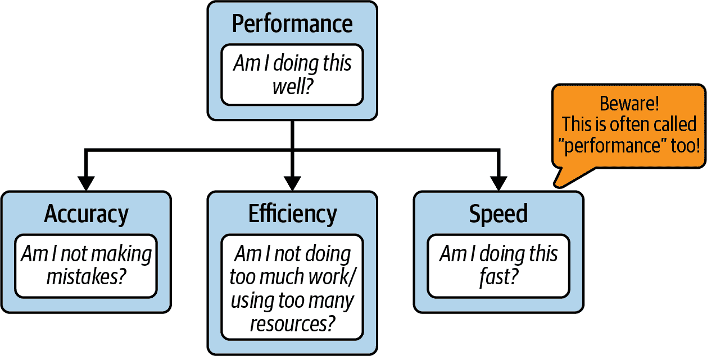
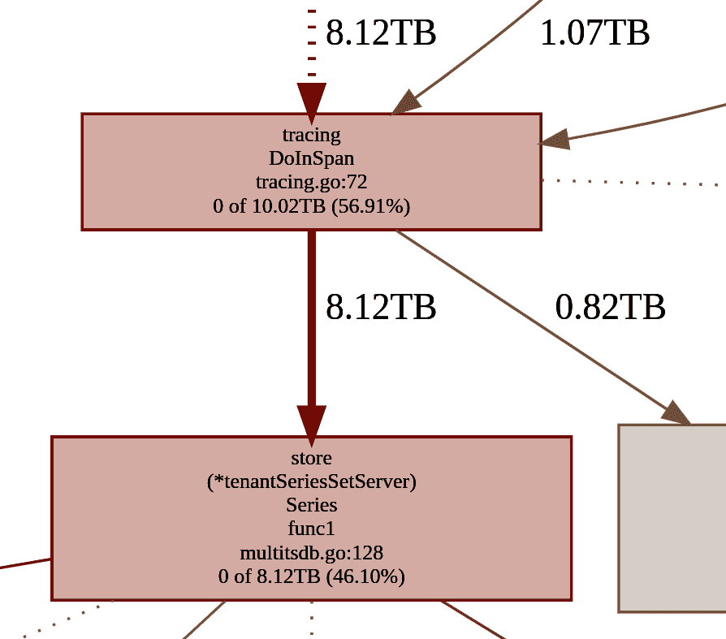
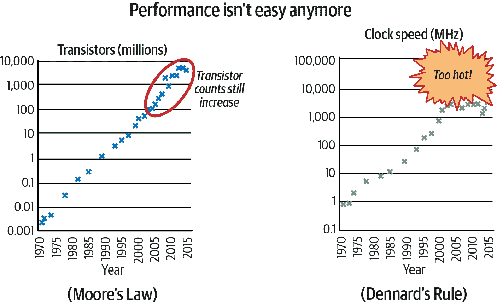
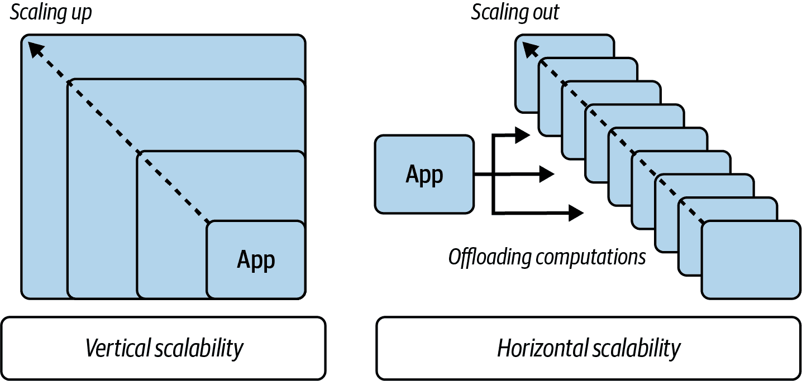

# 第一章 软件效率至关重要

> 软件工程师的主要任务是成本效益高、易维护且有用的软件开发。
> 
> Jon Louis Bentley，《编写高效程序》（Prentice Hall，1982）

即使经过 40 年，Jon 对开发的定义仍然非常准确。任何工程师的最终目标都是创建一个有用的产品，能够在产品生命周期内满足用户需求。不幸的是，如今并不是每个开发者都意识到软件成本的重要性。事实可能很残酷；声明开发过程可能昂贵可能是低估了。例如，Rockstar 花了 5 年时间和 250 名工程师开发了流行的《侠盗猎车手 5》视频游戏，[估计成本达 1.375 亿美元](https://oreil.ly/0CRW2)。另一方面，为了创建一个可用的、商业化的操作系统，苹果在 2001 年 macOS 首次发布前已经花费了超过[5 亿美元](https://oreil.ly/hQhiv)。

由于软件生产成本高昂，我们需要把精力集中在最重要的事情上。理想情况下，我们不希望在不必要的行动上浪费工程时间和精力，例如花费数周进行并未客观减少代码复杂性的代码重构，或者深度微优化一个很少运行的函数。因此，该行业不断创新出新的模式来追求高效的开发过程。敏捷看板方法允许我们适应不断变化的需求，专门为移动平台开发的编程语言如 Kotlin，以及用于构建网站的框架如 React，仅仅是一些例子。工程师在这些领域进行创新，因为每一种低效都会增加成本。

更加困难的是，当下开发软件时，我们还应该考虑到未来的成本。一些来源甚至估计，运行和维护成本[可能高于初始开发成本](https://oreil.ly/59Zqe)。为了保持竞争力，代码更改、故障修复、事故处理、安装以及最终的计算成本（包括消耗的电力）只是[总软件拥有成本（TCO）](https://oreil.ly/ZzUCx)的几个例子，我们必须考虑进去。敏捷方法有助于早期揭示这些成本，通过频繁发布软件并尽早获取反馈。

然而，如果我们从软件开发过程中剥离效率和速度优化，TCO 是否会更高呢？在许多情况下，等待应用程序执行多几秒钟应该不成问题。此外，硬件每个月变得更便宜更快。在 2022 年，购买一部具有数十 GB RAM 的智能手机并不困难。指尖大小的[2 TB SSD 硬盘，可达每秒 7 GBps 的读写吞吐量](https://oreil.ly/eVcPQ)已经可以购买到。即使是家庭 PC 工作站也达到了前所未见的性能分数。配备[8 个或更多 CPU，每秒可以执行数十亿周期，以及 2 TB 的 RAM](https://oreil.ly/eUzNh)，我们可以快速计算事物。而且，我们总是可以稍后添加优化，对吧？

> 与人们相比，机器变得越来越便宜；任何未能考虑到这一点的计算机效率讨论都是短视的。“效率”包括整体成本的降低——不仅是程序生命周期内的机器时间，还包括程序员和程序使用者的时间。
> 
> Brian W. Kernighan 和 P. J. Plauger，《程序设计风格的要素》（McGraw-Hill, 1978）

毕竟，改进软件的运行时间或空间复杂性是一个复杂的话题。特别是当你是新手时，花费时间优化而没有显著的程序加速是很常见的。即使我们开始关注代码引入的延迟，像 Java 虚拟机或 Go 编译器也会应用它们的优化。在现代硬件上花费更多时间处理复杂的事情，比如效率，这可能会牺牲我们代码的可靠性和可维护性，听起来可能不是一个好主意。这些只是工程师通常将性能优化放在开发优先级列表的最低位置的几个原因。

不幸的是，就像每一种极端简化一样，这种性能降低也存在一定的风险。不过，别担心！在本书中，我不会试图说服你，现在应该测量每行代码引入的纳秒数量，或者在将其添加到你的软件之前分配的每个比特。你不应该这样做。我远非试图激励你将性能置于开发优先级列表的首位。

然而，有意推迟优化与犯傻错误、导致低效和减速是有区别的。正如俗话说的那样，[“完美是好的敌人”](https://oreil.ly/OogZF)，但我们必须首先找到那个平衡的好。因此，我想提出一个细微但至关重要的变化，来改变我们作为软件工程师应该如何思考应用程序性能的方式。它将允许你将小而有效的习惯带入你的编程和开发管理周期中。基于数据，并且在开发周期的尽早阶段，你将学会如何判断何时可以安全地忽略或推迟程序的低效性。最后，当你无法跳过性能优化时，如何在哪里以及如何有效地应用它们，以及何时停止。

在“性能背后”，我们将解析*性能*这个词，并学习它与本书标题中的*效率*的关系。然后在“常见效率误解”，我们将挑战关于效率和性能的五个严重误解，这些误解常常使开发者们不再关注此类工作。你将学会，思考效率并不仅仅适用于“高性能”软件。

一些章节，比如这一章，第三章，以及其他章节的部分，都是完全与语言无关的，因此对非 Go 开发者也应该是实用的！

最后，在“实用代码性能的关键”，我将教你为什么专注于效率将使我们能够有效地思考性能优化，而不会牺牲时间和其他软件质量。这一章可能感觉理论性很强，但请相信我，这些见解将训练你在其他部分中介绍的特定效率优化、算法和代码改进的关键编程判断能力。也许它还会帮助你说服你的产品经理或利益相关者，更高效地意识到你的项目可能会有益。

让我们从解析效率的定义开始。

# 性能背后

在讨论为什么软件效率或优化很重要之前，我们必须首先揭开被滥用的*性能*这个词的真相。在工程上，这个词在许多上下文中被使用，并且可以有不同的含义，因此让我们对其进行解析，以避免混淆。

当人们说“This application is performing poorly”时，他们通常意味着这个特定程序正在执行得很慢。¹ 然而，如果同样的人说“Bartek is not performing well at work”，他们可能并不意味着 Bartek 从电脑到会议室的步伐太慢。根据我的经验，许多软件开发人员认为*performance*这个词是*speed*的同义词。对于其他人来说，它意味着执行质量的总体，这是这个词的最初定义。² 这种现象有时被称为“语义扩散”，即当一个词开始被更大的群体使用时，它的含义可能与其最初的含义不同。

> 在计算机性能中，性能这个词意味着与其他情境中性能相同的东西，也就是说，“计算机在执行其预期工作时表现如何？”
> 
> Arnold O. Allen，《用 Mathematica 进行计算机性能分析导论》（Morgan Kaufmann，1994）

我认为 Arnold 的定义尽可能准确地描述了*performance*这个词，因此这可能是你从本书中可以采取的第一个可操作步骤。要具体。

# 当有人使用“性能”这个词时澄清

当阅读文档、代码、bug 跟踪器或参加会议时，当你听到*performance*这个词时要小心。提出跟进问题，确保了解作者的意思。

实际上，性能作为整体执行的质量可能包含比我们通常认为的更多。这可能看起来有点挑剔，但如果我们想提高软件开发的成本效益，我们必须清晰、高效和有效地沟通！

我建议避免使用*performance*这个词，除非我们能明确其含义。想象一下你在类似 GitHub Issues 这样的 bug 跟踪器中报告 bug。特别是在那里，不要只是提到“bad performance”，而是具体描述应用程序中出现的预期外行为。同样，在变更日志中描述软件发布的改进时，³ 不要只是说某个变更“改进了性能”。描述具体改进了什么。也许系统的某部分现在更不容易出现用户输入错误，使用的内存更少（如果是的话，在什么情况下？），或者执行某些工作负载更快（比以前快多少秒？）。具体描述将为您和您的用户节省时间。

我将在我的书中明确解释这个词。所以每当你看到描述软件的词语*performance*，请通过图 1-1 来想象这种可视化。



###### 图 1-1\. 性能定义

原则上，软件性能意味着“软件运行得有多好”，并由你可以改进（或牺牲）的三个核心执行要素组成：

精确性

在完成任务所需的工作中所犯的错误数量。对于软件来说，可以通过应用程序产生的错误结果的数量来衡量。例如，在 Web 系统中，有多少请求以非 200 HTTP 状态代码完成。

Speed

完成任务所需的工作速度——执行的及时性。这可以通过操作延迟或吞吐量来观察。例如，我们可以估计内存中 1GB 数据的典型压缩通常需要大约 10 秒（延迟），从而实现大约[100 MBps 的吞吐量](https://oreil.ly/eOJdK)。

Efficiency

动态系统提供的有效能量与供给它的能量之比。更简单地说，这是衡量完成任务所需的额外资源、能量或工作量的指标。换句话说，我们浪费了多少努力。例如，如果我们从磁盘中获取 64 字节的宝贵数据的操作在 RAM 上分配了 420 字节，我们的内存效率将达到 15.23%。

这并不意味着我们的操作在绝对度量上效率为 15.23%。我们没有计算能量、CPU 时间、热量和其他效率指标。出于实际目的，我们倾向于指定我们考虑的效率是什么。在我们的例子中，这是内存空间。

总结一下，性能至少由这三个元素组成：

<math><mrow><mtext>性能</mtext> <mo>=</mo> <mo>(</mo> <mtext>精度</mtext> <mo>*</mo> <mtext>效率</mtext> <mo>*</mo> <mtext>速度</mtext> <mo>)</mo></mrow></math>

改进其中任何一个都可以提高正在运行的应用程序或系统的性能。它可以帮助提高可靠性、可用性、弹性、总延迟等。同样，忽视其中任何一个可能会使我们的软件变得不那么有用。⁴问题是，我们应该在什么时候停下来，并宣称它足够好？这三个元素可能看起来毫不相关，但实际上它们是相互关联的。例如，请注意，即使不减少错误的数量，我们仍然可以提高可靠性和可用性。例如，通过提高效率，减少内存消耗可以降低内存不足并导致应用程序或主机操作系统崩溃的风险。本书专注于知识、技术和方法，帮助您在不降低精度的情况下提高正在运行的代码的效率和速度。

# 我的书名为“高效的 Go”并非偶然。

我的目标是教会您实用的技能，使您能够以最小的努力产生高质量、准确、高效和快速的代码。为此，当我提到代码的整体效率时（而不是特定的资源），我指的是速度和效率，如图 1-1 所示。相信我，这将有助于我们有效地理解这个主题。您将在“实用代码性能的关键”中了解更多原因。

*性能* 这个词的误导性使用可能只是效率主题中误解冰山的一角。我们现在将详细讨论更多导致软件开发恶化的严重刻板印象和趋势。最好的情况下，它导致运行成本更高或价值不高的程序。最坏的情况下，它会引起严重的社会和财务组织问题。

# 常见的效率误解

我在代码审查或迭代计划中被要求“暂时忽略”软件效率的次数令人震惊。你可能也听说过这种情况！我也因同样的理由多次拒绝了别人的变更集。也许当时对我们的变更不予采纳是有充分理由的，特别是如果它们是不必要的微优化，增加了不必要的复杂性。

另一方面，也有一些情况是因为普遍的事实误解而被拒绝的。让我们试着揭示一些最具破坏性的误解。当你听到这些概括性的陈述时要谨慎。揭示它们可能有助于长期节省巨额开发成本。

## 优化后的代码并不一定可读

毫无疑问，软件代码最关键的品质之一是其可读性。

> 使代码目的不会被误解比展示技术高超更为重要... 模糊代码的问题在于调试和修改变得更加困难，而这已经是计算机编程中最难的方面。此外，太过聪明的程序可能会让你意想不到。
> 
> Brian W. Kernighan 和 P. J. Plauger，《编程风格的要素》（McGraw-Hill，1978）

当我们考虑超快速的代码时，有时候会想到那些巧妙的、低级别的实现，带有一堆字节移位、魔术字节填充和展开的循环。或者更糟糕的是，链接到您应用程序的纯汇编代码。

是的，像这样的低级别优化确实会使我们的代码显著变得不可读，但正如您将在本书中了解到的那样，这样的极端变化在实践中是罕见的。代码优化可能会带来额外的复杂性，增加认知负荷，并使我们的代码更难以维护。问题在于工程师们倾向于将优化与极端复杂性联系起来，并避免像火一样的效率优化。在他们的心目中，这意味着即时的负面可读性影响。本节的重点是向您展示，有方法可以使效率优化的代码清晰可见。效率和可读性可以共存。

类似地，如果我们添加其他任何功能或出于其他原因更改代码，也存在同样的风险。例如，因为害怕降低可读性而拒绝编写更高效的代码就像拒绝添加重要功能以避免复杂性一样。因此，再次，这是一个公正的问题，我们可以考虑放弃功能，但我们应该先评估后果。同样适用于效率更改。

例如，当您想为输入添加额外验证时，可以直接将复杂的 50 行代码`if`语句瀑布式地粘贴到处理函数中。这可能会让您的代码下一位读者哭泣（或者是您自己，当您几个月后重新查看这段代码时）。或者，您可以将所有内容封装到一个`func validate(input string) error`函数中，只添加轻微的复杂性。此外，为了避免修改处理代码块，您可以设计代码在调用者侧或中间件中验证它。我们还可以重新考虑系统设计，将验证复杂性转移到另一个系统或组件中，因此不实施此功能。组合特定功能时有很多方法，不会牺牲我们的目标。

我们的代码性能改进与额外功能有什么不同？我认为它们没有区别。您可以像处理功能一样，以可读性为目标设计效率优化。隐藏在抽象背后，二者可以对读者完全透明。⁵

然而，我们往往会将优化标记为可读性问题的主要来源。本章中其他错误观念的主要破坏性后果是，它们往往被用作完全忽略性能改进的借口。这往往导致所谓的*过早悲观化*，即使程序变得效率更低，反之亦然。

> 轻松对待自己，轻松对待代码：在其他一切相同的情况下，特别是代码复杂性和可读性，某些高效的设计模式和编码惯例应该从您的指尖自然流淌，并且比最优化的替代方案写起来更加容易。这不是过早优化；这是避免无谓的[不必要]悲观化。
> 
> H. Sutter 和 A. Alexandrescu，《C++ 编程规范：101 条规则、指南和最佳实践》（Addison-Wesley，2004 年）

可读性至关重要。我甚至认为不可读的代码在长期来看很少高效。当软件演化时，很容易破坏先前的过于巧妙的优化，因为我们误解或误解它。类似于错误和错误，很难在复杂代码中引入性能问题。您将在第十章中看到故意的效率更改示例，重点是可维护性和可读性。

# 可读性很重要！

优化易读的代码比将严重优化的代码变得易读更容易。这对于人类和试图优化您的代码的编译器来说都是真实的！

由于我们没有从一开始就设计软件的良好效率，优化通常会导致代码不易读。如果现在拒绝考虑效率，后期要优化代码可能会对可读性产生影响。在我们刚开始设计 API 和抽象的新模块中，找到引入更简单、更高效方法的途径要容易得多，正如您将在第三章中学到的那样，我们可以在许多不同的层面上进行性能优化，而不仅仅是通过挑剔和代码调整。也许我们可以选择更高效的算法、更快的数据结构或不同的系统权衡。这些将很可能导致更清洁、更易维护的代码和更好的性能，而不是在发布软件后再优化效率。在许多约束条件下，如向后兼容性、集成或严格接口，我们提高性能的唯一途径可能是引入额外的、通常是显著的代码或系统复杂性。

### 优化后的代码可能更易读

令人惊讶的是，优化后的代码可能更易读！让我们看几个 Go 代码示例。示例 1-1 是一种天真的获取器模式的使用方式，我在审核学生或初级开发者的 Go 代码时经常看到。

##### 示例 1-1\. 报告错误比例的简单计算

```go
type ReportGetter interface {
   Get() []Report
}

func FailureRatio(reports ReportGetter) float64 { 
   if len(reports.Get()) == 0 { 
      return 0
   }

   var sum float64
   for _, report := range reports.Get() { 
      if report.Error() != nil {
         sum++
      }
   }
   return sum / float64(len(reports.Get())) 
}
```


这只是一个简化的例子，但传递函数或接口以获取操作所需的元素的模式非常流行。当元素是动态添加的、缓存的或从远程数据库获取时，这种方式非常有用。


请注意，我们执行 `Get` 三次以检索报告。

我认为你会同意，示例 1-1 中的代码对大多数情况都适用。它简单而且相当易读。然而，由于可能存在效率和准确性问题，我可能不会接受这样的代码。我建议像示例 1-2 那样进行简单的修改。

##### 示例 1-2\. 更高效的计算报告错误比例的简单方法

```go
func FailureRatio(reports ReportGetter) float64 {
   got := reports.Get() 
   if len(got) == 0 {
      return 0
   }

   var sum float64
   for _, report := range got {
      if report.Error() != nil {
         sum++
      }
   }
   return sum / float64(len(got))
}
```


与示例 1-1 相比，我只调用`Get`一次，并通过变量`got`重复使用结果。

一些开发人员可能会争辩说，`FailureRatio` 函数可能很少使用；它不在关键路径上，而当前的 `ReportGetter` 实现非常便宜和快速。他们可能会认为，没有测量或基准测试，我们无法决定哪种更有效（这在大多数情况下是正确的！）。他们可能会称呼我的建议为“过早优化”。

然而，我认为这是一个非常普遍的过早悲观化案例。这是一个愚蠢的情况，拒绝更高效的代码，虽然现在并没有显著加快速度，但也没有造成任何损害。相反，我认为示例 1-2 在许多方面更为优越：

没有测量数据，示例 1-2 的代码更高效。

接口允许我们替换实现。它们代表用户和实现之间的某种契约。从`FailureRatio`函数的角度来看，我们不能假设超出该契约的任何内容。很可能，我们不能假设`ReportGetter.Get`代码将始终快速且廉价。⁶ 明天，有人可能会用针对文件系统的昂贵 I/O 操作，带有互斥锁的实现或对远程数据库的调用来替换`Get`代码。⁷

当然，我们可以稍后通过适当的效率流程进行迭代和优化，我们将在“效率感知开发流程”中讨论，但如果这是一个合理的改变，实际上还能改善其他事情，现在做也没有坏处。

示例 1-2 的代码更安全。

这在肉眼中可能看不见，但来自示例 1-1 的代码有引入竞态条件的相当大风险。如果`ReportGetter`实现与动态更改`Get()`结果的其他线程同步，我们可能会遇到问题。最好避免竞争，并确保函数体内的一致性。竞态错误是最难调试和检测的，因此宁愿安全也不要后悔。

示例 1-2 的代码更可读。

我们可能会添加一行额外的变量，但最终，在示例 1-2 中的代码明确告诉我们，我们希望在三个使用中使用相同的结果。通过用一个简单的变量替换三个`Get()`调用实例，我们还可以最小化潜在的副作用，使我们的`FailureRatio`函数纯函数化（除了第一行）。毫无疑问，从所有方面来看，示例 1-2 比示例 1-1 更可读。

这样的说法可能是准确的，但邪恶在于“过早”的部分。并非每种性能优化都是过早的。此外，这样的规则并不授权我们拒绝或忽视具有相当复杂性的更高效解决方案。

另一个优化代码清晰度的例子可以通过示例 1-3 和 1-4 中的代码可视化。

##### 示例 1-3\. 简单循环，没有优化

```go
func createSlice(n int) (slice []string) { 
   for i := 0; i < n; i++ {
      slice = append(slice, "I", "am", "going", "to", "take", "some", "space") 
   }
   return slice
}
```


返回名为`slice`的命名参数将在函数调用开始时创建一个持有空`string`切片的变量。


我们向切片追加七个`string`项，并重复`n`次。

示例 1-3 展示了我们通常在 Go 中如何填充切片，您可能会认为这里没有任何问题。它只是有效地工作。然而，我认为如果我们事先知道我们将向切片附加多少元素，那么我们不应该在循环中这样写。在我看来，我们应该始终像 示例 1-4 中那样编写。

##### 示例 1-4\. 带有预分配优化的简单循环。这样的代码可读性更低吗？

```go
func createSlice(n int) []string {
   slice := make([]string, 0, n*7) 
   for i := 0; i < n; i++ {
      slice = append(slice, "I", "am", "going", "to", "take", "some", "space") 
   }
   return slice
}
```


我们正在创建一个包含字符串 `slice` 的变量。我们还为此切片分配了 `n * 7` 个字符串的空间（容量）。


我们向切片附加了七个 `string` 项目，并重复 `n` 次。

我们将讨论效率优化，如示例 1-2 和 1-4，以及来自“预先分配如果可能”的更深刻的 Go 运行时知识，与 第四章。原则上，这两者都使我们的程序工作量减少。在 示例 1-4 中，由于初始预分配，内部的 `append` 实现在内存中不需要逐步扩展切片大小。我们一开始就完成了。现在，我希望您关注以下问题：这段代码可读性更高还是更低？

可读性通常是主观的，但我认为来自 示例 1-4 的更有效率的代码更易理解。它增加了一行，因此我们可以说代码有点更复杂，但同时，它在消息上是显式且清晰的。它不仅帮助 Go 运行时执行更少的工作，还向读者提示了此循环的目的以及我们期望的迭代次数。

如果您从未见过在 Go 中内置的 `make` 函数的原始用法，您可能会认为这段代码可读性较低。这是公平的。然而，一旦您意识到其好处并在整个代码中始终如一地使用此模式，它就会成为一种良好的习惯。甚至更多，由于这一点，任何没有此类预分配的切片创建也告诉了您一些信息。例如，它可能表明迭代次数是不可预测的，因此您需要更加小心。您甚至在查看循环内容之前就知道了一件事！为了使这样的习惯在 Prometheus 和 Thanos 代码库中保持一致，我们甚至添加了相关的[Thanos Go 编码风格指南条目](https://oreil.ly/Nq6tY)。

# 可读性不是一成不变的；它是动态的。

即使代码从未更改，理解特定软件代码的能力随时间可能会发生变化。随着语言社区尝试新事物，传统会来来去去。通过严格一致性，您可以通过引入新的清晰约定帮助读者理解甚至更复杂的程序片段。

### 现在与过去的可读性

通常情况下，开发者经常引用 Knuth 的“过早优化是所有邪恶之根源”这句话⁸ 来减少优化带来的可读性问题。 然而，这句话是很久以前说的。 虽然我们可以从过去的一般编程中学到很多东西，但我们已经在 1974 年后极大地改进了许多事物。 例如，那时流行的做法是向变量名称添加其类型信息，正如 示例 1-5 中展示的那样⁹。

##### 示例 1-5。 应用于 Go 代码的系统匈牙利命名法示例

```go
type structSystem struct {
   sliceU32Numbers []uint32
   bCharacter      byte
   f64Ratio        float64
}
```

匈牙利命名法曾经非常有用，因为当时编译器和集成开发环境（IDE）并不是很成熟。 但是现在，在我们的 IDE 或甚至像 GitHub 这样的仓库网站上，我们可以将鼠标悬停在变量上以立即知道其类型。 我们可以在毫秒内转到变量定义，阅读评论，并查找所有调用和变异。 随着智能代码建议、高级突出显示和在 1990 年代中期开发的面向对象编程的主导地位，我们手头的工具使我们能够在不显著影响实际可读性的情况下添加功能和效率优化（复杂性）。¹⁰ 此外，观察性和调试工具的可访问性和功能已经极大地增长，我们将在 第六章 中探讨这一点。 它仍然不允许巧妙的代码，但允许我们更快地理解更大的代码库。

总之，性能优化就像我们软件中的另一个功能，我们应该相应地对待它。 它可能会增加复杂性，但有方法可以减少理解我们代码所需的认知负荷。¹¹

# 如何使高效的代码更易读

+   删除或避免不必要的优化。

+   将复杂代码封装在清晰的抽象背后（例如接口）。

+   将“热”代码（需要更好效率的关键部分）与“冷”代码（很少执行的代码）分开。

正如我们在本章中学到的，有时更高效的程序往往是简单、明确和可理解代码的副产品。

## You Aren’t Going to Need It

You Aren’t Going to Need It (YAGNI) 是一条强大且流行的规则，在编写或审核任何软件时我经常使用。

> XP [极限编程] 最广为人知的原则之一是 **You Aren’t Going to Need It (YAGNI)** 原则。 YAGNI 原则强调在面对投资回报不确定性时延迟投资决策的价值。 在 XP 的背景下，这意味着推迟实现模糊功能，直到确定其价值的不确定性得到解决。
> 
> Hakan Erdogmu 和 John Favaro，《保持选择的开放性：极限编程与灵活性经济学》

从原则上讲，它意味着避免做那些当前需求中并非绝对必要的额外工作。这基于需求经常变化的事实，我们必须接受在软件上快速迭代的观点。

让我们想象一种潜在的情况，凯蒂，一位资深软件工程师，被分配任务创建一个简单的 Web 服务器。没什么花哨的，只是一个暴露一些 REST 端点的 HTTP 服务器。凯蒂是一位经验丰富的开发者，在过去可能已经创建了数百个类似的端点。她前进，编写功能，并在很短时间内测试了服务器。还有一些时间，她决定添加额外的功能：一个[简单的持有者令牌授权层](https://oreil.ly/EuKD0)。凯蒂知道这样的变更超出了当前的需求，但是她以前创建过数百个 REST 端点，每一个都有类似的授权。经验告诉她，这样的需求很可能很快也会出现，所以她想要做好准备。你认为这样的变更是否有意义，应该被接受？

尽管凯蒂表现出了良好的意图和扎实的经验，但为了保持 Web 服务器代码的质量和整体开发的成本效益，我们应该避免合并这样的变更。换句话说，我们应当遵循 YAGNI 规则。为什么呢？在大多数情况下，我们无法预测一个功能。坚持需求能够帮助我们节省时间和复杂性。有一种风险，即项目可能永远不需要授权层，例如，如果服务器在专用授权代理后运行。在这种情况下，即使不使用，凯蒂编写的额外代码也会带来很高的成本。这是额外的阅读代码，增加了认知负荷。此外，当需要时，更改或重构这样的代码会更加困难。

现在，让我们进入一个更加模糊的领域。我们向凯蒂解释了为什么需要拒绝授权代码。她同意了，并且决定通过在服务器上添加一些关键的监控来仪器化它，这些监控是一些关键指标。这种变更是否也违反了 YAGNI 规则？

如果监控是需求的一部分，它不违反 YAGNI 规则，应当被接受。如果不是，在不了解完整背景的情况下，很难说。关键监控应明确列入需求中。但即使没有，当我们在任何地方运行这样的代码时，Web 服务器的可观察性是首要需要的。否则，我们如何知道它是否正在运行？在这种情况下，凯蒂在技术上做了一些立即有用的重要事情。最终，我们应当运用常识和判断，在合并这种变更之前，向软件需求中添加或明确删除监控。

后来，在她的空闲时间里，Katie 决定为增强单独端点读取的性能添加一个简单的缓存。她甚至编写并执行了一个快速的基准测试，以验证端点的延迟和资源消耗的改进。这是否违反了 YAGNI 规则呢？

关于软件开发的悲哀之一是，性能效率和响应时间通常不在利益相关者的需求之列。应用程序的目标性能目标是“只要能工作”和“足够快”，但没有详细说明这意味着什么。我们将讨论如何在“资源感知效率需求”中定义实际的软件效率需求。在这个例子中，让我们假设最坏的情况。在需求列表中没有关于性能的内容。那么我们是否应该应用 YAGNI 规则并拒绝 Katie 的更改呢？

要了解清楚没有完整上下文是很难说的。实施一个健壮且可用的缓存并不是件小事，所以新代码有多复杂呢？我们正在处理的数据是否容易“可缓存”？¹² 我们知道这样的端点会被多频繁地使用吗（它是一个关键路径吗）？它应该扩展到多远？另一方面，为一个频繁使用的端点计算相同结果非常低效，所以缓存是一个很好的模式。

我建议 Katie 采取与她处理监控变更类似的方法：考虑与团队讨论，明确 Web 服务应该提供的性能保证。这将告诉我们，缓存现在是否需要或违反了 YAGNI 规则。

作为最后的更改，Katie 继续进行了一个合理的效率优化，就像你在示例 1-4 中学到的切片预分配改进一样。我们应该接受这样的改变吗？

我会在这里严格一点，答案是肯定的。我建议总是预先分配，就像在示例 1-4 中，当你预先知道元素的数量时。这是否违反了 YAGNI 规则背后的核心声明呢？即使某事通常适用，你也不应该在确定*会*需要之前就去做吧？

我认为，小的效率习惯，如果不会降低代码可读性（甚至会改善），通常应该成为开发者工作的重要部分，即使在需求中没有明确提到。我们将把它们作为“合理优化”来讨论。同样，没有项目需求规定像代码版本控制、拥有小接口或避免大依赖等基本最佳实践。

这里的主要观点是，遵循 YAGNI 规则是有帮助的，但并不意味着开发人员完全可以忽略性能效率。通常成千上万的小事情造成应用程序的过多资源使用和延迟，而不仅仅是我们可以稍后修复的单个问题。理想情况下，清晰定义的需求有助于澄清软件的效率需求，但它们永远无法涵盖我们应该尝试应用的所有细节和最佳实践。

## 硬件正在变得更快更便宜

> 当我开始编程时，我们不仅拥有缓慢的处理器，还有非常有限的内存——有时甚至只有几千字节。因此，我们必须考虑内存并明智地优化内存消耗。
> 
> 瓦伦丁·西蒙诺夫，《优先选择可读性》

毫无疑问，现在的硬件比以往任何时候都更强大、更便宜。我们几乎每年或每个月都能看到技术的进步。从 1995 年的单核奔腾 CPU，时钟速率为 200 MHz，到现在的小型、节能的 CPU，速度可达 3 到 4 GHz。内存大小从 2000 年的几十 MB 增加到 20 年后个人电脑的 64GB，访问速度更快。过去，小容量硬盘转向 SSD，然后是每秒 7GB 的快速 NVME SSD 硬盘，几 TB 的存储空间。网络接口实现了每秒 100Gb 的吞吐量。在远程存储方面，我记得有 1.44MB 空间的软盘，接着是容量高达 553MB 的只读 CD-ROM；接下来我们有蓝光、可读写的 DVD，现在可以轻松获取带有 TB 容量的 SD 卡。

现在让我们加入前述事实，普遍观点是典型硬件的摊销小时价值比开发人员的时间更便宜。考虑到这一切，有人会说，如果代码中的一个函数多占用了 1 MB 或进行了过多的磁盘读取，也无关紧要。为什么我们要推迟功能，培养或投资于性能意识的工程师，如果我们可以购买更大的服务器并总体支付更少呢？

可能你可以想象，事情并不是那么简单。让我们拆解这种非常有害的论点，将效率从软件开发的待办列表中剥离出来。

首先，声称在硬件上花更多的钱比在效率话题上投资昂贵的开发时间非常短视。这就像声称每次出了问题就买辆新车并卖掉旧车一样，因为修理不容易而且费用高昂。有时候这样做可能有效，但在大多数情况下，这并不是非常高效或可持续的。

假设软件开发人员的年薪大约在 10 万美元左右。考虑到[其他就业成本](https://oreil.ly/AxI0Y)，公司每年需要支付 12 万美元，即每月 1 万美元。2021 年以 1 万美元购买一台配备 1 TB DDR4 内存、两个高端 CPU、1 吉比特网络卡和 10 TB 硬盘空间的服务器。暂时忽略能源消耗成本。这样的交易意味着我们的软件每个月可以超额分配数 TB 的内存，而我们仍然比雇佣工程师来优化要好，对吧？不幸的是，事情并非如此。

这些领域的分配量往往比你想象的要多得多，不必等待整整一个月！图 1-2 展示了一个单副本（总共六个副本之一）在单个集群中运行五天的堆内存概况的屏幕截图。我们将在第九章讨论如何阅读和使用这些概况，但图 1-2 展示了自进程重启五天前某个`Series`函数的总分配内存。



###### 图 1-2\. 显示高流量服务在五天内的所有内存分配片段的内存概况

大部分内存已经被释放，但请注意，来自 Thanos 项目的这款软件在仅运行五天的情况下总共使用了 17.61 TB。¹³ 如果您写桌面应用程序或工具，迟早会遇到类似的规模问题。根据先前的例子，如果一个函数超额分配 1 MB，那么仅仅通过 100 个桌面用户的一次运行，该函数就可以在我们的应用程序中进行 100 次关键操作，总计浪费掉 10 TB。这不是一个月的时间，而是由 100 个用户一次运行造成的。因此，轻微的低效率很快就会导致过多的硬件资源。

还有更多。要负担得起 10 TB 的超额分配，购买具有如此多内存的服务器并支付能源消耗是不够的。分摊成本，除其他外，还必须包括编写、购买或至少维护固件、驱动程序、操作系统以及用于监视、更新和操作服务器的软件。由于额外硬件需要额外软件，按定义，这需要花钱雇佣工程师，所以我们回到了起点。通过避免专注于性能优化来节省工程成本，我们可能会在维护过度使用的资源所需的其他工程师身上花更多钱，或者支付一个已经在云使用账单中计算了额外成本及利润的云服务提供商。

另一方面，今天 10 TB 的内存成本很高，但明天由于技术进步可能只是边际成本。如果我们忽视性能问题，并等待服务器成本降低或更多用户用更快的设备替换他们的笔记本电脑或手机，会怎么样？等待比调试棘手的性能问题更容易！

不幸的是，我们不能忽视软件开发效率，期望硬件进步来缓解需求和性能问题。硬件确实变得更快更强大，是的。但不幸的是，速度还不够快。让我们来看看这种非直观效应背后的三个主要原因。

### 软件会扩展以填充可用的内存

这种效应被称为帕金森法则。¹⁴ 它指出，无论我们拥有多少资源，需求总是倾向于匹配供给。例如，帕金森法则在大学中明显可见。无论教授给予作业或考试准备多少时间，学生总是会用光所有时间，可能大部分都是在最后一刻完成的。¹⁵ 我们在软件开发中也可以看到类似的行为。

### 软件比硬件变得更快地变慢

Niklaus Wirth 提到了一个“肥软件”的术语，解释了为什么总是会有更多对更多硬件需求的需求。

> 增加的硬件性能无疑是厂商处理更复杂问题的主要动力......但应该担心的不是固有复杂性，而是自我造成的复杂性。有许多问题早已解决，但对于同样的问题，我们现在提供的解决方案包装在更庞大的软件中。
> 
> Niklaus Wirth, [“精简软件的呼吁”](https://oreil.ly/bctyb)

软件变得比硬件变得更快更强大更快，因为产品必须投资于更好的用户体验才能获得利润。这些包括更漂亮的操作系统，发光图标，复杂的动画，网站上的高清视频或模仿您面部表情的花哨表情符号，感谢面部识别技术。这是客户的永恒战斗，带来了更多的复杂性，因此增加了计算需求。

此外，由于更好地访问计算机、服务器、手机、物联网设备和任何其他类型的电子设备，软件的快速民主化也在发生。正如 Marc Andreessen 所说，“软件正在吞噬世界”。自 2019 年末开始的 COVID-19 大流行加速了数字化进程，远程基于互联网的服务成为现代社会的重要支柱。每天我们可能有更多的计算能力可用，但更多的功能和用户交互都会耗尽所有资源，甚至需要更多。最后，我认为我们在前述单一功能中过度使用的 1 MB 可能很快就会成为一个重要的瓶颈。

如果这仍然感觉非常假设性，只需看看你周围的软件。我们使用社交媒体，其中仅 Facebook 每天[生成 4PB](https://oreil.ly/oowCN)¹⁶的数据。我们在网上搜索，导致谷歌每天处理 20PB 的数据。然而，有人可能会说这些都是罕见的、全球规模的系统，拥有数十亿用户。典型的开发人员没有这样的问题，对吧？当我看到大多数共同创造或使用的软件时，他们迟早会遇到与大数据使用相关的性能问题。

+   一个用 React 编写的 Prometheus UI 页面在数百万个度量名称上执行搜索，或尝试获取数百兆字节的压缩样本，导致浏览器延迟和爆炸性内存使用。

+   在低使用率下，我们基础设施的一个 Kubernetes 集群每天生成 0.5TB 的日志（其中大部分从未被使用）。

+   我用来撰写本书的优秀语法检查工具在文本超过 20,000 字时进行了过多的网络调用，严重拖慢了我的浏览器。

+   我们用 Markdown 格式化和链接检查的简单脚本，花了几分钟处理所有元素。

+   我们的 Go 静态分析作业和 linting 超过了 4GB 内存，导致我们的 CI 作业崩溃。

+   我的 IDE 曾经需要 20 分钟才能索引我们的单体库中的所有代码，尽管我使用的是顶级笔记本电脑。

+   我仍未编辑我的 GoPro 4K 超广角视频，因为软件太卡了。

我可以举例说个没完没了，但关键是我们生活在一个真正的“大数据”世界中。因此，我们必须明智地优化内存和其他资源。

未来情况将会更糟。我们的软件和硬件必须处理数据以极快速度增长，这比任何硬件发展都要快。我们正处于引入[每秒传输高达 20 吉比特的 5G 网络](https://oreil.ly/CWvFG)的边缘。我们几乎在每一件购买的物品中引入了迷你计算机，如电视、自行车、洗衣机、冰柜、台灯，甚至[除臭剂](https://oreil.ly/DvZil)! 我们称这种运动为“物联网”（IoT）。预计从这些设备中获取的数据将从 2019 年的 18.3 ZB 增长到 2025 年的 73.1 ZB[¹⁷]。该行业可以生产 8K 电视，分辨率为 7,680 × 4,320，约 3300 万像素。如果您编写过电脑游戏，您可能很了解这个问题——在高度逼真的游戏中，以 60 帧以上的速度渲染这么多像素需要大量的有效工作。现代加密货币和区块链算法也对计算能效提出了挑战；例如，比特币在价值高峰期间的能源消耗达到了[约 130 太瓦时（全球电力消耗的 0.6%）](https://oreil.ly/NfnJ9)。

### 技术限制

最后一个原因，但同样重要的是，导致硬件进展不够快的背后原因之一是，硬件的进步在某些方面停滞不前，比如 CPU 速度（时钟频率）或内存访问速度。我们将在第四章中讨论这种情况的一些挑战，但我认为每个开发者都应该意识到我们当前所面临的基本技术限制。

在现代的效率书籍中读到不提及摩尔定律会感到奇怪，对吧？你可能在某处已经听说过它。这一定律是由英特尔的前首席执行官和联合创始人戈登·摩尔于 1965 年首次提出的。

> 最小组件成本的复杂性（每个芯片的晶体管数量，具有最低制造成本）每年以约两倍的速度增加……从长远来看，增长率更加不确定，尽管没有理由认为它在至少 10 年内不会保持几乎恒定的状态。这意味着到 1975 年，为了最低成本，集成电路每个组件的数量将达到 65,000 个。
> 
> 戈登·E·摩尔，《“在集成电路上装更多的元件”》（https://oreil.ly/WhuWd），《电子》38（1965 年）

摩尔的观察对半导体行业产生了巨大影响。但如果不是因为罗伯特·H·丹纳德及其团队，减小晶体管尺寸可能不会那么有利。在 1974 年，他们的实验揭示，功耗与晶体管尺寸成正比（恒定功率密度）。¹⁸这意味着更小的晶体管更加节能。最终，这两条法则都承诺了晶体管每瓦性能的指数增长。这激励投资者不断研究和开发减小金属氧化物半导体场效应晶体管的尺寸的方法。我们还可以在更小、更密集的微芯片上安装更多的晶体管，从而降低制造成本。该行业不断减少了安装相同计算能力所需的空间，改善了从 CPU、RAM 和闪存到 GPS 接收器和高清摄像头传感器的任何芯片的性能。

在实践中，摩尔的预测没有像他想的那样持续 10 年，而是接近 60 年，至今仍然有效。我们继续发明更小的微小晶体管，目前大约在约 70 纳米左右波动。可能我们可以使它们更小。不幸的是，正如我们可以从图 1-3 看到的那样，我们在 2006 年左右达到了丹纳德的比例缩放的物理极限。²⁰



###### 图 1-3\. 受[“性能至上”（Emery Berger 著）](https://oreil.ly/Tyfog)启发的图像：摩尔定律与丹纳德规则

尽管技术上，高密度小晶体管的功耗保持恒定，但这些密集的芯片很快就会发热。超过 3-4 GHz 的时钟速度后，为了保持其运行，冷却晶体管将需要显著更多的电力和其他成本。因此，除非你计划在海底底部运行软件²¹，否则短期内不会有更快的指令执行 CPU。我们只能拥有更多的核心。

### 更快的执行更节能。

到目前为止，我们学到了什么？硬件速度受到限制，软件变得越来越臃肿，而我们必须处理数据和用户的持续增长。不幸的是，这还不是结束。在开发软件时，我们经常忽略的一个重要资源是电力。我们的每一个计算过程都需要电力，而在诸如手机、智能手表、物联网设备或笔记本电脑等平台上，电力资源是严重受限的。令人意外的是，能效与软件速度和效率之间存在着强烈的关联。我喜欢 Chandler Carruth 的演讲，他很好地解释了这种令人惊讶的关系：

> 如果你读过“节能指令”或“优化电力使用”的内容，你应该变得非常怀疑……这基本上是一种完全没有科学根据的东西。关于如何节省电池寿命的头号理论是：尽快运行程序，然后进入休眠状态。你的软件运行得越快，消耗的电力就越少……今天的每一个通用微处理器，在节省电力方面的方式都是通过尽可能快速且频繁地关闭自己。
> 
> Chandler Carruth，[《算法效率，数据结构性能》](https://oreil.ly/9OftP)，CppCon 2014

总结一下，要避免常见的陷阱，即把硬件想象成一个持续变快和变便宜的资源，这样就能避免优化我们的代码。这是一个陷阱。这种破碎的循环使工程师逐渐降低了他们的性能编码标准，并且要求更多、更快的硬件。更便宜、更易得的硬件又会创造出更多的心理空间来跳过效率等等。有像苹果的 M1 硅片²²，RISC-V 标准²³ 等令人惊叹的创新，还有更实际的量子计算设备，它们承诺了很多。不幸的是，截至 2022 年，硬件的增长速度远远落后于软件效率的需求。

# 效率提高了可访问性和包容性。

软件开发人员通常对我们使用的高端笔记本电脑或移动设备的机器性能“宠坏”并与典型人类现实脱节。工程师们通常在高级、高端的笔记本电脑或移动设备上创建和测试软件。我们需要意识到，许多人和组织正在使用较老的硬件或更差的互联网连接。²⁴ 人们可能不得不在较慢的计算机上运行您的应用程序。考虑到我们的开发过程中的效率，以改善软件的总体可访问性和包容性可能是值得的。

## 我们可以选择水平扩展

正如我们在前面的部分中学到的，我们预计我们的软件迟早会处理更多的数据。但是你的项目从一开始就不太可能有数十亿的用户。我们可以通过在开发周期初期选择更低的目标用户数、操作数或数据大小来避免巨大的软件复杂性和开发成本。例如，在移动笔记应用程序中，我们通常简化初始编程周期，假设笔记数目较少，正在构建的代理每秒请求较少，或者团队正在处理的数据转换工具中的文件较小。简化事情是可以的。在早期设计阶段大致预测性能要求也很重要。

同样，找到软件部署中中长期预期负载和使用情况至关重要。即使在交通量增加的情况下，也要确保软件设计可以保证相似的性能水平是*可伸缩的*。一般来说，可伸缩性在实践中非常难以实现且昂贵。

> 即使系统今天能够可靠地工作，这并不意味着它将来一定会可靠地工作。系统性能下降的一个常见原因是负载增加：也许系统从一开始的 1 万并发用户增长到 10 万并发用户，或者从 100 万增长到 1000 万。也许它正在处理比以前更大量的数据。可伸缩性是我们用来描述系统处理增加负载能力的术语。
> 
> Martin Kleppmann，《设计数据密集型应用》（O'Reilly，2017）

在谈论效率的同时，我们可能会在本书中涉及一些可伸缩性的话题。然而，对于本章的目的，我们可以将软件的可伸缩性区分为两种类型，如图 1-4 所示。



###### 图 1-4\. 垂直与水平可伸缩性比较

垂直可伸缩性

扩展我们应用程序的第一种，有时最简单的方法是在具有更多资源的硬件上运行软件——“垂直”扩展。例如，我们可以为软件引入并行性，不是使用一个而是三个 CPU 核心。如果负载增加，我们提供更多的 CPU 核心。同样，如果我们的过程需要大量内存，我们可能需要增加运行要求，并请求更大的 RAM 空间。像磁盘、网络或电源这样的其他资源也是如此。显然，这并不是没有后果的。在最好的情况下，您在目标机器上有这个空间。潜在地，您可以通过将其他进程重新调度到不同的机器（例如，在云中运行时）或暂时关闭它们（在笔记本电脑或智能手机上运行时有用）。最坏的情况是，您可能需要购买更大的计算机，或者更有能力的智能手机或笔记本电脑。后一种选择通常非常有限，特别是如果您提供软件供客户在他们的非云场地上运行。最终，只能垂直扩展的资源消耗型应用程序或网站的可用性要低得多。

如果您或您的客户在云中运行您的软件，则情况略有改善。您可以“只需”购买一个更大的服务器。截至 2022 年，在 AWS 平台上，您可以将您的软件扩展到 128 个 CPU 核心，几乎 4 TB 的 RAM 和 14 GBps 的带宽。²⁵ 在极端情况下，您还可以购买一台[IBM 主机，具有 190 个核心和 40 TB 的内存](https://oreil.ly/P0auH)，需要不同的编程范例。

不幸的是，垂直扩展在许多方面都有其局限性。即使在云端或数据中心，我们也不能无限地扩展硬件。首先，大型机器是稀缺且昂贵的。其次，正如我们将在第四章中学到的，更大的机器会遇到由许多隐藏的单点故障引起的复杂问题。例如内存总线、网络接口、NUMA 节点和操作系统本身可能会过载和过慢。²⁶

横向扩展

而不是一个更大的机器，我们可以尝试在多个远程、更小、更简单和更便宜的设备之间进行计算卸载和共享。例如：

+   在移动消息应用程序中搜索包含“home”一词的消息，我们可以获取数百万条过去的消息（或者在第一时间将它们存储在本地），并对每条运行正则表达式匹配。相反，我们可以设计一个 API，并远程调用一个后端系统，将搜索分成 100 个匹配数据集的 1/100 的作业。

+   而不是构建“单块”软件，我们可以将不同功能分布到单独的组件中，并转向“微服务”设计。

+   而不是在个人电脑或游戏主机上运行需要昂贵 CPU 和 GPU 的游戏，我们可以在云中运行，并且以高分辨率[流式传输输入和输出](https://oreil.ly/FKmTE)。

水平扩展更容易使用，因为它有较少的限制，并且通常允许更大的动态性。例如，如果软件仅在某个公司使用，夜间可能几乎没有用户，而白天流量很大。通过水平扩展，可以轻松实现根据需求进行自动扩展和缩减的自动化功能，响应速度快。

另一方面，软件方面的水平扩展要困难得多。分布式系统、网络影响以及无法分片的困难问题是开发此类系统时的许多复杂性之一。因此，在某些情况下，通常更好地坚持垂直扩展。

考虑到水平和垂直扩展，让我们看看过去的一个具体场景。许多现代数据库依赖于压缩来高效存储和查找数据。在此过程中，我们可以重复使用许多索引，去重相同数据，并将碎片化的数据片段聚集到顺序数据流中，以加快读取速度。在 Thanos 项目初期，我们决定为简单起见重用一个非常朴素的压缩算法。理论上，我们计算出在一个数据块内不需要并行进行压缩过程。给定来自单一源的稳定的、最终压缩后的 100 GB（或更多）数据流，我们可以依赖于单个 CPU、少量内存和一些磁盘空间。最初的实现非常朴素且未经优化，遵循了 YAGNI 原则，避免了过早优化的模式。我们希望避免优化项目的可靠性和功能特性的复杂性和努力。结果，部署我们项目的用户很快遇到了压缩问题：处理传入数据过慢或每次操作消耗数百 GB 内存。成本是第一个问题，但不是最紧迫的问题。更大的问题是，许多 Thanos 用户在其数据中心没有更大的机器来垂直扩展内存。

乍一看，压缩问题看起来像是一个可扩展性问题。压缩过程依赖于我们无法无限添加的资源。由于用户想要快速解决方案，我们与社区一起开始集思广益，探讨潜在的水平扩展技术。我们讨论了引入一个压缩调度服务，该服务将把压缩作业分配给不同的机器，或者使用一种八卦协议的智能对等网络。不详细讨论，这两种解决方案都会增加巨大的复杂性，可能会使整个系统的开发和运行的复杂性翻倍或翻三倍。幸运的是，经过几天勇敢和经验丰富的开发人员的时间重新设计代码以提高效率和性能。这使得新版本的灭霸能够将压缩速度提高一倍，并直接从磁盘流式传输数据，从而使内存消耗达到最低。几年后，灭霸项目仍然没有任何复杂的水平扩展用于压缩，除了简单的分片，即使有成千上万的成功用户在其中运行数十亿的指标。

现在可能感觉有趣，但在某种程度上，这个故事相当可怕。我们几乎要引入基于社会和客户压力的巨大分布式系统级复杂性。这可能很有趣，但也可能会冒着项目被抛弃的风险。也许我们以后会添加，但首先我们会确保没有其他效率优化可以压缩。在我的职业生涯中，无论是在开源还是闭源的小型和大型项目中，类似的情况都反复出现。

# 过早的可扩展性比过早的效率优化更糟糕！

在引入复杂的可扩展模式之前，请确保考虑在算法和代码层面提高效率。

正如“幸运”的灭霸压缩情况所展示的那样，如果我们不专注于软件的效率，我们很快就会被迫引入过早的水平扩展。这是一个巨大的陷阱，因为通过一些优化工作，我们可能完全可以避免陷入扩展方法的复杂性。换句话说，避免复杂性可能会带来更大的复杂性。这对我来说是一个未被注意但却是行业中的一个关键问题。这也是我写这本书的主要原因之一。

复杂性源于“复杂性必须存在”的事实。我们不想使代码复杂化，因此我们必须使系统复杂化，如果从低效组件构建，会浪费资源和大量开发者或运维人员的时间。横向扩展尤其复杂。从设计上来说，它涉及网络操作。正如我们可能从 CAP 定理中了解的那样，²⁷ 一旦我们开始分布我们的流程，我们不可避免地遇到可用性或一致性问题。相信我，缓解这些基本约束，处理竞争条件，并理解网络延迟和不可预测性的世界比添加小的效率优化要困难一百倍，比如隐藏在`io.Reader`接口后面。

这一部分可能让你觉得只涉及基础设施系统。这是不正确的。它适用于所有软件。例如，如果你编写前端软件或动态网站，你可能会被诱惑将小客户端计算移到后端。我们可能只有在计算依赖负载并且超出用户空间硬件能力时才应该这样做。过早地将其移到服务器上可能会增加复杂性，因为需要额外的网络调用，更多的错误处理情况以及导致服务器饱和的拒绝服务（DoS）问题。²⁸

另一个例子来自我的经验。我的硕士论文是关于“使用计算集群的粒子引擎”。原则上，目标是在[Unity 引擎](https://unity.com)中添加一个粒子引擎到 3D 游戏中。诀窍在于，粒子引擎不应在客户端机器上运行，而是将“昂贵”的计算卸载到我大学附近的超级计算机“Tryton”上。²⁹ 你猜怎么着？尽管使用了超快的 InfiniBand 网络，³⁰ 我尝试模拟的所有粒子（比如真实的雨和人群）在转移到我们的超级计算机后速度更慢，可靠性更低。不仅更简单，而且在客户端机器上计算所有内容速度也更快。

总结一下，当有人说，“不要优化，我们可以横向扩展”，应该非常怀疑。通常，从效率改进开始比从扩展性水平上升更简单更便宜。另一方面，判断应该告诉你，当优化变得过于复杂时，扩展性可能是一个更好的选择。关于这一点，你会在第三章中了解更多。

## 市场时间更为重要

时间是昂贵的。其中一个方面是软件开发人员的时间和专业知识成本高昂。你希望应用程序或系统拥有的功能越多，设计、实施、测试、保障和优化解决方案所需的时间就越多。第二个方面是，公司或个人花费的时间越长，产品或服务的“上市时间”就越长，这可能会影响财务结果。

> 曾经时间就是金钱。现在它比金钱更有价值。麦肯锡的一项研究报告称，平均而言，公司如果将产品延迟六个月交付，税后利润将损失 33%，相比之下，如果产品开发超支 50%，损失只有 3.5%。
> 
> 查尔斯·H·豪斯和雷蒙德·L·普赖斯，《[产品团队追踪回报图](https://oreil.ly/SmLFQ)》

很难衡量这种影响，但当你“迟到”市场时，你的产品可能不再是领先的。你可能会错过宝贵的机会，或者对竞争对手的新产品反应过晚。因此，公司通过采用敏捷方法论或概念验证（POC）和最小可行产品（MVP）模式来减少这种风险。

敏捷和较小的迭代有所帮助，但最终，为了实现更快的开发周期，公司也会尝试其他方法：扩展他们的团队（招聘更多人，重新设计团队）、简化产品、增加自动化，或者进行合作伙伴关系。有时他们试图降低产品质量。正如 Facebook 的自豪初衷是“快速行动，打破常规”，公司常常在诸如代码可维护性、可靠性和效率等方面减少软件质量，以“击败”市场。

这正是我们最后一个误解所涉及的内容。为了更快地进入市场，减少软件的效率并不总是最佳选择。了解这种决定的后果是很好的。首先要了解风险。

> 优化是一个困难且昂贵的过程。许多工程师认为这个过程会延迟进入市场并降低利润。这可能是真的，但它忽略了与产品性能不佳相关的成本（尤其是在市场竞争激烈时）。
> 
> 兰德尔·海德，《[过早优化的谬误](https://oreil.ly/mMjHb)》

Bugs、安全问题和性能不佳时有发生，但它们可能会损害公司。毋庸置疑，我们可以看看波兰最大的游戏发行商 CD Projekt 在 2020 年底发布的一款游戏。[*赛博朋克 2077*](https://oreil.ly/ohJft)被认为是一款非常雄心勃勃、开放世界、庞大且高质量的作品。尽管市场营销做得很好，来自声誉良好的发行商，尽管推迟了，全球的玩家们还是购买了 800 万份预购。不幸的是，2020 年 12 月发布时，本来是优秀游戏却存在严重的性能问题。在所有游戏主机和大多数 PC 配置上都有 bug、崩溃和低帧率。在像 PS4 或 Xbox One 这样的老旧游戏主机上，据说这款游戏几乎无法游玩。当然，在接下来的几个月和几年里，有许多更新，大量的修复和显著的改进。

不幸的是，一切都为时已晚。损害已经造成。对我来说，这些问题似乎有些小，但已足以动摇 CD Projekt 的财务前景。在发布后五天，公司股价损失了三分之一，[造成创始人损失超过 10 亿美元](https://oreil.ly/x5Qd8)。数百万玩家要求退款。[投资者因游戏问题起诉](https://oreil.ly/CRKg4)CD Projekt，著名的[主导开发者离开了公司](https://oreil.ly/XwcX9)。也许这家发行商会幸存并恢复。但我们只能想象一个破损声誉对未来制作的影响。

更有经验和成熟的组织深知软件性能的关键价值，特别是那些面向客户的组织。亚马逊发现，如果其网站加载慢了一秒钟，[将会导致每年损失 16 亿美元](https://oreil.ly/cHT2j)。亚马逊还报告称，[每增加 100 毫秒的延迟就会损失 1%的利润](https://oreil.ly/Bod7k)。谷歌意识到，将其网页搜索速度从[400 毫秒降低到 900 毫秒会导致流量下降 20%](https://oreil.ly/hHmYJ)。对一些企业来说，情况甚至更糟。据估计，如果经纪人的电子交易平台比竞争对手慢 5 毫秒，可能会损失 1%甚至更多的现金流。如果慢 10 毫秒，[这个数字将增长到收入减少 10%](https://oreil.ly/fK7mE)。

从现实角度来看，毫秒级的慢速在大多数软件情况下可能并不重要。例如，假设我们想要实现从 PDF 到 DOCX 的文件转换器。整个体验是否持续 4 秒或 100 毫秒是否重要？在许多情况下，并不重要。然而，当有人把这个作为市场价值，并且竞争对手的产品延迟为 200 毫秒时，代码的效率和速度突然成为赢得或失去客户的问题。如果在物理上可能实现如此快的文件转换，竞争对手迟早会试图实现它。这也是为什么许多项目，甚至是开源项目，非常强调它们的性能结果的原因。虽然有时感觉像是廉价的营销手段，但这确实有效，因为如果你有两个功能集和其他特征相似的解决方案，你会选择速度最快的那个。不过，不仅仅是速度，资源消耗也很重要。

# 在市场上，效率通常比功能更重要！

在我作为基础设施系统顾问的经验中，我见过很多情况，客户选择远离需要更多 RAM 或磁盘存储的解决方案，即使这意味着在功能上有所损失。³²

对我来说，结论很简单。如果你想在市场上获胜，忽视软件中的效率可能不是最好的选择。不要等到最后一刻再进行优化。另一方面，市场时间至关重要，因此在软件开发过程中平衡足够的效率工作至关重要。其中一种方法是早期设定非功能性目标（在“资源感知效率需求”中讨论）。在本书中，我们将重点放在找到健康平衡，并减少改进软件效率所需的工作量（因此时间）上。现在让我们看看如何实用地思考软件性能。

# 实用代码性能的关键

在“性能背后”，我们了解到性能可以分为准确性、速度和效率。我提到在本书中，当我使用“*效率*”这个词时，它自然指的是资源的高效利用，但也包括我们代码的速度（延迟）。一个实用的建议隐藏在我们如何思考代码在生产中表现的决策中。

这里的秘密在于不要严格关注我们代码的速度和延迟。一般来说，对于非专用软件，速度仅在边缘地方有所影响；浪费和不必要的资源消耗才会导致减慢。而且，用低效率达到高速度总会带来更多问题而不是好处。因此，我们通常应该关注效率。可悲的是，这通常被忽视。

假设你想从城市 A 快速到达城市 B，穿过河流。你可以选择一辆快车，驶过附近的桥梁，快速到达城市 B。但是，如果你跳入水中慢慢游过河流，你也能更快到达城市 B。当有效率地完成时，较慢的行动仍然可以更快。例如，选择一条更短的路径。可以说，为了提高旅行效率并超过游泳者，我们可以选择更快的汽车，改善道路表面以减少阻力，甚至加装火箭引擎。我们可能会打败游泳者，但是这些剧变可能比简化工作并租用一艘小船更昂贵。

在软件中也存在类似的模式。假设我们的算法在磁盘上进行某些单词的搜索功能并且执行缓慢。鉴于我们操作持久数据，通常最慢的操作通常是数据访问，特别是如果我们的算法广泛执行此操作。非常诱人的做法是不去考虑效率，而是找到一种方法说服用户使用 SSD 而不是 HDD 存储。这样，我们可以将延迟降低到最多 10 倍。这将通过增加等式中的速度元素来提高性能。相反，如果我们能找到一种方法来改进当前算法，只需少数几次读取数据而不是百万次，我们可以实现更低的延迟。这意味着我们可以通过保持成本低来达到相同甚至更好的效果。

我建议将我们的努力集中在效率而不是纯粹的执行速度上。这也是为什么本书的标题是*Efficient Go*，而不是像*Ultra Performance Go*或*Fastest Go Implementations*这样更一般和引人注目的标题³³。

速度并非毫不重要。它很重要，正如你将在第三章中学到的那样，你可以编写更高效但更慢的代码，反之亦然。有时这是你需要做出的权衡。速度和效率都是至关重要的。它们彼此之间会相互影响。在实践中，当程序在关键路径上执行的工作较少时，通常会具有较低的延迟。在 HDD 与 SSD 的例子中，更换更快的硬盘可能允许您删除一些缓存逻辑，从而提高效率：减少内存和 CPU 时间的使用。有时候反过来也可以——正如我们在“硬件变得更快更便宜”中所学到的，进程越快，消耗的能量就越少，提高了电池的效率。

我认为，在优化性能时，我们通常应该首先专注于提高效率，而不是速度。正如你将在“优化延迟”中看到的那样，仅通过改善效率，我就能够仅用一个 CPU 核心将延迟降低七倍。有时候，改善效率后，你可能会惊讶地发现已经达到了期望的延迟！让我们进一步探讨为何效率可能更为重要的一些原因：

制作高效软件变慢要困难得多。

这与可读性代码更易优化的事实类似。但正如我之前提到的，由于需要做的工作较少，高效代码通常表现更好。在实践中，这也意味着慢速软件通常是低效的。

速度更易受影响。

正如你将在“实验的可靠性”中学到的，软件流程的延迟取决于大量外部因素。一个人可以优化代码以在专用和隔离环境中快速执行，但在长时间运行后可能会慢得多。在某些时候，由于服务器的热问题，CPU 可能会被限制频率。其他进程（例如定期备份）可能会意外地减慢您的主要软件。网络可能会被限制。在编程时，要考虑到大量隐藏的未知因素。这就是为什么效率通常是我们作为程序员能够最好控制的因素。

速度不够便携。

如果我们仅优化速度，那么当将应用程序从开发者机器移至服务器或不同客户端设备时，不能保证其能够同样运行。不同的硬件、环境和操作系统可能会完全改变应用程序的延迟。因此，设计高效软件至关重要。首先，受影响的因素较少。其次，如果在开发者机器上对数据库进行两次调用，那么无论是将其部署到空间站的物联网设备还是基于 ARM 的大型机，调用次数可能都是相同的。

一般来说，效率是我们在可读性之后或与可读性同时要考虑的事情。我们应该从软件设计的最开始就开始考虑效率问题。健康的效率意识，如果不过度强调，会导致健壮的开发习惯。它使我们能够避免那些在后期开发阶段难以改进的低效性能错误。做更少的工作通常还能减少代码的总体复杂性，提高代码的可维护性和可扩展性。

# 总结

我认为，开发者通常在开始开发过程时心存妥协。我们经常坐下来时带着必须从一开始就妥协某些软件品质的态度。我们经常被教导要牺牲软件的质量，如效率、可读性、可测试性等，以完成我们的目标。

在本章中，我希望鼓励你在软件质量上更有野心、更贪婪一些。坚持下去，并且尽量不要在不必要之前牺牲任何质量——直到证明无法实现所有目标为止。不要从默认的妥协立场开始你的谈判。有些问题在没有简化和妥协的情况下确实很难，但许多问题在一些努力和适当的工具下是可以解决的。

希望到此为止，你已经意识到我们必须从早期开发阶段开始考虑效率的问题。我们了解了性能的组成。此外，我们了解到许多误解在适当时是值得挑战的。我们需要意识到过早的悲观和过早的可扩展性，就像我们需要考虑避免过早的优化一样重要。

最后，我们了解到性能方程中的效率可能会给我们带来优势。通过先提高效率来改善性能是比较容易的。这在有效地处理性能优化主题上多次帮助了我的学生和我。

在下一章中，我们将快速介绍一下 Go 语言。知识是提高效率的关键，但如果我们对所使用的编程语言的基础不熟练，这将变得非常困难。

¹ 我甚至在 Twitter 上做了一个小的 [实验](https://oreil.ly/997J5)，证明了这一点。

² 英国剑桥词典 [定义](https://oreil.ly/AXq4Q) 名词*性能*为“一个人、机器等完成工作或活动的能力有多强”。

³ 我甚至建议，与您的变更日志一起，遵循像[这里所示的](https://oreil.ly/rADTI) 通用标准格式。这些材料还包含了关于清晰发布说明的宝贵提示。

⁴ 我们可以在这个句子中使用“less performant”吗？不能，因为*performant*这个词在英语词汇中并不存在。也许这表明我们的软件不能够“高效”——总有改进的余地。在实际意义上，我们的软件能力有其极限。[1962 年，H. J. Bremermann 提出](https://oreil.ly/1sl3f) 存在一个计算物理上的极限，这取决于系统的质量。我们可以估计，一台质量极轻的笔记本电脑每秒能处理 ~10⁵⁰ 位，而地球质量的计算机最多每秒能处理 10⁷⁵ 位。尽管这些数字看起来巨大，但即使是这样一台大型计算机也需要很长时间才能强制执行所有的象棋走法（估计为 10¹²⁰ 复杂度）。这些数字在密码学中有着实际应用，用来评估破解特定加密算法的难度。

⁵ 值得一提的是，有时隐藏功能或优化可能会导致可读性降低。有时明确性更好，可以避免意外。

⁶ 作为接口“契约”的一部分，可能会有一条注释说明实现应该缓存结果。因此，调用者可以放心多次调用它。但我认为，最好避免依赖于类型系统未保证的东西，以防意外。

⁷ 所有三个`Get`实现的示例可能被认为是昂贵的调用。与内存中读取或写入相比，针对文件系统的输入输出（I/O）操作要慢得多。涉及互斥锁意味着在访问之前可能需要等待其他线程。调用数据库通常涉及所有这些，并且可能涉及网络通信。

⁸ 这句著名的引用用来阻止某人花费时间在优化上。通常被滥用，它来自唐纳德·库努斯的[“带有 `goto` 语句的结构化编程”](https://oreil.ly/m3P50)（1974）。

⁹ 这种类型的风格通常被称为匈牙利命名法，它在微软公司被广泛使用。这种记法也分为两种：App 和 Systems。文献表明，[Apps Hungarian 仍然可以带来许多好处](https://oreil.ly/rYLX4)。

¹⁰ 值得强调的是，如今建议以与 IDE 功能轻松兼容的方式编写代码；例如，你的代码结构应该是[“连通”的图](https://oreil.ly/mFzH9)。这意味着你连接函数的方式应该是 IDE 可以帮助的。任何动态分派、代码注入和延迟加载会禁用这些功能，除非绝对必要。

¹¹ 认知负荷是指“大脑处理和记忆”的量，一个[人必须用来理解代码或函数](https://oreil.ly/5CJ9X)。

¹² *可缓存性*通常被[定义](https://oreil.ly/WNaRz)为可以被缓存的能力。可以缓存（保存）任何信息以便以后检索，速度更快。但是，数据可能仅在短时间内有效，或者仅适用于少量请求。如果数据依赖于外部因素（例如用户或输入）并且频繁更改，则其缓存效果不佳。

¹³ 当然，这只是一个简化。该过程可能使用了更多的内存。配置文件不显示现代应用程序运行所需的内存映射、堆栈和许多其他缓存。我们将在第四章中学到更多相关内容。

¹⁴ Cyril Northcote Parkinson 是一位英国历史学家，阐述了现在被称为帕金森法则的管理现象。这一法则称为“工作会膨胀以填满其完成所需的时间”，最初是指高度与决策机构中官员数量相关联的政府办公室效率。

¹⁵ 至少这就是我学习的样子。这种现象也被称为[“学生综合症”](https://oreil.ly/4Vpqb)。

¹⁶ *PB*意味着皮字节。一皮字节等于 1,000 TB。如果我们假设一个平均两小时长的 4K 电影占用 100 GB，那么用 1 PB 可以存储 10,000 部电影，相当于大约两到三年的持续观看时间。

¹⁷ 1 赫赫字节等于 1 百万 PB，一百亿 TB。我甚至不敢尝试想象这么多的数据量。 :)

¹⁸ Robert H. Dennard 等人，《“非常小物理尺寸的离子注入 MOSFET 设计”》[IEEE 固态电路杂志](https://oreil.ly/OAGPC)，9 卷 5 期（1974 年 10 月）：256–268 页。

¹⁹ [MOSFET](https://oreil.ly/mhc5k)代表“金属氧化物半导体场效应晶体管”，简单来说，它是一个允许切换电子信号的绝缘门。这种特定技术驱动了 1960 年至今大多数存储芯片和微处理器的背后。它已被证明具有高度可扩展性和微小化能力。它是历史上生产数量最多的器件，1960 年至 2018 年间生产了 13 兆兆个器件。

²⁰ 有趣的是，出于营销原因，公司们通过将 CPU 世代命名约定从晶体管门长度转换为工艺尺寸来隐藏有效减少晶体管大小的能力。14 纳米世代的 CPU 仍然使用 70 纳米的晶体管，类似于 10、7 和 5 纳米工艺。

²¹ 我不是在开玩笑。[微软已经证明](https://oreil.ly/nJzkN)，将服务器放在水下 40 米是一个极好的主意，可以提高能效。

²² [M1 芯片](https://oreil.ly/emBke)是一个有趣权衡的优秀示例：选择速度和能效性能的灵活性，而不是硬件扩展性。

²³ RISC-V 是一种开放标准的指令集架构，可以更容易地制造兼容的“精简指令集计算机”芯片。这种集合比一般用途的 CPU 更简单，并且允许更优化和专门化的硬件。

²⁴ 为了确保开发者理解并与网络连接较慢的用户产生共鸣，Facebook 引入了[“2G Tuesdays”](https://oreil.ly/fZSoQ)，在 Facebook 应用上开启模拟的 2G 网络模式。

²⁵ 这个选项并不像我们想象的那么昂贵。实例类型 x1e.32xlarge [每小时费用为 $26.60](https://oreil.ly/9fw5G)，所以一个月“只有” $19,418。

²⁶ 即使是对于具有极大硬件的机器，硬件管理也必须有所不同。这就是为什么 Linux 内核有专门的[hugemem](https://oreil.ly/tlWh3)类型内核，可以管理多达四倍的内存和大约八倍的 x86 系统逻辑核心。

²⁷ [CAP](https://oreil.ly/EYqPI) 是核心系统设计原则。它的首字母缩写来自一致性（Consistency）、可用性（Availability）和分区容忍性（Partition tolerance）。它定义了一个简单的规则，即这三者中只能同时实现两个。

²⁸ 拒绝服务是系统处于无响应状态，通常是由于恶意攻击引起的。它也可能因意外的大负载而“意外”触发。

²⁹ 大约在 2015 年，这是波兰最快的超级计算机，提供 1.41 PFlop/s 的性能和超过 1,600 个节点，其中大多数节点配备了专用的 GPU。

³⁰ InfiniBand 是一种高性能网络通信标准，特别是在光纤发明之前非常流行。

³¹ 有趣的是，Mark Zuckerberg 在 2014 年的 F8 大会上[宣布了将著名的座右铭更改为“Move fast with stable infra”](https://oreil.ly/Yt2VI)。

³² 在云原生世界中，我经常看到的一个例子是将日志堆栈从 Elasticsearch 移动到像 Loki 这样更简单的解决方案。尽管缺乏可配置的索引功能，Loki 项目能够以更少的资源提供更好的日志读取性能。

³³ 还有另一个原因。 “Efficient Go” 这个名称与你可能在 Go 编程语言中找到的最好的文档之一——[“Effective Go”](https://oreil.ly/OHbMt)非常相似！这可能也是我读过的关于 Go 的第一篇文章。它具体、可操作，如果你还没有阅读过，我推荐你阅读一下。
