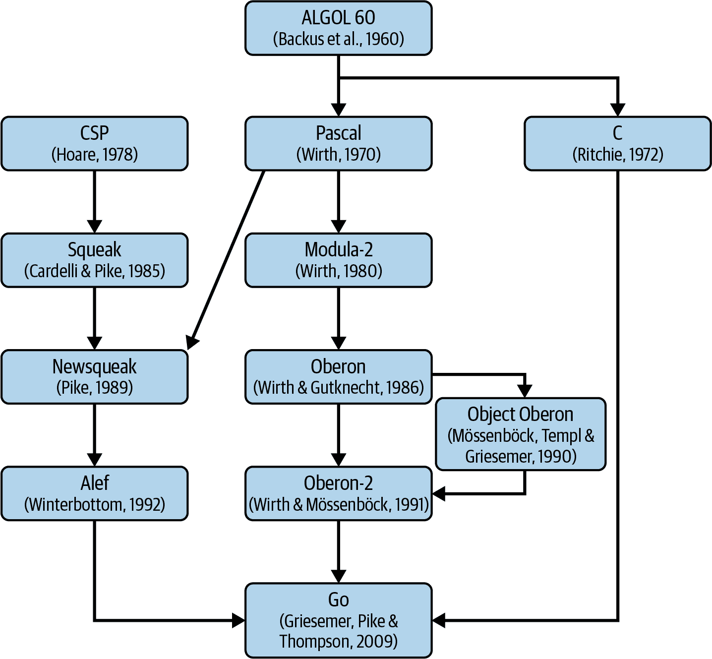

# 第二章\. 高效入门 Go 语言

> Go 是高效、可扩展且高生产力的。一些程序员觉得在其中工作很有趣；另一些人则认为它缺乏想象力，甚至乏味。……这些观点并不矛盾。Go 的设计是为了解决谷歌在软件开发中遇到的问题，这导致了一种不是突破性研究语言，但却是大型软件项目工程的优秀工具。
> 
> 罗布·派克，《谷歌的 Go：服务于软件工程的语言设计》(来源：[`oreil.ly/3EItq`](https://oreil.ly/3EItq))

我是 Go 编程语言的铁杆粉丝。全球开发者用 Go 取得的成就令人印象深刻。连续几年，Go 都在[人们喜欢或想学习的前五种语言列表](https://oreil.ly/la9bx)上。它在许多企业中都有使用，包括像苹果、美国运通、Cloudflare、戴尔、谷歌、Netflix、红帽、Twitch 和[其他公司](https://oreil.ly/DSM73)。当然，像所有事物一样，没有完美的东西。如果你在半夜叫醒我，让我快速编写可靠的后端代码，我会选择用 Go。命令行界面？也用 Go。快速、可靠的脚本？同样也是用 Go。作为初级程序员学习的第一门语言？Go。用于物联网、机器人和微处理器的代码？答案同样是 Go。¹ 基础设施配置？截至 2022 年，我认为没有比 Go 更好的工具用于强大的模板化了。²

请不要误会，有些语言具有专门的能力或生态系统，这些方面可能比 Go 更优秀。例如，想想图形用户界面（GUI）、游戏行业的高级渲染部分或在浏览器中运行的代码。³ 然而，一旦你意识到 Go 语言的诸多优点，再回到其他语言就会感觉相当痛苦。

在第一章中，我们花了一些时间来建立我们软件的效率意识。结果，我们学到了我们的目标是用最少的开发工作和成本编写高效的代码。本章将解释为什么 Go 编程语言可以成为实现性能和其他软件质量平衡的可靠选择。

我们将从 “Go 基础知识” 开始，然后继续学习 “高级语言元素”。这两个部分列出了关于 Go 的简短但关键的信息，这是我在 2014 年开始学习 Go 时希望自己早些知道的内容。这些部分将涵盖远不止基本的效率信息，并可以作为学习 Go 的入门。然而，如果你完全是这门语言的新手，我仍然建议先阅读这些部分，然后再查看摘要中提到的其他资源，也许在 Go 中写下你的第一个程序，然后再回到这本书。另一方面，如果你认为自己是一个更高级的用户或专家，我建议不要跳过这一章节。我会解释关于 Go 的一些较少人知的事实，可能会引起你的兴趣或争议（没关系，每个人都可以有自己的观点！）。

最后但同样重要的是，我们将回答一个关于总体 Go 效率能力的棘手问题，在 “Go 是否‘快速’？” 中，与其他语言相比。

# Go 基础知识

Go 是由谷歌维护的开源项目，在一个名为“Go team”的分布式团队内进行。该项目包括编程语言规范、编译器、工具、文档和标准库。

让我们快速浏览一些关于 Go 基础知识和特性的事实和最佳实践。尽管这里的一些建议可能带有个人意见，但这是基于我自 2014 年以来与 Go 工作的经验——一个充满事件、过去错误和艰难汲取的背景。我在这里分享它们，希望你不需要再犯这些错误。

## 命令式、编译型和静态类型语言

Go 项目的核心部分是同名的通用编程语言，主要设计用于系统编程。正如你在 Example 2-1 中会注意到的，Go 是一种命令式语言，因此我们对执行过程有（某些）控制权。此外，它是静态类型和编译型的，这意味着编译器可以在程序运行之前执行许多优化和检查。这些特性本身已经足够使 Go 适合于可靠和高效的程序。

##### Example 2-1\. 打印“Hello World”并退出的简单程序

```go
package main

import "fmt"

func main() {
   fmt.Println("Hello World!")
}
```

项目和语言都称为“Go”，但有时候你也可以称它们为“Golang”。

# Go 与 Golang

作为一个经验法则，我们应该在任何地方都使用“Go”这个名称，除非它与英语单词 *go* 或一种古老的游戏“围棋”冲突。 “Golang” 来自于域名选择（[*https://golang.org*](https://golang.org)），因为作者无法获取“go”这个域名。因此，在网络上搜索与这种编程语言相关的资源时，请使用“Golang”。

Go 还有自己的吉祥物，称为[“Go 地鼠”](https://oreil.ly/SbxVX)。我们可以在各种形式、情况和组合中看到这只可爱的地鼠，例如会议演讲、博客文章或项目标志。有时 Go 开发人员也被称为“地鼠”！

## 设计用于改进严肃的代码库

一切始于三位 Google 经验丰富的程序员在 2007 年勾勒出 Go 语言的想法：

Rob Pike

UTF-8 和 Plan 9 操作系统的共同创作者。在 Go 之前，他与 Limbo 一起编写用于编写分布式系统和 Newsqueak 用于编写图形用户界面中并发应用程序。这两者都受到了 Hoare 的通信顺序处理（CSP）的启发。⁴

Robert Griesemer

除了其他工作，Griesemer 开发了[Sawzall 语言](https://oreil.ly/gYKMj)，并在 Niklaus Wirth 指导下完成了博士学位。同一位 Niklaus 撰写的“关于精简软件的呼吁”被引用在“软件变慢比硬件变快更迅速”一书中。

Ken Thompson

第一个 Unix 系统的原始作者之一。 `grep` 命令行实用程序的唯一创建者。Ken 与 Rob Pike 共同创造了 UTF-8 和 Plan 9。他还撰写了几种语言，例如 Bon 和 B 编程语言。

这三位旨在创建一种新的编程语言，旨在改进当时由 C++、Java 和 Python 主导的主流编程。一年后，它成为一个全职项目，Ian Taylor 和 Russ Cox 于 2008 年加入，这些人后来被称为[Go 团队](https://oreil.ly/Nnj6N)。 Go 团队在 2009 年宣布了公开的 Go 项目，并于 2012 年 3 月发布了 1.0 版本。

与 C++相关的主要挫折⁵在 Go 设计中提到：

+   复杂性，多种做同样事情的方式，太多的功能

+   特别是对于更大的代码库，编译时间特别长

+   大型项目中更新和重构的成本

+   不易使用且内存模型容易出错

这些元素是 Go 诞生的原因，源于对现有解决方案的挫折和允许更少实现更多的雄心。其指导原则是制造一种不以牺牲安全性换取少重复的语言，但允许更简单的代码。它不为了更快的编译或解释而牺牲执行效率，但确保构建时间足够快。[Go 试图尽可能快地编译，例如通过显式导入](https://oreil.ly/qxuUS)。特别是默认启用缓存，只有更改的代码才会被编译，因此构建时间很少超过一分钟。

# 你可以把 Go 代码当作脚本来使用！

虽然 Go 在技术上是一种编译语言，但你可以像运行 JavaScript、Shell 或 Python 一样运行它。只需调用`go run <executable package> <flags>`即可。这很方便，因为编译速度非常快。你可以像使用脚本语言一样使用它，同时保持编译的优势。

在语法方面，Go 的设计初衷是简单、关键字少且熟悉。语法基于 C，支持类型推导（自动类型检测，类似于 C++ 的 `auto`），没有前置声明，没有头文件。概念保持正交性，这使得它们更容易组合和推理。元素的正交性意味着，例如，我们可以为任何类型或数据定义添加方法（方法添加与类型创建分开）。接口对类型也是正交的。

## 由 Google 管理，同时又是开源的。

自从宣布 Go 以来，所有开发都在[开源](https://oreil.ly/ZeKm6)进行，使用公共邮件列表和 Bug 跟踪器。更改提交到公共权威源代码，采用[BSD 风格许可证](https://oreil.ly/XBDEK)。Go 团队审核所有贡献。无论变更或想法来自 Google 还是其他方，流程都是一样的。项目路线图和提案也是公开开发的。

不幸的是，悲伤的事实是有许多开源项目，但有些项目比其他项目更不开放。Google 仍然是 Go 的唯一公司监护人，并对其拥有最终决策权。即使任何人都可以修改、使用和贡献，由单一供应商协调的项目存在着风险，如重新许可或阻止某些功能。虽然有些颇具争议的情况使得 Go 团队的决定让社区感到惊讶，⁶ 总体而言，该项目管理得非常合理。无数变更来自 Google 外部，并且 Go 2.0 草案提案过程得到了良好的尊重和社区驱动。最终，我认为来自 Go 团队的一致决策和监护也带来了许多好处。冲突和不同看法是不可避免的，即使不完美，有一个一致的视角可能比没有决策或多种做法更好。

到目前为止，这种项目设置已被证明对采用和语言稳定性非常有效。对于我们的软件效率目标，这种对齐也是再好不过了。我们有一个大公司投入其中，确保每个发布版本都不会带来性能退化。一些内部 Google 软件依赖于 Go，例如，[Google Cloud Platform](https://oreil.ly/vjyOc)。而许多人依赖于 Google Cloud Platform 的可靠性。另一方面，我们有庞大的 Go 社区提供反馈，发现错误并贡献想法和优化。而且如果这还不够，我们有开源代码，让我们这些凡人开发者能够深入了解实际的 Go 库、运行时（参见“Go Runtime”）等，以理解特定代码的性能特征。

## 简单性、安全性和可读性至关重要。

罗伯特·格里塞默在[GopherCon 2015 提到过](https://oreil.ly/s3ZZ5)，在他们最初开始构建 Go 语言时，首先知道了哪些事情不应该做。主要的指导原则是简单性、安全性和可读性。换句话说，Go 语言遵循“少即是多”的模式。这是一个贯穿多个领域的强有力的习语。在 Go 语言中，只有一种*习惯用法*的编码风格⁷，并且有一个名为`gofmt`的工具可以确保大部分都符合这种风格。特别是代码格式化（紧随命名之后）很少有程序员能达成一致。我们花时间争论它，并根据特定的需求和信念调整它。多亏了工具强制执行单一风格，我们节省了大量时间。正如一个[Go 谚语](https://oreil.ly/ua2G8)所说，“gofmt 的风格不是任何人的最爱，但 gofmt 是每个人的最爱。”总体来说，Go 语言的作者们设计这门语言尽可能简洁，以便在编写程序时几乎只有一种写法。这在你编写程序时大大减少了决策的负担。处理错误的方式、编写对象的方式、以及并发运行事物的方式，都是唯一的。

Go 语言可能会“缺失”大量特性，然而[可以说它比 C 或 C++更具表现力](https://oreil.ly/CPkvV)。这种简约主义允许保持 Go 代码的简洁性和可读性，从而提高软件的可靠性、安全性和整体更高的应用速度。

# **我的代码是否符合习惯用法？**

在 Go 社区中，“习惯用法”一词被大量使用。通常指的是经常使用的 Go 模式。由于 Go 的普及程度大大增加，人们用许多创造性的方式改进了最初的“习惯用法”风格。如今，什么是习惯用法，什么不是，并不总是清晰的。

就像《曼达洛人》系列中的“这是正确的方式”一样。当我们说“这段代码符合习惯用法”时，这让我们感到更加自信。因此，总结起来，使用这个词要谨慎，并且[除非你能详细阐述为什么某种模式更好，否则最好避免使用它](https://oreil.ly/dAAKz)。

有趣的是，“少即是多”的习语可以帮助我们为本书的目的努力提高效率。正如我们在第一章中所学到的，如果在运行时做得越少，通常意味着更快、更精简的执行和更少复杂的代码。在本书中，我们将尝试保持这一方面，同时提高我们的代码性能。

## **打包与模块**

Go 源代码按照表示包或模块的目录进行组织。包是位于同一目录中的源文件集合（具有*.go*后缀）。包名在每个源文件顶部的`package`语句中指定，如示例 2-1 所示。同一目录中的所有文件必须具有相同的包名⁸（包名可以与目录名不同）。多个包可以成为单个 Go 模块的一部分。模块是一个具有*go.mod*文件的目录，该文件列出了构建 Go 应用程序所需的所有依赖模块及其版本。然后，依赖管理工具[Go Modules](https://oreil.ly/z5GqG)使用此文件。模块中的每个源文件都可以导入来自同一或外部模块的包。某些包也可以是“可执行的”。例如，如果一个包名为`main`并且在某个文件中具有`func main()`，则可以执行它。有时这样的包会放在 cmd 目录下以便更容易地发现。请注意，你不能导入可执行包。你只能构建或运行它。

在包内部，你可以决定哪些函数、类型、接口和方法对包用户可见，哪些仅在包范围内可访问。这很重要，因为为了可读性、可重用性和可靠性，最好只导出最少量的 API。Go 语言没有任何`private`或`public`关键字来实现这一点。而是采取了稍微新的方法。如示例 2-2 所示，如果构造名称以大写字母开头，任何包外的代码都可以使用它。如果元素名称以小写字母开头，则它是私有的。值得注意的是，这种模式对所有构造都同样适用，例如函数、类型、接口、变量等（正交性）。

##### 示例 2-2\. 使用命名案例构建可访问性控制

```go
package main

const privateConst = 1
const PublicConst = 2

var privateVar int
var PublicVar int

func privateFunc() {}
func PublicFunc()  {}

type privateStruct struct {
   privateField int
   PublicField  int 
}

func (privateStruct) privateMethod() {}
func (privateStruct) PublicMethod()  {} 

type PublicStruct struct {
   privateField int
   PublicField  int
}

func (PublicStruct) privateMethod() {}
func (PublicStruct) PublicMethod()  {}

type privateInterface interface {
   privateMethod()
   PublicMethod() 
}

type PublicInterface interface {
   privateMethod()
   PublicMethod()
}
```


细心的读者可能会注意到私有类型或接口上导出字段或方法的棘手情况。如果结构体或接口是私有的，包外的人能否使用它们呢？这很少见，但答案是肯定的，你可以在公共函数中返回一个私有的接口或类型，例如，`func New() privateStruct { return privateStruct{}}`。尽管`privateStruct`是私有的，但其所有公共字段和方法对包用户都是可访问的。

# 内部包

你可以随意命名和结构化代码目录以形成包，但有一个目录名具有特殊含义。如果你想确保只有给定的包可以导入其他包，可以创建一个名为`internal`的包子目录。任何在`internal`目录下的包都不能被祖先之外的任何包导入（及`internal`下的其他包）。

## 默认透明依赖关系

根据我的经验，通常导入预编译库，例如在 C++、C# 或 Java 中，并使用一些头文件中定义的导出函数和类。但导入编译代码也有一些好处：

+   它减轻了工程师编译特定代码的工作量，即查找和下载正确版本的依赖项、特殊编译工具或额外资源。

+   可能更容易销售这样一个预编译库，而无需暴露源代码并担心客户复制业务价值提供的代码。⁹

原则上，这应该是有效的。库的开发者维护特定的程序化契约（API），这些库的用户无需担心实现复杂性。

不幸的是，在实践中，这很少是完美的。实现可能有问题或效率低下，接口可能误导，并且可能缺少文档。在这种情况下，访问源代码是非常宝贵的，允许我们更深入地理解实现。我们可以根据具体的源代码找到问题，而不是靠猜测。我们甚至可以提出对库的修复建议或分叉该包并立即使用它。我们可以提取所需的部分并用它们构建其他东西。

Go 假设这种不完美，要求每个库的部分（在 Go 中称为模块的包）都必须使用称为“导入路径”的包 URI 明确导入。这种导入也是严格控制的，即未使用的导入或循环依赖会导致编译错误。让我们看看在 示例 2-3 中声明这些导入的不同方式。

##### 示例 2-3\. 来自 `github.com/prometheus/​prome⁠theus` 模块的 `import` 语句部分，main.go 文件

```go
import (
   "context" 
   "net/http"
   _ "net/http/pprof" 

   "github.com/oklog/run" 
   "github.com/prometheus/common/version"
   "go.uber.org/atomic"

   "github.com/prometheus/prometheus/config" 
   promruntime "github.com/prometheus/prometheus/pkg/runtime"
   "github.com/prometheus/prometheus/scrape"
   "github.com/prometheus/prometheus/storage"
   "github.com/prometheus/prometheus/storage/remote"
   "github.com/prometheus/prometheus/tsdb"
   "github.com/prometheus/prometheus/util/strutil"
   "github.com/prometheus/prometheus/web"
)
```


如果导入声明没有域和路径结构，这意味着从“标准”库导入包。这种特定的导入允许我们使用来自 `$(go env GOROOT)/src/context/` 目录的代码，并使用 `context` 引用，例如 `context.Background()`。


可以显式导入包而不带任何标识符。我们不希望引用该包的任何构造，但我们希望初始化一些全局变量。在这种情况下，`pprof` 包将在全局 HTTP 服务器路由器中添加调试端点。虽然允许，但实际上我们应避免重用全局的可修改变量。


非标准软件包可以通过互联网域名形式的导入路径引入，以及特定模块中软件包的可选路径。例如，Go 工具链很好地集成了`https://github.com`，因此如果您在 Git 仓库中托管 Go 代码，它会找到指定的软件包。在这种情况下，是`https://github.com/oklog/run` Git 仓库中的`run`软件包在`github.com/oklog/run`模块中。


如果软件包来自当前模块（在本例中，我们的模块是`github.com/prometheus/prometheus`），软件包将从您的本地目录解析。在我们的例子中，是`<module root>/config`。

这个模型专注于开放和明确定义的依赖关系。它与开源分发模型非常契合，社区可以在公共的 Git 仓库上协作开发稳健的软件包。当然，模块或软件包也可以使用标准的版本控制认证协议进行隐藏。此外，官方工具链[不支持以二进制形式分发软件包](https://oreil.ly/EnkBT)，因此强烈鼓励依赖源码以便于编译。

软件依赖的挑战并不容易解决。Go 语言吸取了 C++等语言的经验教训，采用谨慎的方法来避免长时间的编译，并避免所谓的“依赖地狱”问题的影响。

> 通过标准库的设计，花费了大量精力来控制依赖关系。有时候复制少量代码比引入一个大型库来完成一个功能更好。（如果出现新的核心依赖关系，系统构建中的一个测试会报警。）依赖卫生优先于代码复用。在实践中的一个例子是，低级别的 net 包有自己的十进制转换例程，避免依赖更大、依赖重的格式化 I/O 包。另一个例子是 strconv 字符串转换包具有“可打印”字符定义的私有实现，而不是引入大型 Unicode 字符类表；strconv 通过包的测试来验证其符合 Unicode 标准。
> 
> Rob Pike，《Google 的 Go 语言：在软件工程服务中的语言设计》(“Go at Google: Language Design in the Service of Software Engineering”)，[链接](https://oreil.ly/wqKGT)

再次强调效率，依赖的最小化和透明度带来了巨大的价值。减少未知因素意味着我们可以快速检测主要的瓶颈，并优先关注最重要的价值优化。如果我们注意到依赖项中存在优化的潜力空间，我们无需绕过它。相反，我们通常欢迎直接向上游贡献修复，这有助于双方！

## 一致的工具链

从一开始，Go 语言作为其命令行接口工具的一部分拥有强大且一致的工具集，称为`go`。让我们列举一些实用工具：

+   `go bug` 打开一个新的浏览器标签，指向可以提交官方错误报告的正确位置（Go 仓库在 GitHub 上）。

+   `go build -o <输出路径> <包>` 编译给定的 Go 包。

+   `go env` 显示当前终端会话中设置的所有与 Go 相关的环境变量。

+   `go fmt <文件、包或目录>` 格式化给定的文件到所需的风格，清理空白字符，修复错误的缩进等。请注意，源代码甚至不需要是有效和可编译的 Go 代码。你也可以安装一个扩展的官方格式化工具。

+   [`goimports`](https://oreil.ly/6fDcy) 还会清理和格式化你的 `import` 语句。

为了获得最佳体验，请设置你的编程 IDE 每次在文件上运行 `goimports -w $FILE`，以免再担心手动缩进问题！

+   `go get <包@版本>` 允许你安装所需的依赖项与期望的版本。使用 `@latest` 后缀获取最新版本或 `@none` 以卸载该依赖项。

+   `go help <命令/主题>` 打印关于给定命令或主题的文档。例如，`go help environment` 告诉你所有关于 Go 使用的可能环境变量。

+   `go install <包>` 类似于 `go get`，如果给定的包是“可执行”的，则安装二进制文件。

+   `go list` 列出 Go 包和模块。它允许使用 Go 模板（稍后解释）进行灵活的输出格式化，例如 `go list -mod=readonly -m -f '{{ if and (not .Indirect) (not .Main)}}{{.Path}}{{end}}' all` 列出所有直接非可执行依赖模块。

+   `go mod` 允许管理依赖模块。

+   `go test` 允许运行单元测试、模糊测试和基准测试。我们将在 第八章 中详细讨论后者。

+   `go tool` 提供了数十个更高级的命令行工具。我们将特别关注 “pprof Format” 中的 `go tool pprof`，用于性能优化。

+   `go vet` 执行基本的静态分析检查。

在大多数情况下，Go CLI 是进行有效的 Go 编程所需的全部工具。¹¹

## 单一的错误处理方式

错误是每个运行软件不可避免的一部分。特别是在分布式系统中，它们是设计上预期的，具有处理不同类型失败的先进研究和算法。¹² 尽管需要错误处理，大多数编程语言并不推荐或强制执行特定的错误处理方式。例如，在 C++ 中，你会看到程序员使用各种手段从函数中返回错误：

+   异常

+   整数返回码（如果返回值非零，则表示错误）

+   隐式状态码¹³

+   其他哨兵值（如果返回值是 `null`，则表示错误）

+   通过参数返回潜在的错误

+   自定义错误类

+   单子¹⁴

每种选择都有其利弊，但仅仅有这么多处理错误的方式就可能导致严重问题。它通过潜在地隐藏某些语句可能会返回错误而引起意外，引入复杂性，因此使我们的软件不可靠。

毫无疑问，有这么多选择的初衷是好的。它给开发者提供了选择。也许您创建的软件是非关键的，或者是第一个迭代版本，因此您希望“快乐路径”非常清晰。在这种情况下，掩盖一些“坏路径”似乎是一个不错的短期想法，对吗？不幸的是，就像许多捷径一样，它带来了许多危险。软件复杂性和功能需求导致代码永远无法脱离“第一次迭代”，并且非关键代码很快就会变成关键部分的依赖。这是导致软件不可靠或难以调试的最重要原因之一。

Go 采用了一条独特的路径，将错误视为第一类语言特性。它假设我们想要编写可靠的软件，使错误处理变得显式、简单且在库和接口之间统一。让我们在示例 2-4 中看一些例子。

##### 示例 2-4\. 具有不同返回参数的多个函数签名

```go
func noErrCanHappen() int { 
   // ...
   return 204
}

func doOrErr() error { 
   // ...
   if shouldFail() {
      return errors.New("ups, XYZ failed")
   }
   return nil
}

func intOrErr() (int, error) { 
   // ...
   if shouldFail() {
      return 0, errors.New("ups, XYZ2 failed")
   }
   return noErrCanHappen(), nil
}
```


这里的关键是函数和方法将错误流定义为其签名的一部分。在这种情况下，`noErrCanHappen`函数声明在其调用期间不可能发生任何错误。


通过查看`doOrErr`函数的签名，我们知道可能会发生一些错误。我们还不知道错误的类型，但我们只知道它实现了内置的`error`接口。如果错误为 nil，则表示没有错误发生。


Go 函数可以返回多个参数的事实在计算“快乐路径”中得到了充分利用。如果可能发生错误，它应该是最后一个返回参数（始终如此）。从调用者的角度来看，只有在错误为 nil 的情况下，我们才应该处理结果。

值得注意的是，Go 语言有一种称为`panics`的异常机制，可以使用内置函数`recover()`进行恢复。虽然在某些情况下（例如初始化）它们是有用或必要的，但在实际的生产代码中，你不应该将`panics`用于传统的错误处理。它们效率较低，隐藏了失败，并且总体上让程序员感到惊讶。将错误作为调用的一部分允许编译器和程序员在正常执行路径中准备处理错误情况。示例 2-5 展示了如果在函数执行路径中发生错误，我们如何处理它们。

##### 示例 2-5\. 检查和处理错误

```go
import "github.com/efficientgo/core/errors" 

func main() {
   ret := noErrCanHappen()
   if err := nestedDoOrErr(); err != nil { 
      // handle error
   }
   ret2, err := intOrErr()
   if err != nil {
      // handle error
   }
   // ...
}

func nestedDoOrErr() error {
   // ...
   if err := doOrErr(); err != nil {
      return errors.Wrap(err, "do") 
   }
   return nil
}
```


请注意，我们没有导入内置的`errors`包，而是使用了开源的替代品`github.com/efficientgo/core/errors`。这是我推荐的替代`errors`包和流行但已存档的`github.com/pkg/errors`，允许更高级的逻辑，如您将在第三步看到的错误包装。


要判断是否发生错误，我们需要检查`err`变量是否为 nil。然后，如果发生错误，我们可以进行错误处理。通常意味着记录日志，退出程序，增加度量标准，甚至明确地忽略它。


有时，将错误处理委托给调用者是合适的。例如，如果函数可能因多个错误而失败，考虑使用`errors.Wrap`函数对其进行包装，以添加简短的错误上下文。例如，使用`github.com/efficientgo/core/errors`，我们将拥有上下文和堆栈跟踪，稍后使用`%+v`时将呈现这些信息。

# 如何处理错误？

请注意，我推荐使用`errors.Wrap`（或`errors.Wrapf`）而不是内置的错误包装方式。Go 语言为`fmt.Errors`类型的函数定义了`%w`标识符，允许传递错误。目前，我不推荐使用`%w`，因为它不是类型安全的，也不像`Wrap`那样显式，过去曾导致一些非常规的错误。

定义错误并处理它们的方式是 Go 语言的最佳特性之一。有趣的是，由于冗长和特定的样板，这也是语言的缺点之一。有时可能会感觉重复，但工具可以帮助您减少样板代码。

一些 Go IDE 定义了代码模板。例如，在 JetBrains 的 GoLand 产品中，输入**`err`**并按 Tab 键将生成一个有效的`if err != nil`语句。您还可以折叠或展开以提高可读性的错误处理块。

另一个常见的抱怨是，编写 Go 代码可能会感觉非常“悲观”，因为那些可能永远不会发生的错误一目了然。程序员必须在每一步决定如何处理这些错误，这需要精力和时间。然而，根据我的经验，这是值得的工作，可以使程序更可预测，更易于调试。

# 决不忽视错误！

由于错误处理的冗长，很容易跳过`err != nil`的检查。除非您知道函数永远不会返回错误（甚至在未来版本中也是如此！），否则请不要这样做。如果不知道如何处理错误，请默认将其传递给调用者。如果必须忽略错误，请考虑使用`_ =`语法明确地进行。此外，请始终使用检查器，它将警告您有些部分未经检查的错误。

一般的 Go 代码运行时效率是否会受到错误处理的影响？是的！不幸的是，这比开发者通常预期的要显著得多。根据我的经验，错误路径通常比快乐路径执行速度慢一个数量级，而且执行起来更昂贵。其中一个原因是我们在监控或基准测试步骤中往往不会忽略错误流（在“效率感知开发流程”中提到）。

另一个常见原因是，错误的构建通常涉及大量的字符串操作，用于创建可读性强的消息。因此，特别是在本书后面涉及的长调试标签，这可能会成本高昂。理解这些影响并确保一致且高效的错误处理对任何软件都至关重要，我们将在接下来的章节中详细讨论这一点。

## 强大的生态系统

Go 普遍提到的一个优点是，尽管是一门“年轻”的语言，其生态系统对于坚实的编程方言来说非常成熟。虽然本节列出的项目对于稳固的编程方言并非必要，但它们提升了整个开发体验。这也是为什么 Go 社区如此庞大且不断发展的原因。

首先，Go 允许程序员专注于业务逻辑，而不必重新实现或导入第三方库来进行基本功能，如 YAML 解码或加密哈希算法。Go 标准库质量高，健壮，向后兼容性强，并且功能丰富。它们经过良好的基准测试，具有坚实的 API 和良好的文档。因此，您可以在不导入外部包的情况下完成大多数任务。例如，运行 HTTP 服务器非常简单，如在示例 2-6 中所示。

##### 示例 2-6\. 为提供 HTTP 请求而编写的最简代码^（15）

```go
package main

import  "net/http"

func handle(w http.ResponseWriter, _ *http.Request) {
   w.Write([]byte("It kind of works!"))
}

func main() {
   http.ListenAndServe(":8080", http.HandlerFunc(handle))
}
```

在大多数情况下，标准库的效率足够好甚至比第三方替代方案更好。例如，特别是包的低级元素，如`net/http`用于 HTTP 客户端和服务器代码，或者`crypto`、`math`和`sort`等部分（还有更多！），都有大量的优化来满足大多数用例。这使得开发人员可以在其上构建更复杂的代码，而不必担心像`排序`性能这样的基础问题。然而，并非总是如此。有些库是为特定用途而设计的，错误使用它们可能导致显著的资源浪费。我们将在第十一章中探讨所有需要注意的事项。

成熟的生态系统的另一个亮点是一个基本的官方 Go 在线编辑器，称为 [Go Playground](https://oreil.ly/9Os3y)。如果您想快速测试或共享交互式代码示例，这是一个很棒的工具。它也很容易扩展，因此社区经常发布 Go Playground 的变体，以尝试和分享先前的实验性语言特性，如 [泛型](https://oreil.ly/f0qpm)（现在已成为主要语言的一部分，并在 “泛型” 中解释）。

最后但同样重要的是，Go 项目定义了其模板语言，称为 [Go templates](https://oreil.ly/FdEZ8)。在某种程度上，它类似于 Python 的 [Jinja2 语言](https://oreil.ly/U6Em1)。尽管听起来像是 Go 的一个附带功能，但在任何动态文本或 HTML 生成中都是非常有用的。它也经常用于流行工具如 [Helm](https://helm.sh) 或 [Hugo](https://gohugo.io)。

## 未使用的导入或变量导致构建错误

如果在 Go 中定义了一个变量但从未读取其值或不将其传递给另一个函数，则编译将失败。同样地，如果在 `import` 语句中添加了一个包但在文件中未使用该包，则也会失败。

我看到 Go 开发者已经习惯了这个功能并且喜欢它，但对新手来说可能会感到惊讶。对未使用的结构进行编译失败可能会令人沮丧，如果你想快速尝试语言，例如为调试目的创建一些未使用的变量。

然而，有办法可以明确处理这些情况！您可以在 示例 2-7 中看到处理这些使用检查的几个例子。

##### 示例 2-7\. 多个未使用和已使用的变量示例

```go
package main

func use(_ int) {}

func main() {
   var a int // error: a declared but not used 

   b := 1 // error: b declared but not used 

   var c int
   d := c // error: d declared but not used 

   e := 1
   use(e) 

   f := 1
   _ = f 
}
```


变量 `a`、`b` 和 `c` 没有使用，因此会导致编译错误。


变量 `e` 被使用。


变量 `f` 技术上用于明确的无标识符 (`_`)。如果您明确希望告诉读者（和编译器）您要忽略该值，这种方法非常有用。

同样地，未使用的导入会导致编译失败，因此像 `goimports`（在 “一致的工具” 中提到）会自动删除未使用的导入。对未使用的变量和导入的编译失败有效地确保代码保持清晰和相关。请注意，只有内部函数变量会受到检查，诸如未使用的 `struct` 字段、方法或类型不会被检查。

## 单元测试和表测试

测试是每个应用程序的强制部分，无论大小。在 Go 语言中，测试是开发过程的自然组成部分——易于编写，并专注于简单性和可读性。如果我们想要谈论高效的代码，我们需要在位于包内的代码中引入一个带有*_test.go*后缀的文件来引入一个单元测试。您可以在该文件中编写任何不会从生产代码中访问的 Go 代码。但是，您可以添加四种类型的函数，这些函数将被调用以用于不同的测试部分。特定的签名区分这些类型，特别是函数名前缀：`Test`、`Fuzz`、`Example`或`Benchmark`，以及具体的参数。

让我们来看一下示例 2-8 中的单元测试类型。为了使其更有趣，这是一个表格测试。示例和基准测试解释在“代码文档作为第一公民”和“微基准测试”中。

##### 示例 2-8\. 示例单元表格测试

```go
package max

import (
   "math"
   "testing"

   "github.com/efficientgo/core/testutil"
)

func TestMax(t *testing.T) { 
   for _, tcase := range []struct { 
      a, b     int
      expected int
   }{
      {a: 0, b: 0, expected: 0},
      {a: -1, b: 0, expected: 0},
      {a: 1, b: 0, expected: 1},
      {a: 0, b: -1, expected: 0},
      {a: 0, b: 1, expected: 1},
      {a: math.MinInt64, b: math.MaxInt64, expected: math.MaxInt64},
   } {
      t.Run("", func(t *testing.T) { 
         testutil.Equals(t, tcase.expected, max(tcase.a, tcase.b)) 
      })
   }
}
```


如果*_test.go*文件中的函数命名以`Test`开头，并且接收恰好是`t *testing.T`，那么它被视为“单元测试”。你可以通过`go test`命令来运行它们。


通常，我们希望使用多个测试用例（通常是边界情况），定义不同的输入和预期输出来测试特定函数。这就是我建议使用表格测试的地方。首先，定义你的输入和输出，然后在一个易于阅读的循环中运行同一个函数。


可选地，您可以调用`t.Run`，它允许您指定一个子测试。在像表格测试这样的动态测试用例上定义它们是一个很好的实践。这将使您能够快速导航到失败的案例。


Go 语言的`testing.T`类型提供了诸如`Fail`或`Fatal`之类的有用方法，以中止和失败单元测试，或者`Error`以继续运行和检查其他潜在的错误。在我们的示例中，我建议使用一个简单的辅助工具，称为来自我们[开源核心库](https://oreil.ly/yAit9)的`testutil.Equals`，这将为您提供一个漂亮的差异。¹⁶

经常编写测试。也许会让你惊讶，但是为关键部分及早编写单元测试将有助于更快地实现所需的功能。这就是为什么我建议遵循一些合理的测试驱动开发形式，详细介绍在“高效开发流程”中。

这些信息应该为您提供了在进入更高级特性之前对语言目标、优势和特性的良好概述。

# 高级语言元素

现在让我们讨论 Go 的更高级功能。与前一节提到的基础知识类似，重要的是在讨论效率改进之前概述核心语言功能。

## 作为第一公民的代码文档

每个项目在某个时候都需要扎实的 API 文档。对于库类型项目，程序化 API 是主要的入口点。具有良好描述的强大接口允许开发人员隐藏复杂性，带来价值，并避免意外。应用程序也需要代码接口概述，这对于快速理解代码库非常重要。在其他项目中重用应用程序的 Go 包也并不罕见。

Go 项目开发了一个名为[`godoc`](https://oreil.ly/TQXxv)的工具，从一开始就不依赖社区创建可能分散和不兼容的解决方案。它的行为类似于 Python 的[Docstring](https://oreil.ly/UdkzS)和 Java 的[Javadoc](https://oreil.ly/wlWGT)。`godoc`可以直接从代码及其注释生成一致的文档 HTML 网站。

令人惊奇的是，您不需要许多特殊的约定来直接降低代码注释的可读性。要有效使用这个工具，您需要记住五件事。我们通过示例 2-9 和 2-10 来详细说明它们。当调用[`godoc`](https://oreil.ly/EYJlx)时，生成的 HTML 页面可以在图 2-1 中看到。

##### 例 2-9\. `godoc` 兼容文档的 block.go 文件示例代码片段

```go
// Package block contains common functionality for interacting with TSDB blocks
// in the context of Thanos.
package block 

import ...

const (
   // MetaFilename is the known JSON filename for meta information. 
   MetaFilename = "meta.json"
)

// Download the downloads directory... 
// BUG(bwplotka): No known bugs, but if there was one, it would be outlined here. 
func Download(ctx context.Context, id ulid.ULID, dst string) error {
// ...

// cleanUp cleans the partially uploaded files. 
func cleanUp(ctx context.Context, id ulid.ULID) error {
// ...
```


规则 1: 可选的包级描述必须放在 `package` 条目的顶部，没有空行，并以 `Package <name>` 前缀开始。如果任何源文件有这些条目，`godoc` 将收集它们。如果有许多文件，通常会在 *doc.go* 文件中只放置包级别的文档、包语句和没有其他代码。


规则 2: 任何公共结构都应该有一个完整的句子评论，以结构的名称（这很重要！）开始，紧接着是其定义。


规则 3: 已知的错误可以用 `// BUG(who)` 语句提及。


私有结构可以有注释，但由于它们是私有的，永远不会在文档中公开。为了可读性，请一致地以结构名称开头。

##### 例 2-10\. `godoc` 兼容文档的 block_test.go 文件示例代码片段

```go
package block_test

import ...

func ExampleDownload() { 
    // ...

    // Output: ... 
}
```


规则 4：如果您在测试文件（例如 `block_test.go`）中编写了一个名为 `Example<ConstructName>` 的函数，`godoc` 将生成一个交互式代码块，其中包含所需的示例。请注意，包名也必须有一个 *_test* 后缀，表示一个本地测试包，该包在没有访问私有字段的情况下测试包。由于示例是单元测试的一部分，它们将被积极运行和编译。


规则 5：如果示例的最后一个注释以 `// Output:` 开头，那么在示例之后将会与标准输出进行断言，使得示例保持可靠。


###### 图 2-1\. `godoc` 输出示例 2-9 和 2-10

我强烈建议遵循这五个简单的规则。不仅因为您可以手动运行 `godoc` 并生成您的文档网页，而且另一个好处是，这些规则使您的 Go 代码注释结构化和一致。每个人都知道如何阅读它们以及在哪里找到它们。

我建议在所有注释中使用完整的英文句子，即使它们不会出现在 `godoc` 中。这将帮助您保持代码注释的自解释性和明确性。毕竟，注释是供人类阅读的。

此外，Go 团队维护着一个[公共文档网站](https://pkg.go.dev)，它会免费爬取所有请求的公共存储库。因此，如果您的公共代码存储库与 `godoc` 兼容，它将被正确地渲染，用户可以阅读每个模块或包版本的自动生成文档。

## 向后兼容性与可移植性

Go 对向后兼容性保证非常重视。这意味着核心 API、库和语言规范不应该破坏为 [Go 1.0](https://oreil.ly/YOKfu) 创建的旧代码。这一点已被证明执行得很好。在将 Go 升级到最新的小版本或补丁版本时，人们非常信任。升级在大多数情况下是平稳的，没有重大的错误和意外。

关于效率兼容性，很难讨论任何保证。通常情况下，并不能保证现在执行两次内存分配的函数在 Go 项目和任何库的下一个版本中不会使用数百次。在效率和速度特性方面，版本之间确实存在一些惊喜。社区正在努力改进编译和语言运行时（更多信息请参见“Go 运行时” 和 第四章）。由于硬件和操作系统也在不断发展，Go 团队正在尝试不同的优化和功能，以使每个人都能更有效地执行。当然，我们并不讨论主要性能回归问题，因为通常会在发布候选期间注意到并修复。然而，如果我们希望我们的软件有意快速和高效，我们需要更加警惕和了解 Go 引入的变化。

源代码编译为针对每个平台的二进制代码。然而，Go 工具允许跨平台编译，因此您可以构建几乎所有架构和操作系统的二进制文件。

当您执行为不同操作系统（OS）或架构编译的 Go 二进制文件时，可能会返回神秘的错误消息。例如，当您尝试在 Linux 上运行为 Darwin（macOS）编译的二进制文件时，常见的错误是 Exec 格式错误。如果出现这种情况，您必须重新编译代码源以适应正确的架构和操作系统。

关于可移植性，我们不能不提 Go 运行时及其特性。

## Go 运行时

许多语言决定通过使用虚拟机来解决跨不同硬件和操作系统的可移植性问题。典型的例子是[Java 虚拟机（JVM）](https://oreil.ly/fhOmL)，适用于 Java 字节码兼容语言（例如 Java 或 Scala），以及[公共语言运行时（CLR）](https://oreil.ly/StGbU)，适用于 .NET 代码，例如 C#。这样的虚拟机允许构建语言而无需担心复杂的内存管理逻辑（分配和释放）、硬件和操作系统之间的差异等。JVM 或 CLR 解释中间字节码并将程序指令传递到主机。然而，尽管这使得创建编程语言更容易，它们也引入了一些开销和许多未知因素。¹⁷ 为了减少开销，虚拟机通常使用复杂的优化技术，如即时（JIT）编译，以在运行时将特定虚拟机字节码块处理为机器码。

Go 不需要任何“虚拟机”。我们的代码和所用的库在编译时完全编译为机器码。由于标准库支持大型操作系统和硬件，我们的代码在针对特定架构编译后，在那里运行没有问题。

当我们的程序启动时，后台会同时运行一些内容。这是[Go 运行时](https://oreil.ly/mywcZ)的逻辑之一，除了 Go 的其他较小特性外，它还负责内存和并发管理。

## 面向对象编程

无疑，面向对象编程（OOP）在过去几十年中获得了巨大的推广。它由 Alan Kay 于大约 1967 年发明，至今仍然是编程中最流行的范式。¹⁸ OOP 允许我们利用高级概念，如[封装、抽象、多态和继承](https://oreil.ly/8hA0u)。原则上，它允许我们将代码视为具有属性（在 Go 中为字段）和行为（方法）的对象，彼此告知如何操作。大多数 OOP 示例讨论高级抽象，如具有`Walk()`方法的动物或允许`Ride()`的汽车，但实际上，对象通常不那么抽象，仍然有助于封装，并由类描述。在 Go 中没有类，但有`struct`类型的等效物。示例 2-11 展示了我们如何在 Go 中编写 OOP 代码，将多个块对象压缩成一个。  

##### 示例 2-11\. 在 Go 中使用`Group`作为`Block`的示例

```go
type Block struct { 
    id         uuid.UUID
    start, end time.Time
    // ...
}

func (b Block) Duration() time.Duration { 
    return b.end.Sub(b.start)
}

type Group struct {
    Block 

    children []uuid.UUID
}

func (g *Group) Merge(b Block) { 
    if g.end.IsZero() || g.end.Before(b.end) {
        g.end = b.end
    }
    if g.start.IsZero() || g.start.After(b.start) {
        g.start = b.start
    }
    g.children = append(g.children, b.id)
}

func Compact(blocks ...Block) Block {
    sort.Sort(sortable(blocks)) 

    g := &Group{}
    g.id = uuid.New()
    for _, b := range blocks {
        g.Merge(b)
    }
    return g.Block 
}
```


在 Go 中，没有像 C++中那样的结构和类的分离。在 Go 中，除了基本类型如`integer`、`string`等外，还有一个可以拥有方法（行为）和字段（属性）的`struct`类型。我们可以使用结构体作为`class`的等效物，*封装*更复杂的逻辑在更简单的接口下。例如，在`Block`上的`Duration()`方法告诉我们覆盖的时间范围的持续时间。


如果我们将一些结构体，例如`Block`，添加到另一个结构体，例如`Group`，而没有任何名称，这样的`Block`结构体被认为是嵌入的，而不是字段。嵌入允许 Go 开发人员获取*继承*的最有价值部分，借用嵌入结构的字段和方法。在这种情况下，`Group`将拥有`Block`的字段和`Duration`方法。这样，我们可以在生产代码库中重复使用大量代码。


在 Go 中，有两种方法可以定义：使用“值接收器”（例如，像`Duration()`方法中的方式）或使用“指针接收器”（使用`*`）。所谓的接收器是`func`之后的变量，表示我们要为其添加方法的类型，在我们的案例中是`Group`。我们将在“值、指针和内存块”中提到这一点，但关于使用哪种方法的规则很简单：

+   如果你的方法不修改 `Group` 的状态，请使用值接收器（不要 `func (g Group) SomeMethod()`）。对于值接收器，每次调用时 `g` 将创建 `Group` 对象的本地副本。这等效于 `func SomeMethod(g Group)`。

+   如果你的方法旨在修改本地接收器状态或者任何其他方法也这样做，请使用指针接收器（例如 `func (g *Group) SomeMethod()`）。对于指针接收器，每次调用时都会修改 `g` 的本地接收器状态。这等效于 `func SomeMethod(g *Group)`。在我们的示例中，如果 `Group.Merge()` 方法是值接收器，我们将无法持久化 `g.children` 的更改，或者潜在地注入 `g.start` 和 `g.end` 的值。另外，为了保持一致性，建议始终具有所有指针接收器方法的类型，如果至少有一个方法要求指针接收器。


为了将多个块紧凑地放在一起，我们的算法需要一个排好序的块列表。我们可以使用标准库中的 [`sort.Sort`](https://oreil.ly/N6ZWS)，它期望实现 `sort.Interface` 接口。`[]Block` 切片没有实现此接口，因此我们将其转换为我们临时的 `sortable` 类型，详见 示例 2-13。


这是真正继承的唯一缺失要素。Go 不允许将特定类型强制转换为另一种类型，除非它是一个别名或者严格的单结构嵌入（如 示例 2-13 所示）。之后，你只能将接口转换为某些类型。这就是为什么我们需要明确指定嵌入的 `struct` 和 `Block`。因此，Go 通常被认为是一种不支持完全继承的语言。

示例 2-11 给了我们什么？首先，`Group` 类型可以重用 `Block` 的功能，如果正确处理，我们可以像处理任何其他 `Block` 一样处理 `Group`。

# 嵌入多种类型

你可以在一个 `struct` 中嵌入任意多个唯一结构。

这些没有优先级——如果编译器不能确定使用哪个方法，编译将失败，因为两个嵌入类型具有相同的 `SomeMethod()` 方法。在这种情况下，请使用类型名称显式告诉编译器应该使用哪一个。

正如 示例 2-11 中所述，Go 也允许定义接口，告诉 `struct` 必须实现哪些方法来匹配它。注意，不需要像 Java 等其他语言那样显式标记实现特定接口的特定 `struct`，只需实现所需的方法即可。让我们看一个标准库中公开的排序接口的示例，详见 示例 2-12。

##### 示例 2-12\. 标准 `sort` Go 库中的排序接口

```go
// A type, typically a collection, that satisfies sort.Interface can be
// sorted by the routines in this package. The methods require that the
// elements of the collection be enumerated by an integer index.
type Interface interface {
    // Len is the number of elements in the collection.
    Len() int
    // Less reports whether the element with
    // index i should sort before the element with index j.
    Less(i, j int) bool
    // Swap swaps the elements with indexes i and j.
    Swap(i, j int)
}
```

要在 `sort.Sort` 函数中使用我们的类型，它必须实现所有 `sort.Interface` 方法。示例 2-13 展示了 `sortable` 类型如何实现这些方法。

##### 示例 2-13\. 可以使用 `sort.Slice` 进行排序的类型示例

```go
type sortable []Block 

func (s sortable) Len() int           { return len(s) }
func (s sortable) Less(i, j int) bool { return s[i].start.Before(s[j].start) } 
func (s sortable) Swap(i, j int)      { s[i], s[j] = s[j], s[i] }

var _ sort.Interface = sortable{} 
```


我们可以将另一种类型（例如`Block`元素的切片）作为我们的`sortable`结构中的唯一内容嵌入。这允许我们在示例 2-11 中使用的`Compact`方法中进行简单（但显式）的强制转换。


我们可以通过[`time.Time.Before(...)`](https://oreil.ly/GQ2Ru)方法按增加的`start`时间进行排序。


我们可以使用这一行语句来断言我们的`sortable`类型实现了`sort.Interface`，否则将无法通过编译。我建议在未来要确保你的类型与特定接口兼容时使用这种语句！

总结一下，`结构体`的方法、字段和接口是编写过程化可组合和面向对象代码的一个出色而简单的方式。根据我的经验，在我们软件开发期间最终能够满足低级和高级编程需求。虽然 Go 不支持所有继承方面的特性（类型到类型转换），但它提供了足够满足几乎所有面向对象编程案例的内容。

## 通用（Generics）

自 Go 版本 1.18 起，支持[通用](https://oreil.ly/qYyuQ)，这是社区最期待的功能之一。通用，又称[参数多态](https://oreil.ly/UIUAg)，允许我们对不同类型重用的功能进行类型安全的实现。

对于 Go 中的通用需求引发了 Go 团队和社区的广泛讨论，因为它带来了两个主要问题：

同样的事情可以有两种做法

从一开始，Go 就已经通过接口支持了类型安全的可重用代码。你可以在之前的面向对象示例中看到这一点——[`sort.Sort`](https://oreil.ly/X2NxR)可以被所有实现`sort.Interface`的类型重用，如示例 2-12 中所示。我们可以通过在示例 2-13 中实现这些方法来对我们的自定义`Block`类型进行排序。添加通用意味着在许多情况下我们有[两种做一件事的方法](https://oreil.ly/dL8uE)。

然而，`接口`对我们代码的用户可能更为麻烦，并且有时由于[某些运行时开销](https://oreil.ly/8tSVf)而变慢。

开销（Overhead）

实现通用可能会对语言产生许多负面影响。根据实现方式，它可能会影响不同的事物。例如：

+   我们可以像在 C 中那样简单跳过它们，这会减慢程序员的速度。

+   我们可以使用[单态化](https://oreil.ly/B062N)，这实质上是为每种将被使用的类型复制代码。这会影响编译时间和二进制文件大小。

+   我们可以像在 Java 中那样使用装箱，这与 Go 接口的实现非常相似。在这种情况下，我们可能会影响执行时间或内存使用。

> 通用困境就在于：你想要缓慢的程序员、缓慢的编译器和臃肿的二进制文件，还是缓慢的执行时间？
> 
> Russ Cox, [“通用困境”](https://oreil.ly/WjjV4)

在许多提案和辩论之后，最终（非常详细！）[设计](https://oreil.ly/k9cCR)得到了接受。最初，我非常怀疑，但接受的泛型使用结果清晰而合理。到目前为止，社区也没有像担心的那样跳过并滥用这些机制。我们倾向于很少看到泛型的使用——只有在需要时，因为这使得代码更复杂以维护。

例如，我们可以为所有基本类型（如`int`、`float64`或甚至`strings`）编写一个泛型排序，如示例 2-14 中所示。

##### 示例 2-14\. 基本类型的泛型排序示例实现

```go
// import "golang.org/x/exp/constraints" 

type genericSortableBasic[T constraints.Ordered] []T 

func (s genericSortableBasic[T]) Len() int           { return len(s) }
func (s genericSortableBasic[T]) Less(i, j int) bool { return s[i] < s[j] } 
func (s genericSortableBasic[T]) Swap(i, j int)      { s[i], s[j] = s[j], s[i] }

func genericSortBasicT constraints.Ordered { 
    sort.Sort(genericSortableBasicT)
}

func Example() {
    toSort := []int{-20, 1, 10, 20}
   sort.Ints(toSort) 

   toSort2 := []int{-20, 1, 10, 20}
   genericSortBasicint 
    // ...
}
```


多亏了泛型（也称为类型参数），我们可以实现一个单一类型，该类型将为所有基本类型实现`sort.Interface`（参见示例 2-13）。我们可以提供类似接口的自定义约束，以限制可以用作类型参数的类型。在这里，我们使用表示`Integer | Float | ~string`约束的类型，因此任何支持比较操作符的类型都可以使用。我们可以放置任何其他接口，例如`any`来匹配所有类型。我们还可以使用特殊的`comparable`关键字，允许我们将`T comparable`对象用作`map`键。


现在预期`s`切片的任何元素都是带有`Ordered`约束的`T`类型，因此编译器将允许我们为它们比较`Less`功能。


现在我们可以为任何基本类型实现一个排序函数，该函数将利用`sort.Sort`的实现。


我们不需要像`sort.Ints`那样实现特定于类型的函数。只要切片是可以排序的类型，我们就可以执行`genericSortBasic<type>`！

这很棒，但它只适用于基本类型。不幸的是，在 Go 语言中我们不能（还）重写像`<`这样的操作符，因此为了实现更复杂类型的泛型排序，我们必须做更多的工作。例如，我们可以设计我们的排序以期望每种类型实现`func <typeA> Compare(<typeA>) int`方法。¹⁹ 如果我们在示例 2-11 的`Block`中添加此方法，我们就可以轻松地对其进行排序，如示例 2-15 中所示。

##### 示例 2-15\. 某些对象的泛型排序示例实现

```go
type Comparable[T any] interface { 
    Compare(T) int
}

type genericSortable[T Comparable[T]] []T 

func (s genericSortable[T]) Len() int           { return len(s) }
func (s genericSortable[T]) Less(i, j int) bool { return s[i].Compare(s[j]) > 0 } 
func (s genericSortable[T]) Swap(i, j int)      { s[i], s[j] = s[j], s[i] }

func genericSort[T Comparable[T]](slice []T) {
    sort.Sort(genericSortableT)
}

func (b Block) Compare(other Block) int { 
    // ...
}

func Example() {
    toSort := []Block{ /* ... */ }
    sort.Sort(sortable(toSort)) 

    toSort2 := []Block{ /* ... */ }
    genericSortBlock 
}
```


让我们设计我们的约束。我们期望每种类型都有一个接受相同类型的`Compare`方法。因为约束和接口也可以有类型参数，我们可以实现这样的要求。


现在我们可以为这种类型的对象提供一个实现`sort.Interface`接口的类型。请注意`Comparable[T]`中的嵌套`T`，因为我们的接口也是泛型的！


现在我们可以为我们的`Block`类型实现`Compare`方法。


由于这一点，我们无需为每种想要排序的自定义类型实现`sortable`类型。只要类型有`Compare`方法，我们就可以使用`genericSort`！

接受的设计在用户界面独立操作复杂的情况下显示出明显优势。但是对于泛型困境问题呢？设计允许任何[实现](https://oreil.ly/rZBtz)，那么最终选择了什么权衡？在本书中我们不会深入讨论细节，但 Go 语言使用了[字典和模板化](https://oreil.ly/poLls)算法，介于单态化和装箱之间。²⁰

# 泛型代码会更快吗？

Go 语言中泛型的具体实现（这可能会随时间变化）意味着泛型实现理论上应该比接口更快，但比手动为特定类型实现某些功能更慢。然而，在实践中，这种潜在差异在大多数情况下可以忽略不计，因此首先使用最可读和易于维护的选项。

根据我的经验，在效率关键的代码中，这种差异可能很重要，但结果并不总是符合理论。例如，有时[泛型实现更快](https://oreil.ly/9cEIb)，有时使用接口可能更有效](https://oreil.ly/tiOhS)。结论？始终执行基准测试（第八章）以确保！

总结一下，这些事实是我在教授他人如何使用 Go 编程时认为至关重要的事实，这些都基于我个人对该语言的经验。此外，当在本书的后续部分深入研究 Go 语言运行时性能时，这些将会非常有帮助。

然而，如果您以前从未编写过 Go 程序，最好在进入本书的后续部分和章节之前查看其他材料，例如[Go 语言之旅](https://oreil.ly/J3HE3)。确保尝试编写自己的基本 Go 程序，编写单元测试，并使用循环，开关以及通道和协程等并发机制。学习常见类型和标准库抽象。作为接触新语言的人，您需要在确保程序返回有效结果之前，确保其执行快速和高效。

我们学习了 Go 语言的一些基本和高级特性，现在是时候揭开语言的效率方面了。在 Go 语言中编写足够好或高性能的代码有多容易呢？

# Go 语言是“快速”的吗？

最近，许多公司已经将他们的产品（例如从 Ruby、Python 和 Java）重写为 Go。²¹ 转向 Go 或者在 Go 中启动新项目的两个重要原因是可读性和出色的性能。可读性来源于简单和一致性（例如，你还记得从“处理错误的单一方式”），这也是 Go 的优势所在，但是性能如何呢？与 Python、Java 或 C++等其他语言相比，Go 有多快呢？

在我看来，这个问题本质上是不恰当的。在时间和复杂性允许的情况下，任何语言都可以与您的计算机和操作系统允许的一样快。这是因为，最终，我们编写的代码会被编译成使用精确 CPU 指令的机器代码。此外，大多数语言允许将执行委托给其他进程，例如，使用优化的汇编语言编写。不幸的是，有时我们仅仅依靠原始的、半优化的短程序基准测试来判断一种语言是否“快”，而这些测试仅仅告诉了我们一些东西，但实际上并未显示出实际的方面，例如，编写高效率的编程有多复杂。²²

相反，我们应该从编写高效代码（而不仅仅是快速代码）的难度和实用性以及这一过程牺牲了多少可读性和可靠性的角度来看待一种编程语言。我认为 Go 语言在这些元素之间保持了优越的平衡，同时保持了快速和编写基本、功能性代码的简易性。

更容易编写高效代码的一个原因是封闭的编译阶段、Go 运行时中相对较少的未知因素（参见“Go 运行时”）、易于使用的并发框架以及调试、基准测试和性能分析工具的成熟性（在第八章和第九章讨论）。这些 Go 的特性并非凭空出现。不多的人知道，Go 是站在巨人的肩膀上设计出来的：C、Pascal 和 CSP。

> 1960 年，来自美国和欧洲的语言专家联手创建了 Algol 60。1970 年，Algol 树分裂成了 C 和 Pascal 分支。大约 40 年后，这两个分支在 Go 中再次合二为一。
> 
> 罗伯特·格里塞默，《Go 的演变》(The Evolution of Go)，[`oreil.ly/a4V1e`](https://oreil.ly/a4V1e)

正如我们在图 2-2 中看到的那样，许多在第一章中提到的名字都是 Go 的奠基人。由霍尔爵士创造的伟大并发语言 CSP，由沃思创造的 Pascal 声明和包以及 C 基本语法，所有这些都对 Go 今天的面貌产生了影响。



###### 图 2-2. Go 的系谱

但并非一切都能完美无缺。在效率方面，Go 也有其自身的软肋。正如您将在“Go 内存管理”中了解的那样，内存使用有时可能难以控制。在我们的程序中，分配可能会令人惊讶（特别是对于新用户），而垃圾收集的自动内存释放过程也有一些开销和最终行为。特别是对于数据密集型应用程序，确保内存或 CPU 效率需要付出努力，类似于严格限制 RAM 容量的机器（例如 IoT）。

然而，自动化此过程的决定非常有利，使程序员无需担心内存清理，这已被证明甚至更糟糕，有时甚至是灾难性的（例如，释放内存两次）。其他语言使用的替代机制的绝佳例子是 Rust。它实现了一种独特的内存所有权模型，替代了自动全局垃圾回收。不幸的是，尽管更高效，但编写 Rust 代码比 Go 更加复杂。这就是为什么我们看到 Go 的更高采用率。这反映了 Go 团队在这一元素上易用性的权衡。

幸运的是，有办法减轻 Go 中垃圾回收机制的负面性能影响，并保持我们的软件精简和高效。我们将在接下来的章节中讨论这些内容。

# 总结

在我看来，Go 是一种非常优雅和一致的语言。此外，它提供了许多现代和创新的特性，使编程更加高效和可靠。而且，代码本身设计上就具有可读性和可维护性。

这是我们稍后将讨论的效率改进的关键基础。像任何其他功能一样，优化总是增加复杂性，因此修改简单代码比复杂化已经复杂的代码更容易。简单性、安全性和可读性至关重要，即使对于高效的代码也是如此。确保您知道如何在不考虑效率的情况下实现这一点！

许多资源详细介绍了我只能用一个子章节来介绍的元素。如果您有兴趣了解更多信息，没有比实践更好的了。如果您在进入优化之前需要更多的 Go 经验，这里有一个优秀资源的简短列表：

+   [“有效的 Go”](https://oreil.ly/9auky)

+   [“如何编写 Go 代码”](https://oreil.ly/uS51g)

+   [“Go 之旅”](https://oreil.ly/LpGBN)

+   [“实用的 Go 课程”](https://oreil.ly/VnFms)由 Maximilien Andile 撰写，数字版免费提供。

+   例如，通过我们每年四次或更多次提供的[CNCF 指导计划](https://oreil.ly/Y3D2Q)，参与到任何 Go 开源项目中

Go 的优化、基准测试和效率实践的真正力量，是在实际应用中发挥作用，即在日常编程中。因此，我希望能够让你将效率与可靠性或者实用抽象等其他良好技术结合起来。尽管有时候对于关键路径可能需要完全定制的逻辑（如你将在第十章中看到的），但基本的、通常足够的效率来自于理解简单规则和语言能力。这就是为什么我在本章节专注于为你提供关于 Go 及其特性的更好概述。有了这些知识，我们现在可以继续到第三章，在那里我们将学习如何开始提高程序执行时的效率和整体性能。

¹ 新的用于在小设备上编写 Go 的框架和工具正在涌现，例如[GoBot](https://gobot.io)和[TinyGo](https://tinygo.org)。

² 这是一个颇具争议的话题。在基础设施行业中，关于配置即代码的最佳语言存在激烈的竞争。例如，在 HCL、Terraform、Go 模板（Helm）、Jsonnet、Starlark 和 Cue 之间。2018 年，我们甚至开源了一个名为[“mimic”](https://oreil.ly/FNjYD)的工具，用于在 Go 语言中编写配置。可以说，反对在 Go 中编写配置的最大声音是它感觉太像“编程”，需要系统管理员的编程技能。

³ WebAssembly 的意图是改变这一切，不过[不会很快](https://oreil.ly/rZqtp)。

⁴ CSP 是一种形式语言，允许描述并发系统中的交互。由 C.A.R. Hoare 在《ACM 通讯》（1978 年）中引入，它是 Go 语言并发系统的灵感来源。

⁵ 类似的挫折促使 Google 的另一部分创建了另一种语言——[Carbon](https://oreil.ly/ijFPA)，于 2022 年发布。Carbon 看起来非常有前景，但它的目标与 Go 不同。它更注重效率和与 C++概念的熟悉度及互操作性。所以让我们看看 Carbon 的采用情况将如何发展！

⁶ 一个著名的例子是[依赖管理工作背后的争议](https://oreil.ly/3gB9m)。

⁷ 当然，偶尔会有一些不一致之处；这就是为什么社区创建了更多[严格的格式化程序](https://oreil.ly/RKUme)，[代码检查工具](https://oreil.ly/VnQSC)，或者[风格指南](https://oreil.ly/ETWSq)。然而，标准工具已经足够让你在每个 Go 代码库中感到舒适。

⁸ 有一个例外：单元测试文件必须以 *_test.go* 结尾。这些文件可以具有相同的包名或 `<package_name>_test` 名称，允许模仿包的外部用户。

⁹ 在实践中，您可以从编译后的二进制文件快速获取 C++ 或 Go 代码（即使混淆了），特别是如果您没有从调试符号中剥离二进制文件。

¹⁰ 标准库意味着与 Go 语言工具和运行时代码一起提供的包。通常只提供成熟和核心功能，因为 Go 有强大的兼容性保证。Go 还维护着一个实验性的 [`golang.org/x/exp`](https://oreil.ly/KBTwn) 模块，其中包含必须证明能够毕业进入标准库的有用代码。

¹¹ 虽然 Go 每天都在改进，有时您可以添加更高级的工具如 [`goimports`](https://oreil.ly/pS9MI) 或 [`bingo`](https://oreil.ly/mkjO2) 来进一步改善开发体验。在某些领域，Go 不能提出具体意见，而是受到稳定性保证的限制。

¹² [CAP 定理](https://oreil.ly/HyBdB) 提到了一个优秀的例子，严肃地对待失败。它指出，在三个系统特性（一致性、可用性和分区容错性）中，你只能选择两个。一旦你分布你的系统，你必须处理网络分区（通信失败）。作为一个错误处理机制，你可以设计你的系统等待（失去可用性）或者操作部分数据（失去一致性）。

¹³ [`bash` 有许多处理错误的方法](https://oreil.ly/Tij9n)，但默认方法是隐式的。程序员可以选择打印或检查 `${?}`，它保存了在给定行之前执行的最后一个命令的退出代码。退出代码为 0 表示命令执行没有任何问题。

¹⁴ 原则上，一个单子（monad）是一个可选地持有某些值的对象，例如一些带有 `Get()` 和 `IsEmpty()` 方法的对象 `Option<Type>`。此外，“错误单子”是一个 `Option` 对象，如果值未设置，则持有一个错误（有时称为 `Result<Type>`）。

¹⁵ 这样的代码不建议用于生产，但唯一需要改变的是避免使用全局变量和检查所有错误。

¹⁶ 这种断言模式在其他第三方库中也很典型，如流行的 [`testify` 包](https://oreil.ly/I47fD)。但是，我不喜欢 `testify` 包，因为有太多做同一件事情的方式。

¹⁷ 由于程序（例如 Java）编译成 Java 字节码，许多事情发生在代码被翻译成实际可理解的机器代码之前。这个过程的复杂性对于一个普通人来说太大，因此[机器学习“AI”工具被创建](https://oreil.ly/baNvh)用于自动调整 JVM。

¹⁸ [2020 年的一项调查](https://oreil.ly/WrtCH)显示，在使用最多的前 10 种编程语言中，有 2 种要求面向对象编程（Java，C#），6 种鼓励它，而有 2 种则不实现 OOP。对于那些必须在数据结构或函数之间保持某些较大上下文的算法，我个人几乎总是偏爱面向对象编程。

¹⁹ 我更喜欢[函数胜过方法](https://oreil.ly/Et9CE)，因为它们在大多数情况下更容易使用。

²⁰ 在[*PlanetScale*博客文章](https://oreil.ly/ksqO0)中，总结得非常清楚。

²¹ 举几个公共变更的例子，我们看到了[Salesforce 案例](https://oreil.ly/H3WsC)，[AppsFlyer](https://oreil.ly/iazde)，和[Stream](https://oreil.ly/NSJLD)。

²² 例如，当我们查看一些[基准测试](https://oreil.ly/s7qTj)时，我们发现 Go 有时比 Java 更快，有时比 Java 更慢。然而，如果我们查看 CPU 负载，每次 Go 或 Java 更快时，它只是因为例如实现允许减少了在内存访问上浪费的 CPU 周期。你可以在任何编程语言中实现这一点。问题在于，实现这一点有多难？我们通常不测量在每种特定语言中优化代码所花费的时间，以及在优化后阅读或扩展这样的代码有多容易等。只有这些指标可能告诉我们哪种编程语言更“快速”。
