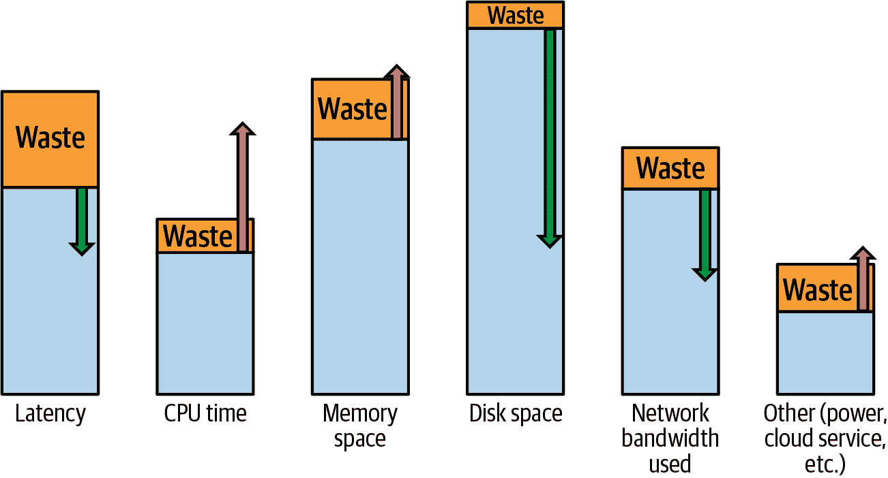
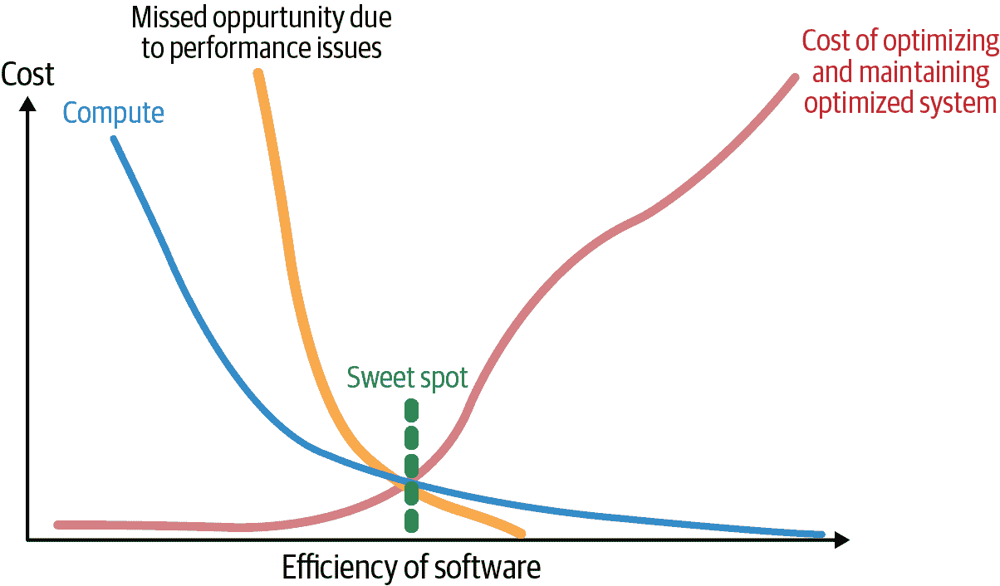
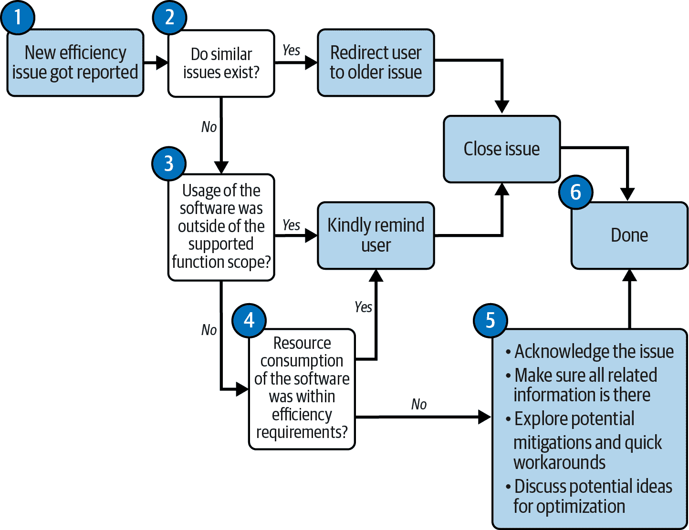
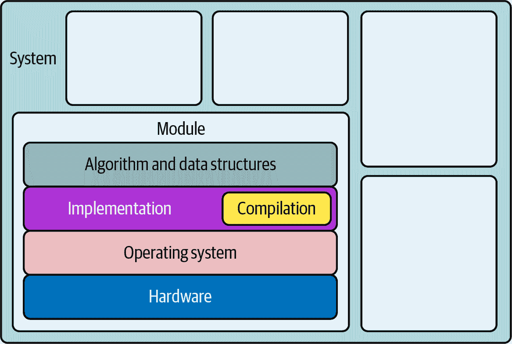
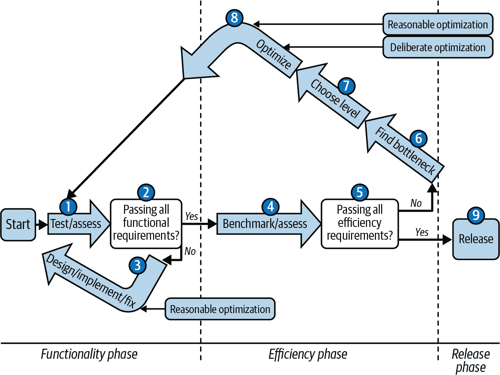

# 第三章：征服效率

是时候行动了！在第一章中，我们了解到软件效率很重要。在第二章中，我们学习了 Go 编程语言——它的基础和高级特性。接下来，我们讨论了 Go 语言易读易写的能力。最后，我们提到它还可以是编写高效代码的有效语言。

毫无疑问，提高程序效率并非易事。在某些情况下，你试图改进的功能已经经过良好优化，因此在不重新设计系统的情况下，进一步优化可能需要大量时间，并且只能产生边际差异。然而，也许还有其他情况，当前的实现非常低效。消除浪费的工作实例可以在几小时的开发时间内显著提高程序的效率。作为工程师真正的技能在于，在短时间的研究后，最好知道你目前处于哪种情况：

+   你是否需要在性能方面做出改进？

+   如果是的话，是否有可能去除浪费周期？

+   需要多少工作来减少函数 X 的延迟？

+   是否存在可疑的过度分配？

+   应该停止过度使用网络带宽而牺牲内存空间吗？

本章将教会你工具和方法，帮助你有效地回答这些问题。

如果你在这些技能上有困难，不要担心！这是正常的。效率话题并不简单。尽管需求大，但许多人仍未掌握，甚至一些主要的软件开发者有时也会做出糟糕的决策。令人惊讶的是，看起来高质量的软件经常在没有明显效率问题的情况下发布。例如，2021 年初，一位用户[优化了流行游戏《侠盗猎车手在线》的加载时间，从六分钟缩短到两分钟](https://oreil.ly/ast0m)，而没有访问源代码！正如在第一章中提到的，该游戏耗资惊人的约 1.4 亿美元，并花费了几年时间进行开发。然而，它却存在明显的效率瓶颈，其简单的 JSON 解析算法和重复数据删除逻辑大大降低了游戏加载时间，影响了游戏体验。这个人的工作非常出色，但他们使用的是你即将学习的相同技术。唯一的区别在于，我们的工作可能稍微容易一些——希望你不需要在路上逆向工程用 C++编写的二进制代码！

在前面的例子中，游戏背后的公司错过了影响游戏加载性能的明显计算浪费。公司不可能没有资源找专家来优化这部分，而是基于特定的权衡决定，优化不值得投资，因为可能有更高优先级的开发任务。最终，可以说这样的低效并没有阻止游戏的成功。它确实完成了任务，但是例如，我和我的朋友们从来不是游戏的粉丝，因为加载时间太长。我认为，如果没有这种愚蠢的“浪费”，成功可能会更大。

# 懒惰还是故意的效率降低？

还有其他有趣的例子，说明在特定情况下，软件效率的某些方面可能会被降低。例如，有[有趣的关于导弹软件开发者的故事](https://oreil.ly/mJ8Mi)，他们决定接受某些内存泄漏，因为导弹在应用程序运行结束时将被销毁。同样，我们听说过关于低延迟交易软件中的“故意”内存泄漏的故事，预计只会运行很短的时间。

可以说，避免效率工作的例子，并没有发生什么悲剧性的事情，都是务实的方法。最终，避免了额外的知识和工作来修复泄漏或减慢速度。潜在地，是的，但是如果这些决策不是数据驱动的呢？我们不知道，但是这些决策可能是出于懒惰和无知，没有任何有效的数据点表明修复确实需要太多的努力。如果每个例子中的开发人员不完全理解所需的小努力呢？如果他们不知道如何优化软件的问题部分呢？否则，他们会做出更好的决策吗？减少风险吗？我认为会的。

在本章中，我将介绍优化的主题，首先解释定义并从“超越浪费，优化是一个零和游戏”的初步方法开始。在接下来的一节中，“优化挑战”，我们将总结在试图提高软件效率时必须克服的挑战。

在“理解你的目标”中，我们将尝试通过设定明确的效率目标来驯服软件倾向和诱惑以最大化优化工作。我们只需要足够快或足够高效。这就是为什么从一开始就设定正确的性能要求如此重要。接下来，在“资源感知效率要求”，我将提出一个任何人都可以遵循的模板和实用的过程。最后，这些效率要求将在“遇到效率问题了？保持冷静！”中发挥作用，我将教你如何处理你或其他人报告的性能问题的专业流程。你会了解到，优化过程可能是你的最后一招。

在“优化设计层次”中，我将解释如何分割和隔离你的优化工作，以便更容易地征服。最后，在“效率感知开发流程”，我们将把所有的片段合并成一个我始终使用并希望推荐给你的统一优化流程：可靠的流程，适用于任何软件或设计层次。

我们有很多学习的内容要开始理解优化的含义。

# 超越浪费，优化是一个零和游戏。

没有秘密，我们在克服效率问题时的武器之一就是被称为“优化”的努力。但是，“优化”到底意味着什么？如何最好地思考它并掌握它呢？

优化不仅仅局限于软件效率主题。我们在生活中也倾向于优化许多事物，有时是无意识的。例如，如果我们经常烹饪，我们可能会把盐放在一个易于取用的地方。如果我们的目标是增重，我们会摄入更多的卡路里。如果我们早晨出行，我们会在前一天晚上打包和准备好。如果我们通勤，我们倾向于利用那段时间听有声书。如果通勤到办公室令人痛苦，我们会考虑搬到靠近更好的交通系统的地方。所有这些都是旨在朝着特定目标改善我们生活的优化技术。有时我们需要进行重大改变。另一方面，通过重复获得的小幅增量改进通常足以产生更大的影响。

在工程领域，“优化”一词源于[数学](https://oreil.ly/a11ou)，意味着在一组规则约束下，从所有可能的解决方案中找到最佳解决方案。然而，在计算机科学中，我们通常使用“优化”来描述改进系统或程序执行特定方面的行为。例如，我们可以优化我们的程序以更快地加载文件，或者在 Web 服务器上服务请求时减少内存利用率的峰值。

# 我们可以为任何事情进行优化。

一般来说，优化不一定需要改进我们程序的效率特性，如果这不是我们的目标的话。例如，如果我们的目标是提高安全性、可维护性或代码大小，我们也可以为此进行优化。然而，在本书中，当我们谈论优化时，它们将是在效率背景下的（改进资源消耗或速度）。

效率优化的目标应该是修改代码（通常不改变其功能^(1）），使其执行要么整体更高效，要么至少在我们关心的类别中更高效（在其他方面更差）。

重要的部分是，从高层次的视角来看，我们可以通过以下两种方式（或两者兼有）来进行优化：

+   我们可以消除“浪费”的资源消耗。

+   我们可以用一种资源消耗来换取另一种，或者故意牺牲其他软件质量（所谓的权衡）。

让我通过描述第一种变化——减少所谓的浪费来解释这两者之间的区别。

## 合理的优化

我们的程序由代码组成——一组操作数据并在我们的机器上使用各种资源（CPU、内存、磁盘、电源等）的指令。我们编写这些代码以便我们的程序能够执行请求的功能。但是，涉及到的一切很少是完美的（或完美集成）：我们编写的代码、编译器、操作系统，甚至硬件。因此，我们有时会引入“浪费”。资源消耗的浪费代表了我们程序中相对不必要的操作，这些操作占用了宝贵的时间、内存或 CPU 时间等。这种浪费可能是出于故意简化、偶然、技术债务、疏忽或对更好方法的无知。例如：

+   我们可能不小心留下了一些调试代码，导致在频繁使用的函数中引入了巨大的延迟（例如，`fmt.Println`语句）。

+   我们进行了一个不必要的昂贵检查，因为调用者已经验证了输入。

+   我们忘记停止某些不再需要但仍在运行的 goroutines（一种我们将在“Go 运行时调度器”中详细解释的并发范式），这浪费了我们的内存和 CPU 时间。²

+   当存在一个更快的优化函数时，我们使用了第三方库中的非优化函数，而这个函数在另一个不同的、维护良好的库中存在。

+   我们在磁盘上多次保存了相同的数据，而实际上可以只重复使用并存储一次。

+   当我们的算法在处理时可能进行了过多的检查，而实际上可以免费减少（例如，在有序数据上进行朴素搜索与二分搜索的比较）。

如果我们的程序执行或者消耗特定资源的操作是一种“浪费”，那么如果通过消除它，我们不会牺牲其他任何东西，那么这种消除就是合理的。这里的“任何东西”指的是我们特别关心的任何东西，比如额外的 CPU 时间，其他资源消耗，或者与可读性、灵活性或可移植性无关的特性。这样的消除会使我们的软件整体上更加高效。仔细观察，你会惊讶地发现每个程序都存在多少浪费。它只是等待我们注意到并消除它！

我们的程序通过减少“浪费”进行优化是一种简单而有效的技术。在本书中，我们将其称为合理的优化，并建议每次发现这种浪费时都这样做，即使之后没有时间来进行基准测试。是的，你没听错。这应该是编码卫生的一部分。请注意，要将其视为“合理”的优化，必须显而易见。作为开发者，你需要确信：

+   这种优化消除了程序的一些额外工作。

+   它不会牺牲任何其他有意义的软件质量或功能，特别是可读性。

寻找那些可能“显然”不必要的东西。消除这种不必要的工作是很容易做到的，并且不会有任何害处（否则就不是浪费）。

# 要注意可读性

任何代码修改通常首先受到可读性的影响。如果显而易见的减少浪费会显著降低可读性，或者你需要花几个小时来尝试可读的抽象，那么这就不是一个合理的优化。

没问题。我们可以稍后处理这个问题，并且我们会在“深思熟虑的优化”中详细讨论它。如果影响了可读性，我们需要数据证明这样做是值得的。

削减“浪费”也是一种有效的思维模式。就像那些因为变得[聪明懒惰](https://oreil.ly/u8IDm)而受到奖励的人类一样，我们也希望在最少的运行时间内最大化程序所带来的价值。

有人会说，合理的优化是被称为“过早优化”的反模式的一个例子，[许多人都受到过警告](https://oreil.ly/drziD)。我不得不同意减少这种显而易见的浪费确实是一种过早优化，因为我们没有评估和测量其影响。但我认为，如果我们确信这种过早优化不会带来任何害处，除了多做一点工作外，让我们承认它是过早优化，但仍然是合理的，我们继续进行并前进。

如果我们回到通勤上班的例子，如果我们注意到鞋里有几块石头，当然我们会把它们拿出来，这样我们就可以不再感到疼痛了。我们不需要评估、测量或比较去确认移除石头是否提高了我们的通勤时间。去掉石头会在某种程度上帮助我们，这样做也没有害处（我们不需要每次出门都带石头）！:)

> 如果你正在处理的是噪音，你不应立即处理，因为投入时间和精力的回报非常小。但是，如果你在浏览你的代码库时注意到一个显著改进的机会（比如 10%或 12%），当然可以弯腰捡起来。
> 
> Scott Meyers，《[重要的事情](https://oreil.ly/T9VFz)》

起初，当您刚接触编程或某种特定语言时，您可能不知道哪些操作是不必要的浪费，或者消除潜在浪费是否会损害您的程序。这没关系。这种“显而易见”的能力来自实践，所以不要猜测。如果你在猜测，这意味着优化并不明显。通过经验，您将学会什么是合理的，我们将在第十章和第十一章中一起练习这一点。

合理的优化会带来一致的性能改进，并经常简化或使我们的代码更可读。然而，对于更大的效率影响，我们可能希望采取更为刻意的方法，结果可能不那么明显，正如下一节所解释的那样。

## 刻意优化

除了浪费，我们还有对功能至关重要的操作。在这种情况下，我们可以说我们处于一个零和游戏的情况³。这意味着我们有一个情况，我们不能消除使用资源 A（例如内存）的某个操作，而不使用更多的资源 B（例如 CPU 时间）或其他质量（例如可读性、可移植性或正确性）。

那些不明显或需要我们做出某种权衡的优化可以被称为*刻意*⁴，因为我们需要在其上花费更多的时间。我们可以理解这种权衡，对其进行测量或评估，并决定保留还是放弃它。

刻意优化在任何方面都不差。相反，它们通常会显著影响您希望减少的延迟或资源消耗。例如，如果我们的网络服务器请求速度太慢，我们可以考虑通过引入缓存来优化延迟。缓存将允许我们保存从昂贵计算中的结果，以便为请求相同数据的情况提供响应。此外，它节省了 CPU 时间，避免了引入复杂的并行逻辑。然而，在服务器的生命周期内，我们将牺牲内存或磁盘使用，并可能引入一些代码复杂性。因此，刻意优化可能不会提高程序的整体效率，但它可以提高我们当前关心的特定资源使用的效率。根据情况，这种牺牲可能是值得的。

然而，有些牺牲意味着我们必须在一个与功能分离的开发阶段中执行这种优化，正如在“效率感知开发流程”中所解释的那样。这样做的原因很简单。首先，我们必须确保我们理解我们所牺牲的内容及其影响是否不大。不幸的是，人类在估计这类影响时通常表现得很差。

例如，在发送或存储数据之前，常见的网络带宽和磁盘使用优化方法是对数据进行压缩。然而，同时在接收或读取数据时需要进行解压（解码）。我们软件引入压缩前后资源使用的潜在平衡可以在图 3-1 中看到。



###### 图 3-1\. 如果在发送到网络和保存到磁盘之前压缩数据，可能对延迟和资源使用造成潜在影响

具体的数字可能会有所不同，但在增加压缩后，CPU 资源的使用可能会增加。我们不再进行简单的数据写入操作，而是必须逐字节压缩它们。即使对于最佳的无损压缩算法（例如`snappy`或`gzip`），这也需要一些时间。但发送到网络和磁盘的消息数量减少，可能会改善这种操作的总延迟。所有的压缩算法都需要一些额外的缓冲区，因此也会增加内存使用。

总之，对于合理和有意义地分类优化有着深远的影响。如果我们看到潜在的效率提升，必须意识到其意外后果。有些情况下，进行优化可能是合理且容易获得的，例如我们可以免费剥离一些不必要的程序操作。但更多时候，要在每个方面使我们的软件高效是不可能的，或者我们会影响其他软件质量。这时候我们陷入了一个零和博弈，必须认真审视这些问题。在本书和实践中，你将学习到你所处的情况及如何预测这些后果。

在我们将这两种优化类型引入开发流程之前，让我们讨论一下我们必须意识到的效率优化挑战。我们将在下一节中重点介绍其中最重要的挑战。

# 优化挑战

如果优化我们的软件很容易，我就不需要写这本书了。但事实并非如此。这个过程可能耗时且容易出错。这就是为什么许多开发人员倾向于忽略这个主题或在他们职业生涯的后期学习它。但不要感到沮丧！每个人经过一些实践后都可以成为一个有效且务实的效率感知开发者。了解优化障碍应该给我们一个很好的指示，告诉我们应该专注于改进什么。让我们来看看一些基本问题：

程序员很难估计哪一部分是性能问题的罪魁祸首。

我们很难猜测程序的哪一部分消耗了最多的资源以及具体的数量。然而，找出这些问题至关重要，因为通常情况下，适用于[帕累托原则](https://oreil.ly/eZIl5)。该原则指出，我们程序消耗的时间或资源的 80% 只来自其执行的 20% 操作。由于任何优化都是耗时的，我们希望专注于那关键的 20% 操作，而不是一些噪音。幸运的是，有工具和方法可以估算这些问题，我们将在第 9 章中详细介绍。

程序员在估计确切的资源消耗方面声名狼藉。

同样地，我们经常对某些优化是否有帮助作出错误假设。通过经验，我们的猜测会变得更准确（希望在阅读本书后如此）。然而，最好*不要轻信自己的判断*，始终在深思熟虑进行优化后，测量和验证所有数据（在第 7 章中详细讨论）。软件执行过程中有太多层和许多未知因素和变量。

长期保持效率是困难的。

之前提到的复杂软件执行层（操作系统的新版本、硬件、固件等）是不断变化的，更不用说程序的演变以及未来可能接触您代码的开发人员。我们可能花了几周时间优化一个部分，但如果我们不防范回归，这些优化可能就变得无关紧要了。有多种方法可以自动化或者至少结构化我们程序的效率基准测试和验证过程，因为事情每天都在变化，如第 6 章中所述。

可靠地验证当前性能非常困难。

正如我们将在“效率感知开发流程”中了解到的那样，解决上述挑战的方法是对效率进行基准测试、测量和验证。不幸的是，这些操作难以执行且容易出错。有很多原因：无法足够接近模拟生产环境、外部因素如噪声邻居、缺乏预热阶段、错误的数据集或微基准测试中的意外编译器优化。这就是为什么我们将在“实验可靠性”（第 7 章中的“Reliability of Experiments”）中花费一些时间讨论这个主题。

优化很容易影响其他软件质量。

坚实的软件在许多方面都非常出色：功能性、兼容性、可用性、可靠性、安全性、可维护性、可移植性和效率。每一种特性都不容易做到完美，所以它们都会给开发过程带来一些成本。每种特性的重要性可能因您的用例而异。然而，每种软件质量都有其安全的最低标准，以保证程序的实用性。在添加更多功能和优化时，这可能会带来挑战。

具体来说，在 Go 中，我们无法严格控制内存管理。

正如我们在《Go 运行时》中学到的，Go 是一种垃圾收集语言。虽然这对我们的代码简洁性、内存安全性和开发速度至关重要，但在追求内存效率时也会显现出一些不足。有方法可以改进我们的 Go 代码以减少内存使用，但事情可能会变得复杂，因为内存释放模型是最终的。通常，解决方案就是简单地减少分配。我们将详细讨论《我们是否存在内存问题？》中的内存管理。

我们的程序何时足够高效？

最终，所有的优化都不是完全免费的。它们需要开发人员付出不同大小的努力。合理和有意识的优化需要先前的知识和时间用于实现、实验、测试和基准测试。鉴于此，我们需要找到这种努力的正当理由。否则，我们可以把这些时间花在别的地方。我们应该消除这种浪费吗？我们应该将资源 X 的消耗交换为资源 Y 吗？这种转换对我们有用吗？答案可能是“不”。如果是“是”，那么效率提升到什么程度才够？

关于最后一点，这就是为什么了解你的目标非常重要。在开发过程中，你（或你的老板）关心什么事物、资源和品质可能会有所不同。在下一节中，我将提出一种明确软件性能要求的务实方法。

# 理解你的目标

> 在你朝着这些崇高目标（程序效率优化）迈进之前，你应该审视自己的原因。优化是软件工程中许多可取的目标之一，但它经常与其他重要目标（如稳定性、可维护性和可移植性）相对立。在其最表面的层次上（高效的实现、清晰的非冗余接口），优化是有益的，应该始终应用。但在其最具侵入性的层次上（内联汇编、预编译/自修改代码、循环展开、位字段化、超标量和向量化），它可能是一个耗时的实现和错误追踪的不竭源泉。对于优化代码的成本要谨慎和警惕。
> 
> 保罗·谢（Paul Hsieh），[《编程优化》](https://oreil.ly/PQ4pk)

根据我们的定义，效率优化改善了我们程序的资源消耗或延迟。挑战自己并探索我们的程序可以有多快是非常令人着迷的⁵。然而，首先我们需要明白优化的目标并不是让我们的程序完全高效或“最优”的（因为这可能是不可能或不可行的），而是足够地次优。但是对于我们来说，“足够”意味着什么？什么时候停止？如果甚至没有必要开始优化呢？

当利益相关者（或用户）要求我们开发的软件更高效时，一个答案是进行优化，直到他们满意。但不幸的是，由于几个原因，这通常非常困难：

[XY 问题](https://oreil.ly/AolRQ)。

利益相关者经常要求更高的效率，而更好的解决方案可能在其他地方。例如，许多人抱怨使用度量系统时的内存使用量过大，如果他们尝试监控唯一事件。相反，解决方案可能是使用日志记录或跟踪系统来处理此类数据，而不是使度量系统更快。⁶ 因此，我们不能总是信任初期用户的请求，特别是关于效率的请求。

效率不是零和游戏。

理想情况下，我们需要全面了解所有效率目标的大局。正如我们在“刻意优化”中学到的，为了降低延迟而进行的一项优化可能会导致更多的内存使用或影响其他资源，因此我们不能仅凭反应到每一个关于效率的用户投诉。当然，软件通常越精简和高效越好，但很可能我们无法制作出一款既满足需要低延迟实时事件捕获解决方案的用户，又满足在此操作期间需要极低内存使用的用户的单一软件。

利益相关者可能不理解优化成本。

一切都有成本，特别是优化工作和维护高度优化的代码。从技术上讲，只有物理定律限制了我们的软件可以优化到多么高的程度。⁷ 然而，在某个时候，优化带来的好处与寻找和开发这种优化的成本相比是不划算的。让我们深入探讨一下最后一点。

图 3-2 展示了软件效率与不同成本之间的典型相关性。



###### 图 3-2\. 超出“甜点”之后，提高效率的成本可能非常高。

图 3-2 解释了为什么在某些“甜点”点上，投入更多时间和资源来提高软件效率可能是不可行的。超过某一点后，优化和开发优化代码的成本可能会迅速超过我们从更轻量的软件中获得的好处，例如计算成本和机会。我们可能需要投入更多昂贵的开发人员时间，需要引入巧妙的、不可移植的技巧，专用的机器码，专用的操作系统，甚至专用的硬件。

在许多情况下，超越甜点之外的优化并不值得，可能更好的做法是设计一个不同的系统或使用其他流程来避免这样的工作。不幸的是，甜点在哪里并没有一个单一的答案。通常情况下，计划软件寿命越长，部署越大，投资价值就越大。另一方面，如果您计划仅几次使用您的程序，您的甜点可能在此图表的开始处，效率非常低。

问题在于用户和利益相关者将不会意识到这一点。虽然理想情况下，产品所有者帮助我们找出这一点，但往往是开发者的角色使用我们将在第 6 和 7 章中学习的工具来建议这些不同成本的水平。

但是，无论我们同意多少数字，解决“什么时候足够”的最佳方法并确定明确的效率要求是将它们写下来。在下一节中，我将解释为什么。在“资源感知效率要求”中，我将介绍其轻量级公式。然后在“获取和评估效率目标”中，我们将讨论如何获取和评估这些效率要求。

## 效率要求应该被形式化

正如您可能已经知道的那样，每个软件开发都始于功能需求收集阶段（FR 阶段）。架构师、产品经理或您本人必须通过潜在的利益相关者进行访谈，收集用例，并理想情况下将它们记录在某些功能需求文档中。然后开发团队和利益相关者会在该文档中审查和协商功能细节。FR 文档描述了您的程序应接受的输入，用户期望的行为和输出。它还提到了先决条件，例如应用程序预期运行的操作系统是什么。理想情况下，您会对 FR 文档获得正式批准，并成为双方之间的“合同”。特别是在您因构建软件而获得补偿时，这一点非常重要：

+   FR 告诉开发人员他们应该专注于什么。它告诉您输入应该是有效的以及用户可以配置哪些内容。它规定了您应该专注的内容。您是否在为利益相关者支付的内容而花费时间？

+   与明确的**FR（功能需求）**结合软件更容易。例如，利益相关者可能希望设计或订购进一步与您的软件兼容的系统部件。他们甚至可以在您的软件完成之前开始做这些！

+   FR 强化了明确的沟通。理想情况下，FR 应该是书面和正式的。这是有帮助的，因为人们往往会忘记事情，很容易发生误解。这就是为什么您要把所有事情写下来并要求利益相关者审查的原因。也许您听错了什么？

对于更大的系统和功能，您需要形式化的功能需求。对于较小的软件部件，您往往将其写入您的待办事项中，例如 GitHub 或 GitLab 的问题，然后进行文档化。即使是微小的脚本或小程序，也要设定一些目标和先决条件，例如特定的环境（例如 Python 版本）和一些依赖项（机器上的 GPU）。当您希望其他人有效地使用它时，您必须提及您的软件的功能需求和目标。

定义和达成功能需求在软件行业中已被广泛接受。即使有些官僚主义，开发人员倾向于喜欢这些规范，因为这使得需求更加稳定和具体。

也许你知道我要说什么。令人惊讶的是，我们经常忽视定义类似要求，这些要求集中在我们预期构建的软件更多的非功能方面，例如描述所需功能的效率和速度。⁸

这样的效率要求通常是[非功能性需求（NFR）](https://oreil.ly/AQWLm)文档或规范的一部分。其收集过程理想情况下应该类似于 FR 过程，但对于所有其他请求的质量，软件应具备：可移植性、可维护性、可扩展性、可访问性、可操作性、容错性和可靠性、合规性、文档、执行效率等等。列举如此之多。

NFR 的名字可能在某种程度上具有误导性，因为许多品质，包括效率，对我们的软件功能有着巨大的影响。正如我们在第一章中学到的，效率和速度对用户体验至关重要。

实际上，在软件开发过程中，根据我的经验和研究，NFR 并不常用。我找到了多个原因：

+   传统的 NFR（非功能性需求）规范被认为是官僚主义的，并且充满样板文件。特别是如果提到的品质无法量化并且不具体，那么每个软件的 NFR 看起来显而易见且多少相似。当然，所有软件都应该是可读的、可维护的，尽可能快速地使用最少的资源，并且可用。这并不起作用。

+   没有易于使用的、开放的、和可访问的标准来进行这一过程。最流行的[ISO/IEC 25010:2011 标准](https://oreil.ly/IzqJo)阅读起来需要大约$200。它有令人震惊的 34 页，并且自 2017 年最后一次修订以来没有改变。

+   NFR 通常过于复杂，以至于无法在实践中应用。例如，之前提到的 ISO/IEC 25010 标准指定了[总共 13 个产品特征，42 个子特征](https://oreil.ly/0MMcb)。理解它并花费大量时间进行收集和审查非常困难。

+   正如我们将在“优化设计级别”中了解到的那样，我们的软件速度和执行效率取决于比我们的代码更多的因素。典型的开发者通常可以通过优化算法、代码和编译器来影响效率。然后由操作员或管理员来安装该软件，将其适应更大的系统，配置它，并为该工作负载提供操作系统和硬件。当开发人员不在“生产”环境中运行其软件的领域时，很难谈论运行时效率。

    # SRE 领域

    [站点可靠性工程（SRE）](https://sre.google)由 Google 引入，专注于将软件开发与运营/管理结合起来。这些工程师具有在大规模上运行和构建软件的经验。有了更多的实践经验，更容易讨论效率要求。

+   最后但同样重要的是，我们都是人类，充满了情感。因为预估我们的软件效率特别是提前是困难的，所以在设定效率或速度目标时有时会感到羞辱。这就是为什么我们有时会不自觉地避免同意可量化的性能目标。这是正常的，感到不舒服也是正常的。

好吧，抛开那个，我们不去那里。我们需要更加务实和易于操作的东西。需要阐明我们的软件效率和速度的大致目标，并成为消费者和开发团队之间一些合同的起点。在功能性要求之上提前设定这些效率要求是非常有帮助的，因为：

我们确切知道我们的软件必须有多快或资源高效。

例如，假设我们同意某个操作应使用 1 GB 内存、2 CPU 秒，并最多花费 2 分钟。如果我们的测试显示它需要 2 GB 内存和 1 CPU 秒 1 分钟，那么优化延迟就没有意义了。

我们知道我们是否有权进行权衡。

在前面的例子中，我们可以预先计算或压缩一些内容以提高内存效率。我们仍然有 1 CPU 秒可以用，我们可以慢 1 分钟。

没有官方要求，用户将隐含地假设一些效率期望。

例如，也许我们的程序对某个输入意外地运行非常快。用户可以假设这是设计意图，并且将来会依赖这一事实，或者用于系统的其他部分。这可能导致用户体验不佳和意外情况。⁹

在更大的系统中使用您的软件更容易。

更多时候，您的软件将成为另一软件的依赖，并形成更大的系统。即使是基本的效率要求文档也可以告诉系统架构师从组件中期望什么。这可以极大地帮助进一步的系统性能评估和容量规划任务。

提供运行支持更容易。

当用户不知道您的软件可以期望什么样的性能时，随着时间的推移，您将很难支持它。用户会就什么样的效率是可以接受的、什么样的不是进行多次来回。相反，有了明确的效率要求，更容易判断您的软件是否被充分利用，结果问题可能在用户一侧。

让我们总结一下我们的情况。我们知道效率要求可能非常有用。另一方面，我们也知道它们可能很繁琐且充满样板文件。所以让我们探索一些选项，看看是否能在需求收集工作和带来的价值之间找到平衡。

## 资源感知效率要求

没有人定义一个良好的标准流程来创建效率要求，所以让我们尝试 [定义一个](https://oreil.ly/DCzpu)！当然，我们希望它尽可能轻量化，但让我们从理想情况开始。有什么是某个资源感知效率要求（RAER）文档中可以放入的完美信息集？比“我希望这个程序运行得相当快速”的更具体和可操作性的信息。

在 Example 3-1 中，您可以看到某个软件中单个操作的数据驱动、最小 RAER 的示例。

##### 示例 3-1\. 示例 RAER 条目

```go
Program: "The Ruler"
Operation: "Fetching alerting rules for one tenant from the storage using HTTP."
Dataset: "100 tenants having 1000 alerting rules each."

Maximum Latency: "2s  for 90th percentile"
CPU Cores Limit: "2"
Memory Limit: "500 MB"
Disk Space Limit: "1 GB"
...
```

理想情况下，这个 RAER 是一组记录，其中包含某些操作的效率要求。原则上，单个记录应该包含如下信息：

+   它所涉及的操作、API、方法或函数。

+   我们操作的数据集的大小和形状，例如输入或存储的数据（如果有）。

+   操作的最大延迟。

+   在该数据集上，这个操作的资源消耗预算，例如内存、磁盘、网络带宽等。

现在，有坏消息和好消息。坏消息是，严格来说，这样的记录对于所有小操作来说是不现实的。这是因为：

+   在软件执行期间，可能有数百种不同的操作。

+   几乎有无数种数据集的形状和大小（例如，想象一个 SQL 查询作为输入，存储的 SQL 数据作为数据集：我们有近乎无限的选项排列）。

+   现代硬件和操作系统在执行软件时可以“消耗”的成千上万个元素。总体而言，CPU 秒和内存是常见的，但 CPU 缓存、内存总线带宽、使用的 TCP 套接字数量、使用的文件描述符等成千上万的其他元素怎么样呢？我们需要指定所有可以使用的吗？

好消息是，我们不需要提供所有的细节。这类似于我们处理功能要求的方式。我们是否关注所有可能的用户故事和细节？不，只关注最重要的那些。我们是否定义所有可能的有效输入和预期输出的排列组合？不，我们只定义了几个围绕边界的基本特性（例如，信息必须是正整数）。让我们看看如何简化 RAER 条目的详细级别：

+   首先专注于我们软件中最常用和最昂贵的操作。这些将最大程度地影响软件资源的使用。我们将在本书后面讨论有助于您的基准测试和分析性能的内容。

+   我们不需要概述可能被消耗的所有微小资源的要求。从对资源使用影响最大且最重要的那些开始。通常，这意味着特定于 CPU 时间、内存空间和存储（例如，磁盘空间）的要求。从这里开始迭代并添加其他将来可能重要的资源。也许我们的软件需要一些独特、昂贵和难以找到的资源，值得一提（例如，GPU）。也许某种消耗对整体可伸缩性构成限制，例如，如果我们的操作使用更少的 TCP 套接字或磁盘 IOPS，我们可以在单台机器上放置更多的进程。只有当它们重要时才添加它们。

+   类似于我们在单元测试中验证功能时所做的，我们可以只关注重要的输入类别和数据集。如果我们选择边界案例，我们有很高的概率为最坏和最佳情况的数据集提供资源需求。这已经是一个巨大的胜利。

+   或者，还有一种方法可以定义输入（或数据集）与允许的资源消耗之间的关系。然后，我们可以以数学函数的形式描述这种关系，通常称为*复杂性*（在“渐近复杂性与大 O 标记”中讨论）。即使有些近似，这也是一种非常有效的方法。我们的操作`/rules`的 RAER 可以在示例 3-1 中看到，如示例 3-2 所示。

##### 示例 3-2\. 以复杂性或吞吐量而不是绝对数字的示例 RAER 条目

```go
Program: "The Ruler"
Operation: "Fetching alerting rules for one tenant from the storage using HTTP."
Dataset: "X tenants having Y alerting rules each."

Maximum Latency: "2*Y ms for 90th percentile"
CPU Cores Limit: "2"
Memory Limit: "X + 0.4 * Y MB"
Disk Space Limit: "0.1 * X GB"
...
```

总体而言，我甚至建议在先前提到的功能需求（FR）文档中包括 RAER。将其放在另一部分称为“效率要求”。毕竟，如果没有合理的速度和效率，我们的软件怎么能被称为完全功能的呢？

总之，在本节中，我们定义了资源感知效率要求（RAER）规范，该规范为我们提供了关于软件效率需求和期望性能的近似值。这对我们在进一步开发和优化技术中学到的内容将极为有帮助。因此，我鼓励你在开始开发软件并优化或添加更多功能之前，了解你所追求的性能。

让我们解释一下如何为我们打算提供的系统、应用程序或功能拥有或创建这样的 RAER。

## 获取和评估效率目标

理想情况下，当你参与任何软件项目时，你应该像已经规定了 RAER 一样。在较大的组织中，你可能会有专门的人员，如项目经理或产品经理，他们会收集这些效率需求，除了功能需求之外。他们还应确保这些需求是可以实现的。如果他们没有收集 RAER，不要犹豫要求他们提供这样的信息。通常他们的职责就是这样。

不幸的是，在大多数情况下，特别是在较小的公司、社区驱动的项目或显然是你的个人项目中，往往没有明确的效率需求。在这些情况下，我们需要自己获取效率目标。那么我们该如何开始呢？

这项任务与功能目标类似。我们需要为用户带来价值，因此理想情况下，我们需要向他们询问他们在速度和运行成本方面的需求。因此，我们去找利益相关者或客户，询问他们在效率和速度方面的需求，他们愿意支付多少，以及他们这方面的限制是什么（例如，集群只有四台服务器或 GPU 只有 512MB 内存）。同样地，对于功能，优秀的产品经理和开发人员会努力将用户性能需求转化为效率目标，如果利益相关者不来自工程领域，则这并不是件容易的事情。例如，“我希望这个应用程序运行快速”的声明必须被具体化。

如果利益相关者无法提供软件的潜在延迟数字，只需选择一个数字。起始值可以设置得较高，这对你很有利，但以后会使你的工作更轻松。也许这会引发利益相关者讨论该数字带来的影响。

很多时候，系统用户会有多种角色。例如，让我们想象我们的公司将为客户提供软件服务，并且该服务已经定义了价格。在这种情况下，用户关心速度和正确性，而我们公司关心软件的效率，因为这直接影响运行服务的净利润（或者如果运行我们的软件的计算成本过大，则是损失）。在这种典型的软件即服务（SaaS）示例中，我们对我们的 RAER 有了不只一个，而是两个来源的输入。

# Dogfooding

对于较小的编码库、工具以及我们的基础设施软件，我们往往既是开发者也是用户。在这种情况下，从用户的角度设置 RAER 会更容易。这只是使用你自己创建的软件的一个[良好实践](https://oreil.ly/xBgef)的原因之一。这种方法通常被称为“吃自己的狗食”（dogfooding）。

不幸的是，即使用户愿意定义 RAER，现实却并非如此完美。这里就涉及到难点。我们能确定从用户角度提出的建议是否在预期的时间内可行吗？我们了解需求，但我们必须通过团队技能、技术可能性和所需时间来验证它。通常情况下，即使有了一些 RAER，我们也需要进行自己的尽职调查，并从实现可能性的角度定义或评估 RAER。本书将教会您完成这项任务所需的一切。

同时，让我们通过一个 RAER 定义过程的例子来了解一下。

## 定义 RAER 的示例

定义和评估复杂的 RAER 可能会变得复杂。然而，如果你必须从零开始，从潜在的琐碎但明确的要求开始是合理的。

设置这些要求归结为用户的观点。我们需要找到使得你的软件在其环境中具有价值的最低要求。例如，假设我们需要创建一个在一组 JPEG 格式图像上应用图像增强的软件。在 RAER 中，我们现在可以将这样的图像转换视为一个*操作*，而图像文件集和选择的增强效果则是我们的*输入*。

我们 RAER 中的第二项是我们操作的延迟时间。从用户角度来看，尽可能快地完成是更好的。然而，我们的经验告诉我们，在多张图片（特别是大尺寸和多张）上应用增强效果时，我们可以施加的速度有其限制。但是我们如何找到一个合理的延迟时间要求，既适用于潜在用户，又使得我们的软件能够实现呢？

在我们新接触效率世界时，很难达成一个共识的单一数字。例如，我们可能猜测单张图像处理需要 2 小时可能太长，而 20 纳秒则不可实现，但在这里找到中间地带却很困难。然而正如在“效率要求应当被形式化”中所提到的，我建议您尝试定义一个数字，因为这将使得您的软件更容易评估！

# 定义效率要求就像谈判薪水一样

Agreeing to someone’s compensation for their work is similar to finding the requirement sweet spot for our program’s latency or resource usage. The candidate wants the salary to be the highest possible. As an employer, you don’t want to overpay. It’s also hard to assess the value the person will be providing and how to set meaningful goals for such work. What works in salary negotiating works when defining RAER: don’t set too high expectations, look at other competitors, negotiate, and have trial periods!

One way to define RAER details like latency or resource consumption is to check the competition. Competitors are already stuck in some kind of limits and framework for stating their efficiency guarantees. You don’t need to set those as your numbers, but they can give you some clue of what’s possible or what customers want.

While useful, checking competition is often not enough. Eventually, we have to estimate what’s roughly possible with the system and algorithm we have in mind and the modern hardware. We can start by defining the initial naive algorithm. We can assume our first algorithm won’t be the most efficient, but it will give us a good start on what’s achievable with little effort. For example, let’s assume for our problem that we want to read an image in JPEG format from disk (SSD), decode it to memory, apply enhancement, encode it back, and write it to disk.

With the algorithm, we can start discussing its potential efficiency. However, as you will learn in “优化设计级别” and “实验可靠性”, efficiency depends on many factors! It’s tough to measure it on an existing system, not to mention forecasting it just from the unimplemented algorithm.

This is where the complexity analysis with napkin math comes into play!

# Napkin Math

Sometimes referred to as back-of-the-envelope calculation, *napkin math* is a technique of making rough calculations and estimations based on simple, theoretical assumptions. For example, we could assume latency for certain operations in computers, e.g., a sequential read of 8 KB from SSD is taking approximately 10 μs while writing 1 ms.¹⁰ With that, we could calculate how long it takes to read and write 4 MB of sequential data. Then we can go from there and calculate overall latency if we make a few reads in our system, etc.

Napkin math is only an estimate, so we need to treat it with a grain of salt. Sometimes it can be intimidating to do since it all feels abstract. Yet such quick calculation is always a fantastic test on whether our guesses and initial system ideas are correct. It gives early feedback worth our time, especially around common efficiency requirements like latency, memory, or CPU usage.

我们将在“复杂性分析”中详细讨论复杂性分析和餐巾数学，但让我们快速定义我们示例 JPEG 增强问题空间的初始 RAER。

复杂性允许我们将效率表示为与输入的延迟（或资源使用）的函数。对于 RAER 讨论，我们的输入是什么？首先假设最坏情况。找出系统中最慢的部分以及可以触发该部分的输入。在我们的示例中，我们可以想象我们允许的最大图像（例如，8K 分辨率）是处理最慢的。处理一组图像的需求使事情有些复杂。现在，我们可以假设最坏情况，并开始从那里进行协商。最坏情况是图像不同，并且我们不使用并发。这意味着我们的延迟可能是 *x* * *N* 的函数，其中 *x* 是最大图像的延迟，*N* 是集合中图像的数量。

考虑到 JPEG 格式的 8K 图像的最坏情况输入，我们可以尝试估算其复杂性。输入的大小取决于唯一颜色的数量，但我找到的大多数图像大小约为 4 MB，所以让我们将这个数字作为我们的平均输入大小。使用附录 A 中的数据，我们可以计算出这样的输入至少需要 5 ms 读取和 0.5 s 保存到磁盘上。类似地，从 JPEG 格式编码和解码很可能至少意味着循环并在内存中分配多达 7680 × 4320 像素（约 33 百万）。查看[`image/jpeg`标准 Go 库](https://oreil.ly/3Fnbz)，每个像素由三个[`uint8`数](https://oreil.ly/JmgZf)表示以在[YCbCr 格式](https://oreil.ly/lWiTf)中表示颜色。这意味着大约 1 亿个无符号 8 字节整数。因此，我们可以了解到潜在的运行时和空间复杂性：

运行时

我们需要两次从内存中提取每个元素（从 RAM 顺序读取约 5 ns），一次用于解码，一次用于编码，这意味着 2 * 1 亿 * 5 ns，因此 1 秒。因此，通过这种快速的数学计算，我们现在知道，在不应用任何增强或更复杂的算法的情况下，单个图像的此类操作至少需要 1s + 0.5s，即 1.5 秒。

由于餐巾数学只是一个估算，而且我们没有考虑实际的增强操作，可以安全地假设我们的错误率高达三倍。这意味着我们可以将单个图像的初始延迟要求设置为 5 * *N* 秒，其中 *N* 是图像数量。

空间

对于读取整个图像到内存的朴素算法来说，存储该图像可能是分配最多内存的操作。每个像素使用三个`uint8`数，所以最多使用 33 百万 * 3 * 8 字节，因此最多使用 755 MB 内存。

我们假设了典型情况和未优化的算法，因此我们期望能够改进这些初始数字。但如果用户等待 10 张图像需要 50 秒，并且每张图像使用 1 GB 内存可能也是可以接受的。知道这些数字可以在可能的情况下减少效率工作的范围！

为了更加自信地进行我们的计算，或者如果您在草稿计算中遇到困难，我们可以对系统中关键、最慢的操作进行快速基准测试¹¹。因此，我编写了一个单一的基准测试，使用标准的 Go `jpeg` 库来读取、解码、编码和保存 8K 图像。示例 3-3 显示了基准测试结果的总结。

##### 示例 3-3\. 对读取、解码、编码和保存一张 8K JPEG 图像的微基准测试结果

```go
name       time/op
DecEnc-12  1.56s ±2%
name       alloc/op
DecEnc-12  226MB ± 0%
name       allocs/op
DecEnc-12   18.8 ±3%
```

结果表明我们的运行时计算相当准确。平均执行一个 8K 图像的基本操作需要 1.56 秒！然而，分配的内存比我们预想的要好三倍多。仔细检查[`YCbCr 结构的注释`](https://oreil.ly/lm3T4)揭示了这种类型每像素存储一个 `Y` 样本，但每个 `Cb` 和 `Cr` 样本可能跨越一个或多个像素，这也许可以解释差异。

虽然获取和评估 RAER 看起来复杂，但我建议在进行任何严肃开发之前进行这项练习并获得这些数据。然后，通过基准测试和草稿计算，我们可以快速判断我们心目中的初步算法是否能够实现 RAER。同样的过程也可以用来判断是否有更多易于实现的优化空间，正如在“优化设计级别”中所述。

通过获取、定义和评估您的 RAER 的能力，我们最终可以尝试解决一些效率问题！在下一节中，我们将讨论我建议的处理这类有时会造成压力的情况的步骤。

# 遇到效率问题？保持冷静！

首先，不要惊慌！我们都曾经历过这种情况。我们编写了一段代码，并在自己的机器上测试通过，效果很好。然后，为此感到自豪地发布给其他人使用，但立刻有人报告性能问题。也许它在其他人的机器上运行不够快。或者它在其他用户数据集上使用了意想不到的内存量。

在我们建立、管理或负责的程序面临效率问题时，我们有几种选择。但在做出任何决定之前，有一件至关重要的事情你必须做。当问题发生时，请摆脱对自己或与你共事的团队的负面情绪。责怪自己或别人犯错是非常常见的。当有人抱怨你的工作时，感到一种不舒服的内疚感是很自然的。然而，每个人（包括我们在内）都必须理解，效率问题是具有挑战性的话题。此外，即使是经验丰富的开发人员，每天也会遇到效率低下或有 bug 的代码。因此，犯错误是没有羞耻的。

为什么我在一本编程书中谈论情感？因为心理安全是开发者在代码效率方面采取错误方法的一个重要原因。拖延、感觉被困、害怕尝试新事物或者批评错误想法只是一些负面后果。根据我的经验，如果我们开始责怪自己或他人，我们不会解决任何问题。相反，我们会扼杀创新和生产力，引入焦虑、毒性和压力。这些感受进一步会阻止你在处理报告的效率问题或其他任何问题时做出专业合理的决定。

# 无过失文化至关重要

在“事后分析”过程中，强调无过失的态度尤为重要，这是可靠性工程师在事故发生后进行的一项工作。例如，有时昂贵的错误是由一个人触发的。虽然我们不希望打击这个人或惩罚他们，但理解事故的原因以防止再次发生至关重要。此外，无过失的方法使我们能够在尊重他人的前提下诚实地讨论事实，从而使每个人都能安全地升级问题而无需担心。

我们不应过于担心，而应以清晰的头脑按照系统化的几乎是机械化的过程（是的，理想情况下，所有这些都会有一天自动化！）。让我们面对现实，实际上，并不是每个性能问题都必须跟随优化。我建议开发人员的潜在流程如图 3-3 所示。请注意，优化步骤尚未列入清单！



###### 图 3-3\. 推荐的效率问题排查流程

在这里，我们概述了报告效率问题时应采取的六个步骤：

第 1 步：我们的错误跟踪器上报告了一个效率问题。

当有人报告我们负责的软件的效率问题时，整个流程就开始了。如果报告了多个问题，请始终为每个问题按图 3-3 所示的过程进行处理（分而治之）。

请注意，进行这一过程并将事物记录在错误跟踪器中应成为你的习惯，即使是对小型个人项目也是如此。否则，你怎么能详细记住所有想要改进的事物呢？

步骤 2：检查重复项。

这可能是微不足道的，但请尽量保持有序。将多个问题合并成一次专注的对话。节省时间。不幸的是，我们还没有到可以可靠地为我们找到重复问题的自动化（例如人工智能）的阶段。

步骤 3：根据功能要求验证情况。

在这一步骤中，我们必须确保效率问题报告者使用了支持的功能。我们为功能要求中定义的特定用例设计软件。由于解决各种独特但有时相似的用例需求的高需求，用户经常尝试“滥用”我们的软件来做它本不应该做的事情。有时候他们会走运，事情能够正常工作。有时候则以崩溃、意外的资源使用或者减速结束。¹²

同样地，如果未达到约定的先决条件，我们也应该采取同样的措施。例如，发送了不支持的、格式错误的请求，或者在没有必需 GPU 资源的机器上部署了软件。

步骤 4：根据 RAERs 验证情况。

某些关于速度和效率的期望可能无法或者不需要满足。这就是“资源感知效率要求”（“Resource-Aware Efficiency Requirements”）中讨论的正式效率要求规范非常宝贵的地方。如果报告的观察结果（例如有效请求的响应延迟）仍在约定的软件性能数值范围内，我们应该传达这一事实并继续进行。¹³

同样地，当问题作者在需要 SSD 的情况下使用了 HDD 磁盘部署我们的软件，或者程序在核心数低于正式协议中规定的机器上运行时，我们应该礼貌地关闭这样的错误报告。

# 功能或效率要求可能会改变！

也许还有一些情况，功能或效率规范没有预测到某些边缘情况。因此，规范可能需要修订以符合现实。需求和需求在演变，性能规格和期望也应该如此。

步骤 5：确认问题，记录优先级并继续。

是的，你没看错。在检查影响和所有先前步骤之后，通常可以（甚至建议！）当前时刻对报告的问题几乎不采取任何措施。可能有更重要的事情需要我们的关注——也许是一个重要的、过期的特性或者代码不同部分的另一个效率问题。

世界并非完美。我们不能解决一切。行使你的断言权。注意，这与忽视问题并非同一回事。我们仍然必须承认存在问题，并提出后续问题，帮助找到瓶颈并在以后的某个日期优化它。确保询问他们正在运行的确切软件版本。尝试提供解决方法或提示发生了什么，以便用户帮助找到根本原因。讨论可能出错的想法。把它们都写在问题中。这将帮助你或其他开发者以后有一个很好的起点。明确地传达你将在下一个优先级会议上与团队优先处理此问题。

第六步：完成，问题已分级。

恭喜，问题已处理。它可能已关闭或打开。如果在所有这些步骤之后仍然打开，我们现在可以考虑其紧急性，并与团队讨论下一步。一旦计划解决特定问题，“效率感知开发流程”中的效率流程将告诉你如何有效地做到这一点。别害怕。这可能比你想象的要容易！

# 此流程适用于 SaaS 和外部安装软件

相同的流程适用于用户在他们的笔记本电脑、智能手机或服务器上安装和执行的软件（有时称为“本地”安装），以及当它由我们公司作为服务管理时（软件即服务——SaaS）。我们开发者仍应尝试系统地处理所有问题。

我们将优化分为合理和谨慎的。让我们不要犹豫，进行下一个分割。为了简化和隔离软件效率优化问题，我们可以将其分成几个层次，然后在独立的层次中设计和优化。我们将在下一节讨论这些内容。

# 优化设计层次

让我们以之前的现实生活例子为例，每天通勤时间很长（在本章中我们将多次使用这个例子！）。如果这样的通勤让你感到不快，因为需要付出相当大的努力并且时间太长，那么优化它可能是有意义的。然而，我们可以从多个层面上进行这样的优化：

+   我们可以从小处着手，比如为步行距离购买更舒适的鞋子。

+   如果有帮助，我们可以购买电动滑板车或汽车。

+   我们可以计划旅程，使其花费更少的时间或距离。

+   我们可以购买电子书阅读器，并投资于阅读书籍的爱好，以免浪费时间。

+   最后，我们可以靠近工作场所，甚至换工作。

我们可以在这些单独的“层次”中进行这样的优化，或者全部进行，但每个优化都需要一些投资、权衡（购买汽车需要花钱）和努力。理想情况下，我们希望在最小化努力的同时最大化价值并产生影响。

这些级别的另一个关键方面是：如果我们在更高的级别进行优化，可能会影响或贬值从一个级别到另一个级别的优化。例如，假设我们在一个级别上对通勤进行了多次优化。我们买了一辆更好的车，组织了拼车以节省燃料费，改变了工作时间以避开交通拥堵等等。现在想象一下，我们决定在更高的级别进行优化：搬到工作地点步行可达的公寓。在这种情况下，之前所有优化的努力和投资现在都变得不那么有价值（如果不是完全浪费）。在工程领域也是如此。我们应该意识到我们在哪里投入了优化的努力，以及何时投入。

在学习计算机科学时，学生们对优化的第一次接触之一是学习有关算法和数据结构的理论。他们探索如何使用具有更好时间或空间复杂性的不同算法来优化程序（在“渐近复杂性与大 O 符号”中有解释）。虽然改变我们在代码中使用的算法是一种重要的优化技术，但我们还有许多其他可以优化的领域和变量，以提高软件的效率。要适当地讨论性能，软件依赖于更多级别。

图 3-4 展示了参与软件执行的主要级别。这个级别列表是受 Jon Louis Bentley 在 1982 年制作的列表的启发，¹⁴至今仍然非常准确。



###### 图 3-4\. 参与软件执行的级别。我们可以分别在每个级别提供优化。

本书概述了五个优化设计级别，每个级别都有其优化方法和验证策略。所以让我们从最高级到最低级深入挖掘它们：

系统级别

在大多数情况下，我们的软件是某个更大系统的一部分。也许它是许多分布式进程中的一个，或者是更大单体应用程序中的一个线程。在所有情况下，系统都是围绕多个模块结构化的。模块是一个小的软件组件，通过方法、接口或其他 API（例如网络 API 或文件格式）封装某些功能，以便更轻松地进行交换和修改。

每个 Go 应用程序，即使是最小的，也是一个可执行模块，导入其他模块的代码。因此，您的软件依赖于其他组件。在系统级别进行优化意味着改变使用哪些模块，它们如何链接在一起，谁调用哪个组件以及多频繁。我们可以说，我们正在设计跨模块和 API 的算法，这些算法是我们的数据结构。

这是一项复杂的工作，需要多团队的努力和良好的架构设计。但另一方面，它通常带来了巨大的效率改进。

模块内算法和数据结构级别

面对要解决的问题、其输入数据和期望输出，模块开发人员通常首先设计该过程的两个主要元素。首先是*算法*，一系列计算机指令，操作数据并能解决我们的问题（例如产生正确的输出）。你可能已经听说过许多流行的算法：二分查找、快速排序、归并排序、映射-减少等等，但是你的程序执行的任何一组自定义步骤都可以称为算法。

第二个要素是*数据结构*，通常由选择的算法隐含。它们允许我们在计算机上存储数据，例如输入、输出或临时数据。在这里也有无限的选择：数组、哈希映射、链表、栈、队列、其他数据结构、混合结构或自定义结构。在你的模块中选择合适的算法非常重要。它们必须根据你的具体目标（例如请求延迟）和输入特性进行调整。

实现（code）级别

模块中的算法在编写成可编译为机器码的代码之前是不存在的。开发人员在这里有很大的控制权。我们可以高效地实现低效的算法，以满足我们的 RAERs。另一方面，我们也可以糟糕地实现高效的算法，导致意外的系统减速。在代码级别进行优化意味着接受用高级语言（例如 Go 语言）编写的程序，实现特定算法，并生成更高效的程序，在任何我们希望的方面（例如延迟）使用相同的算法并产生相同的正确输出。

通常，我们同时在算法和代码级别进行优化。在其他情况下，只选定一个算法并专注于代码优化更为简单。你将在第十章和第十一章看到这两种方法。

有些先前的材料将编译步骤视为一个独立的层次。我认为代码级优化技术必须包含编译器级的优化技术。你的实现和编译器如何将其转换为机器码之间存在深刻的协同作用。作为开发人员，我们必须理解这种关系。我们将在“理解 Go 编译器”中更深入地探讨 Go 编译器的影响。

操作系统级别

这些天，我们的软件从未直接在机器硬件上执行，也不再单独运行。相反，我们运行操作系统，将每个软件执行分成进程（然后是线程），在 CPU 核心上调度它们，并提供其他必要的服务，如内存和 IO 管理，设备访问等等。此外，我们还有额外的虚拟化层（虚拟机、容器），可以放入操作系统桶中，特别是在云原生环境中。

所有这些层级都带来了一些开销，可以通过控制操作系统开发和配置的人员进行优化。在本书中，我假设 Go 开发人员很少能够影响这个层级。然而，通过理解挑战和使用模式，我们可以在其他更高层级上实现效率提升。我们将在第 Chapter 4 章中详细讨论它们，主要集中在 Unix 操作系统和流行的虚拟化技术上。在本书中，我假设设备驱动程序和固件也属于这个类别。

硬件层级

最后，在某个时刻，从我们的代码翻译出来的一组指令会由计算机 CPU 单元执行，这些单元与主板上的其他重要部件连接，如 RAM、本地磁盘、网络接口、输入输出设备等等。通常情况下，作为开发者或运营商，我们可以从这种复杂性中抽象出来（这种复杂性在硬件产品中也有所不同），这要归功于前面提到的操作系统级别。然而，我们应用程序的性能受到硬件限制的限制。其中一些可能会让人惊讶。例如，您是否知道多核机器的 NUMA 节点的存在及其如何影响我们的性能？您是否知道 CPU 和内存节点之间的内存总线带宽有限？这是一个广泛的主题，可能会影响我们的软件效率优化过程。我们将在第 4 和 5 章中简要探讨这个话题，以及 Go 语言在解决这些问题时采用的机制。

将我们的问题空间分成层级的实际好处是什么？首先，研究¹⁵表明，在应用程序速度方面，通常可以在任何提到的层级上实现 10 到 20 倍的加速，甚至更多。这也与我的经验类似。

这个好消息是，这意味着我们可以将优化的重点集中在一个层级上，以达到所需的系统效率提升。¹⁶ 但是，假设您在一个层级上将您的实现优化了 10 到 20 倍。在没有显著牺牲开发时间、可读性和可维护性的情况下，进一步优化这个层级可能会很困难（参见我们从图 3-2 找到的甜蜜点）。因此，您可能需要查看另一个层级以获得更多的优势。

坏消息是，您可能无法更改某些层级。例如，作为程序员，我们通常无法轻松更改编译器、操作系统或硬件。同样，系统管理员也无法更改软件正在使用的算法。相反，他们可以更换系统并进行配置或调整。

# 警惕优化偏见！

有时候（令人有趣且可怕！）一个公司内部不同工程组对同一效率问题提出高度不同的解决方案，这有时令人感到有些好笑。

如果团队中有更多的系统管理员或 DevOps 工程师，解决方案通常是切换到另一个系统、软件或操作系统，或者尝试“调整”它们。相反，软件工程组将主要在同一个代码库上进行迭代，优化系统、算法或代码层次。

这种偏见来自于每个层级变更的经验，但可能会产生负面影响。例如，完全切换系统，比如从[RabbitMQ](https://oreil.ly/ZVYo1)切换到[Kafka](https://oreil.ly/wPpUD)，需要付出相当大的努力。如果你只是因为 RabbitMQ“感觉慢”，而没有试图做出贡献，也许简单的代码级优化可能就过度了。反过来，试图在代码级别优化为不同目的设计的系统的效率可能不够。

我们讨论了优化的概念，提到了如何设定性能目标，处理效率问题以及我们操作的设计级别。现在是将所有知识结合到完整开发周期中的时候了。

# 高效开发流程

> 程序员在程序生命周期的早期阶段的主要关注点应该是编程项目的整体组织和产生正确且可维护的代码。此外，在许多情况下，清晰设计的程序通常对于手头的应用来说已经足够高效了。
> 
> 乔恩·路易斯·本特利，《编写高效程序》

希望到目前为止，你已经意识到我们必须从早期开发阶段就考虑性能问题。但是也存在风险——我们开发代码不仅仅是为了高效。我们编写程序是为了满足我们设定或从利益相关者那里得到的功能需求。我们的工作是有效地完成这项工作，因此需要一种务实的方法。从高层次来看，开发一个工作但高效的代码会是什么样子呢？

我们可以将开发过程简化为九个步骤，如图 3-5 所示。暂且称之为*TFBO*流程——测试、修复、基准测试和优化。



###### 图 3-5\. 高效开发流程

这个过程是系统化且高度迭代的。需求、依赖关系和环境都在变化，因此我们也必须分块进行工作。TFBO 过程可能有点严格，但相信我，有意识和有效的软件开发需要一些纪律。它适用于从头开始创建新软件、添加功能或更改代码的情况。TFBO 应该适用于任何语言编写的软件，不仅仅是 Go。它也适用于“优化设计级别”中提到的所有级别。让我们一起来看看九个 TFBO 步骤。

## 功能性阶段

> 制作正确的程序比制作快速的程序正确要容易得多。
> 
> H. Sutter 和 A. Alexandrescu，《C++编码标准：101 条规则、指南和最佳实践》（Addison-Wesley，2004）

总是先从功能开始。 无论我们是要开始一个新的程序，添加新功能，还是只是优化现有程序，我们应该始终从设计或功能的实现开始。 使其工作，使其简单，易读，易维护，安全等等，根据我们设定的目标，最好是以书面形式。 尤其是当您作为软件工程师开始您的旅程时，请专注于一件事。 通过实践，我们可以在早期添加更合理的优化。

### 1. 首先测试功能

对于一些人来说，这可能感觉反直觉，但几乎总是应该从期望功能的验证框架开始。 自动化程度越高越好。 当您有一个空白页并开始开发新程序时，这也适用。 这种开发范式称为测试驱动开发（TDD）。 它主要集中在代码可靠性和功能交付速度效率上。 以严格的形式，在代码水平上，它强制执行特定流程：

1.  编写一个测试（或扩展现有测试），期望实施该功能。

1.  确保运行所有测试并查看新测试因预期原因而失败。 如果您没有看到失败或其他失败，请先修复这些测试。

1.  迭代，直到所有测试通过并且代码干净。

TDD 消除了许多未知数。 想象一下，如果我们不遵循 TDD。 例如，我们添加了一个功能，并编写了一个测试。 即使没有我们的功能，也很容易犯一个错误。 同样，让我们说我们在实施后添加了测试，这是通过的，但是其他先前添加的测试失败了。 很可能我们在实施之前没有运行测试，因此我们不知道之前是否一切正常。 TDD 确保您不会在工作结束时遇到这些问题，极大地提高了可靠性。 它还减少了实施时间，允许安全的代码修改并及早给出反馈。

此外，如果我们想要实施的功能已经完成而我们没有注意到怎么办？ 首先编写测试会快速揭示这一点，为我们节省时间。 剧透警告：稍后在步骤 4 中我们将使用相同的原则进行基准驱动优化！

TDD 可以很容易地理解为代码级实践，但是如果您设计或优化算法和系统怎么办？ 答案是流程保持不变，但我们的测试策略必须在不同的水平上应用，例如验证系统设计。

假设我们实施了一个测试或对当前设计或实施进行了评估。 接下来呢？

### 2. 我们是否通过了功能测试？

有了步骤 1 的结果，我们的工作变得更容易——我们可以基于数据进行决策，确定接下来该做什么！首先，我们应该将测试或评估结果与我们约定的功能要求进行比较。当前的实现或设计是否满足规范？很好，我们可以跳到步骤 4\. 然而，如果测试失败或功能评估显示出某些功能差距，那么现在是时候回到步骤 3 并解决这种情况了。

当你没有任何地方说明这些功能要求时，问题就来了。正如在“效率需求应当被规范化”中讨论的那样，这就是为什么要求功能需求或自行定义它们如此重要。即使是在项目 README 中写下的最简单的目标项目清单，也比什么都不写要好。

现在，让我们探讨一下，如果我们的软件当前状态不能通过功能验证会怎么办。

### 3\. 如果测试失败，我们必须修复、实现或设计缺失的部分。

根据我们所处的设计水平，在这一步骤中，我们应该设计、实现或修复功能部分，以弥合当前状态与功能期望之间的差距。正如我们在“合理优化”中讨论的那样，在这里除了明显的合理优化外，不允许其他优化。专注于模块的可读性、设计和简洁性。例如，不要费心考虑通过指针还是值传递参数更优，或者在这里解析整数会不会太慢，除非这是显而易见的。从功能和可读性的角度来看，做任何有意义的事情即可。我们暂时不验证效率，所以现在先不要考虑刻意的优化。

正如你在图 3-5 中可能已经注意到的，步骤 1、2 和 3 构成了一个小循环。每当我们在代码或设计中进行更改时，这为我们提供了一个早期的反馈循环。步骤 3 就像我们驾驶名为“软件”的船航行在大海上时的指引方向。我们知道我们想要去哪里，并且知道如何正确地看向太阳或星星的方向。然而，如果没有像 GPS 这样精确的反馈工具，我们可能会结束在错误的地方航行，直到几周后才意识到。这就是为什么在短间隔内验证我们的航行位置是有益的早期反馈！

对于我们的代码也是如此。我们不想工作几个月后才发现我们没有接近我们从软件中期望的东西。通过对代码或设计的小迭代进行功能阶段循环，进行步骤 1（运行测试）、步骤 2，然后回到步骤 3 进行另一个小修正[¹⁷]。这是多年来工程师们找到的最有效的开发周期。所有现代方法论，如[极限编程](https://oreil.ly/rhx8W)，Scrum，看板以及其他[敏捷](https://oreil.ly/sKZUA)技术，都建立在小迭代的前提上。

在可能的数百次迭代之后，我们可能会拥有在第 2 步中为本次开发会话设定的功能要求。最后，现在是确保我们的软件足够快速和高效的时候了！让我们在下一节来看看这个问题。

## 效率阶段

一旦我们满意软件的功能方面，现在是确保其匹配预期资源消耗和速度的时候了。

将各个阶段拆分并将其彼此隔离起来，乍一看似乎是一种负担，但它会更好地组织您的开发工作流程。它让我们能够深度聚焦，统治我们早期的未知和错误，并帮助我们避免昂贵的聚焦上下文切换。

让我们通过在第 4 步进行初始（基线）效率验证来开始我们的效率阶段。然后，也许我们的软件在没有任何更改的情况下已经足够高效了！

### 4\. 效率评估

在这里，我们采用与功能阶段第 1 步类似的策略，但是朝着效率空间。我们可以定义一个等效于第 1 步中介绍的 TDD 方法的方法。让我们称之为基准驱动优化（BDO）。在实践中，第 4 步看起来像是代码层面的这个过程：

1.  为我们希望与之比较的效率要求编写基准测试（或扩展现有的基准测试）。即使您知道当前实现尚不高效，也要执行此操作。我们以后会需要这项工作。这并不是一件微不足道的事情，我们将在第第八章中详细讨论这一方面。

1.  理想情况下，运行所有基准测试以确保您的更改没有影响到无关的操作。实际上，这需要太多时间，因此只专注于您想要检查并仅对其运行基准测试的程序部分（例如，一个操作）。保存结果以备后用。这将成为我们的基线。

与第 1 步类似，更高级别的评估可能需要不同的工具。凭借基准测试或评估结果，让我们进入第 5 步。

### 5\. 我们在 RAERs 范围内吗？

在此步骤中，我们必须将第 4 步的结果与我们收集到的 RAERs 进行比较。例如，我们的延迟是否在当前实现的可接受标准内？我们的操作消耗的资源量是否符合我们所约定的？如果是，则不需要优化！

与第 2 步类似，我们必须为效率建立要求或大致目标。否则，我们对看到的数字是否可接受一无所知。再次参考“获取和评估效率目标”来定义 RAERs。

通过这种比较，我们应该有一个明确的答案。我们是否在可接受的阈值内？如果是，我们可以直接跳转到第 9 步的发布过程。如果不是，接下来的第 6、7 和 8 步将有令人兴奋的优化逻辑等待我们。让我们现在走过这些步骤。

### 6\. 找出主要瓶颈

在这里，我们必须解决在“Optimization Challenges”中提到的第一个挑战。通常情况下，我们很难猜测操作的哪个部分引起了最大的瓶颈；不幸的是，这正是我们应该首先关注优化的地方。

*瓶颈* 这个词描述了特定资源或软件消耗最多的地方。可能是大量的磁盘读取、死锁、内存泄漏，或者在单个操作期间执行数百万次的函数。一个程序通常只有少数几个这样的瓶颈。要进行有效的优化，我们必须首先理解瓶颈的后果。

作为这个过程的一部分，我们首先需要了解我们在第 5 步中找到的问题的根本原因。我们将在第九章中讨论最适合这项工作的工具。

假设我们找到了执行次数最多的一组函数或程序中消耗最多资源的另一部分。接下来怎么办？

### 7\. 层次选择

在第 7 步，我们必须选择如何解决优化问题。我们应该让代码更高效吗？也许我们可以改进算法？或者在系统层面进行优化？在极端情况下，我们甚至可能希望优化操作系统或硬件！

选择取决于当前的实用性和我们在效率范围内的位置，以及在图 3-1 中的单级优化。重要的是在一个优化迭代中坚持单级优化。类似于功能阶段，进行短迭代和小修正。

一旦我们知道要使哪个层次更高效或更快，我们就准备好进行优化了！

### 8\. 优化！

这就是每个人都在等待的时刻。经过那么多努力之后，我们终于知道：

+   优化代码或设计的最重要影响点在哪里。

+   要优化的是什么——哪些资源消耗太大了。

+   我们可以在其他资源上做出多大的牺牲，因为我们有 RAER。这将涉及到权衡。

+   我们正在优化的层次。

这些元素使优化过程变得更加容易，通常甚至使其成为可能。现在我们专注于在“Beyond Waste, Optimization Is a Zero-Sum Game”中引入的心智模型。我们正在寻找*浪费*。我们在寻找可以*少做工作*的地方。总会有一些事情可以消除，无论是免费的还是通过使用其他资源做其他工作。我将在第十一章中介绍一些模式，并在第十章中展示示例。

假设我们找到了一些改进的想法。这时候你应该去实施或设计它（取决于层次）。但接下来呢？我们不能简单地发布我们的优化，因为：

+   我们不知道是否引入了功能问题（错误）。

+   我们不知道我们是否改进了性能。

这就是为什么我们现在必须执行完整的循环（没有例外！）。关键是转向步骤 1 并测试优化的代码或设计。如果出现问题，我们必须修复它们或恢复优化（步骤 2 和 3）。

在进行优化迭代时，很容易忽略功能测试阶段。例如，如果只通过重复使用一些内存来减少一个分配，会出现什么问题呢？

我经常发现自己这样做，这是一个痛苦的错误。不幸的是，当你发现你的代码在几次优化迭代后无法通过测试时，很难找出原因。通常情况下，你必须全部恢复并重新开始。因此，我建议每次优化尝试后运行一个范围单元测试。

一旦我们确信优化没有破坏任何基本功能，就关键检查我们的优化是否改进了我们想要改进的情况。重要的是运行*相同*的基准测试，确保除了你做的优化（步骤 4）外，没有任何改变。这样可以减少未知因素，并分步迭代我们的优化。

利用最近步骤 4 的结果，将其与初始访问步骤 4 时制作的基准进行比较。这一关键步骤将告诉我们是否优化了任何内容或引入了性能退化。再次强调，不要假设任何事情。让数据来说话！Go 语言在这方面有很棒的工具，我们将在第八章中讨论。

如果新的优化没有更好的效率结果，我们简单地再试几个不同的想法，直到成功为止。如果优化效果更好，我们保存工作并转向步骤 5 以检查是否足够。如果不够，我们必须进行另一次迭代。通常情况下，在我们已经做过的基础上再构建另一个优化是很有用的。也许还有更多可以改进的地方！

我们重复这个周期，在几次（或数百次）之后，希望在步骤 5 得到可接受的结果。在这种情况下，我们可以转向步骤 9 并享受我们的工作！

### 9\. 发布并享受！

做得好！你已经完整地经历了注重效率的开发流程的迭代。现在你的软件基本上可以放心发布和部署了。这个过程可能感觉有些官僚，但习惯后就能自然而然地遵循了。当然，你可能已经在不知不觉中使用了这个流程！

# 总结

正如我们在本章中学到的，征服效率并不是件容易的事。然而，存在某些模式可以帮助我们系统和有效地导航这个过程。例如，TFBO 流程对我来说在保持效率感知开发方面非常有帮助。

TFBO 中包含的一些框架，如测试驱动开发和基准驱动优化，初始时可能显得繁琐。然而，类似于俗语所说的，“给我六个小时砍树，我会花四个小时磨斧头”（[oreil.ly/qNPId](https://oreil.ly/qNPId)），你会发现在适当的测试和基准上花费时间将在长期节省大量精力！

主要的要点是我们可以将优化分为合理和有意识的两种类型。接着，为了关注权衡和我们的努力，我们讨论了定义 RAER，这样我们就能评估我们的软件是否符合大家都能理解的正式目标。然后，我们提到了在效率问题发生时该做什么以及有哪些优化级别。最后，我们讨论了 TFBO 流程，它指导我们通过实际开发过程。

总之，寻找优化可以被视为解决问题的技能。发现浪费并不容易，需要大量实践。这在某种程度上类似于擅长编程面试。最终，有帮助的是看到过去效率不足的模式及其如何改进的经验。通过本书，我们将锻炼这些技能，并揭示许多可以在这个旅程中帮助我们的工具。

然而，在此之前，有关现代计算机架构的重要知识需要学习。我们可以通过例子学习典型的优化模式，但是[优化并不通用](https://oreil.ly/eNkOY)。如果不理解使得这些优化有效的机制，我们将无法有效地在独特的情境中找到它们并应用它们。在下一章中，我们将讨论 Go 语言如何与典型计算机架构中的关键资源交互。

¹ 可能会有例外情况。也许有些领域可以接受近似结果。有时，如果某些特性阻碍了我们想要的关键效率特征，我们也可以（而且应该）舍弃一些好看的功能。

² 由于剩余并发例程导致周期功能后资源未清理，这些情况通常被称为内存泄漏。

³ 零和游戏来自游戏和经济理论。它描述了一种情况，其中一个玩家只有在其他玩家总共失去了 X 的情况下才能赢得 X。

⁴ 我从由 Damian Gryski 领导的社区驱动的[go-perfbook](https://oreil.ly/RuxfU)书籍中得到了将优化分为合理和有意识两类的灵感。在他的书中，他还提到了“危险”的优化类别。我觉得进一步细分类别没有意义，因为有意识和危险之间存在模糊的边界，这取决于具体情况和个人喜好。

⁵ 在某些情况下，挑战自己并不是坏事。如果你有时间，参与像 [Advent of Code](https://oreil.ly/zT0Bl) 这样的活动是学习甚至竞争的好方法！然而，这与我们被要求有效地开发功能软件的情况不同。

⁶ 在维护 [Prometheus 项目](https://prometheus.io) 时，我经常遇到这种情况，我们不断面临用户试图将唯一事件注入 Prometheus 的情况。问题在于，我们设计 Prometheus 是作为一个高效的度量监控解决方案，具有一种专门的时间序列数据库，假设随着时间存储聚合样本。如果输入的系列带有唯一值标签，Prometheus 会慢慢但肯定开始使用许多资源（我们称之为高基数情况）。

⁷ 想象一下，如果拥有世界上所有的资源，我们可以尝试将软件执行优化到物理极限。一旦达到那里，我们可以花几十年研究超越我们所知的当前物理学的事物，推动边界。但实际上，我们可能永远无法在我们的一生中找到“真正”的极限。

⁸ 我从未明确要求创建非功能性规范，周围的 [人们](https://oreil.ly/Ui2tu) 也是如此。

⁹ 足够多的程序用户，即使有正式的性能和可靠性合同，你系统的所有可观察行为也会依赖于某人。这就是所谓的 [海伦姆定律](https://oreil.ly/UcrQo)。

¹⁰ 在本书和优化过程中，我们更经常使用餐巾纸数学，因此我为 附录 A 中的延迟假设准备了一张小抄。

¹¹ 我们将在 第七章 中详细讨论基准测试。

¹² 例如，参见在 “理解你的目标” 中提到的 XY 问题实例。

¹³ 如果问题报告人认为重要或愿意额外支付等等，他们显然可以与产品负责人协商更改规范。

¹⁴ Jon Louis Bentley，《编写高效程序》（Prentice Hall，1982）。

¹⁵ 拉吉·雷迪（Raj Reddy）和艾伦·纽厄尔（Allen Newell）在《计算机科学视角》（Perspectives on Computer Science，A.K. Jones 编，学术出版社）中详细阐述了系统的乘法加速潜力，每个软件设计层面大约可以实现 10 倍的加速。更令人兴奋的是，对于分层系统来说，来自不同层次的加速效应相乘，这为优化时的性能提升提供了巨大的潜力。

¹⁶ 这是一个非常强大的想法。例如，想象一下，您的应用程序在 10 分钟内返回结果。通过在某一级别（例如算法）进行优化，将其减少到 1 分钟，这将是一个游戏改变者。

¹⁷ 理想情况下，我们将对保存的代码文件的每个代码击键或事件进行功能检查。反馈循环越早越好。这方面的主要阻碍是执行所有测试及其可靠性所需的时间。
