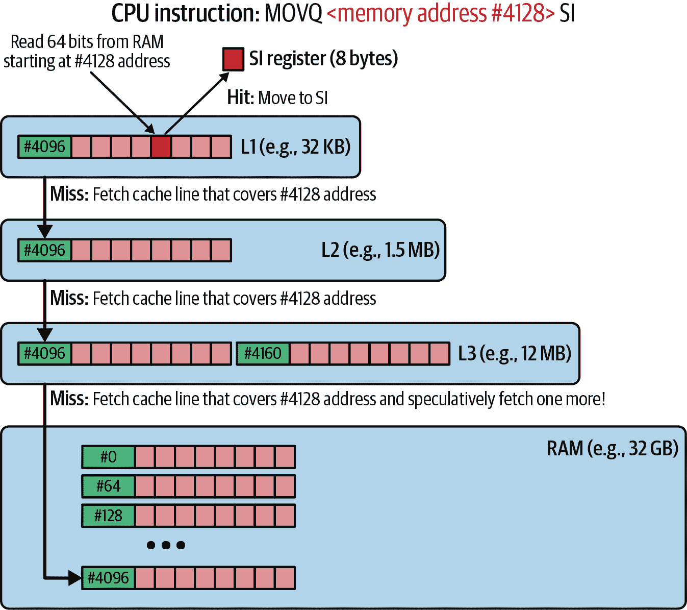

# 第四章：如何使用 CPU 资源（或两个）

> 我们可以做出的最有用的抽象之一是将硬件和基础设施系统的属性视为资源。CPU、内存、数据存储和网络类似于自然界中的资源：它们是有限的，是现实世界中的物理对象，并且必须在生态系统的各个关键参与者之间分配和共享。
> 
> Susan J. Fowler，《*可生产的微服务*》（[O’Reilly, 2016](https://oreil.ly/8xO1v)）

正如您在 “性能背后” 中所学到的，软件效率取决于我们的程序如何使用硬件资源。如果相同的功能使用更少的资源，我们的效率就会提高，并且运行这样的程序的需求和净成本会降低。例如，如果我们使用更少的 CPU 时间（CPU “资源”）或具有较慢访问时间的更少资源（例如磁盘），通常可以减少软件的延迟。

这听起来可能很简单，但在现代计算机中，这些资源以复杂且非平凡的方式相互交互。此外，多个进程使用这些资源，因此我们的程序并不直接使用它们。相反，操作系统为我们管理这些资源。如果这还不够复杂，特别是在云环境中，我们经常进一步“虚拟化”硬件，以便可以以隔离的方式跨许多个体系统共享它们。这意味着“主机”有方法将部分单个 CPU 或磁盘访问授予“客户”操作系统，后者认为这是所有存在的硬件。最终，操作系统和虚拟化机制在我们的程序与实际存储或计算我们数据的物理设备之间创建了层次。

要理解如何编写高效的代码或有效提升程序的效率，我们必须深入了解典型计算机资源如 CPU、不同类型存储和网络的特性、目的和限制。这里没有捷径。此外，我们不能忽视操作系统和典型虚拟化层如何管理这些物理组件。

在本章中，我们将从 CPU 的角度来审视我们的程序执行。我们将讨论 Go 如何在单个和多核任务中使用 CPU。

我们不会讨论所有类型的计算机架构以及所有现有操作系统的所有机制，因为这在一本书中是不可能完成的，更不用说一章了。因此，本章将专注于典型的 x86-64 CPU 架构，包括 Intel 或 AMD、ARM CPU 和现代 Linux 操作系统。这应该让您开始，并为您提供一个跳板，如果您曾经在其他独特类型的硬件或操作系统上运行您的程序。

我们将从探索现代计算机架构中的 CPU 开始，以理解现代计算机是如何设计的，主要关注 CPU 或处理器。然后我将介绍汇编语言，这将帮助我们理解 CPU 核心执行指令的方式。之后，我们将深入了解 Go 编译器，以增进我们对进行`go build`时发生的事情的认识。此外，我们将深入讨论 CPU 和内存墙问题，展示现代 CPU 硬件为何如此复杂。这个问题直接影响在这些超关键路径上编写高效代码。最后，我们将进入多任务处理的领域，解释操作系统调度程序如何尝试在数量不足的 CPU 核心上分发数千个执行程序，以及 Go 运行时调度程序如何利用这一点为我们实现高效的并发框架。我们将以何时使用并发的总结结束。

# 机械同情心

最初，这一章节可能会让人感到不知所措，特别是对低级编程新手来说。然而，了解正在发生的事情将有助于我们理解优化，因此要专注于理解每个资源的高级模式和特性（例如 Go 调度器的工作原理）。我们不需要知道如何手动编写机器码，或者如何盲目地制造计算机。

相反，让我们对计算机箱底下的事情如何运作充满好奇。换句话说，我们需要对[机械同情心](https://oreil.ly/Co2IM)抱有好奇心。

要理解 CPU 架构的工作原理，我们需要解释现代计算机的运行方式。因此，让我们在下一节深入探讨这个问题。

# 现代计算机架构中的 CPU

在 Go 编程中，我们所做的一切就是构建一组语句，告诉计算机逐步执行什么操作。借助预定义的语言结构，如变量、循环、控制机制、算术和 I/O 操作，我们可以实现与存储在不同介质中的数据交互的任何算法。这也是为什么像 Go 这样的流行编程语言被称为命令式语言——作为开发人员，我们必须描述程序的操作方式。现代硬件的设计也是如此——这也是命令式的。它等待程序指令、可选的输入数据以及所需的输出位置。

编程并不总是如此简单。在通用目的机器出现之前，工程师们必须设计固定程序硬件以实现请求的功能，例如台式计算器。添加功能、修复错误或优化都需要改变电路并制造新设备。可能不是成为“程序员”的最轻松时期！

幸运的是，大约在 1950 年代，世界各地的一些发明家发现了一种可以使用存储在内存中的一组预定义指令来编程的通用机器的机会。最早记录这一想法的之一是伟大的数学家约翰·冯·诺伊曼及其团队。

> 显然，设备必须能够以某种方式存储不仅计算中所需的数字信息，... 还有计算的中间结果（可能需要存储不同长度的时间），以及控制实际计算例程的指令。... 对于通用机器，必须能够指示设备执行以数字形式表达的任何计算。
> 
> Arthur W. Burks、Herman H. Goldstine 和 John von Neumann，《电子计算仪器逻辑设计初步讨论》（高级研究院，1946 年）

值得注意的是，大多数现代通用计算机（如 PC、笔记本电脑和服务器）基于 John von Neumann 的设计。这假设程序指令可以像存储和读取程序数据（指令输入和输出）一样被存储和提取。我们通过从主存储器（或高速缓存）中的特定内存地址读取字节来获取要执行的指令（例如`add`）和数据（例如加法操作数）。虽然现在听起来并不像一个新颖的想法，但它确立了通用机器的工作方式。我们称之为冯·诺依曼计算机体系结构，你可以在图 4-1 中看到其现代演变的变体。¹


###### 图 4-1\. 带有单个多核 CPU 和统一内存访问（UMA）的高级计算机架构

在现代架构的核心，我们看到一个 CPU 由多个核心组成（2020 年代 PC 中四到六个物理核心是常见的）。每个核心可以执行带有存储在随机访问内存（RAM）或任何其他存储器层中的特定数据的所需指令。

在第五章中解释的 RAM 承担了主要、快速、易失性内存的职责，它可以在计算机通电的同时存储我们的数据和程序代码。此外，内存控制器确保 RAM 得到持续的电源供应，以保持 RAM 芯片上的信息。最后，CPU 可以与各种外部或内部输入/输出（I/O）设备进行交互。从高层次来看，I/O 设备指的是接受发送或接收字节流的任何内容，例如鼠标、键盘、扬声器、显示器、HDD 或 SSD 磁盘、网络接口、GPU 等等，数量众多。

大致来说，CPU、RAM 和流行的 I/O 设备（如磁盘和网络接口）是计算机架构的基本组成部分。这是我们在《“效率要求应该被形式化”》中提到的 RAERs 中使用的“资源”，也是我们在软件开发中通常进行优化的对象。

在本章中，我们将关注我们通用计算机的大脑——CPU。我们何时应该关注 CPU 资源？从效率的角度来看，当以下情况之一发生时，我们应该开始关注我们 Go 进程的 CPU 资源使用情况：

+   我们的机器无法执行其他任务，因为我们的进程使用了所有可用的 CPU 资源计算能力。

+   我们的进程运行得出乎意料地慢，而我们却看到更高的 CPU 消耗。

有许多技术可以排除这些症状，但我们必须首先了解 CPU 的内部工作原理和程序执行基础。这是进行高效 Go 编程的关键。此外，它解释了最初可能让我们惊讶的许多优化技术。例如，你知道为什么在 Go（和其他语言中），如果我们计划经常迭代它们，我们应该避免使用类似链表的结构，尽管它们在理论上有快速插入和删除的优势吗？

在我们了解为什么之前，我们必须理解 CPU 核心如何执行我们的程序。令人惊讶的是，我发现通过学习汇编语言工作的方式来解释这一点是最好的。相信我，这可能比你想象的要容易！

# 汇编语言

CPU 核心间接地可以执行我们编写的程序。例如，考虑在 Example 4-1 中的简单 Go 代码。

##### 示例 4-1\. 从文件中读取数字并返回总和的简单函数

```go
func Sum(fileName string) (ret int64, _ error) {
   b, err := os.ReadFile(fileName)
   if err != nil {
      return 0, err
   }

   for _, line := range bytes.Split(b, []byte("\n")) {
      num, err := strconv.ParseInt(string(line), 10, 64)
      if err != nil {
         return 0, err
      }

      ret += num 
   }

   return ret, nil
}
```


这个函数中的主要算术操作将从文件中解析的数字添加到表示总和的整数变量 `ret` 中。

虽然这种语言远非口语英语，不幸的是，对于 CPU 来说，它仍然太复杂和难以理解。这不是“机器可读”的代码。幸运的是，每种编程语言都有一个专门的工具称为编译器²，它（除了其他讨论在“理解 Go 编译器”中的内容）将我们的高级代码转换为机器代码。你可能熟悉`go build`命令，它调用默认的 Go 编译器。

机器码是用二进制格式编写的指令序列（著名的零和一）。原则上，每条指令由一个数字（`opcode`）表示，后面是形式为常量值或主存中地址的可选操作数。我们还可以引用几个 CPU 核心寄存器，这些寄存器是直接安装在 CPU 芯片上的小“槽”，用于存储中间结果。例如，在 AMD64 CPU 上，我们有十六个 64 位通用寄存器，分别称为 RAX、RBX、RDX、RBP、RSI、RDI、RSP，以及 R8-R15。

在转换为机器代码时，编译器通常会添加额外的代码，例如额外的内存安全边界检查。它会根据已知的效率模式自动更改我们的代码以适应特定的体系结构。有时这可能并不是我们期望的。这就是为什么在解决某些效率问题时检查结果的机器代码有时很有用。人们需要阅读机器代码的另一个高级示例是在没有源代码的情况下对程序进行逆向工程。

不幸的是，机器代码对人类来说是不可能阅读的，除非你是天才。然而，在这种情况下，我们可以使用一个很棒的工具。我们可以将示例 4-1 的代码编译成[汇编语言](https://oreil.ly/3xZAs) 而不是机器代码。我们也可以将编译后的机器代码反汇编为汇编语言。汇编语言代表可以由人类开发者实际阅读（在理论上可以编写）的最低代码级别。它也很好地代表了当转换为机器代码时 CPU 将执行的内容。

值得一提的是，我们可以将编译后的代码反汇编成各种汇编方言。例如：

+   转换为[Intel 语法](https://oreil.ly/alpt4)，使用标准的 Linux 工具[`objdump -d -M intel <binary>`](https://oreil.ly/kZO3j)

+   转换为[AT&T 语法](https://oreil.ly/k6bKs)，使用类似的命令[`objdump -d -M att <binary>`](https://oreil.ly/cmAW9)

+   转换为[Go“伪”汇编语言](https://oreil.ly/lT07J)，使用 Go 工具[`go tool objdump -s <binary>`](https://oreil.ly/5I9t2)

所有这三种方言都在各种工具中使用，并且它们的语法各不相同。为了更容易理解，请始终确认您的反汇编工具使用的语法。Go 汇编语言是一种尝试尽可能通用的方言，因此可能并不完全代表机器代码。然而，它通常是一致的并且足够接近我们的目的。它可以显示《理解 Go 编译器》中讨论的所有编译优化。这就是为什么本书将始终使用 Go 汇编语言的原因。

# 我需要理解汇编语言吗？

您不需要知道如何在汇编语言中编程来编写高效的 Go 代码。然而，对汇编语言和反汇编过程的粗略理解是揭示隐藏的低级计算浪费的重要工具。实际上，当我们已经应用了所有更简单的优化时，它通常对于高级优化是有用的。汇编语言还有助于理解编译器在将我们的代码转换为机器代码时应用的变化。有时这些变化可能会让我们感到意外！最后，它还告诉我们 CPU 是如何工作的。

在示例 4-2 中，我们可以看到编译后的示例 4-1 的一个小片段（使用`go tool objsdump -s`）表示`ret += num`语句。³

##### 示例 4-2\. 从编译后的示例 4-1 中反编译出来的 Go 汇编语言中的代码部分

```go
// go tool objdump -s sum.test
ret += num
0x4f9b6d      488b742450    MOVQ 0x50(SP), SI  
0x4f9b72      4801c6       ADDQ AX, SI  
```


第一行代表一个[四字节（64 位）MOV 指令](https://oreil.ly/SDE5R)，告诉 CPU 从存储在寄存器`SP`地址加上 80 字节的内存中复制 64 位值，并将其放入`SI`寄存器中。⁴ 编译器决定`SI`将存储返回参数在我们函数中的初始值，所以`ret`整数变量用于`ret+=num`操作。


作为第二条指令，我们告诉 CPU 将来自`AX`寄存器的四字节值添加到`SI`寄存器中。编译器使用`AX`寄存器来存储`num`整数变量，该变量是我们从之前指令（不在本段内）解析的字符串。

前面的示例展示了`MOVQ`和`ADDQ`指令。为了使事情更加复杂，每个不同的 CPU 实现允许不同的指令集，具有不同的内存寻址等。行业创建了[指令集架构（ISA）](https://oreil.ly/eTzST)来指定软件和硬件之间严格的、可移植的接口。由于 ISA，我们可以将我们的程序编译为与 x86 架构的 ISA 兼容的机器码，并在任何 x86 CPU 上运行。⁵ ISA 定义了数据类型、寄存器、主存储器管理、固定指令集、唯一标识、输入/输出模型等。不同类型的 CPU 有不同的[ISA](https://oreil.ly/TLxJn)。例如，32 位和 64 位的 Intel 和 AMD 处理器都使用 x86 ISA，而 ARM 则使用其 ARM ISA（例如，新的[Apple M 芯片使用 ARMv8.6-A](https://oreil.ly/NZqT1)）。

就 Go 开发者而言，ISA 定义了一组指令和寄存器，我们编译的机器码可以使用。为了生成可移植的程序，编译器可以将我们的 Go 代码转换为与特定 ISA（架构）和所需操作系统类型兼容的机器码。在下一节中，让我们看看默认的 Go 编译器是如何工作的。在此过程中，我们将揭示帮助 Go 编译器生成高效快速机器码的机制。

# 理解 Go 编译器

关于构建有效编译器的话题可以填写几本书。然而，在本书中，我们将试图理解作为对高效代码感兴趣的 Go 开发人员必须了解的 Go 编译器基础知识。通常，我们在典型操作系统上执行的 Go 代码涉及许多内容，不仅仅是编译。首先，我们需要使用编译器编译它，然后我们必须使用链接器将不同的目标文件链接在一起，包括可能的共享库。这些编译和链接过程通常称为*构建*，它们生成操作系统可以执行的可执行文件（“二进制文件”）。在初始启动时，称为*加载*，还可以动态加载其他共享库（例如 Go 插件）。

有许多针对不同目标环境设计的 Go 代码构建方法。例如，[Tiny Go](https://oreil.ly/c2C5E) 优化生成微控制器的二进制文件，[gopherjs](https://oreil.ly/D83Jq) 生成用于浏览器执行的 JavaScript，而 [android](https://oreil.ly/83Wm1) 则生成可在 Android 操作系统上执行的程序。但是，本书将重点放在 `go build` 命令中默认和最流行的 Go 编译器和链接机制上。编译器本身是用 Go 编写的（最初是用 C 编写的）。可以在[这里](https://oreil.ly/qcrLt)找到粗略的文档和源代码。

`go build` 可以将我们的代码构建成许多不同的输出。我们可以构建需要在启动时动态链接系统库的可执行文件。我们可以构建共享库，甚至是兼容 C 的共享库。然而，使用 Go 的最常见和推荐的方式是构建将所有依赖项静态链接的可执行文件。它提供了更好的体验，其中我们的二进制文件的调用不需要特定目录中特定版本的系统依赖项。对于具有起始 `main` 函数的代码，默认构建模式也可以通过 `go build -buildmode=exe` 明确调用。

`go build` 命令既调用编译又调用链接。虽然链接阶段也执行某些优化和检查，但编译器可能执行最复杂的任务。Go 编译器一次只专注于一个包。它将包的源代码编译为目标架构和操作系统支持的本机代码。此外，它还验证、优化该代码，并为调试目的准备重要的元数据。我们需要与编译器（以及操作系统和硬件）“合作”，以编写高效的 Go 代码，而不是反其道而行之。

> 我告诉每个人，如果不确定如何做某事，请问问在 Go 中最惯用的方式是什么。因为许多答案已经调整为与硬件的操作系统相容。
> 
> Bill Kennedy，《机械同情心上的比尔·肯尼迪》。

为了使事情更有趣，`go build` 还提供了一个特殊的交叉编译模式，如果您想要编译使用 C、C++ 或甚至 Fortran 实现的函数混合的 Go 代码！如果您启用了一个称为 [`cgo`](https://oreil.ly/Xjh9U) 的模式，这是可能的。不幸的是，`cgo` [不建议使用](https://oreil.ly/QojX3)，应尽量避免使用它。它会使构建过程变慢，C 和 Go 之间传递数据的性能值得怀疑，并且非 `cgo` 编译已经足够强大，可以为不同架构和操作系统交叉编译二进制文件。幸运的是，大多数库要么是纯 Go 的，要么是使用可以包含在 Go 二进制文件中的汇编代码片段，而无需 `cgo`。

要了解编译器对我们的代码的影响，可以看看 Go 编译器在 Figure 4-2 中执行的阶段。虽然 `go build` 包括这样的编译，但我们可以仅使用 `go tool compile` 触发单独的编译（不链接）。


###### 图 4-2\. Go 编译器对每个 Go 包执行的阶段

如前所述，整个过程围绕您在 Go 程序中使用的包展开。每个包都在单独编译，允许并行编译和关注点分离。图 4-2 中展示的编译流程如下：

1.  Go 源代码首先被标记化和解析。语法被检查。语法树引用文件和文件位置，以产生有意义的错误和调试信息。

1.  构建抽象语法树（AST）。这样的树是一种常见的抽象，允许开发人员创建能够轻松转换或检查解析语句的算法。在 AST 形式中，代码首先进行类型检查。检测出声明但未使用的项。

1.  首先执行优化的第一遍。例如，初始的死代码被消除，因此二进制大小可以更小，编译的代码量也更少。接着进行逃逸分析（见 “Go 内存管理”），以决定哪些变量可以放在堆栈上，哪些必须分配到堆上。此外，在这个阶段，对于简单和小型函数，还会进行函数内联。

    # 函数内联

    编程语言中的函数⁶ 允许我们创建抽象，隐藏复杂性，并减少重复代码。然而，调用执行的成本不为零。例如，[具有单个参数调用的函数需要额外的约 10 条 CPU 指令](https://oreil.ly/4OPbI)⁷。因此，虽然成本固定且通常在纳秒级别，但如果我们在热路径中有数千个这样的调用，并且函数体足够小，这个执行调用可能会有影响。

    内联还有其他好处。例如，编译器可以更有效地在代码中应用其他优化，尤其是在函数更少的情况下，并且不需要在函数作用域之间传递参数时使用堆或大型栈内存（通过复制）。堆和栈的解释请参见“Go 内存管理”。

    编译器会自动用其正文的精确副本替换某些函数调用。这称为*内联*或[*内联扩展*](https://oreil.ly/JGde3)。其逻辑非常智能。例如，从 Go 1.9 开始，编译器可以[内联叶和中栈函数](https://oreil.ly/CX2v0)。

    # 很少需要手动内联

    对于初学者工程师来说，通过手动内联一些函数进行微优化是很诱人的。然而，尽管在编程的早期阶段开发人员必须这样做，但这种功能通常是编译器的基本职责，它通常更了解何时以及如何内联函数。利用这一事实，首先关注代码的可读性和可维护性，只在最后的情况下手动内联，并始终进行测量。

1.  在对 AST 进行了早期优化之后，树被转换为静态单赋值（SSA）形式。这种底层更明确的表示形式使得使用一组规则进行进一步优化更加容易。例如，借助 SSA 的帮助，编译器可以轻松地找到不必要的变量赋值位置。⁸

1.  编译器应用进一步的机器无关优化规则。例如，语句如`y := 0*x`将简化为`y := 0`。完整的规则列表是[巨大的](https://oreil.ly/QTljA)，并且只能确认这个领域有多复杂。此外，一些代码片段可以由[内置函数](https://oreil.ly/FMjT0)替换——这是经过高度优化的等效代码（例如原始汇编）。

1.  根据`GOARCH`和`GOOS`环境变量，编译器调用`genssa`函数将 SSA 转换为所需架构（ISA）和操作系统的机器码。

1.  进一步的 ISA 和操作系统特定优化被应用。

1.  未死的包机器码被构建为单个对象文件（带有*.o*后缀）和调试信息。

最终的“目标文件”被压缩为一个名为 Go *archive*的`tar`文件，通常带有*.a*文件后缀。⁹ 每个包的这种存档文件可以被 Go 链接器（或其他链接器）使用，以组合成一个单一的可执行文件，通常称为*二进制文件*。根据操作系统的不同，这样的文件遵循特定的格式，告诉系统如何执行和使用它。对于 Linux 来说，通常是[可执行和可链接格式](https://oreil.ly/jnicX)（ELF）。在 Windows 上，可能是[便携式可执行格式](https://oreil.ly/SdohW)（PE）。

二进制文件中的机器代码并非唯一的部分。它还包含程序的静态数据，如全局变量和常量。可执行文件还包含大量调试信息，这些信息会占用相当大的二进制文件大小，例如简单的符号表、基本类型信息（用于反射）和 [PC-to-line 映射](https://oreil.ly/akAR2)（指令地址对应源代码中的行）。这些额外信息能够帮助宝贵的调试工具将机器代码与源代码链接起来。例如，许多调试工具使用它，如 “Go 中的性能分析” 和前述的 `objdump` 工具。为了与 Delve 或 GDB 等调试软件兼容，二进制文件还附加了 DWARF 表。¹⁰

除了已有的责任清单外，Go 编译器必须执行额外的步骤，以确保 Go [内存安全性](https://oreil.ly/kkCRb)。例如，编译器通常可以在编译时确定某些命令将使用一个安全的内存空间（包含预期的数据结构并为我们的程序保留），但有时在编译期间无法确定，因此需要在运行时执行额外的检查，例如额外的边界检查或空指针检查。

我们将在 “Go 内存管理” 中更详细地讨论这个问题，但是在我们关于 CPU 的对话中，我们需要认识到这些检查会占用我们宝贵的 CPU 时间。虽然 Go 编译器在不必要时会尽力消除这些检查（例如在 SSA 优化的边界检查消除阶段），但在某些情况下，我们可能需要以一种有助于编译器消除某些检查的方式编写代码。¹¹

对于 Go 构建过程，有许多不同的配置选项。第一批大批选项可以通过 `go build -ldflags="<flags>"` 传递，这代表 [链接器命令选项](https://oreil.ly/g8dvv)（`ld` 前缀传统上代表 [Linux 链接器](https://oreil.ly/uJEda)）。例如：

+   我们可以通过 `-ldflags="-w"` 来省略 DWARF 表，从而减小二进制文件大小（如果您在生产环境中不使用调试器，则推荐使用此选项）。

+   类似地，使用 `-ldflags= "-s -w"` 可以进一步减小二进制文件的大小，删除 DWARF 和其他调试信息中的符号表。我不建议使用后者选项，因为非 DWARF 元素允许重要的运行时例程，例如收集配置文件。

类似地，`go build -gcflags="<flags>"` 代表 [Go 编译器选项](https://oreil.ly/rRtRs)（`gc` 代表 `Go Compiler`；不要与 GC 混淆，后者指的是垃圾回收，如 “垃圾回收” 中所述）。例如：

+   `-gcflags="-S"` 打印出 Go 汇编代码。

+   `-gcflags="-N"` 禁用所有编译器优化。

+   `-gcflags="-m=<number>` 在打印主要优化决策的同时构建代码，其中数字表示详细级别。参见示例 4-3 中我们在 示例 4-1 中的 `Sum` 函数上自动编译器优化。

##### 示例 4-3\. `go build -gcflags="-m=1" sum.go` 在 示例 4-1 代码上的输出

```go
# command-line-arguments ./sum.go:10:27: inlining call to os.ReadFile 
./sum.go:15:34: inlining call to bytes.Split 
./sum.go:9:10: leaking param: fileName 
./sum.go:15:44: ([]byte)("\n") does not escape 
./sum.go:16:38: string(line) escapes to heap 
```


`os.ReadFile` 和 `bytes.Split` 足够简短，所以编译器可以复制 `Sum` 函数的整个主体。


`fileName` 参数“泄漏”，意味着这个函数在返回后仍然保持其参数活动状态（尽管可能仍在堆栈上）。


`[]byte("\n")` 的内存将分配在堆栈上。像这样的消息有助于调试逃逸分析。在这里了解更多信息：[链接](https://oreil.ly/zBCyO)。


`string(line)` 的内存将分配在更昂贵的堆中。

当增加 `-m` 数字时，编译器将打印更多详细信息。例如，`-m=3` 将解释为什么会做出某些决策。在我们预期某些优化（如内联或保持变量在堆栈上）发生时，但在我们的 TFBO 周期（“效率感知开发流程”](ch03.html#ch-conq-eff-flow)）的基准测试中仍然看到开销时，此选项非常方便。

Go 编译器实现经过高度测试和成熟，但编写相同功能的方法有无数种。当我们的实现让编译器困惑时，可能不会应用某些天真的实现。通过性能基准测试是否存在问题，分析代码并确认 `-m` 选项有助于解决问题。更详细的优化也可以使用进一步的选项打印出来。例如，`-gcflags="-d=ssa/check_bce/debug=1"` 打印出所有边界检查消除优化。

# 代码越简单，编译器的优化效果就会越好

太聪明的代码难以阅读，并使得维护编程功能变得困难。但它也会使得试图匹配优化等效的模式的编译器感到困惑。使用惯用代码，保持函数和循环简单直接，增加编译器应用优化的机会，这样你就不需要！

熟悉编译器内部特性是有帮助的，尤其是在涉及更高级优化技巧时，这些技巧帮助编译器优化我们的代码。不幸的是，这也意味着我们的优化在不同编译器版本之间可能有些脆弱性。Go 团队保留更改编译器实现和标志的权利，因为它们不属于任何规范的一部分。这可能意味着你编写的一个允许编译器自动内联的函数，在下一个版本的 Go 编译器中可能不会触发内联。因此，当你切换到不同版本的 Go 时，更加重要的是进行基准测试并密切观察程序的效率。

总之，编译过程在解放程序员免于繁琐工作方面起着至关重要的作用。没有编译器优化，我们需要编写更多代码才能达到相同的效率水平，同时牺牲可读性和可移植性。相反，如果你专注于使你的代码简单化，你可以相信 Go 编译器会做一个足够好的工作。如果你需要提高特定热路径的效率，最好再次确认编译器是否按预期进行了操作。例如，编译器可能没有将我们的代码与常见的优化匹配；可能有一些额外的内存安全检查编译器可以进一步消除，或者可能有可以内联但未被内联的函数。在极端情况下，可能需要编写专门的汇编代码，并从 Go 代码中导入它。¹²

Go 的构建过程从我们的 Go 源代码中构建出完全可执行的机器码。当操作系统需要执行时，将机器码加载到内存中，并将第一条指令地址写入程序计数器（PC）寄存器。从那里开始，CPU 核心可以逐条计算每条指令。乍一看，这可能意味着 CPU 的工作相对简单。但不幸的是，内存墙问题导致 CPU 制造商不断进行额外的硬件优化，改变这些指令执行的方式。理解这些机制将使我们更好地控制我们的 Go 程序的效率和速度。让我们在下一节揭示这个问题。

# CPU 和内存墙问题

要理解内存墙及其后果，让我们简要深入探讨 CPU 核心内部。CPU 核心的详细信息和实现随时间改变以获得更好的效率（通常变得更加复杂），但基本原理保持不变。原则上，控制单元（如 图 4-1 所示）通过各种 L-cache（从最小且最快的开始）管理从内存中读取的操作，解码程序指令，协调它们在算术逻辑单元（ALU）中的执行，并处理中断。

一个重要的事实是 CPU 按周期工作。大多数 CPU 在一个周期内可以对一组小数据执行一条指令。这种模式被称为冯·诺依曼结构的特征中提到的“单指令单数据（SISD）”，这是冯·诺依曼结构的关键方面。一些 CPU 还允许使用特殊指令如 SSE 进行“单指令多数据（SIMD）”处理，允许在一个周期内对四个浮点数进行相同的算术运算。不幸的是，这些指令在 Go 语言中使用起来并不直接，因此相当少见。

同时，寄存器是 CPU 核心可用的最快本地存储。由于它们是直接连接到 ALU 的小电路，仅需一个 CPU 周期即可读取它们的数据。不幸的是，它们数量有限（取决于 CPU，通常为 16 个用于一般用途），且其大小通常不超过 64 位。这意味着它们在程序生命周期中被用作短期变量。一些寄存器可以用于我们的机器码，而另一些则保留给 CPU 使用。例如，[PC 寄存器](https://oreil.ly/TvHVd)保存着 CPU 应该获取、解码和执行的下一条指令的地址。

计算完全围绕数据展开。正如我们在第一章中学到的那样，如今有大量数据分散在不同的存储介质中——比可以存储在单个 CPU 寄存器中的数据量要多得多。此外，单个 CPU 周期比从主存储器（RAM）访问数据快——平均快 100 倍，这是我们在附录 A 中粗略的延迟数学计算中得出的结论，本书将沿用这些计算。正如我们在“硬件越来越快且便宜”的误解讨论中所述，技术使我们能够创建具有动态时钟速度的 CPU 核心，但其最大值始终约为 4 GHz。有趣的是，我们不能制造更快的 CPU 核心并不是最重要的问题，因为我们的 CPU 核心已经……太快了！事实上，我们无法制造更快的内存才是当前 CPU 主要效率问题的原因。

> 我们可以每秒执行大约 360 亿条指令。不幸的是，大部分时间都花在等待数据上。几乎每个应用程序中约 50%的时间都在等待数据。在某些应用程序中，高达 75%的时间都是在等待数据而不是执行指令。如果这让你感到恐惧，那就对了。确实应该如此。
> 
> Chandler Carruth，《“算法效率，数据结构性能”》（https://oreil.ly/I55mm）

上述问题通常被称为[“内存墙问题”](https://oreil.ly/l5zgk)。由于这个问题，我们面临着浪费几十甚至几百个 CPU 周期来执行单条指令的风险，因为获取该指令和数据（然后保存结果）需要很长时间。

这个问题如此突出，以至于最近有关于[重新审视冯·诺依曼体系结构](https://oreil.ly/xqbNU)的讨论。随着人工智能（AI）使用的机器学习（如神经网络）工作负载变得更加流行，这些工作负载特别受到内存墙问题的影响。因为大部分时间都花在执行复杂的矩阵数学计算上，这需要遍历大量内存。¹⁴

内存墙问题有效地限制了我们的程序执行速度。它还影响移动应用程序的总体能效，这对于移动应用程序尤为重要。尽管如此，它是目前为止最佳的通用硬件。行业通过开发几个主要 CPU 优化措施来缓解这些问题，我们将在下面讨论：分层缓存系统、流水线处理、乱序执行和超线程。这些直接影响我们的低级 Go 代码效率，特别是程序执行速度方面。

## 分层缓存系统

所有现代 CPU 都包括用于常用数据的本地、快速、小型缓存。L1、L2、L3（有时还有 L4）缓存是芯片上的静态随机访问存储器（SRAM）电路。SRAM 使用不同的技术存储数据，比我们的主内存 RAM 更快，但在大容量下的使用和生产成本更高（主内存在“物理内存”中有解释）。因此，当 CPU 需要从主内存（RAM）获取指令或数据来执行指令时，首先接触 L 缓存。CPU 使用 L 缓存的方式在图 4-3 中展示。¹⁵ 在示例中，我们将使用一个简单的 CPU 指令`MOVQ`，在示例 4-2 中有解释。



###### 图 4-3. CPU 执行的“查找”缓存方法来从主内存中读取字节，通过 L 缓存

要从特定内存地址复制 64 位（`MOVQ`命令）到寄存器`SI`，我们必须访问通常驻留在主内存中的数据。由于从 RAM 读取速度较慢，它使用 L 缓存首先检查数据。CPU 在第一次尝试时将向 L1 缓存请求这些字节。如果数据不在那里（缓存未命中），它会访问更大的 L2 缓存，然后是最大的 L3 缓存，最终是主内存（RAM）。在任何这些未命中情况下，CPU 将尝试获取完整的“缓存行”（通常为 64 字节，因此是寄存器大小的 8 倍），保存在所有缓存中，并仅使用这些特定字节。

一次性读取更多字节（缓存行）在性能上非常有用，因为它的延迟与读取单个字节相同（在“物理内存”中解释）。从统计上讲，下一个操作可能需要访问之前访问区域的相邻字节。L 缓存部分缓解了内存延迟问题，并减少了要传输的总数据量，保持了内存带宽。

在我们的 CPU 中引入 L 缓存的第一个直接结果是，我们定义的数据结构越小且更对齐，效率就越高。这样的结构更有可能完全适应较低级别的缓存，并避免昂贵的缓存未命中。第二个结果是，对于顺序数据的指令将更快，因为缓存行通常包含相邻存储的多个项。

## 流水线和乱序执行

如果数据能够在零时间内魔法般地访问，那么我们将拥有每个 CPU 核心周期执行有意义指令的完美情况，以 CPU 核心速度允许的速度执行指令。由于这并非事实，现代 CPU 尝试通过级联流水线保持 CPU 核心的每个部分繁忙。原则上，CPU 核心可以在一个周期内同时执行指令执行所需的多个阶段。这意味着我们可以利用指令级并行性（ILP）执行，例如，在五个 CPU 周期内执行五条独立指令，平均每个周期执行一条指令（IPC）[¹⁶]。例如，在[初始的五阶段流水线系统](https://oreil.ly/ccBg2)（现代 CPU 具有 14-24 个阶段！），单个 CPU 核心可以在一个周期内同时计算 5 条指令，如图 4-4 所示。


###### 图 4-4。示例五阶段流水线

经典的五阶段流水线包括五个操作：

`IF`

获取要执行的指令。

`ID`

解码指令。

`EX`

执行指令。

`MEM`

获取执行操作的操作数。

`WB`

返回操作结果（如果有）。

正如我们在 L 缓存部分讨论的那样，更复杂的是，即使是数据的获取（例如`MEM`阶段）也很少仅仅需要一个周期。为了缓解这一点，CPU 核心还采用了一种称为[乱序执行](https://oreil.ly/ccBg2)的技术。在这种方法中，CPU 试图按照输入数据和执行单元的可用性（如果可能）而不是按照程序中的原始顺序安排指令。对于我们的目的，把它看作是一个利用内部队列进行更有效 CPU 执行的复杂、更动态的流水线即可。

由此产生的流水线和乱序 CPU 执行是复杂的，但前述的简化解释应该足够我们理解作为开发人员的两个关键后果。第一个微不足道的后果是，每次指令流的切换都具有巨大的成本（例如，延迟方面），¹⁷因为流水线必须重置并从头开始，再加上明显的缓存崩溃。我们还未提及必须添加的操作系统开销。我们经常称之为*上下文切换*，这在现代计算机中是不可避免的，因为典型操作系统使用抢占式任务调度。在这些系统中，单个 CPU 核心的执行流可能每秒被抢占多次，这在极端情况下可能很重要。我们将讨论如何影响这种行为在“操作系统调度器”中。

第二个后果是我们的代码越具有预测性，效果越好。这是因为流水线需要 CPU 核心进行复杂的*分支预测*，以找到在当前指令之后执行的指令。如果我们的代码充满像 `if` 语句、`switch` 语句或者像 `continue` 这样的跳转语句，那么甚至可能找不到两个可以同时执行的指令，因为一个指令可能决定接下来执行哪条指令。这被称为数据依赖性。现代 CPU 核心的实现甚至进一步执行推测执行。因为它不知道下一条指令是什么，它选择最有可能的一条并假设将选择这样的分支。与浪费 CPU 周期无所作为相比，错误分支上的不必要执行更为可取。因此，出现了许多无分支编码技术，帮助 CPU 预测分支并可能导致更快的代码执行。某些方法由[Go 编译器](https://oreil.ly/VqKzx)自动应用，但有时需要手动改进。

通常来说，代码越简单，嵌套条件和循环越少，对于分支预测器越好。这就是为什么我们经常听说“向左倾斜”的代码更快。

> 依我看，一再看到想要快速的代码，都会向页面的左边去。所以如果你写像一个循环和 if、for 和 switch 这样的语句，那么它不会快。顺便说一下，Linux 内核，你知道编码标准是什么吗？八个字符的制表符，80 个字符的行宽。你不能在 Linux 内核中写糟糕的代码。你不能在那里写慢代码。……一旦你的代码中有太多的 if 和决策点……效率就没了。
> 
> Andrei Alexandrescu, [“人们思维中的速度”](https://oreil.ly/6mERC)

CPU 中分支预测器和推测性方法的存在有另一个后果。这导致在具有 L 缓存的流水线 CPU 架构中，连续内存数据结构的性能大大提高。

# 连续内存结构的重要性

实际上，在现代 CPU 上，大多数情况下，开发者应该更倾向于使用连续的内存数据结构，比如数组，而不是链表。这是因为典型的链式结构实现（例如树）使用内存指针来指向下一个、过去的、子元素或父元素。这意味着当遍历这样的结构时，CPU 核心在访问节点并检查该指针之前，无法预测接下来要执行的数据和指令。这有效地限制了推测能力，导致 CPU 使用效率低下。

## 超线程

超线程是英特尔对 CPU 优化技术的专有名称，称为[*同时多线程* (SMT)](https://oreil.ly/L5va6).¹⁸ 其他 CPU 制造商也实现了 SMT。这种方法允许单个 CPU 核心以对程序和操作系统可见的方式运行为两个逻辑 CPU 核心。¹⁹ SMT 促使操作系统在同一物理 CPU 核心上调度两个线程。虽然单个物理核心永远不会同时执行多个指令，但在队列中有更多指令有助于在空闲时使 CPU 核心忙碌。鉴于内存访问等待时间，这可以在不影响进程执行延迟的情况下更有效地利用单个 CPU 核心。此外，SMT 中的额外寄存器使 CPU 能够更快地在单个物理核心上多个线程之间进行上下文切换。

SMT 必须得到操作系统的支持和集成。当启用时，您应该在您的机器上看到比物理核心多两倍的核心。要了解您的 CPU 是否支持超线程，请查看规格中的“每核线程数”信息。例如，使用`lscpu` Linux 命令在示例 4-4 中，我的 CPU 有两个线程，这意味着超线程是可用的。

##### 示例 4-4\. 在我的 Linux 笔记本上执行`lscpu`命令的输出

```go
Architecture:                    x86_64
CPU op-mode(s):                  32-bit, 64-bit
Byte Order:                      Little Endian
Address sizes:                   39 bits physical, 48 bits virtual
CPU(s):                          12
On-line CPU(s) list:             0-11
Thread(s) per core:              2  Core(s) per socket:              6
Socket(s):                       1
NUMA node(s):                    1
Vendor ID:                       GenuineIntel
CPU family:                      6
Model:                           158
Model name:                      Intel(R) Core(TM) i7-9850H CPU @ 2.60GHz
CPU MHz:                         2600.000
CPU max MHz:                     4600.0000
CPU min MHz:                     800.0000
```


我的 CPU 支持 SMT，并且在我的 Linux 安装中已启用。

通常情况下，默认情况下启用 SMT，但在新内核上可以根据需求进行调整。这在运行我们的 Go 程序时会有后果。通常，我们可以选择是否应该为我们的进程启用或禁用这种机制。但是，大多数情况下，最好保持启用状态，因为这使得我们可以在单台计算机上运行多个不同任务时充分利用物理核心。然而，在某些极端情况下，可能值得将整个物理核心专用于单个进程，以确保服务质量最高。一般来说，每个特定硬件的基准测试应该能告诉我们。

总之，所有上述的 CPU 优化和相应的编程技术只在优化周期的最后阶段使用，并且只在我们想要在关键路径上挤出最后几十纳秒时使用。

# 编写关键路径上 CPU 高效代码的三个原则

会产生 CPU 友好代码的三条基本规则如下：

+   使用做更少工作的算法。

+   专注于编写低复杂度的代码，这样更容易为编译器和 CPU 分支预测器进行优化。理想情况下，将“热”代码与“冷”代码分开。

+   在计划经常迭代或遍历它们时，倾向于使用连续的内存数据结构。

通过对 CPU 硬件动态的简要了解，让我们深入探讨关键路径上运行成千上万程序的关键软件类型——调度器。

# 调度器

调度通常意味着为某个进程分配必要的、通常是有限的资源以完成。例如，在汽车工厂中，组装汽车零部件必须在特定的地点和特定的时间紧密安排，以避免停机。我们还可能需要在某些时间段内安排会议参与者之间的会议。

在现代计算机或服务器集群中，我们有成千上万的程序需要在共享的资源如 CPU、内存、网络、磁盘等上运行。这就是为什么行业开发了许多类型的调度软件（通常称为*调度器*），专注于将这些程序分配给多个级别的空闲资源。

在本节中，我们将讨论 CPU 调度。从底层开始，我们有一个操作系统，它在有限数量的物理 CPU 上调度任意程序。操作系统的机制应告诉我们同时运行多个程序如何影响我们的 CPU 资源，以及如何影响我们自己的 Go 程序执行延迟。它还将帮助我们了解开发人员如何同时利用多个 CPU 内核，以并行或同时方式实现更快的执行。

## 操作系统调度器

与编译器一样，有许多不同的操作系统（OSes），每个都有不同的任务调度和资源管理逻辑。虽然大多数系统都在类似的抽象上操作（例如，带有优先级的线程、进程），但在本书中我们将专注于 Linux 操作系统。它的核心称为内核，具有许多重要功能，如管理内存、设备、网络访问、安全性等。它还通过一个可配置的组件称为调度器来确保程序的执行。

> 作为资源管理的核心部分，操作系统线程调度器必须保持以下简单的不变性：确保准备好的线程在可用的核心上调度。
> 
> J.P. Lozi 等人的文章 [“Linux 调度器：十年浪费核心”](https://oreil.ly/bfiEW)

Linux 调度程序的最小调度单元称为[操作系统线程](https://oreil.ly/Lp2Sk)。线程（有时也称为*任务*或*轻量级进程*）包含独立的一组机器代码，以 CPU 指令的形式顺序运行。虽然线程可以维护其执行状态、堆栈和寄存器集，但它们无法超出上下文运行。

每个线程作为进程的一部分运行。进程代表正在执行的程序，并可以通过其进程标识号（PID）进行识别。当我们告诉 Linux 操作系统执行我们编译的程序时，将创建一个新进程（例如使用[`fork`](https://oreil.ly/IPKYU)系统调用）。

进程创建包括分配新的 PID、创建带有其机器代码的初始线程（例如 Go 代码中的`func main()`）和栈、标准输出和输入文件以及大量其他数据（例如打开文件描述符列表、统计数据、限制、属性、挂载项目、组等）。此外，还会创建新的内存地址空间，必须保护它免受其他进程的影响。所有这些信息在整个程序执行期间都在专用目录 */proc/`<PID>`* 中维护。

线程可以创建新线程（例如使用[`clone`](https://oreil.ly/6qSg3)系统调用），这些线程将拥有独立的机器代码序列，但会共享同一内存地址空间。线程也可以创建新进程（例如使用[`fork`](https://oreil.ly/idB06)系统调用），这些进程将独立运行并执行所需程序。线程维护其执行状态：运行、准备和阻塞。这些状态的可能转换如图 4-5 所示。

线程状态告诉调度程序线程当前正在做什么：

运行

线程被分配到 CPU 核心并执行其工作。

阻塞

线程正在等待某个事件，该事件可能比上下文切换花费的时间更长。例如，线程从网络连接读取数据，正在等待数据包或者在互斥锁上的轮询。这是调度程序介入并允许其他线程运行的时机。

准备

线程准备执行但正在等待轮到它。


###### 图 4-5\. 线程状态在 Linux 操作系统调度程序中的显示

正如你可能已经注意到的那样，Linux 调度程序采用抢占式线程调度。抢占式意味着调度程序可以随时冻结线程的执行。在现代操作系统中，通常有多个线程等待执行，但可用的 CPU 核心有限，因此调度程序必须在单个 CPU 核心上运行多个“准备好”的线程。每次线程等待 I/O 请求或其他事件时，线程被抢占。线程还可以告知操作系统放弃自己的执行（例如使用[`sched_yield`](https://oreil.ly/QfnCs)系统调用）。被抢占时，线程进入“阻塞”状态，其他线程可以顶替它暂时执行。

傻瓜调度算法可以等待线程抢占自身。这对于 I/O 绑定的线程非常有效，它们经常处于“阻塞”状态——例如，具有图形界面或与网络调用交互的轻量级 Web 服务器的交互系统。但如果线程是 CPU 绑定的，这意味着它大部分时间只使用 CPU 和内存——例如，执行一些计算密集型的工作如线性搜索、矩阵乘法或暴力破解散列密码？在这种情况下，CPU 核心可能在一个任务上忙碌数分钟，这将使系统中所有其他线程饿死。例如，想象一下在浏览器中无法输入或调整窗口大小一分钟——看起来像是系统长时间冻结！

这个主要的 Linux 调度器实现解决了这个问题。它被称为完全公平调度器（CFS），并且它为线程分配了短暂的轮换时间。每个线程被赋予一定的 CPU 时间片，通常在 1 毫秒到 20 毫秒之间，这造成了线程同时运行的假象。这对必须对人类交互保持响应的桌面系统尤其有帮助。这种设计还有一些其他重要的后果：

+   要执行的线程越多，它们每次轮换的时间就越少。然而，这可能导致 CPU 核心的生产利用率降低，开始花费更多时间进行昂贵的上下文切换。

+   在过载的机器上，每个线程在 CPU 核心上的轮换时间较短，也可能每秒的轮换次数较少。虽然没有线程完全饥饿（阻塞），它们的执行速度可能会显著减慢。

    # CPU 过载

    编写高效的 CPU 代码意味着我们的程序浪费的 CPU 周期显著减少。当然，这总是很好的，但是如果 CPU 过载，即使是高效的实现也可能表现得非常缓慢。

    CPU 过载或系统意味着太多的线程在竞争可用的 CPU 核心。因此，机器可能被超调度，或者一个或两个进程生成了太多的线程来执行某些重型任务（我们称这种情况为*嘈杂的邻居*）。如果出现 CPU 过载情况，检查机器的 CPU 利用率指标应该显示 CPU 核心以 100% 的容量运行。在这种情况下，每个线程的执行都会变慢，导致系统冻结、超时和缺乏响应。

+   依靠纯程序执行延迟（有时称为 *墙上时间* 或 *墙钟时间*）来估算我们程序的 CPU 效率是困难的。这是因为现代操作系统调度器是抢占式的，而程序通常会等待其他 I/O 或同步操作。因此，要可靠地检查在修复后，我们的程序是否比以前的实现更有效地利用了 CPU，这是相当困难的。这就是为什么行业定义了一个重要的度量标准，用于收集我们程序进程（所有其线程）在所有 CPU 核心上处于“运行”状态的时间。我们通常称之为 CPU 时间，并将在 “CPU 使用率” 中讨论。

    # 在负载过重的机器上的 CPU 时间

    测量 CPU 时间是检查我们程序 CPU 效率的一种好方法。然而，在查看某个进程执行时间的狭窄窗口时要小心。例如，较低的 CPU 时间可能意味着我们的进程在那一时刻没有使用太多 CPU，但它也可能表示 CPU 负载过重。

    总体而言，在同一系统上共享进程存在问题。这就是为什么在虚拟化环境中，我们倾向于保留这些资源的原因。例如，我们可以将一个进程的 CPU 使用限制为每秒钟 200 毫秒的 CPU 时间，这相当于一个 CPU 核心的 20%。

+   CFS 设计的最终后果是，它对于确保单个线程专用的 CPU 时间过于公平了。Linux 调度器具有优先级、用户可配置的“niceness”标志以及不同的调度策略。现代 Linux 操作系统甚至有一种调度策略，用特殊的实时调度程序替代 CFS，以执行需要第一顺序执行的线程。²⁰

    不幸的是，即使有了实时调度程序，Linux 系统也不能确保高优先级线程将获得它们所需的所有 CPU 时间，因为它仍然会努力确保低优先级线程不会挨饿。此外，因为 CFS 和实时对应物都是抢占式的，它们不是确定性和可预测性的。因此，在有严格实时要求的任务（例如毫秒级交易或飞机软件）之前，不能保证足够的执行时间。这就是为什么一些公司为 [严格实时程序](https://oreil.ly/oVsCz) 开发了他们自己的调度程序或系统，如 [Zephyr OS](https://oreil.ly/hV7ym)。

尽管 CFS 调度器具有一定复杂的特性，它仍然是现代 Linux 系统中最流行的线程编排系统。2016 年，CFS 还针对多核机器和 NUMA 架构进行了全面升级，基于 [一篇著名的研究论文](https://oreil.ly/kUEiQ) 的发现。因此，现在线程可以智能地分布在空闲核心上，同时确保迁移不会太频繁，也不会在共享相同资源的线程之间进行。

在对操作系统调度程序有基本了解之后，让我们深入探讨为何 Go 调度程序的存在以及它如何使开发人员能够在单个或多个 CPU 核心上并发运行多个任务。

## Go 运行时调度器

Go 并发框架建立在这样一个前提上，即由于典型工作流程的 I/O 密集特性，单个 CPU 指令流（例如函数）很难利用所有 CPU 周期。虽然操作系统线程抽象通过将线程复用到一组 CPU 核心中来缓解这一问题，但 Go 语言带来了另一层——*goroutine*——它在一组线程上多路复用函数。[goroutines 的想法](https://oreil.ly/TClXu)类似于[协程](https://oreil.ly/t7oXZ)，但并非完全相同（goroutines 可以被抢占），并且因为它是在 Go 语言中，所以有*go*前缀。与操作系统线程类似，当 goroutine 在系统调用或 I/O 上被阻塞时，Go 调度器（而非操作系统！）可以快速切换到另一个 goroutine，后者会在同一个线程上恢复执行（如果需要，也可以在不同线程上）。

> 实质上，Go 已将应用程序级别的 I/O 密集型工作转化为操作系统级别的 CPU 密集型工作。由于所有的上下文切换都发生在应用程序级别，因此我们不会像使用线程时那样每次上下文切换损失相同的 12K 指令（平均）。在 Go 中，这些相同的上下文切换只会花费你 200 纳秒或 2.4K 指令。调度程序还有助于提高缓存行效率和 NUMA 效率。这就是为什么我们不需要比虚拟核心更多的线程。
> 
> William Kennedy，《Go 中的调度：第二部分—Go 调度器》

因此，在 Go 语言中，我们在用户空间中拥有非常廉价的执行“线程”（一个新的 goroutine 只分配了几千字节用于初始的本地栈），这减少了我们机器上竞争线程的数量，并允许我们的程序中有数百个 goroutine 而不会产生过多的开销。每个 CPU 核心只需一个操作系统线程就足以完成所有 goroutine 的工作。²¹ 这使得诸如事件循环、映射-归约、管道、迭代器等多种模式成为可能，而无需涉及更昂贵的内核多线程。

使用 Go 语言中的并发 goroutines 形式是执行以下操作的绝佳方式：

+   表示复杂的异步抽象（例如事件）

+   充分利用我们的 CPU 来处理 I/O 密集型任务

+   创建一个能够利用多个 CPU 以更快速度执行的多线程应用程序

在 Go 中启动另一个 goroutine 非常简单。语言内置了一个`go <func>()`的语法。示例 4-5 展示了一个启动两个 goroutine 并完成工作的函数。

##### 示例 4-5\. 启动两个 goroutine 的函数

```go
func anotherFunction(arg1 string) { /*...*/ }

func function() {
   // ... 

   go func() {
      // ... 
   }()

   go anotherFunction("argument1") 

   return 
}
```


当前 goroutine 的范围。


新的 goroutine 的作用域将随时并发运行。


`anotherFunction` 将随时并发运行。


当 `function` 终止时，我们启动的两个 goroutine 仍然可以运行。

重要的是要记住，所有的 goroutine 在彼此之间具有平等的层次结构。从技术上讲，当 goroutine `A` 启动 `B` 或 `B` 启动 `A` 时没有区别。在这两种情况下，`A` 和 `B` goroutines 都是平等的，它们不知道彼此的存在。²² 除非我们实现显式的通信或同步并“请求” goroutine 停止，它们也不能彼此停止。唯一的例外是通过 `main()` 函数启动的主 goroutine。如果主 goroutine 完成，整个程序将终止，强制终止所有其他 goroutines。

关于通信，goroutines 与操作系统线程类似，可以访问进程内的同一内存空间。这意味着我们可以使用共享内存在 goroutines 之间传递数据。然而，这并不那么简单，因为在 Go 中几乎没有操作是原子的。从同一内存中并发写入（或写入和读取）可能会导致数据竞争，从而引起非确定性行为甚至数据损坏。为了解决这个问题，我们需要使用像显式原子函数（如 示例 4-6 中所示）或互斥锁（如 示例 4-7 中所示）这样的同步技术，换句话说，是一种锁定机制。

##### 示例 4-6\. 通过专用原子加法实现安全的多 goroutine 通信

```go
func sharingWithAtomic() (sum int64) {
   var wg sync.WaitGroup 

   concurrentFn := func() {
      atomic.AddInt64(&sum, randInt64())
      wg.Done()
   }
   wg.Add(3)
   go concurrentFn()
   go concurrentFn()
   go concurrentFn()

   wg.Wait()
   return sum
}
```


请注意，虽然我们使用原子操作在 `concurrentFn` goroutines 之间同步添加，但我们还使用额外的 `sync.WaitGroup`（另一种形式的锁定）等待所有这些 goroutines 完成。我们在 示例 4-7 中也是如此。

##### 示例 4-7\. 通过互斥锁实现安全的多 goroutine 通信（锁定）

```go
func sharingWithMutex() (sum int64) {
   var wg sync.WaitGroup
   var mu sync.Mutex

   concurrentFn := func() {
      mu.Lock()
      sum += randInt64()
      mu.Unlock()
      wg.Done()
   }
   wg.Add(3)
   go concurrentFn()
   go concurrentFn()
   go concurrentFn()

   wg.Wait()
   return sum
}
```

在原子和锁之间的选择取决于可读性、效率要求以及您想要同步的操作。例如，如果您想要在数字上并发执行简单的操作，如写入或读取值、加法、替换或比较和交换，可以考虑使用 [atomic 包](https://oreil.ly/NZnXr)。原子操作通常比互斥锁更高效，因为编译器将它们转换为特殊的 [原子 CPU 操作](https://oreil.ly/8g0yM)，可以以线程安全的方式更改单个内存地址下的数据。²³

然而，如果使用原子操作影响了代码的可读性，代码不在关键路径上，或者我们有更复杂的操作需要同步，我们可以使用锁。Go 语言提供了`sync.Mutex`，允许简单的锁定，以及`sync.RWMutex`，允许读锁定（`RLock()`）和写锁定（`Lock()`）。如果有许多不修改共享内存的 goroutine，请使用`RLock()`对它们进行锁定，这样它们之间就不会有锁争用，因为并发读取共享内存是安全的。只有当一个 goroutine 想要修改该内存时，它才能通过`Lock()`获取完整的锁定，这将阻塞所有读取操作。

另一方面，锁和原子操作并不是唯一的选择。Go 语言在这个主题上还有另一个王牌。在协程概念之上，Go 还利用了[C. A. R. Hoare 的通信顺序进程（CSP）](https://oreil.ly/5KXA9)范式，这也可以被视为 Unix 管道的类型安全的泛化。

> 不要通过共享内存进行通信；相反，通过通信共享内存。
> 
> [“Effective Go”](https://oreil.ly/G4Lmq)

这种模型鼓励通过使用通道概念在 goroutine 之间实现通信管道来共享数据。通过共享相同的内存地址来传递数据需要额外的同步。然而，如果一个 goroutine 将数据发送到某个通道，另一个 goroutine 接收它，整个流程自然同步，并且共享数据永远不会被两个 goroutine 同时访问，确保线程安全。²⁴ 示例通道通信在示例 4-8 中展示。

##### 示例 4-8\. 通过通道进行内存安全的多 goroutine 通信示例

```go
func sharingWithChannel() (sum int64) {
   result := make(chan int64) 

   concurrentFn := func() {
      // ...
      result <- randInt64() 
   }
   go concurrentFn()
   go concurrentFn()
   go concurrentFn()

   for i := 0; i < 3; i++ { 
      sum += <-result 
   }
   close(result) 
   return sum
}
```


可以使用`ch := make(chan <type>, <buffer size>)`语法在 Go 中创建通道。


我们可以向通道发送特定类型的值。


注意，在这个例子中，我们不需要`sync.WaitGroup`，因为我们了解我们期望接收到多少条精确的消息。如果没有这些信息，我们将需要一个等待组或其他机制。


我们可以从通道读取特定类型的值。


如果不再计划通过通道发送任何内容，也应该关闭通道。这会释放资源并解除某些接收和发送流程的阻塞（稍后会详细说明）。

通道的重要方面是它们可以具有缓冲区。在这种情况下，它的行为类似于队列。如果我们创建了一个具有三个元素缓冲区的通道，一个发送 goroutine 可以在有人从该通道读取之前发送三个元素。如果我们发送了三个元素并关闭了通道，接收 goroutine 在注意到通道关闭之前仍然可以读取三个元素。一个通道可以处于三种状态。重要的是记住，当在这些状态之间切换时，从该通道发送或接收的 goroutine 的行为如何。

已分配、开启的通道

如果我们使用`make(chan <type>)`创建一个通道，它将在分配时就开启。假设没有缓冲区，这样的通道将阻塞尝试发送值，直到另一个 goroutine 接收或者我们在使用带有多个 case 的 `select` 语句时。类似地，通道接收将阻塞，直到有人发送到该通道，除非我们在带有多个 case 的 `select` 语句中接收，或者该通道已关闭。

关闭的通道

如果我们通过`close(ch)`关闭了分配的通道，发送到该通道将导致恐慌，接收将立即返回零值。这就是为什么建议将关闭通道的责任留给发送数据的 goroutine（发送者）。

空通道

如果您定义了通道类型（`var ch chan <type>`）而不使用`make(chan <type>)`分配它，我们的通道是 nil。我们也可以通过赋值 nil (`ch = nil`) 来“nil”一个已分配的通道。在这种状态下，发送和接收将永远阻塞。实际上，将通道设置为 nil 很少有用。

Go 通道是一种令人惊叹和优雅的范式，允许构建非常可读的基于事件的并发模式。然而，就 CPU 效率而言，与`atomic`包和互斥锁相比，它们可能是最低效的。但不要因此灰心！对于大多数实际应用（如果没有过度使用！），通道可以将我们的应用程序结构化为强大且高效的并发实现。我们将探讨一些使用通道的实际模式，在“通过并发优化延迟”中展示。

在完成本节之前，理解如何在 Go 程序中调整并发效率非常重要。并发逻辑由 Go 调度程序在[Go 运行时包](https://oreil.ly/q3iCp)中实现，它还负责其他事务，如垃圾收集（参见“垃圾收集”）、分析或堆栈帧。Go 调度程序相当自动化。配置标志不多。目前，开发者可以通过两种实际的方式控制代码中的并发：

一些 goroutine 的数量

作为开发人员，我们通常控制我们程序中创建的 goroutines 数量。通常不是为每个小工作单元生成它们是最佳选择，所以不要过度使用它们。还值得注意的是，许多标准或第三方库的抽象可以生成 goroutines，特别是那些需要 `Close` 或取消的操作。特别是，常见操作如 `http.Do`、`context.WithCancel` 和 `time.After` 都会创建 goroutines。如果使用不当，goroutines 可能会被泄漏（留下孤立的 goroutines），这通常会浪费内存和 CPU 资源。我们将探讨在 “Goroutine” 中调试 goroutines 数量和快照的方法。

# 高效代码的第一条规则

总是关闭或释放您使用的资源。有时，如果忘记关闭它们，简单的结构可能会导致内存和 goroutines 的巨大且无界的浪费。我们将在 “不要泄露资源” 中探讨常见示例。

`GOMAXPROCS`

这个重要的环境变量可以设置来控制你希望在 Go 程序中利用的虚拟 CPU 数量。可以通过 `runtime.GOMAXPROCS(n)` 函数应用相同的配置值。Go 调度程序如何使用这个变量的底层逻辑是相当复杂的²⁶，但它通常控制 Go 可以期望的并行 OS 线程执行的数量（内部称为“proc”数）。然后，Go 调度程序将维护 `GOMAXPROCS/proc` 数量的队列，并尝试在它们之间分发 goroutines。`GOMAXPROCS` 的默认值始终是操作系统公开的虚拟 CPU 核心数，这通常会为您提供最佳性能。如果希望您的 Go 程序使用较少的 CPU 核心（较少的并行性）以换取潜在的更高延迟，请减少 `GOMAXPROCS` 值。

# 推荐的 `GOMAXPROCS` 配置

将 `GOMAXPROCS` 设置为您希望您的 Go 程序同时利用的虚拟核心数。通常情况下，我们希望使用整个机器，因此默认值应该适用。

对于虚拟化环境，特别是使用像容器这样的轻量级虚拟化机制，请使用 [Uber 的 `automaxprocs` 库](https://oreil.ly/ysr40)，它将根据容器被允许使用的 Linux CPU 限制调整 `GOMAXPROCS`，这通常是我们想要的。

多任务始终是引入语言的一个棘手概念。我认为在 Go 语言中，带有通道的 goroutines 是这个问题的相当优雅的解决方案，它允许许多可读的编程模式而不会牺牲效率。我们将通过改进本章介绍的 “通过并发优化延迟” 中所示的 Example 4-1 来探索实际的并发模式。

现在让我们看看在我们的 Go 程序中何时可能会使用并发。

# 何时使用并发

与任何效率优化一样，将单个 goroutine 代码转换为并发代码时，同样适用经典规则。没有例外。我们必须专注于目标，应用 TFBO 循环，尽早进行基准测试，并寻找最大的瓶颈。像任何事情一样，增加并发性有其权衡，也有一些情况我们应该避免。让我们总结并发代码与顺序代码相比的实际好处和缺点：

优点

+   并发允许我们通过将工作分解为片段并同时执行每个部分来加快工作进度。只要同步和共享资源不是重要的瓶颈，我们应该期望改善延迟。

+   因为 Go 调度程序实现了有效的抢占机制，所以并发可以提高 I/O 绑定任务的 CPU 核心利用率，这应该能够在`GOMAXPROCS=1`（单个 CPU 核心）时减少延迟。

+   特别是在虚拟环境中，我们经常为程序保留一定的 CPU 时间。并发允许我们在可用的 CPU 时间中更均匀地分配工作。

+   对于某些情况，比如异步编程和事件处理，并发很好地表示了问题领域，尽管存在一些复杂性，但是可以提高可读性。另一个例子是 HTTP 服务器。将每个 HTTP 进入请求视为单独的 goroutine，不仅可以有效利用 CPU 核心，而且自然地适应了代码的阅读和理解方式。

缺点

+   并发会显著增加代码的复杂性，特别是在将现有代码转换为并发代码时（而不是从一开始就围绕通道构建 API）。这影响了可读性，因为它几乎总是模糊了执行流程，更糟糕的是，它限制了开发者预测所有边缘情况和潜在错误的能力。这是我建议尽可能推迟引入并发的主要原因之一。一旦不得不引入并发，尽量在给定问题中使用尽可能少的通道。

+   有了并发，由于无限并发（单个时刻的无控 goroutine 数量）或泄露 goroutine（孤立的 goroutine），存在饱和资源的风险。这也是我们需要关注和测试的内容（详见“不泄露资源”）。

+   尽管 Go 的并发框架非常高效，但 goroutines 和 channels 并非没有开销。如果使用不当，可能会影响我们代码的效率。专注于为每个 goroutine 提供足够的工作量来证明其成本是有必要的。基准测试是必不可少的。

+   当使用并发时，我们突然向程序添加了三个更非平凡的调优参数。我们有一个`GOMAXPROCS`设置，根据我们如何实现事物，我们可以控制我们产生的 goroutine 数量以及我们应该具有多大的通道缓冲区。找到正确的数字需要数小时的基准测试，并且仍然容易出错。

+   并发代码很难进行基准测试，因为它更加依赖环境、可能存在的噪声邻居、多核设置、操作系统版本等。另一方面，顺序的单核代码具有更加确定和可移植的性能，更容易证明并进行比较。

正如我们所见，使用并发并不是解决所有性能问题的灵丹妙药。这只是我们手中的另一个工具，可以用来实现效率目标。

# 添加并发应该是我们最后尝试的有意义优化之一。

根据我们的 TFBO 周期，如果您仍然不能满足您的 RAERs，例如速度方面，请确保在添加并发之前尝试更简单的优化技术。经验法则是，在我们的 CPU 分析器（在第九章中解释）显示我们的程序只在对我们功能至关重要的事务上花费 CPU 时间之前，是我们知道的最有效的方式。

上述的缺点列表是一个原因，但第二个原因是，在基本的（不使用并发）优化之后，我们程序的特性可能会有所不同。例如，我们以为我们的任务是 CPU 密集型的，但在改进之后，我们可能发现大部分时间都花在等待 I/O 操作上。或者我们可能意识到，其实我们根本不需要大规模的并发修改。

# 总结

现代 CPU 硬件是一个复杂的组件，它允许我们高效地运行我们的软件。随着操作系统的持续发展、Go 语言开发和硬件的进步，只会出现更多的优化技术和复杂性，以降低运行成本并增加处理能力。

在本章中，我希望给了你一些基础知识，帮助你优化 CPU 资源的使用，以及通常的软件执行速度。首先，我们讨论了汇编语言及其在 Go 开发中的用处。然后，我们探讨了 Go 编译器的功能、优化方法和调试方式。

后来，我们深入探讨了 CPU 执行的主要挑战：现代系统中的内存访问延迟。最后，我们讨论了诸如 L 缓存、流水线处理、CPU 分支预测和超线程等各种低级优化技术。

最后，我们探讨了在生产系统中执行我们程序的实际问题。不幸的是，我们机器上的程序很少是唯一的进程，因此高效的执行非常重要。最后，我们总结了 Go 并发框架的优缺点。

在实践中，优化 CPU 资源是现代基础设施中实现更快执行和减少工作负载成本的关键。不幸的是，CPU 资源只是一个方面。例如，我们的选择优化可能更倾向于使用更多内存以减少 CPU 使用率，或者反之。

因此，我们的程序通常会使用大量的内存资源（以及通过磁盘或网络的 I/O 流量）。虽然执行与 CPU 资源（如内存和 I/O）相关联，但根据我们的需求（例如，更便宜的执行、更快的执行或两者兼有），它可能是我们优化列表中的第一项。让我们在下一章讨论内存资源。

¹ 严格来说，现代计算机现在为程序指令和数据分别具有不同的缓存，尽管两者都存储在主内存中。这就是所谓的修改后的哈佛架构。在本书中我们追求的优化级别上，我们可以安全地跳过这个细节层次。

² 对于脚本（解释）语言，没有完全的代码编译。相反，有一个解释器逐条编译代码语句。另一种独特类型的语言是由使用 Java 虚拟机（JVM）的语言系列代表。这样的机器可以在运行时动态地从解释切换到即时（JIT）编译以进行优化。

³ 通过使用`go build -gcflags *-S* <source>`将源代码编译为汇编，可以获得类似于示例 4-2 的输出。

⁴ 请注意，在 Go 汇编寄存器中，名称被抽象化以实现可移植性。由于我们将编译为 64 位架构，`SP`和`SI`将表示 RSP 和 RSI 寄存器。

⁵ 可能会存在不兼容性，但主要是与特殊用途指令（如加密或 SIMD 指令）有关，可以在执行前运行时检查它们是否可用。

⁶ 注意，从编译器的角度来看，结构方法只是函数，第一个参数就是该结构，因此这里也适用相同的内联技术。

⁷ 函数调用需要更多的 CPU 指令，因为程序必须通过堆栈传递参数变量和返回参数，保持当前函数的状态，在函数调用后重置堆栈，添加新的堆栈帧等。

⁸ Go 工具允许我们通过`GOSSAFUNC`环境变量在 SSA 形式中检查我们程序的状态，只需构建我们的程序并使用`GOSSAFUNC=<function to see> go build`，然后打开生成的*ssa.html*文件。您可以在[这里](https://oreil.ly/32Zbd)了解更多信息。

⁹ 您可以使用`tar <archive>`或`go tool pack e <archive>`命令解包它。Go 归档通常包含对象文件和*__.PKGDEF*文件中的包元数据。

¹⁰ 然而，有关从默认构建过程中删除它的讨论。

¹¹ [边界检查消除](https://oreil.ly/E7FJI) 不在本书中详细解释，因为这是一种罕见的优化思想。

¹² 这在标准库中的关键代码中非常常见。

¹³ 在 SISD 和 SIMD 的基础上，弗林分类法还指定了 MISD，它描述了在同一数据上执行多个指令，并且 MIMD，描述了完全并行。MISD 是罕见的，仅在可靠性重要时才会发生。例如，四个飞行控制计算机在每个 NASA 航天飞机上执行完全相同的计算，以进行四重错误检查。另一方面，由于多核甚至多 CPU 设计，MIMD 更为常见。

¹⁴ 这就是为什么我们在通用设备中看到专用芯片（称为神经处理单元或 NPU）的原因，例如 Google 手机中的张量处理单元（TPU），iPhone 中的 A14 仿生芯片，以及苹果笔记本电脑中的专用 NPU。

¹⁵ 缓存的大小可以不同。示例大小取自我的笔记本电脑。您可以通过使用 `sudo dmidecode -t cache` 命令在 Linux 中检查 CPU 缓存的大小。

¹⁶ 如果一个 CPU 总共每个周期最多执行一条指令（IPC ≤ 1），我们称其为标量 CPU。大多数现代 CPU 核心的 IPC ≤ 1，但是有一些 CPU 拥有多个核心，使得 IPC > 1。这使得这些 CPU 成为超标量 CPU。IPC 已经迅速成为 CPU 的性能指标。

¹⁷ 高昂的成本一点也不为过。上下文切换的延迟取决于许多因素，但是据测量，在最佳情况下，直接延迟（包括操作系统切换延迟）约为 1,350 纳秒 — 如果必须迁移到不同的核心，则为 2,200 纳秒。这仅仅是直接延迟，从一个线程的结束到另一个线程的开始。总延迟将包括缓存和流水线预热的间接成本，可能高达 10,000 纳秒（这是我们在表 A-1 中看到的情况）。在此期间，我们可以计算大约 40,000 条指令。

¹⁸ 在一些资料中，这种技术也称为 CPU 线程（又称硬件线程）。由于可能与操作系统线程引起混淆，本书将避免使用这种术语。

¹⁹ 不要将超线程逻辑核心与在虚拟化中使用的虚拟 CPU（vCPU）混淆。客户操作系统根据主机选择使用机器的物理或逻辑 CPU，但在两种情况下，它们都被称为 vCPU。

²⁰ 有关调整操作系统的良好材料，[很多](https://oreil.ly/8OPW3)。许多虚拟化机制，如具有像 Kubernetes 这样的编排系统的容器，也有它们的优先级和亲和性概念（将进程固定到特定的核心或机器）。在本书中，我们专注于编写高效的代码，但必须意识到执行环境的调整在确保程序快速可靠执行中起着重要作用。

²¹ 围绕 Go 运行时实现 Go 调度的细节[相当令人印象深刻](https://oreil.ly/G9bFb)。基本上，Go 尽一切努力保持操作系统线程忙碌（旋转操作系统线程），以便尽可能长时间地保持不进入阻塞状态。如果需要，它可以从其他线程窃取 goroutine，轮询网络等，以确保我们保持 CPU 忙碌，使操作系统不会抢占 Go 进程。

²² 在实践中，有办法使用调试跟踪获取这些信息。但是，我们不应依赖程序知道哪个 goroutine 是正常执行流的父 goroutine。

²³ 有趣的是，即使是 CPU 上的原子操作也需要某种形式的锁定。不同之处在于，与专门的自旋锁机制不同，原子指令可以使用更快的[内存总线锁](https://oreil.ly/9jchk)。

²⁴ 假设程序员遵循这个规则。有一种方法可以发送一个指向共享内存的指针变量（例如，`*string`），这违反了通过通信共享信息的规则。

²⁵ 我特意省略了两个额外的机制。首先，`runtime.Gosched()` 存在，允许当前 goroutine 让出执行权，以便其他 goroutine 在此期间执行一些工作。这个命令如今不太有用，因为当前的 Go 调度器是抢占式的，手动让出执行权已变得不切实际。第二个有趣的操作，`runtime.LockOSThread()`，听起来有用，但它并非设计用于效率；相反，它将 goroutine 固定到操作系统线程，以便我们可以从中读取某些操作系统线程状态。

²⁶ 我建议观看[Chris Hines 在 GopherCon 2019 的演讲](https://oreil.ly/LoFiH)，以了解有关 Go 调度器的低级细节。
