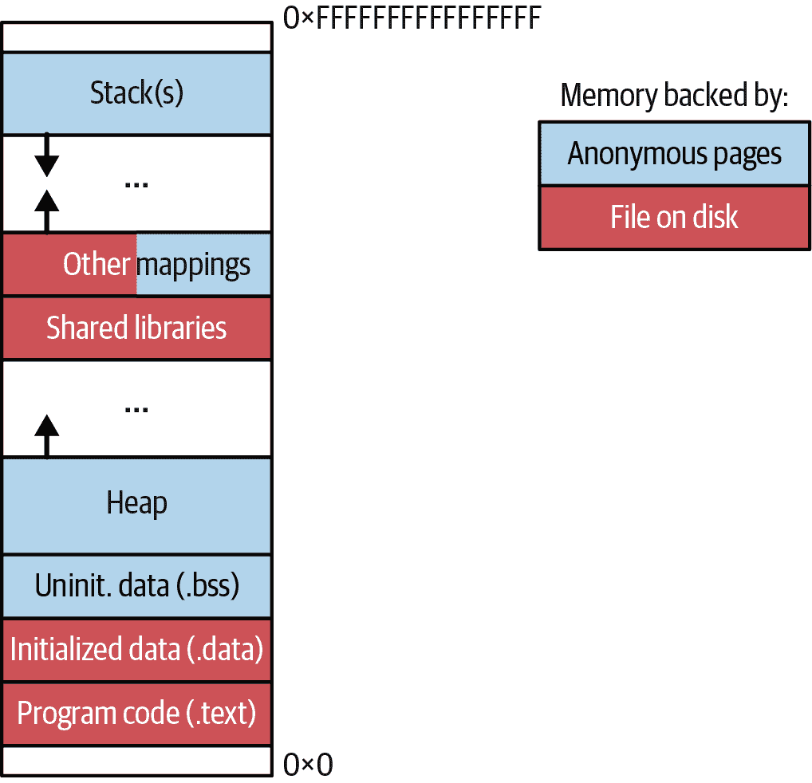

# 第五章：Go 如何使用内存资源

在第四章中，我们开始深入了解现代计算机的内部运作。我们讨论了使用 CPU 资源的效率方面。CPU 中指令的高效执行很重要，但执行这些指令的唯一目的是修改数据。不幸的是，数据变更的路径并不总是简单的。例如，在冯·诺依曼体系结构中（见图 4-1），当从主内存（RAM）访问数据时，我们会遇到 CPU 和内存墙问题。

工业界发明了许多技术和优化层来克服这样的挑战，包括内存安全性和确保大内存容量。由于这些发明，从 RAM 访问八字节到 CPU 寄存器可能被表示为简单的`MOVQ <目标寄存器> <地址 XYZ>`指令。然而，CPU 从存储这些字节的物理芯片获取信息的实际过程非常复杂。我们讨论了像分层缓存系统这样的机制，但实际上远不止这些。

从某些方面来说，这些机制尽可能地从程序员那里抽象出来。因此，例如，当我们在 Go 代码中定义一个变量时，我们无需考虑需要预留多少内存，以及它需要适应多少个 L 缓存。这对开发速度来说是很好的，但有时当我们需要处理大量数据时可能会让我们感到意外。在这些情况下，我们需要重新审视我们对内存资源的[机械同情](https://oreil.ly/Co2IM)，优化 TFBO 流程（“效率感知开发流程”），以及良好的工具支持。

本章将重点讨论理解 RAM 资源。我们将从整体上探索内存的相关性。然后，我们将在“我们是否有内存问题？”中设定语境。接下来，我们将解释与内存访问相关的每个元素的模式和后果，从下到上。内存的数据旅程始于“物理内存”，硬件内存芯片。然后我们将转向操作系统（OS）内存管理技术，允许在多进程系统中管理有限的物理内存空间：“虚拟内存”和“OS 内存映射”，更详细地解释“mmap 系统调用”。

当解释了内存访问的较低层之后，我们可以转向对于希望优化内存效率的 Go 程序员至关重要的关键知识 —— 解释“Go 内存管理”。这包括必要的元素，例如内存布局，“值、指针和内存块”的含义，以及带来可衡量后果的“Go 分配器”的基础知识。最后，我们将探索“垃圾回收”。

我们将在本章中详细讨论存储器的许多细节，但关键目标是建立 Go 程序在处理存储器使用时的模式和行为的直觉。例如，在访问存储器时可能会出现哪些问题？我们如何测量存储器使用量？分配存储器意味着什么？我们如何释放存储器？我们将在本章中探索这些问题的答案。但让我们首先澄清为什么 RAM 对于我们的程序执行至关重要。它究竟有多重要？

# 内存的重要性

所有 Linux 程序执行它们编程功能所需的资源不仅仅是 CPU。例如，让我们以像[Caddy](https://oreil.ly/MpHMZ)（用 Go 语言编写）或[NGINX](https://oreil.ly/7F0cZ)（用 C 语言编写）这样的 Web 服务器为例。这些程序允许从磁盘提供静态内容或代理 HTTP 请求等功能。它们使用 CPU 执行编写的代码。但是，像这样的 Web 服务器还与其他资源进行交互，例如：

+   使用 RAM 缓存基本的 HTTP 响应

+   使用磁盘加载配置、静态内容或写入日志行以满足可观察性需求

+   使用网络为远程客户端提供 HTTP 请求服务

因此，CPU 资源只是方程式的一部分。对于大多数程序而言，它们被创建用于保存、读取、管理、操作和转换来自不同介质的数据。

有人会争论，“内存”资源，通常称为 RAM，¹处于这些交互的核心。RAM 是计算机的支柱，因为每个外部数据（来自磁盘、网络或其他设备的字节）必须在内存中缓冲，以便 CPU 访问。因此，例如，操作系统启动新进程的第一步是将程序的部分机器代码和初始数据加载到内存中，以便 CPU 执行。

遗憾的是，在我们的程序中使用存储器时，我们必须注意三个主要的警告：

+   RAM 访问速度远远慢于 CPU 操作速度。

+   我们的机器中始终存在有限数量的 RAM（通常每台机器从几 GB 到数百 GB 不等），这迫使我们关注空间效率。²

+   除非[持久类型的存储器](https://oreil.ly/uaPiN)能够以类似 RAM 的速度、价格和健壮性进行商品化，否则我们的主存储器是严格易失性的。当计算机断电时，所有信息完全丢失。³

存储器的短暂特性和有限大小，是我们被迫向计算机添加一个辅助的持久 I/O 资源的原因，即磁盘。如今，我们有相对较快的固态硬盘（SSD），但速度仍然比 RAM 慢约 10 倍，寿命有限（约五年）。另一方面，我们有速度较慢和价格较便宜的硬盘驱动器（HDD）。尽管比 RAM 便宜，磁盘资源也是一种稀缺资源。

最后但同样重要的是，出于可伸缩性和可靠性的原因，我们的计算机依赖于来自远程位置的数据。行业发明了不同的网络和协议，允许我们与远程软件（例如数据库）甚至远程硬件（通过 iSCSI 或 NFS 协议）进行通信。我们通常将这类 I/O 抽象为网络资源的使用。不幸的是，由于其不可预测的特性、有限的带宽和更大的延迟，网络是最具挑战性的资源之一。

在使用这些资源的同时，我们通过内存资源进行操作。因此，了解其工作原理至关重要。程序员可以做很多事情来影响应用程序的内存使用。但不幸的是，在没有适当教育的情况下，我们的实现往往容易出现效率低下和计算资源或执行时间浪费的情况。这个问题在当今程序需要处理大量数据时尤为突出。这就是为什么我们经常说高效编程关键在于数据。

# Go 程序中内存效率问题通常是最常见的问题。

Go 是一种具有垃圾回收的语言，这使得 Go 成为一种非常高效的语言。然而，垃圾收集器（GC）牺牲了对内存管理的一些可见性和控制（详见《垃圾回收》）。

即使我们忽略了 GC 的开销，对于需要处理大量数据或处于某些资源约束下的情况，我们必须更加谨慎地处理程序如何使用内存。因此，我建议阅读本章时额外小心，因为大多数一级优化通常围绕内存资源展开。

我们何时应开始内存优化过程？几种常见的症状可能表明我们可能存在内存效率问题。

# 我们是否有内存问题？

了解 Go 如何使用计算机的主内存及其效率后果非常有用，但我们也必须遵循务实的方法。与任何优化一样，我们应该在确认存在问题之前避免优化内存。我们可以定义一组情况，这些情况应引起我们对 Go 内存使用和潜在优化的兴趣：

+   我们的物理计算机、虚拟机、容器或进程由于内存不足（OOM）信号而崩溃，或者我们的进程即将达到内存限制。⁴

+   我们的 Go 程序执行速度比平常慢，同时内存使用高于平均水平。剧透：我们的系统可能因为内存压力而导致抖动或交换，如《操作系统内存映射》中所解释的那样。

+   我们的 Go 程序执行速度比平常慢，同时 CPU 利用率高涨。剧透：如果创建了过多的短生命周期对象，则分配或释放内存会减慢我们的程序。

如果您遇到这些情况中的任何一种，那么可能是时候调试和优化您的 Go 程序的内存使用了。正如我将在 “复杂度分析” 中教授您的，如果您知道自己在寻找什么，一组早期警告信号可以指示可能轻松避免的严重内存问题。此外，建立这种积极的直觉可能使您成为一个有价值的团队资产！

但是，没有良好的基础我们无法建设任何东西。就像 CPU 资源一样，如果不真正理解优化，您将无法应用它们！我们必须了解这些优化背后的原因。例如，示例 4-1 在输入中为 100 万个整数分配了 30.5 MB 的内存。但这意味着什么？空间是在哪里保留的？这意味着我们确切地使用了 30.5 MB 的物理内存，还是更多？这些内存是否曾经被释放过？本章旨在使您意识到这些问题，让您能够回答所有这些问题。我们将了解为什么内存通常是问题所在，以及我们可以采取什么措施。

让我们从硬件（HW）、操作系统（OS）和 Go 运行时的内存管理基础知识开始讲起。让我们从直接影响我们程序执行的物理内存的基本细节开始讲起。这些知识可能有助于您更好地理解现代物理内存的规格和文档！

# 物理内存

我们以比特的形式数字化地存储信息，这是计算机的基本存储单位。比特可以有两个值之一，0 或 1。有了足够的比特，我们可以表示任何信息：整数、浮点值、字母、消息、声音、图像、视频、程序、[元宇宙](https://oreil.ly/il8Tz)等。

我们在执行程序时使用的主要物理内存（RAM）基于动态随机存取存储器（[DRAM](https://oreil.ly/hbo59)）。这些芯片焊接在模块中，通常称为 RAM “条”。当连接到主板时，这些芯片允许我们在 DRAM 持续供电的情况下存储和读取数据位。

DRAM 包含数十亿个存储单元（与 DRAM 可存储的比特数相同）。每个存储单元包括一个作为开关的访问晶体管和一个存储电容器。晶体管保护对电容器的访问，电容器被充电以存储 1 或被放电以保持 0 值。这使得每个存储单元能够存储单个比特信息。与通常更快速且用于 CPU 中的较小类型内存（如寄存器和层次缓存中的静态 RAM（SRAM）相比，这种架构更简单且更便宜。

到目前为止，用于 RAM 的最流行的存储器是 DRAM 家族中较为简单的同步（时钟）版本——[SDRAM](https://oreil.ly/07efG)，特别是第五代 SDRAM 称为 DDR4。

八位形成一个“字节”。这个数字来自于过去，最小的能够保存文本字符的位数是八位⁵。行业将“字节”作为最小的有意义的信息单元进行了标准化。

结果，大多数硬件都是按字节寻址的。这意味着，从软件程序员的角度来看，有指令可以通过单个字节访问数据。如果你想访问一个单个位，你需要访问整个字节，并使用[位掩码](https://oreil.ly/pFoxI)来获取或写入你想要的位。

字节寻址使开发人员在处理来自不同媒介的数据（如内存、磁盘、网络等）时的工作更加容易。然而，这产生了一种错误的印象，即数据总是以字节粒度访问。不要让这一点误导你。通常情况下，底层硬件必须传输一个更大的数据块，才能给你所需的字节。

例如，在“分层缓存系统”中，我们了解到 CPU 寄存器通常是 64 位（8 字节），而缓存行甚至更大（64 字节）。然而，我们有 CPU 指令可以将一个字节从内存复制到 CPU 寄存器。然而，一位经验丰富的开发人员会注意到，为了复制那个单个字节，在许多情况下，CPU 将从物理内存中提取不止 1 个字节，而至少是一个完整的缓存行（64 字节）。

从高级的角度来看，物理内存（RAM）也可以被看作是按字节寻址的，如图 5-1 所示。

内存空间可以被看作是连续的一组具有唯一地址的字节插槽。每个地址是从零到系统中总内存容量以字节为单位的最大数。正因为如此，使用仅 32 位整数进行内存地址编址的 32 位系统通常无法处理超过 4 GB 的 RAM - 我们可以表示的最大数是<math alttext="2 Superscript 32"><msup><mn>2</mn> <mn>32</mn></msup></math>。这项限制在引入 64 位操作系统时消除了，这些操作系统使用 64 位（8 字节）⁶整数进行内存编址。


###### 图 5-1。物理内存地址空间

我们在“CPU 和内存墙问题”中讨论过，与例如 CPU 速度相比，内存访问速度并不快。但还有更多的事情。按字节寻址理论上应该允许快速、随机地访问主内存中的字节。毕竟，这就是为什么主内存被称为“随机存取存储器”的原因。不幸的是，如果我们查看附录 A 中的便签数学，我们发现顺序内存访问可能比随机访问快 10 倍（或更多！）

但事实并非如此——我们不期望未来在这一领域有任何改进。在过去几十年中，我们只改善了顺序读取的速度（带宽），而完全没有改进随机访问的延迟！在延迟方面的缺乏改进并非错误，而是战略选择——现代 RAM 模块的内部设计必须应对各种需求和限制，例如：

容量

对于更大容量的 RAM 存储有着强烈需求，例如计算更多数据或运行更逼真的游戏。

带宽和延迟

我们希望在写入或读取大块数据时，能等待更少的时间来访问内存，因为内存访问是 CPU 操作的主要减速因素。

电压

每个内存芯片都有更低的电压需求的需求，这将允许在保持低功耗和可管理的热特性的同时运行更多内存芯片（我们的笔记本电脑和智能手机可以更长时间待机！）。

成本

RAM 是计算机中必须大量使用的基本组件；因此，生产和使用成本必须保持低廉。

随机访问速度较慢对我们将在本章学习的许多管理器层有许多影响。例如，这就是为什么 CPU 带有 L1 缓存会预取和缓存更大的内存块，即使只需一个字节来进行计算。

让我们总结一下关于像 DDR4 SDRAM 这样的现代 RAM 硬件几个值得记住的事情：

+   内存的随机访问相对较慢，通常情况下，很难有很多好的方法来尽快改进。如果有的话，更低的功耗、更大的容量和带宽只会增加这种延迟。

+   通过允许我们传输更大的相邻（顺序）内存块，行业正在提高整体内存带宽。这意味着对齐 Go 数据结构并了解它们在内存中的存储方式至关重要，确保我们能更快地访问它们。

无论是顺序还是随机访问，我们的程序从不直接访问物理内存——操作系统管理 RAM 空间。这对开发人员来说是个好消息，因为我们不需要理解低级内存访问细节。但为何在我们的程序和硬件之间必须有操作系统，还有更重要的原因。因此，让我们讨论一下这对我们的 Go 程序意味着什么。

# 操作系统内存管理

操作系统在内存管理方面的目标是什么？隐藏物理内存访问的复杂性只是其中一部分。另一个更重要的目标是允许同时安全地在成千上万的进程和它们的操作系统线程之间使用同一物理内存。⁷ 在共享内存空间上进行多进程执行的问题由于多种原因非常复杂：

每个进程专用的内存空间

程序被编译时假定几乎完全和连续地访问 RAM。因此，操作系统必须跟踪我们地址空间中物理内存的哪些插槽（如图 5-1 所示）属于哪个进程。然后我们需要找到一种协调这些“预留”的方法，以便只能访问已分配的地址。

避免外部碎片化

数以千计的进程具有动态内存使用，由于不良的内存分配而导致内存的巨大浪费，这构成了巨大的风险。我们称之为[内存的外部碎片化问题](https://oreil.ly/lBfRq)。

内存隔离

我们必须确保没有进程触碰到为其他在同一台机器上运行的进程保留的物理内存地址（例如操作系统进程！）。这是因为任何意外的写入或读取超出进程内存（越界内存访问）都可能导致其他进程崩溃，破坏持久性介质上的数据（例如磁盘），或者使整台机器崩溃（例如如果损坏了操作系统使用的内存）。

内存安全

操作系统通常是多用户系统，这意味着进程对不同资源（例如磁盘上的文件或其他进程的内存空间）有不同的权限。这就是为什么提到的越界内存访问会带来严重的安全风险。⁸ 想象一下，一个恶意进程没有权限读取其他进程内存中的凭据，或者导致拒绝服务（DoS）攻击。⁹ 这对于虚拟化环境尤为重要，因为单个内存单元可以跨多个操作系统和更多用户共享。

高效的内存使用

程序从不同时使用它们请求的所有内存。例如，指令代码和静态分配的数据（例如常量变量）可能会有数十兆字节大。但对于单线程应用程序，在给定的秒钟内使用的数据最多只有几千字节。错误处理的指令很少被使用。数组通常被超大化以应对最坏情况。

要解决所有这些挑战，现代操作系统使用三种基本机制来管理内存，我们将在本节中学习：分页虚拟内存、内存映射和硬件地址转换。让我们从解释虚拟内存开始。

## 虚拟内存

[虚拟内存](https://oreil.ly/RBiCV)背后的关键思想是，每个进程都被赋予了自己的逻辑上简化的 RAM 视图。因此，编程语言设计师和开发人员可以有效地管理进程的内存空间，就好像他们拥有整个内存空间一样。更重要的是，使用虚拟内存，进程可以使用从 0 到 <math alttext="2 Superscript 64 Baseline minus 1"><mrow><msup><mn>2</mn> <mn>64</mn></msup> <mo>-</mo> <mn>1</mn></mrow></math> 的完整地址范围进行数据访问，即使物理内存只能容纳例如 <math alttext="2 Superscript 35"><msup><mn>2</mn> <mn>35</mn></msup></math> 地址（32 GB 的内存）。这使得进程从协调内存与其他进程、二进制装箱挑战和其他重要任务（例如物理内存碎片整理、安全性、限制和交换）中解放出来。相反，所有这些复杂且容易出错的内存管理任务都可以委托给内核（Linux 操作系统的核心部分）。

有几种实现虚拟内存的方式，但最流行的技术是称为 *分页* 的技术。¹⁰ 操作系统将物理和虚拟内存划分为固定大小的内存块。虚拟内存块称为 [*页面*](https://oreil.ly/JTWoU)，而物理内存块称为 *帧*。页面和帧都可以单独管理。默认页面大小通常为 4 KB，¹¹但可以根据特定 CPU 的能力更改为更大的页面大小。¹² 也可以在正常工作负载中使用 4 KB 页面，并使用（有时对进程透明！）专用的 [大页面](https://oreil.ly/7KuGx) 从 2 MB 到 1 GB。

# 页面大小的重要性

选择 4 KB 数字是在 1980 年代进行的，许多人认为，考虑到现代硬件和更便宜的 RAM（以每字节美元计算），现在是时候提高这个数字了。

然而，页面大小的选择是一种权衡游戏。更大的页面不可避免地会浪费更多的内存空间，¹³这通常被称为[内部内存碎片化](https://oreil.ly/PnOuT)。另一方面，保持 4 KB 的页面大小或者将其设置得更小会使内存访问变慢，并且内存管理变得更加昂贵，最终可能会阻止我们计算机中使用更大的 RAM 模块的能力。

操作系统可以动态地将虚拟内存中的页面映射到特定的物理内存帧（或其他介质，比如磁盘空间的块），对于进程来说这通常是透明的。页面的映射、状态、权限和其他元数据存储在操作系统维护的众多层次的页表中的页面条目中。¹⁴

为了实现易于使用和动态虚拟内存，我们需要一个多功能的地址转换机制。问题在于，只有操作系统知道当前虚拟和物理空间之间（或缺乏之间）的内存映射。我们运行的程序进程只知道虚拟内存地址，因此机器代码中的所有 CPU 指令都使用虚拟地址。如果我们尝试在每次内存访问时向 OS 查询以转换每个地址，程序将变得更慢，因此行业为转换内存页面找到了专门的硬件支持。

自 1980 年代以来，几乎每种 CPU 架构都开始包括用于每个内存访问的内存管理单元（MMU）。MMU 根据操作系统页表条目将 CPU 指令引用的每个内存地址转换为物理地址。为了避免访问 RAM 来搜索相关页面表，工程师们增加了翻译后备缓冲器（TLB）。TLB 是一个小缓存，可以缓存几千个页面表条目（通常是 4 KB 条目）。整体流程看起来像图 5-2 所示。


###### 图 5-2\. CPU 中由 MMU 和 TLB 完成的地址转换机制。操作系统必须注入相关页面表，以便 MMU 知道虚拟地址对应的物理地址。

TLB 非常快速，但容量有限。如果 MMU 在 TLB 中找不到访问的虚拟地址，就会发生 TLB 未命中。这意味着 CPU（硬件 TLB 管理）或操作系统（软件管理的 TLB）必须遍历 RAM 中的页面表，这会导致显著的延迟（约一百个 CPU 时钟周期）！

需要指出的是，并非每个“已分配”的虚拟内存页面都有相应的保留物理内存页面。事实上，大多数虚拟内存根本没有被 RAM 支持。因此，我们几乎总是可以看到进程使用了大量虚拟内存（在诸如 `ps` 这样的 Linux 工具中称为 `VSS` 或 `VSZ`）。但是，为该进程保留的实际物理内存（通常称为 `RSS` 或 `RES`，即“常驻内存”）可能非常小。经常会出现单个进程分配的虚拟内存超过整台机器可用的情况！在我的机器上可以看到类似的情况，详见图 5-3。


###### 图 5-3\. `htop` 输出的前几行，显示了几个 Chrome 浏览器进程当前的使用情况，按虚拟内存大小排序。

正如我们在图 5-3 中可以看到的那样，我的机器有 32 GB 物理内存，当前使用了 16.2 GB。然而，我们看到 Chrome 进程每个使用了 45.7 GB 的虚拟内存！但是，如果看 `RES` 列，仅有 507 MB 常驻内存，其中 126 MB 与其他进程共享。这是如何可能的？进程如何认为自己有 45.7 GB 可用的 RAM，考虑到机器只有 32 GB，并且系统实际上只分配了几百 MB 的 RAM？

我们可以将这种情况称为[内存过度承诺](https://oreil.ly/wbZGf)，它存在的原因与[航空公司经常超售航班座位](https://oreil.ly/El9iy)相同。平均而言，许多旅客在最后一刻取消行程或者不出现登机。因此，为了最大化飞机的使用率，航空公司更有利可图地出售比飞机座位多的机票，并在“座位不足”的情况下“优雅地”处理（例如将不幸的乘客转移到另一趟航班）。这意味着真正的座位“分配”发生在旅客在登机过程中实际“访问”座位时。

操作系统默认采用相同的过度承诺策略¹⁵，用于试图分配物理内存的进程。只有当我们的程序访问物理内存时，才分配物理内存，而不是在“创建”大对象时，例如`make([]byte, 1024)`（你将在“Go 分配器”中看到实际例子）。

过度承诺通过页面和内存映射技术实现。通常，内存映射指的是 Linux 上提供的低级内存管理能力，通过[`mmap`](https://oreil.ly/m5n7A)系统调用（在 Windows 上是类似的`MapViewOfFile`函数）。

# 开发者可以在特定用例中显式地利用`mmap`。

`mmap`调用广泛用于几乎所有数据库软件，例如[MySQL](https://oreil.ly/o8a5o)和[PostgreSQL](https://oreil.ly/scByc)，以及使用 Go 编写的项目，如[Prometheus](https://oreil.ly/2Sa3P)、[Thanos](https://oreil.ly/tFBUf)和[M3db](https://oreil.ly/Jg3wb)。`mmap`（以及其他内存分配技术）也是 Go 运行时和其他编程语言在底层使用的内存分配机制，例如堆内存（在“Go 内存管理”中讨论）。

对大多数 Go 应用程序而言，不建议显式使用`mmap`。相反，我们应该坚持使用 Go 运行时的标准分配机制，我们将在“Go 内存管理”中学习。正如我们的“高效开发流程”所述，只有通过基准测试显示这已经不够时，我们才考虑转向更高级的方法，如`mmap`。这也是为什么`mmap`甚至不在我的第十一章列表中！

然而，在我们开始讨论内存资源时，我解释`mmap`的原因有其合理性。即使我们不显式使用它，操作系统也使用相同的内存映射机制来管理系统中所有分配的页面。我们在 Go 程序中使用的数据结构间接保存到某些虚拟内存页面中，然后由操作系统或 Go 运行时类似于`mmap`管理。因此，理解显式的`mmap`系统调用将方便地解释 Linux 操作系统用来管理虚拟内存的按需分页和映射技术。

让我们接下来专注于 Linux `mmap` 系统调用。

## mmap 系统调用

要了解操作系统的内存映射模式，让我们讨论一下 [`mmap`](https://oreil.ly/m5n7A) 系统调用。示例 5-1 展示了一个简化的抽象，使用 `mmap` 操作系统调用，在我们的进程虚拟内存中分配一个字节切片，而不需要 Go 内存管理的协调。

##### 示例 5-1\. 适配的 Linux 特定 [Prometheus `mmap` 抽象](https://oreil.ly/KJ4dD)，允许创建和维护只读内存映射的字节数组

```go
import (
    "os"

    "github.com/efficientgo/core/errors"
    "github.com/efficientgo/core/merrors"
    "golang.org/x/sys/unix"
)

type MemoryMap struct {
    f *os.File // nil if anonymous.
    b []byte
}

func OpenFileBacked(path string, size int) (mf *MemoryMap, _ error) { 
    f, err := os.Open(path)
    if err != nil {
        return nil, err
    }

    b, err := unix.Mmap(int(f.Fd()), 0, size, unix.PROT_READ, unix.MAP_SHARED) 
    if err != nil {
        return nil, merrors.New(f.Close(), err).Err() 
    }

    return &MemoryMap{f: f, b: b}, nil
}

func (f *MemoryMap) Close() error {
    errs := merrors.New()
    errs.Add(unix.Munmap(f.b)) 
    errs.Add(f.f.Close())
    return errs.Err()
}

func (f *MemoryMappedFile) Bytes() []byte { return f.b }
```


`OpenFileBacked` 创建了一个由提供的路径中的文件支持的显式内存映射。


`unix.Mmap` 是一个 Unix 特定的 Go 助手，使用 `mmap` 系统调用来在返回的 `[]byte` 数组中创建文件在磁盘上的直接映射（在 0 到 `size` 地址之间）。我们还传递了只读标志 (`PROT_READ`) 和共享标志 (`MAP_SHARED`)。¹⁶ 我们还可以跳过传递文件描述符，并将 0 作为第一个参数传递，并将 `MAP_ANON` 作为最后一个参数，以创建匿名映射（稍后详述）。¹⁷


我们使用 [`merrors`](https://oreil.ly/lnrJM) 包确保如果 `Close` 也返回错误，我们捕获了两个错误。


`unix.Munmap` 是从虚拟内存中删除映射并释放 `mmap` 映射的字节的少数几种方法之一。

从打开的 `MemoryMap.Bytes` 结构返回的字节切片可以像通过典型方式获得的普通字节切片一样读取，例如 `make([]byte, size)`。然而，由于我们将这个内存映射位置标记为只读 (`unix.PROT_READ`)，因此在对这样一个切片进行写入时，操作系统将会用 `SIGSEGV` 原因终止 Go 进程。¹⁸ 此外，如果我们在对其进行 `Close` (`Unmap`) 后读取这个切片，也会发生分段错误。

乍一看，`mmap` 映射的字节数组看起来像是一个普通的字节切片，但额外增加了一些步骤和限制。那么它有什么独特之处呢？最好用一个例子来解释！想象一下，我们想要在 `[]byte` 切片中缓冲一个 600 MB 的文件，这样我们就可以根据需要从该文件的任意偏移量快速访问几个字节。可能听起来 600 MB 太多了，但在数据库或缓存中，这样的需求是很常见的，因为从磁盘按需读取可能太慢。

没有显式 `mmap` 的天真解决方案可能看起来像是 示例 5-2。每隔几条指令，我们将查看操作系统内存统计告诉我们关于物理 RAM 上分配页面的情况。

##### 示例 5-2\. 缓冲来自文件的 600 MB，以便从文件的三个不同位置访问三个字节

```go
f, err := os.Open("test686mbfile.out") 
if err != nil {
   return err
}

b := make([]byte, 600*1024*1024)
if _, err := f.Read(b); err != nil { 
   return err
}

fmt.Println("Reading the 5000th byte", b[5000]) 
fmt.Println("Reading the 100 000th byte", b[100000]) 
fmt.Println("Reading the 104 000th byte", b[104000]) 

if err := f.Close(); err != nil {
   return err
}
```


我们打开了 600+ MB 的文件。此时，如果你在 Linux 机器上运行了 `ls -l /proc/$PID/fd` 命令（其中 `$PID` 是此执行程序的进程 ID），你会看到文件描述符告诉你该进程已使用了这些文件。其中一个描述符是指向我们刚刚打开的 `test686mbfile.out` 文件的符号链接。该进程将会持有该文件描述符直到文件关闭。


我们将 600 MB 读入预先分配的 `[]byte` 切片中。在 `f.Read` 方法执行后，进程的 RSS 显示为 621 MB。¹⁹ 这意味着我们需要超过 600 MB 的空闲物理 RAM 来运行此程序。虚拟内存大小（VSZ）也增加了，达到了 1.3 GB。


无论我们从缓冲区访问哪些字节，我们的程序都不会为缓冲区在 RSS 上分配任何额外的字节（然而，对于 `Println` 的逻辑可能需要额外的字节）。

通常，示例 5-2 证明了，如果没有显式的 `mmap`，我们需要从一开始就为我们的进程至少保留 600 MB 内存（约 150,000 页）在物理 RAM 中。我们需要保留它们直到垃圾收集进程将其回收。

如果使用显式的 `mmap`，相同的功能会是什么样子呢？让我们在 示例 5-3 中使用 示例 5-1 的抽象，做类似的事情。

##### 示例 5-3\. 内存映射 600 MB 的文件以访问来自三个不同位置的三个字节，使用 示例 5-1

```go
f, err := mmap.OpenFileBacked("test686mbfile.out," 600*1024*1024) 
if err != nil {
   return err
}
b := f.Bytes() 

fmt.Println("Reading the 5000th byte", b[5000]) 
fmt.Println("Reading the 100 000th byte", b[100000]) 
fmt.Println("Reading the 104 000th byte", b[104000]) 

if err := f.Close(); err != nil { 
   return err
}
```


我们打开测试文件并将其内容的 600 MB 内存映射到 `[]byte` 切片中。此时，类似于 示例 5-2，我们在 *fd* 目录中看到了与我们的 `test686mbfile.out` 文件相关的文件描述符。然而更重要的是，如果你执行了 `ls -l /proc/$PID>/map_files` 命令（这里再次提醒，`$PID` 是进程 ID），你会看到另一个符号链接指向我们刚刚提到的 `test686mbfile.out` 文件。这表示一个文件支持的内存映射。


在这个语句之后，我们得到了包含文件内容的字节缓冲区 `b`。然而，如果我们检查此进程的内存统计信息，操作系统并没有为切片元素在物理内存中分配任何页面。²⁰ 因此，尽管 `b` 中有 600 MB 的内容可访问，总的 RSS 仅为 1.6 MB！与此相反，VSZ 大约为 1.3 GB，这表明操作系统告知 Go 程序它可以访问这个空间。


从我们的切片中访问单个字节后，我们看到 RSS 增加，大约增加了 48–70 KB 的 RAM 页面。这意味着当我们的代码想要从`b`中访问单个具体字节时，操作系统仅分配了几个（大约 10 个）页面在 RAM 中。


访问远离已分配页面的不同字节将触发额外页面的分配。RSS 读数将显示 100–128 KB。


如果我们访问前一个读取的 4,000 字节之外的单个字节，操作系统不会分配任何额外的页面。这可能有几个原因。^（21）例如，当我们的程序在偏移量 100,000 处读取文件内容时，操作系统已经为这里访问的字节分配了一个 4 KB 页面。因此，RSS 读数仍然显示 100–128 KB。


如果我们移除内存映射，所有相关页面最终将从 RAM 中取消映射。这意味着我们的进程总 RSS 数应该更小。^（22）

# 了解更多关于您的进程和操作系统资源行为的低估方法

Linux 为当前进程或线程状态提供了令人惊叹的统计和调试信息。所有信息都作为特殊文件存在于`/proc/`\<PID>`*`内。能够调试每个详细的统计数据（例如每个小内存映射状态）和配置对我来说是一个启发。通过阅读[proc](https://oreil.ly/jxBig)（进程伪文件系统）文档，了解更多你可以做的事情。

如果您计划更多地在低级 Linux 软件上工作，我建议您熟悉 Linux 伪文件系统或使用它的工具。

当我们在示例 5-3 中使用显式`mmap`时突出显示的一个主要行为是按需分页。当进程使用`mmap`请求任何虚拟内存时，操作系统不会在 RAM 上分配任何页面，无论多大。相反，操作系统只会为进程提供虚拟地址范围。稍后，当 CPU 执行从该虚拟地址范围中访问内存的第一条指令时（例如我们在示例 5-3 中的`fmt.Println("Reading the 5000th byte," b[5000])`），MMU 将生成页面错误。页面错误是由操作系统内核处理的硬件中断。然后，操作系统可以以各种方式响应：

分配更多的 RAM 页面

如果我们在 RAM 中有空闲页面（物理内存页面），操作系统可以将其中一些标记为已使用并映射到触发页面错误的进程。这是操作系统实际上“分配”RAM（并增加`RSS`度量）的唯一时刻。

释放未使用的 RAM 页面并重复使用它们

如果没有空闲帧存在（机器上的高内存使用），操作系统可以删除属于任何进程的文件支持映射的几个帧，只要这些帧当前未被访问。结果，操作系统在不得不采取更残酷方法之前，可以取消物理帧中的许多页面映射。然而，这可能会导致其他进程生成另一个页面故障。如果这种情况经常发生，整个操作系统和所有进程都将严重减速（内存抖动情况）。

触发内存不足（OOM）情况

如果情况恶化，并且所有未使用的文件支持内存映射页面被释放，并且我们仍然没有空闲页面，操作系统实际上是内存不足的。可以在操作系统中配置处理该情况，但一般有三个选择：

+   操作系统可以开始取消映射物理内存中由匿名文件支持的内存映射页面。为了避免数据丢失，可以配置一个交换磁盘分区（`swapon --show` 命令将显示您的 Linux 系统中交换分区的存在和使用情况）。然后，这些磁盘空间用于备份匿名文件内存映射中的虚拟内存页面。正如你可以想象的那样，这可能会导致类似（如果不是更严重的话）的内存抖动情况和整体系统减速。²³

+   操作系统的第二个选项是简单地重新启动系统，通常称为[系统级 OOM 崩溃](https://oreil.ly/BboW0)。

+   最后一个选项是通过立即终止几个优先级较低的进程（例如，来自用户空间的进程）从 OOM 情况中恢复。通常是通过操作系统发送[`SIGKILL`信号](https://oreil.ly/SLWOv)来完成的。杀死进程的检测因系统而异，²⁴但如果我们想要更多的确定性，系统管理员可以使用例如[`cgroups`](https://oreil.ly/E72wh)²⁵或[`ulimit`](https://oreil.ly/fF12F)来配置每个进程或进程组的特定内存限制。

除了按需分页策略外，值得一提的是，操作系统在进程终止时或显式释放某些虚拟内存时从未立即释放任何 RAM 帧页面。在那一点上只更新虚拟映射。而物理内存主要通过懒惰方式（按需）与帮助[页面帧回收算法（PFRA）](https://oreil.ly/ruKUM)重新获取。这本书不会讨论这个。

一般来说，`mmap`系统调用可能看起来复杂且难以理解。然而，它解释了当我们的程序通过请求操作系统分配一些 RAM 时意味着什么。现在让我们将我们学到的东西组合成操作系统如何管理 RAM 的大局，并讨论我们开发者在处理内存资源时可能观察到的后果。

## 操作系统内存映射

在 Example 5-3 中呈现的显式内存映射只是可能的操作系统内存映射技术的一个例子。除了稀有的基于文件的映射和高级的非堆解决方案之外，在我们的 Go 程序中几乎没有必要显式使用这样的 `mmap` 系统调用。然而，为了有效管理虚拟内存，操作系统对几乎所有的 RAM 都透明地使用相同的页面内存映射技术！我们机器上的示例内存映射情况显示在 Figure 5-4 中，将几种常见的页面映射情况汇总为一个图形。


###### 图 5-4\. 两个进程虚拟内存中几个内存页的示例 MMU 转换

Figure 5-4 中的情况可能看起来复杂，但我们已经讨论过其中的一些情况。让我们从进程 1 或 2 的角度列举它们：

页 `A`

代表了已经在 RAM 上映射了帧的*匿名文件映射*的最简单情况。例如，如果进程 1 在其虚拟空间中的地址 `0x2000` 到 `0x2FFF` 之间写入或读取一个字节，MMU 将把地址转换为 RAM 的物理地址 `0x9000`，加上所需的偏移量。因此，CPU 将能够将其作为缓存行提取或写入到其 L-cache 和所需的寄存器中。

页 `B`

表示一个*基于文件的内存页*映射到物理帧，就像我们在 Example 5-3 中创建的那样。由于两个映射都将到磁盘上的同一文件，因此该帧也与另一个进程共享。只有在映射未设置为 `MAP_PRIVATE` 时才允许这样做。

页 `C`

这是一个尚未访问的匿名文件映射。例如，如果进程 1 向地址 `0x0` 到 `0xFFF` 之间的地址写入一个字节，CPU 会生成一个页面故障硬件中断，操作系统将需要找到一个空闲的帧。

页 `D`

这是像 `C` 一样的匿名页，但已经写入了一些数据。然而，操作系统似乎启用了交换并将其从 RAM 中取消映射，因为该页面长时间未被进程 2 使用，或者系统内存压力。操作系统将数据备份到交换分区中的交换文件中，以避免数据丢失。进程 2 访问虚拟地址 `0x1000` 到 `0x1FFF` 之间的任何字节都会导致页面错误，这将告诉操作系统在 RAM 中找到一个空闲的帧，并从交换文件中读取页面 `D` 的内容。只有这样，数据才能对进程 2 可用。请注意，大多数操作系统默认禁用匿名页的这种交换逻辑。

现在，您应该对操作系统的内存管理基础知识和虚拟内存模式有了更清晰的了解。因此，让我们现在来列出这些对 Go（以及任何其他编程语言）的重要影响的列表：

实际上，观察虚拟内存的大小从来都不是有用的。

按需分页是为什么我们总是看到更大的虚拟内存使用量（由虚拟集大小或 VSS 表示）比进程的常驻内存使用量（RSS）（例如，在图 5-3 中的浏览器内存使用情况）。虽然进程认为它在虚拟地址空间上看到的所有页面都在 RAM 中，但它们中的大多数可能当前未映射并存储在磁盘上（映射文件或交换分区）。在大多数情况下，评估您的 Go 程序使用的内存量时，可以忽略 VSS 指标。

精确地说出在给定时间内一个进程（或系统）使用了多少内存是不可能的。

如果 VSS 指标无法帮助评估进程内存使用情况，我们可以使用什么度量标准？对于关注程序内存效率的 Go 开发者，了解当前和过去的内存使用情况是必要信息。它告诉我们我们的代码有多有效，以及我们的优化是否按预期工作。

不幸的是，由于我们在本节学到的按需分页和内存映射行为，这目前非常困难——我们只能粗略估计。我们将在“内存使用”中讨论最佳可用的度量标准，但如果 RSS 指标显示比预期多或少几千字节甚至兆字节，也不要感到意外。

操作系统的内存使用扩展到所有可用的 RAM。

由于延迟释放和页面缓存，即使我们的 Go 进程释放了所有内存，如果系统上一般的内存压力很低，有时 RSS 看起来仍然非常高。这意味着有足够的物理 RAM 来满足其余进程，因此操作系统不会释放我们的页面。这通常是为什么 RSS 指标不是非常可靠的原因，正如在“内存使用”中讨论的那样。

我们的 Go 程序内存访问的尾延迟比单纯的物理 DRAM 访问延迟要慢得多。

使用带有虚拟内存的操作系统的代价很高。在最坏的情况下，已经由 DRAM 设计引起的缓慢内存访问会更加缓慢（在“物理内存”中提到）。如果我们堆叠可能发生的事情，如 TLB 未命中、页面错误、寻找空闲页面或从磁盘加载按需内存，我们将面临极高的延迟，这会浪费数千个 CPU 周期。操作系统尽可能确保这些糟糕情况很少发生，因此摊销（平均）访问延迟尽可能低。

作为 Go 开发者，我们可以通过一些控制措施来减少额外延迟发生的风险。例如，我们可以在程序中使用更少的内存或者优先顺序内存访问（稍后详述）。

高 RAM 使用可能导致程序执行缓慢。

当我们的系统执行许多进程想要访问接近 RAM 容量的大量页面时，内存访问延迟和操作系统的清理例程可能会占用大部分 CPU 周期。此外，正如我们讨论的那样，诸如内存崩溃、常量内存交换和页面回收机制将减慢整个系统。因此，如果您的程序延迟高，不一定是 CPU 执行了太多工作或执行了慢操作（例如 I/O），可能只是使用了大量内存！

希望您能理解操作系统内存管理对我们如何考虑内存资源的影响。就像在 “物理内存” 中所述，我只解释了内存管理的基础知识。这是因为内核算法在演变，不同的操作系统管理内存方式也不同。我提供的信息应该给您一个大致了解标准技术及其后果的基础。这样的基础还应该让您从像 Daniel P. Bovet 和 Marco Cesati 的 [*理解 Linux 内核*](https://oreil.ly/Wr1nY)（O'Reilly）或 [LWN.net](https://lwn.net) 等材料中更深入地学习。

有了这些知识，让我们讨论一下 Go 如何选择利用操作系统和硬件提供的内存功能。这应该有助于我们找到在我们的 TFBO 流程中专注于 Go 程序内存效率的正确优化方法。

# Go 内存管理

这里编程语言的任务是确保编写程序的开发人员可以安全、高效地（理想情况下）使用内存创建变量、抽象和操作！因此，让我们深入了解 Go 语言如何实现这一点。

Go 使用一种相对标准的内部进程内存管理模式，与其他语言（例如 C/C++）共享，但也有一些独特的元素。正如我们在 “操作系统调度程序” 中学到的，当一个新进程启动时，操作系统会创建关于该进程的各种元数据，包括一个新的专用虚拟地址空间。操作系统还会根据程序二进制文件中存储的信息，为一些起始段创建初始内存映射。一旦进程启动，它会使用 `mmap` 或 [`brk/sbrk`](https://oreil.ly/31emh)²⁶ 在需要时动态分配更多的虚拟内存页面。Go 中虚拟内存的一个示例组织如 图 5-5 所示。



###### 图 5-5\. 执行的 Go 程序在虚拟地址空间中的内存布局

我们可以列举几个常见的部分：

`.text`、`.data` 和共享库

程序代码和所有全局数据，如全局变量，在进程启动时由操作系统自动内存映射（不管它需要 1 MB 还是 100 GB 的虚拟内存）。这些数据是只读的，由二进制文件支持。此外，CPU 每次只执行程序的一个小连续部分，以便操作系统可以在物理内存中保留少量代码和数据页。这些页也经常共享（多个进程使用相同的二进制文件，以及一些动态链接的共享库）。

块起始符号（`.bss`）

当操作系统启动一个进程时，它还会为未初始化数据（`.bss`）分配匿名页。`.bss`使用的空间是事先已知的，例如，`http`包定义了[`DefaultTransport`](https://oreil.ly/7m0Wv)全局变量。虽然我们不知道这个变量的值，但我们知道它将是一个指针，因此我们需要为它准备八个字节的内存。这种内存分配称为静态分配。这个空间只分配一次，由匿名页支持，并且从虚拟内存中永远不会释放（至少不会释放；如果启用了交换，它可以从 RAM 中取消映射）。

堆

图 5-5 中第一个（也可能是最重要的）动态段是为动态分配保留的内存，通常称为*堆*（不要与具有相同名称的[数据结构](https://oreil.ly/740nv)混淆）。动态分配用于需要在单个函数作用域之外可用的程序数据（例如变量）。因此，这些分配是事先未知的，并且必须存储在内存中，时间不确定。进程启动时，操作系统为堆准备了初始数量的匿名页。之后，操作系统允许进程对该空间有一定程度的控制。它可以通过`sbrk`系统调用增加或减少其大小，或者通过准备或删除额外的虚拟内存使用`mmap`和`unmmap`系统调用。进程负责以最佳方式组织和管理堆，不同的语言以不同方式实现这一点：

+   C 强制程序员手动为变量分配和释放内存（使用`malloc`和`free`函数）。

+   C++添加了智能指针，如[`std::unique_ptr`](https://oreil.ly/QS9zj)和[`std::shared_ptr`](https://oreil.ly/QbQqQ)，它们提供了简单的计数机制来跟踪对象的生命周期（引用计数）。²⁷

+   Rust 拥有强大的[内存所有权机制](https://oreil.ly/MajFo)，但对于非内存关键代码区域来说，这使得编程变得更加困难。²⁸

+   最后，像 Python、C#、Java 和其他语言实现了先进的堆分配器和垃圾收集机制。垃圾收集器定期检查是否有未使用的内存可以释放。

    在这方面，Go 在内存管理上更接近于 Java 而不是 C。Go 隐式地（对程序员透明地）分配需要在堆上进行动态分配的内存。出于这个目的，Go 有其独特的组件（用 Go 和汇编语言实现）；参见“Go Allocator”和“Garbage Collection”。

# 大多数情况下，优化堆使用量就足够了

堆是内存中通常存储大量数据的区域。查看堆大小通常足以评估大多数情况下 Go 进程的内存使用情况。此外，堆管理带来的运行时垃圾收集开销也是相当可观的。这两者使得堆在优化内存使用时成为我们的首选分析对象。

手动过程映射

Go 运行时和编写 Go 代码的开发人员都可以手动分配额外的内存映射区域（例如使用我们的示例 5-1 抽象）。当然，进程可以决定使用什么类型的内存映射（私有或共享、读取或写入、匿名或文件支持），但它们都在进程的虚拟内存中有一个专用空间，如图 5-5 所示。

栈

Go 内存布局的最后一部分是为函数栈保留的。栈是一种简单而快速的结构，允许按后进先出（LIFO）顺序访问值。编程语言使用它们来存储所有可以使用自动分配的元素（例如变量）。与堆完成的动态分配相反，自动分配对于像局部变量、函数输入或返回参数这样的本地数据非常有效。这些元素的分配可以是“自动的”，因为编译器可以在程序开始之前推断出它们的生命周期。

有些编程语言可能只有一个栈或者每个线程有一个栈。Go 在这方面有些独特。正如我们在“Go Runtime Scheduler”中学到的，Go 的执行流程是围绕着 goroutine 设计的。因此，Go 每个 goroutine 维护一个单一的动态大小的栈。这甚至可能意味着[成千上万个栈](https://oreil.ly/zrqhj)。每当 goroutine 调用另一个函数时，我们可以将其局部变量和参数推入栈中的栈帧。当我们离开函数时，我们可以从栈中弹出这些元素（释放栈帧）。如果栈结构需要比虚拟内存中预留的空间更多的空间，Go 将通过`mmap`系统调用向操作系统请求更多的内存，用于栈段。

由于栈非常快速，不需要额外的开销来确定何时删除由某些元素使用的内存（无使用跟踪）。因此，理想情况下，我们编写算法时应主要在栈上分配，而不是堆上。不幸的是，在许多情况下，由于栈的限制（无法分配过大的对象）或变量必须存在比函数作用域更长的时间，因此编译器将自动决定哪些数据可以自动分配（在栈上），哪些必须动态分配（在堆上）。这个过程称为逃逸分析，您可以在示例 4-3 中看到。

所讨论的所有机制（除了手动映射）都有助于 Go 开发人员。我们不需要关心变量的内存分配位置和方式。这是一个巨大的优势——例如，当我们想要进行一些 HTTP 调用时，我们只需使用标准库创建一个 HTTP 客户端，例如，使用`client := http.Cli⁠ent{}`代码语句。由于 Go 的内存设计，我们可以立即开始使用`client`，专注于我们代码的功能性、可读性和可靠性。

+   当我们不需要确保操作系统有空闲的虚拟内存页来容纳`client`变量时，我们也不需要为其找到有效的段和虚拟地址。如果变量可以存储在堆栈上，则编译器将自动执行这两者操作；如果是动态分配在堆上，则运行时分配器将自动完成。

+   当我们停止使用`client`变量时，我们不需要记住释放内存。相反，假设`client`超出代码范围（没有引用它），那么在 Go 语言中，数据将被释放——如果存储在堆栈上，则立即释放；如果存储在堆上，则在下一次垃圾收集执行周期中释放（更多详情请参见“垃圾回收”）。

    这种自动化大大减少了潜在的内存泄漏（“我忘记释放`client`的内存”）或悬空指针（“我释放了`client`的内存，但实际上某些代码仍在使用它”）的风险。

通常情况下，我们不需要关心 Go 语言对象的存储段。

> 我如何知道变量是在堆上还是栈上分配的？从正确性的角度来看，您无需知道。在 Go 中，每个变量存在的时间取决于是否有对它的引用。实现选择的存储位置与语言语义无关。
> 
> 存储位置确实会影响编写高效程序。
> 
> Go 团队，《Go：常见问题解答（FAQ）》

但是，由于分配如此轻松，存在未注意到内存浪费的风险。

# 透明分配意味着存在过度使用的风险

在 Go 中，分配是隐式的，这使得编码更加简单，但也有折衷之处。其中一个是内存效率：如果我们看不到显式的内存分配和释放，很容易忽略代码中明显的高内存使用情况。

这类似于用现金还是信用卡购物。使用信用卡可能会超支，因为看不到钱的流动。使用信用卡时，我们花的钱对我们来说几乎是透明的——在 Go 中的分配也是如此。

总之，Go 是一种非常高效的语言，因为在编程时，我们不需要担心变量和抽象数据存储的位置和方式。然而，有时当我们的测量指示效率问题时，了解我们的程序中可能分配一些内存的部分，以及如何发生和释放内存，还是很有用的。所以让我们揭开这一点。

## 值、指针和内存块

在我们开始之前，让我们搞清楚一件事——你不需要知道什么类型的语句会触发内存分配，以及分配发生在哪里（堆栈或堆），以及分配了多少内存。但是，正如你将在第七章和第九章中学到的，许多强大的工具可以快速而准确地告诉我们所有这些信息。在大多数情况下，我们可以在几秒钟内找到哪些代码行分配了多少内存。因此，通常有一个共同的主题：我们不应该去猜测这些信息（因为人类倾向于猜错），因为有工具可以提供这些信息。

通常如此，但建立一些基本的分配意识并无妨。相反，这可能使我们在使用这些工具分析内存使用时更加有效。目标是建立对哪些代码片段可能分配大量内存的健康直觉，以及我们需要小心的地方。

许多书籍试图通过列出常见的分配语句的例子来教授这一点。这很好，但有点像给某人[一条鱼而不是钓鱼竿](https://oreil.ly/utQIG)。因此，这很有帮助，但仅适用于“常见”的语句。理想情况下，我希望你理解背后的规则，了解为什么某些东西会分配内存。

让我们深入了解在 Go 中如何引用对象，以便更快地注意到那些分配。我们的代码可以对存储在某些内存中的对象执行某些操作。因此，我们必须通过变量将这些对象与操作关联起来，通常使用 Go 的类型系统来描述这些变量，以便编译器和开发人员更容易理解。

然而，Go 是[面向值](https://oreil.ly/lgy2S)而不是引用（与许多[托管运行时](https://oreil.ly/ben85)语言相反）。这意味着 Go 变量从不引用对象。相反，变量始终存储对象的整个*值*。对此规则没有例外！

要更好地理解这一点，图 5-6 展示了三个变量的内存表示。


###### 图 5-6\. 进程虚拟内存上分配的三个变量的表示

# 将变量视为持有值的盒子

每当编译器在调用作用域中看到 `var` 变量或函数参数的定义（包括参数），它就为盒子分配一个连续的“内存块”。该盒子足够大，可以容纳给定类型的整个值。例如，`var var1 int` 和 `var var2 int` 需要一个八字节的盒子。²⁹

由于我们在“盒子”中有可用空间，我们可以复制一些值。在图 5-6 中，我们可以复制一个整数 `1` 到 `var1`。现在，Go 没有引用变量，所以即使我们将 `var1` 的值分配给另一个名为 `var2` 的盒子，这仍然是另一个具有唯一空间的盒子。我们可以通过打印 `&var1` 和 `&var2` 来确认。它应该分别打印 `0xA040` 和 `0xA038`。因此，简单赋值始终是一种复制，它增加了与值大小成比例的延迟。

> 与 C++ 不同，Go 程序中每个变量的定义占据唯一的内存位置。不可能创建一个 Go 程序，其中两个变量共享同一内存存储位置。可以创建两个内容指向同一存储位置的变量，但这并不相同。
> 
> Dave Cheney，《“Go 中没有传引用”》

`var3` 盒子是指向整数类型的指针。一个“指针”变量是一个存储表示内存地址的值的盒子。内存地址的类型只是 `uintptr` 或 `unsafe.Pointer`，因此只是一个允许指向内存中另一个值的 64 位无符号整数。因此，任何指针变量都需要一个八字节的盒子。

指针也可以是`nil`（Go 的 NULL 值），表示指针不指向任何东西。在图 5-6 中，我们可以看到`var3`盒子也包含一个值—`var1`盒子的内存地址。

这也与更复杂的类型一致。例如，`var var4` 和 `var var5` 都只需要为 24 字节的盒子。这是因为`slice` 结构体值有三个整数。

# Go 切片的内存结构

Slice 允许轻松动态操作给定类型的基础数组。切片数据结构需要一个可以容纳`长度`、`容量`和指向所需数组的`指针`的内存块。³⁰

通常，切片只是一个更复杂的结构体。你可以将结构体看作是一个文件柜—它充满了抽屉（结构体字段），这些抽屉只是简单地与同一文件柜中的其他抽屉共享内存块。因此，例如，`slice` 类型有三个抽屉，其中一个是指针类型。

`slice` 和其他几种特殊类型有两种特殊行为：

+   您可以使用内置函数[`make`](https://oreil.ly/Mlx6Q)，它仅适用于`map`、`chan`和`slice`类型。它返回类型的值³¹并分配底层结构，例如为切片分配数组，为通道分配缓冲区和为映射分配哈希表。

+   我们可以将`nil`放入类型的盒子中，例如`func`、`map`、`chan`或`slice`，尽管它们严格来说不是指针，例如`[]byte(nil)`。

`var4`和`var5`柜子的一个抽屉是一种指针类型，它保存了内存地址。由于在`var5`中的`make([]byte, 5000)`，它指向另一个内存块，其中包含一个 5000 元素的字节数组。

# 结构填充

三个 64 位字段的切片结构需要一个 24 字节长的内存块。但是结构类型的内存块大小并不总是其字段大小的总和！

像 Go 中的智能编译器一样，可能会尝试将类型大小对齐到典型的缓存行或操作系统或内部 Go 分配器页面大小。因此，Go 编译器有时会在字段之间添加填充³²。

为了加强这一知识，让我们在设计新函数或方法时提出一个常见问题：我的参数应该是指针还是值？当然，我们首先要回答的显然是，如果我们希望调用者看到该值的修改。但效率也是一个方面。让我们讨论一下示例 5-4 的差异，假设我们不需要从外部看到这些参数的修改。

##### 示例 5-4\. 使用值、指针以及像`slice`这样的特殊类型，不同的参数突出显示了它们的差异。

```go
func myFunction(
    arg1 int, arg2 *int, 
    arg3 biggie, arg4 *biggie, 
    arg5 []byte, arg6 *[]byte, 
    arg7 chan byte, arg8 map[string]int, arg9 func(), 
) {
   // ...
}

type biggie struct { 
    huge [1e8]byte
    other *biggie
}
```


函数参数就像任何新声明的变量一样：盒子。因此，对于`arg1`，它将创建一个八字节的盒子（很可能将其分配在堆栈上）并在调用`myFunction`时复制传递的整数。对于`arg2`，它将创建一个类似的八字节盒子，它将复制指针而不是整数。

对于这样简单的类型，如果不需要修改值，则避免使用指针更有意义。您使用相同量的内存和相同的复制开销。唯一的区别是`arg2`指向的值必须存在于堆上，这更昂贵，并且在许多情况下可以避免。


对于自定义的`struct`参数，规则是相同的，但是大小和复制开销可能更重要。例如，`arg3`是一个巨大的`biggie`结构，它具有非凡的大小。由于具有 1 亿个元素的静态数组，该类型需要一个约 100 MB 的内存块。

对于像这样的大型类型，在通过函数传递时应考虑使用指针。这是因为每次调用 `myFunction` 都会为 `arg3` 框在堆上分配 100 MB（它太大了，无法放在栈上）！此外，它还会花费 CPU 时间在框之间复制大对象。因此，`arg4` 将在栈上分配八字节（仅复制那部分）并指向堆上的 `biggie` 对象，这个对象可以在函数调用之间重复使用。

请注意，尽管 `biggie` 在 `arg3` 中被复制，但复制是*浅层*的，即 `arg3.other` 将与前一个框共享内存！


`slice` 类型的行为类似于 `biggie` 类型。我们必须记住切片的底层`struct`类型（参见 [切片的底层`struct`类型](https://oreil.ly/Tla4w)）。

因此，`arg5` 将分配一个 24 字节的框并复制三个整数。相比之下，`arg6` 将分配一个八字节的框并只复制一个整数（指针）。从效率的角度来看，这并不重要。只有在我们希望公开对底层数组的修改（`arg5` 和 `arg6` 都允许）或者在我们希望公开对 `pointer`、`len` 和 `cap` 字段的修改时，才重要。


`chan`、`map` 和 `func()` 等特殊类型可以类似于指针进行处理。它们通过堆共享内存，唯一的成本是将指针值分配并复制到 `arg7`、`arg8` 或 `arg9` 框中。

相同的决策流程可以应用于决定指针与值类型的选择：

+   返回参数

+   `struct` 字段

+   map、slice 或 channels 的元素

+   方法接收器（例如 `func (receiver) Method()`）

希望前面的信息能让您了解哪些 Go 代码语句会分配内存以及大致分配了多少内存。一般来说：

+   每个变量声明（包括函数参数、返回参数和方法接收器）都会分配整个类型或者只是指向它的指针。

+   `make` 会分配特殊类型及其底层（指向的）结构。

+   `new(<type>)` 等同于 `&<type>`，因此它会在单独的内存块中为类型分配指针框和堆中的类型。

大多数程序内存分配只有在运行时才能知道；因此，需要动态分配（在堆上）。因此，当我们优化 Go 程序的内存时，99% 的情况下我们只关注堆。Go 自带两个重要的运行时组件：分配器和垃圾收集器（GC），负责堆管理。这些组件是程序运行时引入的非平凡软件部分，通常会通过程序运行时引入某些浪费的 CPU 循环和一些内存浪费。鉴于其非确定性和非立即释放内存的特性，详细讨论这一点是值得的。让我们在接下来的两个部分中详细讨论这个问题。

## Go 分配器

管理堆远非易事，因为它对物理内存的挑战与操作系统面对的相似。例如，Go 程序运行多个 goroutine，并且每个 goroutine 对堆内存的需求大小不同且动态变化。

Go 分配器是由 Go 团队维护的一块内部运行时 Go 代码。顾名思义，它可以动态（在运行时）分配操作对象所需的内存块。此外，它经过优化，以避免锁定和碎片化，并减少向操作系统的慢系统调用。

在编译过程中，Go 编译器执行复杂的栈逃逸分析，以检测是否可以自动分配对象的内存（见 Example 4-3）。如果可以，它会添加适当的 CPU 指令，将相关的内存块存储在内存布局的堆栈段中。然而，在大多数情况下，编译器无法避免将大部分内存放在堆上。在这些情况下，它会生成不同的 CPU 指令来调用 Go 分配器代码。

Go 分配器负责在虚拟内存空间中进行[内存块装箱](https://oreil.ly/l27Jv)。如果需要，它会使用 `mmap` 请求更多空间来自操作系统，使用私有的匿名页面，并且这些页面被初始化为零。³³ 正如我们在 “操作系统内存映射” 中学到的，这些页面只有在访问时才会在物理 RAM 上分配。

一般来说，Go 开发者可以不了解 Go 分配器的内部细节。但是，记住以下几点是足够的：

+   它基于名为 [TCMalloc](https://oreil.ly/AZ5S7) 的自定义 Google `C++` `malloc` 实现。

+   它了解操作系统虚拟内存页，但是操作的是 8 KB 的页面。

+   它通过将内存块分配给包含一个或多个 8 KB 页面的特定 span 来缓解碎片化问题。每个 span 都为类内存块大小创建。例如，在 Go 1.18 中，有 67 个不同的 [大小类](https://oreil.ly/tMlnv)（大小桶），最大的是 32 KB。

+   不包含指针的对象的内存块标记为 `noscan` 类型，这样可以更轻松地在垃圾收集阶段跟踪嵌套对象。

+   对象的内存块超过 32 KB（例如，600 MB 的字节数组）会被特殊处理（直接分配，而非使用 span）。

+   如果运行时需要更多来自操作系统的虚拟空间用于堆，它会一次性分配更大的内存块（至少 1 MB），从而分摊系统调用的延迟。

所有上述内容都在不断变化，开源社区和 Go 团队不断添加各种小优化和功能。

他们说，一段代码片段胜过千言万语，因此让我们通过一个例子来可视化并解释由 Go、操作系统和硬件混合造成的一些分配特性。示例 5-5 展示了与示例 5-3 相同的功能，但不使用显式的`mmap`，而是依赖于 Go 的内存管理，且没有底层文件。

##### 示例 5-5。分配一个大的`[]byte`切片，然后使用不同的访问模式

```go
b := make([]byte, 600*1024*1024) 
b[5000] = 1
b[100000] = 1
b[104000] = 1 
for i := range b { 
   b[i] = 1
}
```


变量`b`声明为`[]byte`切片。以下的`make`语句用于创建一个包含 600 MB 数据的字节数组（大约 6 亿个元素）。这个内存块被分配在堆上。³⁴

如果我们仔细分析这种情况，可以看到 Go 分配器似乎为该切片创建了三个连续的匿名映射，虚拟内存大小分别为 2 MB、598 MB 和 4 MB。（总大小通常比请求的 600 MB 要大，这是因为 Go 分配器内部采用分桶算法。）让我们总结一下这些有趣的统计数据：

+   我们切片使用的三个内存映射的 RSS 分别为 548 KB、0 KB 和 120 KB（远低于虚拟内存大小）。

+   整个进程的总 RSS 显示为 21 MB。分析显示大部分来自堆外。

+   Go 报告堆大小为 600.15 MB（尽管 RSS 明显较低）。


只有在我们开始访问切片元素（无论是写入还是读取）后，操作系统才会开始保留围绕这些元素的实际物理内存。我们的统计数据：

+   三个内存映射的 RSS 分别为：556 KB、（仍然）0 KB 和 180 KB（比访问前稍多几 KB）。

+   总 RSS 仍显示为 21 MB。

+   Go 报告堆大小为 600.16 MB（实际上稍多几 KB，可能是由于后台 goroutine 的原因）。


当我们循环访问所有元素后，我们将看到操作系统按需为我们的`b`切片映射了所有页面到物理内存。我们的统计数据证明了这一点：

+   三个内存映射的 RSS 分别为：1.5 MB（完全映射）、598 MB 和 1.2 MB。

+   整个进程的总 RSS 显示为 621.7 MB（最终与堆大小相同）。

+   Go 报告堆大小为 600.16 MB。

这个例子可能与示例 5-2 和 5-3 相似，但也有所不同。请注意，在示例 5-5 中，并没有（显式）涉及可以在页面未映射时存储数据的文件。我们还利用 Go 分配器来高效组织和管理不同的匿名页面映射，而在示例 5-3 中，Go 分配器并不知道该内存使用情况。

# Go 运行时内部知识与操作系统知识

Go 分配器通过我们可以通过不同的可观察性机制收集的某些信息进行跟踪，如在第六章中讨论的。

使用这些时要小心。在前面的例子中，我们看到由 Go 分配器跟踪的堆大小明显大于物理 RAM 上实际使用的内存（RSS）！³⁵ 同样，例如明确的`mmap`使用，如示例 5-3，在任何 Go 运行时指标中都没有反映出来。这就是为什么在我们的 TFBO 之旅中，如在“内存使用”中讨论的那样，依赖于不止一个指标是好的。

Go 堆管理的行为支持按需分页，往往是不确定和模糊的。我们也不能直接控制它。例如，如果你在你的机器上尝试重现示例 5-5，你很可能会观察到略有不同的映射，更多或更少不同的 RSS 数字（具有几 MB 的容差），以及不同的堆大小。这一切都取决于你使用的 Go 版本，内核版本，RAM 容量和型号，以及系统负载。这对我们 TFBO 过程的评估步骤提出了重要挑战，我们将在“实验的可靠性”中讨论。

# 不要因为内存增加了一点而感到困扰

不要试图理解你的进程 RSS 内存的每一百字节或千字节来自哪里。在大多数情况下，无法在那么低的层次上告知或控制。堆管理开销，由操作系统和 Go 分配器进行的推测性页面分配，动态的操作系统映射行为，以及最终的内存收集（我们将在下一节中了解）使得在这种“微观”的千字节级别上的事情变得不确定。

即使你在一个环境中发现了某种模式，在其他环境中也会有所不同，除非我们谈论的是数百兆字节或更多的大数字！

这里的教训是我们必须调整我们的思维方式。总会有一些未知数。重要的是理解对可能导致内存使用过高的最大贡献的更大未知数。结合这种分配器意识，你将在第六章和第九章学习如何做到这一点。

到目前为止，我们已经讨论了如何通过 Go 分配器有效地为我们的内存块预留内存，并且如何访问它。然而，如果没有逻辑来释放我们的代码不再需要的内存块，我们就不能无限制地预留更多内存。这就是为什么理解堆管理的第二部分——垃圾收集，负责从堆中释放未使用的对象，至关重要。让我们在下一节中探讨这个问题。

## 垃圾收集

> 你付出的内存分配成本不止一次。第一次显然是当你分配它时。但每次垃圾收集运行时你都要付出。
> 
> Damian Gryski，[“go-perfbook”](https://oreil.ly/yg1LK)

堆管理的第二部分类似于吸尘您的房子。它涉及到从程序的堆中移除寓意的垃圾 - 未使用的对象的过程。一般来说，垃圾收集器 (GC) 是一个额外的后台例程，在特定时刻执行 “收集”。收集的节奏至关重要：

+   如果 GC 运行不够频繁，我们就有可能分配大量新的 RAM 空间，而无法重新使用当前由垃圾（未使用对象）分配的内存页面。

+   如果 GC 运行过于频繁，我们就有可能花费大部分程序时间和 CPU 资源在 GC 工作上，而不是推进我们的功能。我们将在后面学到，GC 虽然相对快速，但它可能会直接或间接地影响系统中其他 goroutine 的执行，尤其是如果堆中有许多对象（如果我们分配了很多内存）。

GC 运行的间隔不是基于时间的。相反，两个配置变量（独立工作）定义了节奏：`GOGC` 和从 Go 1.19 开始的 `GOMEMLIMIT`。要了解更多信息，请阅读 [有关 GC 调优的官方详细指南](https://oreil.ly/f2F6H)。对于本书，让我们简要解释一下：

`GOGC` 选项代表 “GC 百分比”。

`GOGC` 默认启用，值为 100。这意味着下一个 GC 收集将在堆大小扩展到上一个 GC 周期结束时的大小的 100% 时进行。GC 的节奏算法根据当前堆的增长估计何时可以达到该目标。也可以使用 [`debug.SetGCPercent` 函数](https://oreil.ly/7khRe) 进行程序设置。

`GOMEMLIMIT` 选项控制软内存限制。

`GOMEMLIMIT` 选项在 Go 1.19 中引入。默认情况下禁用（设置为 `math.MaxInt64`），在接近（或超过）设置的内存限制时可以更频繁地运行 GC。它可以与 `GOGC=off`（禁用）一起使用，也可以使用 [`debug.SetMemoryLimit` 函数](https://oreil.ly/etDUv) 进行程序设置。

# GOMEMLIMIT 不会阻止您的程序分配超过设置值的内存！

GC 的软内存限制配置之所以被称为 “软”，是有原因的。它告诉 GC 有多少内存超额空间可以用于 GC 的 “懒惰”，以节省 CPU 时间。

但是，当您的程序分配并使用超过所需限制的内存时，如果设置了 `GOMEMLIMIT` 选项，情况只会变得更糟。这是因为 GC 几乎会持续运行，占用其他功能宝贵的 25% CPU 时间。

我们仍然需要优化程序的内存效率！

手动触发。

程序员也可以通过调用 [`runtime.GC()`](https://oreil.ly/znoCL) 来手动触发另一次 GC 收集。这在测试或基准测试代码中经常使用，因为它可以阻塞整个程序。其他像 `GOGC` 和 `GOMEMLIMIT` 的节奏配置可能会在其中运行。

Go 的 GC 实现可以描述为[并发、非代数、三色标记和扫描收集器](https://oreil.ly/vvOgl)的实现。无论是由程序员还是由基于运行时的`GOGC`或`GOMEMLIMIT`选项调用，`runtime.GC()`实现都包括几个阶段。第一个阶段是标记阶段，必须要：

1.  执行“停止世界”（STW）事件，向所有 goroutine 注入一个关键的[写入屏障](https://oreil.ly/Sl9PI)（对写入数据的锁）。尽管 STW 相对较快（平均 10 至 30 微秒），但影响相当大——它会暂停进程中所有 goroutine 的执行。

1.  尝试使用进程分配的 CPU 容量的 25%来并发标记堆中仍在使用的所有对象。

1.  通过从 goroutine 中移除写入屏障来终止标记。这需要另一个 STW 事件。

在标记阶段之后，GC 功能通常完成。尽管听起来很有趣，GC 并不释放任何内存！相反，清扫阶段会释放未标记为使用中的对象。这是懒惰完成的：每次 goroutine 要通过 Go 分配器分配内存时，必须先执行清扫工作，然后再分配。尽管技术上是垃圾收集功能，但这被计算为`分配`延迟值得注意！

一般来说，Go 分配器和 GC 构成了复杂的桶式[对象池](https://oreil.ly/r1K18)的实现，其中每个不同大小的槽池都为即将到来的分配做好准备。当一个分配不再需要时，它最终会被释放。这种分配的内存空间不会立即释放给操作系统，因为它可能很快被分配给另一个即将到来的分配（这类似于使用`sync.Pool`进行池化模式的讨论，我们将在“内存重用和池化”中讨论）。当自由桶的数量足够大时，Go 会释放内存给操作系统。但即便如此，也不一定意味着运行时立即删除映射区域。例如，在 Linux 上，Go 运行时通常通过默认情况下的[`madvise`系统调用](https://oreil.ly/pxXum)，使用`MADV_DONTNEED`参数“释放”内存。³⁶ 这是因为我们的映射区域可能很快再次被需要，因此保留它们以防万一并要求操作系统只有在其他进程需要这些物理内存时才将它们收回，这样更快。

> 注意，当应用于共享映射时，`MADV_DONTNEED`可能不会立即释放范围内的页面。内核可以延迟释放页面直到合适的时机。但是，调用进程的驻留集大小（RSS）将立即减少。
> 
> Linux 社区, ["`madvise(2)`，Linux 手册页面"](https://oreil.ly/JDuS7)

有了 GC 算法背后的理论，我们可以更容易地理解在 示例 5-6 中，如果我们试图清理在 示例 5-5 中创建的大型 600 MB 字节切片使用的内存时会发生什么。

##### 示例 5-6\. 大型切片在 示例 5-5 中创建后的内存释放（解分配）

```go
b := make([]byte, 600*1024*1024)
for i := range b { 
   b[i] = 1
}

b[5000] = 1 
b = nil 
runtime.GC() 

// Let's allocate another one, this time 300 MB!
b = make([]byte, 300*1024*1024)
for i := range b { 
   b[i] = 2
}
```


正如我们在 示例 5-5 中讨论的，分配大型切片并访问所有元素后的统计数据可能如下所示：

+   切片在三个内存映射中分配，对应的虚拟内存大小（VSS）分别为：2 MB、598 MB 和 4 MB。

+   三个内存映射的 RSS 分别为：1.5 MB、598 MB 和 1.2 MB。

+   整个进程的总 RSS 显示为 621.7 MB。

+   Go 报告堆大小为 600.16 MB。


在访问 `b` 中的数据后，即使在 `b = nil` 之前，GC 的 `Mark` 阶段也会将 `b` 视为“垃圾”来清理。然而，GC 有自己的节奏；因此，即使在此语句之后，内存不会立即释放，内存统计数据仍将保持不变。


在典型情况下，当您不再使用 `b` 值并且函数范围结束时，或者您将 `b` 内容替换为指向不同对象的指针时，不需要显式的 `b = nil` 语句。GC 将知道 `b` 指向的数组是垃圾。然而，有时在长期运行的函数中（例如，通过 Go 通道传递的后台作业的 goroutine），将变量设置为 `nil` 会更有用，以确保下一次 GC 运行会更早地将其标记为待清理状态。


在我们的测试中，让我们手动调用 GC 来查看发生了什么。在这个语句之后，统计数据将如下所示：

+   所有三个内存映射仍然存在，并且具有相同的 VSS 值。这证明了我们关于 Go 分配器仅建议内存映射，而不会立即删除它们的说法！

+   三个内存映射的 RSS 分别为：1.5 MB、0（已释放的 RSS）和 60 KB。

+   整个进程的总 RSS 显示为 21 MB（回到最初的数字）。

+   Go 报告堆大小为 159 KB。


让我们再分配一个两倍小的切片。以下的内存统计数据证明了 Go 将尝试重用先前的内存映射的理论！

+   同样的三个内存映射仍然存在，并且具有相同的 VSS 值。

+   三个内存映射的 RSS 分别为：1.5 MB、300 MB 和 60 KB。

+   整个进程的总 RSS 显示为 321 MB。

+   Go 报告堆大小为 300.1 KB。

正如我们之前提到的，GC 的美妙之处在于它简化了程序员的生活，因为它无需担心分配，内存安全性以及对大多数应用程序的高效性。不幸的是，当我们的程序违反了我们的效率期望时，它也使我们的生活变得有点困难，而原因并非你所想象的那样。Go 分配器和 GC 配对的主要问题是，它们隐藏了我们内存效率问题的根本原因——在几乎所有情况下，我们的代码分配了过多的内存！

> 把垃圾收集器想象成扫地机器人：仅仅因为你有一个，并不意味着你可以告诉你的孩子不要在地板上随意扔垃圾。
> 
> Halvar Flake，[Twitter](https://oreil.ly/ukXDV)

让我们探讨一下在 Go 中，当我们在分配的数量和类型上不小心时，可能会注意到的潜在症状：

CPU 开销

首先且最重要的是，GC 必须遍历堆上存储的所有对象，以确定哪些对象正在使用中。这可能会使用大量的 CPU 资源，特别是如果堆中有许多对象的话。

如果堆上存储的对象富含指针类型，则会强制 GC 遍历它们以检查它们是否指向尚未标记为“正在使用”的对象。鉴于我们计算机中有限的 CPU 资源，我们为 GC 做的工作越多，我们能为核心程序功能执行的工作就越少，这会导致更高的程序延迟。

> 在具有垃圾收集功能的平台上，内存压力自然会转化为增加的 CPU 消耗。
> 
> Google 团队，[*Site Reliability Engineering*](https://oreil.ly/PhZaD)

程序潜在延迟的额外增加

消耗在 GC 上的 CPU 时间只是一件事，还有更多。首先，执行两次 STW 事件会减慢所有 goroutine 的速度。这是因为 GC 必须停止所有 goroutine 并注入（然后删除）写入屏障。它还会阻止某些必须在内存中存储数据的 goroutine 在 GC 标记的时候继续工作。

还有第二个经常被忽视的影响。GC 收集运行破坏了分层缓存系统的效率。

> 为了使您的程序运行更快，您希望所有操作都在缓存中进行。……在硅片中有技术和物理原因，分配内存、丢弃它并由 GC 清理会使您的程序变慢，因为 GC 正在执行其工作，但它还会拖慢您的程序，因为它将所有东西从 CPU 缓存中移除。
> 
> Bryan Boreham，[“让你的 Go 更快！”](https://oreil.ly/cDw6c)

内存开销

自 Go 1.19 以来，已经有一种方法可以为 GC 设置软内存限制。这仍意味着我们经常需要在我们的代码中实现检查，以防止无限制的分配（例如，拒绝读取过大的 HTTP 请求体），但至少 GC 更及时，如果你需要避免那种开销。

尽管如此，收集阶段是最终的。这意味着我们在新的分配到来之前可能无法释放一些内存块。将`GOGC`选项更改为较少运行 GC 只会加剧问题，但如果你优化 CPU 资源并且在机器上有剩余 RAM 的话，这可能是一个很好的折衷方案。

此外，在极端情况下，如果[垃圾回收速度不足以处理所有新的分配](https://oreil.ly/4giW6)，我们的程序甚至可能会泄露内存！

垃圾回收器有时会对我们程序的效率产生意想不到的影响。希望在本节之后，你能够注意到何时受到影响。你还可以通过第九章中解释的可观察性工具来发现垃圾回收的瓶颈，如第九章所述。

# 大多数内存效率问题的解决方案

产生更少的垃圾！

在 Go 中很容易过度分配内存。这就是为什么解决垃圾回收瓶颈或其他内存效率问题的最佳方法是减少分配。我将介绍“三 R 优化方法”，它通过不同的优化帮助解决这些效率问题。

# 总结

这是一章长篇大论，但你做到了！遗憾的是，内存资源是最难解释和掌握的之一。或许这就是为什么有这么多机会来减少我们 Go 程序分配的大小或数量。

你了解了我们的代码需要在内存中分配比特和这些比特最终落到 DRAM 芯片之间的漫长多层路径。你了解了许多内存折衷、行为以及在操作系统层面的后果。最后，你现在知道 Go 如何使用这些机制，以及为什么 Go 中的内存分配如此透明。

或许你已经可以找出为什么示例 4-1 在输入文件为 3MB 时每次操作都使用 30.5MB 堆的根本原因了。在“优化内存使用”中，我将提出算法和代码改进来减少示例 4-1 使用的内存量，同时提高延迟。

这个领域正在不断发展，这点很重要。Go 编译器、Go 垃圾回收器和 Go 分配器都在不断改进、变化和扩展，以满足 Go 用户的需求。然而，大多数即将到来的变更可能仅仅是我们现在在 Go 中已有内容的迭代。

我们将要介绍的第六章和第七章是本书中我认为最关键的两章。我已经在之前的章节中提到了许多工具，用来解释主要概念：度量、基准测试和性能分析。现在是详细学习它们的时候了！

¹ 在本书中，当我说“内存”时，我指的是 RAM，反之亦然。其他媒介在计算机体系结构中提供了将数据“记忆”的方法（例如 L 缓存），但我们倾向于将 RAM 视为“主”内存资源。

² 不仅因为物理限制，如芯片引脚不足、空间不足和为晶体管提供能量不足，而且因为管理大内存会带来巨大的开销，正如我们将在“操作系统内存管理”中学到的那样。

³ 在某种程度上，RAM 的易失性有时可以被视为一种特性，而不是缺陷！你是否曾想过为什么重新启动计算机或进程通常可以解决问题？内存的易失性迫使程序员实施强大的初始化技术，从备份介质重建状态，提高可靠性并减少潜在的程序错误。在极端情况下，[仅崩溃软件](https://oreil.ly/DAbDs)与重启是主要的故障处理方式。

⁴ 我们可以通过简单地增加系统内存或切换到具有更多内存资源的服务器（或虚拟机）来解决这个问题。如果不是内存泄漏并且可以增加这样的资源（例如，云中有更多内存的虚拟机），这可能是一个可靠的解决方案。但我建议调查您的程序内存使用情况，特别是如果您不断需要扩展系统内存。那么，由于可以优化的微不足道的浪费空间，可能存在简单的优势。

⁵ 如今，像 UTF-8 这样的流行编码可以动态地使用从一个到四个字节的内存来表示单个字符。

⁶ 通过简单地将“指针”大小加倍，我们将可以扩展可以寻址的元素数量到极限。我们甚至可以估计 64 位足以[寻址地球上所有沙滩上的所有沙粒](https://oreil.ly/By1J3)!

⁷ 我在“操作系统调度器”中介绍了“进程”和“线程”术语。

⁸ 由于各种 bug 导致的许多常见漏洞和暴露（CVE）问题存在，允许[越界访问内存](https://oreil.ly/iSbqk)。

⁹ 这可能不太直观，但恶意进程如果无法限制对另一个进程内存的访问，就可能执行拒绝服务攻击（DoS）。例如，通过将计数器设置为不正确的值或破坏循环不变量，受害程序可能会出错或耗尽机器资源。

¹⁰ 在过去，[分段](https://oreil.ly/8BFmb)被用于实现虚拟内存。这被证明缺乏灵活性，特别是不能移动这个空间以进行碎片整理（更好地打包内存）。即使使用页面方式，分段也由进程本身（以底层页面为基础）应用于虚拟内存。此外，内核有时仍然使用非分页分段来管理其关键内核内存部分。

¹¹ 您可以使用 `getconf PAGESIZE` 命令在 Linux 系统上检查当前页面大小。

¹² 例如，通常情况下，Intel CPU 支持硬件支持的 [4 KB, 2 MB 或 1 GB 页](https://oreil.ly/mxlry)。

¹³ 即使是天真和保守的计算，也表明大约 [24% 的总内存用于浪费了 2 MB 的页面](https://oreil.ly/iklRd)。

¹⁴ 我们不会讨论页表的实现，因为这相当复杂，不是 Go 开发者需要担心的事情。然而，这个主题非常有趣，因为分页的简单实现会导致内存使用的巨大开销（如果内存管理占用大部分内存空间，那么内存管理的意义何在？）。您可以在 [这里](https://oreil.ly/jU9Is) 了解更多信息。

¹⁵ 还有一个选项可以在 Linux 上 [禁用过度承诺机制](https://oreil.ly/h82uS)。当禁用时，虚拟内存大小（VSS）不允许大于进程使用的物理内存（RSS）。您可能希望这样做以便进程通常具有更快的内存访问，但浪费的内存是巨大的。因此，我从未见过这样的选项在实践中使用。

¹⁶ `MAP_SHARED` 意味着如果其他进程访问相同的文件，它们可以重用相同的物理内存页面。如果映射文件随时间不变化，这是无害的，但对于映射可修改内容有更复杂的细微差别。

¹⁷ 可以在 [`mmap` 文档](https://oreil.ly/m5n7A) 中找到所有选项的完整列表。

¹⁸ `SIGSEV` 表示分段错误。这告诉我们进程试图访问一个无效的内存地址。

¹⁹ 在 Linux 上，您可以通过执行 `ps -ax --format=pid,rss,vsz | grep $PID` 来找到这些信息，其中 `$PID` 是进程 ID。

²⁰ 我怎么知道？我们可以通过 `/proc/*<PID>*/smaps` 文件在 Linux 上为每个内存映射进程获取精确的统计信息。

²¹ 有许多原因说明为什么在内存映射的情况下访问附近的字节可能不需要在 RAM 上分配更多页面。例如，缓存层次结构（在 “层次化缓存系统” 中讨论）、操作系统和编译器决定一次性拉取更多内容，或者这样的页面已经是由于先前访问而共享或私有页面。

²² 请注意，操作系统仍然可以为该文件分配物理页框，但不会计入我们的进程中。这被称为 `页缓存`，如果任何进程尝试记忆同一文件，它可能会在系统面临高内存压力时或由管理员手动释放，例如通过 `sysctl -w vm.drop_caches=1`。

²³ 大多数计算机通常默认关闭交换。

²⁴ [“教授 OOM 杀手”](https://oreil.ly/AFDh0) 解释了在选择要首先终止的进程时遇到的一些问题。这里的教训是全局 OOM 杀手通常难以 [预测](https://oreil.ly/4rPzk)。

²⁵ 可以在 [这里](https://oreil.ly/Ken3G) 找到内存控制器的精确实现。

²⁶ 请记住，无论操作系统为进程提供什么类型或数量的虚拟内存，它都使用内存映射技术。 `sbrk` 允许更简单地调整通常由堆覆盖的虚拟内存部分的大小。但是，它像任何其他使用匿名页面的 `mmap` 一样工作。

²⁷ 当然，没有人阻止在 C 和 C++ 中使用这些机制之上实现外部垃圾回收。

²⁸ Rust 中的所有权模型要求程序员对每个内存分配及其拥有部分都要非常警觉。尽管如此，如果我们能够将这种内存管理范围仅限于代码的某一部分，我仍然是 Rust 所有权模型的铁杆粉丝。我相信，将某种所有权模式引入 Go 会是有益的，其中少量代码可以使用该模式，而其余代码则使用垃圾回收。期待有朝一日能实现这一愿景？ :)

²⁹ 您可以使用 [`unsafe.Sizeof`](https://oreil.ly/QtpSf) 函数来显示盒子的大小。

³⁰ 请查看便捷的 [`reflect.SliceHeader`](https://oreil.ly/9unR4) 结构，它表示一个切片。

³¹ 从技术上讲，类型 `map` 的变量是指向 hashmap 的指针。然而，为了避免总是键入 `*map`，Go 团队决定 [隐藏该细节](https://oreil.ly/mfwDa)。

³² 我们不会在本版本中讨论 [结构体填充](https://oreil.ly/1gx5O)。还有一个很棒的工具可以帮助您注意 [由结构体对齐引入的浪费](https://oreil.ly/WtYFZ)。

³³ 这也是为什么在 Go 中，每个新结构体开始时都有定义好的零值或 nil，而不是随机值的原因之一。

³⁴ 我们知道这一点是因为`go build -gcflags="-m=1" slice.go`输出了`./slice.go:11:11: make([]byte, size) escapes to heap`这一行。

³⁵ 这种行为经常被更高级的内存装载所利用，但在 Go 1.19 引入讨论中的内存软限制后通常不再需要。详细内容请参见“垃圾回收”。

³⁶ 通过更改`GODEBUG` [环境变量](https://oreil.ly/ynNXr)，我们还可以改变 Go 的内存释放策略。例如，我们可以设置`GODEBUG=madvdontneed=0`，这样就会改用`MADV_FREE`来通知操作系统关于不需要的内存空间。`MADV_DONTNEED`和`MADV_FREE`之间的区别恰好在 Linux 社区引用中提到的点上。对于`MADV_FREE`，对于 Go 程序，内存释放甚至更快，但是调用进程的常驻集大小（RSS）指标在操作系统回收该空间之前可能不会立即减少。这在一些系统上（例如轻虚拟化系统如 Kubernetes）已被证明引发了严重问题，因为它们依赖 RSS 来管理进程。这种情况发生在 2019 年，当 Go 默认为`MADV_FREE`几个版本。更多相关信息在我的[博客文章](https://oreil.ly/UYXJy)中有详细解释。

³⁷ 严格来说，Go [确保分配给进程的总 CPU 的最大 25%用于 GC](https://oreil.ly/9rtOs)。然而，这并不是万能解决方案。通过减少最大 CPU 使用时间，我们只是在较长时间段内使用相同的量。
