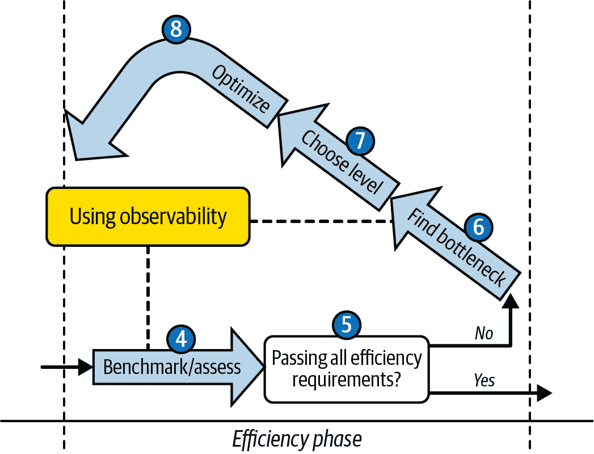
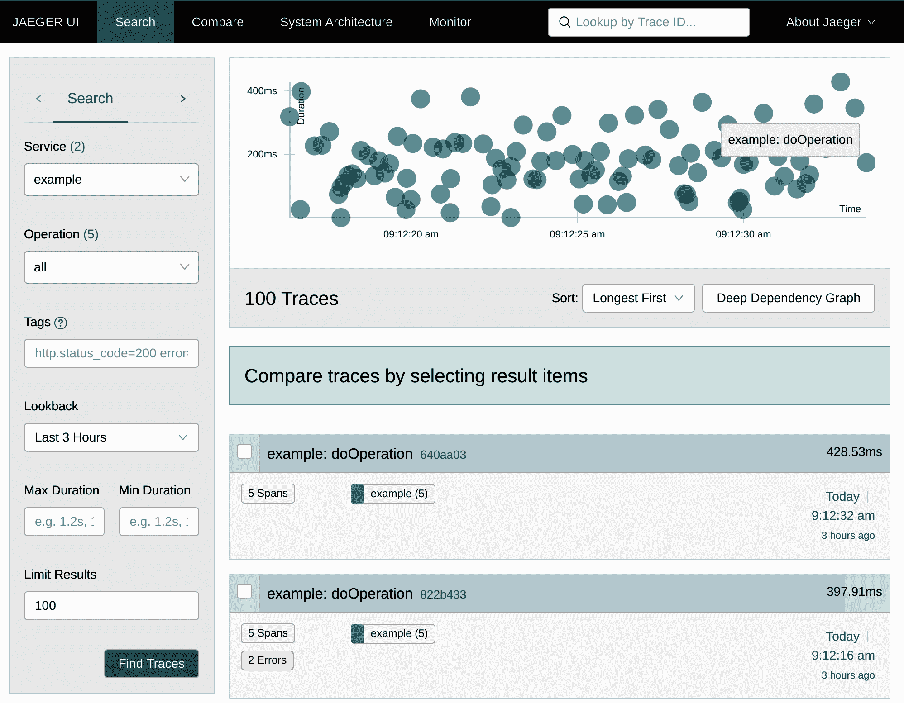
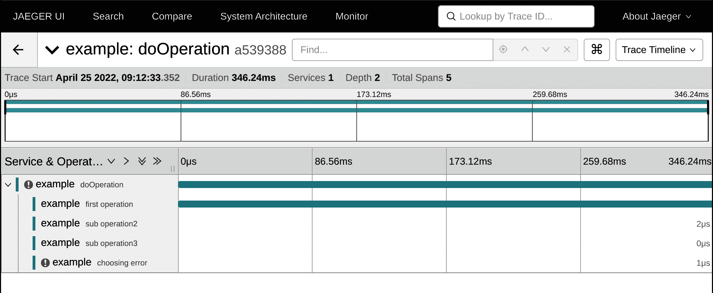
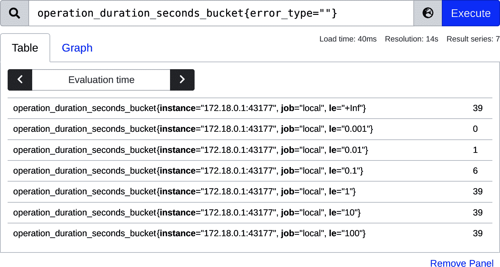
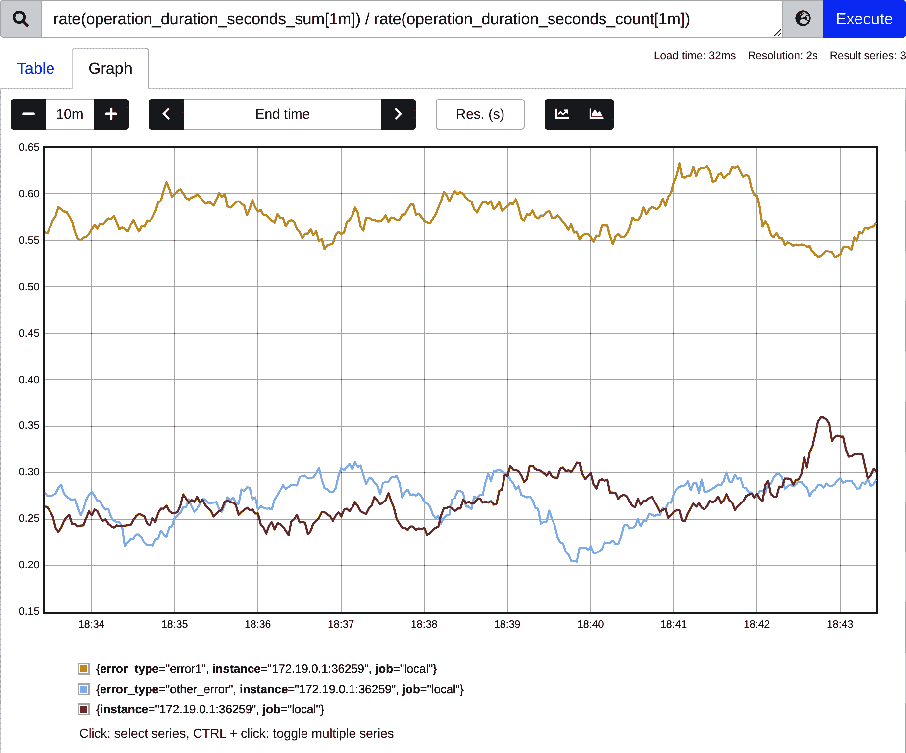
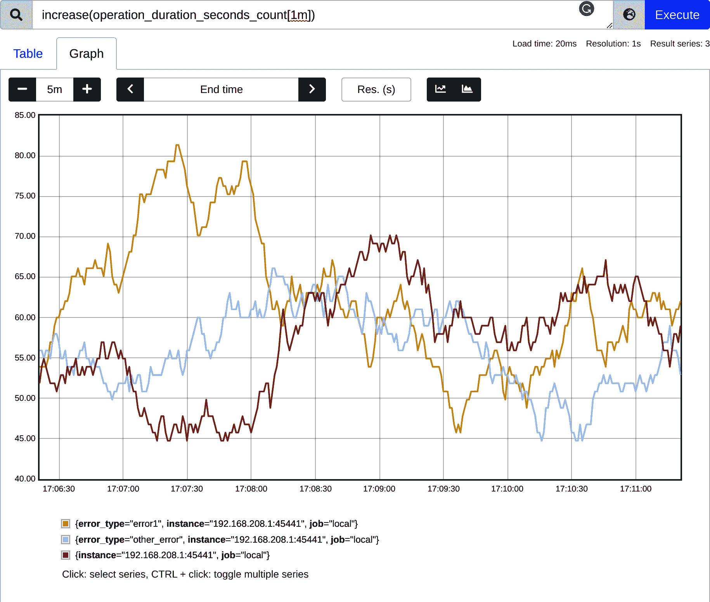
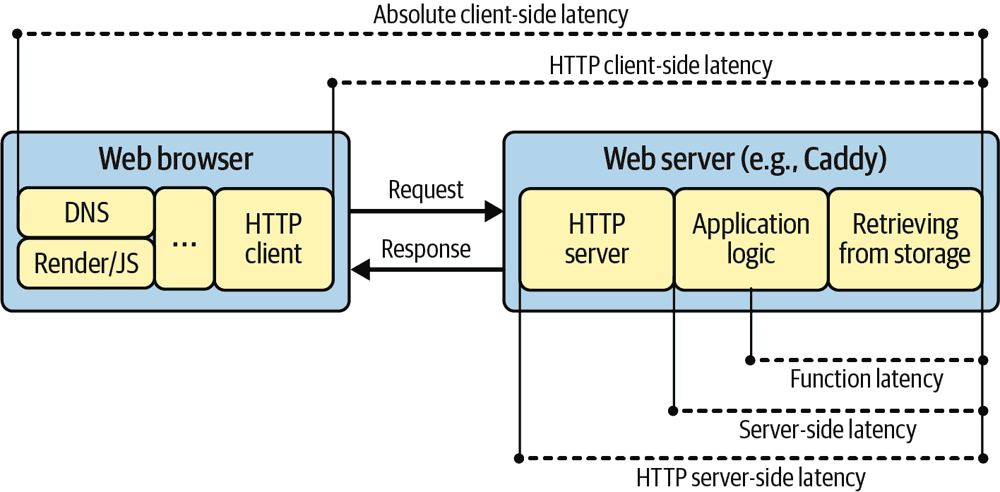
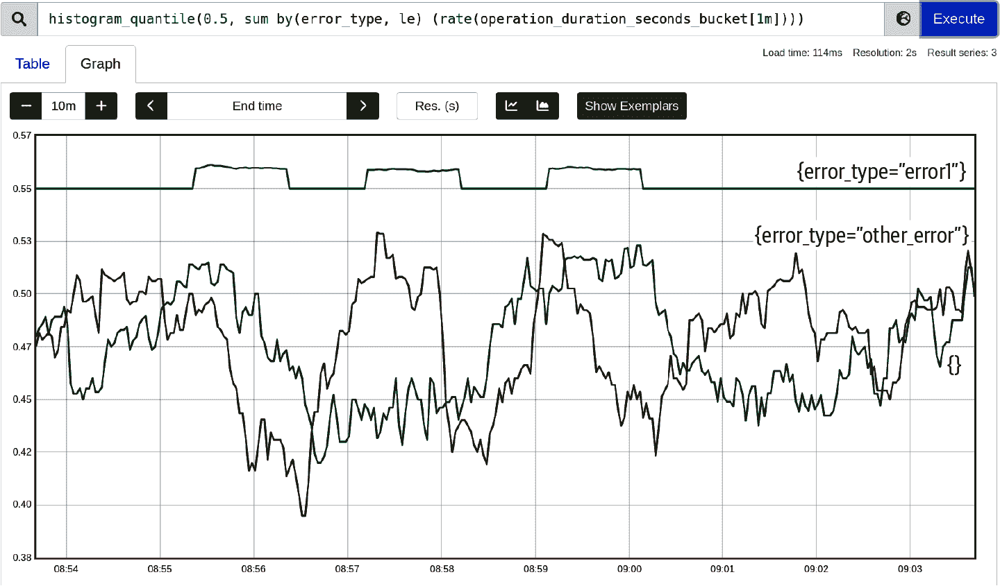
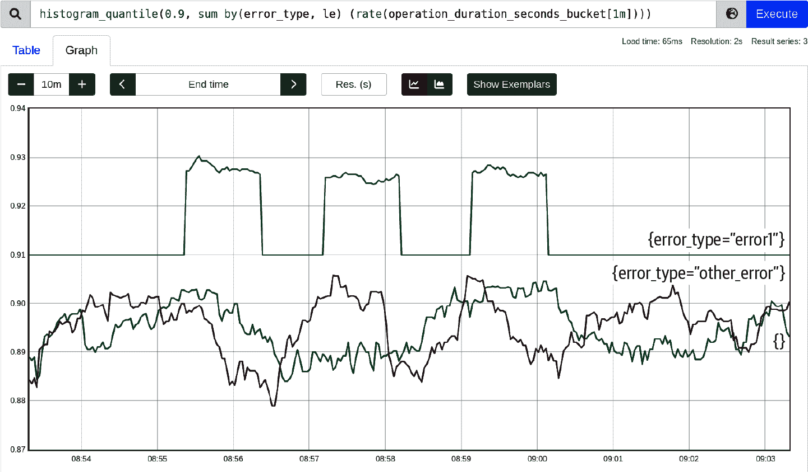
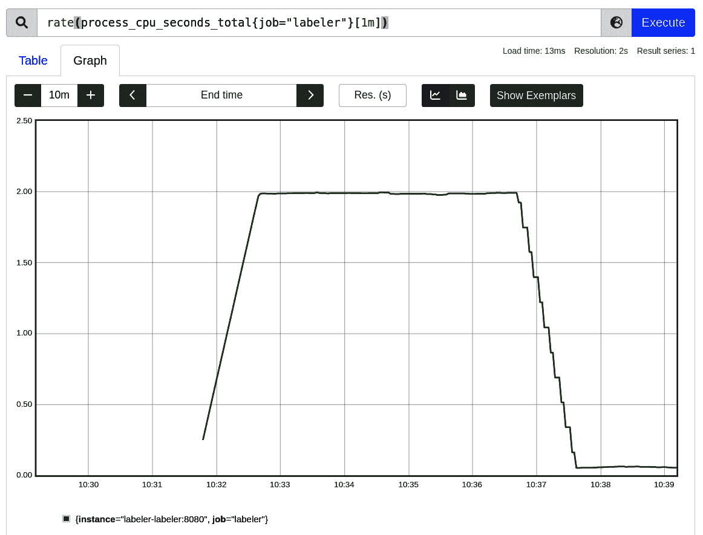

# 第六章：效率可观察性

在“高效开发流程”中，你学会了遵循 TFBO（测试、修复、基准测试和优化）流程，以最小的努力验证和实现所需的效率结果。在效率阶段的元素周围，可观察性起着关键作用，特别是在第 7 和第九章。我们将在图 6-1 中专注于该阶段。



###### 图 6-1。图 3-5 的一部分，重点关注需要良好可观察性的部分

在本章中，我将解释这一流程所需的可观察性和监控工具。首先，我们将了解什么是可观察性以及它解决了什么问题。然后，我们将讨论不同的可观察性信号，通常分为日志、追踪、指标，以及最近的概要。接下来，我们将在“示例：为延迟进行仪器化”中解释前三个信号，以延迟作为我们可能想要测量的效率信息的示例（概要在第九章中解释）。最后但同样重要的是，我们将通过“效率指标语义”详细介绍与程序效率相关的指标的特定语义和来源。

# 你无法改进你不测量的东西！

这句经常被归因于彼得·德鲁克的名言是改善任何事物的关键：业务收入、汽车效率、家庭预算、体脂肪，甚至[幸福](https://oreil.ly/eKiIR)。

特别是当涉及到我们低效软件产生的看不见的浪费时，我们可以说，如果在改变之前和之后不进行评估和测量，优化软件是不可能的。每个决定都必须以数据驱动，因为在这个虚拟空间中，我们的猜测往往是错误的。

毫不拖延，让我们学习如何以最简单的方式来衡量我们软件的效率——这个行业称之为可观察性的概念。

# 可观察性

要控制软件的效率，我们首先需要找到一种结构化和可靠的方法来测量我们的 Go 应用程序的延迟和资源使用情况。关键是尽可能准确地计算这些值，并在最后以易于理解的数值形式呈现出来。这就是为什么对于消耗测量，我们有时（并非总是！）使用“度量信号”，这是被称为可观察性的基本软件（或系统）特征的支柱。

# 可观察性

在云原生基础设施世界中，我们经常谈论我们应用程序的可观察性。不幸的是，可观察性是一个非常负载的词。¹ 它可以总结如下：从外部信号推断系统状态的能力。

当今行业使用的外部信号通常可以大致分为四类：指标、日志、追踪和性能分析。²

可观测性是当今一个重要的话题，因为它在开发和运行软件过程中能帮助我们应对许多情况。可观测性模式使我们能够调试程序的失败或意外行为，找到事故的根本原因，监控健康状况，对未预料到的情况进行警报，执行计费，测量[SLI（服务水平指标）](https://oreil.ly/hsdXJ)，进行分析等等。当然，我们只会专注于可观测性的那些部分，这些部分将帮助我们确保软件的效率与我们的需求相匹配（即 RAERs 在“效率要求应被正式化”中提到的）。那么，什么是可观测性信号？

> +   指标是对时间间隔内数据的数值表示。指标可以利用数学建模和预测的能力，从而推导出系统在当前和未来时间间隔内的行为知识。
> +   
> +   事件日志是一种不可变的、带有时间戳的记录，记录了随时间发生的离散事件。一般来说，事件日志有三种形式，但本质上是相同的：时间戳和一些上下文信息的负载。
> +   
> +   追踪是一个代表一系列因果相关的分布式事件的表示形式，它编码了通过分布式系统的端到端请求流。追踪是日志的一种表示形式；追踪的数据结构几乎与事件日志相似。一个单独的追踪可以提供对请求经过的路径以及请求结构的可见性。
> +   
> Cindy Sridharan，《分布式系统可观测性》（O’Reilly，2018）

一般来说，所有这些信号都可以用来观察我们的 Go 应用程序的延迟和资源消耗，以进行优化。例如，我们可以测量特定操作的延迟，并将其作为指标暴露出来。我们可以将该值编码为日志行或追踪注释（例如，“行李”项）。我们可以通过减去两个日志行的时间戳来计算延迟——操作开始和操作完成的时间戳。我们可以使用追踪跨度来跟踪跨度的延迟（完成的个体工作单元）。

但是，无论我们用什么方式将这些信息传递给我们（通过特定于度量的工具、日志、追踪或概要文件），最终都必须具有度量语义。我们需要将信息推导为数值，以便随时间收集它；进行减法运算；查找最大值、最小值或平均值；以及按维度聚合。我们需要这些信息来进行可视化和分析。我们需要它允许工具在需要时做出反应并提醒我们，可能构建进一步消费它的自动化，并比较其他指标。这就是为什么效率讨论通常会通过度量聚合进行导航的原因：我们应用程序的尾延迟、随时间的最大内存使用等。

正如我们讨论的那样，为了优化任何东西，您必须开始测量它，因此行业已经开发出许多指标和工具来捕获各种资源的使用情况。观察或测量的过程始终从仪器化开始。

# 仪器化

仪器化是向我们的代码添加或启用仪器，以公开我们所需的可观察信号的过程。

仪器化可以采用多种形式：

手动仪器化

我们可以向我们的代码添加几个语句，导入一个生成可观测信号的 Go 模块（例如，[Prometheus 客户端用于度量](https://oreil.ly/AoWkJ)，[go-kit 日志记录器](https://oreil.ly/adTO3)，或者[跟踪库](https://oreil.ly/o7uYH)），并将其连接到我们执行的操作中。当然，这需要修改我们的 Go 代码，但通常会产生更个性化和丰富的信号以及更多的上下文。通常，它代表了[开箱即用](https://oreil.ly/qMjUP)信息，因为我们可以收集针对程序功能定制的信息。

自动仪器化

有时，仪器化意味着安装（和配置）一个工具，该工具可以通过观察外部效果来获取有用信息。例如，服务网格通过观察 HTTP 请求和响应来收集可观察性，或者工具钩入操作系统并通过[cgroups](https://oreil.ly/aCe6S)或[eBPF](https://oreil.ly/QjxV9)收集信息。³ 自动仪器化不需要更改和重新构建代码，并且通常代表了[封闭盒](https://oreil.ly/UO0gK)信息。

此外，基于信息的粒度对仪器化进行分类也很有帮助：

捕获原始事件

此类仪器化将尝试为我们过程中的每个事件提供单独的信息。例如，假设我们想知道我们的进程为所有 HTTP 请求提供了多少次以及发生了什么错误。在这种情况下，我们可以有一个为每个请求提供单独信息的仪器化（例如，作为日志行）。此外，此信息通常包含有关其上下文的一些元数据，例如状态代码、用户 IP、时间戳以及发生错误的进程和代码语句（目标元数据）。

一旦被摄取到某个可观测性后端，这些原始数据在内容上非常丰富，并且理论上允许任何的即席分析。例如，我们可以扫描所有事件以找到错误的平均数或百分位分布（更多内容请参阅“延迟”）。我们可以导航到每个表示单个事件的错误，以便详细检查。不幸的是，这种类型的数据通常是使用、摄取和存储成本最高的数据。我们往往会因此而冒失误的风险，因为可能会错过一个或两个个体事件。在极端情况下，需要复杂的大数据和数据挖掘探索技能和自动化来找到您想要的信息。

捕获聚合信息

我们可以捕获预聚合数据而不是原始事件。由这种仪器化交付的每一条信息都代表一组事件的某些信息。在我们的 HTTP 服务器示例中，我们可以计算成功和失败的请求，并定期传递该信息。在转发此信息之前，我们甚至可以进一步计算代码内的错误比率。值得一提的是，这种类型的信息也需要元数据，以便我们可以总结、进一步聚合、比较和分析这些聚合的信息片段。

预聚合的仪表化迫使 Go 进程或自动仪器化工具承担更多工作，但通常结果更易使用。此外，由于数据量较小，仪表化、信号传递和后端的复杂性更低，从而显著提高了可靠性并降低了成本。在这里也存在一些权衡。我们会丢失一些信息（通常称为基数）。预建的信息决策是事先做出的，并且编码到仪表化中。如果突然有不同的问题需要回答（例如，跨多个进程的单个用户有多少错误），而您的仪器化未设置为预聚合该信息，那么您就需要进行更改，这需要时间和资源。然而，如果您大致知道将来会询问什么，聚合类型的信息就是一个了不起的胜利和更加务实的方法。⁴

最后但同样重要的是，一般而言，我们可以将我们的可观测流程设计成推拉式采集模型：

推送

一个中心化的远程进程系统从您的应用程序（包括您的 Go 程序）中收集可观测信号。

拉取

一个应用程序进程将信号推送到远程集中的可观测性系统的系统。

# 推送与拉取

每种惯例都有其利弊。您可以推送您的度量、日志和跟踪，但也可以从您的进程中拉取所有这些。我们还可以使用混合方法，每种可观测信号使用不同的方法。

推送与拉取方法有时是一个有争议的话题。不仅在可观测性方面，在任何其他架构中都是如此。我们将在“指标”中讨论其利弊，但困难的事实是，两种方式都可以同样良好地扩展，只是使用不同的解决方案、工具和最佳实践。

在学习了这三个类别之后，我们应该准备深入探讨可观测信号。为了测量和传递效率优化的可观测信息，我们无法避免学习更多关于仪器化这三种常见可观测信号——记录、跟踪和指标的内容。在下一节中，让我们做到这一点，同时保持一个实际的目标——测量延迟。

# 示例：为延迟进行仪器化

在本节中，您将学习的所有三种信号都可以用于构建适合我们讨论的三种类别的可观测性。每种信号都可以：

+   可以手动或自动进行仪器化

+   提供汇总信息或原始事件

+   可以从进程中提取（收集，尾部跟踪或抓取）或推送（上传）

然而，每种信号——记录、跟踪或指标——可能在这些工作中更合适或更不合适。在本节中，我们将讨论这些倾向。

学习如何使用可观测信号及其权衡的最佳方法是专注于实际目标。假设我们想要测量代码中特定操作的延迟。如介绍所述，我们需要开始测量延迟以评估其情况，并在每次优化迭代期间决定是否需要进一步优化我们的代码。正如您将在本节中了解到的，我们可以使用任何一种可观测信号来获得延迟结果。关于信息呈现方式、复杂仪器化等细节将帮助您在旅程中理解选择的内容。让我们深入探讨吧！

## 记录

日志可能是了解仪器的最清晰信号。因此，让我们探索一下最基本的仪器，我们可以将其归类为记录以收集延迟测量数据。在 Go 代码中对单个操作进行基本的延迟测量是直接的，这要归功于标准的[`time`包](https://oreil.ly/t9FDr)。无论您是手动操作还是使用标准或第三方库来获取延迟数据，如果它们是用 Go 语言编写的，它们都使用了示例 6-1 中使用`time`包的模式。

##### 示例 6-1\. Go 中手动和最简单的单个操作延迟测量

```go
import (
    "fmt"
    "time"
)

func ExampleLatencySimplest() {
    for i := 0; i < xTimes; i++ {
        start := time.Now() 
        err := doOperation()
        elapsed := time.Since(start) 

        fmt.Printf("%v ns\n", elapsed.Nanoseconds()) 

        // ...
    }
}
```


`time.Now()`从操作系统时钟中捕获当前墙上时间（时钟时间），以`time.Time`形式呈现。请注意`xTime`，示例变量指定所需的运行次数。


在我们的`协作`函数完成后，我们可以使用`time.Since(start)`捕获从`start`到当前时间的时间，该方法返回方便的`time.Duration`。


我们可以利用这样的工具来传递我们的度量样本。例如，我们可以使用`.Nanoseconds()`方法将持续时间以纳秒打印到标准输出。

可以说，示例 6-1 代表了最简单的仪器化和可观测性形式。我们进行延迟测量，并通过将结果打印到标准输出来传递它。鉴于每次操作都将输出一行新数据，示例 6-1 代表了原始事件信息的手动仪器化。

不幸的是，这有点幼稚。首先，正如我们将在“实验的可靠性”中学到的那样，任何单一的测量都可能具有误导性。我们必须捕获更多这样的测量结果，理想情况下是数百或数千次，以供统计目的使用。当我们有一个进程，只有一个我们想要测试或基准测试的功能时，示例 6-1 将打印出我们稍后可以分析的数百个结果。然而，为了简化分析，我们可以尝试预先聚合一些结果。与其记录原始事件，我们可以使用数学平均函数进行预先聚合并输出结果。示例 6-2 展示了将事件聚合成更易于消费结果的修改版本。

##### 示例 6-2\. 仪器化 Go，记录 Go 操作的平均延迟

```go
func ExampleLatencyAggregated() {
    var count, sum int64
    for i := 0; i < xTimes; i++ {
        start := time.Now()
        err := doOperation()
        elapsed := time.Since(start)

        sum += elapsed.Nanoseconds() 
        count++

        // ...
    }

    fmt.Printf("%v ns/op\n", sum/count) 
}
```


而不是打印原始延迟，我们可以收集总和和操作数的数量。


这两个信息片段可用于计算组事件的准确平均值，并呈现给用户，而不是唯一的延迟。例如，一次运行在我的机器上打印了`188324467 ns/op`字符串。

由于我们停止了对原始事件的延迟呈现，示例 6-2 表示了一种手动的、聚合的信息可观测性。这种方法允许我们快速获取所需的信息，而无需复杂（且耗时的）工具分析我们的日志输出。

此示例展示了 Go 基准测试工具如何进行平均延迟计算。我们可以使用带有*_test.go*后缀的文件中的示例 6-3 片段实现与示例 6-2 完全相同的逻辑。

##### 示例 6-3\. 最简单的 Go 基准测试，将测量每次操作的平均延迟

```go
func BenchmarkExampleLatency(b *testing.B) {
    for i := 0; i < b.N; i++ { 
        _ = doOperation()
    }
}
```


在基准测试框架中，带有变量 `N` 的 `for` 循环是必不可少的。它允许 Go 框架尝试不同的 `N` 值来执行足够的测试运行，以满足配置的运行次数或测试持续时间。例如，默认情况下，Go 基准测试运行时间为一秒，这通常对于可靠的输出来说太短了。

当我们使用 `go test` 运行 示例 6-3 时（详细解释见 “Go 基准测试”），它会输出特定的信息。信息的一部分是一个包含运行次数和每次操作的平均纳秒数的结果行。在我的机器上，其中一个运行的输出延迟为 `197999371 ns/op`，这通常与 示例 6-2 的结果相匹配。我们可以说，Go 基准测试是使用日志记录信号进行自动仪器化，用于诸如延迟等的聚合信息。

除了收集整个操作的延迟信息之外，我们还可以从这些测量的不同粒度中获得许多见解。例如，我们可能希望捕获单个操作内几个子操作的延迟。最后，在更复杂的部署中，当我们的 Go 程序是分布式系统的一部分时，正如 “宏基准测试” 中讨论的那样，我们可能有许多进程需要跨系统进行测量。对于这些情况，我们必须使用更复杂的日志记录器，它们会为我们提供更多的元数据和传递日志信号的方法，不仅仅是简单地打印到文件，还可以通过其他方式实现。

我们必须附加到日志信号的信息量会导致一种称为 Go 中的日志记录器模式的模式。日志记录器是一种结构，允许我们以最简单和最可读的方式手动为我们的 Go 应用程序加入日志。日志记录器隐藏了复杂性，比如：

+   日志行的格式化。

+   根据日志级别（例如调试、警告、错误或更多）决定是否记录。

+   将日志行传递到配置的位置，例如输出文件。还可以选择更复杂的基于推送的日志传递方式，可以将日志传送到远程后端，必须支持退避重试、授权、服务发现等功能。

+   添加基于上下文的元数据和时间戳。

Go 标准库非常丰富，包含许多有用的工具，包括日志记录。例如，[`log` 包](https://oreil.ly/JEUjT)包含一个简单的日志记录器。它对许多应用程序都能很好地工作，但也容易出现一些使用上的陷阱。⁵

# 在使用 Go 标准库的日志记录器时请谨慎。

如果你想使用 `log` 包中的标准 Go 日志记录器，有几件事需要记住：

+   不要使用全局的 `log.Default()` 日志记录器，也不要使用 `log.Print` 等函数。迟早会让你后悔。

+   永远不要直接在你的函数和结构中存储或使用`*log.Logger`，特别是当你编写一个库时。⁶ 如果你这样做，用户将被迫使用非常有限的`log`日志记录器，而不是他们自己的日志记录库。相反，使用自定义接口（例如[go-kit 日志记录器](https://oreil.ly/tCs2g)），这样用户可以将他们的日志记录器适配到你在代码中使用的日志记录器。

+   永远不要在主函数之外使用`Fatal`方法。它会引发 panic，这不应该是你的默认错误处理方式。

为了避免意外陷入这些陷阱，在我参与的项目中，我们决定使用第三方流行的[go-kit](https://oreil.ly/ziBdb)⁷日志记录器。go-kit 日志记录器的额外优势是很容易保持一定的结构。结构逻辑对于拥有可靠解析器的自动日志分析与像[OpenSearch](https://oreil.ly/RohpZ)或[Loki](https://oreil.ly/Fw9I3)这样的日志后端非常重要。为了衡量延迟，让我们通过一个日志记录器使用示例来演示，在示例 6-4 中展示了它的输出。我们使用了[`go-kit`模块](https://oreil.ly/vOafG)，但其他库遵循类似的模式。

##### 示例 6-4\. 使用[`go-kit`日志记录器](https://oreil.ly/9uCWi)捕获延迟

```go
import (
    "fmt"
    "time"

    "github.com/go-kit/log"
    "github.com/go-kit/log/level"
)

func ExampleLatencyLog() {
    logger := log.With( 
        log.NewLogfmtLogger(os.Stderr), "ts", log.DefaultTimestampUTC,
    )

    for i := 0; i < xTimes; i++ {
        now := time.Now()
        err := doOperation()
        elapsed := time.Since(now)

        level.Info(logger).Log( 
            "msg", "finished operation",
            "result", err,
            "elapsed", elapsed.String(),
        )

        // ...
    }
}
```


我们初始化了日志记录器。通常，库允许你将日志行输出到文件（例如标准输出或错误），或直接推送到某些集合工具，例如[fluentbit](https://oreil.ly/pUcmX)或[vector](https://oreil.ly/S0aqR)。在这里，我们选择将所有日志输出到标准错误中，并为每行日志附加时间戳。我们还选择以人类可读的方式格式化日志，使用`NewLogfmtLogger`（仍然是结构化的，可以被软件解析，以空格作为分隔符）。


在示例 6-1 中，我们只是简单地打印了延迟数字。在这里，我们为其添加了某些元数据，以便更轻松地在系统中的不同进程和操作中使用该信息。请注意，我们保持了一定的结构。我们传递了偶数个参数，代表键值对。这使得我们的日志行结构化，更易于自动化使用。此外，我们选择了`level.Info`，这意味着如果我们选择了仅错误级别，这行日志将不会被打印出来。

##### 示例 6-5\. 通过示例 6-4 生成的示例输出日志（为了可读性进行了换行）

```go
level=info ts=2022-05-02T11:30:46.531839841Z msg="finished operation" \
result="error other" elapsed=83.62459ms  level=info ts=2022-05-02T11:30:46.868633635Z msg="finished operation" \
result="error other" elapsed=336.769413ms
level=info ts=2022-05-02T11:30:47.194901418Z msg="finished operation" \
result="error first" elapsed=326.242636ms
level=info ts=2022-05-02T11:30:47.51101522Z msg="finished operation" \
result=null elapsed=316.088166ms
level=info ts=2022-05-02T11:30:47.803680146Z msg="finished operation" \
result="error first" elapsed=292.639849ms
```


多亏了日志结构，这对我们来说很容易阅读，而且自动化可以清楚地区分诸如`msg`、`elapsed`、`info`等不同字段，无需昂贵且易出错的模糊解析。

使用记录器进行日志记录可能仍然是手动向我们提供延迟信息的最简单方式。我们可以尾随文件（或者如果我们的 Go 进程在 Docker 中运行，则使用 `docker log`，或者如果我们在 Kubernetes 上部署它，则使用 `kubectl logs`）以读取这些日志行进行进一步分析。还可以设置一个自动化程序，尾随这些文件或直接将它们推送到收集器，添加更多信息。然后可以配置收集器将这些日志行推送到免费和开源的日志后端，如[OpenSearch](https://oreil.ly/RohpZ)、[Loki](https://oreil.ly/Fw9I3)、[Elasticsearch](https://oreil.ly/EUlts)，或者许多付费供应商。因此，您可以将许多进程的日志行保存在一个地方，搜索、可视化、分析它们，或者构建进一步的自动化来处理它们。

日志记录是否适合我们的效率可观测性？是和否。对于“微基准”中解释的微基准，日志记录是我们的主要测量工具，因为它简单。另一方面，在宏观层面，如“宏基准”，我们倾向于使用日志记录作为原始事件类型的可观测性工具，在这样的规模上，分析和保持可靠性变得非常复杂和昂贵。尽管如此，由于日志记录如此普遍，我们可以通过日志记录在更大的系统中找到效率瓶颈。

日志记录工具也在不断发展。例如，许多工具允许我们从日志行中派生指标，比如 Grafana Loki 的[LogQL 中的度量查询](https://oreil.ly/fdoNm)。然而，在实践中，简单性是有代价的。问题之一源于有时日志直接由人类使用，有时由自动化使用（例如，从日志中派生指标或对日志中发现的情况做出反应）。因此，日志通常是非结构化的。即使使用像 示例 6-4 中的 go-kit 这样的出色记录器，日志的结构也是不一致的，这使得解析用于自动化非常困难和昂贵。例如，像示例 6-5 中的延迟测量中存在的不一致单位，对人类来说很好，但几乎不可能将其派生为指标值。像[Google mtail](https://oreil.ly/Q4wAC)这样的解决方案尝试使用自定义解析语言来解决这个问题。然而，复杂性和不断变化的日志结构使得难以使用这个信号来衡量我们代码的效率。

让我们看看下一个可观察信号——追踪，以了解它在哪些领域可以帮助我们实现效率目标。

## 追踪

缺乏一致结构的日志记录导致了追踪信号的出现，以解决部分日志问题。与日志记录相比，追踪是关于系统的结构化信息片段。该结构围绕事务建立，例如请求-响应架构。这意味着诸如状态码、操作结果和操作延迟等内容本地编码，因此更易于被自动化工具使用。作为一种权衡，你需要额外的机制（例如用户界面）以可读的方式向人类公开这些信息。

此外，操作、子操作甚至跨进程调用（例如 RPC）都可以通过上下文传播机制链接在一起，这些机制与标准的网络协议（如 HTTP）良好配合。这感觉就像是我们效率需求中测量延迟的完美选择，对吧？让我们找出答案。

与日志记录一样，你可以选择许多不同的手动仪表化库。对于 Go 语言，流行的开源选择包括[OpenTracing](https://oreil.ly/gJeAV)库（目前已弃用但仍然可用）、[OpenTelemetry](https://oreil.ly/uxKoW)，或来自专用追踪供应商的客户端。不幸的是，在撰写本书时，OpenTelemetry 库具有过于复杂的 API，难以在本书中进行解释，并且它仍在变化，因此我开始了一个名为[tracing-go](https://oreil.ly/rs6fQ)的小项目，将 OpenTelemetry 客户端 SDK 封装成最小的追踪仪器。虽然 tracing-go 是我对最小追踪功能集的解释，但它应该教会你上下文传播和 span 逻辑的基础知识。让我们探索一个使用 tracing-go 进行手动仪表化的示例，以测量在示例 6-6 中使用追踪测量虚拟`doOperation`函数延迟（及更多！）。  

##### 示例 6-6。使用[tracing-go](https://oreil.ly/1027d)捕获操作和潜在子操作的延迟

```go
import (
    "fmt"
    "time"

    "github.com/bwplotka/tracing-go/tracing"
    "github.com/bwplotka/tracing-go/tracing/exporters/otlp"
)

func ExampleLatencyTrace() {
    tracer, cleanFn, err := tracing.NewTracer(otlp.Exporter("<endpoint>")) 
    if err != nil { /* Handle error... */ }
    defer cleanFn()

    for i := 0; i < xTimes; i++ {
        ctx, span := tracer.StartSpan("doOperation") 
        err := doOperationWithCtx(ctx)
        span.End(err) 

        // ...
    }
}

func doOperationWithCtx(ctx context.Context) error {
    _, span := tracing.StartSpan(ctx, "first operation") 
    // ...
    span.End(nil)

    // ...
}
```


和其他一切一样，我们必须初始化我们的库。在我们的例子中，通常意味着创建一个能够发送形成跟踪的 span 的`Tracer`实例。我们将 span 推送到某个收集器，最终传输到追踪后端。这就是为什么我们必须指定某个地址以发送到的原因。在这个例子中，你可以指定收集器的 gRPC `host:port`地址（例如，支持[gRPC OTLP 追踪协议](https://oreil.ly/4IaBd)的[OpenTelemetry 收集器](https://oreil.ly/z0Pjt)端点）。


使用跟踪器，我们可以创建一个初始根 `span`。根表示跨越整个事务的 span。在创建过程中会创建一个`traceID`，用于标识跟踪中的所有 span。每个 span 代表一个个体工作单元。例如，我们可以添加不同的名称，甚至像日志或事件这样的 baggage 项。创建过程还会得到一个 `context.Context` 实例。作为创建的一部分，此 Go 原生上下文接口可用于创建子 span，如果我们的 `doOperation` 函数将执行任何值得检测的子工作单元。


在手动工具中，我们必须告诉跟踪提供程序工作何时完成以及结果如何。在 `tracing-go` 库中，我们可以使用 `end.Stop(<error 或 nil>)`。一旦停止 span，它将记录从开始到结束的延迟，潜在的错误，并标记自身为可以异步发送给 `Tracer`。跟踪导出器实现通常不会立即发送 span，而是将它们缓冲以进行批量推送。`Tracer` 还会检查基于所选采样策略的端点是否可以发送包含某些 span 的跟踪（稍后会详细介绍）。


有了注入的 span 创建器上下文之后，我们可以向其添加子 span。当您希望调试涉及执行一项工作的不同部分和顺序时，这将非常有用。

跟踪中最有价值的部分之一是上下文传播。这就是分布式跟踪与非分布式信号的区别所在。我们在示例中没有反映这一点，但想象一下，如果我们的操作向其他微服务发出网络调用。分布式跟踪允许通过传播 API（例如，使用 HTTP 标头的某种编码）传递各种跟踪信息，如`traceID`或采样。参见关于上下文传播的[相关博客文章](https://oreil.ly/Qz6lF)。为了在 Go 中实现这一点，您必须添加一个具有传播支持的特殊中间件或 HTTP 客户端，例如[OpenTelemetry HTTP 传输](https://oreil.ly/Rvq6i)。

由于其复杂结构，原始跟踪和 span 对人类来说不可读。这就是为什么许多项目和供应商通过提供有效使用跟踪的解决方案来帮助用户。存在像 [Grafana Tempo with Grafana UI](https://oreil.ly/CQ1Aq) 和 [Jaeger](https://oreil.ly/enkG9) 这样的开源解决方案，它们提供良好的用户界面和跟踪收集，以便您观察自己的跟踪。让我们看看我们的跟踪从 Example 6-6 在后者项目中的展示。图 6-2 显示了多跟踪搜索视图，图 6-3 显示了我们的单个 `doOperation` 跟踪的外观。



###### 图 6-2。将一百个操作显示为一百个跟踪，并显示它们的延迟结果



###### 图 6-3。单击一个跟踪以查看其所有 span 和关联数据

工具和用户界面可能各不相同，但通常它们遵循我在本节中解释的相同语义。在图 6-2 中的视图允许我们根据时间戳、持续时间、涉及的服务等搜索跟踪数据。当前的搜索匹配我们的一百个操作，然后在屏幕上列出。它还放置了一个方便的交互式图表，显示其延迟时间，因此我们可以导航到我们想要的操作。一旦点击，图 6-3 中的视图就会呈现出来。在这个视图中，我们可以看到这个操作的多个跨度分布。如果操作涉及多个进程，并且我们使用了网络上下文传播，所有关联的跨度将在此列出。例如，从图 6-3 中，我们可以立即看出第一个操作占用了大部分的延迟时间，并且最后一个操作引入了错误。

所有跟踪的好处使其成为学习系统交互、调试或找出基本效率瓶颈的优秀工具。它还可以用于系统延迟测量的临时验证（例如在我们的 TFBO 流程中评估延迟）。但不幸的是，在实践中，要用于效率或其他需求时，跟踪也有一些需要注意的缺点：

可读性和可维护性

跟踪的优势在于你可以将大量有用的上下文信息整合到你的代码中。在极端情况下，你甚至可以通过查看所有的跟踪和它们发出的跨度来重写整个程序或甚至整个系统。但是，这种手动仪器化有一个问题。所有这些额外的代码行会增加我们现有代码的复杂性，进而降低可读性。我们还需要确保我们的仪器化能够跟随不断变化的代码而更新。

在实践中，跟踪行业倾向于偏好自动仪器化，理论上可以自动添加、维护和隐藏这样的仪器化。像 Envoy（尤其是服务网格技术）这样的代理是成功的自动仪器化跟踪工具的绝佳示例，它们记录了跨进程的 HTTP 调用。但不幸的是，更复杂的自动仪器化并不那么容易。主要问题在于自动化必须连接到一些通用路径，如常见的数据库或库操作、HTTP 请求或系统调用（例如通过 Linux 中的 eBPF 探针）。此外，这些工具通常难以理解你希望在应用程序中捕获的更多信息（例如特定代码变量中客户端的 ID）。除此之外，像 eBPF 这样的工具非常不稳定，并且依赖于内核版本。

# 在抽象层下隐藏仪器化

在手动和完全自动化工具之间存在一个折衷方案。我们可以仅手动对一些常见的 Go 函数和库进行仪器化，这样使用它们的所有代码将隐式（自动地！）保持一致的跟踪。

例如，我们可以为每个 HTTP 或 gRPC 请求向我们的进程添加一个追踪。对于这一目的，已经存在[HTTP 中间件](https://oreil.ly/wZ559)和[gRPC 拦截器](https://oreil.ly/7gXVF)。

成本和可靠性

由设计追踪事件落入可观察性的原始事件类别。这意味着追踪通常比预先聚合的等效方式更昂贵。原因是我们使用追踪发送的大量数据。即使我们对单个操作非常适度地进行仪表化，我们理想情况下也应该有数十个追踪跨度。如今，系统必须支持许多查询每秒（QPS）。在我们的示例中，即使是 100 QPS，我们也会生成超过 1,000 个跨度。每个跨度必须被传送到某个后端以有效使用，并在摄取和存储的两端进行复制。然后，您需要大量的计算能力来分析这些数据，以查找例如跨度或追踪之间的平均延迟。这很容易超过您在没有可观察性的情况下运行系统的价格！

该行业对此有所了解，这就是为什么我们有追踪采样，因此某些决策配置或代码决定传递哪些数据以及忽略哪些数据。例如，您可能希望仅收集失败的操作或操作所花费超过 120 秒的追踪数据。

不幸的是，采样也有其缺点。例如，执行尾部采样是具有挑战性的。⁹ 最后但并非最不重要的是，采样使我们错过了一些数据（类似于分析剖析）。在我们的延迟示例中，这可能意味着我们测量的延迟仅代表发生的所有操作的一部分。有时可能足够，但很容易通过采样得出错误的结论，这可能导致错误的优化决策。

短暂的持续时间

我们将在“延迟”中详细讨论这一点，但在尝试优化持续时间仅为几毫秒或更短的非常快速函数时，追踪将不会提供太多信息。与`time`包类似，跨度本身会引入一些延迟。此外，为许多小操作添加跨度可能会大大增加整体摄取、存储和追踪查询的成本。

这在流式算法中尤为明显，例如分块编码、压缩或迭代器。如果我们执行部分操作，通常我们仍然对某些逻辑所有迭代的延迟感兴趣。我们无法使用追踪来做到这一点，因为我们需要为每次迭代创建微小的跨度。对于这些算法，《Go 语言中的分析剖析》（“Profiling in Go”）提供了最佳的可观察性。

尽管存在一些缺点，跟踪在许多情况下变得非常强大，甚至取代日志记录信号。供应商和项目增加了更多功能，例如，[Tempo 项目的指标生成器](https://oreil.ly/SSLye)，允许从跟踪记录指标（例如，适合我们效率需求的平均或尾部延迟）。毫无疑问，如果您对跟踪感兴趣，[OpenTelemetry](https://oreil.ly/sPiw9)社区将带来令人惊奇的成果。

一个框架的缺点往往是选择不同折衷方案的其他框架的优势。例如，许多跟踪问题源于其自然地表示系统中发生的原始事件（可能触发其他事件）。现在让我们讨论一种处于相反方向的信号——设计用于捕获随时间变化的聚合。

## 指标

指标是旨在观察聚合信息的可观察信号。这种面向聚合的指标工具可能是解决我们效率目标的最实用方式。作为开发人员和 SRE，在我的日常工作中，观察和调试生产工作负载时，指标是我使用最多的工具。此外，指标是[谷歌用于监控的主要信号](https://oreil.ly/x6rNZ)。

示例 6-7 显示了可用于测量延迟的预聚合仪器。此示例使用[Prometheus `client_golang`](https://oreil.ly/1r2zw)。¹⁰

##### 示例 6-7。使用 Prometheus `client_golang`和直方图指标测量`doOperation`的延迟

```go
import (
    "fmt"
    "time"

    "github.com/prometheus/client_golang/prometheus"
    "github.com/prometheus/client_golang/prometheus/promauto"
    "github.com/prometheus/client_golang/prometheus/promhttp"
)

func ExampleLatencyMetric() {
    reg := prometheus.NewRegistry() 
    latencySeconds := promauto.With(reg).

NewHistogramVec(prometheus.HistogramOpts{ 
        Name:    "operation_duration_seconds",
        Help:    "Tracks the latency of operations in seconds.",
        Buckets: []float64{0.001, 0.01, 0.1, 1, 10, 100},
    }, []string{"error_type"}) 

    go func() {
        for i := 0; i < xTimes; i++ {
             now := time.Now()
             err := doOperation()
             elapsed := time.Since(now)

             latencySeconds.WithLabelValues(errorType(err)).
                 Observe(elapsed.Seconds()) 

             // ...
        }
    }()

    err := http.ListenAndServe(
        ":8080",
        promhttp.HandlerFor(reg, promhttp.HandlerOpts{})
    ) 
    // ...
}
```


使用 Prometheus 库始终从创建新的指标注册表开始。¹¹


下一步是使用您想要的指标定义填充注册表。Prometheus 允许几种类型的指标，但是用于效率最佳的典型延迟测量最好是直方图。因此，除了类型之外，还需要帮助和直方图桶。稍后我们将更多地讨论桶和直方图的选择。


作为最后一个参数，我们定义此指标的动态维度。在这里，我建议测量不同类型的错误（或无错误）的延迟。这非常有用，因为很多时候，故障具有其他时间特性。


我们使用浮点数秒精确观察延迟。我们在简化的 goroutine 中运行所有操作，因此我们可以在功能执行时公开度量。`Observe`方法将此类延迟添加到直方图的桶中。请注意，我们观察特定错误的这种延迟。我们也不会随意使用错误字符串——我们会使用自定义的`errorType`函数将其转换为类型。这很重要，因为在维度中控制数值的数量使得我们的度量有价值且廉价。


消费这些度量的默认方式是允许其他进程（例如，[Prometheus 服务器](https://oreil.ly/2Sa3P)）从我们的注册表中拉取当前度量的状态。例如，在这个简化的¹²代码中，我们通过`8080`端口的 HTTP 端点提供这些度量。

Prometheus 数据模型支持四种度量类型，在[Prometheus 文档](https://oreil.ly/mamdO)中有详细描述：计数器、仪表、直方图和摘要。我选择使用更复杂的直方图来观察延迟，而不是计数器或仪表度量有其原因，我在“延迟”中解释了原因。暂时来说，直方图允许我们捕获延迟的分布，这通常是在观察生产系统的效率和可靠性时所需的。这些度量，定义并在示例 6-7 中进行仪表化，将显示在 HTTP 端点上，如示例 6-8 所示。

##### 示例 6-8\. 从示例 6-7 消费时度量输出的样本，通过[OpenMetrics 兼容的 HTTP 端点](https://oreil.ly/aZ6GT)。

```go
# HELP operation_duration_seconds Tracks the latency of operations in seconds.
# TYPE operation_duration_seconds histogram
operation_duration_seconds_bucket{error_type="",le="0.001"} 0  operation_duration_seconds_bucket{error_type="",le="0.01"} 0
operation_duration_seconds_bucket{error_type="",le="0.1"} 1
operation_duration_seconds_bucket{error_type="",le="1"} 2
operation_duration_seconds_bucket{error_type="",le="10"} 2
operation_duration_seconds_bucket{error_type="",le="100"} 2
operation_duration_seconds_bucket{error_type="",le="+Inf"} 2
operation_duration_seconds_sum{error_type=""} 0.278675917  operation_duration_seconds_count{error_type=""} 2
```


每个桶代表了延迟小于或等于`le`指定值的操作数（计数器）。例如，我们可以立即看到我们从进程启动中看到了两次成功操作。第一次比 0.1 秒快，第二次比 1 秒慢但比 0.1 秒快。


每个直方图还捕获了一定数量的观察操作和总结值（在这种情况下是观察延迟的总和）。

如 “可观测性” 所述，每个信号都可以被拉取或推送。然而，Prometheus 生态系统默认使用拉取方法来获取指标。虽然不是简单的拉取。在 Prometheus 生态系统中，我们不像从文件中拉取（尾随）日志跟踪的样本或事件堆积那样。相反，应用程序以 OpenMetrics 格式提供 HTTP 负载（例如 示例 6-8），然后由 Prometheus 服务器或兼容 Prometheus 的系统（例如 Grafana 代理或 OpenTelemetry 收集器）定期获取（抓取）。使用 Prometheus 数据模型，我们抓取关于进程的最新信息。

要使用 Prometheus 和我们在 示例 6-7 中仪表化的 Go 程序，我们必须启动 Prometheus 服务器，并配置目标为 Go 进程服务器的抓取作业。例如，假设我们的代码在 示例 6-7 中运行，我们可以使用 示例 6-9 中显示的一组命令来开始收集指标。

##### 示例 6-9\. 从终端运行 Prometheus 的最简单命令集，开始从 示例 6-7 收集指标

```go
cat << EOF > ./prom.yaml
scrape_configs:
- job_name: "local"
  scrape_interval: "15s"  static_configs:
  - targets: [ "localhost:8080" ]  EOF
prometheus --config.file=./prom.yaml 
```


为了演示目的，我可以将[Prometheus 配置](https://oreil.ly/4cPSa)限制为单个抓取作业。首先要决定的是指定抓取间隔。通常，持续、高效的指标收集间隔约为 15 到 30 秒。


我们还提供一个指向我们精简的 Go 程序示例 示例 6-7 的目标。


Prometheus 只是一个用 Go 编写的单一二进制文件。我们可以通过[多种方式](https://oreil.ly/9CxxD)安装它。在最简单的配置中，我们可以指定一个创建好的配置。启动后，UI 将在 `localhost:9090` 上可用。

在上述设置完成后，我们可以使用 Prometheus API 开始分析数据。最简单的方法是使用 Prometheus 查询语言（PromQL），其文档在[这里](https://oreil.ly/nY6Yi)和[这里](https://oreil.ly/jH3nd)有详细描述。通过如 示例 6-9 中所示的启动 Prometheus 服务器后，我们可以使用 Prometheus UI 查询和展示收集的数据。

例如，图 6-4 显示了简单查询的结果，该查询在时间轴上（从进程启动时刻起）获取了最新的延迟直方图数据（对应我们的 `operation_duration_seconds` 指标，表示成功操作）。这通常与我们在 示例 6-8 中看到的格式相匹配。



###### 图 6-4\. PromQL 查询结果，显示了 Prometheus UI 中所有 `operation_duration_​sec⁠onds_bucket` 指标的简单查询图表化结果

要获取单个操作的平均延迟，我们可以使用某些数学操作，通过 `operation_duration_seconds_sum` 除以 `oper⁠ation_duration_seconds_count` 的速率。我们使用 `rate` 函数确保在许多进程和它们的重启中准确的结果。`rate` 将 Prometheus 计数器转换为每秒速率。¹³ 然后我们可以使用 `/` 来除以这些度量的速率。这种平均查询的结果显示在 图 6-5 中。



###### 图 6-5\. PromQL 查询结果，代表由示例 6-7 仪表化的平均延迟，在 Prometheus UI 中绘制

使用另一个查询，我们可以检查总操作数，甚至更好地检查使用 `increase` 函数在我们的 `operation_duration_​sec⁠onds_count` 计数器上的每分钟速率，如 图 6-6 所示。



###### 图 6-6\. PromQL 查询结果，代表系统中操作每分钟的速率，在 Prometheus UI 中绘制

在 Prometheus 生态系统中，还有许多其他功能、聚合方式和使用度量数据的方法。我们将在后续章节中详细介绍其中一些。

Prometheus 与这种特定的抓取技术的惊人之处在于，拉取度量允许我们的 Go 客户端非常轻量和高效。因此，Go 进程不需要执行以下操作：

+   在内存或磁盘上缓冲数据样本、跨度或日志

+   维护信息（并自动更新！）关于发送潜在数据的位置

+   如果度量后端暂时宕机，实现复杂的缓冲和持久逻辑

+   确保一致的样本推送间隔

+   关于度量负载的认证、授权或 TLS 的任何了解

此外，当以这样的方式拉取数据时，可观察性体验更好：

+   度量用户可以轻松控制从中心位置的抓取间隔、目标、元数据和记录。这使得度量使用更简单、更实用，通常也更经济。

+   更容易预测这种系统的负载，这使得在需要扩展收集管道的情况下更容易做出反应。

+   最后但并非最不重要的，拉取度量允许您可靠地了解应用程序的健康状况（如果我们无法从中抓取度量，那么它很可能是不健康的或宕机）。我们通常也知道度量的最后一个样本是哪个（陈旧度）。¹⁴

就像一切事物一样，都存在一些权衡。每个拉取、尾随或抓取信号都有其缺点。观察力拉取式系统的典型问题包括：

+   从短暂的进程（例如 CLI 和批处理作业）中拉取数据通常更具挑战性。¹⁵

+   并非每个系统架构都允许入口流量。

+   通常更难确保所有信息安全地落入远程位置（例如这种拉取方式不适合审计）。

Prometheus 指标的设计旨在减少缺点并利用拉取模型的优势。我们使用的大多数指标都是计数器，这意味着它们只会增加。这使得 Prometheus 可以跳过进程的几次抓取，但最终在较大的时间窗口内（如几分钟内）仍能准确统计每个指标的数字。

正如之前提到的，最终，指标（作为数值）是我们在评估效率时所需的内容。一切都是关于比较和分析数字。这就是为什么指标的可观察性信号是收集所需信息的一种极好的方式。我们将在“宏基准测试”和“效率根本原因分析”中广泛使用这一信号。它简单、实用，生态系统庞大（几乎可以找到所有类型软件和硬件的指标导出器），成本通常较低，且在人类用户和自动化（例如警报）中都运作良好。

指标的可观察性信号，特别是在 Prometheus 数据模型中，适用于聚合信息的仪表化。我们讨论了其优势，但有些限制和缺点也很重要。所有的缺点都源于一个事实，即我们通常不能将预聚合数据缩小到聚合之前的状态，例如单个事件。对于指标，我们可能知道有多少请求失败，但对于发生的单个错误的确切堆栈跟踪、错误消息等我们是不清楚的。我们通常拥有的最精细的信息是错误类型（例如状态码）。这使得我们能向指标系统提出的问题的范围较小，比起捕获所有原始事件而言。另一个可能被认为是缺点的重要特征是指标的基数必须保持较低。

# 高指标基数

基数表示我们指标的唯一性。例如，想象一下在示例 6-7 中，我们将一个唯一的错误字符串注入，而不是使用`error_type`标签。每个新的标签值都会创建一个可能是短暂的唯一指标。只有一个或少数样本的指标更多代表一个原始事件，而非随时间的聚合。不幸的是，如果用户试图将类似事件的信息推送到设计用于指标的系统（如 Prometheus），这往往是昂贵且缓慢的。

将更多基础数据推送到为指标设计的系统是非常诱人的。这是因为想要从这些类似信号般便宜和可靠的指标中学到更多是很自然的。避免这样做，通过指标预算、记录规则和允许列表重标记来保持低基数。如果希望捕获诸如确切错误消息或系统中单个特定操作的延迟等唯一信息，请切换到基于事件的系统，如日志和追踪！

无论是从日志、追踪、性能分析还是度量信号中收集的信息，我们在前几章已经涉及了一些指标，例如每秒使用的 CPU 核心、堆上分配的内存字节或每个操作使用的居住内存字节。因此，让我们详细讨论其中一些，谈论它们的语义、我们应该如何解释它们、潜在的细粒度以及使用刚学到的信号来举例说明的示例代码。

# 没有可观测的银弹！

指标非常强大。然而，正如您在本章中所学到的，日志和追踪也为我们提供了巨大的机会，通过专门的工具提高效率观测体验，使我们能够从中衍生指标。在本书中，您将看到我使用所有这些工具（以及我们尚未涵盖的性能分析）来提高 Go 程序的效率。

实用系统会捕获适合您用例的每个可观测性信号的足够信息。不太可能构建仅基于指标、仅基于追踪或仅基于性能分析的系统！

# 效率指标的语义

可观测性感觉像是一个广阔而深远的主题，需要多年才能掌握和设置。行业不断发展，创建新解决方案并不总是有帮助的。然而，一旦我们开始为像效率工作这样的具体目标使用可观测性，理解将会更加容易。让我们具体讨论一下哪些可观测性要素对于开始测量我们关心的资源消耗和延迟（例如 CPU 和内存）至关重要。

# 指标作为数字值与指标可观测性信号

在[“指标”](https://wiki.example.org/ch-obs-metrics)中，我们讨论了指标的可观测性信号。在这里，我们讨论了对效率工作有用的特定指标语义。澄清一下，我们可以以各种方式捕获这些具体指标。我们可以使用指标的可观测性信号，但我们也可以从其他信号（如日志、追踪和性能分析）中衍生它们！

每个指标都可以由两个因素定义：

语义

那个数字的含义是什么？我们如何测量？使用什么单位？我们称之为什么？

细粒度

这些信息有多详细？例如，它是每个唯一操作的吗？它是这个操作的结果类型（成功与错误）吗？每个 goroutine 吗？每个进程吗？

测量语义和粒度都严重依赖于仪器设备。本节将重点定义典型度量衡的语义、粒度以及示例仪器，用于追踪我们软件资源消耗和延迟。理解我们将要操作的具体测量是至关重要的，以有效地使用我们将在“基准测试级别”和“Go 中的性能分析”学习的基准和分析工具。在迭代这些语义时，我们将揭示需要注意的常见最佳实践和陷阱。出发吧！

## 延迟

如果我们想提高程序执行特定操作的速度，我们需要测量延迟。延迟意味着操作从开始到成功或失败所需的持续时间。因此，我们在第一眼看起来需要的语义似乎非常简单——我们通常希望“完成软件操作所需的时间量”。我们的度量通常会以*延迟*、*持续时间*或*经过的时间*为名，并使用所需的单位。但魔鬼藏在细节中，正如您将在本节中了解的那样，测量延迟容易出错。

典型延迟测量的首选单位取决于我们所测量的操作类型。如果我们测量非常短的操作，比如压缩延迟或操作系统上下文切换延迟，我们必须关注细粒度的纳秒。在典型现代计算机中，纳秒也是我们可以依赖的最细粒度计时单位。这就是为什么 Go 标准库[`time.Time`](https://oreil.ly/QGCme)和[`time.Duration`](https://oreil.ly/9agLb)结构以纳秒计量时间的原因。

一般来说，软件操作的典型测量几乎总是以毫秒、秒、分钟或小时为单位。这就是为什么通常足以以秒为单位测量延迟，作为浮点值，达到纳秒级粒度。使用秒还有另一个优势：它是一个基本单位。使用基本单位通常是自然和一致的，适用于许多解决方案。¹⁶ 在这里一致性至关重要。如果可以避免，你不希望在系统的一个部分以纳秒为单位测量，另一个部分以秒为单位，再另一个部分以小时为单位。在尝试猜测正确单位或编写单位转换时，很容易因为数据混淆而得出错误的结论。

在“示例：测量延迟的仪器化”中的代码示例中，我们已经提到了许多使用各种可观测信号仪器化延迟的方法。让我们扩展示例 6-1 至示例 6-10，展示确保尽可能可靠地测量延迟的重要细节。

##### 示例 6-10\. 单一操作的手动和最简单的延迟测量，可能会出错，并且需要准备和清除阶段

```go
prepare()

for i := 0; i < xTimes; i++ {
    start := time.Now() 
    err := doOperation()
    elapsed := time.Since(start) 

    // Capture 'elapsed' value using log, trace or metric...

    if err != nil { /* Handle error... */ }
}

tearDown()
```


我们尽可能接近我们的`doOperation`调用的开始时间来捕获`start`时间。这确保在`start`和操作开始之间不会出现意外的延迟，这些延迟可能会误导我们后续对此度量结果的结论。这是有意设计的，应该排除我们必须为测量的操作做的任何潜在准备或设置。让我们明确地将这些作为另一个操作进行测量。这也是为什么你应该避免在`start`和操作调用之间添加任何换行（空行）。结果，下一个程序员（或者经过一段时间的你自己）不会在其中添加任何内容，忘记你添加的仪表化工具。


同样重要的是，我们要尽快使用`time.Since`辅助函数捕获`finish`时间，以便不会捕获到任何不相关的持续时间。例如，类似于排除`prepare()`时间，我们希望排除任何潜在的`close`或`tearDown()`持续时间。此外，如果你是一个高级的 Go 程序员，你的直觉总是在某些函数完成时检查错误。这是至关重要的，但我们应该出于仪表化的目的在捕获延迟之后进行。否则，我们可能会增加未注意到我们的仪表化而在我们测量和`time.Since`之间添加不相关语句的风险。此外，在大多数情况下，你希望确保测量成功和失败操作的延迟，以了解程序正在做什么的完整图片。

# 较短的延迟更难以可靠地测量

测量操作延迟的方法如 示例 6-10 所示，对于在 0.1 微秒（100 纳秒）以下完成的操作效果不佳。这是因为获取系统时钟数字、分配变量以及进一步计算`time.Now()`和`time.Since`函数可能也需要时间，对于这样短的测量来说是相当显著的。¹⁷ 此外，正如我们将在 “实验的可靠性” 中学到的那样，每次测量都存在一定的变化。延迟越短，这种噪音的影响就越大。¹⁸ 这也适用于跟踪跨度测量延迟。

测量非常快速函数的一个解决方案是由 Go 基准测试所使用，正如 示例 6-3 中所展示的，我们通过执行多次操作来估算每次操作的平均延迟。更多详细信息请参见 “微基准测试”。

# 时间是无限的；测量时间的软件结构却不是！

在测量延迟时，我们必须意识到软件中时间或持续时间测量的限制。不同类型可以包含不同范围的数字值，并非所有类型都能包含负数。例如：

+   `time.Time` 只能测量从 1885 年 1 月 1 日¹⁹到 2157 年之间的时间。

+   `time.Duration` 类型可以测量大约在您的“起点”之前 290 年到“起点”之后 290 年之间的时间（以纳秒为单位）。

如果要测量超出这些典型值以外的事物，您需要扩展这些类型或使用自己的类型。最后但同样重要的是，Go 存在 [闰秒问题](https://oreil.ly/MeZ4b) 和操作系统时间偏差的问题。在某些系统上，`time.Duration`（单调时钟）也会在计算机休眠（例如笔记本电脑或虚拟机暂停）时停止，这将导致错误的测量结果，因此请注意这一点。

我们讨论了一些典型的延迟度量语义。现在让我们转向粒度问题。我们可以决定在我们的流程中测量操作 A 或 B 的延迟。我们可以测量一组操作（例如事务）或其单个子操作。我们可以跨多个流程收集此数据，也可以仅查看一个流程，这取决于我们想要实现的目标。

要使其更加复杂，即使我们选择单个操作作为我们测量延迟的粒度，该单个操作也具有许多阶段。在单个进程中，这可以由堆栈跟踪表示，但对于具有某些网络通信的多进程系统，我们可能需要建立额外的边界。

让我们以一些程序作为例子，正如前一章中解释的 Caddy HTTP Web 服务器，通过一个简单的 [REST](https://oreil.ly/SHEor) HTTP 调用来检索 HTML 作为我们的示例操作。如果我们在生产中的云上安装这样一个 Go 程序来为客户端（例如某人的浏览器）提供我们的 REST HTTP 调用，我们应该测量哪些延迟？我们可以测量延迟的示例粒度如图 6-7 中所示的 Figure 6-7。



###### 图 6-7\. 我们可以在与用户的 Web 浏览器通信的 Go Web 服务器程序中测量的示例延迟阶段

我们可以概述五个示例阶段：

绝对（总）客户端端延迟

延迟精确地从用户在浏览器中 URL 输入框中按下回车的时刻开始，直到检索到整个响应，加载内容并且浏览器渲染完毕。

HTTP 客户端端延迟（响应时间）

从客户端开始写入 HTTP 请求的第一个字节，直到客户端接收到响应的所有字节。这不包括客户端之前（例如 DNS 查询）或之后（在浏览器中渲染 HTML 和 JavaScript）发生的任何事情。

HTTP 服务器端延迟

延迟是从服务器接收到客户端的 HTTP 请求的第一个字节，直到服务器完成写入 HTTP 响应的所有字节。如果我们在 Go 中使用 [HTTP 中间件模式](https://oreil.ly/Js0NO) 进行测量，通常是我们正在测量的内容。

服务器端延迟（服务时间）

HTTP 请求解析和响应编码无关的服务器端计算延迟。延迟是从解析 HTTP 请求开始到开始编码和发送 HTTP 响应的时刻。

服务器端函数延迟

单个服务器端函数计算的延迟，从调用开始到函数工作完成并返回参数在调用者函数上下文中。

这些只是我们在 Go 程序或系统中测量延迟时可以使用的许多排列组合之一。我们应该为优化选择哪个？哪个更重要？事实证明，它们每一个都有其用例。我们应该使用哪种延迟度量粒度以及何时取决于我们的目标，如“实验可靠性”中所述的测量准确性，以及我们想要专注的元素，如“基准测试级别”中所讨论的。为了理解整体情况并找出瓶颈，我们必须同时测量几个不同的粒度。正如“根本原因分析，但是效率”中讨论的，像追踪和分析这样的工具可以帮助解决这个问题。

# 无论您选择哪种度量粒度，请理解并记录您所测量的内容！

如果我们从测量中得出错误的结论，就会浪费大量时间。很容易忘记或误解我们正在测量的粒度的哪些部分。例如，您可能认为自己在测量服务器端延迟，但是慢速客户端软件引入了您没有包括在度量中的延迟。因此，您可能试图找出服务器端的瓶颈，而潜在的问题可能在另一个进程中。²⁰ 为了避免这些错误，请理解、记录并明确您的仪器。

在“示例：为延迟进行仪器化”中，我们讨论了如何收集延迟。我们提到了通常在 Go 生态系统中用于效率需要的两种主要测量方法。这两种方式通常是最可靠且最便宜的（在执行负载测试和基准测试时非常有用）。

+   对于单独功能和单一进程测量，使用基本的日志记录“微基准”。

+   例如，示例 6-7 等度量标准适用于涉及多个进程的大型系统的宏观测量。

特别是在第二种情况下，正如前面提到的，我们必须多次测量单个操作的延迟，以获得可靠的效率结论。我们没有每个操作的原始延迟数据——我们必须选择一些聚合方式。在示例 6-2 中，我们提出了一个简单的平均聚合机制在仪表化内部。使用度量仪表化，这将变得非常容易。只需创建两个计数器：一个用于延迟的`sum`和一个用于操作的`count`。我们可以用这两个度量值来计算平均值（算术平均）来评估收集到的数据。

不幸的是，平均值过于简单化了聚合方式。我们可能会错过大量关于我们延迟特性的重要信息。在“微基准”中，我们可以用平均值进行基本统计（这是 Go 基准测试工具在使用的方法），但在衡量我们软件在更复杂系统中的效率时，我们必须谨慎。例如，想象一下，我们想要提高一个操作的延迟，该操作过去大约需要 10 秒。我们使用我们的 TFBO 流程进行了潜在的优化。我们想在宏观层面评估效率。在我们的测试期间，系统在 5 秒内执行了 500 次操作（更快！），但有 50 次操作的延迟非常慢，达到了 40 秒。假设我们坚持使用平均值（8.1 秒）。那么，我们可能会错误地得出结论，认为我们的优化成功了，忽视了我们的优化可能导致的潜在大问题，导致 9%的操作延迟非常慢。

这就是为什么在百分位数中测量特定度量指标（如延迟）非常有帮助。这就是示例 6-7 仪表化的目的，用于我们的延迟测量的度量直方图类型。

> 大多数度量更适合视为分布而不是平均值。例如，对于延迟 SLI [服务水平指标]，一些请求将被快速服务，而其他请求则不可避免地需要更长的时间——有时更长得多。简单的平均值可能会掩盖这些尾延迟以及它们的变化。(...) 使用百分位数指标允许您考虑分布的形状及其不同的属性：高阶百分位数，如第 99 或第 99.9，显示可能的最坏情况值，而使用第 50 百分位数（也称为中位数）强调典型情况。
> 
> C. Jones 等人，[*网站可靠性工程*, “服务级别目标”](https://oreil.ly/rMBW3)（O’Reilly，2016）

我在示例 6-8 中提到的直方图指标非常适合延迟测量，因为它计算了多少操作适合特定的延迟范围。在示例 6-7 中，我选择了指数桶 `0.001, 0.01, 0.1, 1, 10, 100`。（参见²¹）最大的桶应该代表您在系统中预期的最长操作持续时间（例如，超时）。（参见²²）

在“度量”中，我们讨论了如何使用 `PromQL` 这种度量标准。对于直方图类型的度量和我们的延迟语义，理解这一点的最佳方法是使用 `histogram_quantile` 函数。请参阅图 6-8 中的中位数示例输出和图 6-9 中的第 90 分位数示例输出。



###### 图 6-8\. 我们在示例 6-7 中对每种错误类型的操作的五十分位数（中位数）。



###### 图 6-9\. 我们在示例 6-7 中对每种错误类型的操作的延迟的九十分位数。

这两个结果可以为我所测量的程序得出有趣的结论。我们可以观察到几件事情：

+   一半的操作通常快于 590 毫秒，而 90% 的操作快于 1 秒。因此，如果我们的 RAER（“资源感知效率要求”）声明 90% 的操作应在 1 秒内完成，这可能意味着我们不需要进一步优化。

+   失败于 `error_type=error1` 的操作明显较慢（很可能在该代码路径中存在某种瓶颈）。

+   大约在 17:50 UTC，我们可以看到所有操作的延迟略有增加。这可能意味着一些副作用或环境变化导致我的笔记本操作系统为我的测试分配了较少的 CPU。（参见²³）

这种测量和定义的延迟可以帮助我们确定我们的延迟是否足够满足我们的要求，以及我们所做的任何优化是否有帮助。它还可以帮助我们使用不同的基准测试和瓶颈查找策略找到导致速度变慢的部分。我们将在第七章中探讨这些内容。

根据典型的延迟度量定义和示例仪器化，让我们继续移动到我们可能希望在效率旅程中测量的下一个资源：CPU 使用情况。

## CPU 使用情况

在第四章中，您学习了我们在执行 Go 程序时如何使用 CPU。我还解释了我们查看 CPU 使用情况以减少 CPU 驱动的延迟（参见²⁴）和成本，以及在同一台机器上运行更多进程的能力。

各种度量指标允许我们测量程序 CPU 使用的不同部分。例如，借助 Linux 工具如[`proc`文件系统](https://oreil.ly/MJVHl)和[`perf`](https://oreil.ly/QPMD9)，我们可以测量我们的[Go 程序的未命中和命中率，CPU 分支预测命中率](https://oreil.ly/VdENl)以及其他低级别的统计信息。但是，对于基本的 CPU 效率，我们通常关注 CPU 周期、指令或使用时间：

CPU 周期

每个 CPU 核心上执行程序线程指令所使用的总 CPU 时钟周期数。

CPU 指令

我们程序线程在每个 CPU 核心上执行的总 CPU 指令数。在某些来自[RISC 体系结构](https://oreil.ly/ofvB7)的 CPU 上（例如 ARM 处理器），这可能等于周期数，因为一个指令总是需要一个周期（摊销成本）。然而，在 CISC 体系结构（例如 AMD 和 Intel x64 处理器）上，不同的指令可能会使用额外的周期。因此，计算 CPU 必须完成某些程序功能所需的指令数可能更加稳定。

无论是周期还是指令，都非常适合比较不同的算法。这是因为它们的噪声较小，例如：

+   它们不依赖于 CPU 核心在程序运行期间的频率。

+   内存提取的延迟，包括不同的缓存、未命中和 RAM 延迟

CPU 时间

我们的程序线程在每个 CPU 核心上执行的时间（以秒或纳秒为单位）。正如您将在“Off-CPU 时间”中了解到的那样，这段时间与我们程序的延迟不同（更长或更短），因为 CPU 时间不包括 I/O 等待时间和操作系统调度时间。此外，我们程序的 OS 线程可能同时在多个 CPU 核心上执行。有时我们还会使用 CPU 时间除以 CPU 容量，通常称为 CPU 使用率。例如，1.5 秒的 CPU 使用率意味着我们的程序平均需要一个 CPU 核心执行 1 秒，第二个核心执行 0.5 秒。

在 Linux 上，CPU 时间通常分为用户时间和系统时间：

+   用户时间表示程序在用户空间执行 CPU 上的时间。

+   系统时间是 CPU 在内核空间上代表用户执行某些函数的时间，例如像[`read`](https://oreil.ly/xEQuM)这样的系统调用。

通常情况下，在更高级别，比如容器中，我们没有所有三个度量的奢侈条件。我们大多数时候必须依赖 CPU 时间。幸运的是，CPU 时间通常是一个足够好的度量，用来追踪我们的 CPU 执行工作负载所需的情况。在 Linux 上，从进程启动时算起获取当前 CPU 时间的最简单方法是访问 */proc/`<PID>`/stat*（其中`PID`表示进程 ID）。我们在线程级别上也有类似的统计信息，例如 */proc/`<PID>`/tasks/`<TID>`/stat*（其中`TID`表示线程 ID）。这正是像`ps`或`htop`这样的实用程序所使用的。²⁵

`ps`和`htop`工具确实可能是当前测量 CPU 时间的最简单工具。然而，我们通常需要评估我们正在优化的完整功能所需的 CPU 时间。不幸的是，“Go Benchmarks”没有提供每个操作的 CPU 时间（仅延迟和分配）。您可以从`stat`文件中获取该数字，例如，使用[`procfs` Go 库](https://oreil.ly/ZcCDn)以编程方式获取，但我建议另外两种主要方法：

+   CPU 分析，详见“CPU”。

+   Prometheus 指标仪表化。接下来让我们快速看一下这种方法。

在示例 6-7 中，我展示了一个注册自定义延迟指标的 Prometheus 仪器。添加 CPU 时间度量也非常简单，但 Prometheus 的[客户端库](https://oreil.ly/1r2zw)已经为此构建了帮助程序。推荐的方法在示例 6-11 中呈现。

##### 示例 6-11\. 注册有关您的进程用于 Prometheus 的`proc` `stat`仪器信息

```go
import (
    "net/http"

    "github.com/prometheus/client_golang/prometheus"
    "github.com/prometheus/client_golang/prometheus/collectors"
    "github.com/prometheus/client_golang/prometheus/promhttp"
)

func ExampleCPUTimeMetric() {
    reg := prometheus.NewRegistry()
    reg.MustRegister(
        collectors.NewProcessCollector(collectors.ProcessCollectorOpts{}),
    ) 

    go func() {
        for i := 0; i < xTimes; i++ {
             err := doOperation()
             // ...
        }
    }()

    err := http.ListenAndServe(
        ":8080",
        promhttp.HandlerFor(reg, promhttp.HandlerOpts{}),
    )
    // ...
}
```


您唯一需要做的就是使用之前提到的`/proc` `stat`文件注册`collectors.NewProcessCollector`来获取 Prometheus 的 CPU 时间度量。

`collectors.ProcessCollector`提供多个指标，如`pro⁠cess_​open_fds`，`process_max_fds`，`process_start_time_seconds`等等。但我们感兴趣的是`process_cpu_seconds_total`，它是从我们程序开始运行以来使用的 CPU 时间计数器。使用 Prometheus 处理此任务的特别之处在于它周期性地从我们的 Go 程序中收集此指标的值。这意味着我们可以查询 Prometheus 以获取特定时间窗口内的进程 CPU 时间，并将其映射到实时。我们可以使用[`rate`](https://oreil.ly/8BaUw)函数的持续时间来获取 CPU 时间每秒的平均速率。例如，`rate(process_cpu_sec⁠onds_​total{}[5m])`将给出我们的程序在过去五分钟内的平均每秒 CPU 时间。

您将在基于此类度量标准的示例 CPU 时间分析中找到，见“理解结果和观察”。但是，现在，我愿意向您展示一个有趣且常见的情况，即`process_cpu_seconds_total`有助于缩小主要效率问题的范围。想象一下，您的机器只有两个 CPU 核心（或者我们限制我们的程序使用两个 CPU 核心），您运行要评估的功能，然后看到您的 Go 程序的 CPU 时间率看起来像图 6-10。

多亏了这个视图，我们可以知道`labeler`进程正在经历 CPU 饱和状态。这意味着我们的 Go 进程需要比可用的 CPU 时间更多。有两个信号告诉我们 CPU 饱和状态：

+   典型的“健康”CPU 使用是波动的（例如，如本书后面图 8-4 所示）。这是因为典型应用程序不太可能一直使用相同数量的 CPU。然而，在图 6-10 中，我们看到了五分钟内相同的 CPU 使用情况。

+   因此，我们永远不希望我们的 CPU 时间接近 CPU 限制（在我们的情况中是两个）。在图 6-10 中，我们可以清楚地看到 CPU 限制周围的轻微波动，这表明 CPU 完全饱和。



###### 图 6-10\. `labeler` Go 程序的 Prometheus CPU 时间图（我们将在“宏基准”章节中使用）经过一次测试后

知道我们的 CPU 饱和时至关重要。首先，这可能会给人错误的印象，即当前 CPU 时间是进程需要的最大值。此外，这种情况也会显著减慢我们程序的执行时间（增加延迟）或者完全使其停滞。这就是为什么基于 Prometheus 的 CPU 时间指标，正如您在这里学到的那样，对我来说在了解这种饱和情况方面至关重要。这也是在分析程序效率时必须首先找出的事情之一。当发生饱和时，我们必须给该进程更多的 CPU 核心，优化 CPU 使用，或者减少并发性（例如，限制它能够同时处理的 HTTP 请求数量）。

另一方面，CPU 时间让我们了解到可能被阻塞的相反情况。例如，如果你期望 CPU 密集型功能以 5 个 goroutine 运行，并且看到 CPU 时间为 0.5（占一个 CPU 核心的 50%），这可能意味着 goroutine 被阻塞了（关于此更多内容见“Off-CPU 时间”）或整个机器和操作系统都很忙。

现在让我们看一下内存使用指标。

## 内存使用

正如我们在第五章中学到的，关于我们的 Go 程序如何使用内存有各种复杂的层次。这就是为什么实际物理内存（RAM）使用是最棘手的测量之一，并归因于我们的程序。在像虚拟内存、分页和共享页面这样的操作系统内存管理机制上，每个内存使用指标只能是估计。虽然不完美，但这是我们必须处理的，所以让我们简要看一下哪种方法最适合 Go 程序。

我们 Go 进程的内存使用信息主要来自两个来源：Go 运行时堆内存统计和操作系统关于内存页面的信息。让我们从进程内运行时统计开始。

### 运行时堆统计

正如我们在“Go 内存管理”中所学到的，Go 程序虚拟内存的堆段可以作为内存使用的足够代理。这是因为对于典型的 Go 应用程序，大多数字节都分配在堆上。此外，这种内存也从不从 RAM 中逐出（除非启用交换）。因此，我们可以通过查看堆大小有效评估我们功能的内存使用。

我们通常最感兴趣的是评估执行某种操作所需的内存空间或内存块数。为了尝试估计这一点，我们通常使用两种语义：

+   堆上的总字节或对象分配使我们能够查看内存分配，而不经常非确定性 GC 影响。

+   堆上当前正在使用的字节或对象的数量。

先前的统计数据非常准确且快速访问，因为 Go 运行时负责堆管理，所以它跟踪我们需要的所有信息。在 Go 1.16 之前，通过[`runtime.ReadMemStats`函数](https://oreil.ly/AwX75)是以编程方式访问这些统计数据的推荐方式，尽管出于兼容性原因它仍然可用，但不幸的是，它需要 STW（停止世界）事件来收集所有内存统计信息。从 Go 1.16 开始，我们应该全部使用提供有关 GC、内存分配等许多廉价收集见解的[`runtime/metrics`](https://oreil.ly/WYiOd)包。此包的示例用法用于获取内存使用度量在 Example 6-12 中介绍。

##### 示例 6-12。最简单的代码打印总堆分配的字节和当前使用的字节

```go
import(
    "fmt"
    "runtime"
    "runtime/metrics"
)

var memMetrics = []metrics.Sample{
    {Name: "/gc/heap/allocs:bytes"}, 
    {Name: "/memory/classes/heap/objects:bytes"},
}

func printMemRuntimeMetric() {
    runtime.GC() 
    metrics.Read(memMetrics) 

    fmt.Println("Total bytes allocated:", memMetrics[0].Value.Uint64()) 
    fmt.Println("In-use bytes:", memMetrics[1].Value.Uint64())
}
```


要从`runtime/metrics`读取样本，我们必须首先通过引用所需的度量名称来定义它们。不同 Go 版本中可能会有不同（主要是添加的）度量的完整列表，并且您可以在[*pkg.go.dev*](https://oreil.ly/HWGUJ)上查看具有描述的列表。例如，我们可以获取堆中对象的数量。


内存统计在 GC 运行后立即记录，因此我们可以触发 GC 以获取有关堆的最新信息。


`metrics.Read`填充我们样本的值。如果您只关心最新值，可以重用相同的样本切片。


这两个度量都是`uint64`类型，因此我们使用`Uint64()`方法来检索值。

编程访问此信息对于本地调试目的很有用，但在每次优化尝试中并不可持续。这就是为什么在社区中，我们通常看到其他访问这些数据的方式：

+   Go 基准测试，在“Go 基准测试”中解释

+   堆分析，在“堆”中解释

+   Prometheus 度量仪器

要将 `runtime/metric` 注册为 Prometheus 指标，我们可以在 Example 6-11 中添加一行：`reg.MustRegister(collectors.NewGoCollector())`。Go 收集器默认公开各种内存统计信息（参见 [各种内存统计](https://oreil.ly/Ib8D2)）。出于历史原因，这些统计信息映射到 `MemStats` Go 结构体，因此在 Example 6-12 中定义的指标的等价物将是`go_mem⁠stats_​heap_alloc_bytes_total`作为计数器，以及`go_memstats_heap_alloc_bytes`作为当前使用的计量表。我们将在 “Go e2e Framework” 中展示 Go 堆统计的分析。

不幸的是，堆统计仅仅是一个估算值。我们的 Go 程序堆越小，内存效率可能越好。但是，如果你添加一些像使用显式的`mmap`系统调用进行大量的堆外存储器分配或者数千个大堆栈 goroutine 的有意机制，那可能会在你的机器上导致内存溢出，但这在堆统计中并不反映出来。类似地，在 “Go Allocator” 中，我解释了只有堆空间的一部分被分配到物理内存的罕见情况。

尽管有这些不利因素，堆分配仍然是现代 Go 程序中测量内存使用效果最好的方法。

### 操作系统内存页统计

我们可以检查 Linux 操作系统每个线程跟踪的数字，以了解更真实但更复杂的内存使用统计。与 “CPU Usage” 类似，`/proc/*<PID>*/statm` 提供了以页面为单位的内存使用统计。更精确的数字可以从每个内存映射统计中检索，我们可以在 `/proc/*<PID>*/smaps` 中看到这些统计信息（参见 “OS Memory Mapping”）。

这种映射中的每一页可能具有不同的状态。一页可能已经在物理内存上分配，也可能没有。有些页面可能会在多个进程之间共享。有些页面可能在物理内存中分配，并且作为已使用内存进行记账，但被程序标记为“空闲”（参见 “Garbage Collection” 中提到的`MADV_FREE`释放方法）。有些页面甚至可能不会在`smaps`文件中计入，例如，因为它是 [文件系统 Linux 缓存缓冲区的一部分](https://oreil.ly/uchws)。因此，我们对以下指标中观察到的绝对值应持怀疑态度。在许多情况下，操作系统在释放内存时都是懒惰的；例如，程序使用的部分内存被以最佳方式缓存，并且只要有其他程序需要，它们就会立即释放。

我们可以从操作系统获取一些关于我们进程的典型内存使用指标：

VSS

虚拟集大小代表为程序分配的页面数（或字节，取决于仪表）。这些指标并不是很有用，因为大多数虚拟页面从未分配在 RAM 上。

RSS

住宅集大小表示驻留在 RAM 中的页面（或字节）数量。请注意，不同的度量可能以不同的方式考虑这一点；例如，[cgroups 的 RSS 指标](https://oreil.ly/NL5Ab)不包括单独跟踪的文件映射内存。

PSS

比例集大小代表了共享内存页面平均分配给所有用户的内存。

WSS

工作集大小估计了我们程序当前用于执行工作的页面（或字节）数量。它最初由[Brendan Gregg 引入](https://oreil.ly/rWy8D)作为热点，频繁使用的内存——程序的最小内存需求。

思路是，一个程序可能已经分配了 500 GB 的内存，但在几分钟内，可能只使用了 50 MB 来进行某些局部计算。理论上，其余的内存可以安全地转移到磁盘上。

存在许多 WSS 的实现，但我看到最常见的是使用[cadvisor 解释](https://oreil.ly/mXjA3)，利用[cgroup 内存控制器](https://oreil.ly/ovSlH)计算 WSS，计算公式为 RSS（包括文件映射）加上一部分缓存页面（用于磁盘读取或写入），减去`inactive_file`条目——因此一段时间内未被触及的文件映射。它不包括非活动匿名页面，因为典型的操作系统配置无法将匿名页面转移到磁盘上（交换已禁用）。

在实际中，RSS 或 WSS 用于确定我们 Go 程序的内存使用情况。其中一个高度依赖于同一台机器上的其他工作负载，并遵循 RAM 使用扩展到所有可用空间的流程，正如“我们是否有内存问题？”中所述。每个的有用性取决于当前的 Go 版本和提供这些指标的仪器。根据我的经验，使用最新的 Go 版本和 cgroup 指标，RSS 指标往往提供更可靠的结果。²⁶ 不幸的是，无论准确与否，像[Kubernetes 用于触发驱逐（例如，OOM）的系统](https://oreil.ly/lnDkI)中仍然使用 WSS，因此我们应该使用它来评估可能导致 OOM 的内存效率。

鉴于我专注于基础架构 Go 程序，我倾向于使用名为[cadvisor 的度量导出器](https://oreil.ly/RJzKd)，将 cgroup 指标转换为 Prometheus 指标。我将在“Go e2e 框架”中详细解释其使用方法。它允许分析像`container_memory_rss + container_memory_mapped_file`和`container_memory_working_set_bytes`这样的指标，这在社区中是常用的。

# 摘要

现代可观察性提供了一套技术，对我们的效率评估和改进至关重要。然而，一些人认为这种主要设计给 DevOps、SRE 和云原生解决方案使用的可观察性无法适用于开发者用例（过去被称为应用性能监控[APM]）。

我认为同样的工具可以用于开发人员（用于效率和调试之旅）以及系统管理员、运维人员、DevOps 和 SRE，以确保他人交付的程序运行有效。

在本章中，我们讨论了三个最初的可观测性信号：度量、日志和追踪。然后，我们通过 Go 语言示例讲解了这些的仪器化。最后，我解释了我们将在后续章节中使用的延迟、CPU 时间和内存使用量的常见语义。

现在是学习如何利用效率可观测性进行数据驱动决策的时候了。首先，我们将专注于如何模拟我们的程序，以评估不同层次的效率。

¹ 你们中的一些人可能会问为什么我坚持使用“可观测性”这个词，而不提及监控。在我看来，我必须同意我的朋友[Björn Rabenstein](https://oreil.ly/9ado0)的观点，即监控和可观测性之间的差异过于受到营销需求的驱动。有人可能会说，可观测性如今已经变得毫无意义。理论上，监控意味着回答已知的未知问题（已知问题），而可观测性允许了解未知的未知问题（未来可能会遇到的任何问题）。在我看来，监控是可观测性的一个子集。在本书中，我们将保持务实。让我们专注于如何在实践中利用可观测性，而不是使用理论概念。

² 第四个信号，性能分析，最近开始被一些人视为一种可观测信号。这是因为直到最近，行业才意识到持续收集性能分析的价值和必要性。

³ 作为一个最近的例子，我们可以提到这个仓库，通过 eBPF 探针收集信息，并尝试搜索流行的函数或库。

⁴ 在本书中，我试图建立围绕优化和效率的有益流程，这些流程旨在提前获得标准问题。这些聚合信息通常对我们来说已经足够了。

⁵ 鉴于 Go 的兼容性保证，即使社区同意改进它，我们也无法在 Go 2.0 之前进行更改。

⁶ 一个供他人引入的非可执行模块或包。

⁷ 记录日志的 Go 语言库很多。`go-kit` 提供了足够好的 API，能够在我迄今为止帮助的所有 Go 项目中满足我们所有需要的日志记录。这并不意味着 `go-kit` 没有缺陷（例如，很容易忘记必须为键值对逻辑提供偶数个参数）。此外，Go 社区还有一个关于[标准库中的结构化日志（`slog` 包）的提案](https://oreil.ly/qnJ6y)。欢迎使用任何其他库，但请确保它们的 API 简单、可读且有用。同时确保你选择的库不会引入效率问题。

⁸ 这是一种典型模式，允许进程将有用信息打印到标准输出并将日志保留在 `stderr` Linux 文件中。

⁹ 尾部抽样是一种逻辑，延迟决定是否在事务结束时排除或抽样跟踪，例如，仅在我们知道其状态码之后。尾部抽样的问题在于你的工具可能已经假定所有跨度将被抽样。

¹⁰ 我与 Prometheus 团队共同维护这个库。在编写本书时，`client_golang` 是最常用的 Go 语言度量客户端 SDK，[有超过 53,000 个开源项目](https://oreil.ly/UW0fG)使用它。它是免费开源的。

¹¹ 使用全局的 `prometheus.DefaultRegistry` 是一种典型模式。但请不要这样做。我们试图摆脱这种可能会引起许多问题和副作用的模式。

¹² 在进程拆除时，始终检查错误并执行优雅的终止。查看在[Thanos 项目](https://oreil.ly/yvvTM)中的生产级使用，该项目利用[运行 goroutine 辅助程序](https://oreil.ly/sDIwW)。

¹³ 请注意，在 `rate` 类型的度量标准上执行可能会产生不正确的结果。

¹⁴ 相反，对于推送式系统，如果没有看到预期的数据，很难判断是发送方宕机还是发送管道宕机。

¹⁵ 查看我们在[KubeCon EU 2022](https://oreil.ly/TtKwH)的演讲，讨论了这类情况。

¹⁶ 这就是为什么[Prometheus 生态系统建议使用基本单位](https://oreil.ly/oJozb)。

¹⁷ 例如，在我的机器上，`time.Now` 和 `time.Since` 大约需要 50-55 纳秒。

¹⁸ 这就是为什么最好执行数千甚至更多次相同的操作，测量总延迟，并通过操作数进行平均。这就是 Go 基准测试所做的，正如我们将在“Go 基准测试”中学到的。

¹⁹ 你知道这个日期之所以被选中，仅仅是因为[*回到未来第二部*](https://oreil.ly/Oct6X)吗？

²⁰ 根据我的经验，一个显著的例子是测量具有大响应的 REST 服务端延迟或带有流式响应的 HTTP/gRPC 服务端延迟。服务端延迟不仅取决于服务器本身，还取决于网络和客户端多快能够消耗这些字节（并在[TCP 控制流](https://oreil.ly/jcrSF)中写回确认数据包）。

²¹ 现在，如果你想要使用 Prometheus，直方图中的桶的选择是手动的。然而，Prometheus 社区正在研究[稀疏直方图](https://oreil.ly/qFdC1)，这些直方图具有动态的桶数，可以自动调整。

²² 更多关于使用直方图的内容可以在[这里](https://oreil.ly/VrWGe)阅读。

²³ 很有道理。我在测试期间大量使用了我的网络浏览器，这证实了我们将在“实验可靠性”中讨论的知识。

²⁴ 作为提醒，我们可以通过多种方式来改善程序功能的延迟，而不仅仅是通过优化 CPU 使用率。我们可以通过并发执行来提高延迟，通常会增加总 CPU 时间。

²⁵ 还有一个有用的[`procfs` Go library](https://oreil.ly/ZcCDn)，可以通过编程方式检索`stats`文件数据的数字。

²⁶ 其中一个原因是在 cadvisor 中存在的[问题](https://oreil.ly/LKmSA)，其中包括一些仍可回收的内存。
