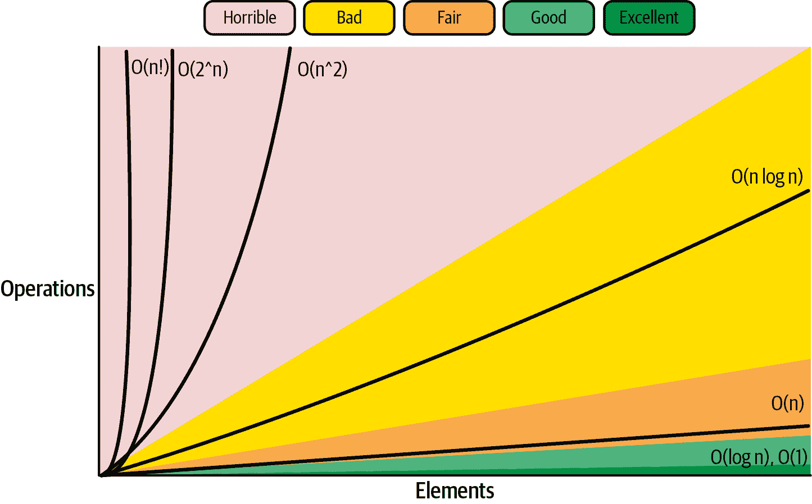
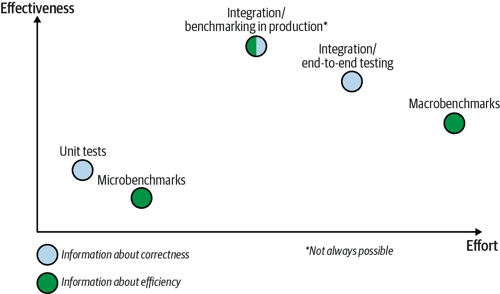

# 第七章 数据驱动的效率评估

在上一章中，你学会了如何使用不同的可观察信号来观察我们的 Go 程序。我们讨论了如何将这些信号转换为数值，或者说指标，以有效地观察和评估程序的延迟和资源消耗。

不幸的是，知道如何测量运行程序的当前或最大消耗或延迟，并不能保证正确评估应用程序的整体效率。我们在这里缺少的是实验部分，这可能是优化中最具挑战性的部分：如何使用第六章提到的可观察工具触发值得测量的情况！

# 测量的定义

我发现“测量”这个动词非常不精确。我看到这个词被过度使用来描述两件事情：执行实验的过程和从中收集数值数据。

在本书中，每当你读到“测量”过程时，我都遵循[计量学（测量科学）](https://oreil.ly/5PRMp)中使用的定义。我确切地指的是使用仪器来量化当前发生的事情（例如事件的延迟，或者所需的内存量）或者在给定时间窗口内发生的事情。导致我们测量的事件（我们在基准测试中模拟的或自然发生的）是一个单独的话题，在本章中进行讨论。

在本章中，我将介绍实验和测量效率的艺术。我将主要关注数据驱动的评估，通常称为基准测试。在我们跳到第八章编写基准测试代码之前，这章将帮助你理解最佳实践。这些实践在第九章中同样非常重要，该章重点讨论性能分析。

我们首先从复杂性分析开始，这是一种较少依赖经验的评估解决方案效率的方式。然后，我将解释《基准测试的艺术》中的基准测试。我们将其与功能测试进行比较，并澄清一个普遍的成见：“基准测试总是虚假的”。

后续在“实验的可靠性”中，我们将讨论实验的可靠性，无论是基准测试还是性能分析。我将提供基本规则，以避免因收集糟糕数据而浪费时间（或金钱），并做出错误的结论。

最后，在“基准测试水平”中，我将向您介绍完整的基准测试策略。在前几章中，我已经使用基准测试来提供解释 CPU 或内存资源行为的数据。例如，在“一致的工具”中，我提到 Go 工具提供了一个标准的基准测试框架。但是，我想在本章教给您的基准测试技能超越此框架，它只是在“微基准测试”中讨论的众多工具之一。有许多不同的方法来评估我们 Go 代码的效率。了解何时使用何种方法至关重要。

让我们从介绍基准测试以及这些测试的关键方面开始。

# 复杂性分析

我们并非总能拥有指导我们通过某种解决方案效率的经验数据的奢侈。你对更好的系统或算法的想法可能尚未实施，并且在我们进行基准测试之前，需要大量的努力才能实现它。此外，我提到了在“定义 RAER 的示例”中对复杂性估计的需求。

这可能与我们在“优化挑战”中学到的内容相矛盾（“程序员在估计确切资源消耗时声名狼藉”），但有时工程师依赖理论分析来评估程序。一个例子是当我们在算法级别评估优化时（来自“优化设计级别”）。开发人员和科学家经常使用复杂性分析来比较并决定哪种算法可能更适合解决某些带有特定约束条件的问题。更具体地说，他们使用渐近符号（通常称为“大 O”复杂性）。很可能，您已经听说过它们，因为它们在任何软件工程面试中都经常被询问。

然而，要完全理解渐近符号，您必须了解“估算”效率复杂性意味着什么，以及它是什么样子！

## “估算”效率复杂性

我在“资源感知效率要求”中提到，我们可以将 CPU 时间或任何资源的消耗表示为与特定输入参数相关的数学函数。通常，我们谈论*运行时*复杂性，它告诉我们使用特定代码和环境执行某个操作所需的 CPU 时间。然而，我们还有*空间*复杂性，它可以描述执行该操作所需的内存、磁盘空间或其他空间需求。

例如，让我们以我们的`Sum`函数为例，来自示例 4-1。我可以证明这样的代码具有估算的空间复杂性（表示堆分配），其函数如下，其中 *N* 是输入文件中的整数数量：

<math><mrow><mi>s</mi> <mi>p</mi> <mi>a</mi> <mi>c</mi> <mi>e</mi> <mo>(</mo> <mi>N</mi> <mo>)</mo> <mo>=</mo> <mo>(</mo> <mn>848</mn> <mo>+</mo> <mn>3</mn> <mo>.</mo> <mn>6</mn> <mo>*</mo> <mi>N</mi> <mo>)</mo> <mo>+</mo> <mo>(</mo> <mn>24</mn> <mo>+</mo> <mn>24</mn> <mo>*</mo> <mi>N</mi> <mo>)</mo> <mo>+</mo> <mo>(</mo> <mn>2</mn> <mo>.</mo> <mn>8</mn> <mo>*</mo> <mi>N</mi> <mo>)</mo> <mi>b</mi> <mi>y</mi> <mi>t</mi> <mi>e</mi> <mi>s</mi> <mo>=</mo> <mn>872</mn> <mo>+</mo> <mn>30</mn> <mo>.</mo> <mn>4</mn> <mo>*</mo> <mi>N</mi> <mi>b</mi> <mi>y</mi> <mi>t</mi> <mi>e</mi> <mi>s</mi></mrow></math>

知道详细的复杂性很重要，但通常找到真正的复杂性函数是不可能或很困难的，因为涉及的变量太多。然而，我们可以尝试估计这些变量，特别是对于像内存分配这样更确定的资源，可以通过简化变量来进行。例如，前述方程只是一个估算，采用了一个仅有一个参数——整数的数量。当然，这个代码还取决于整数的大小，但我假设整数约为 3.6 字节长（这是从我的测试输入统计得出的数据）。

# “估计”复杂性

正如我在这本书中试图教给你的那样——在措辞上要准确。

我这些年来一直误以为复杂性总是指大 O 渐近复杂性，其实[复杂性也存在](https://oreil.ly/LG5qb)，在某些情况下非常有用。至少我们应该意识到它的存在！

不幸的是，很容易将其与渐近复杂性混淆，因此我建议称关注常数的那种为“估计”复杂性。

我是如何找到这个复杂性方程的？这并不是一件简单的事情。我不得不分析源代码，进行一些栈逃逸分析，运行多个基准测试，并使用性能分析（你将在本章和下两章学到的所有内容）来发现这些复杂性。

# 这只是一个例子！

别担心。要评估或优化您的代码，您不需要进行如此详细的复杂性分析，特别是这么详细的分析。我这样做是为了表明这是可能的，并且可以得到什么结果，但是还有更多务实的方法可以快速评估效率并找出下一个优化点。您将在第十章中看到示例流程。

搞笑的是，在 TFBO 流程的末端，当你大幅优化程序的某一部分时，你可能对问题空间有了详细的认识，以至于你能够迅速找到这样的复杂性。然而，对你代码的每个版本都这样做则是浪费的。

解释收集复杂性并将其映射到源代码的过程可能很有用，如例子 7-1 所示。

##### 例 7-1\. 例子 4-1 的复杂性分析

```go
func Sum(fileName string) (ret int64, _ error) {
   b, err := os.ReadFile(fileName) 
   if err != nil {
      return 0, err
   }

   for _, line := range bytes.Split(b, []byte("\n")) { 
      num, err := strconv.ParseInt(string(line), 10, 64) 
      if err != nil {
         return 0, err
      }

      ret += num
   }

   return ret, nil
}
```


我们可以将复杂方程中的 848 + 3.6 * *N*部分与将文件内容读入内存的操作相关联。我使用的测试输入非常稳定——整数的位数不同，但平均有 2.6 位数字。每行添加一个新行（`\n`）字符意味着每行大约有 3.6 字节。由于`ReadFile`返回的是包含输入文件内容的字节数组，因此我们可以说我们的程序对于由`b`切片指向的字节数组需要确切的 3.6 * *N*字节。848 字节的常量来自于在`os.ReadFile`函数中分配的各种对象，例如为`b`切片分配的切片值（24 字节），这些逃逸出堆。通过空文件进行基准测试并进行分析即可发现这个常量。


正如您将在第十章中了解的那样，`bytes.Split`在分配和运行时延迟方面都相当昂贵。然而，我们可以将大部分分配归因于此部分，因此复杂度的 24 + 24 * *N*部分。这是“主要”部分，因为它是最大的常量（24）乘以输入大小。原因是为了返回[`[][]byte`](https://oreil.ly/Be0OF)数据结构而进行的分配。虽然我们不会复制底层字节数组（我们与从`os.ReadFile`中共享缓冲区），但是为分配的空的`[]byte`切片总共需要 24 * *N*的堆，再加上`[][]byte`切片头部的 24 字节。如果*N*数量级为十亿级别，这将是一个巨大的分配（22GB 用于十亿个整数）。


最后，正如我们在“数值、指针和内存块”中学到的，并且正如我们将在“优化 runtime.slicebytetostring”中揭示的那样，我们在这一行上也有很多分配。一开始并不明显，但`string(line)`所需的内存（始终是副本）正在逃逸到堆中。¹ 这是复杂度中 2.8 * *N*的一部分，因为我们平均会为 2.6 位数字进行 N 次此类转换。剩下的 0.2 * *N*的来源是未知的。²

希望通过这个分析，你能明白复杂度的含义。也许你已经看到这种知识的有用性。也许你已经看到了许多我们将在第十章中尝试的优化机会！

## 渐进复杂度与大 O 符号

渐近复杂度忽略了实现的开销，特别是硬件或环境方面的。相反，它专注于渐近数学分析：运行时间或空间需求与输入大小的增长速度。这允许基于可伸缩性对算法进行分类，这通常对于研究复杂问题的算法的研究者非常重要（这些问题通常需要大量输入）。例如，在 图 7-1 中，我们看到了典型函数的简要概述，并对算法的典型复杂度进行了评论。请注意，这里的“坏”复杂度并不意味着没有更好的算法——有些问题无法以更快的方式解决。



###### 图 7-1. 来自 [*https://www.bigocheatsheet.com*](https://www.bigocheatsheet.com) 的大 O 复杂度图表。阴影表示通常问题的效率评估。

我们通常使用大 O 符号来表示渐近复杂度。据我所知，唐纳德·克努斯在他 1976 年的文章中尝试清晰地定义了三个符号（O, Ω, Θ）(3)。

> 口头上，O(f(n)) 可以理解为“最多为 f(n) 的阶数”；Ω(f(n)) 可以理解为“至少为 f(n) 的阶数”；Θ(f(n)) 可以理解为“正好为 f(n) 的阶数”。
> 
> 唐纳德·克努斯，《“大欧米伽、大欧米伽和大 Theta”》（https://oreil.ly/yeFpW）

短语“按照 f(*N*) 的顺序”意味着我们对精确的复杂度数字不感兴趣，而更关注近似值：

上界（O）

大 Oh 意味着该函数的渐近复杂度不能比 `f(n)` 更差。有时也用于反映最坏情况，如果其他输入特征重要（例如，在排序问题中，我们通常讨论元素的数量，但有时输入已经排序也很重要）。

紧密界限（Θ）

大 O 记号代表确切的渐近函数，有时也代表平均典型情况。

下界（Ω）

大 Omega 意味着该函数的渐近复杂度不能比 `f(n)` 更好。有时也代表最佳情况。

例如，[快速排序](https://oreil.ly/a2jhF) 排序算法根据输入的排序方式和选择的枢轴点，最佳和平均运行时间复杂度为 *N* * log*N*，因此 *Ω*(*N* * log*N*) 和 *Θ*(*N* * log*N*)，尽管最坏情况是 *O*(*N*²)。

# 行业并非总是正确使用大 O 符号。

一般来说，在面试、讨论和教程中，您会看到人们使用大 Oh（*O*）来描述典型情况下应使用大 Theta（*Θ*）。例如，我们经常说快速排序是 *O*(*N* * log*N*)，这并不正确，但在许多情况下，我们会接受这个答案。也许人们试图通过简化这个话题来使其更易理解。我将在这里尽量更准确，但您始终可以用 *Θ* 替换 *O*（但不能反过来）。

对于我们在 示例 4-1 中的算法，渐近空间复杂度是线性的：

<math><mrow><mi>s</mi> <mi>p</mi> <mi>a</mi> <mi>c</mi> <mi>e</mi> <mo>(</mo> <mi>N</mi> <mo>)</mo> <mo>=</mo> <mn>872</mn> <mo>+</mo> <mn>30</mn> <mo>.</mo> <mn>4</mn> <mo>*</mo> <mi>N</mi> <mi>b</mi> <mi>y</mi> <mi>t</mi> <mi>e</mi> <mi>s</mi> <mo>=</mo> <mi>Θ</mi> <mo>(</mo> <mn>1</mn> <mo>)</mo> <mo>+</mo> <mi>Θ</mi> <mo>(</mo> <mi>N</mi> <mo>)</mo> <mi>b</mi> <mi>y</mi> <mi>t</mi> <mi>e</mi> <mi>s</mi> <mo>=</mo> <mi>Θ</mi> <mo>(</mo> <mi>N</mi> <mo>)</mo> <mi>b</mi> <mi>y</mi> <mi>t</mi> <mi>e</mi> <mi>s</mi></mrow></math>

在渐近分析中，像 1、872 和 30.2 这样的常数并不重要，尽管在实践中，如果我们的代码分配了 1 MB（*Θ*(*N*)）或 30.4 MB，这可能会有所影响。

请注意，我们不需要精确的复杂度来找出渐近复杂度。这就是问题的关键：精确的复杂度取决于太多变量，特别是当涉及运行时间复杂度时。通常，我们可以根据算法伪代码或描述来学习找到理论上的渐近复杂度。这需要一些实践，但是想象一下，如果我们没有实现 示例 7-1，而是设计了一个算法。例如，文件中所有整数的朴素求和算法可以描述如下：

1.  我们将文件内容读入内存，其渐近空间复杂度为 *Θ*(*N*)，其中 *N* 是整数或行数的数量。由于我们读取了 N 行，这也具有 *Θ*(*N*) 的运行时间复杂度。

1.  我们将内容分割成子切片。如果我们原地执行，这意味着 *Θ*(*N*)。否则，从理论上讲，它是 *Θ*(1)。这是一个有趣的案例，正如我们在精确复杂度中看到的那样，尽管在原地执行，开销为 24 * *N*，这表明 *Θ*(*N*)。在这两种情况下，运行时间复杂度都是 *Θ*(*N*)，因为我们必须遍历所有行。

1.  对于每个子切片（空间复杂度 *Θ*(1) 和运行时间 *Θ*(*N*)）：

    1.  我们解析整数。从技术上讲，这不需要额外的堆空间，假设整数可以保留在堆栈上。如果我们关联到行数和数字限制在范围内，其运行时间也应该是 *Θ*(1)。

    1.  我们将解析的值添加到一个包含部分和的临时变量中：*Θ*(1) 的运行时间和 *Θ*(1) 的空间。

通过这样的分析，我们可以得出空间复杂度为 *Θ*(*N*) + *Θ*(1) + *Θ*(*N*) * *Θ*(1)，因此为 *Θ*(*N*)。我在第二步还提到了运行时间复杂度，合并后为 *Θ*(*N*) + *Θ*(*N*) + *Θ*(*N*) * *Θ*(1)，因此也是线性的 *Θ*(*N*)。

一般来说，这样一个`Sum`算法在渐进上是相当容易评估的，但在许多情况下并不是微不足道的。这需要一些实践和经验。如果有自动工具能够检测到这样的复杂性，我会感到非常高兴。过去有一些有趣的[尝试](https://oreil.ly/0h9ff)，但实际上它们的代价太高了。⁴也许有一种方法可以实现某种算法来评估伪代码的复杂性，但这现在是我们的工作！

## 应用实例

坦率地说，我一直对“复杂性”这个话题持怀疑态度。也许我在大学时错过了关于它的讲座，⁵但每当有人让我确定某个算法的复杂性时，我总是感到失望。我相信这只是在技术面试中用来捉弄候选人的伎俩，在实际软件开发中几乎没有任何用处。

第一个问题是不精确——当人们问我要确定复杂性时，他们指的是大 O 符号的渐进复杂性。此外，在付费工作期间，如果我通常可以使用线性算法而不是哈希映射在数组中搜索元素，代码仍然足够快吗？此外，更有经验的开发人员因为我的复杂的链表与更好的插入复杂性可能只是一个更简单的数组带有`appends`而拒绝我的合并请求。最后，我了解了所有那些因隐藏常数成本或其他注意事项而在实践中未使用的具有令人难以置信的渐进复杂性的快速算法。⁶

我认为我的大部分挫败感来源于对行业刻板印象和简化的误解和误用。我特别惊讶的是，[不少工程师](https://oreil.ly/1yxqH)竟然愿意进行这种“估算”复杂性。也许我们常常因为估计超越渐进复杂性的困难而感到失落或不知所措。对我来说，阅读旧的编程书籍是一种启发——它们在大多数优化示例中都使用了这两种复杂性！

> 程序的主`for`循环执行了`N-1`次，并包含一个内部循环，内部循环本身执行了`N`次；因此，程序所需的总时间将受到与`N²`成比例的项的主导。观察到片段 A1 的帕斯卡运行时间约为 47.0N² 微秒。
> 
> 乔恩·路易斯·本特利，《编写高效程序》

当您尝试评估或优化需要更高效率的算法和代码时，了解其预估复杂性和渐进复杂性是有实际价值的。让我们看一些使用案例。

### 如果您了解精确的复杂性，您无需测量即可知道预期的资源需求

在实践中，我们很少从一开始就有精确的复杂度，但想象一下有人给我们这样的复杂度。这在像容量规划这样需要了解在各种负载（例如不同输入）下运行系统成本的任务中是一个巨大的胜利。

例如，示例 7-1 中`Sum`的朴素实现使用了多少内存？事实证明，即使没有任何基准测试，我也可以使用 872 + 30.4 * *N* 字节的空间复杂度来告诉，例如：

+   对于一百万个整数，我的代码将需要 30,400,872 字节，即 30.4 MB，如果我们使用[1,000 倍数，而不是 1,024](https://oreil.ly/SYcm8)。⁷

+   对于两百万个整数，它将需要 60.8 MB。

如果我们执行快速微基准测试（别担心，我会在这里和第八章中解释如何进行基准测试），结果将呈现在示例 7-2 中。

##### 示例 4-1 的基准分配结果分别具有一百万个元素和两百万个元素的输入。

```go
name (alloc/op)    Sum1M        Sum2M
Sum                30.4MB ± 0%  60.8MB ± 0%

name (alloc/op)    Sum1M        Sum2M
Sum                800k ± 0%    1600k ± 0%
```

基于这两个结果，我们的空间复杂度相当准确。⁸

你不太可能总是能找到完整、准确的实际复杂度。但通常对此复杂度进行非常高水平的估计就足够了，例如，`Sum` 函数在示例 7-1 中的空间复杂度为 30 * *N* 字节足够详细。

### 它告诉我们代码是否存在任何简单的优化方法。

有时候，我们不需要详细的经验数据就能知道我们存在效率问题。⁹这很棒，因为这些技术可以告诉我们优化我们程序的难易程度。在我们进入重型基准测试之前，了解这样一个快速的效率评估对我来说是非常重要的。

例如，当我在示例 4-1 中编写`Sum`的朴素实现时，我预计会编写一个具有*Θ*(*N*)空间复杂度（渐近）的算法。然而，我预计它的实际复杂度大约是 3.5 * *N*，因为我将整个文件内容读入了内存。只有当我运行像示例 7-2 这样的基准测试后，我才意识到我的朴素实现是多么糟糕，内存使用几乎比预期多了 10 倍（30.5 MB）。这种对实际复杂度的预期估计与实际结果之间的差异通常是我们需要改进效率时的一个很好的指示。

其次，如果我的算法空间复杂度为线性，对于如此简单的功能来说已经是一个坏迹象。我的算法将为大量输入使用极大量的内存。根据要求，这可能没问题，或者如果我们希望扩展这个应用程序，这可能意味着真正的问题。¹⁰如果现在不是问题，应该承认和记录最大预期输入大小，因为这可能对将来使用此函数的人来说会有所惊讶！

最后，假设测量结果完全偏离算法预期的复杂性。这可能表明存在[内存泄漏](https://oreil.ly/ZNB5s)，如果你有正确的工具（正如我们将在“不泄露资源”中讨论的那样），通常很容易修复。

# 三个明确表明我们在浪费内存空间的迹象

+   理论空间复杂度（渐进和估计）与使用基准测试测量得到的实际空间复杂度之间的差异可以立即告诉你是否有意外情况。

+   与用户（或调用者）输入相关的显著空间复杂度是一个坏迹象，可能意味着未来可能存在的可扩展性问题。

+   如果程序使用的总内存随时间不断增长而且从不减少，很可能表明存在内存泄漏问题。

### 它帮助我们评估作为优化算法的更好想法

复杂性优化的另一个惊人用例是快速评估算法优化而不实现它们。对于我们的`Sum`示例，我们不需要极端的算法技能来知道我们不需要在内存中缓冲整个文件。如果我们想节省内存，我们应该能够有一个用于解析目的的小缓冲区。让我们描述一个改进的算法：

1.  我们打开输入文件而不读取任何内容。

1.  我们创建了一个 4 KB 的缓冲区，因此我们至少需要 4 KB 的内存，这仍然是一个恒定的量（*Θ*(1)）。

1.  我们以 4 KB 的块读取文件。对于每个块：

    1.  我们解析数字。

    1.  我们将其添加到临时部分和。

理论上，这样改进的算法应该给出约 4 KB 的空间复杂度，因此*O*(1)。因此，我们的示例 4-1 对 100 万个整数可以使用少 7,800 倍的空间！因此，我们可以在不实现的情况下说，算法级别的这种优化将非常有益，并且你将在“优化内存使用”中看到其效果。

进行这种复杂性分析可以快速评估你的改进想法，而不需要完整的 TFBO 循环！

# 有时候更糟糕也是更好的！

如果我们决定使用更好的渐进或理论复杂性来实现算法，请不要忘记使用基准代码级别进行评估！在设计算法时，我们通常会优化渐进复杂性，但在编写代码时，我们优化这种渐进复杂性的常数。

如果没有良好的测量，你可能会按照大 O 复杂度实现一个好算法，但由于代码效率低下，做效率优化而不是改进！

### 它告诉我们瓶颈在哪里，算法的哪个部分是关键的。

最后，特别是当映射到源代码中，详细的空间复杂度如 示例 7-1 ，是确定效率瓶颈的绝佳方式。我们可以看到，常数 24 是其中最大的，它来自于 `bytes.Split` 函数，我们将在 第十章 中首先进行优化。然而，在实践中，性能分析可以更快地产生数据驱动的结果，因此我们将在 第九章 中重点关注这种方法。

总结一下，对复杂性的广泛知识以及将基本测量与理论渐近结合起来的能力教会了我，复杂性可能是有用的。如果正确使用，它可以是更理论效率评估的优秀工具。然而，正如你所见，真正的价值在于我们将经验测量与理论结合起来时。记住这一点，让我们更深入地了解基准测试！

# 基准测试的艺术

在 TFBO 流程中评估效率是至关重要的，如图 3-5 中的第 4 步 Figure 3-5 所示。通过研究、静态分析和 Big O 表示法对运行时复杂度的算法级别进行效率评估通常是一个复杂的问题，有多种实现方式。

通过进行理论分析和估计代码效率，我们可以评估很多内容。然而，在许多情况下，最可靠的方法是亲自动手，运行一些代码并看看实际情况。正如我们在 “优化挑战” 中所学到的，我们不擅长估算我们代码的资源消耗，因此经验评估允许我们在评估中减少猜测的数量。¹¹ 理想情况下，我们什么都不假设，并使用专门测试过程验证效率，这些测试专注于效率而不是正确性。我们称这些测试为 *基准测试* 。

# 基准测试与压力和负载测试

对于基准测试有许多替代名称，如压力测试、性能测试和负载测试。然而，它们通常指的是同样的内容，为保持一致性，本书中将统一使用基准测试这一术语。

一般来说，基准测试是我们软件或系统的有效效率评估方法。抽象地说，基准测试的过程由四个核心部分组成，我们将其逻辑描述为一个简单函数：

<math><mrow><mi>B</mi> <mi>e</mi> <mi>n</mi> <mi>c</mi> <mi>h</mi> <mi>m</mi> <mi>a</mi> <mi>r</mi> <mi>k</mi> <mo>=</mo> <mi>N</mi> <mo>*</mo> <mo>(</mo> <mi>E</mi> <mi>x</mi> <mi>p</mi> <mi>e</mi> <mi>r</mi> <mi>i</mi> <mi>m</mi> <mi>e</mi> <mi>n</mi> <mi>t</mi> <mo>+</mo> <mi>M</mi> <mi>e</mi> <mi>a</mi> <mi>s</mi> <mi>u</mi> <mi>r</mi> <mi>e</mi> <mi>m</mi> <mi>e</mi> <mi>n</mi> <mi>t</mi> <mi>s</mi> <mo>)</mo> <mo>+</mo> <mi>C</mi> <mi>o</mi> <mi>m</mi> <mi>p</mi> <mi>a</mi> <mi>r</mi> <mi>i</mi> <mi>s</mi> <mi>o</mi> <mi>n</mi></mrow></math>

在任何基准测试的核心是实验和测量周期：

实验

模拟软件特定功能以了解其效率行为的行为。我们可以将实验范围限定到单个 Go 函数或 Go 结构，甚至是复杂的分布式系统。例如，如果您的团队开发 Web 服务器，这可能意味着启动 Web 服务器并执行具有真实数据的单个 HTTP 请求，用户可能会使用这些数据。

测量

在第六章中，我们讨论了如何准确测量延迟和各种资源的消耗。在整个实验过程中可靠地观察我们的软件是至关重要的，以便在实验结束时得出有意义的结论。以我们的 Web 服务器为例，这可能意味着测量不同层次上操作的延迟（例如客户端和服务器的延迟），以及我们的 Web 服务器的内存消耗。

我们基准测试过程中独特的部分是，实验和测量周期必须执行*N*次，并在最后进行比较阶段。

测试迭代次数（N）

*N*是我们必须执行的测试迭代次数，以在结果方面建立足够的信心。运行的确切次数取决于许多因素，我们将在“实验的可靠性”中讨论这些因素。一般来说，我们需要在更高的信心和成本或等待时间之间取得平衡，以避免过多的迭代次数。

比较

最后，在基准测试的定义中，我们有[比较方面](https://oreil.ly/kzNR3)，这使我们能够了解我们的软件效率的提升、阻碍以及与期望（RAER）的距离。

在许多方面，您可能会注意到基准测试与我们进行的验证正确性的测试（后文称为功能测试）相似。因此，许多测试实践也适用于基准测试。接下来让我们来看看这一点。

## 与功能测试比较

与我们熟悉的某些东西进行比较是学习的最佳方式之一。因此，让我们比较基准测试和功能测试。在方法论或实践方面是否有什么可以重用的东西？在本章中，您将了解到功能测试和基准测试之间可以共享许多内容。例如，有一些相似的方面：

+   为形成测试用例的最佳实践（例如，[边缘案例](https://oreil.ly/Sw9qB)）、[表驱动测试](https://oreil.ly/Q3bXD)和回归测试

+   将测试分割成[unit, integration, e2e](https://oreil.ly/tvaMk)，并在生产中进行测试（更多信息请参见“基准测试级别”）

+   连续测试的自动化

不幸的是，我们也必须意识到重大差异。通过基准：

我们必须有不同的[测试用例和测试数据](https://oreil.ly/me3cM)。

这可能很诱人，但我们不能重复使用与用于正确性测试的单元或集成测试相同的测试数据（输入参数、潜在伪造、数据库中的测试数据等）。这是因为目标不同。在正确性测试中，我们倾向于从功能角度考虑不同的[边缘案例](https://oreil.ly/Sw9qB)（例如，故障模式）。而在效率测试中，边缘案例通常专注于触发不同的效率问题（例如，大请求与许多小请求）。我们将在“重现生产”中讨论这些内容。

> 对于大多数系统而言，程序员应当监控输入数据以符合程序将在生产中遇到的数据。请注意，通常的测试数据通常不符合此要求：虽然测试数据被选择以执行代码的所有部分，但是分析[和基准]数据应被选择为其“典型性”。
> 
> 乔恩·路易斯·本特利，《编写高效程序》

拥抱性能非确定性

现代软件和硬件由复杂优化层组成。这可能导致在执行基准测试时出现非确定性条件的变化，这可能意味着结果也将是不确定的。我们将在“实验的可靠性”中进一步扩展，但这就是为什么我们通常重复测试迭代周期数百次，甚至成千上万次（我们的*N*组件），以增加对我们观察的信心。这里的主要目标是确定我们的基准测试有多重复。如果方差过高，我们知道我们不能信任结果，必须降低方差。这就是为什么我们在基准测试中依赖统计数据的原因，这确实很有帮助，但也很容易误导他人和自己。

> 可重复性：确保在所有配置上进行基准测试相同操作，并且度量在多次测试运行中可重复。经验法则是变异率高达 5%通常是可以接受的。
> 
> 鲍勃·克兰布里特，《谎言、该死的谎言和基准测试：什么构成一个良好的性能度量》

编写和运行起来更加昂贵

正如您可以想象的那样，我们需要执行的迭代次数增加了运行成本和基准测试的复杂性，包括计算成本和开发人员用于创建这些基准测试和等待的时间。但与正确性测试相比，这并不是唯一的额外成本。为了触发效率问题，特别是对于大型系统的负载测试，我们必须耗尽不同系统的容量，这意味着仅仅为了测试而购买大量的计算能力。

这就是为什么我们必须专注于实用的优化过程，只关心必要的效率。还有一些方法可以通过使用战术性的、隔离功能的微基准测试，而避免使用全面的宏基准测试，正如在“基准测试水平”中讨论的那样。

期望不那么具体

正确性测试总是以一些断言结束。例如，在 Go 测试中，我们检查函数的结果是否具有预期值。如果不是，我们使用`t.Error`或`t.Fail`来指示测试应该失败（或者使用一行代码，例如[`testutil.Ok`](https://oreil.ly/ncVhq)或[`testutil.Equals`](https://oreil.ly/uH1F5)）。

如果我们在进行基准测试时也能做到同样就太棒了——断言延迟和资源消耗是否未超过 RAER。不幸的是，在微基准测试的结尾并不能简单地执行`if maxMemoryConsumption < 200 * 1024 * 1024`。结果的高变异性，难以将延迟和资源消耗隔离到我们测试的单个功能中，以及其他在“实验可靠性”中提到的问题，使得自动化断言过程变得困难。通常情况下，必须依靠人工或非常复杂的异常检测或断言软件来判断结果是否可接受。希望在未来会看到更多使这一过程变得更加简便的工具。

为了增加难度，我们可能会对更大的 API 和功能性引入 RAER。但是，如果 RAER 说整个 HTTP 请求的延迟应低于 20 秒，这对于涉及此请求的单个 Go 函数（成千上万个函数中的一个）意味着什么？我们在使用该函数的微基准测试中应该期待多少延迟？这个问题没有一个确切的答案。

# 我们更关注相对结果而不是绝对数字！

在基准测试中，我们通常不断言绝对值。相反，我们专注于将结果与某些基准（例如，在我们代码更改之前的先前基准）进行比较。通过这种方式，我们可以知道是否改进或对单个组件的效率产生了负面影响，而不必关注整体情况。这通常足够在单元微基准测试级别上使用。

解释了基准测试的基本概念之后，让我们在下一节中解决其中的一个悬而未决问题——将基准测试与谎言联系在一起的刻板印象。不幸的是，对于这种关系，存在[充分的理由](https://oreil.ly/yotxL)。让我们深入探讨一下，看看我们如何判断我们或他人进行的基准测试是否可信。

## 基准测试会说谎

有一个扩展到一个[著名短语](https://oreil.ly/xULP5)的说法指出，我们可以按从最好到最差的顺序排列以下词语：“谎言、该死的谎言和基准测试”。

> 对性能的兴趣并未被计算机供应商忽视。几乎每个供应商都宣传其产品更快或者“性价比更高”。所有这些性能营销都引发了一个问题：“这些竞争对手怎么都声称自己是最快的呢？”事实上，计算机性能是一个复杂的现象，谁最快完全取决于用来得出特定简化结论的具体方法。
> 
> 亚历山大·卡尔顿，[“谎言、该死的谎言和基准测试”](https://oreil.ly/WClsq)

在基准测试中作弊确实很普遍。在竞争激烈的市场中，基准测试的效率结果具有重要意义。用户面对太多选择，所以简化比较到一个简单的问题，“哪个是最快的解决方案？”或“哪一个最具可伸缩性？”是决策者的共同做法。因此，基准测试演变成了[一个被欺骗的游戏化系统](https://oreil.ly/4NAVh)。事实上，效率评估非常复杂且昂贵，因此误导性结论很容易逃脱追究。有很多公司、供应商和个人在基准测试中撒谎。¹² 然而，需要强调的是，并非所有情况都是有意或者恶意的。在大多数情况下，作者并非故意报告误导性结果。对于人类大脑来说，被[统计谬误](https://oreil.ly/jPxnA)和悖论误导是再正常不过的了。

# 基准测试不会说谎；我们只是误解了结果！

有很多种方式会导致我们从基准测试中得出错误的结论。如果无意中发生，后果可能很严重——通常会造成大量时间和金钱的浪费。如果是有意为之……好吧，谎言终究难以长久。

我们可能会因为人为错误、在与我们及我们问题无关的条件下进行的基准测试，或者简单的统计误差而被基准测试误导。基准测试结果本身并不会说谎；我们可能只是在测量错误的东西！

解决方法是成为那些基准测试的审慎消费者或开发者，并学习数据科学的基础知识。我们将在“实验的可靠性”中讨论常见的错误和解决方案。

为了克服基准测试中自然发生的一些偏见，行业经常提出一些标准和认证。例如，为了确保公平的燃油经济效率评估，[美国所有轻型车辆都要求由美国环境保护署（EPA）进行燃油经济结果测试](https://oreil.ly/gKOc2)。类似地，在欧洲，为了应对汽车制造商测试和实际情况之间的 40%差距，[欧盟采用了全球统一轻型车辆测试循环和程序](https://oreil.ly/LPUXj)。对于硬件和软件，许多独立组织设计了特定要求的一致基准测试。[SPEC](https://oreil.ly/tkV6O)和[Percona HammerDB](https://oreil.ly/ngRKu)是众多例子中的两个。

要克服谎言和诚实错误，我们必须专注于理解什么因素使基准测试不可靠，以及我们可以做些什么来提高质量。这是解释我们将在第八章讨论的许多基准实践的基础知识。让我们在下一节中做这件事。

# 实验的可靠性

TFBO 周期需要时间。无论我们在哪个级别评估和优化效率，都需要花费大量时间来实施基准测试、执行它们、解释结果、查找瓶颈并尝试新的优化。如果我们的所有或部分努力由于不可靠的评估而被浪费，这是令人沮丧的。

正如在解释基准测试谎言时提到的那样，有许多原因会导致基准测试误导我们。有一组常见的挑战值得我们注意。

# 瓶颈分析也是如此！

在本章中，我们可能会讨论基准测试，因此实验主要允许我们衡量我们的效率（延迟或资源消耗），但类似的可靠性问题也适用于围绕效率的其他实验或测量。例如，我们对 Go 程序进行剖析以找出瓶颈，详细讨论在第九章。

我们可以概述基准测试可靠性面临的三个常见挑战：人为错误、我们的实验与生产环境的相关性，以及现代计算机的非确定性效率。我们将在接下来的几节中详细讨论这些问题。

## 人为错误

优化和基准测试例程，正如今天的情况所示，涉及开发人员大量的手动工作。我们需要运行具有不同算法和代码的实验，同时关注再现生产和性能的非确定性。由于手动性质，这容易出现人为错误。

很容易迷失在我们已经尝试过的优化、为调试目的添加的代码和需要保存的内容之间。同样，很容易混淆代码版本与基准测试结果归属以及您已经证明错误的假设。

我们的许多基准测试问题往往是由于粗心和缺乏组织引起的。不幸的是，我也犯了许多这些错误！例如，当我以为我在基准测试优化 X 时，我在看到基准测试结果没有显著差异后就放弃了它。几个小时后，我才注意到我测试了错误的代码，而优化 X 是有帮助的！

幸运的是，有一些方法可以减少这些风险：

保持简单。

尽可能用最小的迭代次数进行与效率相关的代码更改。如果你试图同时优化代码的多个元素，很可能会混淆你的基准测试结果。你可能会忽略其中一个优化会限制你感兴趣的方面的效率。

同样地，尝试将复杂的部分隔离为可以单独优化和分析的较小部分（分而治之）。

知道你正在进行基准测试的软件版本。

这可能微不足道，但值得重复——使用[软件版本控制](https://oreil.ly/P0eoP)！如果你尝试不同的优化，将它们分别提交并分布在不同的分支中，这样你就可以在需要时回到以前的版本。不要因为忘记在一天结束时提交你的工作而丧失你的优化努力。¹³

这也意味着你必须严格控制刚刚基准测试过的代码版本。即使是对看似无关的语句进行小小的重排，也可能影响代码的效率，因此请始终在原子迭代中基准测试你的程序。这也包括你的代码所需的所有依赖项，例如在你的*go.mod*文件中列出的依赖。

知道你正在使用的基准测试版本。

此外，记得对基准测试本身的代码进行版本控制！避免比较不同基准测试实现的结果，即使变更很小（增加额外的检查）。

编写脚本来执行这些基准测试，并对它们进行相同的配置和版本控制，这也是不迷失的好方法。在第八章中，我提到了一些关于以声明方式共享基准测试选项的最佳实践，以便你将来自己和团队的其他成员使用。

保持你的工作组织良好和结构化。

记录笔记，设计自己的一致工作流程，并明确你试验的代码版本。跟踪依赖版本，并以一致的方式明确跟踪所有基准测试结果。最后，清楚地与他人沟通你的发现。

你的代码在不同的代码尝试中也应该保持干净。保持所有最佳实践，如[DRY](https://oreil.ly/S887r)，不要保留注释掉的代码，隔离测试之间的状态等。

对“看似太好而不可信”的基准测试结果保持怀疑态度。

如果您无法解释为什么您的代码突然运行更快或者使用更少的资源，那么您肯定在基准测试时做错了什么。很诱人地庆祝，接受它并继续前进，而不进行双重检查是不明智的。

检查常见问题，例如您的基准测试用例是否触发错误而不是成功运行（见“为正确性测试您的基准！”）或者编译器是否优化了您的微基准测试（见“编译器优化与基准测试”）。

在我们的工作中稍微有些懒散是健康的。¹⁴ 然而，在错误的时刻懒惰可能会显著增加未知因素和风险，使程序效率优化变得更加困难。

现在让我们看看可靠基准测试的第二个关键元素，即相关性。

## 复制生产环境

这可能是显而易见的，但我们并不是为了在我们的开发机器上运行得更快或者消耗更少的资源而优化软件。我们优化的目的是确保软件在对我们业务重要的目标地点上具有足够高效的执行能力，也就是所谓的*生产*。

生产环境可能意味着您部署的生产服务器环境（如果您构建后端应用程序），或者客户设备，如 PC、笔记本电脑或智能手机（如果您构建面向最终用户的应用程序）。因此，通过增强其相关性来显著提高所有基准的效率评估的质量是完全可行的。我们可以通过尽力模拟（复制）生产的情况和环境条件来实现这一点。特别是：

生产条件

生产环境的特性。例如，生产机器将为我们的程序专门分配多少 RAM 和何种类型的 CPU？它使用哪个操作系统版本？我们的程序将使用哪些版本和类型的依赖关系？

生产工作负载

我们的程序将处理的数据以及必须处理的用户流量的行为。

或许我们应该首先做的是围绕软件目标目的地收集需求，最好以书面形式记录在我们的 RAER 中。如果没有它，我们无法正确评估我们软件的效率。同样，如果您看到供应商或独立实体完成的基准测试，请检查基准条件是否与您的生产和要求相匹配。通常情况下，它们并不匹配，为了完全信任它，我们应该尝试在我们这边复制这样的基准测试。

假设我们大致知道我们软件的目标生产环境是什么样的，我们可以开始设计我们的基准流程、测试数据和用例。坏消息是，在我们的开发或测试环境中，完全复制生产的每一个方面是不可能的。总会存在差异和未知因素。生产环境将会有很多不同的原因：

+   即使我们运行与生产环境相同类型和版本的操作系统，也无法复制操作系统的动态状态，这会影响效率。事实上，在同一台本地机器上的两次运行之间，我们无法完全复制这种状态！这个挑战通常被称为非确定性性能，并且我们将在“性能的非确定性”中讨论它。

+   经常复制所有可能发生的生产工作负载会太昂贵（例如，复制所有生产流量并将其通过测试集群进行分叉）。

+   当开发终端用户应用程序时，存在太多不同的硬件、依赖软件版本和情况的排列组合。例如，想象一下您创建了一个 Android 应用程序——即使我们限制自己只使用过去两年内制造的智能手机，仍然有大量智能手机型号可能运行您的软件。

好消息是，我们不需要复制生产环境的所有方面。相反，通常足以表示可能限制我们工作负载的产品的关键特性。我们可能从开发的起始阶段就了解到这一点——但是随着时间、实验和宏观基准测试（参见“宏观基准测试”）甚至生产，您将了解哪些是重要的。

例如，想象一下，你开发了负责将本地文件上传到远程服务器的 Go 代码，用户在上传大文件时注意到不可接受的延迟。基于此，我们用于复制这一问题的基准应该是：

+   专注于涉及大文件的测试用例。不要试图优化大量不同的小文件、所有不同的错误情况以及潜在的加密层，如果这些不代表大多数生产用户正在使用的内容。相反，务实地专注于基准测试，关注您当前的目标。

+   请注意，您的本地基准测试并未复制可能在生产环境中看到的潜在网络延迟和行为。您代码中的一个 bug 可能仅在网络缓慢时导致资源泄漏，这可能在您的机器上很难复制。为了进行这些优化，值得根据“基准测试级别”中所述，将基准测试移动到不同的级别。

模拟生产的“特性”并不一定意味着与生产中存在的相同数据集和工作负载！对于我们之前的例子，您不需要创建 200GB 的测试文件并使用它们来基准测试您的程序。在许多情况下，您可以从相对较大的文件开始，例如 5MB，然后是 10MB，并结合复杂性分析，推断出在 200GB 级别会发生什么。这将使您能够更快、更便宜地优化这些情况。

> 通常情况下，尝试精确复制特定工作负载将会过于困难和低效。基准测试通常是工作负载的一种抽象。在将工作负载抽象为基准测试的过程中，需要捕捉工作负载的关键方面，并以准确映射的方式表示它们。
> 
> 亚历山大·卡尔顿，《谎言、该死的谎言和基准测试》

总结一下，当试图评估效率或复现效率退化时，请注意您的测试设置与生产环境之间的差异。并非所有差异都值得复现，但首要步骤是了解这些差异及其如何影响我们基准测试的可靠性！现在让我们看看还能做些什么来提高基准测试实验的信心。

## 性能的非确定性

效率优化中可能面临的最大挑战是现代计算机的“非确定性性能”。这意味着所谓的噪音，也就是我们实验结果的变化性，是由于影响我们在第四章和第五章学到的效率的各层高复杂性。因此，效率特性通常是不可预测的，极易受环境副作用的影响。

例如，让我们考虑 Go 代码中的单个语句，`a += 4`。不管这段代码在什么条件下执行，假设我们是唯一使用 `a` 变量的内存的用户，`a += 4` 的结果始终是确定性的——`a` 的值加上 `4`。这是因为，在几乎所有情况下，很难影响正确性。您可以让计算机极度加热或冷却，可以摇晃它，可以在操作系统中安排数百万个同时进程，并且可以使用支持该硬件的任何支持类型的操作系统的任何 CPU 版本。除非您做一些极端的事情，如影响内存中的电信号，或者让计算机停电，否则 `a += 4` 操作始终会给我们相同的结果。

现在让我们想象一下，我们有兴趣了解我们的 `a += 4` 操作如何影响更大程序的延迟。乍一看，延迟评估应该很简单——这只需要一个 CPU 指令（例如，[`ADDQ`](https://oreil.ly/Vv83D)）和一个 CPU 寄存器，因此摊销成本应该与您的 CPU 频率一样快，例如，对于 3 GHz CPU 的平均值为 0.3 纳秒。

然而，在实际应用中，开销永远无法摊销，并且在单次运行中从不静态，使该语句的延迟高度不确定。正如我们在 第四章 中学到的，如果寄存器中没有数据，CPU 必须从 L 缓存中获取，可能需要一纳秒。如果 L 缓存中包含 CPU 需要的数据，我们的单个语句可能需要 50 纳秒。假设操作系统正忙于运行数百万其他进程，则我们的单个语句可能需要毫秒级的时间。请注意，我们正在讨论的是单个指令！从更大的尺度来看，如果这种噪声累积，我们可以积累以秒计量的可测量差异。

要小心。几乎所有的东西都可能影响我们操作的延迟。繁忙的操作系统、硬件元件的不同版本，甚至是同一公司制造的不同 CPU 可能导致不同的延迟测量。靠近笔记本电脑 CPU 或电池模式的环境温度可以触发 CPU 频率的热调节，上下波动。在极端情况下，甚至对着电脑大声喊叫都可能影响效率！¹⁶ 运行程序时，我们拥有的复杂性和层次越多，效率测量就越脆弱。远程设备、个人电脑以及使用像容器或虚拟机这样的共享基础设施的公共云提供商（例如 AWS 或 Google），同样存在类似的问题。¹⁷

效率评估的脆弱性如此普遍，以至于我们必须在每次基准测试尝试中都预期它。因此，我们必须接受它，并将对这些风险的缓解嵌入到我们的工具中。

在减少非确定性性能之前，您可能想要做的第一件事是检查此问题是否影响您的基准测试。通过计算结果的方差（例如，使用标准偏差）来验证测试的可重复性。我将在“理解结果”中解释一个好工具，但通常您可以在眼前就看到它。

例如，如果您运行实验一次，看到它在 4.05 秒内完成，而其他运行时间从 3.01 到 6.5 秒不等，您的效率评估可能不准确。另一方面，如果方差很小，您可以更加自信地确认您的基准测试的相关性。因此，首先检查您基准测试的可重复性。

# 不要过度使用统计学

诱人的是接受高方差，要么去除极端结果（异常值），要么取所有结果的平均值。您可以应用非常复杂的统计学方法来找到某些概率下的效率数字 [（链接）](https://oreil.ly/594nD)。增加基准运行次数也可以使您的平均数更稳定，因此您更有信心。

实践中，有更好的方法来首先减少不稳定性。统计学在我们无法进行稳定测量或无法验证所有样本（例如，我们不能对全球所有人类进行轮询以了解使用的智能手机数量）时非常有用。在进行基准测试时，我们对稳定性的控制比最初想象的要多。

我们可以遵循许多最佳实践，以确保我们的效率测量更可靠，减少潜在的非确定性性能影响：

确保在进行基准测试的机器处于稳定状态。

对于大多数依赖比较的基准测试来说，重要的不是我们进行基准测试的条件，只要它们是稳定的（机器状态在基准测试期间或之间不变）。不幸的是，通常有三种因素会妨碍机器的稳定性：

后台线程

正如你在第四章中学到的那样，难以在机器上隔离进程。即使是一个看似很小的单个进程也足以让你的操作系统和硬件变得忙碌，从而改变你的效率测量结果。例如，你可能会对一个浏览器标签或 Slack 应用程序使用了多少内存和 CPU 时间感到惊讶。在公共云上，这种影响可能更为隐蔽，因为我们可能会看到来自我们不拥有的不同虚拟操作系统的进程对我们产生影响。

热量调节

高端 CPU 在负载下温度显著上升。CPU 被设计为可以承受如 80–110°C 这样的相对高温，但也有其极限。如果风扇不能迅速冷却硬件，操作系统或固件将限制 CPU 周期，以避免组件熔化。特别是在像笔记本电脑或智能手机这样的远程设备上，当环境温度较高、设备暴露在阳光下或者散热风扇被遮挡时，很容易触发热量调节。

电源管理

同样地，设备可以限制硬件速度以降低功耗。这通常在带有省电模式的笔记本电脑和智能手机上可见。

在共享基础设施上要格外谨慎。

在稳定的云提供商上购买专用虚拟机进行基准测试并不是一个坏主意。我们提到了“吵闹的邻居”问题，但如果操作得当，云有时比你的桌面机器更能够在基准测试期间运行各种交互式软件。

使用云资源时，请确保选择与供应商签订最佳可能的、严格的服务质量（QoS）合同。例如，避免选择更便宜的[突发型](https://oreil.ly/Nu5C6)或可预留的虚拟机，这些设计上容易受到基础设施不稳定性和“吵闹的邻居”的影响。

避免使用持续集成（CI）流水线，特别是那些来自免费层次（如[GitHub Action](https://oreil.ly/RcKXR)或其他提供者）的流水线。尽管它们仍然是方便和廉价的选择，但它们设计用于必须最终完成的正确性测试（而不是尽可能快地完成），并动态扩展以满足用户需求以最小化成本。这无法提供基准测试所需的严格和稳定的资源分配。

要注意基准机器的限制。

要注意你的机器规格。例如，如果你的笔记本电脑只有 6 个 CPU 核心（使用超线程技术可以达到 12 个虚拟核心），不要实施需要比你可用于测试的 CPU 数量更多的基准测试用例。此外，对于通用机器上的六个物理核心 CPU，可能有意义的是仅使用四个 CPU 进行基准测试，以确保为操作系统和后台进程留出空间。¹⁹

同样地，要注意其他资源（如内存）的限制。例如，不要运行接近最大内存容量的基准测试，因为内存压力、更快的垃圾回收和内存碎片可能会减慢机器上所有线程的速度，包括操作系统！

将实验运行更长时间。

减少基准测试运行之间方差的最简单方法之一是稍微延长基准测试时间。这使我们能够最小化我们可能在基准测试开始阶段看到的基准测试开销（例如，CPU 缓存预热阶段）。这在统计上也给了我们更多的信心，表明平均延迟或资源消耗指标显示了当前效率水平的真实模式。这种方法需要时间，并依赖于非平凡的统计学，易于统计谬误，因此请谨慎使用，并最好尝试之前提到的建议。

总之，请注意可能导致混淆的潜在人为错误。确保你的实验与你和你的开发团队的生产最终目标相关。最后，测量你的实验的可重复性，以评估是否可以依赖它们的结果。当然，基准测试运行之间或基准测试运行与生产设置之间总会存在一些差异。然而，遵循这些建议，你应该能够将它们降低到安全的 2-5%的方差水平以下。

或许你来到这一章是为了学习如何进行 Go 基准测试。我迫不及待地希望在下一章为你逐步解释如何进行这些测试！然而，Go 基准测试并不是我们在经验评估工具中拥有的全部。因此，学会何时选择 Go 基准测试，何时退而求其次使用不同的基准测试方法是至关重要的。我将在下一节中概述这一点。

# 基准测试级别

在第六章中，我们讨论了寻找延迟和资源使用度量标准，这些标准将允许我们进行可靠的测量。但在前一节中，我们了解到这可能只是成功的一半。按照定义，基准测试需要一个实验阶段，这将触发应用程序的某种情况或状态，这对于测量是有价值的。

在我们开始实验之前，有一点值得一提。评估我们软件新版本效率的天真且可能最简单的解决方案是将其提供给我们的客户，并在“生产”使用过程中收集我们的指标数据。这非常好，因为我们不需要模拟或重现任何东西。本质上，客户在我们的软件上执行“实验”部分，我们只是测量他们的体验。我们可以称之为“源头监控”或“生产监控”。不幸的是，这里存在一些挑战：

+   计算机系统是复杂的。正如我们在 “复制生产环境” 中所学到的，效率取决于许多环境因素。要真正评估我们的新软件版本是否具有更好或更差的效率，我们必须了解所有这些“测量”条件。然而，当它在客户机器上运行时，收集所有这些信息是不经济的。²¹ 没有这些信息，我们无法得出任何有意义的结论。此外，许多用户会选择退出任何报告功能，这意味着我们对发生的事情知之甚少。

+   即使我们收集了可观察性信息，也不能保证问题再次发生。不能保证客户会执行复制旧问题的所有步骤。统计上讲，所有有意义的情况总会发生，但实际上这种情况发生的时间间隔太长。例如，假设一个特定路径 `/compute` 的 HTTP 请求导致效率问题。我们修复了并部署到生产环境。但如果在接下来的两周内没有人使用这条路径会怎样呢？这里的反馈循环可能会非常长。

# 反馈循环

反馈循环是一个从修改代码开始并以围绕这些变化的观察结束的循环。

反馈循环越长，开发成本就越高。开发人员的沮丧情绪也经常被低估。在极端情况下，开发人员会不可避免地采取捷径，忽略重要的测试或基准测试实践。

要克服这一点，我们必须投资于能够在最短时间内提供尽可能可靠反馈的实践。

+   最后，如果我们依赖用户来“基准测试”我们的软件，通常为时已晚。如果太慢，我们可能已经失去了他们的信任。可以通过 [金丝雀发布](https://oreil.ly/seUXz) 和功能标志来缓解这一问题，²² 但理想情况下，我们在将软件发布到生产环境之前就能捕捉到效率问题。

生产监控至关重要，特别是当您的软件每周 7 天、每天 24 小时运行时。此外，像在您的错误跟踪器中观察效率趋势和用户反馈这样的手动监控，在效率评估的最后一步也是有用的。我们在这里讨论的测试策略确实会有漏洞，因此保持生产监控作为最后的验证手段是有意义的。但作为独立的效率评估，生产监控是相当有限的。

幸运的是，我们有更多的测试选项来验证效率。话不多说，让我们来看看不同级别的效率测试。如果我们把它们都放在一个单一的图表上，根据实施和维护所需的努力以及各个测试的有效性进行比较，它可能看起来像 图 7-2。



###### 图 7-2。关于设置和维护难度（水平轴）与实际上一个给定类型的测试效果有多有效（垂直轴）的效率和正确性测试方法的类型。

在图 7-2 中展示的方法哪些被成熟的软件项目和公司使用？答案是所有方法。让我解释一下。

## 生产环境中的基准测试

在[生产环境测试实践](https://oreil.ly/5NUiw)之后，我们可以使用实际的生产系统来评估效率。这可能意味着雇佣“测试驱动者”（即 Beta 用户），他们将在其设备上运行我们的软件，创建真实的使用情况并报告问题。在你的公司将开发的软件作为 SaaS 销售时，生产环境中的基准测试也非常有用。对于这些情况，只需创建自动化（例如批处理作业或微服务），定期或每次发布后，使用预定义的测试用例集来进行基准测试，这些测试用例模拟真实用户功能（例如模拟用户流量的 HTTP 请求）。尤其是由于你控制生产环境，你可以减轻生产监控的缺点。你可以了解环境条件，快速回退，使用功能标志，进行金丝雀发布等等。

# 生产环境中的基准测试有限的使用

不幸的是，这种测试实践面临许多挑战：

+   当你将软件作为 SaaS 运行时，这一切都会更容易。否则，情况会变得更加困难，因为开发人员无法快速回退或修复潜在的影响。

+   你必须确保服务质量（QoS）。这意味着你不能使用极端的负载进行基准测试，因为你需要确保不会影响——例如，导致拒绝服务（DoS）——你的生产环境。

+   在这种模型中，开发人员的反馈循环相当长。例如，你需要完全发布你的软件才能对其进行基准测试。

另一方面，如果你可以接受这些限制，正如在图 7-2 中所示，生产环境中的基准测试可能是最有效和可靠的测试策略。这最终是我们能够接近真实生产使用的最佳方法，从而降低不准确结果的风险。创建和维护这类测试的工作量相对较小，假设我们已经有了生产监控。我们不需要模拟数据，环境，依赖关系等。我们可以重用现有的监控工具，这样你需要保持集群运行。

## 宏观基准测试

在生产环境中测试或基准测试是可靠的，但在那时发现问题是昂贵的。这就是为什么行业在开发的早期阶段引入了测试的原因。其好处是我们可以仅通过原型评估效率，而原型可以更快地生成。我们称这个级别上的测试为“宏观基准测试”。

与在生产中进行基准测试相比，宏基准测试在测试可靠性和反馈速度之间提供了很好的平衡。实际上，这意味着在模拟环境中构建你的 Go 程序，并在那些需要的所有依赖项中进行基准测试。例如，对于客户端应用程序，这可能意味着购买一些示例客户设备（例如，如果我们构建移动应用程序，则可能是智能手机）。然后，在某些应用程序发布中，重新安装你的 Go 程序到这些设备上，并彻底进行基准测试（最好使用一些自动化套件）。

对于类似 SaaS 的使用案例，这可能意味着创建生产集群的副本，通常称为“测试”或“暂存”环境。然后，为了评估效率，在这些环境中构建你的 Go 程序，部署方式与生产环境相同，并对其进行基准测试。我们还将简要讨论更简单的方法，例如使用[`e2e`框架](https://oreil.ly/f0IJo)，你可以在单个开发机器上运行，而无需像 Kubernetes 这样复杂的编排系统。我将在“宏基准测试”中简要解释这两种方法。

宏基准测试有很多好处：

+   它们非常可靠和有效（但不如在生产中进行基准测试那么多）。

+   将这样的宏基准测试委托给独立的 QA 工程师，因为你可以将你的 Go 程序视为一个“封闭的盒子”（以前被称为“黑盒子”——不需要理解它是如何实现的）。

+   你不会对生产产生任何影响。

正如在图 7-2 中所示，这种方法的缺点在于构建和维护这样一个基准测试套件所需的工作量。通常，这意味着复杂的配置或代码来自动化所有这些工作。此外，在许多情况下，我们 Go 程序的任何功能更改意味着我们必须重新构建复杂的宏基准测试系统的部分。因此，这样的宏基准测试适用于具有稳定 API 的更成熟项目。此外，反馈周期仍然相当长。我们还必须限制同时进行的基准测试数量。自然而然地，我们有一定数量的测试集群，与其他团队成员共享以节约成本。这意味着我们必须协调这些基准测试。

## 微基准测试

幸运的是，我们有一种更敏捷的基准测试方法！我们可以遵循[分而治之](https://oreil.ly/ZFxiG)的优化模式。与其查看整个系统或 Go 程序的效率，我们可以以开放式盒子（以前称为“白盒子”）的方式处理我们的程序，并将程序功能划分为较小的部分。然后，我们可以使用我们将在第九章中学到的性能分析来识别对整体解决方案效率贡献最大的部分（例如，使用最多的 CPU 或内存资源或对延迟增加最多）。然后，我们可以通过编写小的单元测试，例如微基准测试，只针对这个小部分在隔离状态下评估程序的效率。Go 语言提供了一个本地基准测试框架，您可以使用与单元测试相同的工具运行：`go test`。我们将在“微基准测试”中讨论使用这种实践。

微基准测试可能是最有趣的写作，因为它们非常敏捷，并且可以快速反馈我们的 Go 函数、算法或结构的效率。您可以快速在您喜爱的 IDE 中运行这些基准测试，甚至是在您的（即使是小型的！）开发者机器上。您可以在 10 分钟内实现这样的基准测试，接下来的 20 分钟内执行它，然后拆除或完全更改它。这种方法成本低廉，迭代便宜，就像单元测试一样。您还可以将其视为更可重复使用的开发工具——编写更复杂的微基准测试，作为整个团队可以使用的小部分代码的验收基准。

不幸的是，敏捷性带来了许多权衡。例如，假设您错误地识别了程序的效率瓶颈。在这种情况下，您可能会因为程序的某些部分的本地微基准测试仅花费了 200 毫秒而感到高兴。然而，当您的程序部署后，它可能仍然会导致效率问题（并违反 RAER）。此外，有些问题只有在运行所有代码组件时才能看到（类似于集成测试）。测试数据的选择也是非常重要的。在许多情况下，我们无法模仿依赖关系，使其能够重现某些效率问题，因此我们必须做一些假设。

# 在进行微基准测试时，请不要忘记大局

对于代码中的瓶颈部分进行简单而有意的优化并看到明显改善并不罕见。例如，在优化后，我们的微基准测试可能表明，我们的函数现在每次操作只分配了 2 MB，而不是 400 MB。思考了代码的这部分后，您可能会有很多其他关于优化这 2 MB 分配的想法！因此，您可能会想要学习和优化它。

这是一个风险。很容易固守单个微基准的原始数字并深入优化的兔子洞，引入更多复杂性并消耗宝贵的工程时间。

在这种情况下，我们最有可能对庞大的 200 倍提升感到满意，并采取一切措施使其部署。如果我们希望进一步提高我们所关注的路径的性能，则我们所测试的代码路径的瓶颈现在可能已经转移到其他地方！

## 您应该使用哪个级别？

正如您可能已经注意到的那样，没有“最佳”的基准测试类型。每个阶段都有其目的并且是必需的。每个扎实的软件项目最终都应该有一些微基准测试，有一些宏基准测试，并可能在生产中对某些功能部分进行基准测试。这可以通过查看一些开源项目来确认。有许多示例，但只需选择两个：

+   [Prometheus 项目](https://oreil.ly/FwnBN)有数十个微基准测试和半自动的[专用宏基准套件](https://oreil.ly/QqwrL)，在 Google Cloud 中部署 Prometheus 程序实例并对其进行基准测试。许多 Prometheus 用户还直接从生产集群中测试和收集效率数据。

+   [Vitess 项目](https://oreil.ly/tcGNV)也使用[用 Go 编写的微基准](https://oreil.ly/cLr6f)。此外，Vitess 项目还保持[宏基准测试](https://oreil.ly/pxtPO)。令人惊讶的是，它构建了每晚运行两种类型基准测试并在[专用网站](https://oreil.ly/8RMw6)上报告结果的自动化。这是一个卓越的最佳实践示例。

您要在您所工作的软件项目中添加哪些基准测试以及何时添加基于需求和成熟度而定。在早期开发周期中，向项目添加大量基准测试是不实际的。当 API 不稳定且详细需求正在变化时，基准测试也需要相应更改。事实上，如果我们花时间编写（以及后来维护）尚未在功能上证明其有用性的项目的基准测试，这可能对项目有害。

采用这种（聪明的）懒惰方法：

1.  如果利益相关者对可见的效率问题感到不满，请对生产中解释的第九章执行瓶颈分析，并将微基准（见“微基准”）添加到成为瓶颈的部分。优化后，可能会出现另一个瓶颈部分，因此必须添加新测试。一直做到您对效率感到满意，或者进一步优化程序变得太困难或昂贵。它将有机生长。

1.  当建立正式的 RAER 时，确保您更终端地测试效率可能会很有用。然后您可能希望投资于手动，然后自动的宏基准（见“宏基准”）。

1.  如果你真的关心准确和务实的测试，并且控制你的“生产”环境（适用于 SaaS 软件），请考虑在生产环境中进行基准测试。

# 不要担心“基准”代码覆盖率！

对于功能测试，通过确保[测试代码覆盖率](https://oreil.ly/Sfde9)较高来衡量项目质量是很流行的。²³

永远不要试图衡量你的程序有多少部分有基准测试！理想情况下，你只应该为你想要优化的关键位置实施基准测试，因为数据表明它们（或曾经是）瓶颈。

有了这个理论，你应该知道你可以使用哪些基准测试水平，以及为什么没有银弹。尽管如此，基准测试已经成为我们软件效率故事的一部分，Go 语言在这里也不例外。我们无法在没有实验和测量的情况下进行优化。然而，在这个阶段花费的时间要注意。编写、维护和执行基准测试需要时间，所以按需遵循懒惰的方法，在适当的级别和只有在需要时添加基准测试。

# 总结

这些测试的可靠性问题也许是开发人员、产品经理和利益相关者将效率努力降低到最低程度的最大原因之一。你认为我在哪里找到所有这些小的最佳实践来提高可靠性呢？在我工程职业生涯的开始阶段，我与我的团队花了大量时间进行仔细的负载测试和基准测试，只是意识到这对环境的关键因素意味着什么。例如，我们的合成工作负载并未提供真实的负载。

这种情况甚至会使专业开发人员和产品经理感到沮丧。不幸的是，我们通常更倾向于为计算浪费支付更多而不是投资于优化工作。这就是为什么确保我们进行的实验、负载测试和规模测试尽可能可靠以更快地实现我们的效率目标至关重要的原因！

在本章中，你学到了通过我们称之为基准测试的经验性实验来建立可靠效率评估的基础。

我们讨论了基本的复杂性分析，它可以帮助优化我们的旅程。我提到了基准测试和功能测试之间的区别，以及为什么如果我们误解它们，基准测试会误导我们。你学到了在实验周期中真正重要的常见可靠性问题，以及行业中常见的基准测试水平。

我们终于准备好学习如何在上述所有层面上实施这些基准测试，所以让我们立刻开始吧！

¹ 这对于 Go 1.20 中的这个特定的`ParseInt`函数来说已经固定了，得益于一个惊人的[改进](https://oreil.ly/KLIVM)，但你可能会在任何其他函数中感到惊讶！

² 只有在我们的程序中进行大量字符串复制时才会出现。也许它来自一些内部的字节池？

³ 这些“O-notations”分别被称为大 O 或 Oh、Omega 和 Theta。他还定义了“o-notations”（o，ω），意思是[严格的上限或下限](https://oreil.ly/S44PO)，因此“这个函数增长比`f(N)`慢，但不完全是`f(N)`”。在实践中，我们并不经常使用 o-notations。

⁴ 我会将它们归类为“蛮力”——它们会对不同的输入进行许多基准测试，并尝试逼近增长函数。

⁵ 我不会感到惊讶——我在大学第二年就开始了全职 IT 工作。

⁶ 例如，快速排序的复杂度比其他算法更糟糕，但平均而言它是最快的。或者像[Coppersmith-Winograd](https://oreil.ly/q9jhn)这样的矩阵乘法算法有一个被大 O 符号隐藏的大常数系数，这使得它只对我们现代计算机来说太大的矩阵值得做。

⁷ 小心：不同的工具使用不同的转换；例如，`pprof`使用 1,024 的乘数，而`benchstat`使用 1,000 的乘数。

⁸ 我非常惊讶我们可以构建如此准确的空间复杂度，并对堆上的每个字节进行如此准确的内存基准测试和分析。感谢 Go 社区和`pprof`社区为此辛勤工作！

⁹ 这并不意味着我们应该立即修复这些问题！相反，如果你知道问题会影响你的目标，比如用户满意度或 RAER 要求，那么始终进行优化。

¹⁰ 有时，有相对简单的方法可以改变我们的代码以流式传输并使用[外部内存](https://oreil.ly/p6YDD)算法，以确保内存使用稳定。

¹¹ 不幸的是，我们仍然必须有些猜测——更多内容请参见“实验的可靠性”。没有什么能给我们 100%的保证。然而，对于我们开发者来说，基准测试可能是确保我们开发的软件足够高效的最佳方式。

¹² 例如，[汽车制造商在排放基准上作弊](https://oreil.ly/WNF1z)和[手机厂商在硬件基准上作弊](https://oreil.ly/sf80C)（有时会导致被流行的[Geekbench](https://oreil.ly/8M4ey)列出禁止）。在软件世界中，我们通过[不公平的基准测试](https://oreil.ly/RmytC)进行各种供应商之间的持续战斗。谁创建它们往往是结果列表中最快的之一。

¹³ 一些优秀的 IDE 还具有额外的 [本地历史记录](https://oreil.ly/Ytdi0)，如果你忘记在 `git` 仓库中提交更改。

¹⁴ [懒惰实际上对工程师是有好处的](https://oreil.ly/u8IDm)！但它必须是务实的、高效的、合理的懒惰，而不是纯粹基于我们当时的情绪。

¹⁵ 除非我们为运行在类似硬件上的其他开发人员编写软件。

¹⁶ 工程师 Brendan Gregg [演示了](https://oreil.ly/vI8Rl) 大声喊叫对服务器硬盘的 I/O 延迟产生严重影响，因为振动的缘故。

¹⁷ 一个完全不同虚拟机的工作负载影响我们工作负载的情况通常被称为 [noisy neighbor situation](https://oreil.ly/cLRrD)。这是一个严重的问题，云提供商不断努力应对，具体效果取决于服务和提供者。

¹⁸ 这就是为什么你不会看到我解释类似 [RunParallel](https://oreil.ly/S74VY) 的微基准选项。一般来说，同时运行多个基准函数可能会扭曲结果。因此，我建议避免使用此选项。

¹⁹ 您还可以将 CPU 核心完全用于您的基准测试；考虑使用 [`cpuset` 工具](https://oreil.ly/dCLzw)。

²⁰ 我在撰写 第十章 时遇到了这个问题。我在一个相对寒冷的日子一次性运行了一些基准测试。下周英国却遭遇了热浪。在如此炎热的日子里，我无法继续利用过去的基准测试结果进行优化工作，因为我的所有代码运行速度慢了 10%！我不得不重新做所有的实验，以公平地比较实现方式。

²¹ 从某种意义上说，这就是为什么将产品作为 SaaS 销售在软件领域如此吸引人。你的“生产”在你的地盘上，更容易控制用户体验并验证一些效率优化。

²² 功能标志是可以通过 HTTP 调用动态更改的配置选项，而无需重新启动服务。这使得可以更快地回滚新功能，有助于在生产环境中进行测试或基准测试。对于功能标志，我依赖于优秀的 [`go-flagz`](https://oreil.ly/rfuh2) 库。我还会密切关注新的 CNCF 项目 [OpenFeature](https://oreil.ly/7Bsiw)，旨在在此领域提供更标准的接口。

²³ 我个人对这种方法并不是特别喜欢。并非代码的每个部分都同样重要进行测试，也不是每个东西都值得测试。此外，[工程师们倾向于将这个系统变成游戏](https://oreil.ly/NnjCD)，只是为了提高覆盖率编写测试，而不是专注于以最快的方式找出代码中的潜在问题（降低开发成本）。
