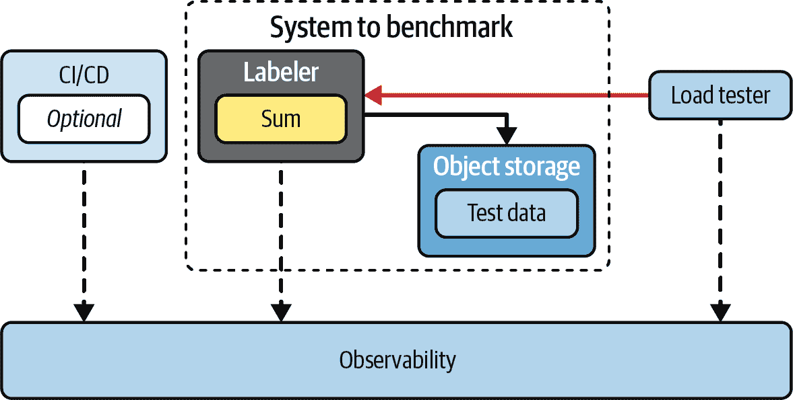
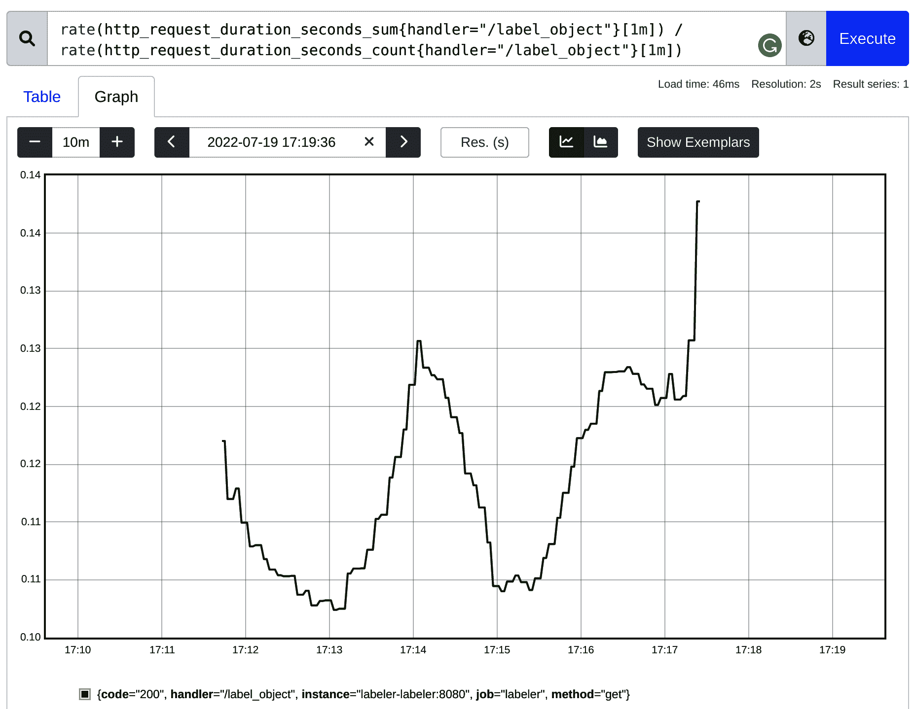
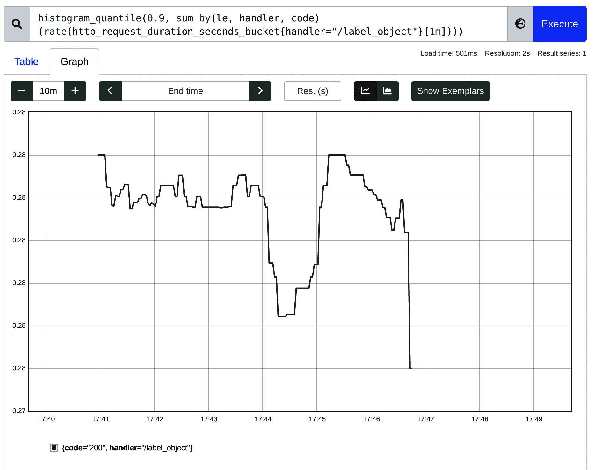
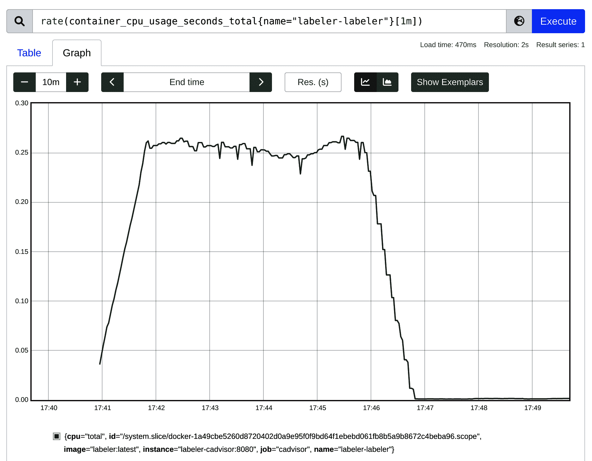
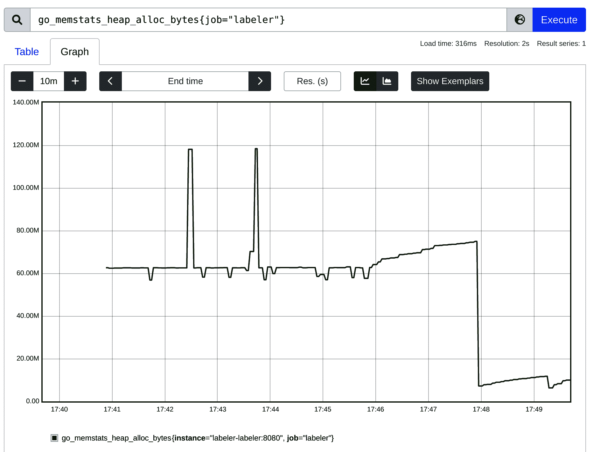
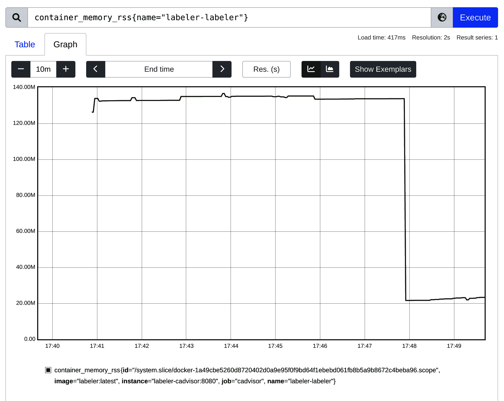

# 第八章\. 基准测试

希望你的 Go IDE 已准备好并热身待命！现在是时候对我们的 Go 代码进行压力测试，以了解在第七章中提到的微观和宏观水平上的效率特征。

在本章中，我们将从“微基准”开始，介绍微基准的基础知识，并介绍 Go 本地基准测试。接下来，我将解释如何使用`benchstat`等工具解释输出。然后，我将讨论我学到的微基准方面和技巧，这些对微基准的实际使用非常有用。

在本章的后半部分，我们将介绍“宏基准”，由于其大小和复杂性，宏基准很少在编程书籍中讨论。在我看来，宏基准与微基准一样关键，因此每个关心效率的开发人员都应该能够使用这种测试级别。接下来，在“Go 端到端框架”中，我们将通过使用容器完全编写的宏测试的完整示例进行介绍。我们将讨论结果和过程中的常见可观察性。

不再多言，让我们直接进入评估代码较小部分效率的最敏捷方式，即微基准测试。

# 微基准

如果基准测试专注于单个、孤立功能的单一代码片段，并且在单个进程中运行的小段代码，那么可以称之为微基准测试。您可以将微基准测试视为用于评估为单个组件或算法级别进行的优化效率的工具（在“优化设计级别”中讨论）。任何更复杂的东西可能会在微观水平上进行基准测试时面临挑战。我指的更复杂的是，例如尝试对以下内容进行基准测试可能会有挑战性：

+   同时进行多个功能。

+   长时间运行的功能（超过 5 至 10 秒）。

+   更大的多结构组件。

+   多进程功能。如果在我们的测试过程中不会旋转太多的 goroutine（例如超过一百个），则接受多 goroutine 功能。

+   需要比中等开发机器更多资源才能运行的功能（例如，分配 40GB 内存来计算答案或准备测试数据集）。

如果您的代码违反了这些要素之一，您可能需要将其拆分为更小的微基准，或者考虑使用不同框架的宏基准（参见“宏基准”）。

# 保持微基准微小

我们在微观水平上一次进行基准测试的越多，实施和执行这类基准测试就需要越多的时间。这导致了连锁后果——我们尝试使基准测试更可重用，并花费更多时间在其上构建更多的抽象。最终，我们试图使它们更稳定并且更难更改。

这是一个问题，因为微基准是为了敏捷性而设计的。我们经常更改代码，因此我们希望能够快速更新基准而不受阻碍。因此，您可以快速编写它们，保持简单，并进行更改。

此外，Go 基准测试不具备（也不应具备！）复杂的可观测性，这也是保持其简洁的另一个原因。

基准定义意味着对微基准进行验证，以确认您的程序是否符合某些功能的高级用户**RAER**，例如，“此 API 的 p95 应低于一分钟。” 换句话说，通常不适合回答需要绝对数据的问题。因此，在编写微基准时，我们应该专注于与某个基线或模式相关的答案，例如：

学习关于运行时复杂度

微基准是了解 Go 函数或方法在某些维度上效率行为的绝佳方法。例如，输入和测试数据的不同份额和大小如何影响延迟？分配是否随着输入大小的增加而无限增长？您选择的算法的常数因子和开销是多少？

由于快速反馈循环，轻松地手动调整测试输入并查看您的函数在各种测试数据和情况下的效率是很容易的。

A/B 测试

A/B 测试是通过在程序版本 A 上执行相同测试，然后在版本 B 上执行不同（理想情况下）仅有一个事物（例如，您重用了一个片）。它们可以告诉我们我们更改的相对影响。

微基准是评估代码、配置或硬件的新更改是否可能影响效率的好方法。例如，假设我们知道某些请求的绝对延迟为两分钟，并且我们知道其中 60% 的延迟是由我们开发的某个 Go 函数引起的。在这种情况下，我们可以尝试优化此函数，并在之前和之后进行微基准。只要我们的测试数据可靠，如果优化后，我们的微基准显示我们的优化使我们的代码快了 20%，整个系统也将快 18%。

有时，延迟微基准的绝对数值可能并不重要。例如，如果我们的微基准在我们的机器上显示每个操作 900 毫秒，那么在另一台笔记本电脑上，它可能显示 500 毫秒。重要的是，在同一台机器上，尽可能少地更改环境并在一次又一次的基准测试之后，版本 A 和 B 之间的延迟更高或更低。正如我们在“重现生产”中学到的那样，这种关系在您将在那些版本上进行基准测试的任何其他环境中可能是可重现的。

在 Go 中实现和运行微基准测试的最佳方法是通过其内置于 `go test` 工具中的本地基准测试框架。它经过实战考验，集成到测试流程中，具有原生支持性能分析的能力，您可以在 Go 社区中看到许多基准测试的示例。我已经在 Example 6-3 中提到了围绕 Go 基准测试框架的基础知识，我们在 Example 7-2 的输出中看到了一些预处理的结果，但现在是深入细节的时候了！

## Go 基准测试

创建 [Go 中的微基准测试](https://oreil.ly/0h0y0) 首先要创建一个具有特定签名的特定函数。Go 工具并不挑剔——一个函数必须满足三个要素才能被视为基准测试：

+   创建函数的文件必须以 *_test.go* 后缀结尾。¹

+   函数名必须以区分大小写的 `Benchmark` 前缀开头，例如 `BenchmarkSum`。

+   函数必须有一个 `*testing.B` 类型的函数参数。

在 “复杂度分析” 中，我们讨论了 Example 4-1 代码的空间复杂度。在 第十章 中，我将向您展示如何优化这段代码以满足几个不同的需求。如果没有 Go 基准测试，我将无法成功地进行这些优化。我用它们来获取分配数量和延迟的估计数据。现在让我们看看基准测试的具体过程。

# Go 基准测试命名约定

我尝试在 Go 测试框架中的所有函数类型（如基准测试 (`Benchmark<NAME>`)，测试 (`Test<NAME>`)，模糊测试 (`Fuzz<NAME>`)，和示例 (`Example<NAME>`)) 的 `<NAME>` 部分上遵循一致的命名模式。这个想法很简单：

+   将一个测试命名为 `BenchmarkSum` 表示测试 `Sum` 函数的效率。`BenchmarkSum_withDuplicates` 表示相同的测试，但后缀（注意它以小写字母开头）告诉我们我们在测试的某些条件。

+   `BenchmarkCalculator_Sum` 表示对 `Calculator` 结构体中的 `Sum` 方法进行测试。如上所述，如果我们对同一方法有更多的测试，可以添加后缀以区分不同情况，例如 `BenchmarkCalculator_Sum_withDuplicates`。

+   此外，您可以添加输入大小作为另一个后缀，例如 `BenchmarkCalculator_Sum_10M`。

鉴于 Example 4-1 中的 `Sum` 是一个专用的简短函数，一个好的微基准测试就足以说明其效率。因此，我在 *sum_test.go* 文件中创建了一个名为 `BenchmarkSum` 的新函数。但在做任何其他操作之前，我添加了所需的大多数基准测试的原始模板，正如 Example 8-1 中所示。

##### 示例 8-1\. Go 基准测试的核心元素

```go
func BenchmarkSum(b *testing.B) {
    b.ReportAllocs() 

    // TODO(bwplotka): Add any initialization that is needed.

    b.ResetTimer() 
    for i := 0; i < b.N; i++ { 
        // TODO(bwplotka): Add tested functionality.
    }
}
```


选择性[方法](https://oreil.ly/ootGE)，告诉 Go 基准测试提供分配的数量和分配的总量。这等同于在运行测试时设置`-benchmem`标志。虽然在理论上它可能会为测量的延迟增加微小的开销，但仅在非常快的函数中才能看到。实际上，我很少需要移除分配追踪，所以我总是保持开启。通常情况下，即使您期望任务只对 CPU 敏感，查看分配数量也是有用的。正如在“内存相关性”中提到的，某些分配可能会令人惊讶！


在大多数情况下，我们不希望基准测试初始化测试数据、结构或模拟的依赖所需的资源。要在“外部”时钟延迟和分配跟踪之外执行此操作，请在实际基准测试之前[重置计时器](https://oreil.ly/5et2N)。如果我们没有任何初始化，我们可以将其删除。


这个精确的`for`循环序列与`b.N`是任何 Go 基准测试的强制元素。永远不要更改它或删除它！类似地，永远不要在您的函数中使用循环中的`i`。这可能会在开始时令人困惑，但要运行您的基准测试，`go test`可能会多次运行`BenchmarkSum`以找到合适的`b.N`，具体取决于我们如何运行它。默认情况下，`go test`将尝试至少运行这个基准测试 1 秒钟。这意味着它将使用`b.N`等于 1 m 来执行我们的基准测试一次，仅评估单次迭代持续时间。基于此，它将尝试找到使整个`BenchmarkSum`至少执行 1 秒钟的最小`b.N`。

我想要进行基准测试的`Sum`函数接受一个参数——包含要求和的整数列表的文件名。正如我们在“复杂性分析”中讨论的那样，示例 4-1 中使用的算法取决于文件中整数的数量。在这种情况下，空间和时间复杂度是`O(N)`，其中`N`是整数的数量。这意味着`Sum`与单个整数相比，将比包含数千个整数的`Sum`更快并且分配更少的内存。因此，输入选择将显着改变效率结果。但是我们如何找到适合基准测试的正确测试输入呢？不幸的是，这并没有单一答案。

# 我们基准测试的测试数据和条件选择

通常，我们希望使用尽可能小（因此速度最快且成本最低！）的数据集，这将为我们提供足够的知识和对程序效率特征模式的信心。另一方面，它应该足够大，以触发用户可能遇到的潜在限制和瓶颈。正如我们在“复制生产”中提到的，测试数据应尽可能模拟生产工作负载。我们追求“典型性”。

但是，如果我们的功能在特定输入时存在严重问题，我们也应该在基准测试中包含这些内容！

为了使事情变得更加困难，我们还受到微基准测试数据大小的限制。通常情况下，我们希望确保这些基准测试能够在几分钟内以最大效率运行，并在我们的开发环境中获得最佳的敏捷性和最短的反馈循环。值得欣慰的是，有方法可以找到程序的某些效率模式，使用比潜在生产数据集小几倍的数据集运行基准测试，并推断可能的结果。

例如，在我的机器上，Example 4-1 大约需要 78.4 毫秒来求和 200 万个整数。如果我用 100 万个整数进行基准测试，需要 30.5 毫秒。根据这两个数字，我们可以有一定的信心⁴，认为我们的算法平均需要大约 29 纳秒来求和一个整数。⁵如果我们的需求分析和需求规范（RAER）指定，例如，我们必须在 30 秒内对 20 亿个整数求和，我们可以假设我们的实现速度太慢，因为 29 纳秒 * 20 亿大约是 58 秒。

出于这些原因，我决定在 Example 4-1 的基准测试中坚持使用 200 万个整数。这是一个足够大的数字，可以展示一些瓶颈和效率模式，但又足够小，可以保持我们的程序相对快速（在我的机器上，它可以在 1 秒内执行大约 14 次操作。）⁶目前，我创建了一个*testdata*目录（在编译中排除），并手动创建了一个名为*test.2M.txt*的文件，其中包含 200 万个整数。使用测试数据和 Example 8-1，我添加了要测试的功能，如 Example 8-2 所示。

##### Example 8-2\. 用于评估`Sum`函数效率的最简单的 Go 基准测试

```go
func BenchmarkSum(b *testing.B) {
    for i := 0; i < b.N; i++ {
        _, _ = Sum("testdata/test.2M.txt")
    }
}
```

要运行这个基准测试，我们可以使用`go test`命令，在我们的机器上[安装 Go](https://oreil.ly/dQ57t)之后就可以使用了。`go test`允许我们运行所有指定的测试、模糊测试或基准测试。对于基准测试，`go test`有许多选项，允许我们控制它如何执行我们的基准测试，并在运行后生成什么样的结果。让我们通过示例选项，展示在 Example 8-3 中。

##### Example 8-3\. 我们可以使用的示例命令来运行 Example 8-2

```go
$ go test -run '^$' -bench '^BenchmarkSum$' 
$ go test -run '^$' -bench '^BenchmarkSum$' -benchtime 10s 
$ go test -run '^$' -bench '^BenchmarkSum$' -benchtime 100x 
$ go test -run '^$' -bench '^BenchmarkSum$' -benchtime 1s -count 5 
```


此命令执行一个具有显式名称`BenchmarkSum`的单个基准测试函数。您可以使用[RE2 正则语言](https://oreil.ly/KDIL9)来过滤您想要运行的测试。请注意`-run`标志严格匹配没有功能测试。这是为了确保不运行任何单元测试，从而可以专注于基准测试。空的`-run`标志意味着将执行所有单元测试。


使用`-benchtime`，我们可以控制我们的基准测试应执行多长时间或多少次迭代（功能操作）。在本例中，我们选择尽可能多的迭代次数来适应 10 秒的时间间隔。⁷


我们可以选择将`-benchtime`设置为确切的迭代次数。这种做法较少见，因为作为微基准测试用户，您希望专注于快速反馈循环。当指定迭代次数时，我们无法知道测试何时结束，以及是否需要等待 10 秒或 2 小时。这就是为什么通常更喜欢限制基准测试时间的原因，如果迭代次数太少，则可以稍微增加`-benchtime`中的数字，或者更改基准实现或测试数据。


我们还可以使用`-count`标志重复基准测试周期。这样做非常有用，因为它允许我们计算运行之间的方差（使用“理解结果”中解释的工具）。

选项的完整列表非常长，您可以随时使用[`go help testflag`](https://oreil.ly/F2wTM)列出它们。

# 通过 IDE 运行 Go 基准测试

几乎所有现代 IDE 都允许我们简单点击 Go 基准测试功能，并从 IDE 中执行它。因此，请随意操作。只需设置正确的选项，或者至少了解默认的选项有哪些！

我使用 IDE 触发初始的一秒钟基准测试运行，但对于更复杂的情况，我更喜欢使用传统的 CLI 命令。它们易于使用，并且很容易与他人分享测试运行配置。最后，使用您感觉最舒适的工具！

对于我的`Sum`基准测试，我创建了一个有用的单行命令，其中包含我需要的所有选项，见示例 8-4。

##### 示例 8-4\. 用于基准测试的单行 shell 命令，见示例 4-1

```go
$ export ver=v1 && \ 
    go test -run '^$' -bench '^BenchmarkSum$' -benchtime 10s -count 5 \
        -cpu 4 \ 
        -benchmem \ 
        -memprofile=${ver}.mem.pprof -cpuprofile=${ver}.cpu.pprof \ 
    | tee ${ver}.txt 
```


编写复杂脚本或框架来将结果保存在正确位置、创建比较结果的自动化等是非常诱人的。在许多情况下，这是一个陷阱，因为 Go 基准测试通常是短暂且易于运行的。尽管如此，我决定添加少量的 bash 脚本来确保我的基准测试产生的工件具有我稍后可以引用的相同名称。当我使用优化的新代码版本进行基准测试时，我可以手动调整`ver`变量的不同值，如`v2`、`v3`或`v2-with-streaming`，以便进行后续比较。


有时，如果我们通过并发代码来优化延迟，就像在 “使用并发优化延迟” 中那样，重要的是控制允许基准测试使用的 CPU 核心数量。这可以通过 `-cpu` 标志来实现。它设置了正确的 `GOMAXPROCS` 设置。正如我们在 “性能非确定性” 中提到的，确切值的选择高度依赖于生产环境的外观以及开发机器有多少个 CPU。


如果我们的优化在分配极大量的内存时没有优点，那么优化延迟就没有意义，就像我们在 “内存相关性” 中学到的那样。根据我的经验，内存分配比 CPU 使用造成的问题更多，因此我始终试图注意使用 `-benchmem`。


如果您运行微基准测试并看到您不满意的结果，您的第一个问题可能是什么导致了减速或高内存使用。这就是为什么 Go 基准测试内置支持分析的原因，详见 第 9 章。我比较懒，通常保持这些选项默认开启，类似于 `-benchtime`。因此，我总是可以深入分析性能分析文件，找到引起可疑资源使用的代码行。与 `-benchtime` 和 `ReportAllocs` 类似，默认情况下关闭它们，因为它们会轻微增加延迟测量。然而，通常可以安全地将它们保持打开，除非您在测量超低延迟操作（数十纳秒）时。尤其是 `-cpuprofile` 选项在后台会增加一些分配和延迟。


默认情况下，`go test` 将结果打印到标准输出。但是，为了可靠地进行比较，不至于在结果与运行时迷失方向，我建议将它们保存在临时文件中。我建议使用 `tee` 同时写入文件和标准输出，这样您可以跟踪基准测试的进展。

有了基准实现、输入文件和执行命令，现在是执行我们的基准测试的时候了。我在我的机器上的测试文件目录中执行了 示例 8-4，32 秒后完成。它创建了三个文件：*v1.cpu.pprof*、*v1.mem.pprof* 和 *v1.txt*。在本章中，我们对最后一个文件最感兴趣，因此您可以了解如何读取和理解 Go 基准测试输出。我们将在下一节中进行。

## 理解结果

每次运行后，`go test`基准测试以一致的格式打印结果。⁹ 示例 8-5 展示了在 示例 8-4 上执行的输出运行，用于 示例 4-1 中呈现的代码。

##### 示例 8-5。由示例 8-4 命令产生的*v1.txt*文件的输出

```go
goos: linux  goarch: amd64
pkg: github.com/efficientgo/examples/pkg/sum
cpu: Intel(R) Core(TM) i7-9850H CPU @ 2.60GHz
BenchmarkSum-4    67    79043706 ns/op    60807308 B/op    1600006 allocs/op  BenchmarkSum-4    74    79312463 ns/op    60806508 B/op    1600006 allocs/op
BenchmarkSum-4    66    80477766 ns/op    60806472 B/op    1600006 allocs/op
BenchmarkSum-4    66    80010618 ns/op    60806224 B/op    1600006 allocs/op
BenchmarkSum-4    74    80793880 ns/op    60806445 B/op    1600006 allocs/op
PASS
ok     github.com/efficientgo/examples/pkg/sum    38.214s
```


每次基准运行都会捕获有关环境的基本信息，如架构、操作系统类型、我们运行基准的包以及机器上的 CPU。不幸的是，正如我们在“实验的可靠性”中讨论的那样，还有许多其他可能值得捕获的元素¹⁰，这些元素可能会影响基准。


每一行代表一个单独的运行（即使你使用`-count=1`运行基准，也只会有一行）。每行包含三列或更多列，具体数量取决于基准的配置，但顺序是一致的。从左到右，我们有：

+   带有表示可用 CPU 数量的后缀的基准名称（理论上¹¹）。这告诉我们可以期待并发实现。

+   此基准运行的迭代次数。请注意这个数字；如果太低，其他列中的数字可能不反映实际情况。

+   `-benchtime`除以运行次数得到的每个操作的纳秒数。

+   每个操作在堆上分配的字节数。正如您在第五章中学到的，请记住，这并不告诉我们在其他段（如手动映射、缓存和堆栈）中分配了多少内存！只有在设置了`-benchmem`标志（或`ReportAllocs`）时才会出现此列。

+   每个操作在堆上的分配次数（仅在设置了`-benchmem`标志时出现）。

+   可选地，您可以使用`b.ReportMetric`方法报告每个操作的自定义指标。参见此[示例](https://oreil.ly/IuwYl)。这将显示为进一步的列，并可以类似地与后面解释的工具进行聚合。

如果你运行示例 8-4 并且很长时间看不到输出，可能意味着你的微基准的第一次运行需要这么长时间。如果你的`-benchtime`是基于时间的，`go test`会快速检查运行单次迭代所需的时间，以找到估计的迭代次数。

如果花费太多时间，除非您想运行 30 分钟以上的测试，否则可能需要优化基准设置，减少数据量，或将微基准拆分为更小的功能。否则，您将无法实现所需的数百或数十次迭代。

如果你看到初始输出（`goos`、`goarch`、`pkg`和基准名称），表示单次迭代运行已完成，并且适当的基准测试已经开始。

示例 8-5 中呈现的结果可以直接阅读，但存在一些挑战。首先，数字是基本单位的—一开始看不出我们是否分配了 600 MB、60 MB 还是 6 MB。如果我们将我们的延迟转换为秒也是一样。其次，我们有五个测量结果，那么我们选择哪一个？最后，我们如何比较第二个微基准结果与进行优化的代码？

幸运的是，Go 社区创建了另一个 CLI 工具 [`benchstat`](https://oreil.ly/PWSN4)，它可以执行更多处理和统计分析，以便更轻松地评估一个或多个基准测试结果。因此，它已经成为最受欢迎的解决方案，用于近年来呈现和解释 Go 微基准测试结果。

您可以使用标准的 `go install` 工具安装 `benchstat`，例如，`go install golang.org/x/perf/cmd/benchstat@latest`。安装完成后，它将存在于您的 $GOBIN 或 *$GOPATH/bin* 目录中。然后您可以使用它来呈现我们在 示例 8-5 中得到的结果；请参阅 示例 8-6 中的示例用法。

##### 示例 8-6\. 在 示例 8-5 中呈现的结果上运行 `benchstat`

```go
$ benchstat v1.txt  name   time/op
Sum-4  79.9ms ± 1%  name   alloc/op
Sum-4  60.8MB ± 0%

name   allocs/op
Sum-4   1.60M ± 0%
```


我们可以使用包含 示例 8-5 的 *v1.txt* 运行 `benchstat`。`benchstat` 可以解析 `go test` 工具的格式，从同一代码版本上执行一次或多次基准测试。


对于每个基准测试，`benchstat` 计算所有运行的平均值，并且`±`跨运行的方差（在这种情况下为 1%）。这就是为什么多次运行 `go test` 基准测试非常重要（例如，使用 `-count` 标志）；否则，仅进行一次运行，方差将显示一个误导性的 0%。运行更多测试允许我们评估结果的重复性，正如我们在 “性能不确定性” 中讨论的那样。运行 `benchstat --help` 查看更多选项。

一旦我们对测试运行有信心，我们可以称之为基准结果。我们通常希望通过与我们的基线比较来评估代码的效率，使用新的优化。例如，在 第十章 中，我们将优化 `Sum` 函数，其中一个优化版本将快两倍。我通过将可见的 `Sum` 函数更改为 示例 4-1 中的 `ConcurrentSum3`（代码在 示例 10-12 中呈现）来找到这一点。然后我运行了在 示例 8-2 中实现的基准测试，使用与 示例 8-4 中显示的完全相同的命令，只是将 `ver=v1` 更改为 `ver=v2` 以生成 *v2.txt* 和 *v2.cpu.pprof* 和 *v2.mem.pprof*。

`benchstat` 帮助我们计算方差并提供人类可读的单位。但还有另一个有用的功能：比较不同基准运行的结果。例如，示例 8-7 显示了我如何检查朴素和改进并发实现之间的差异。

##### 示例 8-7\. 运行 `benchstat` 比较 v1.txt 和 v2.txt 的结果

```go
$ benchstat v1.txt v2.txt  name   old time/op    new time/op    delta
Sum-4    79.9ms ± 1%    39.5ms ± 2%  -50.52%  (p=0.008 n=5+5)  name   old alloc/op   new alloc/op   delta
Sum-4    60.8MB ± 0%    60.8MB ± 0%     ~     (p=0.151 n=5+5)

name   old allocs/op  new allocs/op  delta
Sum-4     1.60M ± 0%     1.60M ± 0%   +0.00%  (p=0.008 n=5+5)
```


使用两个文件运行 `benchstat` 可以启用比较模式。


在比较模式下，`benchstat` 提供了一个增量列，显示两个平均值之间的增量，以百分比显示，如果显著性测试失败则显示 `~`。默认显著性测试是 [曼-惠特尼 U 检验](https://oreil.ly/ESCAz)，可以使用 `-delta-test=none` 禁用该测试。显著性测试是一种额外的统计分析，计算 [p 值](https://oreil.ly/6K0zl)，默认情况下应小于 `0.05`（可通过 `-alpha` 进行配置）。它在方差之上（在 `±` 之后）为我们提供额外信息，用于安全比较结果。`n=5+5` 表示两个结果的样本量（两次基准运行均使用 `-count=5` 进行）。

多亏了 `benchstat` 和 Go 基准测试，我们可以相对自信地说，我们的并发实现速度约快了 50%，并且不会影响分配。

细心的读者可能会注意到，分配大小未通过 `benchstat` 的显著性测试（`p` 大于 0.05）。我可以通过使用更高的 `-count` 运行基准测试来改善这一点（例如，8 或 10 次）。

我特意让这个显著性测试失败，以向您展示有时可以应用常见的推理。两个结果都表明分配了大约 60.8 MB，方差极小。我们可以明确地说，这两种实现使用了类似的内存量。我们是否在乎一个实现使用少了几 KB 还是多了几 KB？可能不会，所以我们可以跳过 `benchstat` 的显著性测试，验证我们是否可以信任增量。没必要在这里花费更多时间！

分析微基准测试可能会在初期时让人感到困惑，但希望使用 `benchstat` 提供的流程教会您如何评估不同实现的效率，而无需拥有数据科学学位！总体而言，在使用 `benchstat` 时，请记住：

+   运行多于一次的测试（`-count`）以便识别噪音。

+   检查 `±` 后的方差数字是否不高于 3–5%。特别注意小数值的方差。

+   若要依赖于具有较高方差的结果之间的准确增量，请检查显著性测试（p 值）。

考虑到这一点，让我们来看看在您日常使用 Go 基准测试工作中可能非常有用的一些常见高级技巧！

# 微基准测试的技巧与窍门

微基准测试的最佳实践通常来自于您自己的错误，并且很少与他人分享。让我们通过提到一些值得注意的 Go 微基准测试的常见方面来打破这种局面。

## 方差过大

正如我们在“性能非确定性”中学到的，了解我们测试的方差是至关重要的。如果微基准之间的差异超过，比如说，5%，这表明可能存在潜在的噪音，我们可能不能完全依赖这些结果。

在准备“使用并发优化延迟”时，我遇到了这种情况。在进行基准测试时，我的结果具有过大的方差，正如 `benchstat` 的结果所示。那次运行的结果在示例 8-8 中呈现。

##### 示例 8-8\. `benchstat` 表示延迟结果方差较大

```go
name   time/op
Sum-4  45.7ms ±19%  name   alloc/op
Sum-4  60.8MB ± 0%

name   allocs/op
Sum-4   1.60M ± 0%
```


19% 的方差相当可怕。我们应该忽略这样的结果，并在做出任何结论之前稳定基准。

在这种情况下我们能做些什么呢？我们已经在“性能非确定性”中提到了一些事情。我们应该考虑延长基准测试时间，重新设计我们的基准，或者在不同的环境条件下运行它。在我的情况下，我不得不关闭浏览器，并将 `-benchtime` 从 5 秒增加到 15 秒，以在示例 8-7 中达到 2% 的方差运行。

## 找到您的工作流程

在“Go 基准测试”中，您跟随我通过微观层面的效率评估周期。当然，这可能会有所不同，但通常基于 `git` 分支，可以总结如下：

1.  我检查是否存在我要测试的现有微基准实现。如果不存在，我将创建一个。

1.  在我的终端中，我执行类似于示例 8-4 的命令多次运行基准测试（5–10 次）。我将结果保存到类似 *v1.txt* 的文件中，保存配置文件，并将其视为我的基准。

1.  我评估 *v1.txt* 的结果，检查资源消耗是否大致符合我对实现和输入大小的理解。为了确认或拒绝，我执行第九章中解释的瓶颈分析。在这个阶段，我可能会为不同的输入执行更多的基准测试以获取更多信息。这大致告诉我是否有一些简单的优化空间，我是否应该投资于更危险和有意识的优化，或者是否应该转向不同层次的优化。

1.  假设存在一些优化空间，我创建一个新的[`git` 分支](https://oreil.ly/AcM1D)并实现它。

1.  遵循 TFBO 流程，我首先测试了我的实现。

1.  我提交更改，使用相同的命令运行基准测试函数，并将其保存为，例如，*v2.txt*。

1.  我使用 `benchstat` 比较结果，并调整基准或优化，以达到最佳结果。

1.  如果我想尝试不同的优化，我会创建另一个`git`分支或在同一分支上构建新的提交，并重复这个过程（例如，生成*v3.txt*、*v4.txt*等）。这使我可以在一次尝试让我悲观的情况下返回到先前的优化。

1.  我在我的笔记、提交消息或存储库变更集（例如，拉取请求）中记录发现，并丢弃我的*.txt*结果（过期日期！）。

这个流程对我来说效果很好，但你可能想尝试不同的流程！只要它对你没有困惑，是可靠的，并且遵循我们在“效率感知开发流程”中讨论的 TFBO 模式，就可以使用它。还有许多其他选择，例如：

+   你可以使用终端历史记录来跟踪基准测试结果。

+   对于相同功能，您可以创建具有不同优化的不同函数。然后，如果您不想在此处使用`git`，可以在基准函数中交换要使用的函数。

+   使用`git stash`而不是提交。

+   最后，您可以遵循[Dave Cheney 流程](https://oreil.ly/1MJNT)，该流程使用`go test -c`命令将测试框架和代码构建为单独的二进制文件。然后，您可以保存此二进制文件并执行基准测试，而无需重新构建源代码或保存您的测试结果。¹²

我建议尝试不同的流程，了解哪种对你最有帮助！

我建议避免为我们的本地微基准工作流编写过于复杂的自动化（例如，复杂的 bash 脚本来自动化一些步骤）。微基准测试应该更具交互性，您可以手动挖掘您关心的信息。编写复杂的自动化可能意味着比必要的更多开销和更长的反馈周期。但是，如果这对您有效，请继续！

## 测试您的基准测试是否正确！

我们在基准测试中最常见的错误之一是评估不提供正确结果的功能的效率。由于有意的优化性质，很容易引入破坏我们代码功能的错误。有时，优化失败的执行很重要，¹³但这应该是一个明确的决定。

TFBO 中的“测试”部分，解释在“效率感知开发流程”中，并非偶然。我们的重点应该是为我们的`Sum`函数编写一个单元测试，例如单元测试示例可以看作是 Example 8-9。

##### 示例 8-9\. 用于评估`Sum`函数正确性的单元测试示例

```go
// import "github.com/efficientgo/core/testutil"

func TestSum(t *testing.T) {
    ret, err := Sum("testdata/input.txt")
    testutil.Ok(t, err)
    testutil.Equals(t, 3110800, ret)
}
```

有了单元测试，可以确保在正确配置 CI 后，当我们向主存储库提交我们的更改（可能通过[拉取请求](https://oreil.ly/r24MR) [PR]）时，我们会注意到我们的代码是否正确。因此，这已经提高了我们优化工作的可靠性。

但是，我们仍然可以做一些事情来改进这个过程。如果您仅在最后一个开发步骤中进行测试，您可能已经进行了所有基准测试和优化的努力，而没有意识到代码是错误的。这可以通过在每次基准测试运行之前手动运行 Example 8-10 中的单元测试来减轻，例如 Example 8-2 中的代码。这有所帮助，但仍然存在一些轻微的问题：

+   在我们进行更改后，再运行另一个东西是很烦人的。因此，跳过运行功能测试的手动流程以节省时间并实现更快的反馈循环是非常诱人的。

+   该函数在单元测试中可能经过了充分测试，但在如何调用函数以及基准测试中存在差异。

+   另外，正如您在 “与功能测试的比较” 中学到的那样，对于基准测试，我们需要不同的输入。新的东西意味着制造错误的新地方！例如，在为本书准备基准测试时，在 Example 8-2 中，我在文件名中意外地写错了一个字母（*testdata/test2M.txt* 而不是 *testdata/test.2M.txt*）。当我运行我的基准测试时，它通过了，但结果的延迟非常低。事实证明，`Sum` 除了因文件不存在而失败外，什么也没做。因为在 Example 8-2 中，我为简单起见忽略了所有错误，我错过了这些信息。只是直觉告诉我，我的基准测试运行得太快了，以至于不真实，所以我双重检查了`Sum`的实际返回情况。

+   在更高负载下进行基准测试时，可能会出现新的错误。例如，由于机器上文件描述符的限制，我们可能无法打开另一个文件，或者我们的代码没有清理磁盘上的文件，因此由于磁盘空间不足而无法对文件进行更改。

幸运的是，解决这个问题的简单方法是在基准测试迭代中添加快速的错误检查。它看起来像 Example 8-10。

##### 例如 8-10\. 用于评估带有错误检查的`Sum`函数效率的 Go 基准测试

```go
func BenchmarkSum(b *testing.B) {
    for i := 0; i < b.N; i++ {
       _, err := Sum("testdata/test.2M.txt")
        testutil.Ok(b, err) 
    }
}
```


断言每次迭代循环中`Sum`不会返回错误。

需要注意的是，基准测试之后我们获得的效率指标将包括由 `testutil.Ok(b, err)` 调用引入的延迟，即使没有错误。这是因为我们在 `b.N` 循环中调用此函数，因此它会增加一定的开销。

我们应该接受这种开销吗？这与包括 `-benchmem` 和测试生成的问题相同，这也可能会增加一些小的噪音。如果我们尝试对非常快速的操作进行基准测试（比如毫秒级的快速操作），这种开销是不可接受的。然而，对于大多数基准测试来说，这样的断言不会改变您的基准测试结果。甚至可以认为这种错误断言将存在于生产中，因此应该包含在效率评估中。¹⁵ 就像 `-benchmem` 和性能分析一样，我几乎在所有微基准测试中添加了这种断言。

在某些方面，我们仍然容易出错。也许对于大输入，`Sum` 函数在不返回错误的情况下无法提供正确的答案。就像所有测试一样，我们永远不会消除所有错误 —— 在编写、执行和维护额外测试的努力与信心之间必须保持平衡。由您决定有多少信任您的工作流程。

如果您希望为了更多的信心选择前述案例，您可以添加一个检查，将返回的总和与预期结果进行比较。在我们的情况下，添加 `testutil.Equals(t, <expected number>, ret)` 不会增加太多开销，但通常对于微基准测试来说，这样做更昂贵，因此不合适。出于这些目的，我创建了一个小的 [`testutil.TB` 对象](https://oreil.ly/wMX6O)，允许您运行单次迭代的微基准测试。这使得它在正确性方面始终保持最新，这在更大的共享代码库中尤为具有挑战性。例如，对我们的 `Sum` 基准测试进行持续测试可能看起来像 示例 8-11。¹⁶

##### 示例 8-11\. 用于评估 `Sum` 函数效率的可测试 Go 基准测试

```go
func TestBenchSum(t *testing.T) {
    benchmarkSum(testutil.NewTB(t))
}

func BenchmarkSum(b *testing.B) {
    benchmarkSum(testutil.NewTB(b))
}

func benchmarkSum(tb testutil.TB) { 
    for i := 0; i < tb.N(); i++ { 
        ret, err := Sum("testdata/test.2M.txt")
        testutil.Ok(tb, err)
        if !tb.IsBenchmark() {
            // More expensive result checks can be here.
            testutil.Equals(tb, int64(6221600000), ret) 
        }
    }
}
```


`testutil.TB` 是一个接口，允许将函数作为基准测试和单元测试运行。此外，它允许我们设计我们的代码，以便其他函数执行相同的基准测试，例如，带有额外的性能分析，如 示例 10-2 所示。


`tb.N()` 方法返回基准测试中的 `b.N`，允许正常的微基准测试执行。它返回 `1` 以执行单元测试的一个测试运行。


现在，我们可以将可能更昂贵的额外代码（例如更复杂的测试断言）放入基准测试无法达到的空间，这要归功于 `tb.IsBenchmark()` 方法。

总之，请测试您的微基准测试代码。这将节省您和您的团队的时间。此外，它可以对抗不需要的编译器优化，详见 “编译器优化与基准测试”。

## 与团队分享基准测试（以及未来的自己）

一旦完成 TFBO 周期并对下一个优化迭代感到满意，就是提交新代码的时候了。与你的小型个人项目相比，与团队分享你发现或取得的成果更为重要。当有人提出优化更改时，在生产代码中只看到优化并且只有一个小小的描述：“我对此进行了基准测试，速度提高了 30%。” 这对多种原因都不理想：

+   对于审阅者而言，在没有看到你使用的实际微基准测试代码之前很难验证基准测试的有效性。审阅者不应不信任你所说的，而是很容易犯错误、忽略副作用或错误地进行基准测试。¹⁷ 例如，输入必须是某个特定大小才能触发问题，或者输入不反映预期的用例。只有通过另一个人查看你的基准测试代码才能验证这一点。这在我们远程与团队合作和开源项目中尤为重要，强大的沟通至关重要。

+   一旦合并，任何涉及此代码的其他更改可能会意外引入效率退化。

+   如果你或其他任何人想尝试改进相同的代码部分，他们除了重新创建基准测试并经历与你在拉取请求中所做的相同努力外别无选择，因为先前的基准测试实现已经消失（或存储在你的计算机上）。

解决方案在于尽可能提供有关实验细节、输入和基准测试实现的上下文。当然，我们可以以某种形式提供这些文档（例如，在拉取请求描述中），但没有比将实际的微基准测试与你的生产代码一起提交更好的方式！然而，在实践中，这并不简单。在分享微基准测试之前，值得添加一些额外的内容。

我优化了我们的`Sum`函数并解释了我的基准测试过程。然而，你不希望为了向团队（和未来的自己）解释你所做的优化而写一整章！相反，你可以像在示例 8-12 中呈现的那样提供一个单独的代码片段，这就足够了。

##### 示例 8-12\. 用于评估并发实现`Sum`函数的良好文档化、可重复使用的 Go 基准测试。

```go
// BenchmarkSum assesses `Sum` function. 
// NOTE(bwplotka): Test it with a maximum of 4 CPU cores, given we don't allocate
// more in our production containers.
//
// Recommended run options:
/*
export ver=v1 && go test \
    -run '^$' -bench '^BenchmarkSum$' \
    -benchtime 10s -count 5 -cpu 4 -benchmem \
    -memprofile=${ver}.mem.pprof -cpuprofile=${ver}.cpu.pprof \
  | tee ${ver}.txt  */
func BenchmarkSum(b *testing.B) {
   // Create 7.55 MB file with 2 million lines.
   fn := filepath.Join(b.TempDir(), "/test.2M.txt")
   testutil.Ok(b, createTestInput(fn, 2e6)) 

   b.ResetTimer()
   for i := 0; i < b.N; i++ {
      _, err := Sum(fn)
      testutil.Ok(b, err) 
   }
}
```


对于一个简单的基准测试来说可能会感到有些过度，但良好的文档显著提高了你和你的团队的基准测试的可靠性。在评论中提及关于这个基准测试的任何令人惊讶的事实、数据集选择、条件或先决条件。


我建议用建议的方式对基准进行评论，描述如何运行这个基准测试，而不是强迫什么。未来的你或你的团队成员会感谢你！


提供您打算运行基准测试的确切输入。您可以为单元测试创建一个静态文件并将其提交到您的代码库中。不幸的是，基准测试的输入通常太大而无法提交到您的源代码库（例如`git`）。为此，我创建了一个小的`createTestInput`函数，可以生成动态数量的行。注意使用[`b.TempDir()`](https://oreil.ly/elBJa)，它创建一个临时目录，并在使用后需要手动清理。¹⁸


因为你希望将来重复使用此基准，并且其他团队成员也将使用它，所以确保其他人不要测量错误的内容，在基准测试中甚至要测试基本的错误模式是有意义的。

由于 `b.ResetTimer()` 的存在，即使输入文件的创建相对较慢，延迟和资源使用在基准测试结果中也不会显现出来。但是，如果你反复运行该基准测试，可能会感到不太愉快。而且，在多次运行该基准测试后，你会多次经历到这种慢速度。正如我们在“Go 基准测试”中学到的那样，Go 可以多次运行基准测试以找到正确的`N`值。如果初始化时间太长并影响到你的反馈循环，你可以添加代码在文件系统上缓存测试输入。参见 Example 8-13 如何使用简单的`os.Stat`来实现这一点。

##### Example 8-13\. 执行一次且在磁盘上缓存的基准测试示例

```go
func lazyCreateTestInput(tb testing.TB, numLines int) string {
    tb.Helper() 

    fn := fmt.Sprintf("testdata/test.%v.txt", numLines)
    if _, err := os.Stat(fn); errors.Is(err, os.ErrNotExist) { 
        testutil.Ok(tb, createTestInput(fn, numLines))
    } else {
        testutil.Ok(tb, err)
    }
    return fn
}

func BenchmarkSum(b *testing.B) {
    // Create a 7.55 MB file with 2 million lines if it does not exist.
    fn := lazyCreateTestInput(tb, 2e6)

    b.ResetTimer()
    for i := 0; i < b.N; i++ {
        _, err := Sum(fn)
        testutil.Ok(b, err)
   }
}
```


`t.Helper` 告诉测试框架，当出现潜在错误时要指出调用`lazyCreateTestInput`的行。


`os.Stat` 如果文件存在则停止执行 `createTestInput`。在更改输入文件的特性或大小时要小心。如果不改变文件名，则运行这些测试的人可能会得到输入的旧版本的缓存。然而，如果输入文件的创建慢于几秒钟，那么这种小风险是值得的。

这样的基准测试提供了有关基准实现、目的、输入、运行命令和先决条件的优雅而简洁的信息。此外，它允许您和您的团队以极少的工作量复制或重用相同的基准测试。

## 运行不同输入的基准测试

了解我们的实现在不同大小和类型的输入下效率如何通常是很有帮助的。有时我们可以手动更改代码中的输入并重新运行基准测试，但有时我们希望为同一段代码编写针对源代码中不同输入的基准测试（例如供团队以后使用）。表格测试非常适合这些用例。通常，我们在功能测试中看到这种模式，但在微基准测试中也可以使用，正如 Example 8-14 中所述。

##### 示例 8-14。使用通用模式与`b.Run`的表格基准测试

```go
func BenchmarkSum(b *testing.B) {
    for _, tcase := range []struct { 
       numLines int
    }{
        {numLines: 0},
        {numLines: 1e2},
        {numLines: 1e4},
        {numLines: 1e6},
        {numLines: 2e6},
    } {
        b.Run(fmt.Sprintf("lines-%d", tcase.numLines), func(b *testing.B) { 
            b.ReportAllocs() 

            fn := lazyCreateTestInput(tb, tcase.numLines)

            b.ResetTimer()
            for i := 0; i < b.N; i++ { 
                _, err := Sum(fn)
                testutil.Ok(b, err)
            }
        })
    }
}
```


内联的匿名结构体片段在这里效果很好，因为您不需要在任何地方引用此类型。随意在此处添加任何字段以根据需要映射测试案例。


在测试用例循环中，我们可以运行`b.Run`来告诉`go test`有一个子基准。如果您将空字符串`""`作为名称，`go test`将使用数字作为测试案例的标识。我决定将一些行作为每个测试案例的唯一描述。测试案例标识将作为后缀添加，因此`BenchmarkSum/<test-case>`。


对于这些测试，`go test`会忽略在`b.Run`之外的任何`b.ReportAllocs`和其他基准方法，因此确保在这里重复它们。


常见的陷阱是意外地使用`b`，不是内部函数创建的闭包中的`b`。如果您试图避免遮蔽`b`变量，并为内部的`*testing.B`使用不同的变量名，例如，`b.Run("", func(b2 *testing.B)`，这种问题很常见。这些问题很难调试，因此我建议始终使用相同的名称，例如`b`。

令人惊讶的是，我们可以使用与示例 8-4 中呈现的相同推荐的`run`命令来进行非表格测试。然后，`benchstat`处理的示例运行输出看起来像示例 8-15。

##### 示例 8-15。`benchstat`对示例 8-14 测试结果的输出

```go
name                 time/op
Sum/lines-0-4        2.79µs ± 1%
Sum/lines-100-4      8.10µs ± 5%
Sum/lines-10000-4     407µs ± 6%
Sum/lines-1000000-4  40.5ms ± 1%
Sum/lines-2000000-4  78.4ms ± 3%

name                 alloc/op
Sum/lines-0-4          872B ± 0%
Sum/lines-100-4      3.82kB ± 0%
Sum/lines-10000-4     315kB ± 0%
Sum/lines-1000000-4  30.4MB ± 0%
Sum/lines-2000000-4  60.8MB ± 0%

name                 allocs/op
Sum/lines-0-4          6.00 ± 0%
Sum/lines-100-4        86.0 ± 0%
Sum/lines-10000-4     8.01k ± 0%
Sum/lines-1000000-4    800k ± 0%
Sum/lines-2000000-4   1.60M ± 0%
```

我发现表格测试非常适合快速了解应用程序的预估复杂性（在“复杂性分析”中讨论）。然后，了解更多信息后，我可以将案例数减少到真正能触发我们过去遇到的瓶颈的案例。此外，将这样的基准测试提交到我们团队的源代码中，将增加其他团队成员（包括您自己！）重复使用它并运行项目中所有重要案例的微基准测试的机会。

## 微基准测试与内存管理

微基准测试的简单性带来了许多好处，但也有缺点。其中一个最令人惊讶的问题是`go test`基准测试中报告的内存统计信息并不详尽。不幸的是，鉴于 Go 语言中的内存管理实现（在“Go 内存管理”中讨论），我们无法通过微基准测试复制我们 Go 程序的所有内存效率方面。

正如我们在示例 8-6 中看到的，`Sum`的朴素实现在示例 4-1 中分配了约 60 MB 的堆内存，用于计算 200 万个整数的总和。这告诉我们的内存效率比我们想象的要少。它只告诉我们三件事：

+   我们在微基准结果中经历的某些延迟不可避免地来自于进行如此多分配的事实（我们可以通过配置文件确认它有多重要）。

+   我们可以将该分配数量和大小与其他实现进行比较。

+   我们可以将分配的数量和大小与预期的空间复杂度进行比较（“复杂度分析”）。

不幸的是，基于这些数字的任何其他结论都属于估计范畴，只有在我们运行“宏基准”或“生产中的基准测试”时才能验证。原因很简单——基准测试没有专门的 GC 调度，因为我们希望尽可能地模拟生产环境。它们按照生产代码中的正常调度运行，这意味着在我们的基准测试的 100 次迭代期间，GC 可能运行 1,000 次、10 次，或者在快速基准测试中根本不会运行！因此，任何手动触发`runtime.GC()`的尝试也是不理想的选择，因为这不是它在生产环境中运行的方式，可能会与正常的 GC 调度冲突。

结果，微基准不会给我们一个清晰的概念和以下的内存效率问题：

GC 延迟

正如我们在“Go 内存管理”中学到的，堆越大（堆中的对象越多），GC 的工作量就越大，这总是会导致增加的 CPU 使用率，或者更频繁的 GC 周期（即使使用公平的 25% CPU 使用率机制）。由于非确定性的 GC 和快速的基准操作，我们很可能不会在微基准水平上看到 GC 的影响。¹⁹

最大内存使用量

如果一个单个操作分配了 60 MB，这是否意味着执行一次这样的操作的程序在我们的系统中需要不多不少约 60 MB 的内存？不幸的是，出于前面提到的同样原因，我们无法通过微基准测试来确定。

可能我们的单个操作并不需要所有对象的完整持续时间。这可能意味着内存的最大使用量仅为例如 10 MB，尽管有 60 MB 的分配数量，因为 GC 实际上可以多次执行清理操作。

甚至你可能会遇到相反的情况！特别是对于示例 4-1，在整个操作期间大部分内存是保留的（它保存在文件缓冲区中——我们可以从性能分析中看出，详见“Go 性能分析”）。此外，GC 可能无法快速清理内存，导致下一个操作在原始 60 MB 基础上再分配 60 MB，总共需要 OS 提供 120 MB。如果我们对操作进行更大的并发，情况可能会更糟。

遗憾的是，前述问题经常出现在我们的 Go 代码中。如果我们能在微基准测试中验证这些问题，那么判断我们是否能更好地重用内存（例如，通过“内存重用和池化”）或者我们应该直接减少分配并减少到什么水平，将会更容易。不幸的是，为了确切地判断，我们需要转向“宏基准测试”。

然而，如果我们假设通常情况下更多的分配可能会引起更多问题，那么微基准测试分配信息将非常有用。这就是为什么在我们的微优化周期中仍然专注于减少分配数量或分配空间非常有效的原因。然而，我们需要承认的是，仅仅从微基准测试中得出的这些数字可能无法完全让我们对最终的 GC 开销或最大内存使用量是否可接受或有问题产生完全的信心。我们可以尝试估计这一点，但在我们转向宏级别来评估它之前，我们不会确切知道。

## 编译器优化与基准测试

微基准测试和编译器优化之间存在非常有趣的“元”动态，有时会引起争议。了解这个问题、潜在的后果以及如何缓解它们是值得的。

在进行微基准测试时，我们的目标是尽可能高置信度地评估我们生产代码中的小部分效率（考虑到可用时间和问题约束）。因此，Go 编译器将我们的“Go 基准测试”功能视为任何其他生产代码。编译器对代码的所有部分执行相同的 AST 转换、类型安全、内存安全、死代码消除和优化规则，正如在“理解 Go 编译器”中讨论的那样——没有针对基准测试的特殊例外。因此，我们在复制所有生产条件，包括编译阶段。

这个前提很好，但阻碍这一哲学的是微基准测试有点特殊。从运行时进程的角度来看，这段代码在生产环境执行和我们想要了解生产代码效率时有三个主要区别：

+   没有其他用户代码在同一进程中同时运行。²⁰

+   我们在循环中调用相同的代码。

+   我们通常不使用输出或返回参数。

这三个元素可能看起来没有什么大的区别，但正如我们在“CPU 和内存墙问题”中学到的，现代 CPU 由于不同的分支预测和 L-cache 局部性等原因，在这些情况下已经可以以不同的方式运行。此外，你可以想象一个足够智能的编译器，它也会根据这些情况调整机器码！

这个问题在使用 Java 编程时特别明显，因为某些编译阶段是在运行时完成的，这要归功于成熟的即时编译（JIT）编译器。因此，Java 工程师在进行基准测试时必须 [非常小心](https://oreil.ly/OJKNS)，并使用特殊的 [框架](https://oreil.ly/Cil2Z) 来确保模拟生产条件，包括预热阶段和其他技巧，以增加基准测试的可靠性。

在 Go 语言中，情况更简单。编译器不如 Java 的成熟，并且没有 JIT 编译。尽管 JIT 连规划都没有，但某种形式的 [运行时依赖分析编译器优化（PGO）](https://oreil.ly/yFYut) 正在 [Go 的考虑中](https://oreil.ly/jDYqF)，这可能会使我们的微基准在未来变得更加复杂。时间会告诉我们。

然而，即使我们专注于当前的编译器，它有时也会对我们的基准测试代码应用不希望的优化。已知问题之一称为 [死代码消除](https://oreil.ly/QG1y1)。让我们考虑一个表示 [`population count` 指令](https://oreil.ly/lnuMl) 的低级函数以及 示例 8-16 中的简单微基准。²¹

##### 示例 8-16\. `popcnt` 函数的微基准，其影响受到编译器优化的影响

```go
const m1 = 0x5555555555555555
const m2 = 0x3333333333333333
const m4 = 0x0f0f0f0f0f0f0f0f
const h01 = 0x0101010101010101

func popcnt(x uint64) uint64 {
   x -= (x >> 1) & m1
   x = (x & m2) + ((x >> 2) & m2)
   x = (x + (x >> 4)) & m4
   return (x * h01) >> 56
}

func BenchmarkPopcnt(b *testing.B) {
   for i := 0; i < b.N; i++ {
      popcnt(math.MaxUint64) 
   }
}
```


在原始问题 #14813 中，函数的输入取自 `uint64(i)`，这是一个巨大的反模式。你永远不应该从 `b.N` 循环中使用 `i'`！我想专注于这个例子中令人惊讶的编译器优化风险，因此让我们想象一下，我们想评估 `popcnt` 在可能的最大无符号整数上的效率（使用 `math.MaxInt64` 来获取它）。这也将使我们遇到下面提到的一个意外行为。

如果我们对此基准进行一秒钟的执行，我们将会得到令人略感担忧的输出，如 示例 8-17 所示。

##### 示例 8-17\. `BenchmarkPopcnt` 基准测试的输出来自 示例 8-16

```go
goos: linux
goarch: amd64
pkg: github.com/efficientgo/examples/pkg/comp-opt-away
cpu: Intel(R) Core(TM) i7-9850H CPU @ 2.60GHz
BenchmarkPopcnt
BenchmarkPopcnt-12     1000000000          0.2344 ns/op  PASS
```


每当你看到你的基准测试执行十亿次迭代（`go test` 能做的最大迭代次数），你就知道你的基准测试是错误的。这意味着我们将看到一个循环开销，而不是我们正在测量的延迟。这可能是由于编译器优化掉你的代码或者测量某些太快而无法用 Go 基准测试测量的东西（例如单条指令）。

发生了什么？第一个问题是，Go 编译器内联了`popcnt`代码，进一步的优化阶段检测到没有其他代码使用内联计算的结果。编译器检测到如果移除这部分代码不会改变可观察行为，因此省略了内联的代码部分。如果我们在`go build`或`go test`时使用`-gcflags=-S`列出汇编代码，你会注意到没有代码负责执行`popcnt`后面的语句（我们运行了一个空循环！）。这也可以通过运行`GOSSAFUNC=BenchmarkPopcnt go build`并在浏览器中打开*ssa.html*来确认，这会更交互地列出生成的汇编代码。我们可以通过使用`-gcflags=-N`运行测试来验证这个问题，该标志关闭所有编译器优化。执行或查看汇编将显示明显的差异。

第二个问题是，我们基准测试的所有迭代都使用相同的常数——最大的无符号整数来运行`popcnt`。即使没有发生代码消除，通过内联，Go 编译器足够聪明以预计算某些逻辑（有时称为[`内部函数`](https://oreil.ly/NEOyQ)）。`popcnt(math.MaxUint64)`的结果始终是 64，无论我们运行多少次和在何处运行它；因此，机器代码将简单地使用`64`而不是在每次迭代中计算`popcnt`。

通常，在基准测试中有三种实用的对抗编译器优化的对策：

转向宏观层面。

在宏观层面上，同一二进制中没有特殊的代码，因此我们可以同时用于基准测试和生产代码的同一机器代码。

在微基准测试更复杂的功能。

如果编译器优化影响，可能是在过低的层面上优化 Go。

我个人没有受到编译器优化的影响，因为我倾向于在更高层次的功能上进行微基准测试。如果您像示例 8-16 这样微小的函数进行基准测试，通常会内联并且速度快几纳秒，期望 CPU 和编译器效果对您的影响更大。对于更复杂的代码，编译器通常不会像为基准测试目的内联或调整机器代码。更大的宏基准测试中的指令数量和数据也更有可能打破 CPU 的分支预测器和缓存局部性，就像在生产环境中一样。²²

在微基准测试中躲避编译器。

如果你想对像示例 8-16 这样微小的函数进行基准测试，没有其他方法可以混淆编译器的代码分析。通常有效的方法是使用导出的全局变量。它们在当前每个包的 Go 编译逻辑下很难预测²³，或者使用 `runtime.KeepAlive`，这是告诉编译器“这个变量被使用”的新方法（这是告诉 GC 在堆上保留这个变量的副作用）。`//go:noinline` 指令可以阻止编译器内联函数，但不建议在生产环境中使用，因为你的代码可能会被内联和优化，而我们也希望对其进行基准测试。

如果我们想要改进示例 8-16 中展示的 Go 基准测试，我们可以像示例 8-18 中所示，添加 `Sink` 模式²⁴和全局变量作为输入。这在 Go 1.18 中与 `gc` 编译器兼容，但不太可能适应未来 Go 编译器的改进。

##### 示例 8-18\. `Sink` 模式和可变输入计数器策略可以避免微基准测试中不必要的编译器优化。

```go
var Input uint64 = math.MaxUint64 
var Sink uint64 

func BenchmarkPopcnt(b *testing.B) {
    var s uint64

    b.ResetTimer()
    for i := 0; i < b.N; i++ {
       s = popcnt(Input) 
    }
    Sink = s
}
```


全局 `Input` 变量掩盖了 `math.MaxUint64` 是常数的事实。这迫使编译器不懒惰，并在我们的基准迭代中进行工作。这有效是因为编译器无法确定在运行时之前或期间是否会有其他人改变这个变量。


`Sink` 是一个类似的全局变量，用于隐藏我们函数值从未被使用的事实，所以编译器不会假设它是死代码。


注意，我们不直接给全局变量赋值，因为这可能会增加我们基准测试的额外开销，这是[更昂贵的](https://oreil.ly/yvNAi)。

多亏示例 8-18 中介绍的技术，我可以评估在我的机器上执行这样一个操作大约需要 1.6 纳秒。不幸的是，虽然我得到了一个稳定的、（人们希望）现实的结果，但对这种低级代码的效率评估是脆弱且复杂的。击败编译器或禁用优化是相当有争议的技术——它们违背了基准代码应尽可能接近生产代码的理念。

# 别到处放置 Sinks！

这一部分可能会让人感到复杂和困惑。当我最初了解到这些复杂的编译影响时，我在所有我的微基准测试中放置了一个 sink 或者只是为了避免潜在的省略问题而断言错误。

这是不必要的。务实些，对于无法解释的基准测试结果要保持警惕（如在“人为错误”中提到的）并添加这些特殊的对策。

> 就我个人而言，我宁愿不看到在真正需要它们之前，到处都出现了 Sink。在许多情况下，它们不会被需要，并且代码没有它们更加清晰。我的建议是等到基准测试被明确优化掉，然后再添加它们。Sink 的细节可能取决于上下文。例如，如果你有一个返回 int 的函数，将它们求和然后将结果分配给全局变量是可以的。
> 
> Russ Cox（rsc），“基准测试与死代码消除”，[电子邮件线程](https://oreil.ly/xGDYr)

总结一下，要注意编译器如何影响你的微基准测试。这种情况并不经常发生，特别是如果你在合理的水平上进行基准测试，但当发生时，你现在应该知道如何减少这些问题的影响。我的建议是不要过于依赖微基准测试。相反，除非你是一位对特定用例中 Go 代码的超高性能感兴趣的经验丰富的工程师，否则应该通过测试更复杂的功能来提升测试水平。幸运的是，你将要处理的大部分代码可能太复杂，不会触发与 Go 编译器的这种“战斗”。

# 宏观基准测试

编程书籍通常不会详细描述比微观层面更大规模的性能和优化主题中的基准测试。这是因为在宏观层面进行测试对开发者来说是一个灰色地带。通常，这是专门的测试团队或质量保证工程师的责任。然而，对于后端应用程序和服务，这样的宏观基准测试涉及经验、技能以及处理许多依赖关系、编排系统和通常更大的基础设施所需的工具。因此，这样的活动过去属于运维团队、系统管理员和 DevOps 工程师的领域。

然而，事情正在发生变化，特别是对于基础设施软件，这是我的专业领域。云原生生态系统使得基础设施工具对开发者更加可访问，使用诸如[Kubernetes](https://kubernetes.io)、容器和[Site Reliability Engineering (SRE)](https://sre.google)等标准和技术。此外，流行的微服务架构允许将功能部分分解为具有清晰 API 的更小程序。这使开发者可以更多地负责他们的专业领域。因此，在过去的几十年里，我们看到开发者在所有层面上更容易地测试（和运行）软件的趋势。

# 参与影响你的软件的宏观基准测试！

作为开发者，参与对你的软件进行测试，即使是在宏观层面，也是极具洞察力的。发现软件的 bug 和减速问题可以清晰地确定优先级。此外，如果你在你控制或熟悉的环境中发现了这些问题，更容易调试或找到瓶颈，确保快速修复或优化。

我想打破提到的惯例，并向您介绍一些有效的宏基准测试所需的基本概念。特别是对于后端应用程序，当涉及到高层次的准确效率评估和瓶颈分析时，开发者们有更多的说法。因此，让我们利用这一事实，讨论一些基本原则，并通过`go test`提供一个宏基准测试的实际示例。

## 基础知识

正如我们在“基准测试层次”中学到的，宏基准测试侧重于在产品级别（应用程序、服务或系统）测试代码，接近您的功能和效率要求（如“效率要求应被正式化”所述）。因此，我们可以将宏基准测试与集成或端到端（e2e）功能测试进行比较。

在本节中，我将主要关注基准测试服务器端、多组件的 Go 后端应用程序。原因有三：

+   那是我的专长。

+   这是典型的用 Go 语言编写的应用程序目标环境。

+   这种应用通常涉及与非平凡基础设施和许多复杂依赖项的协作。

特别是最后两项使我更倾向于专注于后端应用程序，因为其他类型的程序（CLI、前端、移动端）可能需要较少复杂的架构。尽管如此，所有类型的程序都会重复使用本节的某些模式和经验教训。

例如，在“微基准”中，我们评估了我们 Go 代码中`Sum`函数的效率（示例 4-1），但该函数可能是更大产品或服务的瓶颈。想象一下，我们团队的任务是开发和维护一个名为`labeler`的更大微服务，该服务使用了`Sum`。

`labeler`将在容器中运行，并连接到一个对象存储²⁵，其中包含各种文件。每个文件的每一行可能包含数百万个整数（与我们`Sum`问题中的输入相同）。`labeler`的任务是在用户调用 HTTP `GET`方法`/label_object`时返回一个标签—指定对象的元数据和一些统计信息。返回的标签包含属性，如对象名称、对象大小、校验和等等。其中一个关键的标签字段是对象中所有数字的总和。²⁶

你首先学习如何评估较小的`Sum`函数在微观层面上的效率，因为它更简单。在产品层面上情况要复杂得多。这就是为什么在宏观层面上进行可靠的基准测试（或瓶颈分析）时，需要注意一些差异和额外组件。让我们来看看它们，如图 8-1 中所示。



###### 图 8-1\. 宏基准测试所需的常见元素，例如，用于对`labeler`服务进行基准测试的。

与我们的`Sum`微基准测试的具体差异可以概述如下：

我们的 Go 程序作为一个独立的进程

由于“Go Benchmarks”，我们了解到`Sum`函数的效率并可以对其进行优化。但是，如果代码的另一部分现在成为流程中更大的瓶颈呢？这就是为什么我们通常希望在宏观层面上对我们的 Go 程序进行基准测试的原因。这意味着以与生产环境中相似的方式和配置运行该过程。但不幸的是，这也意味着我们不能再运行`go test`基准测试框架，因为我们是在进程级别上进行基准测试。

依赖项，例如对象存储

宏基准测试的关键元素之一是我们通常希望分析整个系统的效率，包括所有关键依赖项。当我们的代码可能依赖于依赖项的某些效率特征时，这一点尤为重要。在我们的`labeler`示例中，我们使用对象存储，这通常意味着在网络上传输字节。如果对象存储通信是延迟或资源消耗的主要瓶颈，那么优化`Sum`可能没有太多意义。通常有三种处理宏观依赖的方式：

+   我们可以尝试使用真实的依赖关系（例如，在我们的示例中，将在生产中使用的确切对象存储提供者，与相似的数据集大小）。如果我们希望测试整个系统的端到端效率，这通常是最好的方法。

+   我们可以尝试实现或使用一个[fake](https://oreil.ly/06UmC)或适配器来模拟生产问题。然而，这往往需要太多的精力，而且很难模拟慢速 TCP 连接或服务器的确切行为。

+   我们可以实现我们依赖项的最简单的仿真，并评估我们程序的隔离效率。在我们的示例中，这可能意味着运行本地的开源对象存储，如[Minio](https://min.io)。它不会反映出我们可能在生产依赖项中遇到的所有问题，但它会为我们的程序的问题和开销提供一些估算。我们将在“Go e2e Framework”中使用这种方法以保持简单。

    可观察性

    我们无法在宏观层面上使用“Go Benchmarks”，因此我们没有内置支持用于延迟、分配和自定义指标。因此，我们必须提供自己的可观察性和监控解决方案。幸运的是，在第六章中，我们已经讨论了用于 Go 程序的仪表和可观察性，我们可以在宏观层面上使用这些内容。在“Go e2e Framework”中，我将向您展示一个具有内置支持的框架，用于开源项目[Prometheus](https://prometheus.io)，允许收集延迟、使用情况和自定义基准指标。您可以通过其他工具（如跟踪、日志记录和连续分析）增强此设置，以更轻松地调试功能和效率问题。

    负载测试器

    走出 Go 基准测试框架的另一个后果是触发实验案例逻辑的缺失。Go 基准测试执行我们的代码所需的次数和参数。在宏观层面上，我们可能希望使用这种服务，就像用户使用 HTTP REST API 用于像`labeler`这样的网络服务。这就是为什么我们需要一些理解我们的 API 并将其调用所需次数和参数的负载测试器代码。

    您可以实现自己的负载测试器来模拟用户流量，但这很可能容易出错。²⁷ 有一些方法可以使用更先进的解决方案如 Kafka 来“分叉”或重放生产流量到测试产品中。也许最简单的解决方案是选择一个开源项目，比如[k6](https://k6.io)，它专为负载测试目的设计并经过实战检验。我将在“Go e2e Framework”中展示使用 k6 的示例。

    持续集成（CI）和持续部署（CD）

    最后，我们很少在本地开发机器上运行更复杂系统的宏基准测试。这意味着我们可能希望投资于自动化，以安排负载测试并部署所需版本的组件。

通过这样的架构，我们可以在宏观层面进行效率分析。我们的目标与我们为“微基准”设定的类似，只是在更复杂的系统上，比如 A/B 测试和了解系统功能的空间和运行时复杂性。然而，考虑到我们更接近用户如何使用我们的系统，我们也可以将其视为接受测试，以验证 RAER 的效率。

理论很重要，但在实践中是什么样子呢？不幸的是，使用 Go 执行宏基准测试没有一致的方法，因为它高度依赖于您的使用案例、环境和目标。然而，我想提供一个关于`labeler`的实用且快速的宏基准示例，我们可以在本地开发机上使用 Go 代码执行！所以让我们深入下一节。

## Go 端到端框架

后端宏基准测试并不总是意味着使用与生产环境相同的部署机制（例如 Kubernetes）。然而，为了减少反馈循环，我们可以尝试在开发者机器或小型虚拟机（VM）上执行所有必需的依赖项、专用负载测试器和可观察性的宏基准测试。在许多情况下，这可能会为您在宏观层面提供足够可靠的结果。

对于实验，您可以在您的机器上手动部署“Basics”中提到的所有元素。例如，您可以编写一个 bash 脚本或[Ansible](https://oreil.ly/x9LTf) runbook。然而，由于我们是 Go 开发人员，希望提高代码的效率，那么在您的代码旁边实现这样一个基准测试如何呢？

为此，我想向您介绍 [`e2e`](https://oreil.ly/f0IJo) Go 框架，它允许使用 Go 代码和 Docker 容器在单台机器上运行交互式或自动化实验。[容器](https://oreil.ly/aMXxz)是一个概念，允许在安全隔离的沙箱环境中运行进程，同时重用主机的内核。在这个概念中，我们在预定义的容器镜像中执行软件。这意味着我们必须预先构建（或下载）要运行的软件的所需镜像。或者，我们可以构建我们自己的容器镜像，并添加像我们的 Go 程序的预构建二进制文件，例如 `labeler`。

在任何操作系统上，容器都不是第一等公民。相反，它可以使用现有的 Linux 机制构建，例如 `cgroups`、`namespaces` 和 Linux 安全模块（[LSMs](https://oreil.ly/C4h3z)）。Docker 提供了容器引擎的一个实现，以及其他一些选择。²⁸ 多亏像 Kubernetes 这样的编排系统，容器在大型云原生基础设施中也被广泛使用。

要利用容器的所有优势，每个容器只运行一个进程！将更多进程（例如本地数据库）放入一个容器中是诱人的。但这违背了观察和隔离容器的初衷。像 Kubernetes 或 Docker 这样的工具是为每个容器设计的单一进程，因此将辅助进程放在 sidecar 容器中。

让我们来完成一个完整的宏基准实现，分为两部分，示例 8-19 和 8-20，评估我们在“基础知识”中介绍的 `labeler` 服务的延迟和内存使用。为了方便起见，我们的实现可以作为正常的 `go test` 脚本化和执行，通过 `t.Skip` 或 [构建标签](https://oreil.ly/tyue6)来手动执行，或者在不同的周期比功能测试更频繁地执行。³⁰

##### 例 8-19\. 在交互模式下运行宏基准的 Go 测试（第一部分）

```go
import (
    "testing"

    "github.com/efficientgo/e2e"
    e2edb "github.com/efficientgo/e2e/db"
    e2einteractive "github.com/efficientgo/e2e/interactive"
    e2emonitoring "github.com/efficientgo/e2e/monitoring"
    "github.com/efficientgo/core/testutil"
    "github.com/thanos-io/objstore/providers/s3"
)

func TestLabeler_LabelObject(t *testing.T) {
    e, err := e2e.NewDockerEnvironment("labeler") 
    testutil.Ok(t, err)
    t.Cleanup(e.Close)

    mon, err := e2emonitoring.Start(e) 
    testutil.Ok(t, err)
    testutil.Ok(t, mon.OpenUserInterfaceInBrowser()) 

    minio := e2edb.NewMinio(e, "object-storage", "test") 
    testutil.Ok(t, e2e.StartAndWaitReady(minio))

    labeler := e2e.NewInstrumentedRunnable(e, "labeler"). 
        WithPorts(map[string]int{"http": 8080}, "http").
        Init(e2e.StartOptions{
            Image: "labeler:test", 
            LimitCPUs: 4.0,
            Command: e2e.NewCommand(
                "/labeler",
                "-listen-address=:8080",
                "-objstore.config="+marshal(t, client.BucketConfig{
                    Type: client.S3,
                    Config: s3.Config{
                        Bucket:    "test",
                        AccessKey: e2edb.MinioAccessKey,
                        SecretKey: e2edb.MinioSecretKey,
                        Endpoint:  minio.InternalEndpoint(e2edb.AccessPortName),
                        Insecure:  true,
                    },
                }),
            ),
        })
    testutil.Ok(t, e2e.StartAndWaitReady(labeler))
```


`e2e` 项目是一个 Go 模块，允许创建端到端测试环境。目前支持在[Docker 容器](https://oreil.ly/iXrgX)中运行（任何语言的）组件，这样可以在文件系统、网络和可观察性方面进行清洁隔离。容器之间可以互相通信，但不能连接主机。相反，主机可以通过映射的 `localhost` 端口与容器连接。


`e2emonitoring.Start` 方法启动 Prometheus 和[cadvisor](https://oreil.ly/v9gEL)。后者将我们容器相关的 cgroups 转换为 Prometheus 指标格式，以便收集它们。Prometheus 还将自动收集使用 `e2e.New​InstrumentedRunnable` 启动的所有容器的指标。


对于资源使用和应用程序指标的交互式探索，我们可以调用 `mon.OpenUserInterfaceInBrowser()`，这将在我们的浏览器中打开 Prometheus UI（如果在桌面上运行）。


`Labeler` 使用对象存储依赖项。如 “基础知识” 中所述，我通过专注于 `labeler` Go 程序的效率，而不受远程对象存储的影响，来简化了这个基准测试。因此，本地的 `Minio` 容器是合适的。


最后，现在是启动我们的 `labeler` Go 程序在容器中的时候了。值得注意的是，我设置容器 CPU 限制为 `4`（由 Linux `cgroups` 强制执行），以确保我们的本地基准测试不会使我的机器所有 CPU 都饱和。最后，我们注入对象存储配置以连接到本地的 `minio` 实例。


我使用了本地构建的 `labeler:test` 镜像。我经常在 `Makefile` 中添加一个脚本来生成这样的镜像，例如 `make docker`。你可能会忘记使用你想要基准测试的所需 Go 程序版本来构建镜像，所以要注意你正在测试的内容！

##### 例 8-20\. 在交互模式下运行宏基准测试的 Go 测试（第二部分）

```go
    testutil.Ok(t, uploadTestInput(minio, "object1.txt", 2e6)) 

    k6 := e.Runnable("k6").Init(e2e.StartOptions{
        Command: e2e.NewCommandRunUntilStop(),
        Image: "grafana/k6:0.39.0",
    })
    testutil.Ok(t, e2e.StartAndWaitReady(k6))

    url := fmt.Sprintf(
        "http://%s/label_object?object_id=object1.txt",
        labeler.InternalEndpoint("http"),
    )
    testutil.Ok(t, k6.Exec(e2e.NewCommand(
        "/bin/sh", "-c", `cat << EOF | k6 run -u 1 -d 5m -  import http from 'k6/http';  import { check, sleep } from 'k6';

export default function () {
    const res = http.get('`+url`');
    check(res, {  'is status 200': (r) => r.status === 200,
        'response': (r) =>
            r.body.includes(
    '{"object_id":"object1.txt","sum":6221600000,"checksum":"SUUr'
            ),
    });
    sleep(0.5)
}
EOF`)))

    testutil.Ok(t, `e2einteractive.RunUntilEndpointHit()`) 
}
```


我们必须上传一些测试数据。在我们的简单测试中，我们上传了一个有两百万行的单个文件，使用了我们在 “Go 基准测试” 中使用的类似模式。


我选择 `k6` 作为我的负载测试工具。`k6` 作为一个批处理作业工作，因此我首先必须创建一个长时间运行的空容器。然后，我可以在 `k6` 环境中执行新进程，以在我的 `labeler` 服务上施加所需的负载。作为一个 shell 命令，我将负载测试脚本作为 `k6` CLI 的输入传递。我还指定了我想要的虚拟用户数 (`-u` 或 `--vus`)。VUS 表示在脚本中指定的运行负载测试功能的工作程序或线程数。为了保持我们的测试和结果简单，现在让我们暂时保持一个用户，以避免同时的 HTTP 调用。`-d`（`--duration` 的简短标志）类似于我们在 “Go 基准测试” 中的 `-benchtime` 标志。关于如何使用 [`k6` 的更多提示请见这里](https://oreil.ly/AbLOD)。


`k6` 接受用简单 JavaScript 编写的负载测试逻辑。我的负载测试很简单。对我想要基准测试的 `labeler` 路径进行 HTTP `GET` 调用。我选择每次 HTTP 调用后休眠 500 毫秒，以便 `labeler` 服务器在每次调用后有时间清理资源。


类似于 “为正确性测试你的基准测试！”，我们必须测试输出。如果我们触发了 `labeler` 代码或宏基准实现中的错误，我们可能在测量错误的东西！使用 `check` JavaScript 函数允许我们断言预期的 HTTP 状态码和输出。


我们可能想在这里添加自动断言规则，以便在延迟或内存使用在某个阈值内时通过这些测试。然而，正如我们在 “功能测试比较” 中学到的，要找到可靠的效率断言是困难的。相反，我建议通过更互动的方式了解我们 `labeler` 的效率。`e2einteractive.RunUntilEndpointHit()` 将会在你访问到打印出的 HTTP URL 之前停止 `go test` 基准测试。这使我们能够探索所有输出和我们的可观察性信号，例如 Prometheus 中关于 `labeler` 和测试的收集指标。

代码片段可能很长，但与其编排的多个事物相比，相对来说是比较小而且可读的。另一方面，它必须描述一个相当复杂的宏基准测试，以便在一个可靠的基准测试中配置和调度五个进程，且具有丰富的容器和内部 Go 指标。

# 保持容器镜像的版本化！

确保对确定性版本的依赖项进行基准测试非常重要。这就是为什么应该避免使用 `:latest` 标签，因为经常在不知不觉中更新它们是很常见的。此外，当依赖版本发生变化时，可能（或者可能不会！）对结果产生影响，在第二次基准测试后才意识到这一点会相当令人沮丧。

你可以通过你的 IDE 或者简单的 `go test . -v -run TestLabeler_LabelObject` 命令来启动 示例 8-19 的基准测试。一旦 `e2e` 框架创建了一个新的 Docker 网络，就启动 Prometheus、cadvisor、`labeler` 和 `k6` 容器，并将它们的输出流到你的终端。最后执行 `k6` 负载测试。在指定的五分钟后，我们应该会打印出关于我们测试功能正确性和延迟的汇总统计结果。当我们访问打印出的 URL 时，测试将停止，并移除所有容器和 Docker 网络。

# 宏基准测试的持续时间

在 “Go 基准测试” 中，通常只需要运行 5 到 15 秒的基准测试就足够了。为什么我选择运行五分钟的宏负载测试呢？主要有两个原因：

+   通常，我们要对更复杂的功能进行基准测试，希望花更多的时间和迭代来稳定所有系统组件。例如，正如我们在 “微基准测试与内存管理” 中学到的，微基准测试并不能准确反映 GC 对我们代码的影响。通过宏基准测试，我们运行一个完整的 `labeler` 进程，因此我们想看看 Go GC 如何处理 `labeler` 工作。然而，要查看 GC 的频率、影响以及最大内存使用量，我们需要在压力下更长时间地运行我们的程序。

+   为了在生产环境中实现可持续且更经济的可观察性和监控，我们避免过于频繁地测量应用程序的状态。这就是为什么推荐的 Prometheus 收集（抓取）间隔大约在 15 到 30 秒左右。因此，我们可能希望通过几个收集周期来运行我们的测试，以获得准确的测量结果，同时与生产环境共享相同的可观察性。

在接下来的章节中，我将详细介绍此实验给我们带来的输出及可能的观察。

## 理解结果与观察

正如我们在 “理解结果” 中所看到的，实验只是成功的一半。另一半是正确解读结果。在运行约七分钟的 Example 8-19 后，我们应该看到类似 Example 8-21 的 `k6` 输出³¹。

##### 示例 8-21\. 在使用 `k6` 进行一次虚拟用户（VUS）7 分钟测试的宏基准输出的最后 24 行。

```go
running (5m00.0s), 1/1 VUs, 476 complete and 0 interrupted iterations
default   [ 100% ] 1 VUs  5m00.0s/5m0s
running (5m00.4s), 0/1 VUs, 477 complete and 0 interrupted iterations
default ✓ [ 100% ] 1 VUs  5m0s
✓ is status 200
✓ response
checks....................: 100.00% ✓ 954      ✗ 0 
data_received.............: 108 kB  359 B/s
data_sent.................: 57 kB   191 B/s
http_req_blocked..........: avg=9.05µs  min=2.48µs  med=8.5µs    max=553.13µs
    p(90)=11.69µs p(95)=14.68µs
http_req_connecting.......: avg=393ns   min=0s      med=0s       max=187.71µs
http_req_duration.........: avg=128.9ms min=92.53ms med=126.05ms max=229.35ms 
    p(90)=160.43ms p(95)=186.77ms 
{ expected_response:true }: avg=128.9ms min=92.53ms med=126.05ms max=229.35ms
    p(90)=160.43ms p(95)=186.77ms
http_req_failed...........: 0.00%   ✓ 0        ✗ 477
http_req_receiving........: avg=60.17µs min=30.98µs med=46.48µs  max=348.96µs
    p(90)=95.05µs  p(95)=124.73µs
http_req_sending..........: avg=35.12µs min=11.34µs med=36.72µs  max=139.1µs
    p(90)=59.99µs  p(95)=67.34µs
http_req_waiting..........: avg=128.81ms min=92.45ms med=125.97ms max=229.22ms
    p(90)=160.24ms p(95)=186.7ms
http_reqs.................: 477     1.587802/s 
iteration_duration........: avg=629.75ms min=593.8ms med=626.51ms max=730.08ms
    p(90)=661.23ms p(95)=687.81ms
iterations................: 477     1.587802/s 
vus.......................: 1       min=1      max=1
vus_max...................: 1       min=1      max=1
```


检查这一行以确保您测量了成功的调用！


`http_req_duration` 是如果我们想要追踪总 HTTP 请求延迟的最重要的测量值。


还需要注意我们所做的总调用次数（迭代次数越多，可靠性越高）。

从客户端的角度来看，`k6` 的结果可以告诉我们有关不同 HTTP 阶段的吞吐量和延迟的情况。看起来，只需一个“worker”调用我们的方法并等待 500 毫秒，我们就达到了每秒约 1.6 次调用 (`http_reqs`) 和平均客户端延迟为 128.9 毫秒 (`http_req_duration`)。正如我们在 “延迟” 中所学到的，尾延迟对于延迟测量可能更为重要。为此，`k6` 也计算了百分位数，这表明 90% 的请求 (`p90`) 比 160 毫秒快。我们在 “Go Benchmarks” 中了解到，这个过程中涉及的 `Sum` 函数平均需要 79 毫秒，这意味着它占据了平均延迟甚至总体 `p90` 延迟的大部分。如果我们关心优化延迟，我们应该尝试优化 `Sum`。我们将学习如何通过像性能分析这样的工具在 第九章 中验证这一百分比并识别其他瓶颈。

我们应该检查的另一个重要结果是我们运行的方差。我希望`k6`能提供开箱即用的方差计算，因为没有它很难判断我们的迭代是否重复。例如，我们看到最快的请求花了 92 毫秒，而最慢的则花了 229 毫秒。这看起来令人担忧，但首次请求需要更长时间是正常的。要确定，我们需要两次进行相同的测试并测量平均值和百分位数方差。例如，在我的机器上，同一 5 分钟测试的下一次运行给了我一个平均值为 129 毫秒和`p90`为 163 毫秒的结果，这表明方差很小。但最好将这些数字汇总到电子表格中，并计算标准偏差以找出方差百分比。也许可以有一个像`benchstat`这样的快速 CLI 工具，可以给我们类似的分析。这很重要，因为相同的“实验可靠性”方面适用于宏基准。如果我们的结果不可重复，我们可能需要改进我们的测试环境，减少未知数，或者进行更长时间的测试。

`k6`的输出并不是我们拥有的一切！具有良好使用监控和可观测性的宏基准，如 Prometheus 的美妙之处在于，我们可以评估和调试许多效率问题和疑问。在示例 8-19 的设置中，我们有仪表化工具，它通过`cadvisor`提供给我们有关容器和进程的`cgroup`指标，通过`labeler` Go 运行时提供内置进程和堆指标，并且我在`labeler`代码中手动仪表化了应用程序级别的 HTTP 指标。因此，根据我们的目标和 RAER（见“效率感知开发流程”），我们可以检查我们关心的使用指标，例如我们在“效率指标语义学”中讨论的指标以及更多。

让我们看看我运行后在 Prometheus 中可以看到的一些指标可视化。

### 服务器端延迟

在我们的本地测试中，我们使用本地网络，因此服务器和客户端的延迟几乎没有差异（我们在“延迟”中讨论过这种差异）。然而，更复杂的宏基准测试可能会在不同服务器或远程设备的不同地理位置引入网络开销，我们可能希望或不希望在结果中考虑这一点。如果我们不想考虑，我们可以查询 Prometheus 获取服务器处理我们`/label_object`路径的平均请求持续时间，如图 8-2 所示。



###### 图 8-2\. 将`http_request_duration_seconds`直方图总和除以计数速率以获取服务器端延迟

结果确认了我们在示例 8-21 中所看到的。观察到的平均延迟大约是 0.12 到 0.15 秒，具体取决于时刻。该指标来自我在 Go 中使用[`prometheus/client_golang`库](https://oreil.ly/j1k4E)手动创建的 HTTP 中间件。

# Prometheus 率持续时间

请注意，在这次宏基准测试的查询中，我使用了 `[1m]` 范围向量来作为 Prometheus 计数器。这是因为我们只运行了 5 分钟的测试。使用 15 秒的抓取间隔，1 分钟应该有足够的样本使得`rate`有意义，同时也能看到我指标值的更多细节，具有一次性的分钟窗口粒度。

当涉及到服务器端的百分位数时，我们依赖于分桶直方图。这意味着结果的准确性取决于最近的分桶。在示例 8-21 中，我们看到结果在 92 毫秒到 229 毫秒之间，其中`p90`等于 136 毫秒。在基准测试时，分桶如下定义：在`labeler`中为`0.001, 0.01, 0.1, 0.3, 0.6, 1, 3, 6, 9, 20, 30, 60, 90, 120, 240, 360, 720`。因此，我们只能说 90% 的请求比 300 毫秒更快，如图 8-3 所示。



###### 图 8-3。使用`http_request_duration_seconds`直方图来计算`/label_object`请求的`p90`分位数

要获得更精确的结果，我们可能需要手动调整分桶，或者使用即将推出的 Prometheus 2.40 版本中的新稀疏直方图特性。默认的分桶在我们不关心请求是否在 100 毫秒或 300 毫秒内处理时效果良好，但如果突然变成 1 秒，我们就关心了。

### CPU 时间

延迟是一回事，但 CPU 时间可以告诉我们 CPU 需要多少时间来完成其工作，并且并发量能起到多大帮助，以及我们的进程是 CPU 绑定还是 I/O 绑定。我们还可以知道是否为当前进程负载提供了足够的 CPU。正如我们在第四章中学到的，我们的迭代的更高延迟可能是 CPU 饱和的结果——我们的程序使用了所有可用的 CPU 核心（或接近极限），从而减慢了所有 goroutine 的执行。

在我们的基准测试中，我们可以使用 Go 运行时的`process_cpu_seconds_total`计数器或者`cadvisor`的`container_cpu_usage_seconds_total`计数器来找到这个数字。这是因为`labeler`是其容器中唯一的进程。两个指标看起来相似，后者在图 8-4 中展示。



###### 图 8-4。使用`container_cpu_usage_seconds_total`计数器评估`labeler`的 CPU 使用情况

值在 0.25–0.27 CPU 秒之间波动，这表示`labeler`在此负载所需的 CPU 时间。我将`labeler`限制在 4 个 CPU 核心，但它最多只使用了单个 CPU 的 27%。这意味着，很可能 CPU 并未饱和（除非在同一时刻有很多嘈杂的邻居运行，这在延迟数字中会看到）。每秒 270 毫秒的 CPU 时间似乎是一个合理的值，考虑到我们的请求平均需要 128.9 毫秒，之后，`k6`等待了 500 毫秒。这使我们得出 20%³³的负载测试时间，因此，`k6`实际上正在向`labeler`请求一些工作，这些工作可能不全都用于 CPU，还可能用于 I/O 时间。我们当前版本中的`labeler` `/label_object`执行是顺序的，但也有一些后台任务，比如监听信号、度量收集、GC 和 HTTP 后台 goroutine。再次查看“Go 中的性能分析”，这是准确了解 CPU 使用情况的最佳方法。

### 内存

在“微基准测试”中，我们了解了`Sum`分配了多少内存，但`Sum`并不是`labeler`需要执行的唯一逻辑。因此，如果我们想评估`labeler`的内存效率，我们需要查看在基准测试期间收集的进程或容器级内存指标。此外，我们在“微基准测试与内存管理”中提到，只有在宏观水平上，我们才有机会了解更多关于 GC 影响和我们`labeler`进程的最大内存使用情况。

查看在图 8-5 中呈现的堆指标，我们可以观察到单个`/label_object`使用了相当数量的内存。在看到示例 8-7 中`Sum`函数微基准测试结果显示每次迭代使用 60.8 MB 后，这并不出乎意料。

这一观察显示了可能导致问题的 GC 事件。在`k6`的单个“worker”（VUS）中，如果`Sum`是主要瓶颈，`labeler`应该永远不需要超过约 61 MB 的活动内存。然而，我们可以看到，在 2 个抓取（30 秒）后和然后 1 个抓取后，内存增加到了 118 MB。很可能是在第二个调用开始之前，GC 没有释放上一个 HTTP `/label_object`调用的内存。如果考虑到峰值，总体最大堆大小稳定在约 120 MB 左右，这应该告诉我们没有即时的内存泄漏问题。³⁴



###### 图 8-5. 使用`go_memstats_heap_alloc_bytes`指标评估`labeler`堆使用情况

不幸的是，正如我们在 “操作系统内存管理” 和 “内存使用情况” 中所学到的，堆使用的内存只是 Go 程序使用的 RAM 空间的一部分。操作系统为 goroutine 栈、手动创建的内存映射以及内核缓存（例如文件访问）保留更多页面的物理内存空间。当我们查看在 Figure 8-6 中呈现的容器级 RSS 指标时，我们可以看到这一点。



###### 图 8-6\. 使用 `container_memory_rss` 游标评估 `labeler` 的物理 RAM 使用

幸运的是，RSS 方面也没有什么意外。活跃的内存页面大致与堆的大小相当，并在测试结束后返回到更小的水平。因此，我们可以评估 `labeler` 在这个负载下大约需要 130 MB 的内存。

总结一下，我们评估了宏观层面上的延迟和资源效率。在实践中，我们可以根据磁盘、网络、I/O 设备、数据库使用等效率目标评估更多内容。在我们的测试中，`k6` 的配置很简单——单个工作者和顺序调用带有暂停。让我们在下一节中探索其他变体和可能性。

# 常见的宏基准测试工作流程

在 “Go e2e Framework” 的示例测试中，您可以了解如何配置示例负载测试工具，接入依赖项，并设置和使用高效分析的实用观测性。此外，您可以根据效率目标扩展这样的本地 `e2e` 测试。例如：

+   使用多个工作者对系统进行负载测试，以评估在维持所需的 `p90` 延迟的同时维持给定请求每秒（RPS）速率所需的资源量。

+   运行 `k6` 或其他负载测试工具，在不同的位置模拟真实客户端流量。

+   在远程服务器上部署宏基准测试，可能与您的生产环境使用相同的硬件。

+   在远程位置部署依赖项；例如，在我们的 `labeler` 示例中，使用 [AWS S3 服务](https://oreil.ly/pzeua) 替代本地对象存储实例。

+   扩展您的宏测试和服务到多个副本，以检查流量是否可以正确负载平衡，以便系统的效率保持可预测性。

与 “找到您的工作流” 相似，您应该找到适合您进行此类实验和分析的工作流程。例如，对于我和与我合作的团队来说，在设计和使用类似 “Go e2e Framework” 的宏基准测试过程可能如下所示：

1.  作为团队，我们计划宏基准测试元素、依赖关系，我们想要基准测试的方面以及我们想要施加的负载。

1.  我确保`labeler`和宏观基准代码处于干净的代码状态。我将所有更改提交，以便知道我正在测试什么和用什么基准测试。假设我们最终得到一个如“Go e2e 框架”中的基准测试。

1.  在开始基准测试之前，我会创建一个共享的 Google 文档³⁷，并记录所有实验细节，如环境条件和软件版本。

1.  我执行基准测试以评估给定程序版本的效率：

    +   我通过在 Goland IDE 中启动`go test`并等待负载测试完成来运行我的宏观基准测试，例如使用 Go e2e 框架（见“Go e2e 框架”）。

    +   我确认没有功能错误存在。

    +   我将`k6`的结果保存到 Google 文档。

    +   我收集我想关注的资源的有趣观察结果，例如堆和 RSS 以评估内存效率。我捕捉屏幕截图并粘贴到我的 Google 文档中³⁸。最后，我记录我所做的所有结论。

    +   可选地，我收集“Go 中的性能分析”过程的配置文件。

1.  如果发现允许我找到代码优化，我会实施并将其保存为新的`git`提交。然后再次进行基准测试（见第 5 步），并将新结果保存到同一 Google 文档的不同版本下，以便稍后比较我的 A/B 测试。

前述工作流程使我们能够分析结果并得出效率评估，根据创建的文档可以制定假设。链接确切的基准测试，理想情况下已提交到源代码，使他人能够重现相同的测试以验证结果或进行进一步的基准测试和测试。再次强调，只要您关心“实验的可靠性”中提到的元素，您可以自由使用任何您需要的实践。没有单一一致的宏观基准测试流程和框架，这完全取决于软件类型、生产条件以及您希望投入以确保产品效率的价格。

还值得一提的是，宏观基准测试与“生产环境中的基准测试”并不相距甚远。您可以在宏观基准测试中重用许多元素，例如负载测试工具和可观察性工具，以进行与生产环境的基准测试（反之亦然）。这种互操作性使我们能够节省构建和学习新工具的时间。在生产环境中执行基准测试的主要区别在于，要确保生产用户的质量——通过确保新软件版本在不同测试和基准测试水平上的基本质量，或者利用 Beta 测试人员或金丝雀部署。

# 摘要

恭喜！通过本章，您现在应该了解如何实际进行微基准测试和宏基准测试，这是理解我们是否需要进一步优化软件、如何优化以及优化的程度的核心方法。此外，微基准测试和宏基准测试在与效率相关的软件开发的其他方面，如容量规划和可伸缩性方面，也是无价的。³⁹

在我的软件开发日常工作中，我在很大程度上依赖于微基准测试和宏基准测试。由于微层级快速反馈循环，我经常针对关键路径中较小的函数执行这些测试，以决定实现应该如何进行。它们易于编写，也易于删除。

宏基准测试需要更多的投资，因此我特别建议创建和执行这些基准测试：

+   在更大的特性或发布后，作为整个系统的 RAER 评估的验收测试。

+   在调试和优化触发效率问题的回归或事件时。

参与微基准测试和宏基准测试的实验对效率评估有用，并在 “6\. 找出主要的瓶颈” 中进行。然而，在该基准测试期间，我们还可以对 Go 程序进行分析，以推断主要的效率瓶颈。让我们在下一章中看看如何实施！

¹ 对于更大的项目，我建议添加 *_bench_test.go* 后缀，以便更容易发现基准测试。

² 在 [testing package 的示例文档](https://oreil.ly/PRrlW) 中有很好的解释。

³ 如果完全删除 `b.N`，Go 基准测试将尝试增加 `N` 的数量，直到整个 `BenchmarkSum` 至少需要 1 秒。没有 `b.N` 循环，我们的基准测试将永远不会超过 1 秒，因为它不依赖于 `b.N`。这样的基准测试将在 `b.N` 等于 10 亿次迭代时停止，但仅执行单次迭代，基准测试结果将是错误的。

⁴ 正如前面提到的，微基准测试总是基于某些假设；我们无法在如此小的测试中模拟所有情况。

⁵ 请注意，一个具有单个整数的基准测试绝对不会花费 29 纳秒。这个数字是我们在更多整数的情况下看到的延迟时间。

⁶ 请注意，未来版本中更改我们程序和基准测试的测试数据是可以接受的。通常，随着时间的推移，我们的优化使得我们的测试数据集“太小”，因此如果需要进一步优化，我们可以随时间增加它以发现不同的问题。

⁷ 正如之前所解释的，需要注意完整的基准测试过程可能会超过 10 秒，因为 Go 框架会尝试找到正确的迭代次数。测试结果的差异越大，测试可能会持续的时间也可能越长。

⁸ 你还可以在逗号后提供多个数字。例如，`-cpu=1,2,3` 将使用 `GOMAXPROCS` 分别设置为 1、2 和 3 来运行测试。

⁹ 可以通过查看 [`BenchmarkResult` 类型](https://oreil.ly/90wO2) 来探索该格式的内部表示。

¹⁰ 例如，Go 版本、Linux 内核版本、同时运行的其他进程、CPU 模式等等。不幸的是，几乎无法完整列出所有因素。

¹¹ Go 测试框架不会检查有多少 CPU 可用于该基准测试。正如你在 第四章 中学到的，CPU 是在其他进程之间公平共享的，因此在我的情况下，四个 CPU 并未完全保留给基准测试。此外，对 `runtime.GOMAXPROCS` 的程序化更改在这里不会反映出来。

¹² 确保严格控制用于构建这些二进制文件的 Go 版本。使用不同 Go 版本构建的测试二进制文件可能会导致误导性结果。例如，你可以构建一个二进制文件，并在其名称末尾添加源代码版本的 `git` 哈希。

¹³ 这对于处理错误非常频繁的分布式系统和用户面向的应用程序特别重要，它是正常程序生命周期的一部分。例如，我经常使用的代码对于数据库写入速度很快，但在运行失败时分配了极大量的内存，导致级联失败。

¹⁴ 在我的基准测试中，在我的机器上，仅这条指令就需要 244 纳秒，并且不分配任何字节。

¹⁵ 性能分析，详见 “Go 中的性能分析”，还可以帮助确定你的基准测试对这些开销的影响程度。

¹⁶ 请注意，`TB` 是我自己的发明，不是 Go 社区常见或推荐的用法，因此请谨慎使用！

¹⁷ 事实上，我们甚至不能完全信任自己！第二个仔细的审阅者总是一个好主意。

¹⁸ 请注意，`t.TempDir` 和 `b.TempDir` 方法每次调用时都会创建一个新的唯一目录！

¹⁹ 对于更长的微基准测试，你可能会看到 GC 延迟。一些教程还建议运行[无 GC 的微基准测试](https://oreil.ly/7v3oE)（使用`GOGC=off`），但我发现这在实践中并不有用。理想情况下，应该转向宏观水平，以理解全面影响。

²⁰ 除非你使用我在“性能不确定性”中不推荐的并行选项。

²¹ 这个函数的理念源于了不起的大卫的[tutorial](https://oreil.ly/BKZfr)和[issue 14813](https://oreil.ly/m3Yiy)，并进行了一些修改。

²² 我并不打算阻止对超低级函数进行微基准测试。你依然可以比较各种事物，但要注意，实际生产数据可能会让你感到意外。

²³ 这并不意味着未来的 Go 编译器不能更智能化，并考虑优化全局变量。

²⁴ `sink`模式在 C++中也因为[相同的原因](https://oreil.ly/UpGFo)而流行。

²⁵ 对象存储是廉价的云存储，具有简单的 API 用于上传对象和读取它们或它们的字节范围。它以对象的形式处理所有数据，这些对象具有类似文件路径的特定 ID。

²⁶ 你可以在[`labeler` package](https://oreil.ly/myFWw)中找到简化的微服务代码。

²⁷ 一个常见的陷阱是实现效率低下的负载测试代码。有风险是，你的应用程序之所以不能达到你想要的吞吐量，仅仅是因为客户端发送的流量不够快！

²⁸ 这个领域迅速扩展，有两个独立的规范（CRI 和 OCI），以及容器生态系统各个部分的各种实现。在[这里](https://oreil.ly/yKSL8)详细了解更多。

²⁹ 这经常被低估了。创建可重用的仪表板、了解你的仪表化工具和指标含义，需要不少的工作量。如果我们的本地测试和生产环境共享相同的指标和其他信号，可以节省大量时间，并提高我们的可观察性质量。

³⁰ 你可以自行运行这段代码，或者探索`e2e`框架如何配置所有组件[这里](https://oreil.ly/ftAY1)。

³¹ 也有一种方法可以直接将这些结果推送到[Prometheus](https://oreil.ly/1UdNR)。

³² 参见[`labeler`使用的示例代码](https://oreil.ly/22YQp)。

³³ 128.9 毫秒除以 128.9+500 毫秒，以确定负载测试器处于主动负载测试的时间比例。

³⁴ 查看 `go_goroutines` 也有助于分析。如果我们看到明显的趋势，可能会忘记关闭一些资源。

³⁵ 解决方案是使用计数器。对于内存来说，这意味着使用现有的 `rate(go_memstats_alloc_bytes_total[1m])` 并将其除以 GC 释放的字节的速率。不幸的是，Prometheus Go 收集器没有公开这样的指标。Go [允许我们获取这些信息](https://oreil.ly/Noqnp)，因此未来可能会添加这些信息。

³⁶ 对于更大的测试，考虑确保负载测试器具有足够的资源。对于 `k6`，请参阅[此指南](https://oreil.ly/v4DGs)。

³⁷ 其他任何媒介，如 Jira 的票务评论或 GitHub 的问题也可以。只需确保能够轻松粘贴截图，这样就不会有太多麻烦，也不会因为截图是为哪个实验而出现错误的情况！

³⁸ 不要只是首先制作所有的截图，然后延迟描述它们直到稍后。尝试在谷歌文档中对每个观察结果进行迭代，因为稍后会忘记捕捉时的情况。此外，我曾看到许多情况是认为截图已保存在我笔记本电脑的本地目录中，然后丢失了所有的基准结果。

³⁹ 在[Martin Kleppmann 的书《设计数据密集型应用：可靠、可扩展和可维护系统背后的大思想》](https://oreil.ly/M9RYQ)中有很好的解释（O’Reilly）。
