# 第九章：数据驱动的瓶颈分析

> 程序员通常很难猜测代码的哪些部分是主要的资源消耗者。程序员往往修改一段代码，期望能节省大量时间，结果发现几乎没有任何区别，因为该代码很少被执行。
> 
> 乔恩·路易斯·本特利，《编写高效程序》

提高我们的 Go 程序效率的关键步骤之一是了解延迟或资源使用的主要来源。因此，我们应该有意识地首先集中精力放在对最贡献（瓶颈或热点）最大的代码部分进行优化，以获得最大的优化价值。

很容易根据我们在软件开发中的经验来估计哪部分代码是最昂贵或计算速度太慢的。我们可能已经见过类似的代码片段导致效率问题。例如，“哦，我在 Go 中使用了链表，速度太慢了，这一定是它！”或者“我们在这里创建了很多新的切片，我觉得这就是我们的瓶颈，让我们重复使用一些吧。”我们可能仍然记得可能带来的痛苦或压力。不幸的是，基于这些感觉的结论通常是错误的。每个程序、用例和环境都是不同的。软件可能在其他地方遇到问题。快速而可靠地揭示那一部分是至关重要的，这样我们就知道在哪里投入优化的努力。

幸运的是，我们不需要猜测。我们可以收集适当的数据！Go 提供并整合了非常丰富的工具，供我们用于瓶颈分析。我们将从介绍一些工具的“效率根本原因分析”开始我们的旅程。然后，我会向你介绍“Go 中的性能分析”，你将了解到`pprof`生态系统。这个性能分析基础相当受欢迎，但如果你不了解基础知识，很难理解其结果。工具、报告和视图的文档很少，所以我会花几节课描述原则和常见的表示方式。在“捕捉性能分析信号”中，你将学习如何仪表化和收集分析数据。在“常见的性能分析仪表化”中，我将解释一些我们现在可以在 Go 中使用的重要现有分析。最后，我们将探讨一些“技巧和窍门”，包括最近流行的“连续性能分析”技术！

这是我在研究和准备内容时学到很多的章节之一。这也是我更加兴奋地与你分享这些知识的原因！让我们从根本原因分析及其与瓶颈分析的关系开始吧。

# 效率根本原因分析

瓶颈分析过程与 [原因分析](https://oreil.ly/3MhUA) 或 [根本原因分析](https://oreil.ly/KNqVV) 工程师在系统事件或测试失败后执行的过程没有区别。事实上，效率问题导致了许多这类事件，例如，HTTP 请求超时因 CPU 饱和而发生。因此，在我们的系统或程序的瓶颈分析过程中，最好装备自己具有类似的心态和工具。

对于具有多个进程的更复杂系统，调查可能会非常复杂，有许多症状¹、误导²或甚至多个瓶颈。

第六章 中的工具在瓶颈分析中始终是无价的。通过资源使用率周围的指标，我们可以缩小到什么时候和哪个进程分配或使用了最多的内存或 CPU 时间等。通过详细的日志记录，我们可以为每个阶段提供额外的延迟测量。通过跟踪，我们可以分析请求路径，并找出哪个进程，有时甚至是程序功能³对整个操作的延迟贡献最大。

另一种天真的方法是试错流程。我们总是可以通过逐个禁用某些代码部分的方式进行手动实验，以检查是否能够重现效率错误。然而，对于大型系统来说，这在实践中可能是不可行的。可能有更好的方法来确定导致广泛资源使用或高延迟的主要贡献者。这种方法可以在几秒钟内告诉我们准确的代码行责任所在。

这种方便的信号称为 *profiling*，通常被描述为可观察性的第四支柱。让我们在下一节详细探讨 profiling。

# 在 Go 中的 Profiling

> Profiling 是一种动态代码分析形式。您可以在应用程序运行时捕获应用程序的特征，然后使用这些信息来识别如何使您的应用程序更快、更高效。
> 
> “Profiling Concepts”，[Google Cloud 文档](https://oreil.ly/okyge)

Profiling 是一个完美的概念，用于表示由程序中特定代码行引起的某物（例如，经过的时间、CPU 时间、内存、goroutines 或数据库中的行）的确切使用情况。根据我们所寻找的内容，我们可以比较不同代码行或按函数⁴或文件分组的某物的贡献。

根据我的经验，分析是 Go 社区中最成熟的调试方法之一。它丰富、高效，并且对每个人都是可访问的，Go 标准库提供了六种默认的分析实现，社区创建的分析器，以及易于构建的自定义分析器。令人惊奇的是，所有这些分析文件可能有不同的含义，并且涉及不同的资源，但它们的表示遵循相同的约定和格式。这意味着无论你想探索堆（见 “堆”）、goroutine（见 “Goroutine”）还是 CPU（见 “CPU”），你都可以使用相同的可视化和分析工具和模式。

毫无疑问，我们应该对 [`pprof` 项目](https://oreil.ly/jBj18) 表示感谢（`pprof`代表性能分析）。市面上有很多性能分析工具。Linux 有 [`perf_events` (`perf` 工具)](https://oreil.ly/M08S8)，FreeBSD 有 [`hwpmc`](https://oreil.ly/JJ8Gp)，还有 [DTrace](https://oreil.ly/hUm9r)，等等。`pprof` 的特别之处在于，它建立了一种通用的表示、文件格式和可视化工具，用于性能分析数据。这意味着你可以使用前述的任何工具，或者从头开始在 Go 中实现一个分析器，并且使用相同的工具和语义来分析这些分析数据。

# 分析器

分析器是一种软件，它可以收集某个资源（或时间）的堆栈跟踪和使用情况，然后将其保存为一个分析文件。配置、安装或者被仪器化的分析器可以被称为分析器仪器。

让我们在下一节深入讨论 `pprof`。

## pprof 格式

> 最初的 `pprof` 工具是 Google 内部开发的 Perl 脚本。根据版权标头，开发可能可以追溯到 1998 年。它于 2005 年作为 `gperftools` 的一部分首次发布，并于 2010 年添加到 Go 项目中。2014 年，Go 项目用 Raul Silvera 的 Go 实现替换了基于 Perl 的版本的 pprof 工具，这个实现在 Google 内部已经在使用。这个实现于 2016 年作为一个独立项目重新发布。从那时起，Go 项目一直在供应这个上游项目的副本，并定期更新。
> 
> Felix Geisendörfer, [“Go 的 pprof 工具和格式”](https://oreil.ly/FmOz8)

许多编程语言如 Go 和 [C++](https://oreil.ly/0maaM)，以及像 Linux 的 [`perf`](https://oreil.ly/PTJFN) 这样的工具，都可以利用 `pprof` 格式，因此更值得深入了解。为了真正理解分析，让我们快速创建一个自定义的分析器来跟踪我们 Go 程序中当前打开的文件。程序可以同时持有的文件描述符数量是有限的。如果我们的程序遇到这样的问题，文件描述符分析可能有助于找出程序中负责打开最多描述符的部分。⁵

对于这样基本的配置文件分析，我们不需要实现任何`pprof`编码或跟踪代码。相反，我们可以使用标准库实现的简单[`runtime/pprof.Profile`结构](https://oreil.ly/f2OkA)。它允许创建记录所需类型当前使用对象的计数和源的配置文件。`pprof.Profile`非常简单且有些受限，⁶ 但是它非常适合我们开始配置文件分析的旅程。

在示例 9-1 中介绍了基本的配置文件分析器示例。

##### 示例 9-1\. 使用`pprof.Profile`功能实现文件描述符配置文件分析

```go
package fd

import (
    "os"
    "runtime/pprof"
)

var fdProfile = pprof.NewProfile("fd.inuse") 

// File is a wrapper on os.File that tracks file descriptor lifetime.
type File struct {
    *os.File
}

// Open opens a file and tracks it in the `fd` profile`.
func Open(name string) (*File, error) {
    f, err := os.Open(name)
    if err != nil {
        return nil, err
    }
    fdProfile.Add(f, 2) 
    return &File{File: f}, nil
}

// Close closes files and updates profile.
func (f *File) Close() error {
    defer fdProfile.Remove(f.File) 
    return f.File.Close()
}

// Write saves the profile of the currently open file
// descriptors into a file in pprof format.
func Write(profileOutPath string) error {
    out, err := os.Create(profileOutPath)
    if err != nil {
        return err
    }
    if err := fdProfile.WriteTo(out, 0); err != nil { 
        _ = out.Close()
        return err
    }
    return out.Close()
}
```


`pprof.NewProfile` 被设计为全局变量使用。它使用提供的名称注册配置文件，名称必须是唯一的。在这个例子中，我使用`fd.inuse`名称来指示跟踪正在使用的文件描述符的配置文件。

不幸的是，这种全局注册约定有一些缺点。如果导入两个创建我们不想使用的配置文件的包，或者它们使用常见名称注册配置文件，我们的程序将会崩溃。另一方面，全局模式允许我们使用`pprof.Lookup("fd.inuse")`从不同包中获取创建的配置文件。它还自动与`net/http/pprof`处理程序配合使用，详见“捕获配置文件分析信号”。对于我们的示例，这效果很好，但我通常不建议在任何严肃的自定义配置文件分析器中使用全局约定。


为了记录活动文件描述符，我们提供了一个`Open`函数，模仿`os.Open`函数。它打开一个文件并记录它。它还包装了`os.File`，因此我们知道它何时关闭。`Add`方法记录对象。第二个参数告诉我们在堆栈跟踪中跳过多少次调用。堆栈跟踪用于记录配置文件在进一步的`pprof`格式中的位置。

我决定使用`Open`函数作为示例创建的参考，所以我必须跳过两个堆栈帧。


当文件关闭时，我们可以移除对象。请注意，我正在使用相同的内部`*os.File`，所以`pprof`包可以跟踪并找到我打开的对象。


标准 Go 配置文件提供了一个`WriteTo`方法，它将完整的`pprof`文件的字节写入提供的写入器。然而，通常我们希望将其保存到文件中，所以我添加了`Write`方法。

许多标准配置文件，如稍后在“常见配置文件工具”中提到的那些，都是透明地进行配置的。例如，我们不必以不同的方式分配内存就可以在堆配置文件中看到它（请参阅“堆”）。对于像我们这样的自定义配置文件，分析器必须在我们的程序中手动进行配置。例如，我创建了`TestApp`，模拟一个打开了 112 个文件的应用程序。使用示例 9-1 中的代码在示例 9-2 中呈现了`fd.inuse`配置文件的代码。

##### 示例 9-2\. `TestApp`代码通过`fd.inuse`配置文件保存配置文件的最后一部分到`fd.pprof`文件中

```go
package main

// import "github.com/efficientgo/examples/pkg/profile/fd"

type TestApp struct {
    files []io.ReadCloser
}

func (a *TestApp) Close() {
    for _, cl := range a.files {
        _ = cl.Close() // TODO: Check error. 
    }
    a.files = a.files[:0]
}

func (a *TestApp) open(name string) {
    f, _ := fd.Open(name) // TODO: Check error. 
    a.files = append(a.files, f)
}

func (a *TestApp) OpenSingleFile(name string) {
    a.open(name)
}

func (a *TestApp) OpenTenFiles(name string) {
    for i := 0; i < 10; i++ {
        a.open(name)
    }
}

func (a *TestApp) Open100FilesConcurrently(name string) {
    wg := sync.WaitGroup{}
    wg.Add(10)
    for i := 0; i < 10; i++ {
        go func() {
            a.OpenTenFiles(name)
            wg.Done()
        }()
    }
    wg.Wait()
}

func main() {
    a := &TestApp{}
    defer a.Close()

    // No matter how many files we opened in the past...
    for i := 0; i < 10; i++ {
        a.OpenTenFiles("/dev/null") 
        a.Close()
    }

    // ...after the last Close, only files below will be used in the profile.
    f, _ := fd.Open("/dev/null") // TODO: Check error.
    a.files = append(a.files, f)

    a.OpenSingleFile("/dev/null")
    a.OpenTenFiles("/dev/null")
    a.Open100FilesConcurrently("/dev/null")

    if err := fd.Write("fd.pprof"); err != nil { 
        log.Fatal(err)
    }
}
```


我们使用`fd.Open`函数打开文件，这会作为打开文件的副作用录入到配置文件中。


我们始终需要确保当我们不再需要文件时将其关闭。这样可以节省资源（如文件描述符），更重要的是，刷新任何已缓冲的写入，并记录文件不再使用。


为了演示我们的分析工作，我们首先打开 10 个文件并关闭它们，重复 10 次。我们使用*/dev/null*作为我们的虚拟测试文件。


最后，我们使用某种方式链接的方法创建了 110 个文件。然后，我们以我们的`fd.inuse`配置文件的形式拍摄了这种情况的快照。我使用*.pprof*文件扩展名来命名这个文件（Go 文档使用*.prof*），但从技术上讲，它是一个经过`gzip`程序压缩的 protobuf 文件，因此通常使用*.pb.gz*文件扩展名。使用您发现更易读的内容。

在示例 9-2 中代码中正在发生的事情可能看起来很简单。然而，在实践中，我们的 Go 程序的复杂性可能会使我们想知道什么代码段会创建那么多没有关闭的文件。在创建的*fd.pprof*中保存的数据应该能够回答这个问题。我们在 Go 社区中称之为`pprof`格式，简单地是一个使用`.proto`语言定义的、官方在[*google/pprof*项目的*proto*文件](https://oreil.ly/CiEKb)中定义的 gzipped 的 protobuf（二进制格式）文件。这种格式使用了模式。

要快速学习`pprof`模式及其基元，让我们看看*fd.pprof*文件在示例 9-2 中产生了什么。打开（正在使用）和总文件描述符图的高级表示在图 9-1 中呈现。

图 9-1 展示了以 `pprof` 格式存储的对象及这些对象包含的一些核心字段（还有更多）。正如您可能注意到的，这种格式旨在提高效率，具有许多间接引用（通过整数 ID 引用其他内容）。出于简单起见，我在图表中省略了这些细节，但所有字符串也通过字符串表进行了[内部化](https://oreil.ly/KT4UY)。

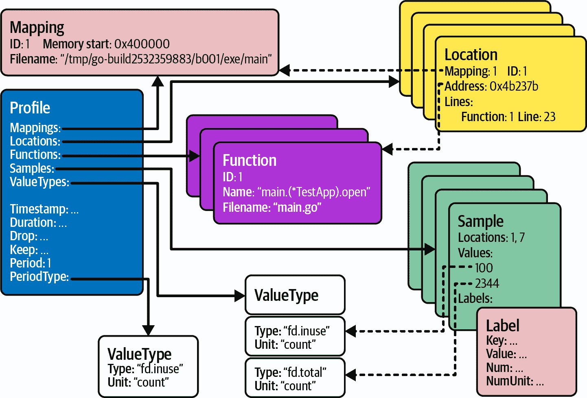

###### 图 9-1\. 以 `pprof` 格式表示的开放（使用中）和总文件描述符的高级表示

`pprof` 格式以称为 `Profile` 的单个根对象开始，其中包含以下子对象：

`Mappings`

并非每个程序在二进制文件中都有调试符号。例如，在 “理解 Go 编译器” 中，我们提到 Go 默认包含它们，以提供指向源代码的可读堆栈跟踪。但是，某些编译二进制文件的人可能会删除此信息，以显著减小二进制文件的大小。如果没有符号，`pprof` 文件可以使用堆栈帧（位置）的地址。然后，这些地址将通过后续工具动态转换为准确的源代码行，这个过程称为[符号化](https://oreil.ly/zcZKa)。映射允许指定如何将地址映射到二进制文件，如果在后续步骤中动态提供。

不幸的是，如果您需要一个二进制文件，则必须从收集配置文件的相同源代码版本和体系结构构建它。这通常非常棘手。例如，当我们从远程服务获取配置文件（更多信息请参见 “捕获分析信号”），我们在分析配置文件的机器上可能没有相同的二进制文件。

幸运的是，我们可以将所有必需的元数据存储在 `pprof` 文件中，因此不需要符号化。这是从 [Go 1.9](https://oreil.ly/qONe8) 开始用于标准配置文件的内容，因此我将跳过解释符号化技术。

`Locations`

位置是代码行（或其地址）。为方便起见，位置可以指向定义它的函数以及源代码文件名。位置本质上代表堆栈帧。

`Functions`

如果二进制文件中存在调试符号，则函数结构包含有关定义位置的函数的元数据。

`ValueTypes`

这告诉我们在我们的配置文件中有多少维度。每个位置可能负责使用某些值。值类型定义了单位以及该值的含义。我们的 示例 9-1 配置文件只有 `fd.inuse` 类型，因为当前简单的 `pprof.Profile` 不允许添加更多维度；但是为了演示，图 9-1 包含两种类型，表示总计数和当前计数。

# 贡献

`pprof` 格式的分析文件不限制分析值的含义。定义测量值语义是实现的责任。例如，在 Example 9-1 中，我将其定义为配置文件快照时存在的打开文件数。对于其他“Common Profile Instrumentation”，该值可能表示其他内容：CPU 上花费的时间、分配的字节数或在特定位置执行的 goroutine 数量。始终澄清您的分析值的含义！

通常，大多数分析值告诉我们代码中的每个部分使用某种资源或时间的量。这就是为什么在解释样本分析值时，我坚持使用*贡献*这个动词。

`Samples`

给定某个值类型的某个值的测量或测得贡献的给定堆栈跟踪。为了表示堆栈跟踪（调用序列），样本列出了从堆栈跟踪顶部开始的所有位置 ID。重要的细节是，样本必须具有等于我们定义的值类型数（及顺序）的确切数量的值。我们还可以为样本附加标签。例如，我们可以附加在该堆栈跟踪中打开的示例文件名。“Heap”使用它显示平均分配大小。

更多元数据

类似于捕获的数据，可以在分析对象中包括捕获配置文件的时间、数据跟踪持续时间（如果适用）以及一些过滤信息。其中最重要的字段之一是`period`字段，它告诉我们配置文件是否已抽样。我们在 Example 9-2 中跟踪所有已插入的`Open`调用，因此我们的`period`等于一。

带有所有这些组件，`pprof` 数据模型设计非常出色，具有描述软件任何方面的性能分析数据。它还与统计配置文件很好地配合，该配置文件捕获了发生的一小部分所有事件的数据。

在 Example 9-2 中，跟踪已打开的文件不会对应用程序造成太大的开销。也许在极端生产案例中，对每个文件打开和关闭调用`Add`和`Remove`，并在每个文件打开和关闭时映射对象，可能会减慢一些关键路径。然而，对于像“CPU”或“Heap”这样的复杂分析情况，情况要糟糕得多。对于对我们程序的 CPU 使用情况进行分析的 CPU 分析情况，跟踪每个单个周期中执行的确切指令是不切实际的（也是不可能的）。这是因为，对于每个周期，我们需要捕获一个堆栈跟踪并将其记录在内存中，就像我们在第四章中了解到的那样，这可能单独花费数百个 CPU 周期。

这就是为什么必须对 CPU 分析进行抽样的原因。这与内存等其他分析类似。正如你将在“Heap”中了解到的那样，我们对其进行抽样，因为跟踪所有单个分配将增加显著的开销，并减慢程序中的所有分配速度。

幸运的是，即使是高度采样的配置文件，分析也非常有用。按设计，分析主要用于瓶颈分析。按定义，瓶颈是使用某些资源或时间最多的东西。这意味着无论我们捕获了 100%，10% 还是甚至 1% 使用例如 CPU 时间的事件，统计上，使用 CPU 最多的代码应仍位于顶部，具有最大的使用数字。这就是为什么更昂贵的配置文件总是以某种方式进行采样，这使得 Go 开发人员可以几乎在所有程序中安全地预先启用配置文件。它还使得讨论“持续配置文件”中的持续配置文件实践成为可能。

# 统计分析不是 100% 精确

在采样的配置文件中，您可能会错过部分贡献。

类似 Go 这样的分析工具具有复杂的[缩放机制，试图找到](https://oreil.ly/DrfIA)缺少分配的概率并进行调整，通常是足够精确的。

然而，这些仅仅是近似值。有时我们会错过一些在我们的配置文件中具有较小分配的代码位置。有时真实分配比估计的略大或略小。

确保在 `pprof` 配置文件中检查 `period` 信息（详见“go tool pprof Reports”），并注意配置文件中的采样以得出正确的结论。不要因为您的基准分配数字与配置文件中的数字不完全匹配而感到惊讶和担忧。只有当我们获得周期等于一（100% 采样）的配置文件时，我们才能完全确定绝对数字。

在解释 `pprof` 标准的基础上，让我们看看可以用这种 *.pprof* 文件做些什么。幸运的是，我们有许多理解此格式并帮助我们分析分析数据的工具。

## 使用 `go tool pprof` 进行报告

有许多工具（和网站！）可以用来解析和分析 `pprof` 文件。由于其清晰的模式，您还可以轻松地编写自己的工具。然而，目前最流行的是 `google/pprof` 项目，它实现了 [`pprof` CLI 工具](https://oreil.ly/lGZJG)。同样的工具也被[Go 项目供应](https://oreil.ly/pbDk3)，这使得我们可以通过 Go CLI 使用它。例如，我们可以使用 `go tool pprof -raw fd.pprof` 命令以半人类可读格式报告所有 `pprof` 相关字段，如示例 9-3 中所示。

##### 示例 9-3\. 使用 Go CLI 的配置文件的原始调试输出

```go
go tool pprof -raw fd.pprof
PeriodType: fd.inuse count
Period: 1  Time: 2022-07-29 15:18:58.76536008 +0200 CEST
Samples:
fd.inuse/count
        100: 1 2
         10: 1 3 4
          1: 5 4
          1: 6 4
Locations
1: 0x4b237b M=1 main.(*TestApp).open example/main.go:23 s=0
    main.(*TestApp).OpenTenFiles example/main.go:33 s=0
2: 0x4b25cd M=1 main.(*TestApp).Open100FilesConcurrently.func1 (...)
3: 0x4b283a M=1 main.main example/main.go:64 s=0
4: 0x435b51 M=1 runtime.main /go1.18.3/src/runtime/proc.go:250 s=0
5: 0x4b26f2 M=1 main.main example/main.go:60 s=0
6: 0x4b2799 M=1 main.(*TestApp).open example/main.go:23 s=0
    main.(*TestApp).OpenSingleFile example/main.go:28 s=0
    main.main example/main.go:63 s=0
Mappings
1: 0x400000/0x4b3000/0x0 /tmp/go-build3464577057/b001/exe/main  [FN]
```


`-raw` 输出目前是[发现捕获配置文件时使用的最佳方式](https://oreil.ly/juE75)。使用 `head` 实用工具可以查看包含此信息的前几行，这对于大型配置文件特别有用，例如 `go tool pprof -raw fd.pprof | head`。

原始输出可以显示关于配置文件中包含的数据的一些基本信息，并帮助创建 图 9-1 中的图表。但是，有更好的方法来分析更大的配置文件。例如，如果运行 `go tool pprof fd.pprof`，它将进入一个交互模式，允许您检查不同的位置并生成各种报告。我们不会在本书中涵盖此模式，因为现在有一种几乎可以完成交互模式所有工作的更好方式——Web 查看器！

运行 Web 查看器的最常见方式是通过 Go CLI 在您的机器上运行本地服务器。使用 `-http` 标志指定要侦听的地址和端口。例如，运行 `go tool pprof -http :8080 fd.pprof` ⁷ 命令将在浏览器中打开 Web 查看器网站⁸，显示在 示例 9-2 中获取的配置文件。您将看到的第一页是基于给定的 `fd.pprof` 配置文件渲染的有向图（参见“图形”）。但在那之前，让我们熟悉一下 Web 界面中提供的顶部导航菜单，如 图 9-2 所示⁹。

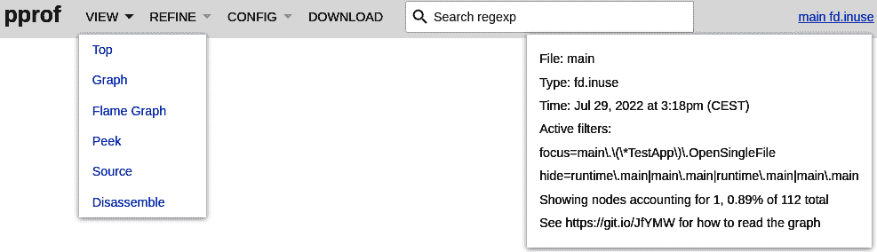

###### 图 9-2\. `pprof` 网页界面上的顶部导航

从左侧开始，顶部灰色覆盖菜单有以下按钮和输入框：¹⁰

视图

允许您选择相同配置文件数据的不同视图（报告）。我们将在下面的小节中详细介绍所有六种视图类型。它们都从稍微不同的角度显示配置文件，并有其各自的目的；您可能会偏好不同的视图。它们是从位置层次结构（堆栈跟踪）生成的，可以从 图 9-1 的样本中重建。

样本

由于我们只有一种样本值类型（具有 `count` 单位的 `fd.inuse` 类型），所以此菜单选项在 图 9-2 中不可见，但对于具有更多类型的配置文件，样本菜单允许我们选择要使用的样本类型（一次只能使用一个）。这通常出现在堆配置文件中。

精化

此菜单仅在图形和顶部视图中有效（参见“图形”和“顶部”）。它允许将图形或顶部视图过滤到特定的兴趣位置：图中的节点和顶部表中的行。对于具有数百个或更多位置的非常复杂的配置文件，这一功能尤其有用。要使用它，请单击一个或多个图形节点或顶部表中的行以选择位置。然后点击“精化”，选择是要关注、忽略、隐藏还是显示它们。

“关注”和“忽略”控制通过所选节点或行的样本的可见性，允许您关注或忽略完整的堆栈跟踪。“隐藏”和“显示”仅控制节点或行的可见性，而不影响样本。

可以使用[`go tool pprof` CLI](https://oreil.ly/OVQLC)中的 `-focus` 和其他标志来应用相同的过滤。此外，"REFINE" > "Reset" 选项会将我们带回非过滤视图，如果切换到不支持精细选项的视图，则仅持续 "Focus" 值。

当你想要查找特定代码路径的确切贡献时，"Focus" 和 "Ignore" 是非常有用的。另一方面，当你想要向某人展示图形或作为文档以获得更清晰的视图时，可以使用 "Hide" 和 "Show"。

如果你试图在脑中将代码与配置文件相关联，不要使用这些选项，因为你可能会在你的分析旅程初期容易混淆。

"CONFIG"

你从"REFINE"选项中使用的细化设置会保存在 URL 中。但是，你可以将这些设置保存到特殊的命名配置（以及用于图形视图的缩放选项）。点击"CONFIG" > "Save As …"，然后选择你将要使用的配置。"Default" 配置的作用类似于 "REFINE" > "Reset"。配置保存在 [*<os.UserConfigDir>/pprof/settings.json*](https://oreil.ly/nWfnq) 中。在我的 Linux 机器上，它位于 *~/.config/pprof/settings.json*。如果你切换到其他视图，此选项也仅在 "Top" 和 "Graph" 视图上有效，并在自动切换到其他视图时更改为 "Default"。

DOWNLOAD

此选项下载了与`go tool pprof`中使用的相同配置文件。如果某人在远程服务器上公开了 Web 视图，并且你希望保存远程配置文件，则此选项非常有用。

搜索正则表达式

你可以使用[RE2 正则表达式](https://oreil.ly/c0vAq)语法来搜索感兴趣的样本，可以通过位置的函数名称、文件名或对象名称进行设置 "Focus" 选项。在某些视图中，如 "Top"、"Graph" 和 "os.ReadFile"，接口在你输入表达式时还会突出显示匹配的样本。

二进制名称和样本类型

在右上角是一个链接，带有所选的二进制名称和样本值类型。你可以点击此菜单项，打开一个小弹窗，快速查看关于配置文件、视图和正在运行选项的统计信息。例如，当你点击链接并启用一些 "REFINE" 选项时，可以看到 Figure 9-2 的内容。

在深入了解`pprof`工具中的不同视图之前，我们必须理解"Flat" 和 "Cumulative"（简称 "Cum"）对于某些位置粒度的重要概念。

每个`pprof`视图显示一个或多个位置的 "Flat" 和 "Cumulative" 值：

+   "Flat" 表示某个节点对资源或时间使用的*直接*责任。

+   "Cumulative" 是*直接*和*间接*贡献的总和。间接意味着这些位置并没有直接创建任何资源（或者在任何时候未被直接使用），但可能调用了一个或多个执行此操作的函数。

使用代码示例最好详细解释这些定义。让我们使用 示例 9-2 中的 `main()` 函数的一部分，这在 示例 9-4 中介绍。

##### 示例 9-4\. 示例 9-2 的片段解释了 Flat 和累积值

```go
func main() { 
    // ...

    f, _ := fd.Open("/dev/null") // TODO: Check error. 
    a.files = append(a.files, f) 

    a.OpenSingleFile("/dev/null")
    a.OpenTenFiles("/dev/null") 

    // ...
}
```


分析紧密地与堆栈跟踪结合在一起，表示导致特定样本的调用序列，因此在我们的情况下是打开文件。然而，我们可以聚合通过 `main()` 函数的所有样本来学习更多。在这种情况下，`main()` 函数的打开文件的 Flat 数是 1，Cum 数是 12。这是因为在主函数中，我们直接只打开了一个文件（通过 `fd.Open`）；¹¹ 其余文件是通过链式（后代）函数打开的。


根据我们的 *fd.pprof* 文件，我们发现此代码行的 Flat 值是 1，Cum 值是 1。它直接打开了一个文件，并且没有间接地增加任何文件描述符的使用。


`append` 不贡献任何样本。因此，任何样本不应包含此代码行。


调用 `a.OpenSingleFile` 方法的代码行的 Flat 值为 0，Cum 值为 1。同样，`a.OpenTenFiles` 方法的 Flat 值为 0，Cum 值为 10。在 CPU 执行此程序行的时刻，它们都没有创建（尚未）任何文件。

我觉得 Flat 和 Cum 的名称相当令人困惑，因此在进一步的内容中将使用直接和累积这两个术语。这两个数字有助于比较代码的哪些部分对资源使用（或使用时间）有贡献。累积数字帮助我们了解哪个流程更昂贵，而直接值告诉我们潜在瓶颈的来源。

让我们浏览不同的视图，看看如何使用它们来分析在 示例 9-2 中获得的 *fd.pprof* 文件。

### Top

首先是 VIEW 列表上的 Top 报告，显示了按功能分组的每个位置的统计表。*fd.pprof* 文件的视图显示在 图 9-3 中。

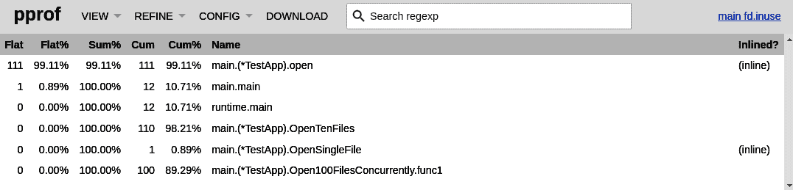

###### 图 9-3\. Top 视图按直接值排序

每一行代表单个功能的直接和累积的打开文件的贡献，正如我们从 示例 9-4 中学到的那样，聚合了该功能内一个或多个行的使用情况。这称为函数粒度，可以通过 URL 或 CLI 标志进行配置。

我们已经定义了 Flat 和 Cum 列的值所代表的含义。此视图中的其他列包括：

Flat%

行的直接贡献百分比，占程序总贡献的比例。在我们的案例中，99.11%的打开文件描述符是直接由`open`方法创建的（共 112 个中的 111 个）。

总和%

第三列是从顶部到当前流的所有直接值的百分比对总贡献的百分比。例如，前两行直接负责所有 112 个文件描述符。此统计数据允许我们将注意力集中在可能对我们的瓶颈分析最重要的函数上。

累积%

行的累积贡献百分比，占程序总贡献的比例。

# 当涉及到 goroutines 时要小心

在某些与 goroutines 相关的情况下，累积值可能会具有误导性。例如，图 9-3 表明`runtime.main`累计打开了 12 个文件。然而，从示例 9-2 中可以看出，它还执行了`Open100FilesConcurrently`方法，然后作为新的 goroutine 执行`Open100FilesConcurrently.func1`（匿名函数）。我期望在图形中从`runtime.main`到`Open100FilesConcurrently.func1`有一个链接，并且`runtime.main`的累积值为 112。

问题在于 Go 中每个 goroutine 的堆栈跟踪始终是分开的。因此，我们不能确定哪个 goroutine 创建了哪个 goroutine，这一点在我们查看 Goroutine 中的 goroutine 分析时会更加清楚。在分析程序瓶颈时，我们必须牢记这一点。

名称和内联

位置的函数名以及编译期间是否内联。在示例 9-2 中，`open`和`OpenSingleFile`都足够简单，编译器可以将它们内联到父函数中。您可以通过在`pprof`命令中添加`-noinlines`标志或在 URL 参数中添加`?noinlines=t`来表示内联后的二进制情况。看到内联之前的情况仍然推荐，以更轻松地映射源代码发生的情况。

我们 Top 表中的行排序顺序是按直接贡献排序的，但我们可以通过`-cum`标志改变为按累积值排序。我们还可以单击表中每个标题以触发此视图中不同的排序。

Top 视图可能是查找负责使用您正在分析的资源或时间的函数（或文件或行，取决于所选择的粒度）的最简单和最快的方法。缺点是它不告诉我们这些行之间的确切链接，这些链接可以告诉我们哪些代码流（完整的堆栈跟踪）可能触发了使用情况。对于这种情况，使用下一节中解释的图形视图可能是值得的。

### 图形

图形视图是打开`pprof`工具网页界面时首先看到的东西。这并非没有原因——如果我们能够将事物[可视化](https://oreil.ly/VElUH)，人类的工作效率会更高，而不是从文本报告中进行解析和可视化。这也是我最喜欢的视图，特别是对于来自不太熟悉的代码库获取的性能分析。

要渲染图形视图，`pprof`工具会根据提供的 [DOT](https://oreil.ly/HiRV9) 格式的性能分析文件生成一个图形化的有向无环图（DAG）。然后我们可以使用 `-dot` 标志与 `go tool pprof`，并使用其他渲染工具将其渲染为我们想要的格式，如 `-svg`、`-png`、`-jpg`、`-gif` 或 `-pdf`。另一方面，`-http` 选项会生成一个临时的 `.svg` 格式图形，并从中启动网页浏览器。从浏览器中，我们可以在图形视图中看到 `.svg` 可视化，并使用之前解释的交互式“REFINE”选项：缩放、放大和通过图形移动。我们 *fd.pprof* 格式的示例图形视图显示在图 9-4 中。

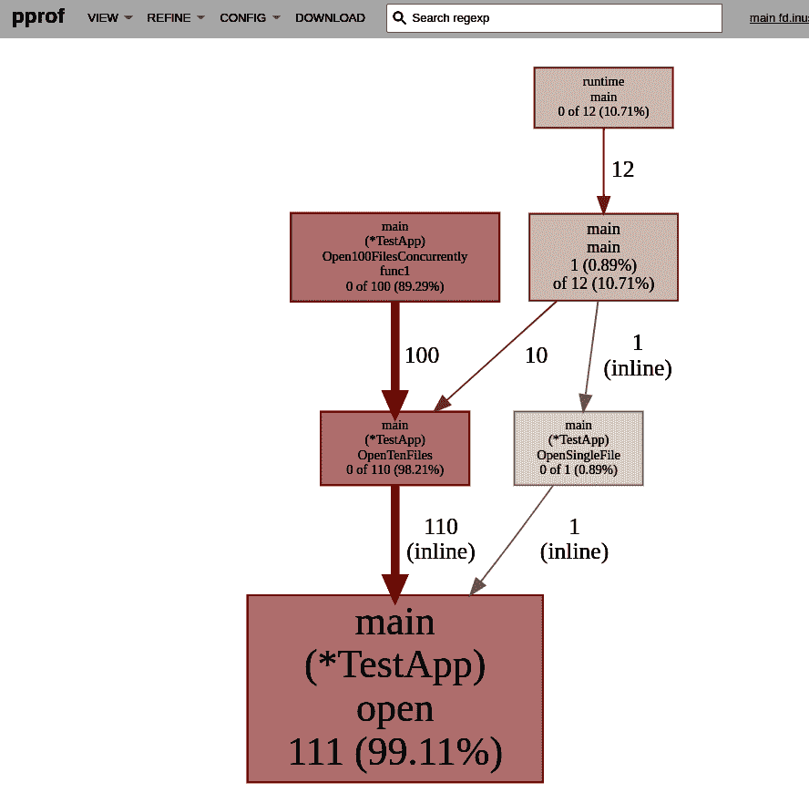

###### 图 9-4\. 示例 9-2 的图形视图，使用函数粒度

我喜欢这个视图的原因在于它清晰地表示了程序中不同执行部分在资源或时间使用方面的关系（层次结构）。虽然可能很诱人，但你不能移动节点。你只能使用“REFINE”选项来隐藏或显示它们。在节点上悬停还会显示完整的包名称或代码行。

此外，这个图的每个方面都有其含义，有助于找到最昂贵的部分。让我们来看看图的属性：

节点

每个节点代表当前打开文件的函数的贡献。这就是为什么节点文本的第一部分显示了 Go 包和函数（或方法）。如果我们选择不同的粒度，我们将看到代码行或文件。节点的第二部分显示了直接和累计值。如果这些值中的任何一个非零，我们会看到该值对总贡献的百分比。例如，在图 9-4 中，我们看到 `main.main()` 节点（右侧）确认了我们在示例 9-4 中找到的数字。使用 `pprof`，我们记录了该函数的 1 个直接贡献和 12 个累计贡献。颜色和大小也告诉我们一些信息：

+   节点的大小表示直接贡献。节点越大，直接使用的资源或时间越多。

+   边框和填充颜色代表累计值。正常颜色是金色。大的正累计数会使节点变为红色。接近零的累计值会使节点变灰。

边缘

每条边代表函数（文件或行）之间的调用路径。调用不需要是直接的。例如，如果您使用 `REFINE` 选项，可以隐藏在两者之间调用的多个节点，导致边显示间接链接。边上的值表示该代码路径的累计贡献。边旁边的 `inline` 词告诉我们，该边所指向的调用已内联到调用者中。其他特性也很重要：

+   边的粗细表示路径的累计贡献。边越粗，使用的资源越多。

+   颜色显示相同。通常边是金色的。较大的正值将边着色为红色，接近零则为灰色。

+   虚线边表示删除了某些连接位置，例如因为节点限制。¹²

# 有些节点可能会被隐藏！

如果在图形视图中未看到资源分析中每次贡献，不要感到惊讶。正如我之前提到的，大多数配置文件是抽样的。这意味着从结果配置文件中可能会漏掉少量贡献的位置。

第二个原因是 `pprof` 视图中的节点限制。默认情况下，为了可读性，最多显示[80 个节点](https://oreil.ly/Wcwsu)。您可以使用 `-nodecount` 标志来更改此限制。

最后，`-edgefraction` 和 `-nodefraction` 设置会隐藏那些直接贡献比例低于指定值的边和节点。默认情况下（[默认](https://oreil.ly/oVfrt)），节点比例为 0.005（0.5%），边比例为 0.001（0.1%）。

理论放一边，我们从 `pprof` 图形视图中可以学到什么？这个视图非常适合了解效率瓶颈及其来源。从 图 9-4 我们可以立即看出，最大的累计贡献者是 `Open100FilesConcurrently`，它似乎是一个新的 goroutine，因为它与 `runtime/main` 函数没有连接。首先优化该路径可能是个不错的主意。最多打开文件来自 `OpenTenFiles` 和 `open`。这告诉我们，这是该资源效率的关键路径。如果某些新功能要求在每次 `open` 调用时创建额外的文件，我们将看到我们的 Go 程序打开的文件描述符数量显著增加。

Graph 视图是了解应用程序不同功能如何影响程序资源使用的绝佳方法。这对于具有大型依赖项的复杂程序尤其重要，这些依赖项并非您的团队创建。事实证明，误解依赖库的正确使用方法很容易。不幸的是，这也意味着会有很多您不认识或不理解的函数名或代码行。参见 图 9-5，取自我们在 “使用并发优化延迟” 中优化的 `Sum`。

这个结果也证明了在不同粒度之间切换的技能的重要性。只需向 URL 添加 `?g=lines`，就可以切换到行粒度——这比使用 `-lines` 标志重新打开 `go tool pprof` 效果更好。

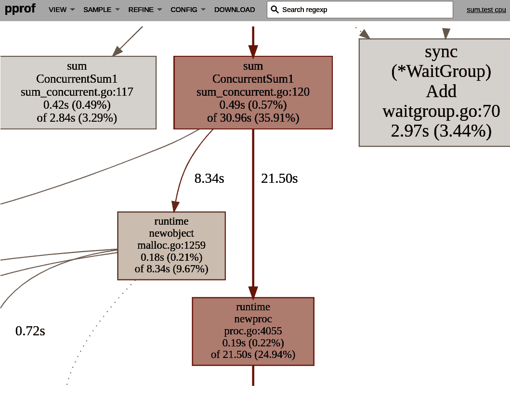

###### 图 9-5\. 来自 示例 10-10 的 Graph 视图的片段，使用行粒度

接下来是 `pprof` 工具的最新功能——Flame Graph 视图，许多 Go 社区成员喜欢使用。让我们深入了解。

### Flame Graph

`pprof` 中的 Flame Graph 视图（有时也称为冰柱图）受到 Brendan Gregg 的 [工作](https://oreil.ly/sKFbH) 的启发，最初专注于 CPU 分析。

> Flame Graph 是一种可视化栈跟踪（也称为调用堆栈）的图表，显示为倒置的冰柱布局。Flame Graph 通常用于可视化 CPU 分析器的输出，其中通过采样收集栈跟踪。
> 
> Brendan Gregg，《炎图》[“The Flame Graphs”](https://oreil.ly/RAsrK)

从 *fd.pprof* 渲染的 Flame Graph 报告显示在 图 9-6 中。

# 段的颜色和顺序通常不重要

这取决于渲染 Flame Graph 的工具，但对于 `pprof` 工具来说，颜色和顺序在这里都没有意义。段通常按位置名称或标签值排序。

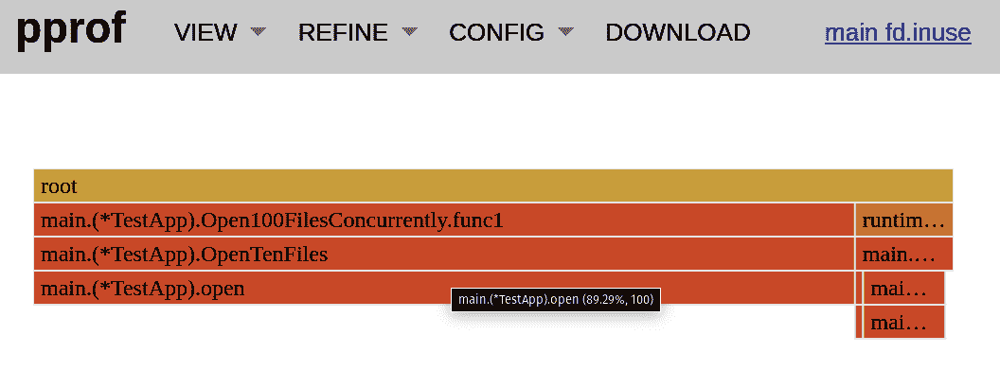

###### 图 9-6\. 示例 9-2 的 Flame Graph 视图，具有函数粒度

`pprof` 是原始 Flame Graph 的倒置版本，其中每个重要的代码流形成一个单独的冰柱。这里主要关注的属性是矩形段的宽度，代表了 Graph 视图中的节点——在我们的案例中是函数。方块越宽，贡献的累积值就越大。您可以悬停在单个段上查看它们的绝对值和百分比累积值。单击每个块以聚焦于给定的代码路径。

与其关注冰柱的高度，不如查看位于当前段上方的调用层次结构。这里重要的是宽度，而不是高度。

在某种程度上，Flame Graph 通常受到更高级工程师的青睐，因为它更加紧凑。它允许对系统的最大瓶颈进行实用的洞察。它立即显示每个代码路径贡献的所有资源的百分比。一眼就能看出，在图 9-6 中，我们可以立即知道没有任何互动，`Open100FilesConcurrently.func1`是主要的打开文件瓶颈，大约使用了 90%的资源。Flame Graph 也非常适合显示是否存在任何主要的瓶颈。在某些情况下，许多小的贡献者一起可能生成大量使用。Flame Graph 将立即告诉我们这种情况。请注意，类似于图 9-4 视图，它可能会从视图中删除许多节点。如果单击右上角的二进制名称，将显示删除的节点数。

我们讨论过的三个视图之一——Top、Graph 或 Flame Graph——应该是查找程序效率最大瓶颈的第一关键点。请记住关于抽样，切换粒度以获取更多信息，并首先关注最大的瓶颈。但是，还值得简要提及另外三个视图：Peek、Source 和 Disassemble。让我们在下一节中看一下它们。

### Peek、Source 和 Disassemble

另外三个视图——Peek、Source 和 Disassemble——不受粒度选项影响。它们都显示位置的原始行或地址级别，特别适用于想要回到源代码并专注于喜欢的 IDE 内部代码优化的情况。

Peek 视图提供了类似于 Top 视图的表格。唯一的区别在于，每个代码行都显示所有直接调用者及其在 Call 和 Calls% 列中的使用分布情况。这在有许多调用者的情况下非常有帮助，您可以缩小贡献最大的代码路径。

我最喜欢的工具之一是 Source 视图。它显示程序源代码上下文中的确切代码行。此外，它还显示前后几行。不幸的是，输出没有排序，因此您必须使用之前的视图来了解要关注的函数或代码行，并使用搜索功能来专注于您想要的内容。例如，我们可以看到直接映射到我们代码中的`Open100FilesConcurrently`的直接和累积贡献，如图 9-7 所示。

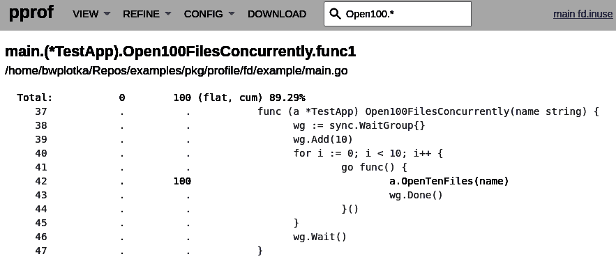

###### 图 9-7\. 示例 9-2 的源视图，专注于`Open100FilesConcurrently`搜索

对我而言，源视图中有些特别之处。直接映射到代码语句中的打开文件描述符、分配点、CPU 时间等，在你的源代码中给出了比在图 9-4 中看到的一堆框更大的理解和认识。对于标准库代码，或者当你提供一个二进制文件（如为 Disassemble 视图所述），你还可以点击一个函数来显示它的汇编代码！

当我们分析代码的“复杂性分析”时，源视图非常有用。如果你不能完全理解代码的某个部分使用资源的原因，我建议使用源视图。

最后，Disassemble 视图对于高级分析非常有用。它提供源视图，但是在汇编级别上（参见“汇编”）。它允许检查围绕有问题的代码的编译详细信息。此视图需要提供从与你采取配置文件的程序相同的源代码构建的二进制文件。例如，对于我的情况，通过路径使用`go tool pprof -http :8080 pkg/profile/fd/example/main fd.pprof`提供静态构建的二进制文件来获取*fd.inuse*文件。¹³

目前，没有机制会检查你是否使用了正确的程序二进制文件来分析你的配置文件。因此，结果可能会偶然正确，也可能完全错误。在错误情况下的结果是不确定的，因此请确保提供正确的二进制文件！

`pprof` 工具是确认你关于应用程序效率和可能问题原因的初始猜测的绝佳方式，以数据驱动的方式。在本节中你获得的技能的惊人之处在于，所述的文本和`pprof`配置文件的视觉表示不仅仅被原生的`pprof`工具使用。类似的视图和技术也被许多其他分析工具和付费供应商服务所采用，比如[Polar Signals](https://oreil.ly/HowVb)、[Grafana Phlare](https://oreil.ly/Ru0Hu)、[Google Profiler](https://oreil.ly/mJu6V)、[Datadog 的持续性分析](https://oreil.ly/WF9fG)、[Pyroscope 项目](https://oreil.ly/eKyK7)等等！

很可能你的 Go IDE¹⁴也支持渲染和收集`pprof`配置文件。使用 IDE 非常好，因为它可以直接集成到你的源代码中，并通过位置实现平滑导航。但是，我更喜欢像[Parca 项目](https://oreil.ly/2PKkx)这样基于`go tool pprof`和`pprof`工具的云项目，因为我们经常需要在宏基准测试级别上进行分析（参见“宏基准测试”）。

当格式和可视化描述完成后，让我们深入了解如何从你的 Go 程序中获取配置文件。

# 捕获分析信号

最近，我们开始将性能分析视为 [第四种可观察性信号](https://oreil.ly/zlAis)。这是因为性能分析在很多方面与第六章中讨论的其他信号（如指标、日志记录和跟踪）非常相似。例如，与其他信号类似，我们需要仪表化和可靠的实验来获取有意义的数据。

我们讨论了如何编写 “pprof 格式” 的自定义仪表化，我们将介绍 Go 运行时中常见的现有性能分析器。然而，仅仅能够获取关于程序各种资源使用情况的概要是不够的——我们还需要知道如何触发能为我们提供所需效率瓶颈信息的情况。

幸运的是，我们已经通过 “实验的可靠性” 和 “基准测试水平” 来解释了可靠的实验。性能分析实践旨在与我们的基准测试过程自然集成。这使得我们的 TFBO 循环中的实际优化工作流得以顺利进行（“高效开发流程”）：

1.  我们在所需级别（微观、宏观或生产）上执行基准测试，以确保程序的效率。

1.  如果我们对结果不满意，我们可以重新运行相同的基准测试，并在实验期间或结束时捕获性能概要，以找出效率瓶颈。

# 始终开启性能分析

您可以设计您的工作流程，以避免需要重新运行基准测试以捕获性能概要。在 “微基准测试” 中，我建议在大多数 Go 基准测试中始终捕获您的性能概要。在 “持续性能分析” 中，您将学习如何在宏观或生产级别上持续进行性能分析！

拥有仪表化和正确的实验（重用基准测试）是很好的。但我们还需要学习如何触发并将所选仪表化的概要传输到您在 “go tool pprof 报告” 中学到的工具进行分析。

我们需要了解用于我们想要使用的性能分析器的 API。正如我们在 第六章 中学到的，类似于其他信号，我们通常有两种主要的仪表化类型：自动仪表化和手动仪表化。关于前一种模型，有很多方法可以在不添加一行代码的情况下获取有关我们的 Go 程序的性能概要！使用像 [eBPF](https://oreil.ly/8mqs6) 这样的技术，我们可以对我们的 Go 程序的几乎任何资源使用进行仪表化。许多开源项目、初创公司或成熟供应商正在致力于使这个领域变得更加可访问和易于使用。

然而，所有事情都是一种权衡。eBPF 技术仍处于早期阶段，仅在 Linux 上工作。在不同的 Linux 内核版本和非平凡的可维护性成本之间存在一些可移植性挑战。通常它也是一个通用解决方案，无法像我们现在使用更多手动的进程内分析工具那样提供相同的可靠性和能力来提供语义化、应用级别的分析。最后，这是一本关于 Go 编程语言的书，所以我很想分享如何创建、捕获和使用本地进程内分析工具。

使用仪器的 API 取决于其实现。例如，你可以编写一个分析器，每分钟或每次发生某个事件时（例如，[捕获特定的 Linux 信号时](https://oreil.ly/xCW7u)），将分析结果保存到磁盘上。然而，通常在 Go 社区中，我们可以概述三种主要的触发和保存分析结果的模式：

通过编程方式触发

大多数你会看到并且在 Go 中使用的分析器都可以手动插入到你的代码中，在你希望保存分析结果时进行。这就是我在 Example 9-2 中使用的方法，用于捕获我们在 “go tool pprof Reports” 中分析的 *fd.pprof* 文件。典型的接口具有类似于 `WriteTo(w io.Writer) error` 的签名，它会从程序运行开始记录的样本。然后，以 `pprof` 格式将分析结果写入你选择的写入器（通常是文件）。

一些性能分析工具在开始记录样本时会设置一个明确的起点。例如，CPU 分析器（参见 “CPU”）有一个类似于 `StartCPUProfile(w io.Writer) error` 的签名来启动周期，然后使用 `StopCPUProfile()` 来结束分析周期。

这种使用分析的模式非常适合在开发环境中进行快速测试或在微基准测试代码中使用（参见 “Microbenchmarks”）。然而，通常开发者不会直接使用它。相反，他们经常将其用作构建两种其他模式的基础：Go 基准测试集成和 HTTP 处理程序：

Go 基准测试集成

正如我在 Example 8-4 中提供的一个 Go 基准测试的示例命令，你可以通过在 `go test` 工具中指定标志来获取微基准测试中的所有标准分析结果。几乎所有在 “Common Profile Instrumentation” 中解释的分析都可以通过 `-memprofile`、`-cpuprofile`、`-blockprofile` 和 `-mutexprofile` 标志进行启用。除非你想在特定时刻触发分析，否则不需要将自定义代码放入你的基准测试中。目前还不支持自定义分析。

HTTP 处理程序

最后，HTTP 服务器是在宏观和生产级别捕获程序配置文件的最常见方法。这种模式对于默认接受 HTTP 连接进行后端 Go 应用程序特别有用。因此，为了正常使用，建议添加专门的 HTTP 处理程序用于分析和其他监控功能（例如 Prometheus 的`/metrics`端点）。接下来我们将探讨这种模式。

标准 Go 库为所有使用`pprof.Profile`结构的分析器提供了 HTTP 服务器处理程序，例如我们的示例 9-1 分析器或任何在“Common Profile Instrumentation”中解释的标准配置文件。您可以将这些处理程序添加到您的`http.Server`中，如示例 9-5 中所示，通过几行代码即可在您的 Go 程序中进行设置。

##### 示例 9-5\. 使用自定义和标准分析器创建 HTTP 服务器

```go
import (
    "net/http"
    "net/http/pprof"

    "github.com/felixge/fgprof"
)

// ...

m := http.NewServeMux() 
m.HandleFunc("/debug/pprof/", pprof.Index) 
m.HandleFunc("/debug/pprof/profile", pprof.Profile) 
m.HandleFunc("/debug/fgprof/profile", fgprof.Handler().ServeHTTP) 

srv := http.Server{Handler: m}

// Start server...
```


`Mux` 结构允许在特定 HTTP 路径上注册 HTTP 服务器处理程序。导入`_ "net/http/pprof"`将默认在全局默认 Mux (`http.DefaultServeMux`) 中注册标准配置文件。然而，我始终建议创建一个新的空 Mux，而不是使用全局 Mux，以明确注册的路径。这就是为什么在我的示例中我手动注册它们的原因。


`pprof.Index` 处理程序公开一个根 HTML 索引页面，列出快速统计信息，并链接到使用`pprof.NewProfile`注册的分析器。示例视图如图 9-8 所示。此外，此处理程序将每个按名称引用的分析器转发到相应的位置；例如，`/debug/pprof/heap`将转发到堆分析器（参见“Heap”）。最后，此处理程序添加到注册的`profile`行下的`cmdline`和`trace`处理程序的链接，这些处理程序提供了进一步的调试能力。


标准的 Go CPU 不使用`pprof.Profile`，因此我们必须显式注册该 HTTP 路径。


相同的配置文件捕获方法可以用于第三方分析器，例如称为`fgprof`的“Off-CPU Time”分析器。

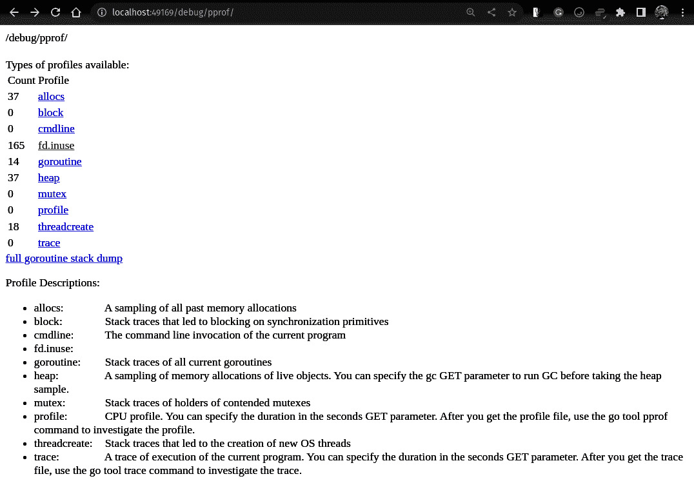

###### 图 9-8\. 从示例 9-5 中创建的服务器的 debug/pprof/ 路径提供的 HTML 页面

如果您忘记分析器使用的名称或您的 Go 程序中有哪些分析器，索引页面非常有用。请注意，我们的自定义示例 9-1 分析器也在列表中（`fd.inuse`，具有 165 个文件¹⁵），因为它是使用`pprof.NewProfile`创建的。对于不导入包含示例 9-1 中代码的`fd`包的程序，这个索引页面将缺少`fd.inuse`行。

一个漂亮的调试页面并非 HTTP 处理程序的主要目的。它们的基本优势在于人工操作员或自动化可以从外部动态捕获配置文件，在宏观测试、事故或正常生产运行的最相关时刻触发它们。根据我的经验，我发现通过 HTTP 协议使用配置文件工具有四种方式：

+   您可以在可见的 HTML 页面中点击所需配置文件工具的链接，例如图 9-8 中的`heap`。这将打开`http://<address>/debug/pprof/heap?debug=1`链接，该链接会打印当前时刻每个堆栈跟踪样本的数量——一个简化的文本格式内存配置文件。

+   移除`debug`参数将以`pprof`格式下载所需的配置文件；例如，在浏览器中访问`http://<address>/debug/pprof/heap`链接将下载“堆”中解释的内存配置文件到本地文件。然后，您可以使用`go tool pprof`打开此文件，如我在“go tool pprof 报告”中所解释的那样。

+   您可以直接将`pprof`工具指向配置文件工具的 URL，避免手动下载文件的过程。例如，如果在我们的终端中运行`go tool pprof -http :8080 http://<address>/debug/pprof/heap`，我们可以打开一个内存配置文件的 Web 配置文件查看器。

+   最后，我们可以使用另一个服务器定期将这些配置文件收集到专用数据库中，例如使用[Phlare](https://oreil.ly/Ru0Hu)或[Parca](https://oreil.ly/2PKkx)项目，在“连续分析”中有详细解释。

总结一下，使用您认为对分析的程序更方便的工具。在微服务架构中，性能分析对理解复杂生产应用程序的效率非常有帮助，因此捕获配置文件的 HTTP API 模式通常是我使用的。Go 基准测试分析可能是最有用的微观级别分析。提到的访问模式在 Go 社区中很常见，但这并不意味着您不能创新并编写适合您工作流程的捕获流程。

为了解释“go tool pprof 报告”中的视图类型，`pprof`格式和自定义配置文件工具，我创建了最简单的文件描述符配置文件工具（示例 9-1）。幸运的是，我们不需要编写我们自己的配置工具来获得对常见机器资源的强大分析。Go 自带了几种标准的配置文件工具，由社区和全球用户广泛维护和使用。另外，我还会提到开源社区中一个有用的额外配置工具。让我们在下一节详细介绍这些内容。

# 常见的配置文件工具

在第 4 和第五章中，我解释了我们优化的两个主要资源——CPU 时间和内存。我还讨论了这些资源如何影响延迟。初次接触整个领域可能会令人生畏，鉴于其复杂性和在“实验的可靠性”中的关注点。这就是为什么理解 Go 具有哪些常见的 profiling 实现以及如何使用它们至关重要的原因。我们将从堆 profiling 开始。

## 堆

`heap` profile，有时也被称为`alloc` profile，提供了一种可靠的方法来找出堆上分配的内存的主要贡献者（在“Go 内存管理”中解释）。然而，类似于“内存使用”中提到的`go_mem⁠stats_heap`指标，它只显示在堆上分配的内存块，而不包括在栈上分配的内存或自定义的`mmap`调用。尽管如此，Go 程序内存的堆部分通常是最大的问题所在；因此，堆 profile 在我的经验中通常非常有用。

您可以使用[`pprof.Lookup​("heap").WriteTo(w, 0)`](https://oreil.ly/kMjqJ)将堆 profile 重定向到`io.Writer`，在 Go benchmark 中使用`-memprofile`，或通过调用`/debug/pprof/heap` URL 与处理程序，如示例 9-5 所示。¹⁶

内存 profiler 必须具备高效性才能实现实际目的。这就是为什么`heap` profiler 是经过抽样的，并且深度集成到负责分配值、指针和内存块的[Go 运行时分配器流程](https://oreil.ly/NF1ni)中的原因（参见“值、指针和内存块”）。抽样可以通过[`runtime.MemProfileRate`变量](https://oreil.ly/iJaAU)（或`GODEBUG=memprofilerate=X`环境变量）进行控制，定义为每分配 512 KB 堆上内存时记录一个 profile 样本的平均字节数。默认情况下，Go 在每分配 512 KB 堆上内存时记录一个样本。

# 您应该选择哪种内存 profiling 率？

我建议不要更改 512 KB 的默认值。对于大多数 Go 程序的实际瓶颈分析来说，这个值已经足够低，并且便宜，因此我们总是可以使用它。

对于更详细的分析数值或者优化关键路径上较小的分配大小，考虑将其更改为一字节以记录程序中的所有分配情况。然而，这可能会影响应用程序的延迟和 CPU 时间（这将在 CPU profile 中可见）。尽管如此，在对内存进行重点测试时可能会很有效。

如果单个函数中有多个分配，通常有必要以`lines`粒度分析堆 profile（在 Web 查看器中添加`&g=lines` URL 参数）。例如，`e2e`框架中`labeler`的一个堆 profile 示例（见“Go e2e Framework”）在图 9-9 中展示。

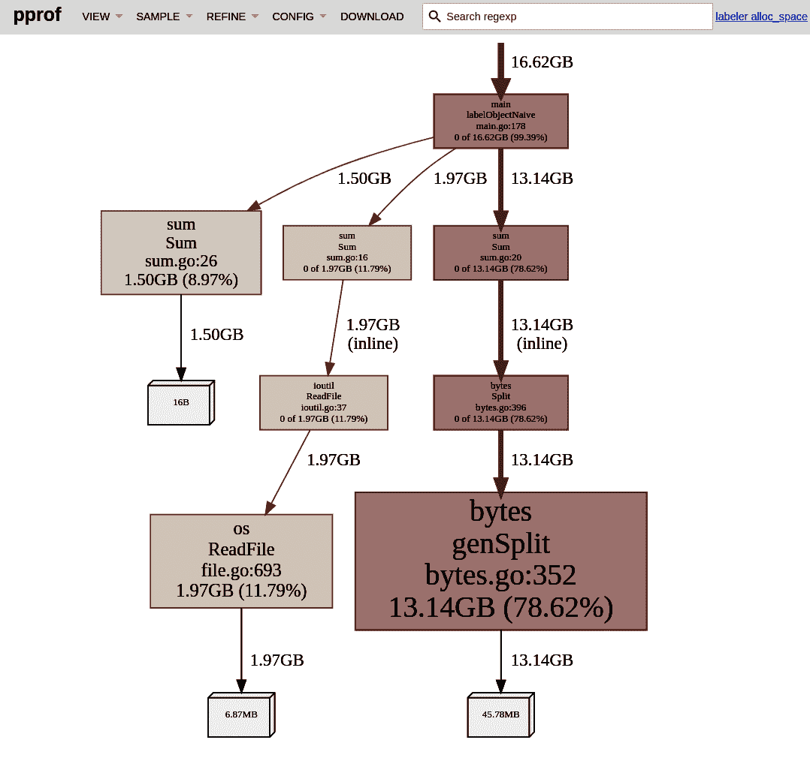

###### 图 9-9\. `alloc_space` 维度和 `lines` 粒度中来自 示例 4-1 中 `labeler` `Sum` 代码的 `heap` 剖析的放大图形视图

`heap` 剖析的独特之处在于它有四种值（样本）类型，您可以在新的“样本”菜单项中选择。当前选定的值类型显示在右上角。每种类型在不同情况下都很有用：

`alloc_space`

在这种模式下，样本值表示自程序启动以来在堆上按位置分配的总字节数。这意味着我们将看到过去分配的所有内存，但大部分可能已经被垃圾收集释放了。

在这里看到巨大的值并不奇怪！例如，如果程序运行时间较长，一个函数每分钟分配 100 KB，那么在 30 天后就会达到约 411 GB。看起来很可怕，但在这 30 天内，同一个应用程序可能只使用了最多 10 MB 的物理内存。

总历史分配量在代码中非常有用，因为它总共分配了过去最大的字节数，这可能导致程序使用的最大内存量问题。即使某些位置的分配量很小但非常频繁，这可能是垃圾收集的影响（参见“垃圾收集”）。`alloc_space` 对于发现过去分配了大空间的事件也非常有用。

例如，在图 9-9 中，我们看到 `bytes.Split` 函数累积内存使用了 78.6%。这种知识在“优化内存使用”的示例中将非常有价值。正如我们在“Go 基准测试”中已经看到的那样，分配的次数远远超过数据集，因此必须找到一种更廉价的内存解决方案来拆分字符串为行。

# 重置累积分配

我们无法以编程方式重置堆剖析器，例如从某个时刻开始记录分配。

然而，正如您将在“比较和聚合分析”中学到的，我们可以执行像减去 `pprof` 值这样的操作。例如，我们可以在时刻 A 捕获堆剖析，然后 30 秒后在时刻 B 捕获，创建一个“delta”堆剖析，显示这 30 秒内发生了哪些分配。

Go `pprof` HTTP 处理程序还有一个隐藏功能。在捕获 `heap` 剖析时，您可以添加 `seconds` 参数！例如，使用示例 9-5，您可以调用 `http://<address>/debug/pprof/heap?seconds=30s` 来远程捕获一个增量堆剖析！

`alloc_objects`

类似于 `alloc_space`，该值告诉我们分配的内存块数，而不是实际空间。这主要用于找出由频繁分配引起的延迟瓶颈。

`inuse_space`

这种模式显示了堆上当前分配的字节—在每个位置上分配的内存减去释放的内存。这种值类型非常适用于当我们想要在程序特定时刻找到内存瓶颈的情况。¹⁷

最后，这种模式非常适合查找内存泄漏。在分析中，不断分配而从未释放的内存将突出显示。

# 查找内存泄漏的源头

`heap` 分析显示分配内存块的代码，而不显示当前引用这些内存块的代码（例如变量）。要发现后者，我们可以使用分析当前形成的堆的 [`viewcore` 工具](https://oreil.ly/c4rGl)。然而，这并不是一件简单的事情。

相反，首先尝试静态分析代码路径，找出可能被引用的创建结构的位置。但即便如此，在下一节中，先检查 `goroutine` 分析非常重要。我们将在 “不要泄露资源” 中讨论这个问题。

`inuse_objects`

这个值显示了堆上当前分配的内存块（对象）的数量。这对于揭示堆上活跃对象的数量非常有用，这反映了垃圾收集工作量（参见 “垃圾收集”）。大部分 CPU 密集型垃圾收集工作在必须遍历堆中对象的标记阶段进行。因此，拥有的对象越多，分配可能带来的负面影响越大。

对于每一位关注程序效率的 Go 开发者来说，掌握 `heap` 分析技巧至关重要。集中精力分析对内存分配空间贡献最大的代码即可，不必担心与其他可观察工具所用内存不相关的绝对数值（参见 “内存使用”）。在更高的内存分析频率下，您只能看到静态重要的内存分配部分。

## Goroutine

`goroutine` 分析器能展示当前运行的 `goroutine` 数量以及它们正在执行的代码。这包括所有等待 I/O、锁、通道等的 `goroutine`。这个分析器不会对这个性能分析进行抽样，除了 [系统 `goroutine`](https://oreil.ly/bg2fB) 外，所有的 `goroutine` 都会被捕获。¹⁸

类似于 `heap` 分析，我们可以通过 `pprof.Lookup("goroutine").WriteTo(w, 0)` 将此分析重定向至 `io.Writer`，或在 Go 基准测试中使用 `-goroutineprofile`，或通过处理程序调用 `/debug/pprof/goroutine` URL，例如 示例 9-5。对于具有大量 `goroutine` 或者关注程序每 10 毫秒延迟的 Go 程序来说，捕获 `goroutine` 分析的开销可能非常显著。

goroutine 配置文件的关键价值在于让您了解大多数代码 goroutine 正在做什么。在某些情况下，您可能会惊讶于程序需要执行某些功能所需的 goroutine 的数量。看到执行相同操作的大量（可能是增加的）goroutine 可能表明存在内存泄漏。

请记住，正如在 图 9-3 中提到的，对于 Go 开发人员来说，按设计，新 goroutine 与创建它的 goroutine 之间没有链接。¹⁹ 因此，在配置文件中看到的根位置始终是调用 goroutine 的第一个语句或函数。

我们的 `labeler` 程序的示例图形视图在 图 9-10 中展示。我们可以看到 `labeler` 并没有做太多事情。在放大视图中，我们可以看到只有 13 个 goroutine，而且没有一个位置是应用逻辑，只有性能分析器 goroutine、信号 goroutine 和几个 HTTP 服务器 goroutine 在轮询连接字节。这表明也许服务器正在等待 TCP 连接以接收传入请求。

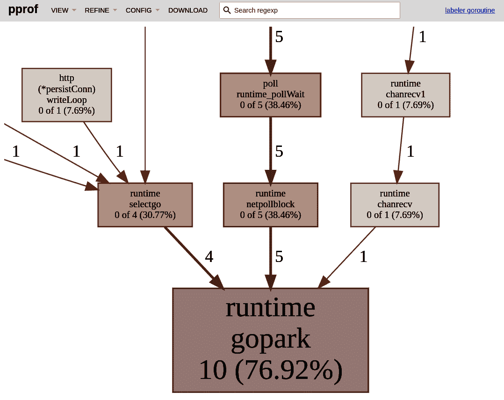

###### 图 9-10\. 来自 示例 4-1 中 `labeler` `Sum` 代码的 `goroutine` 性能的放大图形视图

但是，图 9-10 让你意识到几个通常可以在 goroutine 视图中找到的常见函数：

`runtime.gopark`

[`gopark`](https://oreil.ly/Zqf2K) 是一个内部函数，它使 goroutine 等待状态，直到外部回调将其重新启动工作。基本上，这是运行时调度器在等待事情（例如通道通信、网络 I/O 或有时互斥锁）时暂停（park）goroutine 的一种方式。

`runtime.chanrecv` 和 `runtime.chansend`

如名称所示，goroutine 在 `chanrecv` 函数中接收消息或等待要发送到通道的内容。类似地，在 `chansend` 中，如果正在发送消息或等待通道有缓冲空间，则也是如此。

`runtime.selectgo`

如果 goroutine 正在等待或检查 [`select` 语句](https://oreil.ly/T52Kg) 中的情况，则会看到这一点。

`runtime.netpollblock`

[`netpoll` 函数](https://oreil.ly/5Iw71) 将 goroutine 设置为等待，直到从网络连接接收到 I/O 字节。

如您所见，即使您是第一次在配置文件中看到它们，也很容易追踪函数的含义。

## CPU

我们对 CPU 进行配置文件以找出使用 CPU 时间最多的代码部分。减少这一点可以减少运行程序的成本，并实现更轻松的系统可扩展性。对于 CPU 绑定的程序，减少一些 CPU 使用率也意味着减少延迟。

证明分析 CPU 使用率非常困难。首先，CPU 在单个时刻可以执行大量操作 —— CPU 时钟每秒可以执行数十亿次操作。理解所有这些周期在程序代码中的分布情况很难跟踪，而不会显著减慢速度。多 CPU 核心程序使这个问题变得更加困难。

在撰写本书时，Go 1.19 提供了集成到 Go 运行时的 CPU 分析器。任何 CPU 分析器都会增加一些开销，因此不能简单地在后台运行。我们必须显式地为整个进程启动和停止它。与其他分析器一样，我们可以通过 `pprof.StartCPUProfile(w)` 和 `pprof.StopCPUProfile()` 函数在程序中编程地执行这些操作。我们可以在 Go 基准测试中使用 `-cpuprofile` 标志，或者使用 Example 9-5 中处理程序的 `/debug/pprof/profile?seconds=<integer>` URL。

# CPU 分析有其开始和结束

如果 `profile` HTTP 处理程序不会立即返回响应，就像其他配置文件一样，不要感到惊讶！HTTP 处理程序将启动 CPU 分析器，并在 `seconds` 参数中提供的秒数（如果未指定，则为 30 秒）内运行，然后才返回 HTTP 请求。

当前的实现是大量抽样的。当分析器启动时，它会调度特定于操作系统的定时器以在指定速率中断程序执行。在 Linux 上，这意味着使用 [`settimer`](https://oreil.ly/tQNJK) 或 [`timer_create`](https://oreil.ly/WdjVW) 来为每个操作系统线程设置定时器，在 Go 运行时中监听 [`SIGPROF`](https://oreil.ly/dcQTf) 信号。该信号中断 Go 运行时，然后获取正在执行的该操作系统线程上的当前堆栈跟踪。然后将样本排入预分配的环形缓冲区，`pprof` 写入器每 100 毫秒从中提取一次。²⁰

当前的 CPU 分析速率硬编码²¹ 为 100 Hz，因此理论上每 10 毫秒 CPU 时间（而不是实时）将记录每个操作系统线程的一个样本。未来有 [计划](https://oreil.ly/VXEPO) 使该值可配置。

尽管 CPU 性能分析是最流行的效率工作流之一，但解决这个问题是复杂的。对于典型情况，它会为您提供良好的服务，但并非完美。例如，在某些操作系统（如 BSD²²）上存在已知问题，在 [某些特定情况](https://oreil.ly/Ar8Up) 下存在各种不准确性。在未来，我们可能会看到这一领域的一些改进，目前正在考虑使用 [基于硬件的性能监视单元（PMUs）](https://oreil.ly/75AHf) 的 [新提案](https://oreil.ly/zDSEq)。

展示了`labeler`的 CPU 时间分布的示例 CPU 配置文件显示在图 9-11 中。考虑到由于较低的采样率而产生的不准确性，函数粒度视图可能会得出更好的结论。

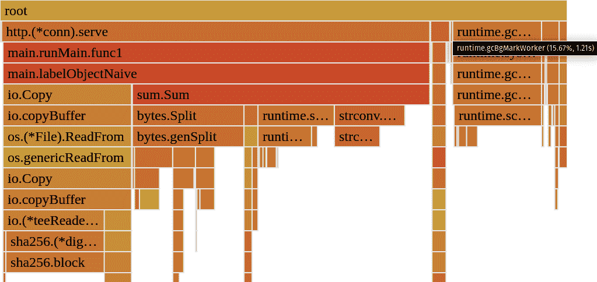

###### 图 9-11\. 来自示例 4-1 中`labeler` `Sum`代码的 30 秒 CPU 配置文件的火焰图视图，以`functions`粒度显示。

CPU 配置文件包含两种值类型：

样本

样本值指示在该位置观察到的样本数量。

CPU

每个样本值代表 CPU 时间。

从图 9-11，我们可以看到，如果我们想要优化`labeler` Go 程序的 CPU 时间或延迟，我们需要专注于什么。从火焰图视图中，我们可以概述五个主要部分：

`io.Copy`

由负责从本地对象存储复制文件的代码使用的此函数占据了 22.6%的 CPU 时间。也许我们可以利用本地缓存来节省这部分 CPU 时间。

`bytes.Split`

这在示例 4-1 中拆分行占据了 19.69%，因此可能需要检查这个函数是否有办法将其拆分为工作量较小的行。

`gcBgMarkWorker`

此函数占据了 15.6%，这表明堆上有大量存活对象。目前，垃圾回收占用了一部分 CPU 时间。

`runtime.slicebytetostring`

它表明非常重要的 CPU 时间（13.4%）用于将字节转换为字符串。通过源代码视图，我能够追踪到`num, err := ⁠strconv.Par⁠seInt(string(line), 10, 64)`行。这揭示了一种直接从字节片段解析整数的简单优化方法。

`strconv.ParseInt`

此函数使用了 12.4%的 CPU。我们可能希望检查是否可以通过编写我们自己的解析函数来消除任何不必要的工作或检查（提示：可以）。

结果表明，即使不完全准确，这样的 CPU 配置文件也是有价值的。我们将在“优化延迟”中尝试上述优化方法。

## 脱 CPU 时间

通常被忽视的是，大多数典型的 goroutine 大多数时间都在等待工作而不是在 CPU 上执行。这就是为什么在寻求优化程序功能延迟时，我们不能只看 CPU 时间的原因。²³ 对于所有程序，尤其是 I/O 密集型程序，您的进程可能会花费大量时间在睡眠或等待上。具体来说，我们可以定义组成整个程序执行的四个类别，这些类别在图 9-12 中展示。

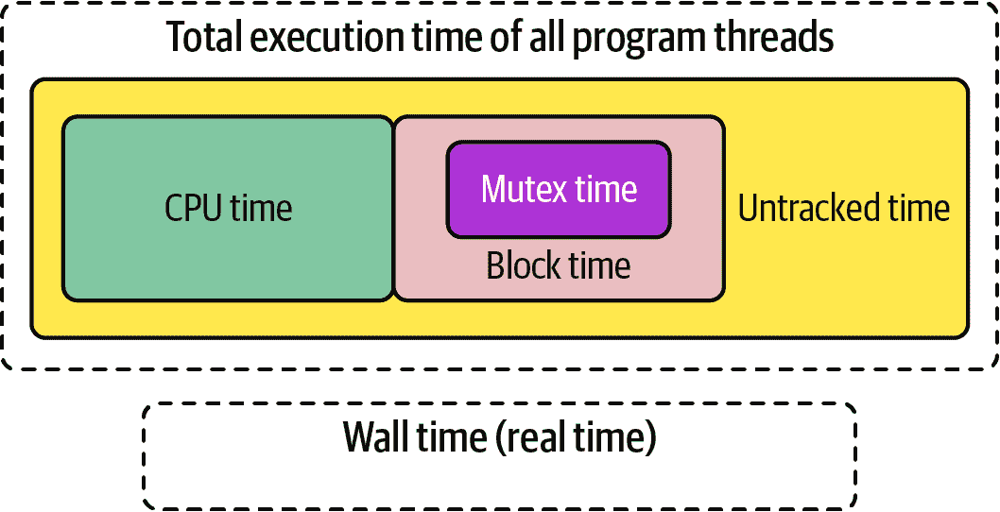

###### 图 9-12\. 进程执行时间组成²⁴

第一个观察是总执行时间比墙上时间长，所以在执行该程序时实际时间已过去。这不是因为计算机可以以某种方式减慢时间；而是因为所有的 Go 程序都是多线程的（或者在 Go 中甚至是多 goroutine 的），所以总测量的执行时间总会比实际时间长。我们可以概述四个执行时间的类别：

CPU 时间

我们的程序主动使用 CPU 的时间，如 “CPU” 中解释的那样。

区块时间

互斥体时间，加上我们的进程花费在 Go 通道通信中等待的时间（例如 `<-ctx.Done()`，如在 “Go Runtime Scheduler” 中讨论的那样），所以所有的同步原语。我们可以使用 `block` 分析器来分析该时间。默认情况下未启用，因此我们需要通过设置非零块分析率来启用它，使用 [`runtime.SetBlockProfileRate(int)`](https://oreil.ly/GwjwY) 指定每个阻塞事件样本花费的纳秒数。然后我们可以在 Go 中使用 `pprof.Lookup`，在 Go 基准测试中使用 `-blockprofile`，或者使用 `/debug/pprof/block` HTTP 处理程序来捕获 `contention` 和 `delay` 值类型。

互斥体时间

在锁竞争上花费的时间（例如，在 [`sync.RWMutex.Lock`](https://oreil.ly/chnpS) 中花费的时间）。与块分析类似，默认情况下是禁用的，可以使用 [`runtime.SetMutexProfileFraction(int)`](https://oreil.ly/oIg45) 启用。分数指定应跟踪的 `1/*<fraction>*` 锁竞争。类似地，我们可以在 Go 中使用 `pprof.Lookup`，在 Go 基准测试中使用 `-mutexprofile`，或者使用 `/debug/pprof/mutex` HTTP 处理程序来捕获 `mutex` 和 `delay` 值类型。

未追踪的 off-CPU 时间

睡眠的 goroutine，等待 CPU 时间，I/O（例如来自磁盘、网络或外部设备）、syscalls 等都不会被任何标准的性能分析工具追踪。为了发现这种延迟的影响，我们需要使用下面解释的不同工具。

# 我们是否必须在 off-CPU 时间中测量或找到瓶颈？

程序线程花费了大量的时间在 off-CPU 上。这就是为什么你的程序变慢的主要原因可能不是它的 CPU 时间。例如，假设你的程序执行花费了 20 秒，但它在等待来自数据库的答案花费了 19 秒。在这种情况下，我们可能希望查看数据库中的瓶颈（或在我们的代码中减轻数据库的慢速），而不是优化 CPU 时间。

通常建议使用追踪来找出我们功能的墙上时间（延迟）中的瓶颈。特别是，分布式追踪使我们能够将优化重点缩小到请求功能流程中耗时最多的部分。Go 具有内置的 [追踪仪器](https://oreil.ly/pKeI1)，但它只对 Go 运行时进行仪器化，而不是我们的应用程序代码。然而，我们讨论了与云原生标准兼容的基本追踪仪器，如 [OpenTelemetry](https://oreil.ly/sPiw9) 来实现应用级追踪。

还有一个令人惊叹的分析器叫做[全面 Go 分析器 (`fgprof`)](https://oreil.ly/4WWHN)，专注于追踪 CPU 和非 CPU 时间。虽然[官方尚未推荐](https://oreil.ly/ri1Kb)，且存在[已知的限制](https://oreil.ly/8Lk9t)，但我发现它在分析我的 Go 程序时非常有用。`fgprof`的分析结果可以通过示例 9-5 中提到的 HTTP 处理器公开。关于`labeler`服务的`fgprof`分析示例见图 9-13。

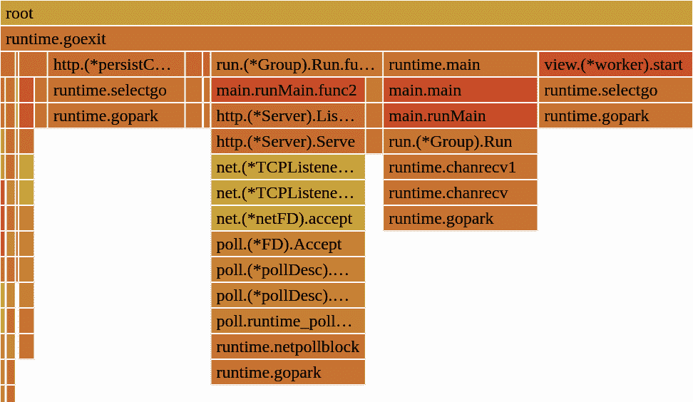

###### 图 9-13\. 从示例 4-1 中`labeler`服务的 30 秒`fgprof`分析的火焰图视图，以`functions`粒度呈现

从分析结果中，我们可以快速得出结论，即大部分时间，`labeler`服务只是在等待信号中断或 HTTP 请求！如果我们有兴趣提高`labeler`能够服务的最大请求速率，我们可以快速发现问题并非出现在`labeler`本身，而是测试客户端未能以足够快的速度发送请求²⁵。

总结一下，在本节中，我介绍了在 Go 社区中使用的最常见的分析器实现方式²⁶。还有很多像 Linux `perf`和基于`eBPF`的封闭盒监控分析器，但它们超出了本书的范围。我更喜欢我提到的这些，因为它们是免费的（开源！），明确的，相对容易使用和理解。

现在让我们看看在分析 Go 程序时我发现有用的一些较少为人知的工具和实践。

# 小贴士

有三个更高级但非常有用的分析技巧，我希望您也能了解。这些技巧帮助我更有效地分析软件瓶颈。让我们逐一了解！

## 分享分析结果

通常，我们不会单独进行软件项目开发，而是在一个更大的团队中，大家分享责任并相互审查代码。分享就是关怀，因此类似于“与团队（和未来的自己）分享基准测试”，我们应该专注于与团队成员或其他感兴趣的人分享我们的瓶颈结果和发现。

在典型的工作流程中，我们下载或检查多个`pprof`分析结果。理论上，我们可以使用描述性命名以避免混淆，并使用 Google Drive 或 Slack 等文件共享解决方案发送它们。然而，这往往很麻烦，因为接收者必须下载`pprof`文件并在本地运行`go tool pprof`来分析。

另一种选择是分享性能分析的截图，但我们必须选择部分视图，这对其他人可能不够清晰。也许其他人希望使用不同的视图或值类型来分析性能分析。也许他们想要找到采样率或将性能分析缩小到某些代码路径。仅凭一张截图，您将错过所有这些互动功能。

幸运的是，一些网站允许我们保存`pprof`文件以供他人或将来使用，并且可以在不下载配置文件的情况下进行分析。例如，[Polar Signals](https://oreil.ly/HowVb) 公司提供了完全免费的 [*pprof.me*](https://pprof.me) 网站，正是允许这样做的地方。您可以上传您的分析文件（请注意，它将被公开分享！）并与团队成员分享链接，他们可以使用常见的`go tools pprof`报告视图来进行分析（参见“go tool pprof Reports”）。我经常和团队一起使用这个工具。

## 连续性能分析

在开源生态系统中，连续性能分析可能是 2022 年最流行的话题之一。它意味着在每个配置的时间间隔内自动收集我们的 Go 程序的有用分析数据，而不是手动触发。

在许多情况下，效率问题发生在程序运行的远程环境中的某个地方。也许这是因为过去对某些难以复现的事件作出响应而发生的。连续性能分析工具允许我们始终保持性能分析“开启”，并回顾性地查看过去的性能分析数据。

> 假设您看到资源使用率增加了——比如 CPU 使用率。然后您进行一次性分析以尝试找出是什么导致了资源的增加。连续性能分析本质上就是一直在做这个。(...) 当您有了这些数据后，您可以比较一个进程版本的整个生命周期与新部署的版本。或者您可以比较两个不同的时间点。比如说有一个 CPU 或内存峰值。我们实际上可以了解到我们的进程在代码行级别有何不同。这非常强大，它是在可观察性方面已经有用的其他工具的扩展，但它为我们运行中的程序提供了不同的视角。
> 
> Frederic Branczyk，《Grafana 的大帐篷：与 Frederic Branczyk 谈连续性能分析》

连续性能分析作为云原生开源社区中的第四个可观察性信号出现，但它并不新。这个概念最早在 2010 年由 Gang Ren 等人的研究论文《“Google-Wide Profiling: A Continuous Profiling Infrastructure For Data Centers”》中引入，证明了连续性能分析可以连续地针对生产工作负载进行使用，而不会带来重大开销，并有助于提高效率优化在 Google 中的应用。

最近我们看到了使这项技术更易于获取的开源项目。我个人已经使用连续性能分析工具数年来分析我们的 Go 服务，并且非常喜欢它！

您可以快速设置使用开源[Parca 项目](https://oreil.ly/X8003)的连续分析。在许多方面，它类似于[Prometheus 项目](https://oreil.ly/2Sa3P)。Parca 是一个单一的 Go 程序二进制文件，使用我们在“捕获分析信号”中讨论的 HTTP 处理程序定期捕获配置文件并将其存储在本地数据库中。然后我们可以搜索配置文件、下载它们，甚至使用嵌入的 `tool pprof` 作为查看器来分析它们。

您可以在任何地方使用它：在您的生产环境、远程环境或可能在云中或笔记本电脑上运行的宏基准测试环境中设置连续分析可能是有意义的。在微基准测试级别上可能没有意义，因为我们在可能的最小范围内运行测试，这可以为基准测试的完整持续时间进行配置（参见“微基准测试”）。

将连续分析添加到我们在 Example 8-19 中的 `labeler` 宏基准测试中，只需要几行代码和一个简单的 YAML 配置，如 Example 9-6 中所示。

##### Example 9-6\. 在 Example 8-19 中的 `labeler` 创建和 `k6` 脚本执行之间启动连续分析容器

```go
labeler := ...

parca := e2e.NewInstrumentedRunnable(e, "parca").
    WithPorts(map[string]int{"http": 7070}, "http").
    Init(e2e.StartOptions{
        Image: "ghcr.io/parca-dev/parca:main-4e20a666", 
        Command: e2e.NewCommand("/bin/sh", "-c",
          `cat << EOF > /shared/data/config.yml && \
    /parca --config-path=/shared/data/config.yml
object_storage:  bucket:
    type: "FILESYSTEM"
    config:
      directory: "./data"
scrape_configs:  - job_name: "%s"
  scrape_interval: "15s"
  static_configs:
    - targets: [ '`+labeler.InternalEndpoint("http")+`' ]
  profiling_config:
    pprof_config:  fgprof:
        enabled: true
        path: /debug/fgprof/profile
        delta: true
EOF
`),
        User:      strconv.Itoa(os.Getuid()),
        Readiness: e2e.NewTCPReadinessProbe("http"),
    })
testutil.Ok(t, e2e.StartAndWaitReady(parca))
testutil.Ok(t, e2einteractive.OpenInBrowser("http://"+parca.Endpoint("http"))) 

k6 := ...
```


[`e2e` 框架](https://oreil.ly/f0IJo)在容器中运行所有工作负载，因此我们为 Parca 服务器这样做。我们使用从[官方项目页面](https://oreil.ly/ETsNV)构建的容器镜像。


Parca 服务器的基本配置有两部分。首先是对象存储配置：我们希望将 Parca 的数据库内部数据文件存储在何处。Parca 使用[FrostDB 列存储](https://oreil.ly/A9y23)来存储调试信息和配置文件。为了方便起见，我们可以使用本地文件系统作为最基本的对象存储。


第二个重要的配置是抓取配置，它允许我们将某些端点作为目标来捕获分析。在我们的情况下，我仅将 `labeler` HTTP 端点放在本地网络上。我还指定每 15 秒获取一次配置文件。对于始终开启的生产环境使用，我建议更大的间隔，例如一分钟。


像堆、CPU、goroutine 阻塞和互斥锁这样的常见配置[默认启用](https://oreil.ly/pcZmg)。然而，我们必须手动允许其他配置，比如在“Off-CPU 时间”讨论的 `fgprof` 配置。


一旦 Parca 启动，我们可以使用 `e2einteractive` 包打开 Parca UI，在 `k6` 脚本完成期间或之后查看我们的配置文件的视图式演示。

由于持续的配置文件，我们无需等待我们的基准测试（使用`k6`负载测试器）完成——我们可以直接跳转到我们的 UI，每隔 15 秒查看配置文件，实时！持续配置文件的另一个好处是，我们可以从每个配置文件随时间采集的所有样本值的总和中提取指标。例如，Parca 可以为随时间变化的`labeler`容器的堆内存使用情况提供图表，从周期性的`heap` `inuse_alloc`配置文件中获取（在“内存使用”讨论）。结果显示在图 9-14 中，应该非常接近“内存使用”中提到的`go_memstats_heap_total`度量。

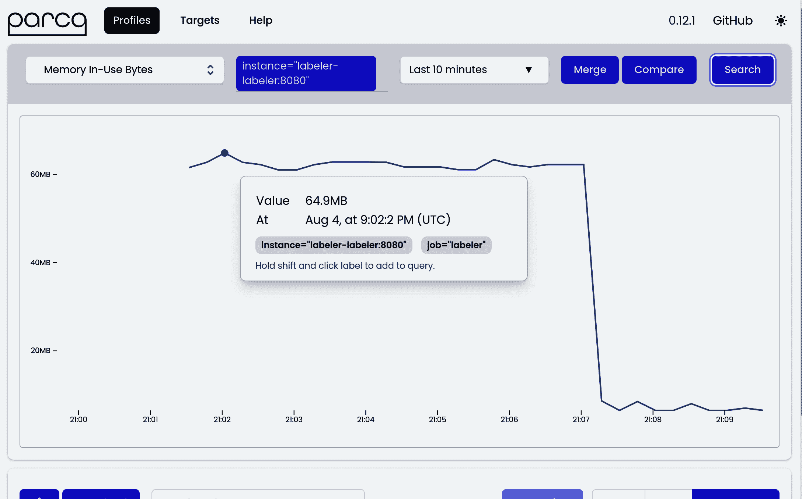

###### 图 9-14\. Parca UI 结果的屏幕截图，显示了随时间变化的`labeler` 图 9-9`inuse_alloc`配置文件。

您现在可以点击图中的样本，代表获取配置文件快照的时刻。由于连续形式，您可以选择最感兴趣的时间，也许是内存使用最高的时刻！一旦点击，就会显示该特定配置文件的火焰图，正如图 9-15 所示。

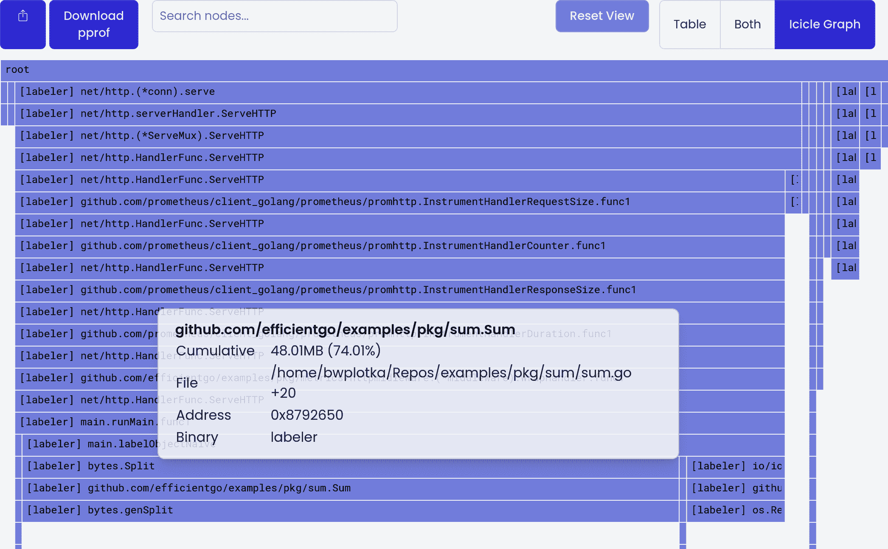

###### 图 9-15\. 当您从图 9-4 中点击特定配置文件时，Parca UI 的火焰图（在 Parca 中称为冰柱图）的屏幕截图。

Parca 的维护者决定在火焰图中使用与`go tool pprof`工具不同的视觉风格，详见“火焰图”。然而，与配置空间中许多其他工具一样，它使用相同的语义。这意味着我们可以使用从`go tool pprof`特定工具中获取的分析技能，与 Parca 等不同的 UI 进行分析。

在个人资料视图中，我们可以下载所选的`pprof`文件。我们可以按照“分享配置文件”，筛选视图或选择不同视图来共享配置文件。我们还可以看到一个火焰图，代表选定时间段堆中函数对活动对象的贡献。我们无法手动轻松捕获这些内容。在图 8-5 中，我捕获了有趣事件发生后的配置文件，因此我必须使用`alloc_space`来显示从程序启动开始的总分配量。对于长时间运行的进程，此视图可能会非常嘈杂，并显示我不感兴趣的情况。更糟糕的是，进程在某些事件后可能已重新启动，如紧急情况或 OOM。在重新启动后进行这样的堆配置文件将毫无意义。类似的问题也会出现在其他只显示当前或特定时刻的配置文件上，如 goroutine、CPU 或自定义文件描述符配置文件。

这就是连续剖析极其有用的地方。它允许我们在发生有趣事件时捕获剖析，因此我们可以快速跳转到 UI 并分析效率瓶颈。例如，在 图 9-15 中，我们可以看到 `bytes.Split` 函数当前在堆上使用最多内存。

# 连续剖析的开销

捕获按需剖析会给正在运行的 Go 程序带来一些开销。然而，定期捕获多个剖析会使这种开销在应用程序运行期间持续存在，因此请确保您的剖析工具不会导致效率低于预期水平。

尝试了解在您的程序中剖析的开销。标准的默认 Go 剖析器的目标是不会为单个进程增加超过 5% 的 CPU 开销。您可以通过更改连续剖析间隔或剖析的采样来控制它。在大规模部署中，仅对多个相同副本中的一个进行剖析以分摊收集成本也是非常有用的。（来源：[`oreil.ly/yAACa`](https://oreil.ly/yAACa)）

在我们的 [Red Hat 基础设施](https://oreil.ly/6CSV7) 中，我们始终以一分钟的间隔运行连续剖析，并保留几天的剖析数据。

总之，我建议对那些您知道未来可能需要持续提高效率的实时 Go 程序进行连续剖析。Parca 是一个开源示例，但还有其他项目或供应商²⁷可以实现相同功能。但要小心，剖析可能会让人上瘾！

## 比较和聚合剖析

`pprof` 格式还有一个有趣的特性。按设计，它允许对多个剖析进行某些聚合或比较：

减法剖析

您可以从另一个剖析中减去一个剖析。这对于减少噪音并缩小您关心的事件或组件范围非常有用。例如，您可以在您的 Go 程序的一个运行中加载测试同时进行一些 `A` 和 `B` 事件时，获取一个堆剖析剖析。然后，您可以从仅与 `B` 事件加载测试的同一 Go 程序的第二个堆剖析中减去堆剖析，以检查纯粹从 `A` 事件中的影响。`go tool pprof` 允许您使用 `-base` 标志从一个剖析中减去另一个剖析，例如 `go tool pprof heap-AB.pprof -base heap-B.pprof`。

比较剖析

[比较](https://oreil.ly/NHfZP)类似于减法；与删除匹配的样本值不同，它提供剖析之间的负数或正数增量。这对于在优化前后测量特定函数的贡献变化非常有用。您还可以使用`go tool pprof`通过 `-diff_base` 进行剖析比较。

合并剖析

社区中不太为人知的是，你可以将多个配置文件合并成一个！合并功能使我们能够将代表当前情况的多个配置文件结合在一起。例如，我们可以将数十个短 CPU 配置文件合并成一个跨较长时间段的 CPU 工作总配置文件。或者，我们可以合并多个堆配置文件到表示多个时间点所有堆对象的聚合配置文件中。

`go tool pprof` 不支持此操作。然而，你可以编写自己的 Go 程序来执行此操作，使用 [`google/pprof/profile.Merge` 函数](https://oreil.ly/bvoSL)。

我之前并不经常使用这些机制，因为在使用 `go tool pprof` 工具时，会因为与多个本地 `pprof` 文件混淆而感到困惑。当我开始使用像 Parca 这样的更高级的分析工具时，情况就改变了。正如你在 图 9-14 中看到的，有一个比较按钮用于比较两个特定的配置文件，以及一个合并按钮，用于将聚焦时间范围内的所有配置文件合并成一个配置文件。有了用户界面，选择要比较或聚合的配置文件变得更加容易和直观！

# 总结

对于 Go 的空间分析可能是微妙的，但一旦掌握了基础知识，利用起来并不难。在本章中，我们详细讨论了从常见分析器，通过捕获模式和 `pprof` 格式，到标准可视化技术的所有分析方面。最后，我们涉及了像连续分析这样的高级技术，我建议尝试一下。

# 先分析，后提问

我建议在适合你每日优化工作流程的任何形式中使用分析。在你已经从程序中捕获了配置文件之后，才问像是什么导致了你的代码减速或高资源使用等问题。

我相信这并不是这个领域创新的终点。由于像 `pprof` 这样的常见高效分析格式可以在不同工具和分析器之间实现互操作性，我们将看到更多工具、用户界面、有用的可视化，甚至与 第六章 中提到的不同可观察信号相关联。

此外，更多 eBPF 档案正在开源生态系统中出现，使得跨编程语言的分析更加便宜和统一。因此，请保持开放态度，并尝试不同的技术和工具，找出对你、你的团队或你的组织最有效的方法。

¹ 症状是我们看到的由某些潜在情况引起的影响，例如，OOM 是 Go 程序需要比允许的内存更多时的一个症状。症状的问题在于它们经常看起来像是根本原因，但可能有一个潜在的瓶颈导致它们。例如，导致 OOM 的进程高内存使用看起来可能是根本原因，但如果是由于依赖项未能快速处理请求，则也可能只是其他问题的症状。

² [红鲱鱼](https://oreil.ly/5AKbS)是意外的行为，结果证明对我们调查的总体主题并不构成问题。例如，在调查我们请求的较高延迟时，看到应用程序中的调试日志“开始处理请求”，却几个小时内没有看到“完成请求”，可能令人担忧。通常事实证明我们期望的“完成”日志消息未被实现，或者我们在日志系统中遗漏了它。事物经常会误导我们；这就是为什么在我们需要快速找到问题时，应该保持清洁和明确，避免可观察性和程序流程误导我们。

³ 通常，跟踪不提供完整的堆栈跟踪，只提供最重要的功能。这是为了限制跟踪的开销和成本。

⁴ 或方法，但在 Go 中处理方式相同。特别是在本章中，我会经常使用术语*函数*，指的是 Go 函数和方法。

⁵ Go 社区已经建议在标准库中包含这样的分析工具。然而，目前 [该想法被拒绝](https://oreil.ly/YZoiR)了，因为理论上您可以通过关注`os.Open`的分配来跟踪打开的文件。

⁶ 使用`pprof.Profile`，我们只能跟踪对象。我们无法对像过去对象创建、I/O 使用等高级事物进行分析。我们也不能定制生成的`pprof`文件中的内容，如额外的标签、自定义抽样、其他值类型等。这样的自定义分析需要更多的代码，但由于像[`github.com/google/pprof/profile`](https://oreil.ly/DgeqN)这样的 Go 包，实现起来仍然相对容易。

⁷ `:8080` 是`0.0.0.0:8080`的简写，因此监听您计算机上所有网络接口。

⁸ 要运行此命令或生成图形，您需要在计算机上安装[`graphviz`工具](http://www.graphviz.org)。

⁹ 此指南适用于来自 Go 1.19 的 web 界面。目前没有迹象表明它会改变，但`pprof`工具可能会在后续的 Go 版本中进行增强或更新。

¹⁰ 您还可以将鼠标悬停在每个菜单项上，三秒后会显示一个简短的帮助弹出窗口。

¹¹ 从性能分析的角度来看，直接（Flat）的贡献由工具实现来决定。我们在示例 9-1 中的自定义代码将`fd.Open`函数视为文件描述符打开的时刻。不同的性能分析实现可能会以不同的方式定义“使用”的时刻（分配时刻、CPU 时间使用、等待锁打开等）。

¹² REFINE 隐藏选项使得线条保持实心。

¹³ 目前在`pprof`中这个视图存在一些 bug。当你缺少二进制文件时，UI 显示`no matches found for regexp:`。搜索也无法使用，但你可以使用内置浏览器搜索找到你想要的内容（例如，使用 Ctrl+F）。

¹⁴ 例如，在[VSCode](https://oreil.ly/eaooe)或[GoLand](https://oreil.ly/YT9cs)中的插件。

¹⁵ 趣事是，165 这个数字有些过高。制作这张截图让我意识到我在`labeler`代码中有一个 bug。我没有关闭临时文件。

¹⁶ 通过`/debug/pprof/alloc`也可以获得相同的分析数据。唯一的区别是`alloc`分析器将`alloc_space`作为默认值类型。

¹⁷ 不幸的是，由于我在负载测试完成后拍摄了快照，代码对堆的当前贡献空间是极小的，不代表过去发生的任何有趣事件。在“持续分析”中，你会看到这个值类型更有用。

¹⁸ 参见优秀的[goroutine 分析器概述](https://oreil.ly/U8tCN)。

¹⁹ 从技术角度讲，Go 调度器记录了这些信息。当使用`GODEBUG=tracebackancestors=X`检索堆栈时，它可以向我们公开。

²⁰ 查看[关于潜在 CPU 分析器下一个迭代的提案](https://oreil.ly/8vy83)以获取详细描述。

²¹ 从技术角度讲，有一种非常巧妙的方法可以设置不同的 CPU 分析率。你可以在`pprof.StartCPUProfile(w)`之前调用[`runtime.SetCPUProfileRate()`](https://oreil.ly/M8HwB)来设置你想要的率。`pprof.StartCPUProfile(w)`会尝试覆盖这个率，但由于[这个 bug](https://oreil.ly/8JBxX)，它将会失败。只有在确信自己知道在做什么时才更改率——通常 100 Hz 是一个不错的默认值。大于 250–500 Hz 的值大多数操作系统定时器都不支持。

²² 查看[此问题](https://oreil.ly/E0W5v)了解目前已知的有特定问题的操作系统列表。

²³ 事实上，即使 CPU 时间包括等待内存获取，如“CPU 和内存墙问题”所述。这些内容已包含在 CPU 分析中。

²⁴ 这个视图深受[Felix 的优秀指南](https://oreil.ly/nwVwF)的启发。

²⁵ 这可以在示例 8-19 代码中得到确认，在`k6s`脚本中只有一个用户在 HTTP 调用之间等待 500 毫秒。

²⁶ 我跳过了在 Go `pprof`包中存在的`threadcreate`性能分析，因为它已知自 2013 年以来存在问题，并且未来修复的优先级较低。

²⁷ [Phlare](https://oreil.ly/Ru0Hu), [Pyroscope](https://oreil.ly/eKyK7), [Google Cloud Profiler](https://oreil.ly/OGoVR), [AWS CodeGuru Profiler](https://oreil.ly/urVE0), 或者 [Datadog continuous profiler](https://oreil.ly/El7zq)，仅举几例。
