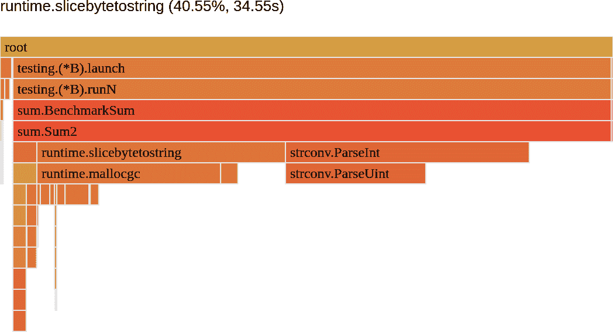

# 第十章 优化示例

现在终于是时候将你从前几章中收集的所有工具、技能和知识应用到一些优化上了！在本章中，我们将尝试通过一些示例来加强务实的优化流程。

我们将尝试优化 示例 4-1 的天真实现。我将向您展示如何应用 TFBO（来自 “效率感知开发流程”）到三组不同的效率要求中。

> 优化/悲观化并不能很好地概括。一切都取决于代码，因此每次都要测量，不要做绝对的评判。
> 
> Bartosz Adamczewski，[Tweet](https://oreil.ly/oW3ND)（2022）

我们将把我们的优化故事作为下一章中总结的一些优化模式的基础。了解过去数千次优化案例并不是非常有用的。每个案例都是不同的。编译器和语言会改变，所以任何“蛮力”尝试逐个尝试这些数千种优化并不现实。¹ 相反，我专注于为您提供知识、工具和实践，让您能够找到更高效的问题解决方案！

请不要专注于特定的优化，例如我应用的具体算法或代码更改。相反，请试着跟随我是如何得出这些改变的，我是如何首先找到需要优化的代码片段，以及我如何评估这些改变。

我们将从 “求和示例” 开始介绍三个问题。然后我们将进行`Sum`并在 “优化延迟”、“优化内存使用” 和 “利用并发优化延迟” 中进行优化。最后，我们将提及一些其他方法，可以在 “奖励：打破思维定式” 中实现我们的目标。让我们开始吧！

# 求和示例

在 第四章 中，我们介绍了一个简单的 `Sum` 实现，在 示例 4-1 中对文件中提供的大量整数求和。² 让我们利用你所学的所有知识，并用它来优化 示例 4-1。正如我们在 “资源有效性要求” 中学到的那样，我们不能“只是”优化——我们必须有一些目标。在本节中，我们将三次重复效率优化流程，每次都有不同的要求：

+   最多只使用一个 CPU 的低延迟。

+   最小内存使用量

+   即使有四个 CPU 核心可用于工作负载，延迟也更低。

“较低”或“最小”这样的术语并不太专业。理想情况下，我们有一些更具体的数字来作为目标，像 RAER 这样的书面形式。快速的大 O 分析可以告诉我们，`Sum`的运行时复杂度至少是 O(*N*) ——我们必须至少重新访问所有行一次来计算总和。因此，像“`Sum`必须快于 100 毫秒”这样的绝对延迟目标是行不通的，因为它的问题空间取决于输入。我们总是可以找到足够大的输入来违反任何延迟目标。

处理这个问题的一种方法是指定一些假设和延迟目标下的最大可能输入。第二种方法是定义一个取决于输入的运行时复杂度的函数 ——所以吞吐量。让我们选择后者，并为示例 4-1 中的`Sum`指定摊销的延迟函数。我们可以在内存上做同样的事情。所以让我们更具体些。想象一下，对于我的硬件，一个系统设计利益相关者为示例 4-1 中的`Sum`制定了以下所需的目标：

+   每行最多 10 纳秒的延迟（10 * *N* 纳秒），最多使用一个 CPU

+   像上面那样的延迟和任何输入的堆内存最多分配 10 KB

+   每行最多 2.5 纳秒的延迟（2.5 * *N* 纳秒），最多使用四个 CPU

# 如果我们无法达到这个目标怎么办？

由于问题的低估、新的需求或新的知识，我们最初设定的目标可能很难实现。这没问题。在许多情况下，我们可以尝试重新协商目标。例如，正如我们在“优化设计级别”中详细讨论的那样，每一次超越某一点的优化在时间、精力、风险和可读性方面的成本都会越来越高，所以增加更多的机器、CPU 或 RAM 可能更便宜。关键是大致估计这些成本，并帮助利益相关者决定什么对他们最好。

按照 TFBO 流程，在优化之前，我们首先要进行基准测试。幸运的是，我们已经讨论过在“Go 基准测试”中为`Sum`代码设计基准测试，所以我们可以继续使用示例 8-13 进行我们的基准测试。我使用了示例 10-1 中呈现的命令，对一个包含 200 万个整数的文件执行了 5 个 10 秒钟的基准测试，并限制为 1 个 CPU。

##### 示例 10-1\. 调用基准测试的命令

```go
export ver=v1 && go test -run '^$' -bench '^BenchmarkSum$' \
    -benchtime 10s -count 5 -cpu 1 -benchmem \
    -cpuprofile=${ver}.cpu.pprof -memprofile=${ver}.mem.pprof | tee ${ver}.txt
```

使用示例 4-1，前述基准测试产生了以下结果：101 毫秒，分配了 60.8 MB 空间，并且每次操作分配了 1.60 百万次内存。因此，我们将以此为基准。

# 优化延迟

我们的要求很明确。我们需要使示例 4-1 中的`Sum`函数更快，以达到至少 10 * *N* 纳秒的吞吐量。基准结果显示我们的基准值是 50 * *N* 纳秒。是时候看看是否有快速的优化方法了！

在 “复杂度分析” 中，我分享了 `Sum` 函数的详细复杂性，清楚地概述了问题和瓶颈。然而，我使用了这一部分的信息来定义。现在，让我们忘记我们讨论过这样的复杂性，并试图从头开始找到所有信息。

最好的方法是使用 第九章 中解释的配置文件执行瓶颈分析。我在每个基准测试中捕获了 CPU 配置文件，所以我可以快速带来 CPU 时间的 Flame Graph，正如 图 10-1 所示。


###### 图 10-1\. Example 4-1 CPU 时间的 Flame Graph 视图，函数粒度

分析配置文件为我们提供了情况的概述。我们看到四个明确的主要 CPU 时间使用贡献者：

+   `bytes.Split`

+   `strconv.ParseInt`

+   运行时函数 `runtime.slicebytetostr...`，以 `runtime.malloc` 结尾，这意味着我们花费了大量 CPU 时间来分配内存

+   运行时函数 `runtime.gcBgMarkWorker`，表示 GC 运行

CPU 配置文件提供了一个函数列表，我们可以查看并可能削减一些 CPU 使用率。然而，正如我们在 “Off-CPU Time” 中学到的，这里的 CPU 时间可能并不是一个瓶颈。因此，我们必须首先确认我们的函数是 CPU 绑定、I/O 绑定还是混合型。

一种方法是通过手动阅读源代码来完成这项工作。我们可以看到，在 Example 4-1 中唯一使用的外部介质是文件，我们用它来读取字节。代码的其余部分应只使用内存和 CPU 进行计算。

这使得这段代码成为混合型任务，但是多混合？我们应该从文件读取优化还是 CPU 时间开始？

发现这一点最好的方法是数据驱动的方式。我们来检查 CPU 和 off-CPU 的延迟情况，这得益于完整的 goroutine 配置文件（`fgprof`），在 Example 8-13 的基准测试中，我快速地用 `fgprof` 配置文件包装了我们的基准测试。

##### 示例 10-2\. 使用 `fgprof` 进行 Go 基准测试

```go
// BenchmarkSum_fgprof recommended run options:
// $ export ver=v1fg && go test -run '^$' -bench '^BenchmarkSum_fgprof' \
//    -benchtime 60s  -cpu 1 | tee ${ver}.txt 
func BenchmarkSum_fgprof(b *testing.B) {
    f, err := os.Create("fgprof.pprof")
    testutil.Ok(b, err)

    defer func() { testutil.Ok(b, f.Close()) }()

    closeFn := fgprof.Start(f, fgprof.FormatPprof)
    BenchmarkSum(b) 
    testutil.Ok(b, closeFn())
}
```


为了获得更可靠的结果，我们必须进行长达 60 秒的测量。让我们测量 60 秒以确保。


为了重复使用代码并提高可靠性，我们可以执行相同的 Example 8-13 基准测试，只是用 `fgprof` 配置文件包装起来。

在经过 60 秒后，生成的 `fgprof.pprof` 配置文件显示在 图 10-2 中。


###### 图 10-2\. Example 4-1 CPU 和 off-CPU 时间的 Flame Graph 视图，函数粒度

完整的 goroutine 配置文件确认我们的工作负载是 I/O（5%³)和 CPU 时间（大部分）。因此，虽然我们必须担心某些时候由文件 I/O 引入的延迟，但我们可以先优化 CPU 时间。所以让我们继续专注于最大的瓶颈：几乎占用`Sum` CPU 时间 36%的`bytes.Split`函数，如图 10-1 所示。

# 一次优化一件事情

多亏了图 10-1，我们找到了四个主要瓶颈。然而，在我们的第一次优化中，我选择集中在示例 10-3 中的最大瓶颈。

重要的是一次进行一种优化。感觉比起现在尝试优化我们所知的一切要慢，但实际上更有效。每种优化可能会影响其他优化，并引入更多未知因素。我们可以得出更可靠的结论，例如比较配置文件之间的贡献百分比。此外，为什么消除四个瓶颈，如果优化首先可能足以满足我们的需求？

## 优化`bytes.Split`

要找出 CPU 时间花在`bytes.Split`中的地方，我们必须试着理解这个函数做什么以及如何做到的。根据[定义](https://oreil.ly/UqAg8)，它根据可能的多字符分隔符`sep`将一个大字节切片分割成更小的切片。让我们快速查看图 10-1 的配置文件，并专注于使用`Refine`选项的该函数。这将显示[`bytes.Index`](https://oreil.ly/DQrCS)，并使用`makeslice`和`runtime.gcWriteBarrierDX`等函数影响分配和垃圾收集。此外，我们还可以快速查看用于`bytes.Split`的[`genSplit`](https://oreil.ly/pCMH1)的 Go 源代码，以检查它是如何实现的。这应该给我们一些警告信号。也许`bytes.Split`做的事情可能对我们的情况不必要：

+   `genSplit`首先通过切片[计算我们预期的切片数](https://oreil.ly/Wq6F4)。

+   `genSplit`分配[一个二维字节切片](https://oreil.ly/YzXdr)来放置结果。这很可怕，因为对于一个大的 7.2 MB 字节切片，有 200 万行，它将分配一个有 200 万元素的切片。内存配置文件确认这一行分配了大量的内存。⁴

+   然后它将使用我们在配置文件中看到的[`bytes.Index`](https://oreil.ly/8diMw)函数迭代两百万次。这是我们将收集字节直到下一个分隔符的两百万次。

+   `bytes.Split`中的分隔符是多字符的，需要更复杂的算法。然而，我们需要一个简单的，单行的换行符分隔符。

不幸的是，这种对成熟标准库函数的分析可能对于初学者 Go 开发者来说有些困难。这些 CPU 时间或内存使用中哪些是过度的，哪些不是？

始终帮助我回答这个问题的是回到算法设计阶段，尝试设计适合 `Sum` 问题的最简单分割线算法。当我们了解一个简单而高效的算法可能是什么样子，并对其满意时，我们可以开始挑战现有的实现。结果表明，有一个非常简单的流程可能适用于 例子 4-1。让我们在 例子 10-3 中详细了解一下。

##### 示例 10-3\. `Sum2` 是优化了 `bytes.Split` 的 CPU 瓶颈的 例子 4-1。

```go
func Sum2(fileName string) (ret int64, _ error) {
    b, err := os.ReadFile(fileName)
    if err != nil {
        return 0, err
    }

    var last int 
    for i := 0; i < len(b); i++ {
        if b[i] != '\n' { 
            continue
        }
        num, err := strconv.ParseInt(string(b[last:i]), 10, 64)
        if err != nil {
            return 0, err
        }

        ret += num
        last = i + 1
    }
    return ret, nil
}
```


我们记录了最后一个看到的换行符的索引，再加一，以告知下一行从哪里开始。


与 `bytes.Split` 相比，我们可以硬编码一个新行作为我们的分隔符。在一个循环迭代中，同时重用 `b` 字节切片，我们可以找到完整的行，解析整数并执行求和。这种算法通常也被称为“原地”。

在得出任何结论之前，我们必须首先检查我们的新算法是否在功能上工作正常。在成功通过单元测试验证后，我使用 `Sum2` 函数而不是 `Sum` 运行了 例子 8-13 来评估其效率。结果乐观，耗时 50 毫秒，分配了 12.8 MB。与 `bytes.Split` 相比，我们可以完成的工作少 50%，同时内存减少了 78%。知道 `bytes.Split` 负责约 36% 的 CPU 时间和 78.6% 的内存分配，这样的改进告诉我们我们已完全消除了代码中的这一瓶颈！

# 标准函数可能并非所有情况都完美适用

前述的工作优化示例问为什么 `bytes.Split` 函数对我们不够优化。难道 Go 社区不能优化它吗？

答案是 `bytes.Split` 和其他标准或自定义的从互联网上可能导入的函数可能不如专门为您的需求量身定制的算法高效。这样一个流行的函数首先必须对许多您可能没有的边缘情况（例如多字符分隔符）可靠。这些通常针对可能比我们自己更复杂的情况进行了优化。

这并不意味着我们现在必须重新编写所有导入的函数。不，我们只需要意识到通过为关键路径提供量身定制的实现，可能会轻松获得效率提升的可能性。尽管如此，我们仍应使用已知并经过战斗测试的标准库代码。在大多数情况下，它已经足够好了！

我们的 例子 10-3 优化是最终版本吗？并不完全是 —— 虽然我们提高了吞吐量，但我们仍处于 25 * *N* 纳秒的标记之外。

## 优化 `runtime.slicebytetostring`

例子 10-3 基准测试的 CPU 分析应该为我们提供下一个瓶颈的线索，显示在 图 10-3 中。



###### 图 10-3\. 示例 10-3 CPU 时间的 Flame Graph 视图，具有函数粒度

作为下一个瓶颈，让我们看看这个奇怪的 `runtime.slicebytetostring` 函数，它在大部分 CPU 时间中用于分配内存。如果我们在 Source 或 Peek 视图中查找它，它会指向示例 10-3 中的 `num, err := strconv.ParseInt(string(b[last:i]), 10, 64)` 行。由于这段 CPU 时间贡献没有计入 `strconv ParseInt`（一个单独的部分），它告诉我们，在调用 `strconv ParseInt` 之前必须执行它，然而在同一行代码中。唯一动态执行的事情是 `b` 字节切片的子切片和转换为字符串。进一步检查时，我们可以看到这里的字符串转换是昂贵的。⁵

有趣的是，[`string`](https://oreil.ly/7dv5w) 本质上是一个没有 `Cap` 字段（字符串的容量始终等于长度）的特殊[`字节切片`](https://oreil.ly/fYwwq)。因此，起初可能会感到惊讶的是，Go 编译器在这方面花费了这么多时间和内存。原因在于，`string(<byte slice>)` 相当于创建一个具有相同元素数量的新字节切片，将所有字节复制到一个新的字节中，然后从中返回字符串。复制的主要原因是，按设计，[`string` 类型是不可变的](https://oreil.ly/I4fER)，因此每个函数都可以在不用担心潜在竞争的情况下使用它。然而，有一种相对安全的方法可以将 `[]byte` 转换为 `string`。我们在示例 10-4 中来做这个。

##### 示例 10-4\. `Sum3` 是优化了 CPU 瓶颈的字符串转换的示例 10-3

```go
// import "unsafe"

func zeroCopyToString(b []byte) string {
    return *((*string)(unsafe.Pointer(&b))) 
}

func Sum3(fileName string) (ret int64, _ error) {
    b, err := os.ReadFile(fileName)
    if err != nil {
        return 0, err
    }

    var last int
    for i := 0; i < len(b); i++ {
        if b[i] != '\n' {
            continue
        }
        num, err := strconv.ParseInt(zeroCopyToString(b[last:i]), 10, 64)
        if err != nil {
            return 0, err
        }

        ret += num
        last = i + 1
    }
    return ret, nil
}
```


我们可以使用 `unsafe` 包从 `b` 中删除类型信息并形成 `unsafe.Pointer`。然后我们可以动态地将其转换为不同的类型，例如 `string`。这是不安全的，因为如果结构体的布局不相同，可能会出现内存安全问题或者非确定性的值。然而，`[]byte` 和 `string` 之间的布局是共享的，所以对我们来说是安全的。它在许多项目中的生产环境中使用，包括被称为[`yoloString`](https://oreil.ly/QmqCn)的 Prometheus。

`zeroCopyToString` 允许我们将文件字节转换为 `ParseInt` 所需的字符串，几乎没有额外开销。在功能测试后，通过与 `Sum3` 函数相同的基准测试，我们可以确认这一点。好处显而易见——对于 200 万个整数，`Sum3` 只需 25.5 毫秒，并且分配了 7.2 MB 的空间。这意味着在 CPU 时间上，它比示例 10-3 快了 49.2%。内存使用也更好，我们的程序几乎精确分配了输入文件的大小——既不多也不少。

# 明智的权衡

使用不安全的、零拷贝的字节到字符串转换，我们进入了一个有意的优化领域。我们引入了潜在的不安全代码，并为我们的代码增加了更多非平凡的复杂性。虽然我们明确地将我们的函数命名为 `zeroCopyToString`，但我们必须仅在必要时才能证明并使用这样的优化。在我们的情况下，它帮助我们达到了效率目标，因此我们可以接受这些缺点。

我们足够快了吗？还不够。我们的吞吐量接近于 12.7 * *N* 纳秒。让我们看看是否还能进一步优化。

## 优化 strconv.Parse

再次，让我们从 示例 10-4 的最新 CPU 分析中看到我们可以尝试检查的最新瓶颈，如 图 10-4 所示。


###### 图 10-4\. 示例 10-4 的 Flame Graph 视图，显示函数粒度的 CPU 时间

使用 `strconv.Parse` 进行 72.6% 的时间，如果能改进其 CPU 时间，我们可以获得很多好处。与 `bytes.Split` 类似，我们应该检查其性能和[实现](https://oreil.ly/owR53)。遵循这两条路径，我们可以立即勾画出一些感觉像是过度工作的元素：

+   我们在 [`ParseInt`](https://oreil.ly/gqJpb) 和 [`ParseUint`](https://oreil.ly/BB9Ie) 中都检查了空字符串两次。在我们的性能分析中，这两者都显示出非常显著的 CPU 时间。

+   `ParseInt` 允许我们以不同的基数和位大小解析整数。但我们不需要这种通用功能或额外的输入来检查我们的 `Sum3` 代码。我们只关心十进制的 64 位整数。

这里的一个解决方案类似于 `bytes.Split`：找到或实现我们自己的 `ParseInt` 函数，专注于效率——只做我们需要的事情，不多做。标准库提供了 [`strconv.Atoi` 函数](https://oreil.ly/CpZeF)，看起来很有前途。然而，它仍然需要字符串作为输入，这迫使我们使用不安全包中的代码。相反，让我们尝试自己快速实现一个版本。经过几轮测试和微基准测试我的新 `ParseInt` 函数⁶，我们得到了我们的求和功能的第四个迭代，展示在 示例 10-5 中。

##### 示例 10-5\. `Sum4` 是带有优化的 CPU 瓶颈的字符串转换的 示例 10-4

```go
func ParseInt(input []byte) (n int64, _ error) {
    factor := int64(1)
    k := 0

    if input[0] == '-' {
        factor *= -1
        k++
    }

    for i := len(input) - 1; i >= k; i-- {
        if input[i] < '0' || input[i] > '9' {
           return 0, errors.Newf("not a valid integer: %v", input)
        }

        n += factor * int64(input[i]-'0')
        factor *= 10
    }
    return n, nil
}

func Sum4(fileName string) (ret int64, err error) {
    b, err := os.ReadFile(fileName)
    if err != nil {
        return 0, err
    }

    var last int
    for i := 0; i < len(b); i++ {
        if b[i] != '\n' {
            continue
        }
        num, err := ParseInt(b[last:i])
        if err != nil {
            return 0, err
        }

        ret += num
        last = i + 1
    }
    return ret, nil
}
```

我们整数解析优化的副作用是，我们可以将我们的 `ParseInt` 适配为从字节片段解析，而不是从字符串解析。因此，我们可以简化我们的代码，避免使用不安全的 `zeroCopyToString` 转换。经过测试和基准测试，我们看到 `Sum4` 达到了 13.6 毫秒，比 示例 10-4 减少了 46.66%，同时具有相同的内存分配。我们的求和函数的全面比较呈现在 示例 10-6 中，使用我们喜爱的 `benchstat` 工具。

##### 示例 10-6\. 在一个两百万行文件上运行 `benchstat`，查看所有四个迭代结果

```go
$ benchstat v1.txt v2.txt v3.txt v4.txt
name \ (time/op)  v1.txt       v2.txt       v3.txt       v4.txt
Sum                101ms ± 0%    50ms ± 2%   25ms ± 0%   14ms ± 0%  name \ (alloc/op) v1.txt       v2.txt       v3.txt       v4.txt
Sum               60.8MB ± 0%  12.8MB ± 0%  7.2MB ± 0%  7.2MB ± 0%

name \ (allocs/op) v1.txt       v2.txt       v3.txt       v4.txt
Sum                1.60M ± 0%   1.60M ± 0%  0.00M ± 0%  0.00M ± 0%
```


请注意，`benchstat` 可以四舍五入一些数字，以便与*v1.txt*中的大数字进行比较。*v4.txt* 的结果是 13.6 毫秒，而不是 14 毫秒，这在吞吐量计算中可能有所不同。

看起来我们的辛勤工作有了回报。通过当前的结果，我们实现了 6.9 * *N* 纳秒的吞吐量，这已经足够实现我们的第一个目标。但是，我们只检查了 200 万个整数。我们能确定相同的吞吐量能够在更大或更小的输入大小下保持吗？我们的大 O 运行时复杂度 O(*N*) 表明可以，但为了确保，我也用 1000 万个整数运行了相同的基准测试。67.8 毫秒的结果给出了 6.78 * *N* 纳秒的吞吐量。这多少证实了我们的吞吐量数字。

示例 10-5 中的代码并不是可能的最快或最节省内存的解决方案。可能有更多的优化算法或代码以进一步改进。例如，如果我们分析示例 10-5，我们将看到一个相对较新的段，表明总 CPU 时间的 14% 被使用。这是`os.ReadFile`的代码，在过去的配置文件中不太显眼，因为有其他瓶颈和我们未进行优化的一些内容。我们将在“如果可以的话进行预分配”中提到其潜在优化。我们还可以尝试并发（我们将在“使用并发优化延迟”中进行）。但是，由于只有一个 CPU，我们不能在这里期望太多的收益。

重要的是，此迭代中无需改进其他任何内容，因为我们已经实现了我们的目标。我们可以停止工作并宣布成功！幸运的是，我们不需要在优化流程中添加魔法或危险的非可移植技巧。只需要可读性和更容易进行的刻意优化即可。

# 优化内存使用

在第二种情况下，我们的目标是在保持相同吞吐量的同时集中在内存消耗上。假设我们的软件有一个新的商业客户需要在一台只有少量 RAM 的 IoT 设备上运行具有`Sum`功能的程序。因此，要求具有流式算法：无论输入大小如何，它在任何时刻只能使用 10 KB 堆内存。

这种要求乍一看似乎有些极端，因为示例 4-1 中的天真代码具有相当大的空间复杂度。如果一个有 1000 万行、36 MB 大小的文件需要示例 4-1 的 304 MB 堆内存，那么我们如何确保同一个文件（或更大！）能最多使用 10 KB 的内存？在我们开始担心之前，让我们先分析一下我们在这个主题上可以做些什么。

幸运的是，我们已经做了一些优化工作，作为副作用改进了内存分配。由于延迟目标仍然适用，让我们从示例 10-5 中的 `Sum4` 开始，这符合目标。`Sum4` 的空间复杂度似乎在 O(*N*) 左右。它仍然取决于输入大小，并且远未达到我们的 10 KB 目标。

## 转向流算法

让我们从图 10-5 中拉取`Sum4`基准的堆配置文件，以找出我们可以改进的地方。


###### 图 10-5\. 示例 10-5 的堆分配的火焰图视图，具有函数粒度 (`alloc_space`)

内存配置文件非常无聊。第一行在示例 10-5 中分配了 99.6% 的内存。我们基本上将整个文件读入内存，以便可以在内存中迭代字节。即使我们在其他地方浪费了一些分配，也无法看到，因为由于从 `os.ReadFile` 中过度分配而无法看到它。有什么办法可以解决这个问题吗？

在我们的算法中，我们必须遍历文件中的所有字节；因此，我们最终必须读取所有字节。但是，我们不需要一次将所有字节都读入内存。从技术上讲，我们只需要一个足够大的字节切片来容纳整数的所有数字以进行解析。这意味着我们可以尝试设计[外部内存算法](https://oreil.ly/Dr3MB)以按块流式传输字节。我们可以尝试使用标准库中的现有字节扫描器——[`bufio.Scanner`](https://oreil.ly/CqiG7)。例如，示例 10-7 中的 `Sum5` 实现就使用它来扫描足够的内存以读取和解析一行。

##### 示例 10-7\. `Sum5` 是使用 `bufio.Scanner` 的示例 10-5

```go
func Sum5(fileName string) (ret int64, err error) {
    f, err := os.Open(fileName) 
    if err != nil {
        return 0, err
    }
    defer errcapture.Do(&err, f.Close, "close file") 

    scanner := bufio.NewScanner(f)
    for scanner.Scan() { 
        num, err := ParseInt(scanner.Bytes())
        if err != nil {
            return 0, err
        }

        ret += num
    }
    return ret, scanner.Err() 
}
```


不是将整个文件读入内存，我们在此打开文件描述符。


我们必须确保在计算完成后关闭文件，以防资源泄漏。我们使用 `errcapture` 在延迟关闭的文件中通知可能的错误。


扫描器的 `.Scan()` 方法告诉我们是否达到文件末尾。如果还有字节要导致分割，则返回 true。分割基于 `.Split` 方法中提供的函数。默认情况下，我们想要的是 [`ScanLines`](https://oreil.ly/YUpLU)。


不要忘记检查扫描器的错误！使用这样的迭代器接口，很容易忘记检查其错误。

为了评估效率，现在更专注于内存，我们可以使用相同的示例 8-13 来进行`Sum5`。然而，考虑到我们过去的优化，我们已经接近可以合理测量的限度，考虑到工具在处理百万行输入文件时的准确性和开销。如果我们陷入微秒级的延迟中，由于仪器的准确性和基准测试工具的开销限制，我们的测量结果可能会有所偏差。因此，让我们将文件增加到 1000 万行。对于这个输入，在示例 10-5 中的基准化`Sum4`每次操作结果为 67.8 毫秒，内存分配 36 MB。带有扫描器输出的`Sum5`为 157.1 毫秒和 4.33 KB 每次操作。

就内存使用而言，这是很好的。如果我们看看实现，扫描器[分配了初始的 4 KB](https://oreil.ly/jbpJc)，并将其用于读取行。如果行更长，它会根据需要增加这个值，但是我们的文件没有超过 10 位数字的情况，所以保持在 4 KB。不幸的是，扫描器对于我们的延迟要求来说并不快速。与`Sum4`相比，减慢了 131%，我们达到了 15.6 **N** 纳秒的延迟，这太慢了。我们必须再次优化延迟，知道我们还有大约 6 KB 可以分配，以便在 10 KB 的内存目标内。

## 优化 bufio.Scanner

我们能改进些什么？像往常一样，现在是时候检查示例 10-7 的源代码和性能分析了，参见图 10-6。


###### 图 10-6\. 示例 10-7 的 CPU 时间图表，具有函数粒度

标准库中`Scanner`结构的评论给了我们一个提示。它告诉我们“[`Scanner`适用于安全、简单的工作”](https://oreil.ly/6eXZE)。`ScanLines`在这里是主要的瓶颈，我们可以用一个更高效的实现来替换它。例如，原始函数去除了[回车（CR）控制字符](https://oreil.ly/wwUbC)，这对我们来说浪费了循环，因为我们的输入中没有它们。我设法提供了优化的`ScanLines`，它将延迟提高了 20.5%，达到了 125 毫秒，这仍然太慢了。

类似于之前的优化，可能值得编写一个自定义的流式扫描实现，而不是使用`bufio.Scanner`。示例 10-8 中的`Sum6`提供了一个潜在的解决方案。

##### 示例 10-8\. `Sum6`是带有缓冲读取的示例 10-5。

```go
func Sum6(fileName string) (ret int64, err error) {
    f, err := os.Open(fileName)
    if err != nil {
        return 0, err
    }
    defer errcapture.Do(&err, f.Close, "close file")

    buf := make([]byte, 8*1024) 
    return Sum6Reader(f, buf)
}

func Sum6Reader(r io.Reader, buf []byte) (ret int64, err error) { 
    var offset, n int
    for err != io.EOF {
        n, err = r.Read(buf[offset:]) 
        if err != nil && err != io.EOF { 
            return 0, err
        }
        n += offset 

        var last int
        for i := range buf[:n] { 
            if buf[i] != '\n' {
                continue
            }
            num, err := ParseInt(buf[last:i])
            if err != nil {
                return 0, err
            }

            ret += num
            last = i + 1
        }

        offset = n - last
        if offset > 0 {
            _ = copy(buf, buf[last:n]) 
        }
    }
    return ret, nil
}
```


我们创建了一个单一的 8 KB 字节缓冲区用于读取。我选择了 8 KB 而不是 10 KB，以留出在我们 10 KB 限制内的一些余地。8 KB 对于操作系统页面为 4 KB 来说也是一个不错的数字，所以我们知道它只需要 2 页。

此缓冲区假设没有大于~8,000 位的整数。我们可以将其缩小得多，甚至降至 10，因为我们知道我们的输入文件没有超过 9 位数字（加上换行符）。然而，由于下一步解释的某些浪费，这将使算法变得更慢。此外，即使没有浪费读取，由于开销，8 KB 也比 1,024 次读取 8 字节快得多。


这一次，让我们将便捷的`io.Reader`接口背后的功能分离出来。这将允许我们在未来重用`Sum6Reader`。⁷


每次迭代中，我们从文件中读取接下来的 8 KB，减去`offset`字节。我们从`offset`字节后开始读取更多的文件字节，以留出尚未解析的数字的空间。如果我们读取的字节将一些数字分成多个部分，比如我们分两个不同的块读取`...\n12`和`34/n...`。


在错误处理中，我们排除了`io.EOF`哨兵错误，这表示我们到达文件末尾。对于我们来说，这不是错误——我们仍然希望处理剩余的字节。


我们必须从缓冲区处理的字节数恰好是`n + offset`，其中`n`是从文件中读取的字节数。文件结束的`n`可能小于我们请求的长度（`buf`的长度）。


我们在`buf`缓冲区中迭代`n`字节。⁸请注意，我们不会在整个切片上进行迭代，因为在`err == io.EOF`的情况下，我们可能读取的字节数少于 10 KB，因此我们只需要处理其中的`n`字节。在每次循环迭代中，我们处理在我们的 10 KB 缓冲区中找到的所有行。


我们计算`offset`，如果需要，我们将剩余的字节移到前面。这会在 CPU 中创建少量的浪费，但我们不会额外分配任何东西。基准测试将告诉我们这是否可以接受。

我们的`Sum6`代码变得有些庞大和复杂，因此希望它能够通过效率测试来证明复杂性的合理性。确实，在基准测试之后，我们看到它需要 69 毫秒和 8.34 KB。以防万一，让我们通过计算更大的文件——1 亿行，来对 Example 10-8 进行额外测试。对于更大的输入，`Sum6`产生 693 毫秒和约 8 KB。这给出了 6.9 * *N*纳秒的延迟（运行时复杂度）和约 8 KB 的空间（堆）复杂度，这符合我们的目标。

仔细的读者可能仍然在想我是否漏掉了什么。为什么空间复杂度是 8 KB，而不是 8 + *x* KB？对于 1 千万行文件，会分配一些额外的字节，对于更大的文件则会分配更多的字节。我们如何知道在某个时刻对于百倍大小的文件，内存分配不会超过 10 KB？

如果我们对 10 KB 分配目标非常严格和严密，我们可以尝试弄清楚发生了什么。最重要的是验证，除了文件大小之外没有任何增长分配的东西。这次，内存分析也是无价的，但为了全面理解事物，让我们确保通过在我们的 `BenchmarkSum` 基准测试中添加 `runtime.MemProfileRate = 1` 来记录所有分配。生成的分析显示在 图 10-7 中。


###### 图 10-7\. 示例 10-8 内存的火焰图视图，具有函数粒度和 1 的配置文件速率

我们可以看到 `pprof` 包中的分配比我们的函数更多。这表明了通过分析本身的较大分配开销！但是，这并不能证明 `Sum` 除了我们的 8 KB 缓冲区之外没有在堆上分配其他任何东西。源视图证明是有帮助的，显示在 图 10-8 中。


###### 图 10-8\. 示例 10-8 内存的源视图，使用 1 的配置文件速率进行 1,000 次迭代和 10 MB 输入文件的基准测试后

它显示 `Sum6` 只有一个堆分配点。我们还可以在不使用 CPU 分析的情况下进行基准测试，这现在为任何输入大小稳定分配了 8,328 个字节的堆。

成功！我们的目标已达成，我们可以转向最后的任务。各次迭代的概述结果显示在 示例 10-9 中。

##### 示例 10-9\. 对来自所有 3 次迭代的结果运行 `benchstat`，使用 1 千万行文件

```go
$ benchstat v1.txt v2.txt v3.txt v4.txt
name \ (time/op)   v4-10M.txt   v5-10M.txt    v6-10M.txt
Sum                67.8ms ± 3%  157.1ms ± 2%  69.4ms ± 1%

name \ (alloc/op) v4-10M.txt   v5-10M.txt    v6-10M.txt
Sum               36.0MB ± 0%    0.0MB ± 3%   0.0MB ± 0%

name \ (allocs/op)  v4-10M.txt   v5-10M.txt    v6-10M.txt
Sum                 5.00 ± 0%     4.00 ± 0%    4.00 ± 0%
```

# 使用并发优化延迟

希望您已经准备好迎接最后的挑战：将我们的延迟进一步降低到每行 2.5 纳秒的水平。这次我们有四个 CPU 内核可用，因此我们可以尝试引入一些并发模式来实现它。

在 “何时使用并发” 中，我们提到了在代码中使用异步编程或事件处理需要并发的明确需求。我们谈到了在我们的 Go 程序中进行大量 I/O 操作时可以轻松获得的性能提升。然而，在本节中，我愿意向您展示如何通过使用并发来改进我们在 示例 4-1 中 `Sum` 的速度，其中包含两个典型的陷阱。由于严格的延迟要求，让我们采用已经优化过的 `Sum` 的版本。鉴于我们没有任何内存需求，并且 示例 10-5 中的 `Sum4` 比 `Sum6` 稍慢一些，但代码行数较少，让我们从那里开始。

## 一个天真的并发

如往常一样，让我们提取 Example 10-5 的 CPU 分析，显示在 图 10-9 中。


###### Example 10-5 的 Graph 视图，显示了函数细粒度的 CPU 时间

正如你可能注意到的那样，Example 10-5 的大部分 CPU 时间来自于 `ParseInt`（47.7%）。由于我们又回到了程序开头对整个文件的读取，所以程序的其余部分严格受限于 CPU。因此，即使只有一个 CPU，我们也不能指望使用并发技术获得更好的延迟。然而，考虑到我们有四个 CPU 核心可用，我们现在的任务是找到一种方法，尽可能少地在 goroutine 之间协调，均匀地分割解析文件内容的工作。让我们探索三种优化 Example 10-5 的并发方法。

我们首先要做的事情是找到可以同时独立进行的计算——不会相互影响的计算。因为求和是可交换的，数字加法的顺序无关紧要。朴素的并发实现可以将整数从字符串中解析出来，并原子地将结果添加到共享变量中。让我们在 Example 10-10 中探索这个相当简单的解决方案。

##### 例子 10-10\. 对 Example 10-5 的朴素并发优化，每行为计算创建一个新的 goroutine

```go
func ConcurrentSum1(fileName string) (ret int64, _ error) {
    b, err := os.ReadFile(fileName)
    if err != nil {
        return 0, err
    }

    var wg sync.WaitGroup
    var last int
    for i := 0; i < len(b); i++ {
        if b[i] != '\n' {
            continue
        }

        wg.Add(1)
        go func(line []byte) {
            defer wg.Done()
            num, err := ParseInt(line)
            if err != nil {
                // TODO(bwplotka): Return err using other channel.
                return
            }
            atomic.AddInt64(&ret, num)
        }(b[last:i])
        last = i + 1
    }
    wg.Wait()
    return ret, nil
```

在成功完成功能测试后，现在是进行基准测试的时候了。与之前的步骤类似，我们可以简单地将 `Sum` 替换为 `ConcurrentSum1`，并将 `-cpu` 标志更改为 4，以解锁四个 CPU 核心。不幸的是，结果并不太理想——对于 200 万行的输入，每个操作大约需要 540 毫秒和 151 MB 的分配空间！比更简单、非并发的 Example 10-5 多花了大约 40 倍的时间。

## 使用分发的工作方法

查看 图 10-10 中的 CPU 分析结果，以了解原因。


###### Example 10-10 的 Flame Graph 视图，显示了函数细粒度的 CPU 时间

Flame Graph 明确显示了由 `runtime.schedule` 和 `runtime.newproc` 所指示的 goroutine 创建和调度开销。以下是 Example 10-10 太过朴素且在我们的情况下不推荐的三个主要原因：

+   并发工作（解析和添加）速度太快，无法证明 goroutine 的开销（无论在内存还是 CPU 使用上）是值得的。

+   对于较大的数据集，我们可能会创建数百万个 goroutine。虽然 goroutine 相对较便宜且我们可以有数百个，但鉴于只有四个 CPU 核心可执行，调度器可能会出现延迟问题。

+   我们的程序的性能将是不确定的，这取决于文件中的行数。由于我们会像外部文件的行数一样生成多个 goroutine（这超出了我们程序的控制），因此可能会遇到无界并发的问题。

这不是我们想要的，所以让我们改进我们的并发实现。我们可以从这里尝试多种方法，但让我们试图解决我们注意到的三个问题。我们可以通过给每个 goroutine 分配更多的工作来解决问题一。由于加法也是可结合和累积的，我们可以将工作分组成多行，在每个 goroutine 中解析和添加数字，并将部分结果添加到总和中。这自动有助于解决问题二。分组工作意味着我们将调度更少的 goroutine。问题是，每组行的最佳数量是多少？两个？四个？一百个？

大部分答案可能取决于我们希望在我们的进程中使用多少 goroutine 和可用的 CPU 数量。还有第三个问题——无界并发。在这里的典型解决方案是使用工作模式（有时称为 goroutine 池）。在这种模式下，我们事先确定了一些 goroutine 的数量，并一次性调度它们。然后我们可以创建另一个 goroutine，它将工作均匀地分发。让我们看一个在 示例 10-11 中实现该算法的例子。你能预测这个实现会更快吗？

##### Example 10-11\. 并发优化 示例 10-5 的方法，保持一组有限的 goroutine 来计算一组行。使用另一个 goroutine 进行行的分发。

```go
func ConcurrentSum2(fileName string, workers int) (ret int64, _ error) {
    b, err := os.ReadFile(fileName)
    if err != nil {
        return 0, err
    }

    var (
        wg     = sync.WaitGroup{}
        workCh = make(chan []byte, 10)
    )

    wg.Add(workers + 1)
    go func() {
        var last int
        for i := 0; i < len(b); i++ {
            if b[i] != '\n' {
                continue
            }
            workCh <- b[last:i]
            last = i + 1
      }
        close(workCh) 
        wg.Done()
    }()

    for i := 0; i < workers; i++ {
        go func() {
            var sum int64
            for line := range workCh { 
                num, err := ParseInt(line)
                if err != nil {
                    // TODO(bwplotka): Return err using other channel.
                    continue
                }
                sum += num
            }
            atomic.AddInt64(&ret, sum)
            wg.Done()
        }()
    }
    wg.Wait()
    return ret, nil
}
```


记住，发送方通常负责关闭通道。即使我们的流程不依赖它，始终在使用后关闭通道是一个好的实践。


要注意常见的错误。`for _, line := range <-workCh` 有时也会编译通过，看起来逻辑上没有问题，但是这是错误的。它将等待从 `workCh` 通道接收的第一个消息，并迭代接收到的字节片。相反，我们希望迭代消息。

测试通过，所以我们可以开始进行基准测试。不幸的是，平均而言，这个使用 4 个 goroutine 的实现每次完成一个操作需要 207 毫秒（使用 7 MB 空间）。仍然比简单的顺序执行的 示例 10-5 慢了 15 倍。

## 无协调的工作方法（分片）

这次有什么问题？让我们来研究一下 图 10-11 中展示的 CPU 分析报告。


###### 图 10-11\. 示例 10-11 的火焰图视图，显示了 CPU 时间与函数粒度

如果您看到这样的性能分析，它应立即告诉您，并发开销再次过大。我们仍然看不到实际工作，比如解析整数，因为这项工作比开销多得多。这次开销是由三个元素引起的：

`runtime.schedule`

负责调度 goroutines 的运行时代码。

`runtime.chansend`

在我们的情况下，等待锁以发送到我们的单个通道。

`runtime.chanrecv`

与`chansend`相同，但等待从接收通道读取。

因此，解析和添加比通信开销更快。基本上，协调和工作的分发比工作本身需要更多的 CPU 资源。

我们在这里有多种改进选项。在我们的情况下，我们可以尝试消除分发工作的努力。我们可以通过无需协调的算法来实现这一点，该算法将工作负载均匀分布到所有 goroutines 中。这是无需协调的，因为没有通信来协商分配给每个 goroutine 的工作的部分。由于文件大小是预先知道的，因此我们可以使用某种启发式方法将每个文件部分分配给每个 goroutine 工作者。让我们看看如何在示例 10-12 中实现这一点。

##### 示例 10-12\. 对示例 10-5 的并发优化，维护了一组有限的 goroutines，计算线组。线条被分片而无需协调。

```go
func ConcurrentSum3(fileName string, workers int) (ret int64, _ error) {
    b, err := os.ReadFile(fileName)
    if err != nil {
        return 0, err
    }

    var (
        bytesPerWorker = len(b) / workers
        resultCh       = make(chan int64)
    )

    for i := 0; i < workers; i++ {
        go func(i int) {
            // Coordination-free algorithm, which shards
            // buffered file deterministically.
            begin, end := shardedRange(i, bytesPerWorker, b) 

            var sum int64
            for last := begin; begin < end; begin++ {
                if b[begin] != '\n' {
                    continue
                }
                num, err := ParseInt(b[last:begin])
                if err != nil {
                    // TODO(bwplotka): Return err using other channel.
                    continue
                }
                sum += num
                last = begin + 1
            }
            resultCh <- sum
        }(i)
    }

    for i := 0; i < workers; i++ {
        ret += <-resultCh
    }
    close(resultCh)
    return ret, nil
}
```


为了清晰起见，未提供`shardedRange`。此函数将输入文件的大小分割成`bytesPerWorker`（我们的情况下是四个）个片段，然后将第`i`个片段分配给每个工作器。您可以在[这里](https://oreil.ly/By9wO)查看完整的代码。

测试也通过了，所以我们确认了示例 10-12 在功能上是正确的。但是速度呢？是的！基准测试显示每个操作需要 7 毫秒和 7 MB，几乎比顺序执行的示例 10-5 快了一倍。不幸的是，这使我们的吞吐量达到了 3.4 * *N* 纳秒，远低于我们的目标 2.5 * *N*。

## 流式分片工作器方法

让我们再次在图 10-12 中进行分析，看看是否可以轻松改进一些内容。

CPU 分析显示，我们的 goroutines 完成的工作占用了大部分 CPU 时间。然而，大约 10%的 CPU 时间用于读取所有字节，我们也可以尝试并发执行。乍一看，这项工作似乎并不看好。然而，即使我们去除所有 10%的 CPU 时间，10%的性能提升只能给我们带来 3.1 * *N* 纳秒的数字，还不够。


###### 图 10-12\. 示例 10-12 的火焰图视图，以函数粒度查看 CPU 时间

然而，我们在这里必须保持警惕。正如您所想象的，读取文件并不是一个 CPU 绑定的工作，因此也许实际的实时 CPU 时间花费在占总 CPU 时间的 10%的`os.ReadFile`上，这使得它成为我们优化的更好选择。就像在“优化延迟”中所述，让我们进行一个带有`fgprof`分析的基准测试！结果的完整协程分析呈现在图 10-13 中。


###### 图 10-13\. 示例 10-12 的火焰图视图完整协程分析与函数粒度

`fgprof`分析显示，如果我们尝试并发读取文件，可以显著减少延迟，因为当前实际时间大约耗费了 50%！这更具前景，所以让我们尝试将文件读取移动到工作协程中。示例实现在示例 10-13 中展示。

##### 示例 10-13\. 并发优化示例 10-12，同时使用单独的缓冲区从文件读取

```go
func ConcurrentSum4(fileName string, workers int) (ret int64, _ error) {
    f, err := os.Open(fileName)
    if err != nil {
        return 0, err
    }
    defer errcapture.Do(&err, f.Close, "close file")

    s, err := f.Stat()
    if err != nil {
        return 0, err
    }

    var (
        size           = int(s.Size())
        bytesPerWorker = size / workers
        resultCh       = make(chan int64)
    )

    if bytesPerWorker < 10 {
        return 0, errors.New("can't have less bytes per goroutine than 10")
    }

    for i := 0; i < workers; i++ {
        go func(i int) {
            begin, end := shardedRangeFromReaderAt(i, bytesPerWorker, size, f)
            r := io.NewSectionReader(f, int64(begin), int64(end-begin)) 

            b := make([]byte, 8*1024)
            sum, err := Sum6Reader(r, b) 
            if err != nil {
                // TODO(bwplotka): Return err using other channel.
            }
            resultCh <- sum
        }(i)
    }

    for i := 0; i < workers; i++ {
        ret += <-resultCh
    }
    close(resultCh)
    return ret, nil
}
```


我们不是在内存中拆分输入文件的字节，而是告诉每个协程可以从文件中读取哪些字节。我们可以做到这一点，多亏了[`SectionReader`](https://oreil.ly/j4cQd)，它返回一个只允许从特定部分读取的读取器。在[`shardedRangeFrom​Rea⁠derAt`](https://oreil.ly/PwNty) 中有一些复杂性，以确保我们读取所有行（我们不知道文件中的换行符在哪里），但可以使用这里提出的相对简单的算法来完成。


我们可以重用示例 10-8 来完成此任务，因为它知道如何使用任何`io.Reader`实现，所以在我们的示例中，既有`*os.File`也有`*io.SectionReader`。

让我们评估该代码的效率。最终，在所有这些工作之后，示例 10-13 对于 200 万行操作每次仅需惊人的 4.5 毫秒，对于 1000 万行则为 23 毫秒。这将我们带入了~2.3 * *N* 纳秒吞吐量，这符合我们的目标！成功迭代的延迟和内存分配的全面比较呈现在示例 10-14 中。

##### 示例 10-14\. 对四次迭代结果运行`benchstat`，使用 200 万行文件

```go
name \ (time/op)   v4-4core.txt  vc3.txt      vc4.txt
Sum-4              13.3ms ± 1%   6.9ms ± 6%   4.5ms ± 3%

name \ (alloc/op)  v4-4core.txt  vc3.txt      vc4.txt
Sum-4              7.20MB ± 0%   7.20MB ± 0%  0.03MB ± 0%
```

总结一下，我们通过三个展示不同目标优化流程的练习。我还有一些可能的并发模式，可以利用我们的多核机器。总的来说，我希望您能看到基准测试和分析在整个旅程中有多么关键！有时候结果可能会让您惊讶，因此请始终确认您的想法。

然而，有另一种创新解决这些练习的方式，可能适用于某些用例。有时，它使我们能够避免过去三个部分中进行的巨大优化工作。让我们来看看！

# 奖励：超越传统思维

鉴于本章设定的挑战性目标，我花了大量时间优化和解释在示例 4-1 中的原始 `Sum` 实现。这展示了一些优化思路、实践以及我在优化工作中使用的一般心理模型。但是艰苦的优化工作并不总是答案——达成目标的方式有很多。

例如，如果我告诉你有一种方法可以达到摊销的运行时复杂度仅为几纳秒，并且零分配（只需再加四行代码）？我们来看看示例 10-15。

##### 示例 10-15\. 向示例 4-1 添加最简单的缓存

```go
var sumByFile = map[string]int64{} 

func Sum7(fileName string) (int64, error) {
    if s, ok := sumByFile[fileName]; ok {
        return s, nil
    }

    ret, err := Sum(fileName)
    if err != nil {
        return 0, err
    }

    sumByFile[fileName] = ret
    return ret, nil
}
```


`sumByFile` 表示缓存的最简存储方式。还有大量生产读取缓存实现可供考虑。我们可以编写自己的实现，保证协程安全。如果需要更复杂的驱逐策略，我建议使用[HashiCorp 的 golang-lru](https://oreil.ly/nnYoM)甚至更优化的[Dgraph 的 ristretto](https://oreil.ly/QNshi)。对于分布式系统，应使用像[Memcached](https://oreil.ly/fudbQ)、[Redis](https://oreil.ly/1ovP1)或对等缓存解决方案如[groupcache](https://oreil.ly/vJONo)的分布式缓存服务。

功能测试通过了，基准显示出惊人的结果——对于一亿行文件，我们看到了 228 纳秒和 0 字节的分配！当然，这个例子非常简单。我们的优化之旅不可能总是这么轻松。简单缓存是有限的，如果文件输入经常变化，则无法使用。但如果我们可以呢？

要聪明，不要愚蠢。也许我们不需要对示例 4-1 进行优化，因为相同的输入文件经常被使用。为每个文件缓存单个求和值是廉价的——即使我们有百万个这样的文件，我们也可以使用几兆字节的缓存全部缓存。如果不是这种情况，也许文件内容经常重复，但文件名是唯一的。在这种情况下，我们可以计算文件的校验和，并基于此进行缓存。这比将所有行解析为整数要快。

着眼于目标，要聪明和创新。例如，如果有一种聪明的解决方案可以避免艰苦、持续一周的深度优化工作，那么这种优化可能就不值得了！

# 总结

我们成功了！我们通过从“效率感知开发流程”中引入的 TFBO 流程优化了示例 4-1 最初的原始实现。在需求的指导下，我们成功地改进了 `Sum` 代码：

+   我们将运行时复杂度从大约 50.5 * *N* 纳秒（其中 N 是行数）优化到了 2.25 * *N*。这意味着大约比之前快了 22 倍，尽管原始和大多数优化算法都是线性的（我们优化了 O(*N*) 的常数）。

+   我们将空间复杂度从约 30.4 * *N*字节降低到 8 KB，这意味着我们的代码原本具有 O(*N*)的渐进复杂度，但现在具有常量空间复杂度。这意味着新的`Sum`代码对用户更加可预测，对垃圾收集器更加友好。

总之，有时效率问题需要一个漫长而仔细的优化过程，就像我们为`Sum`所做的一样。另一方面，有时候，你可以找到快速而实用的优化思路，迅速实现你的目标。无论如何，我们都从本章的练习中学到了很多（包括我自己！）。

让我们转向本书的最后一章，在这一章中，我们将总结我们在练习中看到的一些学习和模式，以及我从社区经验中看到的一些内容。

¹ 例如，我已经了解到一个[`strconv.ParseInt`优化](https://oreil.ly/IZxm7)将在 Go 1.20 中推出，这将改变朴素的示例 4-1 的内存效率，而无需我进行任何优化。

² 如果你对我使用的输入文件感兴趣，请参见我用于生成输入的[代码](https://oreil.ly/0SMxA)。

³ 在图 10-2 中有一个小段显示`ioutil.ReadFile`的延迟，占所有样本的 0.38%。当我们展开`ReadFile`时，`syscall.Read`（我们可以假设是 I/O 延迟）占据 0.25%，考虑到`sum.BenchmarkSum_fgprof`占据了整体壁钟时间的 4.67%（其余由基准测试和 CPU 分析占据）。计算出来（0.25 * 100%）/ 4.67 等于 5.4%。

⁴ 我们可以进一步检查使用“Heap”性能分析，根据我的测试，每次操作的总 60.8 MB 分配中，有 78.6%被`bytes.Split`占用！

⁵ 我们可以从性能分析中的`runtime.slicebytetostring`函数名推断出这一点。我们还可以将这一行拆分为三行（第一行进行字符串转换，第二行进行子切片，第三行调用解析函数），并再次进行性能分析，以确保。

⁶ 在基准测试中，我还发现我的`ParseInt`对于`Sum`测试数据比`strconv.Atoi`快 10%。

⁷ 有趣的是，仅仅添加一个新的函数调用和接口，在我的机器上每次操作都会减慢程序 7%，证明我们已经处于非常高的效率水平。然而，考虑到可重用性，也许我们可以承受这种减速。

⁸ 有趣的是，如果我们将这行代码替换为技术上更简单的循环，比如 `for i := 0; i < n; i++ {`，代码会慢 5%！不要将其视为规则（始终测量！），因为这可能取决于你的工作负载，但看到没有第二个参数的 `range` 循环在这里更有效是很有趣的。

⁹ 我们在 “Go Runtime Scheduler” 中讨论了同步原语。
