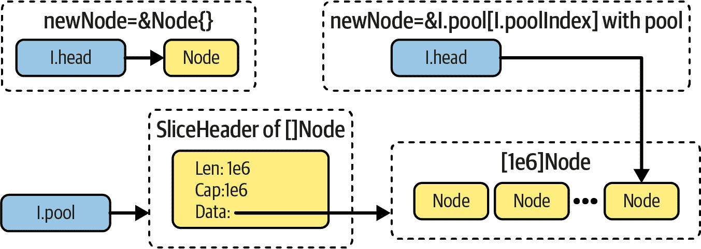
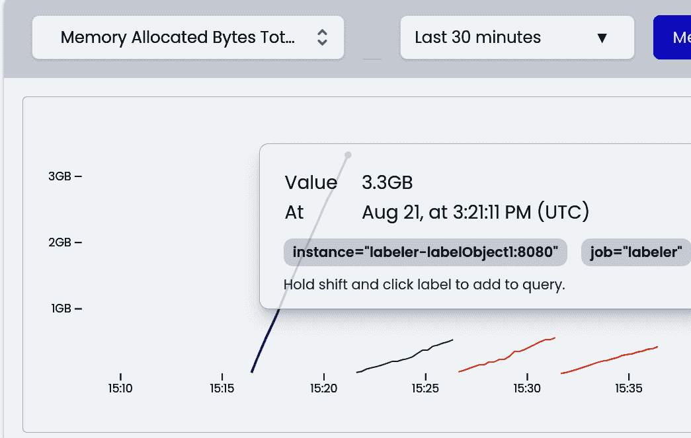
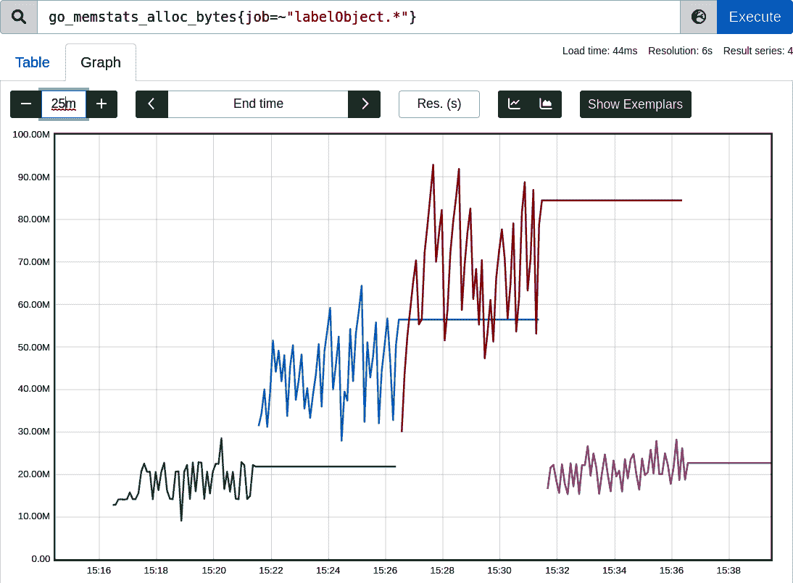

# 第十一章 优化模式

通过我们在过去 10 章学到的一切，现在是时候了解我在开发高效 Go 代码时发现的各种模式和常见陷阱了。正如我在第十章中提到的，优化建议并不通用。然而，考虑到此时此刻你应该知道如何有效评估代码变更，指出在某些情况下提高效率的常见模式是无害的。

# 成为一个审慎的 Go 开发者

记住，你在这里看到的大多数优化想法都是经过深思熟虑的。这意味着我们必须有充分的理由将它们添加进来，因为它们需要开发者花费时间来正确实现并在未来维护。即使你了解了一些常见的优化方法，也要确保它们能提高你特定工作负载的效率。

不要把这一章当作严格的手册，而是把它当作你没有考虑过的潜在选择列表。然而，始终坚持我们在前几章学到的可观察性、基准测试和性能分析工具，以确保你所做的优化是实用的，遵循[YAGNI](https://oreil.ly/G9OLQ)，并且是必要的。

我们将从“常见模式”开始，我将描述一些高级优化模式，这些模式可以从第十章的优化示例中看到。然后，我将向您介绍“三 R 优化方法”，这是 Go（和 Prometheus）社区的一个优秀的内存优化框架。

最后，在“不泄露资源”，“如果可能，预分配”，“使用数组时过度使用内存”和“内存重用和池化”中，我们将逐一介绍一套特定的优化、技巧和我在开始优化 Go 代码旅程时希望知道的陷阱！我选择了最常见的那些值得注意的。

让我们从常见的优化模式开始。其中一些我在之前的章节中使用过。

# 常见模式

如何找到优化？在进行基准测试、性能分析和代码研究之后，这个过程需要我们找出一个更好的算法、数据结构或代码，以便更高效地运行。当然，这说起来容易做起来难。

一些实践和经验是有帮助的，但我们可以概述一些在我们的优化旅程中重复出现的模式。现在让我们逐一介绍编程社区和文献中看到的四种通用模式：做更少的工作，以及为了效率而交换功能，为了时间而交换空间，为了空间而交换时间。

## 做更少的工作

我们应该首先关注避免不必要的工作。特别是在“优化延迟”中，通过删除大量不必要的代码，我们多次改进了 CPU 时间。这可能看起来过于简单，但这是我们经常忽视的强大模式。如果代码的某些部分非常关键并且需要优化，我们可以查看瓶颈（例如，在“go tool pprof 报告”中，我们在源代码视图中看到的大量贡献行）并检查我们是否可以：

跳过不必要的逻辑

我们能移除这行吗？例如，在“优化延迟”中，`strconv.ParseInt` 有很多检查，在我们的实现中并不需要。我们可以利用我们的假设和要求，削减不严格需要的功能。这还包括我们可以早期清理的潜在资源或任何资源泄漏（参见“不要泄漏资源”）。

# 通用实现

对于编程问题，使用通用解决方案非常诱人。我们经常训练自己发现模式，而编程语言提供了许多抽象和面向对象的范式来复用更多的代码。

正如我们在“优化延迟”中看到的，虽然`bytes.Split`和`strconv.ParseInt`函数设计良好，使用安全，并且功能丰富，但它们可能并不总适合于关键路径。“通用”具有许多缺点，效率通常是首要受害者。

做一次事情

这已经完成了吗？也许我们已经在其他地方循环遍历了同一个数组，所以我们可以更多地“原地”处理，就像在示例 10-3 中所做的那样。

可能有些情况下，我们验证某个不变量，即使之前已经验证过它。或者我们“只是为了确保”再次排序，但当我们仔细检查代码时，它已经排序了。例如，在 Thanos 项目中，当合并不同的指标流时，我们可以进行[“k 路归并”](https://oreil.ly/LxjZq)，而不是天真地合并并重新排序，因为每个流都以词典顺序提供指标，这是不变的。

另一个常见的例子是内存重用。例如，我们可以创建一个小缓冲区并重复使用它，就像在示例 10-8 中一样，而不是每次需要时都创建一个新的。我们还可以使用缓存或者“内存重用和池化”。

利用数学来少做一些工作

使用数学是减少我们需要做的工作的一个了不起的方法。例如，为了计算通过 Prometheus API 检索的样本数，我们不需要解码块并迭代所有样本来计数。相反，我们通过块的大小除以平均样本大小来估算样本数。

利用已有的知识或预计算的信息

许多 API 和函数被设计为智能并自动化某些工作，即使这意味着做更多工作。一个例子是预分配的可能性，在“如果可以的话，预分配”中讨论过。

在另一个更复杂的例子中，我们使用的[`minio-go`](https://oreil.ly/YqDZ6)对象存储客户端可以上传任意的 `io.Reader` 实现。然而，该实现在上传前需要计算校验和。因此，如果我们没有提供读取器中可用字节的总预期大小，`minio-go` 将使用额外的 CPU 循环和内存来缓冲整个，可能是几十亿字节大的对象。所有这些只是为了计算有时必须提前发送的校验和。另一方面，如果我们注意到这一点，并且已经有了总大小的信息，通过 API 提供这些信息可以显著提高上传效率。

这些元素看起来是专注于 CPU 时间和延迟，但我们可以将其用于内存或任何其他资源的使用。例如，在示例 11-1 中展示了“少做更多”意味着专注于更低内存使用的小例子。

##### 示例 11-1\. 使用空结构优化的判断切片中是否有重复元素的函数。使用“泛型”。

```go
func HasDuplicatesT comparable bool {
    dup := make(map[T]any, len(slice))
    for _, s := range slice {
        if _, ok := dup[s]; ok {
            return true
        }
        dup[s] = "whatever, I don't use this value"
    }
    return false
}

func HasDuplicates2T comparable bool {
    dup := make(map[T]struct{}, len(slice))
    for _, s := range slice {
        if _, ok := dup[s]; ok {
            return true
        }
        dup[s] = struct{}{} 
    }
    return false
}
```


因为我们不使用 `map` 值，我们可以使用 `struct{}` 声明，它不使用内存。由于这个原因，我的机器上 `HasDuplicates2` 的速度快了 22%，而对于包含 100 万个元素的 `float64` 切片，内存分配减少了 5 倍。在我们不关心值的地方也可以使用相同的模式。例如，对于用于同步 goroutine 的通道，我们可以使用 `make(chan struct{})` 来避免我们不需要的不必要空间。

通常，我们的程序中总是有减少一些工作的余地。我们可以利用分析来检查所有昂贵的部分及其与问题相关性，从而利用这一优势。通常我们可以删除或转换成更便宜的形式，从而提高效率。

# 要有战略眼光！

有时，现在做少量工作意味着以后会做更多工作或使用更多资源。我们可以对此进行战略性处理，并确保我们的本地基准测试不会忽略其他重要的权衡。这个问题在“内存重用和池化”中得到了突出展示，宏基准测试结果与微基准测试相反。

## 牺牲功能以换取效率

在某些情况下，为了提高效率，我们不得不谈判或移除某些功能。在“优化延迟”中，通过在文件中移除对负整数支持，我们可以改善 CPU 时间。在不需要这一要求的情况下，我们可以在示例 10-5 的 `ParseInt` 函数中移除对负号的检查！也许这个功能并不常用，可以用更便宜的执行来替代！

这也是为什么在项目中接受所有可能的功能通常不太可持续的原因。在许多情况下，额外的 API、额外的参数或功能可能会给关键路径带来显著的效率损失，如果我们仅将功能限制到最低限度，这些损失可以避免。¹

## 以空间换时间

如果我们通过减少不必要的逻辑、功能和泄漏来限制程序的工作，我们还能做些什么呢？通常，我们可以转向使用时间更少但在存储方面（如内存、磁盘等）花费更多的系统、算法或代码。让我们一起探讨一些可能的变更：²

预先计算结果

而不是每次计算相同昂贵的函数，我们可以尝试预先计算它并将结果存储在某个查找表或变量中。

如今，看到编译器适应这样的优化非常普遍。编译器通过交换编译器延迟和程序代码空间来实现更快的执行。例如，像 `10*1024*1024` 或 `20 * time.Seconds` 这样的语句可以由编译器预先计算，因此它们在运行时不必计算。

但是可能存在更复杂的函数语句情况，编译器无法为我们预先计算。例如，在某些条件下我们可以使用 `regexp.Must​Com⁠pile("…​").MatchString(`，这在关键路径上。也许在那些频繁使用的代码中，创建一个变量 `pattern := regexp.Must​Com⁠pile("…​")` 并在 `pattern.MatchString(` 上操作会更有效率。此外，某些加密算法提供了[预计算方法](https://oreil.ly/2VBL4)，可以加速执行。

缓存

当计算结果严重依赖于输入时，为只有在偶尔使用的一个输入预先计算结果并不是很有帮助。相反，我们可以像我们在示例 4-1 中所做的那样引入缓存。编写我们的缓存解决方案是一项非常重要的工作，应该谨慎进行。³有许多[缓存策略](https://oreil.ly/UAhqT)，其中最流行的是最近最少使用（LRU）策略，根据我的经验。

扩展数据结构

我们通常可以改变数据结构，使得某些信息可以更容易地访问，或者通过向结构中添加更多信息来实现。例如，我们可以将文件描述符旁边存储文件大小，而不是每次都查询文件大小。

此外，我们可以在我们的结构中保持元素的映射，这样在我们已有的切片旁边，我们可以更轻松地去重或查找元素（类似于我在示例 11-1 中所做的去重映射）。

解压缩

压缩算法非常适合节省磁盘或内存空间。然而，任何压缩——例如，字符串内部化、gzip、[zstd](https://oreil.ly/OEx9B)等——都会带来一些 CPU（因此，时间）开销，因此当时间就是金钱时，我们可能希望摆脱压缩。但要小心，因为启用压缩可以提高程序的响应延迟，例如在慢网络中用于消息时。因此，为了减少消息大小，以便我们可以通过更少的网络数据包发送更多内容，可能会更快。

理想情况下，决策是经过深思熟虑的。例如，也许我们知道根据 RAERs，我们的程序仍然可以使用更多内存，但我们未能达到延迟目标。在这种情况下，我们可以检查是否有什么可以添加、缓存或存储的内容，以便在程序中花费更少的时间。

## 用时间换空间

如果在执行期间我们可以节省一些延迟或额外的 CPU 时间，但内存不足，我们可以尝试前面提到的相反规则，用空间换时间。这些方法通常完全与“用时间换空间”中的方法相反：压缩和编码更多内容、从结构体中删除额外字段、重新计算结果、移除缓存等。

# 用时间换空间或用空间换时间优化并不总是直观的。

有时为了节省内存资源的使用，我们必须先分配更多！

例如，在“使用数组过多的内存”和“内存重用和池化”中，我提到了一些情况，即使看起来更费力，分配更多内存或明确复制内存也更好。因此，从长远来看，这可以节省更多内存空间。

总之，考虑这四个通用规则作为可能优化的更高级模式。现在让我向您介绍“三 R”，这对我在效率开发任务中指导一些优化工作非常有帮助。

# 三 R 优化方法

三 R 技术是减少浪费的一种卓越方法。它通常适用于所有计算机资源，但通常用于[生态目的](https://oreil.ly/p6elc)以减少实际浪费。由于这三个要素——减少、重复使用和回收利用——我们可以减少对地球环境的影响，并确保可持续生活。

在 2018 年的[FOSDEM](https://fosdem.org)上，我看到了[Bryan Boreham 令人惊叹的演讲](https://oreil.ly/BLIiT)，他描述了如何使用这种方法来减轻内存问题。事实上，三 R 方法对抗内存分配尤为有效，这是内存效率和 GC 开销问题的最常见根源。因此，让我们探讨每个“R”组件及其如何帮助。

## 减少分配

> 直接影响节奏的尝试（例如，使用`GOGC`或`GOMEMLIMIT`）与与收集器的同情无关。这确实是关于在每次收集之间或收集过程中完成更多工作。通过减少任何工作部分添加到堆内存的分配量或数量来影响它。
> 
> William Kennedy，《Go 中的垃圾收集：第一部分——语义》（https://oreil.ly/DVdNm）

几乎总有减少分配的空间——寻找浪费！我们的代码放在堆上的对象数量减少的一些方法显而易见（例如合理的优化，如我们在示例 1-4 中看到的切片预分配）。

然而，其他优化需要一定的权衡——通常需要更多的 CPU 时间或更不可读的代码，例如：

+   [字符串国际化](https://oreil.ly/qJu7u)，我们通过提供一个字典并使用一个更小、无指针的整数字典来避免对`string`类型进行操作，从而避免分配。

+   不安全的转换（从`[]byte`到`string`（反之亦然），无需复制内存）可能会节省分配，但如果操作不当可能会在堆中保留更多内存（在示例 11-15 中讨论）。

+   确保变量不逃逸到堆中也可以被认为是减少分配的一种努力。

减少分配方式有很多种。我们之前已经提到了一些。例如，当工作量减少时，通常可以减少分配！另一个提示是在所有优化设计层面上寻找减少分配的方法（“优化设计层次”），而不仅限于代码。在大多数情况下，算法必须首先改变，这样我们才能在移至代码层之前大幅提升空间复杂性。

## 内存重复使用

重复使用也是一种有效的技术。正如我们在“垃圾收集”中学到的那样，Go 运行时已经以某种方式重用了内存。尽管如此，还有一些方法可以显式地重用对象，如变量、切片或映射，以便在每次循环中重复操作而不是在每次循环中重新创建它们。我们将在“内存重用和池化”中讨论一些技术。

再次利用所有优化设计层次（参见“优化设计层次”）。我们可以选择重用内存的系统或算法设计；例如，请参阅“转向流式算法”。系统级别上“重用”的另一个优化示例是 TCP 协议。它提供保持连接以便重用，这也有助于建立新连接所需的网络延迟。

# 重复使用时要小心

诱人地将这个技巧理解字面上——许多人尝试尽可能地重用每一点东西，包括变量。正如我们在“值、指针和内存块”中学到的那样，变量是需要一些内存的盒子，但通常是在堆栈上，因此如果需要的话，我们不应该害怕创建更多的变量。相反，过度使用变量可能导致难以找到的错误，特别是当[我们遮蔽变量](https://oreil.ly/9Dfvb)时。

对复杂结构进行重复使用有时也非常危险，原因有两个：⁴

+   在第二次使用之前重置复杂结构的状态通常并不容易（而不是分配一个新的结构，这会创建一个确定的空结构）。

+   我们不能同时使用这些结构，这可能限制进一步的优化或使我们感到惊讶，并引发数据竞争。

## 回收

如果我们使用任何内存，回收是我们程序中必须具备的最小要求。幸运的是，在我们的 Go 代码中，我们不需要额外的东西，因为内置的 GC 负责将未使用的内存回收给操作系统，除非我们使用像“mmap Syscall”或其他非堆内存技术这样的高级工具。

然而，如果我们无法更少“减少”或“重复”更多内存，有时我们可以优化我们的代码或 GC 配置，以便垃圾收集的回收更有效。让我们来看看一些提高回收效率的方法：

优化分配对象的结构。

如果我们不能减少分配的数量，也许我们可以减少对象中指针的数量！然而，由于像[`time`](https://oreil.ly/3ZmWi)、[`string`](https://oreil.ly/CIoPc)或[slices](https://oreil.ly/Ow484)这样的常见结构包含指针，避免使用指针并不总是可能的。尤其是`string`看起来不像，但实际上它只是一个特殊的`[]byte`，这意味着它有一个指向字节数组的指针。在极端情况下，在特定条件下，将[`[]string`改为`offsets []int`和`bytes []byte`](https://oreil.ly/0zi89)可能值得，以创建一个无指针的结构！

另一个普遍的例子是在实现被序列化到不同字节格式（如 JSON、YAML 或[protobuf](https://oreil.ly/yZVuB)）的数据结构时，很容易生成指针密集的结构。诱人之处在于对嵌套结构使用指针，以允许字段的可选性（区分字段是否已设置）。一些代码生成引擎（如[Go protobuf 生成器](https://oreil.ly/SeNub)）默认将所有字段作为指针。对于较小的 Go 程序来说这没问题，但如果我们使用大量对象（这在网络消息中很常见），我们可能考虑尝试从这些数据结构中移除指针（许多生成器和序列化程序提供了这个选项）。

减少结构中指针的数量对于 GC 更好，并且可以使我们的数据结构更加 L1 缓存友好，减少程序的延迟。它还增加了编译器将数据结构放在堆栈而不是堆上的机会！

然而，主要的缺点是当你按值传递该结构时会有更多的开销（在 “Values, Pointers, and Memory Blocks” 中提到的复制开销）。

GC 调优

我在 “Garbage Collection” 中提到了两种 Go GC 的调优选项：`GOGC` 和 `GOMEMLIMIT`。

调整 `GOGC` 选项，将其从默认的 100% 值调整可能会有时对程序效率产生积极影响。根据需要，使下一次 GC 收集提前或延迟可能是有利的。不幸的是，需要大量基准测试来找到合适的数值。此外，不能保证这种调优在应用程序的所有可能状态下都能良好工作。而且，如果代码的关键路径经常变动，这种技术的可持续性很差。每次更改都需要进行另一次调优会话。这就是为什么像 Google 和 [Uber](https://oreil.ly/8YMRi) 这样的大公司会投资于自动调整 `GOGC` 的工具，以在运行时自动进行调整！

`GOMEMLIMIT` 是在 `GOGC` 之上可以调整的另一个选项。这是一个相对较新的 GC 选项，用于在堆接近或超过期望的软内存限制时更频繁地运行 GC。

查看 [更详细的 GC 调优指南](https://oreil.ly/3nGzV)，带有交互式可视化。

手动触发 GC 并手动释放 OS 内存

在极端情况下，我们可能希望尝试使用 `runtime.GC()` 手动触发 GC 收集。例如，在分配了大量内存并且不再引用它的操作之后，我们可能希望手动触发 GC。请注意，手动触发 GC 通常是一种强烈的反模式，特别是在库中，因为它具有全局效果。⁵

在堆外分配对象

我们提到尝试先在堆栈上分配对象而不是在堆上。但是堆栈和堆并不是我们唯一的选择。有方法可以在堆外分配内存，因此它不由 Go 运行时负责管理。

我们可以通过我们在 “mmap Syscall” 中学到的显式 `mmap` 系统调用来实现。一些人甚至尝试通过 CGO 调用像 `jemalloc` 这样的 C 函数。参见 [使用 CGO 调用 C 函数像 `jemalloc`](https://oreil.ly/6se5i)。

虽然可能，我们需要认识到这样做可以与重新实现 Go 分配器的部分相比，更不用说处理手动分配和缺乏内存安全性。这是我们可能想尝试的最后一件事，以获得终极高性能的 Go 实现！

光明的一面是，这个领域正在不断改进。在撰写本书时，Go 团队批准并实施了一个令人兴奋的[提案](https://oreil.ly/jXgHY)，背后是`GOEXPERIMENT=arena`环境变量。它允许从 GC 管理的堆之外的内存连续区域（`arena`）中分配一组对象。因此，我们将能够在需要时显式地隔离、跟踪和快速释放该内存（例如，在处理 HTTP 请求时），而不必等待或支付垃圾收集周期的费用。关于`arena`的特殊之处在于，它旨在在您意外使用以前未使用的内存时使程序崩溃，从而确保一定程度的内存安全性。一旦发布，我迫不及待地想开始使用它——这可能意味着更安全、更易于使用的离堆优化。

在尝试任何回收改进我们的生产代码之前，必须对所有这些优化的效果进行基准测试和测量。其中一些如果在没有进行广泛测试的情况下使用，可能被认为是棘手且不安全的。

总结一下，记住三个 R 方法，最好按照同样的顺序：减少，重用和回收。现在让我们深入了解一些我在实践中看到的常见 Go 优化。其中一些可能会让你感到意外！

# 不要泄漏资源

资源泄漏是降低我们 Go 程序效率的常见问题。当我们创建某些资源或后台 goroutine，并在使用后希望释放或停止它时，却意外地遗留下来。这在小规模上可能不明显，但迟早会变成一个难以调试的大问题。我建议无论如何都要清理自己创建的东西，即使你期望在下一个周期退出程序！⁶

# “这个程序有内存泄漏！”

不是每一种更高的内存利用行为都可以被视为泄漏。例如，我们可能会在某些操作中“浪费”更多的内存，导致堆使用量的突增，但在某个时刻会被清除。

从技术上讲，泄漏只有当程序的负载相同时（例如，长时间运行的服务的相同数量的 HTTP 流量），我们使用无限量的资源（例如，磁盘空间，内存，数据库中的行数），最终耗尽时才会发生。

在泄漏和浪费的边缘存在意外的不确定性内存使用情况。这些有时被称为伪内存泄漏，我们将在“使用数组过多地消耗内存”中讨论其中一些。

或许我们可能会认为内存应该是这一规则的例外情况。堆栈内存会自动移除，并且 Go 中的垃圾回收动态地移除堆上分配的内存。⁷ 除了停止引用并等待（或触发）完整的 GC 循环外，没有办法触发内存块的清理。但是，不要被这个所欺骗。有很多情况下，Go 开发人员编写的代码会泄漏内存，尽管最终会进行垃圾回收！

我们的程序泄漏内存有几个原因：

+   我们的程序频繁创建自定义的 `mmap` 系统调用，却从不关闭它们（或者关闭比创建慢）。这通常会导致进程或者机器的 OOM。

+   我们的程序调用了太多嵌套函数，通常是无限或大型递归。我们的进程将因此出现堆栈溢出错误而退出。

+   我们引用了一个长度很小的 slice，但忘记了它的容量非常大，如 “过度使用数组的内存” 中所解释的那样。

+   我们的程序在堆上不断创建内存块，这些内存块总是被执行范围内的某些变量引用。这通常意味着我们泄漏了 goroutines 或者无限增长的 slices 或 maps。

当我们知道内存泄漏的位置时，修复起来很容易，但是要找出它们并不容易。通常是在应用程序崩溃后才会得知泄漏问题。如果没有像 “持续剖析” 中的高级工具，我们就必须希望通过本地测试来重现问题，但这并非总是可能的。

即使在过去的堆剖析中，在泄漏期间，我们只能看到分配内存块的代码中的内存，而看不到当前引用它的代码。⁸ 一些内存泄漏，特别是由泄漏的 goroutine 导致的，可以通过 goroutine 缩小范围来缩小，但并非总是如此。

幸运的是，一些最佳实践可以预防我们泄漏任何不可压缩的资源（例如磁盘空间、内存等），避免那种痛苦的泄漏分析。请将本节中的建议视为我们始终关注和合理优化的内容。

## 控制你的 Goroutine 的生命周期

> 每当在程序中使用 go 关键字启动 goroutine 时，都必须知道该 goroutine 将如何以及何时退出。如果你不知道答案，那就可能会导致内存泄漏。
> 
> Dave Cheney，《“不要在不知道如何停止它的情况下启动 goroutine”》(https://oreil.ly/eZKzr)

Goroutines 是一种优雅而干净的并发编程框架，但也有一些缺点。其中一个是每个 Goroutine 完全与其他 Goroutine 隔离（除非我们使用显式的同步范式）。在 Go 运行时中没有中央调度，我们可以调用它，并且例如要求关闭当前 Goroutine 创建的 Goroutines（甚至检查它创建了哪一个）。这不是框架成熟度的不足，而是允许 Goroutines 非常高效的设计选择。作为一种权衡，我们必须实现可能会在工作完成时停止它们的代码，或者更具体地说，停止 Goroutine 内部的代码（唯一的方法！）。

解决方案决不是创建一个 Goroutine 并将其留在那里没有严格的控制，即使我们认为计算速度很快。相反，在调度 Goroutines 时，考虑两个方面：

如何停止它们

我们应该始终问自己，Goroutine 何时会完成。它会自动完成，还是我必须使用上下文、通道等触发完成（如后续示例中的示例）？例如，如果请求被取消，我应该能够中止 Goroutine 的长时间执行吗？

我的函数应该等待 Goroutine 完成吗？

我的代码是否希望继续执行而不等待 Goroutines 完成？通常答案是否定的，您应该等待 Goroutine 停止，例如使用 [`sync.WaitGroup`](https://oreil.ly/PQHom)（例如在 示例 10-10 中）、[`errgroup`](https://oreil.ly/G1Aqx) 或优秀的 [`run.Group`](https://oreil.ly/B1ABL) 抽象。

有许多情况下，感觉可以放心地让 Goroutines “最终” 停止，但实际上，不等待它们会带来危险后果。例如，考虑异步计算某些数字的 HTTP 服务器处理程序，参见 示例 11-2。

##### 示例 11-2\. 并发函数中常见泄漏的展示

```go
func ComplexComputation() int { 
    // Some computation...

    // Some cleanup...
    return 4
}

func Handle_VeryWrong(w http.ResponseWriter, r *http.Request) {
    respCh := make(chan int)

    go func() { 
        defer close(respCh) 
        respCh <- ComplexComputation()
    }()

    select { 
    case <-r.Context().Done():
        return 
    case resp := <-respCh:
        _, _ = w.Write([]byte(strconv.Itoa(resp)))
        return
    }
}
```


小函数模拟较长的计算过程。想象一下，完成所有计算大约需要两秒钟。


想象一个调度异步计算的处理程序。


我们的代码不依赖于某人关闭通道，但作为良好的实践，发送者关闭它。


如果取消操作发生，则立即返回。否则，我们等待结果。乍看之下，上述代码看起来并不太糟糕。它似乎我们控制了调度 Goroutine 的生命周期。


不幸的是，细节隐藏在更多的信息中。我们只在一个好的情况下控制生命周期（即没有发生取消时）。如果我们的代码到达这一行，我们在这里做了一些不好的事情。我们无需关心 goroutine 生命周期而返回。我们没有停止它。我们没有等待它。更糟糕的是，这是一个永久泄漏，即带有`ComplexCalculation`的 goroutine 将被饿死，因为没有人从`respCh`通道读取。

虽然 goroutine 看起来受到控制，但并非在所有情况下都是如此。这种有漏洞的代码在 Go 代码库中很常见，因为需要非常详细的关注来不遗漏每一个小的边缘情况。由于这些错误，我们倾向于推迟在我们的 Go 中使用 goroutine，因为很容易出现这样的泄漏。

泄漏最糟糕的部分是，我们的 Go 程序可能会在很长时间内幸存下来，直到有人注意到这些泄漏的不良影响。例如，周期性运行`Handle_VeryWrong`并定期取消它最终会导致这个 Go 程序 OOM，但如果我们仅偶尔取消并定期重新启动我们的应用程序，如果没有良好的可观察性，我们可能永远不会注意到它！

幸运的是，有一个神奇的工具可以让我们在单元测试级别发现这些泄漏。因此，我建议在每个使用并发代码的单元（或测试文件）中使用泄漏测试。其中之一是来自 Uber 的[`goleak`](https://oreil.ly/4N4bb)，其基本用法在示例 11-3 中展示。

##### 示例 11-3\. 在示例 11-2 代码中进行泄漏测试

```go
func TestHandleCancel(t *testing.T) { 
    defer goleak.VerifyNone(t) 

    w := httptest.NewRecorder()
    r := httptest.NewRequest("", "https://efficientgo.com", nil)

    wg := sync.WaitGroup{}
    wg.Add(1)

    ctx, cancel := context.WithCancel(context.Background())
    go func() {
        Handle_VeryWrong(w, r.WithContext(ctx))
        wg.Done()
    }()
    cancel()

    wg.Wait()
}
```


让我们创建测试来验证取消行为。这是可能触发泄漏的地方。


要验证 goroutine 泄漏，只需在我们的测试顶部延迟[`goleak.VerifyNone`](https://oreil.ly/bgcwF)。它会在测试结束时运行，并且如果有任何意外的 goroutine 仍在运行，则测试失败。我们还可以使用[`goleak.VerifyTestMain`方法](https://oreil.ly/zyPjr)来验证整个包的测试。

运行这样的测试会导致测试失败，并输出示例 11-4 中的内容。

##### 示例 11-4\. 两次失败运行示例 11-3 的输出

```go
=== RUN   TestHandleCancel
    leaks.go:78: found unexpected goroutines:
        [Goroutine 8 in state sleep, with time.Sleep on top of the stack:
        goroutine 8 [sleep]: 
        time.Sleep(0x3b9aca00)
           /go1.18.3/src/runtime/time.go:194 +0x12e
        github.com/efficientgo/examples/pkg/leak.ComplexComputation()
           /examples/pkg/leak/leak_test.go:107 +0x1e
        github.com/efficientgo/examples/pkg/leak.Handle_VeryWrong.func1()
           /examples/pkg/leak/leak_test.go:117 +0x5d
        created by github.com/efficientgo/examples/pkg/leak.Handle_VeryWrong
           /examples/pkg/leak/leak_test.go:115 +0x7d
        ]
--- FAIL: TestHandleCancel (0.44s)
=== RUN   TestHandleCancel
    leaks.go:78: found unexpected goroutines:
        [Goroutine 21 in state chan send, with Handle_VeryWrong.func1 (...):
        goroutine 21 [chan send]: 
        github.com/efficientgo/examples/pkg/leak.Handle_VeryWrong.func1()
           /examples/pkg/leak/leak_test.go:117 +0x71
        created by github.com/efficientgo/examples/pkg/leak.Handle_VeryWrong
           /examples/pkg/leak/leak_test.go:115 +0x7d
        ]
--- FAIL: TestHandleCancel (3.44s)
```


我们看到测试结束时仍在运行的 goroutine 以及它们正在执行的操作。


如果我们在取消后等待几秒钟，我们会发现 goroutine 仍在运行。但是，这次它正在等待从`respCh`读取，这永远不会发生。

这种边缘情况泄漏的解决方案是修复示例 11-2 代码。所以让我们看看在示例 11-5 中似乎解决了问题的两个潜在解决方案，但仍然以某种方式泄漏！

##### 示例 11-5\. （仍然）泄漏的处理程序。这次留下的 goroutine 最终会停止。

```go
func Handle_Wrong(w http.ResponseWriter, r *http.Request) {
    respCh := make(chan int, 1) 

    go func() {
        defer close(respCh)
        respCh <- ComplexComputation()
    }()

    select {
    case <-r.Context().Done():
        return
    case resp := <-respCh:
        _, _ = w.Write([]byte(strconv.Itoa(resp)))
        return
    }
}

func Handle_AlsoWrong(w http.ResponseWriter, r *http.Request) {
    respCh := make(chan int, 1)

    go func() {
        defer close(respCh)
        respCh <- ComplexComputationWithCtx(r.Context()) 
    }()

    select {
    case <-r.Context().Done():
        return
    case resp := <-respCh:
        _, _ = w.Write([]byte(strconv.Itoa(resp)))
        return
    }
}

func ComplexComputationWithCtx(ctx context.Context) (ret int) {
    var done bool
    for !done && ctx.Err == nil {
        // Some partial computation...
    }

    // Some cleanup... 
    return ret
}
```


这段代码与示例 11-2 中的 `HandleVeryWrong` 唯一的区别在于我们创建了一个带有一个消息缓冲区的通道。这使得计算 goroutine 可以将一个消息推送到这个通道而不必等待某人读取它。如果我们取消并等待一段时间，那么“遗留”的 goroutine 最终将完成。


为了使事情更有效率，我们甚至可以实现一个接受上下文的 `ComplexComputationWithCtx`，当计算被取消且不再需要时取消它。


很多上下文取消的函数在上下文被取消时并不会立即结束。也许会定期检查上下文，或者需要一些清理来恢复取消的更改。在我们的情况下，我们用睡眠模拟清理等待时间。

示例 11-5 中的例子提供了一些进展，但不幸的是，它们仍然在技术上泄漏。在某些方面，泄漏只是暂时的，但它仍然可能由于以下原因导致问题：

未记账的资源使用。

如果我们为请求 A 使用 `Handle_AlsoWrong` 函数，然后 A 取消。结果，`ComplexComputation` 在 `Handle_AlsoWrong` 完成后意外分配了大量内存—这将导致混淆情况。此外，所有可观察性工具将指示请求 A 完成后发生了内存峰值，因此会错误地认为请求 A 与内存问题无关。

会计问题可能对我们程序未来的可扩展性有重大影响。例如，想象一下，取消的请求通常需要 200 毫秒才能完成。这并不正确—如果我们考虑了所有计算，我们会看到它与，例如，1 秒钟的 `ComplexComputation` 清理延迟有关。在给定某些机器资源情况下，这种计算非常重要，用于预测特定流量的资源使用情况。

我们可能更快地耗尽资源。

这样的“遗留”goroutine 仍然可能导致 OOM，因为使用是非确定性的。连续运行和取消仍然会给人一种服务器准备调度另一个请求的印象，并继续添加泄漏的异步作业，这最终可能使程序饿死。这种情况符合泄漏的定义。

我们确定他们完成了吗？

此外，留下 goroutine 还会使我们无法了解它们运行多长时间以及在所有边缘情况下是否完成。也许有一个 bug 会使它们在某个时候被卡住。

因此，我强烈建议在您的代码中永远不要留下 goroutine。幸运的是，示例 11-3 将所有三个函数（`Handle_VeryWrong`、`Handle_Wrong` 和 `Handle_AlsoWrong`）标记为泄漏，这通常是我们想要的。要完全修复泄漏，我们可以在我们的情况下始终等待结果通道，就像示例 11-6 中所示。

##### 示例 11-6\. 不会泄漏的 Example 11-2 版本

```go
func Handle_Better(w http.ResponseWriter, r *http.Request) {
    respCh := make(chan int)

    go func() {
        defer close(respCh)
        respCh <- ComplexComputationWithCtx(r.Context())
    }()

    resp := <-respCh 
    if r.Context().Err() != nil {
        return
    }

    _, _ = w.Write([]byte(strconv.Itoa(resp)))
}
```


始终从通道读取使我们能够等待 goroutine 停止。我们还通过向 `ComplexComputationWithCtx` 传播适当的上下文尽快响应取消。

最后但并非最不重要的，当您进行并发代码基准测试时要小心。始终在每个 `b.N` 迭代中等待您定义为“一个操作”的内容。在 Example 11-7 中提供了解决方案的常见基准测试中的泄漏。

##### 示例 11-7\. 展示并发代码基准测试中常见的泄漏。

```go
func BenchmarkComplexComputation_Wrong(b *testing.B) { 
    for i := 0; i < b.N; i++ {
        go func() { ComplexComputation() }()
        go func() { ComplexComputation() }()
    }
}

func BenchmarkComplexComputation_Better(b *testing.B) { 
    defer goleak.VerifyNone(
        b,
        goleak.IgnoreTopFunction("testing.(*B).run1"),
        goleak.IgnoreTopFunction("testing.(*B).doBench"),
    ) 

    for i := 0; i < b.N; i++ {
        wg := sync.WaitGroup{}
        wg.Add(2)

        go func() {
            defer wg.Done()
            ComplexComputation()
        }()
        go func() {
            defer wg.Done()
            ComplexComputation()
        }()
        wg.Wait()
   }
}
```


假设我们想要对并发的 `ComplexComputation` 进行基准测试。调度两个 goroutine 可能会发现一些有趣的减速，如果这些函数之间共享任何资源。然而，这些基准测试结果完全错误。我的机器显示 `1860 ns/op`，但如果仔细观察，我们会发现我们没有等待任何这些 goroutine 完成。因此，我们只测量了每个操作调度两个 goroutine 所需的延迟。


要测量两个并发计算的延迟，我们必须等待它们的完成，也许使用 `sync.WaitGroup`。这个基准测试显示了一个更加现实的 `2000339135 ns/op`（每个操作两秒）的结果。


我们还可以在我们的基准测试中使用 `goleak` 来验证泄漏！然而，由于这个 [问题](https://oreil.ly/VTE9t)，我们需要一个特定于基准测试的过滤器。

总之，控制你的 goroutine 生命周期，以确保当前和未来的可靠效率！确保 goroutine 生命周期作为合理的优化。

## 可靠地关闭事物

这可能是显而易见的，但是如果我们创建了某个对象，该对象在使用后应该关闭，我们应该确保不要忘记或忽视这一点。如果我们创建了某个 `struct` 的实例或使用了某个函数，并且我们看到某种“closer”，例如：

+   它返回 `cancel` 或 `close` 闭包，例如 [`context.WithTimeout`](https://oreil.ly/lmvQd) 或 [`context.WithCancel`](https://oreil.ly/aVkMY).⁹

+   返回的对象具有类似关闭、取消或停止的语义的方法，例如 [`io.ReaderCloser.Close()`](https://oreil.ly/7Lyfs)，[`time.Timer.Stop()`](https://oreil.ly/V7ba8)，或 TearDown。

+   有些函数没有 closer 方法，但有一个专门的关闭或删除包级函数，例如 [`os.Create`](https://oreil.ly/a2nt4) 或 [`os.Mkdir`](https://oreil.ly/klgKo) 的相应“释放”函数是 [`os.Remove`](https://oreil.ly/DPNIA)。

如果我们遇到这种情况，请假设最坏的情况：如果在使用对象后没有调用该函数，会发生糟糕的事情。某些 goroutine 将无法完成，某些内存将被保持引用，或者更糟的是，我们的数据将无法保存（例如`os.File.Close()`的情况）。我们应该尽量保持警惕。当我们使用新的抽象时，应检查它是否有任何关闭器。不幸的是，没有 linter 会指出我们是否忘记调用它们。¹⁰

不幸的是，这还不是全部。我们不能只是推迟对`Close`的调用。通常，它还会返回错误，这可能意味着关闭操作无法完成，必须处理这种情况。例如，`os.Remove`由于权限问题失败，文件没有被删除。如果我们不能退出应用程序、重试或处理错误，至少应意识到可能存在的泄漏。

这是否意味着`defer`语句不那么有用，我们必须为所有关闭器添加`if err != nil`样板？并不完全是这样。这就是我建议使用[`errcapture`](https://oreil.ly/ucTUB)和[`logerrcapture`](https://oreil.ly/vb2vn)包的情况。参见 Example 11-8。

##### Example 11-8\. 使用`defer`关闭文件的示例

```go
// import "github.com/efficientgo/core/logerrcapture"
// import "github.com/efficientgo/core/errcapture"

func doWithFile_Wrong(fileName string) error {
    f, err := os.Open(fileName)
    if err != nil {
        return err
    }
    defer f.Close() // Wrong! 

    // Use file...

    return nil
}

func doWithFile_CaptureCloseErr(fileName string) (err error) { 
    f, err := os.Open(fileName)
    if err != nil {
        return err
    }
    defer errcapture.Do(&err, f.Close, "close file") 

    // Use file...

    return nil
}

func doWithFile_LogCloseErr(logger log.Logger, fileName string) {
    f, err := os.Open(fileName)
    if err != nil {
        level.Error(logger).Log("err", err)
        return
    }
    defer logerrcapture.Do(logger, f.Close, "close file") 

    // Use file...
}
```


绝不要忽视错误。特别是在文件关闭时，这通常会导致我们的写入仅在`Close`时刷新到磁盘上，如果出现错误，我们将丢失数据。


幸运的是，我们不需要放弃令人惊叹的 Go `defer`逻辑。使用`errcapture`，我们可以在`f.Close`返回错误时返回错误。如果`doWithFile_CaptureCloseErr`返回错误并且我们关闭文件，则潜在的关闭错误将附加到返回的错误中。这要归功于此函数的返回参数`(err error)`。如果没有它，这种模式将无法工作！


如果我们无法处理，还可以记录关闭错误。

如果我们看到我参与的任何项目（并影响了类似这样的模式），我会在所有返回错误的函数中使用`errcapture`，并且可以推迟它们——这是一种干净且可靠的方式来避免某些泄漏。

另一个常见的例子是错误情况下忘记关闭的情况。假设我们需要打开一组文件以备后用。确保关闭它们并不总是简单的，正如在 Example 11-9 中所示。

##### Example 11-9\. 在错误情况下关闭文件

```go
// import "github.com/efficientgo/core/merrors"

func openMultiple_Wrong(fileNames ...string) ([]io.ReadCloser, error) {
    files := make([]io.ReadCloser, 0, len(fileNames))
    for _, fn := range fileNames {
        f, err := os.Open(fn)
        if err != nil {
            return nil, err // Leaked files! 
        }
        files = append(files, f)
    }
    return files, nil
}

func openMultiple_Correct(fileNames ...string) ([]io.ReadCloser, error) {
    files := make([]io.ReadCloser, 0, len(fileNames))
    for _, fn := range fileNames {
        f, err := os.Open(fn)
        if err != nil {
            return nil, merrors.New(err, closeAll(files)).Err() 
        }
        files = append(files, f)
    }
    return files, nil
}

func closeAll(closers []io.ReadCloser) error {
    errs := merrors.New()
    for _, c := range closers {
        errs.Add(c.Close())
    }
    return errs.Err()
}
```


这通常很难注意到，但如果我们创建了更多需要关闭的资源，或者我们希望在不同的函数中关闭它们，`defer` 就不能用了。通常这没问题，但如果我们想创建三个文件并且在打开第二个文件时出现错误，我们就会泄漏第一个未关闭的文件的资源！我们不能只是从 `openMultiple_Wrong` 返回已打开的文件和一个错误，因为一致的流程是忽略返回的任何内容，如果有错误的话。我们通常必须关闭已打开的文件以避免泄漏和混乱。


解决方案通常是创建一个短小的辅助函数，遍历附加的关闭器并关闭它们。例如，我们使用 [`merrors`](https://oreil.ly/icRMt) 包进行方便的错误追加，因为我们希望知道在任何 `Close` 调用中是否发生了新的错误。

总之，关闭资源非常重要，被认为是一种良好的优化策略。当然，没有单一的模式或者检查工具能够防止所有的错误，但我们可以采取很多措施来减少风险。

## 用尽资源

更复杂的是，某些实现要求我们做更多的工作来完全释放所有资源。例如，一个 [`io.Reader`](https://oreil.ly/HR89x) 的实现可能没有提供 `Close` 方法，但它可能假定所有的字节都将被完全读取。另一方面，某些实现可能有 `Close` 方法，但仍然期望我们“用尽”读取器以实现高效利用。

具有这种行为的最流行的实现之一是标准库中的 [`http.Request`](https://oreil.ly/3Gq9j) 和 [`http.Response`](https://oreil.ly/3L02L) 的 body `io.ReadCloser`。问题显示在 Example 11-10 中。

##### Example 11-10\. `http/net` 客户端由于错误处理的 HTTP 响应而导致效率低下的示例

```go
func handleResp_Wrong(resp *http.Response) error { 
    if resp.StatusCode != http.StatusOK {
        return errors.Newf("got non-200 response; code: %v", resp.StatusCode)
    }
    return nil
}

func handleResp_StillWrong(resp *http.Response) error {
    defer func() {
        _ = resp.Body.Close() 
    }()

    if resp.StatusCode != http.StatusOK {
        return errors.Newf("got non-200 response; code: %v", resp.StatusCode)
    }
    return nil
}

func handleResp_Better(resp *http.Response) (err error) {
    defer errcapture.ExhaustClose(&err, resp.Body, "close") 

    if resp.StatusCode != http.StatusOK {
        return errors.Newf("got non-200 response; code: %v", resp.StatusCode)
    }
    return nil
}

func BenchmarkClient(b *testing.B) {
    defer goleak.VerifyNone(
        b,
        goleak.IgnoreTopFunction("testing.(*B).run1"),
        goleak.IgnoreTopFunction("testing.(*B).doBench"),
    )

    c := &http.Client{}
    defer c.CloseIdleConnections() 

    b.ResetTimer()
    for i := 0; i < b.N; i++ {
        resp, err := c.Get("http://google.com")
        testutil.Ok(b, err)
        testutil.Ok(b, handleResp_Wrong(resp))
    }
}
```


想象我们正在设计一个函数，处理来自 [`http.Client.Get`](https://oreil.ly/uB0Vd) 请求的 HTTP 响应。`Get` 明确提到，“调用方在读取完后应关闭 resp.Body。” 这个 `handle​R⁠esp_Wrong` 是错误的，因为它会泄漏两个 goroutine：

+   One doing `net/http.(*persistConn).writeLoop`

+   The second doing `net/http.(*persistConn).readLoop`，这在我们用 `goleak` 运行 `BenchmarkClient` 时可见。


`handleResp_StillWrong`更好，因为我们停止了主要的泄漏。然而，我们仍然没有从 body 中读取字节。我们可能不需要它们，但是如果我们不完全释放 body，`net/http`的实现可能会阻塞 TCP 连接。不幸的是，这并不是广为人知的信息。在[`http.Client.Do`](https://oreil.ly/RegPv)方法描述中简要提到：“如果没有读取到 EOF 并关闭 Body，Client 的底层 RoundTripper（通常是 Transport）可能无法重新使用与服务器的持久化 TCP 连接进行下一个‘keep-alive’请求。”


理想情况下，我们应该读取直到 EOF（文件结束），表示我们正在读取的内容结束。因此，我们创建了方便的辅助工具，如来自[`errcapture`](https://oreil.ly/4LhOs)或[`logerrcapture`](https://oreil.ly/XRxyA)的`ExhaustClose`。


客户端为每个想要保持活动并重用的 TCP 连接运行一些 goroutine。我们可以使用`CloseIdleConnection`关闭它们，以检测我们的代码可能引入的任何泄漏。

我希望像`http.Response.Body`这样的结构更容易使用。关闭和彻底释放 body 是重要的，应该作为合理优化的一部分使用。`handleResp_Wrong`导致`BenchmarkClient`出现泄漏错误。`handleResp_StillWrong`不会泄漏任何 goroutine，因此泄漏测试通过。这种“泄漏”发生在不同层次，即 TCP 层次，TCP 连接无法重用，这可能会导致额外的延迟和文件描述符不足。

我们可以通过 Example 11-10 中`BenchmarkClient`基准测试的结果看到其影响。在我的机器上，使用`handleResp_StillWrong`调用`http://google.com`花费了 265 毫秒。对于在`handleResp_Better`中清理所有资源的版本，只花费了 188 毫秒，快了 29%!¹¹

在`http.HandlerFunc`代码中也可以看到需要彻底释放资源。我们应该始终确保我们的服务器实现会完全释放和关闭`http.Request`的 body。否则，我们将会遇到与 Example 11-10 中相同的问题。类似地，对于各种迭代器也是如此；例如，[Prometheus 存储可以有一个`ChunkSeriesSet`迭代器](https://oreil.ly/voRFc)。如果我们忘记遍历直到`Next()`为 false，一些实现可能会泄漏或过度使用资源。

总之，始终检查那些非常规的边界情况的实现。理想情况下，我们应该设计我们的实现以明显的效率保证。

现在让我们深入探讨我在前几章中提到的预分配技术。

# 如果可能的话，预分配资源。

我在 “优化代码不易阅读” 中提到了预分配作为一个合理的优化方法。我展示了如何在 示例 1-4 中使用 `make` 轻松地预分配一个片段，作为 `append` 的一个优化。通常，我们希望减少代码需要重新调整或分配新项的工作量，如果我们知道代码最终必须这样做。

`append` 的例子很重要，但还有更多例子。事实证明，几乎每个关心效率的容器实现都有一些更简单的预分配方法。查看 示例 11-11 中的解释。

##### 示例 11-11\. 一些常见类型的预分配示例

```go
const size = 1e6 

slice := make([]string, 0, size) 
for i := 0; i < size; i++ {
    slice = append(slice, "something")
}

slice2 := make([]string, size) 
for i := 0; i < size; i++ {
    slice2[i] = "something"
}

m := make(map[int]string, size) 
for i := 0; i < size; i++ {
    m[i] = "something"
}

buf := bytes.Buffer{} 
buf.Grow(size)
for i := 0; i < size; i++ {
    _ = buf.WriteByte('a')
}

builder := strings.Builder{}
builder.Grow(size)
for i := 0; i < size; i++ {
    builder.WriteByte('a')
}
```


假设我们知道要提前扩展容器的大小。


使用切片的 `make` 允许我们将基础数组的容量增长到给定的大小。由于使用 `make` 主动增长数组，所以使用 `append` 的循环在 CPU 时间和内存分配上更加便宜。这是因为 `append` 在数组太小时无需重新调整数组大小。

调整大小是相当朴素的。它只是创建一个新的更大的数组并复制所有元素。某种启发式算法还告诉我们要增长多少个新片段。这个启发式算法最近已经 [改变](https://oreil.ly/6uIHH)，但它仍然会分配和复制几次，直到扩展到我们预期的一百万个元素。在我们的情况下，使用预分配的相同逻辑比传统方式快 8 倍，并且只分配了 16 MB 的内存，而不是 88 MB。


我们还可以预先分配片段的容量和长度。`slice` 和 `slice2` 都将具有相同的元素。两种方式几乎同样高效，因此我们选择更符合功能需求的方式。然而，在 `slice2` 中，我们使用了所有数组元素，而在 `slice` 中，我们可以将其扩展为更大，但如果需要的话最终使用较少的数字。¹²


可以使用 `make` 来创建 Map，并使用可选的数字表示其容量。如果我们提前知道大小，对于 Go 来说创建所需的内部数据结构更有效率。效率结果显示出差异——在我的机器上，使用预分配的地图初始化需要 87 毫秒，没有预分配则需要 179 毫秒！使用预分配的总分配空间为 57 MB，没有预分配则为 123 MB。然而，地图插入仍然可能分配一些内存，只是比预分配少得多。


各种缓冲区和构建器提供了 `Grow` 函数，也可以进行预分配。

上述示例实际上是我在几乎每次编码会话中经常使用的东西。预分配通常需要额外的一行代码，但它是一个很棒的、更可读的模式。如果你仍然不相信在切片大小上有很多情况时，你不会有很多情况，让我们来谈谈`io.ReadAll`。我们在 Go 社区中经常使用[`io.ReadAll`](https://oreil.ly/TN7bt)（以前是[`ioutil.ReadAll`](https://oreil.ly/nt1oT)）函数。你知道吗，如果你事先知道大小，你可以通过预分配内部字节切片来显著优化它？不幸的是，`io.ReadAll`没有`size`或`capacity`参数，但有一种简单的方法可以优化它，就像在示例 11-12 中所示的那样。

##### 示例 11-12\. 使用基准测试的 ReadAll 优化示例

```go
func ReadAll1(r io.Reader, size int) ([]byte, error) {
   buf := bytes.Buffer{}
   buf.Grow(size)
   n, err := io.Copy(&buf, r) 
   return buf.Bytes()[:n], err
}

func ReadAll2(r io.Reader, size int) ([]byte, error) {
   buf := make([]byte, size)
   n, err := io.ReadFull(r, buf) 
   if err == io.EOF {
      err = nil
   }
   return buf[:n], err
}

func BenchmarkReadAlls(b *testing.B) {
   const size = int(1e6)
   inner := make([]byte, size)

   b.Run("io.ReadAll", func(b *testing.B) {
      b.ReportAllocs()
      for i := 0; i < b.N; i++ {
         buf, err := io.ReadAll(bytes.NewReader(inner))
         testutil.Ok(b, err)
         testutil.Equals(b, size, len(buf))
      }
   })

   b.Run("ReadAll1", func(b *testing.B) {
      b.ReportAllocs()
      for i := 0; i < b.N; i++ {
         buf, err := ReadAll1(bytes.NewReader(inner), size)
         testutil.Ok(b, err)
         testutil.Equals(b, size, len(buf))
      }
   })

   b.Run("ReadAll2", func(b *testing.B) {
      b.ReportAllocs()
      for i := 0; i < b.N; i++ {
         buf, err := ReadAll2(bytes.NewReader(inner), size)
         testutil.Ok(b, err)
         testutil.Equals(b, size, len(buf))
      }
   })
}
```


模拟`ReadAll`的一种方式是创建一个预分配的缓冲区，并使用`io.Copy`复制所有字节。


更加高效的是预分配一个字节切片，并使用`ReadFull`，这与`ReadAll`类似。如果读取了所有内容，`ReadAll`不会使用`io.EOF`错误标志，因此我们需要特殊处理它。

结果如示例 11-13 所示。使用`io.ReadFull`的`ReadAll2`比`io.ReadAll`快八倍，并为我们的一百万字节切片分配的内存少五倍。

##### 示例 11-13\. 在示例 11-12 中的基准测试结果

```go
BenchmarkReadAlls
BenchmarkReadAlls/io.ReadAll
BenchmarkReadAlls/io.ReadAll-12  1210   872388 ns/op  5241169 B/op  29 allocs/op
BenchmarkReadAlls/ReadAll1
BenchmarkReadAlls/ReadAll1-12    8486   165519 ns/op  1007723 B/op  4 allocs/op
BenchmarkReadAlls/ReadAll2
BenchmarkReadAlls/ReadAll2-12    10000  102414 ns/op  1007676 B/op  3 allocs/op
PASS
```

在我们的 Go 代码中，`io.ReadAll`优化经常是可能的。特别是在处理 HTTP 代码时，请求或响应头通常提供了一个`Content-Length`头，允许预分配。¹³ 前面的例子只是允许预分配的类型和抽象的一个小子集。检查我们使用的类型的文档和代码，看看我们是否可以为了更好的效率而进行提前分配。

然而，还有一种令人惊奇的预分配模式我想让你知道。考虑一个简单的单链表。如果我们使用指针实现它，并且知道我们将在该列表上插入数百万个新元素，有没有办法为效率预分配东西？结果可能是有的，正如在示例 11-14 中所示。

##### 示例 11-14\. 链表元素的基本预分配

```go
type Node struct {
    next *Node
    value int
}

type SinglyLinkedList struct {
    head *Node

    pool      []Node 
    poolIndex int
}

func (l *SinglyLinkedList) Grow(len int) { 
    l.pool = make([]Node, len)
    l.poolIndex = 0
}

func (l *SinglyLinkedList) Insert(value int) {
    var newNode *Node
    if len(l.pool) > l.poolIndex { 
        newNode = &l.pool[l.poolIndex]
        l.poolIndex++
    } else {
        newNode = &Node{}
    }

    newNode.next = l.head
    newNode.value = value
    l.head = newNode
}
```


这一行使得这个链表有些特殊。我们以一个切片的形式维护一个对象池。


多亏了池，我们可以实现自己的`Grow`方法，它将在一个分配内分配许多`Node`对象的池。通常，分配一个大的`[]Node`比分配数百万个`*Node`要快得多。


在插入过程中，我们可以检查我们的池中是否有空间，并从中取出一个元素，而不是单独分配一个`Node`。如果我们达到容量限制，此实现可以扩展为更加健壮的实现，例如为后续的增长。

如果我们使用前述的链表插入一百万个元素进行基准测试，我们将看到，通过一次急切的分配，插入操作时间减少了四倍，并且与仅进行一次分配相比，占用的空间相同。

如示例 11-11 中所示，简单的预分配与切片和映射几乎没有缺点，因此可以视为合理的优化。另一方面，示例 11-14 中介绍的预分配应该谨慎进行，并且需要进行基准测试，因为它并非没有权衡。

首先，问题在于删除逻辑的可能性或允许多次调用`Grow`不是易事。第二个问题是，单个`Node`元素现在连接到一个非常大的单一内存块。让我们在下一节深入探讨这个问题。

# 使用数组过度使用内存

正如您可能知道的那样，切片在 Go 语言中非常强大。它们为每天在 Go 社区中使用的数组提供了[灵活的弹性](https://oreil.ly/YhOdH)。但是，随着强大和灵活性的增加，也伴随着责任。有许多情况下，我们可能会过度使用内存，有些人可能称之为“内存泄漏”。主要问题在于这些情况在“Go 基准测试”中永远不会出现，因为它涉及垃圾收集，并且不会释放我们认为可以释放的内存。让我们在示例 11-15 中探讨这个问题，该示例测试了在示例 11-14 中引入的`SinglyLinkedList`中的潜在删除操作。

##### 示例 11-15\. 重新制造过度使用内存的链表，该链表使用了预分配的方式在示例 11-14 中引入。

```go
func (l *SinglyLinkedList) Delete(n *Node) { /* ... */ } 

func TestSinglyLinkedList_Delete(t *testing.T) { 
    l := &SinglyLinkedList{}
    l.Grow(size)
    for k := 0; k < size; k++ {
        l.Insert(k)
    }
    l.pool = nil // Dispose pool. 
    _printHeapUsage() 

    // Remove all but last.
    for curr := l.head; curr.next != nil; curr = curr.next { 
        l.Delete(curr)
    }
    _printHeapUsage() 

    l.Delete(l.head)
    _printHeapUsage() 
}

func _printHeapUsage() {
    m := runtime.MemStats{}

    runtime.GC()
    runtime.ReadMemStats(&m)
    fmt.Println(float64(m.HeapAlloc)/1024.0, "KB")
}
```


让我们向链表添加删除逻辑，以删除给定的元素。


使用微基准来评估`Delete`的效率将告诉我们，当使用`Grow`时，删除操作只会稍微快一点。然而，为了展示内存过度使用的问题，我们需要进行宏基准测试（参见“宏基准”）。或者，我们可以像这里一样编写脆弱的交互式测试。¹⁴


注意，我们正在尽力让垃圾收集器删除已删除的节点。但是，我们将`pool`变量设为`nil`，因此我们用于创建列表中所有节点的切片不再被引用。


我们手动触发 GC，并打印堆的状态，通常这并不十分可靠，因为它包含后台运行时工作的分配。然而，这足以展示问题。在运行的一个阶段，预分配的列表显示为 15,818.5 KB，而在没有`Grow`的情况下运行则为 15,813.0 KB。不要看这些之间的差异，而是关注预分配的这个值如何变化。


让我们仅保留一个元素。


在完美的世界中，我们期望只为一个`Node`保留内存，对吧？对于非预分配列表来说，堆上是 189.85 KB。另一方面，对于预分配的列表，我们可以观察到一个问题：堆仍然很大，有 15,831.2 KB！


只有在所有元素之后，我们才会看到两种情况下堆大小较小（每种情况大约为 190 KB）。

这个问题很重要，我们每次处理带有数组的结构体时都会遇到。在两种情况下删除所有但一个元素时发生的情况的表示见图 11-1。



###### 图 11-1\. 带有列表中一个节点引用的堆状态。左侧是未使用池创建的状态，右侧是使用了池的状态。

当我们分配一个单独的对象时，我们看到它会获得自己的内存块，可以独立管理。如果我们使用池化或者从更大的切片中进行子切片（例如，`buf[1:2]`），GC 将会看到数组使用的连续大内存块被引用。它并不聪明地意识到只有其中的 1%被使用，可以被“裁剪”。

解决方案是避免使用池化，或者设计一个更高级的池，可以增长或缩小（甚至可以自动执行）。例如，如果删除了一半的对象，我们可以“裁剪”我们链表节点背后的数组。或者，我们可以添加按需的`ClipMemory`方法，如示例 11-16 所示。

##### 示例 11-16\. 裁剪过大内存块的示例实现

```go
func (l *SinglyLinkedList) ClipMemory() {
    var objs int
    for curr := l.head; curr != nil; curr = curr.next {
        objs++
    }

    l.pool = make([]Node, objs) 
    l.poolIndex = 0
    for curr := l.head; curr != nil; curr = curr.next {
        oldCurr := curr
        curr = &l.pool[l.poolIndex]
        l.poolIndex++

        curr.next = oldCurr.next 
        curr.value = oldCurr.value

        if oldCurr == l.head {
            l.head = curr 
        }
    }
}
```


此时，我们摆脱对旧的`[]Node`切片的引用，并创建一个较小的切片。


正如我们在图 11-1 中看到的，列表中每个元素仍然引用着更大的内存块。因此，我们需要使用新的对象池执行复制，以确保 GC 可以清除那些旧的更大的池。


让我们不要忘记最后一个指针`l.head`，否则它将仍然指向旧的内存块。

现在我们可以在删除一些项目时使用`ClipMemory`来调整底层内存块的大小。

正如示例 11-15 所展示的，过度使用内存比我们想象的更为常见。然而，并非需要专门的池化来避免这种情况。子切片和像示例 10-4 中的智能零拷贝函数（`zeroCopyToString`）很容易受到这个问题的影响。¹⁵

这一部分并不是要阻止你预先分配事物、进行子切片或者试验重用字节切片。相反，它提醒我们在尝试更高级的切片和底层数组操作时，始终要牢记 Go 是如何管理内存的（详见《Go 内存管理》）。

请记住，如同“微基准与内存管理”所述，Go 的基准测试不涵盖内存使用特性。如果怀疑受到这个问题的影响，移步“宏基准”级别以验证所有效率方面。

既然提到了池化，让我们深入探讨最后一节。在 Go 中重用和池化内存的其他方法是什么？事实证明，有时不池化任何东西可能更好！

# 内存重用与池化

内存重用允许在后续操作中使用相同的内存块。如果我们执行的操作需要更大的 `struct` 或 `slice`，并且快速连续执行许多此类操作，则每次分配新的内存块是一种浪费，因为：

+   分配保证零化内存块会消耗 CPU 时间。

+   我们为 GC 做了更多工作，因此使用了更多 CPU 周期。

+   GC 是最终性的，因此我们的最大堆大小可能无法受到控制地增长。

我已经在示例 10-8 中介绍了一些内存重用技术，使用一个小缓冲区逐块处理文件。然后在示例 11-14 中，我展示了我们可以一次性分配一个更大的内存块，并将其用作对象池。

物体的重用逻辑，特别是字节切片的重用，经常由许多流行的实现启用，比如 `io.CopyBuffer` 或 `io.ReadFull`。即使是我们的 示例 10-8 中的 `Sum6Reader​(r ⁠io.Reader, buf []byte)` 也允许进一步重用缓冲区。然而，内存重用并非总是那么简单。考虑以下字节切片重用示例 示例 11-17。

##### 示例 11-17\. 简单缓冲或字节切片

```go
func processUsingBuffer(buf []byte) {
    buf = buf[:0] 

    for i := 0; i < 1e6; i++ {
        buf = append(buf, 'a')
    }

    // Use buffer...
}

func BenchmarkProcess(b *testing.B) {
    b.Run("alloc", func(b *testing.B) {
        for i := 0; i < b.N; i++ {
            processUsingBuffer(nil) 
        }
    })

    b.Run("buffer", func(b *testing.B) {
        buf := make([]byte, 1e6)
        b.ResetTimer()
        for i := 0; i < b.N; i++ {
            processUsingBuffer(buf) 
        }
    })
}
```


因为我们的逻辑使用了 `append`，所以在重用相同的底层数组以提升效率时，我们需要将切片的长度清零。


我们可以通过简单传递 `nil` 来模拟没有缓冲区。幸运的是，Go 在诸如 `buf[:0]` 或 `append([]byte(nil), 'a')` 的操作中处理空切片。


在这种情况下重用缓冲区更好。在我的机器上，基准测试显示每个重用缓冲区的操作几乎快两倍，并且不分配任何字节。

前面的例子看起来很不错，但是真正的代码包含了复杂性和边缘情况。有两个主要问题有时会阻止我们实现这种天真的内存重用，就像示例 11-17 中一样：

+   我们知道大多数操作的缓冲区大小将类似，但并不知道确切的数量。通过传递一个空缓冲区并重用从第一个操作中增长的底层数组，这可以很容易地解决。

+   我们可能会在某个时刻并发运行`processUsingBuffer`代码。有时使用四个工作线程，有时使用一千个，有时使用一个。在这种情况下，我们可以通过维护一个静态数量的缓冲区来实现。这个数量可以是我们想要并发运行的最大 goroutine 数量，或者少于某些锁定。显然，如果 goroutine 的数量动态变化且有时为零，这可能会浪费很多资源。

因此，Go 团队提出了[`sync.Pool`](https://oreil.ly/BAQwU)结构，执行一种特定形式的内存池。重要的是要理解，内存池不同于典型的缓存。

> Brad Fitzpatrick 请求的类型[`sync.Pool`]实际上是一个池：一组可以互换的值，你得到的具体值并不重要，因为它们都是相同的。与从池中获取值而不是获取新创建的值相比，你甚至不会注意到这一点。相反，缓存会将键映射到具体的值。
> 
> Dominik Honnef，《Go Tip 中正在发生的事情》（https://oreil.ly/z6AUf）

标准库中的`sync.Pool`是纯粹作为一个非常短暂的临时缓存实现的，用于相同类型的自由内存块，这些内存块会持续到下一次或更多的 GC 调用。它使用相当智能的逻辑，使其线程安全并尽可能避免锁定，以便进行高效访问。`sync.Pool`的主要思想是重用 GC 尚未释放的内存。因为我们保留这些内存块直到最终的 GC，为什么不让它们可访问且有用呢？在示例 11-17 中展示了使用`sync.Pool`的示例，也呈现在示例 11-18 中。

##### 示例 11-18。使用`sync.Pool`进行简单缓冲

```go
func processUsingPool(p *sync.Pool) {
    buf := p.Get().([]byte) 
    buf = buf[:0]

    for i := 0; i < 1e6; i++ {
        buf = append(buf, 'a')
    }
    defer p.Put(buf) 

    // Use buffer...
}

func BenchmarkProcess(b *testing.B) {
    b.ReportAllocs()

    p := sync.Pool{
        New: func() any { return []byte{} }, 
    }
    b.ResetTimer()
    for i := 0; i < b.N; i++ {
        processUsingPool(&p) 
    }
}
```


`sync.Pool`池化给定类型的对象，因此我们必须将其转换为我们放置或创建的类型。当涉及到`Get`时，我们要么分配一个新对象，要么使用其中一个池化的对象。


要有效地使用池，我们需要将对象放回以便重用。记住永远不要将你仍在使用的对象放回，以避免竞争！


`New` 闭包指定如何创建新对象。


对于我们的示例，使用 `sync.Pool` 的实现非常高效。它比不重用的代码快两倍，每次操作平均分配了 2 KB 的空间，而不重用缓冲区的代码则分配了 5 MB。

虽然结果看起来非常有前景，但使用 `sync.Pool` 进行池化是一种更高级的优化，如果使用不当，可能会带来更多效率瓶颈而不是优化。第一个问题是，与任何其他使用切片的复杂结构一样，使用它容易出错。考虑带有基准测试的代码在 示例 11-19 中。

##### 示例 11-19\. 使用 `sync.Pool` 和 `defer` 时常见但难以发现的 bug

```go
func processUsingPool_Wrong(p *sync.Pool) {
    buf := p.Get().([]byte)
    buf = buf[:0]

    defer p.Put(buf) 

    for i := 0; i < 1e6; i++ {
        buf = append(buf, 'a')
    }

    // Use buffer...
}

func BenchmarkProcess(b *testing.B) {
    p := sync.Pool{
        New: func() any { return []byte{} },
    }
    b.ResetTimer()
    for i := 0; i < b.N; i++ {
        processUsingPool_Wrong(&p) 
    }
}
```


在这个函数中有一个 bug，这个 bug 违背了使用 `sync.Pool` 的初衷 — 在我们的情况下，`Get` 总是会分配一个对象。你能发现吗？

问题在于 `Put` 可能被推迟到正确的时间，但其参数在 `defer` 调度时会被评估。因此，我们正在放置的 `buf` 变量如果 `append` 需要扩展它，可能会指向不同的切片。


结果是，基准测试显示，这种 `processUsingPool_Wrong` 操作比总是分配的 `alloc` 情况（在 示例 11-17 中使用 `make([]byte)`）慢两倍。使用 `sync.Pool` 只进行 `Get` 而不进行 `Put` 操作比直接分配（在我们的情况下为 `make([]byte)`）更慢。

然而，真正的困难来自于 `sync.Pool` 的特性：它只能在短时间内池化对象，这在我们典型的微基准测试中并未体现，就像在 示例 11-18 中展示的一样。如果我们在基准测试中手动触发 GC，我们就能看到区别，这在 示例 11-20 中做了演示。

##### 示例 11-20\. 使用 `sync.Pool` 和 `defer` 时常见但难以发现的 bug，手动触发 GC

```go
func BenchmarkProcess(b *testing.B) {
    b.Run("buffer-GC", func(b *testing.B) {
        buf := make([]byte, 1e6)
        b.ResetTimer()
      for i := 0; i < b.N; i++ {
            processUsingBuffer(buf) 
            runtime.GC()
            runtime.GC()
        }
    })

    b.Run("pool-GC", func(b *testing.B) {
        p := sync.Pool{
            New: func() any { return []byte{} },
        }
        b.ResetTimer()
        for i := 0; i < b.N; i++ {
            processUsingPool(&p) 
            runtime.GC()
            runtime.GC()
        }
    })
}
```


第二个惊喜来自于我们最初的基准测试中，`process*` 操作快速执行，一个接一个地进行。然而，从宏观的角度来看，情况可能并非如此。对于 `processUsingBuffer` 来说这是没问题的。如果 GC 在此期间运行了一次或两次，对于我们简单的缓冲解决方案来说，分配和延迟（通过 GC 延迟调整）保持不变，因为我们在 `buf` 变量中保留了内存引用。下一个 `processUsingBuffer` 将像往常一样快。


标准池子则不是这样。经过两次 GC 运行后，`sync.Pool` 是根据设计完全清除所有对象的¹⁶，这导致性能比 示例 11-17 中的 `alloc` 更差。

正如您所见，使用`sync.Pool`很容易犯错。它在垃圾回收后不保留池可能在我们不希望长时间保留池对象的情况下有益。然而，根据我的经验，由于非确定性行为的组合，由于非常复杂的`sync.Pool`实现与更复杂的 GC 调度，使得与其一起工作变得非常困难。

为了展示当`sync.Pool`应用于错误工作负载时的潜在损害，让我们尝试使用从“Go e2e Framework”优化的缓冲代码来优化来自 Example 10-8 的`labeler`服务，并使用四种不同的缓冲技术：

`no-buffering`

`Sum6Reader`在不使用缓冲的情况下—总是分配一个新的缓冲区。

`sync-pool`

使用`sync.Pool`。

`gobwas-pool`

使用[`gobwas/pool`](https://oreil.ly/VZjYW)，它维护多个`sync.Pool`的桶。理论上，它应该很好地处理可能需要不同缓冲区大小的字节片。

`static-buffers`

使用四个静态缓冲区，为最多四个 goroutine 提供缓冲区。

主要问题在于，Example 10-8 的工作负载可能不会立即看起来像一个错误的选择。每次操作只需进行一次`make([]byte, 8*1024)`的小内存分配，因此池化以节省总内存使用量可能感觉像是一个有效的选择。微基准测试也显示了惊人的结果。基准测试在两个不同文件（50%的时间使用 1000 万数字的文件，50%的时间使用 1 亿数字的文件）上顺序执行`Sum6`操作。结果显示在 Example 11-21 中。

##### 示例 11-21\. 百次迭代的微基准测试结果，比较了使用 Example 10-8 和四种不同缓冲版本的标签器`labelObject`逻辑。

```go
name                  time/op
Labeler/no-buffering   430ms ± 0%
Labeler/sync-pool      435ms ± 0%
Labeler/gobwas-pool    438ms ± 0%
Labeler/static-buffers 434ms ± 0%

name                  alloc/op
Labeler/no-buffering   3.10MB ± 0%
Labeler/sync-pool      62.0kB ± 0%
Labeler/gobwas-pool    94.5kB ± 0% 
Labeler/static-buffers 62.0kB ± 0%

name                  allocs/op
Labeler/no-buffering    3.00 ± 0%
Labeler/sync-pool       3.00 ± 0%
Labeler/gobwas-pool     3.00 ± 0%
Labeler/static-buffers  2.00 ± 0%
```


桶化池略微更消耗内存，但这是预期的，因为维护了两个单独的池。然而，理想情况下，我们期望在更大规模上看到更大的好处。

我们看到，使用`sync.Pool`版本和静态缓冲区在内存分配方面更胜一筹。考虑到大部分时间在整数解析上，而不是在分配缓冲区上，延迟更多或更少相似。

不幸的是，在宏观层面，对于每个版本在`k6s`上进行 5 分钟测试，使用 2 个虚拟用户对 1000 万行和 1 亿行文件进行求和，我们发现现实与 Example 11-21 所示不同。好在`labeler`在没有缓冲的情况下在该负载期间分配了显著更多的内存（总计 3.3 GB），而其他版本则较少（平均 500 MB），如 Figure 11-2 中所示。



###### 图 11-2\. 从堆分析的宏基准期间分配的总内存的 Parca 图表。四条线分别表示四个不同版本的运行顺序：`no-buffering`、`sync-pool`、`gobwas-pool`和`static-buffers`。

然而，看起来这样的分配对 GC 来说并非是一个巨大的问题，因为最简单的无缓冲解决方案`labelObject1`与其他解决方案具有类似的平均延迟（CPU 使用率也相同），但在最大堆使用量方面最低，如图 11-3 所示。



###### 图 11-3\. 宏基准期间堆大小的 Prometheus 图表。四条线分别表示四个不同版本的运行顺序：`no-buffering`、`sync-pool`、`gobwas-pool`和`static-buffers`。

您可以通过[示例仓库中的`e2e`框架代码](https://oreil.ly/9vDNZ)重现整个实验。结果并不令人满意，但这个实验可以给我们很多启示：

+   减少分配可能是提高延迟和内存效率的最简单方法，但并非总是如此！显然，在这种情况下，较高的分配比池化更好。一个原因是示例 10-8 中的`Sum6`已经经过了大幅优化。在示例 10-8 中，`Sum6`的 CPU 分析清楚地显示分配不是延迟的瓶颈。其次，较慢的分配速度导致 GC 启动的频率较低，通常允许更高的最大内存使用。这里可能会帮助额外的`GOGC`调整。

+   微基准测试并不总是展示完整的图片。因此，务必在多个层面上评估效率以确保准确性。

+   `sync.Pool`在分配延迟方面提供了最大的帮助，但在最大内存使用方面则不然，这是我们这里的目标。

# 优化之旅可能就像坐过山车一样！

有时我们能够取得进展，有时我们花几天时间做的更改却无法合并。我们每天都在学习，尝试各种方法，有时也会失败。最重要的是早日失败，这样不高效的版本就不会意外地发布给我们的用户！

这个实验的主要问题在于`sync.Pool`并不适用于`labeler`所代表的工作负载类型。`sync.Pool`有非常特定的使用案例。在以下情况下使用它：

+   您希望重复使用大量或极端数量的对象，以减少这些分配的延迟。

+   您不关心对象内容，只关心其内存块。

+   您希望从多个 goroutine 中重复使用这些对象，其数量可能不同。

+   您希望在频繁发生的快速计算之间重复使用对象（最多间隔一个 GC 周期）。

例如，当我们希望为[极快速伪随机生成器](https://oreil.ly/9mvAE)池化对象时，`sync.Pool`效果非常好。HTTP 服务器使用[许多不同的字节池](https://oreil.ly/TpzMN)来重用从网络读取的字节。

不幸的是，根据我的经验，`sync.Pool` 被过度使用了。人们认为 `sync.Pool` 是标准库的一部分，所以一定很方便，但这并不总是正确的。`sync.Pool` 的使用情况非常有限，很可能并不是我们想要的。

总结一下，我更倾向于先进行简单的优化。优化越巧妙，我们就应该越警惕，并进行更多的基准测试。`sync.Pool` 结构是更复杂的解决方案之一。我建议首先看看更简单的解决方案，比如静态可重用的内存缓冲区，如示例 11-17。我的建议是，在确保你的工作负载与前述用例匹配之前，避免使用 `sync.Pool`。在大多数情况下，在减少工作和分配后，添加 `sync.Pool` 只会使你的代码更不高效、更脆弱，并且更难评估其效率。

# 摘要

就是这样了。你已经读到了本书的末尾，祝贺你！我希望这是一次美妙而有价值的旅程。对我来说，确实如此！

或许，如果你已经读到这里，那么高效、实用的软件世界对你来说比在打开这本书之前更加可接近了。或许你看到了我们如何编写代码和设计算法的所有细节如何影响软件的效率，这在长远来看会转化为真实的成本。

在某些方面，这非常令人兴奋。通过一个有意的变更和正确的可观察性工具来评估它，我们有时可以为雇主节省数百万美元，或者实现以前不可能的用例或客户需求。但另一方面，很容易因为愚蠢的错误而浪费资金，比如泄露几个 goroutine 或者在关键路径上没有预先分配一些切片。

如果你更倾向于“害怕”的一面，我的建议是……放松！记住，世界上没有什么是完美的，我们的代码也不可能完美无缺。了解向何处追求完美是好事，但正如俗语所说，[“完美是善的敌人”](https://oreil.ly/OogZF)，软件也有一个“足够好”的时刻。在我看来，这是我想在这里教给你的专业、实用、日常效率实践与唐纳德·库努斯“过早优化是万恶之源”的世界之间的关键区别。这也是为什么我的书叫 *Efficient Go* 而不是 *超高性能、超快速的 Go*。

我认为实际的汽车技师职业可以作为实用的效率感知软件开发者的一个很好的比较（抱歉使用了汽车的类比！）。想象一位充满激情和经验丰富的机械工程师，在建造世界上最快的赛车之一 F1 赛车方面有着丰富的经验。想象他们在汽车修理厂工作，一位顾客带着一辆标准轿车来修理，而这辆车有漏油的问题。即使对制造汽车极速的知识有着最深的了解，实际的技师会修理漏油，全面检查整辆车是否有其他问题，就这样。然而，如果技师开始调整顾客的车以获得更快的加速、更好的空气效率和制动性能，您可以想象顾客可能不会满意。提升汽车性能可能会让顾客高兴，但这通常伴随着高昂的工时费、昂贵的零件和延误的修理时间。

遵循与您对汽车技师的期望相同的规则。做必要的事情以满足功能和效率目标。这并不是懒惰，而是实用和专业。如果我们在需求的前提下这样做，那么没有任何优化是过早的。

这就是为什么我给出的第二条建议是始终设定一些目标。看看在第十章中评估`Sum`优化是否可接受，从某种意义上来说是多么“容易”。在我大部分软件项目中犯的最大错误之一是忽视或拖延为项目的预期效率设定明确、最好是书面的、数据驱动的目标。即使显而易见，注意，“我希望这个功能在一分钟内完成。”稍后您可以在更好的需求上进行迭代！没有清晰的目标，每一次优化都可能是过早的。

最后，我给出的第三条建议是投资于良好的可观测性工具。我很幸运，在过去几年的日常工作中，我所在的团队提供了可观测性软件。此外，这些可观测性工具在开源中是*免费*的，本书的每一位读者都可以立即安装它们。我无法想象没有第六章中提到的工具会是怎样的。

另一方面，作为[云原生计算基金会（CNCF）可观测性兴趣小组](https://oreil.ly/yJKg4)的技术领导者、技术会议的发言人和与会者，我也看到有多少开发人员和组织没有使用可观测性工具。他们要么不观察他们的软件，要么没有正确使用这些工具！这就是为什么对于那些个人或组织来说，要实际地提高程序效率是非常困难的。

不要被那些承诺高价值观察解决方案的过度炒作的供应商分心。¹⁸相反，我建议从像[Prometheus](https://oreil.ly/2Sa3P)，[Loki](https://oreil.ly/Fw9I3)，[OpenSearch](https://oreil.ly/RohpZ)，[Tempo](https://oreil.ly/eZ2Gy)，或[Jaeger](https://oreil.ly/q5O8u)这样的开源监控和观察解决方案开始。！

# 下一步

在本书中，如果需要，我们已经全面介绍了成为高效开发 Go 的所有必要元素。特别是：

+   我们讨论了高效程序的动机和简介在第一章。

+   我们在第二章详细介绍了 Go 的基础知识。

+   我们在第三章讨论了挑战、优化、RAER 和 TFBO。

+   我解释了我们优化的两个最重要的资源：CPU 在第四章和内存在第五章。我还提到了延迟。

+   我们在第六章讨论了可观察性和常见的仪器化。

+   我们在第七章详细讨论了数据驱动的效率分析、复杂性和实验的可靠性。

+   我们在第八章讨论了基准测试。

+   我介绍了性能分析的主题，这有助于瓶颈分析在第九章。

+   最后，我们在第十章优化了各种代码示例，并在第十一章总结了常见的模式。

然而，与一切一样，如果您感兴趣，总是有更多可以学习的！

首先，我跳过了一些与效率主题无关的 Go 语言方面。要了解更多信息，我建议阅读 Maximilien Andile 撰写的《实用 Go 课程》，并…为工作或作为有趣的副项目编写实际的 Go 程序。¹⁹

其次，希望我使您能够理解您正在优化的资源的基本机制。成为软件效率更高的下一步之一是学习更多关于我们通常优化的其他资源，例如：

磁盘

我们在我们的 Go 程序中每天使用磁盘存储。操作系统处理对其的读取或写入的方式可能同样复杂，正如您在《操作系统内存管理》中看到的那样。更好地理解磁盘存储（例如[SSD](https://oreil.ly/3mjc6)的特性）将使您成为更好的开发人员。如果您对磁盘访问的替代优化感兴趣，我还建议阅读与新 Linux 内核一起提供的[`io_uring`接口](https://oreil.ly/Sxagc)。它可能允许您使用大量磁盘访问为您的 Go 程序构建更好的并发性。

网络

阅读更多关于网络约束（如延迟、带宽和不同协议）的信息，将使您更加了解如何优化受网络限制的 Go 代码。

GPU 和 FPGA

若要了解更多有关将一些计算卸载到外部设备（如[GPUs](https://oreil.ly/yEi43)或[programmable hardware](https://oreil.ly/1dPXO)）的信息，我建议使用[cu](https://oreil.ly/T8q9A)，它使用流行的[NVIDIA GPUs 的 CUDA API](https://oreil.ly/PXZhH)，或者使用这个[指南](https://oreil.ly/v3dty)在 Apple M1 GPUs 上运行 Go。

第三，虽然我可能会在本书的下一版中添加更多优化示例，但列表永远不会完整。这是因为一些开发人员可能希望尝试许多更或更少极端的优化方法，用于其程序的特定部分。例如：

+   我想谈论但未能在本书中涵盖的内容是错误路径和[instrumentation efficiency](https://oreil.ly/2IoAP)的重要性。为您的度量、日志记录、跟踪和性能分析工具选择高效的接口可能很重要。

+   内存对齐和使用像[`structslop`](https://oreil.ly/IuWGN)这样的工具优化[struct padding](https://oreil.ly/r1aJn)。

+   使用更高效的[string encodings](https://oreil.ly/ALPOm)。

+   对常见格式（如[protobuf](https://oreil.ly/gzswU)）进行部分编码和解码。

+   删除边界检查（BCE），例如，从[arrays](https://oreil.ly/uOHmo)中。

+   无分支的 Go 编码，优化[CPU 分支预测](https://oreil.ly/v9eNk)。

+   [数组的结构 versus 结构的数组以及循环融合和分裂](https://oreil.ly/SxPUA)。

+   最后，尝试从 Go 运行不同的语言以卸载一些性能敏感的逻辑，例如，运行[Rust from Go](https://oreil.ly/vp5V3)，或者将来，[Carbon](https://oreil.ly/ZO3Zn) from Go！让我们不要忘记更常见的事情：出于效率原因运行[Assembly from Go](https://oreil.ly/eLZKW)。

最后，本书中的所有示例都可以在[*https://github.com/efficientgo/examples*](https://github.com/efficientgo/examples)开源库中找到。提供反馈，贡献代码，与他人共同学习。

每个人的学习方式不同，所以尝试对您最有帮助的内容。然而，我强烈建议使用本书学到的实践来练习您选择的软件。设定合理的效率目标，并尝试优化它们。²⁰

欢迎您还可以使用和贡献我在开源中维护的其他 Go 工具：[*https://github.com/efficientgo/core*](https://github.com/efficientgo/core)，[*https://github.com/efficientgo/e2e*](https://github.com/efficientgo/e2e)，[*https://github.com/prometheus/prometheus*](https://github.com/prometheus/prometheus)，等等！²¹

加入我们的 [“高效 Go” Discord 社区](https://oreil.ly/cNnt2)，随时就书籍提供反馈，提出额外问题或结识新朋友！

非常感谢所有直接或间接帮助创作这本书的人（请参阅 “致谢”）。感谢那些指导我达到现在的人！

感谢您购买并阅读我的书。期待在开源社区中见到您！ :)

¹ 我在 [GitHub 全球维护者峰会](https://oreil.ly/z6YHe) 上讨论了这个问题。

² 这个列表受到 Jon Louis Bentley 的 *编写高效程序* 第四章的启发。

³ 有些人称缓存为 [“你还不知道的内存泄漏”](https://oreil.ly/KNQP3)。

⁴ 在这里可以看到一个关于这些的不错的博客文章 [here](https://oreil.ly/KrVnG)。

⁵ 例如，在 [Prometheus 项目中我们移除](https://oreil.ly/WFbrk) 当代码条件稍有变化时的手动 GC 触发器。这个决定基于在 第七章 中讨论的微观和宏观基准测试。

⁶ 原因是我们可能会在更长期的场景中重复使用相同的代码，这种泄漏可能会带来更大的后果。

⁷ 除非我们使用 `GOGC=off` 环境变量禁用它。

⁸ 为此，我们可以使用工具来 [分析转储的核心](https://oreil.ly/iTXhz)，但目前它们并不是很易于获取，所以我不建议使用它们。

⁹ 是的！如果我们没有调用返回的 `context.CancelContext` 函数，它将一直保持 goroutine 运行（当使用 `WithContext` 时）或直到超时（`WithTimeout`）。

¹⁰ 我只见过检查一些基本事项的 linter，比如检查代码是否关闭了 [request body](https://oreil.ly/DpSLY) 或 [sql 语句](https://oreil.ly/EVB8M)。还有更多贡献的空间，例如 [在 `semgrep-go` 项目中](https://oreil.ly/WfmyC)。

¹¹ 而这相当有趣，考虑到我们在代码中做了更多工作。我们会读取 Google 返回的 HTML 的所有字节。然而，由于我们创建了更少的 TCP 连接，速度更快。

¹² 当我们只知道最坏情况的 `size` 时，通常会这样做。有时值得将其扩展到最坏情况，即使最终使用的量较少。参见 “使用数组时过度使用内存”。

¹³ 例如，这就是我们一段时间前在 [Thanos](https://oreil.ly/8nWCH) 中所做的。

¹⁴ 这在快速展示方面非常棒，但作为可靠的效率评估并不起作用。

¹⁵ 在 Prometheus 项目生态系统中，我们多次遇到这样的问题。例如，分块池化导致我们保留了比所需更大得多的数组，因此我们引入了[`Compact`方法](https://oreil.ly/ORx1C)。在 Thanos 中，我引入了一个（可能过于）聪明的[`ZLabel`构造](https://oreil.ly/Z3Q8n)，避免了为度量标签进行昂贵的字符串复制。事实证明，在我们不长时间保留标签字符串时，这对于性能是有利的。例如，在进行[延迟复制](https://oreil.ly/5o6sH)时表现更好。

¹⁶ 如果你对具体的实现细节感兴趣，请查阅[这篇精彩的博客文章](https://oreil.ly/oMh6I)。

¹⁷ 有趣的是，`sync.Pool`最初被提议命名为`sync.Cache`，并具有缓存语义。

¹⁸ 当有人以低廉的价格提供闪亮的可观察性时，请保持警惕。实际上，鉴于我们通常需要通过这些系统传递大量数据，这通常并不便宜。

¹⁹ 我的建议是[避免仅仅跟随教程](https://oreil.ly/5YDe6)。如果你处于不舒适的境地，必须自己思考，你会学到更多。

²⁰ 如果你感兴趣，我想邀请你参加我们每年一次的[效率编码圣诞活动](https://oreil.ly/OPPXh)，我们尝试用高效的方式解决[圣诞时期的编码挑战](https://oreil.ly/10gGv)。

²¹ 你可以在[我的网站](https://oreil.ly/0af14)找到我维护（或曾经维护过）的所有项目。
