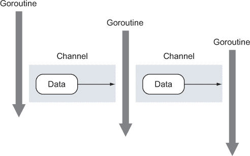
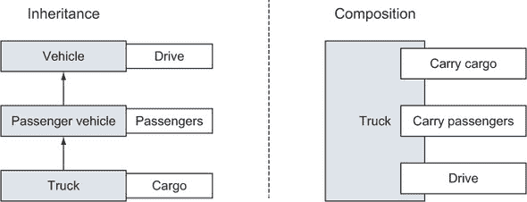
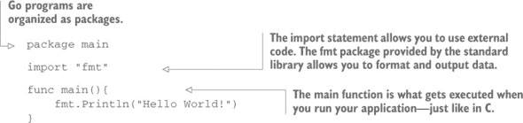
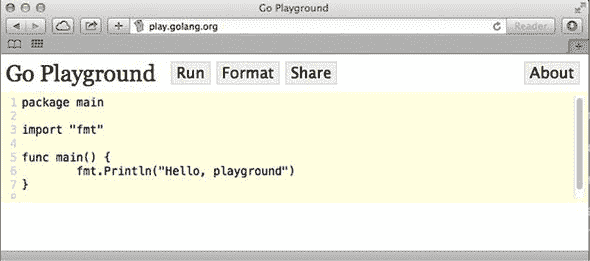

## 第一章. Go 语言介绍

*本章内容*

+   使用 Go 解决现代计算挑战

+   使用 Go 工具

计算机已经发展，但编程语言并没有跟上同样的进化速度。我们携带的手机可能比我们最初使用的第一台计算机拥有更多的 CPU 核心。现在，高性能服务器拥有 64、128 或更多的核心，但我们仍然使用着为单核设计的编程技术。

编程艺术也在不断发展。大多数程序不再是单个开发者编写的：它们是由不同时区、不同时间工作的人们组成的团队编写的。大型项目被分解成更小的部分，分配给程序员，然后他们以库或包的形式将他们的工作交付给团队，这些库或包可以在整个应用程序套件中使用。

今天，程序员和公司比以往任何时候都更相信开源软件的力量。Go 是一种使代码共享变得容易的编程语言。Go 附带了一些工具，使使用他人编写的包变得简单，同时 Go 也使共享我们自己的包变得容易。

本章中，你将看到 Go 语言与其他编程语言的不同之处。Go 重新思考了你可能习惯的传统面向对象开发，同时仍然提供了一种高效的代码重用方法。Go 使你能够更有效地使用昂贵的服务器上的所有核心，并消除了编译一个非常大的项目的惩罚。

阅读本章时，你会感受到塑造 Go 语言创建的众多决策，从其并发模型到其闪电般的编译器。我们在前言中提到过，但值得再次强调：本书是为有一定其他编程语言经验的初级开发者编写的，他们希望学习 Go 语言。我们编写本书的目标是为你提供一个密集、全面和地道的语言视角。我们关注语言的规范和实现，包括语言语法、Go 的类型系统、并发、通道、测试等多个广泛的主题。我们相信这本书非常适合那些想要快速入门学习 Go 语言或希望更深入理解语言及其内部机制的人。

书中示例的源代码可在 [`github.com/goinaction/code`](https://github.com/goinaction/code) 获取。

我们希望你会欣赏 Go 语言附带的各种工具，使你的开发者生活更加轻松。最终，你会理解为什么许多开发者在启动新项目时选择 Go 语言。

### 1.1. 使用 Go 解决现代编程挑战

Go 团队付出了巨大的努力来解决当今软件开发者面临的问题。当开发者选择项目语言时，必须在快速开发和性能之间做出不舒服的选择。像 C 和 C++这样的语言提供快速执行，而像 Ruby 和 Python 这样的语言则提供快速开发。Go 连接了这些竞争的世界，并提供了具有使开发快速的功能的高性能语言。

随着我们探索 Go，你会发现精心设计的特性和简洁的语法。作为一个语言，Go 不仅由它包含的内容定义，还由它不包含的内容定义。Go 具有简洁的语法，关键字数量少，易于记忆。Go 有一个非常快的编译器，有时你会忘记它在运行。作为一个 Go 开发者，你将花费显著更少的时间等待项目构建。由于 Go 内置的并发特性，你的软件将能够扩展以使用可用的资源，而无需强迫你使用特殊的线程库。Go 使用简单而有效的类型系统，从面向对象开发中移除了大部分开销，让你能够专注于代码重用。Go 还有一个垃圾回收器，因此你不需要管理自己的内存。让我们快速看一下这些关键特性。

#### 1.1.1. 开发速度

在 C 或 C++中编译一个大型应用程序所需的时间比喝一杯咖啡还要长。图 1.1 展示了 XKCD 经典的一个在办公室闲逛的借口。

##### 图 1.1. 工作努力吗？（via XKCD）


Go 通过使用智能编译器和简化的依赖解析算法，实现了闪电般的快速编译。当你构建一个 Go 程序时，编译器只需要查看你直接包含的库，而不是像 Java、C 和 C++那样遍历整个依赖链中包含的所有库的依赖。因此，许多 Go 应用程序的编译时间不到一秒。在现代化硬件上，整个 Go 源代码树编译时间不到 20 秒。

使用动态语言编写应用程序可以让你快速变得高效，因为编写代码和执行代码之间没有中间步骤。代价是动态语言不提供静态语言那样的类型安全，并且通常需要一个全面的测试套件来避免在运行时发现不正确的类型错误。

想象一下，在像 JavaScript 这样的动态语言中编写一个大型应用程序，并遇到一个期望接收名为`ID`的字段的函数。这是一个整数、一个字符串还是一个 UUID？找出答案的方法是查看源代码。你可以尝试用数字或字符串执行该函数，看看会发生什么。在 Go 中，你不会浪费时间猜测，因为编译器会为你捕获类型差异。

#### 1.1.2. 并发

作为程序员，最难的事情之一是编写一个能够有效利用运行其硬件可用资源的应用程序。现代计算机拥有许多核心，但大多数编程语言都没有有效利用这些额外资源的工具。它们通常需要大量的线程同步代码，这些代码容易出错。

Go 的并发支持是其最强大的功能之一。Goroutines 类似于线程，但使用更少的内存，并且使用起来需要更少的代码。Channels 是一种数据结构，它允许您在 goroutine 之间发送类型化的消息，并内置了同步机制。这促进了一种编程模型，在该模型中，您在 goroutine 之间发送数据，而不是让 goroutine 争夺使用相同的数据。现在让我们更详细地看看这些功能。

##### Goroutines

Goroutines 是与包括程序入口点在内的其他 goroutine 并发运行的函数。在其他语言中，您会使用线程来完成相同的事情，但在 Go 中，许多 goroutine 在单个线程上执行。例如，如果您编写一个 Web 服务器并且想要同时处理不同的 Web 请求，您将不得不编写大量的额外代码来在 C 或 Java 中使用线程。在 Go 中，net/http 库内置了使用 goroutine 的并发功能。每个传入请求都会自动在其自己的 goroutine 上运行。Goroutines 比线程使用更少的内存，Go 运行时将自动将 goroutine 的执行调度到一组配置的逻辑处理器。每个逻辑处理器绑定到单个 OS 线程（参见图 1.2）。这使得您的应用程序更加高效，并且开发工作量显著减少。

##### 图 1.2\. 许多 goroutine 在单个 OS 线程上执行


如果您想在执行其他任务的同时并发执行一些代码，goroutine 是完美的选择。以下是一个快速示例：

```
func log(msg string){
    ... some logging code here
}

// Elsewhere in our code after we've discovered an error.
go log("something dire happened")
```

关键字 `go` 是您调度 `log` 函数作为 goroutine 运行以及使该 goroutine 与其他 goroutine 并发运行所需的所有内容。这意味着您可以在日志并发执行的同时继续执行应用程序的其他部分，这通常会导致最终用户感知的性能显著提升。正如之前所述，goroutine 的开销最小，因此产生成千上万的 goroutine 并不罕见。我们将在第六章深入探讨 goroutine 和并发。

##### Channels

Channels 是一种数据结构，它允许 goroutine 之间安全地交换数据。Channels 帮助您避免在允许共享内存访问的编程语言中通常遇到的问题。

并发编程中最困难的部分是确保你的数据不会被同时运行的过程、线程或 goroutines 意外修改。当多个线程在没有锁或同步的情况下修改相同的数据时，总是会有痛苦随之而来。在其他语言中，当你有全局变量和共享内存时，你必须使用复杂的锁定纪律来防止对同一变量的不同步更改。

Channels 通过提供一种使数据免受并发修改的模式来帮助解决这个问题。Channels 帮助强制执行这样的模式：在任何时候只有一个 goroutine 应该修改数据。你可以在图 1.3 中看到一个这样的流程示例，其中使用了 channels 在几个运行中的 goroutines 之间发送数据。想象一个应用程序，其中许多不同的进程需要按顺序了解或修改数据。使用 goroutines 和 channels，你可以安全地模拟这个过程。

##### 图 1.3. 使用 channels 在 goroutines 之间安全地传递数据



在图 1.3 中，你可以看到三个 goroutines 和两个无缓冲的 channels。第一个 goroutine 通过 channel 将一个数据值传递给一个已经等待的第二个 goroutine。这两个 goroutines 之间的数据交换是同步的，一旦交接发生，两个 goroutines 都知道交换已经发生。第二个 goroutine 使用数据执行其任务后，然后将数据发送给一个等待的第三个 goroutine。这个交换也是同步的，两个 goroutines 都可以保证交换已经完成。这种 goroutines 之间的安全数据交换不需要其他锁或同步机制。

重要的是要注意，channels 不会在 goroutines 之间提供数据访问保护。如果通过 channel 交换数据的副本，那么每个 goroutine 都有自己的副本，并且可以安全地对该数据进行任何更改。当交换数据的指针时，如果不同的 goroutines 将执行读写操作，那么每个 goroutine 仍然需要同步。

#### 1.1.3. Go 的类型系统

Go 提供了一个灵活的无层次类型系统，它通过最小化重构开销来促进代码重用。它仍然是面向对象开发，但没有传统头痛的问题。如果你曾经在一个复杂的 Java 或 C++程序中花费一周时间来规划你的抽象类和接口，你会欣赏 Go 的类型系统的简单性。Go 开发者简单地嵌入类型，以在称为*组合*的设计模式中重用功能。其他语言也使用组合，但它通常与继承紧密相连，这可能会使其变得复杂且难以使用。在 Go 中，类型是由更小的类型*组合*而成的，这与传统的基于继承的模型形成对比。

此外，Go 还有一个独特的接口实现，允许你建模行为，而不是建模类型。你不需要在 Go 中声明你正在实现接口；编译器会做这项工作，确定你的类型的值是否满足你使用的接口。Go 标准库中的许多接口都非常小，仅暴露了几个函数。在实践中，这需要一些时间来适应，尤其是如果你一直在使用像 Java 这样的面向对象语言编写代码。

##### 类型很简单

Go 有内置类型如 `int` 和 `string`，以及用户定义的类型。Go 中的典型用户定义类型将具有类型字段以存储数据。如果你见过 C 中的结构体，Go 的用户定义类型看起来会非常熟悉，并且操作方式相似。但类型也可以声明操作该数据的方法。而不是构建一个长的继承结构——Client 扩展 User 扩展 Entity——Go 开发者构建小的类型——Customer 和 Admin——并将它们嵌入到更大的类型中。图 1.4 展示了继承与组合之间的区别。

##### 图 1.4\. 继承与组合



##### Go 接口建模小行为

接口允许你表达类型的行怍。如果一个类型的值实现了接口，这意味着该值具有一组特定的行为。你甚至不需要声明你正在实现接口；你只需要编写实现即可。其他语言称这为 *鸭子类型*——如果它像鸭子叫，那么它就可以 *是* 一只鸭子——Go 也做得很好。在 Go 中，如果你的类型实现了接口的方法，你的类型的值可以存储在接口类型的值中。不需要特殊的声明。

在一个严格面向对象的编程语言如 Java 中，接口是无所不包的。在开始编写代码之前，你通常需要仔细思考一个大的继承链。以下是一个 Java 接口的示例：

```
interface User {
   public void login();
   public void logout();
}
```

在 Java 中实现此接口需要你创建一个类，该类满足 `User` 接口中的所有承诺，并明确声明你实现了该接口。相比之下，Go 接口通常只代表一个单一的操作。你将在 Go 中使用最频繁的接口之一是 `io.Reader`。`io.Reader` 接口提供了一种简单的方式来声明你的类型具有以标准库中的其他函数理解的方式可读的数据。以下是定义：

```
type Reader interface {
    Read(p []byte) (n int, err error)
}
```

要编写一个实现 `io.Reader` 接口的类型，你只需要实现一个接受字节数组并返回整数和可能的错误的 `Read` 方法。

这与其他面向对象编程语言中使用的接口系统有根本的不同。Go 的接口更小，更符合单一操作。在实践中，这允许在代码重用和可组合性方面有显著的优势。您几乎可以在任何具有可用数据的数据类型上实现 `io.Reader`，然后将其传递给任何知道如何从 `io.Reader` 读取的 Go 函数。

Go 中的整个网络库都是使用 `io.Reader` 接口构建的，因为它允许它将每个不同网络操作所需的网络实现与您应用程序的功能分离。这使得接口变得有趣、优雅且灵活。相同的 `io.Reader` 还允许与文件、缓冲区、套接字和其他任何数据源进行简单操作。使用单个接口允许您高效地操作数据，无论数据源是什么。

#### 1.1.4\. 内存管理

不当的内存管理会导致应用程序崩溃和内存泄漏，甚至可能使操作系统崩溃。Go 拥有一个现代的垃圾回收器，它会为您完成繁重的工作。在其他系统语言，如 C 或 C++ 中，您在使用内存之前需要分配一块内存，并在完成时释放它。如果您未能正确执行这两者中的任何一个，程序可能会崩溃或发生内存泄漏。当内存不再需要时，跟踪内存并不总是容易；线程和重并发使它变得更加困难。当您考虑垃圾回收编写代码时，Go 的垃圾回收器对程序执行时间几乎没有开销，但显著减少了开发工作量。Go 去掉了编程中的繁琐，让会计师们去数豆子。

### 1.2\. Hello, Go

通过看到编程语言的实际应用，更容易获得其感觉。让我们看看用 Go 编写的传统 *Hello World!* 应用程序：



当您运行此示例程序时，它会在屏幕上打印出一个熟悉的短语。但您应该如何运行它呢？在不安装 Go 到您的计算机上，您可以直接从您的网页浏览器使用 Go 提供的大部分功能。

#### 1.2.1\. 介绍 Go Playground

Go Playground 允许您通过网页浏览器编辑和运行 Go 代码。打开一个网页浏览器，并导航到 [`play.golang.org`](http://play.golang.org)。浏览器窗口中的代码可以直接在屏幕上编辑（见 图 1.5）。点击运行，看看会发生什么！

##### 图 1.5\. Go Playground



您甚至可以更改代码，使问候文本输出为不同的语言。请继续更改 `fmt.Println()` 函数内的问候语，然后再次点击运行。


##### 共享 Go 代码

Go 开发者使用演示场来分享代码想法、测试理论以及调试他们的代码，你很快也会这样做。每次你在演示场创建一个新的应用程序时，你都可以点击“分享”来获取一个可分享的 URL，任何人都可以打开。试试这个：[`play.golang.org/p/EWIXicJdmz`](http://play.golang.org/p/EWIXicJdmz)。

| |
| --- |

Go 演示场是向试图学习新东西的同事或朋友展示想法的完美方式，或者寻求帮助。在 Go 的 IRC 频道、Slack 群组、邮件列表以及 Go 开发者之间发送的无数电子邮件中，你会看到正在创建、修改和共享的 Go 演示场程序。

### 1.3. 摘要

+   Go 语言现代、快速，并附带强大的标准库。

+   Go 语言内置了并发功能。

+   Go 语言使用接口作为代码重用的构建块。
