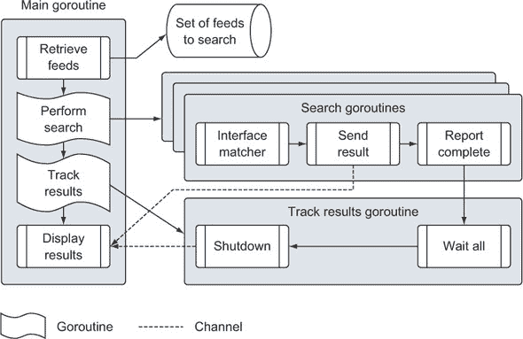

## 第二章\. Go 快速入门

*本章内容*

+   复习全面的 Go 程序

+   声明类型、变量、函数和方法

+   启动和同步 goroutines

+   使用接口编写泛型代码

+   将错误处理作为正常程序逻辑

Go 有其独特的优雅和编程习语，使得语言既高效又编程起来有趣。语言设计者旨在创建一种语言，让他们在保持对所需底层编程结构访问的同时提高生产力。这种平衡是通过最小化关键词、内置函数和语法来实现的。Go 还提供了一个全面的标凈库。标准库提供了程序员构建真实世界基于 Web 和网络的程序所需的所有核心包。

为了看到这个动作，我们将审查一个完整的 Go 程序，该程序实现了许多当前正在开发的 Go 程序中可以找到的功能。该程序从网络上拉取不同的数据源，并将内容与搜索词进行比较。匹配的内容随后在终端窗口中显示。该程序读取文本文件，进行网络调用，并将 XML 和 JSON 解码为结构体类型值，所有这些操作都是通过 Go 并发来实现的，以加快速度。

你可以通过导航到本章的书本仓库来下载并使用你喜欢的编辑器审查代码：

```
https://github.com/goinaction/code/tree/master/chapter2/sample
```

不要觉得你需要第一次、第二次甚至第三次阅读和复习本章内容时就能完全理解。尽管你今天所知道的许多编程概念在学习 Go 时都可以应用，但 Go 也有其独特的习语和风格。如果你能从当前的编程语言中解放出来，用全新的视角和清晰的头脑来看待 Go，你会发现它更容易理解和欣赏，你也会看到 Go 的优雅。

### 2.1\. 程序架构

在我们深入代码之前，让我们回顾一下程序背后的架构（如图 2.1 所示）以及如何完成对所有不同源进行搜索。

##### 图 2.1\. 程序架构流程



程序被分解成几个不同的步骤，这些步骤在不同的 goroutines 中运行。我们将探索代码，从主 goroutine 流入搜索和跟踪 goroutines，然后再返回主 goroutine。首先，这是项目的结构。

##### 列表 2.1\. 应用程序的项目结构

```
cd $GOPATH/src/github.com/goinaction/code/chapter2

- sample
    - data
        data.json   -- Contains a list of data feeds
    - matchers

        rss.go      -- Matcher for searching rss feeds
    - search
        default.go  -- Default matcher for searching data
        feed.go     -- Support for reading the json data file
        match.go    -- Interface support for using different matchers
        search.go   -- Main program logic for performing search
    main.go         -- Programs entry point
```

代码被组织到这四个文件夹中，按字母顺序列出。数据文件夹包含一个 JSON 文档，它为程序提供数据源，程序将检索和处理这些数据以匹配搜索词。匹配器文件夹包含程序支持的各类数据源的代码。目前程序只支持一个处理 RSS 类型数据源的匹配器。搜索文件夹包含使用不同匹配器搜索内容的业务逻辑。最后，我们有父文件夹 sample，其中包含 main.go 代码文件，它是程序的入口点。

现在你已经看到了程序所有代码的位置，你可以开始探索和理解程序是如何工作的。让我们从程序的入口点开始。

### 2.2\. 主包

程序的入口点可以在 main.go 代码文件中找到。尽管只有 21 行代码，但还有一些事情正在进行，我们必须提及。

##### 列表 2.2\. main.go

```
01 package main
02
03 import (
04    "log"
05    "os"
06
07   _ "github.com/goinaction/code/chapter2/sample/matchers"
08    "github.com/goinaction/code/chapter2/sample/search"
09 )
10
11 // init is called prior to main.
12 func init() {
13     // Change the device for logging to stdout.
14     log.SetOutput(os.Stdout)
15 }
16
17 // main is the entry point for the program.
18 func main() {
19     // Perform the search for the specified term.
20     search.Run("president")
21 }
```

每个生成可执行文件的 Go 程序都有两个独特的特性。其中之一可以在第 18 行找到。在那里你可以看到函数 `main` 的声明。为了构建工具生成可执行文件，必须声明函数 `main`，它成为程序的入口点。第二个特性可以在程序的第 01 行找到。

##### 列表 2.3\. main.go: 行 01

```
01 package main
```

你可以看到函数 `main` 位于名为 `main` 的包中。如果你的 `main` 函数不在 `main` 包中，构建工具将不会生成可执行文件。

Go 中的每个代码文件都属于一个包，main.go 也不例外。我们将在 第三章 中详细介绍包，因为包是 Go 的重要特性。现在，理解包定义了一个编译单元，它们的名称有助于提供一种间接层，类似于命名空间。这使得能够在不同导入的包中区分具有完全相同名称的标识符。

现在将你的注意力转向 main.go 代码文件的第 03 行至第 09 行，这些行声明了导入。

##### 列表 2.4\. main.go: 行 03–09

```
03 import (
04    "log"
05    "os"
06
07   _ "github.com/goinaction/code/chapter2/sample/matchers"
08    "github.com/goinaction/code/chapter2/sample/search"
09 )
```

导入就是那样：它们导入代码，并允许你访问诸如类型、函数、常量和接口等标识符。在我们的例子中，由于第 08 行的导入，main.go 代码文件中的代码现在可以引用 `search` 包中的 `Run` 函数。在第 04 和第 05 行，我们导入了标准库中的 `log` 和 `os` 包的代码。

文件夹中的所有代码文件必须使用相同的包名，通常的做法是将包名命名为文件夹名。正如之前所述，一个包定义了一个编译单元，每个代码单元代表一个包。如果你快速回顾一下 列表 2.1，你会看到在这个项目中有一个名为 `search` 的文件夹，它与第 08 行的导入路径相匹配。

你可能已经注意到，在第 07 行我们导入了`matchers`包，并在列出导入路径之前使用了空标识符。

##### 列表 2.5\. main.go: 第 07 行

```
07    _ "github.com/goinaction/code/chapter2/sample/matchers"
```

这是 Go 语言中的一种技术，允许即使没有直接使用包中的任何标识符，也能从包中进行初始化。为了使你的程序更易于阅读，Go 编译器不会让你声明一个未使用的包。空标识符允许编译器接受导入并调用该包内不同代码文件中可以找到的任何`init`函数。对于我们的程序来说，这是必需的，因为`matchers`包中的 rss.go 代码文件包含一个用于注册 RSS 匹配器以便使用的`init`函数。我们将在稍后回到这一切是如何工作的。

main.go 代码文件还有一个在 12 到 15 行声明的`init`函数。

##### 列表 2.6\. main.go: 第 11-15 行

```
11 // init is called prior to main.
12 func init() {
13     // Change the device for logging to stdout.
14     log.SetOutput(os.Stdout)
15 }
```

程序中任何代码文件中的所有`init`函数都会在`main`函数之前被调用。这个`init`函数将标准库中的记录器设置为写入`stdout`设备。默认情况下，记录器设置为写入`stderr`设备。在第七章中，我们将更详细地讨论`log`包和其他标准库中的重要包。

最后，让我们看看`main`函数在第 20 行执行的一个语句。

##### 列表 2.7\. main.go: 第 19-20 行

```
19     // Perform the search for the specified term.
20     search.Run("president")
```

这里你可以看到一个调用`search`包中的`Run`函数。这个函数包含了程序的核心业务逻辑，它需要一个字符串作为搜索项。一旦`Run`函数返回，程序将终止。

现在，我们可以查看属于`search`包的代码。

### 2.3\. 搜索包

`search`包包含了程序框架和业务逻辑。该包组织成四个不同的代码文件，每个文件都有独特的职责。随着我们继续跟踪程序的逻辑，我们将探索这些不同的代码文件。

让我们简要地谈谈什么是匹配器，因为整个程序都是围绕匹配器的执行来进行的。在我们的程序中，匹配器是一个包含特定智能以处理特定类型源的数据值。在我们的程序中，我们有两个匹配器。框架实现了一个默认的匹配器，它没有智能，而在`matchers`包中，我们有一个 RSS 匹配器的实现。RSS 匹配器知道如何获取、读取和搜索 RSS 源。稍后我们可以扩展程序以使用能够读取 JSON 文档或 CSV 文件的匹配器。我们将在稍后详细讨论如何实现匹配器。

#### 2.3.1\. search.go

下面是可以在 search.go 代码文件中找到的前九行代码。这是`Run`函数所在的代码文件。

##### 列表 2.8\. search/search.go: 第 01-09 行

```
01 package search
02
03 import (
04     "log"
05     "sync"
06 )
07
08 // A map of registered matchers for searching.
09 var matchers = make(map[string]Matcher)
```

正如你所见，每个代码文件顶部都会包含 `package` 关键字和包的名称。搜索文件夹中的每个代码文件都将包含 `search` 作为包名。从第 03 行到第 06 行导入标准库中的 `log` 和 `sync` 包。

当你从标准库导入代码时，你只需要引用包名，这与从标准库外部导入代码不同。编译器总是会查找你导入的包在 `GOROOT` 和 `GOPATH` 环境变量引用的位置。

##### 列表 2.9\. `GOROOT` 和 `GOPATH` 环境变量

```
GOROOT="/Users/me/go"
GOPATH="/Users/me/spaces/go/projects"
```

`log` 包提供了将日志消息输出到 `stdout`、`stderr` 或甚至自定义设备的支持。`sync` 包提供了同步 goroutines 的支持，这是我们的程序所必需的。在第 09 行你会看到我们的第一个变量声明。

##### 列表 2.10\. search/search.go: 行 08–09

```
08 // A map of registered matchers for searching.
09 var matchers = make(map[string]Matcher)
```

这个变量位于任何函数的作用域之外，因此被视为包级变量。变量使用 `var` 关键字声明，并声明为 `Matcher` 类型值的 `map`，其中键的类型为 `string`。`Matcher` 类型的声明可以在 `match.go` 代码文件中找到，我们将在后面描述这个类型的作用。这个变量声明的另一个重要方面是变量名 `matchers` 以小写字母开头。

在 Go 语言中，标识符要么从包中导出，要么未导出。导出的标识符可以在导入相应包时被其他包中的代码直接访问。这些标识符以大写字母开头。未导出的标识符以小写字母开头，不能被其他包中的代码直接访问。但是，即使标识符未导出，并不意味着其他包不能间接访问这些标识符。例如，一个函数可以返回一个未导出类型的值，而这个值可以被任何调用函数访问，即使调用函数在另一个包中声明。

这个变量声明还包含通过赋值运算符和特殊内置函数 `make` 对变量进行初始化。

##### 列表 2.11\. 创建一个 map

```
make(map[string]Matcher)
```

在 Go 语言中，`map` 是一种引用类型，你需要使用 `make` 关键字来创建它。如果你没有先创建 `map` 并将其分配给变量，当你尝试使用 `map` 变量时将会收到错误。这是因为 `map` 变量的零值是 `nil`。在第四章中，我们将更详细地介绍 `map`。

在 Go 中，所有变量都被初始化为其零值。对于数值类型，该值是 `0`；对于字符串，它是空字符串；对于布尔值，它是 `false`；对于指针，零值是 `nil`。对于引用类型，存在初始化为零值的基本数据结构。但是，声明为引用类型并设置为零值的变量将返回 `nil` 的值。

现在，让我们逐步分析由 `main` 函数调用的 `Run` 函数，您之前已经见过它。

##### 列表 2.12\. search/search.go: 行 11–57

```
11 // Run performs the search logic.
12 func Run(searchTerm string) {
13     // Retrieve the list of feeds to search through.
14     feeds, err := RetrieveFeeds()
15     if err != nil {
16         log.Fatal(err)
17     }
18
19     // Create a unbuffered channel to receive match results.
20     results := make(chan *Result)
21
22     // Setup a wait group so we can process all the feeds.
23     var waitGroup sync.WaitGroup
24
25     // Set the number of goroutines we need to wait for while

26     // they process the individual feeds.
27     waitGroup.Add(len(feeds))
28
29     // Launch a goroutine for each feed to find the results.
30     for _, feed := range feeds {
31         // Retrieve a matcher for the search.
32         matcher, exists := matchers[feed.Type]
33         if !exists {
34             matcher = matchers["default"]
35         }
36
37         // Launch the goroutine to perform the search.
38         go func(matcher Matcher, feed *Feed) {
39             Match(matcher, feed, searchTerm, results)
40             waitGroup.Done()
41         }(matcher, feed)
42     }
43
44     // Launch a goroutine to monitor when all the work is done.
45     go func() {
46         // Wait for everything to be processed.
47         waitGroup.Wait()
48
49         // Close the channel to signal to the Display
50         // function that we can exit the program.
51         close(results)
52     }()
53
54     // Start displaying results as they are available and
55     // return after the final result is displayed.
56     Display(results)
57 }
```

`Run` 函数包含程序的主要控制逻辑。它是 Go 程序如何结构化以处理并发运行的 goroutine 的良好示例。让我们逐节分析逻辑，然后探索提供支持的其它代码文件。

让我们回顾一下 `Run` 函数是如何声明的。

##### 列表 2.13\. search/search.go: 行 11–12

```
11 // Run performs the search logic.
12 func Run(searchTerm string) {
```

在 Go 中声明函数时，使用关键字 `func` 后跟函数名、任何参数以及任何返回值。对于 `Run` 来说，您有一个名为 `searchTerm` 的单个参数，其类型为 `string`。程序将要搜索的术语传递给 `Run` 函数，如果您再次查看 `main` 函数，您可以看到这一点。

##### 列表 2.14\. main.go: 行 17–21

```
17 // main is the entry point for the program.
18 func main() {
19     // Perform the search for the specified term.
20     search.Run("president")
21 }
```

`Run` 函数首先做的事情是检索数据源列表。这些源用于从互联网上拉取内容，然后与指定的搜索词进行匹配。

##### 列表 2.15\. search/search.go: 行 13–17

```
13     // Retrieve the list of feeds to search through.
14     feeds, err := RetrieveFeeds()
15     if err != nil {
16         log.Fatal(err)
17     }
```

这里有几个重要的概念需要我们逐一说明。您可以看到在第 14 行，我们调用了 `RetrieveFeeds` 函数。这个函数属于 `search` 包，并返回两个值。第一个返回值是 `Feed` 类型值的切片。切片是一个实现了动态数组的引用类型。在 Go 中，您使用切片来处理数据列表。第四章 对切片进行了更详细的介绍。

第二个返回值是一个错误。在第 15 行，错误值被评估以检查错误，如果确实发生了错误，则调用 `log` 包中的 `Fatal` 函数。`Fatal` 函数接受一个错误值，并在终止程序之前将其记录到终端窗口。

虽然这并不是 Go 独有的特性，但您可以看到我们的函数可以有多个返回值。声明返回值和错误值的函数，就像 `RetrieveFeeds` 函数一样，是很常见的。如果发生错误，永远不要相信函数返回的其他值。它们应该始终被忽略，否则您可能会使代码产生更多错误或恐慌。

让我们更仔细地看看函数返回的值是如何分配给变量的。

##### 列表 2.16\. search/search.go: 行 13–14

```
13     // Retrieve the list of feeds to search through.
14     feeds, err := RetrieveFeeds()
```

在这里，你可以看到短变量声明运算符（`:=`）的使用。这个运算符用于同时声明和初始化变量。返回的每个值的类型被编译器用来确定每个变量的类型。短变量声明运算符只是简化代码并使代码更易读的一种快捷方式。它声明的变量与使用 `var` 关键字声明的任何其他变量没有区别。

现在我们有了数据源列表，我们可以继续到下一行代码。

##### 列表 2.17\. search/search.go: 行 19–20

```
19     // Create a unbuffered channel to receive match results.
20     results := make(chan *Result)
```

在第 20 行，我们使用内置函数 `make` 创建一个无缓冲通道。我们使用短变量声明运算符通过调用 `make` 声明和初始化通道变量。在声明变量时，一个很好的经验法则是，当声明将初始化为零值的变量时使用 `var` 关键字，当你提供额外的初始化或进行函数调用时使用短变量声明运算符。

在 Go 语言中，通道（Channels）也是一种类似于映射（Maps）和切片（Slices）的引用类型，但通道实现了一个类型化的值队列，用于在 goroutines 之间通信数据。通道提供了固有的同步机制以确保通信的安全性。在第六章中，我们将更详细地介绍通道和 goroutines。

接下来的两行代码将在稍后用于防止程序在所有搜索处理完成之前终止。

##### 列表 2.18\. search/search.go: 行 22–27

```
22     // Setup a wait group so we can process all the feeds.
23     var waitGroup sync.WaitGroup
24
25     // Set the number of goroutines we need to wait for while
26     // they process the individual feeds.
27     waitGroup.Add(len(feeds))
```

在 Go 语言中，一旦 `main` 函数返回，程序就会终止。此时仍在运行的任何已启动的 goroutines 也将由 Go 运行时终止。当你编写并发程序时，最好在让 `main` 函数返回之前干净地终止所有已启动的 goroutines。编写能够干净启动和关闭的程序有助于减少错误并防止资源损坏。

我们的程序正在使用 `sync` 包中的 `WaitGroup` 来跟踪我们打算启动的所有 goroutines。`WaitGroup` 是跟踪 goroutine 完成其工作的一种很好的方式。`WaitGroup` 是一个计数信号量，我们将用它来计数完成工作的 goroutines。 

在第 23 行，我们声明了一个来自 `sync` 包的 `WaitGroup` 类型的变量。然后在第 27 行，我们将 `WaitGroup` 变量的值设置为我们将要启动的 goroutines 的数量。正如你很快就会看到的，我们将使用各自的 goroutine 并发处理每个源数据。随着每个 goroutine 完成其工作，它将减少 `WaitGroup` 变量的计数，一旦变量变为零，我们就知道所有工作都完成了。

接下来，让我们看看启动每个源数据的 goroutines 的代码。

##### 列表 2.19\. search/search.go: 行 29–42

```
29     // Launch a goroutine for each feed to find the results.
30     for _, feed := range feeds {
31         // Retrieve a matcher for the search.
32         matcher, exists := matchers[feed.Type]
33         if !exists {
34             matcher = matchers["default"]
35         }
36
37         // Launch the goroutine to perform the search.
38         go func(matcher Matcher, feed *Feed) {
39             Match(matcher, feed, searchTerm, results)
40             waitGroup.Done()
41         }(matcher, feed)
42     }
```

从第 30 行到第 42 行的代码遍历了我们之前检索到的数据流列表，并为每个数据流启动了一个 goroutine。为了遍历 feed 的切片，我们使用了`for range`关键字。`range`关键字可以与数组、字符串、切片、图和通道一起使用。当我们使用`for range`遍历切片时，我们每次迭代会返回两个值。第一个是我们正在迭代的元素的索引位置，第二个是该元素的值的副本。

如果你仔细看第 30 行的`for range`语句，你会再次看到空白标识符的使用。

##### 列表 2.20\. search/search.go: 行 29–30

```
29     // Launch a goroutine for each feed to find the results.
30     for _, feed := range feeds {
```

这是第二次看到空白标识符的使用。你第一次在`main.go`中看到它，当时我们导入了`matchers`包。现在它被用作替换为 range 调用索引值的变量。当你有一个返回多个值的函数，而你不需要其中一个值时，你可以使用空白标识符来忽略这些值。在我们的这个 range 中，我们不会使用索引值，所以空白标识符允许我们忽略它。

在循环中我们首先做的事情是检查图中是否存在用于处理特定数据类型数据流的`Matcher`值。

##### 列表 2.21\. search/search.go: 行 31–35

```
31         // Retrieve a matcher for the search.
32         matcher, exists := matchers[feed.Type]

33         if !exists {
34             matcher = matchers["default"]
35         }
```

我们还没有讨论这张图是如何获取其值的。你稍后将会看到程序是如何初始化自身并填充这张图的。在第 32 行，我们检查图中是否存在与数据类型匹配的键。在图中查找键时，你有两种选择：你可以为查找调用分配一个变量或两个变量。第一个变量始终是键查找返回的值，如果指定，第二个值是一个布尔标志，报告键是否存在。当键不存在时，图将返回存储在图中的值的零值。当键存在时，图将返回该键值的副本。

在第 33 行，我们检查键是否在图中找到，如果没有找到，我们分配默认的匹配器以供使用。这允许程序在没有引起任何问题或中断当前程序不支持的数据流的情况下运行。然后我们启动一个 goroutine 来执行搜索。

##### 列表 2.22\. search/search.go: 行 37–41

```
37         // Launch the goroutine to perform the search.
38         go func(matcher Matcher, feed *Feed) {
39             Match(matcher, feed, searchTerm, results)
40             waitGroup.Done()
41         }(matcher, feed)
```

在第六章中，我们将更详细地介绍 goroutines，但到目前为止，*goroutine*是一个独立于程序中其他函数运行的函数。使用`go`关键字来启动和调度 goroutines 以并发运行。在第 38 行，我们使用`go`关键字启动一个匿名函数作为 goroutine。*匿名函数*是一个没有声明的函数。在我们的`for range`循环中，我们为每个 feed 启动一个匿名函数作为 goroutine。这允许每个 feed 以并发方式独立处理。

匿名函数可以接受参数，我们为这个匿名函数声明了这些参数。在第 38 行，我们声明了匿名函数接受一个类型为`Matcher`的值和一个类型为`Feed`的值的地址。这意味着变量`feed`是一个*指针变量*。指针变量非常适合在函数之间共享变量。它们允许函数访问和更改在另一个函数的作用域内（可能是一个不同的 goroutine）声明的变量的状态。

在第 41 行，`matcher`和`feed`变量的值被传递到匿名函数中。在 Go 中，所有变量都是按值传递的。由于指针变量的值是指向被指向内存的地址，因此函数之间传递指针变量仍然被视为按值传递。

在第 39 行和第 40 行，你可以看到每个 goroutine 正在执行的工作。

##### 列表 2.23\. search/search.go: 第 39-40 行

```
39             Match(matcher, feed, searchTerm, results)
40             waitGroup.Done()
```

goroutine 首先调用一个名为`Match`的函数，该函数位于`match.go`代码文件中。`Match`函数接受一个类型为`Matcher`的值、一个类型为`Feed`的值的指针、搜索词以及将结果写入的通道。我们稍后会查看这个函数的内部结构，但就目前而言，知道`Match`将搜索 feed 并将匹配项输出到`results`通道就足够了。

一旦`Match`函数调用完成，我们执行第 40 行的代码，即递减`WaitGroup`计数。一旦每个 goroutine 完成调用`Match`函数和`Done`方法，程序将知道每个 feed 都已处理。关于`Done`方法调用的另一个有趣之处是：`WaitGroup`值从未作为参数传递给匿名函数，但匿名函数仍然可以访问它。

Go 支持闭包，你正在看到这一功能的应用。实际上，`searchTerm`和`results`变量也通过闭包被匿名函数访问。多亏了闭包，函数可以直接访问这些变量，而无需将它们作为参数传递。匿名函数并没有得到这些变量的副本；它直接访问的是在外部函数作用域中声明的相同变量。这就是为什么我们不使用闭包来处理`matcher`和`feed`变量。

##### 列表 2.24\. search/search.go: 第 29-32 行

```
29     // Launch a goroutine for each feed to find the results.
30     for _, feed := range feeds {
31         // Retrieve a matcher for the search.
32         matcher, exists := matchers[feed.Type]
```

`feed`和`matcher`变量的值在每次循环迭代中都会改变，正如你在第 30 行和第 32 行所看到的。如果我们为这些变量使用闭包，由于这些变量在外部函数中的值发生了变化，这些变化会在匿名函数中反映出来。所有 goroutine 都会因为闭包而与外部函数共享相同的变量。除非我们将这些值作为函数参数传递，否则大多数 goroutine 最终会使用相同的 matcher 处理相同的 feed——很可能是`feeds`切片中的最后一个。

当所有的搜索 goroutine 正在运行，在 `results` 通道上发送结果并递减 `waitGroup` 计数时，我们需要一种方式来显示这些结果，并保持 `main` 函数在所有处理完成之前保持活跃。

##### 列表 2.25\. search/search.go: 行 44–57

```
44     // Launch a goroutine to monitor when all the work is done.
45     go func() {
46         // Wait for everything to be processed.

47         waitGroup.Wait()
48
49         // Close the channel to signal to the Display
50         // function that we can exit the program.
51         close(results)
52     }()
53
54     // Start displaying results as they are available and
55     // return after the final result is displayed.
56     Display(results)
57 }
```

在第 45 行到 56 行之间的代码难以解释，直到我们深入到 `search` 包中的其他一些代码。目前，让我们描述一下我们看到的内容，稍后再回来理解其机制。在第 45 行到 52 行，我们启动了另一个匿名函数作为 goroutine。这个匿名函数不接受任何参数，并使用闭包来访问 `WaitGroup` 和 `results` 变量。这个 goroutine 调用 `WaitGroup` 值上的 `Wait` 方法，这导致 goroutine 阻塞，直到 `WaitGroup` 的计数达到零。一旦发生这种情况，goroutine 就会在通道上调用内置函数 `close`，正如你将看到的，这会导致程序终止。

`Run` 函数中的最后一部分代码在第 56 行。这是一个调用 `Display` 函数的调用，该函数可以在 match.go 代码文件中找到。一旦这个函数返回，程序就会终止。这不会发生，直到通道中的所有结果都被处理。

#### 2.3.2\. feed.go

现在你已经看到了 `Run` 函数，让我们看看在 search.go 代码文件的第 14 行对 `RetrieveFeeds` 函数调用的代码。这个函数读取 data.json 文件，并返回数据源切片。这些源驱动着不同匹配器将要搜索的内容。以下是可以在 feed.go 代码文件中找到的前八行代码。

##### 列表 2.26\. feed.go: 行 01–08

```
01 package search
02
03 import (
04     "encoding/json"
05     "os"
06 )
07
08 const dataFile = "data/data.json"
```

这个代码文件存在于 search 文件夹中，在第 01 行代码文件被声明为包 `search`。你可以看到，在第 03 行到 06 行，我们从标准库中导入了两个包。`json` 包提供对编码和解码 JSON 的支持，而 `os` 包提供对访问操作系统功能（如读取文件）的支持。

你可能已经注意到，为了导入 `json` 包，我们需要指定一个包含编码文件夹的路径。无论我们指定什么路径，包的名称都是 `json`。包在标准库中的物理位置不会改变这一事实。当我们从 `json` 包访问功能时，我们将只使用名称 `json`。

在第 08 行，我们声明了一个名为 `dataFile` 的常量，它被分配了一个字符串，指定了磁盘上数据文件的相对路径。由于 Go 编译器可以从赋值操作符右侧的值中推断出类型，因此在声明常量时指定类型是不必要的。我们还使用小写字母为常量命名，这意味着这个常量是未导出的，并且只能由 `search` 包内的代码直接访问。

接下来让我们看看 data.json 数据文件的一部分。

##### 列表 2.27\. data.json

```
[
    {
        "site" : "npr",
        "link" : "http://www.npr.org/rss/rss.php?id=1001",
        "type" : "rss"
    },
    {
        "site" : "cnn",
        "link" : "http://rss.cnn.com/rss/cnn_world.rss",
        "type" : "rss"
    },
    {
        "site" : "foxnews",
        "link" : "http://feeds.foxnews.com/foxnews/world?format=xml",
        "type" : "rss"
    },
    {
        "site" : "nbcnews",
        "link" : "http://feeds.nbcnews.com/feeds/topstories",
        "type" : "rss"
    }
]
```

实际的数据文件包含超过四个数据源，但列表 2.27 展示了数据文件的有效版本。数据文件包含一个 JSON 文档数组。数据文件中的每个文档都提供了我们从哪里获取数据的站点名称、数据链接以及我们期望接收的数据类型。

这些文档需要解码成结构体类型的切片，这样我们就可以在程序中使用这些数据。让我们看看将用于解码此数据文件的结构体类型。

##### 列表 2.28\. feed.go: 第 10-15 行

```
10 // Feed contains information we need to process a feed.
11 type Feed struct {
12     Name string `json:"site"`

13     URI  string `json:"link"`
14     Type string `json:"type"`
15 }
```

在第 11 行到第 15 行，我们声明了一个名为`Feed`的结构体类型，这是一个导出类型。该类型声明了三个字段，每个字段都是与数据文件中每个文档的字段匹配的字符串。如果你查看每个字段声明，标签已经包含在内，以提供 JSON 解码函数所需的元数据，以创建`Feed`类型值的切片。每个标签将结构体类型中的字段名称映射到文档中的字段名称。

现在，我们可以回顾在 search.go 代码文件的第 14 行调用的`RetrieveFeeds`函数。这是读取数据文件并将每个文档解码成`Feed`类型值切片的函数。

##### 列表 2.29\. feed.go: 第 17-36 行

```
17 // RetrieveFeeds reads and unmarshals the feed data file.
18 func RetrieveFeeds() ([]*Feed, error) {
19    // Open the file.
20    file, err := os.Open(dataFile)
21    if err != nil {
22        return nil, err
23    }
24
25    // Schedule the file to be closed once
26    // the function returns.
27    defer file.Close()
28
29    // Decode the file into a slice of pointers
30    // to Feed values.
31    var feeds []*Feed
32    err = json.NewDecoder(file).Decode(&feeds)
33
34    // We don't need to check for errors, the caller can do this.
35    return feeds, err
36 }
```

让我们从第 18 行的函数声明开始。该函数不接受任何参数，并返回两个值。第一个返回值是`Feed`类型值的指针切片。第二个返回值是错误值，用于报告函数调用是否成功。正如你将继续看到的那样，返回错误值是此代码示例和整个标准库中的常见做法。

现在，让我们看看第 20 行到第 23 行，我们在这里使用`os`包打开数据文件。对`Open`方法的调用接受我们数据文件的相对路径，并返回两个值。第一个返回值是指向类型为`File`的值的指针，第二个返回值是错误值，用于检查`Open`调用是否成功。在第 21 行立即检查错误值，如果确实有问题打开文件，则返回错误。

如果我们成功打开了文件，那么我们就转到第 27 行。在这里，你可以看到关键字`defer`的使用。

##### 列表 2.30\. feed.go: 第 25-27 行

```
25    // Schedule the file to be closed once
26    // the function returns.
27    defer file.Close()
```

关键字`defer`用于安排在函数返回后立即执行函数调用。一旦我们处理完文件，关闭文件就是我们的责任。通过使用关键字`defer`来安排对`close`方法的调用，我们可以保证该方法将被调用。即使函数发生恐慌并意外终止，也会发生这种情况。关键字`defer`让我们将此语句放置在文件打开附近，这有助于提高可读性并减少错误。

现在，我们可以回顾函数中的最后几行代码。让我们看看第 31 行到第 35 行。

##### 列表 2.31\. feed.go: 第 29-36 行

```
29    // Decode the file into a slice of pointers
30    // to Feed values.
31    var feeds []*Feed
32    err = json.NewDecoder(file).Decode(&feeds)
33
34    // We don't need to check for errors, the caller can do this.
35    return feeds, err
36 }
```

在第 31 行，我们声明了一个名为 `feeds` 的空切片，其中包含指向 `Feed` 类型值的指针。然后在第 32 行，我们调用 `json` 包中 `NewDecoder` 函数返回的值的 `Decode` 方法。`NewDecoder` 函数接受我们通过 `Open` 方法调用的文件句柄，并返回一个指向 `Decoder` 类型值的指针。从该值中，我们调用 `Decode` 方法，传递切片的地址。然后 `Decode` 方法解码数据文件，并将一组 `Feed` 类型值填充到我们的切片中。

由于其声明，`Decode` 方法可以接受任何类型的值。

##### 列表 2.32\. 使用空接口

```
func (dec *Decoder) Decode(v interface{}) error
```

`Decode` 方法的参数接受 `interface{}` 类型的值。这是 Go 语言中的一个特殊类型，它与 `reflect` 包中可找到的反射支持一起工作。在第九章 [kindle_split_017.html#ch09] 中，我们将更详细地介绍反射以及这个方法是如何工作的。

第 35 行的最后一行代码将切片和错误值返回给调用函数。在这种情况下，调用 `Decode` 后不需要函数检查错误值。函数已经完成，调用函数可以检查错误值并确定下一步要做什么。

现在是时候通过查看匹配器代码来了解搜索代码是如何支持不同类型的馈电实现的。

#### 2.3.3\. match.go/default.go

match.go 代码文件包含创建不同类型匹配器的支持，这些匹配器可以被搜索 `Run` 函数使用。让我们回到 `Run` 函数的代码，该函数使用不同类型的匹配器执行搜索。

##### 列表 2.33\. search/search.go: 行 29 - 42

```
29     // Launch a goroutine for each feed to find the results.
30     for _, feed := range feeds {
31         // Retrieve a matcher for the search.
32         matcher, exists := matchers[feed.Type]
33         if !exists {
34             matcher = matchers["default"]
35         }
36
37         // Launch the goroutine to perform the search.
38         go func(matcher Matcher, feed *Feed) {
39             Match(matcher, feed, searchTerm, results)
40             waitGroup.Done()
41         }(matcher, feed)
42     }
```

第 32 行的代码根据数据类型查找匹配器值；然后使用该值来处理对该特定数据源的搜索。然后在第 38 行到第 41 行，为该匹配器和数据源启动了一个 goroutine。使这段代码能够正常工作的关键是这个框架代码能够使用接口类型来捕获并调用每个匹配器值的特定实现。这允许代码以一致和通用的方式处理不同类型的匹配器值。让我们看看 match.go 中的代码，看看我们是如何实现这个功能的。

下面是 match.go 的前 17 行代码。

##### 列表 2.34\. search/match.go: 行 01–17

```
01 package search
02
03 import (
04     "log"
05 )
06
07 // Result contains the result of a search.
08 type Result struct {
09     Field   string
10     Content string
11 }
12

13 // Matcher defines the behavior required by types that want
14 // to implement a new search type.
15 type Matcher interface {
16     Search(feed *Feed, searchTerm string) ([]*Result, error)
17 }
```

让我们跳转到第 15 行到第 17 行，看看名为 `Matcher` 的接口类型的声明。到目前为止，我们只声明了结构体类型，但在这里你可以看到声明接口类型的代码。我们将在第五章 [kindle_split_013.html#ch05] 中详细介绍接口，但到目前为止，我们知道接口声明了结构体或命名类型必须实现的行为以满足接口。接口的行为由接口类型内声明的函数定义。

在 `Matcher` 接口的情况下，只声明了一个方法，即 `Search`，它接受一个指向 `Feed` 类型的值的指针和一个 `string` 类型的搜索词。该方法还返回两个值：一个指向 `Result` 类型值的指针切片和一个错误值。`Result` 类型在第 08 到 11 行声明。

在 Go 语言中命名接口时，你需要遵循一个命名约定。如果接口类型只包含一个方法，那么接口的名称应该以 *er* 后缀结尾。在我们的接口中，这正是这种情况，因此接口的名称是 `Matcher`。当在接口类型中声明多个方法时，接口的名称应该与其一般行为相关。

为了让用户定义的类型实现一个接口，该类型需要实现接口类型中声明的所有方法。让我们切换到 `default.go` 代码文件，看看默认匹配器是如何实现 `Matcher` 接口的。

##### 列表 2.35\. search/default.go: 行 01–15

```
01 package search
02
03 // defaultMatcher implements the default matcher.
04 type defaultMatcher struct{}
05
06 // init registers the default matcher with the program.
07 func init() {
08     var matcher defaultMatcher
09     Register("default", matcher)
10 }
11
12 // Search implements the behavior for the default matcher.
13 func (m defaultMatcher) Search(feed *Feed, searchTerm string)
                                                   ([]*Result, error) {
14     return nil, nil
15 }
```

在第 04 行，我们使用一个空的 struct 声明了一个名为 `defaultMatcher` 的 struct 类型。空的 struct 在创建此类类型的值时分配零字节。当你需要一个类型但不需要任何状态时，它们很棒。对于默认匹配器，我们不需要维护任何状态；我们只需要实现接口。

在第 13 到 15 行，你可以看到 `defaultMatcher` 类型实现了 `Matcher` 接口。接口方法 `Search` 的实现只是对两个返回值都返回 `nil`。其他实现，例如 RSS 匹配器的实现，将在这个方法的版本中实现特定的业务规则来处理搜索。

`Search` 方法的声明使用了一个类型为 `defaultMatcher` 的值接收者。

##### 列表 2.36\. search/default.go: 行 13

```
13 func (m defaultMatcher) Search
```

在任何函数声明中使用接收者声明了一个与指定接收者类型绑定的方法。在我们的例子中，`Search` 方法的声明现在绑定到了 `defaultMatcher` 类型的值。这意味着我们可以从 `defaultMatcher` 类型的值和指针中调用 `Search` 方法。无论我们使用接收者类型的值还是指针来调用方法，编译器都会在必要时引用或取消引用值以支持调用。

##### 列表 2.37\. 方法调用的示例

```
// Method declared with a value receiver of type defaultMatcher
func (m defaultMatcher) Search(feed *Feed, searchTerm string)

// Declare a pointer of type defaultMatch
dm := new(defaultMatch)

// The compiler will dereference the dm pointer to make the call
dm.Search(feed, "test")

// Method declared with a pointer receiver of type defaultMatcher
func (m *defaultMatcher) Search(feed *Feed, searchTerm string)

// Declare a value of type defaultMatch
var dm defaultMatch

// The compiler will reference the dm value to make the call
dm.Search(feed, "test")
```

使用指针接收者声明方法是一种最佳实践，因为许多你实现的方法需要操作用于方法调用的值的内部状态。在 `defaultMatcher` 类型的例子中，我们希望使用值接收者，因为创建 `defaultMatcher` 类型的值会导致零分配。使用指针没有意义，因为没有要操作的状态。

与直接从值和指针调用方法不同，当你通过接口类型值调用方法时，规则是不同的。具有指针接收器的声明的方法只能由包含指针的接口类型值调用。具有值接收器的声明的方法可以由包含值和指针的接口类型值调用。

##### 列表 2.38\. 接口方法调用限制示例

```
// Method declared with a pointer receiver of type defaultMatcher
func (m *defaultMatcher) Search(feed *Feed, searchTerm string)

// Call the method via an interface type value
var dm defaultMatcher
var matcher Matcher = dm     // Assign value to interface type
matcher.Search(feed, "test") // Call interface method with value

> go build
cannot use dm (type defaultMatcher) as type Matcher in assignment

// Method declared with a value receiver of type defaultMatcher
func (m defaultMatcher) Search(feed *Feed, searchTerm string)

// Call the method via an interface type value
var dm defaultMatcher
var matcher Matcher = &dm    // Assign pointer to interface type
matcher.Search(feed, "test") // Call interface method with pointer

> go build
Build Successful
```

`defaultMatcher`类型不需要做任何事情来实现接口。从现在开始，类型为`defaultMatcher`的值和指针满足接口，可以用作类型`Matcher`的值。这是使这一切工作的关键。类型为`defaultMatcher`的值和指针现在也是类型`Matcher`的值，可以分配或传递给接受类型`Matcher`的值的函数。

让我们来看看在 match.go 代码文件中声明的`Match`函数的实现。这是在 search.go 代码文件的第 39 行由`Run`函数调用的函数。

##### 列表 2.39\. search/match.go: 行 19–33

```
19 // Match is launched as a goroutine for each individual feed to run
20 // searches concurrently.
21 func Match(matcher Matcher, feed *Feed, searchTerm string,
                                              results chan<- *Result) {
22     // Perform the search against the specified matcher.
23     searchResults, err := matcher.Search(feed, searchTerm)
24     if err != nil {
25         log.Println(err)
26         return
27     }
28
29     // Write the results to the channel.
30     for _, result := range searchResults {
31         results <- result
32     }
33 }
```

这是使用实现`Matcher`接口的值或指针执行实际搜索的函数。这个函数接受类型为`Matcher`的值作为第一个参数。只有实现`Matcher`接口的值或指针会被接受作为此参数。由于`defaultMatcher`类型现在实现了具有值接收器的接口，因此可以传递类型为`defaultMatcher`的值或指针到这个函数中。

在第 23 行，从传递给函数的`Matcher`类型值中调用了`Search`方法。这里执行了分配给`Matcher`变量的`Search`方法的具体实现。一旦`Search`方法返回，就会检查第 24 行的错误值是否存在错误。如果有错误，函数将错误写入日志并返回。如果没有返回错误并且有结果，结果会被写入通道，以便它们可以被监听该通道的主函数获取。

match.go 中的最后一部分代码是`Display`函数，它在 main 函数的第 56 行被调用。这是防止程序在收到并记录所有搜索 goroutine 的结果之前终止的函数。

##### 列表 2.40\. search/match.go: 行 35–43

```
35 // Display writes results to the terminal window as they
36 // are received by the individual goroutines.
37 func Display(results chan *Result) {
38     // The channel blocks until a result is written to the channel.
39     // Once the channel is closed the for loop terminates.
40     for result := range results {
41         fmt.Printf("%s:\n%s\n\n", result.Field, result.Content)
42     }
43 }
```

一点通道魔法允许这个函数在返回之前处理所有结果。它基于通道关闭时通道和关键字`range`的行为。让我们再次简要看看`Run`函数中的代码，该函数关闭`results`通道并调用`Display`函数。

##### 列表 2.41\. search/search.go: 行 44–57

```
44     // Launch a goroutine to monitor when all the work is done.
45     go func() {
46         // Wait for everything to be processed.
47         waitGroup.Wait()
48
49         // Close the channel to signal to the Display
50         // function that we can exit the program.
51         close(results)
52     }()
53
54     // Start displaying results as they are available and
55     // return after the final result is displayed.
56     Display(results)
57 }
```

第 45 至 52 行的 goroutine 等待`waitGroup`，直到所有搜索 goroutine 调用`Done`方法。一旦最后一个搜索 goroutine 调用`Done`，`Wait`方法返回，然后第 51 行的代码关闭`results`通道。一旦通道关闭，goroutine 终止，不再存在。

您在 match.go 代码文件的第 30 至 32 行看到了搜索结果被写入通道。

##### 列表 2.42\. search/match.go: 行 29–32

```
29     // Write the results to the channel.
30     for _, result := range searchResults {
31         results <- result
32     }
```

如果我们回顾 match.go 代码文件的第 40 至 42 行的`for range`循环，我们可以将结果的写入、通道的关闭以及结果的处理全部联系起来。

##### 列表 2.43\. search/match.go: 行 38–42

```
38     // The channel blocks until a result is written to the channel.
39     // Once the channel is closed the for loop terminates.
40     for result := range results {
41         log.Printf("%s:\n%s\n\n", result.Field, result.Content)
42     }
```

match.go 代码文件第 40 行的`for range`循环将阻塞，直到通道中写入结果。随着每个搜索 goroutine 将结果写入通道（如代码文件 match.go 中的第 31 行所示），`for range`循环会唤醒并得到这些结果。然后，结果立即写入日志。这似乎表明`for range`循环陷入了一个无限循环，但实际上并非如此。一旦在 search.go 代码文件的第 51 行关闭通道，`for range`循环就会终止，`Display`函数返回。

在我们查看 RSS 匹配器的实现之前，让我们回顾一下程序启动时不同匹配器的初始化方式。为了看到这一点，我们需要回顾默认的.go 代码文件的第 07 至 10 行。

##### 列表 2.44\. search/default.go: 行 06–10

```
06 // init registers the default matcher with the program.
07 func init() {
08     var matcher defaultMatcher
09     Register("default", matcher)
10 }
```

默认的.go 代码文件中声明了一个特殊函数，称为`init`。您也曾在`main.go`代码文件中看到过这个函数的声明，我们讨论了程序中所有`init`函数在`main`函数开始之前会被调用的方式。让我们再次从`main.go`代码文件中查看导入。

##### 列表 2.45\. main.go: 行 07–08

```
07   _ "github.com/goinaction/code/chapter2/sample/matchers"
08    "github.com/goinaction/code/chapter2/sample/search"
```

第 08 行的`search`包导入允许编译器在默认的.go 代码文件中找到`init`函数。一旦编译器看到`init`函数，它就会被安排在调用`main`函数之前被调用。

默认的.go 代码文件中的`init`函数正在执行一个特殊任务。它正在创建一个`defaultMatcher`类型的值，并将该值传递给可以在`search.go`代码文件中找到的`Register`函数。

##### 列表 2.46\. search/search.go: 行 59–67

```
59 // Register is called to register a matcher for use by the program.
60 func Register(feedType string, matcher Matcher) {
61     if _, exists := matchers[feedType]; exists {
62         log.Fatalln(feedType, "Matcher already registered")
63     }
64
65     log.Println("Register", feedType, "matcher")
66     matchers[feedType] = matcher
67 }
```

此函数负责将`Matcher`值添加到已注册匹配器的映射中。所有这些注册都需要在调用`main`函数之前完成。使用`init`函数是完成此类初始化注册的绝佳方式。

### 2.4\. RSS 匹配器

最后要审查的代码是 RSS 匹配器的实现。到目前为止我们所审查的一切都是为了允许不同的匹配器类型在程序框架内运行和搜索内容。RSS 匹配器的结构类似于默认匹配器的结构。不同之处在于接口方法 `Search` 的实现，最终为每个匹配器赋予其独特性。

列表 2.47 中的 RSS 文档展示了当我们使用任何以 RSS 格式输入的数据源中的链接时，我们期望接收到的样本。

##### 列表 2.47\. 预期 RSS 文档

```
<rss  xmlns:nprml="http://api
    <channel>
        <title>News</title>
        <link>...</link>
        <description>...</description>

        <language>en</language>
        <copyright>Copyright 2014 NPR - For Personal Use
        <image>...</image>
        <item>
            <title>
                Putin Says He'll Respect Ukraine Vote But U.S.
            </title>
            <description>
                The White House and State Department have called on the
            </description>
```

如果你从 列表 2.47 中取任何链接并在浏览器中打开，你将能够看到预期 RSS 文档的完整视图。RSS 匹配器的实现会下载这些 RSS 文档，搜索标题和描述字段中的搜索词，并通过 `results` 通道发送结果。让我们先看看 rss.go 代码文件的前 12 行代码。

##### 列表 2.48\. matchers/rss.go: 行 01–12

```
01 package matchers
02
03 import (
04     "encoding/xml"
05     "errors"
06     "fmt"
07     "log"
08     "net/http"
09     "regexp"
10
11     "github.com/goinaction/code/chapter2/sample/search"
12 )
```

与每个代码文件一样，我们从第 01 行开始，写下包的名称。这个代码文件可以在名为 `matchers` 的文件夹中找到，因此包名是 `matchers`。接下来，我们有六个来自标准库的导入和一个到 `search` 包的导入。同样，我们还有一些来自标准库的包是从标准库内的子文件夹导入的，例如 `xml` 和 `http`。就像对 `json` 包一样，路径中的最后一个文件夹的名称代表包的名称。

有四种结构类型用于解码 RSS 文档，因此我们可以在程序中使用文档数据。

##### 列表 2.49\. matchers/rss.go: 行 14–58

```
14 type (
15     // item defines the fields associated with the item tag
16     // in the rss document.
17     item struct {
18         XMLName     xml.Name `xml:"item"`
19         PubDate     string   `xml:"pubDate"`
20         Title       string   `xml:"title"`
21         Description string   `xml:"description"`

22         Link        string   `xml:"link"`
23         GUID        string   `xml:"guid"`
24         GeoRssPoint string   `xml:"georss:point"`
25     }
26
27     // image defines the fields associated with the image tag
28     // in the rss document.
29     image struct {
30         XMLName xml.Name `xml:"image"`
31         URL     string   `xml:"url"`
32         Title   string   `xml:"title"`
33         Link    string   `xml:"link"`
34     }
35
36     // channel defines the fields associated with the channel tag
37     // in the rss document.
38     channel struct {
39         XMLName        xml.Name `xml:"channel"`
40         Title          string   `xml:"title"`
41         Description    string   `xml:"description"`
42         Link           string   `xml:"link"`
43         PubDate        string   `xml:"pubDate"`
44         LastBuildDate  string   `xml:"lastBuildDate"`
45         TTL            string   `xml:"ttl"`
46         Language       string   `xml:"language"`
47         ManagingEditor string   `xml:"managingEditor"`
48         WebMaster      string   `xml:"webMaster"`
49         Image          image    `xml:"image"`
50         Item           []item   `xml:"item"`
51    }
52
53    // rssDocument defines the fields associated with the rss document
54    rssDocument struct {
55         XMLName xml.Name `xml:"rss"`
56         Channel channel  `xml:"channel"`
57    }
58 )
```

如果你将这些结构与任何来自 feed 链接的 RSS 文档进行匹配，你将看到它们是如何相互关联的。在 feed.go 代码文件中解码 XML 与我们解码 JSON 的方式相同。接下来我们可以看看 `rssMatcher` 类型的声明。

##### 列表 2.50\. matchers/rss.go: 行 60–61

```
60 // rssMatcher implements the Matcher interface.
61 type rssMatcher struct{}
```

再次，这就像我们声明 `defaultMatcher` 类型一样。我们使用一个空的 struct，因为我们不需要维护任何状态；我们只是实现了 `Matcher` 接口。接下来是匹配器 `init` 函数的实现。

##### 列表 2.51\. matchers/rss.go: 行 63–67

```
63 // init registers the matcher with the program.
64 func init() {
65     var matcher rssMatcher
66     search.Register("rss", matcher)
67 }
```

就像你看到默认匹配器一样，`init` 函数将 `rssMatcher` 类型的值注册到程序中以供使用。让我们再次看看 main.go 代码文件中的导入。

##### 列表 2.52\. main.go: 行 07–08

```
07   _ "github.com/goinaction/code/chapter2/sample/matchers"
08    "github.com/goinaction/code/chapter2/sample/search"
```

在`main.go`代码文件中的代码不直接使用`matchers`包中的任何标识符。然而，我们需要编译器在`rss.go`代码文件中调度对`init`函数的调用。在第 07 行，我们通过使用空标识符作为导入的别名名称来完成此操作。这允许编译器不产生导入声明错误，并定位到`init`函数。在设置完所有导入、类型和初始化后，让我们看看剩下的两个支持实现`Matcher`接口的方法。

##### 列表 2.53\. matchers/rss.go: 行 114–140

```
114 // retrieve performs a HTTP Get request for the rss feed and decodes
115 func (m rssMatcher) retrieve(feed *search.Feed)
                                                 (*rssDocument, error) {
116     if feed.URI == "" {
117         return nil, errors.New("No rss feed URI provided")
118     }
119
120     // Retrieve the rss feed document from the web.
121     resp, err := http.Get(feed.URI)
122     if err != nil {
123         return nil, err
124     }
125
126     // Close the response once we return from the function.
127     defer resp.Body.Close()
128
129     // Check the status code for a 200 so we know we have received a
130     // proper response.
131     if resp.StatusCode != 200 {
132         return nil, fmt.Errorf("HTTP Response Error %d\n",
                                                        resp.StatusCode)
133     }
134
135     // Decode the rss feed document into our struct type.

136     // We don't need to check for errors, the caller can do this.
137     var document rssDocument
138     err = xml.NewDecoder(resp.Body).Decode(&document)
139     return &document, err
140 }
```

未导出的`retrieve`方法执行从网络中拉取每个单独的 feed 链接的 RSS 文档的逻辑。在第 121 行，你可以看到`http`包中`Get`方法的使用。在第八章（[kindle_split_016.html#ch08]）中，我们将更深入地探讨这个包，但到目前为止，Go 使用`http`包使网络请求变得非常容易。当`Get`方法返回时，我们将得到一个指向`Response`类型值的指针。在检查错误后，我们需要调度对`Close`方法的调用，我们在第 127 行这样做。

在第 131 行，我们检查`Response`值的`StatusCode`字段，以验证我们收到了`200`。任何不是`200`的值都必须被视为错误，我们正是这样做的。如果值不是`200`，我们使用`fmt`包中的`Errorf`函数返回一个自定义错误。代码的最后三行与解码 JSON 数据文件的方式类似。这次我们使用`xml`包并调用名为`NewDecoder`的相同函数，它返回一个指向`Decoder`值的指针。有了这个指针，我们调用`Decode`方法，传递名为`document`的本地变量的地址，该变量是`rssDocument`类型。然后返回`rssDocument`类型值的地址和`Decode`方法调用的错误。

最后一种方法实现了`Matcher`接口。

##### 列表 2.54\. matchers/rss.go: 行 69–112

```
 69 // Search looks at the document for the specified search term.
 70 func (m rssMatcher) Search(feed *search.Feed, searchTerm string)
                                            ([]*search.Result, error) {
 71     var results []*search.Result
 72
 73     log.Printf("Search Feed Type[%s] Site[%s] For Uri[%s]\n",
                                        feed.Type, feed.Name, feed.URI)
 74
 75     // Retrieve the data to search.
 76     document, err := m.retrieve(feed)
 77     if err != nil {
 78         return nil, err
 79     }
 80
 81     for _, channelItem := range document.Channel.Item {
 82         // Check the title for the search term.
 83         matched, err := regexp.MatchString(searchTerm,
                                                     channelItem.Title)
 84         if err != nil {
 85             return nil, err
 86         }
 87
 88         // If we found a match save the result.
 89         if matched {
 90            results = append(results, &search.Result{
 91                Field:   "Title",
 92                Content: channelItem.Title,

 93            })
 94         }
 95
 96         // Check the description for the search term.
 97         matched, err = regexp.MatchString(searchTerm,
                                               channelItem.Description)
 98         if err != nil {
 99             return nil, err
100         }
101
102         // If we found a match save the result.
103         if matched {
104             results = append(results, &search.Result{
105                 Field:   "Description",
106                 Content: channelItem.Description,
107             })
108         }
109     }
110
111     return results, nil
112 }
```

我们从第 71 行的`results`变量的声明开始，该变量将用于存储和返回可能找到的任何结果。

##### 列表 2.55\. matchers/rss.go: 行 71

```
71      var results []*search.Result
```

我们使用关键字`var`并声明一个指向`Result`类型值的`nil`切片。`Result`类型的声明可以在`match.go`代码文件的第 08 行再次找到。接下来在第 76 行，我们使用我们刚刚审查的`retrieve`方法进行网络调用。

##### 列表 2.56\. matchers/rss.go: 行 75–79

```
75      // Retrieve the data to search.
76      document, err := m.retrieve(feed)
77      if err != nil {
78          return nil, err
79      }
```

对`retrieve`方法的调用返回一个指向`rssDocument`类型值的指针和一个错误值。然后，正如你在代码中看到的，我们检查错误值以查找错误，并在存在错误时返回。如果没有错误，我们接着遍历结果，将搜索词与检索到的 RSS 文档的标题和描述进行匹配。

##### 列表 2.57\. matchers/rss.go: 行 81–86

```
81      for _, channelItem := range document.Channel.Item {
82          // Check the title for the search term.
83          matched, err := regexp.MatchString(searchTerm,
                                                      channelItem.Title)

84          if err != nil {
85              return nil, err
86          }
```

由于`document.Channel.Item`的值是`item`类型值的切片，我们在第 81 行使用`for range`循环遍历所有项目。在第 83 行，我们使用`regexp`包中的`MatchString`函数将搜索词与`channelItem`值中的`Title`字段内容进行匹配。然后我们在第 84 行检查错误。如果没有错误，我们转到第 89 行至第 94 行以检查匹配的结果。

##### 列表 2.58. 匹配器/rss.go：第 88-94 行

```
88          // If we found a match save the result.
89          if matched {
90             results = append(results, &search.Result{
91                 Field:   "Title",
92                 Content: channelItem.Title,
93             })
94          }
```

在调用`MatchString`方法后，如果`matched`的值为`true`，我们使用内置函数`append`将搜索结果添加到`results`切片中。内置函数`append`将在需要时增加切片的长度和容量。你将在第四章中了解更多关于内置函数`append`的信息。`append`的第一个参数是你想要附加的切片的值，第二个参数是你想要附加的值。在我们的情况下，我们使用结构字面量声明并初始化一个类型为`Result`的值，然后我们使用反引号（`&`）运算符获取这个新值的地址，该地址存储在切片中。

标题检查匹配后，第 97 行至第 108 行再次对描述字段执行相同的逻辑。最后，在第 111 行，该方法将结果返回给调用函数。

### 2.5. 摘要

+   每个代码文件都属于一个包，并且该包名应该与代码文件所在的文件夹名称相同。

+   Go 提供了多种声明和初始化变量的方式。如果一个变量的值没有明确初始化，编译器将变量初始化为其零值。

+   指针是跨函数和 goroutine 共享数据的一种方式。

+   通过启动 goroutine 和使用通道来实现并发和同步。

+   Go 提供了内置函数来支持使用 Go 的内部数据结构。

+   标准库包含许多包，这些包将允许你做一些强大的事情。

+   Go 中的接口允许你编写通用代码和框架。
