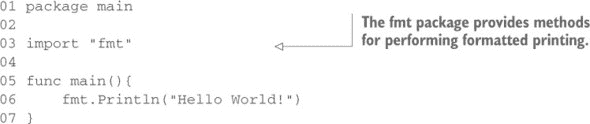
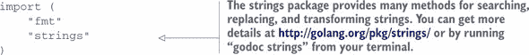
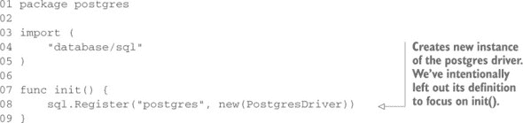
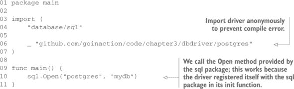
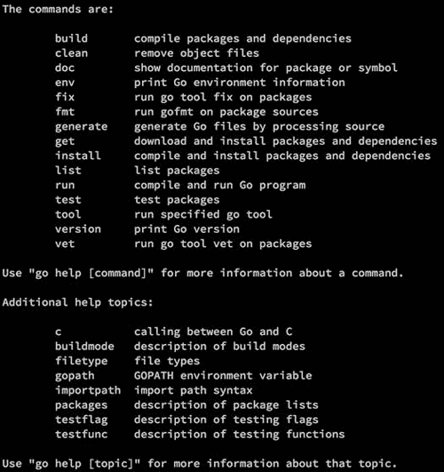

## 第三章\. 打包和工具

*本章内容*

+   理解 Go 代码的组织方式

+   使用 Go 命令

+   进一步使用其他 Go 开发者工具

+   与其他 Go 开发者协作

在 第二章 中，你了解了 Go 的语法和语言结构概述。现在，你将深入了解代码是如何组织成包以及如何与这些包交互的。包是 Go 中的一个关键概念。想法是将功能语义单元分离到不同的包中。当你这样做时，你就可以实现代码重用并控制每个包内部数据的使用。

在我们深入细节之前，你应该已经熟悉命令提示符或系统外壳，并且应该根据本书前言中的指南安装了 Go。如果你准备好了，让我们先了解什么是包以及为什么它在 Go 生态系统中很重要。

### 3.1\. 包

所有 Go 程序都组织成称为 *包* 的文件组，这样代码就有能力作为更小的可重用部分被包含到其他项目中。让我们看看组成 Go 标准库中 `http` 功能的包：

```
net/http/
    cgi/
    cookiejar/
        testdata/
    fcgi/
    httptest/
    httputil/
    pprof/
    testdata/
```

这些目录包含一系列具有 .go 扩展名的相关文件，并为与 HTTP 服务器、客户端的实现以及测试和性能分析相关的较小代码单元提供了清晰的分离。例如，`cookiejar` 包包含与从网络会话中存储和检索 Cookie 相关的代码。每个包都可以单独导入和使用，这样开发者就可以只导入他们需要的特定功能。如果你正在实现 HTTP 客户端，你只需要导入 `http` 包。

所有 .go 文件都必须在文件的第一行（不包括空白和注释）声明它们所属的包。包包含在单个目录中。你不可能在同一个目录中有多个包，也不能将一个包拆分到多个目录中。这意味着一个目录中的所有 .go 文件都必须声明相同的包名。

#### 3.1.1\. 包命名约定

为你的包命名时，应使用包含它的目录的名称。这样做的好处是，当你导入它时，可以清楚地知道包名。如果我们继续以 `net/http` 包为例，`http` 目录中包含的所有文件都是 `http` 包的一部分。在命名你的包及其目录时，应使用简短、简洁的小写名称，因为你在开发过程中会经常输入它们。`net/http` 下的包是简洁命名的好例子，如 `cgi`、`httputil` 和 `pprof`。

请记住，不需要唯一的名称，因为你可以使用其完整路径来导入包。你的包名在导入包时用作默认名称，但可以被覆盖。当你需要导入具有相同名称的多个包时，这很有用。我们将在 3.2 节 中讨论如何实现这一点。

#### 3.1.2\. main 包

在 Go 语言中，包名 `main` 具有特殊含义。它指定了该包将被编译成二进制可执行文件的 Go 命令。你用 Go 语言构建的所有可执行程序都必须有一个名为 `main` 的包。

当编译器遇到 `main` 包时，它还必须找到一个名为 `main()` 的函数；否则不会创建二进制可执行文件。`main()` 函数是程序的入口点，所以如果没有它，程序就没有起始点。最终二进制文件的名字将采用声明 `main` 包的目录的名称。

| |
| --- |

##### 命令和包

Go 语言的文档经常使用术语 *命令* 来指代可执行程序——就像命令行应用程序。这对阅读文档的新 Go 开发者来说可能会有些困惑。记住，在 Go 语言中，命令是任何可执行程序，而与包相对，包通常意味着一个可导入的功能语义单元。

| |
| --- |

尝试一下。首先在 GOPATH/src/hello/ 目录下创建一个名为 hello.go 的文件，并将 列表 3.1 的内容输入进去。这是传统的 Hello World! 应用程序，但当你查看它时，请注意包声明和导入语句。

##### 列表 3.1\. 传统的 Hello World! 应用程序



| |
| --- |

##### 获取包文档

不要忘记，你可以通过访问 [`golang.org/pkg/fmt/`](http://golang.org/pkg/fmt/) 或在终端运行 `godoc fmt` 来获取有关包的更多详细信息。

| |
| --- |

保存文件后，你可以在 GOPATH/src/hello/ 目录下运行 `go build` 命令。完成之后，你应该会看到一个二进制文件。在 Unix、Linux 和 Mac OS X 上，该文件将被命名为 hello，而在 Windows 上则会被命名为 hello.exe。现在你可以运行这个应用程序，并看到 Hello World! 打印到你的控制台。

如果你将包命名为 `main` 以外的名称，比如 `hello`，那么你就是在告诉编译器这只是一个包，而不是一个命令。

##### 列表 3.2\. 包含 `main` 函数的无效 Go 程序

```
01 package hello
02
03 import "fmt"
04
05 func main(){
06     fmt.Println("Hello, World!")
07 }
```

### 3.2\. 导入

现在我们已经了解了代码组织成包的方式，我们将看看如何导入这些单个包，这样你就可以访问它们包含的代码。`import`语句告诉编译器在哪里查找磁盘以找到你想要导入的包。你通过使用关键字`import`来导入包，这告诉编译器你想要引用该文件位置中包包含的代码。如果你需要导入多个包，按照惯例，你可以将导入语句包裹在一个导入块中，如下所示。

##### 列表 3.3\. 导入语句块



包是根据它们相对于 Go 环境引用的目录的相对路径在磁盘上找到的。标准库中的包可以在你的计算机上 Go 安装的位置找到。你或其他 Go 开发者创建的包位于`GOPATH`中，这是你自己的个人包工作区。

让我们来看一个例子。如果 Go 安装在`/usr/local/go`下，你的`GOPATH`设置为`/home/myproject:/home/mylibraries`，编译器将按以下顺序寻找`net/http`包：


编译器一旦找到满足导入语句的包，就会停止搜索。重要的是要记住，Go 安装目录是编译器首先搜索的地方，然后是按照列表顺序在你的`GOPATH`中列出的每个目录。

如果编译器搜索你的`GOPATH`却找不到你引用的包，当你尝试运行或构建程序时，你会得到一个错误。你将在本章后面看到如何使用`go get`命令来解决这些问题。

#### 3.2.1\. 远程导入

通过分布式版本控制系统（DVCS）如 GitHub、Launchpad 和 Bitbucket 等共享代码的趋势正在迅速增长。Go 工具集内置了对从这些站点和其他站点获取源代码的支持。导入路径可以被 Go 工具集用来确定需要从网络上获取的代码的位置。

例如：

```
import "github.com/spf13/viper"
```

当你尝试使用这个导入路径构建程序时，`go build`命令将在磁盘上搜索这个包的位置。对于`go build`命令来说，它代表 GitHub 上的存储库的 URL 是不相关的。当一个导入路径包含 URL 时，可以使用 Go 工具从 DVCS 获取包，并将代码放置在`GOPATH`中与 URL 匹配的位置。这个获取操作是通过`go get`命令完成的。`go get`可以获取任何指定的 URL，也可以用来获取包导入的依赖项，这些依赖项是可以通过`go get`获取的。由于`go get`是递归的，它可以遍历包的源代码树并获取它找到的所有依赖项。

#### 3.2.2\. 命名导入

当你需要导入具有相同名称的多个包时会发生什么？例如，你可能需要一个`network/convert`包来转换从网络读取的数据，以及一个`file/convert`包来转换从文本文件读取的数据。在这种情况下，这两个包都可以通过使用*命名导入*来导入。这是通过在`import`语句左侧给其中一个包赋予一个新名称来实现的。

例如，假设你已经使用了标准库中的`fmt`包。现在你需要导入一个名为`fmt`的包，它是你项目的一部分。你可以通过重命名导入来导入你自己的`fmt`包，如下一列表所示。

##### 列表 3.4\. 重命名导入

```
01 package main
02
03 import (
04     "fmt"
05     myfmt "mylib/fmt"
06 )
07
08 func main() {
09     fmt.Println("Standard Library")
10     myfmt.Println("mylib/fmt")
11 }
```

当你导入一个你未使用的包时，Go 编译器将失败构建并输出错误。Go 团队认为这是一个特性，用于消除未使用但导入的包中的代码膨胀。尽管这个特性有时会令人烦恼，但 Go 团队已经投入了大量精力来做出决策，以防止你在其他语言中遇到的一些问题。你不想有一个不必要的大的二进制文件，充满了未使用的库，他们认为如果编译器告诉你这一点，那么构建失败也是值得的。任何编译过大型 C 程序的人都知道，在编译器警告的海洋中确定重要的事情是多么困难。

有时候你可能需要导入一个你不需要引用标识符的包。你将在下一节中看到这可能会很有用。在这种情况下，你可以使用空白标识符`_`来重命名一个导入。


##### 空白标识符

`_`（下划线字符）被称为*空白标识符*，在 Go 中有许多用途。当你想要丢弃一个值的赋值，包括将导入赋值给其包名，或者当你只对其他返回值感兴趣时忽略函数的返回值时，就会用到它。


### 3.3\. 初始化

每个包都有能力提供必要的`init`函数，以便在执行时间开始时调用。编译器发现的所有的`init`函数都安排在`main`函数执行之前执行。`init`函数非常适合设置包、初始化变量或执行程序运行之前可能需要的任何其他引导操作。

这里的一个例子是数据库驱动程序。当它们的`init`函数在启动时执行时，它们会将自己注册到`sql`包中，因为`sql`包在编译时无法知道存在的驱动程序。让我们看看一个`init`函数可能执行的操作的例子。

##### 列表 3.5\. `init`函数使用



这段代码位于你虚构的 PostgreSQL 数据库驱动程序内部。当程序导入这个包时，`init` 函数将被调用，导致数据库驱动程序在 Go 的 `sql` 包中注册为可用驱动程序。

在我们使用这个新数据库驱动程序编写的程序中，我们将使用空标识符来导入包，以便新驱动程序与 `sql` 包一起包含。如前所述，你不能导入你未使用的包，因此使用空标识符重命名导入允许 `init` 函数被找到并安排运行，而不会导致编译器发出关于未使用导入的错误。

现在，我们可以告诉 `sql.Open` 方法使用这个驱动程序。

##### 列表 3.6\. 空标识符导入别名



### 3.4\. 使用 Go 工具

我们现在已经使用 `go` 工具工作了几个章节，但我们还没有探索它所能做的所有事情。让我们更深入地研究这个名字简短的强大工具，并探索更多它的功能。从 shell 提示符中，不带参数输入 `go` 命令：

```
$ go
```

如 图 3.1 所示，`go` 工具集中隐藏了很多功能。

##### 图 3.1\. `go` 命令帮助文本的输出



查看列表，你会发现其中确实有一个编译器；它被 `build` 命令所使用。`build` 和 `clean` 命令确实做了你期望它们做的事情。现在，请使用 列表 3.2 中的源代码尝试它们：

```
go build hello.go
```

当你准备将代码检查到源代码控制时，可能不希望那个文件还挂在那里。要删除它，请使用 `clean` 命令：

```
go clean hello.go
```

在调用 `clean` 命令后，可执行程序将消失。让我们更深入地了解一下 `go` 工具的一些特性，以及在使用它时可以节省时间的方法。在接下来的示例中，我们将使用以下列表中的示例代码。

##### 列表 3.7\. 使用 `io` 包

```
01 package main
02
03 import (
04     "fmt"
05     "io/ioutil"
06     "os"
07
08     "github.com/goinaction/code/chapter3/words"
09 )
10
11 // main is the entry point for the application.
12 func main() {
13     filename := os.Args[1]
14
15     contents, err := ioutil.ReadFile(filename)
16     if err != nil {
17         fmt.Println(err)
18         return
19     }
20
21     text := string(contents)
22
23     count := words.CountWords(text)
24     fmt.Printf("There are %d words in your text. \n", count)
25 }
```

如果你已经下载了本书的源代码，这个包应该在 GOPATH/src/github.com/goinaction/code/chapter3/words。确保你已经在那里，以便跟随。

Go 工具集的大部分命令都接受包指定符作为参数。更仔细地看看我们刚刚使用的命令，你会发现工具集内置了一个快捷方式。你可以省略你想要构建的源代码文件的文件名，`go` 工具将默认为 *当前包*：

```
go build
```

构建一个包是一种常见的做法，你也可以直接指定包：

```
go build github.com/goinaction/code/chapter3/wordcount
```

你也可以在你的包指定符中指定通配符。在你的包指定符中有三个点表示匹配任何字符串的模式。例如，以下命令将构建 `chapter3` 目录下的所有包：

```
go build github.com/goinaction/code/chapter3/...
```

除了包指定符之外，你还可以使用路径快捷方式作为大多数 Go 命令的参数。例如，你可以使用这两个命令达到相同的效果：

```
go build wordcount.go
go build .
```

要执行此程序，你需要运行在构建后创建的 `wordcount` 或 `wordcount.exe` 程序。但有一个不同的命令可以在单个调用中执行这两个操作：

```
go run wordcount.go
```

`go run` 命令既构建又执行 `wordcount.go` 中包含的程序，这大大减少了输入量。

当你在开发时，你将最频繁地使用 `go build` 和 `go run` 命令。让我们看看一些其他可用的命令，看看它们能做什么。

### 3.5\. 使用 Go 开发者工具进一步探索

你已经看到了如何使用方便的 `go` 工具编译和运行你的 Go 程序。但这个小巧的开发者工具里面还隐藏着很多其他技巧。

#### 3.5.1\. go vet

它不会为你编写代码，但一旦你编写了一些代码，`vet` 命令将检查你的代码中的常见错误。让我们看看 `vet` 可以捕获的错误类型：

+   `Printf` 风格函数调用中的参数错误

+   常见方法定义的方法签名错误

+   结构体标签错误

+   未标记的复合字面量

让我们看看许多新 Go 开发者会犯的一个错误。`fmt.Printf` 函数是生成格式化输出的好方法，但该函数要求你记住所有不同的格式说明符。以下是一个示例。

##### 列表 3.8\. 使用 `go vet`

```
01 package main
02
03 import "fmt"
04
05 func main() {
06     fmt.Printf("The quick brown fox jumped over lazy dogs", 3.14)
07 }
```

此程序插入浮点数 3.14，但格式化字符串中没有占位符。如果你对此源代码运行 `go vet`，你会得到以下消息：

```
go vet main.go

main.go:6: no formatting directive in Printf call
```

`go vet` 工具不会阻止你在逻辑上犯大错误，或创建有缺陷的代码。然而，正如你从最后一个示例中看到的，它确实很好地捕获了一些常见错误。在你将代码提交到源代码库之前运行 `go vet` 是一个好主意。

#### 3.5.2\. Go 格式

`fmt` 命令是 Go 社区中的最爱。而不是争论花括号应该放在哪里，或者缩进时是使用制表符还是空格，`fmt` 工具通过应用预定的布局到 Go 源代码来使这些决定变得无关紧要。要调用此代码格式化工具，请输入 `go fmt` 后跟文件或包规范。`fmt` 命令将自动格式化你指定的源代码文件并将它们保存。以下是经过 `go fmt` 处理的几行代码的前后快照：

```
if err != nil { return err }
```

在对此代码运行 `go fmt` 之后，你会得到以下结果：

```
if err != nil {
    return err
}
```

许多 Go 开发者将他们的开发环境配置为在保存或提交到代码仓库之前执行 `go fmt`。现在就为自己做这件事吧。

#### 3.5.3\. Go 文档

还有另一个工具可以使您的 Go 开发过程更加容易。Go 有两种方式将文档提供给开发者。如果您在命令提示符下工作，可以使用 `go doc` 命令直接将文档打印到您的终端会话。您可以在不离开终端的情况下查看命令或包的快速参考。但如果浏览界面更符合您的速度，您可以使用 `godoc` 程序启动一个带有可点击索引的 Go 包的网络服务器。`godoc` 网络服务器为您提供系统上安装的所有 Go 源代码的文档的完全可导航的网页版本。

##### 在命令行中获取文档

如果您是那种同时打开文本编辑器和终端会话（或在终端会话中打开文本编辑器）的开发者，那么 `go doc` 将是您首选的工具。当您第一次需要从您的 Go 应用程序中读取 Unix `tar` 文件时，您会很高兴地发现，只需输入以下内容即可通过 `archive/tar` 包的文档：

```
go doc tar
```

运行此命令将在终端中直接产生以下输出：

```
PACKAGE DOCUMENTATION

package tar // import "archive/tar"

Package tar implements access to tar archives. It aims to cover most of the
variations, including those produced by GNU and BSD tars.

References:

    http://www.freebsd.org/cgi/man.cgi?query=tar&sektion=5
    http://www.gnu.org/software/tar/manual/html_node/Standard.html
    http://pubs.opengroup.org/onlinepubs/9699919799/utilities/pax.html
var ErrWriteTooLong = errors.New("archive/tar: write too long") ...
var ErrHeader = errors.New("archive/tar: invalid tar header")
func FileInfoHeader(fi os.FileInfo, link string) (*Header, error)
func NewReader(r io.Reader) *Reader
func NewWriter(w io.Writer) *Writer
type Header struct { ... }
type Reader struct { ... }
type Writer struct { ... }
```

您可以浏览文档并找到所需的信息，而不会打断您的流程。

##### 浏览文档

Go 文档也以可浏览的格式提供。有时，当您可以点击并查看所有相关细节时，更容易了解一个包或函数的全貌。在这种情况下，您会想使用 `godoc` 作为网络服务器。如果您更喜欢以可点击的格式从网页浏览器中获取文档，那么这将是最受您欢迎的获取文档的方式。

要启动自己的文档服务器，请在终端会话中输入以下命令：

```
godoc -http=:6060
```

此命令指示 `godoc` 在端口 6060 上启动一个网络服务器。如果您打开网页浏览器并导航到 http://localhost:6060，您将看到一个包含 Go 标准库和您 `GOPATH` 中任何 Go 源代码的文档的网页。

如果 图 3.2 中的文档对您来说很熟悉，那是因为 `godoc` 的一个略微修改的版本正在提供 Go 网站的文档。要导航到特定包的文档，只需点击页面顶部的“包”链接。

##### 图 3.2\. 本地 Go 文档


Go 文档工具的最佳之处在于它也适用于您的代码。如果您在编写代码时遵循简单的约定，它将自动将您的注释包含在由 `godoc` 生成的 Go 文档中。

要包含在 `godoc` 生成的文档中，您的代码需要通过添加遵循特定约定的注释来进行文档化。我们不会在本章中详细介绍整个约定，但我们会介绍要点。

首先在你想记录的标识符上方添加注释。这适用于包、函数、类型和全局变量。注释可以使用两个斜杠或斜杠星号风格开始。

```
// Retrieve connects to the configuration repository and gathers
// various connection settings, usernames, passwords. It returns a
// config struct on success, or an error.
func Retrieve() (config, error) {
    // ... omitted
}
```

在这个例子中，我们展示了在 Go 中记录函数的惯用方法。函数的文档紧随函数之后，并以完整的句子书写。如果你想添加大量文本来记录你的包，请包含一个名为 doc.go 的文件，该文件声明与你的项目相同的包，并在包声明之前将包介绍作为注释：

```
/*
    Package usb provides types and functions for working with USB
    devices.  To connect to a USB device start by creating a new USB
    connection with NewConnection
    ...
*/
package usb
```

这个包的文档将在显示你的包的任何类型或函数文档之前显示。它还演示了使用斜杠星号类型的注释。你可以在 Google 中搜索 *golang documentation* 来了解更多关于为你的代码创建良好文档的信息。

### 3.6. 与其他 Go 开发者协作

现代开发者不会在真空中编码，Go 工具承认并接受这一事实。由于 `go` 工具的存在，包的概念超越了你的本地开发环境。让我们看看在分布式开发环境中成为良好公民应遵循的一些约定。

#### 3.6.1. 创建用于共享的仓库

一旦你开始编写出色的 Go 代码，你很可能会想要与 Go 社区分享这些代码。只要你遵循几个简单的步骤，这其实非常容易。

##### 包应该位于仓库的根目录

当你使用 `go get` 时，你指定要导入的包的完整路径。这意味着当你创建一个打算共享的仓库时，包名应该是仓库名，并且包的源文件应该位于仓库目录结构的根目录中。

新的 Go 开发者常犯的一个错误是在他们的公共仓库中创建一个 `code` 或 `src` 目录。这样做会使包的公共导入路径更长。相反，只需将包源文件放在公共仓库的根目录下。

##### 包可以很小

在 Go 中，看到相对较小的包是很常见的，这在其他编程语言的标准下。不要害怕创建一个具有小型 API 或仅执行单个任务的包。这是正常且预期的。

##### 在代码上运行 go fmt

就像任何其他开源仓库一样，人们在尝试之前会查看你的代码以评估其质量。在提交任何内容之前，你需要运行 `go fmt`。这使得代码可读，并在阅读源代码时使每个人都处于同一页面上。

##### 记录代码

Go 开发者使用 `godoc` 来阅读文档，并通过 [`godoc.org`](http://godoc.org) 阅读开源包的文档。如果你已经遵循了 `go doc` 的最佳实践来记录你的代码，你的包在本地或在线查看时将显示为良好文档化的，人们会发现它更容易使用。

### 3.7\. 依赖项管理

自 Go 1.0 发布以来，社区一直在努力工作，提供使开发者生活更轻松的 Go 工具。其中许多工具专注于帮助依赖项管理。目前最受欢迎的工具是 Keith Rarick 的 *godep*，Daniel Theophanes 的 *vendor*，以及 Gustavo Niemeyer 开发的名为 *gopkg.in* 的工具，该工具帮助包作者发布他们包的不同版本。

作为行动号召，Go 语言团队从版本 1.5 开始尝试新的构建选项和功能，以提供更好的内部工具支持以进行依赖项管理。虽然我们现在还不知道这些实验将走向何方，但已有现有工具能够以可重复的方式管理、构建和测试 Go 代码。

#### 3.7.1\. 依赖项的 vendoring

社区工具如 godep 和 vendor 通过使用称为 *vendoring* 和导入路径重写的技巧解决了依赖项问题。其想法是将所有依赖项复制到项目仓库内的一个目录中，然后通过提供项目内部的位置来重写引用这些依赖项的任何导入路径。

##### 列表 3.9\. 使用 godep 的项目

```
$GOPATH/src/github.com/ardanstudios/myproject
    |-- Godeps
    |   |-- Godeps.json
    |   |-- Readme
    |   |-- _workspace
    |       |-- src
    |           |-- bitbucket.org
    |           |-- ww
    |           |   |-- goautoneg
    |           |       |-- Makefile
    |           |       |-- README.txt
    |           |       |-- autoneg.go
    |           |       |-- autoneg_test.go
    |           |-- github.com
    |               |-- beorn7
    |                   |-- perks
    |                       |-- README.md
    |                       |-- quantile

    |                           |-- bench_test.go
    |                           |-- example_test.go
    |                           |-- exampledata.txt
    |                           |-- stream.go
    |
    |-- examples
    |-- model
    |-- README.md
    |-- main.go
```

列表 3.9 展示了使用 `godep` 为项目 vendoring 依赖项时的典型源代码树。您可以看到 `godep` 创建了一个名为 `Godeps` 的目录。工具 vendored 的依赖项源代码位于另一组名为 `_workspace/src` 的目录中。

接下来，如果您查看 `main.go` 中声明的这些依赖项的 `import` 语句，您会看到一些内容需要更改。

##### 列表 3.10\. vendoring 之前

```
01 package main
02
03 import (
04     "bitbucket.org/ww/goautoneg"
05     "github.com/beorn7/perks"
06 )
```

##### 列表 3.11\. vendoring 之后

```
01 package main
02
03 import (
04     "github.ardanstudios.com/myproject/Godeps/_workspace/src/
                                             bitbucket.org/ww/goautoneg"
05     "github.ardanstudios.com/myproject/Godeps/_workspace/src/
                                                github.com/beorn7/perks"
06 )
```

在依赖项 vendoring 之前，`import` 语句使用了包的规范路径。代码在 `GOPATH` 范围内磁盘上物理位置。在 vendoring 之后，导入路径重写变得必要，以引用现在物理上位于项目内部的包。您可以看到这些导入非常庞大且使用起来繁琐。

通过 vendoring，您能够创建可重复构建，因为构建二进制文件所需的所有源代码都存放在单个项目仓库中。vendoring 和导入路径重写的另一个好处是项目仓库仍然可以通过 go-get 获取。当对项目仓库调用 `go get` 时，工具可以找到每个包并将包存储在项目内部所需的确切位置。

#### 3.7.2\. 介绍 gb

Gb 是由 Go 社区成员开发的一种全新的构建工具。Gb 采用不同的方法来解决可重复构建问题，其出发点是理解包装 Go 工具并不是一个可行的选择。

Gb 背后的哲学源于 Go 没有可重复构建的想法，因为`import`语句。`import`语句驱动`go get`，但`import`不包含足够的信息来识别在调用`go get`时应该获取哪个版本的包。`go get`可以在任何给定包上任何时间获取不同版本的代码的可能性，使得在任何可重复解决方案中支持 Go 工具集变得复杂且繁琐。你使用`godep`时看到的一些繁琐之处就是这种繁琐性的体现。

这种理解导致了 Gb 构建工具的创建。Gb 既不包装 Go 工具集，也不使用`GOPATH`。Gb 用基于项目的方法替换了 Go 工具集的工作空间隐喻。这天然地允许供应商代码，无需重新编写导入路径，这是`go get`和`GOPATH`工作空间所要求的。

让我们看看如何将最后一个项目转换为 Gb 项目。

##### 列表 3.12\. Gb 项目的示例

```
/home/bill/devel/myproject ($PROJECT)
|-- src
|   |-- cmd
|   |   |-- myproject
|   |   |   |-- main.go
|   |-- examples
|   |-- model
|   |-- README.md
|-- vendor
    |-- src
        |-- bitbucket.org
        |   |-- ww
        |       |-- goautoneg
        |       |-- Makefile
        |       |-- README.txt
        |       |-- autoneg.go
        |       |-- autoneg_test.go
        |-- github.com
            |-- beorn7
                |-- perks
                |-- README.md
                |-- quantile
                |-- bench_test.go
        |-- example_test.go
        |-- exampledata.txt
        |-- stream.go
```

Gb 项目只是一个包含名为`src/`的子目录的磁盘目录。符号`$PROJECT`指的是`src/`目录所在的磁盘根目录，并且仅用作描述项目在磁盘上的位置的快捷方式。`$PROJECT`不是一个需要设置的环境变量。实际上，Gb 根本不需要设置任何环境变量。

Gb 项目区分了你所编写的代码和你代码所依赖的代码。你所依赖的代码被称为*供应商代码*。Gb 项目在你的代码和供应商代码之间做出了明确的区分。

##### 列表 3.13\. 为项目编写的代码的位置

```
$PROJECT/src/
```

##### 列表 3.14\. 供应商代码的位置

```
$PROJECT/vendor/src/
```

Gb 最好的事情之一是无需重新编写导入路径。看看 main.go 内部声明的`import`语句——没有任何需要改变的内容来引用供应商依赖项。

##### 列表 3.15\. gb 项目的导入路径

```
01 package main
02
03 import (
04     "bitbucket.org/ww/goautoneg"
05     "github.com/beorn7/perks"
06 )
```

如果这些导入项在`$PROJECT/src/`目录内找不到，Gb 工具将查找`$PROJECT/vendor/src/`目录。整个项目的源代码位于磁盘上的单个仓库和目录中，分布在`src/`和`vendor/src/`子目录之间。这一点，结合无需重新编写导入路径和可以在磁盘上的任何位置放置项目的自由，使得 Gb 成为社区中开发需要可重复构建项目的流行工具。

需要注意的一点是：Gb 项目与 Go 工具集不兼容，包括`go get`。由于无需`GOPATH`，Go 工具集也不理解 Gb 项目的结构，因此无法用于构建、测试或获取。构建和测试 Gb 项目需要导航到`$PROJECT`目录并使用 gb 工具。

##### 列表 3.16\. 构建 Gb 项目

```
gb build all
```

Go 工具支持的大多数功能在 gb 中也得到了支持。Gb 还有一个插件系统，允许社区扩展支持。其中一个这样的插件叫做 `vendor`，它为管理 `$PROJECT/vendor/src/` 目录中的依赖提供了便利，这是 Go 工具目前所不具备的。要了解更多关于 gb 的信息，请访问网站：getgb.io。

### 3.8. 摘要

+   包是 Go 中代码组织的基本单元。

+   你的 `GOPATH` 决定了 Go 源代码在磁盘上的保存、编译和安装位置。

+   你可以为每个不同的项目设置你的 `GOPATH`，这样就可以将所有源代码和依赖项分开。

+   `go` 工具是你在命令行工作时最好的朋友。

+   你可以通过使用 `go get` 来获取并安装其他人创建的包到你的 `GOPATH` 中。

+   如果你将它们托管在公共源代码仓库中并遵循一些简单的规则，那么很容易为他人创建可用的包。

+   Go 语言的设计将代码共享作为语言的核心驱动功能。

+   建议你使用 vendoring 来管理依赖。

+   有几个社区开发的依赖管理工具，如 godep、vendor 和 gb。
