## 第四章 数组、切片和映射

*本章内容*

+   数组的内部结构和基本概念

+   使用切片管理数据集合

+   使用映射处理键/值对

编写不需要存储和读取数据集合的程序是困难的。如果你使用数据库或文件，或访问网络，你需要一种处理接收和发送的数据的方法。Go 有三种不同的数据结构，允许你管理数据集合：数组、切片和映射。这些数据结构内置于语言中，并在标准库中使用。一旦你了解了这些数据结构的工作原理，使用 Go 编程将变得有趣、快速且灵活。

### 4.1. 数组的内部结构和基本概念

从数组开始是有意义的，因为它们是切片和映射的基础数据结构。了解数组的工作原理将帮助你欣赏切片和映射提供的优雅和强大。

#### 4.1.1. 内部结构

在 Go 中，数组是一种固定长度的数据类型，包含相同类型元素的连续块。这可以是内置类型，如整数和字符串，也可以是结构体类型。

在图 4.1 中，你可以看到数组的表示。数组的元素被标记为灰色框，并依次连接。每个元素包含相同类型，在这种情况下是整数，并且可以通过唯一的索引位置访问。

##### 图 4.1. 数组内部结构

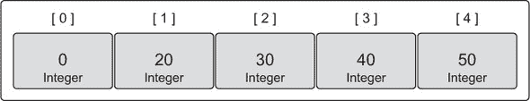

数组是有价值的结构，因为内存是按顺序分配的。以连续形式存储内存可以帮助你使用的内存更长时间地保持在 CPU 缓存中。使用索引运算，你可以快速遍历数组的所有元素。数组类型信息提供了你找到每个元素所需的内存移动距离。由于每个元素都是同一类型并且依次排列，因此遍历数组是一致的且快速的。

#### 4.1.2. 声明和初始化

声明数组时，指定要存储的数据类型和所需的总元素数，也称为数组的长度。

##### 列表 4.1. 声明并初始化为零值的数组

```
// Declare an integer array of five elements.
var array [5]int
```

一旦声明了数组，存储的数据类型及其长度都不能更改。如果你需要更多元素，你需要创建一个新的数组，其长度为所需长度，然后将一个数组中的值复制到另一个数组中。

当在 Go 中声明变量时，它们总是初始化为其各自类型的零值，数组也不例外。当数组初始化时，属于数组的每个单独的元素都被初始化为其零值。在图 4.2 中，你可以看到一个整数数组，数组中的每个元素都被初始化为 0，这是整数的零值。

##### 图 4.2. 数组变量声明后的数组值

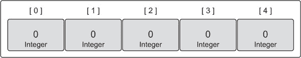

创建和初始化数组的一个快速简单的方法是使用数组字面量。数组字面量允许你声明所需的元素数量并指定这些元素的值。

##### 列表 4.2\. 使用数组字面量声明数组

```
// Declare an integer array of five elements.
// Initialize each element with a specific value.
array := [5]int{10, 20, 30, 40, 50}
```

如果长度以`...`给出，Go 将根据初始化的元素数量确定数组的长度。

##### 列表 4.3\. 使用 Go 计算大小的数组声明

```
// Declare an integer array.
// Initialize each element with a specific value.
// Capacity is determined based on the number of values initialized.
array := [...]int{10, 20, 30, 40, 50}
```

如果你已知所需数组的长度，但只准备初始化特定元素，你可以使用这种语法。

##### 列表 4.4\. 声明并初始化特定元素的数组

```
// Declare an integer array of five elements.
// Initialize index 1 and 2 with specific values.
// The rest of the elements contain their zero value.
array := [5]int{1: 10, 2: 20}
```

在声明并初始化数组后，列表 4.4 中声明的数组的值将类似于图 4.3。

##### 图 4.3\. 声明数组变量后的数组值

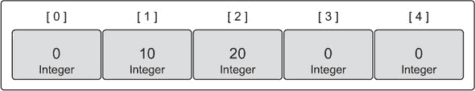

#### 4.1.3\. 使用数组

正如我们讨论的，数组是高效的数据结构，因为内存是按顺序排列的。这使得数组在访问单个元素时具有效率优势。要访问单个元素，请使用`[ ]`运算符。

##### 列表 4.5\. 访问数组元素

```
// Declare an integer array of five elements.
// Initialize each element with a specific value.
array := [5]int{10, 20, 30, 40, 50}

// Change the value at index 2.
array[2] = 35
```

在完成数组操作后，列表 4.5 中声明的数组的值将类似于图 4.4。

##### 图 4.4\. 改变索引 2 的值后数组的值

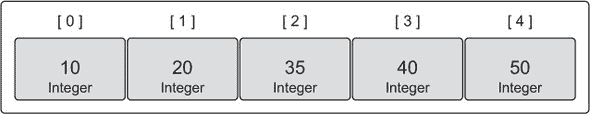

你可以有指针数组。就像在第二章中一样，你使用`*`运算符来访问每个元素指针指向的值。

##### 列表 4.6\. 访问数组指针元素

```
// Declare an integer pointer array of five elements.
// Initialize index 0 and 1 of the array with integer pointers.
array := [5]*int{0: new(int), 1: new(int)}

// Assign values to index 0 and 1.
*array[0] = 10
*array[1] = 20
```

在完成数组操作后，列表 4.6 中声明的数组的值将类似于图 4.5。

##### 图 4.5\. 指向整数的指针数组

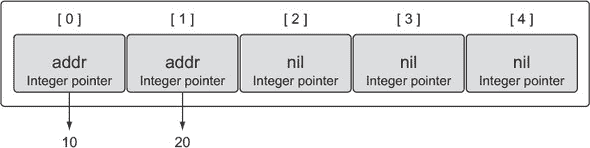

在 Go 中，数组是一个值。这意味着你可以在赋值操作中使用它。变量名表示整个数组，因此数组可以被赋值给相同类型的其他数组。

##### 列表 4.7\. 将一个数组赋值给相同类型的另一个数组

```
// Declare a string array of five elements.
var array1 [5]string

// Declare a second string array of five elements.
// Initialize the array with colors.
array2 := [5]string{"Red", "Blue", "Green", "Yellow", "Pink"}

// Copy the values from array2 into array1.
array1 = array2
```

复制后，你将有两个具有相同值的数组，如图图 4.6 所示。

##### 图 4.6\. 复制后的两个数组

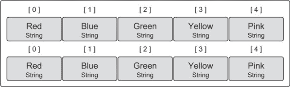

数组变量的类型包括长度和每个元素可以存储的数据类型。只有相同类型的数组才能被赋值。

##### 列表 4.8\. 分配不同类型的数组时的编译错误

```
// Declare a string array of four elements.
var array1 [4]string

// Declare a second string array of five elements.
// Initialize the array with colors.
array2 := [5]string{"Red", "Blue", "Green", "Yellow", "Pink"}

// Copy the values from array2 into array1.
array1 = array2

Compiler Error:
cannot use array2 (type [5]string) as type [4]string in assignment
```

复制指针数组会复制指针值，而不是指针指向的值。

##### 列表 4.9\. 将一个指针数组赋值给另一个

```
// Declare a string pointer array of three elements.
var array1 [3]*string

// Declare a second string pointer array of three elements.
// Initialize the array with string pointers.
array2 := [3]*string{new(string), new(string), new(string)}

// Add colors to each element
*array2[0] = "Red"
*array2[1] = "Blue"
*array2[2] = "Green"

// Copy the values from array2 into array1.
array1 = array2
```

复制后，你将有两个指向相同字符串的数组，如图图 4.7 所示。

##### 图 4.7\. 指向相同字符串的两个指针数组

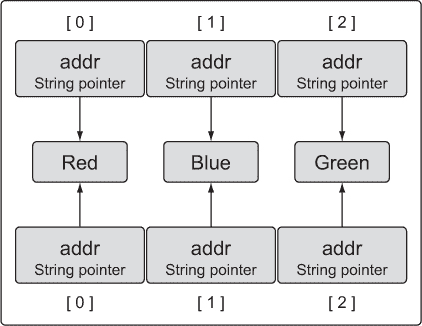

#### 4.1.4\. 多维数组

数组始终是一维的，但可以通过组合来创建多维数组。当需要管理可能具有父子关系或与坐标系相关联的数据时，多维数组非常有用。

##### 列表 4.10\. 声明二维数组

```
// Declare a two dimensional integer array of four elements
// by two elements.
var array [4][2]int

// Use an array literal to declare and initialize a two
// dimensional integer array.
array := [4][2]int{{10, 11}, {20, 21}, {30, 31}, {40, 41}}

// Declare and initialize index 1 and 3 of the outer array.
array := [4][2]int{1: {20, 21}, 3: {40, 41}}

// Declare and initialize individual elements of the outer
// and inner array.
array := [4][2]int{1: {0: 20}, 3: {1: 41}}
```

图 4.8 展示了声明和初始化这些数组后每个数组包含的值。

##### 图 4.8\. 二维数组和它们的内外值

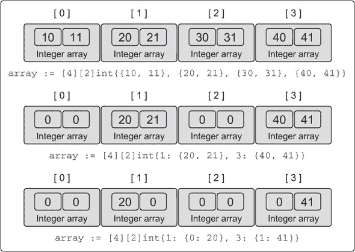

要访问单个元素，再次使用 `[ ]` 操作符和一些组合。

##### 列表 4.11\. 访问二维数组的元素

```
// Declare a two dimensional integer array of two elements.
var array [2][2]int

// Set integer values to each individual element.
array[0][0] = 10
array[0][1] = 20
array[1][0] = 30
array[1][1] = 40
```

只要多维数组具有相同的类型，就可以将它们相互复制。多维数组的类型基于每个维度的长度以及每个元素可以存储的数据类型。

##### 列表 4.12\. 赋值相同类型的多维数组

```
// Declare two different two dimensional integer arrays.
var array1 [2][2]int
var array2 [2][2]int

// Add integer values to each individual element.
array2[0][0] = 10
array2[0][1] = 20
array2[1][0] = 30
array2[1][1] = 40

// Copy the values from array2 into array1.
array1 = array2
```

因为数组是一个值，所以可以复制单个维度。

##### 列表 4.13\. 通过索引赋值多维数组

```
// Copy index 1 of array1 into a new array of the same type.
var array3 [2]int = array1[1]

// Copy the integer found in index 1 of the outer array
// and index 0 of the interior array into a new variable of
// type integer.
var value int = array1[1][0]
```

#### 4.1.5\. 在函数间传递数组

在函数间传递数组在内存和性能方面可能是一个昂贵的操作。当你将变量在函数间传递时，它们总是通过值传递。当你的变量是数组时，这意味着无论其大小如何，整个数组都会被复制并传递给函数。

为了看到这个操作的实际效果，让我们创建一个包含一百万个 `int` 类型元素的数组。在 64 位架构上，这将需要八百万字节，即八兆字节，的内存。当你声明这样一个大小的数组并将其传递给函数时会发生什么？

##### 列表 4.14\. 在函数间通过值传递大数组

```
// Declare an array of 8 megabytes.
var array [1e6]int

// Pass the array to the function foo.
foo(array)

// Function foo accepts an array of one million integers.
func foo(array [1e6]int) {
    ...
}
```

每次调用函数 `foo` 时，必须在栈上分配八兆字节的内存。然后必须将数组的值，即所有八兆字节的内存，复制到这个分配中。Go 可以处理这种复制操作，但还有更好的、更有效的方法来做这件事。你可以传递数组的指针，只需复制八字节，而不是在栈上复制八兆字节的内存。

##### 列表 4.15\. 在函数间通过指针传递大数组

```
// Allocate an array of 8 megabytes.
var array [1e6]int

// Pass the address of the array to the function foo.
foo(&array)

// Function foo accepts a pointer to an array of one million integers.
func foo(array *[1e6]int) {
    ...
}
```

这次函数 `foo` 接收一个指向一百万个整数元素的数组的指针。函数调用现在传递数组的地址，这只需要在栈上为指针变量分配八字节内存。

这种操作在内存方面更有效率，并且可能带来更好的性能。你只需要意识到，因为你现在使用的是指针，改变指针指向的值将改变共享的内存。真正令人兴奋的是，切片天生就处理了这些类型的问题，正如你将看到的。

### 4.2\. 切片内部和基础

*切片*是一种数据结构，它提供了一种方式，让您可以处理和管理数据集合。切片围绕动态数组的概念构建，可以根据您的需要增长和缩小。在增长方面，它们非常灵活，因为它们有自己的内置函数`append`，可以高效地快速增长切片。您还可以通过从底层内存中切出部分来减小切片的大小。切片为您提供了索引、迭代和垃圾回收优化的所有好处，因为底层内存是在连续块中分配的。

#### 4.2.1\. 内部结构

切片是小型对象，它们抽象并操作底层数组。它们是包含 Go 需要操作底层数组的元数据的三个字段的数据结构（参见图 4.9）。

##### 图 4.9\. 带底层数组的切片内部结构

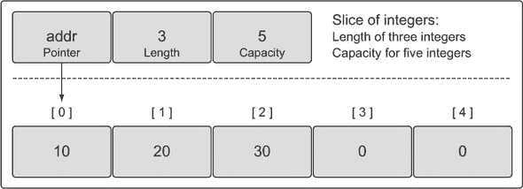

这三个字段是底层数组的指针、切片的长度或切片可以访问的元素数量，以及切片的容量或切片可以用于增长的元素数量。长度和容量之间的差异将在稍后变得更有意义。

#### 4.2.2\. 创建和初始化

在 Go 中有几种创建和初始化切片的方法。提前知道您需要的容量通常将决定您如何创建您的切片。

##### make 和切片字面量

创建切片的一种方法是通过内置函数`make`。当您使用`make`时，您可以选择指定切片的长度。

##### 列表 4.16\. 通过长度声明字符串切片

```
// Create a slice of strings.
// Contains a length and capacity of 5 elements.
slice := make([]string, 5)
```

当您只指定长度时，切片的容量相同。您也可以分别指定长度和容量。

##### 列表 4.17\. 通过长度和容量声明整数切片

```
// Create a slice of integers.
// Contains a length of 3 and has a capacity of 5 elements.
slice := make([]int, 3, 5)
```

当您分别指定长度和容量时，您可以在底层数组中创建具有可用容量的切片，而您最初无法访问这些容量。图 4.9 描述了在列表 4.17 中声明的整数切片在用一些值初始化后的可能样子。

列表 4.17 中的切片可以访问三个元素，但底层数组有五个元素。与切片长度不相关的两个元素可以合并，以便切片也可以使用这些元素。还可以创建新的切片来共享相同的底层数组并使用任何现有容量。

不允许创建容量小于长度的切片。

##### 列表 4.18\. 设置容量小于长度的编译器错误

```
// Create a slice of integers.
// Make the length larger than the capacity.
slice := make([]int, 5, 3)

Compiler Error:
len larger than cap in make([]int)
```

创建切片的一种惯用方法是使用切片字面量。它与创建数组类似，只是您不需要在`[ ]`操作符内指定值。初始长度和容量将基于您初始化的元素数量。

##### 列表 4.19\. 使用切片字面量声明切片

```
// Create a slice of strings.
// Contains a length and capacity of 5 elements.
slice := []string{"Red", "Blue", "Green", "Yellow", "Pink"}

// Create a slice of integers.
// Contains a length and capacity of 3 elements.
slice := []int{10, 20, 30}
```

当使用切片字面量时，你可以设置初始长度和容量。你需要做的就是初始化代表所需长度和容量的索引。以下语法将创建一个长度和容量为 100 个元素的切片。

##### 列表 4.20\. 使用索引位置声明切片

```
// Create a slice of strings.
// Initialize the 100th element with an empty string.
slice := []string{99: ""}
```

记住，如果你在 `[ ]` 操作符内指定了一个值，你正在创建一个数组。如果你没有指定值，你正在创建一个切片。

##### 列表 4.21\. 数组和切片的声明差异

```
// Create an array of three integers.
array := [3]int{10, 20, 30}

// Create a slice of integers with a length and capacity of three.
slice := []int{10, 20, 30}
```

##### `nil` 切片和空切片

有时在你的程序中你可能需要声明一个 `nil` 切片。一个 `nil` 切片是通过声明一个没有初始化的切片来创建的。

##### 列表 4.22\. 声明一个 `nil` 切片

```
// Create a nil slice of integers.
var slice []int
```

一个 `nil` 切片是你在 Go 中创建切片最常见的方式。它们可以与许多标准库和内置函数一起使用，这些函数与切片一起工作。当你想表示一个不存在的切片时，它们很有用，例如当函数返回一个切片时发生异常（参见 图 4.10）。

##### 图 4.10\. `nil` 切片的表示

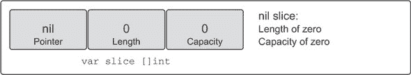

你也可以通过声明一个带有初始化的切片来创建一个空切片。

##### 列表 4.23\. 声明一个空切片

```
// Use make to create an empty slice of integers.
slice := make([]int, 0)

// Use a slice literal to create an empty slice of integers.
slice := []int{}
```

一个空切片包含一个零元素底层数组，它不分配任何存储空间。空切片在你想要表示一个空集合时很有用，例如当数据库查询返回零结果时（参见 图 4.11）。

##### 图 4.11\. 空切片的表示

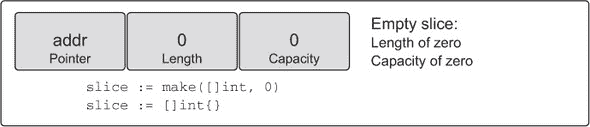

无论你是使用 `nil` 切片还是空切片，内置函数 `append`、`len` 和 `cap` 的工作方式都是相同的。

#### 4.2.3\. 使用切片

现在你已经知道了切片是什么以及如何创建它们，你可以学习如何在程序中使用它们。

##### 赋值和切片

将值赋给切片中的任何特定索引与数组中的操作方式相同。要更改单个元素的值，请使用 `[ ]` 操作符。

##### 列表 4.24\. 使用数组字面量声明数组

```
// Create a slice of integers.
// Contains a length and capacity of 5 elements.
slice := []int{10, 20, 30, 40, 50}

// Change the value of index 1.
slice[1] = 25
```

切片被称为切片，因为你可以从底层数组中切取一部分来创建一个新的切片。

##### 列表 4.25\. 从切片中取切片

```
// Create a slice of integers.
// Contains a length and capacity of 5 elements.
slice := []int{10, 20, 30, 40, 50}

// Create a new slice.
// Contains a length of 2 and capacity of 4 elements.
newSlice := slice[1:3]
```

在 列表 4.25 中执行切片操作后，我们有两个共享相同底层数组的切片。然而，每个切片以不同的方式查看底层数组（参见 图 4.12）。

##### 图 4.12\. 两个共享相同底层数组的切片

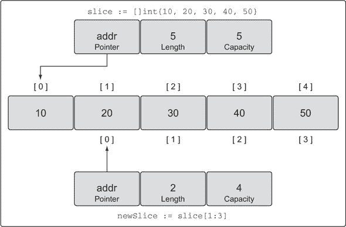

原始 `slice` 将底层数组视为具有五个元素的容量，但 `newSlice` 的视图不同。对于 `newSlice`，底层数组具有四个元素的容量。`newSlice` 无法访问其指针之前的底层数组的元素。对 `newSlice` 来说，那些元素甚至不存在。

计算任何新切片的长度和容量是通过以下公式完成的。

##### 列表 4.26\. 长度和容量的计算方法

```
For slice[i:j] with an underlying array of capacity k

Length:   j - i
Capacity: k - i
```

如果你将此公式应用于 `newSlice`，你将得到以下结果。

##### 列表 4.27\. 计算新的长度和容量

```
For slice[1:3] with an underlying array of capacity 5

Length:   3 - 1 = 2
Capacity: 5 - 1 = 4
```

另一种看待这个问题的方式是，第一个值代表新切片将开始的元素起始索引位置——在这种情况下，是 1。第二个值代表起始索引位置（1）加上你想要包含的元素数量（2）；1 加 2 等于 3，所以第二个值是 3。容量将是与切片相关的元素总数。

你需要记住，你现在有两个切片共享同一个底层数组。一个切片对底层数组共享部分的修改，另一个切片是可以看到的。

##### 列表 4.28\. 修改切片的潜在后果

```
// Create a slice of integers.
// Contains a length and capacity of 5 elements.
slice := []int{10, 20, 30, 40, 50}

// Create a new slice.
// Contains a length of 2 and capacity of 4 elements.
newSlice := slice[1:3]

// Change index 1 of newSlice.
// Change index 2 of the original slice.
newSlice[1] = 35
```

在将数字 35 分配给 `newSlice` 的第二个元素后，这种变化也可以在原始 `slice` 的元素 3 中看到（参见 图 4.13）。

##### 图 4.13\. 分配操作后的底层数组

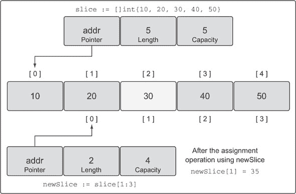

切片只能访问其长度范围内的索引。尝试访问长度之外的元素将导致运行时异常。与切片容量相关的元素仅可用于增长。它们必须被纳入切片的长度中，才能被使用。

##### 列表 4.29\. 索引越界时的运行时错误

```
// Create a slice of integers.
// Contains a length and capacity of 5 elements.
slice := []int{10, 20, 30, 40, 50}

// Create a new slice.
// Contains a length of 2 and capacity of 4 elements.
newSlice := slice[1:3]

// Change index 3 of newSlice.
// This element does not exist for newSlice.
newSlice[3] = 45

Runtime Exception:
panic: runtime error: index out of range
```

有容量是很好的，但如果不能将其融入切片的长度中，那就毫无用处。幸运的是，当你使用内置函数 `append` 时，Go 语言使这个过程变得简单。

##### 切片增长

使用切片而不是数组的一个优点是，你可以根据需要增长切片的容量。当你使用内置函数 `append` 时，Go 语言会处理所有操作细节。

要使用 `append`，你需要一个源切片和一个要附加的值。当你的 `append` 调用返回时，它为你提供一个带有更改的新切片。`append` 函数总是会增加新切片的长度。另一方面，容量可能会受到影响，也可能不会受到影响，这取决于源切片的可用容量。

##### 列表 4.30\. 使用 `append` 向切片添加元素

```
// Create a slice of integers.
// Contains a length and capacity of 5 elements.
slice := []int{10, 20, 30, 40, 50}

// Create a new slice.
// Contains a length of 2 and capacity of 4 elements.
newSlice := slice[1:3]

// Allocate a new element from capacity.
// Assign the value of 60 to the new element.
newSlice = append(newSlice, 60)
```

在 列表 4.30 中的 `append` 操作之后，切片和底层数组将看起来像 图 4.14。

##### 图 4.14\. 附加操作后的底层数组

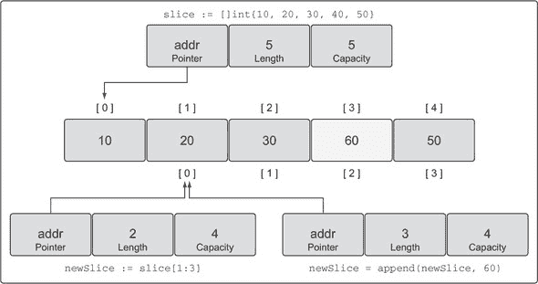

因为在底层数组中为 `newSlice` 有可用容量，所以 `append` 操作将可用元素纳入切片长度，并分配了值。由于原始 `slice` 是共享底层数组，所以 `slice` 也会看到索引 3 的变化。

当切片在底层数组中没有可用容量时，`append` 函数将创建一个新的底层数组，复制现有引用的值，并分配新值。

##### 列表 4.31\. 使用 `append` 增加切片的长度和容量

```
// Create a slice of integers.
// Contains a length and capacity of 4 elements.
slice := []int{10, 20, 30, 40}

// Append a new value to the slice.
// Assign the value of 50 to the new element.
newSlice := append(slice, 50)
```

在这个 `append` 操作之后，`newSlice` 被赋予了它自己的底层数组，并且数组的容量从原始大小加倍（参见 图 4.15）。

##### 图 4.15\. `append` 操作后的新底层数组

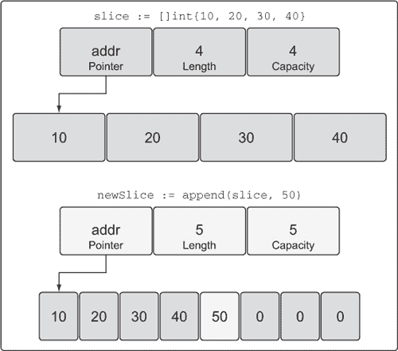

当切片的现有容量小于 1,000 个元素时，`append` 操作在增长底层数组的容量时非常巧妙。容量总是加倍。一旦元素数量超过 1,000，容量就增加 1.25 倍，即 25%。这种增长算法可能会随着时间的推移而改变。

##### 三个索引切片

在切片时，我们还没有提到的一个第三个索引选项，你可以使用。这个第三个索引让你可以控制新切片的容量。目的不是增加容量，而是限制容量。正如你将看到的，能够限制新切片的容量为底层数组提供了一定程度的保护，并让你对 `append` 操作有更多的控制。

让我们从包含你可以在当地超市找到的水果的五个字符串切片开始。

##### 列表 4.32\. 使用切片字面量声明字符串切片

```
// Create a slice of strings.
// Contains a length and capacity of 5 elements.
source := []string{"Apple", "Orange", "Plum", "Banana", "Grape"}
```

如果你检查这个水果切片的值，它看起来可能像 图 4.16。

##### 图 4.16\. 字符串切片的表示

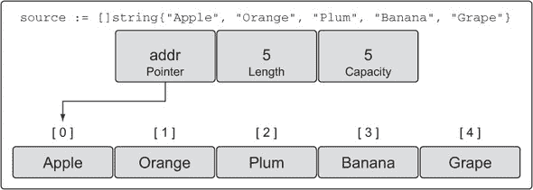

现在，让我们使用第三个索引选项来执行一个切片操作。

##### 列表 4.33\. 执行三个索引切片

```
// Slice the third element and restrict the capacity.
// Contains a length of 1 element and capacity of 2 elements.
slice := source[2:3:4]
```

在这个切片操作之后，我们有一个新的切片，它引用了底层数组中的一个元素，并且容量为两个元素。具体来说，新的切片引用了 `Plum` 元素，并且容量扩展到 `Banana` 元素，如 图 4.17 所示。

##### 图 4.17\. 操作后的新切片表示


我们可以应用之前定义的相同公式来计算新切片的长度和容量。

##### 列表 4.34\. 长度和容量是如何计算的

```
For slice[i:j:k]  or  [2:3:4]

Length:   j - i  or  3 - 2 = 1
Capacity: k - i  or  4 - 2 = 2
```

再次，第一个值代表新切片将开始的元素起始索引位置——在这种情况下，2。第二个值代表起始索引位置（2）加上你想要包含的元素数量（1）；2 加 1 等于 3，所以第二个值是 3。对于设置容量，你取起始索引位置 2，加上你想要包含在容量中的元素数量（2），得到值为 4。

如果你尝试设置一个比可用容量更大的容量，你将得到一个运行时错误。

##### 列表 4.35\. 设置大于现有容量的容量时的运行时错误

```
// This slicing operation attempts to set the capacity to 4.
// This is greater than what is available.
slice := source[2:3:6]

Runtime Error:
panic: runtime error: slice bounds out of range
```

正如我们之前讨论的，内置函数`append`会首先使用任何可用的容量。一旦达到这个容量，它将分配一个新的底层数组。很容易忘记哪些切片共享相同的底层数组。当这种情况发生时，对切片的更改可能会导致随机和奇怪的错误。突然之间，多个切片中出现了变化。

通过有选择地设置新切片的容量与长度相同，你可以强制第一次`append`操作将新切片从底层数组中分离出来。将新切片从其原始源数组中分离出来使其更改变得安全。

##### 列表 4.36\. 设置长度和容量相同的优点

```
// Create a slice of strings.
// Contains a length and capacity of 5 elements.
source := []string{"Apple", "Orange", "Plum", "Banana", "Grape"}

// Slice the third element and restrict the capacity.
// Contains a length and capacity of 1 element.
slice := source[2:3:3]

// Append a new string to the slice.
slice = append(slice, "Kiwi")
```

没有这个第三个索引，将`Kiwi`添加到我们的切片中将会改变底层数组索引 3 处的`Banana`的值，因为所有剩余的容量仍然属于切片。但在列表 4.36 中，我们限制了切片的容量为 1。当我们第一次在切片上调用`append`时，它将创建一个新的包含两个元素的底层数组，复制水果`Plum`，添加新的水果`Kiwi`，并返回一个新的切片，该切片引用这个底层数组，如图 4.18 所示。

##### 图 4.18\. 在`append`操作之后的新切片的表示

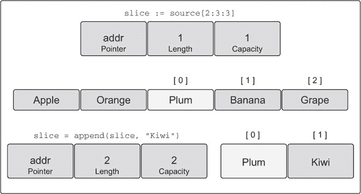

由于新切片现在有自己的底层数组，我们避免了潜在的问题。我们现在可以继续向我们的新切片添加水果，而不用担心是否不恰当地更改了其他切片中的水果。此外，为切片分配新的底层数组既简单又干净。

内置函数`append`也是一个可变参数函数。这意味着你可以在单个切片调用中传递多个要添加的值。如果你使用`...`运算符，你可以将一个切片的所有元素添加到另一个切片中。

##### 列表 4.37\. 从另一个切片向切片中添加元素

```
// Create two slices each initialized with two integers.
s1 := []int{1, 2}
s2 := []int{3, 4}

// Append the two slices together and display the results.
fmt.Printf("%v\n", append(s1, s2...))

Output:
[1 2 3 4]
```

如输出所示，切片`s2`的所有值都已添加到切片`s1`中。然后通过`Printf`调用显示`append`函数返回的新切片的值。

##### 遍历切片

由于切片是一个集合，你可以遍历其元素。Go 有一个特殊的关键字`range`，你可以与`for`关键字一起使用来遍历切片。

##### 列表 4.38\. 使用`for range`遍历切片

```
// Create a slice of integers.
// Contains a length and capacity of 4 elements.
slice := []int{10, 20, 30, 40}

// Iterate over each element and display each value.
for index, value := range slice {
  fmt.Printf("Index: %d  Value: %d\n", index, value)
}

Output:
Index: 0  Value: 10
Index: 1  Value: 20
Index: 2  Value: 30
Index: 3  Value: 40
```

当遍历切片时，关键字`range`将返回两个值。第一个值是索引位置，第二个值是该索引位置值的副本（参见图 4.19）。

##### 图 4.19\. 使用`range`遍历切片会复制每个元素。

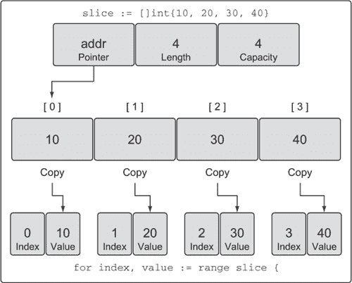

重要的是要知道`range`正在复制值，而不是返回一个引用。如果你使用值变量的地址作为每个元素的指针，你将会犯一个错误。让我们看看为什么。

##### 列表 4.39\. `range`提供了每个元素的副本

```
// Create a slice of integers.
// Contains a length and capacity of 4 elements.
slice := []int{10, 20, 30, 40}

// Iterate over each element and display the value and addresses.
for index, value := range slice {
   fmt.Printf("Value: %d  Value-Addr: %X  ElemAddr: %X\n",
       value, &value, &slice[index])
}

Output:
Value: 10  Value-Addr: 10500168  ElemAddr: 1052E100
Value: 20  Value-Addr: 10500168  ElemAddr: 1052E104
Value: 30  Value-Addr: 10500168  ElemAddr: 1052E108
Value: 40  Value-Addr: 10500168  ElemAddr: 1052E10C
```

`value` 变量的地址始终相同，因为它是一个包含副本的变量。可以使用切片变量和索引值捕获每个单独元素的地址。

如果你不需要索引值，你可以使用下划线字符来丢弃该值。

##### 列表 4.40\. 使用空白标识符忽略索引值

```
// Create a slice of integers.
// Contains a length and capacity of 4 elements.
slice := []int{10, 20, 30, 40}

// Iterate over each element and display each value.
for _, value := range slice {
    fmt.Printf("Value: %d\n", value)
}

Output:
Value: 10
Value: 20
Value: 30
Value: 40
```

关键字 `range` 总是从切片的开始迭代。如果你需要更多控制地迭代切片，你总是可以使用传统的 `for` 循环。

##### 列表 4.41\. 使用传统的 `for` 循环迭代切片

```
// Create a slice of integers.
// Contains a length and capacity of 4 elements.
slice := []int{10, 20, 30, 40}

// Iterate over each element starting at element 3.
for index := 2; index < len(slice); index++ {
    fmt.Printf("Index: %d  Value: %d\n", index, slice[index])
}

Output:
Index: 2  Value: 30
Index: 3  Value: 40
```

有两个特殊的内置函数 `len` 和 `cap` 与数组、切片和通道一起工作。对于切片，`len` 函数返回切片的长度，而 `cap` 函数返回容量。在列表 4.41 中，我们使用了 `len` 函数来确定何时停止迭代切片。

现在你已经知道了如何创建和使用切片，你可以使用它们来组合和迭代多维切片。

#### 4.2.4\. 多维切片

与数组一样，切片是一维的，但它们可以组合起来创建多维切片，原因与之前讨论的相同。

##### 列表 4.42\. 声明一个多维切片

```
// Create a slice of a slice of integers.
slice := [][]int{{10}, {100, 200}}
```

现在我们有一个包含整数内部切片的外部切片，其切片的切片整数值看起来像图 4.20。

##### 图 4.20\. 我们切片的切片整数的值

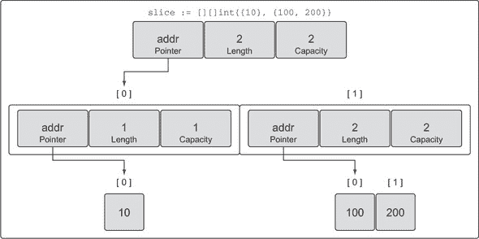

在图 4.20 中，你可以看到如何通过组合将切片嵌入到切片中。外部切片包含两个元素，每个元素都是切片。第一个元素中的切片初始化为单个整数 10，第二个元素中的切片包含两个整数，100 和 200。

组合允许你创建非常复杂和强大的数据结构。你学到的关于内置函数 `append` 的所有规则仍然适用。

##### 列表 4.43\. 组合切片的切片

```
// Create a slice of a slice of integers.
slice := [][]int{{10}, {100, 200}}

// Append the value of 20 to the first slice of integers.
slice[0] = append(slice[0], 20)
```

`append` 函数和 Go 在处理增长并将新的整数切片分配回外部切片的第一个元素方面非常优雅。当列表 4.43 中的操作完成时，将分配一个新的整数切片和一个新的底层数组，然后将其复制回外部切片的索引 0，如图 4.21 所示。

##### 图 4.21\. 外部切片索引 0 在 `append` 操作后的样子

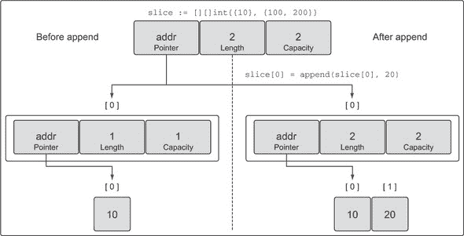

即使在这个简单的多维切片中，也涉及许多层和值。在函数之间传递这样的数据结构可能会显得复杂。但切片成本低廉，在函数之间传递它们是微不足道的。

#### 4.2.5\. 在函数之间传递切片

在两个函数之间传递切片只需通过值传递切片。由于切片的大小很小，复制和传递到函数之间很便宜。让我们创建一个大的切片，并通过值将这个切片传递给我们的`foo`函数。

##### 列表 4.44。在函数之间传递切片

```
// Allocate a slice of 1 million integers.
slice := make([]int, 1e6)

// Pass the slice to the function foo.
slice = foo(slice)

// Function foo accepts a slice of integers and returns the slice back.
func foo(slice []int) []int {
    ...
    return slice
}
```

在 64 位架构上，切片需要 24 字节的内存。指针字段需要 8 字节，长度和容量字段分别需要 8 字节。由于与切片关联的数据包含在底层数组中，因此将切片的副本传递给任何函数时没有问题。只有切片被复制，而不是底层数组（见图 4.22）。

##### 图 4.22。函数调用后两个切片都指向底层数组

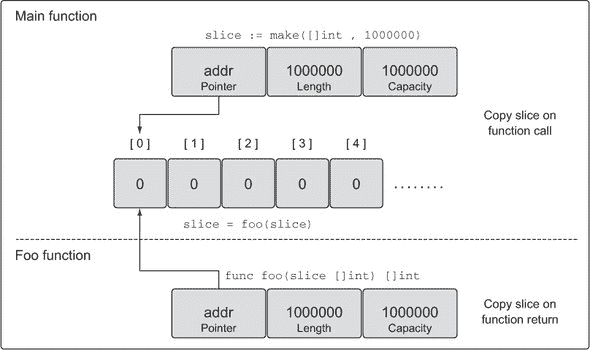

在函数之间传递 24 字节是快速且简单的。这就是切片的美丽之处。您不需要传递指针并处理复杂的语法。您只需创建切片的副本，进行所需的更改，然后传递一个新的副本。

### 4.3。映射的内部结构和基本原理

映射是一种数据结构，它为您提供无序的键/值对集合。

您可以根据键将值存储到映射中。图 4.23 展示了您可能存储在映射中的键/值对示例。映射的强大之处在于它能够根据键快速检索数据。键就像一个索引，指向与该键关联的值。

##### 图 4.23。键/值对的关系


#### 4.3.1。内部结构

映射是集合，您可以像处理数组和切片一样遍历它们。但映射是无序集合，无法预测键/值对返回的顺序。即使您以相同的顺序存储键/值对，每次遍历映射都可能返回不同的顺序。这是因为映射是使用哈希表实现的，如图 4.24 所示。

##### 图 4.24。映射内部结构的简单表示

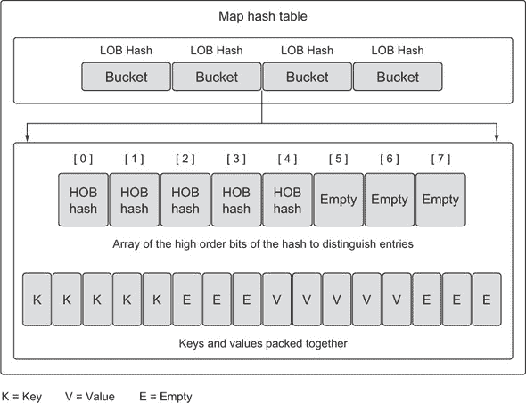

映射的哈希表包含一系列桶。当您存储、删除或查找键/值对时，一切从选择一个桶开始。这是通过将指定在映射操作中的键传递给映射的哈希函数来完成的。哈希函数的目的是生成一个索引，该索引将键/值对均匀分布在所有可用的桶中。

分布越好，随着映射的增长，您查找键/值对的速度就越快。如果您在映射中存储了 10,000 个项，您不想查看 10,000 个键/值对来找到您想要的那个。您希望查看尽可能少的键/值对。在 10,000 个项的映射中只查看 8 个键/值对是一个良好且平衡的映射。在正确数量的桶中跨键/值对平衡的列表使这成为可能。

为 Go 映射生成的哈希键比你在图 4.25 中看到的要长一些，但它的工作方式相同。在我们的例子中，键是表示颜色的字符串。这些字符串被转换成在可用存储桶数量范围内的数值。然后使用这个数值来选择一个桶以存储或查找特定的键/值对。在 Go 映射的情况下，生成的哈希键的一部分，即 *低位位* (LOB)，用于选择桶。

##### 图 4.25\. 哈希函数工作原理的简单视图

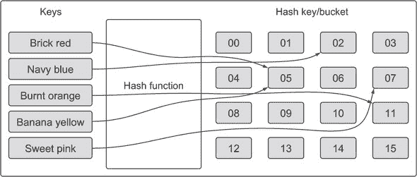

如果你再次查看图 4.24，你可以看到桶的内部结构。有两个数据结构包含映射的数据。首先，有一个数组，包含用于选择桶的相同哈希键的前八个 *高位位* (HOB)。这个数组区分了存储在相应桶中的每个单独的键/值对。其次，有一个字节数组，用于存储键/值对。字节数组将所有键打包在一起，然后为相应桶打包所有值。键/值对的打包是为了最小化每个桶所需的内存。

关于映射的许多其他低级实现细节超出了本章的范围。你不需要理解所有内部结构来学习如何创建和使用映射。只需记住一件事：映射是无序键/值对的集合。

#### 4.3.2\. 创建和初始化

在 Go 中创建和初始化映射有几种方法。你可以使用内置函数 `make`，或者你可以使用映射字面量。

##### 列表 4.45\. 使用 `make` 声明映射

```
// Create a map with a key of type string and a value of type int.
dict := make(map[string]int)

// Create a map with a key and value of type string.
// Initialize the map with 2 key/value pairs.
dict := map[string]string{"Red": "#da1337", "Orange": "#e95a22"}
```

使用映射字面量是创建映射的惯用方式。初始长度将基于初始化期间指定的键/值对数量。

映射键可以是任何内置或结构体类型的值，只要该值可以用 `==` 操作符在表达式中使用。切片、函数以及包含切片的结构体类型不能用作映射键。这将产生编译器错误。

##### 列表 4.46\. 使用映射字面量声明一个空映射

```
// Create a map using a slice of strings as the key.
dict := map[[]string]int{}

Compiler Exception:
invalid map key type []string
```

没有什么阻止你使用切片作为映射值。当你需要将单个映射键与一组数据相关联时，这可能会很有用。

##### 列表 4.47\. 声明存储字符串切片的映射

```
// Create a map using a slice of strings as the value.
dict := map[int][]string{}
```

#### 4.3.3\. 与映射一起工作

向映射赋值是通过指定正确的键类型并将值分配给该键来执行的。

##### 列表 4.48\. 向映射赋值

```
// Create an empty map to store colors and their color codes.
colors := map[string]string{}

// Add the Red color code to the map.
colors["Red"] = "#da1337"
```

你可以通过声明一个没有初始化的映射来创建一个 `nil` 映射。`nil` 映射不能用于存储键/值对。尝试这样做将产生运行时错误。

##### 列表 4.49\. 将运行时错误分配给 `nil` 映射

```
// Create a nil map by just declaring the map.
var colors map[string]string

// Add the Red color code to the map.
colors["Red"] = "#da1337"

Runtime Error:
panic: runtime error: assignment to entry in nil map
```

测试映射键是否存在是处理映射的重要部分。它允许你编写逻辑，以确定你是否执行了操作或是否在映射中缓存了某些特定数据。它还可以用于比较两个映射，以确定哪些键/值对匹配或缺失。

当从映射中检索值时，你有两种选择。你可以检索值和一个标志，该标志明确地让你知道键是否存在。

##### 列表 4.50\. 从映射中检索值并测试存在性。

```
// Retrieve the value for the key "Blue".
value, exists := colors["Blue"]

// Did this key exist?
if exists {
    fmt.Println(value)
}
```

另一个选项是只返回值并测试零值以确定键是否存在。这仅当零值不是映射的有效值时才有效。

##### 列表 4.51\. 从映射中检索值并测试值的存在性

```
// Retrieve the value for the key "Blue".
value := colors["Blue"]

// Did this key exist?
if value != "" {
    fmt.Println(value)
}
```

当你在 Go 中索引映射时，它总是会返回一个值，即使键不存在。在这种情况下，返回值类型的零值。

遍历映射与遍历数组或切片相同。你使用关键字 `range`；但是当涉及到映射时，你不会得到索引/值，而是得到键/值对。

##### 列表 4.52\. 使用 `for` 循环遍历映射

```
// Create a map of colors and color hex codes.
colors := map[string]string{
    "AliceBlue":   "#f0f8ff",
    "Coral":       "#ff7F50",
    "DarkGray":    "#a9a9a9",
    "ForestGreen": "#228b22",
}

// Display all the colors in the map.
for key, value := range colors {
    fmt.Printf("Key: %s  Value: %s\n", key, value)
}
```

如果你想从映射中删除一个键/值对，请使用内置函数 `delete`。

##### 列表 4.53\. 从映射中删除一个项

```
// Remove the key/value pair for the key "Coral".
delete(colors, "Coral")

// Display all the colors in the map.

for key, value := range colors {
    fmt.Printf("Key: %s  Value: %s\n", key, value)
}
```

这次当你遍历映射时，颜色珊瑚不会显示在屏幕上。

#### 4.3.4\. 在函数之间传递映射

在两个函数之间传递映射不会复制映射。实际上，你可以将映射传递给一个函数并修改映射，这些更改将通过映射的所有引用反映出来。

##### 列表 4.54\. 在函数之间传递映射

```
func main() {
    // Create a map of colors and color hex codes.
    colors := map[string]string{
       "AliceBlue":   "#f0f8ff",
       "Coral":       "#ff7F50",
       "DarkGray":    "#a9a9a9",
       "ForestGreen": "#228b22",
    }

    // Display all the colors in the map.
    for key, value := range colors {
        fmt.Printf("Key: %s  Value: %s\n", key, value)
    }

    // Call the function to remove the specified key.
    removeColor(colors, "Coral")

    // Display all the colors in the map.
    for key, value := range colors {
        fmt.Printf("Key: %s  Value: %s\n", key, value)
    }
}

// removeColor removes keys from the specified map.
func removeColor(colors map[string]string, key string) {
    delete(colors, key)
}
```

如果你运行这个程序，你会得到以下输出。

##### 列表 4.55\. 列表 4.54 的输出

```
Key: AliceBlue Value: #F0F8FF
Key: Coral Value: #FF7F50
Key: DarkGray Value: #A9A9A9
Key: ForestGreen Value: #228B22

Key: AliceBlue Value: #F0F8FF
Key: DarkGray Value: #A9A9A9
Key: ForestGreen Value: #228B22
```

你可以看到，在调用 `removeColor` 完成后，颜色珊瑚不再出现在 `main` 引用的映射中。映射的设计与切片类似，成本低廉。

### 4.4\. 摘要

+   数组是切片和映射的构建块。

+   在 Go 中，切片是处理数据集合的惯用方式。映射是处理数据键/值对的途径。

+   内置函数 `make` 允许你创建具有初始长度和容量的切片和映射。也可以使用映射字面量，并支持为使用设置初始值。

+   切片有容量限制，但可以使用内置函数 `append` 来扩展。

+   映射没有容量或对增长的任何限制。

+   内置函数 `len` 可以用来获取切片或映射的长度。

+   内置函数 `cap` 只适用于切片。

+   通过组合的使用，你可以创建多维数组切片。你还可以创建具有切片和其他映射值的映射。切片不能用作映射键。

+   将切片或映射传递给函数成本低廉，并且不会复制底层的数据结构。
