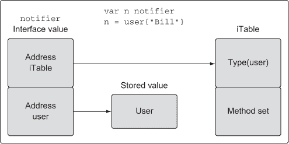
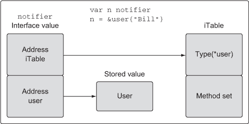

## 第五章\. Go 的类型系统

*本章*

+   声明新的用户定义类型

+   使用方法向类型添加行为

+   了解何时使用指针和值

+   使用接口实现多态

+   通过组合扩展和更改类型

+   导出和非导出标识符

Go 是一种静态类型编程语言。这意味着编译器总是想要知道程序中每个值的数据类型。当编译器提前知道类型信息时，它可以帮助确保程序以安全的方式处理值。这有助于减少潜在的内存损坏和错误，并为编译器提供了生成更高效代码的机会。

值的类型为编译器提供两份数据：首先，分配多少内存——即值的*大小*——其次，该内存表示什么。对于许多内置类型，大小和表示是类型名称的一部分。`int64` 类型的值需要 8 字节内存（64 位）并表示一个整数值。`float32` 需要占用 4 字节内存（32 位）并表示一个 IEEE-754 二进制浮点数。`bool` 需要占用 1 字节内存（8 位）并表示布尔值 `true` 或 `false`。

一些类型的表示是基于为代码构建的机器的架构。例如，`int` 类型的值可以是 8 字节（64 位）或 4 字节（32 位），这取决于架构。还有其他特定于架构的类型，例如 Go 中的所有引用类型。幸运的是，你不需要知道这些信息来创建或使用值。但如果编译器不知道这些信息，它就无法保护你免受在程序及其运行的机器上可能造成损害的操作。

### 5.1\. 用户定义类型

Go 允许你声明自己的类型。当你声明一个新类型时，声明被构造为向编译器提供大小和表示信息，类似于内置类型的工作方式。在 Go 中声明用户定义类型有两种方式。最常见的方式是使用关键字 `struct`，这允许你创建一个复合类型。

结构体类型是通过组合一组唯一的字段声明的。结构体中的每个字段都声明了一个已知类型，这可以是内置类型或另一个用户定义类型。

##### 列表 5.1\. 结构体类型的声明

```
01 // user defines a user in the program.
02 type user struct {
03    name       string
04    email      string
05    ext        int
06    privileged bool
07 }
```

在 列表 5.1 中，你可以看到结构体类型的声明。声明从关键字 `type` 开始，然后是新类型的名称，最后是关键字 `struct`。这个结构体类型包含四个字段，每个字段基于不同的内置类型。你可以看到字段是如何组合在一起来构成数据结构的。一旦声明了类型，就可以从该类型创建值。

##### 列表 5.2\. 声明结构体类型的变量并设置为它的零值

```
09 // Declare a variable of type user.
10 var bill user
```

在 列表 5.2 的第 10 行，关键字 `var` 创建了一个名为 `bill` 的类型为 `user` 的变量。当你声明变量时，变量所代表的值总是被初始化。该值可以用特定的值初始化，也可以初始化为其零值，这是该变量类型的默认值。对于数值类型，零值将是 `0`；对于字符串，它将是空字符串；对于布尔值，它将是 `false`。在结构的情况下，零值将适用于结构中的所有不同字段。

任何时间创建并初始化为零值的变量时，使用关键字 `var` 是惯用的。保留关键字 `var` 的使用，以表示变量正在被设置为它的零值。如果变量将被初始化为非零值，则使用带有结构字面量的短变量声明运算符。 

##### 列表 5.3\. 使用结构字面量声明结构类型变量的声明

```
12 // Declare a variable of type user and initialize all the fields.
13 lisa := user{
14     name:       "Lisa",
15     email:      "lisa@email.com",
16     ext:        123,
17     privileged: true,
18 }
```

列表 5.3 展示了如何声明一个类型为 `user` 的变量，并将其值初始化为非零值。在第 13 行，我们提供了一个变量名，后面跟着短变量声明运算符。这个运算符是带有等号的冒号（`:=`）。短变量声明运算符在一个操作中完成两个目的：它既声明又初始化一个变量。根据运算符右侧的类型信息，短变量声明运算符可以确定变量的类型。

由于我们正在创建和初始化结构类型，我们使用结构字面量来执行初始化。结构字面量的形式是带有初始化声明在其内的花括号。

##### 列表 5.4\. 使用结构字面量创建结构类型值

```
13 user{
14     name:       "Lisa",
15     email:      "lisa@email.com",
16     ext:        123,
17     privileged: true,
18 }
```

结构字面量对于结构类型可以采用两种形式。列表 5.4 展示了第一种形式，即在每个单独的行上声明结构要初始化的字段和值。使用冒号来分隔两者，并且需要一个尾随逗号。字段的顺序不重要。第二种形式没有字段名，只是声明值。

##### 列表 5.5\. 不声明字段名创建结构类型值

```
12 // Declare a variable of type user.
13 lisa := user{"Lisa", "lisa@email.com", 123, true}
```

值也可以放在单独的行上，但传统上，使用这种形式时，值通常放在同一行上，且后面没有逗号。在这种情况下，值的顺序很重要，需要与结构声明中字段的顺序相匹配。在声明结构类型时，你不仅限于使用内置类型。你还可以使用其他用户定义的类型来声明字段。

##### 列表 5.6\. 基于其他结构类型声明字段

```
20 // admin represents an admin user with privileges.
21 type admin struct {
22     person user
23     level  string
24 }
```

列表 5.6 展示了一个名为 `admin` 的新结构体类型。这个结构体类型有一个名为 `person` 的字段，其类型为 `user`，然后声明了一个名为 `level` 的第二个字段，其类型为 `string`。当创建具有类似 `person` 字段的结构体类型的变量时，使用结构体字面量初始化类型会有所不同。

##### 列表 5.7\. 使用结构体字面量创建字段值

```
26 // Declare a variable of type admin.
27 fred := admin{
28     person: user{
29         name:       "Lisa",
30         email:      "lisa@email.com",
31         ext:        123,
32         privileged: true,
33     },
34     level: "super",
35 }
```

为了初始化 `person` 字段，我们需要创建一个 `user` 类型的值。这正是我们在 listing 5.7 的第 28 行所做的事情。使用结构体字面量形式，创建了一个 `user` 类型的值并将其赋给 `person` 字段。

声明用户定义类型的第二种方式是使用现有类型并将其用作新类型的类型规范。当你需要一个可以由现有类型表示的新类型时，这些类型非常出色。标准库使用这种类型声明从内置类型创建高级功能。

##### 列表 5.8\. 基于 `int64` 声明的新类型

```
type Duration int64
```

列表 5.8 展示了从标准库的 `time` 包中声明的一个类型。`Duration` 是一个表示时间持续到纳秒级别的类型。该类型从内置类型 `int64` 获取其表示形式。在 `Duration` 的声明中，我们说 `int64` 是 `Duration` 的基本类型。尽管 `int64` 作为基本类型，但这并不意味着 Go 将它们视为相同。`Duration` 和 `int64` 是两个不同且不同的类型。

为了更好地阐明这意味着什么，请看这个无法编译的小程序。

##### 列表 5.9\. 分配不同类型值的编译器错误

```
01 package main
02
03 type Duration int64
04
05 func main() {
06     var dur Duration
07     dur = int64(1000)
08 }
```

在 listing 5.9 中的程序在第 03 行声明了一个名为 `Duration` 的类型。然后在第 06 行，声明了一个名为 `dur` 的 `Duration` 类型的变量并将其设置为它的零值。然后在第 07 行，我们编写了当程序构建时会产生以下编译器错误的代码。

##### 列表 5.10\. 实际编译器错误

```
prog.go:7: cannot use int64(1000) (type int64) as type Duration
           in assignment
```

编译器清楚地说明了问题所在。`int64` 类型的值不能用作 `Duration` 类型的值。换句话说，尽管 `int64` 类型是 `Duration` 的基本类型，但 `Duration` 仍然是它自己的独特类型。不同类型的值不能相互赋值，即使它们是兼容的。编译器不会隐式转换不同类型的值。

### 5.2\. 方法

方法提供了一种向用户定义类型添加行为的方式。方法实际上是包含一个额外参数的函数，该参数在关键字 `func` 和函数名之间声明。

##### 列表 5.11\. listing11.go

```
01 // Sample program to show how to declare methods and how the Go
02 // compiler supports them.
03 package main
04
05 import (
06     "fmt"
07 )
08
09 // user defines a user in the program.
10 type user struct {
11     name  string

12     email string
13 }
14
15 // notify implements a method with a value receiver.
16 func (u user) notify() {
17     fmt.Printf("Sending User Email To %s<%s>\n",
18         u.name,
19         u.email)
20 }
21
22 // changeEmail implements a method with a pointer receiver.
23 func (u *user) changeEmail(email string) {
24     u.email = email
25 }
26
27 // main is the entry point for the application.
28 func main() {
29     // Values of type user can be used to call methods
30     // declared with a value receiver.
31     bill := user{"Bill", "bill@email.com"}
32     bill.notify()
33
34     // Pointers of type user can also be used to call methods
35     // declared with a value receiver.
36     lisa := &user{"Lisa", "lisa@email.com"}
37     lisa.notify()
38
39     // Values of type user can be used to call methods
40     // declared with a pointer receiver.
41     bill.changeEmail("bill@newdomain.com")
42     bill.notify()
43
44     // Pointers of type user can be used to call methods
45     // declared with a pointer receiver.
46     lisa.changeEmail("lisa@comcast.com")
47     lisa.notify()
48 }
```

listing 5.11 的第 16 行和第 23 行展示了两种不同的方法。关键字 `func` 和函数名之间的参数被称为 *接收者*，它将函数绑定到指定的类型。当一个函数有接收者时，该函数被称为 *方法*。当你运行程序时，你会得到以下输出。

##### 列表 5.12\. 列表 11.go 的输出

```
Sending User Email To Bill<bill@email.com>
Sending User Email To Lisa<lisa@email.com>
Sending User Email To Bill<bill@newdomain.com>
Sending User Email To Lisa<lisa@comcast.com>
```

让我们来看看程序在做什么。在第 10 行，程序声明了一个名为 `user` 的结构体类型，然后声明了一个名为 `notify` 的方法。

##### 列表 5.13\. listing11.go: 行 09–20

```
09 // user defines a user in the program.
10 type user struct {
11     name  string
12     email string
13 }
14
15 // notify implements a method with a value receiver.
16 func (u user) notify() {
17     fmt.Printf("Sending User Email To %s<%s>\n",
18         u.name,
19         u.email)
20 }
```

Go 中有两种接收者类型：*值* 接收者和 *指针* 接收者。在 列表 5.13 的第 16 行，`notify` 方法声明了一个值接收者。

##### 列表 5.14\. 声明具有值接收者的方法

```
func (u user) notify() {
```

`notify` 的接收者被声明为 `user` 类型的值。当你使用值接收者声明一个方法时，该方法将始终针对用于创建方法调用的值的副本进行操作。让我们跳到程序 列表 5.11 的第 32 行，看看对 `notify` 的方法调用。

##### 列表 5.15\. listing11.go: 行 29–32

```
29     // Values of type user can be used to call methods
30     // declared with a value receiver.
31     bill := user{"Bill", "bill@email.com"}
32     bill.notify()
```

列表 5.15 展示了使用 `user` 类型的值调用 `notify` 方法。在第 31 行，声明了一个名为 `bill` 的 `user` 类型变量，并用一个名字和电子邮件地址进行初始化。然后在第 32 行，使用变量 `bill` 调用了 `notify` 方法。

##### 列表 5.16\. 从变量调用方法

```
bill.notify()
```

语法看起来与从包中调用函数时的语法相似。然而，在这种情况下，`bill` 不是一个包名，而是一个变量名。当我们在这种情况下调用 `notify` 方法时，`bill` 的值是调用时的接收者值，而 `notify` 方法是在这个值的副本上操作的。

你也可以使用指针调用声明为值接收者的方法。

##### 列表 5.17\. listing11.go: 行 34–37

```
34     // Pointers of type user can also be used to call methods
35     // declared with a value receiver.
36     lisa := &user{"Lisa", "lisa@email.com"}
37     lisa.notify()
```

列表 5.17 展示了使用 `user` 类型的指针调用 `notify` 方法。在第 36 行，声明了一个名为 `lisa` 的指针类型 `user` 变量，并用一个名字和电子邮件地址进行初始化。然后在第 37 行，使用指针变量调用了 `notify` 方法。为了支持方法调用，Go 调整指针值以符合方法的接收者。你可以想象 Go 正在执行以下操作。

##### 列表 5.18\. Go 在代码之下所做的工作

```
(*lisa).notify()
```

列表 5.18 展示了 Go 编译器为了支持方法调用所做的基本工作。指针值被解引用，使得方法调用符合值接收者的要求。再次强调，`notify` 是在副本上操作的，但这次是 `lisa` 指针所指向的值的副本。

你也可以声明具有指针接收者的方法。

##### 列表 5.19\. listing11.go: 行 22–25

```
22 // changeEmail implements a method with a pointer receiver.
23 func (u *user) changeEmail(email string) {
24     u.email = email
25 }
```

列表 5.19 展示了 `changeEmail` 方法的声明，该方法使用指针接收者。这次，接收者不是一个 `user` 类型的值，而是一个 `user` 类型的指针。当你调用声明为指针接收者的方法时，用于调用的值与方法共享。

##### 列表 5.20\. listing11.go: 行 36, 44–46

```
36     lisa := &user{"Lisa", "lisa@email.com"}

44     // Pointers of type user can be used to call methods
45     // declared with a pointer receiver.
46     lisa.changeEmail("lisa@newdomain.com")
```

在 列表 5.20 中，您可以看到 `lisa` 指针变量的声明，随后是第 46 行对 `changeEmail` 方法的调用。一旦 `changeEmail` 的调用返回，对 `lisa` 指针所指向的值的任何更改将在调用之后反映出来。这要归功于指针接收者。值接收者操作的是用于进行方法调用的值的副本，而指针接收者操作的是实际值。

您还可以使用值调用声明为指针接收者的方法。

##### 列表 5.21\. listing11.go: 第 31 行

```
31     bill := user{"Bill", "bill@email.com"}

39     // Values of type user can be used to call methods
40     // declared with a pointer receiver.
41     bill.changeEmail("bill@newdomain.com")
```

在 列表 5.21 中，您可以看到变量 `bill` 的声明，然后是对具有指针接收者的 `changeEmail` 方法的调用。同样，Go 调整了值以符合方法接收者，以支持调用。

##### 列表 5.22\. Go 在代码底下的操作

```
(&bill).notify()
```

列表 5.22 展示了 Go 编译器为了支持方法调用所做的基本操作。在这种情况下，值被引用，因此方法调用符合接收者类型。这是 Go 提供的一个极大的便利，允许使用与方法接收者类型不匹配的值和指针进行方法调用。

确定是否使用值或指针接收者有时可能会令人困惑。您可以遵循一些基本准则，这些准则直接来自标准库。

### 5.3\. 类型本质

在为类型声明方法之前，尝试回答这个问题。从这种类型的值中添加或删除某些内容是否需要创建一个新的值或修改现有值？如果答案是创建新值，那么为您的函数使用值接收者。如果答案是修改值，那么使用指针接收者。这也适用于如何将此类型的值传递到程序的其它部分。保持一致性很重要。这个想法是不要关注方法对值做了什么，而要关注值的本质。

#### 5.3.1\. 内置类型

内置类型是语言提供的一组类型。我们将其称为数值、字符串和布尔类型的集合。这些类型具有原始性质。正因为如此，当从这些类型之一的值中添加或删除某些内容时，应该创建一个新的值。基于这一点，当将这些类型的值传递给函数和方法时，应该传递值的副本。让我们看看标准库中的一个处理内置值的函数。

##### 列表 5.23\. golang.org/src/strings/strings.go: 第 620–625 行

```
620 func Trim(s string, cutset string) string {
621     if s == "" || cutset == "" {
622         return s
623     }
624     return TrimFunc(s, makeCutsetFunc(cutset))
625 }
```

在列表 5.23 中，你看到了来自标准库中`strings`包的`Trim`函数。`Trim`函数接收一个要操作的字符串值和一个要查找的字符字符串值。然后它返回一个新的字符串值，这是操作的结果。该函数在调用者的原始字符串值的副本上操作，并返回新字符串值的副本。字符串，就像整数、浮点数和布尔值一样，是原始数据值，应该在传入和传出函数或方法时进行复制。

让我们看看内置类型被视为具有原始性质的第二个例子。

##### 列表 5.24\. golang.org/src/os/env.go: 行 38–44

```
38 func isShellSpecialVar(c uint8) bool {
39     switch c {
40     case '*', '#', '$', '@', '!', '?', '0', '1', '2', '3', '4', '5',
                                                     '6', '7', '8', '9':
41         return true
42     }
43     return false
44 }
```

列表 5.24 展示了来自`env`包的`isShellSpecialVar`函数。这个函数接收一个类型为`uint8`的值，并返回一个类型为`bool`的值。注意，没有使用指针来共享参数或返回值的值。调用者传递了他们的`uint8`值的副本，并接收了`true`或`false`的值。

#### 5.3.2\. 引用类型

Go 中的引用类型包括切片、映射、通道、接口和函数类型。当你从这些类型中声明一个变量时，创建的值被称为*头值*。技术上，字符串也是一种引用类型值。所有不同引用类型的不同头值都包含一个指向底层数据结构的指针。每个引用类型还包含一组用于管理底层数据结构的唯一字段。你永远不会共享引用类型值，因为头值被设计为可复制的。头值包含一个指针；因此，你可以传递任何引用类型值的副本，并内在地共享底层数据结构。

让我们看看`net`包中的一个类型。

##### 列表 5.25\. golang.org/src/net/ip.go: 行 32

```
32 type IP []byte
```

列表 5.25 展示了名为`IP`的类型，它被声明为一个字节数组切片。当你想要声明围绕内置或引用类型的行为时，声明此类类型是有用的。编译器只允许你为命名用户定义类型声明方法。

##### 列表 5.26\. golang.org/src/net/ip.go: 行 329–337

```
329 func (ip IP) MarshalText() ([]byte, error) {
330     if len(ip) == 0 {
331         return []byte(""), nil
332     }
333     if len(ip) != IPv4len && len(ip) != IPv6len {
334         return nil, errors.New("invalid IP address")
335     }
336     return []byte(ip.String()), nil
337 }
```

列表 5.26 中的`MarshalText`方法使用类型为`IP`的值接收器声明。正如你所期望的，这是一个值接收器，因为你不会共享引用类型值。这也适用于将引用类型值作为参数传递给函数和方法。

##### 列表 5.27\. golang.org/src/net/ip.go: 行 318–325

```
318 // ipEmptyString is like ip.String except that it returns
319 // an empty string when ip is unset.
320 func ipEmptyString(ip IP) string {
321     if len(ip) == 0 {
322         return ""
323     }
324     return ip.String()
325 }
```

在列表 5.27 中，你看到了`ipEmptyString`函数。这个函数接收一个类型为`IP`的值。再次，你可以看到调用者为此参数的引用类型值没有与函数共享。函数传递了调用者的引用类型值的副本。这也适用于返回值。最终，引用类型值被处理得像原始数据值一样。

#### 5.3.3\. 结构类型

结构类型可以表示可能具有原始或非原始性质的数据值。当决定结构类型值在需要向值中添加或从值中删除某些内容时不应被修改时，它应遵循内置和引用类型的指南。让我们先看看标准库实现的一个具有原始性质的结构类型。

##### 列表 5.28\. golang.org/src/time/time.go: 行 39–55

```
39 type Time struct {
40     // sec gives the number of seconds elapsed since
41     // January 1, year 1 00:00:00 UTC.
42     sec int64
43
44     // nsec specifies a non-negative nanosecond
45     // offset within the second named by Seconds.
46     // It must be in the range [0, 999999999].
47     nsec int32
48
49     // loc specifies the Location that should be used to
50     // determine the minute, hour, month, day, and year
51     // that correspond to this Time.
52     // Only the zero Time has a nil Location.
53     // In that case it is interpreted to mean UTC.
54     loc *Location
55 }
```

列表 5.28 中的 `Time` 结构来自 `time` 包。当你想到时间时，你会意识到任何给定的时间点都不是可以改变的东西。这正是标准库实现 `Time` 类型的样子。让我们看看创建 `Time` 类型值的 `Now` 函数。

##### 列表 5.29\. golang.org/src/time/time.go: 行 781–784

```
781 func Now() Time {
782     sec, nsec := now()
783     return Time{sec + unixToInternal, nsec, Local}
784 }
```

列表 5.29 中的代码显示了 `Now` 函数的实现。此函数创建一个 `Time` 类型的值，并将该 `Time` 值的副本返回给调用者。没有使用指针来共享函数创建的 `Time` 值。接下来，让我们看看针对 `Time` 类型声明的某个方法。

##### 列表 5.30\. golang.org/src/time/time.go: 行 610–622

```
610 func (t Time) Add(d Duration) Time {
611     t.sec += int64(d / 1e9)
612     nsec := int32(t.nsec) + int32(d%1e9)
613     if nsec >= 1e9 {
614         t.sec++
615         nsec -= 1e9
616     } else if nsec < 0 {
617         t.sec--
618         nsec += 1e9
619     }
620     t.nsec = nsec
621     return t
622 }
```

列表 5.30 中的 `Add` 方法是标准库如何将 `Time` 类型视为具有原始性质的一个很好的例子。该方法使用值接收者声明，并返回一个新的 `Time` 值。该方法在其自己的副本上操作调用者的 `Time` 值，并将其本地 `Time` 值的副本返回给调用者。调用者决定是否用返回的值替换他们的 `Time` 值，或者声明一个新的 `Time` 变量来保存结果。

在大多数情况下，结构类型不表现出原始性质，而是非原始性质。在这些情况下，向类型值中添加或从值中删除某些内容应该会改变值。当这种情况发生时，你想要使用指针与需要它的程序的其他部分共享值。让我们看看标准库实现的一个具有非原始性质的结构类型。

##### 列表 5.31\. golang.org/src/os/file_unix.go: 行 15–29

```
15 // File represents an open file descriptor.
16 type File struct {
17     *file
18 }
19
20 // file is the real representation of *File.
21 // The extra level of indirection ensures that no clients of os
22 // can overwrite this data, which could cause the finalizer
23 // to close the wrong file descriptor.
24 type file struct {
25     fd int
26     name string
27     dirinfo *dirInfo // nil unless directory being read
28     nepipe int32 // number of consecutive EPIPE in Write
29 }
```

在 列表 5.31 中，你可以看到标准库中 `File` 类型的声明。这种类型的性质是非原始的。这种类型的值实际上是不安全的进行复制的。未导出类型的注释清楚地说明了这一点。由于无法阻止程序员进行复制，`File` 类型的实现使用了一个未导出类型的嵌入指针。我们将在本章后面讨论嵌入类型，但这一额外的间接层提供了对复制的保护。并非每个结构类型都需要或应该使用这种额外的保护来实现。程序员应该尊重每种类型的性质，并相应地使用它。

让我们看看 `Open` 函数的实现。

##### 列表 5.32\. golang.org/src/os/file.go: 行 238–240

```
238 func Open(name string) (file *File, err error) {
239     return OpenFile(name, O_RDONLY, 0)
240 }
```

在 列表 5.32 中 `Open` 函数的实现展示了如何使用指针来与函数的调用者共享 `File` 类型的值。`Open` 创建了一个 `File` 类型的值并返回对该值的指针。当工厂函数返回一个指针时，这是一个很好的迹象，表明返回值的本质是非原始的。

即使一个函数或方法永远不会直接改变非原始值的状体，它仍然应该被共享。

##### 列表 5.33\. golang.org/src/os/file.go: 行 224–232

```
224 func (f *File) Chdir() error {
225     if f == nil {
226         return ErrInvalid
227     }
228     if e := syscall.Fchdir(f.fd); e != nil {
229         return &PathError{"chdir", f.name, e}
230     }
231     return nil
232 }
```

在 列表 5.33 中的 `Chdir` 方法展示了即使在接收器值上没有进行任何修改，也声明了指针接收器。由于 `File` 类型的值具有非原始的本质，它们总是被共享，而不是被复制。

使用值接收器或指针接收器的决定不应基于方法是否正在修改接收的值。这个决定应该基于类型的本质。这个指导原则的一个例外是当你需要值类型接收器在处理接口值时提供的灵活性。在这些情况下，即使类型的本质是非原始的，你也可以选择使用值接收器。这完全基于接口值调用存储在其内部的值的方法的机制。在下一节中，你将了解接口值是什么以及如何使用它们调用方法的机制。

### 5.4\. 接口

多态性是能够通过类型的实现来展现不同行为的代码能力。一旦一个类型实现了接口，就可以为该类型的值打开一个全新的功能世界。标准库是一个很好的例子。`io` 包提供了一套令人难以置信的接口和函数，使得将数据流应用到我们的代码中变得容易。只需实现两个接口，我们就可以利用 `io` 包背后的所有工程。

但是，在声明和实现接口以供我们自己的程序使用时，有很多细节需要考虑。即使是现有接口的实现也需要理解接口是如何工作的。在我们深入了解接口的工作原理和实现方法之前，让我们快速看一下标准库中接口使用的一个例子。

#### 5.4.1\. 标准库

让我们从查看一个实现了一个名为 curl 的流行程序版本的示例程序开始。

##### 列表 5.34\. listing34.go

```
01 // Sample program to show how to write a simple version of curl using
02 // the io.Reader and io.Writer interface support.
03 package main
04
05 import (
06     "fmt"
07     "io"
08     "net/http"
09     "os"
10 )
11
12 // init is called before main.
13 func init() {
14     if len(os.Args) != 2 {
15         fmt.Println("Usage: ./example2 <url>")
16         os.Exit(-1)
17     }
18 }
19
20 // main is the entry point for the application.
21 func main() {
22     // Get a response from the web server.
23     r, err := http.Get(os.Args[1])
24     if err != nil {
25         fmt.Println(err)
26         return
27     }
28
29     // Copies from the Body to Stdout.
30     io.Copy(os.Stdout, r.Body)
31     if err := r.Body.Close(); err != nil {
32         fmt.Println(err)
33     }
34 }
```

列表 5.34 展示了接口及其在标准库中的使用的力量。在几行代码中，我们通过利用两个与接口值一起工作的函数，创建了一个 curl 程序。在第 23 行，我们调用 `http` 包中的 `Get` 函数。`http.Get` 函数在成功与服务器通信后返回一个 `http.Request` 类型的指针。`http.Request` 类型包含一个名为 `Body` 的字段，它是一个类型为 `io.ReadCloser` 的接口值。

在第 30 行，将 `Body` 字段作为第二个参数传递给 `io.Copy` 函数。`io.Copy` 函数接受接口类型 `io.Reader` 的值作为其第二个参数，这个值代表数据流出的源。幸运的是，`Body` 字段实现了 `io.Reader` 接口，因此我们可以将 `Body` 字段传递给 `io.Copy` 并使用网络服务器作为我们的源。

`io.Copy` 的第一个参数代表目的地，必须是一个实现了 `io.Writer` 接口的值。对于我们的目的地，我们传递了来自 `os` 包的一个特殊接口值，称为 `Stdout`。这个接口值代表标准输出设备，并且已经实现了 `io.Writer` 接口。当我们将 `Body` 和 `Stdout` 值传递给 `io.Copy` 函数时，该函数以小数据块的形式将来自网络服务器的数据流式传输到终端窗口。一旦读取并写入最后一个数据块，`io.Copy` 函数返回。

`io.Copy` 函数可以为标准库中许多已存在的不同类型执行此工作流程。

##### 列表 5.35\. listing35.go

```
01 // Sample program to show how a bytes.Buffer can also be used
02 // with the io.Copy function.
03 package main
04
05 import (
06     "bytes"
07     "fmt"
08     "io"
09     "os"
10 )
11
12 // main is the entry point for the application.
13 func main() {
14     var b bytes.Buffer
15
16     // Write a string to the buffer.
17     b.Write([]byte("Hello"))
18
19     // Use Fprintf to concatenate a string to the Buffer.
20     fmt.Fprintf(&b, "World!")
21
22     // Write the content of the Buffer to stdout.
23     io.Copy(os.Stdout, &b)
24 }
```

列表 5.35 展示了一个使用接口来拼接并将数据流式传输到标准输出的程序。在第 14 行，创建了一个来自 `bytes` 包的 `Buffer` 类型的变量，然后在第 17 行使用 `Write` 方法将字符串 `Hello` 添加到缓冲区中。在第 20 行，调用 `fmt` 包中的 `Fprintf` 函数将第二个字符串追加到缓冲区中。

`fmt.Fprintf` 函数接受一个类型为 `io.Writer` 的接口值作为其第一个参数。由于 `bytes.Buffer` 类型的指针实现了 `io.Writer` 接口，因此它可以被传入，并且 `fmt.Fprintf` 函数执行拼接操作。最后，在第 23 行再次使用 `io.Copy` 函数将字符写入终端窗口。由于 `bytes.Buffer` 类型的指针也实现了 `io.Reader` 接口，因此可以使用 `io.Copy` 函数将缓冲区的内容显示到终端窗口。

这两个小例子可能希望向您展示接口的一些好处以及它们在标准库中的使用方式。接下来，让我们更详细地探讨接口是如何实现的。

#### 5.4.2\. 实现

接口是仅声明行为的类型。这种行为不是由接口类型直接实现，而是通过用户定义的类型通过方法实现的。当用户定义的类型实现了接口类型声明的集合方法时，用户定义类型的值可以被赋值给接口类型的值。这种赋值将用户定义类型的值存储到接口值中。

如果对接口值进行方法调用，则执行存储的用户定义值的等效方法。由于任何用户定义类型都可以实现任何接口，因此对接口值的方法调用在本质上具有多态性。在这个关系中，用户定义类型通常被称为 *具体类型*，因为接口值在没有存储的用户定义值实现的情况下没有具体的行为。

关于用户定义类型的值或指针是否满足接口实现，有一些规则。并非所有值都是平等的。这些规则来自名为方法集的章节下的规范。在您开始调查方法集的细节之前，了解接口类型值的外观以及用户定义类型值如何在其中存储是有帮助的。

在 图 5.1 中，您可以看到 `user` 类型值赋值后接口变量的值。接口值是双字数据结构。第一个字包含指向一个称为 *iTable* 的内部表的指针，该表包含存储值的类型信息。iTable 包含已存储的值的类型以及与该值相关的方法列表。第二个字是指向存储值的指针。类型信息和指针的组合将两个值之间的关系绑定在一起。

##### 图 5.1\. 具体类型值赋值后接口值的简单视图



图 5.2 展示了将指针赋值给接口值时发生的情况。在这种情况下，类型信息将反映已存储的分配类型的指针，并且被分配的地址存储在接口值的第二个字中。

##### 图 5.2\. 指针赋值后接口值的简单视图



#### 5.4.3\. 方法集

方法集定义了接口合规性的规则。看看以下代码，以帮助您理解方法集在接口中扮演的重要角色。

##### 列表 5.36\. listing36.go

```
01 // Sample program to show how to use an interface in Go.
02 package main
03
04 import (
05     "fmt"
06 )
07
08 // notifier is an interface that defined notification
09 // type behavior.
10 type notifier interface {
11     notify()
12 }
13
14 // user defines a user in the program.
15 type user struct {
16     name  string
17     email string
18 }
19
20 // notify implements a method with a pointer receiver.
21 func (u *user) notify() {
22     fmt.Printf("Sending user email to %s<%s>\n",
23         u.name,
24         u.email)
25 }
26
27 // main is the entry point for the application.
28 func main() {
29     // Create a value of type User and send a notification.
30     u := user{"Bill", "bill@email.com"}
31
32     sendNotification(u)
33

34     // ./listing36.go:32: cannot use u (type user) as type
35     //                     notifier in argument to sendNotification:
36     //   user does not implement notifier
37     //                          (notify method has pointer receiver)
38 }
39
40 // sendNotification accepts values that implement the notifier
41 // interface and sends notifications.
42 func sendNotification(n notifier) {
43     n.notify()
44 }
```

在 列表 5.36 中，您会看到您预期可以编译的代码，但它却不能编译。在第 10 行，我们声明了一个名为 `notifier` 的接口，它有一个名为 `notify` 的单一方法。然后在第 15 行，我们有名为 `user` 的具体类型的声明以及通过第 21 行的方法声明来实现 `notifier` 接口。该方法使用 `user` 类型的指针接收器来实现。

##### 列表 5.37\. listing36.go: 行 40–44

```
40 // sendNotification accepts values that implement the notifier
41 // interface and sends notifications.
42 func sendNotification(n notifier) {
43     n.notify()
44 }
```

在 列表 5.37 的第 42 行，声明了一个名为 `sendNotification` 的函数，它接受一个接口类型 `notifier` 的单一值。然后使用接口值调用 `notify` 方法来针对存储的值。任何实现了 `notifier` 接口的值都可以传递给 `sendNotification` 函数。现在让我们看看 `main` 函数。

##### 列表 5.38\. listing36.go: 行 28–38

```
28 func main() {
29     // Create a value of type User and send a notification.
30     u := user{"Bill", "bill@email.com"}
31
32     sendNotification(u)
33
34     // ./listing36.go:32: cannot use u (type user) as type
35     //                     notifier in argument to sendNotification:
36     //   user does not implement notifier
37     //                          (notify method has pointer receiver)
38 }
```

在 `main` 函数中，创建了一个具体类型 `user` 的值，并将其分配给变量 `u`，在 listing 5.38 中的第 30 行。然后，将 `u` 的值传递给 `send-Notification` 函数，在第 32 行。但 `sendNotification` 的调用导致编译器错误。

##### 列表 5.39\. 将类型 `user` 的值存储到接口值中的编译器错误

```
./listing36.go:32: cannot use u (type user) as type
                   notifier in argument to sendNotification:
  user does not implement notifier (notify method has pointer receiver)
```

那么为什么我们在第 21 行实现 `notify` 方法时收到编译器错误呢？让我们再次查看那段代码。

##### 列表 5.40\. listing36.go: 行 08–12, 21–25

```
08 // notifier is an interface that defined notification
09 // type behavior.
10 type notifier interface {
11     notify()
12 }

21 func (u *user) notify() {
22     fmt.Printf("Sending user email to %s<%s>\n",
23         u.name,
24         u.email)
25 }
```

列表 5.40 展示了接口是如何实现的，但编译器告诉我们类型 `user` 的值不实现接口。如果你仔细查看编译器消息，它实际上告诉我们原因。

##### 列表 5.41\. 编译器错误的更详细查看

```
(notify method has pointer receiver)
```

要理解为什么在用指针接收器实现接口时，类型 `user` 的值不实现该接口，你需要了解什么是 *方法集*。方法集定义了与给定类型的值或指针相关联的方法集合。使用的接收器类型将决定一个方法是否与值、指针或两者相关联。

让我们从 Go 规范中记录的方法集规则开始解释。

##### 列表 5.42\. 规范中描述的方法集

```
Values                    Methods Receivers
-----------------------------------------------
    T                        (t T)
   *T                        (t T) and (t *T)
```

列表 5.42 展示了规范如何描述方法集。它说，类型 `T` 的值只具有声明了值接收器的方法，作为其方法集的一部分。但类型 `T` 的指针具有声明了值和指针接收器的方法，作为其方法集的一部分。从值的角度看这些规则是令人困惑的。让我们从接收器的角度看看这些规则。

##### 列表 5.43\. 从接收器类型的角度看方法集

```
Methods Receivers         Values
-----------------------------------------------
   (t T)                     T and *T
   (t *T)                    *T
```

列表 5.43 展示了相同的规则，但是从接收器的角度。它说，如果你使用指针接收器实现接口，那么只有该类型的指针实现该接口。如果你使用值接收器实现接口，那么该类型的值和指针都实现该接口。如果你再次查看 listing 5.36 中的代码，你现在有了理解编译器错误的上下文。

##### 列表 5.44\. listing36.go: 行 28–38

```
28 func main() {
29     // Create a value of type User and send a notification.
30     u := user{"Bill", "bill@email.com"}
31
32     sendNotification(u)
33
34     // ./listing36.go:32: cannot use u (type user) as type
35     //                     notifier in argument to sendNotification:
36     //   user does not implement notifier
37     //                          (notify method has pointer receiver)
38 }
```

我们使用指针接收器实现了接口，并尝试将类型 `user` 的值传递给 `sendNotification` 函数。在 listing 5.44 中的第 30 和 32 行清楚地展示了这一点。但如果我们将 `user` 值的地址传递过去，你会看到现在它可以编译并正常工作。

##### 列表 5.45\. listing36.go: 行 28–35

```
28 func main() {
29     // Create a value of type User and send a notification.
30     u := user{"Bill", "bill@email.com"}
31
32     sendNotification(&u)
33
34     // PASSED THE ADDRESS AND NO MORE ERROR.
35 }
```

在 listing 5.45 中，我们现在有一个可以编译和运行的程序。只有类型 `user` 的指针可以传递给 `sendNotification` 函数，因为接口是用指针接收器实现的。

现在的问题是为什么有这种限制？答案来自于这样一个事实，即并不总是能够获取到一个值的地址。

##### 列表 5.46\. listing46.go

```
01 // Sample program to show how you can't always get the
02 // address of a value.
03 package main
04
05 import "fmt"
06
07 // duration is a type with a base type of int.
08 type duration int
09
10 // format pretty-prints the duration value.
11 func (d *duration) pretty() string {
12     return fmt.Sprintf("Duration: %d", *d)
13 }
14
15 // main is the entry point for the application.
16 func main() {
17     duration(42).pretty()
18
19     // ./listing46.go:17: cannot call pointer method on duration(42)
20     // ./listing46.go:17: cannot take the address of duration(42)
21 }
```

listing 5.46 中的代码尝试获取类型为 `duration` 的值的地址，但无法做到。这表明并不总是能够获取到一个值的地址。让我们再次查看方法集规则。

##### 列表 5.47\. 再次查看方法集规则

```
Values                    Methods Receivers
-----------------------------------------------
    T                        (t T)
   *T                        (t T) and (t *T)

  Methods Receivers         Values
-----------------------------------------------
   (t T)                     T and *T
   (t *T)                    *T
```

因为并不总是能够获取到一个值的地址，所以为值设置的方法只包括使用值接收器实现的方法。

#### 5.4.4\. 多态

现在你已经理解了接口和方法集背后的机制，让我们来看一个最终的例子，展示接口的多态行为。

##### 列表 5.48\. listing48.go

```
01 // Sample program to show how polymorphic behavior with interfaces.
02 package main
03
04 import (
05     "fmt"
06 )
07
08 // notifier is an interface that defines notification
09 // type behavior.
10 type notifier interface {
11     notify()
12 }
13
14 // user defines a user in the program.
15 type user struct {
16     name  string
17     email string
18 }
19
20 // notify implements the notifier interface with a pointer receiver.
21 func (u *user) notify() {
22     fmt.Printf("Sending user email to %s<%s>\n",
23         u.name,
24         u.email)
25 }
26
27 // admin defines a admin in the program.
28 type admin struct {
29     name  string
30     email string
31 }
32
33 // notify implements the notifier interface with a pointer receiver.
34 func (a *admin) notify() {
35     fmt.Printf("Sending admin email to %s<%s>\n",
36         a.name,
37         a.email)
38 }
39
40 // main is the entry point for the application.
41 func main() {
42     // Create a user value and pass it to sendNotification.
43     bill := user{"Bill", "bill@email.com"}
44     sendNotification(&bill)
45
46     // Create an admin value and pass it to sendNotification.
47     lisa := admin{"Lisa", "lisa@email.com"}
48     sendNotification(&lisa)
49 }
50
51 // sendNotification accepts values that implement the notifier
52 // interface and sends notifications.

53 func sendNotification(n notifier) {
54     n.notify()
55 }
```

在 listing 5.48 中，我们有一个接口如何提供多态行为的最终示例。在第 10 行，我们有之前列表中声明的相同的 `notifier` 接口。然后在第 15 到 25 行，我们有名为 `user` 的结构体的声明，它使用指针接收器实现了 `notifier` 接口。在第 28 到 38 行，我们有名为 `admin` 的结构体的声明，它同样实现了 `notifier` 接口。我们有两个具体类型实现了 `notifier` 接口。

在第 53 行，我们再次看到了多态的 `sendNotification` 函数，它接受实现了 `notifier` 接口值的参数。由于任何具体的类型值都可以实现接口，这个函数可以执行传入的任何具体类型值的 `notify` 方法，从而提供多态行为。

##### 列表 5.49\. listing48.go: 行 40–49

```
40 // main is the entry point for the application.
41 func main() {
42     // Create a user value and pass it to sendNotification.
43     bill := user{"Bill", "bill@email.com"}
44     sendNotification(&bill)
45
46     // Create an admin value and pass it to sendNotification.
47     lisa := admin{"Lisa", "lisa@email.com"}
48     sendNotification(&lisa)
49 }
```

最后，在 listing 5.49 中，你看到所有内容都汇集在一起。在 `main` 函数的第 43 行创建了一个类型为 `user` 的值，然后在该值的地址在第 44 行传递给 `send-Notification`。这导致 `user` 类型声明的 `notify` 方法被执行。然后我们在第 47 和 48 行对类型为 `admin` 的值做同样的操作。最后，因为 `sendNotification` 接受类型为 `notifier` 的接口值，所以函数可以执行 `user` 和 `admin` 都实现的行为。

### 5.5\. 类型嵌入

Go 允许你使用现有的类型，并扩展和改变它们的行为。这种能力对于代码重用以及为了满足新的需求而改变现有类型的行为非常重要。这是通过 *类型嵌入* 实现的。它的工作原理是，通过在新的结构体类型声明中声明一个现有类型，从而使用现有类型。然后，被嵌入的类型被称为新的 *外部* 类型的 *内部* 类型。

通过内部类型提升，内部类型的标识符被提升到外部类型。这些提升的标识符成为外部类型的一部分，就像它们被类型本身显式声明一样。然后外部类型由内部类型包含的所有内容组成，可以添加新的字段和方法。外部类型还可以声明与内部类型相同的标识符，并覆盖它需要的任何字段或方法。这就是现有类型如何被扩展和更改的方式。

让我们从展示类型嵌入基本原理的示例程序开始。

##### 列表 5.50\. listing50.go

```
01 // Sample program to show how to embed a type into another type and
02 // the relationship between the inner and outer type.
03 package main
04
05 import (
06     "fmt"
07 )
08
09 // user defines a user in the program.
10 type user struct {
11     name  string
12     email string
13 }
14
15 // notify implements a method that can be called via
16 // a value of type user.
17 func (u *user) notify() {
18     fmt.Printf("Sending user email to %s<%s>\n",
19     u.name,
20     u.email)
21 }
22
23 // admin represents an admin user with privileges.
24 type admin struct {
25     user  // Embedded Type
26     level string
27 }
28
29 // main is the entry point for the application.
30 func main() {
31     // Create an admin user.
32     ad := admin{
33         user: user{
34             name:  "john smith",
35             email: "john@yahoo.com",
36         },
37         level: "super",
38     }
39
40     // We can access the inner type's method directly.
41     ad.user.notify()
42
43     // The inner type's method is promoted.
44     ad.notify()
45 }
```

在列表 5.50 中，我们有一个程序，展示了如何嵌入类型并访问嵌入的标识符。我们从第 10 行和第 24 行声明两个结构体类型开始。

##### 列表 5.51\. listing50.go: 行 09–13, 23–27

```
09 // user defines a user in the program.
10 type user struct {
11     name  string
12     email string
13 }

23 // admin represents an admin user with privileges.
24 type admin struct {
25     user  // Embedded Type
26     level string
27 }
```

在列表 5.51 的第 10 行，我们声明了一个名为`user`的结构体类型，然后在第 24 行我们声明了第二个名为`admin`的结构体类型。在`admin`类型的声明（第 25 行）中，我们将`user`类型作为`admin`的内部类型嵌入。要嵌入一个类型，只需声明类型名即可。在第 26 行，我们声明了一个名为`level`的字段。注意声明字段和嵌入类型之间的区别。

一旦我们在`admin`内部嵌入`user`类型，我们就可以说`user`是外部类型`admin`的内部类型。拥有内部和外部类型的概念使得理解两者之间的关系变得更容易。

##### 列表 5.52\. listing50.go: 行 15–21

```
15 // notify implements a method that can be called via
16 // a value of type user.
17 func (u *user) notify() {
18     fmt.Printf("Sending user email to %s<%s>\n",
19     u.name,
20     u.email)
21 }
```

列表 5.52 展示了使用类型`user`的指针接收器声明了一个名为`notify`的方法。该方法仅显示一条友好的消息，说明正在向特定的用户和电子邮件地址发送电子邮件。现在让我们看看`main`函数。

##### 列表 5.53\. listing50.go: 行 30–45

```
30 func main() {
31     // Create an admin user.
32     ad := admin{
33         user: user{
34             name:  "john smith",
35             email: "john@yahoo.com",
36         },

37         level: "super",
38     }
39
40     // We can access the inner type's method directly.
41     ad.user.notify()
42
43     // The inner type's method is promoted.
44     ad.notify()
45 }
```

列表 5.53 中的`main`函数展示了类型嵌入的机制。在第 32 行，创建了一个类型为`admin`的值。内部类型的初始化是通过结构体字面量来执行的，要访问内部类型，我们只需使用类型的名称。关于内部类型的一个特殊之处在于，它始终独立存在。这意味着内部类型永远不会失去其身份，并且始终可以直接访问。

##### 列表 5.54\. listing50.go: 行 40–41

```
40     // We can access the inner type's method directly.
41     ad.user.notify()
```

在列表 5.54 的第 41 行，你可以看到一个对`notify`方法的调用。这个调用是通过直接通过`admin`外部类型变量`ad`访问`user`内部类型来实现的。这展示了内部类型如何独立存在并且始终可访问。但多亏了内部类型提升，`notify`方法也可以直接从`ad`变量中访问。

##### 列表 5.55\. listing50.go: 行 43–45

```
43     // The inner type's method is promoted.
44     ad.notify()
45 }
```

列表 5.55 在第 44 行显示了从外部类型变量调用 `notify` 方法。由于内部类型的标识符被提升到外部类型，我们可以通过外部类型的价值访问内部类型的标识符。让我们通过添加一个接口来修改示例。

##### 列表 5.56\. listing56.go

```
01 // Sample program to show how embedded types work with interfaces.
02 package main
03
04 import (
05     "fmt"
06 )
07
08 // notifier is an interface that defined notification
09 // type behavior.
10 type notifier interface {
11     notify()

12 }
13
14 // user defines a user in the program.
15 type user struct {
16     name  string
17     email string
18 }
19
20 // notify implements a method that can be called via
21 // a value of type user.
22 func (u *user) notify() {
23     fmt.Printf("Sending user email to %s<%s>\n",
24     u.name,
25     u.email)
26 }
27
28 // admin represents an admin user with privileges.
29 type admin struct {
30     user
31     level string
32 }
33
34 // main is the entry point for the application.
35 func main() {
36     // Create an admin user.
37     ad := admin{
38         user: user{
39             name:  "john smith",
40             email: "john@yahoo.com",
41         },
42         level: "super",
43     }
44
45     // Send the admin user a notification.
46     // The embedded inner type's implementation of the
47     // interface is "promoted" to the outer type.
48     sendNotification(&ad)
49 }
50
51 // sendNotification accepts values that implement the notifier
52 // interface and sends notifications.
53 func sendNotification(n notifier) {
54     n.notify()
55 }
```

列表 5.56 中的示例代码使用了之前的相同代码，但做了一些修改。

##### 列表 5.57\. listing56.go: 第 08–12 行，第 51–55 行

```
08 // notifier is an interface that defined notification
09 // type behavior.
10 type notifier interface {
11     notify()
12 }

51 // sendNotification accepts values that implement the notifier
52 // interface and sends notifications.
53 func sendNotification(n notifier) {
54     n.notify()
55 }
```

在 列表 5.57 的第 08 行，我们有 `notifier` 接声明的声明。然后在第 53 行，我们有 `sendNotification` 函数，它接受一个类型为 `notifier` 的接口值。从之前的代码中我们知道，`user` 类型声明了一个名为 `notify` 的方法，该方法使用指针接收器实现了 `notifier` 接口。因此，我们可以继续到对 `main` 函数所做的修改。

##### 列表 5.58\. listing56.go: 第 35–49 行

```
35 func main() {
36     // Create an admin user.
37     ad := admin{
38         user: user{
39             name:  "john smith",
40             email: "john@yahoo.com",
41         },
42         level: "super",
43     }
44
45     // Send the admin user a notification.
46     // The embedded inner type's implementation of the
47     // interface is "promoted" to the outer type.
48     sendNotification(&ad)
49 }
```

这就是事情变得有趣的地方。在 列表 5.58 的第 37 行，我们创建了 `admin` 外部类型变量 `ad`。然后在第 48 行，我们将外部类型变量的地址传递给 `sendNotification` 函数。编译器接受将外部类型指针赋值为一个实现了 `notifier` 接口的价值。但如果你查看整个示例程序，你不会看到 `admin` 类型实现了接口。

多亏了内部类型提升，内部类型对接口的实现已经提升到外部类型。这意味着外部类型现在实现了接口，这是由于内部类型的实现。当我们运行这个示例程序时，我们得到以下输出。

##### 列表 5.59\. 列表 56.go 的输出

```
Output:
Sending user email to john smith<john@yahoo.com>

20 // notify implements a method that can be called via
21 // a value of type user.
22 func (u *user) notify() {
23     fmt.Printf("Sending user email to %s<%s>\n",
24     u.name,
25     u.email)
26 }
```

你可以在 列表 5.59 中看到调用了内部类型的接口实现。

如果外部类型不想使用内部类型的实现，因为它需要自己的实现，那会怎样呢？让我们看看另一个示例程序，它解决了这个问题。

##### 列表 5.60\. listing60.go

```
01 // Sample program to show what happens when the outer and inner
02 // types implement the same interface.
03 package main
04
05 import (
06     "fmt"
07 )
08
09 // notifier is an interface that defined notification
10 // type behavior.
11 type notifier interface {
12     notify()
13 }
14
15 // user defines a user in the program.
16 type user struct {
17     name  string
18     email string
19 }
20
21 // notify implements a method that can be called via
22 // a value of type user.
23 func (u *user) notify() {
24     fmt.Printf("Sending user email to %s<%s>\n",
25         u.name,
26         u.email)
27 }
28
29 // admin represents an admin user with privileges.
30 type admin struct {
31     user
32     level string
33 }
34
35 // notify implements a method that can be called via
36 // a value of type admin.
37 func (a *admin) notify() {
38     fmt.Printf("Sending admin email to %s<%s>\n",
39         a.name,
40         a.email)
41 }
42
43 // main is the entry point for the application.
44 func main() {
45     // Create an admin user.

46     ad := admin{
47         user: user{
48             name:  "john smith",
49             email: "john@yahoo.com",
50         },
51         level: "super",
52     }
53
54     // Send the admin user a notification.
55     // The embedded inner type's implementation of the
56     // interface is NOT "promoted" to the outer type.
57     sendNotification(&ad)
58
59     // We can access the inner type's method directly.
60     ad.user.notify()
61
62     // The inner type's method is NOT promoted.
63     ad.notify()
64 }
65
66 // sendNotification accepts values that implement the notifier
67 // interface and sends notifications.
68 func sendNotification(n notifier) {
69     n.notify()
70 }
```

列表 5.60 中的示例代码使用了之前的相同代码，但做了一些修改。

##### 列表 5.61\. listing60.go: 第 35–41 行

```
35 // notify implements a method that can be called via
36 // a value of type admin.
37 func (a *admin) notify() {
38     fmt.Printf("Sending admin email to %s<%s>\n",
39         a.name,
40         a.email)
41 }
```

这个代码示例通过 `admin` 类型添加了 `notifier` 接口的实现。当调用 `admin` 类型的实现时，它将显示 `"Sending admin email"`，而不是显示 `"Sending user email"` 的 `user` 类型实现。

对 `main` 函数也有一些其他修改。

##### 列表 5.62\. listing60.go: 第 43–64 行

```
43 // main is the entry point for the application.
44 func main() {
45     // Create an admin user.
46     ad := admin{
47         user: user{
48             name:  "john smith",
49             email: "john@yahoo.com",

50         },
51         level: "super",
52     }
53
54     // Send the admin user a notification.
55     // The embedded inner type's implementation of the
56     // interface is NOT "promoted" to the outer type.
57     sendNotification(&ad)
58
59     // We can access the inner type's method directly.
60     ad.user.notify()
61
62     // The inner type's method is NOT promoted.
63     ad.notify()
64 }
```

在列表 5.62 的第 46 行，我们再次创建了外部的`ad`类型变量。在第 57 行，将`ad`变量的地址传递给`sendNotification`函数，并且该值被接受为实现了接口。在第 60 行，代码直接从`user`内部类型调用`notify`方法。最后，在第 63 行使用外部类型变量`ad`调用`notify`方法。当你查看这个示例程序的输出时，你会看到不同的故事。

##### 列表 5.63. listing60.go 的输出

```
Sending Admin Email To john smith<john@yahoo.com>
Sending user email to john smith<john@yahoo.com>
Sending admin email to john smith<john@yahoo.com>
```

这次你看到了`admin`类型实现`notifier`接口是如何通过`sendNotification`函数和通过使用外部类型变量`ad`来执行的。这表明一旦外部类型实现了`notify`方法，内部类型的实现就不会被提升。但内部类型始终存在，因此代码仍然可以直接调用内部类型的实现。

### 5.6. 导出和未导出标识符

将可见性规则应用于你声明的标识符的能力对于良好的 API 设计至关重要。Go 支持从包中导出和未导出标识符以提供此功能。在第三章中，我们讨论了打包以及如何从一个包中导入标识符到另一个包。有时，你可能不希望类型、函数或方法等标识符成为包的公共 API 的一部分。在这些情况下，你需要一种方法来声明这些标识符，使它们在包外部未知。你需要声明它们为未导出。

让我们从展示如何从包中未导出标识符的示例程序开始。

##### 列表 5.64. listing64/

```
counters/counters.go
-----------------------------------------------------------------------
01 // Package counters provides alert counter support.
02 package counters
03
04 // alertCounter is an unexported type that
05 // contains an integer counter for alerts.
06 type alertCounter int

listing64.go
-----------------------------------------------------------------------
01 // Sample program to show how the program can't access an
02 // unexported identifier from another package.
03 package main
04
05 import (
06     "fmt"
07
08     "github.com/goinaction/code/chapter5/listing64/counters"
09 )
10
11 // main is the entry point for the application.
12 func main() {
13     // Create a variable of the unexported type and initialize
14     // the value to 10.
15     counter := counters.alertCounter(10)
16
17     // ./listing64.go:15: cannot refer to unexported name
18     //                                         counters.alertCounter
19     // ./listing64.go:15: undefined: counters.alertCounter
20
21     fmt.Printf("Counter: %d\n", counter)
22 }
```

在这个例子中，我们有两个代码文件。一个是名为`counters.go`，位于名为`counters`的独立包中。第二个代码文件名为`listing64.go`，它导入了`counters`包。让我们从`counters`包内部的代码开始。

##### 列表 5.65. `counters`/counters.go

```
01 // Package counters provides alert counter support.
02 package counters
03
04 // alertCounter is an unexported type that
05 // contains an integer counter for alerts.
06 type alertCounter int
```

列表 5.65 将`counters`包的代码单独列出。你应该注意到的第一件事是第 02 行。到目前为止，所有代码示例都使用了`package main`，但在这里你看到了`package counters`。当你编写的代码将存在于自己的包中时，将包的名称与代码所在的文件夹名称相同是一个好习惯。所有的 Go 工具都期望这种约定，因此遵循它是一个好习惯。

在`counters`包中，我们在第 06 行声明了一个名为`alertCounter`的单个标识符。这个标识符是一个使用`int`作为其基本类型的类型。这个标识符的一个重要方面是它已经被未导出。

当一个标识符以小写字母开头时，该标识符是未导出的或对包外部的代码来说是未知的。当一个标识符以大写字母开头时，它是导出的或对包外部的代码来说是已知的。让我们看看导入这个包的代码。

##### 列表 5.66\. `listing64.go`

```
01 // Sample program to show how the program can't access an
02 // unexported identifier from another package.
03 package main
04
05 import (
06     "fmt"
07
08     "github.com/goinaction/code/chapter5/listing64/counters"
09 )
10
11 // main is the entry point for the application.
12 func main() {
13     // Create a variable of the unexported type and initialize
14     // the value to 10.
15     counter := counters.alertCounter(10)
16
17     // ./listing64.go:15: cannot refer to unexported name
18     //                                         counters.alertCounter
19     // ./listing64.go:15: undefined: counters.alertCounter
20
21     fmt.Printf("Counter: %d\n", counter)
22 }
```

列表 5.66 中的 `listing64.go` 代码在第 03 行声明了 `main` 包，然后在第 08 行导入了 `counters` 包。导入 `counters` 包后，我们转到 `main` 函数的第 15 行。

##### 列表 5.67\. `listing64.go`: 行 13–19

```
13     // Create a variable of the unexported type and initialize
14     // the value to 10.
15     counter := counters.alertCounter(10)
16
17     // ./listing64.go:15: cannot refer to unexported name
18     //                                         counters.alertCounter
19     // ./listing64.go:15: undefined: counters.alertCounter
```

在列表 5.67 的第 15 行，代码尝试创建一个未导出类型 `alertCounter` 的值。但这段代码产生了编译器错误，指出第 15 行的代码不能引用未导出的标识符 `counters.alertCounter`。这个标识符是未定义的。

由于 `counters` 包中的 `alertCounter` 类型是用小写字母声明的，因此它是未导出的，因此在列表 64 中的代码中是未知的。如果我们将类型改为以大写字母开头，那么编译器错误就会消失。让我们看看实现 `counters` 包工厂函数的新示例程序。

##### 列表 5.68\. `listing68/`

```
counters/counters.go
-----------------------------------------------------------------------
01 // Package counters provides alert counter support.
02 package counters
03
04 // alertCounter is an unexported type that
05 // contains an integer counter for alerts.
06 type alertCounter int
07
08 // New creates and returns values of the unexported
09 // type alertCounter
10 func New(value int) alertCounter {
11     return alertCounter(value)
12 }

listing68.go
-----------------------------------------------------------------------
01 // Sample program to show how the program can access a value
02 // of an unexported identifier from another package.
03 package main
04
05 import (
06     "fmt"
07
08     "github.com/goinaction/code/chapter5/listing68/counters"
09 )
10
11 // main is the entry point for the application.
12 func main() {
13     // Create a variable of the unexported type using the exported
14     // New function from the package counters.
15     counter := counters.New(10)
16
17     fmt.Printf("Counter: %d\n", counter)
18 }
```

这个例子已经被修改为使用工厂函数来创建未导出的 `alertCounter` 类型的值。让我们首先看看 `counters` 包中的代码。

##### 列表 5.69\. `counters`/`counters.go`

```
01 // Package counters provides alert counter support.
02 package counters
03
04 // alertCounter is an unexported type that
05 // contains an integer counter for alerts.
06 type alertCounter int
07
08 // New creates and returns values of the unexported
09 // type alertCounter.
10 func New(value int) alertCounter {
11     return alertCounter(value)
12 }
```

列表 5.69 展示了我们针对 `counters` 包所做的修改。`alertCounter` 类型仍然未导出，但现在在第 10 行我们有一个名为 `New` 的函数。在 Go 中，给工厂函数命名通常使用 `New`。这个 `New` 函数做了一些有趣的事情：它创建了一个未导出类型的值，并将该值返回给调用者。让我们看看列表 68 中的 `main` 函数。

##### 列表 5.70\. `listing68.go`

```
11 // main is the entry point for the application.
12 func main() {
13     // Create a variable of the unexported type using the exported
14     // New function from the package counters.
15     counter := counters.New(10)
16
17     fmt.Printf("Counter: %d\n", counter)
18 }
```

在列表 5.70 的第 15 行，你可以看到对 `counters` 包中 `New` 函数的调用。`New` 函数返回的值被分配给一个名为 `counter` 的变量。这个程序可以编译和运行，但为什么？`New` 函数返回的是一个未导出类型 `alertCounter` 的值，而 `main` 能够接受这个值并创建一个未导出类型的变量。

这是因为两个原因。首先，标识符是导出或未导出的，而不是值。其次，短变量声明运算符能够推断类型并创建一个未导出类型的变量。你永远不能显式创建一个未导出类型的变量，但短变量声明运算符可以。

让我们看看一个新的示例程序，它展示了结构体类型的字段如何受到这些可见性规则的影响。

##### 列表 5.71\. `listing71/`

```
entities/entities.go
-----------------------------------------------------------------------
01 // Package entities contains support for types of
02 // people in the system.

03 package entities
04
05 // User defines a user in the program.
06 type User struct {
07     Name  string
08     email string
09 }

listing71.go
-----------------------------------------------------------------------
01 // Sample program to show how unexported fields from an exported
02 // struct type can't be accessed directly.
03 package main
04
05 import (
06     "fmt"
07
08     "github.com/goinaction/code/chapter5/listing71/entities"
09 )
10
11 // main is the entry point for the application.
12 func main() {
13     // Create a value of type User from the entities package.
14     u := entities.User{
15         Name:  "Bill",
16         email: "bill@email.com",
17     }
18
19     // ./example69.go:16: unknown entities.User field 'email' in
20     //                    struct literal
21
22     fmt.Printf("User: %v\n", u)
23 }
```

列表 5.71 中的代码做了一些改变。现在我们有一个名为 `entities` 的包，它声明了一个名为 `User` 的结构体类型。

##### 列表 5.72\. `entities`/`entities.go`

```
01 // Package entities contains support for types of
02 // people in the system.
03 package entities
04
05 // User defines a user in the program.
06 type User struct {
07     Name  string
08     email string
09 }
```

在列表 5.72 的第 06 行，`User` 类型被声明为导出。声明了两个具有 `User` 类型的字段，一个名为 `Name` 的导出字段和一个名为 `email` 的未导出字段。让我们看看 `listing71.go` 中的代码。

##### 列表 5.73\. `listing71.go`

```
01 // Sample program to show how unexported fields from an exported
02 // struct type can't be accessed directly.
03 package main
04
05 import (
06     "fmt"
07
08     "github.com/goinaction/code/chapter5/listing71/entities"
09 )
10
11 // main is the entry point for the application.
12 func main() {
13     // Create a value of type User from the entities package.
14     u := entities.User{
15         Name:  "Bill",
16         email: "bill@email.com",
17     }
18
19     // ./example71.go:16: unknown entities.User field 'email' in
20     //                    struct literal
21
22     fmt.Printf("User: %v\n", u)
23 }
```

在第 08 行，`entities` 包被导入到 列表 5.73 中。在第 14 行，声明了一个名为 `u` 的变量，它是来自 `entities` 包的导出类型 `User`，并初始化了其字段。但是有一个问题。在第 16 行，代码尝试初始化未导出的字段 `email`，编译器抱怨该字段未知。该标识符无法在 `entities` 包外部访问，因为它已被未导出。

让我们来看一个最终的例子，以展示嵌入式类型的导出和非导出是如何工作的。

##### 列表 5.74\. listing74/

```
entities/entities.go
-----------------------------------------------------------------------
01 // Package entities contains support for types of
02 // people in the system.
03 package entities
04
05 // user defines a user in the program.
06 type user struct {
07     Name  string
08     Email string
09 }
10
11 // Admin defines an admin in the program.
12 type Admin struct {
13     user   // The embedded type is unexported.
14     Rights int
15 }

listing74.go
-----------------------------------------------------------------------
01 // Sample program to show how unexported fields from an exported
02 // struct type can't be accessed directly.
03 package main
04
05 import (
06     "fmt"
07
08     "github.com/goinaction/code/chapter5/listing74/entities"
09 )
10
11 // main is the entry point for the application.
12 func main() {
13     // Create a value of type Admin from the entities package.
14     a := entities.Admin{
15         Rights: 10,
16     }
17
18     // Set the exported fields from the unexported
19     // inner type.
20     a.Name = "Bill"
21     a.Email = "bill@email.com"
22
23     fmt.Printf("User: %v\n", a)
24 }
```

现在，在 列表 5.74 中，`entities` 包包含两个结构体类型。

##### 列表 5.75\. `entities`/entities.go

```
01 // Package entities contains support for types of
02 // people in the system.
03 package entities
04
05 // user defines a user in the program.
06 type user struct {
07     Name  string
08     Email string
09 }
10
11 // Admin defines an admin in the program.
12 type Admin struct {
13     user   // The embedded type is unexported.
14     Rights int
15 }
```

在 列表 5.75 的第 06 行，声明了一个未导出的结构体类型 `user`。它包含两个名为 `Name` 和 `Email` 的导出字段。在第 12 行，声明了一个名为 `Admin` 的导出结构体类型。`Admin` 有一个名为 `Rights` 的导出字段，但它还嵌入了一个未导出的 `user` 类型。让我们看看列表 74.go 中的 `main` 函数中的代码。

##### 列表 5.76\. listing74.go: 行 11–24

```
11 // main is the entry point for the application.
12 func main() {
13     // Create a value of type Admin from the entities package.
14     a := entities.Admin{
15         Rights: 10,
16     }
17
18     // Set the exported fields from the unexported
19     // inner type.
20     a.Name = "Bill"
21     a.Email = "bill@email.com"
22
23     fmt.Printf("User: %v\n", a)
24 }
```

`main` 函数从第 14 行开始，在 列表 5.76 中创建了一个来自 `entities` 包的 `Admin` 类型的值。由于 `user` 内部类型未导出，此代码无法访问内部类型并在结构字面量内部初始化它。尽管内部类型未导出，但内部类型中声明的字段是导出的。由于内部类型的标识符提升到外部类型，因此通过外部类型的值可以知道这些导出字段。

因此，在第 20 行和第 21 行，可以通过未导出的内部类型 `user` 的 `Name` 和 `Email` 字段通过外部类型变量 `a` 访问和初始化。由于 `user` 类型未导出，因此无法直接访问内部类型。

### 5.7\. 摘要

+   可以使用关键字 `struct` 或指定现有类型来声明用户定义类型。

+   方法提供了一种向用户定义类型添加行为的方式。

+   将类型视为具有两种性质之一：原始或非原始。

+   接口是声明行为并提供多态性的类型。

+   类型嵌入提供了一种在不使用继承的情况下扩展类型的能力。

+   标识符要么从包中导出，要么未导出。
