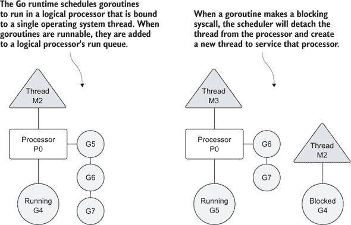
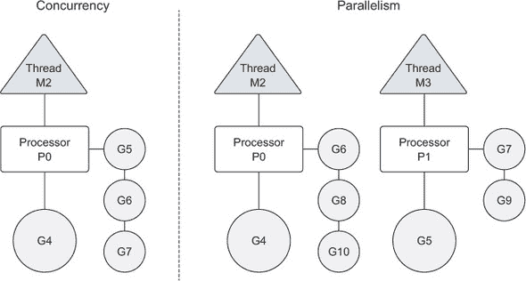
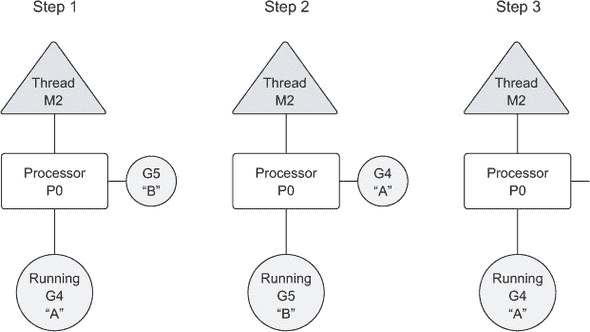
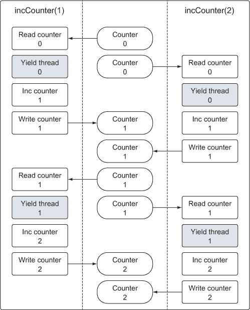
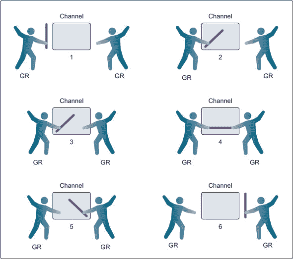
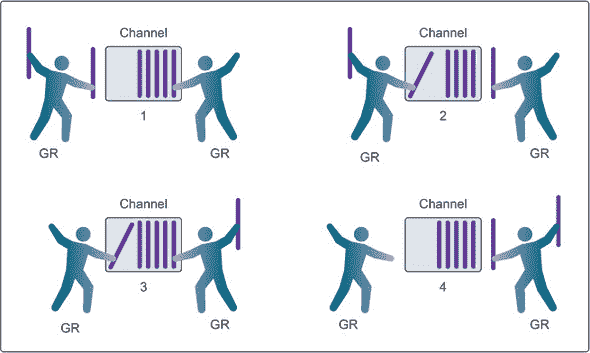

## 第六章\. 并发

*本章内容*

+   使用 goroutines 运行代码

+   检测和修复竞态条件

+   使用通道共享数据

通常，一个程序可以编写为一条执行单一任务并完成的线性代码路径。当这是可能的时候，总是选择这个选项，因为这种类型的程序通常更容易编写和维护。但是，有时同时执行多个任务会带来更大的好处。一个例子是具有能够同时接收多个数据请求的 Web 服务，这些请求可以在同一时间针对不同的套接字。每个套接字请求都是唯一的，并且可以独立于其他任何请求进行处理。能够并发执行请求的能力可以显著提高这类系统的性能。考虑到这一点，并发支持已经被直接构建到 Go 的语言和运行时中。

Go 中的并发是函数能够独立运行的能力。当一个函数被创建为 goroutine 时，它被视为一个独立的作业单元，该单元会被调度并在可用的逻辑处理器上执行。Go 运行时调度器是一块复杂的软件，它管理所有创建并需要处理器时间的 goroutines。调度器位于操作系统之上，将操作系统的线程绑定到逻辑处理器上，这些处理器反过来执行 goroutines。调度器控制着在任何给定时间哪些 goroutines 在哪些逻辑处理器上运行的所有相关事宜。

并发同步来自一个称为**通信顺序进程**或**CSP**的范式。CSP 是一个通过在 goroutines 之间传递数据而不是锁定数据来同步访问的消息传递模型。用于在 goroutines 之间同步和传递消息的关键数据类型称为**通道**。对于许多从未使用通道编写并发程序的开发者来说，他们可能会感受到一种敬畏和兴奋的氛围，你也许也会体验到这种感觉。使用通道使得编写并发程序变得更加容易，并使它们更不容易出错。

### 6.1\. 并发与并行

首先，让我们从高层次了解操作系统中的**进程**和**线程**是什么。这将帮助你理解稍后如何 Go 运行时调度器与操作系统协同工作以并发运行 goroutines。当你运行一个应用程序，例如 IDE 或编辑器时，操作系统会为该应用程序启动一个进程。你可以将进程想象成一个容器，它持有应用程序使用并维护的所有资源。

图 6.1 展示了一个包含任何进程可能分配的常见资源的进程。这些资源包括但不限于内存地址空间、文件、设备和线程的句柄。*线程*是操作系统调度以运行你在函数中编写的代码的执行路径。每个进程至少包含一个线程，每个进程的初始线程称为*主线程*。当主线程终止时，应用程序也会终止，因为这条执行路径是应用程序的起源。操作系统调度线程在处理器上运行，无论它们属于哪个进程。不同操作系统用于调度线程的算法始终在变化，并且对程序员来说是抽象的。

##### 图 6.1\. 运行应用程序的进程及其线程的简单视图


操作系统调度线程在物理处理器上运行，而 Go 运行时调度 goroutines 在逻辑处理器上运行。每个逻辑处理器单独绑定到单个操作系统线程。截至版本 1.5，默认为为每个可用的物理处理器分配一个逻辑处理器。在版本 1.5 之前，默认只分配一个逻辑处理器。这些逻辑处理器用于执行创建的所有 goroutines。即使只有一个逻辑处理器，也可以调度数十万个 goroutines 并发运行，效率惊人，性能卓越。

在图 6.2 中，你可以看到操作系统线程、逻辑处理器和本地运行队列之间的关系。随着 goroutines 的创建和准备运行，它们被放置在调度器的全局运行队列中。不久之后，它们被分配给一个逻辑处理器，并放置在该逻辑处理器的本地运行队列中。从那里，goroutine 等待轮到它被分配逻辑处理器进行执行。

##### 图 6.2\. Go 调度器如何管理 goroutines



有时正在运行的 goroutine 可能需要执行阻塞系统调用，例如打开文件。当这种情况发生时，线程和 goroutine 会从逻辑处理器上分离，线程继续阻塞等待系统调用返回。与此同时，存在一个没有线程的逻辑处理器。因此，调度器创建一个新的线程并将其附加到逻辑处理器上。然后调度器将选择本地运行队列中的另一个 goroutine 进行执行。一旦系统调用返回，goroutine 将被放回本地运行队列，线程将被放在一边以备将来使用。

如果 goroutine 需要执行网络 I/O 调用，过程略有不同。在这种情况下，goroutine 将从逻辑处理器分离出来，并移动到运行时集成的网络轮询器。一旦轮询器指示读取或写入操作已准备好，goroutine 将被分配回逻辑处理器以处理操作。调度器中并没有内置对可以创建的逻辑处理器数量的限制。但是，运行时默认将每个程序限制在最多 10,000 个线程。这个值可以通过从`runtime/debug`包调用`SetMaxThreads`函数来更改。如果任何程序尝试使用更多线程，程序将崩溃。

并发不是并行。只有在多个代码块同时针对不同的物理处理器执行时才能实现并行。并行是关于同时做很多事情。并发是关于同时管理很多事情。在许多情况下，并发可以超越并行，因为对操作系统和硬件的压力要小得多，这使得系统可以做更多的事情。这种少即是多的哲学是语言的座右铭。

如果你想要并行运行 goroutines，你必须使用多个逻辑处理器。当有多个逻辑处理器时，调度器将在逻辑处理器之间平均分配 goroutines。这将导致 goroutines 在不同的线程上运行。但要实现真正的并行，你仍然需要在具有多个物理处理器的机器上运行你的程序。如果不是这样，那么 goroutines 将并行运行在单个物理处理器上，尽管 Go 运行时正在使用多个线程。

图 6.3 展示了在单个逻辑处理器上并发运行 goroutines 与在两个逻辑处理器上并行运行的差异。不建议盲目更改逻辑处理器的运行时默认值。调度器包含智能算法，这些算法会随着 Go 的每个版本更新和改进。如果你看到性能问题，你认为可以通过更改逻辑处理器的数量来解决，你有能力这样做。你很快就会了解更多关于这方面的信息。

##### 图 6.3\. 并发与并行之间的差异



### 6.2\. Goroutines

让我们深入了解调度器的行为以及如何创建 goroutines 并管理它们的生命周期。我们将从使用单个逻辑处理器运行的示例开始，然后再讨论如何并行运行 goroutines。以下是一个创建两个 goroutines 的程序，这两个 goroutines 以并发方式显示英文字母的大小写。

##### 列表 6.1\. listing01.go

```
01 // This sample program demonstrates how to create goroutines and
02 // how the scheduler behaves.
03 package main
04
05 import (
06     "fmt"
07     "runtime"
08     "sync"
09 )
10
11 // main is the entry point for all Go programs.
12 func main() {
13     // Allocate 1 logical processor for the scheduler to use.
14     runtime.GOMAXPROCS(1)
15
16     // wg is used to wait for the program to finish.
17     // Add a count of two, one for each goroutine.
18     var wg sync.WaitGroup
19     wg.Add(2)
20
21     fmt.Println("Start Goroutines")
22

23     // Declare an anonymous function and create a goroutine.
24     go func() {
25         // Schedule the call to Done to tell main we are done.
26         defer wg.Done()
27
28         // Display the alphabet three times
29         for count := 0; count < 3; count++ {
30             for char := 'a'; char < 'a'+26; char++ {
31                 fmt.Printf("%c ", char)
32             }
33         }
34     }()
35
36     // Declare an anonymous function and create a goroutine.
37     go func() {
38         // Schedule the call to Done to tell main we are done.
39         defer wg.Done()
40
41         // Display the alphabet three times
42         for count := 0; count < 3; count++ {
43             for char := 'A'; char < 'A'+26; char++ {
44                 fmt.Printf("%c ", char)
45             }
46         }
47     }()
48
49     // Wait for the goroutines to finish.
50     fmt.Println("Waiting To Finish")
51     wg.Wait()
52
53     fmt.Println("\nTerminating Program")
54 }
```

在 列表 6.1 的第 14 行，你可以看到对 `runtime` 包中的 `GOMAXPROCS` 函数的调用。这是允许程序更改调度器使用的逻辑处理器数量的函数。还有一个可以设置相同名称的环境变量，如果我们不想在代码中特别调用这个函数。通过传递值 `1`，我们告诉调度器为这个程序使用单个逻辑处理器。

在第 24 行和 37 行，我们声明了两个显示英语字母的匿名函数。第 24 行的函数显示小写字母的字母表，而第 37 行的函数显示大写字母的字母表。这两个函数都是通过使用关键字 `go` 创建为 goroutines 的。你可以通过 列表 6.2 中的输出看到，每个 goroutine 中的代码都在单个逻辑处理器内并发运行。

##### 列表 6.2\. 列表 01.go 的输出

```
Create Goroutines
Waiting To Finish
A B C D E F G H I J K L M N O P Q R S T U V W X Y Z A B C D E F G H I J K L M
N O P Q R S T U V W X Y Z A B C D E F G H I J K L M N O P Q R S T U V W X Y Z

a b c d e f g h i j k l m n o p q r s t u v w x y z a b c d e f g h i j k l m
n o p q r s t u v w x y z a b c d e f g h i j k l m n o p q r s t u v w x y z
Terminating Program
```

第一个 goroutine 完成显示字母表所需的时间非常短，以至于它可以在调度器将其与第二个 goroutine 交换之前完成其工作。这就是为什么你首先看到大写字母的整个字母表，然后是小写字母的字母表。我们创建的两个 goroutines 是并发运行的，一个接一个，执行它们各自的显示字母表的任务。

一旦创建了两个匿名函数作为 goroutines，`main` 中的代码将继续运行。这意味着 `main` 函数可以在 goroutines 完成其工作之前返回。如果发生这种情况，程序将在 goroutines 有机会运行之前终止。因此，在第 51 行，`main` 函数使用 `WaitGroup` 等待两个 goroutines 完成其工作。

##### 列表 6.3\. listing01.go: 行 17–19，23–26，49–51

```
16     // wg is used to wait for the program to finish.
17     // Add a count of two, one for each goroutine.
18     var wg sync.WaitGroup
19     wg.Add(2)

23     // Declare an anonymous function and create a goroutine.
24     go func() {
25         // Schedule the call to Done to tell main we are done.
26         defer wg.Done()

49     // Wait for the goroutines to finish.
50     fmt.Println("Waiting To Finish")
51     wg.Wait()
```

`WaitGroup` 是一个计数信号量，可以用来记录正在运行的 goroutines。当 `WaitGroup` 的值大于零时，`Wait` 方法将会阻塞。在第 18 行创建了一个 `WaitGroup` 类型的变量，然后在第 19 行我们将 `WaitGroup` 的值设置为 `2`，表示有两个正在运行的 goroutines。为了减少 `WaitGroup` 的值并最终释放 `main` 函数，我们在第 26 行和 39 行的 `defer` 语句范围内调用了 `Done` 方法。

关键字 `defer` 用于在执行函数内部调度其他函数，以便在函数返回时调用。在我们的示例程序中，我们使用关键字 `defer` 来保证每个 goroutine 完成其工作后都调用一次 `Done` 方法。

根据调度器的内部算法，一个正在运行的 goroutine 可以在完成工作之前被停止并重新调度以再次运行。调度器这样做是为了防止任何单个 goroutine 限制逻辑处理器。它将停止当前正在运行的 goroutine，并给另一个可运行的 goroutine 一个运行的机会。

图 6.4 从逻辑处理器的角度展示了这一场景。在第 1 步中，调度器开始执行 goroutine A，而 goroutine B 则在运行队列中等待轮到它。然后，在第 2 步中，调度器突然将 goroutine A 与 goroutine B 交换。由于 goroutine A 没有完成，它被放回运行队列。接着，在第 3 步中，goroutine B 完成其工作并消失。这允许 goroutine A 重新开始工作。

##### 图 6.4\. 逻辑处理器线程上的 goroutines 交换



你可以通过创建一个需要较长时间来完成其工作的 goroutine 来看到这种行为。

##### 列表 6.4\. listing04.go

```
01 // This sample program demonstrates how the goroutine scheduler
02 // will time slice goroutines on a single thread.
03 package main
04
05 import (
06     "fmt"
07     "runtime"
08     "sync"
09 )
10
11 // wg is used to wait for the program to finish.
12 var wg sync.WaitGroup
13
14 // main is the entry point for all Go programs.
15 func main() {
16     // Allocate 1 logical processors for the scheduler to use.
17     runtime.GOMAXPROCS(1)
18
19     // Add a count of two, one for each goroutine.
20     wg.Add(2)
21
22     // Create two goroutines.
23     fmt.Println("Create Goroutines")

24     go printPrime("A")
25     go printPrime("B")
26
27     // Wait for the goroutines to finish.
28     fmt.Println("Waiting To Finish")
29     wg.Wait()
30
31     fmt.Println("Terminating Program")
32 }
33
34 // printPrime displays prime numbers for the first 5000 numbers.
35 func printPrime(prefix string) {
36     // Schedule the call to Done to tell main we are done.
37     defer wg.Done()
38
39 next:
40     for outer := 2; outer < 5000; outer++ {
41         for inner := 2; inner < outer; inner++ {
42             if outer%inner == 0 {
43                 continue next
44             }
45         }
46         fmt.Printf("%s:%d\n", prefix, outer)
47     }
48     fmt.Println("Completed", prefix)
49 }
```

列表 6.4 中的程序创建了两个 goroutine，它们打印出 1 到 5,000 之间可以找到的所有质数。找到并显示质数需要一些时间，这会导致调度器在找到所有要查找的质数之前对第一个正在运行的 goroutine 进行时间切片。

当程序启动时，它在第 12 行声明了一个`WaitGroup`变量，然后在第 20 行将`WaitGroup`的值设置为 2。在第 24 和第 25 行创建了两个 goroutine，通过在`go`关键字后指定函数`printPrime`的名称。第一个 goroutine 被赋予前缀 A，第二个 goroutine 被赋予前缀 B。像任何调用函数一样，可以将参数传递给创建为 goroutine 的函数。当 goroutine 终止时，没有返回参数。当你查看列表 6.5 中的输出时，你可以看到调度器对第一个 goroutine 的交换。

##### 列表 6.5\. listing04.go 的输出

```
Create Goroutines
Waiting To Finish
B:2
B:3
...
B:4583
B:4591
A:3             ** Goroutines Swapped
A:5
...

A:4561
A:4567
B:4603          ** Goroutines Swapped
B:4621
...
Completed B
A:4457          ** Goroutines Swapped
A:4463
...
A:4993
A:4999
Completed A
Terminating Program
```

Goroutine B 开始首先显示质数。一旦 goroutine B 打印出质数 4591，调度器将交换 goroutine，将 goroutine A 放入线程中，并再次将线程交换给 goroutine B。允许 goroutine B 完成所有工作。一旦 goroutine B 返回，你会看到 goroutine A 再次获得线程以完成其工作。每次运行此程序时，调度器都会稍微改变时间切片发生的位置。

列表 6.1 和 6.4 中的两个示例程序都展示了调度器如何在单个逻辑处理器内并发运行 goroutines。如前所述，Go 标准库在`runtime`包中有一个名为`GOMAXPROCS`的函数，允许你指定调度器使用的逻辑处理器数量。这就是如何将运行时更改为为每个可用的物理处理器分配一个逻辑处理器。下一个列表将展示我们的 goroutines 并行运行。

##### 列表 6.6\. 如何更改逻辑处理器的数量

```
import "runtime"

// Allocate a logical processor for every available core.
runtime.GOMAXPROCS(runtime.NumCPU())
```

`runtime` 包提供了更改 Go 运行时配置参数的支持。在 代码清单 6.6 中，我们使用两个 `runtime` 函数来更改调度器使用的逻辑处理器数量。`NumCPU` 函数返回可用的物理处理器数量；因此，对 `GOMAXPROCS` 的函数调用为每个可用的物理处理器创建一个逻辑处理器。需要注意的是，使用多个逻辑处理器并不一定意味着更好的性能。需要进行基准测试才能了解在更改任何 `runtime` 配置参数时程序的性能。

如果我们给调度器提供多个逻辑处理器来使用，我们将在示例程序的输出中看到不同的行为。让我们将逻辑处理器的数量更改为 2 并重新运行第一个打印英语字母的示例。

##### 代码清单 6.7\. listing07.go

```
01 // This sample program demonstrates how to create goroutines and
02 // how the goroutine scheduler behaves with two logical processors.
03 package main
04
05 import (
06     "fmt"
07     "runtime"
08     "sync"
09 )
10
11 // main is the entry point for all Go programs.
12 func main() {
13     // Allocate two logical processors for the scheduler to use.
14     runtime.GOMAXPROCS(2)
15
16     // wg is used to wait for the program to finish.
17     // Add a count of two, one for each goroutine.
18     var wg sync.WaitGroup
19     wg.Add(2)
20
21     fmt.Println("Start Goroutines")
22
23     // Declare an anonymous function and create a goroutine.
24     go func() {
25         // Schedule the call to Done to tell main we are done.
26         defer wg.Done()
27
28         // Display the alphabet three times.
29         for count := 0; count < 3; count++ {
30             for char := 'a'; char < 'a'+26; char++ {
31                 fmt.Printf("%c ", char)
32             }
33         }
34     }()
35
36     // Declare an anonymous function and create a goroutine.
37     go func() {
38         // Schedule the call to Done to tell main we are done.
39         defer wg.Done()
40
41         // Display the alphabet three times.
42         for count := 0; count < 3; count++ {
43             for char := 'A'; char < 'A'+26; char++ {
44                 fmt.Printf("%c ", char)
45             }
46         }
47     }()
48
49     // Wait for the goroutines to finish.
50     fmt.Println("Waiting To Finish")
51     wg.Wait()
52
53     fmt.Println("\nTerminating Program")
54 }
```

代码清单 6.7 中的示例通过在 14 行调用 `GOMAXPROCS` 函数创建了两个逻辑处理器。这将允许 goroutines 并行运行。

##### 代码清单 6.8\. listing07.go 的输出

```
Create Goroutines
Waiting To Finish
A B C a D E b F c G d H e I f J g K h L i M j N k O l P m Q n R o S p T
q U r V s W t X u Y v Z w A x B y C z D a E b F c G d H e I f J g K h L
i M j N k O l P m Q n R o S p T q U r V s W t X u Y v Z w A x B y C z D
a E b F c G d H e I f J g K h L i M j N k O l P m Q n R o S p T q U r V
s W t X u Y v Z w x y z
Terminating Program
```

如果你仔细观察 代码清单 6.8 的输出，你会看到 goroutines 正在并行运行。几乎立即，两个 goroutines 都开始运行，显示器的字母混合在一起。输出是基于在八核机器上运行程序的结果，因此每个 goroutine 都在自己的核心上运行。记住，goroutines 只有在存在多个逻辑处理器并且有物理处理器可以同时运行每个 goroutine 时才能并行运行。

你现在知道了如何创建 goroutines 并理解底层发生了什么。接下来，你需要了解在编写并发程序时可能存在的危险和需要注意的事项。

### 6.3\. 竞态条件

当两个或更多 goroutines 对共享资源进行非同步访问并尝试同时读取和写入该资源时，你就有了一个所谓的 *竞态条件*。竞态条件是并发编程复杂且具有更大潜在错误可能性的原因。对共享资源的读取和写入操作必须是原子的，换句话说，一次只能由一个 goroutine 完成。

这里有一个包含竞态条件的示例程序。

##### 代码清单 6.9\. listing09.go

```
01 // This sample program demonstrates how to create race
02 // conditions in our programs. We don't want to do this.
03 package main
04
05 import (
06     "fmt"
07     "runtime"
08     "sync"
09 )
10
11 var (
12     // counter is a variable incremented by all goroutines.
13     counter int
14
15     // wg is used to wait for the program to finish.

16     wg sync.WaitGroup
17 )
18
19 // main is the entry point for all Go programs.
20 func main() {
21     // Add a count of two, one for each goroutine.
22     wg.Add(2)
23
24     // Create two goroutines.
25     go incCounter(1)
26     go incCounter(2)
27
28     // Wait for the goroutines to finish.
29     wg.Wait()
30     fmt.Println("Final Counter:", counter)
31 }
32
33 // incCounter increments the package level counter variable.
34 func incCounter(id int) {
35     // Schedule the call to Done to tell main we are done.
36     defer wg.Done()
37
38     for count := 0; count < 2; count++ {
39         // Capture the value of Counter.
40         value := counter
41
42         // Yield the thread and be placed back in queue.
43         runtime.Gosched()
44
45         // Increment our local value of Counter.
46         value++
47
48         // Store the value back into Counter.
49         counter = value
50     }
51 }
```

##### 代码清单 6.10\. listing09.go 的输出

```
Final Counter: 2
```

`counter` 变量被读取和写入四次，每个 goroutine 两次，但程序结束时 `counter` 变量的值是 `2`。图 6.5 提供了为什么会出现这种情况的线索。

##### 图 6.5\. 竞态条件作用的可视化



每个 goroutine 都会覆盖其他 goroutine 的工作。这发生在 goroutine 交换过程中。每个 goroutine 都会创建`counter`变量的副本，然后被交换出去以供其他 goroutine 使用。当 goroutine 再次被赋予执行时间时，`counter`变量的值已经改变，但 goroutine 没有更新其副本。相反，它继续增加其副本，并将值重新设置为`counter`变量，从而替换了其他 goroutine 执行的工作。

让我们逐步分析代码，以了解它在做什么。从第 25 行和第 26 行可以看到，从`incCounter`函数创建了两个 goroutine。第 34 行的`incCounter`函数读取并写入包变量`counter`，这是我们在这个示例中的共享资源。两个 goroutine 从第 40 行开始读取并将`counter`变量的副本存储到名为`value`的局部变量中。然后，在第 46 行，它们将`value`的副本增加 1，并在第 49 行将新值赋回`counter`变量。该函数在第 43 行包含对`runtime`包中的`Gosched`函数的调用，以释放线程并给其他 goroutine 运行的机会。这是在操作过程中执行的，以强制调度器在两个 goroutine 之间进行交换，以夸大竞争条件的影响。

Go 有一个特殊的工具可以检测代码中的竞争条件。这对于发现这些类型的错误非常有用，尤其是当它们不像我们的示例那样明显时。让我们运行竞争检测器来检测我们的示例代码。

##### 列表 6.11\. 使用竞争检测器构建和运行 listing09

```
go build -race   // Build the code using the race detector flag
./example        // Run the code

==================
WARNING: DATA RACE
Write by goroutine 5:

  main.incCounter()
      /example/main.go:49 +0x96

Previous read by goroutine 6:
  main.incCounter()
      /example/main.go:40 +0x66

Goroutine 5 (running) created at:
  main.main()
      /example/main.go:25 +0x5c

Goroutine 6 (running) created at:
  main.main()
      /example/main.go:26 +0x73
==================
Final Counter: 2
Found 1 data race(s)
```

列表 6.11 中的竞争检测器已经指出我们示例中的以下四行代码。

##### 列表 6.12\. 被竞争检测器标记的代码行

```
Line 49: counter = value
Line 40: value := counter
Line 25: go incCounter(1)
Line 26: go incCounter(2)
```

列表 6.12 显示，竞争检测器告诉我们哪个 goroutine 导致了数据竞争，以及哪两行代码存在冲突。指出的是从`counter`变量读取和写入的代码并不令人惊讶。

我们可以通过使用 Go 对同步 goroutines 的支持，通过锁定共享资源来修复我们的示例并消除竞争条件。

### 6.4\. 锁定共享资源

Go 通过锁定对共享资源的访问来提供传统的 goroutine 同步支持。如果你需要序列化对整数变量或代码块的访问，那么`atomic`和`sync`包中的函数可能是一个好的解决方案。我们将查看`atomic`包的一些函数和`sync`包中的`mutex`类型。

#### 6.4.1\. 原子函数

原子函数提供了对整数和指针访问的低级锁定机制，用于同步。我们可以使用原子函数来修复我们在列表 6.9 中创建的竞争条件。

##### 列表 6.13\. listing13.go

```
01 // This sample program demonstrates how to use the atomic
02 // package to provide safe access to numeric types.
03 package main

04
05 import (
06     "fmt"
07     "runtime"
08     "sync"
09     "sync/atomic"
10 )
11
12 var (
13     // counter is a variable incremented by all goroutines.
14     counter int64
15
16     // wg is used to wait for the program to finish.
17     wg sync.WaitGroup
18 )
19
20 // main is the entry point for all Go programs.
21 func main() {
22     // Add a count of two, one for each goroutine.
23     wg.Add(2)
24
25     // Create two goroutines.
26     go incCounter(1)
27     go incCounter(2)
28
29     // Wait for the goroutines to finish.
30     wg.Wait()
31
32     // Display the final value.
33     fmt.Println("Final Counter:", counter)
34 }
35
36 // incCounter increments the package level counter variable.
37 func incCounter(id int) {
38     // Schedule the call to Done to tell main we are done.
39     defer wg.Done()
40
41     for count := 0; count < 2; count++ {
42         // Safely Add One To Counter.
43         atomic.AddInt64(&counter, 1)
44
45         // Yield the thread and be placed back in queue.
46         runtime.Gosched()
47     }
48 }
```

##### 列表 6.14\. listing13.go 的输出

```
Final Counter: 4
```

在第 43 行，程序现在使用`atomic`包中的`AddInt64`函数。此函数通过强制一次只有一个 goroutine 可以执行并完成此加法操作来同步整数值的添加。当 goroutine 尝试调用任何原子函数时，它们会自动与引用的变量同步。现在我们得到正确的值`4`。

另外两个有用的`原子`函数是`LoadInt64`和`StoreInt64`。这些函数提供了一种安全的方式来读取和写入整数值。以下是一个使用`LoadInt64`和`StoreInt64`创建同步标志的示例，该标志可以通知多个 goroutine 程序中的特殊条件。

##### 列表 6.15. listing15.go

```
01 // This sample program demonstrates how to use the atomic
02 // package functions Store and Load to provide safe access
03 // to numeric types.
04 package main
05
06 import (
07     "fmt"
08     "sync"
09     "sync/atomic"
10     "time"
11 )
12
13 var (
14     // shutdown is a flag to alert running goroutines to shutdown.
15     shutdown int64
16
17     // wg is used to wait for the program to finish.
18     wg sync.WaitGroup
19 )
20
21 // main is the entry point for all Go programs.
22 func main() {
23     // Add a count of two, one for each goroutine.
24     wg.Add(2)
25
26     // Create two goroutines.
27     go doWork("A")
28     go doWork("B")
29
30     // Give the goroutines time to run.
31     time.Sleep(1 * time.Second)
32
33     // Safely flag it is time to shutdown.
34     fmt.Println("Shutdown Now")
35     atomic.StoreInt64(&shutdown, 1)
36
37     // Wait for the goroutines to finish.
38     wg.Wait()
39 }
40
41 // doWork simulates a goroutine performing work and
42 // checking the Shutdown flag to terminate early.
43 func doWork(name string) {
44     // Schedule the call to Done to tell main we are done.

45     defer wg.Done()
46
47     for {
48         fmt.Printf("Doing %s Work\n", name)
49         time.Sleep(250 * time.Millisecond)
50
51         // Do we need to shutdown.
52         if atomic.LoadInt64(&shutdown) == 1 {
53             fmt.Printf("Shutting %s Down\n", name)
54             break
55         }
56     }
57 }
```

在这个例子中，启动了两个 goroutine 并开始执行一些工作。在它们各自的循环的每次迭代之后，goroutine 通过在第 52 行使用`LoadInt64`函数来检查`shutdown`变量的值。此函数返回`shutdown`变量的安全副本。如果值等于`1`，则 goroutine 会退出循环并终止。

`main`函数在第 35 行使用`StoreInt64`函数安全地更改`shutdown`变量的值。如果任何`doWork` goroutine 试图在`main`函数调用`StoreInt64`的同时调用`LoadInt64`函数，原子函数将同步调用并保持所有操作安全且无竞争条件。

#### 6.4.2. 互斥锁

另一种同步访问共享资源的方法是使用`互斥锁`。互斥锁是以互斥排他概念命名的。互斥锁用于在代码周围创建临界区，确保一次只有一个 goroutine 可以执行该代码段。我们还可以使用互斥锁来解决我们在列表 6.9 中创建的竞争条件。

##### 列表 6.16. listing16.go

```
01 // This sample program demonstrates how to use a mutex
02 // to define critical sections of code that need synchronous
03 // access.
04 package main
05
06 import (
07     "fmt"
08     "runtime"
09     "sync"
10 )
11
12 var (
13     // counter is a variable incremented by all goroutines.
14     counter int
15
16     // wg is used to wait for the program to finish.
17     wg sync.WaitGroup

18
19     // mutex is used to define a critical section of code.
20     mutex sync.Mutex
21 )
22
23 // main is the entry point for all Go programs.
24 func main() {
25     // Add a count of two, one for each goroutine.
26     wg.Add(2)
27
28     // Create two goroutines.
29     go incCounter(1)
30     go incCounter(2)
31
32     // Wait for the goroutines to finish.
33     wg.Wait()
34     fmt.Printf("Final Counter: %d\\n", counter)
35 }
36
37 // incCounter increments the package level Counter variable
38 // using the Mutex to synchronize and provide safe access.
39 func incCounter(id int) {
40     // Schedule the call to Done to tell main we are done.
41     defer wg.Done()
42
43     for count := 0; count < 2; count++ {
44         // Only allow one goroutine through this
45         // critical section at a time.
46         mutex.Lock()
47         {
48             // Capture the value of counter.
49             value := counter
50
51             // Yield the thread and be placed back in queue.
52             runtime.Gosched()
53
54             // Increment our local value of counter.
55             value++
56
57             // Store the value back into counter.
58             counter = value
59         }
60         mutex.Unlock()
61         // Release the lock and allow any
62         // waiting goroutine through.
63     }
64 }
```

现在对`counter`变量的操作被包含在由第 46 行和第 60 行的`Lock()`和`Unlock()`调用定义的临界区中。使用花括号只是为了使临界区更容易看到；它们不是必需的。一次只能有一个 goroutine 进入临界区。只有在调用`Unlock()`函数之后，另一个 goroutine 才能进入临界区。当线程在第 52 行释放时，调度器将分配相同的 goroutine 继续运行。程序完成后，我们得到正确的值`4`，竞争条件不再存在。

### 6.5. 通道

原子函数和互斥锁可以工作，但它们并不使编写并发程序变得更容易、更不容易出错或更有趣。在 Go 中，你不仅只有原子函数和互斥锁来保持共享资源的安全并消除竞争条件。你还有`通道`，它通过同步 goroutine 在它们发送和接收彼此之间需要共享的资源时来同步 goroutine。

当需要在 goroutine 之间共享资源时，通道作为 goroutine 之间的导管，并提供了一种保证同步交换的机制。在声明通道时，需要指定将要共享的数据类型。内置类型、命名类型、结构体和引用类型的值和指针可以通过通道共享。

在 Go 中创建一个通道需要使用内置函数 `make`。

##### 列表 6.17\. 使用 `make` 创建一个通道

```
// Unbuffered channel of integers.
unbuffered := make(chan int)

// Buffered channel of strings.
buffered := make(chan string, 10)
```

在 列表 6.17 中，您可以看到使用内置函数 `make` 创建无缓冲和缓冲通道的用法。`make` 的第一个参数需要关键字 `chan`，然后是通道允许交换的数据类型。如果您正在创建一个缓冲通道，那么您需要指定通道缓冲区的大小作为第二个参数。

将一个值或指针发送到通道中需要使用 `<-` 操作符。

##### 列表 6.18\. 向通道发送值

```
// Buffered channel of strings.
buffered := make(chan string, 10)

// Send a string through the channel.
buffered <- "Gopher"
```

在 列表 6.18 中，我们创建了一个包含 10 个值缓冲区的 `string` 类型的缓冲通道。然后我们通过通道发送了 `string` “Gopher”。为了使另一个 goroutine 能够从通道接收该字符串，我们使用相同的 `<-` 操作符，但这次作为一元操作符。

##### 列表 6.19\. 从通道接收值

```
// Receive a string from the channel.
value := <-buffered
```

当从通道接收一个值或指针时，`<-` 操作符连接到通道变量的左侧，如 列表 6.19 所示。

无缓冲通道和缓冲通道的行为略有不同。理解这些差异将帮助您确定何时更倾向于使用其中一种，因此让我们分别查看每种类型。

#### 6.5.1\. 无缓冲通道

一个 *无缓冲通道* 是一个在接收之前没有能力存储任何值的通道。这类通道要求发送和接收的 goroutine 在任何发送或接收操作完成之前同时准备好。如果两个 goroutine 没有同时准备好，通道将使执行相应发送或接收操作的 goroutine 首先等待。同步是通道发送和接收交互中的固有特性。一个操作不能在没有另一个操作的情况下发生。

在 图 6.6 中，你可以看到一个示例，其中两个 goroutine 使用无缓冲通道共享一个值。在第 1 步中，两个 goroutine 接近通道，但还没有发出发送或接收操作。在第 2 步中，左侧的 goroutine 将手伸入通道，这模拟了在通道上的发送操作。此时，该 goroutine 被锁定在通道中，直到交换完成。在第 3 步中，右侧的 goroutine 将手伸入通道，这模拟了在通道上的接收操作。现在，该 goroutine 被锁定在通道中，直到交换完成。在第 4 和第 5 步中完成了交换，最后在第 6 步中，两个 goroutine 都可以自由地移开手，这模拟了锁的释放。他们现在都可以继续他们的愉快旅程。

##### 图 6.6\. 使用无缓冲通道的 goroutine 同步



为了更清楚地说明，让我们看看两个使用无缓冲通道同步两个 goroutine 之间数据交换的完整示例。

在网球游戏中，两名球员互相击球。球员总是处于两种状态之一：要么等待接收球，要么将球发送回对方球员。你可以使用两个 goroutine 和一个无缓冲通道来模拟球的交换，以模拟网球游戏。

##### 列表 6.20\. listing20.go

```
01 // This sample program demonstrates how to use an unbuffered
02 // channel to simulate a game of tennis between two goroutines.
03 package main
04
05 import (
06     "fmt"
07     "math/rand"
08     "sync"
09     "time"
10 )
11
12 // wg is used to wait for the program to finish.
13 var wg sync.WaitGroup
14
15 func init() {
16     rand.Seed(time.Now().UnixNano())
17 }
18
19 // main is the entry point for all Go programs.
20 func main() {
21     // Create an unbuffered channel.
22     court := make(chan int)
23
24     // Add a count of two, one for each goroutine.
25     wg.Add(2)
26
27     // Launch two players.
28     go player("Nadal", court)
29     go player("Djokovic", court)
30
31     // Start the set.
32     court <- 1
33
34     // Wait for the game to finish.
35     wg.Wait()
36 }
37

38 // player simulates a person playing the game of tennis.
39 func player(name string, court chan int) {
40     // Schedule the call to Done to tell main we are done.
41     defer wg.Done()
42
43     for {
44         // Wait for the ball to be hit back to us.
45         ball, ok := <-court
46         if !ok {
47             // If the channel was closed we won.
48             fmt.Printf("Player %s Won\n", name)
49             return
50         }
51
52         // Pick a random number and see if we miss the ball.
53         n := rand.Intn(100)
54         if n%13 == 0 {
55             fmt.Printf("Player %s Missed\n", name)
56
57             // Close the channel to signal we lost.
58             close(court)
59             return
60         }
61
62         // Display and then increment the hit count by one.
63         fmt.Printf("Player %s Hit %d\n", name, ball)
64         ball++
65
66         // Hit the ball back to the opposing player.
67         court <- ball
68     }
69 }
```

当你运行程序时，你会得到以下输出。

##### 列表 6.21\. listing20.go 的输出

```
Player Nadal Hit 1
Player Djokovic Hit 2
Player Nadal Hit 3
Player Djokovic Missed
Player Nadal Won
```

在第 22 行的 `main` 函数中，创建了一个类型为 `int` 的无缓冲通道来同步两个 goroutine 打击的球之间的交换。然后在第 28 和 29 行创建了将玩游戏的两个 goroutine。此时，两个 goroutine 都被锁定，等待接收球。在第 32 行将一个球发送到通道中，游戏一直进行，直到其中一个 goroutine 失败。

在 `player` 函数内部，你会在第 43 行找到一个无限循环的 `for`。在循环内部，进行游戏。在第 45 行，goroutine 在通道上执行接收操作，等待接收球。这会锁定 goroutine，直到通道上执行发送操作。一旦通道上的接收操作返回，第 46 行会检查 `ok` 标志是否为 `false`。`false` 的值表示通道已关闭，游戏结束。在第 53 到 60 行生成一个随机数，以确定 goroutine 是否击中或错过球。如果击中球，则在第 64 行将球的价值增加一，并在第 67 行将球发送回另一个玩家。此时，两个 goroutine 都被锁定，直到交换完成。最终，一个 goroutine 错过球，在第 58 行关闭通道。然后两个 goroutine 返回，通过 `defer` 语句调用 `Done`，程序终止。

另一个使用不同模式通过无缓冲通道同步协程的例子是模拟接力赛。在接力赛中，四名运动员轮流在赛道上跑步。第二、第三和第四名运动员必须在接收到前一名运动员的接力棒后才能开始跑步。接力棒的传递是比赛的关键部分，需要同步以避免错过任何一步。为了实现这种同步，参与交换的两名运动员必须同时准备好。

##### 列表 6.22\. listing22.go

```
01 // This sample program demonstrates how to use an unbuffered
02 // channel to simulate a relay race between four goroutines.
03 package main
04
05 import (
06     "fmt"
07     "sync"
08     "time"
09 )
10
11 // wg is used to wait for the program to finish.
12 var wg sync.WaitGroup
13
14 // main is the entry point for all Go programs.
15 func main() {
16     // Create an unbuffered channel.
17     baton := make(chan int)
18
19     // Add a count of one for the last runner.
20     wg.Add(1)
21
22     // First runner to his mark.
23     go Runner(baton)
24
25     // Start the race.
26     baton <- 1
27
28     // Wait for the race to finish.
29     wg.Wait()
30 }
31
32 // Runner simulates a person running in the relay race.
33 func Runner(baton chan int) {
34     var newRunner int

35
36     // Wait to receive the baton.
37     runner := <-baton
38
39     // Start running around the track.
40     fmt.Printf("Runner %d Running With Baton\n", runner)
41
42     // New runner to the line.
43     if runner != 4 {
44         newRunner = runner + 1
45         fmt.Printf("Runner %d To The Line\n", newRunner)
46         go Runner(baton)
47     }
48
49     // Running around the track.
50     time.Sleep(100 * time.Millisecond)
51
52     // Is the race over.
53     if runner == 4 {
54         fmt.Printf("Runner %d Finished, Race Over\n", runner)
55         wg.Done()
56         return
57     }
58
59     // Exchange the baton for the next runner.
60     fmt.Printf("Runner %d Exchange With Runner %d\n",
61         runner,
62         newRunner)
63
64     baton <- newRunner
65 }
```

当你运行程序时，你会得到以下输出。

##### 列表 6.23\. 列表 22.go 的输出

```
Runner 1 Running With Baton
Runner 1 Exchange With Runner 2
Runner 2 Running With Baton
Runner 2 Exchange With Runner 3
Runner 3 Running With Baton
Runner 3 Exchange With Runner 4
Runner 4 Running With Baton
Runner 4 Finished, Race Over
```

在 `main` 函数的第 17 行，创建了一个类型为 `int` 的无缓冲通道来同步接力棒的交换。在第 20 行，我们将 1 添加到 `WaitGroup` 中，以便 `main` 函数可以等待最后一名运动员完成。第 23 行，第一名运动员通过创建协程进入赛道，然后在第 26 行将接力棒交给运动员，比赛开始。最后，在第 29 行，`main` 函数等待 `WaitGroup` 直到最后一名运动员完成。

在 `Runner` 协程内部，你可以看到接力棒是如何从一名运动员传递到另一名运动员的。在第 37 行，协程通过通道上的接收调用等待接收接力棒。一旦接收到接力棒，下一名运动员在第 46 行做好准备，除非协程代表第四名运动员。在第 50 行，运动员在赛道上跑 100 毫秒。在第 55 行，如果第四名运动员刚刚完成跑步，通过 `Done` 调用减少 `WaitGroup` 的计数，并且协程返回。如果不是第四名运动员，那么在第 64 行，接力棒传递给已经等待的下一名运动员。此时，两个协程都锁定，直到交换完成。

在这两个例子中，我们使用无缓冲通道来同步协程，模拟网球比赛和接力赛。代码的流程与这些事件和活动在现实世界中的发生方式一致。这使得代码易于阅读且具有自文档性。现在，既然你已经了解了无缓冲通道的工作原理，接下来你可以学习缓冲通道的工作原理。

#### 6.5.2\. 缓冲通道

*缓冲通道* 是一种在接收之前可以持有一个或多个值的通道。这类通道不会强制协程在同一时刻准备好进行发送和接收。发送或接收阻塞的条件也有所不同。接收只有在通道中没有值可以接收时才会阻塞。发送只有在没有可用缓冲区来放置要发送的值时才会阻塞。这导致了无缓冲通道和缓冲通道之间的一大区别：无缓冲通道提供了一种保证，即两个协程之间的交换是在发送和接收发生的瞬间完成的。而缓冲通道没有这样的保证。

在 图 6.7 中，你可以看到一个示例，两个 goroutine 独立地从缓冲通道中添加和移除项目。在第 1 步中，右侧的 goroutine 正在从通道接收一个值。在第 2 步中，相同的 goroutine 能够独立于左侧的 goroutine 向通道发送新值而完成接收。在第 3 步中，左侧的 goroutine 正在向通道发送新值，而右侧的 goroutine 正在接收不同的值。在第 3 步中的这两个操作都没有同步，也没有阻塞。最后，在第 4 步中，所有的发送和接收都已完成，我们有一个包含多个值并有更多空间的通道。

##### 图 6.7\. 使用缓冲通道在 goroutine 之间进行同步



让我们来看一个使用缓冲通道来管理一组 goroutine 接收和处理工作的示例。缓冲通道提供了一个干净直观的方式来实现此代码。

##### 列表 6.24\. listing24.go

```
01 // This sample program demonstrates how to use a buffered
02 // channel to work on multiple tasks with a predefined number
03 // of goroutines.
04 package main
05
06 import (
07     "fmt"
08     "math/rand"
09     "sync"
10     "time"
11 )
12
13 const (
14     numberGoroutines = 4  // Number of goroutines to use.
15     taskLoad         = 10 // Amount of work to process.
16 )
17
18 // wg is used to wait for the program to finish.
19 var wg sync.WaitGroup
20
21 // init is called to initialize the package by the
22 // Go runtime prior to any other code being executed.
23 func init() {
24     // Seed the random number generator.
25     rand.Seed(time.Now().Unix())
26 }
27
28 // main is the entry point for all Go programs.
29 func main() {
30     // Create a buffered channel to manage the task load.
31     tasks := make(chan string, taskLoad)
32
33     // Launch goroutines to handle the work.
34     wg.Add(numberGoroutines)
35     for gr := 1; gr <= numberGoroutines; gr++ {
36         go worker(tasks, gr)
37     }
38
39     // Add a bunch of work to get done.
40     for post := 1; post <= taskLoad; post++ {
41         tasks <- fmt.Sprintf("Task : %d", post)
42     }

43
44     // Close the channel so the goroutines will quit
45     // when all the work is done.
46     close(tasks)
47
48     // Wait for all the work to get done.
49     wg.Wait()
50 }
51
52 // worker is launched as a goroutine to process work from
53 // the buffered channel.
54 func worker(tasks chan string, worker int) {
55     // Report that we just returned.
56     defer wg.Done()
57
58     for {
59         // Wait for work to be assigned.
60         task, ok := <-tasks
61         if !ok {
62             // This means the channel is empty and closed.
63             fmt.Printf("Worker: %d : Shutting Down\n", worker)
64             return
65         }
66
67         // Display we are starting the work.
68         fmt.Printf("Worker: %d : Started %s\n", worker, task)
69
70         // Randomly wait to simulate work time.
71         sleep := rand.Int63n(100)
72         time.Sleep(time.Duration(sleep) * time.Millisecond)
73
74         // Display we finished the work.
75         fmt.Printf("Worker: %d : Completed %s\n", worker, task)
76     }
77 }
```

当你运行程序时，你会得到以下输出。

##### 列表 6.25\. listing24.go 的输出

```
Worker: 1 : Started Task : 1
Worker: 2 : Started Task : 2
Worker: 3 : Started Task : 3
Worker: 4 : Started Task : 4
Worker: 1 : Completed Task : 1
Worker: 1 : Started Task : 5
Worker: 4 : Completed Task : 4
Worker: 4 : Started Task : 6
Worker: 1 : Completed Task : 5

Worker: 1 : Started Task : 7
Worker: 2 : Completed Task : 2
Worker: 2 : Started Task : 8
Worker: 3 : Completed Task : 3
Worker: 3 : Started Task : 9
Worker: 1 : Completed Task : 7
Worker: 1 : Started Task : 10
Worker: 4 : Completed Task : 6
Worker: 4 : Shutting Down
Worker: 3 : Completed Task : 9
Worker: 3 : Shutting Down
Worker: 2 : Completed Task : 8
Worker: 2 : Shutting Down
Worker: 1 : Completed Task : 10
Worker: 1 : Shutting Down
```

由于程序和 Go 调度器的随机性，每次运行此程序的输出都会不同。但使用所有四个 goroutine 处理缓冲通道中的工作不会改变。你可以从输出中看到每个 goroutine 如何接收从通道分配的工作。

在第 31 行的 `main` 函数中，创建了一个容量为 10 的 `string` 类型的缓冲通道。在第 34 行，`WaitGroup` 被赋予计数 4，代表将要创建的每个 goroutine。然后在第 35 到 37 行，创建了四个 goroutine，并将它们将要接收工作的通道传递给它们。在第 40 到 42 行，向通道发送了 10 个字符串来模拟为 goroutine 的工作。一旦最后一个字符串被发送到通道，通道在第 46 行被关闭，`main` 函数在第 49 行等待所有工作完成。

在第 46 行关闭通道是一段重要的代码。当一个通道被关闭时，goroutine 仍然可以在通道上执行接收操作，但不能再向通道发送。能够在关闭的通道上接收是很重要的，因为它允许通道通过未来的接收清空所有值，所以通道中永远不会丢失任何东西。在关闭且为空的通道上的接收总是立即返回，并提供通道声明类型的零值。如果你还请求通道接收的可选标志，你可以获取有关通道状态的信息。

在`worker`函数中，你会在第 58 行找到一个无休止的`for`循环。在循环中，所有接收到的任务都会被处理。每个 goroutine 在第 60 行阻塞，等待从通道接收任务。一旦接收返回，就会检查`ok`标志以确定通道是否既为空又已关闭。如果`ok`的值为`false`，则 goroutine 终止，这会导致第 56 行的`defer`语句调用`Done`并返回给`main`。

如果`ok`标志为`true`，则接收到的值是有效的。第 71 行和第 72 行模拟了正在处理的工作。一旦工作完成，goroutine 再次在第 60 行的通道接收处阻塞。一旦通道关闭，通道的接收立即返回，并且 goroutine 自行终止。

提供的无缓冲和缓冲通道的示例提供了使用通道可以编写的代码类型的好样本。在下一章中，我们将探讨您可以在自己的项目中使用的真实世界的并发模式。

### 6.6. 概述

+   并发是 goroutines 的独立执行。

+   函数通过使用`go`关键字创建为 goroutines。

+   Goroutines 在拥有单个操作系统线程和运行队列的逻辑处理器的作用域内执行。

+   竞态条件是指两个或更多 goroutines 尝试访问同一资源。

+   原子函数和互斥锁提供了一种防止竞态条件的方法。

+   Channels 提供了一种在两个 goroutines 之间安全共享数据的方法。

+   无缓冲通道提供数据交换的保证，而缓冲通道则不提供。
