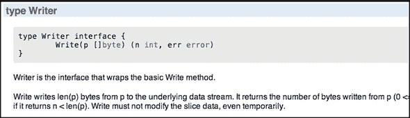
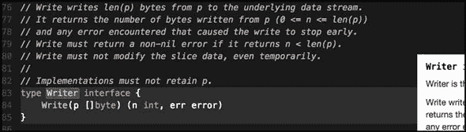
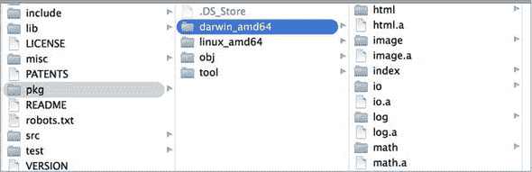

## 第八章\. 标准库

*本章*

+   编写输出和日志信息

+   解码和编码 JSON

+   与 IO 和数据流一起工作

+   标准库中包之间的互操作性

什么是 *Go 标准库* 以及为什么它很重要？Go 标准库是一组核心包，它增强并扩展了语言的功能。这些包增加了你可以编写的不同类型程序的数量，而无需构建自己的包或下载他人发布的包。由于这些包与语言绑定，它们提供了一些特殊的保证：

+   它们将始终存在于语言的每个小版本中。

+   他们将遵守向后兼容性的承诺。

+   它们是 Go 的开发、构建和发布过程的一部分。

+   它们由 Go 贡献者维护和审查。

+   它们会随着语言每个新版本的发布进行测试和基准测试。

这些保证使标准库变得特殊，并且你希望尽可能多地利用它。通过使用标准库中的包，你可以更容易地管理你的代码，并确保其可靠性。这是因为你不必担心程序在发布周期之间是否会崩溃，也不必管理第三方依赖。

如果标准库不包含所有这些优秀的包，所有这些好处都将毫无意义。社区中的 Go 开发者比其他语言更依赖这些包。这是因为它们设计得很好，并且提供了比传统标准库中通常找到的功能更多。最终，Go 社区依赖于标准库来完成许多其他语言中的开发者不做的事情，例如网络、HTTP、图像处理和密码学。

在本章中，我们将从高层次的角度审视当前属于标准库的包集。然后我们将更详细地探讨三个对许多不同程序都很有用的包：`log`、`json` 和 `io`。这些包也展示了 Go 提供的一些优秀功能。

### 8.1\. 文档和源代码

标准库中包含的包如此之多，以至于在一章的范围内不可能全部涵盖。目前，有超过 100 个包组织在 38 个类别中。

##### 列表 8.1\. 标准库中的顶级文件夹和包集

```
archive   bufio      bytes     compress   container   crypto    database
debug     encoding   errors    expvar     flag        fmt       go
hash      html       image     index      io          log       math
mime      net        os        path       reflect     regexp    runtime
sort      strconv    strings   sync       syscall     testing   text
time      unicode    unsafe
```

列表 8.1 中的许多类别本身也是包。要获取详细描述和查看所有可用的包，Go 团队在 Go 网站上维护了文档，网址为 [`golang.org/pkg/`](http://golang.org/pkg/)。

`golang` 网站的 `pkg` 部分提供了每个包的 `godoc` 文档。图 8.1 展示了 `golang` 网站上 `io` 包的包文档示例。

##### 图 8.1\. golang.org/pkg/io/#Writer



如果您想要可以交互的文档，Sourcegraph 已经索引了标准库以及包含 Go 代码的许多公共仓库的所有代码。图 8.2 展示了在 Sourcegraph 网站上(`https://sourcegraph.com/`)的`io`包的包文档示例。

##### 图 8.2\. sourcegraph.com/code.google.com/p/go/.GoPackage/io/.def/Writer



无论您如何安装 Go，标准库的所有源代码都可以在您的开发机器上的$GOROOT/src/pkg 文件夹中找到。拥有标准库的源代码对于 Go 工具的正常工作非常重要。像`godoc`、`gocode`甚至`go build`这样的工具会读取这些源代码以执行其功能。如果这些源代码不在您的机器上，并且无法通过`$GOROOT`变量访问，那么在尝试构建您的程序时您将遇到错误。

标准库的源代码作为 Go 发行版包的一部分预先编译。这些预先编译的文件，称为*归档文件*，可以在您安装的每个目标平台和操作系统的$GOROOT/pkg 文件夹中找到。在图 8.3 中，您可以看到具有.a 扩展名的文件，这些就是归档文件。

##### 图 8.3\. pkg 文件夹内归档文件视图



这些文件是特殊的静态 Go 库，Go 构建工具在编译和链接您的最终程序时创建和使用它们。这有助于构建过程更快。但在执行构建时无法指定这些文件，因此您无法共享它们。Go 工具知道何时可以使用现有的.a 文件，何时需要从您机器上的源代码重新构建一个。

在建立这样的背景知识之后，让我们来看看标准库中的几个包，并看看您如何在您的程序中消费它们。

### 8.2\. 记录日志

您的程序有错误，即使它们还没有表现出来。这就是软件开发的本性。记录日志是一种找到这些错误并了解更多关于您的程序如何运行的方法。日志可以是您的眼睛和耳朵，提供代码跟踪、分析和性能分析。考虑到这一点，标准库提供了一个日志包，它可以与一些基本配置一起使用。您还可以创建自定义日志记录器以实现您自己的特定日志需求。

日志记录在 UNIX 中有着悠久的历史，这一点也延续到了`log`包中。传统的 CLI（命令行界面）程序将它们的输出写入`stdout`设备。这个设备存在于所有操作系统上，是标准文本输出的默认目的地。默认情况下，终端被配置为显示写入此设备的内容。使用这个单一目的地工作得很好，直到你有一个需要同时写入输出和程序功能细节的程序。当你想要写入日志信息时，你希望将其写入不同的目的地，这样你的输出和日志就不会混合在一起。

为了解决这个问题，UNIX 架构师添加了一个名为`stderr`的设备。这个设备被创建为日志的默认目的地。它允许开发者将程序的输出与日志分离。为了用户在运行程序时能够看到输出和日志，终端控制台被配置为显示写入`stdout`和`stderr`的内容。但是，如果你的程序只写入日志，那么将一般日志信息写入`stdout`，错误或警告写入`stderr`是常见的做法。

#### 8.2.1. 日志包

在你学习如何创建自己的自定义日志记录器之前，让我们先看看`log`包提供的基功能。日志记录的目的是获取程序正在做什么、在哪里发生以及何时发生的跟踪信息。这是你可以通过一些配置写入每条日志行的一些信息。

##### 列表 8.2. 样本跟踪行

```
TRACE: 2009/11/10 23:00:00.000000 /tmpfs/gosandbox-/prog.go:14: message
```

在列表 8.2 中，你可以看到一个由`log`包生成的日志条目。这个日志条目包含一个前缀、一个日期时间戳、写入日志的源代码的完整路径、执行写入操作的代码行，以及最后的信息。让我们看看一个允许你配置`log`包以写入此类行的程序。

##### 列表 8.3. listing03.go

```
01 // This sample program demonstrates how to use the base log package.
02 package main
03
04 import (

05     "log"
06 )
07
08 func init() {
09     log.SetPrefix("TRACE: ")
10     log.SetFlags(log.Ldate | log.Lmicroseconds | log.Llongfile)
11 }
12
13 func main() {
14     // Println writes to the standard logger.
15     log.Println("message")
16
17     // Fatalln is Println() followed by a call to os.Exit(1).
18     log.Fatalln("fatal message")
19
20     // Panicln is Println() followed by a call to panic().
21     log.Panicln("panic message")
22 }
```

如果你从列表 8.3 运行程序，你应该会得到与列表 8.2 相似的输出。让我们分解代码，看看它是如何工作的。

##### 列表 8.4. listing03.go: 第 08-11 行

```
08 func init() {
09     log.SetPrefix("TRACE: ")
10     log.SetFlags(log.Ldate | log.Lmicroseconds | log.Llongfile)
11 }
```

在第 08 至 11 行，我们有一个名为`init()`的函数。这个函数作为程序初始化的一部分在`main()`之前执行。在`init()`中设置日志配置是常见的做法，这样程序启动时就可以立即使用`log`包。在我们的程序中，第 09 行设置了用作每行前缀的字符串。这个字符串应该是一个可以让你识别出日志行而不是普通程序输出的字符串。传统上，这个字符串是用大写字母书写的。

与`log`包相关联有几个标志，它们控制可以写入每行日志的其他信息。以下列表显示了当前存在的标志。

##### 列表 8.5. golang.org/src/log/log.go

```
const (
  // Bits or'ed together to control what's printed. There is no control
  // over the order they appear (the order listed here) or the format
  // they present (as described in the comments).  A colon appears after
  // these items:
  //    2009/01/23 01:23:23.123123 /a/b/c/d.go:23: message

  // the date: 2009/01/23
  Ldate = 1 << iota

  // the time: 01:23:23

  Ltime

  // microsecond resolution: 01:23:23.123123\. assumes Ltime
  Lmicroseconds

  // full file name and line number: /a/b/c/d.go:23
  Llongfile

  // final file name element and line number: d.go:23
  // overrides Llongfile
  Lshortfile

  // initial values for the standard logger
  LstdFlags = Ldate | Ltime
)
```

列表 8.5 直接来自 `log` 包的源代码。这些标志被声明为常量，并且在这个块中的第一个常量被称作 `Ldate`，它使用特殊的语法声明。

##### 列表 8.6\. `Ldate` 常量的声明

```
// the date: 2009/01/23
  Ldate = 1 << iota
```

当涉及到声明一组常量时，`iota` 关键字具有特殊用途。它指示编译器对每个常量重复表达式，直到块结束或找到赋值语句。`iota` 关键字的另一个功能是，每个先前常量的 `iota` 值会增加 1，初始值为 0。让我们更仔细地看看这一点。

##### 列表 8.7\. 关键字 `iota` 的使用

```
const (
  Ldate = 1 << iota  // 1 << 0 = 000000001 = 1
  Ltime              // 1 << 1 = 000000010 = 2
  Lmicroseconds      // 1 << 2 = 000000100 = 4
  Llongfile          // 1 << 3 = 000001000 = 8
  Lshortfile         // 1 << 4 = 000010000 = 16
  ...
)
```

列表 8.7 展示了常量声明背后的操作。`<<` 操作符执行操作符左侧值表示的位的左移位操作。在每种情况下，值为 1 的位模式都被移位到 `iota` 位置。这起到了为每个常量赋予其独特位位置的作用，这在处理标志时是完美的。

`LstdFlags` 常量显示了为什么每个常量都有其独特的位位置背后的目的。

##### 列表 8.8\. `LstdFlags` 常量的声明

```
const (
  ...
  LstdFlags = Ldate(1) | Ltime(2) = 00000011 = 3
)
```

在 列表 8.8 中，你可以看到 `LstdFlags` 常量由于使用了赋值运算符而中断了 `iota` 链。`LstdFlags` 常量被赋予了值 `3`，这得益于管道操作符 (`|`) 用于进行位或操作。位或操作相当于将位连接起来，因此每个单独设置的位在最终值中都有所表示。当位 1 和 2 进行或操作时，它们形成值 `3`。

让我们再次看看我们如何设置我们想要应用的日志标志。

##### 列表 8.9\. listing03.go: 行 08–11

```
08 func init() {
09     ...
10     log.SetFlags(log.Ldate | log.Lmicroseconds | log.Llongfile)
11 }
```

在这里，我们将 `Ldate`、`Lmicroseconds` 和 `Llongfile` 标志一起管道化，并将该操作的值传递给 `SetFlags` 函数。这些标志一起管道化时，代表值 `13` 和位 4、3 和 1（00001101）。由于每个常量代表一个单独的位，因此可以使用管道操作符将标志连接起来，以创建一个表示我们想要应用的所有日志选项的值。然后，`log` 包会检查我们传递的整数值，以确定哪些位被设置，从而应用我们请求的正确属性。

在初始化 `log` 包之后，你可以查看 `main()` 函数，了解如何写入消息。

##### 列表 8.10\. listing03.go: 行 13–22

```
13 func main() {
14     // Println writes to the standard logger.
15     log.Println("message")
16
17     // Fatalln is Println() followed by a call to os.Exit(1).
18     log.Fatalln("fatal message")
19
20     // Panicln is Println() followed by a call to panic().
21     log.Panicln("panic message")
22 }
```

列表 8.10 展示了如何使用三个不同的函数：`Println`、`Fatalln` 和 `Panicln` 来写入日志消息。这些函数也有一个格式版本，以字母 `f` 结尾而不是 `ln`。`Fatal` 函数族用于写入日志消息并使用 `os.Exit(1)` 函数调用终止程序。`Panic` 函数族用于写入日志消息并引发恐慌，除非恢复，否则将导致程序终止并显示堆栈跟踪。`Print` 函数族是写入日志消息的标准方式。

`log` 包的一个优点是日志记录器是多 goroutine 安全的。这意味着多个 goroutine 可以同时从同一个日志记录器值调用这些函数，而不会相互冲突。标准日志记录器和您可能创建的任何自定义日志记录器都将具有此属性。

现在您已经知道了如何使用 `log` 包并对其进行配置，让我们探索如何创建自定义日志记录器，这样您就可以拥有不同日志级别，并将日志写入不同的目的地。

#### 8.2.2\. 自定义日志记录器

创建自定义日志记录器需要您创建自己的 `Logger` 类型值。您创建的每个日志记录器都可以配置为独特的目的地，并设置其自己的前缀和标志。让我们看看一个示例程序，该程序创建不同的 `Logger` 类型指针变量以支持不同的日志级别。

##### 列表 8.11\. listing11.go

```
01 // This sample program demonstrates how to create customized loggers.
02 package main
03
04 import (
05     "io"
06     "io/ioutil"
07     "log"
08     "os"
09 )
10
11 var (
12     Trace   *log.Logger // Just about anything
13     Info    *log.Logger // Important information
14     Warning *log.Logger // Be concerned
15     Error   *log.Logger // Critical problem
16 )
17
18 func init() {
19     file, err := os.OpenFile("errors.txt",
20         os.O_CREATE|os.O_WRONLY|os.O_APPEND, 0666)
21     if err != nil {
22         log.Fatalln("Failed to open error log file:", err)
23     }
24
25     Trace = log.New(ioutil.Discard,
26         "TRACE: ",
27         log.Ldate|log.Ltime|log.Lshortfile)
28
29     Info = log.New(os.Stdout,
30         "INFO: ",
31         log.Ldate|log.Ltime|log.Lshortfile)
32

33     Warning = log.New(os.Stdout,
34         "WARNING: ",
35         log.Ldate|log.Ltime|log.Lshortfile)
36
37     Error = log.New(io.MultiWriter(file, os.Stderr),
38         "ERROR: ",
39         log.Ldate|log.Ltime|log.Lshortfile)
40 }
41
42 func main() {
43     Trace.Println("I have something standard to say")
44     Info.Println("Special Information")
45     Warning.Println("There is something you need to know about")
46     Error.Println("Something has failed")
47 }
```

列表 8.11 展示了一个完整的程序，该程序创建了四个不同的 `Logger` 类型指针变量。它们的名称分别是 `Trace`、`Info`、`Warning` 和 `Error`。每个变量都根据其重要性进行了不同的配置。让我们分解代码，以便您可以了解这一切是如何工作的。

在第 11 至 16 行，我们声明了四个 `Logger` 类型指针变量，用于我们的不同日志级别。

##### 列表 8.12\. listing11.go: 行 11–16

```
11 var (
12     Trace   *log.Logger // Just about anything
13     Info    *log.Logger // Important information
14     Warning *log.Logger // Be concerned
15     Error   *log.Logger // Critical problem
16 )
```

在 列表 8.12 中，您可以看到 `Logger` 类型指针变量的声明。我们为每个日志记录器分配了一个简短但描述性的变量名。接下来，让我们看看 `init()` 函数中的代码，该代码创建并分配每个 `Logger` 类型值的地址给每个变量。

##### 列表 8.13\. listing11.go: 行 25–39

```
25     Trace = log.New(ioutil.Discard,
26         "TRACE: ",
27         log.Ldate|log.Ltime|log.Lshortfile)
28
29     Info = log.New(os.Stdout,
30         "INFO: ",
31         log.Ldate|log.Ltime|log.Lshortfile)
32
33     Warning = log.New(os.Stdout,
34         "WARNING: ",
35         log.Ldate|log.Ltime|log.Lshortfile)
36
37     Error = log.New(io.MultiWriter(file, os.Stderr),
38         "ERROR: ",
39         log.Ldate|log.Ltime|log.Lshortfile)
```

要创建每个日志记录器，我们使用来自 `log` 包的 `New` 函数，该函数创建一个正确初始化的 `Logger` 类型值。`New` 函数返回新创建值的地址。在 `New` 函数可以创建值之前，我们需要传递一些参数。

##### 列表 8.14\. golang.org/src/log/log.go

```
// New creates a new Logger. The out variable sets the
// destination to which log data will be written.
// The prefix appears at the beginning of each generated log line.
// The flag argument defines the logging properties.
func New(out io.Writer, prefix string, flag int) *Logger {
    return &Logger{out: out, prefix: prefix, flag: flag}
}
```

列表 8.14 展示了来自 `log` 包源代码的 `New` 函数的声明。第一个参数是我们希望日志记录器写入的目的地。这是一个实现了 `io.Writer` 接口的价值。第二个参数是您之前看到的那个前缀，日志标志是最后一个参数。

在我们的程序中，`Trace` 记录器使用 `ioutil` 包中的 `Discard` 变量作为写入目标。

##### 列表 8.15\. listing11.go: 行 25–27

```
25     Trace = log.New(ioutil.Discard,
26         "TRACE: ",
27         log.Ldate|log.Ltime|log.Lshortfile)
```

`Discard` 变量有一些非常有趣的属性。

##### 列表 8.16\. golang.org/src/io/ioutil/ioutil.go

```
// devNull is a named type using int as its base type.
type devNull int

// Discard is an io.Writer on which all Write calls succeed
// without doing anything.
var Discard io.Writer = devNull(0)

// Implementation of the io.Writer interface.
func (devNull) Write(p []byte) (int, error) {
    return len(p), nil
}
```

列表 8.16 展示了 `Discard` 变量的声明及其周围的实现。`Discard` 变量被声明为接口类型 `io.Writer`，并赋予了一个类型为 `devNull` 的 `0` 值。任何写入此变量的内容都将根据 `devNull` 类型的 `Write` 方法实现被丢弃。使用 `Discard` 变量是一种技术，可以在不需要该级别的输出时禁用日志级别。

`Info` 和 `Warning` 记录器都使用 `stdout` 目标。

##### 列表 8.17\. listing11.go: 行 29–35

```
29     Info = log.New(os.Stdout,
30         "INFO: ",
31         log.Ldate|log.Ltime|log.Lshortfile)
32
33     Warning = log.New(os.Stdout,
34         "WARNING: ",
35         log.Ldate|log.Ltime|log.Lshortfile)
```

`Stdout` 变量的声明也很有趣。

##### 列表 8.18\. golang.org/src/os/file.go

```
// Stdin, Stdout, and Stderr are open Files pointing to the standard
// input, standard output, and standard error file descriptors.
var (
    Stdin  = NewFile(uintptr(syscall.Stdin), "/dev/stdin")
    Stdout = NewFile(uintptr(syscall.Stdout), "/dev/stdout")
    Stderr = NewFile(uintptr(syscall.Stderr), "/dev/stderr")
)

os/file_unix.go

// NewFile returns a new File with the given file descriptor and name.
func NewFile(fd uintptr, name string) *File {
```

在 列表 8.18 中，你可以看到代表所有操作系统上存在的标准目标的三变量声明：`Stdin`、`Stdout` 和 `Stderr`。所有这些变量都被声明为 `File` 类型的指针，该类型实现了 `io.Writer` 接口。这使我们来到了最终的记录器，`Error`。

##### 列表 8.19\. listing11.go: 行 37–39

```
37     Error = log.New(io.MultiWriter(file, os.Stderr),
38         "ERROR: ",
39         log.Ldate|log.Ltime|log.Lshortfile)
```

在 列表 8.19 中，你可以看到 `New` 函数的第一个参数来自 `io` 包中的一个特殊函数，称为 `MultiWriter`。

##### 列表 8.20\. `io` 包中 `MultiWriter` 函数的声明

```
io.MultiWriter(file, os.Stderr)
```

列表 8.20 将对 `MultiWriter` 函数的调用隔离出来，该函数返回一个包含我们打开的文件和 `stderr` 目标的 `io.Writer` 接口类型值。`MultiWriter` 函数是一个可变参数函数，接受任何实现 `io.Writer` 接口值的数量。该函数返回一个单一的 `io.Writer` 值，它捆绑了所有传入的 `io.Writer` 值。这允许像 `log.New` 这样的函数在单个写入器中接受多个写入器。现在当我们使用 `Error` 记录器写入日志时，输出将被写入文件和 `stderr`。

现在你已经知道了如何创建自定义记录器，让我们看看如何使用它们来写入消息。

##### 列表 8.21\. listing11.go: 行 42–47

```
42 func main() {
43     Trace.Println("I have something standard to say")
44     Info.Println("Special Information")
45     Warning.Println("There is something you need to know about")
46     Error.Println("Something has failed")
47 }
```

列表 8.21 展示了 列表 8.11 中的 `main()` 函数。在第 43 到 46 行，我们为每个创建的记录器写入一条消息。每个记录器变量都包含一组与 `log` 包实现的功能相同的函数。

##### 列表 8.22\. 不同记录方法的声明

```
func (l *Logger) Fatal(v ...interface{})
func (l *Logger) Fatalf(format string, v ...interface{})
func (l *Logger) Fatalln(v ...interface{})
func (l *Logger) Flags() int
func (l *Logger) Output(calldepth int, s string) error
func (l *Logger) Panic(v ...interface{})
func (l *Logger) Panicf(format string, v ...interface{})
func (l *Logger) Panicln(v ...interface{})
func (l *Logger) Prefix() string
func (l *Logger) Print(v ...interface{})
func (l *Logger) Printf(format string, v ...interface{})
func (l *Logger) Println(v ...interface{})
func (l *Logger) SetFlags(flag int)
func (l *Logger) SetPrefix(prefix string)
```

列表 8.22 展示了为 `Logger` 类型实现的所有方法。

#### 8.2.3\. 结论

`log` 包是基于对日志目的的长期历史理解和实际应用而实现的。将输出写入 `stdout` 和将日志记录到 `stderr` 已成为许多基于 CLI 的程序的传统。但当你的程序只输出日志时，使用 `stdout`、`stderr` 和文件是完全可接受的。

标准库中的 `log` 包提供了你进行日志记录所需的一切，并且推荐使用。你可以信任其实现，不仅因为它属于标准库，而且还因为它被社区广泛使用。

### 8.3\. 编码/解码

许多应用程序，无论它们是使用数据库、进行网络调用还是在分布式系统中工作，都需要消费和发布数据。如果你的应用程序正在处理 XML 或 JSON，标准库中有名为 `xml` 和 `json` 的包，这些包使得处理这些数据格式变得非常简单。如果你有自己的数据格式需要编码和解码，这些包的实现是实施你自己的包的一个很好的路线图。

现在处理和使用 JSON 比处理 XML 更常见。这主要是因为使用 JSON 比使用 XML 需要更少的标记。这意味着每条消息需要发送的数据更少，这有助于系统的整体性能。此外，JSON 可以转换为 BSON（Binary JavaScript Object Notation），这进一步减少了每条消息的大小。鉴于这一点，我们将探讨如何在 Go 应用程序中消费和发布 JSON。但处理 XML 非常相似。

#### 8.3.1\. 解码 JSON

我们将探索的第一个与 JSON 一起工作的方面是使用 `json` 包中的 `NewDecoder` 函数和 `Decode` 方法。如果你正在从网络响应或文件中消费 JSON，这就是你想要使用的函数和方法。让我们看看一个使用 `http` 包执行针对返回 JSON 结果的 Google 搜索 API 的 `Get` 请求的示例。下一个列表显示了响应的外观。

##### 列表 8.23\. Google 搜索 API 示例 JSON 响应

```
{
    "responseData": {
        "results": [
            {
                "GsearchResultClass": "GwebSearch",
                "unescapedUrl": "https://www.reddit.com/r/golang",
                "url": "https://www.reddit.com/r/golang",
                "visibleUrl": "www.reddit.com",
                "cacheUrl": "http://www.google.com/search?q=cache:W...",
                "title": "r/\u003cb\u003eGolang\u003c/b\u003e - Reddit",
                "titleNoFormatting": "r/Golang - Reddit",
                "content": "First Open Source \u003cb\u003eGolang\u..."
            },
            {
                "GsearchResultClass": "GwebSearch",
                "unescapedUrl": "http://tour.golang.org/",
                "url": "http://tour.golang.org/",
                "visibleUrl": "tour.golang.org",
                "cacheUrl": "http://www.google.com/search?q=cache:O...",
                "title": "A Tour of Go",
                "titleNoFormatting": "A Tour of Go",
                "content": "Welcome to a tour of the Go programming ..."

            }
        ]
    }
}
```

下面是一个示例，它检索并解码响应到一个结构体类型。

##### 列表 8.24\. listing24.go

```
01 // This sample program demonstrates how to decode a JSON response
02 // using the json package and NewDecoder function.
03 package main
04
05 import (
06     "encoding/json"
07     "fmt"
08     "log"
09     "net/http"
10 )
11
12 type (
13     // gResult maps to the result document received from the search.
14     gResult struct {
15         GsearchResultClass string `json:"GsearchResultClass"`
16         UnescapedURL       string `json:"unescapedUrl"`
17         URL                string `json:"url"`
18         VisibleURL         string `json:"visibleUrl"`
19         CacheURL           string `json:"cacheUrl"`
20         Title              string `json:"title"`
21         TitleNoFormatting  string `json:"titleNoFormatting"`
22         Content            string `json:"content"`
23     }
24
25     // gResponse contains the top level document.
26     gResponse struct {
27         ResponseData struct {
28             Results []gResult `json:"results"`
29         } `json:"responseData"`
30     }
31 )
32
33 func main() {
34     uri := "http://ajax.googleapis.com/ajax/services/search/web?
                                                  v=1.0&rsz=8&q=golang"
35
36     // Issue the search against Google.
37     resp, err := http.Get(uri)
38     if err != nil {
39        log.Println("ERROR:", err)
40        return
41     }
42     defer resp.Body.Close()
43
44     // Decode the JSON response into our struct type.
45     var gr gResponse
46     err = json.NewDecoder(resp.Body).Decode(&gr)

47     if err != nil {
48         log.Println("ERROR:", err)
49         return
50     }
51
52     fmt.Println(gr)
53 }
```

在 listing 8.24 中的第 37 行的代码显示了一个程序，该程序执行 HTTP `Get` 调用以从 Google 获取 JSON 文档。然后，在第 46 行使用 `NewDecoder` 函数和 `Decode` 方法，将响应中的 JSON 文档解码到第 26 行声明的结构体类型的变量中。在第 52 行，变量的值被写入 `stdout`。

如果你查看第 26 行和第 14 行的 `gResponse` 和 `gResult` 的类型声明，你会注意到每个字段末尾都声明了字符串。这些被称为 *标签*，它们是提供 JSON 文档和结构体类型之间字段映射元数据的机制。如果没有标签，解码和编码过程将尝试以不区分大小写的方式直接匹配字段名称。当无法进行映射时，结构体值中的字段将包含其零值。

感谢标准库，执行 HTTP `Get` 调用和将 JSON 解码为结构体类型的所有技术细节都由它处理。让我们看看 `NewDecoder` 函数和 `Decode` 方法的声明。

##### 列表 8.25\. golang.org/src/encoding/json/stream.go

```
// NewDecoder returns a new decoder that reads from r.
//
// The decoder introduces its own buffering and may
// read data from r beyond the JSON values requested.
func NewDecoder(r io.Reader) *Decoder

// Decode reads the next JSON-encoded value from its
// input and stores it in the value pointed to by v.
//
// See the documentation for Unmarshal for details about
// the conversion of JSON into a Go value.
func (dec *Decoder) Decode(v interface{}) error
```

在 列表 8.25 中，你可以看到 `NewDecoder` 函数接受任何实现了 `io.Reader` 接口类型的值。在下一节中，你将了解更多关于 `io.Reader` 和 `io.Writer` 接口的内容。现在，理解标准库中的许多不同类型实现了这些接口，包括来自 `http` 包的类型。当类型实现这些特定接口时，你将获得许多免费的支持和功能。

`NewDecoder` 函数返回一个类型为 `Decoder` 的指针值。由于 Go 支持复合语句调用，`NewDecoder` 函数的返回值可以直接用来调用 `Decode` 方法，而不需要先声明一个变量。在 列表 8.25 中，你可以看到 `Decode` 方法接受一个类型为 `interface{}` 的值，并返回一个错误。

如 第五章 所述，空接口是每个类型都实现的接口。这意味着 `Decode` 方法可以接受任何类型的值。通过使用反射，`Decode` 方法将检查你传递的值的类型信息。然后，当它读取 JSON 响应时，它将解码响应到该类型的值。这意味着你不需要自己创建值；`Decode` 可以为你完成这项工作。

##### 列表 8.26\. `Decode` 方法的使用

```
var gr *gResponse
err = json.NewDecoder(resp.Body).Decode(&gr)
```

在 列表 8.26 中，我们将类型为 `gResponse` 的指针变量的地址（值为 `nil`）传递给 `Decode` 方法。方法调用后，指针变量的值将被分配一个类型为 `gResponse` 的值，并根据正在解码的 JSON 文档进行初始化。

有时你正在处理的 JSON 文档以 `string` 值的形式出现。在这些情况下，你需要将 `string` 转换为 `byte` 切片 (`[]byte`)，并使用 `json` 包中的 `Unmarshal` 函数。

##### 列表 8.27\. listing27.go

```
01 // This sample program demonstrates how to decode a JSON string.
02 package main
03
04 import (
05     "encoding/json"
06     "fmt"
07     "log"
08 )
09
10 // Contact represents our JSON string.
11 type Contact struct {
12     Name    string `json:"name"`
13     Title   string `json:"title"`
14     Contact struct {
15         Home string `json:"home"`
16         Cell string `json:"cell"`
17     } `json:"contact"`
18 }
19
20 // JSON contains a sample string to unmarshal.
21 var JSON = `{
22     "name": "Gopher",
23     "title": "programmer",
24     "contact": {
25         "home": "415.333.3333",
26         "cell": "415.555.5555"

27     }
28 }`
29
30 func main() {
31     // Unmarshal the JSON string into our variable.
32     var c Contact
33     err := json.Unmarshal([]byte(JSON), &c)
34     if err != nil {
35         log.Println("ERROR:", err)
36         return
37     }
38
39     fmt.Println(c)
40 }
```

在 列表 8.27 中，我们有一个示例，它将一个 JSON 文档放在一个 `string` 变量中，并使用 `Unmarshal` 函数将 JSON 解码为结构体类型的值。如果你运行程序，你会得到以下输出。

##### 列表 8.28\. listing27.go 的输出

```
{Gopher programmer {415.333.3333 415.555.5555}}
```

有时无法声明一个结构体类型，你需要更多的灵活性来处理 JSON 文档。在这些情况下，你可以将 JSON 文档解码或反序列化为 `map` 变量。

##### 列表 8.29\. listing29.go

```
01 // This sample program demonstrates how to decode a JSON string.
02 package main
03
04 import (
05     "encoding/json"
06     "fmt"
07     "log"
08 )
09
10 // JSON contains a sample string to unmarshal.
11 var JSON = `{
12     "name": "Gopher",
13     "title": "programmer",
14     "contact": {
15         "home": "415.333.3333",
16         "cell": "415.555.5555"
17     }
18 }`
19
20 func main() {
21     // Unmarshal the JSON string into our map variable.
22     var c map[string]interface{}
23     err := json.Unmarshal([]byte(JSON), &c)
24     if err != nil {

25         log.Println("ERROR:", err)
26         return
27     }
28
29     fmt.Println("Name:", c["name"])
30     fmt.Println("Title:", c["title"])
31     fmt.Println("Contact")
32     fmt.Println("H:", c["contact"].(map[string]interface{})["home"])
33     fmt.Println("C:", c["contact"].(map[string]interface{})["cell"])
34 }
```

在 列表 8.29 中，我们将程序从 列表 8.27 更改为使用 `map` 变量而不是我们的结构体类型变量。`map` 变量被声明为一个具有 `string` 类型键和 `interface{}` 类型值的映射。这意味着 `map` 可以为任何给定的键存储任何类型的值。虽然这在你处理 JSON 文档时提供了很大的灵活性，但它有一个小的缺点。看看访问 `contact` 子文档中的 `home` 字段的语法要求。

##### 列表 8.30\. 从反序列化映射中访问字段的语法

```
fmt.Println("\tHome:", c["contact"].(map[string]interface{})["home"])
```

因为每个键的值都是 `interface{}` 类型，你需要将值转换为适当的原生类型才能与该值一起工作。列表 8.30 展示了你需要如何将 `contact` 键的值转换为另一个具有 `string` 类型键和 `interface{}` 类型值的映射。这可能会使得使用包含 JSON 文档的映射变得不友好。但是，如果你从未需要深入挖掘你正在处理的 JSON 文档，或者你计划进行很少的修改，使用 `map` 可以更快，而且不需要声明新的类型。

#### 8.3.2\. 编码 JSON

我们将要探索的与 JSON 一起工作的第二个方面是使用 `json` 包中的 `MarshalIndent` 函数。当你想从 Go `map` 或 `struct` 类型值发布格式化的 JSON 文档时，这非常有用。*序列化*是将数据转换为 JSON 字符串的过程。以下是一个将 `map` 类型转换为 JSON 字符串的示例。

##### 列表 8.31\. listing31.go

```
01 // This sample program demonstrates how to marshal a JSON string.
02 package main
03
04 import (
05     "encoding/json"
06     "fmt"
07     "log"
08 )
09
10 func main() {

11     // Create a map of key/value pairs.
12     c := make(map[string]interface{})
13     c["name"] = "Gopher"
14     c["title"] = "programmer"
15     c["contact"] = map[string]interface{}{
16         "home": "415.333.3333",
17         "cell": "415.555.5555",
18     }
19
20     // Marshal the map into a JSON string.
21     data, err := json.MarshalIndent(c, "", "    ")
22     if err != nil {
23         log.Println("ERROR:", err)
24         return
25     }
26
27     fmt.Println(string(data))
28 }
```

列表 8.31 展示了如何使用 `json` 包中的 `MarshalIndent` 函数将 `map` 转换为 `JSON` 字符串。`MarshalIndent` 函数返回一个表示 JSON 字符串的字节切片和一个错误值。以下是对 `json` 包中 `MarshalIndent` 函数声明的查看。

##### 列表 8.32\. golang.org/src/encoding/json/encode.go

```
// MarshalIndent is like Marshal but applies Indent to format the output
func MarshalIndent(v interface{}, prefix, indent string)
                                                       ([]byte, error) {
```

你可以在 `MarshalIndent` 函数的参数中再次看到空接口类型的使用。`MarshalIndent` 函数使用反射来确定如何将 `map` 类型转换为 JSON 字符串。

如果你不需要为你的 JSON 编码使用漂亮的打印格式，`json` 包还提供了一个名为 `Marshal` 的函数。这个函数非常适合生成可以返回在网络响应中，如 Web API 的 JSON。`Marshal` 函数的工作方式与 `MarshalIndent` 函数相同，但没有 `prefix` 和 `indent` 参数。

#### 8.3.3\. 结论

如果你正在处理 JSON 或甚至 XML，标准库已经为你提供了解码、反序列化和序列化这些格式数据的所有支持。随着 Go 的每个新版本发布，这些包变得越来越快，使得使用 JSON 和 XML 成为一种很好的选择。多亏了反射包和标签支持，声明 `struct` 类型并将这些字段映射到你需要消费和发布的文档字段变得非常容易。由于 `json` 和 `xml` 包为 `io.Reader` 和 `io.Writer` 接口提供了支持，所以你的 JSON 和 XML 文档来自哪里并不重要。所有支持都已提供，使得处理 JSON 和 XML 变得轻松愉快。

### 8.4. 输入和输出

UNIX 基础操作系统之所以如此出色，其中一个原因就是程序输出可以作为另一个程序的输入。这种理念创造了一系列只做一件事并且做得非常好的简单程序。然后，通过组合程序，可以创建脚本来完成一些惊人的事情。在这个世界中，`stdout` 和 `stdin` 设备作为在进程之间移动数据的通道。

这个同样的想法也被扩展到了 `io` 包中，它提供的功能非常出色。无论数据是什么，来自哪里，还是去向何方，该包都支持非常高效地处理数据流。你不再有 `stdout` 和 `stdin`，而是有两个接口，称为 `io.Writer` 和 `io.Reader`。实现这些接口的类型值可以用于 `io` 包提供的所有功能，或者任何其他包中接受这些接口类型值的函数和方法。这就是从接口类型创建功能和 API 的真正美妙之处。开发者可以在现有功能之上进行组合，利用现有功能，并专注于他们试图解决的商业问题。

在这个前提下，让我们首先看看 `io.Writer` 和 `io.Reader` 接口的声明，然后检查一些展示 `io` 包惊人功能的代码示例。

#### 8.4.1. 写入器和读取器接口

`io` 包的设计是围绕处理实现 `io.Writer` 和 `io.Reader` 接口类型的值。组成 `io` 包的函数和方法对数据的类型以及数据是如何物理上读取和写入的没有任何理解。这得益于 `io.Writer` 和 `io.Reader` 接口提供的抽象。让我们首先看看 `io.Writer` 接口的声明。

##### 列表 8.33. `io.Writer` 接口的声明

```
type Writer interface {
        Write(p []byte) (n int, err error)
}
```

列表 8.33 展示了`io.Writer`接口的声明。该接口声明了一个名为`Write`的单个方法，它接受一个`byte`切片并返回两个值。第一个值是写入的字节数，第二个值是一个`error`。实现此方法的规则如下。

##### 列表 8.34\. `io.Writer`接口的文档

```
Write writes len(p) bytes from p to the underlying data stream. It
returns the number of bytes written from p (0 <= n <= len(p)) and any
error encountered that caused the write to stop early. Write must
return a non-nil error if it returns n < len(p). Write must not modify
the slice data, even temporarily.
```

列表 8.34 中的规则来自标准库。这意味着`Write`方法的实现应该尝试写入传入的`byte`切片的整个长度。如果不可能，则该方法必须返回一个错误。报告为写入的字节数可以小于`byte`切片的长度，但不能更多。最后，`byte`切片在任何情况下都不能被修改。

让我们看看`Reader`接口的声明。

##### 列表 8.35\. `io.Reader`接口的声明

```
type Reader interface {
        Read(p []byte) (n int, err error)
}
```

列表 8.35 中的`io.Reader`接口声明了一个名为`Read`的单个方法，它接受一个`byte`切片并返回两个值。第一个值是读取的字节数，第二个值是一个`error`。实现此方法的规则如下。

##### 列表 8.36\. `io.Reader`接口的文档

```
(1) Read reads up to len(p) bytes into p. It returns the number of bytes
read (0 <= n <= len(p)) and any error encountered. Even if Read returns
n < len(p), it may use all of p as scratch space during the call. If
some data is available but not len(p) bytes, Read conventionally
returns what is available instead of waiting for more.

(2) When Read encounters an error or end-of-file condition after
successfully reading n > 0 bytes, it returns the number of bytes read.
It may return the (non-nil) error from the same call or return the
error (and n == 0) from a subsequent call. An instance of this general
case is that a Reader returning a non-zero number of bytes at the end
of the input stream may return either err == EOF or err == nil. The next
Read should return 0, EOF regardless.

(3) Callers should always process the n > 0 bytes returned before
considering the error err. Doing so correctly handles I/O errors that
happen after reading some bytes and also both of the allowed EOF
behaviors.

(4) Implementations of Read are discouraged from returning a zero byte
count with a nil error, and callers should treat that situation as a
no-op.
```

标准库中列出了关于实现`Read`方法的四个规则。第一条规则指出，实现应该尝试读取传入的`byte`切片的整个长度。读取少于整个长度是可以的，如果调用时没有那么多数据，则不需要等待读取整个长度。

第二条规则提供了关于文件结束（EOF）读取条件的指导。当读取最后一个字节时，有两种选择。`Read`方法要么返回带有正确计数的最终字节和`EOF`作为错误值，要么返回带有正确计数的最终字节和`nil`作为错误值。在后一种情况下，下一次读取必须返回没有字节的计数为 0 和`EOF`作为错误值。

第三条规则是为那些发起`Read`调用的人提供的建议。每次`Read`方法返回字节时，应该首先处理这些字节，然后再检查 EOF 或其他错误值。最后，第四条规则要求`Read`方法的实现永远不要返回 0 字节读取计数和`nil`错误值。没有读取的字节应该始终返回一个错误。

现在你已经知道了`io.Writer`和`io.Reader`接口的样子以及它们应该如何表现，让我们看看一些如何在你的程序中使用这些接口和`io`包的例子。

#### 8.4.2\. 协同工作

这个例子展示了标准库中不同包是如何通过为实现`io.Writer`接口的类型提供支持而协同工作的。该例子使用了`bytes`、`fmt`和`os`包来缓冲、连接字符串并将字符串写入`stdout`。

##### 列表 8.37\. listing37.go

```
01 // Sample program to show how different functions from the
02 // standard library use the io.Writer interface.
03 package main
04
05 import (
06     "bytes"
07     "fmt"
08     "os"
09 )
10
11 // main is the entry point for the application.
12 func main() {
13     // Create a Buffer value and write a string to the buffer.
14     // Using the Write method that implements io.Writer.
15     var b bytes.Buffer
16     b.Write([]byte("Hello "))
17
18     // Use Fprintf to concatenate a string to the Buffer.
19     // Passing the address of a bytes.Buffer value for io.Writer.
20     fmt.Fprintf(&b, "World!")
21
22     // Write the content of the Buffer to the stdout device.
23     // Passing the address of a os.File value for io.Writer.
24     b.WriteTo(os.Stdout)
25 }
```

当你在 列表 8.37 中运行程序时，你会得到以下输出。

##### 列表 8.38\. listing37.go 的输出

```
Hello World!
```

该程序正在使用标准库中的三个包将 “Hello World!” 写入终端窗口。程序从第 15 行开始，声明了一个来自 `bytes` 包的 `Buffer` 类型变量，并将其初始化为其零值。在第 16 行创建了一个 `byte` 切片，并用字符串 `"Hello"` 初始化。`byte` 切片被传递到 `Write` 方法中，成为缓冲区的初始内容。

第 20 行使用 `fmt` 包中的 `Fprintf` 函数将字符串 `"World!"` 追加到缓冲区中。让我们看看 `Fprintf` 函数的声明。

##### 列表 8.39\. golang.org/src/fmt/print.go

```
// Fprintf formats according to a format specifier and writes to w. It
// returns the number of bytes written and any write error encountered.
func Fprintf(w io.Writer, format string, a ...interface{})
                                                     (n int, err error)
```

需要注意的重要一点是 `Fprintf` 函数的第一个参数。它接受实现了 `io.Writer` 接口类型的值。这意味着 `bytes` 包中的 `Buffer` 类型必须实现此接口，因为我们能够通过传递该类型变量的地址。在 `bytes` 包的源代码中，我们应该找到为 `Buffer` 类型声明的 `Write` 方法。

##### 列表 8.40\. golang.org/src/bytes/buffer.go

```
// Write appends the contents of p to the buffer, growing the buffer
// as needed. The return value n is the length of p; err is always
// nil. If the buffer becomes too large, Write will panic with ...
func (b *Buffer) Write(p []byte) (n int, err error) {
    b.lastRead = opInvalid
    m := b.grow(len(p))
    return copy(b.buf[m:], p), nil
}
```

列表 8.40 展示了实现了 `io.Writer` 接口的 `Buffer` 类型的 `Write` 方法的当前实现。由于此方法的实现，我们可以将 `Buffer` 类型指针作为 `Fprintf` 的第一个参数传递。我们在示例中使用 `Fprintf` 函数通过 `Write` 方法的实现将字符串 `"World!"` 追加到 `Buffer` 类型变量的内部缓冲区中。

让我们回顾 列表 8.37 的最后一行，该行将整个缓冲区写入 `stdout`。

##### 列表 8.41\. listing37.go: 行 22–25

```
22 // Write the content of the Buffer to the stdout device.
23     // Passing the address of a os.File value for io.Writer.
24     b.WriteTo(os.Stdout)
25 }
```

在 列表 8.37 的第 24 行，`Buffer` 类型变量的内容使用 `WriteTo` 方法写入 `stdout`。此方法接受一个实现了 `io.Writer` 接口的对象。在我们的程序中，我们传递了来自 `os` 包的 `Stdout` 变量的值。

##### 列表 8.42\. golang.org/src/os/file.go

```
var (
    Stdin  = NewFile(uintptr(syscall.Stdin), "/dev/stdin")
    Stdout = NewFile(uintptr(syscall.Stdout), "/dev/stdout")
    Stderr = NewFile(uintptr(syscall.Stderr), "/dev/stderr")
)
```

这些变量的声明来自 `NewFile` 函数返回的类型。

##### 列表 8.43\. golang.org/src/os/file_unix.go

```
// NewFile returns a new File with the given file descriptor and name.
func NewFile(fd uintptr, name string) *File {
    fdi := int(fd)
    if fdi < 0 {
        return nil
    }
    f := &File{&file{fd: fdi, name: name}}
    runtime.SetFinalizer(f.file, (*file).close)
    return f
}
```

正如你在 列表 8.43 中看到的，`NewFile` 函数返回一个 `File` 类型的指针。这是 `Stdout` 变量的类型。由于我们可以将此类型的指针作为参数传递给 `WriteTo` 方法，因此它必须实现 `io.Writer` 接口。在 `os` 包的源代码中，我们应该找到 `Write` 方法。

##### 列表 8.44\. golang.org/src/os/file.go

```
// Write writes len(b) bytes to the File.
// It returns the number of bytes written and an error, if any.
// Write returns a non-nil error when n != len(b).
func (f *File) Write(b []byte) (n int, err error) {
    if f == nil {
        return 0, ErrInvalid
    }
    n, e := f.write(b)
    if n < 0 {
        n = 0
    }
    if n != len(b) {
        err = io.ErrShortWrite
    }

    epipecheck(f, e)

    if e != nil {

        err = &PathError{"write", f.name, e}
    }
    return n, err
}
```

确实，列表 8.44 展示了 `File` 类型指针的 `io.Writer` 接口实现。再次查看 列表 8.37 中的第 24 行。

##### 列表 8.45\. listing37.go: 行 22–25

```
22     // Write the content of the Buffer to the stdout device.
23     // Using the io.Writer implementation for os.File.
24     b.WriteTo(os.Stdout)
25 }
```

您可以看到，`WriteTo`方法能够将缓冲区的内容写入`stdout`，这导致字符串`"Hello World!"`在我们的终端窗口中显示。该方法将通过接口值使用`File`类型的`Write`方法实现。

这个例子展示了接口的美丽之处以及它们为语言带来的强大功能。多亏了`bytes.Buffer`和`os.File`类型对接口的实现，我们能够重用标准库中的功能，并使这些类型协同工作以实现解决方案。接下来，让我们看看一个更实用的例子。

#### 8.4.3. 简单的 curl

在 Linux 和 Mac OS X 系统上都可以找到一个名为`curl`的命令行工具。该工具允许您指定一个 URL，然后执行 HTTP 请求并保存内容。通过使用`http`、`io`和`os`包，您只需几行代码就可以编写自己的`curl`版本。

让我们看看一个实现`curl`基本版本的例子。

##### 列表 8.46. listing46.go

```
01 // Sample program to show how to write a simple version of curl using
02 // the io.Reader and io.Writer interface support.
03 package main
04
05 import (
06     "io"
07     "log"
08     "net/http"
09     "os"
10 )
11
12 // main is the entry point for the application.
13 func main() {
14     // r here is a response, and r.Body is an io.Reader.
15     r, err := http.Get(os.Args[1])

16     if err != nil {
17         log.Fatalln(err)
18     }
19
20     // Create a file to persist the response.
21     file, err := os.Create(os.Args[2])
22     if err != nil {
23         log.Fatalln(err)
24     }
25     defer file.Close()
26
27     // Use MultiWriter so we can write to stdout and
28     // a file on the same write operation.
29     dest := io.MultiWriter(os.Stdout, file)
30
31     // Read the response and write to both destinations.
32     io.Copy(dest, r.Body)
33     if err := r.Body.Close(); err != nil {
34         log.Println(err)
35     }
36 }
```

列表 8.46 展示了`curl`一个非常基础的实现，可以用来下载、显示和保存任何 HTTP `Get`请求的内容。该示例将同时将响应写入文件和`stdout`。为了保持示例的简洁，程序不会检查有效的命令行参数也不提供高级选项的开关。

在第 15 行，程序从命令行获取第一个参数并执行 HTTP `Get`操作。如果第一个参数是 URL 且没有错误，变量`r`将包含响应。在第 21 行，我们根据第二个命令行参数打开一个文件。如果我们成功打开文件，那么在第 25 行，我们使用`defer`语句安排关闭文件。

由于我们希望将请求内容同时写入`stdout`和我们的文件，所以在第 29 行，我们使用`io`包中的`MultiWriter`函数将文件和`stdout`值组合成一个单一的`io.Writer`值。在第 33 行，我们使用`io`包中的`Copy`函数从响应体中读取内容，并将其写入两个目的地。通过一次调用`Copy`，多亏了`MultiWriter`函数提供的值，我们可以使用单个调用将内容写入两个目的地。

由于`io`包已经提供的支持以及`http`和`os`包对`io.Writer`和`io.Reader`接口的实现，我们不需要编写任何代码来执行这些底层功能。我们可以利用已经存在的一切，只需专注于我们试图解决的问题。如果我们用自己的类型支持这些接口，我们将获得大量的免费功能。

#### 8.4.4. 结论

在`io`包中可以找到大量的功能，并且所有这些功能都可以通过实现`io.Writer`和`io.Reader`接口的类型值来访问。其他包，如`http`包，遵循类似的模式，将接口作为包 API 的一部分进行声明，并提供对使用`io`包的支持。花时间去探索标准库提供了什么以及它是如何实现的，不仅可以帮助你避免重复造轮子，还可以从语言设计者那里学习到为你的包和 API 编写惯用 Go 语言的方法。

### 8.5. 摘要

+   标准库提供了特殊的保证，并且被社区广泛使用。

+   使用标准库中的包可以更容易地管理和信任你的代码。

+   超过 100 个包被组织在 38 个不同的类别中。

+   标准库中的`log`包包含了你进行日志记录所需的一切。

+   标准库中有两个名为`xml`和`json`的包，它们使得处理这些数据格式变得非常简单。

+   `io`包支持非常高效地处理数据流。

+   接口允许你的代码与现有功能进行组合。

+   阅读标准库中的代码是了解惯用 Go 语言的好方法。
