## 第九章\. 测试和基准测试

*本章内容*

+   编写单元测试以验证你的代码

+   使用 httptest 模拟基于 HTTP 的请求和响应

+   使用示例代码记录你的包

+   使用基准测试检查性能

测试你的代码不是一件你应该等到程序开发完成后才去做的事情。使用 Go 的测试框架，单元测试和基准测试可以在开发过程中进行。就像 `go build` 命令一样，有一个 `go test` 命令可以执行你编写的显式测试代码。你只需要遵循一些指南，就可以无缝地将测试集成到你的项目和持续集成系统中。

### 9.1\. 单元测试

*单元测试* 是一个测试包或程序中特定代码片段或代码集的函数。测试的任务是确定针对给定场景，所讨论的代码是否按预期工作。一个场景可能是一个正向测试，测试确保代码的正常执行不会产生错误。这可能是一个验证代码能否成功将工作记录插入数据库的测试。

其他单元测试可能测试负向路径场景，以确保代码不仅产生错误，而且产生预期的错误。这可能是一个对数据库进行查询但没有找到结果的测试，或者对数据库执行无效更新的测试。在两种情况下，测试都会验证错误被报告，并且提供了正确的错误上下文。最终，你编写的代码必须无论以何种方式调用或执行都是可预测的。

在 Go 中有几种方法可以编写单元测试。*基本测试* 测试单个参数集和结果的一块特定代码。*表格测试* 也测试特定的代码，但测试会针对多个参数和结果进行验证。还有方法可以模拟测试代码所需的外部资源，例如数据库或网络服务器。这有助于在测试期间模拟这些资源的存在，而无需它们实际可用。最后，当你构建自己的网络服务时，有方法可以测试传入服务的调用，而无需实际运行服务本身。

#### 9.1.1\. 基本单元测试

让我们从单元测试的一个例子开始。

##### 列表 9.1\. listing01_test.go

```
01 // Sample test to show how to write a basic unit test.
02 package listing01
03
04 import (
05     "net/http"
06     "testing"
07 )
08
09 const checkMark = "\u2713"
10 const ballotX = "\u2717"
11
12 // TestDownload validates the http Get function can download content.
13 func TestDownload(t *testing.T) {
14     url := "http://www.goinggo.net/feeds/posts/default?alt=rss"
15     statusCode := 200
16
17     t.Log("Given the need to test downloading content.")
18     {
19         t.Logf("\tWhen checking \"%s\" for status code \"%d\"",
20             url, statusCode)
21         {

22             resp, err := http.Get(url)
23             if err != nil {
24                 t.Fatal("\t\tShould be able to make the Get call.",
25                     ballotX, err)
26             }
27             t.Log("\t\tShould be able to make the Get call.",
28                 checkMark)
29
30             defer resp.Body.Close()
31
32             if resp.StatusCode == statusCode {
33                 t.Logf("\t\tShould receive a \"%d\" status. %v",
34                     statusCode, checkMark)
35             } else {
36                 t.Errorf("\t\tShould receive a \"%d\" status. %v %v",
37                     statusCode, ballotX, resp.StatusCode)
38             }
39         }
40     }
41 }
```

列表 9.1 展示了一个测试 `http` 包中 `Get` 函数的单元测试。它测试 goinggo.net RSS 提要是否可以从网络上正确下载。当我们通过调用 `go test -v` 运行此测试时（`-v` 表示 *提供详细输出*），我们得到如图 9.1 所示的测试结果。图 9.1。

##### 图 9.1\. 基本单元测试的输出


在这个例子中，有很多小事情发生，使得这个测试能够正常工作并显示结果。这一切都始于测试文件的名字。如果你查看列表 9.1 的顶部，你会看到测试文件的名字是 listing01_test.go。Go 测试工具只会查看以 _test.go 结尾的文件。如果你忘记遵循这个约定，在包内部运行`go test`可能会报告没有测试文件。一旦测试工具找到一个测试文件，它就会寻找要运行的测试函数。

让我们更仔细地看看 listing01_test.go 测试文件中的代码。

##### 列表 9.2\. listing01_test.go: 第 01-10 行

```
01 // Sample test to show how to write a basic unit test.
02 package listing01
03

04 import (
05     "net/http"
06     "testing"
07 )
08
09 const checkMark = "\u2713"
10 const ballotX = "\u2717"
```

在列表 9.2 中，你可以看到第 06 行对`testing`包的导入。`testing`包提供了测试框架所需的从测试框架中报告任何测试输出和状态的支持。第 09 行和第 10 行提供了两个常量，这些常量包含在编写测试输出时将使用的勾号和 X 号字符。

接下来，让我们看看测试函数的声明。

##### 列表 9.3\. listing01_test.go: 第 12-13 行

```
12 // TestDownload validates the http Get function can download content.
13 func TestDownload(t *testing.T) {
```

测试函数的名字是`TestDownload`，你可以在列表 9.3 的第 13 行看到。一个测试函数必须是一个导出函数，以单词`Test`开头。不仅函数必须以单词`Test`开头，它还必须有一个接受`testing.T`类型指针且不返回任何值的签名。如果我们不遵循这些约定，测试框架将不会识别该函数为测试函数，并且所有工具都不会针对它工作。

`testing.T` 类型的指针非常重要。它提供了报告每个测试输出和状态机制。对于测试输出的格式化并没有一个统一的标准。我喜欢测试输出读起来清晰，这符合 Go 编写文档的惯例。对我来说，测试输出就是代码的文档。测试输出应该清晰地说明测试存在的原因、正在测试的内容以及测试的结果，使用易于阅读的完整句子。随着我们进一步审查代码，让我们看看我是如何实现这一点的。

##### 列表 9.4\. listing01_test.go: 第 14-18 行

```
14     url := "http://www.goinggo.net/feeds/posts/default?alt=rss"
15     statusCode := 200
16
17     t.Log("Given the need to test downloading content.")
18     {
```

你可以在列表 9.4 的第 14 行和第 15 行看到，声明并初始化了两个变量。这些变量包含我们想要测试的 URL 和从响应中期望得到的状态。在第 17 行，使用`t.Log`方法将消息写入测试输出。还有一个这个方法的格式化版本，称为`t.Logf`。如果在调用`go test`时没有使用详细选项（`-v`），除非测试失败，否则我们不会看到任何测试输出。

每个测试函数都应该通过解释测试的*给定需求*来说明测试存在的原因。对于这个测试，给定的需求是测试下载内容。在声明测试的给定需求之后，测试应该说明被测试的代码将在*何时*执行以及如何执行。

##### 列表 9.5\. listing01_test.go: 第 19-21 行

```
19         t.Logf("\tWhen checking \"%s\" for status code \"%d\"",
20             url, statusCode)
21         {
```

你可以在 清单 9.5 的第 19 行看到 `when` 子句。它具体说明了测试的值。接下来，让我们看看使用这些值进行测试的代码。

##### 清单 9.6\. listing01_test.go: 行 22–30

```
22             resp, err := http.Get(url)
23             if err != nil {
24                 t.Fatal("\t\tShould be able to make the Get call.",
25                     ballotX, err)
26             }
27             t.Log("\t\tShould be able to make the Get call.",
28                 checkMark)
29
30             defer resp.Body.Close()
```

清单 9.6 中的代码使用了 `http` 包中的 `Get` 函数向 goinggo.net 网络服务器发起请求，以获取博客的 RSS 源文件。在 `Get` 调用返回后，会检查错误值以确定调用是否成功。在两种情况下，我们都声明测试的结果应该是怎样的。如果调用失败，我们会在测试输出中写入一个 *X* 以及错误信息。如果测试成功，我们会写入一个勾号。

如果 `Get` 调用失败，第 24 行的 `t.Fatal` 方法会让测试框架知道这个单元测试失败了。`t.Fatal` 方法不仅报告单元测试失败，还会将消息写入测试输出，然后停止执行这个特定的测试函数。如果有其他尚未运行的测试函数，它们将会被执行。这个方法的格式化版本被命名为 `t.Fatalf`。

当我们需要报告测试失败但不希望停止特定测试函数的执行时，我们可以使用 `t.Error` 方法族。

##### 清单 9.7\. listing01_test.go: 行 32–41

```
32             if resp.StatusCode == statusCode {
33                 t.Logf("\t\tShould receive a \"%d\" status. %v",
34                     statusCode, checkMark)
35             } else {
36                 t.Errorf("\t\tShould receive a \"%d\" status. %v %v",
37                     statusCode, ballotX, resp.StatusCode)
38             }
39         }
40     }
41 }
```

在 清单 9.7 的第 32 行，我们将响应中的状态码与我们期望接收的状态码进行比较。同样，我们声明测试的结果应该是怎样的。如果状态码匹配，我们使用 `t.Logf` 方法；否则，我们使用 `t.Errorf` 方法。由于 `t.Errorf` 方法不会停止测试函数的执行，如果第 38 行之后还有更多测试要进行，单元测试将继续执行。如果一个测试函数没有调用 `t.Fatal` 或 `t.Error` 函数，则测试将被视为通过。

如果你再次查看测试输出（见 图 9.2），你可以看到所有这些是如何结合在一起的。

##### 图 9.2\. 基本单元测试的输出

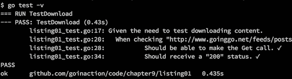

在 图 9.2 中，你可以看到测试的完整文档。考虑到需要下载内容，当检查 `statusCode` 的 URL（在图中被截断）时，我们应该能够发起调用并收到状态码 200。测试输出清晰、描述性强、信息丰富。我们知道运行了哪个单元测试，它通过了，以及它花费了多长时间：435 毫秒。

#### 9.1.2\. 表格测试

当测试可以接受一组不同参数并产生不同结果的代码时，应使用表格测试。*表格测试*类似于基本单元测试，但它维护一个不同值和结果的表格。不同的值会被迭代并运行通过测试代码。在每次迭代中，都会检查结果。这有助于利用单个测试函数来测试一组不同的值和条件。让我们看看一个示例表格测试。

##### 列表 9.8\. listing08_test.go

```
01 // Sample test to show how to write a basic unit table test.
02 package listing08
03
04 import (
05     "net/http"
06     "testing"
07 )
08
09 const checkMark = "\u2713"
10 const ballotX = "\u2717"
11
12 // TestDownload validates the http Get function can download

13 //  content and handles different status conditions properly.
14 func TestDownload(t *testing.T) {
15     var urls = []struct {
16         url        string
17         statusCode int
18     }{
19          {
20              "http://www.goinggo.net/feeds/posts/default?alt=rss",
21              http.StatusOK,
22          },
23          {
24              "http://rss.cnn.com/rss/cnn_topstbadurl.rss",
25              http.StatusNotFound,
26          },
27     }
28
29     t.Log("Given the need to test downloading different content.")
30     {
31         for _, u := range urls {
32             t.Logf("\tWhen checking \"%s\" for status code \"%d\"",
33                 u.url, u.statusCode)
34             {
35                 resp, err := http.Get(u.url)
36                 if err != nil {
37                     t.Fatal("\t\tShould be able to Get the url.",
38                         ballotX, err)
39                 }
40                 t.Log("\t\tShould be able to Get the url",
41                     checkMark)
42
43                 defer resp.Body.Close()
44
45                 if resp.StatusCode == u.statusCode {
46                     t.Logf("\t\tShould have a \"%d\" status. %v",
47                         u.statusCode, checkMark)
48                 } else {
49                     t.Errorf("\t\tShould have a \"%d\" status %v %v",
50                         u.statusCode, ballotX, resp.StatusCode)
51                 }
52             }
53         }
54     }
55 }
```

在 列表 9.8 中，我们将基本的单元测试转换为表格测试。现在我们可以使用单个测试函数来测试不同的 URL 和状态码与 `http.Get` 函数。我们不需要为每个要测试的 URL 和状态码创建一个新的测试函数。让我们看看这些更改。

##### 列表 9.9\. listing08_test.go: 行 12–27

```
12 // TestDownload validates the http Get function can download
13 //  content and handles different status conditions properly.
14 func TestDownload(t *testing.T) {

15     var urls = []struct {
16         url        string
17         statusCode int
18     }{
19          {
20              "http://www.goinggo.net/feeds/posts/default?alt=rss",
21              http.StatusOK,
22          },
23          {
24              "http://rss.cnn.com/rss/cnn_topstbadurl.rss",
25              http.StatusNotFound,
26          },
27     }
```

在 列表 9.9 中，你可以看到相同的测试函数 `TestDownload` 接受一个 `testing.T` 类型的指针。但这个版本的 `TestDownload` 略有不同。在第 15 到 27 行，你可以看到表的实现。表的第一列是一个指向互联网上给定资源的 URL，第二列是我们请求资源时预期的状态。

目前，我们已经用两个值配置了表。第一个值是 goinggo.net URL，状态为 OK，第二个值是另一个 URL，状态为 NotFound。第二个 URL 被拼写错误，导致服务器返回 NotFound 错误。当我们运行这个测试时，我们得到如图 9.3 所示的测试输出。

##### 图 9.3\. 表格测试的输出

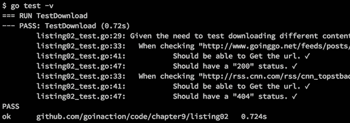

图 9.3 中的输出显示了如何遍历值表并使用它来进行测试。输出看起来与基本单元测试相同，除了这次我们测试了两个不同的 URL。再次，测试通过。

让我们看看我们为了使表测试工作所做出的更改。

##### 列表 9.10\. listing08_test.go: 行 29–34

```
29     t.Log("Given the need to test downloading different content.")
30     {
31         for _, u := range urls {
32             t.Logf("\tWhen checking \"%s\" for status code \"%d\"",
33                 u.url, u.statusCode)
34             {
```

列表 9.10 中的第 31 行的 `for range` 循环允许测试遍历表，并为每个不同的 URL 运行测试代码。除了使用表值之外，原始代码与基本单元测试相同。

##### 列表 9.11\. listing08_test.go: 行 35–55

```
35                 resp, err := http.Get(u.url)
36                 if err != nil {
37                     t.Fatal("\t\tShould be able to Get the url.",
38                         ballotX, err)
39                 }
40                 t.Log("\t\tShould be able to Get the url",
41                     checkMark)
42
43                 defer resp.Body.Close()
44
45                 if resp.StatusCode == u.statusCode {
46                     t.Logf("\t\tShould have a \"%d\" status. %v",
47                         u.statusCode, checkMark)
48                 } else {
49                     t.Errorf("\t\tShould have a \"%d\" status %v %v",
50                         u.statusCode, ballotX, resp.StatusCode)
51                 }
52             }
53         }
54     }
55 }
```

列表 9.11 展示了在第 35 行，代码使用 `u.url` 字段作为调用 URL。在第 45 行，使用 `u.statusCode` 字段来比较响应的实际状态码。在未来，可以添加新的 URL 和状态码到表中，而测试的核心部分不需要改变。

#### 9.1.3\. 模拟调用

我们编写的单元测试很棒，但它们确实有几个缺陷。首先，测试要成功运行需要访问互联网。图 9.4 显示了在没有互联网连接的情况下再次运行基本单元测试的情况——测试失败。

##### 图 9.4\. 由于没有互联网连接而失败的测试

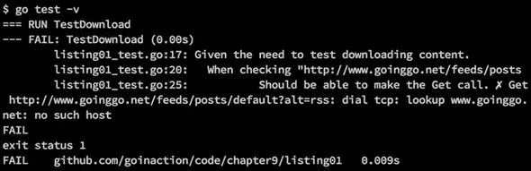

你不应该总是假设你运行测试的计算机可以访问互联网。此外，让测试依赖于你不在拥有或运营的服务器并不是一个好的做法。这两者都可能对任何自动化持续集成和部署产生重大影响。突然之间，你无法部署新的构建，因为你失去了对外部世界的访问。如果测试失败，你无法部署。

为了解决这个问题，标准库中有一个名为 `httptest` 的包，它将允许你模拟基于 HTTP 的网络调用。模拟是许多开发者在测试运行时无法访问资源时使用的技巧。`httptest` 包为你提供了模拟来自互联网上网络资源的请求和响应的能力。通过在我们的单元测试中模拟 `http.Get` 响应，我们可以解决我们在 图 9.4 中看到的问题。我们的测试将不再因为缺少互联网连接而失败。然而，测试可以验证我们的 `http.Get` 调用是否正常工作并处理预期的响应。让我们将基本单元测试修改为模拟对 goinggo.net RSS 源的调用。

##### 列表 9.12\. listing12_test.go: 第 01-41 行

```
01 // Sample test to show how to mock an HTTP GET call internally.
02 // Differs slightly from the book to show more.
03 package listing12
04
05 import (
06     "encoding/xml"
07     "fmt"
08     "net/http"
09     "net/http/httptest"
10     "testing"
11 )
12
13 const checkMark = "\u2713"
14 const ballotX = "\u2717"
15
16 // feed is mocking the XML document we except to receive.
17 var feed = `<?xml version="1.0" encoding="UTF-8"?>
18 <rss>
19 <channel>
20     <title>Going Go Programming</title>
21     <description>Golang : https://github.com/goinggo</description>
22     <link>http://www.goinggo.net/</link>
23     <item>
24         <pubDate>Sun, 15 Mar 2015 15:04:00 +0000</pubDate>
25         <title>Object Oriented Programming Mechanics</title>
26         <description>Go is an object oriented language.</description>
27         <link>http://www.goinggo.net/2015/03/object-oriented</link>
28     </item>
29 </channel>
30 </rss>`
31
32 // mockServer returns a pointer to a server to handle the get call.
33 func mockServer() *httptest.Server {

34     f := func(w http.ResponseWriter, r *http.Request) {
35         w.WriteHeader(200)
36         w.Header().Set("Content-Type", "application/xml")
37         fmt.Fprintln(w, feed)
38     }
39
40     return httptest.NewServer(http.HandlerFunc(f))
41 }
```

列表 9.12 展示了如何模拟对 goinggo.net 网站的调用以模拟下载 RSS 源。在第 17 行，声明了一个包级别的变量 `feed`，并用一个表示我们将从模拟服务器调用中接收的 RSS XML 文档的文本字符串初始化。这是实际 RSS 源文档的一个小片段，足以进行我们的测试。在第 32 行，我们声明了一个名为 `mockServer` 的函数，该函数利用 `httptest` 包内部的支持来模拟对互联网上真实服务器的调用。

##### 列表 9.13\. listing12_test.go: 第 32-40 行

```
32 func mockServer() *httptest.Server {
33     f := func(w http.ResponseWriter, r *http.Request) {
34         w.WriteHeader(200)
35         w.Header().Set("Content-Type", "application/xml")
36         fmt.Fprintln(w, feed)
37     }
38
39     return httptest.NewServer(http.HandlerFunc(f))
40 }
```

在 列表 9.13 中的 `mockServer` 函数被声明为返回 `httptest.Server` 类型的指针。`httptest.Server` 值是使所有这些工作起来的关键。代码从声明一个与 `http.HandlerFunc` 函数类型具有相同签名的匿名函数开始。

##### 列表 9.14\. golang.org/pkg/net/http/#HandlerFunc

```
type HandlerFunc func(ResponseWriter, *Request)

The HandlerFunc type is an adapter to allow the use of ordinary
functions as HTTP handlers. If f is a function with the appropriate
signature, HandlerFunc(f) is a Handler object that calls f
```

这使得匿名函数成为一个处理函数。一旦声明了处理函数，然后在第 39 行，它被用作 `httptest.NewServer` 函数调用的参数来创建我们的模拟服务器。然后，模拟服务器通过第 39 行的指针返回。

我们将能够使用这个模拟服务器与我们的 `http.Get` 调用来模拟对 goinggo.net 网服务器的访问。当执行 `http.Get` 调用，处理函数实际上被执行并用于模拟请求和响应。在第 34 行，处理函数首先设置状态码；然后，在第 35 行，设置内容类型；最后，在第 36 行，返回代表响应的名为 `feed` 的 XML 字符串作为响应体。

现在，让我们看看如何将模拟服务器集成到基本单元测试中，以及 `http.Get` 调用如何能够使用它。

##### 列表 9.15\. listing12_test.go: 第 43-74 行

```
43 // TestDownload validates the http Get function can download content
44 // and the content can be unmarshaled and clean.
45 func TestDownload(t *testing.T) {
46     statusCode := http.StatusOK
47
48     server := mockServer()
49     defer server.Close()
50
51     t.Log("Given the need to test downloading content.")
52     {
53         t.Logf("\tWhen checking \"%s\" for status code \"%d\"",
54             server.URL, statusCode)
55         {
56             resp, err := http.Get(server.URL)
57             if err != nil {
58                 t.Fatal("\t\tShould be able to make the Get call.",
59                     ballotX, err)
60             }
61             t.Log("\t\tShould be able to make the Get call.",
62                 checkMark)
63
64             defer resp.Body.Close()
65
66             if resp.StatusCode != statusCode {
67                 t.Fatalf("\t\tShould receive a \"%d\" status. %v %v",
68                     statusCode, ballotX, resp.StatusCode)
69             }
70             t.Logf("\t\tShould receive a \"%d\" status. %v",
71                statusCode, checkMark)
72         }
73     }
74 }
```

在 列表 9.15 中，你再次看到了 `TestDownload` 函数，但这次它使用的是模拟服务器。在第 48 和 49 行，调用了 `mockServer` 函数，并且将 `Close` 方法的调用推迟到测试函数返回时。之后，测试代码看起来与基本单元测试相同，除了有一点不同。

##### 列表 9.16\. listing12_test.go: 第 56 行

```
56             resp, err := http.Get(server.URL)
```

这次，调用要使用的 URL 由`httptest.Server`值提供。当我们使用模拟服务器提供的 URL 时，`http.Get`调用按预期运行。`http.Get`调用不知道它没有通过互联网进行调用。调用被发起，我们的处理函数在下面执行，结果返回我们的 RSS XML 文档和一个状态为`http.StatusOK`的响应。

当我们在没有互联网连接的情况下运行测试时，我们看到测试运行并通过，如图 9.5 所示。这张图显示了测试再次通过的情况。如果你查看用于发起调用的 URL，你可以看到它使用的是 localhost 地址和端口号 52065。每次我们运行测试时，这个端口号都会改变。`http`包与`httptest`包以及我们的模拟服务器一起知道将这个 URL 路由到我们的处理函数。现在，我们可以测试对 goinggo.net RSS 源头的调用，而无需实际击中服务器。

##### 图 9.5\. 无需互联网连接的成功测试

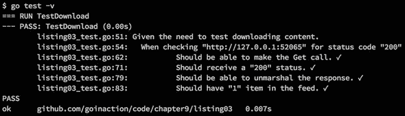

#### 9.1.4\. 测试端点

如果你正在构建一个网络 API，你将希望测试所有端点，而无需启动网络服务。`httptest`包提供了一种进行此类测试的设施。让我们看看一个实现单个端点的示例网络服务，然后你可以看到如何编写一个模拟实际调用的单元测试。

##### 列表 9.17\. listing17.go

```
01 // This sample code implement a simple web service.
02 package main
03
04 import (
05     "log"
06     "net/http"
07
08     "github.com/goinaction/code/chapter9/listing17/handlers"
09 )
10
11 // main is the entry point for the application.
12 func main() {
13     handlers.Routes()
14
15     log.Println("listener : Started : Listening on :4000")
16     http.ListenAndServe(":4000", nil)
17 }
```

列表 9.17 显示了网络服务入口点的代码文件。在`main`函数的第 13 行，代码调用了`handlers`包内部的`Routes`函数。该函数设置了网络服务所托管的不同端点的路由。在第 15 行和第 16 行，`main`函数显示了服务正在监听的端口，并启动了网络服务，等待请求。

现在，让我们看看`handlers`包的代码。

##### 列表 9.18\. `handlers`/handlers.go

```
01 // Package handlers provides the endpoints for the web service.
02 package handlers
03
04 import (
05     "encoding/json"
06     "net/http"
07 )
08
09 // Routes sets the routes for the web service.
10 func Routes() {
11     http.HandleFunc("/sendjson", SendJSON)
12 }
13
14 // SendJSON returns a simple JSON document.
15 func SendJSON(rw http.ResponseWriter, r *http.Request) {
16     u := struct {
17         Name  string
18         Email string
19     }{
20         Name:  "Bill",
21         Email: "bill@ardanstudios.com",
22     }
23
24     rw.Header().Set("Content-Type", "application/json")
25     rw.WriteHeader(200)
26     json.NewEncoder(rw).Encode(&u)
27 }
```

列表 9.18 中`handlers`包的代码提供了处理函数的实现，并为网络服务设置了路由。在第 10 行，你可以看到`Routes`函数，它使用`http`包内部的默认`http.ServeMux`来配置 URL 和相应处理代码之间的路由。在第 11 行，我们将`/sendjson`端点绑定到`SendJSON`函数。

从第 15 行开始，我们有`SendJSON`函数的实现。该函数与你在列表 9.14 中看到的`http.HandlerFunc`函数类型具有相同的签名。在第 16 行，声明了一个匿名结构体类型，并创建了一个名为`u`的变量，并赋予了一些值。在第 24 行和第 25 行设置了响应的内容类型和状态码。最后，在第 26 行，将`u`值编码成 JSON 文档并发送给客户端。

如果我们构建 Web 服务并启动服务器，我们会看到提供的 JSON 文档，如图 9.6 和 9.7 所示。

##### 图 9.6\. 运行 Web 服务

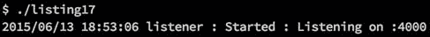

##### 图 9.7\. 提供 JSON 文档的 Web 服务

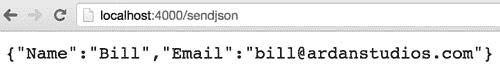

现在我们有一个具有端点的功能齐全的 Web 服务，我们可以编写一个单元测试来测试该端点。

##### 列表 9.19\. `handlers`/handlers_test.go

```
01 // Sample test to show how to test the execution of an
02 // internal endpoint.
03 package handlers_test
04
05 import (
06     "encoding/json"
07     "net/http"
08     "net/http/httptest"
09     "testing"
10
11     "github.com/goinaction/code/chapter9/listing17/handlers"
12 )
13
14 const checkMark = "\u2713"
15 const ballotX = "\u2717"
16
17 func init() {
18     handlers.Routes()
19 }
20
21 // TestSendJSON testing the sendjson internal endpoint.
22 func TestSendJSON(t *testing.T) {
23     t.Log("Given the need to test the SendJSON endpoint.")
24     {
25         req, err := http.NewRequest("GET", "/sendjson", nil)
26         if err != nil {
27             t.Fatal("\tShould be able to create a request.",
28                 ballotX, err)
29         }
30         t.Log("\tShould be able to create a request.",
31             checkMark)
32
33         rw := httptest.NewRecorder()
34         http.DefaultServeMux.ServeHTTP(rw, req)
35
36         if rw.Code != 200 {
37             t.Fatal("\tShould receive \"200\"", ballotX, rw.Code)
38         }
39         t.Log("\tShould receive \"200\"", checkMark)
40

41         u := struct {
42             Name  string
43             Email string
44         }{}
45
46         if err := json.NewDecoder(rw.Body).Decode(&u); err != nil {
47             t.Fatal("\tShould decode the response.", ballotX)
48         }
49         t.Log("\tShould decode the response.", checkMark)
50
51         if u.Name == "Bill" {
52           t.Log("\tShould have a Name.", checkMark)
53         } else {
54           t.Error("\tShould have a Name.", ballotX, u.Name)
55         }
56
57         if u.Email == "bill@ardanstudios.com" {
58             t.Log("\tShould have an Email.", checkMark)
59         } else {
60             t.Error("\tShould have an Email.", ballotX, u.Email)
61         }
62     }
63 }
```

列表 9.19 展示了 `/sendjson` 端点的单元测试。在第 03 行，你可以看到包名与其他测试不同。

##### 列表 9.20\. `handlers`/handlers_test.go: 行 01–03

```
01 // Sample test to show how to test the execution of an
02 // internal endpoint.
03 package handlers_test
```

这次，正如你在列表 9.20 中可以看到，包名也以 `_test` 结尾。当包名以这种方式结束时，测试代码只能访问导出的标识符。即使测试代码文件与被测试的代码在同一文件夹中，这也是正确的。

就像直接运行服务一样，路由需要初始化。

##### 列表 9.21\. `handlers`/handlers_test.go: 行 17–19

```
17 func init() {
18     handlers.Routes()
19 }
```

在列表 9.21 的第 17 行，声明了一个 `init` 函数来初始化路由。如果在运行单元测试之前没有初始化路由，那么测试将因 `http.StatusNotFound` 错误而失败。现在我们可以查看 `/sendjson` 端点的单元测试。

##### 列表 9.22\. `handlers`/handlers_test.go: 行 21–34

```
21 // TestSendJSON testing the sendjson internal endpoint.
22 func TestSendJSON(t *testing.T) {
23     t.Log("Given the need to test the SendJSON endpoint.")
24     {
25         req, err := http.NewRequest("GET", "/sendjson", nil)
26         if err != nil {
27             t.Fatal("\tShould be able to create a request.",
28                 ballotX, err)
29         }
30         t.Log("\tShould be able to create a request.",
31             checkMark)
32
33         rw := httptest.NewRecorder()
34         http.DefaultServeMux.ServeHTTP(rw, req)
```

列表 9.22 展示了 `TestSendJSON` 测试函数的声明。测试开始时记录测试的给定需求，然后在第 25 行创建了一个 `http.Request` 值。请求值被配置为对 `/sendjson` 端点的 `GET` 调用。由于这是一个 `GET` 调用，所以将 `nil` 作为第三个参数传递给请求数据。

然后，在第 33 行，调用 `httptest.NewRecorder` 函数创建了一个 `http.ResponseRecorder` 值。有了 `http.Request` 和 `http.ResponseRecorder` 值，在第 34 行对默认服务器多路复用器（mux）的 `ServerHTTP` 方法进行了调用。调用此方法模拟了一个对 `/sendjson` 端点的请求，就像它是由外部客户端发起的一样。

一旦 `ServeHTTP` 方法调用完成，`http.ResponseRecorder` 值将包含来自我们的 `SendJSON` 函数处理器的响应。现在我们可以测试响应。

##### 列表 9.23\. `handlers`/handlers_test.go: 行 36–39

```
36         if rw.Code != 200 {
37             t.Fatal("\tShould receive \"200\"", ballotX, rw.Code)
38         }
39         t.Log("\tShould receive \"200\"", checkMark)
```

首先，在第 36 行检查响应的状态。对于任何成功的端点调用，期望状态为 200。如果状态是 200，则将 JSON 响应解码到 Go 值中。

##### 列表 9.24\. `handlers`/handlers_test.go: 行 41–49

```
41         u := struct {
42             Name  string
43             Email string
44         }{}
45
46         if err := json.NewDecoder(rw.Body).Decode(&u); err != nil {
47             t.Fatal("\tShould decode the response.", ballotX)
48         }
49         t.Log("\tShould decode the response.", checkMark)
```

在列表 9.24 的第 41 行，声明了一个匿名结构体类型，并创建了一个名为 `u` 的变量，并将其初始化为其零值。在第 46 行，使用 `json` 包将响应中的 JSON 文档解码到 `u` 变量中。如果解码失败，单元测试将结束；否则，我们验证解码的值。

##### 列表 9.25\. `handlers`/handlers_test.go: 行 51–63

```
51         if u.Name == "Bill" {
52           t.Log("\tShould have a Name.", checkMark)
53         } else {
54           t.Error("\tShould have a Name.", ballotX, u.Name)
55         }
56
57         if u.Email == "bill@ardanstudios.com" {
58             t.Log("\tShould have an Email.", checkMark)
59         } else {
60             t.Error("\tShould have an Email.", ballotX, u.Email)
61         }
62     }
63 }
```

列表 9.25 展示了对我们期望接收的每个值的检查。在第 51 行，我们检查 `Name` 字段的值为 `"Bill"`，然后在第 57 行检查 `Email` 字段的值为 `"bill@ardanstudios.com"`。如果这些值匹配，则单元测试通过；否则，单元测试失败。这两个检查使用 `Error` 方法来报告失败，因此检查了所有字段。

### 9.2\. 示例

Go 非常注重编写代码的正确文档。`godoc` 工具就是为了直接从你的代码中生成文档而构建的。在第三章中，我们讨论了使用 `godoc` 工具生成包文档的使用。`godoc` 工具的另一个特性是示例代码。示例代码为测试和文档增加了另一个维度。

如果你使用浏览器导航到 Go 的 `json` 包文档，你会看到类似图 9.8 的内容。

##### 图 9.8\. `json` 包的示例列表

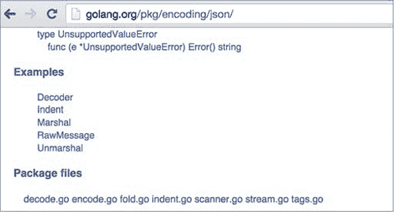

`json` 包有五个示例，它们显示在包的 Go 文档中。如果你选择第一个示例，你会看到一个示例代码的视图，如图 9.9 所示。

##### 图 9.9\. Go 文档中 `Decoder` 示例的视图

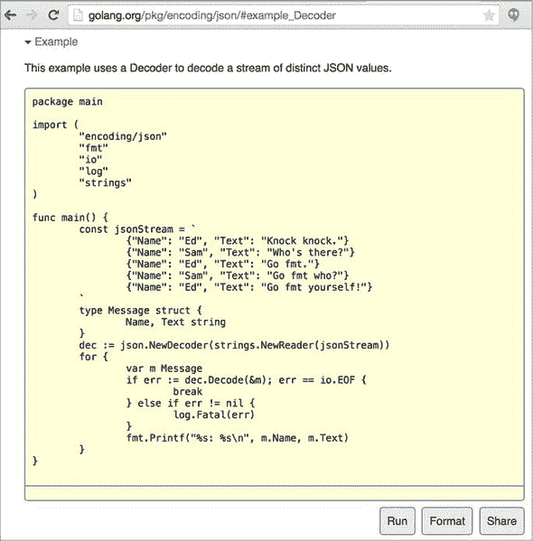

你可以创建自己的示例，并让它们出现在你包的 Go 文档中。让我们看看我们之前示例中的 `SendJSON` 函数的示例。

##### 列表 9.26\. handlers_example_test.go

```
01 // Sample test to show how to write a basic example.
02 package handlers_test
03
04 import (
05     "encoding/json"
06     "fmt"
07     "log"

08     "net/http"
09     "net/http/httptest"
10 )
11
12 // ExampleSendJSON provides a basic example.
13 func ExampleSendJSON() {
14     r, _ := http.NewRequest("GET", "/sendjson", nil)
15     rw := httptest.NewRecorder()
16     http.DefaultServeMux.ServeHTTP(rw, r)
17
18     var u struct {
19         Name  string
20         Email string
21     }
22
23     if err := json.NewDecoder(w.Body).Decode(&u); err != nil {
24         log.Println("ERROR:", err)
25     }
26
27     // Use fmt to write to stdout to check the output.
28     fmt.Println(u)
29     // Output:
30     // {Bill bill@ardanstudios.com}
31 }
```

示例基于现有的函数或方法。我们不需要以单词 `Test` 开头函数，而需要使用单词 `Example`。在第 13 行的列表 9.26 中，示例的名称是 `ExampleSendJSON`。

在示例中，你需要遵循一条规则。一个示例总是基于一个现有的已导出函数或方法。我们的示例测试是针对 `handlers` 包中的已导出函数 `SendJSON`。如果你不使用现有函数或方法的名称，测试将不会显示在包的 Go 文档中。

你为示例编写的代码是为了向某人展示如何使用特定的函数或方法。为了确定测试是否成功或失败，测试将比较函数的最终输出与示例函数底部列出的输出。

##### 列表 9.27\. handlers_example_test.go: 行 27–31

```
27     // Use fmt to write to stdout to check the output.
28     fmt.Println(u)
29     // Output:
30     // {Bill bill@ardanstudios.com}
31 }
```

在第 28 行的列表 9.27 中，代码使用 `fmt.Println` 将 `u` 的值写入标准输出。`u` 的值是在函数中较早调用 `/sendjson` 端点时初始化的。在第 29 行我们有一个带有单词 `Output:` 的注释。

`Output:` 标记用于记录测试函数运行后预期的输出。测试框架知道如何将最终的输出与 stdout 中的输出注释进行比较。如果一切匹配，则测试通过，并且你有一个在包的 Go 文档内部工作的示例。如果输出不匹配，则测试失败。

如果你启动一个本地的 `godoc` 服务器 (`godoc -http=":3000"`) 并导航到 `handlers` 包，你可以看到所有这些内容都整合在一起，如 图 9.10 所示。

##### 图 9.10\. `godoc` 视图中的 `handlers` 包

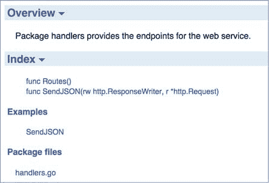

你可以在 图 9.10 中看到，`handlers` 包的文档显示了 `SendJSON` 函数的示例。如果你选择 `SendJSON` 链接，文档将显示代码，如 图 9.11 所示。

##### 图 9.11\. `godoc` 中的示例全貌

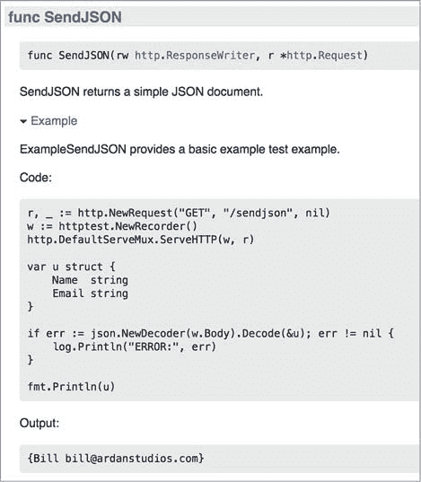

图 9.11 展示了示例的完整文档，包括代码和预期输出。由于这也是一个测试，你可以使用 `go test` 工具运行示例函数，如 图 9.12 所示。

##### 图 9.12\. 运行示例

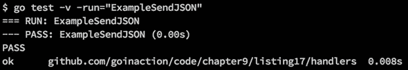

运行测试后，你会看到测试通过。这次运行测试时，使用 `-run` 选项指定了特定的函数 `ExampleSendJSON`。`-run` 选项接受任何正则表达式来过滤要运行的测试函数。它适用于单元测试和示例函数。当示例失败时，它看起来像 图 9.13。

##### 图 9.13\. 运行一个失败的示例

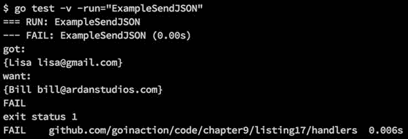

当一个示例失败时，`go test` 会显示产生的输出和预期的结果。

### 9.3\. 基准测试

基准测试是测试代码性能的一种方法。当你想要测试同一问题的不同解决方案的性能并查看哪个解决方案表现更好时，它很有用。它还可以用来识别可能对应用程序性能至关重要的特定代码片段的 CPU 或内存问题。许多开发者使用基准测试来测试不同的并发模式，或帮助配置工作池，以确保它们配置得当以获得最佳吞吐量。

让我们看看一组基准函数，这些函数揭示了将整数值转换为字符串的最快方式。在标准库中，有三种不同的方法可以将整数值转换为字符串。

##### 列表 9.28\. listing28_test.go: 行 01–10

```
01 // Sample benchmarks to test which function is better for converting
02 // an integer into a string. First using the fmt.Sprintf function,
03 // then the strconv.FormatInt function and then strconv.Itoa.

04 package listing28_test
05
06 import (
07     "fmt"
08     "strconv"
09     "testing"
10 )
```

列表 9.28 展示了列表 28_test.go 基准测试的初始代码。与单元测试文件一样，文件名必须以 _test.go 结尾。还必须导入 `testing` 包。接下来，让我们看看其中一个基准函数。

##### 列表 9.29\. listing28_test.go: 行 12–22

```
12 // BenchmarkSprintf provides performance numbers for the
13 // fmt.Sprintf function.
14 func BenchmarkSprintf(b *testing.B) {
15     number := 10
16
17     b.ResetTimer()
18
19     for i := 0; i < b.N; i++ {
20         fmt.Sprintf("%d", number)
21     }
22 }
```

在 列表 9.29 的第 14 行，你可以看到第一个基准测试，命名为 `BenchmarkSprintf`。基准测试函数以单词 `Benchmark` 开头，并且只接受一个类型为 `testing.B` 的指针作为其唯一参数。为了使基准测试框架能够计算性能，它必须在一个时间段内反复运行代码。这就是 `for` 循环的作用所在。

##### 列表 9.30\. listing28_test.go: 行 19–22

```
19     for i := 0; i < b.N; i++ {
20         fmt.Sprintf("%d", number)
21     }
22 }
```

列表 9.30 第 19 行的 `for` 循环显示了如何使用 `b.N` 值。在第 20 行，我们有对 `fmt` 包中 `Sprintf` 函数的调用。这是我们正在基准测试的函数，用于将整数值转换为字符串。

默认情况下，基准测试框架会反复调用基准测试函数，至少持续一秒。每次框架调用基准测试函数时，它都会增加 `b.N` 的值。在第一次调用时，`b.N` 的值将是 `1`。将所有要基准测试的代码放置在循环内并使用 `b.N` 值是非常重要的。如果不这样做，结果是不可信的。

如果我们只想运行基准测试函数，我们需要使用 `-bench` 选项。

##### 列表 9.31\. 运行基准测试

```
go test -v -run="none" -bench="BenchmarkSprintf"
```

在我们的 `go test` 调用中，我们指定了 `-run` 选项，传递字符串 `"none"` 以确保在运行指定的基准测试函数之前不运行任何单元测试。这两个选项都接受一个正则表达式来过滤要运行的测试。由于没有单元测试函数的名称中包含 `none`，`none` 会消除任何单元测试的运行。当我们发出此命令时，我们得到 图 9.14 中所示的输出。

##### 图 9.14\. 运行单个基准测试

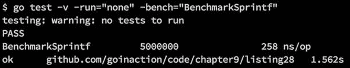

输出首先指定没有要运行的测试，然后继续运行 `BenchmarkSprintf` 基准测试。在 `PASS` 一词之后，你可以看到运行基准测试函数的结果。第一个数字 `5000000` 表示循环内代码执行的次数。在这种情况下，那是五百万次。下一个数字表示基于每操作纳秒数的代码性能，因此在这种情况下，使用 `Sprintf` 函数平均每次调用需要 258 纳秒。

运行基准测试的最终输出显示为 *ok*，表示基准测试正确完成。然后显示执行代码的文件名，最后显示基准测试运行的总时间。基准测试的默认最小运行时间为 1 秒。你可以看到框架仍然运行了大约一秒半的测试。如果你想使测试运行更长的时间，可以使用另一个选项 `-benchtime`。让我们再次运行测试，使用基准时间为三秒（见 图 9.15）。

##### 图 9.15\. 使用 `-benchtime` 选项运行单个基准测试

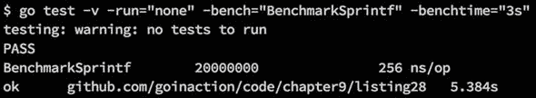

这次，`Sprintf` 函数运行了 2000 万次，持续了 5.275 秒。函数的性能没有太大变化。这次的性能是每操作 256 纳秒。有时通过增加基准测试时间，你可以得到更准确的性能读数。对于大多数测试，增加基准测试时间超过三秒通常不会为准确读数提供任何差异。但每个基准测试都是不同的。

让我们看看其他两个基准测试函数，然后一起运行所有三个基准测试，看看将整数值转换为字符串最快的方法是什么。

##### 列表 9.32\. listing28_test.go: 行 24–46

```
24 // BenchmarkFormat provides performance numbers for the
25 // strconv.FormatInt function.
26 func BenchmarkFormat(b *testing.B) {
27     number := int64(10)
28
29     b.ResetTimer()
30
31     for i := 0; i < b.N; i++ {
32         strconv.FormatInt(number, 10)
33     }
34 }
35
36 // BenchmarkItoa provides performance numbers for the
37 // strconv.Itoa function.
38 func BenchmarkItoa(b *testing.B) {
39     number := 10
40
41     b.ResetTimer()
42
43     for i := 0; i < b.N; i++ {
44         strconv.Itoa(number)
45     }
46 }
```

列表 9.32 显示了其他两个基准测试函数。`BenchmarkFormat` 函数基准测试了 `strconv` 包中 `FormatInt` 函数的使用。`BenchmarkItoa` 函数基准测试了同一 `strconv` 包中 `Itoa` 函数的使用。你可以看到这两个其他基准测试函数与 `BenchmarkSprintf` 函数中相同的模式。调用在 `for` 循环内部使用 `b.N` 来控制每个调用的迭代次数。

我们跳过的一件事是 `b.ResetTimer` 的调用，它在所有三个基准测试函数中使用。当需要在代码开始执行循环之前进行初始化时，此方法很有用。为了获得最准确的基准测试时间，你可以使用此方法。

当我们运行所有基准测试函数至少三秒钟时，我们得到图 9.16 所示的结果。

##### 图 9.16\. 运行所有三个基准测试

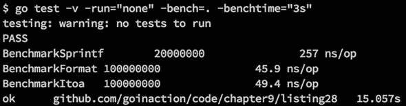

结果显示，`BenchmarkFormat` 测试函数以每操作 45.9 纳秒的速度运行得最快。`BenchmarkItoa` 以每操作 49.4 纳秒的接近速度排在第二位。这两个基准测试都比使用 `Sprintf` 函数快得多。

在运行基准测试时，你可以使用的另一个优秀选项是 `-benchmem` 选项。它将提供有关给定测试中分配数量和每个分配的字节数的信息。让我们使用这个选项与基准测试一起使用（见图 9.17）。

##### 图 9.17\. 使用 `-benchmem` 选项运行基准测试

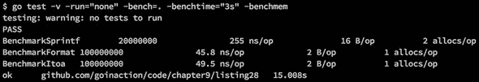

这次，你看到两个新的值：一个是 `B/op` 的值，另一个是 `allocs/op` 的值。`allocs/op` 的值表示每个操作中堆分配的数量。你可以看到 `Sprintf` 函数在每个操作中分配两个值到堆上，而其他两个函数每个操作只分配一个值。`B/op` 的值表示每个操作的字节数。你可以看到来自 `Sprintf` 函数的这两个分配导致每个操作分配了 16 字节的内存。其他两个函数每个操作只分配了 2 字节。

在运行测试和基准测试时，你可以使用许多不同的选项。我建议你探索所有这些选项，并在编写你的包和项目时充分利用这个测试框架。社区期望包作者在发布供社区公开使用的包时提供全面的测试。

### 9.4. 概述

+   测试是语言内置的，Go 提供了你需要的所有工具。

+   `go test` 工具用于运行测试。

+   测试文件总是以 _test.go 文件名结尾。

+   表格测试是利用单个测试函数测试多个值的一种很好的方式。

+   示例既是包的测试也是文档。

+   基准测试提供了一种机制来揭示代码的性能。
