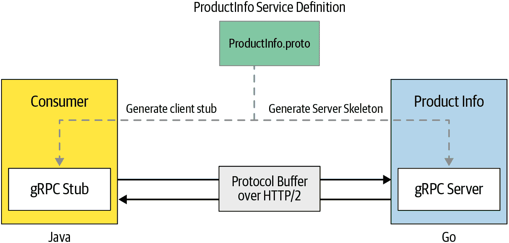

# 第一章。gRPC 简介

现代软件应用很少独立运行。相反，它们通过计算机网络相互连接，并通过传递消息来通信和协调它们的操作。因此，现代软件系统是运行在不同网络位置的分布式软件应用集合，并使用不同的通信协议通过消息传递来彼此通信。例如，一个在线零售软件系统包括多个分布式应用程序，如订单管理应用程序、目录应用程序、数据库等等。为了实现在线零售系统的业务功能，需要这些分布式应用程序之间的互联互通。

###### 注意

**微服务架构**

微服务架构是将软件应用程序构建为独立、自治（独立开发、部署和扩展）、面向业务能力的松散耦合服务集合的过程。¹

随着[微服务架构](https://oreil.ly/q6N1P)和[云原生架构](https://oreil.ly/8Ow2T)的出现，为多个业务能力构建的传统软件应用程序进一步分割成一组细粒度、自治和业务能力导向的实体，称为微服务。因此，基于微服务的软件系统也要求微服务通过网络使用进程间（或服务间或应用间）通信技术进行连接。例如，如果我们考虑使用微服务架构实现的同一在线零售系统，您会发现多个相互连接的微服务，如订单管理、搜索、结账、运输等等。与传统应用程序不同，由于微服务的细粒度特性，网络通信链接的数量大大增加。因此，无论您使用的是传统架构还是微服务架构，进程间通信技术都是现代分布式软件应用程序中最重要的方面之一。

进程间通信通常采用同步请求-响应风格或异步事件驱动风格进行实现。在同步通信风格中，客户端进程通过网络向服务器进程发送请求消息，并等待响应消息。在异步事件驱动消息传递中，进程通过使用称为*事件代理*的中介进行异步消息传递进行通信。根据您的业务用例，可以选择要实现的通信模式。

当涉及构建现代云原生应用程序和微服务的同步请求-响应式通信时，最常见和传统的方法是将它们构建为 RESTful 服务，其中您将应用程序或服务建模为可以通过网络调用访问并通过 HTTP 协议改变其状态的资源集合。然而，对于大多数用例来说，RESTful 服务相当笨重、效率低下，并且易于出错，用于构建进程间通信。通常需要一种高度可扩展、松耦合的进程间通信技术，其效率比 RESTful 服务更高。这就是现代进程间通信样式 gRPC 出现的地方（我们将在本章后期将 gRPC 与 RESTful 通信进行比较）。gRPC 主要使用同步请求-响应式样式进行通信，但一旦建立了初始通信，它也可以以完全异步或流模式运行。

在本章中，我们将探讨 gRPC 是什么，以及发明这种进程间通信协议背后的主要动机。我们将通过一些真实的用例来深入了解 gRPC 协议的关键构建块。此外，了解进程间通信技术的基本原理及其随时间演变的过程非常重要，这样您就可以理解 gRPC 试图解决的关键问题。因此，我们将详细介绍这些技术，并对比每一种。让我们从 gRPC 是什么开始讨论。

# gRPC 是什么？

gRPC（“g”在[每个 gRPC 发布版本中都有不同的含义](https://oreil.ly/IKCi3)）是一种进程间通信技术，允许您像调用本地函数一样连接、调用、操作和调试分布式异构应用程序。

当你开发 gRPC 应用程序时，首先要做的是定义一个服务接口。服务接口定义包含了有关你的服务如何被消费者消费的信息，允许消费者远程调用哪些方法，调用这些方法时使用的方法参数和消息格式等信息。我们在服务定义中指定的语言被称为*接口定义语言*（IDL）。

使用该服务定义，您可以生成称为*服务器骨架*的服务器端代码，它通过提供低级通信抽象简化了服务器端逻辑。同时，您还可以生成客户端代码，称为*客户端存根*，它通过抽象隐藏不同编程语言的低级通信，简化了客户端通信。在服务接口定义中指定的方法可以被客户端远程调用，就像调用本地函数一样简单。底层的 gRPC 框架处理了通常与强制执行严格服务合同、数据序列化、网络通信、身份验证、访问控制、可观测性等相关的所有复杂性。

要理解 gRPC 的基本概念，让我们看一个使用 gRPC 实现的微服务的真实用例。假设我们正在构建一个由多个微服务组成的在线零售应用程序。如 图 1-1 所示，假设我们想要构建一个微服务，提供在线零售应用程序中可用产品的详细信息（我们将在 第二章 中从头开始实现此用例）。`ProductInfo` 服务被建模为以 gRPC 服务形式通过网络公开。



###### 图 1-1\. 基于 gRPC 的微服务和消费者

服务定义在*ProductInfo.proto*文件中指定，该文件被服务器和客户端使用以生成代码。在本例中，我们假设服务使用 Go 语言实现，消费者使用 Java 实现。服务和消费者之间的网络通信通过 HTTP/2 进行。

现在让我们深入了解这种 gRPC 通信的详细信息。构建 gRPC 服务的第一步是创建服务接口定义，包括该服务暴露的方法以及输入参数和返回类型。让我们继续详细了解服务定义的内容。

## 服务定义

gRPC 使用 [协议缓冲区](https://oreil.ly/iFi-b) 作为接口定义语言（IDL）来定义服务接口。协议缓冲区是一种语言无关、平台中立、可扩展的机制，用于序列化结构化数据（我们将在 第四章 中详细介绍协议缓冲区的一些基础知识，但目前您可以将其视为一种数据序列化机制）。服务接口定义以 *.proto* 扩展名的普通文本文件的形式指定。您以普通的协议缓冲区格式定义 gRPC 服务，包括指定 RPC 方法参数和返回类型作为协议缓冲区消息。由于服务定义是协议缓冲区规范的扩展，需要使用特殊的 gRPC 插件从您的 proto 文件生成代码。

在我们的示例用例中，可以使用协议缓冲定义 `ProductInfo` 服务的接口，如 示例 1-1 所示。`ProductInfo` 的服务定义由服务接口定义组成，我们在其中指定远程方法、它们的输入和输出参数以及这些参数的类型定义（或消息格式）。

##### 示例 1-1\. 使用协议缓冲定义 ProductInfo 服务的 gRPC 服务定义

```go
// ProductInfo.proto syntax = "proto3"; 
package ecommerce; 

service ProductInfo { 
    rpc addProduct(Product) returns (ProductID); 
    rpc getProduct(ProductID) returns (Product); 
}

message Product { 
    string id = 1; 
    string name = 2;
    string description = 3;
}

message ProductID { 
    string value = 1;
}
```


服务定义以指定我们使用的协议缓冲版本（proto3）开始。


包名称用于防止协议消息类型之间的名称冲突，也将用于生成代码。


定义 gRPC 服务的服务接口。


用于添加产品并返回产品 ID 作为响应的远程方法。


用于根据产品 ID 获取产品的远程方法。


定义 `Product` 的消息格式/类型。


字段（名称-值对），用于保存具有唯一字段号的产品 ID，在消息二进制格式中用于标识您的字段。


产品识别号的用户定义类型。

服务是一组可以远程调用的方法（例如，`addProduct` 和 `getProduct`）的集合。每个方法都有我们定义的输入参数和返回类型，可以作为服务的一部分定义，或者可以导入到协议缓冲定义中。

输入和返回参数可以是用户定义的类型（例如 `Product` 和 `ProductID` 类型）或在服务定义中定义的协议缓冲器[知名类型](https://oreil.ly/0Uc3A)。这些类型被结构化为消息，其中每个消息是包含一系列名称-值对字段的小逻辑记录。这些字段是具有唯一字段号的名称-值对（例如 `string id = 1`），用于在消息二进制格式中标识您的字段。

此服务定义用于构建您的 gRPC 应用程序的服务器和客户端。在下一节中，我们将详细介绍 gRPC 服务器的实现。

## gRPC 服务器

一旦您有了服务定义，您可以使用协议缓冲编译器 *protoc* 生成服务器端或客户端代码。使用协议缓冲器的 gRPC 插件，您可以生成 gRPC 服务器端和客户端代码，以及用于填充、序列化和检索消息类型的常规协议缓冲器代码。

在服务器端，服务器实现该服务定义并运行 gRPC 服务器来处理客户端调用。因此，在服务器端，要使`ProductInfo`服务发挥作用，您需要做以下几点：

1.  通过覆盖服务基类实现生成的服务框架的服务逻辑。

1.  运行 gRPC 服务器以监听来自客户端的请求并返回服务响应。

在实现服务逻辑时，首先要做的是从服务定义生成服务框架。例如，在 示例 1-2 的代码片段中，您可以找到使用 Go 构建的`ProductInfo`服务的生成远程函数。在这些远程函数的主体中，您可以实现每个函数的逻辑。

##### 示例 1-2\. 使用 Go 实现 ProductInfo 服务的 gRPC 服务器端

```go
import (
  ...
  "context"
  pb "github.com/grpc-up-and-running/samples/ch02/productinfo/go/proto"
  "google.golang.org/grpc"
  ...
)

// ProductInfo implementation with Go

// Add product remote method
func (s *server) AddProduct(ctx context.Context, in *pb.Product) (
      *pb.ProductID, error) {
   // business logic
}

// Get product remote method
func (s *server) GetProduct(ctx context.Context, in *pb.ProductID) (
     *pb.Product, error) {
   // business logic
}
```

一旦您准备好服务实现，您需要运行 gRPC 服务器来监听来自客户端的请求，将这些请求分派给服务实现，并将服务响应返回给客户端。在 示例 1-3 中的代码片段中，显示了使用 Go 为`ProductInfo`服务用例实现的 gRPC 服务器。在此，我们打开一个 TCP 端口，启动 gRPC 服务器，并在该服务器上注册`ProductInfo`服务。

##### 示例 1-3\. 使用 Go 运行 ProductInfo 服务的 gRPC 服务器

```go
func main() {
  lis, _ := net.Listen("tcp", port)
  s := grpc.NewServer()
  pb.RegisterProductInfoServer(s, &server{})
  if err := s.Serve(lis); err != nil {
    log.Fatalf("failed to serve: %v", err)
  }
}
```

这就是在服务器端需要做的全部。现在让我们转向 gRPC 客户端实现。

## gRPC 客户端

类似于服务器端，我们可以使用服务定义生成客户端存根。客户端存根提供与服务器相同的方法，您的客户端代码可以调用这些方法；客户端存根将它们转换为远程函数调用网络调用，这些调用转到服务器端。由于 gRPC 服务定义是与语言无关的，您可以为您选择的任何支持的语言生成客户端和服务器（通过您选择的语言的 [第三方实现](https://oreil.ly/psi72)）。因此，对于`ProductInfo`服务用例，我们可以为 Java 生成客户端存根，而我们的服务器端使用 Go 实现。在 示例 1-4 中的代码片段中，您可以找到 Java 的代码。尽管我们使用的编程语言不同，但客户端实现涉及的简单步骤包括建立与远程服务器的连接、将客户端存根附加到该连接，并使用客户端存根调用远程方法。

##### 示例 1-4\. gRPC 客户端调用服务的远程方法

```go
// Create a channel using remote server address
ManagedChannel channel = ManagedChannelBuilder.forAddress("localhost", 8080)
   .usePlaintext(true)
   .build();

// Initialize blocking stub using the channel
ProductInfoGrpc.ProductInfoBlockingStub stub =
       ProductInfoGrpc.newBlockingStub(channel);

// Call remote method using the blocking stub
StringValue productID = stub.addProduct(
       Product.newBuilder()
       .setName("Apple iPhone 11")
       .setDescription("Meet Apple iPhone 11." +
            "All-new dual-camera system with " +
            "Ultra Wide and Night mode.")
       .build());
```

现在您已经对 gRPC 的关键概念有了很好的了解，让我们详细了解 gRPC 客户端与服务器之间的消息流程。

## 客户端-服务器消息流

当 gRPC 客户端调用 gRPC 服务时，客户端 gRPC 库使用协议缓冲区并封装远程过程调用协议缓冲区格式，然后通过 HTTP/2 发送。在服务器端，请求被解封装，并使用协议缓冲区执行相应的过程调用。响应从服务器到客户端的执行流程类似。作为传输协议，gRPC 使用 HTTP/2，这是一种高性能的二进制消息协议，支持双向消息传递。我们将进一步讨论 gRPC 客户端和服务器之间的消息流低级细节，以及协议缓冲区以及 gRPC 如何在 第四章 中使用 HTTP/2。

###### 注意

*封装* 是将参数和远程函数打包到消息数据包中，然后通过网络发送的过程，而 *解封装* 则将消息数据包解包到相应的方法调用中。

在深入讨论 gRPC 协议之前，了解不同的进程间通信技术及其随时间演变的重要性尤为重要。

# 进程间通信的演变

随着时间的推移，进程间通信技术发生了显著的演变。出现了各种这样的技术，以解决现代需求并提供更好、更高效的开发体验。因此，了解进程间通信技术的演变以及它们如何走向 gRPC 是非常重要的。让我们看一些最常用的进程间通信技术，并尝试与 gRPC 进行比较和对比。

## 传统 RPC

RPC 是一种流行的进程间通信技术，用于构建客户端-服务端应用程序。使用 RPC，客户端可以远程调用方法或函数，就像调用本地方法一样。早期有一些流行的 RPC 实现，如公共对象请求代理体系结构（CORBA）和 Java 远程方法调用（RMI），用于构建和连接服务或应用程序。然而，大多数传统的 RPC 实现非常复杂，因为它们建立在诸如 TCP 等通信协议之上，这些协议阻碍了互操作性，并且基于臃肿的规范。

## SOAP

由于诸如 CORBA 等传统 RPC 实现的局限性，简单对象访问协议（SOAP）被设计出来，并得到微软、IBM 等大型企业的大力推广。SOAP 是服务导向架构（SOA）中的标准通信技术，用于在服务之间交换基于 XML 结构化数据（通常在 SOA 上下文中称为 Web 服务），并可以通过任何底层通信协议（如 HTTP，最常用）进行通信。

使用 SOAP   使用 SOAP 可以定义服务接口、该服务的操作以及用于调用这些操作的关联 XML 消息格式。SOAP 曾经是一项相当流行的技术，但消息格式的复杂性以及围绕 SOAP 构建的规范的复杂性阻碍了构建分布式应用程序的灵活性。因此，在现代分布式应用程序开发的背景下，SOAP Web 服务被视为一项传统技术。现在，大多数现有的分布式应用程序都是使用 REST 架构风格进行开发，而不是使用 SOAP。

## REST

表述性状态转移（REST）是一种架构风格，起源于罗伊·菲尔丁（Roy Fielding）的博士论文。菲尔丁是 HTTP 规范的主要作者之一，也是 REST 架构风格的创始人。REST 是资源导向架构（ROA）的基础，其中你将分布式应用程序建模为一组资源，访问这些资源的客户端可以更改这些资源的状态（创建、读取、更新或删除）。

REST 的事实实现是 HTTP，在 HTTP 中，你可以将 RESTful Web 应用程序建模为一组使用唯一标识符（URL）可访问的资源集合。状态更改操作以 HTTP 动词（GET、POST、PUT、DELETE、PATCH 等）的形式应用于这些资源之上。资源状态以文本格式表示，例如 JSON、XML、HTML、YAML 等等。

使用 REST 架构风格和 HTTP、JSON 构建应用程序已成为构建微服务的事实标准方法。然而，随着微服务数量的增加以及它们的网络交互，RESTful 服务无法满足预期的现代要求。RESTful 服务存在几个关键限制，阻碍了将它们用作现代基于微服务的应用程序的消息传递协议。

### 低效的基于文本的消息协议

本质上，RESTful 服务是建立在诸如 HTTP 1.x 之类的基于文本的传输协议之上的，并利用 JSON 等人类可读的文本格式。当涉及到服务之间的通信时，使用 JSON 等文本格式非常低效，因为通信的双方都不需要使用这种人类可读的文本格式。

客户端应用程序（源）生成要发送到服务器的二进制内容，然后将二进制结构转换为文本（因为在 HTTP 1.x 中必须发送文本消息），并通过网络以文本形式（通过 HTTP）发送到解析并将其转换回服务（目标）端的机器。而实际上，我们本可以轻松地发送一种可以映射到服务和消费者业务逻辑的二进制格式。使用 JSON 的一个流行论点是它更易于使用，因为它是“人类可读的”。这更多是一个工具问题，而不是二进制协议的问题。

### 缺乏应用程序之间的强类型接口

随着使用不同多语言技术构建的服务在网络上交互的数量增加，缺乏明确定义和强类型服务定义是一个重大挫折。我们在 RESTful 服务中拥有的大多数现有服务定义技术，如 OpenAPI/Swagger，都是事后想法，与底层架构风格或消息协议的紧密集成不强。

这导致在构建这种分散式应用程序时出现许多不兼容性、运行时错误和互操作性问题。例如，当您开发 RESTful 服务时，无需拥有服务定义和信息类型定义，这些信息在应用程序之间共享。相反，您可以根据线上的文本格式或第三方 API 定义技术（如 OpenAPI）开发您的 RESTful 应用程序。因此，拥有现代强类型服务定义技术以及为多语言技术生成服务器和客户端核心代码的框架是至关重要的。

### REST 架构风格难以强制执行

作为一种架构风格，REST 有许多“良好实践”需要遵循才能创建真正的 RESTful 服务。但是，它们并不作为实现协议（如 HTTP）的一部分强制执行，这使得在实施阶段强制执行它们变得困难。因此，在实践中，大多数声称为 RESTful 的服务并未正确遵循 REST 风格的基础。因此，大多数所谓的 RESTful 服务只是通过网络公开的 HTTP 服务。因此，开发团队必须花费大量时间维护 RESTful 服务的一致性和纯度。

随着现代云原生应用程序构建中进程间通信技术的所有这些限制，追求发明一种更好的消息协议的旅程开始了。

## gRPC 的创世

Google 一直在使用名为 [*Stubby*](https://oreil.ly/vat5r) 的通用 RPC 框架来连接跨多个数据中心运行的数千个微服务，并构建具有不同技术的微服务。其核心 RPC 层设计用于处理每秒数十亿次请求的互联网规模。Stubby 具有许多出色的特性，但由于过于紧密耦合到 Google 的内部基础设施，因此不能标准化用作通用框架。

2015 年，Google [发布了](https://oreil.ly/cUZSG) gRPC 作为开源的 RPC 框架；它是一个标准化的、通用的、跨平台的 RPC 基础设施。gRPC 旨在为社区提供与 Stubby 提供的相同的可扩展性、性能和功能。

此后，gRPC 在过去几年中以及来自 Netflix、Square、Lyft、Docker、Cisco 和 CoreOS 等主要公司的大规模采用下急剧增长。后来，gRPC [加入了](https://oreil.ly/GFffo) 云原生计算基金会（CNCF），这是致力于使云原生计算普遍和可持续的最流行的开源软件基金会之一；gRPC 从 CNCF 生态系统项目中获得了很多推动力。

现在让我们看看使用 gRPC 而不是传统进程间通信协议的一些关键原因。

## 为什么选择 gRPC？

gRPC 设计为一种可以克服传统进程间通信技术大部分缺点的互联网规模的技术。由于 gRPC 的优势，大多数现代应用程序和服务器正越来越将其进程间通信协议转换为 gRPC。那么，在有这么多其他选择可用时，为什么会有人选择 gRPC 作为通信协议呢？让我们更仔细地看看 gRPC 带来的一些关键优势。

### gRPC 的优势

gRPC 带来的优势是 gRPC 日益增长的原因。这些优势包括以下内容：

它对进程间通信非常高效。

gRPC 不像使用 JSON 或 XML 等文本格式，而是使用基于协议缓冲区的二进制协议与 gRPC 服务和客户端通信。此外，gRPC 在 HTTP/2 之上实现了协议缓冲区，使其成为更快的进程间通信技术。这使得 gRPC 成为最高效的进程间通信技术之一。

它具有简单明确的服务接口和模式。

gRPC 促进了一种基于契约的应用程序开发方法。您首先定义服务接口，然后再处理实现细节。因此，与 RESTful 服务定义的 OpenAPI/Swagger 和 SOAP web 服务的 WSDL 不同，gRPC 提供了一种简单而一致、可靠和可扩展的应用程序开发体验。

它是强类型的。

由于我们使用协议缓冲区来定义 gRPC 服务，因此 gRPC 服务契约清晰地定义了在应用程序之间进行通信时将使用的类型。这使得分布式应用程序开发更加稳定，因为静态类型有助于克服在构建跨多个团队和技术的云原生应用程序时可能遇到的大多数运行时和互操作性错误。

它是多语言的。

gRPC 设计用于与多种编程语言一起工作。使用协议缓冲区定义的 gRPC 服务是与语言无关的。因此，您可以选择您喜欢的语言，但可以与任何现有的 gRPC 服务或客户端进行互操作。

它具有双工流功能。

gRPC 原生支持客户端或服务器端流，这一特性已经融入到服务定义中。这使得开发流式服务或流式客户端变得更加容易。而且，能够构建传统的请求-响应式消息传递以及客户端和服务器端流式传输是传统 RESTful 消息传递风格的重要优势之一。

它具有内建的通用功能。

gRPC 提供了内建的支持，如身份验证、加密、弹性（截止日期和超时）、元数据交换、压缩、负载平衡、服务发现等功能（我们将在 第五章 中探讨这些功能）。

它与云原生生态系统集成。

gRPC 是 CNCF 的一部分，大多数现代框架和技术都原生支持 gRPC。例如，CNCF 下的许多项目，如 [Envoy](https://oreil.ly/vGQsj)，支持 gRPC 作为通信协议；对于跨切面功能，如度量和监视，大多数这类工具（例如使用 [Prometheus](https://oreil.ly/AU3-7) 监视 gRPC 应用程序）都支持 gRPC。

它是成熟的，并且已被广泛采用。

gRPC 经过 Google 等公司的大量战斗测试，已经成熟，许多其他主要技术公司如 Square、Lyft、Netflix、Docker、Cisco 和 CoreOS 也采用了它。

就像任何技术一样，gRPC 也有一定的缺点。在应用程序开发过程中了解这些缺点非常有用。因此，让我们来看看 gRPC 的一些局限性。

### gRPC 的缺点

在选择 gRPC 构建应用程序时，需要注意一些缺点。这些包括以下内容：

它可能不适用于面向外部服务。

当您希望通过互联网向外部客户公开应用程序或服务时，gRPC 可能不是最合适的协议，因为大多数外部消费者对 gRPC 和 REST/HTTP 都比较陌生。gRPC 服务的合同驱动、强类型的特性可能会限制您向外部方公开服务的灵活性，并且消费者会获得较少的控制权（不像 GraphQL 等协议那样）。gRPC 网关被设计为解决这个问题的一种方法。我们将在第八章中详细讨论。

重大服务定义变更是一个复杂的开发过程。

现代服务间通信中，模式修改非常普遍。当 gRPC 服务定义发生重大变化时，通常需要重新生成客户端和服务器端的代码。这需要融入现有的持续集成流程中，并可能使整体开发生命周期变得复杂。然而，大多数 gRPC 服务定义的变更可以在不破坏服务合同的情况下进行，只要没有引入破坏性变更，gRPC 就能与使用不同版本 proto 的客户端和服务器愉快地互操作。因此，在大多数情况下并不需要重新生成代码。

生态系统相对较小。

与传统的 REST/HTTP 协议相比，gRPC 生态系统仍然相对较小。在浏览器和移动应用程序中支持 gRPC 的情况仍处于初级阶段。

在开发应用程序时，你必须注意这些限制。显然，gRPC 并不是你应该用于所有进程间通信需求的技术。相反，你需要评估业务用例和需求，并选择适合的消息传递协议。我们将在第八章中探讨一些指南。

正如我们在之前的章节中讨论的那样，市场上存在许多现有和新兴的进程间通信技术。了解我们如何比较 gRPC 与其他类似的技术，这将帮助您找到最适合您服务的协议，这一点非常重要。

## gRPC 与其他协议的比较：GraphQL 和 Thrift

我们详细讨论了 REST 的一些关键限制，这为 gRPC 的诞生奠定了基础。同样，有许多正在出现的进程间通信技术来满足相同的需求。因此，让我们看看一些流行的技术，并将它们与 gRPC 进行比较。

### Apache Thrift

[Apache Thrift](https://thrift.apache.org)是一个 RPC 框架（最初在 Facebook 开发，后来捐赠给 Apache），类似于 gRPC。它使用自己的接口定义语言，并支持广泛的编程语言。Thrift 允许您在定义文件中定义数据类型和服务接口。通过将服务定义作为输入，Thrift 编译器生成客户端和服务器端的代码。Thrift 传输层提供了网络 I/O 的抽象，并将 Thrift 与系统的其余部分解耦，这意味着它可以在任何传输实现（如 TCP、HTTP 等）上运行。

如果你将 Thrift 与 gRPC 进行比较，你会发现它们基本上遵循相同的设计和使用目标。然而，两者之间有几个重要的区别：

Transport

gRPC 比 Thrift 更具有见解，并为 HTTP/2 提供了一流的支持。它在 HTTP/2 上的实现利用协议的能力实现效率，并支持诸如流式传输等消息模式。

Streaming

gRPC 服务定义本身原生支持双向流式传输（客户端和服务器）作为服务定义的一部分。

采纳和社区

当涉及到采纳时，gRPC 似乎具有相当好的动力，并成功地在 CNCF 项目周围建立了一个良好的生态系统。此外，诸如良好的文档、外部演示和示例用例等社区资源在 gRPC 中非常普遍，这使得采纳过程与 Thrift 相比更加顺畅。

Performance

虽然没有官方结果比较 gRPC 与 Thrift，但有一些在线资源进行了性能比较，显示 Thrift 的数据更好。然而，几乎每个发布版本都对 gRPC 进行了大量性能基准测试。因此，在选择 Thrift 或 gRPC 时，性能不太可能成为决定性因素。此外，还有其他 RPC 框架提供类似的功能，但 gRPC 目前作为最标准化、可互操作性和广泛采用的 RPC 技术领先一步。

### GraphQL

[GraphQL](https://graphql.org)是另一种技术（由 Facebook 发明并作为开放技术标准化），用于构建进程间通信，正在变得越来越流行。它是一个 API 的查询语言，以及用现有数据满足这些查询的运行时。GraphQL 通过允许客户端确定他们想要什么数据、以什么方式和以什么格式来提供对传统客户端-服务器通信的基本不同方法。另一方面，gRPC 通过具有固定契约的远程方法来使客户端和服务器之间的通信成为可能。

GraphQL 更适合于面向直接暴露给消费者的外部服务或 API，在这些服务中，客户端需要更多控制所消费的数据。例如，在我们的在线零售应用场景中，假设`ProductInfo`服务的消费者仅需要产品的特定信息，而不需要产品的所有属性集，并且消费者还需要一种指定所需信息的方法。使用 GraphQL，您可以建模一个服务，使消费者能够使用 GraphQL 查询语言查询服务并获取所需的信息。

在大多数实际的 GraphQL 和 gRPC 用例中，GraphQL 用于面向外部的服务/API，而支持 API 的内部服务则使用 gRPC 实现。

现在让我们看看一些实际采用 gRPC 的公司及其使用案例。

# gRPC 在现实世界中的应用

任何进程间通信协议的成功在很大程度上取决于行业广泛的采纳以及该项目背后的用户和开发者社区。gRPC 已被广泛采用于构建微服务和云原生应用程序。让我们看看 gRPC 的一些关键成功案例。

## Netflix

[Netflix](https://oreil.ly/xK3Ds)，一个基于订阅的视频流媒体公司，是在大规模实践微服务架构中的先驱之一。它的所有视频流媒体能力都通过面向外部的托管服务（或 API）提供给消费者，并且有数百个后端服务支持其 API。因此，进程间（或服务间）通信是其用例的最重要方面之一。在微服务实施的初始阶段，Netflix 开发了自己的技术堆栈，使用基于 HTTP/1.1 的 RESTful 服务进行服务间通信，这支持了 Netflix 产品几乎 98% 的业务用例。

然而，Netflix 在运营互联网规模时观察到 RESTful 服务方法的几个限制。RESTful 微服务的消费者经常通过检查资源和所需消息格式来自行编写，这非常耗时，阻碍了开发者的生产力，并增加了编码出错的风险。由于缺乏全面定义服务接口的技术，服务的实施和消费也变得具有挑战性。因此，Netflix 最初尝试通过构建内部 RPC 框架来克服大部分这些限制，但在评估了可用的技术堆栈后，选择了 gRPC 作为其服务间通信技术。在评估过程中，Netflix 发现 gRPC 在封装所有必需的责任方面表现出色，并提供了一个易于消费的整体解决方案。

采用 gRPC 后，Netflix 的开发人员生产力大幅提升。例如，对于每个客户端，数百行自定义代码被 proto 中的两到三行配置所替代。使用 gRPC 可以在几分钟内创建客户端，而这可能需要两到三周的时间。平台的整体稳定性也有了显著改善，因为不再需要大多数常见功能的手写代码，并且有了一种全面且安全的定义服务接口的方式。由于 gRPC 提供的性能提升，Netflix 整个平台的总体延迟也减少了。由于其已经在大多数进程间通信用例中采用了 gRPC，因此 Netflix 似乎已经将一些使用 REST 和 HTTP 协议进行进程间通信的自制项目（例如 [Ribbon](https://oreil.ly/qKgv4)）置于维护模式（不再积极开发），并改用了 gRPC。

## [etcd](https://oreil.ly/wo4gM) 是一个分布式可靠的键值存储，用于分布式系统的最关键数据。它是 CNCF 中最受欢迎的开源项目之一，并且被许多其他开源项目（如 Kubernetes）广泛采用。

[etcd](https://oreil.ly/wo4gM) 使用 gRPC [用户面向 API](https://oreil.ly/v-H-K) 来充分利用 gRPC 的全部功能。

## Dropbox

Dropbox 是一个文件托管服务，提供云存储、文件同步、个人云和客户端软件。Dropbox 运行数百个多语言微服务，每秒交换数百万个请求。最初它使用了多个 RPC 框架，包括一个使用自定义协议进行手动序列化和反序列化的自制 RPC 框架，Apache Thrift，以及一个基于 HTTP/1.1 的传统 RPC 框架，使用 protobuf 编码的消息。

Dropbox 不再使用上述任何框架，而是转向了 gRPC（这也允许其重用一些现有的协议缓冲区定义其消息格式）。它创建了 [Courier](https://oreil.ly/msjcZ)，一个基于 gRPC 的 RPC 框架。Courier 不是一个新的 RPC 协议，而是一个将 gRPC 与 Dropbox 现有基础设施集成的项目。Dropbox 已经扩展了 gRPC，以满足其与认证、授权、服务发现、服务统计、事件日志记录和跟踪工具相关的特定要求。

gRPC 的成功案例告诉我们，它是一个简单、提高生产力和可靠性的进程间通信协议，并且在互联网规模上进行扩展和操作。这些都是 gRPC 的早期知名早期采用者，但 gRPC 的用例和采用情况正在日益增长。

# 总结

现代软件应用或服务很少独立存在，连接它们的进程间通信技术是现代分布式软件应用中最重要的方面之一。gRPC 是一种可扩展、松耦合和类型安全的解决方案，比传统的 REST/HTTP 基础通信更高效。它使您能够像调用本地方法一样简单地连接、调用、操作和调试分布式异构应用，使用的网络传输协议如 HTTP/2。

gRPC 也可以被视为传统 RPC 的进化，并成功地克服了它们的局限性。gRPC 正被各种互联网规模的公司广泛采用，用于它们的进程间通信需求，并且最常用于构建内部服务到服务的通信。

从本章节获得的知识将是后续章节的良好入门点，您将深入研究 gRPC 通信的不同方面。这些知识将在下一章中得以实践，我们将从零开始构建一个真实的 gRPC 应用程序。

¹ K. Indrasiri 和 P. Siriwardena，《企业微服务》（Apress，2018）。
