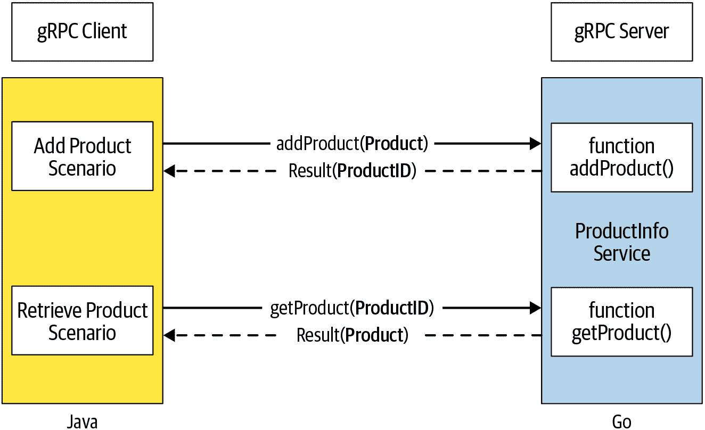
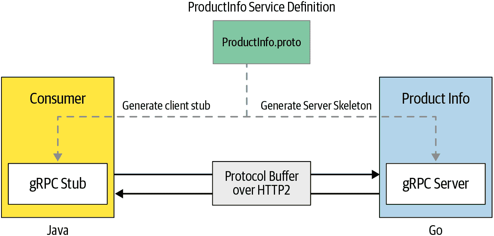

# 第二章：gRPC 入门

关于 gRPC 的理论就到此为止；让我们应用您在第一章学到的知识来从头开始构建一个真实的 gRPC 应用程序。在本章中，您将使用 Go 和 Java 构建一个简单的 gRPC 服务和一个调用您开发的服务的客户端应用程序。在此过程中，您将学习如何使用协议缓冲区指定 gRPC 服务定义，生成服务器框架和客户端存根，实现服务的业务逻辑，运行具有您实现的服务的 gRPC 服务器，并通过 gRPC 客户端应用程序调用服务。

让我们使用与第一章相同的在线零售系统，我们需要构建一个负责管理零售店产品的服务。该服务可以远程访问，服务的消费者可以通过提供产品 ID 来向系统中添加新产品，并从系统中检索产品详细信息。我们将使用 gRPC 对这个服务和消费者进行建模。您可以选择任意编程语言来实现这一点，但在本章中，我们将使用 Go 和 Java 语言来实现这个示例。

###### 注意

您可以在本书的源代码存储库中尝试这个示例的 Go 和 Java 实现。

在图 2-1 中，我们说明了`ProductInfo`服务的客户端-服务器通信模式，每个方法调用的方式。服务器托管一个 gRPC 服务，提供两个远程方法：`addProduct(product)`和`getProduct(productId)`。客户端可以调用这两个远程方法之一。



###### 图 2-1\. 产品信息服务的客户端-服务器交互

让我们从创建`ProductInfo` gRPC 服务的服务定义开始构建这个示例。

# 创建服务定义

正如您在第一章中学到的，当您开发 gRPC 应用程序时，首先要做的是定义服务接口。该接口包含允许消费者远程调用的方法，调用这些方法时要使用的方法参数和消息格式等。所有这些服务定义都记录在[协议缓冲区的定义](https://oreil.ly/1X5Ws)中，这是 gRPC 中使用的接口定义语言（IDL）。

###### 注意

我们将在第三章中进一步探讨不同消息模式的服务定义技术。我们还将在第四章中详细介绍协议缓冲区和 gRPC 实现细节。

一旦确定了服务的业务能力，就可以定义服务接口以满足业务需求。在我们的示例中，我们可以识别出`ProductInfo`服务中的两个远程方法（`addProduct(product)`和`getProduct(productId)`）以及两个消息类型（`Product`和`ProductID`），这两个方法都接受和返回。

下一步是将这些服务定义指定为协议缓冲定义。使用协议缓冲，我们可以定义服务和消息类型。服务由其方法组成，每个方法由其类型、输入和输出参数定义。消息由其字段组成，每个字段由其类型和唯一索引值定义。让我们深入了解定义消息结构的详细信息。

## 定义消息

*消息*是在客户端和服务之间交换的数据结构。正如您在 图 2-1 中看到的那样，我们的`ProductInfo`用例有两种消息类型。一种是产品信息（`Product`），在向系统中添加新产品时需要，并在检索特定产品时返回。另一种是产品的唯一标识（`ProductID`），在从系统中检索特定产品时需要，并在添加新产品时返回：

`ProductID`

`ProductID`是产品的唯一标识符，可以是字符串值。我们可以定义自己的消息类型，其中包含一个字符串字段，或者使用由 Protocol Buffer 库提供的`google.protobuf.StringValue`这种已知消息类型。在这个示例中，我们将定义自己的消息类型，其中包含一个字符串字段。`ProductID`消息类型的定义如 示例 2-1 所示。

##### 示例 2-1\. `ProductID`消息类型的 Protocol Buffer 定义。

```go
message ProductID {
   string value = 1;
}
```

`Product`

`Product`是我们在线零售应用中表示产品应该存在的数据的自定义消息类型。它可以包含一组字段，每个字段表示与每个产品相关联的数据。假设`Product`消息类型具有以下字段：

`ID`

产品的唯一标识符

`名称`

产品名称

`描述`

产品描述

`价格`

产品价格

然后我们可以使用协议缓冲定义我们的自定义消息类型，如 示例 2-2 所示。

##### 示例 2-2\. `Product`消息类型的 Protocol Buffer 定义

```go
message Product {
   string id = 1;
   string name = 2;
   string description = 3;
   float price = 4;
}
```

这里分配给每个消息字段的数字用于唯一标识消息中的字段。因此，在同一消息定义中，我们不能使用相同的数字来标识两个不同的字段。当我们定义协议缓冲消息时，我们将进一步深入探讨消息定义技术的细节，并解释为什么需要为每个字段提供一个唯一的数字，在 第四章 中说明这一点。目前，您可以将其视为定义协议缓冲消息时的一个规则。

###### 注意

protobuf 库为一组已知类型提供了协议缓冲区消息类型。因此，我们可以重用它们，而不是在服务定义中再次定义这些类型。您可以在 [协议缓冲区文档](https://oreil.ly/D8Ysn) 中获取有关这些已知类型的更多详细信息。

由于我们已经完成了 `ProductInfo` 服务的消息类型定义，现在可以继续进行服务接口的定义。

## 定义服务

*服务* 是向客户端暴露的一组远程方法。在我们的示例中，`ProductInfo` 服务有两个远程方法：`addProduct(product)` 和 `getProduct(productId)`。根据协议缓冲区规则，远程方法中只能有一个输入参数，并且只能返回一个值。如果需要像 `addProduct` 方法中那样传递多个值给方法，我们需要定义一个消息类型，并像我们在 `Product` 消息类型中所做的那样将所有值分组：

`addProduct`

在系统中创建一个新的 `Product`。它需要产品的详细信息作为输入，并且如果操作成功完成，则返回新添加产品的产品标识号。Example 2-3 展示了 `addProduct` 方法的定义。

##### 示例 2-3\. *addProduct* 方法的协议缓冲区定义

```go
rpc addProduct(Product) returns (google.protobuf.StringValue);
```

`getProduct`

检索产品信息。它需要 `ProductID` 作为输入，并且如果系统中存在特定产品，则返回 `Product` 的详细信息。Example 2-4 展示了 `getProduct` 方法的定义。

##### 示例 2-4\. *getProduct* 方法的协议缓冲区定义

```go
rpc getProduct(google.protobuf.StringValue) returns (Product);
```

结合所有消息和服务，我们现在有了一个完整的协议缓冲区定义，用于我们的 `ProductInfo` 使用案例，如 Example 2-5 所示。

##### 示例 2-5\. 使用协议缓冲区的 ProductInfo 服务的 gRPC 服务定义

```go
syntax = "proto3"; 
package ecommerce; 

service ProductInfo { 
    rpc addProduct(Product) returns (ProductID); 
    rpc getProduct(ProductID) returns (Product); 
}

message Product { 
    string id = 1; 
    string name = 2;
    string description = 3;
}

message ProductID { 
    string value = 1;
}
```


服务定义始于指定的协议缓冲区版本（proto3）的说明。


包名用于避免协议消息类型之间的名称冲突，并且将用于生成代码。


服务接口的定义。


远程方法添加产品，返回产品 ID 作为响应。


基于产品 ID 获取产品的远程方法。


`Product` 的消息格式/类型定义。


包含产品 ID 的字段（名称-值对），其唯一字段编号用于在消息二进制格式中标识您的字段。


ProductID 的消息格式/类型定义。

在协议缓冲定义中，我们可以指定一个包名（例如 `ecommerce`），这有助于防止不同项目之间的命名冲突。当我们使用带有包的服务定义生成我们的服务或客户端的代码时（除非我们显式指定不同的包用于代码生成），相同的包（当然，只有在语言支持 *包* 的概念时）将在相应的编程语言中创建。我们还可以使用带有版本号的包名，如 `ecommerce.v1` 和 `ecommerce.v2`。因此，API 的未来主要更改可以共存于同一代码库中。

###### 注意

像 IntelliJ IDEA、Eclipse、VSCode 等常用的集成开发环境现在都有支持协议缓冲的插件。您可以将插件安装到您的 IDE 中，并轻松为您的服务创建协议缓冲定义。

这里还应提及另一个过程，即从另一个 proto 文件导入。如果我们需要使用其他 proto 文件中定义的消息类型，我们可以将它们导入到我们的协议缓冲定义中。例如，如果我们想要使用在 *wrappers.proto* 文件中定义的 `StringValue` 类型（`google.protobuf.StringValue`），我们可以在我们的定义中导入 *google/protobuf/wrappers.proto* 文件如下所示：

```go
syntax = "proto3";

import "google/protobuf/wrappers.proto";

package ecommerce;
...
```

完成服务定义的规范后，您可以继续实现 gRPC 服务和客户端。

# 实现

让我们实现一个 gRPC 服务，该服务包含我们在服务定义中指定的一组远程方法。这些远程方法由服务器公开，gRPC 客户端连接到服务器并调用这些远程方法。

如图 Figure 2-2 所示，我们首先需要编译 `ProductInfo` 服务定义并为所选语言生成源代码。gRPC 默认支持所有流行语言如 Java、Go、Python、Ruby、C、C++、Node 等。您可以选择在实现服务或客户端时使用哪种语言。gRPC 还跨越多种语言和平台工作，这意味着您可以在应用程序中将服务器编写为一种语言，将客户端编写为另一种语言。在我们的示例中，我们将使用 Go 和 Java 两种语言开发我们的客户端和服务器，因此您可以选择使用您偏好的实现。

为了从服务定义中生成源代码，我们可以手动编译 proto 文件使用 [协议缓冲编译器](https://oreil.ly/CYEbY)，或者我们可以使用像 Bazel、Maven 或 Gradle 这样的构建自动化工具。这些自动化工具已经定义了一组规则，在构建项目时生成代码。通常，集成现有的构建工具来生成 gRPC 服务和客户端的源代码更加容易。



###### 图 2-2\. 基于服务定义的微服务和消费者

在此示例中，我们将使用 Gradle 构建 Java 应用程序，并使用 Gradle 协议缓冲插件生成服务和客户端代码。对于 Go 应用程序，我们将使用协议缓冲编译器生成代码。

让我们开始实现 Go 和 Java 中的 gRPC 服务器和客户端。在此之前，请确保您的本地机器上已安装了 Java 7 或更高版本以及 Go 1.11 或更高版本。

## 开发一个服务

当您生成服务骨架代码时，您将获得建立 gRPC 通信所需的低级代码，相关的消息类型和接口。服务实现的任务就是实现与代码生成步骤一起生成的接口。让我们从实现 Go 服务开始，然后我们将看看如何在 Java 语言中实现相同的服务。

### 使用 Go 实现 gRPC 服务

实现 Go 服务有三个步骤。首先，我们需要为服务定义生成存根，然后实现服务所有远程方法的业务逻辑，最后创建一个在指定端口监听并注册服务以接受客户端请求的服务器。让我们从创建一个新的 Go 模块开始。在这里，我们将创建一个模块和模块内的一个子目录；模块 `productinfo/service` 用于保持服务代码，而子目录 (`ecommerce`) 用于保存自动生成的存根文件。在 *productinfo* 目录中创建一个名为 *service* 的目录。进入 *service* 目录并执行以下命令以创建模块 `productinfo/service`：

```go
go mod init productinfo/service
```

一旦创建模块并在模块内部创建一个子目录，您将获得以下模块结构：

```go
└─ productinfo
           └─ service
                 ├── go.mod
                 ├ . . .
                 └── ecommerce
                         └── . . .
```

我们还需要使用 *go.mod* 文件更新特定版本的依赖项，如下所示：

```go
module productinfo/service

require (
  github.com/gofrs/uuid v3.2.0
  github.com/golang/protobuf v1.3.2
  github.com/google/uuid v1.1.1
  google.golang.org/grpc v1.24.0
)
```

###### 注意

从 Go 1.11 开始，引入了一个称为 *模块* 的新概念，允许开发人员在 GOPATH 之外的任何位置创建和构建 Go 项目。要创建一个 Go 模块，我们需要在 `$GOPATH/src` 之外的任何位置创建一个新目录，并在该目录内执行以下命令，以模块名称初始化模块：

`go mod init <module_name>`

一旦初始化模块，将在模块根目录内创建一个 *go.mod* 文件。然后我们可以在模块内部创建我们的 Go 源文件并构建它。Go 通过使用 *go.mod* 中列出的特定依赖模块版本解析导入。

#### 生成客户端/服务器存根

现在我们将手动生成客户端/服务器存根，使用协议缓冲编译器。为此，我们需要满足以下一系列先决条件：

+   从[GitHub 发行页面](https://oreil.ly/Ez8qu)下载并安装最新的协议缓冲器版本 3 编译器。

###### 注意

在下载编译器时，需要选择适合您平台的编译器。例如，如果您使用的是 64 位 Linux 机器，并且需要获取协议缓冲区编译器版本 x.x.x，您需要下载 *protoc-x.x.x-linux-x86_64.zip* 文件。

+   使用以下命令安装 gRPC 库：

```go
go get -u google.golang.org/grpc
```

+   使用以下命令安装 Go 的 protoc 插件：

```go
go get -u github.com/golang/protobuf/protoc-gen-go
```

当我们满足所有先决条件后，可以按照以下示例执行 protoc 命令来生成服务定义的代码：

```go
protoc -I ecommerce \ 
  ecommerce/product_info.proto \ 
  --go_out=plugins=grpc:<module_dir_path>/ecommerce 
```


指定源 proto 文件和依赖 proto 文件所在的目录路径（使用 `--proto_path` 或 `-I` 命令行标志指定）。如果不指定值，则使用当前目录作为源目录。在目录内，我们需要按照包名排列依赖的 proto 文件。


指定要编译的 proto 文件路径。编译器将读取文件并生成输出的 Go 文件。


指定您希望生成的代码去的目标目录。

当我们执行命令时，会在模块中给定的子目录（*ecommerce*）内生成一个存根文件（*product_info.pb.go*）。现在我们已生成了存根，需要使用生成的代码实现我们的业务逻辑。

#### 实现业务逻辑

首先，让我们在 Go 模块（*productinfo/service*）内创建一个名为 *productinfo_service.go* 的新 Go 文件，并按 示例 2-6 中显示的方式实现远程方法。

##### 示例 2-6\. 在 Go 中实现 *ProductInfo* 服务的 gRPC 服务实现

```go
package main

import (
  "context"
  "errors"
  "log"

"github.com/gofrs/uuid"
pb "productinfo/service/ecommerce" 

)

// server is used to implement ecommerce/product_info. type server struct{ 
  productMap map[string]*pb.Product
}

// AddProduct implements ecommerce.AddProduct func (s *server) AddProduct(ctx context.Context,
                    in *pb.Product) (*pb.ProductID, error) { 
  out, err := uuid.NewV4()
  if err != nil {
     return nil, status.Errorf(codes.Internal,
         "Error while generating Product ID", err)
  }
  in.Id = out.String()
  if s.productMap == nil {
     s.productMap = make(map[string]*pb.Product)
  }
  s.productMap[in.Id] = in
  return &pb.ProductID{Value: in.Id}, status.New(codes.OK, "").Err()

}

// GetProduct implements ecommerce.GetProduct func (s *server) GetProduct(ctx context.Context, in *pb.ProductID)
                              (*pb.Product, error) { 
  value, exists := s.productMap[in.Value]
  if exists {
    return value, status.New(codes.OK, "").Err()
  }
  return nil, status.Errorf(codes.NotFound, "Product does not exist.", in.Value)

}
```


导入包含从 protobuf 编译器生成的代码的包。


`server` 结构体是服务器的抽象。它允许将服务方法附加到服务器上。


`AddProduct` 方法以 `Product` 作为参数，并返回一个 `ProductID`。`Product` 和 `ProductID` 结构在 *product_info.pb.go* 文件中定义，该文件是从 *product_info.proto* 定义自动生成的。


`GetProduct` 方法以 `ProductID` 作为参数，并返回一个 `Product`。


这两个方法都有一个 `Context` 参数。`Context` 对象包含元数据，例如最终用户身份验证令牌的标识和请求的截止时间，并且在请求的生命周期内存在。


这两种方法除了远程方法的返回值之外，还返回一个错误（方法有多种返回类型）。这些错误会传播到消费者，并可用于在消费者端进行错误处理。

这就是您必须为 `ProductInfo` 服务实现业务逻辑的所有内容。然后，我们可以创建一个简单的服务器来托管服务并接受来自客户端的请求。

#### 创建一个 Go 服务器

要在 Go 中创建服务器，让我们在同一个 Go 包（`productinfo/service`）中创建一个名为 *main.go* 的新 Go 文件，并按照示例 2-7 中显示的方式实现 `main` 方法。

##### 示例 2-7\. 在 Go 中实现 gRPC 服务器以托管 ProductInfo 服务

```go
package main

import (
  "log"
  "net"

  pb "productinfo/service/ecommerce" 
  "google.golang.org/grpc"
)

const (
  port = ":50051"
)

func main() {
  lis, err := net.Listen("tcp", port) 
  if err != nil {
     log.Fatalf("failed to listen: %v", err)
  }
  s := grpc.NewServer() 
  pb.RegisterProductInfoServer(s, &server{}) 

  log.Printf("Starting gRPC listener on port " + port)
  if err := s.Serve(lis); err != nil { 
     log.Fatalf("failed to serve: %v", err)
  }
}
```


导入包含从 protobuf 编译器刚刚创建的生成代码的包。


我们希望 gRPC 服务器绑定到的 TCP 监听器创建在端口（50051）上。


通过调用 gRPC Go API 创建新的 gRPC 服务器实例。


先前实现的服务通过调用生成的 API 注册到新创建的 gRPC 服务器上。


开始监听端口（50051）传入的消息。

现在，我们已经完成了在 Go 语言中为我们的业务用例构建 gRPC 服务。同时，我们还创建了一个简单的服务器，用于公开服务方法并接受来自 gRPC 客户端的消息。

如果您喜欢使用 Java 构建服务，我们可以使用 Java 实现相同的服务。实现过程与 Go 非常相似。因此，让我们使用 Java 语言创建相同的服务。但是，如果您有兴趣在 Go 中构建客户端应用程序，请直接转到“开发 gRPC 客户端”。

### 使用 Java 实现 gRPC 服务

创建 Java gRPC 项目时，最佳方法是使用像 Gradle、Maven 或 Bazel 这样的现有构建工具，因为它管理所有依赖项和代码生成等。在我们的示例中，我们将使用 Gradle 管理项目，并讨论如何使用 Gradle 创建 Java 项目以及如何实现服务的所有远程方法的业务逻辑。最后，我们将创建一个服务器并注册服务以接受客户端请求。

###### 注意

Gradle 是一个支持多种语言（包括 Java、Scala、Android、C/C++ 和 Groovy）的构建自动化工具，并与 Eclipse 和 IntelliJ IDEA 等开发工具紧密集成。您可以按照[官方页面](https://gradle.org/install)上给出的步骤在您的机器上安装 Gradle。

#### 设置一个 Java 项目

让我们首先创建一个 Gradle Java 项目（`product-info-service`）。创建项目后，您将获得以下项目结构：

```go
 product-info-service

  ├── build.gradle
  ├ . . .
  └── src
      ├── main
      │   ├── java
      │   └── resources
      └── test
          ├── java
          └── resources
```

在*src/main*目录下创建一个*proto*目录，并将我们的`ProductInfo`服务定义文件（*.proto*文件）添加到*proto*目录中。

接下来，您需要更新*build.gradle*文件并添加依赖项和 Gradle 的 protobuf 插件。根据 Example 2-8 更新*build.gradle*文件。

##### Example 2-8\. gRPC Java 项目的 Gradle 配置

```go
apply plugin: 'java'
apply plugin: 'com.google.protobuf'

repositories {
   mavenCentral()
}

def grpcVersion = '1.24.1' 

dependencies { 
   compile "io.grpc:grpc-netty:${grpcVersion}"
   compile "io.grpc:grpc-protobuf:${grpcVersion}"
   compile "io.grpc:grpc-stub:${grpcVersion}"
   compile 'com.google.protobuf:protobuf-java:3.9.2'
}

buildscript {
   repositories {
       mavenCentral()
   }
   dependencies { 

       classpath 'com.google.protobuf:protobuf-gradle-plugin:0.8.10'
   }
}

protobuf { 
   protoc {
       artifact = 'com.google.protobuf:protoc:3.9.2'
   }
   plugins {
       grpc {
           artifact = "io.grpc:protoc-gen-grpc-java:${grpcVersion}"
       }
   }
   generateProtoTasks {
       all()*.plugins {
           grpc {}
       }
   }
}

sourceSets { 
   main {
       java {
           srcDirs 'build/generated/source/proto/main/grpc'
           srcDirs 'build/generated/source/proto/main/java'
       }
   }
}

jar { 
   manifest {
       attributes "Main-Class": "ecommerce.ProductInfoServer"
   }
   from {
       configurations.compile.collect { it.isDirectory() ? it : zipTree(it) }
   }
}

apply plugin: 'application'

startScripts.enabled = false
```


在 Gradle 项目中使用的 gRPC Java 库版本。


我们在此项目中需要使用的外部依赖项。


我们在项目中使用的 Gradle protobuf 插件版本。如果您的 Gradle 版本低于 2.12，请使用插件版本 0.7.5。


在 protobuf 插件中，我们需要指定 protobuf 编译器版本和 protobuf Java 可执行版本。


此内容用于通知像 IntelliJ IDEA、Eclipse 或 NetBeans 等 IDE 有关生成代码的信息。


配置在运行应用程序时使用的主类。

然后运行以下命令来构建库并从 protobuf 构建插件生成存根代码：

```go
$ ./gradle build
```

现在我们已经准备好了带有自动生成代码的 Java 项目。让我们实现服务接口，并向远程方法添加业务逻辑。

#### 实现业务逻辑

首先，让我们在*src/main/java*源目录下创建 Java 包(`ecommerce`)，并在包内创建一个 Java 类(*ProductInfoImpl.java*)。然后，根据 Example 2-9 实现远程方法。

##### Example 2-9\. Java 中*ProductInfo*服务的 gRPC 服务实现

```go
package ecommerce;

import io.grpc.Status;
import io.grpc.StatusException;

import java.util.HashMap;
import java.util.Map;
import java.util.UUID;

public class ProductInfoImpl extends ProductInfoGrpc.ProductInfoImplBase { 

   private Map productMap = new HashMap<String, ProductInfoOuterClass.Product>();

   @Override
  public void addProduct(
       ProductInfoOuterClass.Product request,
      io.grpc.stub.StreamObserver
           <ProductInfoOuterClass.ProductID> responseObserver ) { 
       UUID uuid = UUID.randomUUID();
       String randomUUIDString = uuid.toString();
       productMap.put(randomUUIDString, request);
       ProductInfoOuterClass.ProductID id =
           ProductInfoOuterClass.ProductID.newBuilder()
           .setValue(randomUUIDString).build();
       responseObserver.onNext(id); 
       responseObserver.onCompleted(); 
   }

   @Override
  public void getProduct(
       ProductInfoOuterClass.ProductID request,
       io.grpc.stub.StreamObserver
            <ProductInfoOuterClass.Product> responseObserver ) { 
       String id = request.getValue();
       if (productMap.containsKey(id)) {
           responseObserver.onNext(
                (ProductInfoOuterClass.Product) productMap.get(id)); 
           responseObserver.onCompleted(); 
       } else {
           responseObserver.onError(new StatusException(Status.NOT_FOUND)); 
       }
   }
}
```


扩展自插件生成的抽象类(`ProductInfoGrpc.ProductInfoImplBase`)。这将允许在服务定义中定义的`AddProduct`和`GetProduct`方法中添加业务逻辑。


`AddProduct`方法以`Product(ProductInfoOuterClass.Product)`作为参数。`Product`类定义在`ProductInfoOuterClass`类中，该类是从服务定义生成的。


`GetProduct`方法以`ProductID(ProductInfoOuterClass.ProductID)`作为参数。`ProductID`类定义在`ProductInfoOuterClass`类中，该类是从服务定义生成的。


`responseObserver`对象用于将响应发送回客户端并关闭流。


将响应发送回客户端。


通过关闭流来结束客户端调用。


向客户端发送一个错误。

这就是您需要在 Java 中实现 `ProductInfo` 服务的业务逻辑的全部内容。然后，我们可以创建一个简单的服务器来托管服务并接受来自客户端的请求。

#### 创建一个 Java 服务器

为了将我们的服务暴露给外部，我们需要创建一个 gRPC 服务器实例，并将我们的 `ProductInfo` 服务注册到服务器中。服务器将在指定的端口上监听，并将所有请求分派到相关的服务上。让我们在包内创建一个主类（*ProductInfoServer.java*），如 Example 2-10 中所示。

##### Example 2-10\. 在 Java 中托管 ProductInfo 服务的 gRPC 服务器实现

```go
package ecommerce;

import io.grpc.Server;
import io.grpc.ServerBuilder;

import java.io.IOException;

public class ProductInfoServer {

   public static void main(String[] args)
           throws IOException, InterruptedException {
       int port = 50051;
       Server server = ServerBuilder.forPort(port) 
               .addService(new ProductInfoImpl())
               .build()
               .start();
       System.out.println("Server started, listening on " + port);
       Runtime.getRuntime().addShutdownHook(new Thread(() -> { 
           System.err.println("Shutting down gRPC server since JVM is " +
                "shutting down");
           if (server != null) {
               server.shutdown();
           }
           System.err.println(“Server shut down");
       }));
       server.awaitTermination(); 
   }
}
```


服务器实例创建在端口 50051 上。这是我们希望服务器绑定并监听传入消息的端口。我们的 `ProductInfo` 服务实现添加到了服务器中。


当 JVM 关闭时，添加运行时关闭钩子以关闭 gRPC 服务器。


在方法结束时，保持服务器线程直到服务器终止。

现在我们已经完成了两种语言中的 gRPC 服务的实现。接下来，我们可以进行 gRPC 客户端的实现。

## 开发 gRPC 客户端

就像我们实现 gRPC 服务一样，现在我们可以讨论如何创建一个应用程序来与服务器通信。让我们从服务定义中生成客户端存根开始。在生成的客户端存根之上，我们可以创建一个简单的 gRPC 客户端来连接我们的 gRPC 服务器，并调用其提供的远程方法。

在这个示例中，我们将使用 Java 和 Go 两种语言编写客户端应用程序。但是您不需要在同一种语言或平台上创建您的服务器和客户端。由于 gRPC 跨语言和跨平台工作，您可以在任何支持的语言中创建它们。让我们先讨论 Go 的实现。如果您对 Java 实现感兴趣，可以跳过下一节，直接进入 Java 客户端。

### 实现 gRPC Go 客户端

让我们首先创建一个新的 Go 模块 (`productinfo/client`)，并在模块内部创建一个子目录 (*ecommerce*)。为了实现 Go 客户端应用程序，我们还需要生成存根，就像我们在实现 Go 服务时所做的那样。由于我们需要创建相同的文件 (*product_info.pb.go*) 并需要遵循生成存根的相同步骤，我们不会在此处详述。请参考 “生成客户端/服务器存根” 以生成存根文件。

让我们在 Go 模块 (`productinfo/client`) 中创建一个名为 *productinfo_client.go* 的新文件，并实现主方法来调用远程方法，如 Example 2-11 中所示。

##### 示例 2-11\. Go 中的 gRPC 客户端应用程序

```go
package main

import (
  "context"
  "log"
  "time"

  pb "productinfo/client/ecommerce" 
  "google.golang.org/grpc"

)

const (
  address = "localhost:50051"
)

func main() {

  conn, err := grpc.Dial(address, grpc.WithInsecure()) 
  if err != nil {
     log.Fatalf("did not connect: %v", err)
  }
  defer conn.Close() 
  c := pb.NewProductInfoClient(conn) 

  name := "Apple iPhone 11"
  description := `Meet Apple iPhone 11\. All-new dual-camera system with
              Ultra Wide and Night mode.`
  price := float32(1000.0)
  ctx, cancel := context.WithTimeout(context.Background(), time.Second) 
  defer cancel()
  r, err := c.AddProduct(ctx,
         &pb.Product{Name: name, Description: description, Price: price})  
  if err != nil {
     log.Fatalf("Could not add product: %v", err)
  }
  log.Printf("Product ID: %s added successfully", r.Value)

  product, err := c.GetProduct(ctx, &pb.ProductID{Value: r.Value}) 
  if err != nil {
    log.Fatalf("Could not get product: %v", err)
  }
  log.Printf("Product: ", product.String())

}
```


导入包含我们从 protobuf 编译器生成的代码的包。


使用提供的地址（“localhost:50051”）建立与服务器的连接。在这里，我们创建了客户端和服务器之间的非安全连接。


传递连接并创建存根。此存根实例包含调用服务器的所有远程方法。


创建一个 `Context` 对象以传递远程调用。这里的 `Context` 对象包含元数据，如最终用户的身份、授权令牌和请求的截止日期，并且在请求的生命周期内都存在。


使用产品详细信息调用 `addProduct` 方法。如果操作成功完成，则返回产品 ID。否则返回错误。


使用产品 ID 调用 `getProduct` 方法。如果操作成功完成，则返回产品详情。否则返回错误。


当所有操作完成后关闭连接。

现在我们已经完成了使用 Go 语言构建 gRPC 客户端的过程。接下来让我们使用 Java 语言创建一个客户端。这不是强制性的步骤。如果您也有兴趣在 Java 中构建 gRPC 客户端，可以继续；否则，您可以跳过下一部分，直接去 “构建和运行”。

### 实现 Java 客户端

要创建 Java 客户端应用程序，我们还需要设置一个 Gradle 项目（`product-info-client`）并使用 Gradle 插件生成类，就像我们在实现 Java 服务时所做的那样。请按照 “设置 Java 项目” 中的步骤设置 Java 客户端项目。

一旦通过 Gradle 构建工具为您的项目生成了客户端存根代码，让我们在 `ecommerce` 包内创建一个名为 `ProductInfoClient` 的新类，并添加 示例 2-12 中的内容。

##### 示例 2-12\. Java 中的 gRPC 客户端应用程序

```go
package ecommerce;

import io.grpc.ManagedChannel;
import io.grpc.ManagedChannelBuilder;

import java.util.logging.Logger;

/**
* gRPC client sample for productInfo service.
*/
public class ProductInfoClient {

   public static void main(String[] args) throws InterruptedException {
       ManagedChannel channel = ManagedChannelBuilder
           .forAddress("localhost", 50051) 
           .usePlaintext()
           .build();

       ProductInfoGrpc.ProductInfoBlockingStub stub =
              ProductInfoGrpc.newBlockingStub(channel); 

       ProductInfoOuterClass.ProductID productID = stub.addProduct(    
               ProductInfoOuterClass.Product.newBuilder()
                       .setName("Apple iPhone 11")
                       .setDescription("Meet Apple iPhone 11\. " +
                            All-new dual-camera system with " +
                            "Ultra Wide and Night mode.");
                       .setPrice(1000.0f)
                       .build());
       System.out.println(productID.getValue());

       ProductInfoOuterClass.Product product = stub.getProduct(productID);  
       System.out.println(product.toString());
       channel.shutdown(); 
   }
}
```


创建一个 gRPC 通道，指定我们要连接到的服务器地址和端口。在这里，我们尝试连接运行在同一台机器上并监听端口 50051 的服务器。我们还启用了明文传输，这意味着我们正在设置客户端和服务器之间的非安全连接。


使用新创建的通道创建客户端存根。我们可以创建两种类型的存根。一种是 `BlockingStub`，它会等待接收服务器响应。另一种是 `NonBlockingStub`，它不会等待服务器响应，而是注册一个观察者来接收响应。在本例中，我们使用 `BlockingStub` 来简化客户端。


使用产品详细信息调用 `addProduct` 方法。如果操作成功完成，将返回产品 ID。


使用产品 ID 调用 `getProduct`。如果操作成功完成，将返回产品详细信息。


当一切都完成后关闭连接，以确保我们应用程序中使用的网络资源在我们完成后安全地返回。

现在我们已经完成了开发 gRPC 客户端的工作。让我们让客户端和服务器相互通信。

# 构建和运行

现在是时候构建和运行我们创建的 gRPC 服务器和客户端应用程序了。您可以在本地机器、虚拟机、Docker 或 Kubernetes 上部署和运行 gRPC 应用程序。在本节中，我们将讨论如何在本地机器上构建和运行 gRPC 服务器和客户端应用程序。

###### 注意

我们将在 第七章 中介绍如何在 Docker 和 Kubernetes 环境中部署和运行 gRPC 应用程序。

让我们在本地运行我们刚刚开发的 gRPC 服务器和客户端应用程序。由于我们的服务器和客户端应用程序使用两种语言编写，我们将分别构建服务器应用程序。

## 构建 Go 服务器

当我们实现 Go 服务时，工作空间中的最终包结构如下所示：

```go
└─ productinfo
           └─ service
                 ├─ go.mod
                 ├─ main.go
                 ├─ productinfo_service.go
                 └─ ecommerce
                    └── product_info.pb.go
```

我们可以构建我们的服务以生成一个服务二进制文件（*bin/server*）。为了构建，首先进入 Go 模块根目录位置（*productinfo/service*），然后执行以下 shell 命令：

```go
$ go build -i -v -o bin/server
```

构建成功后，在 *bin* 目录下创建一个可执行文件（*bin/server*）。

接下来，让我们设置 Go 客户端！

## 构建 Go 客户端

当我们实现 Go 客户端时，工作空间中的包结构如下所示：

```go
└─ productinfo
           └─ client
                ├─ go.mod
                ├──main.go
                └─ ecommerce
                       └── product_info.pb.go
```

我们可以使用以下 shell 命令像构建 Go 服务一样构建客户端代码：

```go
$ go build -i -v -o bin/client
```

构建成功后，在 *bin* 目录下创建一个可执行文件（*bin/client*）。下一步是运行这些文件！

## 运行 Go 服务器和客户端

我们刚刚构建了一个客户端和一个服务器。让我们在不同的终端上运行它们并让它们相互通信：

```go
// Running Server
$ bin/server
2019/08/08 10:17:58 Starting gRPC listener on port :50051

// Running Client
$ bin/client
2019/08/08 11:20:01 Product ID: 5d0e7cdc-b9a0-11e9-93a4-6c96cfe0687d
added successfully
2019/08/08 11:20:01 Product: id:"5d0e7cdc-b9a0-11e9-93a4-6c96cfe0687d"
        name:"Apple iPhone 11"
        description:"Meet Apple iPhone 11\. All-new dual-camera system with
 Ultra Wide and Night mode."
        price:1000
```

接下来我们将构建一个 Java 服务器。

## 构建 Java 服务器

由于我们将 Java 服务实现为 Gradle 项目，我们可以使用以下命令轻松构建项目：

```go
$ gradle build
```

构建成功后，可执行的 JAR 文件（*server.jar*）将创建在 *build/libs* 目录下。

## 构建 Java 客户端

与服务一样，我们可以轻松地使用以下命令构建项目：

```go
$ gradle build
```

一旦构建成功，可执行的 JAR 文件（*client.jar*）将创建在 *build/libs* 目录下。

## 运行 Java 服务器和客户端

我们现在已经用 Java 语言分别构建了客户端和服务器。让我们来运行它们：

```go
$ java -jar build/libs/server.jar
INFO: Server started, listening on 50051

$ java -jar build/libs/client.jar
INFO: Product ID: a143af20-12e6-483e-a28f-15a38b757ea8 added successfully.
INFO: Product: name: "Apple iPhone 11"
description: "Meet Apple iPhone 11\. All-new dual-camera system with
Ultra Wide and Night mode."
price: 1000.0
```

现在我们已经在本地机器上成功构建并运行了示例。一旦成功运行客户端和服务器，客户端应用程序首先使用`addProduct`方法调用产品详细信息，并接收新添加产品的产品标识符作为响应。然后，通过使用产品标识符调用`getProduct`方法来检索新添加的产品详细信息。正如本章前面提到的，我们不需要用相同的语言编写客户端与服务器通信。我们可以运行一个 gRPC Java 服务器和 Go 客户端，它将毫无问题地工作。

这就是本章的结束！

# 摘要

当您开发 gRPC 应用程序时，首先使用协议缓冲区定义服务接口。协议缓冲区是一种语言无关、平台中立、可扩展的机制，用于序列化结构化数据。接下来，为您选择的编程语言生成服务器端和客户端代码，这简化了服务器端和客户端逻辑，提供了低级通信抽象。在服务器端，您实现远程公开的方法的逻辑，并运行绑定服务的 gRPC 服务器。在客户端，您连接到远程 gRPC 服务器，并使用生成的客户端代码调用远程方法。

本章主要介绍如何动手开发和运行 gRPC 服务器和客户端应用程序的经验。按照本节的步骤获得的经验在构建真实的 gRPC 应用程序时非常有用，因为无论使用哪种语言，构建 gRPC 应用程序都需要类似的步骤。因此，在下一章中，我们将进一步扩展您学到的概念和技术，以构建实际的使用案例。
