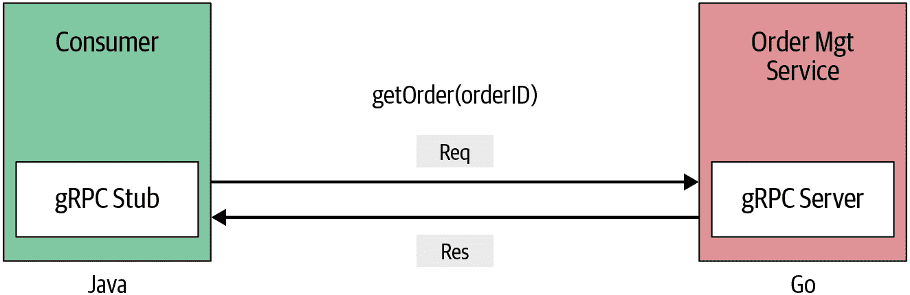
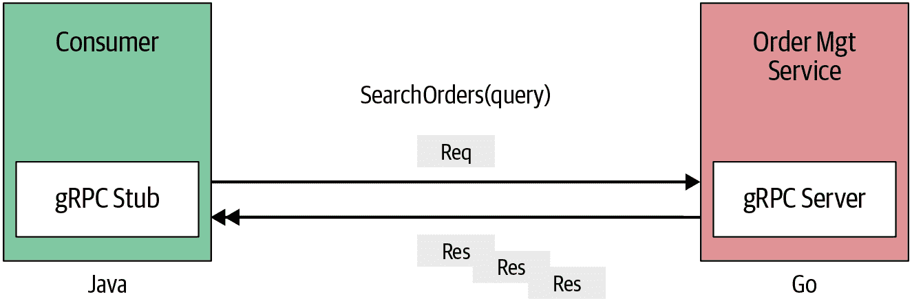
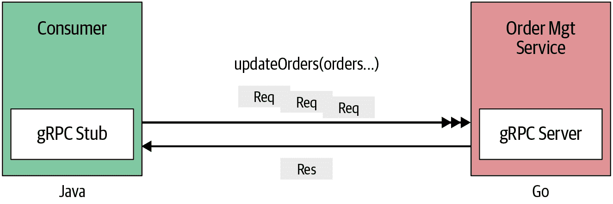
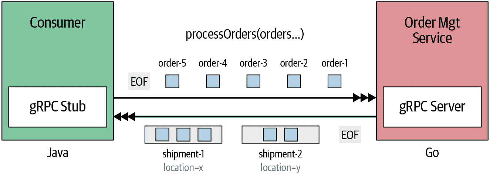
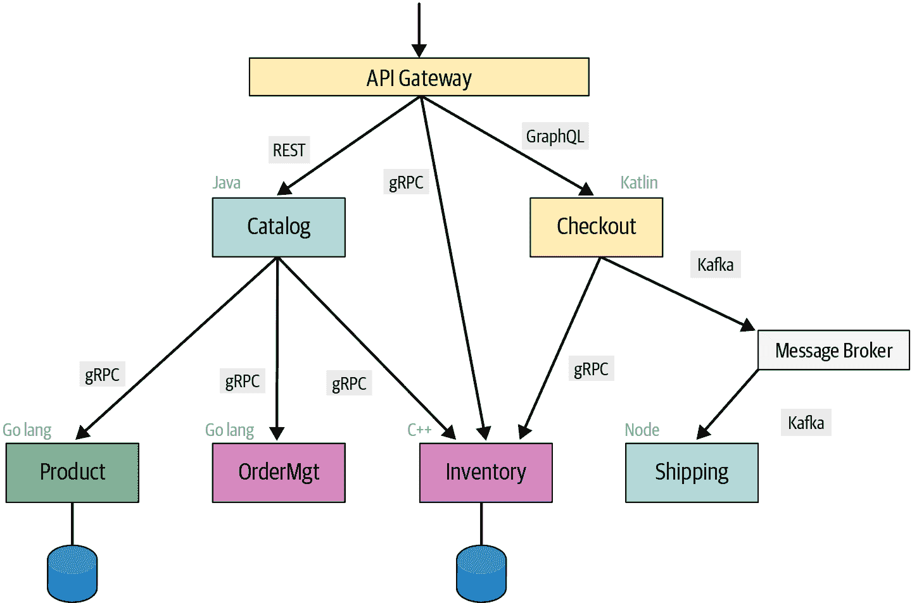

# 第三章：gRPC 通信模式

在前几章中，您学习了 gRPC 的进程间通信技术的基础知识，并获得了构建基于 gRPC 的简单应用程序的实践经验。到目前为止，我们已经定义了一个服务接口，实现了一个服务，运行了一个 gRPC 服务器，并通过 gRPC 客户端应用程序远程调用服务操作。客户端和服务器之间的通信模式是简单的请求-响应式通信，您发送一个请求就会得到一个响应。但是，使用 gRPC，您可以利用除简单请求-响应模式之外的不同进程间通信模式（或 RPC 样式）。

在本章中，我们将探讨 gRPC 应用程序中使用的四种基本通信模式：一元 RPC（简单 RPC）、服务器端流式传输、客户端端流式传输和双向流式传输。我们将使用一些真实用例展示每种模式，使用 gRPC IDL 定义服务定义，并使用 Go 在服务端和客户端实现服务。

###### 注意

**Go 和 Java 代码示例**

为了保持一致性，本章中的所有代码示例均使用 Go 编写。但如果您是 Java 开发人员，您也可以在本书的源代码存储库中找到相同用例的完整 Java 代码示例。

# 简单 RPC（一元 RPC）

让我们从最简单的 RPC 样式，*简单 RPC*，也称为*一元 RPC*开始讨论 gRPC 通信模式。在简单 RPC 中，当客户端调用服务器的远程函数时，客户端向服务器发送一个请求，并获得一个包含状态详细信息和尾部元数据的单个响应。实际上，这正是您在第一章和第二章学到的通信模式。让我们通过一个真实的用例进一步了解简单 RPC 模式。

假设我们需要为基于 gRPC 的在线零售应用程序构建一个`OrderManagement`服务。作为该服务的一部分，我们必须实现一个`getOrder`方法，客户端可以通过提供订单 ID 检索现有订单。如 图 3-1 所示，客户端发送一个带有订单 ID 的单个请求，服务端响应一个包含订单信息的单个响应。因此，它遵循简单 RPC 模式。



###### 图 3-1\. 简单/一元 RPC

现在让我们继续实现这个模式。第一步是为 `OrderManagement` 服务创建服务定义，其中包含 `getOrder` 方法。如 Example 3-1 中的代码片段所示，我们可以使用协议缓冲定义服务定义，并且 `getOrder` 远程方法接收一个单一的请求订单 ID，并响应一个单一的响应，其中包含 `Order` 消息。`Order` 消息具有在此用例中表示订单所需的结构。

##### Example 3-1\. 使用简单 RPC 模式的 OrderManagement 的 getOrder 方法的服务定义

```go
syntax = "proto3";

import "google/protobuf/wrappers.proto"; 

package ecommerce;

service OrderManagement {
    rpc getOrder(google.protobuf.StringValue) returns (Order); 
}

message Order { 
    string id = 1;
    repeated string items = 2; 
    string description = 3;
    float price = 4;
    string destination = 5;
}
```


使用此包以利用诸如 `StringValue` 等的知名类型。


检索订单的远程方法。


定义 `Order` 类型。


`repeated` 用于表示消息中可以重复任意次数（包括零）的字段。这里一个订单消息可以包含任意数量的条目。

然后，使用 gRPC 服务定义 proto 文件，您可以生成服务器框架代码并实现 `getOrder` 方法的逻辑。在 Example 3-2 的代码片段中，我们展示了 `OrderManagement` 服务的 Go 实现。作为 `getOrder` 方法的输入，您将获得一个单一的订单 ID（`String`）作为请求，并且您可以简单地从服务器端查找订单并响应一个 `Order` 消息（`Order` 结构）。可以返回带有 nil 错误的 `Order` 消息，告诉 gRPC 我们已经完成了对 RPC 的处理，并且可以将 `Order` 返回给客户端。

##### Example 3-2\. 使用 Go 实现 OrderManagement 的 getOrder 服务

```go
// server/main.go
func (s *server) GetOrder(ctx context.Context,
	orderId *wrapper.StringValue) (*pb.Order, error) {
     // Service Implementation.
	ord := orderMap[orderId.Value]
	return &ord, nil
}
```

###### 注意

详细说明了 gRPC 服务器和客户端完整消息流的低级细节，这些在 Chapter 4 中有解释。除了我们在您的服务定义中为 `getOrder` 方法指定的方法参数外，您可以观察到在 `OrderManagement` 服务的前述 Go 实现中，方法还传递了另一个 `Context` 参数。`Context` 携带一些如截止时间和取消等构造，这些用于控制 gRPC 的行为。我们将在 Chapter 5 中详细讨论这些概念。

现在让我们实现客户端逻辑，远程调用`getOrder`方法。与服务器端实现一样，你可以生成首选语言的代码以创建客户端存根，然后使用该存根调用服务。在示例 3-3 中，我们使用了 Go gRPC 客户端来调用`OrderManagement`服务。当然，首先要建立与服务器的连接，并启动客户端存根来调用服务。然后，你可以简单地调用客户端存根的`getOrder`方法来远程调用方法。作为响应，你会得到一个包含我们在服务定义中使用协议缓冲区定义的订单信息的`Order`消息。

##### 示例 3-3\. 使用 Go 实现的客户端调用远程方法`getOrder`

```go
// Setting up a connection to the server.
...
orderMgtClient := pb.NewOrderManagementClient(conn)
...

// Get Order
retrievedOrder , err := orderMgtClient.GetOrder(ctx,
       &wrapper.StringValue{Value: "106"})
log.Print("GetOrder Response -> : ", retrievedOrder)
```

简单 RPC 模式非常直接，适合大多数进程间通信用例。该实现在多种编程语言中非常相似，你可以在该书的示例源代码仓库中找到 Go 和 Java 的源代码。

现在，既然你已经对简单 RPC 通信模式有了很好的理解，让我们继续*服务器端流式 RPC*。

# 服务器端流式 RPC

在简单 RPC 中，你总是在 gRPC 服务器和 gRPC 客户端之间的通信中有一个请求和一个响应。在服务器端流式 RPC 中，服务器在收到客户端的请求消息后会返回一系列响应。这一系列的多个响应被称为“流”。在发送所有服务器响应之后，服务器通过向客户端发送服务器状态详细信息作为尾随元数据来标记流的结束。

让我们来看一个真实的用例，进一步理解服务器端流式。在我们的`OrderManagement`服务中，假设我们需要构建一个订单搜索功能，我们可以提供搜索词并获取匹配的结果（图 3-2）。与其一次性发送所有匹配订单，`OrderManagement`服务可以在找到时即时发送订单。这意味着订单服务客户端将会为其发送的单个请求接收到多个响应消息。



###### 图 3-2\. 服务器端流式 RPC

现在让我们在`OrderManagement`服务的 gRPC 服务定义中包含一个`searchOrder`方法。如示例 3-4 所示，方法定义与简单 RPC 非常相似，但作为返回参数，你必须在服务定义的 proto 文件中使用`returns (stream Order)`指定一组订单的*stream*。

##### 示例 3-4\. 带有服务器端流式 RPC 的服务定义

```go
syntax = "proto3";

import "google/protobuf/wrappers.proto";

package ecommerce;

service OrderManagement {
    ...
    rpc searchOrders(google.protobuf.StringValue) returns (stream Order); 
    ...
}

message Order {
    string id = 1;
    repeated string items = 2;
    string description = 3;
    float price = 4;
    string destination = 5;
}
```


定义服务器端流式传输，通过返回`stream`类型的`Order`消息。

根据服务定义，你可以生成服务端代码，然后通过实现生成的接口来构建 `OrderManagement` gRPC 服务中 `searchOrder` 方法的逻辑。在示例 3-5 中展示的 Go 实现中，`SearchOrders` 方法有两个参数：`searchQuery`，一个字符串值，和一个特殊的参数 `OrderManagement_SearchOrdersServer`，用于向其写入我们的响应。`OrderManagement_SearchOrdersServer` 充当流的引用对象，我们可以使用 `Send(…)` 方法向流中写入多个响应。业务逻辑在于查找匹配的订单，并逐个通过流发送它们。一旦所有响应写入流中，你可以通过返回 `nil` 来标记流的结束，服务器状态和其他尾随元数据将发送到客户端。

##### 示例 3-5\. 使用 Go 实现的 OrderManagement 的服务端实现，带有 `searchOrders`。

```go
func (s *server) SearchOrders(searchQuery *wrappers.StringValue,
	stream pb.OrderManagement_SearchOrdersServer) error {

	for key, order := range orderMap {
		log.Print(key, order)
		for _, itemStr := range order.Items {
			log.Print(itemStr)
			if strings.Contains(
				itemStr, searchQuery.Value) { 
				// Send the matching orders in a stream 				err := stream.Send(&order) 
				if err != nil {
				   return fmt.Errorf(
					    "error sending message to stream : %v",
						    err) 
				}
				log.Print("Matching Order Found : " + key)
				break
			}
		}
	}
	return nil
}
```


查找匹配的订单。


发送匹配订单通过流。


检查可能在向客户端流式传输消息时发生的错误。

客户端从客户端发起的远程方法调用与简单的 RPC 非常相似。然而，在这里，你必须处理多个响应，因为服务器将多个响应写入流中。因此，在 gRPC 客户端的 Go 实现中（示例 3-6），我们使用 `Recv()` 方法从客户端流中检索消息，并持续执行，直到流结束。

##### 示例 3-6\. 使用 Go 实现的 OrderManagement 的客户端实现，带有 `searchOrders`。

```go
// Setting up a connection to the server. ...
	c := pb.NewOrderManagementClient(conn)
...
     searchStream, _ := c.SearchOrders(ctx,
     	&wrapper.StringValue{Value: "Google"}) 

	for {
		searchOrder, err := searchStream.Recv() 
		if err == io.EOF { 
			break
		}
           // handle other possible errors 		log.Print("Search Result : ", searchOrder)
	}
```


`SearchOrders` 函数返回一个 `OrderManagement_SearchOrders​Client` 的客户端流，其中包含一个 `Recv` 方法。


调用客户端流的 `Recv()` 方法逐个检索 `Order` 响应。


当找到流的结束时，`Recv` 返回一个 `io.EOF`。

现在让我们看看客户端流式 RPC，这在逻辑上与服务器流式 RPC 正好相反。

# 客户端流式 RPC

在客户端流式 RPC 中，客户端发送多个消息到服务器，而不是单个请求。服务器向客户端发送单个响应。然而，服务器不一定需要等到接收到所有来自客户端的消息后才发送响应。根据此逻辑，你可以在从流中读取一个或几个消息后或者读取所有消息后发送响应。

让我们进一步扩展我们的 `OrderManagement` 服务，以理解客户端流式 RPC。假设您想在 `OrderManagement` 服务中包含一个新方法 `updateOrders`，以更新一组订单（图 3-3）。在这里，我们希望将订单列表作为消息流发送到服务器，并且服务器将处理该流并发送带有订单状态的消息。



###### 图 3-3\. 客户端流式 RPC

然后，我们可以在 `OrderManagement` 服务的服务定义中包含 `updateOrders` 方法，如示例 3-7 所示。您可以简单地将 `stream order` 作为 `updateOrders` 的方法参数，以表示 `updateOrders` 将从客户端接收多条消息作为输入。由于服务器只发送单个响应，返回值是单个字符串消息。

##### 示例 3-7\. 带有客户端流式 RPC 的服务定义。

```go
syntax = "proto3";

import "google/protobuf/wrappers.proto";

package ecommerce;

service OrderManagement {
...
    rpc updateOrders(stream Order) returns (google.protobuf.StringValue);
...
}

message Order {
    string id = 1;
    repeated string items = 2;
    string description = 3;
    float price = 4;
    string destination = 5;
}
```

一旦我们更新了服务定义，我们可以生成服务器端和客户端代码。在服务器端，您需要实现 `OrderManagement` 服务的生成方法接口中的 `UpdateOrders` 方法。在示例 3-8 中显示的 Go 实现中，`UpdateOrders` 方法具有 `OrderManagement_UpdateOrdersServer` 参数，这是从客户端传入消息流的引用对象。因此，您可以通过调用 `Recv()` 方法从该对象中读取消息。根据业务逻辑，您可以读取少量或所有消息，直到流的结束。服务可以通过调用 `OrderManagement_UpdateOrdersServer` 对象的 `SendAndClose` 方法简单地发送其响应，这也标记了服务端消息流的结束。如果服务器决定过早停止从客户端的流中读取消息，则服务器应取消客户端流，以便客户端知道停止生成消息。

##### 示例 3-8\. 在 Go 中实现的 OrderManagement 服务，包含了 `updateOrders` 方法的服务实现。

```go
func (s *server) UpdateOrders(stream pb.OrderManagement_UpdateOrdersServer) error {

	ordersStr := "Updated Order IDs : "
	for {
		order, err := stream.Recv() 
		if err == io.EOF { 
			// Finished reading the order stream. 			return stream.SendAndClose(
				&wrapper.StringValue{Value: "Orders processed "
				+ ordersStr})
		}
		// Update order 		orderMap[order.Id] = *order

		log.Printf("Order ID ", order.Id, ": Updated")
		ordersStr += order.Id + ", "
	}
}
```


从客户端流中读取消息。


检查流的结束。

现在让我们看看客户端流式 RPC 用例的客户端实现。如下 Go 实现所示（示例 3-9），客户端可以通过客户端流引用使用 `updateStream.Send` 方法发送多条消息。一旦所有消息流式传输完毕，客户端可以通过流引用的 `CloseAndRecv` 方法标记流的结束并接收来自服务的响应。

##### 示例 3-9\. 在 Go 中实现的 OrderManagement 的客户端实现，包含了 `updateOrders` 方法。

```go
// Setting up a connection to the server. ...
	c := pb.NewOrderManagementClient(conn)
...
     updateStream, err := client.UpdateOrders(ctx) 

	if err != nil { 
		log.Fatalf("%v.UpdateOrders(_) = _, %v", client, err)
	}

	// Updating order 1 	if err := updateStream.Send(&updOrder1); err != nil { 
		log.Fatalf("%v.Send(%v) = %v",
			updateStream, updOrder1, err) 
	}

	// Updating order 2 	if err := updateStream.Send(&updOrder2); err != nil {
		log.Fatalf("%v.Send(%v) = %v",
			updateStream, updOrder2, err)
	}

	// Updating order 3 	if err := updateStream.Send(&updOrder3); err != nil {
		log.Fatalf("%v.Send(%v) = %v",
			updateStream, updOrder3, err)
	}

	updateRes, err := updateStream.CloseAndRecv() 
	if err != nil {
		log.Fatalf("%v.CloseAndRecv() got error %v, want %v",
			updateStream, err, nil)
	}
	log.Printf("Update Orders Res : %s", updateRes)
```


调用 `UpdateOrders` 远程方法。


处理与 `UpdateOrders` 相关的错误。


通过客户端流发送订单更新。


处理向流发送消息时的错误。


关闭流并接收响应。

作为此功能调用的结果，您会收到服务的响应消息。既然现在您已经很好地理解了服务器流式和客户端流式 RPC，让我们继续讨论双向流式 RPC，这种 RPC 是我们讨论过的 RPC 风格的一种组合。

# 双向流式 RPC

在双向流式 RPC 中，客户端作为一系列消息的流向服务器发送请求。服务器也以消息流的形式响应。调用必须由客户端端发起，但之后的通信完全基于 gRPC 客户端和服务器的应用逻辑。让我们通过一个示例详细了解双向流式 RPC。如图 Figure 3-4 所示，在我们的 `OrderManagement` 服务用例中，假设我们需要订单处理功能，您可以发送连续的订单集（订单流），并根据交付位置将其处理成组合装运（即根据交付目的地将订单组织成装运）。



###### 图 3-4\. 双向流式 RPC

我们可以确定此业务用例的以下关键步骤：

+   客户端应用程序通过与服务器建立连接并发送调用元数据（头部）来启动业务用例。

+   连接设置完成后，客户端应用程序发送一组连续的订单 ID，这些订单需要由 `OrderManagement` 服务处理。

+   每个订单 ID 都作为单独的 gRPC 消息发送到服务器。

+   服务为每个指定的订单 ID 处理每个订单，并根据订单的交付位置将其组织成组合装运。

+   组合装运可能包含多个订单，这些订单应该发送到相同的目的地。

+   订单按批次处理。当达到批次大小时，所有当前创建的组合装运将发送回客户端。

+   例如，一个包含四个订单的有序流，其中两个订单寄送到位置 X，两个寄送到位置 Y，可以表示为 X, Y, X, Y。如果批次大小为三，那么创建的组合订单应该是装运 [X, X]，装运 [Y]，装运 [Y]。这些组合装运也作为流发送回客户端。

此业务用例背后的关键思想是一旦调用 RPC 方法，无论是客户端还是服务端都可以在任意时间发送消息。（这还包括来自任一方的流结束标记。）

现在，让我们继续进行前面用例的服务定义。如示例 3-10 所示，我们可以定义一个`processOrders`方法，使其将字符串流作为方法参数来表示订单 ID 流，并将`CombinedShipments`流作为方法的返回参数。因此，通过将方法参数和返回参数都声明为`stream`，可以定义双向流式 RPC 方法。组合发货消息也在服务定义中声明，并包含订单元素列表。

##### 示例 3-10\. 双向流式 RPC 的服务定义

```go
syntax = "proto3";

import "google/protobuf/wrappers.proto";

package ecommerce;

service OrderManagement {
    ...
    rpc processOrders(stream google.protobuf.StringValue)
        returns (stream CombinedShipment); 
}

message Order { 
    string id = 1;
    repeated string items = 2;
    string description = 3;
    float price = 4;
    string destination = 5;
}

message CombinedShipment { 
    string id = 1;
    string status = 2;
    repeated Order ordersList = 3;
}
```


在双向 RPC 中，方法参数和返回参数均声明为流。


`Order`消息的结构。


`CombinedShipment`消息的结构。

然后我们可以从更新的服务定义生成服务端代码。服务应该实现`OrderManagement`服务的`processOrders`方法。在示例 3-11 中显示的 Go 实现中，`processOrders`方法具有`OrderManagement_ProcessOrdersServer`参数，这是客户端和服务之间消息流的引用对象。使用这个流对象，服务可以读取流到服务器的客户端消息，并将流服务器的消息写回客户端。使用该流引用对象，可以使用`Recv()`方法读取传入消息流。在`processOrders`方法中，服务可以继续读取传入的消息流，同时使用`Send`写入同一流。

###### 注意

为了简化演示，未显示示例 3-10 的部分逻辑。您可以在本书的源代码库中找到完整的代码示例。

##### 示例 3-11\. 使用 Go 实现的 OrderManagement 服务，包含 processOrders 方法

```go
func (s *server) ProcessOrders(
	stream pb.OrderManagement_ProcessOrdersServer) error {
	...
	for {
		orderId, err := stream.Recv() 
		if err == io.EOF {            
			...
			for _, comb := range combinedShipmentMap {
				stream.Send(&comb) 
			}
			return nil               
		}
		if err != nil {
			return err
		}

		// Logic to organize orders into shipments, 		// based on the destination. 		...
		// 
		if batchMarker == orderBatchSize { 
			// Stream combined orders to the client in batches 			for _, comb := range combinedShipmentMap {
				// Send combined shipment to the client 				stream.Send(&comb)      
			}
			batchMarker = 0
			combinedShipmentMap = make(
				map[string]pb.CombinedShipment)
		} else {
			batchMarker++
		}
	}
}
```


从传入流中读取订单 ID。


一直读取，直到找到流的结尾。


当找到流的结尾时，将所有剩余的组合发货发送到客户端。


返回`nil`标记了服务端流的结束。


订单按批次处理。当达到批处理大小时，所有创建的组合发货将流式传输到客户端。


将组合发货写入流。

在这里，我们根据 ID 处理传入的订单，当创建新的组合装运时，服务端将其写入同一流（与客户端流式 RPC 不同，其中我们使用`SendAndClose`来写入并关闭流）。在服务器端，当我们返回`nil`以找到客户端流的末尾时，流的末尾被标记。

客户端实现（示例 3-12）与之前的示例非常相似。当客户端通过`OrderManagement`客户端对象调用`processOrders`方法时，它会得到一个流引用（`streamProcOrder`），用于向服务器发送消息以及从服务器读取消息。

##### 示例 3-12\. 使用 Go 实现的 OrderManagement 客户端，包含了在 processOrders 方法中的实现。

```go
// Process Order streamProcOrder, _ := c.ProcessOrders(ctx) 
	if err := streamProcOrder.Send(
		&wrapper.StringValue{Value:"102"}); err != nil { 
		log.Fatalf("%v.Send(%v) = %v", client, "102", err)
	}

	if err := streamProcOrder.Send(
		&wrapper.StringValue{Value:"103"}); err != nil {
		log.Fatalf("%v.Send(%v) = %v", client, "103", err)
	}

	if err := streamProcOrder.Send(
		&wrapper.StringValue{Value:"104"}); err != nil {
		log.Fatalf("%v.Send(%v) = %v", client, "104", err)
	}

	channel := make(chan struct{})  
    go asncClientBidirectionalRPC(streamProcOrder, channel) 
    time.Sleep(time.Millisecond * 1000)     

	if err := streamProcOrder.Send(
		&wrapper.StringValue{Value:"101"}); err != nil {
		log.Fatalf("%v.Send(%v) = %v", client, "101", err)
	}

	if err := streamProcOrder.CloseSend(); err != nil { 
		log.Fatal(err)
	}

<- channel

func asncClientBidirectionalRPC (
	    streamProcOrder pb.OrderManagement_ProcessOrdersClient,
	    c chan struct{}) {
	for {
		combinedShipment, errProcOrder := streamProcOrder.Recv() 
		if errProcOrder == io.EOF { 
			break
		}
		log.Printf("Combined shipment : ", combinedShipment.OrdersList)
	}
	<-c
}
```


调用远程方法并获取用于从客户端写入和读取的流引用。


向服务端发送消息。


创建一个用于 Goroutines 的通道。


使用 Goroutines 调用函数以并行方式从服务端读取消息。


模拟发送某些消息到服务端时的延迟。


标记客户端流（订单 ID）的流的末尾。


在客户端上读取服务端的消息。


检测流的结束条件。

客户端可以随时向服务端发送消息并关闭流。读取也是如此。在前面的例子中，我们使用 Go 语言的*Goroutines*术语，使用两个并发线程执行客户端消息写入和消息读取逻辑。

# Goroutines

在 Go 语言中，Goroutines 是并行运行的函数或方法，它们可以与其他函数或方法同时运行。可以将它们视为轻量级线程。

因此，客户端可以并行读写同一流，入站和出站流操作完全独立。我们展示的是一个相对复杂的用例，展示了双向 RPC 的强大功能。重要的是要理解，客户端和服务端可以按任意顺序读写——流操作完全独立。因此，一旦建立初始连接，客户端和服务端可以完全自行决定之间的通信模式。

到此为止，我们已经涵盖了用于构建与基于 gRPC 的应用程序交互的所有可能通信模式。在选择通信模式时没有硬性规定，但始终建议分析业务用例，然后选择最合适的模式。

在我们结束对 gRPC 通信模式的讨论之前，重要的是要看一看 gRPC 如何用于微服务通信。

# 使用 gRPC 进行微服务通信

gRPC 的主要用途之一是实现微服务及其服务间通信。在微服务的服务间通信中，gRPC 与其他通信协议一起使用，通常 gRPC 服务被实现为多语言服务（使用不同的编程语言实现）。为了进一步理解这一点，让我们看一个真实世界的场景（见图 3-5），这是在线零售系统的扩展版本，它是我们迄今所讨论的内容的延伸。

在这种场景下，我们有多个微服务来提供在线关系系统的特定业务能力。有一些像`Product`服务这样的服务，它被实现为一个 gRPC 服务，还有一些复合服务如`Catalog`服务，它调用多个下游服务来构建其业务能力。正如我们在第一章中讨论的那样，对于大多数同步消息传递的场景，我们可以使用 gRPC。当您有某些可能需要持久消息传递的异步消息传递场景时，可以使用事件代理或消息代理，如[Kafka](https://kafka.apache.org)，[Active MQ](https://activemq.apache.org)，[RabbitMQ](https://www.rabbitmq.com)，以及[NATS](http://nats.io)。当您必须将某些业务功能暴露给外部世界时，可以使用传统的 REST/OpenAPI 服务或 GraphQL 服务。因此，诸如`Catalog`和`Checkout`之类的服务正在消费基于 gRPC 的后端服务，并且还暴露 RESTful 或基于 GraphQL 的外部接口。



###### 图 3-5\. 使用 gRPC 和其他协议的常见微服务部署模式

在大多数实际应用案例中，这些面向外部的服务通过 API 网关暴露。这是您应用各种非功能性功能（如安全性、节流、版本控制等）的地方。大多数这样的 API 利用诸如 REST 或 GraphQL 等协议。虽然这并不常见，但只要 API 网关支持暴露 gRPC 接口，您也可以将 gRPC 暴露为面向外部的服务。API 网关实现了诸如身份验证、日志记录、版本控制、节流和负载均衡等横切功能。通过在 gRPC API 中使用 API 网关，您能够将此功能部署到核心 gRPC 服务之外。此架构的另一个重要方面是我们可以利用多种编程语言，但共享相同的服务契约（即从同一 gRPC 服务定义生成的代码）。这使我们能够根据服务的业务能力选择适当的实现技术。

# 摘要

gRPC 提供了多种 RPC 通信样式，用于构建基于 gRPC 的应用程序之间的进程间通信。在本章中，我们探讨了四种主要的通信模式。简单 RPC 是最基本的一种，基本上是一种简单的请求-响应式远程过程调用样式。服务器流式 RPC 允许在远程方法第一次调用后，从服务向消费者发送多个消息，而客户端流式允许从客户端向服务发送多个消息。我们深入探讨了如何使用一些真实的用例来实现每个模式的细节。

本章中获得的知识对于实施任何 gRPC 使用案例都非常有用，因此您可以选择最适合您业务的最合适的通信模式。尽管本章为您提供了对 gRPC 通信模式的深入理解，但用户透明的低级通信细节在本章中没有涵盖。在下一章中，我们将深入探讨基于 gRPC 的进程间通信时的低级通信细节。
