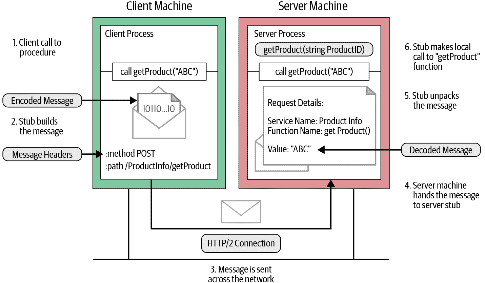

# 第四章\. gRPC: 深入解析

正如您在之前的章节中所学到的，gRPC 应用程序使用 RPC 在网络上进行通信。作为 gRPC 应用程序开发者，您不需要担心 RPC 的具体实现细节，消息编码技术的使用方式，以及 RPC 在网络上的工作原理。您可以使用服务定义为所选择的语言生成服务器端或客户端代码。所有的低级通信细节都在生成的代码中实现，并且您会获得一些高级抽象来进行操作。然而，在构建复杂的基于 gRPC 的系统并将其投入生产时，了解 gRPC 在底层是如何工作的是非常重要的。

在本章中，我们将探讨 gRPC 通信流程的实现方式，使用的编码技术，gRPC 如何利用底层网络通信技术等。我们将为您讲解消息流程，客户端如何调用特定 RPC，然后讨论它如何编组为一个 gRPC 调用并在网络上传输，以及服务器如何进行反编组，并调用相应的服务和远程函数等等。

我们还将看看如何使用协议缓冲作为编码技术和 HTTP/2 作为 gRPC 的通信协议。最后，我们将深入探讨 gRPC 的实现架构以及围绕其构建的语言支持堆栈。尽管我们将在此讨论的低级细节在大多数 gRPC 应用程序中可能用处不大，但如果您正在设计复杂的 gRPC 应用程序或尝试调试现有应用程序，了解低级通信细节是非常有帮助的。

# RPC 流程

在 RPC 系统中，服务器实现一组可远程调用的函数。客户端应用程序可以生成一个提供这些函数抽象的存根，以便客户端应用程序可以直接调用存根函数，从而调用服务器应用程序的远程函数。

让我们看看我们在 第二章 中讨论的 `ProductInfo` 服务，以了解远程过程调用在网络上的工作原理。作为 `ProductInfo` 服务的一部分，我们实现的其中一个函数是 `getProduct`，客户端可以通过提供产品 ID 来检索产品详细信息。图 4-1 描绘了客户端调用远程函数时涉及的操作。



###### 图 4-1\. 远程过程调用在网络上的工作原理

如 图 4-1 所示，当客户端调用生成的存根中的 `getProduct` 函数时，我们可以识别以下关键步骤：


客户端进程调用生成的存根中的 `getProduct` 函数。


客户端存根创建一个带有编码消息的 HTTP POST 请求。在 gRPC 中，所有请求都是带有以 `application/grpc` 为前缀的内容类型的 HTTP POST 请求。它调用的远程函数（`/ProductInfo/getProduct`）作为单独的 HTTP 头发送。


HTTP 请求消息被发送到服务器机器上的网络。


当消息在服务器端接收时，服务器检查消息头以查看需要调用哪个服务函数，并将消息交给服务存根。


服务存根将消息字节解析为特定语言的数据结构。


然后，使用解析后的消息，服务调用本地的 `getProduct` 函数。


服务函数的响应被编码并发送回客户端。响应消息遵循我们在客户端端观察到的相同过程（响应→编码→通过 HTTP 发送的响应）；消息被解包并其值返回给等待的客户端进程。

这些步骤与大多数 RPC 系统（如 CORBA、Java RMI 等）非常相似。gRPC 在这里的主要区别是它编码消息的方式，正如我们在 Figure 4-1 中看到的。对于消息的编码，gRPC 使用协议缓冲区。[协议缓冲区](https://oreil.ly/u9YJI) 是一种语言无关、平台中立、可扩展的机制，用于序列化结构化数据。您定义数据结构的方式一次，然后可以使用专门生成的源代码轻松地将结构化数据写入和从各种数据流中读取。

让我们深入了解 gRPC 如何使用协议缓冲区对消息进行编码。

# 使用协议缓冲区对消息进行编码

正如我们在前几章中讨论的那样，gRPC 使用协议缓冲区为 gRPC 服务编写服务定义。使用协议缓冲区定义服务包括在服务中定义远程方法和定义我们想要通过网络发送的消息。例如，让我们看一下 `ProductInfo` 服务中的 `getProduct` 方法。`getProduct` 方法接受 `ProductID` 消息作为输入参数，并返回 `Product` 消息。我们可以像 Example 4-1 中所示使用协议缓冲区定义这些输入和输出消息结构。

##### Example 4-1\. 使用 `getProduct` 函数定义 `ProductInfo` 服务的服务定义

```go
syntax = "proto3";

package ecommerce;

service ProductInfo {
   rpc getProduct(ProductID) returns (Product);
}

message Product {
   string id = 1;
   string name = 2;
   string description = 3;
   float price = 4;
}

message ProductID {
    string value = 1;
}
```

根据 Example 4-1，`ProductID` 消息携带唯一的产品 ID。因此它只有一个字符串类型的字段。`Product` 消息具有表示产品所需的结构。正确定义消息非常重要，因为消息的定义方式决定了消息如何被编码。我们将在本节稍后讨论消息定义在编码消息时的使用方式。

现在我们有了消息定义，让我们看看如何对消息进行编码并生成等效的字节内容。通常这是由消息定义的生成源代码处理的。所有支持的语言都有自己的编译器来生成源代码。作为应用开发者，您需要传递消息定义并生成源代码以读取和写入消息。

假设我们需要获取产品 ID 为`15`的产品详细信息；我们创建一个值为 15 的消息对象，并将其传递给`getProduct`函数。以下代码片段展示了如何创建一个`ProductID`消息，其值为`15`，并将其传递给`getProduct`函数以检索产品详细信息：

```go
product, err := c.GetProduct(ctx, &pb.ProductID{Value: “15”})
```

此代码片段是用 Go 语言编写的。在这里，`ProductID`消息定义在生成的源代码中。我们创建一个`ProductID`实例，并将值设置为`15`。在 Java 语言中，我们使用生成的方法创建`ProductID`实例，如下所示的代码片段：

```go
ProductInfoOuterClass.Product product = stub.getProduct(
       ProductInfoOuterClass.ProductID.newBuilder()
               .setValue("15").build());
```

在接下来的`ProductID`消息结构中，有一个名为`value`的字段，其字段索引为 1。当我们创建一个带有`value`等于`15`的消息实例时，等效的字节内容包含了`value`字段的字段标识符，后跟其编码值。此字段标识符也称为*标签*：

```go
message ProductID {
    string value = 1;
}
```

这个字节内容结构类似于图 4-2，其中每个消息字段都包含字段标识符和其编码值。


###### 图 4-2\. 协议缓冲编码字节流

此标记构建了两个值：字段索引和线路类型。字段索引是我们在 proto 文件中定义消息时分配给每个消息字段的唯一编号。线路类型基于字段类型，即可以输入字段的数据类型。此线路类型提供信息以查找值的长度。表 4-1 展示了线路类型如何映射到字段类型。这是线路类型和字段类型的预定义映射。您可以参考[官方协议缓冲编码文档](https://oreil.ly/xeLBr)以获取更多关于映射的洞察。

表 4-1\. 可用的线路类型及其对应的字段类型

| 线路类型 | 类别 | 字段类型 |
| --- | --- | --- |
| 0 | 变长整数 | int32、int64、uint32、uint64、sint32、sint64、bool、enum |
| 1 | 64 位 | fixed64、sfixed64、double |
| 2 | 长度限定 | string、bytes、嵌入式消息、打包的重复字段 |
| 3 | 开始组 | 组（已弃用） |
| 4 | 结束组 | 组（已弃用） |
| 5 | 32 位 | fixed32、sfixed32、float |

一旦我们知道某个字段的字段索引和线类型，我们就可以使用以下方程式确定字段的标签值。在此处，我们将字段索引的二进制表示左移三位，并与线类型值的二进制表示进行按位或运算：

```go
Tag value = (field_index << 3) | wire_type
```

图 4-3 展示了字段索引和线类型在标签值中的排列方式。


###### 图 4-3\. 标签值的结构

让我们尝试使用先前使用的示例来理解这些术语。`ProductID` 消息具有一个字符串字段，字段索引为 1，字符串的线类型为 2\. 当我们将它们转换为二进制表示时，字段索引看起来像 00000001，线类型看起来像 00000010\. 当我们将这些值放入前面的方程式中时，标签值 10 派生如下：

```go
Tag value = (00000001 << 3) | 00000010
          = 000 1010
```

下一步是对消息字段的值进行编码。协议缓冲使用不同的编码技术来编码不同类型的数据。例如，如果它是字符串值，则协议缓冲使用 UTF-8 对该值进行编码；如果它是具有 int32 字段类型的整数值，则使用一种称为 varints 的编码技术。我们将在下一节详细讨论不同的编码技术以及何时应用这些技术。现在，我们将讨论如何编码字符串值以完成示例。

在协议缓冲编码中，字符串值使用 UTF-8 编码技术进行编码。UTF-8（Unicode 转换格式）使用 8 位块来表示一个字符。它是一种变长字符编码技术，也是网页和电子邮件中首选的编码技术。

在我们的示例中，`ProductID` 消息中 `value` 字段的值为 15，并且 `15` 的 UTF-8 编码值是 `\x31 \x35`。在 UTF-8 编码中，编码值的长度是不固定的。换句话说，表示编码值所需的 8 位块数是不固定的。它取决于消息字段的值。在我们的示例中，它是两个块。因此，在编码值之前，我们需要传递编码值的长度（编码值跨越的块数）。`15` 的十六进制表示如下：

```go
A 02 31 35
```

这里的两个右手字节是 `15` 的 UTF-8 编码值。值 `0x02` 表示编码的字符串值的长度，以 8 位块为单位。

当消息被编码时，它的标签和值被连接成字节流。图 4-2 说明了当消息具有多个字段时，如何将字段值排列成字节流。流的结尾通过发送标签值为 0 来标记。

我们已经使用协议缓冲完成了对带有字符串字段的简单消息的编码。协议缓冲支持各种字段类型，并且一些字段类型具有不同的编码机制。让我们快速浏览一下协议缓冲使用的编码技术。

## 编码技术

协议缓冲支持许多编码技术。不同的编码技术根据数据类型应用不同的方法。例如，字符串值使用 UTF-8 字符编码进行编码，而 int32 值使用称为 Varints 的技术进行编码。了解每种数据类型在编码时如何处理数据是设计消息定义时非常重要的，因为这样可以为每个消息字段设置最合适的数据类型，从而在运行时高效地编码消息。

在协议缓冲中，支持的字段类型被分类为不同的组，并且每个组使用不同的技术来编码值。在下一节中列出了协议缓冲中一些常用的编码技术。

### 变长整数

变长整数（Varints）是一种使用一个或多个字节序列化整数的方法。它们基于大多数数字不是均匀分布的观念。因此，为每个值分配的字节数并不固定，而是取决于值本身。根据表 4-1，如 int32、int64、uint32、uint64、sint32、sint64、bool 和 enum 等字段类型被分组为 Varints 并编码为 Varints。表 4-2 显示了哪些字段类型被归类为 Varints，并说明了每种类型的用途。

表 4-2. 字段类型定义

| 字段类型 | 定义 |
| --- | --- |
| `int32` | 一个表示带有值范围从负 2,147,483,648 到正 2,147,483,647 的有符号整数的值类型。注意，这种类型不适合编码负数。 |
| `int64` | 一个表示带有值范围从负 9,223,372,036,854,775,808 到正 9,223,372,036,854,775,807 的有符号整数的值类型。注意，这种类型不适合编码负数。 |
| `uint32` | 一个表示无符号整数的值类型，其取值范围从 0 到 4,294,967,295。 |
| `uint64` | 一个表示无符号整数的值类型，其取值范围从 0 到 18,446,744,073,709,551,615。 |
| `sint32` | 一个表示带有值范围从负 2,147,483,648 到正 2,147,483,647 的有符号整数的值类型。相比普通的 int32，这种类型更有效地编码负数。 |
| `sint64` | 一个表示带有值范围从负 9,223,372,036,854,775,808 到正 9,223,372,036,854,775,807 的有符号整数的值类型。相比普通的 int64，这种类型更有效地编码负数。 |
| `bool` | 一个表示两种可能值的值类型，通常表示为 true 或 false。 |
| `enum` | 一个表示一组命名值的值类型。 |

在变长整数中，除了最后一个字节外，每个字节的最高位（MSB）都被设置为指示后续字节的存在。每个字节的低 7 位用于存储该数字的二进制补码表示。此外，最不重要的组先出现，这意味着我们应在低阶组中添加一个继续位。

### 有符号整数

签名整数是表示正负整数值的类型。像 sint32 和 sint64 这样的字段类型被视为有符号整数。对于有符号类型，使用锯齿编码将有符号整数转换为无符号整数。然后使用先前提到的变长整数编码无符号整数。

在锯齿编码中，有符号整数通过负整数和正整数以锯齿方式映射为无符号整数。表 4-3 显示了锯齿编码中映射工作的方式。

表 4-3。用于有符号整数的锯齿编码

| 原始值 | 映射值 |
| --- | --- |
| 0 | 0 |
| -1 | 1 |
| 1 | 2 |
| -2 | 3 |
| 2 | 4 |

如表 4-3 所示，零值映射到原始零值，其他值以锯齿方式映射为正数。负的原始值映射为奇数正数，正的原始值映射为偶数正数。经过锯齿编码后，我们获得一个与原始值的符号无关的正数。一旦我们有了一个正数，我们执行变长整数编码来编码该值。

对于负整数值，建议使用有符号整数类型，如 sint32 和 sint64，因为如果使用普通类型如 int32 或 int64，负值将使用变长整数编码转换为二进制值。变长整数编码负整数值需要更多字节来表示等效的二进制值，比正整数值更多。因此，编码负值的有效方式是将负值转换为正数，然后编码正数。在像 sint32 这样的有符号整数类型中，负值首先使用锯齿编码转换为正值，然后使用变长整数编码。

### 非变长整数

非变长整数类型正好与变长整数类型相反。它们分配固定数量的字节，不考虑实际值。协议缓冲区使用两种线路类型来分类为非变长整数。一种是用于 64 位数据类型，如 fixed64、sfixed64 和 double。另一种是用于 32 位数据类型，如 fixed32、sfixed32 和 float。

### 字符串类型

在协议缓冲区中，字符串类型属于长度限定的线路类型，这意味着值是变长整数编码的长度，后跟指定数量的数据字节。字符串值使用 UTF-8 字符编码进行编码。

我们刚刚总结了编码常用数据类型的技术。你可以在 [官方页面](https://oreil.ly/hH_gL) 上找到有关协议缓冲区编码的详细说明。

现在我们已经使用协议缓冲区对消息进行了编码，下一步是在将其发送到服务器之前对消息进行帧化。

# 长度前缀消息帧

通常术语中，消息帧方法构建信息和通信，以便预期的受众可以轻松提取信息。gRPC 通信也适用相同原理。一旦我们有编码后的数据要发送给对方，我们需要以其他方便提取信息的方式打包数据。为了将消息打包以便在网络上传输，gRPC 使用一种称为长度前缀帧的消息帧技术。

长度前缀是一种消息帧方法，它在写入消息本身之前写入每个消息的大小。正如你可以在 图 4-4 中看到的那样，在编码的二进制消息之前，有 4 个字节用于指定消息的大小。在 gRPC 通信中，每个消息额外分配了 4 个字节来设置其大小。消息的大小是一个有限的数字，分配 4 个字节来表示消息大小意味着 gRPC 通信可以处理大小达到 4 GB 的所有消息。


###### 图 4-4\. gRPC 消息帧使用长度前缀帧的示意图

如 图 4-4 所示，当使用协议缓冲区对消息进行编码时，我们得到二进制格式的消息。然后，我们计算二进制内容的大小，并以大端格式将其添加到二进制内容之前。

###### 注意

大端法是一种在系统或消息中对二进制数据排序的方式。在大端格式中，序列中最重要的值（最大的二的幂）存储在最低的存储地址。

除了消息大小之外，帧还有一个 1 字节的无符号整数，用于指示数据是否已压缩。压缩标志值为 1 表示使用消息编码头中声明的机制对二进制数据进行了压缩，该头是在 HTTP 传输中声明的头之一。值 0 表示未对消息字节进行编码。我们将在下一节详细讨论 gRPC 通信中支持的 HTTP 头。

现在消息已经被分帧并准备好通过网络发送给接收者。对于客户端请求消息，接收者是服务器。对于响应消息，接收者是客户端。在接收方，一旦接收到消息，首先需要读取第一个字节来检查消息是否已压缩。然后，接收者读取接下来的四个字节以获取编码二进制消息的大小。一旦知道大小，就可以从流中读取确切长度的字节。对于一元/简单消息，我们只有一个长度前缀的消息，而对于流式消息，我们将有多个长度前缀的消息需要处理。

现在您已经很好地理解了如何准备消息并通过网络发送到接收者。在下一节中，我们将讨论 gRPC 如何通过网络发送这些长度前缀的消息。目前，gRPC 核心支持三种传输实现方式：HTTP/2、[Cronet](https://oreil.ly/D0laq) 和 [in-process](https://oreil.ly/lRgXF)。其中，用于发送消息的最常见的传输方式是 HTTP/2。让我们讨论 gRPC 如何利用 HTTP/2 网络高效地发送消息。

# gRPC 在 HTTP/2 上

HTTP/2 是互联网协议 HTTP 的第二个主要版本。它被引入以解决之前版本（HTTP/1.1）中遇到的一些安全性、速度等问题。HTTP/2 支持 HTTP/1.1 的所有核心功能，但以更高效的方式实现。因此，使用 HTTP/2 编写的应用程序更快、更简单、更健壮。

gRPC 使用 HTTP/2 作为其传输协议，在网络上发送消息。这是 gRPC 成为高性能 RPC 框架的原因之一。让我们探讨 gRPC 和 HTTP/2 之间的关系。

###### 注意

在 HTTP/2 中，客户端和服务器之间的所有通信都通过单个 TCP 连接进行，该连接可以承载任意数量的双向字节流。要理解 HTTP/2 的过程，您应该熟悉以下重要术语：

+   *流（Stream）：* 在已建立的连接中的双向字节流。一个流可以承载一个或多个消息。

+   *帧（Frame）：* HTTP/2 中通信的最小单位。每个帧包含一个帧头，至少标识帧所属的流。

+   *消息（Message）：* 映射到逻辑 HTTP 消息的完整帧序列，由一个或多个帧组成。这使得消息可以进行多路复用，客户端和服务器可以将消息分解为独立的帧、交错它们，然后在另一端重新组装它们。

如您在图 Figure 4-5 中所见，gRPC 通道代表与端点的连接，这是一个 HTTP/2 连接。当客户端应用程序创建 gRPC 通道时，它在后台与服务器创建了一个 HTTP/2 连接。一旦通道创建完成，我们可以重用它来向服务器发送多个远程调用。这些远程调用在 HTTP/2 中被映射为流。发送到远程调用的消息作为 HTTP/2 帧发送。一个帧可以携带一个 gRPC 长度前缀消息，或者如果 gRPC 消息非常大，它可能跨越多个数据帧。


###### 图 4-5\. gRPC 语义与 HTTP/2 的关系

在前面的部分中，我们讨论了如何将消息框架化为长度前缀消息。当我们将它们作为请求或响应消息通过网络发送时，我们需要发送附加的头部以及消息。让我们在接下来的部分讨论如何构造请求/响应消息以及每个消息需要传递哪些头部。

## 请求消息

请求消息是发起远程调用的消息。在 gRPC 中，请求消息始终由客户端应用程序触发，它由三个主要组件组成：请求头，长度前缀消息以及流结束标志，如图 Figure 4-6 所示。一旦客户端发送请求头，远程调用就被初始化。然后，在调用中发送长度前缀消息。最后，发送 EOS（流结束）标志通知接收方，我们完成了请求消息的发送。


###### 图 4-6\. 请求消息中消息元素的顺序

让我们使用 `ProductInfo` 服务中相同的 `getProduct` 函数来解释如何在 HTTP/2 帧中发送请求消息。当我们调用 `getProduct` 函数时，客户端通过发送如下的请求头来发起调用：

```go
HEADERS (flags = END_HEADERS)
:method = POST 
:scheme = http 
:path = /ProductInfo/getProduct 
:authority = abc.com 
te = trailers 
grpc-timeout = 1S 
content-type = application/grpc 
grpc-encoding = gzip 
authorization = Bearer xxxxxx 
```


定义 HTTP 方法。对于 gRPC，`:method` 头部始终为 `POST`。


定义 HTTP 方案。如果启用了传输层安全（TLS），则方案设置为 “https”，否则为 “http”。


定义端点路径。对于 gRPC，该值构造为 “/” {服务名称} “/” {方法名称}。


定义目标 URI 的虚拟主机名。


定义不兼容代理的检测。对于 gRPC，该值必须为 “trailers”。


定义调用超时时间。如果未指定，服务器应假定超时时间为无限。


定义内容类型。对于 gRPC，内容类型应以`application/grpc`开头。否则，gRPC 服务器将以 HTTP 415（不支持的媒体类型）状态响应。


定义消息压缩类型。可能的值为`identity`、`gzip`、`deflate`、`snappy`和`{custom}`。


这是可选的元数据。`authorization`元数据用于访问安全端点。

###### 注意

关于此示例的一些其他注意事项：

+   以“:”开头的标头称为保留标头，HTTP/2 要求保留标头出现在其他标头之前。

+   gRPC 通信中传递的标头分为两种类型：调用定义标头和自定义元数据。

+   调用定义标头是 HTTP/2 支持的预定义标头。这些标头应在自定义元数据之前发送。

+   自定义元数据是应用层定义的一组任意键值对。在定义自定义元数据时，请确保不使用以`grpc-`开头的标头名称，因为这在 gRPC 核心中列为保留名称。

一旦客户端与服务器发起调用，客户端将作为 HTTP/2 数据帧发送长度前缀消息。如果长度前缀消息不适合一个数据帧，则可以跨多个数据帧。请求消息的结束通过在最后一个`DATA`帧上添加`END_STREAM`标志来指示。当没有剩余数据需要发送但需要关闭请求流时，实现必须发送带有`END_STREAM`标志的空数据帧：

```go
DATA (flags = END_STREAM)
<Length-Prefixed Message>
```

这只是 gRPC 请求消息结构的概述。您可以在[官方 gRPC GitHub 存储库](https://oreil.ly/VIhYs)找到更多细节。

与请求消息类似，响应消息也有其自己的结构。让我们看看响应消息及其相关标头的结构。

## 响应消息

服务器响应消息是响应客户端请求生成的。与请求消息类似，在大多数情况下，响应消息也由三个主要组件组成：响应标头、长度前缀消息和尾部。当没有长度前缀消息作为响应发送给客户端时，响应消息仅由标头和尾部组成，如图 4-7 所示。


###### 图 4-7\. 响应消息中消息元素的顺序

让我们以同样的示例来解释响应消息的 HTTP/2 帧序列。当服务器向客户端发送响应时，首先发送响应标头，如下所示：

```go
HEADERS (flags = END_HEADERS)
:status = 200 
grpc-encoding = gzip 
content-type = application/grpc 
```


指示 HTTP 请求的状态。


定义消息压缩类型。可能的值包括`identity`、`gzip`、`deflate`、`snappy`和`{custom}`。


定义了 `content-type`。对于 gRPC，`content-type` 应以 `application/grpc` 开头。

###### 注意

与请求头类似，响应头中可以设置包含应用层定义的任意键值对的自定义元数据。

一旦服务器发送了响应头，长度前缀消息将作为 HTTP/2 数据帧发送。与请求消息类似，如果长度前缀消息不适合一个数据帧，它可以跨越多个数据帧。如下所示，`END_STREAM` 标志不会与数据帧一起发送，而是作为称为尾部的单独头部发送：

```go
DATA
<Length-Prefixed Message>
```

最后，尾部被发送以通知客户端我们已完成发送响应消息。尾部还携带请求的状态码和状态消息：

```go
HEADERS (flags = END_STREAM, END_HEADERS)
grpc-status = 0 # OK 
grpc-message = xxxxxx 
```


定义了 gRPC 的状态码。gRPC 使用一组明确定义的状态码。你可以在 [官方 gRPC 文档](https://oreil.ly/3MH72) 中找到状态码的定义。


定义了错误的描述。这是可选的。只有在处理请求时出现错误时才设置。

###### 注意

尾部也作为 HTTP/2 头部帧传递，但位于响应消息的末尾。通过在尾部头部设置 `END_STREAM` 标志来指示响应流的结束。此外，它包含 `grpc-status` 和 `grpc-message` 头部。

在某些场景中，请求调用可能会立即失败。在这些情况下，服务器需要发送仅包含尾部的响应。这些尾部也作为 HTTP/2 头部帧传递，并包含 `END_STREAM` 标志。此外，尾部还包含以下头部：

+   HTTP 状态 → `:status`

+   内容类型 → `content-type`

+   状态 → `grpc-status`

+   状态消息 → `grpc-message`

现在我们知道 gRPC 消息如何在 HTTP/2 连接上传输，让我们尝试理解 gRPC 中不同通信模式的消息流动。

## 在理解 gRPC 通信模式的消息流程时

在前一章中，我们讨论了 gRPC 支持的四种通信模式。它们是简单 RPC、服务器流式 RPC、客户端流式 RPC 和双向流式 RPC。我们还讨论了如何使用真实用例来解释这些通信模式的工作原理。在本节中，我们将从不同角度再次审视这些模式，讨论如何在传输层级别上使用我们在本章中收集的知识来解释每种模式的工作方式。

### 简单 RPC

在简单 RPC 中，通信中 gRPC 服务器和 gRPC 客户端始终有一个单一请求和单一响应。如 图 4-8 所示，请求消息包含头部，后跟一个长度前缀消息，该消息可以跨越一个或多个数据帧。在消息末尾添加了流结束 (EOS) 标志，以半关闭客户端侧的连接并标记请求消息的结束。这里的“半关闭连接”意味着客户端关闭了其侧的连接，因此客户端无法再向服务器发送消息，但仍然可以接收服务器传入的消息。服务器只有在收到完整的请求消息后才创建响应消息。响应消息包含一个头部帧，后跟一个长度前缀消息。一旦服务器发送带有状态详细信息的尾部头，通信即告结束。


###### 图 4-8\. 简单 RPC：消息流

这是最简单的通信模式。让我们继续看一个稍微复杂一点的服务器端流式 RPC 场景。

### 服务器端流式 RPC

从客户端的角度看，简单 RPC 和服务器端流式 RPC 的请求消息流是相同的。在两种情况下，我们发送一个请求消息。主要区别在于服务器端。服务器不会只向客户端发送一个响应消息，而是发送多个消息。服务器等待接收完整的请求消息后，发送响应头和多个长度前缀消息，如 图 4-9 所示。一旦服务器发送带有状态详细信息的尾部头，通信即告结束。


###### 图 4-9\. 服务器端流式 RPC：消息流

现在让我们来看看客户端流式 RPC，这与服务器端流式 RPC 几乎完全相反。

### 客户端流式 RPC

在客户端流式 RPC 中，客户端向服务器发送多个消息，服务器则以一个响应消息回复。客户端首先通过发送头帧与服务器建立连接。一旦建立连接，客户端将多个长度前缀消息作为数据帧发送到服务器，如 图 4-10 所示。最后，客户端通过在最后一个数据帧中发送 EOS 标志来半关闭连接。与此同时，服务器读取从客户端接收到的消息。一旦接收到所有消息，服务器将发送一个响应消息以及尾部头，并关闭连接。


###### 图 4-10\. 客户端流式 RPC：消息流

现在让我们转向最后一种通信模式，双向 RPC，在这种模式下，客户端和服务器都会彼此发送多个消息，直到关闭连接。

### 双向流式 RPC

在这种模式中，客户端通过发送头帧建立连接。一旦连接建立，客户端和服务器都可以发送长度前缀的消息，而无需等待对方完成。如图 4-11 所示，客户端和服务器同时发送消息。两者都可以在各自的一侧结束连接，这意味着它们不能再发送任何消息。


###### 图 4-11\. 双向流式 RPC：消息流

到此，我们已经结束了关于 gRPC 通信的深入介绍。通信中的网络和传输相关操作通常在 gRPC 核心层处理，作为 gRPC 应用程序开发人员，您不需要了解这些细节。

在结束本章之前，让我们来看看 gRPC 实现架构和语言堆栈。

# gRPC 实现架构

如图 4-12 所示，gRPC 实现可以分为多个层次。基础层是 gRPC 核心层。这是一个薄层，并且将所有网络操作从上层抽象出来，以便应用开发人员可以轻松地通过网络进行 RPC 调用。核心层还提供了对核心功能的扩展。一些扩展点是用于处理调用安全性的身份验证过滤器和用于实现调用截止时间的截止时间过滤器等。

gRPC 受到 C/C++、Go 和 Java 语言的原生支持。gRPC 还提供了许多流行语言的语言绑定，如 Python、Ruby、PHP 等。这些语言绑定是低级 C API 的封装器。

最后，应用程序代码位于语言绑定的顶部。此应用层处理应用逻辑和数据编码逻辑。通常开发人员使用不同语言提供的编译器生成数据编码逻辑的源代码。例如，如果我们使用协议缓冲区来编码数据，可以使用协议缓冲区编译器生成源代码。因此，开发人员可以通过调用生成的源代码的方法来编写其应用程序逻辑。


###### 图 4-12\. gRPC 原生实现架构

到此，我们已经涵盖了基于 gRPC 的应用程序的大部分低级实现和执行细节。作为应用程序开发人员，了解即将在应用程序中使用的技术的低级细节总是更好的。这不仅有助于设计健壮的应用程序，还有助于轻松解决应用程序问题。

# 总结

gRPC 建立在两个快速高效的协议之上，称为协议缓冲区和 HTTP/2。协议缓冲区是一种数据序列化协议，它是一种与语言无关、平台中立且可扩展的机制，用于序列化结构化数据。一旦序列化，该协议生成的二进制载荷比普通 JSON 载荷更小，并且是强类型的。这个序列化的二进制载荷然后通过称为 HTTP/2 的二进制传输协议进行传输。

HTTP/2 是互联网协议 HTTP 的下一个主要版本。HTTP/2 是完全多路复用的，这意味着 HTTP/2 可以在单个 TCP 连接上并行发送多个数据请求。这使得使用 HTTP/2 编写的应用程序比其他应用程序更快、更简单和更可靠。

所有这些因素使得 gRPC 成为一个高性能的 RPC 框架。

在本章中，我们讨论了关于 gRPC 通信的低级细节。这些细节对于开发 gRPC 应用可能并非必不可少，因为它们已经被库处理了，但是在使用 gRPC 进行生产时，理解低级 gRPC 消息流对于解决与 gRPC 通信相关的问题是绝对必要的。在下一章中，我们将讨论 gRPC 提供的一些高级能力，以满足实际需求。
