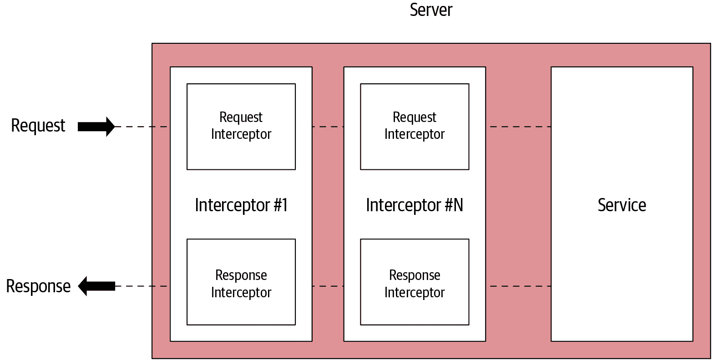
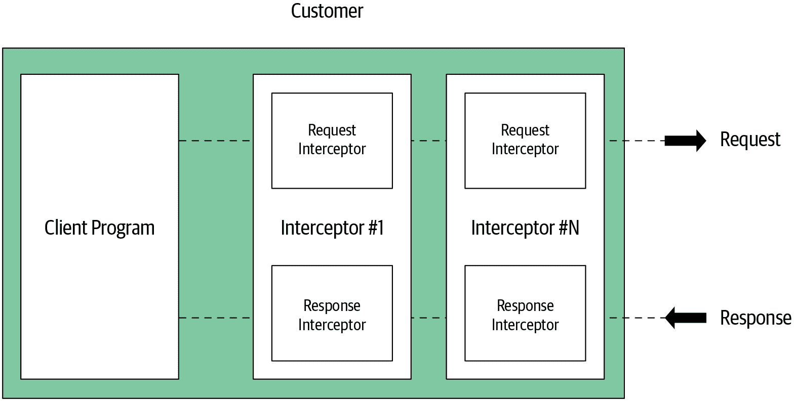
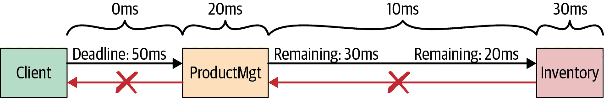
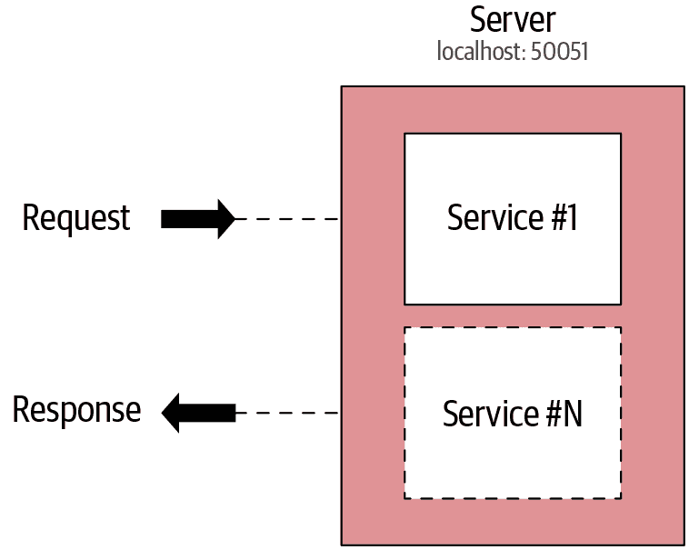
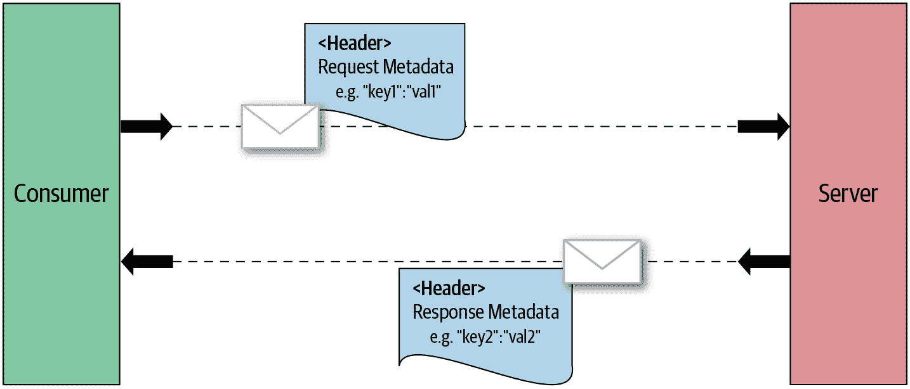
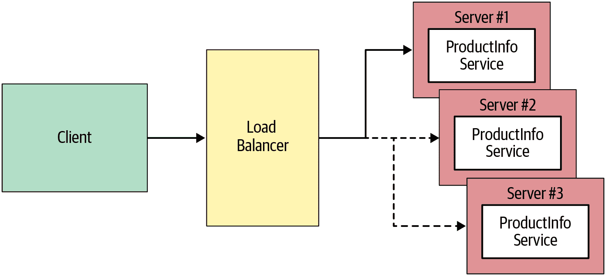
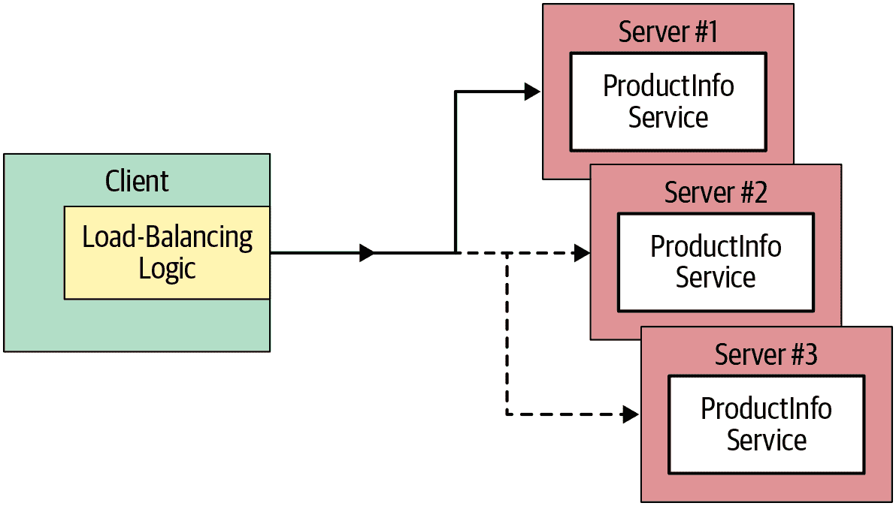

# 第五章：gRPC：超越基础知识

构建实际的 gRPC 应用程序时，您可能需要增加各种功能以满足需求，如拦截进出的 RPC、弹性地处理网络延迟、处理错误、在服务和消费者之间共享元数据等。

###### 注意

为了保持一致性，本章中的所有示例都是用 Go 语言解释的。如果您更熟悉 Java，可以参考源代码存储库中的 Java 示例，以实现相同的用例。

在本章中，您将了解一些关键的高级 gRPC 能力，包括使用 gRPC 拦截器在服务器和客户端上拦截 RPC、使用截止时间指定 RPC 完成的等待时间、服务器和客户端上的错误处理最佳实践、使用多路复用在同一服务器上运行多个服务、在调用其他服务时共享自定义元数据、使用负载均衡和名称解析技术、压缩 RPC 调用以有效利用网络带宽。

让我们从 gRPC 拦截器开始讨论。

# 拦截器

在构建 gRPC 应用程序时，您可能希望在远程函数执行前或执行后执行一些常见逻辑，无论是客户端还是服务器应用程序。在 gRPC 中，您可以拦截该 RPC 的执行，以满足诸如日志记录、身份验证、度量等要求，使用一种称为*拦截器*的扩展机制。gRPC 提供了简单的 API 来在客户端和服务器 gRPC 应用程序中实现和安装拦截器。它们是 gRPC 中的关键扩展机制之一，在日志记录、身份验证、授权、度量、跟踪以及其他客户需求等用例中非常有用。

###### 注意

并非所有支持 gRPC 的语言都支持拦截器，并且每种语言中拦截器的实现可能有所不同。在本书中，我们只涵盖了 Go 和 Java 两种语言。

gRPC 拦截器可以根据它们拦截的 RPC 调用类型分为两种类型。对于一元 RPC，您可以使用*一元拦截器*，而对于流式 RPC，您可以使用*流式拦截器*。这些拦截器可以在 gRPC 服务器端或 gRPC 客户端端使用。首先，让我们从在服务器端使用拦截器开始。

## 服务器端拦截器

当客户端调用 gRPC 服务的远程方法时，您可以通过使用服务器端拦截器在调用远程方法之前执行一些常见逻辑。当您需要在调用远程方法之前应用某些功能（例如身份验证）时，这将非常有帮助。如图 5-1 所示，您可以将一个或多个拦截器插入到您开发的任何 gRPC 服务器中。例如，要将一个新的服务器端拦截器插入到您的 `OrderManagement` gRPC 服务中，您可以实现该拦截器，并在创建 gRPC 服务器时进行注册。



###### 图 5-1\. 服务器端拦截器

在服务器端，一元拦截器允许你拦截一元 RPC 调用，而流拦截器则拦截流式 RPC。让我们先讨论服务器端的一元拦截器。

### 一元拦截器

如果你想在服务器端拦截你的 gRPC 服务的一元 RPC，你需要为你的 gRPC 服务器实现一个一元拦截器。如 Go 代码片段中所示的 示例 5-1，你可以通过实现一个类型为 `UnaryServerInterceptor` 的函数并在创建 gRPC 服务器时注册该函数来实现这一点。`UnaryServerInterceptor` 是具有以下签名的服务器端一元拦截器类型：

```go
func(ctx context.Context, req interface{}, info *UnaryServerInfo,
	                     handler UnaryHandler) (resp interface{}, err error)
```

在这个函数内部，你可以完全控制所有发送到你的 gRPC 服务器的一元 RPC 调用。

##### 示例 5-1\. gRPC 服务器端一元拦截器

```go
// Server - Unary Interceptor func orderUnaryServerInterceptor(ctx context.Context, req interface{},
                             info *grpc.UnaryServerInfo, handler grpc.UnaryHandler)
                             (interface{}, error) {

	// Preprocessing logic 	// Gets info about the current RPC call by examining the args passed in 	log.Println("======= [Server Interceptor] ", info.FullMethod) 

	// Invoking the handler to complete the normal execution of a unary RPC. 	m, err := handler(ctx, req) 

	// Post processing logic 	log.Printf(" Post Proc Message : %s", m) 
	return m, err 
}

// ... 
func main() {

...
     // Registering the Interceptor at the server-side. 	s := grpc.NewServer(
		grpc.UnaryInterceptor(orderUnaryServerInterceptor)) 
...
```


预处理阶段：这是你可以在调用相应 RPC 之前拦截消息的地方。


通过 `UnaryHandler` 调用 RPC 方法。


后处理阶段：您可以处理来自 RPC 调用的响应。


返回 RPC 响应。


使用 gRPC 服务器注册一元拦截器。

服务器端一元拦截器的实现通常可以分为三个部分：预处理、调用 RPC 方法和后处理。顾名思义，预处理阶段在调用 RPC 调用中指定的远程方法之前执行。在预处理阶段，用户可以通过检查传递的 args 获取有关当前 RPC 调用的信息，例如 RPC 上下文、RPC 请求和服务器信息。因此，在预处理阶段，甚至可以修改 RPC 调用。

然后，在调用程序阶段，您必须调用 gRPC `UnaryHandler` 来调用 RPC 方法。一旦调用 RPC，将执行后处理阶段。这意味着 RPC 调用的响应经过后处理阶段。在此阶段，您可以在需要时处理返回的回复和错误。完成后处理阶段后，您需要将消息和错误作为拦截器函数的返回参数返回。如果不需要后处理，则可以简单地返回处理程序调用（`handler(ctx, req)`）。

接下来，让我们讨论流拦截器。

### 流拦截器

服务器端流拦截器拦截 gRPC 服务器处理的任何流式 RPC 调用。流拦截器包括预处理阶段和流操作拦截阶段。

如在示例 5-2 中的 Go 代码片段中所示，假设我们想拦截`OrderManagement`服务的流式 RPC 调用。`StreamServerInterceptor`是服务器端流拦截器的类型。`orderServerStreamInterceptor`是一个类型为`StreamServerInterceptor`的拦截器函数，其签名为：

```go
func(srv interface{}, ss ServerStream, info *StreamServerInfo,
                                     handler StreamHandler) error
```

类似于一元拦截器，在预处理阶段，您可以在服务实现之前拦截流式 RPC 调用。在预处理阶段之后，您可以调用`StreamHandler`来完成远程方法的 RPC 调用执行。在预处理阶段之后，您可以通过使用实现`grpc.ServerStream`接口的包装器流来拦截流式 RPC 消息。当您使用`handler(srv, newWrappedStream(ss))`调用时，可以传递此包装器结构。`grpc.ServerStream`的包装器拦截 gRPC 服务发送或接收的流式消息。它实现了`SendMsg`和`RecvMsg`函数，这些函数在服务接收或发送 RPC 流式消息时将被调用。

##### 示例 5-2\. gRPC 服务器端流式拦截器

```go
// Server - Streaming Interceptor // wrappedStream wraps around the embedded grpc.ServerStream, // and intercepts the RecvMsg and SendMsg method call. 
type wrappedStream struct { 
	grpc.ServerStream
}


func (w *wrappedStream) RecvMsg(m interface{}) error {
	log.Printf("====== [Server Stream Interceptor Wrapper] " +
		"Receive a message (Type: %T) at %s",
		m, time.Now().Format(time.RFC3339))
	return w.ServerStream.RecvMsg(m)
}


func (w *wrappedStream) SendMsg(m interface{}) error {
	log.Printf("====== [Server Stream Interceptor Wrapper] " +
		"Send a message (Type: %T) at %v",
		m, time.Now().Format(time.RFC3339))
	return w.ServerStream.SendMsg(m)
}


func newWrappedStream(s grpc.ServerStream) grpc.ServerStream {
	return &wrappedStream{s}
}


func orderServerStreamInterceptor(srv interface{},
        ss grpc.ServerStream, info *grpc.StreamServerInfo,
        handler grpc.StreamHandler) error {
	log.Println("====== [Server Stream Interceptor] ",
		info.FullMethod) 
	err := handler(srv, newWrappedStream(ss)) 
	if err != nil {
		log.Printf("RPC failed with error %v", err)
	}
	return err
}

...
// Registering the interceptor s := grpc.NewServer(
		grpc.StreamInterceptor(orderServerStreamInterceptor)) 

…
```


`grpc.ServerStream`的包装器流。


实现包装器的`RecvMsg`函数以处理使用流 RPC 接收的消息。


实现包装器的`SendMsg`函数以处理使用流 RPC 发送的消息。


创建新包装器流的实例。


流式拦截器实现。


预处理阶段。


使用包装器流调用流式 RPC。


注册拦截器。

要理解服务器端流式拦截器的行为，请查看 gRPC 服务器日志中的以下输出。根据每条日志消息打印的顺序，您可以识别流式拦截器的行为。我们在这里调用的流式远程方法是`SearchOrders`，这是一个服务器流式 RPC：

```go
[Server Stream Interceptor]  /ecommerce.OrderManagement/searchOrders
[Server Stream Interceptor Wrapper] Receive a message

Matching Order Found : 102 -> Writing Order to the stream ...
[Server Stream Interceptor Wrapper] Send a message...
Matching Order Found : 104 -> Writing Order to the stream ...
[Server Stream Interceptor Wrapper] Send a message...
```

客户端拦截器术语与服务器端拦截器非常相似，但在接口和函数签名上有一些微妙的变化。让我们继续了解客户端拦截器的详细信息。

## 客户端拦截器

当客户端调用 RPC 调用来调用 gRPC 服务的远程方法时，您可以在客户端拦截这些 RPC 调用。如图 5-2 所示，使用客户端拦截器，您可以拦截一元 RPC 调用以及流式 RPC 调用。



###### 图 5-2\. 客户端拦截器

当你需要在客户端应用程序代码之外安全地调用 gRPC 服务时，这是特别有用的。

### 一元拦截器

用于拦截客户端单一 RPC 的客户端一元拦截器。`UnaryClientInterceptor` 是一个具有以下函数签名的客户端一元拦截器的类型：

```go
func(ctx context.Context, method string, req, reply interface{},
         cc *ClientConn, invoker UnaryInvoker, opts ...CallOption) error
```

就像我们在服务器端一元拦截器中看到的那样，客户端一元拦截器具有不同的阶段。示例 5-3 展示了在客户端实现一元拦截器的基本 Go 代码。在预处理阶段，你可以在调用远程方法之前拦截 RPC 调用。在这里，你可以通过检查传入的参数（如 RPC 上下文、方法字符串、要发送的请求和配置的 `CallOptions`）来访问当前 RPC 调用的信息。因此，甚至可以修改原始 RPC 调用，然后使用 `UnaryInvoker` 参数调用实际的一元 RPC。在后处理阶段，你可以访问 RPC 调用的响应或错误结果。

##### 示例 5-3\. gRPC 客户端单一拦截器

```go
func orderUnaryClientInterceptor(
	ctx context.Context, method string, req, reply interface{},
	cc *grpc.ClientConn,
	invoker grpc.UnaryInvoker, opts ...grpc.CallOption) error {
	// Preprocessor phase 	log.Println("Method : " + method) 

	// Invoking the remote method 	err := invoker(ctx, method, req, reply, cc, opts...) 

	// Postprocessor phase 	log.Println(reply) 

	return err 
}
...

func main() {
	// Setting up a connection to the server. 	conn, err := grpc.Dial(address, grpc.WithInsecure(),
		grpc.WithUnaryInterceptor(orderUnaryClientInterceptor)) 
...
```


在将 RPC 请求发送到服务器之前，预处理阶段可以访问 RPC 请求。


通过 `UnaryInvoker` 调用 RPC 方法。


后处理阶段可以处理响应或错误结果。


将错误返回到 gRPC 客户端应用程序，并将回复作为参数传递。


通过将一元拦截器作为拨号选项来建立与服务器的连接。

在 `grpc.Dial` 操作中通过 `grpc.WithUnaryInterceptor` 注册拦截器函数。

### 流拦截器

客户端流拦截器用于拦截 gRPC 客户端处理的任何流式 RPC 调用。客户端流拦截器的实现与服务器端非常相似。`StreamClientInterceptor` 是客户端流拦截器的类型，其函数类型如下：

```go
func(ctx context.Context, desc *StreamDesc, cc *ClientConn,
                                      method string, streamer Streamer,
                                      opts ...CallOption) (ClientStream, error)
```

如示例 5-4 所示，客户端流拦截器的实现包括预处理和流操作拦截。

##### 示例 5-4\. gRPC 客户端流拦截器

```go
func clientStreamInterceptor(
	ctx context.Context, desc *grpc.StreamDesc,
	cc *grpc.ClientConn, method string,
	streamer grpc.Streamer, opts ...grpc.CallOption)
        (grpc.ClientStream, error) {
	log.Println("======= [Client Interceptor] ", method) 
	s, err := streamer(ctx, desc, cc, method, opts...) 
	if err != nil {
		return nil, err
	}
	return newWrappedStream(s), nil 
}

type wrappedStream struct { 
	grpc.ClientStream
}

func (w *wrappedStream) RecvMsg(m interface{}) error { 
	log.Printf("====== [Client Stream Interceptor] " +
		"Receive a message (Type: %T) at %v",
		m, time.Now().Format(time.RFC3339))
	return w.ClientStream.RecvMsg(m)
}

func (w *wrappedStream) SendMsg(m interface{}) error { 
	log.Printf("====== [Client Stream Interceptor] " +
		"Send a message (Type: %T) at %v",
		m, time.Now().Format(time.RFC3339))
	return w.ClientStream.SendMsg(m)
}

func newWrappedStream(s grpc.ClientStream) grpc.ClientStream {
	return &wrappedStream{s}
}

...

func main() {
	// Setting up a connection to the server. 	conn, err := grpc.Dial(address, grpc.WithInsecure(),
		grpc.WithStreamInterceptor(clientStreamInterceptor)) 
...
```


在将 RPC 请求发送到服务器之前，预处理阶段可以访问 RPC 请求。


调用传入的流程以获取一个`ClientStream`。


包装 `ClientStream`，通过拦截逻辑重载其方法，并将其返回给客户端应用程序。


`grpc.ClientStream`的包装流。


拦截从流式 RPC 接收到的消息的函数。


拦截从流式 RPC 发送的消息的函数。


注册流拦截器。

通过包装 `grpc.ClientStream` 的实现来拦截流操作是通过一个新结构来实现的，该结构包装了两个被拦截的流方法 `RecvMsg` 和 `SendMsg`，这些方法可用于拦截从客户端发送或接收的流式消息。拦截器的注册与一元拦截器相同，并且在 `grpc.Dial` 操作中完成。

让我们来看看截止时间，这是在从客户端应用程序调用 gRPC 服务时经常需要应用的另一种能力。

# 截止时间

截止时间和超时是分布式计算中常用的两种模式。*超时* 允许您指定客户端应用程序在终止并返回错误之前可以等待 RPC 完成的时间。超时通常以持续时间指定，并且在每个客户端端本地应用。例如，单个请求可能由多个下游 RPC 组成，这些 RPC 将多个服务链在一起。因此，我们可以在每个服务调用处相对于每个 RPC 应用超时。因此，超时不能直接应用于请求的整个生命周期。这就是我们需要使用截止时间的地方。

*截止时间* 是从请求开始的绝对时间来表达的（即使 API 将它们表示为持续时间偏移），并且在多个服务调用之间应用。发起请求的应用程序设置截止时间，并且整个请求链需要在截止时间之前响应。gRPC API 支持在 RPC 中使用截止时间。出于多种原因，在您的 gRPC 应用程序中始终使用截止时间是个好习惯。gRPC 通信通过网络进行，因此在 RPC 调用和响应之间可能会存在延迟。此外，在某些情况下，根据服务的业务逻辑，gRPC 服务本身可能需要更长时间来响应。当客户端应用程序在不使用截止时间的情况下开发时，它们会无限期地等待发起的 RPC 请求的响应，并且资源将被保留用于所有正在进行的请求。这会使服务和客户端面临资源耗尽的风险，增加服务的延迟；甚至可能导致整个 gRPC 服务崩溃。

在 图 5-3 中展示的示例场景说明了一个 gRPC 客户端应用程序调用产品管理服务，该服务再次调用库存服务。

客户端应用程序设置了截止时间偏移量（即，截止时间 = 当前时间 + 偏移量），为 50 毫秒。客户端与`ProductMgt`服务之间的网络延迟为 0 毫秒，而`ProductMgt`服务的处理延迟为 20 毫秒。产品管理服务必须设置 30 毫秒的截止时间偏移量。由于库存服务需要 30 毫秒来响应，截止事件将在客户端双方发生（`ProductMgt`调用`Inventory`服务和客户端应用程序）。

从`ProductMgt`服务的业务逻辑中添加的延迟为 20 毫秒。然后，`ProductMgt`服务的调用逻辑触发了超过截止日期的情况，并将其传播回客户端应用程序。因此，在使用截止日期时，请确保它们应用于所有服务。



###### 图 5-3\. 调用服务时使用截止日期

客户端应用程序在初始化与 gRPC 服务的连接时可以设置截止日期。一旦发起 RPC 调用，客户端应用程序将等待由截止日期指定的持续时间；如果未在该时间内收到 RPC 调用的响应，则以`DEADLINE_EXCEEDED`错误终止 RPC 调用。

让我们看一个使用 gRPC 服务调用截止日期的真实示例。在相同的`OrderManagement`服务用例中，假设`AddOrder` RPC 花费了大量时间来完成（我们通过在`OrderManagement` gRPC 服务的`AddOrder`方法中引入延迟来模拟这一点）。但是客户端应用程序只等待直到响应对其不再有用。例如，`AddOrder`响应所需的持续时间为两秒，而客户端只等待两秒钟以获取响应。为了实现这一点（如在示例 5-5 中所示的 Go 代码片段中），客户端应用程序可以使用`context.WithDeadline`操作设置两秒钟的超时时间。我们已使用`status`包来处理错误代码；我们将在错误处理部分详细讨论这一点。

##### 示例 5-5\. 客户端应用程序的 gRPC 截止日期

```go
conn, err := grpc.Dial(address, grpc.WithInsecure())
if err != nil {
    log.Fatalf("did not connect: %v", err)
}
defer conn.Close()
client := pb.NewOrderManagementClient(conn)

clientDeadline := time.Now().Add(
    time.Duration(2 * time.Second))
ctx, cancel := context.WithDeadline(
    context.Background(), clientDeadline) 

defer cancel()

// Add Order order1 := pb.Order{Id: "101",
    Items:[]string{"iPhone XS", "Mac Book Pro"},
    Destination:"San Jose, CA",
    Price:2300.00}
res, addErr := client.AddOrder(ctx, &order1) 

if addErr != nil {
    got := status.Code(addErr) 
    log.Printf("Error Occured -> addOrder : , %v:", got) 
} else {
    log.Print("AddOrder Response -> ", res.Value)
}
```


在当前上下文中设置两秒钟的截止日期。


调用`AddOrder`远程方法，并将可能的任何错误捕获到`addErr`中。


使用`status`包来确定错误代码。


如果调用超过指定的截止时间，应返回类型为`DEADLINE_EXCEEDED`的错误。

那么，我们应该如何确定截止时间的理想值呢？对于这个问题没有单一的答案，但你需要考虑几个因素来做出选择；主要是我们调用的每个服务的端到端延迟，哪些 RPC 是串行的，哪些可以并行执行，底层网络的延迟以及下游服务的截止时间值。一旦你能够确定截止时间的初始值，根据 gRPC 应用程序的操作条件进行微调。

###### 注意

设置在 Go 语言中 gRPC 的截止时间是通过 Go 的[`context`包](https://oreil.ly/OTrmY)完成的，其中`WithDeadline`是一个内置函数。在 Go 中，上下文经常用于传递可以被所有下游操作使用的共同数据。一旦这个函数从 gRPC 客户端应用程序调用，客户端侧的 gRPC 库将创建一个必需的 gRPC 头来表示客户端和服务器应用程序之间的截止时间。在 Java 中，这有些不同，因为实现直接来自`io.grpc.stub.*`包的存根实现，你可以使用`blockingStub.withDeadlineAfter(long, java.util.concurrent.TimeUnit)`来设置 gRPC 的截止时间。详细的 Java 实现请参考代码库。

当涉及到 gRPC 中的截止时间时，客户端和服务器都可以独立地进行关于 RPC 是否成功的本地决定；这意味着它们的结论可能不匹配。例如，在我们的例子中，当客户端遇到`DEADLINE_EXCEEDED`条件时，服务可能仍然尝试响应。因此，服务应用程序需要确定当前 RPC 是否仍然有效。从服务器端来看，你还可以检测客户端在调用 RPC 时已达到的截止时间。在`AddOrder`操作中，你可以检查`ctx.Err() == context.DeadlineExceeded`来判断客户端是否已经遇到截止时间过期状态，然后在服务器端放弃 RPC 并返回错误（这通常使用非阻塞的`select`结构在 Go 中实现）。

类似于截止时间，有些情况下你的客户端或服务器应用程序希望终止正在进行的 gRPC 通信。这时候 gRPC 的取消功能就变得非常有用。

# 取消

在客户端和服务器应用程序之间的 gRPC 连接中，客户端和服务器都会独立和本地地确定调用的成功情况。例如，服务器端可以成功完成一个 RPC，但客户端端可能失败。同样地，客户端和服务器可能会因为各种条件而对 RPC 的结果得出不同的结论。当客户端或服务器应用程序想要终止 RPC 时，可以通过 *取消* RPC 来实现。一旦 RPC 被取消，将无法进行更多与 RPC 相关的消息传递，并且取消 RPC 的一方会向另一方传播这一事实。

###### 注

在 Go 中，类似于截止日期，取消功能是通过 [`context` 包](https://oreil.ly/OTrmY) 提供的，其中 `WithCancel` 是一个内置函数。一旦从 gRPC 应用程序中调用它，客户端的 gRPC 库会创建一个必要的 gRPC 头来表示客户端和服务器应用程序之间的 gRPC 终止。

让我们以客户端和服务器应用程序之间的双向流式处理为例。在所示的 Go 代码示例中 Example 5-6 中，您可以从 `context.WithTimeout` 调用中获取 `cancel` 函数。一旦获得了 `cancel` 的引用，您可以在任何想要终止 RPC 的地方调用它。

##### Example 5-6\. gRPC 取消

```go
ctx, cancel := context.WithTimeout(context.Background(), 10*time.Second) 

streamProcOrder, _ := client.ProcessOrders(ctx) 
_ = streamProcOrder.Send(&wrapper.StringValue{Value:"102"}) 
_ = streamProcOrder.Send(&wrapper.StringValue{Value:"103"})
_ = streamProcOrder.Send(&wrapper.StringValue{Value:"104"})

channel := make(chan bool, 1)

go asncClientBidirectionalRPC(streamProcOrder, channel)
time.Sleep(time.Millisecond * 1000)

// Canceling the RPC cancel() 
log.Printf("RPC Status : %s", ctx.Err()) 

_ = streamProcOrder.Send(&wrapper.StringValue{Value:"101"})
_ = streamProcOrder.CloseSend()

<- channel

func asncClientBidirectionalRPC (
    streamProcOrder pb.OrderManagement_ProcessOrdersClient, c chan bool) {
...
		combinedShipment, errProcOrder := streamProcOrder.Recv()
		if errProcOrder != nil {
			log.Printf("Error Receiving messages %v", errProcOrder) 
...
}
```


获取取消的引用。


调用流式 RPC。


通过流向服务发送消息。


从客户端取消 RPC/终止 RPC。


当前上下文的状态。


当尝试从取消的上下文接收消息时返回上下文取消错误。

当一方取消 RPC 时，另一方可以通过检查上下文确定。在这个例子中，服务器应用程序可以通过 `stream.Context().Err() == context.Canceled` 来检查当前上下文是否已取消。

如你在截止日期和取消应用中所见，处理 RPC 错误是一个非常常见的要求。在接下来的章节中，我们将详细讨论 gRPC 错误处理技术。

# 错误处理

当我们调用 gRPC 时，客户端会收到一个带有成功状态或相应错误状态的响应。客户端应用程序需要编写成这样的方式，能够处理所有可能的错误和错误条件。服务器应用程序需要处理错误，并生成相应的状态码。

当发生错误时，gRPC 返回其错误状态码之一，并可选择性地提供错误消息，以提供更多错误条件的详细信息。状态对象由整数代码和字符串消息组成，这在所有不同语言的 gRPC 实现中都是通用的。

gRPC 使用一组明确定义的特定于 gRPC 的状态代码。这包括诸如以下状态代码：

`成功`

成功状态；不是错误。

`已取消`

操作通常由调用者取消。

`超出期限`

操作在完成之前已超出期限。

`无效参数`

客户端指定了无效参数。

表 5-1 显示了可用的 gRPC 错误代码及每个错误代码的描述。完整的错误代码列表可以在 [gRPC 官方文档](https://oreil.ly/LiNLn) 中找到，或者在 [Go](https://oreil.ly/E61Q0) 和 [Java](https://oreil.ly/Ugtg0) 的文档中找到。

表 5-1\. gRPC 错误代码

| 代码 | 编号 | 描述 |
| --- | --- | --- |
| 成功 | 0 | 成功状态。 |
| 已取消 | 1 | 操作已被取消（由调用者）。 |
| 未知错误 | 2 | 未知错误。 |
| 无效参数 | 3 | 客户端指定了无效参数。 |
| 超出期限 | 4 | 操作在完成之前已超出期限。 |
| 未找到 | 5 | 未找到某些请求的实体。 |
| 已存在 | 6 | 客户端试图创建的实体已存在。 |
| 拒绝许可 | 7 | 调用者无权限执行指定的操作。 |
| 未经身份验证 | 16 | 请求没有为操作提供有效的身份验证凭据。 |
| 资源耗尽 | 8 | 某些资源已耗尽。 |
| 前提条件失败 | 9 | 操作被拒绝，因为系统不处于操作执行所需的状态。 |
| 已中止 | 10 | 操作已中止。 |
| 超出范围 | 11 | 尝试的操作超出了有效范围。 |
| 未实现 | 12 | 操作未实现或不受此服务支持/启用。 |
| 内部错误 | 13 | 内部错误。 |
| 服务不可用 | 14 | 当前服务不可用。 |
| 数据丢失 | 15 | 不可恢复的数据丢失或损坏。 |

gRPC 提供的默认错误模型相当有限，并且独立于底层 gRPC 数据格式（其中最常见的格式是协议缓冲区）。如果您正在使用协议缓冲区作为数据格式，则可以利用 Google API 在 `google.rpc` 包下提供的更丰富的错误模型。然而，该错误模型仅在 C++、Go、Java、Python 和 Ruby 库中受支持，因此如果您计划使用其他语言，请注意这一点。

让我们看看如何在实际的 gRPC 错误处理用例中使用这些概念。在我们的订单管理用例中，假设在`AddOrder`远程方法中处理请求时，我们需要处理一个具有无效订单 ID 的请求。如示例 5-7 所示，假设给定的订单 ID 等于`-1`，则需要生成一个错误并返回给消费者。

##### 示例 5-7\. 服务器端错误创建和传播

```go
if orderReq.Id == "-1" { 
    log.Printf("Order ID is invalid! -> Received Order ID %s",
        orderReq.Id)

    errorStatus := status.New(codes.InvalidArgument,
        "Invalid information received") 
    ds, err := errorStatus.WithDetails( 
        &epb.BadRequest_FieldViolation{
            Field:"ID",
            Description: fmt.Sprintf(
                "Order ID received is not valid %s : %s",
                orderReq.Id, orderReq.Description),
        },
    )
    if err != nil {
        return nil, errorStatus.Err()
    }

    return nil, ds.Err() 
    }
    ...
```


无效请求，需要生成错误并将其发送回客户端。


创建一个带有错误码`InvalidArgument`的新错误状态。


包含来自`google.golang.org/genproto/googleapis/rpc/errdetails`的错误类型为`BadRequest_FieldViolation`的任何错误详细信息。


返回生成的错误。

您可以简单地从`grpc.status`包创建一个错误状态，包括所需的错误码和详细信息。在这个例子中，我们使用了`status.New(codes.InvalidArgument, "接收到无效信息")`。您只需将此错误发送回客户端`return nil, errorStatus.Err()`。但是，如果需要包含更丰富的错误模型，您可以使用 Google API 的`google.rpc`包。在本例中，我们设置了来自*google.golang.org/genproto/googleapis/rpc/errdetails*的特定错误类型的错误详细信息。

对于客户端端错误处理，您只需处理作为 RPC 调用的一部分返回的错误。例如，在示例 5-8 中，您可以找到该订单管理用例的客户端应用程序的 Go 实现。在这里，我们调用了`AddOrder`方法并将返回的错误赋给`addOrderError`变量。因此，下一步是检查`addOrderError`的结果并优雅地处理错误。为此，您可以获取从服务器端设置的错误码和特定错误类型。

##### 示例 5-8\. 客户端端错误处理

```go
order1 := pb.Order{Id: "-1",
	Items:[]string{"iPhone XS", "Mac Book Pro"},
	Destination:"San Jose, CA", Price:2300.00} 
res, addOrderError := client.AddOrder(ctx, &order1) 

if addOrderError != nil {
	errorCode := status.Code(addOrderError) 
	if errorCode == codes.InvalidArgument { 
		log.Printf("Invalid Argument Error : %s", errorCode)
		errorStatus := status.Convert(addOrderError) 
		for _, d := range errorStatus.Details() {
			switch info := d.(type) {
			case *epb.BadRequest_FieldViolation: 
				log.Printf("Request Field Invalid: %s", info)
			default:
				log.Printf("Unexpected error type: %s", info)
			}
		}
	} else {
		log.Printf("Unhandled error : %s ", errorCode)
	}
} else {
	log.Print("AddOrder Response -> ", res.Value)
}
```


这是一个无效的订单。


调用`AddOrder`远程方法并将错误赋给`addOrderError`。


使用`grpc/status`包获取错误码。


检查`InvalidArgument`错误码。


从错误中获取错误状态。


检查`BadRequest_FieldViolation`错误类型。

在您的 gRPC 应用程序中，始终使用适当的 gRPC 错误码和更丰富的错误模型是一个良好的实践。gRPC 错误状态和详细信息通常通过传输协议级别的尾部标头发送。

现在让我们看看多路复用，这是在同一个 gRPC 服务器运行时的一种服务托管机制。

# 多路复用

就 gRPC 服务和客户端应用程序而言，我们已经看到了一个特定的 gRPC 服务器上注册了一个 gRPC 服务，并且一个 gRPC 客户端连接仅被单个客户端存根使用的情况。但是，gRPC 允许您在同一个 gRPC 服务器上运行多个 gRPC 服务（请参见 Figure 5-4），并且可以为多个 gRPC 客户端存根使用相同的 gRPC 客户端连接。这种能力被称为*多路复用*。



###### 图 5-4\. 在同一服务器应用程序中复用多个 gRPC 服务

例如，在我们的 `OrderManagement` 服务示例中，假设您希望在同一个 gRPC 服务器上运行另一个服务，以便客户端应用程序可以重用同一连接来调用两个服务，那么您可以通过使用它们各自的服务器注册函数（即 `ordermgt_pb.RegisterOrderManagementServer` 和 `hello_pb.RegisterGreeterServer`）来同时在同一个 gRPC 服务器上注册这两个服务。使用这种方法，您可以在同一个 gRPC 服务器上注册一个或多个 gRPC 服务（如示例 Example 5-9 所示）。

##### 示例 5-9\. 两个共享相同 grpc.Server 的 gRPC 服务

```go
func main() {
	initSampleData()
	lis, err := net.Listen("tcp", port)
	if err != nil {
		log.Fatalf("failed to listen: %v", err)
	}
	grpcServer := grpc.NewServer() 

	// Register Order Management service on gRPC orderMgtServer 	ordermgt_pb.RegisterOrderManagementServer(grpcServer, &orderMgtServer{}) 

	// Register Greeter Service on gRPC orderMgtServer 	hello_pb.RegisterGreeterServer(grpcServer, &helloServer{}) 

      ...
}
```


创建 gRPC 服务器。


在 gRPC 服务器上注册 `OrderManagement` 服务。


在同一个 gRPC 服务器上注册 `Hello` 服务。

类似地，从客户端方面，您可以在两个 gRPC 客户端存根之间共享相同的 gRPC 连接。

如示例 Example 5-10 所示，由于两个 gRPC 服务在同一个 gRPC 服务器上运行，您可以创建一个 gRPC 连接，并在为不同服务创建 gRPC 客户端实例时使用它。

##### 示例 5-10\. 两个共享相同 grpc.ClientConn 的 gRPC 客户端存根

```go
// Setting up a connection to the server. conn, err := grpc.Dial(address, grpc.WithInsecure()) 
...

orderManagementClient := pb.NewOrderManagementClient(conn) 

...

// Add Order RPC 	...
res, addErr := orderManagementClient.AddOrder(ctx, &order1)

...

helloClient := hwpb.NewGreeterClient(conn) 

	...
	// Say hello RPC helloResponse, err := helloClient.SayHello(hwcCtx,
	&hwpb.HelloRequest{Name: "gRPC Up and Running!"})
...
```


创建 gRPC 连接。


使用创建的 gRPC 连接创建 `OrderManagement` 客户端。


使用同一 gRPC 连接创建 `Hello` 服务客户端。

在多个服务运行或在多个存根之间使用相同连接是独立于 gRPC 概念的设计选择。在大多数日常用例中，如微服务，将同一 gRPC 服务器实例共享给两个服务是非常常见的。

###### 注意

在微服务架构中，gRPC 多路复用的一个强大用途是在一个服务器进程中托管同一服务的多个主要版本。这样一来，在 API 变更后，服务可以为旧客户端提供支持。一旦不再使用旧版本的服务契约，就可以从服务器中删除。

在接下来的部分中，我们将讨论如何在客户端和服务应用程序之间交换不属于 RPC 参数和响应的数据。

# 元数据

gRPC 应用程序通常通过 RPC 调用在 gRPC 服务和消费者之间共享信息。在大多数情况下，与服务的业务逻辑和消费者直接相关的信息是远程方法调用参数的一部分。然而，在某些情况下，您可能希望共享与 RPC 调用不相关的关于 RPC 调用的信息，因此它们不应作为 RPC 参数的一部分。在这种情况下，您可以使用*gRPC 元数据*，您可以从 gRPC 服务或 gRPC 客户端发送或接收它们。正如在图 5-5 中所示，您在客户端或服务器端创建的元数据可以通过 gRPC 头在客户端和服务器应用程序之间进行交换。元数据的结构形式为键（字符串）/值对的列表。

元数据的最常见用途之一是在 gRPC 应用程序之间交换安全头信息。同样，您可以用它来在 gRPC 应用程序之间交换任何此类信息。通常，gRPC 元数据 API 在我们开发的拦截器中被大量使用。在接下来的部分中，我们将探讨 gRPC 如何支持在客户端和服务器之间发送元数据。



###### 图 5-5\. 在客户端和服务器应用程序之间交换 gRPC 元数据

## 创建和检索元数据

从 gRPC 应用程序创建元数据非常简单。在以下 Go 代码片段中，您将找到创建元数据的两种方法。在 Go 中，元数据被表示为普通的映射，并且可以使用`metadata.New(map[string]string{"key1": "val1", "key2": "val2"})`格式创建。此外，您还可以使用`metadata.Pairs`以键值对的方式创建元数据，因此具有相同键的元数据将合并为列表：

```go
// Metadata Creation : option I
md := metadata.New(map[string]string{"key1": "val1", "key2": "val2"})

// Metadata Creation : option II
md := metadata.Pairs(
    "key1", "val1",
    "key1", "val1-2", // "key1" will have map value []string{"val1", "val1-2"}
    "key2", "val2",
)
```

您还可以将二进制数据设置为元数据值。在发送之前，我们设置为元数据值的二进制数据将进行 base64 编码，并在传输后进行解码。

从客户端或服务器端读取元数据可以通过 RPC 调用的传入上下文和`metadata.FromIncomingContext(ctx)`来完成，该方法在 Go 语言中返回元数据映射：

```go
func (s *server) AddOrder(ctx context.Context, orderReq *pb.Order)
    (*wrappers.StringValue, error) {

md, metadataAvailable := metadata.FromIncomingContext(ctx)
// read the required metadata from the ‘md’ metadata map.
```

现在让我们深入探讨客户端或服务器端不同一元和流式 RPC 样式中的元数据发送和接收过程。

## 发送和接收元数据：客户端端

您可以通过创建元数据并将其设置到 RPC 调用的上下文中，从客户端向 gRPC 服务发送元数据。在 Go 实现中，您可以通过两种不同的方式完成这个操作。如 示例 5-11 所示，您可以使用 `NewOutgoingContext` 创建带有新元数据的新上下文，或者只需将元数据附加到现有上下文中使用 `AppendToOutgoingContext`。但是，使用 `NewOutgoingContext` 将替换上下文中的任何现有元数据。一旦您创建了带有所需元数据的上下文，它可以用于一元或流式 RPC。正如您在 第四章 中学到的那样，您在上下文中设置的元数据会被转换为 gRPC 标头（在 HTTP/2 中）或者在传输层级别上的尾部。因此，当客户端发送这些标头时，接收方将其作为标头接收。

##### 示例 5-11\. 从 gRPC 客户端端发送元数据

```go
md := metadata.Pairs(
	"timestamp", time.Now().Format(time.StampNano),
	"kn", "vn",
) 
mdCtx := metadata.NewOutgoingContext(context.Background(), md) 

ctxA := metadata.AppendToOutgoingContext(mdCtx,
      "k1", "v1", "k1", "v2", "k2", "v3") 

// make unary RPC response, err := client.SomeRPC(ctxA, someRequest) 

// or make streaming RPC stream, err := client.SomeStreamingRPC(ctxA) 
```


创建元数据。


使用新元数据创建一个新上下文。


将一些额外的元数据附加到现有上下文中。


使用新元数据的一元 RPC。


相同的上下文也可以用于流式 RPC。

因此，在从客户端接收元数据时，您需要将它们视为标头或尾部。在 示例 5-12 中，您可以找到有关一元和流式 RPC 样式接收元数据的 Go 代码示例。

##### 示例 5-12\. 在 gRPC 客户端端读取元数据

```go
var header, trailer metadata.MD 

// ***** Unary RPC ***** 
r, err := client.SomeRPC( 
    ctx,
    someRequest,
    grpc.Header(&header),
    grpc.Trailer(&trailer),
)

// process header and trailer map here. 
// ***** Streaming RPC ***** 
stream, err := client.SomeStreamingRPC(ctx)

// retrieve header header, err := stream.Header() 

// retrieve trailer trailer := stream.Trailer() 

// process header and trailer map here.
```


用于存储从 RPC 调用返回的标头和尾部的变量。


传递标头和尾部引用以存储一元 RPC 返回的值。


从流中获取标头。


从流中获取尾部。尾部用于发送状态码和状态消息。

一旦从各自的 RPC 操作中获取了值，您可以将它们作为通用映射处理并处理所需的元数据。

现在让我们转向服务器端的元数据处理。

## 发送和接收元数据：服务器端

在服务器端接收元数据非常简单。在 Go 中，您可以在远程方法实现中使用 `metadata.FromIncomingContext(ctx)` 简单获取元数据（参见 示例 5-13）。

##### 示例 5-13\. 在 gRPC 服务器端读取元数据

```go
func (s *server) SomeRPC(ctx context.Context,
    in *pb.someRequest) (*pb.someResponse, error) { 
    md, ok := metadata.FromIncomingContext(ctx) 
    // do something with metadata }

func (s *server) SomeStreamingRPC(
    stream pb.Service_SomeStreamingRPCServer) error { 
    md, ok := metadata.FromIncomingContext(stream.Context()) 
    // do something with metadata }
```


一元 RPC。


从远程方法的传入上下文中读取元数据映射。


流式 RPC。


从流中获取上下文并从中读取元数据。

要从服务器端发送元数据，请使用带有元数据的头部或设置带有元数据的尾部。元数据创建方法与我们在前一节中讨论的相同。在示例 5-14 中，您可以找到有关在服务器端实现一元和流式远程方法发送元数据的 Go 代码示例。

##### 示例 5-14\. 从 gRPC 服务器端发送元数据

```go
func (s *server) SomeRPC(ctx context.Context,
    in *pb.someRequest) (*pb.someResponse, error) {
    // create and send header
    header := metadata.Pairs("header-key", "val")
    grpc.SendHeader(ctx, header) 
    // create and set trailer
    trailer := metadata.Pairs("trailer-key", "val")
    grpc.SetTrailer(ctx, trailer) 
}

func (s *server) SomeStreamingRPC(stream pb.Service_SomeStreamingRPCServer) error {
    // create and send header
    header := metadata.Pairs("header-key", "val")
    stream.SendHeader(header) 
    // create and set trailer
    trailer := metadata.Pairs("trailer-key", "val")    stream.SetTrailer(trailer) 
}
```


在流的头部发送元数据。


在流的尾部发送元数据。


在流中作为头部发送元数据。


在流的尾部发送元数据。

无论是一元的还是流式的情况，你都可以使用`grpc.SendHeader`方法发送元数据。如果你希望将元数据作为尾部的一部分发送，则需要使用上下文的尾部设置元数据，使用相应流的`grpc.SetTrailer`或`SetTrailer`方法。

现在让我们讨论调用 gRPC 应用程序时另一种常用的技术：名称解析。

## 名称解析器

*名称解析器*接受服务名称并返回后端的 IP 地址列表。在示例 5-15 中使用的解析器将`lb.example.grpc.io`解析为`localhost:50051`和`localhost:50052`。

##### 示例 5-15\. 在 Go 中实现的 gRPC 名称解析器

```go
type exampleResolverBuilder struct{} 

func (*exampleResolverBuilder) Build(target resolver.Target,
	cc resolver.ClientConn,
	opts resolver.BuildOption) (resolver.Resolver, error) {

	r := &exampleResolver{ 
		target: target,
		cc:     cc,
		addrsStore: map[string][]string{
           exampleServiceName: addrs, 
		},
	}
	r.start()
	return r, nil
}
func (*exampleResolverBuilder) Scheme() string { return exampleScheme } 

type exampleResolver struct { 
	target     resolver.Target
	cc         resolver.ClientConn
	addrsStore map[string][]string
}

func (r *exampleResolver) start() {
	addrStrs := r.addrsStore[r.target.Endpoint]
	addrs := make([]resolver.Address, len(addrStrs))
	for i, s := range addrStrs {
		addrs[i] = resolver.Address{Addr: s}
	}
	r.cc.UpdateState(resolver.State{Addresses: addrs})
}
func (*exampleResolver) ResolveNow(o resolver.ResolveNowOption) {}
func (*exampleResolver) Close()                                 {}

func init() {
	resolver.Register(&exampleResolverBuilder{})
}
```


创建解析器的名称解析器构建器。


创建解析`lb.example.grpc.io`的示例解析器。


这将`lb.example.grpc.io`解析为`localhost:50051`和`localhost:50052`。


此解析器适用于 scheme `example`。


名称解析器的结构。

因此，基于此名称解析器的实现，您可以为任何服务注册表（如[Consul](https://www.consul.io)、[etcd](https://etcd.io)和[Zookeeper](https://zookeeper.apache.org)）实现解析器。 gRPC 负载均衡需求可能与您使用的部署模式或用例密切相关。随着像 Kubernetes 这样的容器编排平台和更高级别的抽象（如服务网格）的日益普及，客户端端实现负载均衡逻辑的需求变得非常罕见。我们将探讨在容器和 Kubernetes 上本地部署 gRPC 应用程序的一些最佳实践，详见第七章。

现在让我们讨论你的 gRPC 应用程序中最常见的要求之一，即负载均衡，在某些情况下可以使用名称解析器。

# 负载均衡

在开发可用于生产的 gRPC 应用程序时，通常需要确保应用程序能够满足高可用性和可扩展性需求。因此，您始终会在生产环境中运行多个 gRPC 服务器。因此，需要有一个实体来负责在这些服务之间分发 RPC 调用。这就是负载均衡发挥作用的地方。gRPC 中通常使用两种主要的负载均衡机制：*负载均衡（LB）代理* 和 *客户端负载均衡*。让我们先讨论 LB 代理。

## 负载均衡代理

在代理负载均衡中（图 5-6），客户端向 LB 代理发起 RPC 调用。然后 LB 代理将 RPC 调用分发给一个实现实际调用服务逻辑的可用后端 gRPC 服务器。LB 代理跟踪每个后端服务器的负载，并为在后端服务之间分发负载提供不同的负载均衡算法。



###### 图 5-6\. 客户端应用调用一个负载均衡器，该负载均衡器前端有多个 gRPC 服务

后端服务的拓扑对 gRPC 客户端不透明，它们只知道负载均衡器的终端节点。因此，在客户端，除了将负载均衡器的终端点作为所有 gRPC 连接的目的地外，不需要为负载均衡使用情况做任何其他更改。后端服务可以向负载均衡器报告负载状态，以便负载均衡器可以利用该信息进行负载均衡逻辑。

理论上，您可以选择任何支持 HTTP/2 的负载均衡器作为 gRPC 应用程序的 LB 代理。但是，它必须完全支持 HTTP/2。因此，明确选择支持 gRPC 的负载均衡器总是一个好主意。例如，您可以使用像 [Nginx](https://oreil.ly/QH_1c)、[Envoy proxy](https://www.envoyproxy.io) 等负载均衡解决方案作为 gRPC 应用程序的 LB 代理。

如果您不使用 gRPC 负载均衡器，则可以将负载均衡逻辑实现为您编写的客户端应用程序的一部分。让我们更详细地了解客户端负载均衡。

## 客户端负载均衡

与具有负载均衡中间代理层不同，您可以在 gRPC 客户端级别实现负载均衡逻辑。在这种方法中，客户端知道多个后端 gRPC 服务器，并选择一个用于每个 RPC。正如在 图 5-7 中所示，负载均衡逻辑可以完全作为客户端应用程序的一部分开发（也称为*厚客户端*），或者可以在专用服务器上实现，称为外部负载均衡器。然后，客户端可以查询它以获取连接的最佳 gRPC 服务器。客户端直接连接到外部负载均衡器获取的 gRPC 服务器地址。



###### 图 5-7\. 客户端负载均衡

要了解如何实现客户端负载均衡，让我们看一个使用 Go 实现的厚客户端的示例。在这个用例中，假设我们有两个后端 gRPC 服务，在 :50051 和 :50052 上运行 echo 服务器。这些 gRPC 服务将服务器地址作为 RPC 响应的一部分包括进去。因此，我们可以将这两个服务器视为 echo gRPC 服务集群的两个成员。现在，假设我们想要构建一个使用轮询（依次执行对每个其他的）算法选择 gRPC 服务器端点的 gRPC 客户端应用程序，另一个客户端使用服务器端点列表的第一个端点。示例 5-16 展示了厚客户端负载均衡的实现。在这里，你可以观察到客户端正在拨号 *example:///lb.example.grpc.io*。因此，我们使用 `example` 方案名和 `lb.example.grpc.io` 作为服务器名。基于此方案，它将查找名解析器以发现后端服务地址的绝对值。根据名解析器返回的值列表，gRPC 对这些服务器运行不同的负载均衡算法。该行为通过 `grpc.WithBalancerName("round_robin")` 进行配置。

##### 示例 5-16\. 带有厚客户端的客户端负载均衡

```go
pickfirstConn, err := grpc.Dial(
		fmt.Sprintf("%s:///%s",
        // 	exampleScheme      = "example"
        //	exampleServiceName = "lb.example.grpc.io"
        exampleScheme, exampleServiceName), 
        // "pick_first" is the default option. 
		grpc.WithBalancerName("pick_first"),

		grpc.WithInsecure(),)
if err != nil {
    log.Fatalf("did not connect: %v", err)
}
defer pickfirstConn.Close()

log.Println("==== Calling helloworld.Greeter/SayHello " +
	"with pick_first ====")
makeRPCs(pickfirstConn, 10)

// Make another ClientConn with round_robin policy. roundrobinConn, err := grpc.Dial(
    fmt.Sprintf("%s:///%s", exampleScheme, exampleServiceName),
    // "example:///lb.example.grpc.io"
    grpc.WithBalancerName("round_robin"), 
    grpc.WithInsecure(),
)
if err != nil {
    log.Fatalf("did not connect: %v", err)
}
defer roundrobinConn.Close()

log.Println("==== Calling helloworld.Greeter/SayHello " +
	"with round_robin ====")
makeRPCs(roundrobinConn, 10)
```


使用 *scheme* 和服务名称创建 gRPC 连接。该方案从方案解析器解析，该解析器是客户端应用程序的一部分。


指定选择服务器端点列表中的第一个服务器的负载均衡算法。


使用轮询负载均衡算法。

gRPC 默认支持两种负载均衡策略：`pick_first` 和 `round_robin`。`pick_first` 尝试连接第一个地址，如果连接成功，则用于所有 RPC；如果失败，则尝试下一个地址。`round_robin` 连接它看到的所有地址，并依次向每个后端发送一个 RPC。

在客户端负载均衡的场景中，在示例 5-16 中，我们有一个名称解析器来解析包含发现端点 URL 实际值的逻辑的`scheme example`。现在让我们谈谈压缩，这是 gRPC 的另一个常用特性，用于在 RPC 上发送大量内容。

## 压缩

为了有效利用网络带宽，在客户端和服务之间执行 RPC 时，请使用压缩。在客户端使用 gRPC 压缩可以通过在进行 RPC 时设置压缩器来实现。例如，在 Go 中，可以简单地使用`client.AddOrder(ctx, &order1, grpc.UseCompressor(gzip.Name))`来实现，其中`"google.golang.org/grpc/encoding/gzip"`提供了 gzip 包。

从服务器端，注册的压缩器将自动用于解码请求消息和编码响应。在 Go 中，注册压缩器就像将`"google.golang.org/grpc/encoding/gzip"`导入到您的 gRPC 服务器应用程序中一样简单。服务器始终使用客户端指定的相同压缩方法进行响应。如果未注册相应的压缩器，则会向客户端返回`Unimplemented`状态。

# 摘要

构建可供生产使用的真实世界 gRPC 应用程序通常需要包括除定义服务接口、生成服务器和客户端代码以及实现业务逻辑之外的各种能力。正如您在本章中看到的，gRPC 提供了多种能力，在构建 gRPC 应用程序时将会用到，包括拦截器、截止时间、取消和错误处理。

然而，我们还没有讨论如何保护 gRPC 应用程序以及如何消费它们。因此，在下一章中，我们将详细讨论这个主题。
