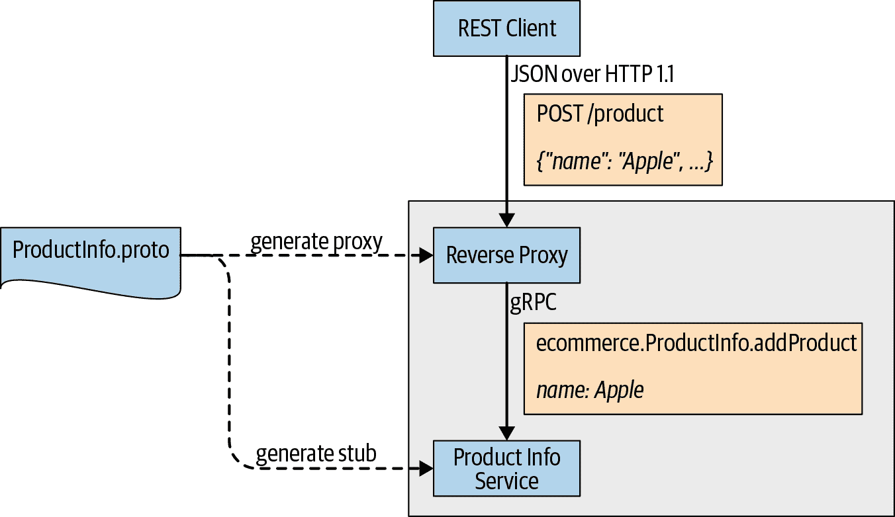

# 第八章：gRPC 生态系统

在本章中，我们将探讨一些不属于核心 gRPC 实现但在构建和运行真实用例的 gRPC 应用程序中可能非常有用的项目。这些项目是 gRPC 生态系统父项目的一部分，这里提到的技术都不是运行 gRPC 应用程序的强制要求。如果您有类似的需求，可以探索和评估这些技术。

让我们从 gRPC 网关开始讨论。

# gRPC 网关

gRPC 网关插件使协议缓冲编译器能够读取 gRPC 服务定义并生成反向代理服务器，将 RESTful JSON API 转换为 gRPC。这是专门为 Go 编写的，支持从 gRPC 和 HTTP 客户端应用程序调用 gRPC 服务。图 8-1 说明了它如何提供在 gRPC 和 RESTful 方式中调用 gRPC 服务的能力。

如图所示，我们有一个 `ProductInfo` 服务合同，并使用该合同构建了一个名为 `ProductInfoService` 的 gRPC 服务。之前我们构建了一个 gRPC 客户端来与此 gRPC 服务通信。但是在这里，我们将构建一个反向代理服务，为 gRPC 服务中的每个远程方法提供 RESTful API，并接受来自 REST 客户端的 HTTP 请求。一旦收到 HTTP 请求，它将请求转换为 gRPC 消息，并调用后端服务中的远程方法。来自后端服务器的响应消息再次转换为 HTTP 响应并回复给客户端。



###### 图 8-1\. gRPC 网关

要为服务定义生成反向代理服务，首先需要通过更新服务定义将 gRPC 方法映射到 HTTP 资源。让我们使用之前创建的 `ProductInfo` 服务定义，添加映射条目。示例 8-1 显示了更新后的协议缓冲区定义。

##### 示例 8-1\. 更新了 ProductInfo 服务的协议缓冲区定义

```go
syntax = "proto3";

import "google/protobuf/wrappers.proto";
import "google/api/annotations.proto"; 

package ecommerce;

service ProductInfo {
   rpc addProduct(Product) returns (google.protobuf.StringValue) {
       option (google.api.http) = { 
           post: "/v1/product"
           body: "*"
       };
   }
   rpc getProduct(google.protobuf.StringValue) returns (Product) {
        option (google.api.http) = { 
            get:"/v1/product/{value}"
        };
   }
}

message Product {
   string id = 1;
   string name = 2;
   string description = 3;
   float price = 4;
}
```


导入 *google/api/annotations.proto* proto 文件以向协议定义添加注解支持。


将 gRPC/HTTP 映射添加到 `addProduct` 方法。指定 URL 路径模板 (`/v1/product`)、HTTP 方法 (`post`) 和消息体的结构。在消息体映射中使用 `*` 来定义未被路径模板绑定的每个字段应映射到请求体中。


将 gRPC/HTTP 映射添加到 `getProduct` 方法。这是一个 GET 方法，URL 路径模板为 `/v1/product/{value}`，并将 `ProductID` 作为路径参数传递。

当我们映射 gRPC 方法到 HTTP 资源时，我们需要了解更多的附加规则。下面列出了一些重要的规则。您可以参考[Google API 文档](https://oreil.ly/iYyZC)了解有关 HTTP 到 gRPC 映射的更多详细信息。

+   每个映射都需要指定一个 URL 路径模板和一个 HTTP 方法。

+   路径模板可以包含 gRPC 请求消息中的一个或多个字段。但这些字段应该是具有原始类型的非重复字段。

+   如果没有 HTTP 请求体，请求消息中的任何字段都将自动成为 HTTP 查询参数，如果没有路径模板。

+   映射到 URL 查询参数的字段应该是原始类型、重复的原始类型或非重复的消息类型之一。

+   对于查询参数中的重复字段类型，参数可以在 URL 中重复显示为`...?param=A&param=B`。

+   对于查询参数中的消息类型，消息的每个字段都映射到一个单独的参数，如`...?foo.a=A&foo.b=B&foo.c=C`。

一旦编写了服务定义，我们需要使用协议缓冲编译器对其进行编译，并生成反向代理服务的源代码。让我们来讨论如何在 Go 语言中生成代码并实现服务器。

在我们能够编译服务定义之前，我们需要获取一些依赖包。使用以下命令下载这些包：

```go
go get -u github.com/grpc-ecosystem/grpc-gateway/protoc-gen-grpc-gateway
go get -u github.com/grpc-ecosystem/grpc-gateway/protoc-gen-swagger
go get -u github.com/golang/protobuf/protoc-gen-go
```

下载完依赖包后，执行以下命令编译服务定义（*product_info.proto*）并生成存根：

```go
protoc -I/usr/local/include -I. \
-I$GOPATH/src \
-I$GOPATH/src/github.com/grpc-ecosystem/grpc-gateway/third_party/googleapis \
--go_out=plugins=grpc:. \
product_info.proto
```

一旦执行该命令，它将在相同位置生成一个存根（*product_info.pb.go*）。除了生成的存根外，我们还需要创建一个反向代理服务来支持 RESTful 客户端调用。这个反向代理服务可以通过 Go 编译器支持的网关插件来生成。

###### 注意

gRPC 网关仅在 Go 中支持，这意味着我们无法在其他语言中编译并生成 gRPC 网关的反向代理服务。

让我们通过执行以下命令从服务定义生成一个反向代理服务：

```go
protoc -I/usr/local/include -I. \
-I$GOPATH/src \
-I$GOPATH/src/github.com/grpc-ecosystem/grpc-gateway/third_party/googleapis \
--grpc-gateway_out=logtostderr=true:. \
product_info.proto
```

一旦执行该命令，它将在相同位置生成一个反向代理服务（*product_info.pb.gw.go*）。

让我们为 HTTP 服务器创建监听端点，并运行我们刚刚创建的反向代理服务。示例 8-2 展示了如何创建一个新的服务器实例并注册服务以监听传入的 HTTP 请求。

##### 示例 8-2\. Go 语言中的 HTTP 反向代理

```go
package main

import (
  "context"
  "log"
  "net/http"

  "github.com/grpc-ecosystem/grpc-gateway/runtime"
  "google.golang.org/grpc"

  gw "github.com/grpc-up-and-running/samples/ch08/grpc-gateway/go/gw" 
)

var (
  grpcServerEndpoint = "localhost:50051" 
)

func main() {
  ctx := context.Background()
  ctx, cancel := context.WithCancel(ctx)
  defer cancel()

  mux := runtime.NewServeMux()
  opts := []grpc.DialOption{grpc.WithInsecure()}
  err := gw.RegisterProductInfoHandlerFromEndpoint(ctx, mux,
      grpcServerEndpoint, opts) 
  if err != nil {
     log.Fatalf("Fail to register gRPC gateway service endpoint: %v", err)
  }

  if err := http.ListenAndServe(":8081", mux); err != nil { 
     log.Fatalf("Could not setup HTTP endpoint: %v", err)
  }
}
```


导入到生成的反向代理代码所在的包。


指定 gRPC 服务器端点 URL。确保后端 gRPC 服务器在所述端点上正常运行。这里我们使用了同一章中创建的 gRPC 服务 Chapter 2。


将 gRPC 服务器端点注册到代理处理程序。在运行时，请求多路复用器将 HTTP 请求与模式进行匹配，并调用相应的处理程序。


监听端口（8081）上的 HTTP 请求。

一旦我们建立了 HTTP 反向代理服务器，我们可以通过同时运行 gRPC 服务器和 HTTP 服务器来测试它。在这种情况下，gRPC 服务器监听端口 50051，HTTP 服务器监听端口 8081。

让我们使用 curl 发出几个 HTTP 请求并观察其行为：

1.  向 `ProductInfo` 服务添加新产品。

    ```go
    $ curl -X POST http://localhost:8081/v1/product
            -d '{"name": "Apple", "description": "iphone7", "price": 699}'

    "38e13578-d91e-11e9"
    ```

1.  使用 `ProductID` 获取现有产品：

    ```go
    $ curl http://localhost:8081/v1/product/38e13578-d91e-11e9

    {"id":"38e13578-d91e-11e9","name":"Apple","description":"iphone7",
    "price":699}
    ```

1.  添加到反向代理服务中，gRPC 网关还支持通过执行以下命令生成反向代理服务的 swagger 定义：

    ```go
    protoc -I/usr/local/include -I. \
      -I$GOPATH/src \
      -I$GOPATH/src/github.com/grpc-ecosystem/grpc-gateway/\
      third_party/googleapis \
      --swagger_out=logtostderr=true:. \
      product_info.proto
    ```

1.  一旦我们执行该命令，它将在相同位置为反向代理服务生成一个 swagger 定义文件（*product_info.swagger.json*）。对于我们的 `ProductInfo` 服务，生成的 swagger 定义看起来像这样：

    ```go
    {
     "swagger": "2.0",
     "info": {
       "title": "product_info.proto",
       "version": "version not set"
     },
     "schemes": [
       "http",
       "https"
     ],
     "consumes": [
       "application/json"
     ],
     "produces": [
       "application/json"
     ],
     "paths": {
       "/v1/product": {
         "post": {
           "operationId": "addProduct",
           "responses": {
             "200": {
               "description": "A successful response.",
               "schema": {
                 "type": "string"
               }
             }
           },
           "parameters": [
             {
               "name": "body",
               "in": "body",
               "required": true,
               "schema": {
                 "$ref": "#/definitions/ecommerceProduct"
               }
             }
           ],
           "tags": [
             "ProductInfo"
           ]
         }
       },
       "/v1/product/{value}": {
         "get": {
           "operationId": "getProduct",
           "responses": {
             "200": {
               "description": "A successful response.",
               "schema": {
                 "$ref": "#/definitions/ecommerceProduct"
               }
             }
           },
           "parameters": [
             {
               "name": "value",
               "description": "The string value.",
               "in": "path",
               "required": true,
               "type": "string"
             }
           ],
           "tags": [
             "ProductInfo"
           ]
         }
       }
     },
     "definitions": {
       "ecommerceProduct": {
         "type": "object",
         "properties": {
           "id": {
             "type": "string"
           },
           "name": {
             "type": "string"
           },
           "description": {
             "type": "string"
           },
           "price": {
             "type": "number",
             "format": "float"
           }
         }
       }
     }
    }
    ```

现在我们已经使用 gRPC 网关实现了 gRPC 服务的 HTTP 反向代理服务。通过这种方式，我们可以将我们的 gRPC 服务器暴露给 HTTP 客户端应用程序使用。您可以从 [gRPC 网关存储库](https://oreil.ly/rN1WK) 获取有关网关实现的更多信息。

正如我们之前提到的，gRPC 网关仅在 Go 中受支持。相同的概念也称为 HTTP/JSON 转码。让我们在下一节中更详细地讨论 HTTP/JSON 转码。

# gRPC 的 HTTP/JSON 转码

*转码* 是将 HTTP JSON 调用转换为 RPC 调用并传递给 gRPC 服务的过程。当客户端应用程序不支持 gRPC 并需要通过 JSON over HTTP 提供访问 gRPC 服务时，这非常有用。有一个用 C++ 语言编写的库来支持 HTTP/JSON 转码，称为 grpc-httpjson-transcoding，目前在 [Istio](https://oreil.ly/vWllM) 和 [Google Cloud Endpoint](https://oreil.ly/KR5_X) 中使用。

[Envoy 代理](https://oreil.ly/33hyY) 也通过为 gRPC 服务提供 HTTP/JSON 接口来支持转码。类似于 gRPC 网关，我们需要为 gRPC 服务提供 HTTP 映射的服务定义。它使用在 [Google API 文档](https://oreil.ly/H6ysW) 中指定的相同映射规则。因此，我们在 Example 8-1 中修改的服务定义也可以应用于 HTTP/JSON 转码。

例如，`Product Info` 服务的 `getProduct` 方法在 *.proto* 文件中定义，其请求和响应类型如下：

```go
   rpc getProduct(google.protobuf.StringValue) returns (Product) {
        option (google.api.http) = {
            get:"/v1/product/{value}"
        };
   }
```

如果客户端通过向 URL http://localhost:8081/v1/product/2 发送 GET 请求调用此方法，则代理服务器将创建一个值为 2 的*google.protobuf.StringValue*，然后调用带有此值的 gRPC 方法`getProduct()`。 gRPC 后端然后返回 ID 为 2 的请求的`Product`，代理服务器将其转换为 JSON 格式并返回给客户端。

现在我们已经介绍了 HTTP/JSON 转码，下一节我们将讨论另一个重要的概念，即 gRPC 服务器反射。

# gRPC 服务器反射协议

*服务器反射*是在 gRPC 服务器上定义的一项服务，它提供有关该服务器上公开访问的 gRPC 服务的信息。简单来说，服务器反射为客户端应用程序提供了在服务器上注册的服务的服务定义。因此，客户端不需要预编译的服务定义来与服务通信。

正如我们在第二章中讨论的那样，要使客户端应用程序能够连接并与 gRPC 服务通信，它必须具有该服务的服务定义。我们首先需要编译服务定义并生成相应的客户端存根。然后，我们需要创建调用存根方法的客户端应用程序。使用 gRPC 服务器反射，我们不需要预编译服务定义来与服务通信。

当我们构建用于调试 gRPC 服务器的命令行（CLI）工具时，服务反射非常有用。我们不需要为工具提供服务定义，而是提供方法和文本负载。它将二进制负载发送到服务器，并以人类可读的格式将响应返回给用户。为了使用服务反射，我们首先需要在服务器端启用它。示例 8-3 演示了如何启用服务器反射。

##### 示例 8-3\. 在 gRPC Go 服务器中启用服务器反射

```go
package main

import (
  ...

  pb "productinfo/server/ecommerce"
  "google.golang.org/grpc"
  "google.golang.org/grpc/reflection" 
)

func main() {
  lis, err := net.Listen("tcp", port)
  if err != nil {
     log.Fatalf("failed to listen: %v", err)
  }
  s := grpc.NewServer()
  pb.RegisterProductInfoServer(s, &server{})
  reflection.Register(s) 
  if err := s.Serve(lis); err != nil {
     log.Fatalf("failed to serve: %v", err)
  }
}
```


导入反射包以访问反射 API。


在您的 gRPC 服务器上注册反射服务。

在您的服务器应用程序中启用服务器反射后，您可以使用 gRPC CLI 工具检查您的服务器。

###### 注意

gRPC CLI 工具随 gRPC 仓库提供。它支持许多功能，例如列出服务器服务和方法，并带有元数据发送和接收 RPC 调用。截至撰写本文时，您需要从源代码构建此工具。有关如何构建和使用该工具的详细信息，请参阅[gRPC CLI 工具仓库](https://oreil.ly/jYl0h)。

一旦您从[源代码](https://github.com/grpc/grpc)构建了 gRPC CLI 工具，您可以使用它来检查服务。让我们尝试通过我们在第二章中构建的产品管理服务来理解这一点。一旦启动产品管理服务的 gRPC 服务器，您就可以运行 CLI 工具来检索服务信息。

以下是您可以从 CLI 工具执行的操作：

列出服务

运行以下命令以列出端点`localhost:50051`中的所有公共服务：

```go
$ ./grpc_cli ls localhost:50051

Output:
ecommerce.ProductInfo
grpc.reflection.v1alpha.ServerReflection
```

列出服务详细信息

通过提供服务的全名（格式为<package>.<service>）运行以下命令以检查服务：

```go
$ ./grpc_cli ls localhost:50051 ecommerce.ProductInfo -l

Output:
package: ecommerce;
service ProductInfo {
rpc addProduct(ecommerce.Product) returns
(google.protobuf.StringValue) {}
rpc getProduct(google.protobuf.StringValue) returns
(ecommerce.Product) {}
}
```

列出方法详细信息

通过提供方法的全名（格式为<package>.<service>.<method>）来获取方法详细信息：

```go
$ ./grpc_cli ls localhost:50051 ecommerce.ProductInfo.addProduct -l

Output:
rpc addProduct(ecommerce.Product) returns
(google.protobuf.StringValue) {}
```

检查消息类型

运行以下命令，通过提供消息类型的全名（格式为<package>.<type>）来检查消息类型：

```go
$ ./grpc_cli type localhost:50051 ecommerce.Product

Output:
message Product {
string id = 1[json_name = "id"];
string name = 2[json_name = "name"];
string description = 3[json_name = "description"];
float price = 4[json_name = "price"];
}
```

调用远程方法

运行以下命令以向服务器发送远程调用并获取响应：

1.  调用`ProductInfo`服务中的`addProduct`方法：

    ```go
    $ ./grpc_cli call localhost:50051 addProduct "name:
     'Apple', description: 'iphone 11', price: 699"

    Output:
    connecting to localhost:50051
    value: "d962db94-d907-11e9-b49b-6c96cfe0687d"

    Rpc succeeded with OK status
    ```

1.  调用`ProductInfo`服务中的`getProduct`方法：

    ```go
    $ ./grpc_cli call localhost:50051 getProduct "value:
     'd962db94-d907-11e9-b49b-6c96cfe0687d'"

    Output:
    connecting to localhost:50051
    id: "d962db94-d907-11e9-b49b-6c96cfe0687d"
    name: "Apple"
    description: "iphone 11"
    price: 699

    Rpc succeeded with OK status
    ```

现在我们可以在 gRPC Go 服务器中启用服务器反射，并使用 CLI 工具进行测试。我们还可以在我们的 gRPC Java 服务器中启用服务器反射。如果您更熟悉 Java，可以参考源代码存储库中的 Java 示例。

让我们讨论另一个有趣的概念，称为 gRPC 中间件。

# gRPC 中间件

在基本术语中，*中间件*是分布式系统中的软件组件，用于连接不同的组件，将客户端生成的请求路由到后端服务器。在[gRPC 中间件](https://oreil.ly/EqnCQ)中，我们还讨论了在 gRPC 服务器或客户端应用程序之前和之后运行代码的情况。

实际上，gRPC 中间件基于我们在第五章学到的*拦截器*概念。它是一个基于 Go 的拦截器、辅助函数和实用工具的集合，在构建基于 gRPC 的应用程序时需要这些工具。它允许您在客户端或服务器端应用多个拦截器作为拦截器链。此外，由于拦截器通常用于实现常见模式，如认证、日志记录、消息验证、重试或监控，因此 gRPC 中间件项目作为 Go 的这些可重用功能的首选点。在示例 8-4 中，我们展示了 gRPC 中间件包的常见用法。在这里，我们用它来为一元和流式消息应用多个拦截器。

##### 示例 8-4。在 Go gRPC 中间件中服务器端的拦截器链

```go
import "github.com/grpc-ecosystem/go-grpc-middleware"

orderMgtServer := grpc.NewServer(
    grpc.Unaryinterceptor(grpc_middleware.ChainUnaryServer( 
        grpc_ctxtags.UnaryServerinterceptor(),
        grpc_opentracing.UnaryServerinterceptor(),
        grpc_prometheus.UnaryServerinterceptor,
        grpc_zap.UnaryServerinterceptor(zapLogger),
        grpc_auth.UnaryServerinterceptor(myAuthFunction),
        grpc_recovery.UnaryServerinterceptor(),
    )),
    grpc.Streaminterceptor(grpc_middleware.ChainStreamServer( 
        grpc_ctxtags.StreamServerinterceptor(),
        grpc_opentracing.StreamServerinterceptor(),
        grpc_prometheus.StreamServerinterceptor,
        grpc_zap.StreamServerinterceptor(zapLogger),
        grpc_auth.StreamServerinterceptor(myAuthFunction),
        grpc_recovery.StreamServerinterceptor(),
    )),
    )
```


为服务器添加一元拦截器链。


为服务器添加流式拦截器链。

拦截器按照它们在 Go gRPC 中间件中注册的顺序被调用。该项目还为常见模式提供了一些可重用的拦截器。以下是一些常见模式和拦截器实现：

认证

`grpc_auth`

可定制的（通过`AuthFunc`）认证中间件。

日志记录

`grpc_ctxtags`

一个将标签映射添加到上下文中的库，数据来自请求体。

`grpc_zap`

将 zap 日志库集成到 gRPC 处理程序中。

`grpc_logrus`

将 logrus 日志库集成到 gRPC 处理程序中。

监控

`grpc_prometheus`

Prometheus 客户端和服务器端监控中间件。

`grpc_opentracing`

客户端和服务器端的 OpenTracing 拦截器支持流式处理和处理程序返回的标签。

客户端

`grpc_retry`

通用的 gRPC 响应代码重试机制，客户端中间件。

服务器

`grpc_validator`

从*.proto*选项中生成入站消息验证的代码。

`grpc_recovery`

将恐慌转换为 gRPC 错误。

`ratelimit`

通过自己的限制器对 gRPC 进行速率限制。

在客户端使用 Go gRPC 中间件的方式完全相同。示例 8-5 展示了使用 Go gRPC 中间件进行客户端拦截器链的代码片段。

##### 示例 8-5\. 使用 Go gRPC 中间件进行客户端端拦截器链

```go
import "github.com/grpc-ecosystem/go-grpc-middleware"

clientConn, err = grpc.Dial(
   address,
     grpc.WithUnaryinterceptor(grpc_middleware.ChainUnaryClient(
          monitoringClientUnary, retryUnary)), 
     grpc.WithStreaminterceptor(grpc_middleware.ChainStreamClient(
          monitoringClientStream, retryStream)), 
)
```


客户端一元拦截器链。


客户端流式拦截器链。

类似于服务器端，拦截器按照它们在客户端注册的顺序执行。

接下来，我们将讨论如何公开 gRPC 服务器的健康状态。在高可用系统中，有一种方法可以检查服务器的健康状态，以便我们可以定期检查并采取措施以减少损害。

# 健康检查协议

gRPC 定义了一个健康检查协议（健康检查 API），允许 gRPC 服务公开服务器状态，以便消费者可以探测服务器的健康信息。服务器的健康状态是通过响应一个*不健康*状态来确定，当服务器没有准备好处理 RPC 或者在健康探测请求中没有响应时。如果响应表明*不健康*状态或者在某个时间窗口内未收到响应，则客户端可以相应地采取行动。

gRPC 健康检查协议定义了一个基于 gRPC 的 API。然后，gRPC 服务用作健康检查机制，既可以用于简单的客户端到服务器的场景，也可以用于负载均衡等其他控制系统。示例 8-6 展示了 gRPC 健康检查接口的标准服务定义。

##### 示例 8-6\. gRPC 健康检查 API 的服务定义

```go
syntax = "proto3";

package grpc.health.v1;

message HealthCheckRequest { 
  string service = 1;
}

message HealthCheckResponse { 
  enum ServingStatus {
    UNKNOWN = 0;
    SERVING = 1;
    NOT_SERVING = 2;
  }
  ServingStatus status = 1;
}

service Health {
  rpc Check(HealthCheckRequest) returns (HealthCheckResponse); 

  rpc Watch(HealthCheckRequest) returns (stream HealthCheckResponse); 
}
```


健康检查请求消息结构。


带服务状态的健康检查响应。


客户端可以通过调用`Check`方法查询服务器的健康状态。


客户端可以调用`Watch`方法执行流式健康检查。

健康检查服务的实现与任何传统的 gRPC 服务非常相似。通常情况下，您将在同一个 gRPC 服务器实例中使用多路复用同时运行健康检查服务和相关的 gRPC 业务服务（我们在第五章中讨论过）。由于它是一个 gRPC 服务，进行健康检查与进行普通 RPC 相同。它还提供了细粒度的服务健康语义，包括每个服务的健康状态等详细信息。此外，它能够重用服务器上的所有现有信息并对其进行全面控制。

基于示例 8-6 中显示的服务器接口，客户端可以调用`Check`方法（可选参数为服务名）来检查特定服务或服务器的健康状态。

此外，客户端还可以调用`Watch`方法执行流式健康检查。这使用服务器流式传输消息模式，这意味着一旦客户端调用此方法，服务器将开始发送指示当前状态的消息，并在状态更改时发送后续新消息。

这些是了解 gRPC 健康检查协议的关键要点：

+   为了为服务器中注册的每个服务提供状态，我们应手动注册所有服务，并在服务器中设置空服务名的总体状态。

+   客户端的每个健康检查请求应该设置截止日期，以便客户端可以确定如果 RPC 未在截止期内完成，则服务器状态为不健康。

+   对于每个健康检查请求，客户端可以设置一个服务名或为空。如果请求中有服务名并且在服务器注册表中找到，必须返回带有 HTTP OK 状态的响应，并且`HealthCheckResponse`消息的状态字段应设置为特定服务的状态（可以是`SERVING`或`NOT_SERVING`）。如果在服务器注册表中找不到该服务，则服务器应以`NOT_FOUND`状态响应。

+   如果客户端需要查询服务器的总体状态而不是特定服务的状态，则客户端可以发送带有空字符串值的请求，以便服务器响应服务器的总体健康状态。

+   如果服务器没有健康检查 API，则客户端应自行处理。

健康检查服务由其他 gRPC 消费者或中间子系统（如负载均衡器或代理）消耗。与从头开始实现客户端不同，您可以使用诸如`grpc_health_probe`之类的现有健康检查客户端的实现。

# gRPC 健康探针

[`grpc_health_probe`](https://oreil.ly/I84Ui) 是社区提供的一个工具，用于检查将其状态作为服务公开的服务器的健康状态，通过 gRPC 健康检查协议。它是一个通用客户端，可以与 gRPC 标准健康检查服务进行通信。您可以像下面显示的那样使用 `grpc_health_probe_` 二进制文件作为 CLI 实用程序：

```go
$ grpc_health_probe -addr=localhost:50051 

healthy: SERVING
```

```go
$ grpc_health_probe -addr=localhost:50052 -connect-timeout 600ms \
 -rpc-timeout 300ms 

failed to connect service at "localhost:50052": context deadline exceeded
exit status 2
```


对运行在本地主机端口 50051 上的 gRPC 服务器进行健康检查请求。


健康检查请求还包括与连接相关的其他几个附加参数。

如前述 CL 输出所示，`grpc_health_probe` 发起 RPC 请求至 `/grpc.health.v1.Health/Check`。如果它响应 `SERVING` 状态，则 `grpc_health_probe` 将成功退出；否则，它将以非零退出代码退出。

如果您在 Kubernetes 上运行 gRPC 应用程序，则可以运行 `grpc_health_probe` 来检查您的 gRPC 服务器 pod 的 Kubernetes 的 [活性和就绪](https://oreil.ly/a7bOC) 检查。

为此，您可以将 gRPC 健康探测与您的 Docker 镜像捆绑在一起，如下所示的 Dockerfile 片段：

```go
RUN GRPC_HEALTH_PROBE_VERSION=v0.3.0 && \
    wget -qO/bin/grpc_health_probe \
    https://github.com/grpc-ecosystem/grpc-health-probe/releases/download/
            ${GRPC_HEALTH_PROBE_VERSION}/grpc_health_probe-linux-amd64 && \
    chmod +x /bin/grpc_health_probe
```

然后在 Kubernetes 部署的 pod 规范中，您可以像这样定义 `livenessProbe` 和/或 `readinessProbe`：

```go
spec:
  containers:
  - name: server
    image: "kasunindrasiri/grpc-productinfo-server"
    ports:
    - containerPort: 50051
    readinessProbe:
      exec:
        command: ["/bin/grpc_health_probe", "-addr=:50051"] 
      initialDelaySeconds: 5
    livenessProbe:
      exec:
        command: ["/bin/grpc_health_probe", "-addr=:50051"] 
      initialDelaySeconds: 10
```


将 `grpc_health_probe` 指定为就绪探测。


将 `grpc_health_probe` 指定为活性探测。

当您使用 gRPC 健康探测设置活性和就绪探测时，Kubernetes 可以基于您的 gRPC 服务器的健康状态做出决策。

# 其他生态系统项目

在构建基于 gRPC 的应用程序时，还有一些其他生态系统项目可以提供帮助。客户端 *protoc* 插件是一个类似的生态系统需求，例如 [*protoc-gen-star (PG*)*](https://oreil.ly/9eRq8) 开始引起关注。此外，诸如 [*protoc-gen-validate (PGV)*](https://oreil.ly/KlGy7) 的库提供了一个 protoc 插件，用于生成多语言消息验证器。生态系统随着新项目的增加而不断发展，以满足 gRPC 应用程序开发中的各种需求。

至此，我们结束了对 gRPC 生态系统组件的讨论。重要的是要记住，这些生态系统项目并不是 gRPC 项目的一部分。在生产环境中使用它们之前，您需要适当评估它们。此外，它们可能会发生变化：一些项目可能会变得过时，其他项目可能变得主流，而另一些全新的项目可能会出现在 gRPC 生态系统中。

# 总结

正如您所看到的，尽管 gRPC 生态系统项目不是核心 gRPC 实现的一部分，但它们在构建和运行面向实际用例的 gRPC 应用程序中非常有用。这些项目围绕 gRPC 构建，以解决在使用 gRPC 构建生产系统时遇到的问题或限制。例如，当我们将我们的 RESTful 服务迁移到 gRPC 服务时，我们需要考虑那些习惯于以 RESTful 方式调用我们服务的现有客户端。为了解决这个问题，引入了 HTTP/JSON 转码和 gRPC 网关概念，以便现有的 RESTful 客户端和新的 gRPC 客户端都可以调用同一个服务。类似地，引入了服务反射来克服使用命令行工具测试 gRPC 服务的限制。

由于 gRPC 在云原生世界中非常流行，开发人员现在逐渐从 REST 服务向 gRPC 迁移，我们将在未来看到更多围绕 gRPC 构建的类似项目。

恭喜！您刚刚完成了阅读《gRPC: Up and Running》，并基本涵盖了 gRPC 应用程序的整个开发生命周期，包括基于 Go 和 Java 的大量代码示例。我们希望本书为您在将 gRPC 作为应用程序和微服务之间的进程间通信技术使用的旅程奠定了基础。您在本书中学到的内容将帮助您快速构建 gRPC 应用程序，了解它们如何与其他技术共存，并在生产环境中运行。

因此，现在是进一步探索 gRPC 的时候了。尝试通过应用本书中学到的技术来构建实际应用程序。gRPC 有很多功能取决于您用于开发 gRPC 应用程序的编程语言，因此您需要学习特定于您使用的语言的某些技术。此外，gRPC 生态系统正呈指数级增长，了解支持 gRPC 的最新技术和框架将非常有帮助。前进，探索吧！
