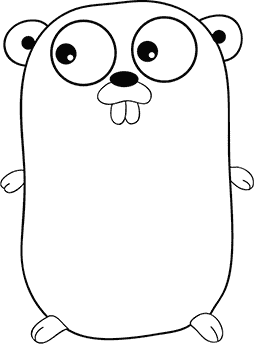
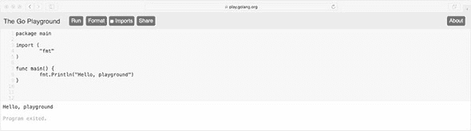
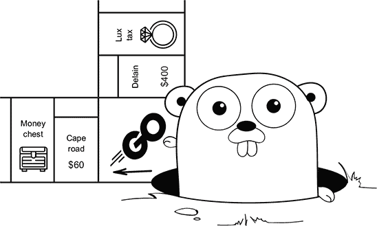
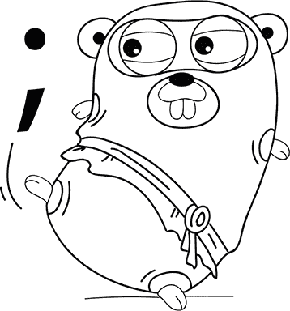

## 单元 0. 入门

传统上，学习一门新编程语言的第一步是设置工具和环境来运行一个简单的“Hello, world”应用程序。有了 Go 操场，这项古老的努力简化为单次点击。

在此之后，你可以开始学习编写和修改简单程序所需的语法和概念。

## 第 1 课. 准备，设置，Go

在阅读 第 1 课 之后，你将能够

+   了解 Go 的独特之处

+   访问 Go 操场

+   在屏幕上打印文本

+   在任何自然语言中实验文本

Go 是当代的云计算编程语言。亚马逊、苹果、 canonical、雪佛龙、迪士尼、Facebook、通用电气、谷歌、Heroku、微软、Twitch、威瑞森和沃尔玛等公司正在采用 Go 进行重要项目（参见 [thenewstack.io/who-is-the-go-developer/](http://thenewstack.io/who-is-the-go-developer/) 和 [golang.org/wiki/GoUsers](http://golang.org/wiki/GoUsers)）。网络基础设施的大部分正在转向 Go，这得益于 CloudFlare、Cockroach Labs、DigitalOcean、Docker、InfluxData、Iron.io、Let’s Encrypt、Light Code Labs、Red Hat CoreOS、SendGrid 以及像云原生计算基金会这样的组织。

Go 在数据中心表现出色，但其应用范围远超工作场所。Ron Evans 和 Adrian Zankich 创建了 Gobot（gobot.io），这是一个用于控制机器人和硬件的库。Alan Shreve 创建了开发工具 ngrok（ngrok.com），作为学习 Go 的项目，并且后来将其转变为全职业务。

采用 Go 的人称自己为 *gophers*，以纪念 Go 的轻松 mascot (figure 1.1)。编程具有挑战性，但有了 Go 和这本书，我们希望你能发现编码的乐趣。

##### 图 1.1. 由 Renée French 设计的 Go gopher 面饰



在本课中，你将在网页浏览器中实验一个 Go 程序。

| |
| --- |

**考虑这一点**

如果你告诉一个数字助手，“Call me a cab”，它会拨打出租车公司吗？还是它假设你改名为 *a cab*？自然语言，如英语，充满了歧义。

清晰性在编程语言中至关重要。如果语言的语法或语法允许歧义，计算机可能不会按照你的说法行事。这反而违背了编写程序的目的。

Go 并不是一种完美的语言，但它比我们使用的任何其他语言都更追求清晰。随着你通过本课的学习，你将需要学习一些缩写和术语。不是所有内容一开始都会一目了然，但请花时间欣赏 Go 的工作方式，以减少歧义。


### 1.1. 什么是 Go？

Go 是一种 *编译型* 编程语言。在运行程序之前，Go 使用 *编译器* 将你的代码翻译成机器语言中的 1 和 0。它将你的所有代码编译成一个单一的 *可执行文件*，供你运行或分发。在这个过程中，Go 编译器可以捕捉到拼写错误和错误。

并非所有编程语言都采用这种方法。Python、Ruby 和其他几种流行的语言使用**解释器**在程序运行时逐条翻译语句。这意味着可能存在你尚未测试的路径中的错误。

另一方面，解释器使编写代码的过程变得快速且交互式，使用动态、轻松且有趣的编程语言。编译语言以静态、僵化、程序员被迫取悦的机器人而闻名，而编译器则因其速度慢而受到嘲笑。但真的需要这样吗？

> *我们想要一种语言，它具有像 C++ 和 Java 这样的静态编译语言的**安全性和性能**，同时又有像 Python 这样的动态类型解释语言的**轻便和乐趣**。
> 
> *罗布·派克，*本周极客*（见 [mng.bz/jr8y](http://mng.bz/jr8y)）*

Go 在编写软件的体验上投入了大量的考虑。大型程序只需一条命令即可在几秒钟内编译完成。该语言省略了导致歧义的特征，鼓励编写可预测且易于理解的代码。而且 Go 提供了轻量级的替代方案，以应对像 Java 这样的经典语言的僵化结构。

> *Java 省略了 C++ 中许多很少使用、理解不佳、令人困惑的特征，根据我们的经验，这些特征带来的麻烦多于好处。*
> 
> *詹姆斯·高斯林，*Java：概述**

每种新的编程语言都会对过去的思想进行细化。在 Go 中，使用内存更高效且比早期语言更少出错，Go 还利用了多核机器上的每个核心。成功案例通常将提高效率作为转向 Go 的原因。Iron.io 能够用 2 个使用 Go 的服务器替换运行 Ruby 的 30 个服务器（见 [mng.bz/Wevx](http://mng.bz/Wevx) 和 [mng.bz/8yo2](http://mng.bz/8yo2)）。Bitly 在用 Go 重写 Python 应用程序后“看到了一致、可衡量的性能提升”，随后用 Go 后继者替换了其 C 应用程序（见 [mng.bz/EnYl](http://mng.bz/EnYl)）。

Go 提供了解释语言的乐趣和易用性，同时在效率和可靠性方面有所提升。作为一个小型语言，只有几个简单概念，Go 相对容易学习。这三个原则构成了 Go 的座右铭：

> *Go 是一种开源编程语言，它能够以**简单**、**高效**和**可靠**的方式大规模生产软件。*
> 
> *Go 品牌手册*


##### 提示

在互联网上搜索与 Go 相关的主题时，使用关键词 golang，代表 Go 语言。-lang 后缀也可以应用于其他编程语言，如 Ruby、Rust 等。

|  |

**快速检查 1.1**

> **Q1:**
> 
> Go 编译器的两个好处是什么？

|  |

**QC 1.1 答案**

> **1:**
> 
> 大型程序可以在几秒钟内编译完成，Go 编译器可以在程序运行前捕获拼写错误和错误。


### 1.2\. Go 演示场

开始学习 Go 的最快方式是导航到 play.golang.org。在 Go Playground (图 1.2) 中，你可以编辑、运行和实验 Go，无需安装任何东西。当你点击运行按钮时，Playground 将在 Google 服务器上编译并执行你的代码，并显示结果。

##### 图 1.2\. Go Playground



如果你点击分享按钮，你会收到一个链接，可以回到你编写的代码。你可以与朋友分享这个链接，或者将其添加到书签以保存你的工作。

| |
| --- |

##### 注意

你可以使用 Go Playground 来完成本书中的每个代码列表和练习。或者，如果你已经熟悉文本编辑器和命令行，你可以从 [golang.org/dl/](http://golang.org/dl/) 下载并安装 Go。

| |
| --- |
| |

**快速检查 1.2**

> **Q1:**
> 
> 在 Go Playground 中，运行按钮做什么？

| |
| --- |
| |

**QC 1.2 答案**

> **1:**
> 
> 运行按钮将在 Google 服务器上编译然后执行你的代码。

| |
| --- |

### 1.3\. 包和函数

当你访问 Go Playground 时，你会看到以下代码，这是一个很好的起点。

##### 列表 1.1\. Hello, playground: playground.go

```
package main                                 *1*

import (
    "fmt"                                    *2*
)

func main() {                                *3*
    fmt.Println("Hello, playground")         *4*
}
```

+   ***1* 声明此代码所属的包**

+   ***2* 使 fmt（格式）包可用于使用**

+   ***3* 声明一个名为 main 的函数**

+   ***4* 将“Hello, playground”打印到屏幕上**

尽管简短，但前面的列表介绍了三个关键字：`package`、`import` 和 `func`。每个关键字都保留用于特殊目的。

`package` 关键字声明了此代码所属的包，在这种情况下是一个名为 `main` 的包。Go 中的所有代码都组织成 *包*。Go 提供了一个标准库，由数学、压缩、加密、图像处理等包组成。每个包对应一个单一的概念。

下一个行使用 `import` 关键字来指定此代码将使用的包。包包含任意数量的 *函数*。例如，`math` 包提供了 `Sin`、`Cos`、`Tan` 和 `Sqrt`（平方根）等函数。这里使用的 `fmt` 包提供了 *格式化* 输入和输出的函数。在屏幕上显示文本是一种常见的操作，因此这个包名被缩写为 `fmt`。Gophers 将 `fmt` 发音为“FŌŌMT!”，就像它被写成漫画书中大爆炸式的字母一样。

`func` 关键字声明一个函数，在这种情况下是一个名为 `main` 的函数。每个函数的 *主体* 被括号 `{}` 包围，这是 Go 知道每个函数开始和结束的方式。

`main` *标识符* 是特殊的。当你运行用 Go 编写的程序时，执行从 `main` 包中的 `main` 函数开始。如果没有 `main`，Go 编译器将报告错误，因为它不知道程序应该从哪里开始。



要打印一行文本，你可以使用`Println`函数（`ln`是行的缩写）。`Println`前面带有`fmt`后跟一个点，因为它是由`fmt`包提供的。每次你使用一个导入包中的函数时，该函数前面都会带有包名和一个点。当你阅读用 Go 编写的代码时，每个函数来自哪个包会立即清楚。

在 Go Playground 中运行程序，可以看到文本*Hello, playground*。引号内的文本会被输出到屏幕上。在英语中，一个缺失的逗号可以改变句子的意思。标点符号在编程语言中也很重要。Go 依赖于引号、括号和大括号来理解你编写的代码。

| |
| --- |

**快速检查 1.3**

> **1**
> 
> Go 程序从哪里开始？
> 
> **2**
> 
> `fmt`包提供什么？

| |
| --- |
| |

**QC 1.3 答案**

> **1**
> 
> 程序从`main`包中的`main`函数开始。
> 
> **2**
> 
> `fmt`包提供格式化输入和输出的函数。

| |
| --- |

### 1.4. 唯一的正确的大括号风格

Go 对花括号`{}`的位置很挑剔。在列表 1.1 中，开括号`{`与`func`关键字在同一行，而闭括号`}`则单独一行。这是*唯一的正确的大括号风格*——没有其他方式。见[mng.bz/NdE2](http://mng.bz/NdE2)。

要理解为什么 Go 变得如此严格，你需要回到 Go 的诞生时刻。在那些早期日子里，代码到处都是分号。无处不在。无法摆脱它们；分号像迷失的小狗一样跟在每一个语句后面。例如：

```
fmt.Println("Hello, fire hydrant");
```

在 2009 年 12 月，一群忍者仓鼠从语言中移除了分号。好吧，不是真的。实际上，Go 编译器会代表你插入那些可爱的分号，并且它工作得非常完美。是的，完美，但作为交换，你必须遵循*唯一的正确的大括号风格*。



如果你将开括号放在与`func`关键字不同的行上，Go 编译器将报告语法错误：

```
func main()      *1*
{                *2*
}
```

+   ***1* 缺少函数体**

+   ***2* 语法错误：在`{`之前意外出现分号或换行符**

编译器并没有生你的气。分号插入的位置不正确，它有点困惑。

| |
| --- |

##### 小贴士

在你通过这本书的过程中，自己输入代码列表是个好主意。如果你输入错误，可能会看到语法错误，这是正常的。能够阅读、理解和纠正错误是一项重要的技能，而坚持不懈是一个宝贵的品质。

| |
| --- |
| |

**快速检查 1.4**

> **Q1:**
> 
> 开括号`{`必须放在哪里才能避免语法错误？

| |
| --- |
| |

**QC 1.4 答案**

> **1:**
> 
> 开括号必须与`func`关键字在同一行上，而不是单独一行。这是唯一的正确的大括号风格。

| |
| --- |

### 摘要

+   使用 Go Playground，你可以开始使用 Go 而无需安装任何东西。

+   每个 Go 程序都是由包含在包中的函数组成的。

+   要在屏幕上打印文本，请使用标准库提供的`fmt`包。

+   标点符号在编程语言中与在自然语言中一样重要。

+   你使用了 25 个 Go 关键字中的 3 个：`package`、`import`和`func`。

让我们看看你是否掌握了这个...

对于以下练习，修改 Go Playgound 中的代码并点击运行按钮以查看结果。如果你卡住了，刷新你的网络浏览器以恢复原始代码。

#### 实验：playground.go

+   通过修改引号之间的内容来更改打印到屏幕上的文本。让计算机通过你的名字问候你。

+   通过在`main`函数的`{}`体中编写第二行代码来显示两行文本。例如：

    ```
    fmt.Println("Hello, world")
    fmt.Println("Hello, ")
    ```

+   Go 支持所有语言的字符。打印中文、日语、俄语或西班牙语的文本。如果你不说法语，你可以使用 Google Translate ([translate.google.com](http://translate.google.com))并将文本复制/粘贴到 Go Playgound 中。

使用分享按钮获取你程序的链接，并通过在*Get Programming with Go*论坛（[forums.manning.com/forums/get-programming-with-go](http://forums.manning.com/forums/get-programming-with-go)）上发布来与其他读者分享。

将你的解决方案与附录中的代码列表进行比较。
