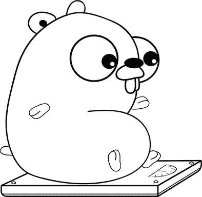
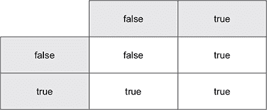
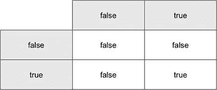

## 单元 1. 命令式编程

大多数计算机程序都是一系列步骤，就像你妈妈做肉汁蘑菇的指示一样。精确地告诉计算机如何完成任务，它就可以做各种事情。写下这些指示被称为*命令式编程*。如果计算机能做饭就好了！

在单元 1 中，你将复习 Go 的基础知识，并开始学习 Go 用来指导计算机的语法。每一课都会积累你需要应对第一个挑战的知识：一个列出火星度假票价的应用程序。

## 第 2 课。一个高级计算器

在阅读第 2 课之后，你将能够

+   教会计算机做数学

+   声明变量和常量

+   看看声明和赋值如何不同

+   使用标准库生成伪随机数

计算机程序能够做很多事情。在本课中，你将编写程序来解决数学问题。


**考虑这一点**

为什么写程序，而不是直接使用计算器呢？

嗯，你记住了光速或者火星绕太阳运行需要多长时间吗？代码可以保存和稍后读取，既可以作为计算器，也可以作为参考。程序是一个可执行的文档，可以共享和修改。


### 2.1. 执行计算

有时候我们会想，如果年轻一点，体重轻一点就好了。在这方面，火星有很多可以提供的。火星绕太阳运行需要 687 个地球日，其较弱的引力意味着一切物体的重量大约是地球上的 38%。

为了计算 Nathan 在火星上的年龄和体重，我们编写了一个小程序，如代码清单 2.1 所示。Go 提供了与其他编程语言相同的算术*运算符*：`+`、`-`、`*`、`/`和`%`分别用于加法、减法、乘法、除法和取模。




##### 提示

取模运算符（`%`）获取两个整数相除的余数（例如，`42 % 10`是 2）。


##### 代码清单 2.1. 欢迎火星：mars.go

```
// My weight loss program.                                 *1*
package main

import "fmt"

// main is the function where it all begins.               *1*
func main() {
    fmt.Print("My weight on the surface of Mars is ")
    fmt.Print(149.0 * 0.3783)                              *2*
    fmt.Print(" lbs, and I would be ")
    fmt.Print(41 * 365 / 687)                              *3*
    fmt.Print(" years old.")
}
```

+   ***1* 人类读者注释**

+   ***2* 打印 56.3667**

+   ***3* 打印 21**


##### 注意

虽然代码清单 2.1 显示的是磅重，但选择的计量单位不会影响重量计算。无论你选择什么单位，火星上的重量是地球上的 37.83%。


代码清单中前面的代码以注释开始。当 Go 看到双斜杠`//`时，它会忽略该行直到行尾。计算机编程全部是关于沟通的。代码将你的指令传达给计算机，当编写得好的时候，它也能将你的意图传达给其他人。注释只是给我们自己看的。它们不会影响程序运行。

前面的代码清单多次调用`Print`函数，在单行上显示一个句子。或者，你可以传递一个由逗号分隔的*参数*列表。`Println`的参数可以是文本、数字或数学*表达式*：

```
fmt.Println("My weight on the surface of Mars is", 149.0*0.3783, "lbs, and
I would be", 41*365.2425/687, "years old.")                             *1*
```

+   ***1* 打印我的体重在火星表面是 56.3667 磅，并且我会是 21.79758733624454 岁。**

| |
| --- |

**快速检查 2.1**

> **Q1:**
> 
> 在 play.golang.org 的 Go Playground 中输入并运行 列表 2.1。你在火星上会重多少？你会是多少岁？用 Nathan 的年龄（41）和体重（149.0）替换你自己的。

| |
| --- |
| |

**QC 2.1 答案**

> **1:**
> 
> 这取决于你的体重和年龄。

| |
| --- |
| |

##### 提示

修改完代码后，点击 Go Playground 中的 Format 按钮。它将自动重新格式化代码的缩进和间距，而不会改变其功能。

| |
| --- |

### 2.2. 格式化打印

`Print` 和 `Println` 函数有一个兄弟函数，它提供了更多对输出的控制。通过使用以下列表中的 `Printf`，您可以在文本中的任何位置插入值。

##### 列表 2.2. Printf: fmt.go

```
fmt.Printf("My weight on the surface of Mars is %v lbs,", 149.0*0.3783)  *1*
fmt.Printf(" and I would be %v years old.\n", 41*365/687)                *2*
```

+   ***1* 打印我的体重在火星表面是 56.3667 磅，**

+   ***2* 打印并且我会是 21 岁。**

与 `Print` 和 `Println` 不同，`Printf` 的第一个参数始终是文本。文本包含 *格式动词* `%v`，它将被第二个参数提供的表达式的 *值* 替换。

| |
| --- |

##### 注意

我们将在接下来的课程中根据需要介绍更多的格式动词（除了 `%v`）。有关完整参考，请参阅在线文档 [golang.org/pkg/fmt/](http://golang.org/pkg/fmt/)。

| |
| --- |

`Println` 函数会自动移动到下一行，但 `Printf` 和 `Print` 不会。每当您想要移动到新的一行时，请将 `\n` 放入文本中。

如果指定了多个格式动词，`Printf` 函数将按顺序替换多个值：

```
fmt.Printf("My weight on the surface of %v is %v lbs.\n", "Earth", 149.0) *1*
```

+   ***1* 打印我的体重在地球上是 149 磅。**

除了在句子中的任何位置替换值之外，`Printf` 还可以帮助您对齐文本。将宽度指定为格式动词的一部分，例如 `%4v` 可以将一个值填充到 4 个字符的宽度。正数用空格填充到左边，负数用空格填充到右边：

```
fmt.Printf("%-15v $%4v\n", "SpaceX", 94)
fmt.Printf("%-15v $%4v\n", "Virgin Galactic", 100)
```

上述代码显示以下输出：

```
SpaceX          $  94
Virgin Galactic $ 100
```

| |
| --- |

**快速检查 2.2**

> **1**
> 
> 如何打印新的一行？
> 
> **2**
> 
> 当 `Printf` 遇到 `%v` 格式动词时，它会做什么？

| |
| --- |
| |

**QC 2.2 答案**

> **1**
> 
> 在您要打印的文本中的任何位置使用 `\n` 插入新行或使用 `fmt.Println()`。
> 
> **2**
> 
> `%v` 将替换为以下参数中的一个值。

| |
| --- |

### 2.3. 常量和变量

列表 2.1 中的计算是在 *字面量* 数字上进行的。这些数字的含义并不明确，尤其是像 0.3783 这样的值。程序员有时将不明确的字面量数字称为 *魔法数字*。常量和变量可以通过提供描述性名称来帮助。

在看到火星上生活的益处后，我们接下来的问题是旅行需要多长时间。以光速旅行将是理想的。光在太空的真空中以恒定速度传播，这使得数学变得简单。另一方面，地球和火星之间的距离会根据行星在太阳轨道上的位置而显著变化。

下面的列表介绍了两个新的关键字，`const`和`var`，分别用于声明常量和变量。

##### 列表 2.3\. 以光速旅行：lightspeed.go

```
// How long does it take to get to Mars?
package main

import "fmt"

func main() {
    const lightSpeed = 299792 // km/s
    var distance = 56000000   // km

    fmt.Println(distance/lightSpeed, "seconds")         *1*

    distance = 401000000
    fmt.Println(distance/lightSpeed, "seconds")         *2*
 }
```

+   ***1* 打印 186 秒**

+   ***2* 打印 1337 秒**

将列表 2.3 输入到 Go 沙盒中并点击运行。光速非常方便；你大概不会听到有人问，“我们到了吗？”

第一次计算基于火星和地球靠近的情况，声明并赋予`distance`变量一个初始值 5600 万公里。然后，将`distance`变量赋予一个新的值 4010 万公里，此时行星位于太阳的两侧，尽管直接穿越太阳的航线可能会有问题。


##### 注意

`lightSpeed`常量不能更改。如果你尝试给它赋予一个新值，Go 编译器将报告错误“不能向 lightSpeed 赋值。”

|  |

##### 注意

在使用变量之前必须声明它们。如果你尝试将值赋给未用`var`声明的变量，Go 将报告错误——例如，`speed = 16`。这种限制可以帮助捕捉错误，比如在打算输入`distance`时意外地将值赋给了`distence`。

|  |

**快速检查 2.3**

> **1**
> 
> SpaceX 星际运输系统没有超光速驱动器，但它将以可尊敬的 100,800 公里/小时的速度滑行到火星。一个雄心勃勃的发射日期是 2025 年 1 月，届时火星和地球相距 9600 万公里。到达火星需要多少天？修改列表 2.3 以找出答案。
> 
> **2**
> 
> 一个地球日有 24 小时。为了在你的程序中给 24 一个描述性的名称，你会使用哪个关键字？

|  |

**QC 2.3 答案**

> **1**
> 
> 飞船不会直线行驶，但作为一个近似值，旅行将需要 39 天。
> 
> ```
> const hoursPerDay = 24
> var speed = 100800      // km/h
> var distance = 96300000 // km
> 
> fmt.Println(distance/speed/hoursPerDay, "days")
> ```
> 
> **2**
> 
> `const`关键字因为程序运行期间值不会改变。


### 2.4\. 简化方法

访问火星可能没有捷径，但 Go 提供了一些节省按键的快捷方式。

#### 2.4.1\. 一次性声明多个变量

当你声明变量或常量时，你可以像这样单独声明每个：

```
var distance = 56000000
var speed = 100800
```

或者你可以将它们作为一个组声明：

```
var (
    distance = 56000000
    speed = 100800
)
```

另一个选项是在单行中声明多个变量：

```
var distance, speed = 56000000, 100800
```

在你将多个变量作为一个组或单行声明之前，考虑一下这些变量是否相关。始终牢记代码的可读性。


**快速检查 2.4**

> **Q1:**
> 
> 以下哪一行代码可以声明一天中的小时数和每小时分钟数？

| |
| --- |
| |

**QC 2.4 答案**

> **1:**
> 
> ```
> const hoursPerDay, minutesPerHour = 24, 60
> ```

| |
| --- |

#### 2.4.2\. 增量和赋值运算符

有一些快捷方式可以与其他操作一起执行赋值。以下列表的最后两行是等效的。

##### 列表 2.4\. 赋值运算符：shortcut.go

```
var weight = 149.0
weight = weight * 0.3783
weight *= 0.3783
```

增量可以通过以下列表中的方式使用额外的快捷方式。

##### 列表 2.5\. 增量运算符

```
var age = 41
age = age + 1             *1*
age += 1
age++
```

+   ***1* 祝你生日快乐！**

你可以使用 `count--` 来递减，或者以相同的方式缩短其他操作，比如 `price /= 2`。

| |
| --- |

##### 注意

如果你想知道，Go 不支持像 C 和 Java 那样的前缀增量 `++count`。

| |
| --- |
| |

**快速检查 2.5**

> **Q1:**
> 
> 编写一行最短的代码，从名为 `weight` 的变量中减去两磅。

| |
| --- |
| |

**QC 2.5 答案**

> **1:**
> 
> `weight -= 2`

| |
| --- |

### 2.5\. 思考一个数字

思考一个介于 1 和 10 之间的数字。

明白了？好的。

现在让你的电脑“思考”一个介于 1 和 10 之间的数字。你的电脑可以使用 `rand` 包生成伪随机数。它们被称为 *伪随机*，因为它们或多或少是随机的，但不是真正的随机。

列表 2.6 中的代码将显示 1 到 10 之间的两个数字。将 10 传递给 `Intn` 会返回一个 0 到 9 之间的数字，然后你将 1 加到这个数字上，并将结果赋值给 `num`。`num` 变量不能是一个 Go 常量，因为它是一个函数调用的结果。

| |
| --- |

##### 注意

如果你忘记加 1，你将得到一个介于 0–9 之间的数字。因为我们想要一个介于 1–10 之间的数字，这是一个离一错误（off-by-one error）的例子，这是一个经典的编程错误。

| |
| --- |

##### 列表 2.6\. 随机数：rand.go

```
package main

import (
    "fmt"
    "math/rand"
)

func main() {
    var num = rand.Intn(10) + 1
    fmt.Println(num)

    num = rand.Intn(10) + 1
    fmt.Println(num)
}
```

`rand` 包的 *导入路径* 是 `math/rand`。`Intn` 函数以包名 `rand` 为前缀，但导入路径更长。

| |
| --- |

##### 提示

要使用一个新的包，它必须被列为一个 `import`。Go Playground 可以为你添加导入路径。首先确保勾选了 Imports 复选框，然后点击 Format 按钮。Go Playground 将确定正在使用哪些包，并更新你的导入路径。

| |
| --- |
| |

##### 注意

每次运行 列表 2.6 时，都会显示相同的两个伪随机数。这是被操纵的！在 Go Playground 中，时间静止并且结果被缓存，但这些数字对于我们的目的来说已经足够好了。

| |
| --- |
| |

**快速检查 2.6**

> **Q1:**
> 
> 地球和火星之间的距离从太阳的近端到远端变化。编写一个程序，生成一个介于 5,600,000 到 40,100,000 公里之间的随机距离。

| |
| --- |
| |

**QC 2.6 答案**

> **1:**
> 
> ```
> // a random distance to Mars (km)
> var distance = rand.Intn(345000001) + 56000000
> fmt.Println(distance)
> ```

| |
| --- |

### 摘要

+   `Print`、`Println` 和 `Printf` 函数在屏幕上显示文本和数字。

+   使用 `Printf` 和 `%v` *格式动词*，值可以放在显示文本的任何位置。

+   常量使用 `const` 关键字声明，并且不能更改。

+   变量使用`var`声明，并且在程序运行期间可以分配新的值。

+   `math/rand`导入路径指的是`rand`包。

+   `rand`包中的`Intn`函数生成伪随机数。

+   你使用了 25 个 Go 关键字中的 5 个：`package`、`import`、`func`、`const`和`var`。

让我们看看你是否掌握了这个...

#### 实验：malacandra.go

> *马尔卡丹比那更近：我们将在大约二十八天内到达那里。*
> 
> *C.S.路易斯，《寂静星球之外》*

*马尔卡丹*是 C.S.路易斯《太空三部曲》中火星的另一个名字。编写一个程序来确定一艘船需要以多快的速度（以公里/小时计）才能在 28 天内到达马尔卡丹。假设距离为 5600 万公里。

将你的解决方案与附录中的代码列表进行比较。

## 第 3 课。循环和分支

在阅读第 3 课之后，你将能够

+   使用`if`和`switch`让计算机做出选择

+   使用`for`循环重复代码

+   使用条件进行循环和分支

计算机程序很少像小说一样从头到尾阅读。程序更像《选择你的冒险》书籍或互动小说。它们在特定条件下采取不同的路径，或者重复相同的步骤，直到满足某个条件。

如果你熟悉许多编程语言中找到的`if`、`else`和`for`关键字，这门课程将作为 Go 语法的快速入门。


**考虑这一点**

当内森还小的时候，他的家人会在长途旅行中玩“二十个问题”来消磨时间。一个人会想出一个东西，其他人试图猜是什么。问题只能用是或不是来回答。像“它有多大？”这样的问题会引来一个茫然的表情。相反，一个常见的问题是“它比烤面包机大吗？”

计算机程序通过是/否问题进行操作。给定某些条件（如*比烤面包机大*），CPU 可以继续沿着一条路径向下走，或者跳转（`JMP`）到程序中的另一个地方。复杂的决策需要分解成更小、更简单的条件。

考虑你今天穿的衣服。你是如何挑选每一件衣服的？涉及哪些变量，比如天气预报、计划的活动、可用性、时尚、随机性等等？你将如何教计算机在早上穿衣服？写下几个有是或否答案的问题。


### 3.1\. 是或不是

当你阅读《选择你的冒险》书籍时，你会遇到这样的选择：

> *如果你走出洞穴，翻到第 21 页。*
> 
> *爱德华·帕卡德，《时间洞穴》*

你是否走出洞穴？在 Go 语言中，你的答案可以是`true`或`false`，这两个常量已经声明。你可以这样使用它们：

```
var walkOutside = true

var takeTheBluePill = false
```


##### 注意

一些编程语言对真值有宽松的定义。在 Python 和 JavaScript 中，文本的缺失 (`""`) 被认为是 false，数字零也是如此。在 Ruby 和 Elixir 中，相同的值被认为是 true。在 Go 中，唯一的真值是 `true`，唯一的假值是 `false`。


True 和 false 是 *Boolean* 值，因此以 19 世纪数学家乔治·布尔命名。标准库中的几个函数返回布尔值。例如，以下代码示例使用 `strings` 包中的 `Contains` 函数来检查 `command` 变量是否包含文本“outside”。它确实包含该文本，因此结果是 `true`。

##### 列表 3.1. 返回布尔值的函数：contains.go

```
package main

import (
    "fmt"
    "strings"
)

func main() {
    fmt.Println("You find yourself in a dimly lit cavern.")

    var command = "walk outside"
    var exit = strings.Contains(command, "outside")

    fmt.Println("You leave the cave:", exit)            *1*
 }
```

+   ***1* 打印 You leave the cave: true**


**快速检查 3.1**

> **1**
> 
> 从洞穴中出来，你的眼睛遇到了刺眼的正午阳光。你如何声明一个名为 `wearShades` 的布尔变量？
> 
> **2**
> 
> 洞穴入口附近有一个标志。你如何确定 `command` 是否包含单词 `"read"`？

|  |

**QC 3.1 答案**

> **1**
> 
> `var wearShades = true`
> 
> **2**
> 
> `var read = strings.Contains(command, "read")`


### 3.2. 比较运算

另一种得到 `true` 或 `false` 值的方法是通过比较两个值。Go 提供了 表 3.1 中显示的比较运算符。

##### 表 3.1. 比较运算符

| == | 等于 | != | 不等于 |
| --- | --- | --- | --- |
| < | 小于 | > | 大于 |
| <= | 小于或等于 | >= | 大于或等于 |

你可以使用 表 3.1 中的运算符来比较文本或数字，如下面的代码示例所示。

##### 列表 3.2. 比较数字：compare.go

```
fmt.Println("There is a sign near the entrance that reads 'No Minors'.")

var age = 41
var minor = age < 18

fmt.Printf("At age %v, am I a minor? %v\n", age, minor)
```

之前的代码示例将产生以下输出：

```
There is a sign near the entrance that reads 'No Minors'.
At age 41, am I a minor? false
```


##### 注意

JavaScript 和 PHP 有一个特殊的 *threequals* 操作符用于严格相等。在这些语言中 `"1" == 1` 是 true（宽松），但 `"1" === 1` 是 false（严格）。Go 只有一个相等操作符，它不允许直接比较文本和数字。第 10 课演示了如何将数字转换为文本以及相反。

|  |

**快速检查 3.2**

> **Q1:**
> 
> 哪个更大，是“apple”还是“banana”？

|  |

**QC 3.2 答案**

> **1:**
> 
> 香蕉显然更大。
> 
> ```
> fmt.Println("apple" > "banana")         *1*
> ```
> 
> +   ***1* 打印 false**


### 3.3. 使用 if 分支

计算机可以使用布尔值或比较来通过 `if` 语句选择不同的路径，如下面的代码示例所示。

##### 列表 3.3. 分支：if.go

```
package main

import "fmt"

func main() {
    var command = "go east"

    if command == "go east" {                                             *1*
         fmt.Println("You head further up the mountain.")
    } else if command == "go inside" {                                    *2*
         fmt.Println("You enter the cave where you live out the rest of your
life.")
    } else {                                                              *3*
         fmt.Println("Didn't quite get that.")
    }
}
```

+   ***1* 如果命令等于“go east”**

+   ***2* 否则，如果命令等于“go inside”**

+   ***3* 或者，如果其他任何情况**

之前的代码示例将产生以下输出：

```
You head further up the mountain.
```

`else if` 和 `else` 都是可选的。当有多个路径要考虑时，你可以根据需要重复使用 `else if`。


##### 注意

如果你意外地使用了赋值运算符 (`=`) 而不是相等运算符 (`==`)，Go 会报告错误。

|  |

**快速检查 3.3**

> **Q1:**
> 
> 冒险游戏被划分为房间。编写一个程序，使用 `if` 和 `else if` 来显示三个房间（洞穴、入口和山脉）的描述。在编写程序时，确保花括号 `{}` 的放置符合正确的花括号风格，如列表 3.3 所示。

| |
| --- |
| |

**QC 3.3 答案**

> **1:**
> 
> ```
> package main
> 
> import "fmt"
> 
> func main() {
>     var room = "cave"
> 
>     if room == "cave" {
>         fmt.Println("You find yourself in a dimly lit cavern.")
>     } else if room == "entrance" {
>         fmt.Println("There is a cavern entrance here and a path to the east.")
>     } else if room == "mountain" {
>         fmt.Println("There is a cliff here. A path leads west down the mountain.")
>     } else {
>         fmt.Println("Everything is white.")
>     }
> 
> }
> ```

| |
| --- |

### 3.4\. 逻辑运算符

在 Go 语言中，逻辑运算符 `||` 表示 *或*，而逻辑运算符 `&&` 表示 *与*。使用逻辑运算符可以同时检查多个条件。参见图 3.1 和 3.2 了解这些运算符的评估方式。

##### 图 3.1\. 当 `a || b` 中的任意一个为真时（或）



##### 图 3.2\. 当 `a && b` 都为真时（与）



列表 3.4 中的代码判断 2100 年是否是闰年。判断闰年的规则如下：

+   任何能被 4 整除但不能被 100 整除的年份

+   或者任何能被 400 整除的年份

| |
| --- |

##### 注意

回想一下，取模运算符 (`%`) 获取两个整数相除的余数。余数为零表示一个数可以被另一个数整除。

| |
| --- |


##### 列表 3.4\. 闰年判断：leap.go

```
fmt.Println("The year is 2100, should you leap?")

var year = 2100
var leap = year%400 == 0 || (year%4 == 0 && year%100 != 0)

if leap {
    fmt.Println("Look before you leap!")
} else {
    fmt.Println("Keep your feet on the ground.")
}
```

以下列表将产生以下输出：

```
The year is 2100, should you leap?
Keep your feet on the ground.
```

与大多数编程语言一样，Go 使用 *短路逻辑*。如果第一个条件为真（年份能被 400 整除），则不需要评估 `||` 运算符后面的内容，因此它被忽略。

`&&` 运算符正好相反。结果为假，除非两个条件都为真。如果年份不能被 4 整除，则不需要评估下一个条件。

逻辑运算符的非运算符 (`!`) 会将布尔值从 `false` 翻转到 `true` 或相反。以下列表显示如果玩家没有火炬或火炬未点亮时将显示的消息。

##### 列表 3.5\. 非运算符：torch.go

```
var haveTorch = true
var litTorch = false

if !haveTorch || !litTorch {
    fmt.Println("Nothing to see here.")           *1*
}
```

+   ***1* 打印无内容可看。**

| |
| --- |

**快速检查 3.4**

> **1**
> 
> 使用笔和纸，将 `2000` 代入 列表 3.4 中的闰年表达式。计算所有模运算符的余数（如有必要，请使用计算器）。然后评估 `==` 和 `!=` 条件为 `true` 或 `false`。最后，评估逻辑运算符 `&&` 和 `||`。2000 年是闰年吗？
> 
> **2**
> 
> 如果你首先使用短路逻辑评估 `2000%400 == 0` 为 `true`，你会节省时间吗？

| |
| --- |
| |

**QC 3.4 答案**

> **1**
> 
> 是的，2000 年是闰年：
> 
> ```
> 2000%400 == 0 || (2000%4 == 0 && 2000%100 != 0)
> 0 == 0 || (0 == 0 && 0 != 0)
> true || (true && false)
> true || (false)
> true
> ```
> 
> **2**
> 
> 是的，评估并写下方程的后半部分确实花费了一些时间。计算机要快得多，但短路逻辑仍然可以节省时间。

| |
| --- |

### 3.5\. 使用 `switch` 进行分支

当比较一个值与多个值时，Go 提供了 `switch` 语句，您可以在下面的列表中看到。

##### 列表 3.6\. `switch` 语句：concise-switch.go

```
fmt.Println("There is a cavern entrance here and a path to the east.")
var command = "go inside"

switch command {                                               *1*
case "go east":
    fmt.Println("You head further up the mountain.")
case "enter cave", "go inside":                                *2*
    fmt.Println("You find yourself in a dimly lit cavern.")
case "read sign":
    fmt.Println("The sign reads 'No Minors'.")
default:
    fmt.Println("Didn't quite get that.")
}
```

+   ***1* 比较案例到命令**

+   ***2* 以逗号分隔的可能值列表**

之前的列表将生成以下输出：

```
There is a cavern entrance here and a path to the east.
You find yourself in a dimly lit cavern.
```


##### 注意

你也可以使用带有数字的`switch`语句。


或者，你可以使用每个 case 的条件`switch`语句，就像使用`if...else`一样。`switch`的一个独特功能是`fallthrough`关键字，它用于执行下一个`case`的体，如下一个列表所示。

##### 列表 3.7\. 开关语句：switch.go

```
var room = "lake"

switch {                                               *1*
case room == "cave":
    fmt.Println("You find yourself in a dimly lit cavern.")
case room == "lake":
    fmt.Println("The ice seems solid enough.")
    fallthrough                                        *2*
case room == "underwater":
    fmt.Println("The water is freezing cold.")
}
```

+   ***1* 每个 case 中都有表达式。**

+   ***2* 跳转到下一个 case**

之前的列表将生成以下输出：

```
The ice seems solid enough.
The water is freezing cold.
```


##### 注意

在 C、Java 和 JavaScript 中，默认情况下会发生跳过，而 Go 采取更安全的方法，需要显式使用`fallthrough`关键字。

|  |

**快速检查 3.5**

> **Q1:**
> 
> 将列表 3.7 修改为使用更简洁的`switch`形式，因为每个比较都是与`room`进行的。

|  |

**QC 3.5 答案**

> **1:**
> 
> ```
> switch room {
> case "cave":
>     fmt.Println("You find yourself in a dimly lit cavern.")
> case "lake":
>     fmt.Println("The ice seems solid enough.")
>     fallthrough
> case "underwater":
>     fmt.Println("The water is freezing cold.")
> }
> ```


### 3.6\. 循环中的重复

与多次输入相同的代码相比，`for`关键字为你重复代码。列表 3.8 循环直到`count`等于 0。

在每次迭代之前，表达式`count > 0`被评估以产生一个布尔值。如果值为`false`（`count` = 0），则循环终止——否则，它将运行循环体（`{`和`}`之间的代码）。


##### 列表 3.8\. 倒计时循环：countdown.go

```
package main

import (
    "fmt"
    "time"
)

func main() {
    var count = 10                   *1*

    for count > 0 {                  *2*
        fmt.Println(count)
        time.Sleep(time.Second)
        count--                      *3*
    }
    fmt.Println("Liftoff!")
}
```

+   ***1* 声明并初始化**

+   ***2* 条件**

+   ***3* 减少 count；否则它将无限循环**

一个*无限*循环没有指定`for`条件，但你仍然可以在任何时候`break`跳出循环。以下列表围绕 360°圆圈旋转并随机停止。

##### 列表 3.9\. 到无限远：infinity.go

```
var degrees = 0

for {
    fmt.Println(degrees)

    degrees++
    if degrees >= 360 {
        degrees = 0
        if rand.Intn(2) == 0 {
            break
        }
    }
}
```


##### 注意

`for`循环还有其他形式，将在第 4 课（lessons 4）和第 9 课（9）中介绍。

|  |

**快速检查 3.6**

> **Q1:**
> 
> 并非每次发射都能顺利进行。实现一个倒计时，每秒钟有 1%的概率发射失败，倒计时停止。

|  |

**QC 3.6 答案**

> **1:**
> 
> ```
> var count = 10
> 
> for count > 0 {
>     fmt.Println(count)
>     time.Sleep(time.Second)
>     if rand.Intn(100) == 0 {
>         break
>     }
>     count--
> 
> }
> if count == 0 {
>     fmt.Println("Liftoff!")
> } else {
>     fmt.Println("Launch failed.")
> }
> ```


### 摘要

+   布尔值是唯一可以用于条件的值。

+   Go 语言通过`if`、`switch`和`for`提供分支和循环。

+   你使用了 25 个 Go 关键字中的 12 个：`package`、`import`、`func`、`var`、`if`、`else`、`switch`、`case`、`default`、`fallthrough`、`for`和`break`。

让我们看看你是否掌握了这个...

#### 实验：guess.go

编写一个猜数字程序。让计算机随机选择 1 到 100 之间的数字，直到它猜出你声明的程序顶部的数字。显示每个猜测以及它是否过大或过小。

## 第 4 课\. 变量作用域

在阅读第 4 课之后，你将能够

+   了解变量作用域的好处

+   使用更简洁的方式来声明变量

+   看看变量作用域如何与`for`、`if`和`switch`交互

+   了解何时使用宽作用域或窄作用域

在程序运行的过程中，许多变量被短暂使用然后丢弃。这是通过语言的*作用域规则*来实现的。

| |
| --- |

**考虑这一点**

你一次能记住多少件事情？

有建议称我们的短期记忆限制在大约七个项目左右，七个数字的电话号码是一个很好的例子。

计算机可以在它们的短期或随机存取存储器（RAM）中存储许多值，但记住代码不仅被计算机阅读，也被人类阅读。因此，代码应尽可能简单。

如果程序中的任何变量都可能随时更改，并且可以从任何地方访问，那么在大型程序中跟踪所有内容可能会变得相当混乱。变量作用域通过允许你专注于给定函数或代码部分中的相关变量，而无需关心其他变量，从而提供帮助。

| |
| --- |

### 4.1\. 探索作用域

当一个变量被声明时，它进入*作用域*，或者说，变量变得可见。只要变量在作用域内，程序就可以访问它，但一旦变量不再在作用域内，尝试访问它将会报告错误。

变量作用域的一个好处是你可以为不同的变量重用相同的名称。你能想象如果你的程序中的每个变量都必须有一个唯一的名称吗？如果是这样，试着想象一个稍微大一点的程序。

作用域还有助于阅读代码，因为你不需要将所有变量都记在脑海中。一旦变量超出作用域，你就可以停止考虑那个变量。


在 Go 中，作用域通常从大括号`{}`开始和结束。在下面的列表中，`main`函数开始一个作用域，`for`循环开始一个嵌套作用域。

##### 列表 4.1\. 作用域规则：scope.go

```
package main

import (
    "fmt"
    "math/rand"
)

func main() {
    var count = 0

    for count < 10 {                      *1*
        var num = rand.Intn(10) + 1
        fmt.Println(num)

        count++
    }                                     *2*
}
```

+   ***1* 开始一个新的作用域。**

+   ***2* 这个作用域结束了。**

`count`变量在*函数作用域*内声明，直到`main`函数结束才可见，而`num`变量在`for`循环的作用域内声明。循环结束后，`num`变量将超出作用域。

Go 编译器会在循环之后尝试访问`num`时报告错误。循环结束后，你可以访问`count`变量，因为它是在循环外部声明的，尽管实际上没有理由这样做。为了将`count`限制在循环的作用域内，你需要用 Go 中声明变量的不同方式。

| |
| --- |

**快速检查 4.1**

> **1**
> 
> 变量作用域如何为你带来好处？
> 
> **2**
> 
> 变量超出作用域后会发生什么？修改列表 4.1 以在循环之后访问`num`并查看会发生什么。

| |
| --- |
| |

**QC 4.1 答案**

> **1**
> 
> 同一个变量名可以在多个地方使用而不会发生冲突。你只需要考虑当前在作用域内的变量。
> 
> **2**
> 
> 变量不再可见或可访问。Go 编译器报告 `undefined: num` 错误。


### 4.2\. 简短声明

简短声明为 `var` 关键字提供了一种替代语法。以下两行是等效的：

```
var count = 10
count := 10
```

虽然节省了三个字符，但简短声明比 `var` 更受欢迎。更重要的是，简短声明可以到达 `var` 无法到达的地方。

下面的列表演示了 `for` 循环的一种变体，它结合了初始化、条件和递减 `count` 的后语句。当使用这种形式的 `for` 循环时，提供的顺序很重要：初始化、条件、后。

##### 列表 4.2\. 紧凑的倒计时：loop.go

```
var count = 0

for count = 10; count > 0; count-- {
    fmt.Println(count)
}

fmt.Println(count)          *1*
```

+   ***1* count 仍然在作用域内。**

如果没有简短声明，`count` 变量必须在循环外部声明，这意味着它在循环结束后仍然保持作用域。

通过使用简短声明，下一个列表中的 `count` 变量作为 `for` 循环的一部分声明和初始化，一旦循环结束就超出作用域。如果尝试在循环外部访问 `count`，Go 编译器将报告 `undefined: count` 错误。

##### 列表 4.3\. 在 `for` 循环中的简短声明：short-loop.go

```
for count := 10; count > 0; count-- {
    fmt.Println(count)
}                      *1*
```

+   ***1* 计数器已不再在作用域内。**


##### 小贴士

为了最佳的可读性，请将变量声明在它们被使用的地方附近。


简短声明使得在 `if` 语句中声明新变量成为可能。在下面的列表中，`num` 变量可以在 `if` 语句的任何分支中使用。

##### 列表 4.4\. 在 `if` 语句中的简短声明：short-if.go

```
if num := rand.Intn(3); num == 0 {
    fmt.Println("Space Adventures")
} else if num == 1 {
    fmt.Println("SpaceX")
} else {
    fmt.Println("Virgin Galactic")
}                                    *1*
```

+   ***1* num 已不再在作用域内。**

简短声明也可以作为 `switch` 语句的一部分使用，如下面的列表所示。

##### 列表 4.5\. 在 `switch` 语句中的简短声明：short-switch.go

```
switch num := rand.Intn(10); num {
case 0:
    fmt.Println("Space Adventures")
case 1:
    fmt.Println("SpaceX")
case 2:
    fmt.Println("Virgin Galactic")
default:
    fmt.Println("Random spaceline #", num)
}
```


**快速检查 4.2**

> **Q1:**
> 
> 如果在 列表 4.4 或 4.5 中没有使用简短声明，`num` 的作用域将如何受到影响？

|  |

**QC 4.2 答案**

> **1:**
> 
> 在 `if`、`switch` 或 `for` 关键字之后立即使用 `var` 声明变量是不可能的。如果没有简短声明，`num` 必须在 `if/switch` 语句之前声明，因此 `num` 将在 `if/switch` 语句结束后保持作用域。


### 4.3\. 窄作用域，宽作用域

下一个列表中的代码生成并显示一个随机日期——可能是一个前往火星的出发日期。它还展示了 Go 中的几个不同作用域，并说明了为什么在声明变量时考虑作用域很重要。

##### 列表 4.6\. 变量作用域规则：scope-rules.go

```
package main

import (
    "fmt"
    "math/rand"
)

var era = "AD"                                     *1*

func main() {
    year := 2018                                   *2*

    switch month := rand.Intn(12) + 1; month {     *3*
    case 2:
        day := rand.Intn(28) + 1                   *4*
        fmt.Println(era, year, month, day)
    case 4, 6, 9, 11:
        day := rand.Intn(30) + 1                   *5*
        fmt.Println(era, year, month, day)
    default:
        day := rand.Intn(31) + 1                   *5*
        fmt.Println(era, year, month, day)
    }                                              *6*
}                                                  *7*
```

+   ***1* 时代在整个包中可用。**

+   ***2* 时代和年份在作用域内。**

+   ***3* 时代、年份和月份在作用域内。**

+   ***4* 时代、年份、月份和日期在作用域内。**

+   ***5* 新的一天开始了。**

+   ***6* 月份和日期已不在作用域内。**

+   ***7* 年份已不再在作用域内。**

`era`变量在`main`函数外部，在*包作用域*中声明。如果`main`包中有多个函数，`era`将可以从所有这些函数中访问。


##### 注意

在包作用域中声明的变量不支持简短声明，因此`era`不能在其当前位置使用`era := "AD"`进行声明。


`year`变量仅在`main`函数内部可见。如果有其他函数，它们可以看到`era`但不能看到`year`。*函数作用域*比包作用域窄。它从`func`关键字开始，到结束括号结束。

`month`变量在`switch`语句的任何地方都是可见的，但一旦`switch`语句结束，`month`就不再具有作用域。作用域从`switch`关键字开始，到`switch`的结束括号结束。

每个`case`都有自己的作用域，因此有三个独立的`day`变量。随着每个`case`的结束，在该`case`中声明的`day`变量将超出作用域。这是唯一没有大括号来指示作用域的情况。

列表 4.6 中的代码远非完美。`month`和`day`的作用域太窄，导致代码重复（`Println`、`Println`、`Println`）。当代码重复时，有人可能会在一个地方修改代码，但忘记在另一个地方修改（例如，决定不打印时代，但忘记更改一个情况）。有时代码重复是合理的，但被认为是一种*代码异味*，应该被检查。

为了消除重复并简化代码，列表 4.6 中的变量应在更宽泛的函数作用域中声明，这样它们在`switch`语句之后就可以用于后续操作。是时候重构了！*重构*意味着在不改变代码行为的情况下修改代码。以下列表中的代码仍然显示随机日期。

##### 列表 4.7\. 随机日期重构：random-date.go

```
package main

import (
    "fmt"
    "math/rand"
)

var era = "AD"

func main() {
    year := 2018
    month := rand.Intn(12) + 1
    daysInMonth := 31

    switch month {
    case 2:
        daysInMonth = 28
    case 4, 6, 9, 11:
        daysInMonth = 30
    }

    day := rand.Intn(daysInMonth) + 1
    fmt.Println(era, year, month, day)
}
```

尽管较窄的作用域通常可以减少心理负担，但列表 4.6 证明了过于严格地约束变量可能会导致*更少*可读的代码。根据具体情况，重构直到无法进一步提高可读性为止。


**快速检查 4.3**

> **Q1:**
> 
> 如何识别变量作用域过窄的一种方法？

|  |

**QC 4.3 答案**

> **1:**
> 
> 如果代码重复是由于变量声明的位置引起的。


### 摘要

+   开放的大括号`{`引入了一个以关闭大括号`}`结束的新作用域。

+   即使没有大括号，`case`和`default`关键字也会引入一个新的作用域。

+   变量声明的位置决定了它所在的作用域。

+   不仅简短声明更短，你还可以将其用于`var`无法使用的地方。

+   与`for`、`if`或`switch`在同一行声明的变量在其语句结束时具有作用域。

+   在某些情况下，宽作用域比窄作用域更好——反之亦然。

让我们看看你是否掌握了这个...

#### 实验：random-dates.go

修改 listing 4.7 以处理闰年：

+   生成一个随机的年份而不是总是使用 `2018`。

+   对于二月，对于闰年将 `daysInMonth` 设置为 29，对于其他年份设置为 28。提示：你可以在 `case` 块中放置一个 `if` 语句。

+   使用 `for` 循环生成并显示 10 个随机日期。

## 第 5 课. 顶石：火星票

欢迎来到第一个挑战。现在是时候将 unit 1 中涵盖的所有内容应用到自己的程序中。你的挑战是编写一个票生成器，在 Go Playground 中使用变量、常量、`switch`、`if` 和 `for`。它还应利用 `fmt` 和 `math/rand` 包来显示和排列文本以及生成随机数。

在计划前往火星的旅行时，能够在一个地方看到多个太空旅行公司的票价会很有用。存在一些网站会汇总航空公司的票价，但到目前为止还没有针对太空旅行公司的。不过，这对您来说不是问题。您可以使用 Go 来教会计算机解决这类问题。


首先构建一个原型，生成 10 个随机票并使用漂亮的标题以表格格式显示，如下所示：

```
Spaceline        Days Trip type  Price
======================================
Virgin Galactic    23 Round-trip $  96
Virgin Galactic    39 One-way    $  37
SpaceX             31 One-way    $  41
Space Adventures   22 Round-trip $ 100
Space Adventures   22 One-way    $  50
Virgin Galactic    30 Round-trip $  84
Virgin Galactic    24 Round-trip $  94
Space Adventures   27 One-way    $  44
Space Adventures   28 Round-trip $  86
SpaceX             41 Round-trip $  72
```

表格应该有四列：

+   提供服务的太空旅行公司

+   前往火星的旅行天数（单程）

+   价格是否覆盖往返票

+   价格（单位：百万美元）

对于每张票，随机选择以下太空旅行公司之一：Space Adventures、SpaceX 或 Virgin Galactic。

使用 2020 年 10 月 13 日作为所有票的出发日期。那时火星距离地球 6210 万公里。

随机选择船只的速度，从 16 到 30 km/s。这将决定前往火星的旅行时间和票价。让速度更快的船只更贵，价格从 3600 万美元到 5000 万美元不等。往返票加倍价格。

完成后，将你的解决方案发布到 *Get Programming with Go* 论坛 [forums.manning.com/forums/get-programming-with-go](http://forums.manning.com/forums/get-programming-with-go)。如果你遇到困难，可以在论坛上自由提问，或者查看附录中的解决方案。
