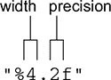
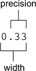
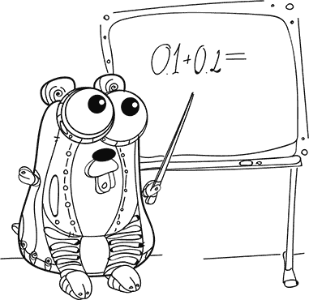
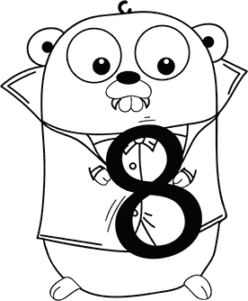
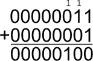
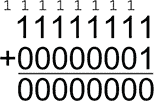

## 第 2 单元\. 类型

在 x86 计算机上，文本`"Go"`和数字`28487`都使用相同的零和一(`0110111101000111`)表示。*类型*确定了这些位和字节的意义。一个是两个字符的*字符串*，另一个是 16 位的*整数*（2 字节）。字符串类型用于多语言文本，16 位整数是许多数字类型之一。

第 2 单元涵盖了 Go 提供的原始类型，包括文本、字符、数字和其他简单值。在适当的时候，这些课程会揭示其优缺点，帮助你选择最合适的类型。

## 第 6 课\. 实数

阅读完第 6 课后，你将能够

+   使用两种实数类型

+   理解内存与精度的权衡

+   在你的储蓄罐中解决舍入误差

计算机使用 IEEE-754 浮点标准存储和处理像 3.14159 这样的实数。*浮点数*可以非常大或非常小：想想星系和原子。具有这种多功能性，像 JavaScript 和 Lua 这样的编程语言完全使用浮点数。计算机还支持*整数*，这是下一课的主题。


**考虑这一点**

想象一个有三个杯子的游乐场游戏。最近的杯子价值 0.10 到 1.00 美元，下一个杯子价值 1 到 10 美元，最远的杯子价值 10 到 100 美元。选择一个杯子，投掷多达 10 枚硬币。如果中间的杯子落地四枚硬币价值 4 美元，你将如何赢得 100 美元？

为了用固定数量的空间表示许多可能的实数，浮点数就像选择 2,048 个杯子中的一个，并在其中放置从一枚到数万亿枚硬币。一些位代表一个杯子或*桶*，而其他位代表该桶内的硬币或*偏移量*。

一个杯子可能代表非常小的数字，另一个代表非常大的数字。尽管每个杯子可以容纳相同数量的硬币，但一些杯子比其他杯子更精确地代表较小的数字范围，而其他杯子则代表较大的数字范围但精度较低。


### 6.1\. 声明浮点变量

每个变量都有一个类型。当你用实数声明和初始化一个变量时，你正在使用浮点类型。以下三行代码是等效的，因为 Go 编译器会推断出`days`是`float64`，即使你没有指定它：

```
days := 365.2425                     *1*
var days = 365.2425
var days float64 = 365.2425
```

+   ***1* 短声明（在第 4 课中介绍过 lesson 4)**

了解`days`具有`float64`类型是有价值的，但指定`float64`是多余的。你、我和 Go 编译器都可以通过查看右侧的值来推断`days`的类型。只要值是一个带小数点的数字，类型就会是`float64`。


##### 提示

`golint`工具提供关于编码风格的提示。它通过以下消息来劝阻杂乱：

```
"should omit type float64 from declaration of var days;
it will be inferred from the right-hand side"
```


如果你用一个整数初始化一个变量，Go 不知道你想要浮点数，除非你明确指定浮点类型：

```
var answer float64 = 42
```


**快速检查 6.1**

> **Q1:**
> 
> `answer := 42.0`推断的类型是什么？

|  |

**快速检查 6.1 答案**

> **1:**
> 
> 实数被推断为`float64`。


#### 6.1.1\. 单精度浮点数

Go 有两种浮点数类型。默认浮点数类型是`float64`，这是一个 64 位浮点数类型，使用 8 个字节的内存。某些语言使用*双精度*一词来描述 64 位浮点数类型。

`float32`类型使用的内存是`float64`的一半，但精度较低。这种类型有时被称为*单精度*。要使用`float32`，必须在声明变量时指定类型。以下列表显示了`float32`的使用。

##### 列表 6.1\. 64 位与 32 位浮点数：pi.go

```
var pi64 = math.Pi
var pi32 float32 = math.Pi

fmt.Println(pi64)                  *1*
fmt.Println(pi32)                  *2*
```

+   ***1* 打印 3.141592653589793**

+   ***2* 打印 3.1415927**

当处理大量数据时，例如 3D 游戏中的数千个顶点，使用`float32`来牺牲精度以节省内存可能是有意义的。


##### 提示

`math` 包中的函数在`float64`类型上操作，所以除非你有充分的理由，否则请优先使用`float64`。

|  |

**快速检查 6.2**

> **Q1:**
> 
> 单精度`float32`使用多少字节的内存？

|  |

**QC 6.2 答案**

> **1:**
> 
> `float32`使用 4 个字节（或 32 位）。


#### 6.1.2\. 零值

在 Go 中，每种类型都有一个默认值，称为*零值*。当你声明一个变量但没有用值初始化它时，就会应用这个默认值，如下一个列表所示。

##### 列表 6.2\. 声明一个没有值的变量：default.go

```
var price float64
fmt.Println(price)           *1*
```

+   ***1* 打印 0**

之前的列表声明了没有值的`price`，因此 Go 将其初始化为零。对计算机来说，它与以下内容相同：

```
price := 0.0
```

对程序员来说，这种差异很微妙。当你声明`price := 0.0`时，就像说价格是免费的。在列表 6.2 中未指定`price`的值，暗示实际值尚未到来。


**快速检查 6.3**

> **Q1:**
> 
> `float32`的零值是多少？

|  |

**QC 6.3 答案**

> **1:**
> 
> 默认值是零（`0.0`）。


### 6.2\. 显示浮点数类型

当使用`Print`或`Println`与浮点数类型一起时，默认行为是显示尽可能多的数字。如果你不希望这样，你可以使用带有`%f`格式动词的`Printf`来指定数字的数量，如下一个列表所示。

##### 列表 6.3\. 浮点数格式化打印：third.go

```
third := 1.0 / 3
fmt.Println(third)               *1*
fmt.Printf("%v\n", third)        *1*
fmt.Printf("%f\n", third)        *2*
fmt.Printf("%.3f\n", third)      *3*
fmt.Printf("%4.2f\n", third)     *4*
```

+   ***1* 打印 0.3333333333333333**

+   ***2* 打印 0.333333**

+   ***3* 打印 0.333**

+   ***4* 打印 0.33**

`%f` 动词以宽度和精度格式化`third`的值，如图 6.1 所示。

##### 图 6.1\. `%f` 格式动词



*精度*指定小数点后应出现多少位数字；例如，`%.2f`为两位数字，如图 6.2 所示。

##### 图 6.2\. 以宽度为 4，精度为 2 格式化的输出



*宽度* 指定要显示的最小字符数，包括小数点以及小数点前后的数字（例如，0.33 的宽度为 4）。如果宽度大于所需字符数，`Printf` 将用空格填充左侧。如果未指定宽度，`Printf` 将使用显示值所需的字符数。

要用零而不是空格左对齐，请在宽度前加一个零，如下面的列表所示。

##### 列表 6.4\. 零填充：third.go

```
fmt.Printf("%05.2f\n", third)          *1*
```

+   ***1* 打印 00.33**


**快速检查 6.4**

> **1**
> 
> 将 列表 6.3 输入 Go 演示场 main 函数的主体中。尝试在 `Printf` 语句中为宽度和精度设置不同的值。
> 
> **2**
> 
> 0015.1021 的宽度和精度是多少？

|  |

**QC 6.4 答案**

> **1**
> 
> ```
> third := 1.0 / 3
> fmt.Printf("%f\n", third)                           *1*
> fmt.Printf("%7.4f\n", third)                        *2*
> fmt.Printf("%06.2f\n", third)                       *3*
> ```
> 
> +   ***1* 打印 0.333333**
> +   
> +   ***2* 打印 0.3333**
> +   
> +   ***3* 打印 000.33**
> +   
> **2**
> 
> 宽度为 9，精度为 4，使用零填充 `"%09.4f"`。


### 6.3\. 浮点精度

在数学中，一些有理数不能在十进制形式中准确表示。数字 0.33 只是 ⅓ 的近似值。不出所料，对近似值进行计算的结果也是近似的：

+   ⅓ + ⅓ + ⅓ = 1

+   0.33 + 0.33 + 0.33 = 0.99

浮点数也受到舍入误差的影响，除了浮点硬件使用二进制表示（仅使用 0 和 1）而不是十进制（使用 1–9）。结果是，计算机可以准确地表示 ⅓，但其他数字会有舍入误差，如下面的列表所示。



##### 列表 6.5\. 浮点不精确：float.go

```
third := 1.0 / 3.0
fmt.Println(third + third + third)          *1*

piggyBank := 0.1
piggyBank += 0.2
fmt.Println(piggyBank)                      *2*
```

+   ***1* 打印 1**

+   ***2* 打印 0.30000000000000004**

如您所见，浮点数不是表示金钱的最佳选择。一个替代方案是使用整型存储美分的数量，这将在下一课中介绍。

另一方面，即使你的 `piggyBank` 差了一分，嗯，那也不是关键任务。只要你能为火星之旅存够钱，你就满意了。为了把舍入误差扫到地毯下，你可以使用 `Printf` 并设置两位数的精度。

为了最小化舍入误差，我们建议你在除法之前进行乘法。这样结果往往更准确，如以下两个列表中的温度转换示例所示。

##### 列表 6.6\. 除法优先：rounding-error.go

```
celsius := 21.0
fmt.Print((celsius/5.0*9.0)+32, "° F\n")         *1*
fmt.Print((9.0/5.0*celsius)+32, "° F\n")         *1*
```

+   ***1* 打印 69.80000000000001° F**

##### 列表 6.7\. 乘法优先：temperature.go

```
celsius := 21.0
fahrenheit := (celsius * 9.0 / 5.0) + 32.0
fmt.Print(fahrenheit, "° F")               *1*
```

+   ***1* 打印 69.8° F**


**快速检查 6.5**

> **Q1:**
> 
> 避免舍入误差的最佳方法是什么？

|  |

**QC 6.5 答案**

> **1:**
> 
> 不要使用浮点数。


### 6.4\. 比较浮点数

在 列表 6.5 中，`piggyBank` 包含了 0.30000000000000004，而不是期望的 0.30\. 在需要比较浮点数时请记住这一点：

```
piggyBank := 0.1
piggyBank += 0.2
fmt.Println(piggyBank == 0.3)         *1*
```

+   ***1* 打印 false**

而不是直接比较浮点数，确定两个数字之间的绝对差异，然后确保差异不是太大。为了取`float64`的绝对值，`math`包提供了一个`Abs`函数：

```
fmt.Println(math.Abs(piggyBank-0.3) < 0.0001)          *1*
```

+   ***1* 打印为 true**

| |
| --- |

##### 小贴士

单个操作浮点误差的上限称为机器 epsilon，对于`float64`是 2^(-52)，对于`float32`是 2^(-23)。不幸的是，浮点误差会迅速累积。向一个空的`piggyBank`中添加 11 个一角硬币（每个 0.10 美元），与 1.10 美元相比，舍入误差超过了 2^(-52)。这意味着你最好选择一个针对你应用程序的特定容差——在这种情况下，0.0001。

| |
| --- |
| |

**快速检查 6.6**

> **Q1:**
> 
> 如果你向一个空的`piggyBank`类型为`float64`中添加 11 个一角硬币（每个 0.10 美元），最终余额是多少？

| |
| --- |
| |

**QC 6.6 答案**

> **1:**
> 
> ```
> piggyBank := 0.0
> for i := 0; i < 11; i++ {
>     piggyBank += 0.1
> }
> fmt.Println(piggyBank)            *1*
> ```
> 
> +   ***1* 打印 1.0999999999999999**

| |
| --- |

### 概述

+   Go 可以为你推断类型。特别是，Go 将为用实数初始化的变量推断`float64`。

+   浮点类型用途广泛但并不总是准确。

+   你使用了 Go 的 15 种数值类型中的 2 种（`float64`，`float32`）。

让我们看看你是否掌握了这些...

#### 实验：piggy.go

为你的朋友存一些钱买礼物。编写一个程序，将镍币（$0.05）、一角硬币（$0.10）和 quarter（$0.25）随机放入一个空的猪储蓄罐中，直到它包含至少 $20.00。在每次存款后显示猪储蓄罐的运行余额，并使用适当的宽度和精度进行格式化。

## 第 7 课：整数

在阅读第 7 课之后，你将能够

+   使用 10 种整数类型

+   选择正确的类型

+   使用十六进制和二进制表示

Go 提供了 10 种不同的整数类型，统称为**整数**。整数不会受到浮点类型精度问题的困扰，但它们不能存储分数数字，并且它们的范围有限。你选择的整数类型将取决于特定情况下所需值的范围。

| |
| --- |

**考虑这一点**

你可以用两个符号表示多少个数字？

如果符号可以通过位置单独识别，那么有四种可能的排列。两个符号，没有符号，一个符号，或者另一个符号。你可以表示四个数字。

计算机基于位。位可以是关闭的或开启的——0 或 1。八个位可以表示 256 个不同的值。要表示数字 4,000,000,000 需要多少位？

| |
| --- |

### 7.1. 声明整数变量

五种整数类型是**有符号的**，这意味着它们可以表示正负整数。最常见的整数类型是有符号整数，缩写为`int`：

```
var year int = 2018
```

其他五种整数类型是**无符号的**，这意味着它们仅用于正数。无符号整数的缩写为`uint`：

```
var month uint = 2
```

当使用类型推断时，Go 总是为字面量整数选择`int`类型。以下三行是等效的：

```
year := 2018
var year = 2018
var year int = 2018
```

| |
| --- |

##### 小贴士

与 第 6 课 中的浮点类型一样，当可以推断时，最好不指定 `int` 类型。

| |

**快速检查 7.1**

> **Q1:**
> 
> 如果你的杯子里的水是半满的，你会使用哪种整型来表示杯中水的毫升数？

| |
| --- |
|  |

**QC 7.1 答案**

> **1:**
> 
> `uint` 类型（无符号整数）仅用于正整数。

| |
| --- |

#### 7.1.1\. 适用于各种场合的整型

整数，无论是带符号的还是无符号的，都有各种大小。大小影响它们的最大和最小值以及它们消耗的内存量。有八种与架构无关的类型，后缀为它们所需的位数，总结在 表 7.1 中。



##### 表 7.1\. 架构无关的整型

| 类型 | 范围 | 存储空间 |
| --- | --- | --- |
| int8 | –128 到 127 | 8 位（一个字节） |
| uint8 | 0 到 255 |
| int16 | –32,768 到 32,767 | 16 位（两个字节） |
| uint16 | 0 到 65535 |
| int32 | –2,147,483,648 到 2,147,483,647 | 32 位（四个字节） |
| uint32 | 0 到 4,294,967,295 |
| int64 | –9,223,372,036,854,775,808 到 9,223,372,036,854,775,807 | 64 位（八字节） |
| uint64 | 0 到 18,446,744,073,709,551,615 |

有很多类型可供选择！在本课的后面部分，我们将展示一些示例，说明特定整型何时适用，以及如果程序超出可用范围会发生什么。

在 表 7.1 中未列出两种整型。`int` 和 `uint` 类型针对目标设备是最佳选择。Go Playground、Raspberry Pi 2 和旧款手机提供 32 位环境，其中 `int` 和 `uint` 都是 32 位值。任何近期计算机都将提供 64 位环境，其中 `int` 和 `uint` 将是 64 位值。

| |
| --- |

##### 提示

如果你正在处理大于二十亿的数字，并且如果代码可以在旧款 32 位硬件上运行，请确保使用 `int64` 或 `uint64` 而不是 `int` 和 `uint`。

| |
| --- |
| |

##### 注意

虽然在某些设备上可能会认为 `int` 是 `int32` 而在其他设备上是 `int64`，但这些都是三种不同的类型。`int` 类型不是其他类型的别名。

| |

**快速检查 7.2**

> **Q1:**
> 
> 哪些整型支持值 –20,151,021？

| |
| --- |
| |

**QC 7.2 答案**

> **1:**
> 
> `int32`、`int64` 和 `int` 类型都可以使用。

| |
| --- |

#### 7.1.2\. 了解你的类型

如果你好奇 Go 编译器推断出的类型，`Printf` 函数提供了 `%T` 格式说明符来显示变量的类型，如下面的列表所示。

##### 列表 7.1\. 检查变量的类型：inspect.go

```
year := 2018
fmt.Printf("Type %T for %v\n", year, year)          *1*
```

+   ***1* 打印出类型 int 对 2018**

你可以告诉 `Printf` 使用第一个参数 `[1]` 作为第二个格式说明符，而不是重复变量两次：

```
days := 365.2425
fmt.Printf("Type %T for %[1]v\n", days)         *1*
```

+   ***1* 打印出类型 float64 对 365.2425**

| |
| --- |

**快速检查 7.3**

> **Q1:**
> 
> Go 如何推断引号之间的文本、整数、实数和单词`true`（不带引号）的类型？将列表 7.1 扩展以声明具有不同值的变量，并运行程序以查看 Go 推断的类型。

|  |

**QC 7.3 答案**

> **1:**
> 
> ```
> a := "text"
> fmt.Printf("Type %T for %[1]v\n", a)          *1*
> 
> b := 42
> fmt.Printf("Type %T for %[1]v\n", b)          *2*
> 
> c := 3.14
> fmt.Printf("Type %T for %[1]v\n", c)          *3*
> 
> d := true
> fmt.Printf("Type %T for %[1]v\n", d)          *4*
> ```
> 
> +   ***1* 打印类型为 string 的文本**
> +   
> +   ***2* 打印类型为 int 的 42**
> +   
> +   ***3* 打印类型为 float64 的 3.14**
> +   
> +   ***4* 打印类型为 bool 的 true**


### 7.2. 用于 8 位颜色的`uint8`类型

在层叠样式表（CSS）中，屏幕上的颜色被指定为红、绿、蓝三元组，每个范围都是 0-255。这是使用`uint8`类型的完美情况，它是一个 8 位无符号整数，能够表示 0-255 的值：

```
var red, green, blue uint8 = 0, 141, 213
```

在此情况下，使用`uint8`而不是常规的`int`有以下好处：

+   使用`uint8`，变量被限制在有效值的范围内，与 32 位整数相比，消除了超过四十亿个错误的可能性。

+   如果需要存储大量的颜色，例如在未压缩的图像中，使用 8 位整数可以实现相当大的内存节省。


**Go 中的十六进制**

CSS 中的颜色以十六进制而不是十进制指定。*十六进制*使用比十进制的 10 个数字多 6 个数字来表示数字。前 10 个数字与相同的 0 到 9 相同，但之后是 A 到 F。十六进制中的 A 相当于十进制的 10，B 相当于 11，依此类推，直到 F，它是 15。

十进制对于十指生物来说是一个很好的系统，但十六进制更适合计算机。一个十六进制数字消耗四个位，称为*nibble*。两个十六进制数字需要精确的八个位，即一个*字节*，这使得十六进制成为为`uint8`指定值的方便方式。

下表显示了一些十六进制数及其等效的十进制数。

##### 十六进制和十进制值

| 十六进制 | 十进制 |
| --- | --- |
| A | 10 |
| F | 15 |
| 10 | 16 |
| FF | 255 |

要区分十进制和十六进制，Go 需要十六进制的前缀`0x`。这两行代码是等效的：

```
var red, green, blue uint8 = 0, 141, 213
var red, green, blue uint8 = 0x00, 0x8d, 0xd5
```

要以十六进制显示数字，可以使用`Printf`中的`%x`或`%X`格式动词：

```
fmt.Printf("%x %x %x", red, green, blue)          *1*
```

+   ***1* 打印 0 8d d5**

要输出在.css 文件中感觉自然的颜色，十六进制值需要一些填充。与`%v`和`%f`格式动词一样，你可以指定最小位数（2 位）并使用`%02x`进行零填充：

```
fmt.Printf("color: #%02x%02x%02x;", red, green, blue)          *1*
```

+   ***1* 打印颜色：#008dd5；**

|  |

**快速检查 7.4**

> **Q1:**
> 
> 存储类型为`uint8`的值需要多少字节？

|  |

**QC 7.4 答案**

> **1:**
> 
> 8 位（无符号）整数只需要一个字节。


### 7.3. 整数环绕

整数没有使浮点数不准确的舍入错误，但所有整数类型都有不同的问题：范围有限。当超出该范围时，Go 中的整数类型会*环绕*。

8 位无符号整数 (`uint8`) 的范围是 0-255。超过 255 的增量将回绕到 0。以下列表递增了有符号和无符号 8 位整数，导致它们回绕。

##### 列表 7.2\. 整数环绕：integers-wrap.go

```
var red uint8 = 255
red++
fmt.Println(red)               *1*

var number int8 = 127
number++
fmt.Println(number)            *2*
```

+   ***1* 打印 0**

+   ***2* 打印 -128**

#### 7.3.1\. 查看位

要理解整数为什么回绕，请查看位。`%b` 格式动词将显示整数值的位。像其他格式动词一样，`%b` 可以用零填充到最小长度，如本列表所示。

##### 列表 7.3\. 显示位：bits.go

```
var green uint8 = 3
fmt.Printf("%08b\n", green)             *1*
green++
fmt.Printf("%08b\n", green)             *2*
```

+   ***1* 打印 00000011**

+   ***2* 打印 00000100**

| |
| --- |

**快速检查 7.5**

使用 Go Playground 来实验整数的包装行为：

> **1**
> 
> 在 列表 7.2 中，代码将 `red` 和 `number` 增加 1。当你向任一变量添加更大的数字时会发生什么？
> 
> **2**
> 
> 当 `red` 为 0 或 `number` 为 -128 时，递减会发生什么？
> 
> **3**
> 
> 包装也适用于 16 位、32 位和 64 位整数。如果你声明一个赋值为 65535 的最大值的 `uint16`，然后加 1，会发生什么？

| |
| --- |
| |

**QC 7.5 答案**

> **1**
> 
> ```
> // add a number larger than one
> var red uint8 = 255
> red += 2
> fmt.Println(red)               *1*
> 
> var number int8 = 127
> number += 3
> fmt.Println(number)            *2*
> ```
> 
> **2**
> 
> ```
> // wrap the other way
> red = 0
> red--
> fmt.Println(red)               *3*
> 
> number = -128
> number--
> fmt.Println(number)            *4*
> ```
> 
> **3**
> 
> ```
> // wrapping with a 16-bit unsigned integer
> var green uint16 = 65535
> green++
> fmt.Println(green)             *5*
> ```
> 
> +   ***1* 打印 1**
> +   
> +   ***2* 打印 -126**
> +   
> +   ***3* 打印 255**
> +   
> +   ***4* 打印 127**
> +   
> +   ***5* 打印 0**

| |
| --- |
| |

##### 提示

数学包将 `math.MaxUint16` 定义为 65535，并为每个架构无关的整数类型定义了类似的 min/max 常量。记住，`int` 和 `uint` 可能是 32 位或 64 位，这取决于底层硬件。

| |
| --- |

在 列表 7.3 中，增加 `green` 导致 1 被进位，留下右边的零。结果是二进制的 `00000100`，或十进制的 4，如图 7.1 所示。

##### 图 7.1\. 二进制加法中的进位



当增加 255 时，也会发生相同的事情，但有一个关键的区别：只有八个位可用，所以被进位的 1 没有地方去，因此 `blue` 的值保持为 0，如图 7.2 所示。

##### 列表 7.4\. 整数环绕时的位：bits-wrap.go

```
var blue uint8 = 255
fmt.Printf("%08b\n", blue)          *1*
blue++
fmt.Printf("%08b\n", blue)          *2*
```

+   ***1* 打印 11111111**

+   ***2* 打印 00000000**

##### 图 7.2\. 进位应该去哪里？



在某些情况下，包装可能正是你想要的，但并不总是如此。避免包装的最简单方法是使用足够大的整数类型来存储你期望存储的值。

| |
| --- |

**快速检查 7.6**

> **Q1:**
> 
> 哪个格式动词可以让你查看位？

| |
| --- |
| |

**QC 7.6 答案**

> **1:**
> 
> `%b` 格式动词以二进制形式输出整数。

| |
| --- |

#### 7.3.2\. 避免时间回绕

在基于 Unix 的操作系统上，时间表示为自 1970 年 1 月 1 日 UTC（协调世界时）以来的秒数。到 2038 年，自 1970 年 1 月 1 日以来的秒数将超过 20 亿，这是 `int32` 的容量。

幸运的是，`int64` 可以支持远超过 2038 年的日期。在这种情况下，`int32` 或 `int` 简直无法胜任。只有 `int64` 和 `uint64` 整数类型能够在所有平台上存储超过二十亿的数字。

列表 7.5 中的代码使用了 `time` 包中的 `Unix` 函数。它接受两个 `int64` 参数，对应于自 1970 年 1 月 1 日以来的秒数和纳秒数。使用一个足够大的值（超过 120 亿）可以证明在 Go 中日期超过 2038 年仍然可以正常工作。

##### 列表 7.5\. 64 位整数：time.go

```
package main

import (
    "fmt"
    "time"
)

func main() {
    future := time.Unix(12622780800, 0)
    fmt.Println(future)                      *1*
}
```

+   ***1* 在 Go 操场中打印 2370-01-01 00:00:00 +0000 UTC**

| |
| --- |

**快速检查 7.7**

> **Q1:**
> 
> 应该选择哪种整数类型来避免溢出？

| |
| --- |
| |

**QC 7.7 答案**

> **1:**
> 
> 使用足够大的整数类型来存储你期望存储的值。

| |
| --- |

### 摘要

+   最常见的整数类型是 `int` 和 `uint`，但有些情况下需要更小或更大的类型。

+   整数类型需要仔细选择，以避免溢出，除非溢出是你想要的。

+   你已经了解了 Go 中 15 种数字类型中的 10 种（`int`、`int8`、`int16`、`int32`、`int64`、`uint`、`uint8`、`uint16`、`uint32`、`uint64`）。

让我们看看你是否掌握了这个...

#### 实验：piggy.go

编写一个新的猪储蓄罐程序，使用整数来跟踪美分而不是美元的数量。随机将五分镍币（5¢）、一角硬币（10¢）和二十五分硬币（25¢）放入空的猪储蓄罐中，直到它包含至少 $20。

在每次存款后显示猪储蓄罐的运行余额（例如，$1.05）。

| |
| --- |

##### 小贴士

如果你需要找到两个数字相除的余数，请使用取模运算符（`%`）。

| |
| --- |

## 第 8 课\. 大数

在阅读 第 8 课 之后，你将能够

+   通过指定指数来保存零键

+   使用 Go 的 `big` 包处理非常大的数字

+   使用大常量和字面值

计算机编程充满了权衡。浮点数类型可以存储任何大小的数字，但它们有时会缺乏精度和准确性。整数是准确的，但范围有限。如果你需要一个非常大且准确的数字怎么办？本课探讨了两种替代原生 `float64` 和 `int` 类型的方案。

| |
| --- |

**考虑这一点**

CPU 优化了整数和浮点数数学，但其他数字表示也是可能的。当你需要处理大数时，Go 有你需要的支持。

有哪些情况下整数太小，浮点数不够精确，或者另一种数字类型会更合适？

| |
| --- |

### 8.1\. 达到上限

如果你还没有意识到，64 位整数非常巨大——比它们的 32 位对应物大得多。

为了获得一些视角，最近的恒星，半人马座阿尔法星，距离我们 41.3 万亿公里。万亿：这是一个后面跟着 12 个零的数字，或者 10¹²。你不需要费力地输入每个零，你可以在 Go 中使用指数来表示这样的数字，如下所示：

```
var distance int64 = 41.3e12
```

`int32`或`uint32`无法包含如此大的数字，但`int64`并不费力。现在你可以继续你的业务，也许计算一下到达半人马座α星需要多少天，这个任务将在下面的列表中解决。

##### 列表 8.1. 到半人马座α星需要的天数：alpha.go

```
const lightSpeed = 299792 // km/s
const secondsPerDay = 86400

var distance int64 = 41.3e12
fmt.Println("Alpha Centauri is", distance, "km away.")              *1*

days := distance / lightSpeed / secondsPerDay
fmt.Println("That is", days, "days of travel at light speed.")      *2*
```

+   ***1* 打印半人马座α星距离 41300000000000 公里。**

+   ***2* 打印这是以光速旅行 1594 天。**

即使 64 位整数很大，还有更大的东西：空间。仙女座星系距离我们 24 千万亿（10¹⁸）公里。即使是最大的无符号整数（`uint64`）也只能包含高达 18 千万亿的数量。尝试声明一个超过 18 千万亿的变量会报告溢出错误：

```
var distance uint64 = 24e18            *1*
```

+   ***1* 24000000000000000000 超过 uint64 的容量**

但别慌——还有一些选择。你可以使用浮点数数学。这并不是一个坏主意，你已经知道浮点数是如何工作的。但还有另一种方法。下一节将探讨 Go 的`big`包。

| |
| --- |

##### 注意

如果一个变量没有显式的类型，Go 将为包含指数的数字推断`float64`。

| |
| --- |
| |

**快速检查 8.1**

> **Q1:**
> 
> 火星与地球之间的距离在 5600 万公里到 4010 万公里之间。使用指数（`e`）语法将这些两个值表示为整数。

| |
| --- |
| |

**QC 8.1 答案**

> **1:**
> 
> ```
> var distance int = 56e6
> distance = 401e6
> ```

| |
| --- |

### 8.2. 大包

`big`包提供了三种类型：

+   `big.Int`用于大整数，当 18 千万亿不够用时。

+   `big.Float`用于任意精度的浮点数。

+   `big.Rat`用于分数，如 1/3。

| |
| --- |

##### 注意

你的代码也可以声明新的类型，但我们在第 13 课（[kindle_split_024.html#ch13]）再回到这个话题。

| |
| --- |

`big.Int`类型可以愉快地存储和操作到仙女座星系的距离，仅仅 24 千万亿公里。

选择使用`big.Int`要求你在方程中的所有地方都使用它，甚至包括你之前有的常数。`NewInt`函数接受一个`int64`并返回一个`big.Int`：

```
lightSpeed := big.NewInt(299792)
secondsPerDay := big.NewInt(86400)
```

`NewInt`对于像 24 千万亿这样的数字没有帮助。它不会适合在`int64`中，所以你可以从字符串创建一个`big.Int`：

```
distance := new(big.Int)
distance.SetString("24000000000000000000", 10)
```

创建一个新的`big.Int`后，通过调用`SetString`方法将其值设置为 24 千万亿。24 千万亿这个数字是以 10（十进制）为基数的，所以第二个参数是 10。

| |
| --- |

##### 注意

方法与函数类似。你将在第 13 课（[kindle_split_024.html#ch13]）中了解所有关于它们的内容。`new`内置函数用于指针，这在第 26 课（[kindle_split_040.html#ch26]）中有介绍。

| |
| --- |

在所有值就绪后，`Div`方法执行必要的除法，以便结果可以显示，如下面的列表所示。

##### 列表 8.2. 到仙女座星系的距离：andromeda.go

```
package main

import (
    "fmt"
    "math/big"
)

func main() {
    lightSpeed := big.NewInt(299792)
    secondsPerDay := big.NewInt(86400)

    distance := new(big.Int)
    distance.SetString("24000000000000000000", 10)
    fmt.Println("Andromeda Galaxy is", distance, "km away.")            *1*

    seconds := new(big.Int)
    seconds.Div(distance, lightSpeed)

    days := new(big.Int)
    days.Div(seconds, secondsPerDay)

    fmt.Println("That is", days, "days of travel at light speed.")      *2*
}
```

+   ***1* 打印仙女座星系距离 24000000000000000000 公里。**

+   ***2* 打印这是以光速旅行 926568346 天。**

正如你所见，这些大型类型与原生的`int`和`float64`类型相比，更难以处理。它们也运行得更慢。这是为了能够准确表示任何大小的数字所做出的权衡。


**快速检查 8.2**

> **Q1:**
> 
> 有两种方法可以创建包含数字 86,400 的`big.Int`？

|  |

**QC 8.2 答案**

> **1:**
> 
> 使用`NewInt`函数构建`big.Int`：
> 
> ```
> secondsPerDay := big.NewInt(86400)
> ```
> 
> 或者使用`SetString`方法：
> 
> ```
> secondsPerDay := new(big.Int)
> secondsPerDay.SetString("86400", 10)
> ```


### 8.3\. 不寻常大小的常量

常量可以像变量一样声明类型。就像变量一样，一个`uint64`常量不可能包含像 24 千兆这样的数字：

```
const distance uint64 = 24000000000000000000          *1*
```

+   ***1* 常量 24000000000000000000 溢出 uint64**

当你声明一个没有类型的常量时，事情变得有趣。对于变量，Go 使用类型推断来确定类型，在 24 千兆的情况下，会溢出`int`类型。常量是不同的。常量不是推断类型，而是可以是*未类型化的*。以下行不会引发溢出错误：

```
const distance = 24000000000000000000
```

常量使用`const`关键字声明，但你的程序中的每个字面量值也是一个常量。这意味着可以直接使用不寻常大小的数字，如下所示。


##### 列表 8.3\. 不寻常大小的字面量：constant.go

```
fmt.Println("Andromeda Galaxy is", 24000000000000000000/299792/86400, "light
            days away.")                                       *1*
```

+   ***1* 打印仙女座星系距离为 926568346 光日。**

常量和字面量的计算是在编译期间而不是在程序运行时进行的。Go 编译器是用 Go 编写的。在底层，未类型化的数值常量由`big`包支持，使得可以进行所有常规操作，包括超过 18 千兆的数字，如下所示。

##### 列表 8.4\. 不寻常大小的常量：constant.go

```
const distance = 24000000000000000000
const lightSpeed = 299792
const secondsPerDay = 86400

const days = distance / lightSpeed / secondsPerDay

fmt.Println("Andromeda Galaxy is", days, "light days away.")        *1*
```

+   ***1* 打印仙女座星系距离为 926568346 光日。**

只要适合，常量值可以分配给变量。`int`不能包含 24 千兆，但 926,568,346 可以很好地放入：

```
km := distance                                        *1*
days := distance / lightSpeed / secondsPerDay         *2*
```

+   ***1* 常量 24000000000000000000 溢出 int。**

+   ***2* 926568346 可以放入 int 中。**

对于不寻常大小的常量有一些注意事项。尽管 Go 编译器利用`big`包来处理未类型化的数值常量，但常量和`big.Int`值并不是可互换的。列表 8.2 显示了一个包含 24 千兆的`big.Int`，但你不能显示`distance`常量，因为会引发溢出错误：

```
fmt.Println("Andromeda Galaxy is", distance, "km away.")     *1*
```

+   ***1* 常量 24000000000000000000 溢出 int。**

非常大的常量当然很有用，但它们不能替代`big`包。


**快速检查 8.3**

> **Q1:**
> 
> 常量和字面量的计算何时进行？

|  |

**QC 8.3 答案**

> **1:**
> 
> Go 编译器在编译过程中会简化包含常量和字面量的等式。


### 摘要

+   当原生类型无法满足需求时，`big`包为你提供了保障。

+   使用未类型化的常量，可以实现大事，而且所有数值字面量也是未类型化的常量。

+   无类型常量在传递给函数时必须转换为有类型变量。

让我们看看你是否掌握了这个...

#### 实验：canis.go

大犬座矮星系是距离我们太阳最近的已知星系，距离为 236,000,000,000,000,000 公里（尽管有些人争论它是否是一个星系）。使用常量将这个距离转换为光年。

## 第 9 课. 多语言文本

在阅读完第 9 课后，你将能够

+   访问和操作单个字母

+   加密和解密秘密信息

+   为多语言世界编写你的程序

从`"Hello, playground"`开始，你一直在你的程序中使用文本。单个字母、数字和符号被称为*字符*。当你将字符*连接*在一起并将它们放在引号之间时，它被称为*字面字符串*。


| |
| --- |

**考虑这一点**

你知道计算机用 1 和 0 表示数字。如果你是一台计算机，你会如何表示字母表和人类语言？

如果你说是用数字，你是对的。字母表的字符有数值，这意味着你可以像操作数字一样操作它们。

虽然并非完全直接，但每个书写语言的字符和无数的 emoji 加起来有数千个字符。有一些技巧可以以空间高效和灵活的方式表示文本。

| |
| --- |

### 9.1. 声明字符串变量

用引号包裹的字面值被推断为`string`类型，所以以下三行是等效的：

```
peace := "peace"
var peace = "peace"
var peace string = "peace"
```

如果你声明一个变量而没有提供值，它将使用其类型的零值初始化。`string`类型的*零值*是一个空字符串（`""`）：

```
var blank string
```

#### 9.1.1. 原始字符串字面量

字符串字面量可能包含*转义序列*，如第 2 课中提到的`\n`。为了避免将`\n`替换为新行，你可以用反引号（`）而不是引号（`"`）包裹文本，如下面的列表所示。反引号表示*原始*字符串字面量。

##### 列表 9.1. 原始字符串字面量：raw.go

```
fmt.Println("peace be upon you\nupon you be peace")
fmt.Println(`strings can span multiple lines with the \n escape sequence`)
```

之前的列表显示了以下输出：

```
peace be upon you
upon you be peace
strings can span multiple lines with the \n escape sequence
```

与传统的字符串字面量不同，原始字符串字面量可以跨越多行源代码，如下一个列表所示。

##### 列表 9.2. 多行原始字符串字面量：raw-lines.go

```
fmt.Println(`
    peace be upon you
    upon you be peace`)
```

运行列表 9.2 将产生以下输出，包括用于缩进的制表符：

```
        peace be upon you
        upon you be peace
```

如下列表所示，字面字符串和原始字符串都产生字符串。

##### 列表 9.3. 字符串类型：raw-type.go

```
fmt.Printf("%v is a %[1]T\n", "literal string")             *1*
fmt.Printf("%v is a %[1]T\n", `raw string literal`)         *2*
```

+   ***1* 打印字面字符串是字符串**

+   ***2* 打印原始字符串字面量是字符串**

| |
| --- |

**快速检查 9.1**

> **Q1:**
> 
> 对于 Windows 文件路径`C:\go`，你会使用字符串字面量还是原始字符串字面量，为什么？

| |
| --- |
| |

**QC 9.1 答案**

> **1:**
> 
> 使用原始字符串字面量`` `C:\go` ``，因为`"C:\go"`会因为未知转义序列错误而失败。

| |
| --- |

### 9.2. 字符、码点、符文和字节

Unicode 联盟为超过一百万个独特的字符分配了数字值，称为 *码点*。例如，65 是大写字母 A 的码点，128515 是一个笑脸 。

要表示单个 Unicode 码点，Go 提供了 `rune`，它是 `int32` 类型的别名。

`byte` 是 `uint8` 类型的别名。它旨在用于二进制数据，尽管 `byte` 可以用于由 ASCII 定义的英语字符，ASCII 是 Unicode 的一个较老的 128 个字符子集。


**类型别名**

别名是同一类型的另一个名称，因此 `rune` 和 `int32` 可以互换。尽管 `byte` 和 `rune` 从 Go 的开始就存在了，但 Go 1.9 引入了声明自己的类型别名的功能。语法如下所示：

```
type byte = uint8
type rune = int32
```


`byte` 和 `rune` 的行为与它们所代表的整数类型相同，如下所示。

##### 列表 9.4\. `rune` 和 `byte`：rune.go

```
var pi rune = 960
var alpha rune = 940
var omega rune = 969
var bang byte = 33

fmt.Printf("%v %v %v %v\n", pi, alpha, omega, bang)      *1*
```

+   ***1* 打印 960 940 969 33**

要显示字符而不是它们的数值，可以使用 `%c` 格式说明符与 `Printf` 一起使用：

```
fmt.Printf("%c%c%c%c\n", pi, alpha, omega, bang)      *1*
```

+   ***1* 打印 πάω!**


##### 提示

任何整数类型都可以与 `%c` 一起使用，但 `rune` 别名表明数字 960 代表一个字符。


与记住 Unicode 码点相比，Go 提供了字符字面量。只需将字符用单引号 `'A'` 括起来即可。如果没有指定类型，Go 将推断为 `rune`，因此以下三行是等效的：

```
grade := 'A'
var grade = 'A'
var grade rune = 'A'
```

`grade` 变量仍然包含一个数值，在这种情况下是 65，即大写 `'A'` 的码点。字符字面量也可以与 `byte` 别名一起使用：

```
var star byte = '*'
```


**快速检查 9.2**

> **1**
> 
> ASCII 编码了多少个字符？
> 
> **2**
> 
> `byte` 是哪种类型的别名？`rune` 呢？
> 
> **3**
> 
> 破折号 (`*`)、笑脸  和重音符号 é 的码点是什么？

|  |

**QC 9.2 答案**

> **1**
> 
> 128 个字符。
> 
> **2**
> 
> `byte` 是 `uint8` 类型的别名。`rune` 是 `int32` 类型的别名。
> 
> **3**
> 
> ```
> var star byte = '*'
> fmt.Printf("%c %[1]v\n", star) *1*
> 
> smile := ''
> fmt.Printf("%c %[1]v\n", smile) *2*
> 
> acute := 'é'
> fmt.Printf("%c %[1]v\n", acute) *3*
> ```
> 
> +   ***2* 打印 * 42**
> +   
> +   ***2* 打印**  **128515**
> +   
> +   ***3* 打印 é 233**


### 9.3\. 拉动字符串

提线木偶师通过拉动线来操纵木偶，但 Go 中的字符串并不容易受到操纵。可以将变量分配给不同的字符串，但字符串本身不能被更改：

```
peace := "shalom"
peace = "salām"
```

你的程序可以访问单个字符，但不能修改字符串中的字符。以下列表使用方括号 `[]` 来指定字符串的索引，它访问单个字节（ASCII 字符）。索引从零开始。

##### 列表 9.5\. 字符串索引：index.go

```
message := "shalom"
c := message[5]
fmt.Printf("%c\n", c)          *1*
```

+   ***1* 打印 m**

Go 中的字符串是 *不可变的*，就像 Python、Java 和 JavaScript 中的字符串一样。与 Ruby 中的字符串和 C 中的字符数组不同，你无法在 Go 中修改字符串：

```
message[5] = 'd'        *1*
```

+   ***1* 无法分配给消息[5]**


**快速检查 9.3**

> **Q1:**
> 
> 编写一个程序来打印`"shalom"`字符串的每个字节（ASCII 字符），每行一个字符。

| |
| --- |
| |

**QC 9.3 答案**

> **1:**
> 
> ```
> message := "shalom"
> for i := 0; i < 6; i++ {
>     c := message[i]
>     fmt.Printf("%c\n", c)
> }
> ```

| |
| --- |

### 9.4\. 使用凯撒密码操作字符

在公元 2 世纪，发送秘密信息的一种有效方法是将每个字母都进行位移，所以`'a'`变成`'d'`，`'b'`变成`'e'`，以此类推。结果可能看起来像外语：

> *L fdph, L vdz, L frqtxhuhg.*
> 
> *尤利乌斯·凯撒*

事实证明，使用计算机操作字符作为数值是非常容易的，如下面的列表所示。


##### 列表 9.6\. 操作单个字符：caesar.go

```
c := 'a'
c = c + 3
fmt.Printf("%c", c)        *1*
```

+   ***1* 打印 d**

列表 9.6 中的代码有一个问题。它没有考虑到所有关于 xylophones、yaks 和 zebras 的消息。为了满足这一需求，原始的凯撒密码会回绕，所以`'x'`变成`'a'`，`'y'`变成`'b'`，`'z'`变成`'c'`。由于英语字母表中有 26 个字母，这是一个简单的问题：

```
if c > 'z' {
    c = c - 26
}
```

为了解密这个凯撒密码，应该减去 3 而不是加 3。但是，你需要考虑到`c < 'a'`的情况，通过加 26 来处理。真麻烦。

| |
| --- |

**快速检查 9.4**

> **Q1:**
> 
> 如果`c`是小写字母`'g'`，表达式`c = c - 'a' + 'A'`的结果是什么？

| |
| --- |
| |

**QC 9.4 答案**

> **1:**
> 
> 字母被转换为大写：
> 
> ```
> c := 'g'
> c = c - 'a' + 'A'
> fmt.Printf("%c", c)        *1*
> ```
> 
> +   ***1* 打印 G**

| |
| --- |

#### 9.4.1\. 一种现代变体

ROT13（旋转 13）是 20 世纪的一种凯撒密码变体。它有一个区别：它加 13 而不是 3。使用 ROT13，加密和解密是同一个方便的操作。

假设，在扫描天空中寻找外星通讯的过程中，SETI 研究所接收到了以下信息的传输：

```
message := "uv vagreangvbany fcnpr fgngvba"
```

我们怀疑这条`message`实际上是用 ROT13 加密的英文文本。姑且称之为一种直觉。在你能够破解这个密码之前，还有一件事你需要知道。这条`message`长度为 30 个字符，这可以通过内置的`len`函数来确定：

```
fmt.Println(len(message))       *1*
```

+   ***1* 打印 30**

| |
| --- |

##### 注意

Go 有一系列内置函数，不需要导入语句。`len`函数可以确定各种类型的长度。在这种情况下，`len`返回字符串的字节长度。

| |
| --- |

下面的列表将解密来自太空的信息。在 Go 游乐场中运行它，以找出外星人说了什么。

##### 列表 9.7\. ROT13 密码：rot13.go

```
message := "uv vagreangvbany fcnpr fgngvba"

for i := 0; i < len(message); i++ {        *1*
    c := message[i]
    if c >= 'a' && c <= 'z' {              *2*
        c = c + 13
        if c > 'z' {
            c = c - 26
        }
    }
    fmt.Printf("%c", c)
}
```

+   ***1* 遍历每个 ASCII 字符**

+   ***2* 保持空格和标点符号不变**

注意，前面列表中的 ROT13 实现仅适用于 ASCII 字符（字节）。它会在西班牙语或俄语的消息中产生混淆。下一节将探讨解决这个问题的方法。

| |
| --- |

**快速检查 9.5**

> **1**
> 
> 当内置的`len`函数传递一个字符串时，它会做什么？
> 
> **2**
> 
> 将列表 9.7 输入到 Go 游乐场。这条信息说了什么？

| |
| --- |
| |

**QC 9.5 答案**

> **1**
> 
> `len` 函数返回字符串的字节长度。
> 
> **2**
> 
> hi 国际空间站

| |
| --- |

### 9.5\. 将字符串解码为符文

Go 中的字符串使用 UTF-8 编码，这是 Unicode 代码点的几种编码之一。UTF-8 是一种有效的可变长度编码，其中单个代码点可能使用 8 位、16 位或 32 位。通过使用可变长度编码，UTF-8 使得从 ASCII 到 UTF-8 的转换变得简单，因为 ASCII 字符与其 UTF-8 编码的对应字符相同。

| |
| --- |

##### 注意

UTF-8 是万维网占主导地位的字符编码。它由 Go 的设计者之一 Ken Thompson 在 1992 年发明。

| |
| --- |

列表 9.7 中的 ROT13 程序访问了 `message` 字符串的各个字节（8 位），而没有考虑到多字节字符（16 位或 32 位）。这就是为什么它对英语字符（ASCII）工作得很好，但对于俄语和西班牙语会产生混乱的结果。你可以做得更好，*朋友*。

支持其他语言的第一步是在操作之前将字符解码为 `rune` 类型。幸运的是，Go 提供了解码 UTF-8 编码字符串的函数和语言特性。

`utf8` 包提供了确定字符串在符文长度而不是字节长度以及解码字符串的第一个字符的函数。`DecodeRuneInString` 函数返回第一个字符和该字符消耗的字节数，如 列表 9.8 所示。

| |
| --- |

##### 注意

与许多编程语言不同，Go 中的函数可以返回多个值。多个返回值将在第十二部分中讨论。

| |
| --- |

##### 列表 9.8\. `utf8` 包：spanish.go

```
package main

import (
    "fmt"
    "unicode/utf8"
)

func main() {
    question := "¿Cómo estás?"

    fmt.Println(len(question), "bytes")                          *1*
    fmt.Println(utf8.RuneCountInString(question), "runes")       *2*

    c, size := utf8.DecodeRuneInString(question)
    fmt.Printf("First rune: %c %v bytes", c, size)               *3*
}
```

+   ***1* 打印 15 个字节**

+   ***2* 打印 12 个符文**

+   ***3* 打印第一个符文：¿ 2 个字节**

Go 语言提供了 `range` 关键字来遍历各种集合（在第 4 单元中介绍）。它还可以解码 UTF-8 编码的字符串，如下所示。

##### 列表 9.9\. 解码符文：spanish-range.go

```
question := "¿Cómo estás?"

for i, c := range question {
    fmt.Printf("%v %c\n", i, c)
}
```

在每次迭代中，变量 `i` 和 `c` 被分配给字符串中的索引和该位置的代码点（符文）。

如果您不需要索引，空白标识符（下划线）允许您忽略它：

```
for _, c := range question {
    fmt.Printf("%c ", c)            *1*
}
```

+   ***1* 打印 ¿ C ó m o e s t á s ?**

| |
| --- |

**快速检查 9.6**

> **1**
> 
> 英语字母表 `"abcdefghijklmnopqrstuvwxyz"` 中有多少个符文？有多少个字节？
> 
> **2**
> 
> 符文 `'¿'` 中有多少个字节？

| |
| --- |
| |

**QC 9.6 答案**

> **1**
> 
> 英语字母表中包含 26 个符文和 26 个字节。
> 
> **2**
> 
> 符文 `'¿'` 中有 2 个字节。

| |
| --- |

### 概述

+   在原始字符串字面量（`'`）中，转义序列如 `\n` 被忽略。

+   字符串是不可变的。可以访问单个字符，但不能更改。

+   字符串使用一种称为 UTF-8 的可变长度编码，其中每个字符占用 1-4 个字节。

+   `byte` 是 `uint8` 类型的别名，而 `rune` 是 `int32` 类型的别名。

+   `range` 关键字可以将 UTF-8 编码的字符串解码为 runes。

让我们看看你是否掌握了这一点...

#### 实验：caesar.go

解密朱利叶斯·凯撒的引言：

> *L fdph, L vdz, L frqtxhuhg.*
> 
> **朱利叶斯·凯撒**

你的程序需要将大写和小写字母向左或向右移动 -3 位。记住，`'a'` 变成 `'x'`，`'b'` 变成 `'y'`，`'c'` 变成 `'z'`，同样适用于大写字母。

#### 实验：international.go

使用 ROT13 对西班牙语信息“Hola Estación Espacial Internacional”进行加密。修改列表 9.7 以使用`range`关键字。现在当你对西班牙语文本使用 ROT13 时，带重音的字符会被保留。

## 第 10 课。类型之间的转换

阅读完第 10 课后，你将能够

+   在数值、字符串和布尔值类型之间进行转换

前面的课程涵盖了布尔值、字符串和十几种不同的数值类型。如果你有不同的类型变量，你必须在使用前将它们的值转换为相同的类型。


**考虑这一点**

假设你正在杂货店，手里拿着配偶给你的购物清单。第一项是牛奶，但你应该买牛奶、杏仁奶还是大豆奶？应该是有机的、脱脂的、1%、2%、全脂的、蒸发奶还是炼乳？需要多少加仑？你是打电话给配偶询问，还是随便挑一样？

如果你一直打电话询问每个细节，你的配偶可能会感到厌烦。是冰山生菜还是罗马生菜？是红皮土豆还是黄皮土豆？哦，那 5 磅还是 10 磅？另一方面，如果你“自己思考”并带回来巧克力牛奶和薯条，那可能不会那么顺利。

如果你的配偶是程序员，而你在这个场景中是编译器，你认为 Go 的方法会是什么？


### 10.1. 类型不混合

变量的 *类型* 确定了适合它的行为。数字可以相加，字符串可以连接。要连接两个字符串，请使用加号运算符：

```
countdown := "Launch in T minus " + "10 seconds."
```

如果你尝试将数字与字符串连接，Go 编译器将报告错误：

```
countdown := "Launch in T minus " + 10 + " seconds."        *1*
```

+   **1** 无效操作：字符串和整型不匹配


**在其他语言中混合类型**

当面对两种或更多不同类型时，一些编程语言会尽力猜测程序员的意图。JavaScript 和 PHP 都可以从字符串 `"10"` 中减去 1：

```
"10" - 1         *1*
```

+   **在 JavaScript 和 PHP 中实现 1 到 9**

Go 编译器会因类型不匹配错误而拒绝 `"10" - 1`。在 Go 中，你首先需要将 `"10"` 转换为整数。`strconv` 包中的 `Atoi` 函数可以进行转换，但如果 `string` 不包含有效的数字，它将返回错误。在你处理错误的时候，Go 版本已经是四行长，这并不十分方便。

话虽如此，如果 `"10"` 是用户输入或来自外部来源，JavaScript 和 PHP 版本也应该检查它是否是一个有效的数字。

在那些*强制类型转换*的语言中，对于没有记住大量隐式行为的任何人来说，代码的行为都难以预测。在 Java 和 JavaScript 中，加号运算符 (+) 都会将数字强制转换为字符串以进行连接，而 PHP 则将值强制转换为数字并执行数学运算：

```
"10" + 2         *1*
```

+   ***1* 在 JavaScript 或 Java 中是“102”，在 PHP 中是 12**

再次，Go 会报告类型不匹配错误。


当尝试使用整数和浮点数类型的混合进行计算时，也会发生类型不匹配的例子。像 365.2425 这样的实数使用浮点类型表示，而 Go 推断整数是整数：

```
 age := 41                                                             *1*
 marsDays := 687                                                       *1*
 earthDays := 365.2425                                                 *2*
 fmt.Println("I am", age*earthDays/marsDays, "years old on Mars.")     *3*
```

+   ***1* 年龄和火星日数是整数。**

+   ***2* earthDays 是浮点类型。**

+   ***3* 无效操作：类型不匹配**

如果所有三个变量都是整数，计算将成功，但此时 `earthDays` 需要为 365 而不是更准确的 365.2425。或者，如果 `age` 和 `marsDays` 是浮点类型（分别为 41.0 和 687.0），计算也将成功。Go 不会假设你更喜欢哪种类型，但你可以在下一节中显式地在类型之间进行转换。


**快速检查 10.1**

> **Q1:**
> 
> 在 Go 中 `"10" - 1` 是什么？

|  |

**快速检查 10.1 答案**

> **1:**
> 
> 编译器错误：无效操作：“10” - 1（类型不匹配）


### 10.2\. 数字类型转换

*类型转换*很简单。如果你需要将整数 `age` 转换为浮点类型进行计算，可以用新类型包裹变量：

```
age := 41
marsAge := float64(age)
```

不同类型的变量不能混合，但通过类型转换，以下列表中的计算可以完成。

##### 列表 10.1\. 火星年龄: mars-age.go

```
age := 41
marsAge := float64(age)

marsDays := 687.0
earthDays := 365.2425
marsAge = marsAge * earthDays / marsDays
fmt.Println("I am", marsAge, "years old on Mars.")          *1*
```

+   ***1* 打印我在火星上 21.797587336244543 年。**

你还可以将浮点类型转换为整数，尽管小数点后的数字将被截断，而不进行四舍五入：

```
fmt.Println(int(earthDays))            *1*
```

+   ***1* 打印 365**

在无符号整数类型和有符号整数类型之间，以及在不同大小的类型之间进行类型转换是必要的。将类型转换为范围更大的类型，例如从 `int8` 到 `int32`，总是安全的。其他整数转换存在一些风险。`uint32` 可以包含 40 亿的值，但 `int32` 只支持略超过 20 亿的数字。同样，`int` 可能包含负数，但 `uint` 不能。

Go 要求在代码中显式声明类型转换的原因是，每次使用类型转换时，都要考虑可能的后果。


**快速检查 10.2**

> **1**
> 
> 将变量 `red` 转换为无符号 8 位整数的代码是什么？
> 
> **2**
> 
> 比较 `age > marsAge` 的结果是什么？

|  |

**QC 10.2 答案**

> **1**
> 
> 类型转换将是 `uint8(red)`。
> 
> **2**
> 
> 类型不匹配 `int` 和 `float64`


### 10.3\. 小心转换类型

1996 年，无人驾驶的 Arianne 5 火箭在发射后 40 秒偏离了飞行路径，解体并爆炸。据报道，原因是 `float64` 到 `int16` 的类型转换错误，其值超过了 32,767——这是 `int16` 可以持有的最大值。未处理的故障导致飞行控制系统失去了方向数据，使其偏离航线，解体并最终自毁。

我们没有看到 Arianne 5 的代码，也不是火箭科学家，但让我们看看 Go 如何处理相同的类型转换。如果值在范围内，如下面的列表所示，则没有问题。


##### 列表 10.2\. Ariane 类型转换：ariane.go

```
var bh float64 = 32767
var h = int16(bh)             *1*
fmt.Println(h)
```

+   ***1* 待办事项：添加火箭科学**

如果 `bh` 的值为 32,768，这超出了 `int16` 的范围，结果就是我们已经在 Go 中的整数中看到的那样：它会回绕，成为 `int16` 可能的最小数字，-32768。

用于 Arianne 5 的 Ada 语言表现不同。`float64` 到 `int16` 的类型转换，其值超出范围，导致软件异常。根据报告，这个特定的计算仅在起飞前有意义，因此在这种情况下，Go 的方法可能更好，但通常最好避免错误的数据。

要检测将类型转换为 `int16` 是否会导致无效值，`math` 包提供了 min/max 常量：

```
if bh < math.MinInt16 || bh > math.MaxInt16 {
    // handle out of range value
}
```


##### 注意

这些 min/max 常量是无类型的，允许将浮点值 `bh` 与 `MaxInt16` 进行比较。第八部分 讨论了无类型常量更多内容。

|  |

**快速检查 10.3**

> **Q1:**
> 
> 什么代码将确定变量 `v` 是否在 8 位无符号整数的范围内？

|  |

**QC 10.3 答案**

> **1:**
> 
> ```
> v := 42
> if v >= 0 && v <= math.MaxUint8 {
>     v8 := uint8(v)
>     fmt.Println("converted:", v8)       *1*
> }
> ```
> 
> +   ***1* 打印转换结果：42**


### 10.4\. 字符串转换

将 `rune` 或 `byte` 转换为 `string` 时，可以使用与数值转换相同的类型转换语法，如下面的列表所示。这会得到与在 第九部分 中引入的 `%c` 格式说明符相同的结果，用于显示 runes 和 bytes 作为字符。

##### 列表 10.3\. 将 `rune` 转换为 `string`：rune-convert.go

```
var pi rune = 960
var alpha rune = 940
var omega rune = 969
var bang byte = 33

fmt.Print(string(pi), string(alpha), string(omega), string(bang))      *1*
```

+   ***1* 打印 πάω!**

将数值代码点转换为字符串与任何整数类型的工作方式相同。毕竟，`rune` 和 `byte` 只是 `int32` 和 `uint8` 的别名。

将数字转换为 `string` 时，每个数字都必须转换为代码点，从 *0* 字符的 48 开始，到 *9* 字符的 57 结束。幸运的是，`strconv`（字符串转换）包中的 `Itoa` 函数会为你完成这项工作，如下面的列表所示。

##### 列表 10.4\. 整数到 ASCII：itoa.go

```
countdown := 10

str := "Launch in T minus " + strconv.Itoa(countdown) + " seconds."
fmt.Println(str)                                                     *1*
```

+   ***1* 打印“发射倒计时 10 秒。”**


##### 注意

`Itoa` 是整数到 ASCII 的缩写。Unicode 是旧 ASCII 标准的超集。前 128 个代码点相同，包括数字（在此处使用）、英语字母和常用标点符号。


将数字转换为字符串的另一种方法是使用 `Sprintf`，它是 `Printf` 的一个堂兄弟，返回一个 `string` 而不是显示它：

```
countdown := 9
str := fmt.Sprintf("Launch in T minus %v seconds.", countdown)
fmt.Println(str)                                                   *1*
```

+   ***1* 打印 T 减 9 秒准备发射。**

要进行相反的转换，`strconv` 包提供了 `Atoi` 函数（ASCII 到整数）。由于字符串可能包含垃圾数据或太大的数字，`Atoi` 函数可能会返回一个错误：

```
countdown, err := strconv.Atoi("10")
if err != nil {
    // oh no, something went wrong
}
fmt.Println(countdown)         *1*
```

+   ***1* 打印 10**

`err` 的 `nil` 值表示没有发生错误，一切正常。课程 28 讲解了关于错误的风险话题。


**快速检查 10.4**

> **Q1:**
> 
> 列举两个可以将整数转换为字符串的函数。

|  |

**快速检查 10.4 答案**

> **1:**
> 
> `Itoa` 和 `Sprintf` 都可以将整数转换为字符串。

|  |

**类型是静态的**

在 Go 语言中，一旦声明了一个变量，它就有了一个类型，并且这个类型不能被改变。这被称为 *静态类型*，这使得编译器更容易优化，因此你的程序运行得更快。但是尝试使用不同类型的值来使用变量会导致 Go 编译器报告错误：

```
var countdown = 10
countdown = 0.5                                     *1*
countdown = fmt.Sprintf("%v seconds", countdown)    *1*
```

+   ***1* 错误：倒计时只能存储整数。**

使用动态类型而不是静态类型的语言，如 JavaScript、Python 和 Ruby。在这些语言中，每个值都有一个关联的类型，变量可以持有任何类型的值。它们会允许 `countdown` 的类型在程序执行过程中改变。

Go 语言在类型不确定的情况下有一个逃生门。例如，`Println` 函数可以接受字符串和数值类型。课程 12 更详细地探讨了 `Println` 函数。


### 10.5\. 将布尔值转换为

`Print` 函数族将布尔值 `true` 和 `false` 显示为文本。因此，下面的列表使用 `Sprintf` 函数将布尔变量 `launch` 转换为文本。如果你想要转换为数值或不同的文本，一个简单的 `if` 语句效果最好。

##### 列表 10.5\. 将布尔值转换为字符串：launch.go

```
launch := false

launchText := fmt.Sprintf("%v", launch)
fmt.Println("Ready for launch:", launchText)          *1*

var yesNo string
if launch {
    yesNo = "yes"
} else {
    yesNo = "no"
}
fmt.Println("Ready for launch:", yesNo)               *2*
```

+   ***1* 打印准备发射：false**

+   ***2* 打印准备发射：no**

逆转换需要更少的代码，因为你可以直接将条件的结果分配给变量，如下面的列表所示。

##### 列表 10.6\. 将字符串转换为布尔值：tobool.go

```
yesNo := "no"

launch := (yesNo == "yes")
fmt.Println("Ready for launch:", launch)      *1*
```

+   ***1* 打印准备发射：false**

如果你尝试使用 `string(false)`、`int(false)` 或类似的方式转换布尔值，或者对于 `bool(1)` 或 `bool("yes")`，Go 编译器会报告错误。


##### 注意

在没有专用 `bool` 类型的编程语言中，1 和 0 通常分别代表 `true` 和 `false`。Go 中的布尔值没有数值等价物。

|  |

**快速检查 10.5**

> **Q1:**
> 
> 你会如何将布尔值转换为整数，其中 1 表示真，0 表示假？

|  |

**快速检查 10.5 答案**

> **1:**
> 
> 使用一个简单的 `if` 语句：
> 
> ```
> launch := true
> 
> var oneZero int
> if launch {
>     oneZero = 1
> } else {
>     oneZero = 0
> }
> fmt.Println("Ready for launch:", oneZero)      *1*
> ```
> 
> +   ***1* 打印准备发射：1**


### 摘要

+   类型之间的转换是显式的，以避免歧义。

+   `strconv`包提供了将字符串转换为其他类型以及从其他类型转换为字符串的函数。

让我们看看你是否掌握了这个...

#### 实验：input.go

编写一个程序，将字符串转换为布尔值：

+   字符串`true`，“yes”或“1”是`true`。

+   字符串`false`，“no”或“0”是`false`。

+   对于任何其他值，显示错误信息。


##### 小贴士

`switch`语句在每个`case`中接受多个值，如第 3 课中所述。


## 第 11 课：总结：维吉尼亚密码

维吉尼亚密码（见[en.wikipedia.org/wiki/Vigenere_cipher](http://en.wikipedia.org/wiki/Vigenere_cipher)）是 16 世纪凯撒密码的一个变体。在这个挑战中，你需要编写一个程序来使用密钥解密文本。

在描述维吉尼亚密码之前，让我们重新审视一下你已经使用过的凯撒密码。在凯撒密码中，明文消息通过将每个字母向前移动三个位置来加密。解密结果消息的方向相反。

将每个英语字母分配一个数值，其中 A = 0，B = 1，一直到 Z = 25。考虑到这一点，移动 3 可以表示为字母 D（D = 3）。

要解密表 11.1 中的文本，从字母 L 开始，向 D 方向移动。因为 L = 11，D = 3，所以 11 - 3 的结果是 8，即字母 I。如果你需要解密字母 A，它应该绕回到 X，就像你在第 9 课中看到的那样。


##### 表 11.1. 凯撒密码

| L | F | D | P | H | L | V | D | Z | L | F | R | Q | T | X | H | U | H | G |
| --- | --- | --- | --- | --- | --- | --- | --- | --- | --- | --- | --- | --- | --- | --- | --- | --- | --- | --- |
| D | D | D | D | D | D | D | D | D | D | D | D | D | D | D | D | D | D | D |

凯撒密码和 ROT13 容易受到所谓的*频率分析*的影响。在英语中经常出现的字母，如 E，在加密文本中也会频繁出现。通过在加密文本中寻找模式，可以破解密码。

为了防止潜在的密码破解者，维吉尼亚密码根据重复的密钥而不是像 3 或 13 这样的常数来移动每个字母。密钥会一直重复到消息的末尾，就像表 11.2 中显示的 GOLANG 密钥一样。

##### 表 11.2. 维吉尼亚密码

| C | S | O | I | T | E | U | I | W | U | I | Z | N | S | R | O | C | N | K | F | D |
| --- | --- | --- | --- | --- | --- | --- | --- | --- | --- | --- | --- | --- | --- | --- | --- | --- | --- | --- | --- | --- |
| G | O | L | A | N | G | G | O | L | A | N | G | G | O | L | A | N | G | G | O | L |

现在你已经知道了维吉尼亚密码是什么，你可能注意到，使用密钥 D 的维吉尼亚密码等同于凯撒密码。同样，ROT13 的密钥是 N（N = 13）。需要更长的密钥才能发挥作用。

### 实验：decipher.go

编写一个程序来解密表 11.2 中显示的加密文本。为了简化，文本和密钥都是大写英文字母：

```
cipherText := "CSOITEUIWUIZNSROCNKFD"
keyword := "GOLANG"
```

+   `strings.Repeat` 函数可能会很有用。试一试，但也尝试在不导入任何其他包（除了 `fmt` 用于打印解密消息）的情况下完成这个练习。

+   尝试使用循环中的 `range` 关键字来完成这个练习，然后再不使用它。记住，`range` 关键字将字符串拆分为 runes，而像 `keyword[0]` 这样的索引会产生一个 byte。

    | |
    | --- |

    ##### 提示

    你只能对相同类型的值执行操作，但你可以将一种类型转换为另一种类型（`string`、`byte`、`rune`）。

    | |
    | --- |

+   为了在字母表的边缘循环，凯撒密码练习使用了比较。通过使用模运算符（`%`）而不使用任何 `if` 语句来解决这个练习。

| |
| --- |

##### 提示

如果你还记得，模运算给出了两个数相除的余数。例如，`27 % 26` 的结果是 `1`，将数字保持在 0–25 的范围内。但是要注意负数，因为 `-3 % 26` 仍然是 `-3`。

| |
| --- |

完成练习后，查看附录中的我们的解决方案。它们如何比较？使用 Go Playground 的分享按钮，并在 Get Programming with Go 论坛上发布你的解决方案的链接。

使用维吉尼亚密码加密文本并不比解密文本更困难。只需将密钥字的字母添加到纯文本消息的字母中，而不是从中减去。

### 实验：cipher.go

要发送加密消息，编写一个程序，使用密钥字加密纯文本：

```
plainText := "your message goes here"
keyword := "GOLANG"
```

奖励：与其将你的纯文本消息全部大写且没有空格，不如使用 `strings.Replace` 和 `strings.ToUpper` 函数在加密之前删除空格并将字符串转换为大写。

一旦你加密了一条纯文本消息，通过使用相同的密钥字解密加密文本来检查你的工作。

使用密钥字 `"GOLANG"` 加密一条消息并将其发布到 [forums.manning.com/forums/get-programming-with-go](http://forums.manning.com/forums/get-programming-with-go) 的论坛上。

| |
| --- |

##### 注意

声明：维吉尼亚密码只是好玩，但不要用它来发送重要的秘密。21 世纪有更安全的发送消息的方式。

| |
| --- |
