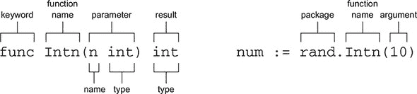
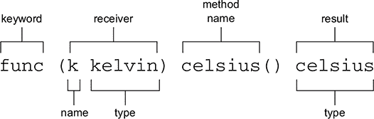
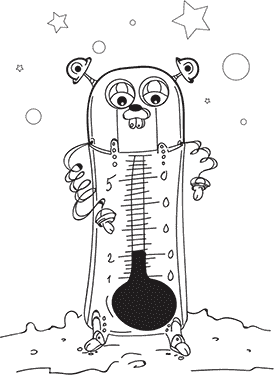

## 单元 3\. 构建块

> *编程是将一个大的不可能的任务分解成几个非常小的可能任务的过程。*
> 
> *Jazzwant*

*函数* 是计算机程序的基本构建块。你可以调用像 `Printf` 这样的函数来格式化和显示值。最终出现在你屏幕上的像素是由 Go 和你的操作系统中的一层层函数传递的。

你也可以编写函数。函数帮助你组织代码，重用功能，并以更小的部分来思考问题。

不仅如此，通过学习如何在 Go 中声明函数和方法，你将能够探索标准库提供的丰富功能，这些功能在 [golang.org/pkg](http://golang.org/pkg) 上有文档记录。

## 第 12 课\. 函数

在阅读 第 12 课 之后，你将能够

+   识别函数声明的各个部分

+   编写可重用函数来构建更大的程序

这节课首先检查了之前课程中使用过的函数的标准库文档。

一旦你熟悉了声明函数的语法，你将为气象站程序编写函数。火星表面的罗弗环境监测站（REMS）收集气象数据。你将编写可能成为 REMS 程序一部分的函数，例如转换温度。


**考虑这一点**

做一个三明治。听起来很简单，但涉及许多步骤。洗生菜，切番茄，等等。也许你会进一步收获谷物，磨成面粉，然后烤面包，或者也许这些功能是由农民和面包师傅提供的。

使用每个步骤的函数来分解过程。然后，如果你需要为披萨准备番茄片，这个函数就可以重用。

你日常生活中还有什么可以分解成函数的？


### 12.1\. 函数声明

Go 包文档在 [golang.org/pkg](http://golang.org/pkg) 上列出了标准库中每个包声明的函数。有很多实用的函数——这本书可能无法全部涵盖。

要在自己的项目中使用这些函数，你通常需要阅读文档中的函数声明来了解如何调用该函数。在仔细审查了 `Intn`、`Unix`、`Atoi`、`Contains` 和 `Println` 的声明后，你将能够在探索其他函数时应用你新获得的知识，并在自己编写函数时使用这些知识。

你在 第 2 课 中使用了 `Intn` 函数来生成伪随机数。导航到 [golang.org/pkg](http://golang.org/pkg) 和 `math/rand` 包以找到 `Intn` 函数。你还可以使用搜索框来查找 `Intn`。

`rand` 包中 `Intn` 的声明看起来是这样的：

```
func Intn(n int) int
```

作为复习，这里有一个使用 `Intn` 函数的例子：

```
num := rand.Intn(10)
```

在 图 12.1 中，声明部分被识别，以及调用 `Intn` 函数的语法。`func` 关键字让 Go 知道这是一个函数声明。然后是函数名 `Intn`，它以大写字母开头。

##### 图 12.1\. `Intn` 函数声明和调用 `Intn` 函数



在 Go 中，以大写字母开头的函数、变量和其他标识符是 *导出的*，并可供其他包使用。`rand` 包中也包含以小写字母开头的函数，但它们不能从 `main` 包中访问。

`Intn` 函数接受一个 *参数*，该参数被括号包围。参数是一个变量名后跟一个类型，与变量声明一致：

```
var n int
```

当调用 `Intn` 函数时，整数 10 被作为单个 *参数* 传递，同样被括号包围。该参数对应 `Intn` 所期望的单个参数。如果没有传递参数，或者参数不是 `int` 类型，Go 编译器会报告错误。


##### 提示

参数和参数是数学术语，有细微的区别。一个函数接受参数并通过参数被调用，尽管有时人们可能互换使用这些术语。


`Intn` 函数返回单个结果，一个 `int` 类型的伪随机整数。结果被返回给调用者，用于初始化新声明的变量 `num`。

`Intn` 函数只接受一个参数，但函数可以通过逗号分隔的列表接受多个参数。如果你还记得 第 7 课，`time` 包中的 `Unix` 函数接受两个 `int64` 参数，分别对应自 1970 年 1 月 1 日起的秒数和纳秒数。文档中的声明看起来像这样：

```
func Unix(sec int64, nsec int64) Time
```

下面是使用两个参数调用 `Unix` 函数的示例，这两个参数分别对应 `sec` 和 `nsec` 参数：

```
future := time.Unix(12622780800, 0)
```

`Unix` 函数返回的结果是 `Time` 类型。得益于类型推断，调用 `Unix` 的代码不需要指定结果类型，这会使代码更加简洁。


##### 注意

第 13 课 展示了如何声明新类型，如 `time.Time` 和 `big.Int`。


`time` 包声明并导出 `Time` 类型，该类型以大写字母开头，就像 `Unix` 函数一样。通过使用大写字母来指示导出内容，很明显 `Time` 类型可以从其他包中访问。

`Unix` 函数接受两个相同类型的参数，如下所述：

```
func Unix(sec int64, nsec int64) Time
```

但当在函数声明中列出参数时，只有当类型发生变化时才需要指定类型，因此它可以写成这样：

```
func Unix(sec, nsec int64) Time
```

这个快捷方式是可选的，但它在其他地方也被使用，例如 `strings` 包中的 `Contains` 函数，它接受两个 `string` 类型的参数：

```
func Contains(s, substr string) bool
```


##### 提示

在 [golang.org/pkg](http://golang.org/pkg) 的文档中，有时会有可以扩展的示例，你可以在 gobyexample.com 找到更多示例。如果你在学习 Go 的同时在自己的项目中前进，这些示例可能非常有价值。


许多编程语言都有接受多个参数的函数，但 Go 函数也可以返回多个结果。首次在 第 10 课 中展示的 `Atoi` 函数将字符串转换为数字，并返回两个结果，这里分别赋值给 `countdown` 和 `err`：

```
countdown, err := strconv.Atoi("10")
```

`strconv` 包的文档声明 `Atoi` 如下：

```
func Atoi(s string) (i int, err error)
```

两个结果被指定在括号中，就像参数列表一样，每个结果都有一个名称后跟一个类型。在函数声明中，你也可以列出没有名称的结果类型：

```
func Atoi(s string) (int, error)
```


##### 注意

`error` 类型是一个用于错误的内置类型，第 28 课 将深入介绍。


你从本书开始就一直在使用的函数是 `Println`。它是一个非常独特的函数，因为它可以接受一个参数，也可以接受两个或更多参数。它还可以接受不同类型的参数，包括整数和字符串：

```
fmt.Println("Hello, playground")
fmt.Println(186, "seconds")
```

文档中的函数声明可能看起来有点奇怪，因为它使用了我们尚未介绍的功能：

```
func Println(a ...interface{}) (n int, err error)
```

`Println` 函数接受一个参数 `a`，但你已经看到传递多个参数是可能的。更具体地说，你可以向 `Println` 函数传递可变数量的参数，这由省略号 (`...`) 表示。有一个专门的术语来描述这一点：`Println` 被称为 *可变参数* 函数。参数 `a` 是传递给函数的参数集合。我们将在 第 18 课 中回到可变参数函数。

`a` 参数的类型是 `interface{}`，被称为 *空接口* 类型。我们将在 第 24 课 中介绍接口，但现在你知道这种特殊类型是使 `Println` 能够接受 `int`、`float64`、`string`、`time.Time` 或任何其他类型而不会在 Go 编译器中报告错误的原因。

可变参数函数和空接口的组合，写作 `...interface{}`，意味着你可以传递任意数量和类型的参数给 `Println`。它能够很好地显示你向它投掷的任何内容。


##### 注意

到目前为止，我们一直在忽略 `Println` 返回的两个结果，尽管忽略错误被认为是一种不良实践。良好的错误处理实践将在 第 28 课 中介绍。

|  |

**快速检查 12.1**

> **1**
> 
> 你是用参数还是参数调用函数？
> 
> **2**
> 
> 函数接受参数还是参数？
> 
> **3**
> 
> 以大写字母开头的函数（`Contains`）与以小写字母开头的函数（`contains`）有何不同？
> 
> **4**
> 
> 函数声明中的省略号（`...`）表示什么？

|  |

**QC 12.1 答案**

> **1**
> 
> 参数
> 
> **2**
> 
> 参数
> 
> **3**
> 
> 小写表示只能在其声明的包中使用的函数，而大写函数是导出的，可以在任何地方使用。
> 
> **4**
> 
> 该函数是可变参数的。你可以传递给它任意数量的参数。


### 12.2\. 编写函数

到目前为止，这本书中的代码都放在了 `main` 函数中。当处理更大的应用程序，如环境监测程序时，将问题分解成更小的部分变得很有价值。将代码组织成函数可以使代码更容易理解、重用和维护。

从传感器读数中读取的温度数据应以对地球人有意义的方式报告。传感器提供开尔文尺度的数据，其中 0° K 是绝对零度，即可能达到的最低温度。下一段代码中的函数将温度转换为摄氏度。一旦编写了转换函数，就可以在需要温度转换时重复使用它。

##### 列表 12.1\. 开氏到摄氏度：kelvin.go

```
package main

import "fmt"

// kelvinToCelsius converts °K to °C
func kelvinToCelsius(k float64) float64 {              *1*
    k -= 273.15
    return k
}

func main() {
    kelvin := 294.0
    celsius := kelvinToCelsius(kelvin)                 *2*
    fmt.Print(kelvin, "° K is ", celsius, "° C")       *3*
 }
```

+   ***1* 声明一个接受一个参数并返回一个结果的函数**

+   ***2* 将 kelvin 作为第一个参数传递给函数**

+   ***3* 打印 294° K 等于 20.850000000000023° C**

列表 12.1 中的 `kelvinToCelsius` 函数接受一个名为 `k` 的参数，类型为 `float64`。遵循 Go 的约定，`kelvinToCelsius` 的注释从函数名开始，然后是它所做的工作。

此函数返回一个 `float64` 类型的值。计算结果通过 `return` 关键字返回给调用者，然后在 `main` 函数中用此值初始化一个新的 `celsius` 变量。

注意，同一包内的函数调用不需要指定包名。


**隔离可能是一件好事**

列表 12.1 中的 `kelvinToCelsius` 函数与其他函数隔离。它的唯一输入是它接受的参数，唯一输出是它返回的结果。它不对外部状态进行任何修改。这样的函数是*无副作用的*，也是最容易理解、测试和重用的。

`kelvinToCelsius` 函数确实修改了变量 `k`，但 `k` 和 `kelvin` 是完全独立的变量，因此在函数内部为 `k` 赋新值不会影响 `main` 中的 `kelvin` 变量。这种行为被称为*按值传递*，因为 `k` 参数是用 `kelvin` 参数的值初始化的。按值传递有助于函数之间的边界，有助于隔离一个函数与另一个函数。

我们给变量取了不同的名字，但即使参数和参数有相同的名字，按值传递也适用。

此外，`kelvinToCelsius` 中的变量 `k` 与其他函数中名为 `k` 的任何变量完全独立，这要归功于变量作用域。作用域在第 4 课中有所介绍，但为了重申，函数声明中的参数和函数体内声明的变量具有*函数作用域*。在不同函数中声明的变量完全独立，即使它们具有相同的名称。

|  |

**快速检查 12.2**

> **Q1:**
> 
> 将代码拆分为函数有哪些优点？

|  |

**QC 12.2 答案**

> **1:**
> 
> 函数是可重用的，它们通过函数作用域为变量提供隔离，并为它们执行的操作提供名称，这使得代码更容易跟踪和理解。


### 摘要

+   函数通过名称、参数列表和结果列表进行声明。

+   大写函数名称和类型可供其他包使用。

+   每个参数或结果都是一个名称后跟一个类型，尽管当多个命名参数或结果具有相同类型时，类型可以省略。结果也可以无名称地列出为类型。

+   函数调用以声明函数的包的名称为前缀，除非函数是在调用它的同一包中声明的。

+   函数通过与它们接受的参数对应的参数进行调用。结果通过 `return` 关键字返回给调用者。

让我们看看你是否掌握了这一点...

#### 实验：functions.go

使用 play.golang.org 上的 Go Playground 输入列表 12.1 并声明额外的温度转换函数：

+   重新使用 `kelvinToCelsius` 函数将 233° K 转换为摄氏度。

+   编写并使用一个 `celsiusToFahrenheit` 温度转换函数。提示：转换为华氏度的公式是：(c * 9.0 / 5.0) + 32.0。

+   编写一个 `kelvinToFahrenheit` 函数并验证它将 0° K 转换为大约 -459.67° F。

你在你的新函数中使用了 `kelvinToCelsius` 和 `celsiusToFahrenheit`，还是编写了一个具有新公式的独立函数？两种方法都是完全有效的。

## 第 13 课\. 方法

在阅读第 13 课之后，你将能够

+   声明新类型

+   将函数重写为方法

*方法*类似于增强类型以提供额外行为的函数。在你可以声明一个方法之前，你需要声明一个新的类型。本课将 第 12 课 中的 `kelvinToCelsius` 函数转换为一个具有方法的类型。

起初，它可能看起来像方法只是函数已做事情的另一种语法，你会是对的。方法提供了另一种组织代码的方式，对于本课的例子来说，这是一种更令人满意的方式。后面的课程，特别是第 5 单元的课程，展示了方法如何与其他语言特性结合以带来新的功能。


**考虑这一点**

当你在计算器上输入数字与在打字机上输入数字时，预期的行为相当不同。Go 有内置的功能以独特的方式操作数字和文本（`+`），如第十部分所示。

如果你想表示一种新的类型并将行为与之捆绑在一起呢？`float64` 类型过于通用，不足以充分表示温度计，而狗的 `bark()` 声音与树的 bark 声音完全不同。函数有它的位置，但类型和方法提供了另一种组织代码和表示周围世界的有用方式。

在开始本节课之前，四处看看并考虑你周围的类型及其各自的行为。


### 13.1. 声明新类型

Go 声明了许多类型，其中许多在第 2 单元中介绍。有时这些类型不足以描述你想要持有的值的类型。

温度不是一个 `float64`，尽管它可能有其底层表示。温度是以摄氏度、华氏度或开尔文为单位的测量值。声明新类型不仅使代码更清晰，还可以帮助防止错误。

`type` 关键字用于声明一个带有名称和底层类型的新类型，如下所示。

##### 列表 13.1. `Celsius` 类型：celsius.go

```
type celsius float64              *1*

var temperature celsius = 20

fmt.Println(temperature)          *2*
```

+   ***1* 底层类型是 float64。**

+   ***2* 打印 20**

数值字面量 20，像所有数值字面量一样，是一个 *未指定类型的* 常量。它可以赋值给 `int`、`float64` 或任何其他数值类型的变量。`celsius` 类型是一个新的数值类型，其行为和表示与 `float64` 相同，因此前述列表中的赋值是有效的。

你也可以向温度添加值，并且通常可以像使用 `float64` 一样使用它，如下所示。

##### 列表 13.2. `celsius` 类型的行为类似于 `float64`：celsius-addition.go

```
type celsius float64

const degrees = 20
var temperature celsius = degrees

temperature += 10
```

`celsius` 类型是一个独特的类型，而不是像第九部分中提到的那些类型别名。如果你尝试用 `float64` 使用它，你会得到一个类型不匹配的错误：

```
var warmUp float64 = 10
temperature += warmUp              *1*
```

+   ***1* 无效操作：类型不匹配**

要添加 `warmUp`，必须首先将其转换为 `celsius` 类型。这个版本是有效的：

```
var warmUp float64 = 10
temperature += celsius(warmUp)
```

能够定义自己的类型可以非常有助于提高代码的可读性和可靠性。以下列表演示了 `celsius` 和 `fahrenheit` 类型不能意外地比较或组合。

##### 列表 13.3. 类型不能混合

```
type celsius float64
type fahrenheit float64

var c celsius = 20
var f fahrenheit = 20

if c == f {             *1*
}

c += f                  *1*
```

+   ***1* 无效操作：celsius 和 fahrenheit 类型不匹配**


**快速检查 13.1**

> **Q1:**
> 
> 声明新类型，如 `celsius` 和 `fahrenheit`，有哪些优点？

|  |

**QC 13.1 答案**

> **1:**
> 
> 新类型可以更好地描述它包含的值，例如 `celsius` 而不是 `float64`。拥有独特的类型有助于避免愚蠢的错误，比如将华氏度值添加到摄氏度值上。


### 13.2. 带上你的类型

上一节声明了新的 `celsius` 和 `fahrenheit` 类型，将温度域引入代码中，同时弱化了底层存储表示。温度是表示为 `float64` 还是 `float32` 对变量包含的值几乎没有什么影响，而像 `celsius`、`fahrenheit` 和 `kelvin` 这样的类型则传达了它们的目的。

一旦声明了一个类型，您就可以在任何可以使用预定义 Go 类型（`int`、`float64`、`string` 等等）的地方使用它，包括函数参数和结果，如下面的列表所示。

##### 列表 13.4\. 带有自定义类型的函数：temperature-types.go

```
package main

import "fmt"

type celsius float64
type kelvin float64

// kelvinToCelsius converts °K to °C
func kelvinToCelsius(k kelvin) celsius {
    return celsius(k - 273.15)                 *1*
}

func main() {
    var k kelvin = 294.0                       *2*
    c := kelvinToCelsius(k)
    fmt.Print(k, "° K is ", c, "° C")          *3*
}
```

+   ***1* 需要进行类型转换。**

+   ***2* 参数必须是 kelvin 类型。**

+   ***3* 打印 294° K 是 20.850000000000023° C**

`kelvinToCelsius` 函数只接受 `kelvin` 类型的参数，这可以防止愚蠢的错误。它不会接受错误类型的参数，例如 `fahrenheit`、`kilometers` 或甚至 `float64`。Go 语言是一种务实的语言，因此仍然可以传递字面值或无类型的常量。与其写 `kelvinToCelsius(kelvin(294))`，您可以直接写 `kelvinToCelsius(294)`。

从 `kelvinToCelsius` 返回的结果是 `celsius` 类型，而不是 `kelvin` 类型，因此必须在返回之前将类型转换为 `celsius`。


**快速检查 13.2**

> **Q1:**
> 
> 编写一个 `celsiusToKelvin` 函数，该函数使用 列表 13.4 中定义的 `celsius` 和 `kelvin` 类型。使用它将 127° C（太阳照射的月球表面温度）转换为开尔文度。

|  |

**QC 13.2 答案**

> **1:**
> 
> ```
> func celsiusToKelvin(c celsius) kelvin {
>     return kelvin(c + 273.15)
> }
> 
> func main() {
>     var c celsius = 127.0
>     k := celsiusToKelvin(c)
>     fmt.Print(c, "° C is ", k, "° K")     *1*
> }
> ```
> 
> +   ***1* 打印 127° C 是 400.15° K**


### 13.3\. 使用方法向类型添加行为

> *纵然这是疯狂，但其中自有方法。*
> 
> *莎士比亚，*《哈姆雷特》*

几十年来，传统的面向对象语言都教导方法属于类。Go 语言则不同。实际上，Go 语言中没有类，甚至没有对象，但 Go 语言还是有方法的。这听起来可能有些奇怪，甚至有些疯狂，但 Go 语言中的方法实际上比过去任何语言都更加灵活。

类似于 `kelvinToCelsius`、`celsiusToFahrenheit`、`fahrenheitToCelsius` 和 `celsiusToKelvin` 的函数可以完成工作，但我们可以做得更好。在它们的位置声明几个方法将使温度转换代码更加简洁。


您可以将方法与同一包中声明的任何类型关联，但不能与预定义类型（`int`、`float64` 等等）关联。您已经看到了如何声明一个类型：

```
type kelvin float64
```

`kelvin` 类型与其底层类型 `float64` 具有相同的行为。您可以对 `kelvin` 值进行加法、乘法和其他操作，就像浮点数一样。声明将 `kelvin` 转换为 `celsius` 的方法就像声明一个函数一样简单。它们都以 `func` 关键字开始，函数体与方法体相同：

```
func kelvinToCelsius(k kelvin) celsius {       *1*
     return celsius(k - 273.15)
}

func (k kelvin) celsius() celsius {            *2*
     return celsius(k - 273.15)
}
```

+   ***1* kelvinToCelsius 函数**

+   ***2* 关于 kelvin 类型的摄氏度方法**

`celsius`方法不接受任何参数，但它有一个类似参数的东西在名称之前。它被称为*接收器*，如图图 13.1 所示。方法和函数都可以接受多个参数，但方法必须恰好有一个接收器。在`celsius`方法体内，接收器表现得就像任何其他参数一样。

##### 图 13.1\. 方法声明



使用方法的语法与调用函数不同：

```
var k kelvin = 294.0
var c celsius

c = kelvinToCelsius(k)          *1*
c = k.celsius()                 *2*
```

+   ***1* 调用`kelvinToCelsius`函数**

+   ***2* 调用`celsius`方法**

方法使用*点符号*调用，这看起来就像在另一个包中调用函数。但在这个情况下，正确的类型的变量后面跟着一个点和方法名称。

现在温度转换是`kelvin`类型的`celsius`方法，名称如`kelvinToCelsius`是多余的。一个包只能有一个具有给定名称的函数，并且它不能与类型名称相同，所以返回`celsius`类型的`celsius`函数是不可能的。但每个温度类型都可以提供一个`celsius`方法，所以例如，`fahrenheit`类型可以增强如下：

```
type fahrenheit float64

// celsius converts °F to °C
func (f fahrenheit) celsius() celsius {
    return celsius((f - 32.0) * 5.0 / 9.0)
}
```

这创造了一种很好的对称性，每种温度类型都可以有一个`celsius`方法来转换为摄氏度。


**快速检查 13.3**

> **Q1:**
> 
> 识别这个方法声明中的接收器：`func (f fahrenheit) celsius() celsius`

|  |

**QC 13.3 答案**

> **1:**
> 
> 接收器是`f`类型的`fahrenheit`。


### 概述

+   声明自己的类型可以帮助提高可读性和可靠性。

+   方法就像通过在方法名称之前指定的接收器与类型相关联的函数。方法和函数一样可以接受多个参数并返回多个结果，但它们必须始终恰好有一个接收器。在方法体内，接收器表现得就像任何其他参数一样。

+   方法调用的语法使用点符号，后面跟着适当的类型的变量，然后是点、方法名称和任何参数。

让我们看看你是否掌握了这个...

#### 实验：methods.go

编写一个程序，包含`celsius`、`fahrenheit`和`kelvin`类型和方法，以将任何温度类型转换为任何其他温度类型。

## 第 14 课\. 一等函数

在阅读了第 14 课之后，你将能够

+   将函数赋值给变量

+   将函数传递给函数

+   编写创建函数的函数

在 Go 中，你可以将函数赋值给变量，将函数传递给函数，甚至编写返回函数的函数。函数是*一等*的——它们在整数、字符串和其他类型工作的所有地方都能工作。

本课探讨了作为理论上的 Rover 环境监测站(REMS)程序一部分的一等函数的潜在用途，该程序从（假的）温度传感器读取数据。


**考虑这一点**

一个玉米卷食谱需要莎莎酱。你可以翻到食谱书的第 93 页制作自制的莎莎酱，或者打开商店里的一罐莎莎酱。

首类函数就像需要莎莎酱的玉米卷。作为代码，`makeTacos` 函数需要调用莎莎酱的函数，无论是 `makeSalsa` 还是 `openSalsa`。莎莎酱函数也可以独立使用，但没有莎莎酱的玉米卷就不完整。

除了食谱和温度传感器之外，还有哪些函数可以通过函数进行自定义的例子？


### 14.1. 将函数分配给变量

天气站传感器提供 150–300° K 的空气温度读数。一旦你有了数据，你可以使用函数将开尔文转换为其他温度单位，但除非你的计算机（或树莓派）上连接了传感器，否则获取数据会有点问题。

目前你可以使用一个返回伪随机数的假传感器，但随后你需要一种方法来交替使用 `realSensor` 或 `fakeSensor`。下面的代码示例正是如此。通过这种方式设计程序，还可以插入不同的真实传感器，例如，用于监测地面和空气温度。

##### 代码列表 14.1. 可互换的传感器函数：sensor.go

```
package main

import (
    "fmt"
    "math/rand"
)

type kelvin float64

func fakeSensor() kelvin {
    return kelvin(rand.Intn(151) + 150)
}

func realSensor() kelvin {
    return 0                        *1*
}

func main() {
    sensor := fakeSensor            *2*
    fmt.Println(sensor())

    sensor = realSensor
    fmt.Println(sensor())
}
```

+   ***1* 待办：实现一个真实传感器**

+   ***2* 将函数分配给变量**

在之前的代码示例中，`sensor` 变量被分配给了 `fakeSensor` 函数本身，而不是函数调用的结果。函数和方法调用总是带有括号，例如 `fakeSensor()`，但这里并非如此。

现在调用 `sensor()` 将会根据 `sensor` 被分配到哪个函数而实际调用 `realSensor` 或 `fakeSensor`。

`sensor` 变量是函数类型，其中该函数不接受任何参数并返回一个 `kelvin` 结果。当不依赖类型推断时，`sensor` 变量可以这样声明：

```
var sensor func() kelvin
```


##### **注意**

你可以在代码列表 14.1 中将 `sensor` 重新分配给 `realSensor`，因为它与 `fakeSensor` 的*函数签名*相匹配。这两个函数具有相同数量和类型的参数以及返回值。

|  |

**快速检查 14.1**

> **1**
> 
> 你如何区分将函数分配给变量与将函数调用的结果分配给变量？
> 
> **2**
> 
> 如果存在一个返回摄氏温度的 `groundSensor` 函数，它能否被分配到代码列表 14.1 中的 `sensor`？

|  |

**QC 14.1 答案**

> **1**
> 
> 函数和方法调用总是带有括号（例如，`fn()`），而函数本身可以通过指定不带括号的函数名来分配。
> 
> **2**
> 
> 不。参数和返回值必须具有相同的类型才能重新分配传感器变量。Go 编译器将报告错误：不能在赋值中使用 groundSensor。


### 14.2. 将函数传递给其他函数

变量可以引用函数，并且变量可以被传递给函数，这意味着 Go 允许你将函数传递给其他函数。

为了每秒记录温度数据，列表 14.2 声明了一个新的`measureTemperature`函数，它接受一个传感器函数作为参数。它定期调用传感器函数，无论是`fakeSensor`还是`realSensor`。

能够传递函数的能力为你提供了一种强大的方式来分割你的代码。如果没有一等函数，你可能会得到包含几乎相同代码的`measureRealTemperature`和`measureFakeTemperature`函数。

##### 列表 14.2\. 函数作为参数：function-parameter.go

```
package main

import (
    "fmt"
    "math/rand"
    "time"
)

type kelvin float64

func measureTemperature(samples int, sensor func() kelvin) {     *1*
    for i := 0; i < samples; i++ {
        k := sensor()
        fmt.Printf("%v° K\n", k)
        time.Sleep(time.Second)
    }
}

func fakeSensor() kelvin {
    return kelvin(rand.Intn(151) + 150)
}

func main() {
    measureTemperature(3, fakeSensor)                           *2*
}
```

+   ***1* measureTemperature 接受一个函数作为第二个参数。**

+   ***2* 将函数的名称传递给另一个函数**

`measureTemperature`函数接受两个参数，第二个参数的类型为`func() kelvin`。这种声明看起来像同一类型的变量声明：

```
var sensor func() kelvin
```

`main`函数能够将函数的名称传递给`measureTemperature`。


**快速检查 14.2**

> **Q1:**
> 
> 将函数传递给其他函数的能力有什么好处？

|  |

**QC 14.2 答案**

> **1:**
> 
> 一等函数提供了另一种分割和重用代码的方法。


### 14.3\. 声明函数类型

可以声明一个新的函数类型来压缩和澄清引用它的代码。你使用了`kelvin`类型来传达温度的单位，而不是底层表示。同样也可以为正在传递的函数做同样的事情：

```
type sensor func() kelvin
```

而不是接受无参数并返回`kelvin`值的函数，代码是关于`sensor`函数的。这种类型可以用来压缩其他代码，因此声明

```
func measureTemperature(samples int, s func() kelvin)
```

现在可以写成这样：

```
func measureTemperature(samples int, s sensor)
```

在这个例子中，可能看起来没有改进，因为你现在需要知道当查看这一行代码时`sensor`是什么。但如果`sensor`在多个地方使用，或者如果函数类型有多个参数，使用类型将显著减少混乱。


**快速检查 14.3**

> **Q1:**
> 
> 将以下函数签名重写为使用函数类型：
> 
> ```
> func drawTable(rows int, getRow func(row int) (string, string))
> ```

|  |

**QC 14.3 答案**

> **1:**
> 
> ```
> type getRowFn func(row int) (string, string)
> 
> func drawTable(rows int, getRow getRowFn)
> ```


### 14.4\. 闭包和匿名函数

一个*匿名函数*，在 Go 中也称为*函数字面量*，是一个没有名称的函数。与常规函数不同，函数字面量是*闭包*，因为它们保留了周围作用域中变量的引用。


你可以将匿名函数赋值给变量，然后像使用任何其他函数一样使用该变量，如下面的列表所示。

##### 列表 14.3\. 匿名函数：masquerade.go

```
package main

import "fmt"

var f = func() {                                 *1*
    fmt.Println("Dress up for the masquerade.")
}

func main() {
    f()                                          *2*
}
```

+   ***1* 将匿名函数赋值给变量**

+   ***2* 打印为化装舞会打扮。**

你声明的变量可以在包的作用域内，或者在函数内部，如下一个列表所示。

##### 列表 14.4\. 匿名函数：funcvar.go

```
package main

import "fmt"

func main() {
    f := func(message string) {         *1*
        fmt.Println(message)
    }
    f("Go to the party.")               *2*
}
```

+   ***1* 将匿名函数赋值给变量**

+   ***2* 打印去参加派对。**

你甚至可以一步声明和调用匿名函数，如下面的列表所示。

##### 列表 14.5\. 匿名函数：anonymous.go

```
package main

import "fmt"

func main() {
    func() {                                *1*
        fmt.Println("Functions anonymous")
    }()                                     *2*
}
```

+   ***1* 声明一个匿名函数**

+   ***2* 调用函数**

匿名函数在需要即时创建函数时非常有用。这种情况之一是从另一个函数返回一个函数。虽然函数可以返回现有的命名函数，但声明和返回一个新的匿名函数更有用。

在列表 14.6 中，`calibrate`函数调整了空气温度读数中的错误。使用一等函数，`calibrate`接受一个假传感器或真实传感器作为参数，并返回一个替换函数。每次调用新的`sensor`函数时，都会调用原始函数，并通过偏移量调整读数。

##### 列表 14.6\. 传感器校准：calibrate.go

```
package main

import "fmt"

type kelvin float64

// sensor function type
type sensor func() kelvin

func realSensor() kelvin {
    return 0                             *1*
}

func calibrate(s sensor, offset kelvin) sensor {
    return func() kelvin {               *2*
         return s() + offset
    }
}

func main() {
    sensor := calibrate(realSensor, 5)
    fmt.Println(sensor())                *3*
}
```

+   ***1* 待办：实现真实传感器**

+   ***2* 声明并返回一个匿名函数**

+   ***3* 打印 5**

前面的列表中的匿名函数使用了闭包。它引用了`calibrate`函数接受的参数`s`和`offset`变量。即使在`calibrate`函数返回之后，闭包捕获的变量仍然存在，因此对`sensor`的调用仍然可以访问这些变量。匿名函数*封装*了作用域内的变量，这就是为什么称之为*闭包*的原因。

由于闭包保留了对周围变量的引用而不是它们值的副本，因此对这些变量的更改会反映在匿名函数的调用中：

```
var k kelvin = 294.0

sensor := func() kelvin {
    return k
}
fmt.Println(sensor())        *1*

k++
fmt.Println(sensor())        *2*
```

+   ***1* 打印 294**

+   ***2* 打印 295**

请记住这一点，尤其是在使用`for`循环中的闭包时。


**快速检查 14.4**

> **1**
> 
> Go 中匿名函数的另一个名称是什么？
> 
> **2**
> 
> 闭包提供了哪些常规函数没有的功能？

|  |

**QC 14.4 答案**

> **1**
> 
> 在 Go 中，匿名函数也称为函数字面量。
> 
> **2**
> 
> 闭包保留了对周围作用域中变量的引用。


### 摘要

+   当函数被视为一等公民时，它们为拆分和重用代码开辟了新的可能性。

+   要即时创建函数，请使用具有闭包的匿名函数。

看看你是否明白了...

#### 实验：calibrate.go

将列表 14.6 输入 Go 游乐场以查看其效果：

+   而不是将 5 作为参数传递给`calibrate`，声明并传递一个变量。修改该变量，你会注意到对`sensor()`的调用仍然结果是 5。这是因为`offset`参数是参数的副本（按值传递）。

+   使用来自列表 14.2 的`fakeSensor`函数与`calibrate`一起创建一个新的`sensor`函数。多次调用新的`sensor`函数，并注意每次仍然调用原始的`fakeSensor`，导致随机值。

## 第 15 课：总结：温度表

编写一个显示温度转换表的程序。这些表格应使用等号（`=`）和管道符（`|`）来绘制线条，并包含一个标题部分：

```
=======================
| °C       | °F       |
=======================
| -40.0    | -40.0    |
| ...      | ...      |
=======================
```

程序应绘制两张表格。第一张表格有两列，第一列是摄氏度（°C），第二列是华氏度（°F）。从-40°C 通过 100°C 以 5°C 的步长循环，使用第 13 课中的温度转换方法来填充两列。

完成一张表格后，实现第二张表格，并将列反转，将华氏度（°F）转换为摄氏度（°C）。

绘制线条和填充值是您可以用于任何需要显示在两列表格中的数据的代码。使用函数将表格绘制代码与计算每行温度的代码分开。



实现一个`drawTable`函数，该函数接受一个一等函数作为参数，并调用它来获取每行绘制的数据。向`drawTable`传递不同的函数应导致显示不同的数据。
