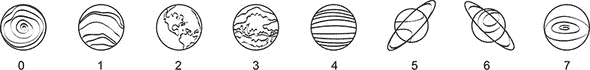
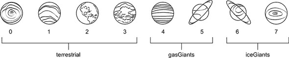
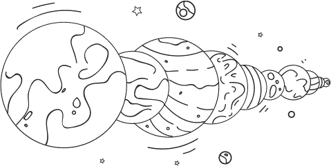
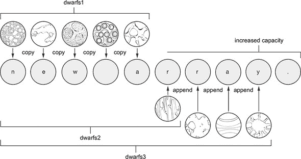
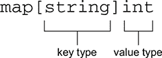
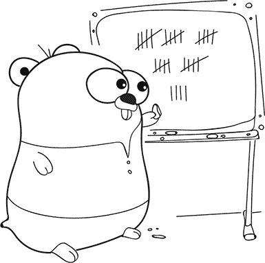
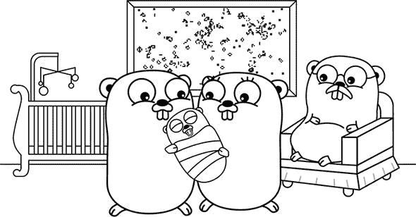

## 单元 4\. 集合

*集合*只是事物的组合。你可能有一个音乐收藏。每张专辑有一组歌曲，每首歌曲有一组音符。如果你想要构建一个音乐播放器，你会很高兴地知道编程语言也有集合。

在 Go 语言中，你可以使用 单元 2 中介绍的原始类型来组合更有趣的 *复合类型*。这些复合类型允许你将值组合在一起，提供新的收集和访问数据的方式。

## 第 16 课\. 星光熠熠

在阅读 第 16 课 之后，你将能够

+   声明和初始化数组

+   分配和访问数组的元素

+   遍历数组

*数组*是有序元素集合，具有固定长度。本课使用数组来存储我们太阳系中行星和矮行星的名称，但你也可以收集任何你喜欢的。

| |
| --- |

**考虑这一点**

你有收藏品吗？或者你过去有吗？可能是邮票、硬币、贴纸、书籍、鞋子、奖杯、电影或其他东西？

数组用于收集许多相同类型的事物。你可以用数组表示哪些集合？

| |
| --- |

### 16.1\. 声明数组和访问它们的元素

以下 `planets` 数组恰好包含八个元素：

```
var planets [8]string
```

数组的每个元素都具有相同的类型。在这种情况下，`planets` 是一个字符串数组。

可以通过使用方括号 `[]` 并以 0 开始的索引来访问数组的单个元素，如图 16.1 所示，并在列表 16.1 中展示。

##### 列表 16.1\. 行星数组：array.go

```
var planets [8]string

planets[0] = "Mercury"         *1*
planets[1] = "Venus"
planets[2] = "Earth"

earth := planets[2]            *2*
fmt.Println(earth)             *3*
```

+   ***1* 分配索引 0 处的行星**

+   ***2* 获取索引 2 处的行星**

+   ***3* 打印地球**

##### 图 16.1\. 索引从 0 到 7 的行星



尽管只有三个行星被分配，但 `planets` 数组有八个元素。数组的长度可以使用内置的 `len` 函数确定。其他元素包含它们类型的零值，即空字符串：

```
fmt.Println(len(planets))         *1*
fmt.Println(planets[3] == "")     *2*
```

+   ***1* 打印 8**

+   ***2* 打印 true**

| |
| --- |

##### 注意

Go 语言有一些内置函数不需要 `import` 语句。`len` 函数可以确定多种类型的长度。在这种情况下，它返回数组的尺寸。

| |
| --- |
| |

**快速检查 16.1**

> **1**
> 
> 你如何访问 `planets` 数组的第一个元素？
> 
> **2**
> 
> 新整数数组的元素默认值是什么？

| |
| --- |
| |

**QC 16.1 答案**

> **1**
> 
> `planets[0]`
> 
> **2**
> 
> 数组的元素最初是数组类型的零值，这意味着整数数组是 `0`。

| |
| --- |

### 16.2\. 不要越界

八元素数组具有从 0 到 7 的索引。当 Go 编译器检测到访问此范围之外的元素时，将报告错误：

```
var planets [8]string

planets[8] = "Pluto"         *1*
pluto := planets[8]          *1*
```

+   ***1* 无效的数组索引 8（超出 8 元素数组的范围）**

如果 Go 编译器无法检测到错误，程序在运行时可能会发生 *panic*：

```
var planets [8]string

i := 8
planets[i] = "Pluto"         *1*
pluto := planets[i]          *1*
```

+   ***1* Panic: 运行时错误：索引越界**

如果修改不属于 `planets` 数组的内存，程序将发生 *panic* 并崩溃，这仍然比导致未指定行为（如 C 编程语言中的情况）要好。

| |
| --- |

**快速检查 16.2**

> **Q1:**
> 
> `planets[11]` 会在编译时引起错误还是在运行时发生 *panic*？

| |
| --- |
| |

**QC 16.2 答案**

> **1:**
> 
> Go 编译器将检测无效的数组索引。

| |
| --- |

### 16.3\. 使用组合字面量初始化数组

*组合字面量* 是一种简洁的语法，可以初始化任何复合类型，使用你想要的值。而不是声明一个数组并逐个分配元素，Go 的组合字面量语法将声明和初始化一个数组，如下面的列表所示。

##### 列表 16.2\. 小行星数组：dwarfs.go

```
dwarfs := [5]string{"Ceres", "Pluto", "Haumea", "Makemake", "Eris"}
```

大括号 `{}` 包含五个以逗号分隔的字符串，用于填充新数组的元素。

对于较大的数组，将组合字面量拆分到多行可以提高可读性。并且作为便利，你可以要求 Go 编译器通过指定省略号 `...` 而不是数字来计算组合字面量中的元素数量。以下列表中的 `planets` 数组仍然具有固定长度。

##### 列表 16.3\. 行星的全数组：composite.go

```
planets := [...]string{      *1*
    "Mercury",
    "Venus",
    "Earth",
    "Mars",
    "Jupiter",
    "Saturn",
    "Uranus",
    "Neptune",               *2*
}
```

+   ***1* Go 编译器会计算元素数量。**

+   ***2* 需要尾随逗号。**

| |
| --- |

**快速检查 16.3**

> **Q1:**
> 
> 列表 16.3 中有多少颗行星？使用内置的 len 函数来找出答案。

| |
| --- |
| |

**QC 16.3 答案**

> **1:**
> 
> `planets` 数组有八个元素（`8`）。

| |
| --- |

### 16.4\. 遍历数组

遍历数组的每个元素类似于在 第 9 课 中遍历字符串的每个字符，如下面的列表所示。

##### 列表 16.4\. 遍历数组：array-loop.go

```
dwarfs := [5]string{"Ceres", "Pluto", "Haumea", "Makemake", "Eris"}

for i := 0; i < len(dwarfs); i++ {
    dwarf := dwarfs[i]
    fmt.Println(i, dwarf)
}
```

`range` 关键字通过更少的代码和更少的错误机会为数组的每个元素提供一个索引和值，如下面的列表所示。

##### 列表 16.5\. 使用 `range` 遍历数组：array-range.go

```
dwarfs := [5]string{"Ceres", "Pluto", "Haumea", "Makemake", "Eris"}

for i, dwarf := range dwarfs {
    fmt.Println(i, dwarf)
}
```

列表 16.4 和 16.5 产生相同的输出：

```
0 Ceres
1 Pluto
2 Haumea
3 Makemake
4 Eris
```

| |
| --- |

##### 注意

记住，如果你不需要 `range` 提供的索引变量，可以使用空白标识符（下划线）。

| |
| --- |
| |

**快速检查 16.4**

> **1**
> 
> 使用 `range` 关键字遍历数组可以避免哪些错误？
> 
> **2**
> 
> 在什么情况下使用传统的 `for` 循环而不是 `range` 更合适？

| |
| --- |
| |

**QC 16.4 答案**

> **1**
> 
> 使用 `range` 关键字，循环更简单，避免了越界等错误（例如，`i <= len(dwarfs)`）。
> 
> **2**
> 
> 如果你需要自定义操作，比如反向迭代或访问每个第二个元素。

| |
| --- |

### 16.5. 数组是复制的

将数组分配给新变量或将它传递给函数会完全复制其内容，如下面的列表所示。

##### 列表 16.6. 数组是值：array-value.go

```
planets := [...]string{
    "Mercury",
    "Venus",
    "Earth",
    "Mars",
    "Jupiter",
    "Saturn",
    "Uranus",
    "Neptune",
}

planetsMarkII := planets         *1*

planets[2] = "whoops"            *2*

fmt.Println(planets)             *3*
fmt.Println(planetsMarkII)       *4*
```

+   ***1* 复制行星数组**

+   ***2* 为星际 bypass 让路**

+   ***3* 打印[水星 金星 哗啦 火星 木星 土星 天王星 海王星]**

+   ***4* 打印[水星 金星 地球 火星 木星 土星 天王星 海王星]**

| |
| --- |

##### 提示

如果你逃离地球的毁灭，你将需要在你的电脑上安装 Go。请参阅[golang.org](http://golang.org)上的说明。

| |
| --- |

数组是值，函数通过值传递，这意味着以下列表中的`terraform`函数完全无效。

##### 列表 16.7. 数组按值传递：terraform.go

```
package main

import "fmt"

// terraform accomplishes nothing
func terraform(planets [8]string) {
    for i := range planets {
        planets[i] = "New " + planets[i]
    }
}

func main() {
    planets := [...]string{
        "Mercury",
        "Venus",
        "Earth",
        "Mars",
        "Jupiter",
        "Saturn",
        "Uranus",
        "Neptune",
    }

    terraform(planets)
    fmt.Println(planets)           *1*
}
```

+   ***1* 打印[水星 金星 地球 火星 木星 土星 天王星 海王星]**

`terraform`函数正在操作`planets`数组的副本，因此修改不会影响`main`函数中的`planets`。

此外，重要的是要认识到数组的长度是其类型的一部分。类型`[8]string`和类型`[5]string`都是字符串集合，但它们是两种不同的类型。当尝试传递不同长度的数组时，Go 编译器将报告错误：

```
dwarfs := [5]string{"Ceres", "Pluto", "Haumea", "Makemake", "Eris"}
terraform(dwarfs)                                                       *1*
```

+   ***1* 不能将矮人（类型[5]string）用作 terraform 的参数类型[8]string**

由于这些原因，数组不像下一课中将要介绍的*slices*那样经常用作函数参数。

| |
| --- |

**快速检查 16.5**

> **1**
> 
> 地球如何在列表 16.6 的`planetsMarkII`中幸存？
> 
> **2**
> 
> 如何修改列表 16.7，以便在`main`中的行星数组发生变化？

| |
| --- |
| |

**QC 16.5 答案**

> **1**
> 
> `planetsMarkII`变量接收了`planets`数组的副本，因此对任一数组的修改都是相互独立的。
> 
> **2**
> 
> `terraform`函数可以返回修改后的`[8]string`数组，这样`main`就可以将行星重新分配给新值。切片和指针的第 17 课和第 26 课提供了其他替代方案。

| |
| --- |

### 16.6. 数组数组

你已经见过字符串数组，但你也可以有整数数组、浮点数数组和甚至数组数组。以下列表中的 8×8 棋盘是一个字符串数组数组。

##### 列表 16.8. 棋盘：chess.go

```
var board [8][8]string             *1*

board[0][0] = "r"
board[0][7] = "r"                  *2*

for column := range board[1] {
    board[1][column] = "p"
}

fmt.Print(board)
```

+   ***1* 八个八字符串数组的数组**

+   ***2* 在[row][column]坐标放置一枚车**

| |
| --- |

**快速检查 16.6**

> **Q1:**
> 
> 考虑数独游戏。一个 9×9 整数网格的声明看起来会是什么样子？

| |
| --- |
| |

**QC 16.6 答案**

> **1:**
> 
> ```
> var grid [9][9]int
> ```

| |
| --- |

### 摘要

+   数组是有序元素集合，具有固定长度。

+   复合字面量提供了一种方便的方式来初始化数组。

+   `range`关键字可以遍历数组。

+   当访问数组的元素时，你必须保持在它的边界内。

+   当分配或传递给函数时，数组会被复制。

让我们看看你是否掌握了这个...

#### 实验：chess.go

+   将 列表 16.8 扩展到使用字符 `kqrbnp` 表示顶部的黑色棋子，以及使用大写 `KQRBNP` 表示底部的白色棋子，以显示所有棋子在起始位置。

+   编写一个函数，以优雅的方式显示棋盘。

+   用 `[8][8]rune` 来表示棋盘，而不是字符串。回想一下，`rune` 文字用单引号包围，可以用 `%c` 格式说明符打印。

## 第 17 课\. 切片：数组的窗口

在阅读 第 17 课 之后，你将能够

+   使用切片通过窗口查看太阳系

+   使用标准库对切片进行排序。

我们太阳系中的行星被分为地行星、气态巨行星和冰态巨行星，如图 17.1 所示。你可以通过用 `planets[0:4]` 切片 `planets` 数组的头四个元素来专注于地行星。*切片*不会改变 `planets` 数组。它只是创建了一个窗口或视图。这个视图是一个名为 *切片* 的类型。

##### 图 17.1\. 切片太阳系



| |
| --- |

**考虑这一点**

如果你有收藏，它是按照某种方式组织的吗？例如，图书馆书架上的书可能是按照作者姓氏排序的。这种安排让你可以专注于他们写的其他书籍。

你可以用切片以同样的方式聚焦于集合的一部分。

| |
| --- |

### 17.1\. 切片数组

切片用 *半开区间* 表示。例如，在下面的列表中，`planets[0:4]` 从索引 0 的行星开始，并继续到但不包括索引 4 的行星。

##### 列表 17.1\. 切片数组：slicing.go

```
planets := [...]string{
    "Mercury",
    "Venus",
    "Earth",
    "Mars",
    "Jupiter",
    "Saturn",
    "Uranus",
    "Neptune",
}

terrestrial := planets[0:4]
gasGiants := planets[4:6]
iceGiants := planets[6:8]

fmt.Println(terrestrial, gasGiants, iceGiants)            *1*
```

+   ***1* 打印 [水星 金星 地球 火星] [木星 土星] [天王星 海王星]**

虽然 `terrestrial`、`gasGiants` 和 `iceGiants` 都是切片，但你仍然可以像数组一样索引切片：

```
fmt.Println(gasGiants[0])          *1*
```

+   ***1* 打印木星**

你也可以先切片数组，然后再切片结果切片：

```
giants := planets[4:8]
gas := giants[0:2]
ice := giants[2:4]
fmt.Println(giants, gas, ice)        *1*
```

+   ***1* 打印 [木星 土星 天王星 海王星] [木星 土星] [天王星 海王星]**

`terrestrial`、`gasGiants`、`iceGiants`、`giants`、`gas` 和 `ice` 切片都是同一 `planets` 数组的视图。给切片的元素赋新值会修改底层 `planets` 数组。这种变化将通过其他切片可见：

```
iceGiantsMarkII := iceGiants                        *1*
iceGiants[1] = "Poseidon"
fmt.Println(planets)                                *2*
fmt.Println(iceGiants, iceGiantsMarkII, ice)        *3*
```

+   ***1* 复制 iceGiants 切片（行星数组的视图）**

+   ***2* 打印 [水星 金星 地球 火星 木星 土星 天王星 波塞冬]**

+   ***3* 打印 [天王星 波塞冬] [天王星 波塞冬] [天王星 波塞冬]**

| |
| --- |

**快速检查 17.1**

> **1**
> 
> 切片数组会产生什么？
> 
> **2**
> 
> 当使用 `planets[4:6]` 切片时，结果中有多少个元素？

| |
| --- |
| |

**QC 17.1 答案**

> **1**
> 
> 一个切片。
> 
> **2**
> 
> 二。

| |
| --- |

#### 17.1.1\. 切片的默认索引

当切片数组时，省略第一个索引默认为数组的开始。省略最后一个索引默认为数组的长度。这使得 列表 17.1 中的切片可以写成以下列表所示。

##### 列表 17.2\. 默认索引：slicing-default.go

```
terrestrial := planets[:4]
gasGiants := planets[4:6]
iceGiants := planets[6:]
```


##### 注意

切片索引不能为负。


你可能可以猜到省略两个索引会发生什么。`allPlanets` 变量是一个包含八个行星的切片：

```
allPlanets := planets[:]
```


**切片字符串**

数组的切片语法也适用于字符串：

```
neptune := "Neptune"
tune := neptune[3:]

fmt.Println(tune)               *1*
```

+   ***1* 打印调音**

切片字符串的结果是另一个字符串。然而，将新值赋给 `neptune` 不会改变 `tune` 的值，反之亦然：

```
neptune = "Poseidon"
fmt.Println(tune) *1*
```

+   ***1* 打印调音**

注意，索引表示字节数，而不是 runes：

```
question := "¿Cómo estás?"
fmt.Println(question[:6]) *1*
```

+   ***1* 打印 ¿Cóm**

|  |

**快速检查 17.2**

> **Q1:**
> 
> 如果地球和火星是唯一被殖民的行星，你将如何从 `terrestrial` 中推导出 `colonized` 切片？

|  |

**QC 17.2 答案**

> **1:**
> 
> ```
> colonized := terrestrial[2:]
> ```


### 17.2\. 切片复合字面量

Go 语言中的许多函数操作的是切片而不是数组。如果你需要一个显示底层数组中每个元素的切片，一个选项是声明一个数组，然后使用 `[:]` 来切片，如下所示：

```
dwarfArray := [...]string{"Ceres", "Pluto", "Haumea", "Makemake", "Eris"}
dwarfSlice := dwarfArray[:]
```

切片数组是创建切片的一种方法，但你也可以直接声明一个切片。字符串切片的类型是 `[]string`，括号中没有值。这与数组声明不同，数组声明总是指定括号中的固定长度或省略号。

在以下列表中，`dwarfs` 是使用熟悉的复合字面量语法初始化的切片。

##### 列表 17.3\. 从切片开始：dwarf-slice.go

```
dwarfs := []string{"Ceres", "Pluto", "Haumea", "Makemake", "Eris"}
```

仍然有一个底层数组。在幕后，Go 声明了一个五个元素的数组，然后创建了一个可以查看其所有元素的切片。


**快速检查 17.3**

> **Q1:**
> 
> 使用 `%T` 格式说明符比较 `dwarfArray` 和 `dwarfs` 切片的类型。

|  |

**QC 17.3 答案**

> **1:**
> 
> ```
> fmt.Printf("array %T\n", dwarfArray) *1*
> fmt.Printf("slice %T\n", dwarfs) *2*
> ```
> 
> +   ***1* 打印数组 [5]string**
> +   
> +   ***2* 打印切片 []string**


### 17.3\. 切片的力量

如果有办法折叠时空结构，将世界聚集在一起以实现瞬间旅行，会怎么样？使用 Go 标准库和一些巧妙的方法，列表 17.4 中的 `hyperspace` 函数修改了一个 `worlds` 切片，移除了它们之间的（白色）空间。



##### 列表 17.4\. 将世界聚集在一起：hyperspace.go

```
package main

import (
    "fmt"
    "strings"
)

// hyperspace removes the space surrounding worlds
func hyperspace(worlds []string) {                          *1*
    for i := range worlds {
        worlds[i] = strings.TrimSpace(worlds[i])
    }
}

func main() {
    planets := []string{" Venus   ", "Earth  ", " Mars"}    *2*
    hyperspace(planets)

    fmt.Println(strings.Join(planets, ""))                  *3*
}
```

+   ***1* 这个论点是切片，而不是数组。**

+   ***2* 空间包围的行星**

+   ***3* 打印金星、地球和火星**

`worlds` 和 `planets` 都是切片，尽管 `worlds` 是一个副本，但它们都指向同一个底层数组。

如果 `hyperspace` 改变了 `worlds` 切片指向的位置、开始或结束，这些更改对 `planets` 切片没有影响。但是 `hyperspace` 能够访问 `worlds` 指向的底层数组并更改其元素。这些更改对数组的其他（视图）切片是可见的。

切片在与其他语言的数组相比还有其他方面更灵活。切片有一个长度，但与数组不同，长度不是类型的一部分。你可以将任何大小的切片传递给 `hyperspace` 函数：

```
dwarfs := []string{" Ceres  ", " Pluto"}
hyperspace(dwarfs)
```

数组很少直接使用。Gophers 更喜欢切片，因为它们具有多功能性，尤其是在向函数传递参数时。


**快速检查 17.4**

> **Q1:**
> 
> 在 [golang.org/pkg](http://golang.org/pkg) 的 Go 文档中查找 `TrimSpace` 和 `Join`。它们提供了哪些功能？

|  |

**QC 17.4 答案**

> **1:**
> 
> **1a** `TrimSpace` 返回一个移除了前导和尾随空白字符的切片。
> 
> **1b** `Join` 使用分隔符连接元素切片。


### 17.4. 带有方法的切片

在 Go 中，你可以定义一个具有底层切片或数组的类型。一旦你有了类型，你就可以向它附加方法。Go 声明类型方法的能力比其他语言中的类更灵活。

标准库中的 `sort` 包声明了一个 `StringSlice` 类型：

```
type StringSlice []string
```

附属于 `StringSlice` 的是一个 `Sort` 方法：

```
func (p StringSlice) Sort()
```

为了按字母顺序排列行星，以下列表将 `planets` 转换为 `sort.StringSlice` 类型，然后调用 `Sort` 方法。

##### 列表 17.5. 排序字符串切片：sort.go

```
package main

import (
    "fmt"
    "sort"
)

func main() {
    planets := []string{
        "Mercury", "Venus", "Earth", "Mars",
        "Jupiter", "Saturn", "Uranus", "Neptune",
    }

    sort.StringSlice(planets).Sort()        *1*
    fmt.Println(planets)                    *2*
}
```

+   ***1* 按字母顺序排序行星**

+   ***2* 打印 [地球 木星 火星 水星 海王星 土星 天王星 金星]**

为了使其更加简单，`sort` 包有一个 `Strings` 辅助函数，它执行类型转换并为你调用 `Sort` 方法：

```
sort.Strings(planets)
```


**快速检查 17.5**

> **Q1:**
> 
> `sort.StringSlice(planets)` 做了什么？

|  |

**QC 17.5 答案**

> **1:**
> 
> `planets` 变量从 `[]string` 类型转换为 `StringSlice` 类型，该类型在 `sort` 包中声明。


### 摘要

+   切片是数组的窗口或视图。

+   `range` 关键字可以遍历切片。

+   当分配或传递给函数时，切片共享相同的基础数据。

+   复合字面量提供了一种方便的方式来初始化切片。

+   你可以为切片附加方法。

让我们看看你是否掌握了这个...

#### 实验：terraform.go

编写一个程序，通过在每个行星前添加 `"New "` 来改造字符串切片。使用你的程序来改造火星、天王星和海王星。

你的第一次迭代可以使用 terraform 函数，但你的最终实现应该引入一个 `Planets` 类型，并带有 terraform 方法，类似于 `sort.StringSlice`。

## 第 18 课. 更大的切片

在阅读完第 18 课后，你将能够

+   向切片中添加更多元素

+   调查长度和容量是如何工作的

数组有固定数量的元素，切片只是这些固定长度数组的视图。程序员经常需要一个可变长度的数组，它可以按需增长。通过结合切片和名为 `append` 的内置函数，Go 提供了可变长度数组的特性。本课深入探讨了它是如何工作的。


**考虑这一点**

你是否有过书籍超出书架容量，或者家庭超出住所或车辆容量的情况？

像书架一样，数组有一定的容量。切片可以关注数组中书籍的部分，并增长以达到书架的容量。如果书架满了，你可以用一个更大的书架替换它，并将所有书籍移过去。然后让切片指向新书架上的书籍，具有更大的容量。


### 18.1\. `append` 函数

国际天文学联合会（IAU）承认我们太阳系中有五个矮行星，但可能有更多。要向 `dwarfs` 切片添加更多元素，请使用以下列表中所示的内置 `append` 函数。

##### 列表 18.1\. 更多矮行星：append.go

```
dwarfs := []string{"Ceres", "Pluto", "Haumea", "Makemake", "Eris"}

dwarfs = append(dwarfs, "Orcus")
fmt.Println(dwarfs)                                        *1*
```

+   ***1* 打印 [Ceres Pluto Haumea Makemake Eris Orcus]**

`append` 函数是可变参数的，就像 `Println` 一样，所以你可以一次传递多个元素进行追加：

```
dwarfs = append(dwarfs, "Salacia", "Quaoar", "Sedna")
fmt.Println(dwarfs)                                        *1*
```

+   ***1* 打印 [Ceres Pluto Haumea Makemake Eris Orcus Salacia Quaoar Sedna]**

`dwarfs` 切片最初是一个五元素数组的视图，但前面的代码又添加了四个更多元素。这是如何实现的？为了进行调查，你首先需要了解 *容量* 和内置函数 `cap`。


**快速检查 18.1**

> **Q1:**
> 
> 列表 18.1 中有多少个矮行星？可以使用哪个函数来确定这个数量？

|  |

**QC 18.1 答案**

> **1:**
> 
> 该切片包含九个矮行星，可以使用 `len` 内置函数来确定：
> 
> ```
> fmt.Println(len(dwarfs)) *1*
> ```
> 
> +   ***1* 打印 9**


### 18.2\. 长度和容量

通过切片可见的元素数量决定了其长度。如果一个切片的底层数组更大，切片仍然可能具有增长的空间。

下面的列表声明了一个函数，用于打印切片的长度和容量。

##### 列表 18.2\. `Len` 和 `cap`: slice-dump.go

```
package main

import "fmt"

// dump slice length, capacity, and contents
func dump(label string, slice []string) {
    fmt.Printf("%v: length %v, capacity %v %v\n", label, len(slice),
cap(slice), slice)
}

func main() {
    dwarfs := []string{"Ceres", "Pluto", "Haumea", "Makemake", "Eris"}
    dump("dwarfs", dwarfs)                                             *1*
    dump("dwarfs[1:2]", dwarfs[1:2])                                   *2*
}
```

+   ***1* 打印矮行星：长度 5，容量 5 [Ceres Pluto Haumea Makemake Eris]**

+   ***2* 打印 dwarfs[1:2]：长度 1，容量 4 [Pluto]**

由 `dwarfs[1:2]` 创建的切片长度为 1，但可以容纳 4 个元素。


**快速检查 18.2**

> **Q1:**
> 
> 为什么 `dwarfs[1:2]` 切片的容量为 4？

|  |

**QC 18.2 答案**

> **1:**
> 
> `Pluto Haumea Makemake Eris` 即使长度为 1，也提供了 4 个元素的容量。


### 18.3\. 研究 `append` 函数

使用 列表 18.2 中的 `dump` 函数，下一个列表显示了 `append` 如何影响容量。

##### 列表 18.3\. `append` 到切片：slice-append.go

```
dwarfs1 := []string{"Ceres", "Pluto", "Haumea", "Makemake", "Eris"}    *1*
dwarfs2 := append(dwarfs1, "Orcus")                                    *2*
dwarfs3 := append(dwarfs2, "Salacia", "Quaoar", "Sedna")               *3*
```

+   ***1* 长度 5，容量 5**

+   ***2* 长度 6，容量 10**

+   ***3* 长度 9，容量 10**

支持 `dwarfs1` 的数组没有足够的空间（容量）来追加奥克鲁斯，因此 `append` 将 `dwarfs1` 的内容复制到具有两倍容量的新分配的数组中，如图 18.1（#ch18fig01）所示。`dwarfs2` 切片指向新分配的数组。额外的容量恰好提供了足够的空间进行下一个 `append`。

##### 图 18.1\. 当需要时，`append` 分配具有增加容量的新数组。



为了证明 `dwarfs2` 和 `dwarfs3` 指向与 `dwarfs1` 不同的数组，只需修改一个元素并打印出三个切片。


**快速检查 18.3**

> **Q1:**
> 
> 如果你修改了 列表 18.3 中的 `dwarfs3` 的一个元素，`dwarfs2` 或 `dwarfs1` 会改变吗？
> 
> ```
> dwarfs3[1] = "Pluto!"
> ```

|  |

**QC 18.3 答案**

> **1:**
> 
> `dwarfs3` 和 `dwarfs2` 发生了变化，但 `dwarfs1` 保持不变，因为它指向不同的数组。


### 18.4\. 三个索引切片

Go 1.2 版本引入了 *三个索引切片* 来限制结果切片的容量。在下一个列表中，`terrestrial` 的长度和容量为 4。追加 `Ceres` 会导致分配新的数组，而 `planets` 数组保持不变。

##### 列表 18.4\. 切片后的容量：three-index-slicing.go

```
planets := []string{
    "Mercury", "Venus", "Earth", "Mars",
    "Jupiter", "Saturn", "Uranus", "Neptune",
}

terrestrial := planets[0:4:4]                  *1*
worlds := append(terrestrial, "Ceres")

fmt.Println(planets)                           *2*
```

+   ***1* 长度 4，容量 4**

+   ***2* 打印 [水星 金星 地球 火星 木星 土星 天王星 海王星]**

如果没有指定第三个索引，`terrestrial` 将具有容量 8。追加 `Ceres` 不会分配新的数组，而是覆盖 `Jupiter`：

```
terrestrial = planets[0:4]                  *1*
worlds = append(terrestrial, "Ceres")

fmt.Println(planets)                        *2*
```

+   ***1* 长度 4，容量 8**

+   ***2* 打印 [水星 金星 地球 火星 灶神星 土星 天王星 海王星]**

除非你想覆盖木星，否则在切片时应该默认使用三个索引切片。


**快速检查 18.4**

> **Q1:**
> 
> 何时应该使用三个索引切片？

|  |

**QC 18.4 答案**

> **1:**
> 
> 何时不应使用三个索引切片？除非你明确想要覆盖基本数组的元素，否则使用三个索引切片设置容量要安全得多。


### 18.5\. 使用 make 预分配切片

当没有足够的容量进行 `append` 时，Go 必须分配一个新的数组并复制旧数组的所有内容。你可以通过使用内置的 `make` 函数预先分配切片来避免额外的分配和复制。

下一个列表中的 `make` 函数指定了 `dwarfs` 切片的长度（0）和容量（10）。在 `dwarfs` 容量耗尽之前，最多可以追加 10 个元素，这会导致 `append` 分配一个新的数组。

##### 列表 18.5\. 创建切片：slice-make.go

```
dwarfs := make([]string, 0, 10)

dwarfs = append(dwarfs, "Ceres", "Pluto", "Haumea", "Makemake", "Eris")
```

容量参数是可选的。要从一个长度和容量为 10 的切片开始，可以使用 `make([]string, 10)`。这 10 个元素将包含它们类型的零值，在这种情况下是一个空字符串。`append` 内置函数将添加第 11 个元素。


**快速检查 18.5**

> **Q1:**
> 
> 使用 `make` 创建切片有什么好处？

|  |

**QC 18.5 答案**

> **1:**
> 
> 使用 `make` 预分配可以设置初始容量，从而避免在扩大底层数组时进行额外的分配和复制。


### 18.6. 声明可变参数函数

`Printf` 和 `append` 是 *可变参数* 函数，因为它们接受可变数量的参数。要声明一个可变参数函数，使用最后一个参数的省略号 `...`，如下所示。

##### 列表 18.6. 可变参数函数：variadic.go

```
func terraform(prefix string, worlds ...string) []string {
    newWorlds := make([]string, len(worlds))                 *1*

    for i := range worlds {
        newWorlds[i] = prefix + " " + worlds[i]
    }
    return newWorlds
}
```

+   ***1* 创建一个新的切片而不是直接修改世界**

`worlds` 参数是一个包含零个或多个传递给 `terraform` 的参数的字符串切片：

```
twoWorlds := terraform("New", "Venus", "Mars")
fmt.Println(twoWorlds)                             *1*
```

+   ***1* 打印 [新金星 新火星]**

要传递一个切片而不是多个参数，使用省略号展开切片：

```
planets := []string{"Venus", "Mars", "Jupiter"}
newPlanets := terraform("New", planets...)
fmt.Println(newPlanets)                        *1*
```

+   ***1* 打印 [新金星 新火星 新木星]**

如果 `terraform` 要修改（或 *修改*）`worlds` 参数的元素，`planets` 切片也会看到这些更改。通过使用 `newWorlds`，`terraform` 函数避免了修改传递的参数。


**快速检查 18.6**

> **Q1:**
> 
> 三个使用省略号 `...` 的用途是什么？

|  |

**QC 18.6 答案**

> **1:**
> 
> 1.  让 Go 编译器计算复合字面量中数组元素的数量。
> 1.  
> 1.  使可变参数函数的最后一个参数捕获零个或多个参数作为一个切片。
> 1.  
> 1.  将切片的元素展开为传递给函数的参数。


### 概述

+   切片有一个长度和一个容量。

+   当容量不足时，内置的 `append` 函数将分配一个新的底层数组。

+   你可以使用 `make` 函数来预分配一个切片。

+   可变参数函数接受多个参数，这些参数被放置在一个切片中。

让我们看看你是否明白了...

#### 实验：capacity.go

编写一个程序，使用循环不断向切片中追加一个元素。每当切片容量改变时，打印出切片的容量。`append` 在底层数组空间不足时总是加倍容量吗？

## 第 19 课。永远多才多艺的映射

在阅读 第 19 课 之后，你将能够

+   将映射用作非结构化数据的集合

+   声明、访问和遍历映射

+   探索一些多用途映射类型的用法

当你在寻找某物时，映射很有用，我们不仅仅是在谈论谷歌地图 ([www.google.com/mars/](http://www.google.com/mars/))。Go 提供了一个具有键映射到值的映射集合。而数组和切片是通过顺序整数索引的，*映射键* 可以是任何类型。


##### 注意

这个集合有几个不同的名称：Python 中的字典、Ruby 中的散列和 JavaScript 中的对象。PHP 中的关联数组和 Lua 中的表既作为映射也作为常规数组。


映射在键在程序运行时确定的无结构数据中特别有用。用脚本语言编写的程序倾向于使用映射来处理 *结构化数据*，即键在事先已知的数据。第 21 课介绍了 Go 的结构类型，它更适合这些情况。

| |
| --- |

**考虑这个**

映射将键与值关联起来，这对于索引很有用。如果您知道一本书的标题，遍历数组中的每一本书可能需要一些时间，就像在图书馆或书店的每个通道的每个书架上查找一样。按书名键的映射在这一点上更快。

在哪些其他情况下，从键到值的映射可能很有用？

| |
| --- |

### 19.1\. 声明映射

与数组切片不同，数组的键是连续的整数，映射的键可以是任何类型。在 Go 中，您必须指定键和值的类型。要声明一个具有 `string` 类型键和 `int` 类型值的映射，语法是 `map[string]int`，如图 19.1 所示。

##### Figure 19.1\. 一个具有字符串键和整数值的地图



在 清单 19.1 中声明的 `temperature` 映射包含来自行星事实表的平均温度 ([nssdc.gsfc.nasa.gov/planetary/factsheet/](http://nssdc.gsfc.nasa.gov/planetary/factsheet/))。您可以使用复合字面量声明和初始化映射，就像其他集合类型一样。对于每个元素，指定适当的键和值。使用方括号 `[]` 通过键查找值，覆盖现有值或向映射中添加值。

##### Listing 19.1\. 平均温度映射：map.go

```
temperature := map[string]int{
    "Earth": 15,                                          *1*
    "Mars":  -65,
}

temp := temperature["Earth"]
fmt.Printf("On average the Earth is %v° C.\n", temp)      *2*

temperature["Earth"] = 16                                 *3*
temperature["Venus"] = 464

fmt.Println(temperature)                                  *4*
```

+   ***1* 复合字面量是映射的键值对。**

+   ***2* 打印 On average the Earth is 15° C.**

+   ***3* 一点气候变化**

+   ***4* 打印地图[Venus:464 Earth:16 Mars:-65]**

如果您访问映射中不存在的键，结果将是该类型的零值 (`int`)：

```
moon := temperature["Moon"]
fmt.Println(moon)              *1*
```

+   ***1* 打印 0**

Go 提供了 *逗号，ok* 语法，您可以使用它来区分 `"Moon"` 在地图中不存在与存在于地图中且温度为 0° C 的情况：

```
if moon, ok := temperature["Moon"]; ok {                    *1*
     fmt.Printf("On average the moon is %v° C.\n", moon)
} else {
    fmt.Println("Where is the moon?")                       *2*
}
```

+   ***1* 逗号，ok 语法**

+   ***2* 打印 Where is the moon?**

`moon` 变量将包含在 `"Moon"` 键中找到的值或零值。如果键存在，则额外的 `ok` 变量将为 `true`，否则为 `false`。

| |
| --- |

##### 注意

当使用逗号，ok 语法时，您可以使用您喜欢的任何变量名：

```
temp, found := temperature["Venus"]
```

| |
| --- |
| |

**快速检查 19.1**

> **1**
> 
> 您会使用什么类型来声明一个具有 64 位浮点键和整数值的映射？
> 
> **2**
> 
> 如果您修改 清单 19.1，使得 `"Moon"` 键存在且值为 `0`，使用逗号，ok 语法的结果是什么？

| |
| --- |
| |

**QC 19.1 答案**

> **1**
> 
> 映射类型是 `map[float64]int`。
> 
> **2**
> 
> `ok` 的值将是 `true`：
> 
> ```
> temperature := map[string]int{
>     "Earth": 15,
>     "Mars": -65,
>     "Moon": 0,
> }
> 
> if moon, ok := temperature["Moon"]; ok {
>     fmt.Printf("On average the moon is %v° C.\n", moon)      *1*
> } else {
>     fmt.Println("Where is the moon?")
> }
> ```
> 
> +   ***1* 打印 On average the moon is 0° C.**

| |
| --- |

### 19.2\. 地图不会被复制

正如你在第 16 课中学到的，数组在分配给新变量或传递给函数或方法时会被复制。对于 `int` 和 `float64` 这样的原始类型也是如此。

地图的行为不同。在下一个列表中，`planets` 和 `planetsMarkII` 共享相同的基本数据。正如你所看到的，对其中一个的更改会影响另一个。考虑到这种情况，这有点不幸。

##### 列表 19.2\. 指向相同的数据：whoops.go

```
planets := map[string]string{
    "Earth": "Sector ZZ9",
    "Mars":  "Sector ZZ9",
}

planetsMarkII := planets
planets["Earth"] = "whoops"

fmt.Println(planets)                 *1*
fmt.Println(planetsMarkII)           *1*

delete(planets, "Earth")             *2*
fmt.Println(planetsMarkII)           *3*
```

+   ***1* 打印 map[Earth:whoops Mars:Sector ZZ9]**

+   ***2* 从地图中移除地球**

+   ***3* 打印 map[Mars:Sector ZZ9]**

当内置的 `delete` 函数从一个地图中删除一个元素时，`planets` 和 `planetsMarkII` 都会受到这个变化的影响。如果你将一个地图传递给一个函数或方法，它可能会改变地图的内容。这种行为类似于多个切片指向同一个基本数组。


**快速检查 19.2**

> **1**
> 
> 为什么在列表 19.2 中 `planets` 的更改也会反映在 `planetsMarkII` 中？
> 
> **2**
> 
> 内置的 `delete` 函数做什么？

|  |

**QC 19.2 答案**

> **1**
> 
> `planetsMarkII` 变量指向与 `planets` 相同的基本数据。
> 
> **2**
> 
> `delete` 函数从一个地图中删除一个元素。


### 19.3\. 使用 `make` 预分配地图

地图在另一个方面与切片相似。除非你使用复合字面量初始化它们，否则地图需要使用内置的 `make` 函数进行分配。

对于地图，`make` 只接受一个或两个参数。第二个参数为键的数量预分配空间，就像切片的容量一样。使用 `make` 时，地图的初始长度始终为零：

```
temperature := make(map[float64]int, 8)
```


**快速检查 19.3**

> **Q1:**
> 
> 你认为使用 `make` 预分配地图有什么好处？

|  |

**QC 19.3 答案**

> **1:**
> 
> 就像切片一样，为地图指定一个初始大小可以在地图变大时节省计算机一些工作。


### 19.4\. 使用地图计数

列表 19.3 中的代码确定从 MAAS API ([github.com/ingenology/mars_weather_api](http://github.com/ingenology/mars_weather_api)) 读取的温度频率。如果 `frequency` 是一个切片，键需要是整数，并且基本数组需要预留空间来计数从未实际发生的温度。在这种情况下，地图显然是一个更好的选择。



##### 列表 19.3\. 温度频率：frequency.go

```
temperatures := []float64{
    -28.0, 32.0, -31.0, -29.0, -23.0, -29.0, -28.0, -33.0,
}

frequency := make(map[float64]int)

for _, t := range temperatures {                       *1*
     frequency[t]++
}

for t, num := range frequency {                        *2*
     fmt.Printf("%+.2f occurs %d times\n", t, num)
}
```

+   ***1* 遍历一个切片（索引，值）**

+   ***2* 遍历一个地图（键，值）**

使用 `range` 关键字进行迭代在切片、数组和地图中工作方式类似。对于每个迭代，地图提供键和值，而不是索引和值。请注意，Go 不保证地图键的顺序，所以输出可能在不同运行之间发生变化。


**快速检查 19.4**

> **Q1:**
> 
> 当遍历映射时，哪两个变量被填充？

| |
| --- |
| |

**QC 19.4 答案**

> **1:**
> 
> 映射中每个元素的键和值。

| |
| --- |

### 19.5. 使用映射和切片对数据进行分组

我们不再确定温度的频率，而是将温度按 10°的间隔分组。为此，以下列表将映射从组映射到该组中的温度切片。

##### 列表 19.4. 切片映射：group.go

```
temperatures := []float64{
    -28.0, 32.0, -31.0, -29.0, -23.0, -29.0, -28.0, -33.0,
}

groups := make(map[float64][]float64)        *1*

for _, t := range temperatures {
    g := math.Trunc(t/10) * 10               *2*
    groups[g] = append(groups[g], t)
}

for g, temperatures := range groups {
    fmt.Printf("%v: %v\n", g, temperatures)
}
```

+   ***1* 具有 float64 键和[]float64 值的映射**

+   ***2* 将温度四舍五入到-20、-30 等**

之前的列表产生如下输出：

```
30: [32]
-30: [-31 -33]
-20: [-28 -29 -23 -29 -28]
```

| |
| --- |

**快速检查 19.5**

> **Q1:**
> 
> 声明 `var groups map[string][]int` 中键和值的类型是什么？

| |
| --- |
| |

**QC 19.5 答案**

> **1:**
> 
> `groups` 映射的键是字符串类型，值是整数切片。

| |
| --- |

### 19.6. 将映射作为集合重用

*集合* 是一个类似于数组的集合，除了每个元素都保证只发生一次。Go 不提供集合集合，但你可以通过使用映射来即兴创作，如下面的列表所示。值并不重要，但 `true` 对于检查 *集合成员* 非常方便。如果一个温度在映射中，并且它的值为 `true`，那么它就是集合的成员。

##### 列表 19.5. 一个临时的集合：set.go

```
var temperatures = []float64{
    -28.0, 32.0, -31.0, -29.0, -23.0, -29.0, -28.0, -33.0,
}

set := make(map[float64]bool)        *1*
for _, t := range temperatures {
    set[t] = true
}

if set[-28.0] {
    fmt.Println("set member")        *2*
}

fmt.Println(set)                     *3*
```

+   ***1* 创建具有布尔值的映射**

+   ***2* 打印集合成员**

+   ***3* 打印 map[-31:true -29:true -23:true -33:true -28:true 32:true]**

你可以看到，映射只包含每个温度的一个键，任何重复都被删除。但是，Go 中映射键的顺序是任意的，因此在使用之前，必须将温度转换回切片：

```
unique := make([]float64, 0, len(set))
for t := range set {
    unique = append(unique, t)
}
sort.Float64s(unique)

fmt.Println(unique)              *1*
```

+   ***1* 打印 [-33 -31 -29 -28 -23 32]**

| |
| --- |

**快速检查 19.6**

> **Q1:**
> 
> 你会如何检查 32.0 是否是`set`的成员？

| |
| --- |
| |

**QC 19.6 答案**

> **1:**
> 
> ```
> if set[32.0] {
>     // set member
> }
> ```

| |
| --- |

### 摘要

+   映射是用于非结构化数据的灵活集合。

+   复合字面量提供了一种方便的方式来初始化映射。

+   `range` 关键字可以遍历映射。

+   当映射被赋值或传递给函数时，映射共享相同的基本数据。

+   当集合相互结合时，集合变得更加强大。

让我们看看你是否掌握了这个...

#### 实验：words.go

编写一个函数来计算文本字符串中单词的频率，并返回一个包含单词及其计数的映射。该函数应将文本转换为小写，并从单词中去除标点符号。`strings` 包包含几个有助于此任务的函数，包括 `Fields`、`ToLower` 和 `Trim`。

使用你的函数来计算以下段落中单词的频率，然后显示任何出现多次的单词的计数。

> 就他的视线所能达到的地方，他看到的只有周围大植物的茎在紫色的阴影中后退，而在头顶上方，巨大的叶子多次透明地过滤阳光，形成了他行走的庄严辉煌的黄昏。每当他认为自己能够做到的时候，他就再次奔跑；地面继续柔软而有弹性，覆盖着同样的有弹性的杂草，这是他在马拉坎达第一次用手触摸的东西。一次或两次，一个小红动物从他面前逃窜，但除此之外，似乎树林中没有生命在动；没有什么可怕的事情——除了在远离人类触及或认知的数千里或数百万里的未知植被森林中无装备、独自漫游的事实。
> 
> *C.S. Lewis, *Out of the Silent Planet,* (see [mng.bz/V7nO](http://mng.bz/V7nO))*

## 第 20 课. 顶峰：生命的一角



对于这个挑战，你将构建一个模拟人口不足、过度人口和繁殖的康威生命游戏（见[mng.bz/xOyY](http://mng.bz/xOyY)）。这个模拟是在一个二维细胞网格上进行的。因此，这个挑战侧重于切片。

每个细胞在水平、垂直和对角方向上都有八个相邻细胞。在每一代中，细胞根据活着的邻居数量来决定是生存还是死亡。

### 20.1\. 新宇宙

对于你第一次实现生命游戏，将宇宙限制为固定大小。确定网格的尺寸并定义一些常量：

```
const (
    width  = 80
    height = 15
)
```

接下来，定义一个`Universe`类型来存储二维细胞场。使用布尔类型，每个细胞要么是死的(`false`)，要么是活的(`true`)：

```
type Universe [][]bool
```

使用切片而不是数组，这样就可以通过函数或方法共享并修改宇宙。

| |
| --- |

##### 注意

课程 26 介绍了指针，这是一种允许你直接通过函数和方法共享数组的替代方案。

| |
| --- |

编写一个`NewUniverse`函数，使用`make`分配并返回一个具有`height`行和每行`width`列的`Universe`：

```
func NewUniverse() Universe
```

新分配的切片将默认为零值，即`false`，因此宇宙开始时是空的。

#### 20.1.1\. 观察宇宙

编写一个方法，使用`fmt`包将宇宙打印到屏幕上。用星号表示活着的细胞，用空格表示死细胞。确保在打印每一行后换行：

```
func (u Universe) Show()
```

编写一个`main`函数来创建`NewUniverse`并显示它。在继续之前，确保你可以运行你的程序，即使宇宙是空的。

#### 20.1.2\. 种植活细胞

编写一个`Seed`方法，随机将大约 25%的细胞设置为活着的(`true`)：

```
func (u Universe) Seed()
```

记得导入`math/rand`以使用`Intn`函数。完成后，更新`main`以使用`Seed`填充宇宙，并用`Show`显示你的作品。

### 20.2\. 实现游戏规则

康威生命游戏的规则如下：

+   活着的细胞如果少于两个活着的邻居就会死亡。

+   有两个或三个活邻居的活细胞会活到下一代。

+   有超过三个活邻居的活细胞会死亡。

+   恰好有三个活邻居的死亡细胞变成活细胞。

要实现规则，将它们分解为三个步骤，每个步骤都可以是一个方法：

+   确定一个细胞是否活着的方法

+   能够计算活细胞邻居数量的能力

+   确定细胞在下一代应该活着还是死亡的逻辑

#### 20.2.1. 死或活？

应该很容易确定一个细胞是死是活。只需在`Universe`切片中查找一个单元格。如果布尔值为`true`，则单元格是活着的。

在`Universe`类型上编写一个具有以下签名的`Alive`方法：

```
func (u Universe) Alive(x, y int) bool
```

当细胞在宇宙之外时，会出现一个复杂的情况。(-1,-1)是死是活？在一个 80 × 15 的网格上，(80,15)是死是活？

为了解决这个问题，使宇宙环绕。上面的邻居（0,0）将变成（0,14）而不是（0,–1），这可以通过将`height`加到`y`上来计算。如果`y`超过了网格的`height`，你可以转向我们用于闰年计算的模运算符（`%`）。使用`%`将`y`除以`height`并保留余数。对于`x`和`width`也是同样的道理。

#### 20.2.2. 计算邻居数量

编写一个方法来计算给定单元格的活细胞邻居数量，从 0 到 8。而不是直接访问宇宙数据，使用`Alive`方法以便宇宙可以环绕：

```
func (u Universe) Neighbors(x, y int) int
```

一定要只计算相邻的邻居，而不是计算中的单元格。

#### 20.2.3. 游戏逻辑

现在你已经可以确定一个单元格是否有两个、三个或更多邻居，你可以实现本节开头所示的规则。编写一个`Next`方法来完成这个操作：

```
func (u Universe) Next(x, y int) bool
```

不要直接修改宇宙。相反，返回单元格在下一代应该死亡还是活着。

### 20.3. 并行宇宙

要完成模拟，你需要遍历宇宙中的每个单元格并确定其`Next`状态应该是什么。

有一个陷阱。在计算邻居时，你的计数应该基于宇宙的先前状态。如果你直接修改宇宙，那些更改将影响周围单元格的邻居计数。

一个简单的解决方案是创建两个相同大小的宇宙。在读取宇宙 A 的同时设置宇宙 B 中的单元格。编写一个`Step`函数来执行此操作：

```
func Step(a, b Universe)
```

一旦宇宙 B 包含下一代，你可以交换宇宙并重复：

```
a, b = b, a
```

在显示新一代之前清除屏幕，打印`"\x0c"`，这是一个特殊的 ANSI 转义序列。然后显示宇宙并使用`time`包中的`Sleep`函数来减慢动画。


##### 注意

在 Go Playground 之外，你可能需要另一种机制来清除屏幕，例如在 macOS 上的`"\033[H"`。


现在你应该拥有编写完整的生命游戏模拟并在 Go Playground 中运行所需的一切。

当你完成时，请将你的解决方案的 Playground 链接分享到 Manning 论坛的[forums.manning.com/forums/get-programming-with-go](http://forums.manning.com/forums/get-programming-with-go)。
