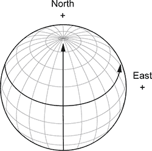
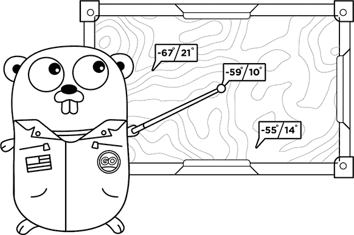
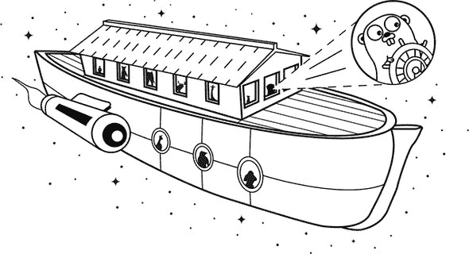

## 第 5 单元。状态和行为

在 Go 中，值代表*状态*，例如门是打开还是关闭。函数和方法定义*行为*——对状态的操作，例如打开门。

随着程序的增大，它们变得越来越难以管理和维护，除非你有合适的工具。

如果有几个门可以独立打开或关闭，将状态和行为捆绑在一起是有帮助的。编程语言还允许你表达抽象的概念，例如*可以打开的东西*。然后在炎热的夏日，你可以打开所有可以打开的东西，无论是门还是窗户。

有很多大词来描述这些概念：面向对象、封装、多态和组合。本单元的课程旨在阐明这些概念，并展示 Go 在面向对象设计方面相当独特的方法。

## 第 21 课。一点结构体

阅读完第 21 课后，你将能够

+   给火星上的坐标一点结构体

+   将结构体编码为流行的 JSON 数据格式

一个车辆由许多部分组成，这些部分可能具有相关的值（或状态）。发动机正在运行，车轮在转动，电池完全充电。为每个值使用单独的变量就像车辆在商店中拆解一样。同样，一栋建筑可能有打开的窗户和未锁的门。为了组装部件或构建结构，Go 提供了*结构体*类型。


**考虑这一点**

而集合是同一类型，*结构体*允许你将不同的事物组合在一起。环顾四周。你看到了什么可以用结构体来表示？


### 21.1. 声明一个结构体

一对坐标是采用一点结构的良好候选。纬度和经度总是一起出现。在一个没有结构体的世界中，计算两个位置之间距离的函数需要两对坐标：

```
func distance(lat1, long1, lat2, long2 float64) float64
```

虽然这确实可行，但传递独立的坐标容易出错，而且非常繁琐。纬度和经度是一个单一的单位，结构体允许你将它们视为这样的单位。

下一个列表中的`curiosity`结构体使用浮点字段声明纬度和经度。要为字段赋值或访问字段的值，使用带有变量名*点*字段名的*点表示法*，如下所示。

##### 列表 21.1.介绍一点结构体：struct.go

```
var curiosity struct {
    lat  float64
    long float64
}

curiosity.lat = -4.5895                         *1*
curiosity.long = 137.4417                       *1*

fmt.Println(curiosity.lat, curiosity.long)      *2*
fmt.Println(curiosity)                          *3*
```

+   ***1* 将值赋给结构体的字段**

+   ***2* 打印 -4.5895 137.4417**

+   ***3* 打印 {-4.5895 137.4417}**


##### 注意

`Print`函数族将显示结构体的内容。


火星好奇号探测器从布拉德伯里着陆点开始其旅程，位于南纬 4°35’22.2”，东经 137°26’30.1”。在第 21.1 节中，布拉德伯里着陆点的纬度和经度以*十进制度数*表示，北纬为正值，东经为正值，如图 21.1 节所示。

##### 图 21.1\. 十进制度数的纬度和经度




**快速检查 21.1**

> **1**
> 
> 结构体相较于单个变量有什么优势？
> 
> **2**
> 
> Bradbury Landing 大约在火星“海平面”下方 4,400 米。如果 `curiosity` 有一个海拔字段，你会如何将其值设置为 -4400？

|  |

**QC 21.1 答案**

> **1**
> 
> 结构体将相关值组合在一起，使得传递它们变得更加简单且错误率更低。
> 
> **2**
> 
> ```
> curiosity.altitude = -4400
> ```


### 21.2\. 使用类型重复使用结构体

如果你需要具有相同字段的多余结构体，你可以定义一个类型，就像第 13 课中的 `celsius` 类型一样。以下列表中声明的 `location` 类型用于将 Spirit 探索车放置在 Columbia Memorial Station，并将 Opportunity 探索车放置在 Challenger Memorial Station。

##### 列表 21.2\. 位置类型：location.go

```
type location struct {
    lat  float64
    long float64
}

var spirit location                    *1*
spirit.lat = -14.5684
spirit.long = 175.472636

var opportunity location               *1*
opportunity.lat = -1.9462
opportunity.long = 354.4734

fmt.Println(spirit, opportunity)       *2*
```

+   ***1* 重复使用位置类型**

+   ***2* 打印 {-14.5684 175.472636} {-1.9462 354.4734}**


**快速检查 21.2**

> **Q1:**
> 
> 你会如何修改列表 21.1 中的代码以使用 Curiosity 探索车在 Bradbury Landing 的 `location` 类型？

|  |

**QC 21.2 答案**

> **1:**
> 
> ```
> var curiosity location
> curiosity.lat = -4.5895
> curiosity.long = 137.4417
> ```


### 21.3\. 使用复合字面量初始化结构体

初始化结构体的复合字面量有两种不同的形式。在列表 21.3 中，`opportunity` 和 `insight` 变量使用字段值对进行初始化。字段可以以任何顺序排列，未列出的字段将保留其类型的零值。这种形式可以容忍变化，即使在结构体中添加字段或重新排序字段，它也能继续正确工作。如果 `location` 类型增加了一个海拔字段，`opportunity` 和 `insight` 将默认为海拔零。

##### 列表 21.3\. 带字段值对的复合字面量：struct-literal.go

```
type location struct {
    lat, long float64
}

opportunity := location{lat: -1.9462, long: 354.4734}
fmt.Println(opportunity)                               *1*

insight := location{lat: 4.5, long: 135.9}
fmt.Println(insight)                                   *2*
```

+   ***1* 打印 {-1.9462 354.4734}**

+   ***2* 打印 {4.5 135.9}**

列表 21.4 中的复合字面量没有指定字段名称。相反，必须为结构体定义中列出的每个字段提供值，顺序与结构体定义中的顺序相同。这种形式最适合稳定且只有少量字段的类型。如果 `location` 类型增加了一个海拔字段，`spirit` 必须为海拔指定一个值，以便程序能够编译。混淆 `lat` 和 `long` 的顺序不会导致编译器错误，但程序将不会产生正确的结果。

##### 列表 21.4\. 仅带值的复合字面量：struct-literal.go

```
spirit := location{-14.5684, 175.472636}
fmt.Println(spirit)                         *1*
```

+   ***1* 打印 {-14.5684 175.472636}**

无论你如何初始化结构体，你都可以通过在 `%v` 格式动词前加上加号 `+` 来修改它，以打印出字段名称，如下一列表所示。这对于检查大型结构体特别有用。

##### 列表 21.5\. 打印结构体的键：struct-literal.go

```
curiosity := location{-4.5895, 137.4417}
fmt.Printf("%v\n", curiosity)              *1*
fmt.Printf("%+v\n", curiosity)             *2*
```

+   ***1* 打印 {-4.5895 137.4417}**

+   ***2* 打印 {lat:-4.5895 long:137.4417}**


**快速检查 21.3**

> **Q1:**
> 
> 在哪些方面，字段值复合字面量语法比仅值的形式更可取？

|  |

**QC 21.3 答案**

> **1:**
> 
> 1.  字段可以按任何顺序列出。
> 1.  
> 1.  字段是可选的，如果没有列出，则采用零值。
> 1.  
> 1.  在重新排序或添加字段到结构声明时，不需要进行任何更改。


### 21.4\. 结构被复制

当好奇号探测器从布拉德伯里着陆点向东前往耶洛奈夫湾时，布拉德伯里着陆点的位置在现实生活中，以及在下一条列表中都没有改变。`curiosity` 变量使用 `bradbury` 中包含的值的副本进行初始化，因此这些值独立变化。

##### 列表 21.6\. 赋值会创建一个副本：struct-value.go

```
bradbury := location{-4.5895, 137.4417}
curiosity := bradbury

curiosity.long += 0.0106                *1*

fmt.Println(bradbury, curiosity)        *2*
```

+   ***1* 向东前往耶洛奈夫湾**

+   ***2* 打印 {-4.5895 137.4417} {-4.5895 137.4523}**


**快速检查 21.4**

> **Q1:**
> 
> 如果将 `curiosity` 传递给一个操作 `lat` 或 `long` 的函数，调用者会看到这些更改吗？

|  |

**QC 21.4 答案**

> **1:**
> 
> 不，函数将接收 `curiosity` 的一个副本，就像数组一样。


### 21.5\. 结构切片

结构切片 `[]struct` 是一个包含零个或多个值（一个切片）的集合，其中每个值基于一个结构，而不是像 `float64` 这样的原始类型。

如果一个程序需要一个火星探测车的着陆点集合，那么以下列表所示的两个单独的纬度和经度切片的方式是不正确的。

##### 列表 21.7\. 两个浮点数切片：slice-struct.go

```
lats := []float64{-4.5895, -14.5684, -1.9462}
longs := []float64{137.4417, 175.472636, 354.4734}
```

这已经看起来很糟糕了，尤其是在本课程早期引入的位置结构的基础上。现在想象一下，添加更多用于海拔等的切片。编辑前一个列表时的错误很容易导致切片之间的数据错位，甚至不同长度的切片。

一个更好的解决方案是创建一个包含每个值都是一个结构的单个切片。然后每个位置都是一个单独的单元，可以根据需要扩展着陆点的名称或其他字段，如下一个列表所示。

##### 列表 21.8\. 位置的一个切片：slice-struct.go

```
type location struct {
    name string
    lat  float64
    long float64
}

locations := []location{
    {name: "Bradbury Landing", lat: -4.5895, long: 137.4417},
    {name: "Columbia Memorial Station", lat: -14.5684, long: 175.472636},
    {name: "Challenger Memorial Station", lat: -1.9462, long: 354.4734},
}
```


**快速检查 21.5**

> **Q1:**
> 
> 使用多个相互关联的切片有什么危险？

|  |

**QC 21.5 答案**

> **1:**
> 
> 很容易导致数据在切片之间错位。


### 21.6\. 将结构编码为 JSON

JavaScript 对象表示法，或 JSON (json.org)，是一种由 Douglas Crockford 推广的标准数据格式。它基于 JavaScript 语言的子集，但在其他编程语言中得到广泛支持。JSON 通常用于 Web API（应用程序编程接口），包括提供好奇号探测器天气数据的 MAAS API ([github.com/ingenology/mars_weather_api](http://github.com/ingenology/mars_weather_api))。

`json`包中的`Marshal`函数在列表 21.9 中用于将`location`中的数据编码成 JSON 格式。`Marshal`返回 JSON 数据作为字节，这些字节可以通过网络发送或转换为字符串以供显示。它也可能返回一个错误，这是一个在课程 28 中讨论的主题。

##### 列表 21.9. 编码位置：json.go

```
package main

import (
    "encoding/json"
    "fmt"
    "os"
)

func main() {
    type location struct {
        Lat, Long float64                      *1*
     }

    curiosity := location{-4.5895, 137.4417}

    bytes, err := json.Marshal(curiosity)
    exitOnError(err)

    fmt.Println(string(bytes))                 *2*
 }

// exitOnError prints any errors and exits.
func exitOnError(err error) {
    if err != nil {
        fmt.Println(err)
        os.Exit(1)
    }
}
```

+   ***1* 字段必须以大写字母开头。**

+   ***2* 打印 {“Lat”:-4.5895,“Long”:137.4417}**

注意，JSON 键与`location`结构体的字段名相匹配。为了使这生效，`json`包要求字段必须导出。如果`Lat`和`Long`以小写字母开头，输出将是`{}`。


**快速检查 21.6**

> **Q1:**
> 
> JSON 的缩写是什么？

|  |

**QC 21.6 答案**

> **1:**
> 
> JSON 代表 JavaScript 对象表示法。


### 21.7. 使用 struct 标签自定义 JSON

Go 的 `json` 包要求字段以大写字母开头，并且多词字段名按照惯例使用 *CamelCase*。你可能希望 JSON 键使用 *snake*_*case*，尤其是在与 Python 或 Ruby 交互时。结构体的字段可以用你希望 `json` 包使用的字段名进行标记。

从列表 21.9 到列表 21.10 的唯一变化是包含了改变`Marshal`函数输出的*struct 标签*。注意，`Lat`和`Long`字段仍然必须导出，以便`json`包能够看到它们。

##### 列表 21.10. 自定义位置字段：json-tags.go

```
type location struct {
    Lat  float64 `json:"latitude"`           *1*
    Long float64 `json:"longitude"`          *1*
}

curiosity := location{-4.5895, 137.4417}

bytes, err := json.Marshal(curiosity)
exitOnError(err)

fmt.Println(string(bytes))                   *2*
```

+   ***1* Struct 标签改变了输出。**

+   ***2* 打印 {“latitude”:-4.5895,“longitude”:137.4417}**

Struct 标签是与结构体字段相关联的普通字符串。原始字符串字面量（``）更可取，因为引号不需要用反斜杠转义，就像在不太易读的`"json:"latitude\""`中那样。

Struct 标签的格式为`key:"value"`，其中键通常是包的名称。为了同时自定义 JSON 和 XML 中的`Lat`字段，struct 标签将是`json:"latitude" xml:"latitude"`。

如其名所示，struct 标签仅用于结构体的字段，尽管 `json.Marshal` 也会编码其他类型。


**快速检查 21.7**

> **Q1:**
> 
> 为什么在编码 JSON 时`Lat`和`Long`字段必须以大写字母开头？

|  |

**QC 21.7 答案**

> **1:**
> 
> 字段必须导出，以便 `json` 包能够看到它们。


### 摘要

+   结构将值组合成一个单元。

+   结构体是当分配或传递给函数时复制的值。

+   复合字面量提供了一种方便的方式来初始化结构体。

+   Struct 标签用额外的信息装饰导出字段，这些信息可以被包使用。

+   `json`包使用 struct 标签来控制字段名的输出。

让我们看看你是否理解了...

#### 实验：landing.go

编写一个程序，显示 列表 21.8 中三个火星着陆点的 JSON 编码。JSON 应包括每个着陆点的名称，并使用如 列表 21.10 所示的结构标签。

为了使输出更友好，请使用 `json` 包中的 `MarshalIndent` 函数。

## 第 22 课\. Go 没有类

在阅读 第 22 课 后，你将能够

+   编写提供结构化数据行为的方法

+   应用面向对象设计原则

Go 语言与经典语言不同。它没有类和对象，并且省略了继承等特性。然而，Go 语言仍然提供了应用面向对象设计思想所需的功能。本节课探讨了结构与方法的结合。

| |
| --- |

**考虑这一点**

*协同效应* 是在创业圈中经常听到的术语。它的意思是“大于其各部分的总和”。Go 语言有类型、类型上的方法和结构。三者结合，提供了类在其他语言中提供的许多功能，而不需要将新概念引入语言中。

有哪些其他方面的 Go 语言表现出这种结合以创造更伟大事物的特性？

| |
| --- |

### 22.1\. 将方法附加到结构体

在 第 13 课 中，你将 `celsius` 和 `fahrenheit` 方法附加到 `kelvin` 类型上以转换温度。同样，方法可以附加到你声明的其他类型上。无论底层类型是 `float64` 还是 `struct`，效果都是一样的。

首先，你需要声明一个类型，例如以下列表中的 `coordinate` 结构体。

##### 列表 22.1\. `coordinate` 类型：coordinate.go

```
// coordinate in degrees, minutes, seconds in a N/S/E/W hemisphere.
type coordinate struct {
    d, m, s float64
    h       rune
}
```

布拉德利着陆点位于 DMS 格式（度、分、秒）中的 4°35’22.2” S，137°26’30.1” E。一分钟有 60 秒 (`"`)，一度有 60 分钟 (`'`)，但这些分钟和秒代表的是一个位置，而不是时间。

以下列表中的十进制方法将把 DMS 坐标转换为十进制度。

##### 列表 22.2\. 十进制方法：coordinate.go

```
// decimal converts a d/m/s coordinate to decimal degrees.
func (c coordinate) decimal() float64 {
    sign := 1.0
    switch c.h {
    case 'S', 'W', 's', 'w':
        sign = -1
    }
    return sign * (c.d + c.m/60 + c.s/3600)
}
```

现在，你可以使用友好的 DMS 格式提供坐标，并将它们转换为十进制度以进行计算：

```
// Bradbury Landing: 4°35'22.2" S, 137°26'30.1" E
lat := coordinate{4, 35, 22.2, 'S'}
long := coordinate{137, 26, 30.12, 'E'}

fmt.Println(lat.decimal(), long.decimal())        *1*
```

+   ***1* 打印 -4.5895 137.4417**

| |
| --- |

**快速检查 22.1**

> **Q1:**
> 
> 十进制方法中的接收器是什么？

| |
| --- |
| |

**QC 22.1 答案**

> **1:**
> 
> 接收器是 `c`，类型为 `coordinate`。

| |
| --- |

### 22.2\. 构造函数

要从度、分、秒构建十进制度数的位置，可以使用 列表 22.2 中的十进制方法与复合字面量：

```
type location struct {
    lat, long float64
}

curiosity := location{lat.decimal(), long.decimal()}
```

如果需要一个比值列表更复杂的复合字面量，请考虑编写一个构造函数。以下列表声明了一个名为 `newLocation` 的构造函数。

##### 列表 22.3\. 构建新位置：construct.go

```
// newLocation from latitude, longitude d/m/s coordinates.
func newLocation(lat, long coordinate) location {
    return location{lat.decimal(), long.decimal()}
}
```

古典语言提供构造器作为特殊语言特性来构建对象。Python 有`_init_`，Ruby 有`initialize`，PHP 有`__construct()`。Go 没有构造器的语言特性。相反，`newLocation`是一个遵循约定的普通函数。


形式为`newType`或`NewType`的函数用于构建该类型的值。你将其命名为`newLocation`还是`NewLocation`取决于该函数是否导出以供其他包使用，如第 12 课所述。你像使用任何其他函数一样使用`newLocation`：

```
curiosity := newLocation(coordinate{4, 35, 22.2, 'S'},
coordinate{137, 26, 30.12, 'E'})
fmt.Println(curiosity)                   *1*
```

+   ***1* 打印 {-4.5895 137.4417}**

如果你想要从各种输入中构建位置，只需声明多个具有合适名称的函数——例如，对于度、分、秒和十进制度，可以分别命名为`newLocationDMS`和`newLocationDD`。


##### 注意

有时构造函数命名为`New`，例如`errors`包中的`New`函数。因为函数调用以所属包为前缀，所以将函数命名为`NewError`会被读作`errors.NewError`，而不是更简洁、更可取的`errors.New`。

|  |

**快速检查 22.2**

> **Q1:**
> 
> 你会给一个构建类型为`Universe`的变量的函数起什么名字？

|  |

**QC 22.2 答案**

> **1:**
> 
> 按照惯例，函数会被命名为`NewUniverse`，或者如果不导出，则为`newUniverse`。


### 22.3. 类的替代方案

Go 没有像 Python、Ruby 和 Java 这样的经典语言的`class`。然而，具有少量方法的结构可以完成许多相同的目的。如果你眯着眼睛看，它们并没有那么不同。

为了强调这一点，从头开始构建一个新的`world`类型。它将有一个表示行星半径的字段，你将使用它来计算两个位置之间的距离，如下所示。

##### 列表 22.4. 一个全新的`world`：world.go

```
type world struct {
    radius float64
}
```

火星的平均半径为 3,389.5 千米。与其将 3389.5 声明为一个常量，不如使用`world`类型将火星声明为许多可能的世界之一：

```
var mars = world{radius: 3389.5}
```

然后将一个`distance`方法附加到`world`类型上，使其能够访问`radius`字段。它接受两个参数，都是`location`类型，并将返回千米距离：

```
func (w world) distance(p1, p2 location) float64 {
                                                     *1*
}
```

+   ***1* 待办事项：使用 w.radius 进行一些数学运算**

这将涉及一些数学运算，所以请确保导入`math`包，如下所示：

```
import "math"
```

位置类型使用度来表示纬度和经度，但标准库中的数学函数使用弧度。鉴于一个圆有 360°或 2π弧度，以下函数执行必要的转换：

```
// rad converts degrees to radians.
func rad(deg float64) float64 {
    return deg * math.Pi / 180
}
```

现在进行距离计算。它使用包括正弦、余弦和反余弦在内的多个三角函数。如果你是数学爱好者，可以查找公式 ([www.movable-type.co.uk/scripts/latlong.html](http://www.movable-type.co.uk/scripts/latlong.html)) 并研究余弦定理来了解它是如何工作的。火星不是一个完美的球体，但这个公式在我们的目的上已经足够接近了：

```
// distance calculation using the Spherical Law of Cosines.
func (w world) distance(p1, p2 location) float64 {
    s1, c1 := math.Sincos(rad(p1.lat))
    s2, c2 := math.Sincos(rad(p2.lat))
    clong := math.Cos(rad(p1.long - p2.long))
    return w.radius * math.Acos(s1*s2+c1*c2*clong)       *1*
}
```

+   ***1* 使用世界的半径字段**

如果你感到困惑，不要担心。计算距离的程序需要数学，但只要 `distance` 返回正确的结果，完全理解所有数学工作是如何进行的就不是必须的（尽管这是一个好主意）。

说到结果，要看到 `distance` 的实际应用，声明一些位置并使用之前声明的 `mars` 变量：

```
spirit := location{-14.5684, 175.472636}
opportunity := location{-1.9462, 354.4734}

dist := mars.distance(spirit, opportunity)        *1*
fmt.Printf("%.2f km\n", dist)                     *2*
```

+   ***1* 在火星上使用距离方法**

+   ***2* 打印 9669.71 公里**

如果你得到不同的结果，请返回并确保代码的输入与显示的完全一致。缺少一个 `rad` 将导致计算错误。如果所有其他方法都失败了，请从 [github.com/nathany/get-programming-with-go](http://github.com/nathany/get-programming-with-go) 下载代码，并接受复制粘贴。

`distance` 方法是从地球的公式中采用的，但使用的是火星的半径。通过在 `world` 类型上声明 `distance` 为一个方法，你可以计算其他世界的距离，例如地球。每个行星的半径可以在 表 22.2 中找到，如行星事实表([nssdc.gsfc.nasa.gov/planetary/factsheet/](http://nssdc.gsfc.nasa.gov/planetary/factsheet/))所提供。

| |
| --- |

**快速检查 22.3**

> **Q1:**
> 
> 与更面向对象的方法相比，在 `world` 类型上声明距离方法有什么好处？

| |
| --- |
| |

**QC 22.3 答案**

> **1:**
> 
> 它提供了一种干净的方式来计算不同世界的距离，并且不需要将体积平均半径传递给距离方法，因为它已经可以访问 `w.radius`。

| |
| --- |

### 摘要

+   结合方法和结构提供了经典语言提供的大部分功能，而不引入新的语言特性。

+   构造函数是普通函数。

让我们看看你是否掌握了这个...

#### 实验：landing.go

使用 列表 22.1，22.2，和 22.3 中的代码编写一个程序，为 表 22.1 中的每个位置声明一个 `location`。以十进制度数打印出每个位置。

#### 实验：distance.go

使用 列表 22.4 中的 `distance` 方法编写一个程序，确定 表 22.1 中每对着陆点之间的距离。

哪两个着陆点是最近的？

哪两个位置相距最远？

为了确定以下位置之间的距离，你需要根据 表 22.2 声明其他世界：

+   找出从英国伦敦（51°30’N 0°08’W）到法国巴黎（48°51’N 2°21’E）的距离。

+   查找您所在城市到您国家首都的距离。

+   查找火星上夏普山（5°4’ 48”S, 137°51’E）和奥林匹斯山（18°39’N, 226°12’E）之间的距离。

##### 表 22.1. 火星着陆点

| 探测器或着陆器 | 着陆点 | 纬度 | 经度 |
| --- | --- | --- | --- |
| 精神号 | 哥伦比亚纪念站 | 14°34’6.2” S | 175°28’21.5” E |
| 机遇号 | 挑战者纪念站 | 1°56’46.3” S | 354°28’24.2” E |
| 好奇号 | 布拉德利着陆点 | 4°35’22.2” S | 137°26’30.1” E |
| 印象号 | 爱丽斯平原 | 4°30’0.0” N | 135°54’0” E |

##### 表 22.2. 各种行星的体积平均半径

| 行星 | 半径（km） |
| --- | --- |
| 水星 | 2439.7 |
| 金星 | 6051.8 |
| 地球 | 6371.0 |
| 火星 | 3389.5 |
| 木星 | 69911 |
| 土星 | 58232 |
| 天王星 | 25362 |
| 海王星 | 24622 |

## 第 23 课。组合和转发

阅读第 23 课后，您将能够

+   使用组合组合结构

+   将方法转发到其他方法

+   忘记经典继承

当你环顾四周的世界时，你所看到的一切都是由更小的部分组成的。人们倾向于有带有四肢的身体，四肢又依次有手指或脚趾。花朵有花瓣和花茎。火星探测器有轮子和履带，以及整个子系统，如火星探测器环境监测站（REMS）。每个部分都扮演着它的角色。

在面向对象的编程世界中，对象以相同的方式由更小的对象组成。计算机科学家称之为 *对象组合* 或简单地称为 *组合*。

仓鼠使用结构组合，Go 提供了一种称为 *嵌入* 的特殊语言特性来转发方法。本课通过 REMS 的虚构天气报告演示了组合和嵌入。




**考虑这一点**

设计层次结构可能很困难。动物王国的层次结构试图将具有相同行为的动物分组。一些哺乳动物在陆地上行走，而另一些则游泳，但蓝鲸也会哺乳幼崽。如何组织它们？改变层次结构也可能很困难，因为即使是微小的变化也可能产生广泛的影响。

组合是一种更简单、更灵活的方法：实现行走、游泳、哺乳和其他行为，并将适当的与每种动物关联。

作为额外奖励，如果您设计一个机器人，行走行为可以被重用。


### 23.1. 组合结构

天气报告包括各种数据，例如最高和最低温度、当前日（日），以及位置。一个简单的解决方案是在单个 `report` 结构中定义所有必要的字段，如下面的列表所示。

##### 列表 23.1. 没有组合：unorganized.go

```
type report struct {
    sol       int
    high, low float64
    lat, long float64
}
```

查看第 23.1 节中的列表 23.1，`report` 是由不同数据混合而成的。当报告增长到包括更多数据，例如风速和风向、气压、湿度、季节、日出和日落时，它就会变得难以操控。

幸运的是，你可以通过结构体和组合将相关字段分组在一起。以下列表定义了一个由温度和位置结构体组成的 `report` 结构体。

##### 列表 23.2\. 结构体内部的结构：compose.go

```
type report struct {
    sol         int
    temperature temperature          *1*
    location    location
}

type temperature struct {
    high, low celsius
}

type location struct {
    lat, long float64
}

type celsius float64
```

+   ***1* 温度字段是温度类型的结构体。**

定义了这些类型后，天气报告是通过以下方式构建的，即从位置和温度数据中构建：

```
bradbury := location{-4.5895, 137.4417}
t := temperature{high: -1.0, low: -78.0}
report := report{sol: 15, temperature: t,

location: bradbury}

fmt.Printf("%+v\n", report)                                     *1*

fmt.Printf("a balmy %v° C\n", report.temperature.high)          *2*
```

+   ***1* 打印 {sol:15 temperature:{high:-1 low:-78} location:{lat:-4.5895 long:137.4417}}**

+   ***2* 打印温暖 -1° C**

再看看 列表 23.2。注意，`high` 和 `low` 明确指的是温度，而 列表 23.1 中的相同字段则是不明确的。

通过将天气报告构建为较小类型，你可以通过在每个类型上挂载方法来进一步组织你的代码。例如，为了计算平均温度，你可以编写如下列表中所示的方法。

##### 列表 23.3\. 一种平均方法：average.go

```
func (t temperature) average() celsius {
    return (t.high + t.low) / 2
}
```

温度类型和平均方法可以独立于天气报告使用，如下所示：

```
t := temperature{high: -1.0, low: -78.0}
fmt.Printf("average %v° C\n", t.average())          *1*
```

+   ***1* 打印平均 -39.5° C**

当你创建一个天气报告时，平均方法可以通过链式调用温度字段来访问：

```
report := report{sol: 15, temperature: t}
fmt.Printf("average %v° C\n", report.temperature.average())        *1*
```

+   ***1* 打印平均 -39.5° C**

如果你想要通过 `report` 类型直接暴露平均温度，就没有必要在 列表 23.3 中重复逻辑。写一个将前向到实际实现的方法：

```
func (r report) average() celsius {
    return r.temperature.average()
}
```

使用从报告到温度的前向方法，你可以在围绕较小类型结构代码的同时方便地访问 `report.average()`。本节课的剩余部分将探讨一个承诺使方法前向无懈可击的 Go 特性。


**快速检查 23.1**

> **Q1:**
> 
> 将 列表 23.1 与 23.2 进行比较。你更喜欢哪种代码，为什么？

|  |

**QC 23.1 答案**

> **1:**
> 
> 列表 23.2 中的结构体组织得更好，通过将温度和位置拆分到单独的可重用结构体中。


### 23.2\. 前向方法

方法前向可以使使用方法更加方便。想象一下询问好奇号火星上的天气。它可以将你的请求 *前向* 到 REMS 系统，然后该系统再将你的请求前向到温度计以确定空气温度。有了前向，你不需要知道方法的路径——你只需询问好奇号。

不太方便的是手动编写像 列表 23.3 中的从一种类型到另一种类型的前向方法。这种重复的代码，称为 *样板代码*，除了增加混乱之外，没有任何帮助。

幸运的是，Go 会为你使用 *结构体嵌入* 进行方法前向。要在结构体中嵌入一个类型，指定类型而不指定字段名，如下面的列表所示。

##### 列表 23.4\. 结构体嵌入：embed.go

```
type report struct {
    sol         int
    temperature             *1*
    location
}
```

+   ***1* 报告中嵌入的温度类型**

所有在 `temperature` 类型上的方法都会自动通过 `report` 类型变得可访问：

```
report := report{
    sol:         15,
    location:    location{-4.5895, 137.4417},
    temperature: temperature{high: -1.0, low: -78.0},
}

fmt.Printf("average %v° C\n", report.average())         *1*
```

+   ***1* 打印平均 -39.5° C**

虽然没有指定字段名，但仍然存在一个与嵌入类型同名字段。你可以如下访问 `temperature` 字段：

```
fmt.Printf("average %v° C\n", report.temperature.average())        *1*
```

+   ***1* 打印平均 -39.5° C**

嵌入不仅转发方法。内部结构的字段可以从外部结构体访问。除了 `report.temperature.high`，你还可以如下使用 `report.high` 访问高温：

```
fmt.Printf("%v° C\n", report.high)                    *1*
report.high = 32
fmt.Printf("%v° C\n", report.temperature.high)        *2*
```

+   ***1* 打印 -1° C**

+   ***2* 打印 32° C**

正如你所见，`report.high` 字段的更改反映在 `report.temperature.high` 上。这只是访问相同数据的另一种方式。

你可以在结构体中嵌入任何类型，而不仅仅是结构体。在下面的列表中，`sol` 类型有一个基础类型为 `int`，但它就像 `location` 和 `temperature` 结构体一样被嵌入。

##### 列表 23.5\. 嵌入其他类型：sol.go

```
type sol int

type report struct {
    sol
    location
    temperature
}
```

声明在 `sol` 类型上的任何方法都可以通过 `sol` 字段或通过 `report` 类型访问：

```
func (s sol) days(s2 sol) int {
    days := int(s2 - s)
    if days < 0 {
        days = -days
    }
    return days
}

func main() {
    report := report{sol: 15}

    fmt.Println(report.sol.days(1446))       *1*
    fmt.Println(report.days(1446))           *1*
}
```

+   ***1* 打印 1431**

| |
| --- |

**快速检查 23.2**

> **1**
> 
> 哪些类型可以被嵌入到结构体中？
> 
> **2**
> 
> `report.lat` 是否有效？如果是，它在 列表 23.4 中引用的是哪个字段？

| |
| --- |
| |

**QC 23.2 答案**

> **1**
> 
> 任何类型都可以被嵌入到结构体中。
> 
> **2**
> 
> 是的，`report.lat` 等同于 `report.location.lat`。

| |
| --- |

### 23.3\. 名称冲突

天气报告工作正常。然后有人想知道一辆漫游车在两个位置之间旅行需要多少天。好奇号漫游车每天大约行驶 200 米，所以你向位置类型添加一个 `days` 方法来进行计算，如下面的列表所示。

##### 列表 23.6\. 同名方法：collision.go

```
func (l location) days(l2 location) int {
    // To-do: complicated distance calculation        *1*
    return 5
}
```

+   ***1* 见 课程 22。**

`report` 结构体嵌入 `sol` 和 `location`，这两个类型都有一个名为 `days` 的方法。

好消息是，如果你的代码中没有使用 `report` 上的 `days` 方法，一切都会继续正常工作。Go 编译器足够智能，只有在有问题时才会指出名称冲突。

如果正在使用 `report` 类型上的 `days` 方法，Go 编译器不知道是否应该将调用转发到 `sol` 上的方法还是 `location` 上的方法，因此它会报告一个错误：

```
d := report.days(1446)          *1*
```

+   ***1* 模糊选择器 report.days**

解决一个 *模糊选择器* 错误很简单。如果你在 `report` 类型上实现了 `days` 方法，它将优先于嵌入类型的 `days` 方法。你可以手动转发到你选择的嵌入类型，或者执行其他行为：

```
func (r report) days(s2 sol) int {
    return r.sol.days(s2)}
```

| |
| --- |

**这不是你想要的继承**

类似于 C++、Java、PHP、Python、Ruby 和 Swift 这样的经典语言可以使用组合，但它们也提供了一种称为继承的语言特性。

继承是思考软件设计的一种不同方式。使用 *继承*，漫游车是一种车辆类型，因此 *继承* 了所有车辆共享的功能。使用组合，漫游车有一个引擎和轮子以及各种其他部件，这些部件提供了漫游车所需的功能。卡车可以重用其中的一些部件，但没有任何车辆类型或层次结构从它派生出来。

组合通常被认为比使用继承构建的软件更灵活，允许更大的重用和更易于更改。这也不是一个新发现——这种智慧在 1994 年就已经发表了：

> *优先使用对象组合而不是类继承。*
> 
> *四人帮*，《设计模式：可重用面向对象软件元素》

当人们第一次看到嵌入时，有些人最初认为它与继承相同，但实际上并非如此。这不仅是一种不同的思考软件设计的方式，还存在一个微妙的技术差异。

在 列表 23.3 中的 `average()` 的接收者始终是 `temperature` 类型，即使通过 `report` 转发也是如此。使用 *委托* 或继承，接收者可以是 `report` 类型，但 Go 既没有委托也没有继承。不过，这没关系，因为继承不是必需的：

> *使用经典继承始终是可选的；它解决的问题都可以用其他方式解决。*
> 
> *Sandi Metz*，《Ruby 实用面向对象设计》

Go 是一种独立的新语言，能够摆脱过时的范式，因此它做到了。

| |
| --- |
| |

**快速检查 23.3**

> **Q1:**
> 
> 如果多个嵌入类型实现了同名方法，Go 编译器是否会报告错误？

| |
| --- |
| |

**QC 23.3 答案**

> **1:**
> 
> Go 编译器只有在方法被使用时才会报告错误。

| |
| --- |

### 摘要

+   组合是将大型结构分解成小型结构并将它们组合起来的技术。

+   嵌入允许外部结构访问内部结构的字段。

+   当你在结构中嵌入类型时，方法会自动转发。

+   Go 会通知你由嵌入引起的名称冲突，但只有当这些方法被使用时。

让我们看看你是否明白了……

#### 实验：gps.go

编写一个用于全球定位系统（GPS）的 `gps` 结构的程序。这个 `struct` 应该由当前位置、目的地位置和世界组成。

为 `location` 类型实现一个 `description` 方法，该方法返回一个包含名称、纬度和经度的字符串。`world` 类型应使用来自 第 22 课 的数学实现距离方法。

将两个方法附加到 `gps` 类型。首先，附加一个 `distance` 方法，用于查找当前位置和目的地位置之间的距离。然后实现一个 `message` 方法，返回一个字符串，描述剩余多少公里到达目的地。

作为最后一步，创建一个嵌入 `gps` 的 `rover` 结构体，并编写一个 `main` 函数来测试一切。初始化一个火星上的 GPS，当前位置为布拉德伯里着陆点 (-4.5895, 137.4417)，目的地为伊里斯平原 (4.5, 135.9)。然后创建一个 `curiosity` 探索车，并打印出它的 `message`（这会转发到 `gps`）。

## 第 24 课\. 接口

在阅读了第 24 课之后，你将能够

+   让你的类型说话

+   在实践中发现接口

+   在标准库中探索接口

+   从火星入侵中拯救人类

笔和纸并不是你用来记录最新洞察的唯一工具。附近的蜡笔和餐巾纸也可以起到作用。蜡笔、永久性记号笔和机械铅笔都可以满足你在便签本上写提醒、在建设纸上写标语或在日记中写条目的需求。写作非常灵活。

Go 标准库有一个用于书写的*接口*，名为 `Writer`。有了它，你可以写入文本、图像、逗号分隔值（CSV）、压缩存档等等。你可以将内容写入屏幕、磁盘上的文件或对网络请求的响应。借助单个接口，Go 可以将任何数量的内容写入任何数量的地方。`Writer` 非常灵活。

一支 0.5 毫米的蓝色墨水圆珠笔是一个*具体*的东西，而一支书写工具是一个更模糊的概念。使用接口，代码可以表达*抽象*概念，例如*一个会写字的东西*。想想它能做什么，而不是它是什么。这种思维方式，通过接口表达，将有助于你的代码适应变化。

| |
| --- |

**考虑这一点**

你周围有哪些*具体*的东西？你能用它们做什么？你能用其他东西做同样的事情吗？它们有什么共同的行为或接口？

| |
| --- |

### 24.1\. 接口类型

大多数类型都关注它们存储的值：整数用于整数，字符串用于文本，等等。接口类型不同。接口关注的是类型能做什么，而不是它持有的值。

方法表达了类型提供的行为，因此接口是用一组类型必须满足的方法声明的。以下列表声明了一个接口类型的变量。

##### 列表 24.1\. 一组方法：talk.go

```
var t interface {
    talk() string
}
```

变量 `t` 可以持有任何满足接口的任何类型的任何值。更具体地说，如果类型声明了一个名为 `talk` 的方法，该方法不接受任何参数并返回一个字符串，则该类型将满足接口。

以下列表声明了两个满足这些要求的类型。

##### 列表 24.2\. 满足接口：talk.go

```
type martian struct{}

func (m martian) talk() string {
    return "nack nack"
}

type laser int

func (l laser) talk() string {
    return strings.Repeat("pew ", int(l))
}
```

虽然 `martian` 是一个没有字段的结构体，而 `laser` 是一个整数，但两种类型都提供了一个 `talk` 方法，因此可以将它们分配给 `t`，如下所示。

##### 列表 24.3\. 多态：talk.go

```
var t interface {
    talk() string
}

t = martian{}
fmt.Println(t.talk())            *1*

t = laser(3)
fmt.Println(t.talk())            *2*
```

+   ***1* 打印 nack nack**

+   ***2* 打印 pew pew pew**

变形变量 `t` 能够变成 `martian` 或 `laser` 的形式。计算机科学家说，接口提供了 *多态性*，这意味着“多种形状”。


##### 注意

与 Java 不同，在 Go 中 `martian` 和 `laser` 并没有明确声明它们实现了接口。这种做法的好处将在本课的后面部分介绍。


通常，接口被声明为可重用的命名类型。有一个命名接口类型的命名约定：以 *-er* 后缀命名：*talker* 是任何会说话的东西，如以下列表所示。

##### 列表 24.4\. `talker` 类型：shout.go

```
type talker interface {
    talk() string
}
```

接口类型可以在其他类型可以使用的任何地方使用。例如，以下 `shout` 函数有一个类型为 `talker` 的参数。

##### 列表 24.5\. 大声说出所说的话：shout.go

```
func shout(t talker) {
    louder := strings.ToUpper(t.talk())
    fmt.Println(louder)
}
```

你可以使用满足 `talker` 接口的任何值与 `shout` 函数一起使用，无论是火星人还是激光，如以下列表所示。

##### 列表 24.6\. 大声喊叫：shout.go

```
shout(martian{})            *1*
shout(laser(2))             *2*
```

+   ***1* 打印 NACK NACK**

+   ***2* 打印 PEW PEW**

你传递给 `shout` 函数的参数必须满足 `talker` 接口。例如，`crater` 类型不满足 `talker` 接口，所以如果你期望碎石大声喊叫，Go 将拒绝编译你的程序：

```
type crater struct{}
shout(crater{})            *1*
```

+   ***1* 碎石没有实现 talker 接口（缺少 talk 方法）**

当你需要更改或扩展代码时，接口会展现出其灵活性。当你声明一个新的具有 `talk` 方法的类型时，`shout` 函数将与之配合工作。任何只依赖于接口的代码都可以保持不变，即使实现被添加和修改。

值得注意的是，接口可以与结构体嵌入一起使用，这是第 23 课中介绍的语言特性。例如，以下列表在 `starship` 中嵌入 `laser`。

##### 列表 24.7\. 嵌入满足接口：starship.go

```
type starship struct {
    laser
}

s := starship{laser(3)}

fmt.Println(s.talk())           *1*
shout(s)                        *2*
```

+   ***1* 打印 pew pew pew**

+   ***2* 打印 PEW PEW PEW**

当一艘星际飞船说话时，激光负责说话。嵌入 `laser` 给 `starship` 一个将转发到 `laser` 的 `talk` 方法。现在星际飞船也满足 `talker` 接口，允许它与 `shout` 一起使用。

> *组合和接口结合使用是一种非常强大的设计工具。*
> 
> *比尔·文纳，*JavaWorld*（见 [mng.bz/B5eg](http://mng.bz/B5eg)）*


**快速检查 24.1**

> **1**
> 
> 修改 列表 24.4 中的激光的 `talk` 方法，以防止火星人的枪支发射，从而拯救人类免受入侵。
> 
> **2**
> 
> 通过声明一个新的具有 `talk` 方法并返回“whir whir”的 `rover` 类型来扩展 列表 24.4。使用您的新的类型与 `shout` 函数一起使用。

|  |

**QC 24.1 答案**

> **1**
> 
> ```
> func (l laser) talk() string {
>     return strings.Repeat("toot ", int(l))
> }
> ```
> 
> **2**
> 
> ```
> type rover string
> 
> func (r rover) talk() string {
>     return string(r)
> }
> 
> func main() {
>     r := rover("whir whir")
>     shout(r)                      *1*
> }
> ```
> 
> +   ***1* 打印 WHIR WHIR**


### 24.2\. 发现接口

使用 Go 语言，你可以开始编写代码，并在编写过程中发现接口。任何代码都可以实现接口，即使是已经存在的代码。本节将带您通过一个示例进行说明。

以下列表从年份和小时数推导出一个虚构的 `stardate`。

##### 列表 24.8\. `Stardate` 计算：stardate.go

```
package main

import (
    "fmt"
    "time"
)

// stardate returns a fictional measure of time for a given date.
func stardate(t time.Time) float64 {
    doy := float64(t.YearDay())
    h := float64(t.Hour()) / 24.0
    return 1000 + doy + h
}

func main() {
    day := time.Date(2012, 8, 6, 5, 17, 0, 0, time.UTC)
    fmt.Printf("%.1f Curiosity has landed\n", stardate(day))        *1*
}
```

+   ***1* 打印 1219.2 Curiosity 已着陆**

列表 24.8 中的 `stardate` 函数仅限于地球日期。为了解决这个问题，下一列表声明了一个 `stardate` 接口。

##### 列表 24.9\. `Stardate` 接口：stardater.go

```
type stardater interface {
    YearDay() int
    Hour() int
}

// stardate returns a fictional measure of time.
func stardate(t stardater) float64 {
    doy := float64(t.YearDay())
    h := float64(t.Hour()) / 24.0
    return 1000 + doy + h
}
```

新的 `stardate` 函数在 列表 24.9 中继续使用地球日期，因为标准库中的 `time.Time` 类型满足 `stardater` 接口。Go 中的接口是隐式满足的，这在处理你未编写的代码时特别有帮助。

| |
| --- |

##### 注意

在像 Java 这样的语言中，这是不可能的，因为 `java.time` 需要明确声明它 `implements stardater`。

| |
| --- |

在 `stardater` 接口就位的情况下，列表 24.9 可以通过添加一个满足接口的 `sol` 类型来扩展，该类型具有 `YearDay` 和 `Hour` 方法，如以下列表所示。

##### 列表 24.10\. `Sol` 实现：stardater.go

```
type sol int

func (s sol) YearDay() int {
    return int(s % 668)               *1*
}

func (s sol) Hour() int {
    return 0                          *2*
}
```

+   ***1* 火星年中有 668 个火星日。**

+   ***2* 小时未知。**

现在，`stardate` 函数同时操作地球日期和火星日，如下一列表所示。

##### 列表 24.11\. 使用中：stardater.go

```
day := time.Date(2012, 8, 6, 5, 17, 0, 0, time.UTC)
fmt.Printf("%.1f Curiosity has landed\n", stardate(day))        *1*

s := sol(1422)
fmt.Printf("%.1f Happy birthday\n", stardate(s))                *2*
```

+   ***1* 打印 1219.2 Curiosity 已着陆**

+   ***2* 打印 1086.0 生日快乐**

| |
| --- |

**快速检查 24.2**

> **Q1:**
> 
> 隐式满足的接口有哪些优势？

| |
| --- |
| |

**QC 24.2 答案**

> **1:**
> 
> 你可以声明一个由你未编写的代码满足的接口，这提供了更多的灵活性。

| |
| --- |

### 24.3\. 满足接口

标准库导出了一些单方法接口，你可以在自己的代码中实现它们。

> *Go 鼓励使用组合而非继承，使用简单、通常只有一个方法的接口...这些接口作为组件之间干净、可理解的边界。*
> 
> *Rob Pike, “Go at Google: Language Design in the Service of Software Engineering” (see [talks.golang.org/2012/splash.article](http://talks.golang.org/2012/splash.article))*

例如，`fmt` 包声明了一个 `Stringer` 接口如下：

```
type Stringer interface {
    String() string
}
```

如果一个类型提供了一个 `String` 方法，`Println`、`Sprintf` 和其他方法将使用它。以下列表提供了一个 `String` 方法来控制 `fmt` 包如何显示位置。

##### 列表 24.12\. 满足 `Stringer`：stringer.go

```
package main

import "fmt"

// location with a latitude, longitude in decimal degrees.
type location struct {
    lat, long float64
}

// String formats a location with latitude, longitude.
func (l location) String() string {
    return fmt.Sprintf("%v, %v", l.lat, l.long)
}

func main() {
    curiosity := location{-4.5895, 137.4417}
    fmt.Println(curiosity)                       *1*
}
```

+   ***1* 打印 -4.5895, 137.4417**

除了 `fmt.Stringer`，标准库中流行的接口还包括 `io.Reader`、`io.Writer` 和 `json.Marshaler`。

| |
| --- |

##### 小贴士

`io.ReadWriter` 接口提供了一个类似于 第 23 课 中的结构嵌入的接口嵌入示例。与结构不同，接口没有字段或附加方法，因此接口嵌入节省了一些打字，但几乎没有其他好处。

| |
| --- |
| |

**快速检查 24.3**

> **Q1:**
> 
> 在`coordinate`类型上编写一个`String`方法，并使用它以更可读的格式显示坐标。
> 
> ```
> type coordinate struct {
>     d, m, s float64
>     h       rune
> }
> ```
> 
> 你的程序应该输出：`Elysium Planitia 位于北纬 4°30'0.0"，东经 135°54'0.0"处`

|  |

**QC 24.3 答案**

> **1:**
> 
> ```
> // String formats a DMS coordinate.
> func (c coordinate) String() string {
>     return fmt.Sprintf("%v°%v'%.1f\" %c", c.d, c.m, c.s, c.h)
> }
> 
> // location with a latitude, longitude in decimal degrees.
> type location struct {
>     lat, long coordinate
> }
> 
> // String formats a location with latitude, longitude.
> func (l location) String() string {
>     return fmt.Sprintf("%v, %v", l.lat, l.long)
> }
> 
> func main() {
>     elysium := location{
>         lat: coordinate{4, 30, 0.0, 'N'},
>         long: coordinate{135, 54, 0.0, 'E'},
>     }
>     fmt.Println("Elysium Planitia is at", elysium)            *1*
> }
> ```
> 
> +   ***1* 打印 Elysium Planitia 位于北纬 4°30’0.0” N，东经 135°54’0.0” E**


### 24.4. 概述

+   接口类型通过一组方法指定所需的行为。

+   任何包中的新或现有代码都会隐式满足接口。

+   结构将满足嵌入类型满足的接口。

+   按照标准库的示例，努力保持接口小巧。

让我们看看你是否掌握了这个...

#### 实验：marshal.go

编写一个程序，以 JSON 格式输出坐标，扩展先前的快速检查工作。JSON 输出应提供每个坐标的十进制度数（DD）以及度、分、秒格式：

```
{
    "decimal": 135.9,
    "dms": "135°54'0.0\" E",
    "degrees": 135,
    "minutes": 54,
    "seconds": 0,
    "hemisphere": "E"
}
```

这可以通过满足`json.Marshaler`接口来自定义 JSON，而不需要修改坐标结构。你编写的`MarshalJSON`方法可以使用`json.Marshal`。


##### 注意

要计算十进制度数，你需要使用第 22 课中引入的`decimal`方法。


## 第 25 课：火星动物庇护所

在遥远的未来，人类可能能够在目前这个尘土飞扬的红星球上舒适地生活。火星距离太阳更远，因此温度更低。加热这个星球可能是改造火星气候和表面的第一步。一旦水流开始流动，植物开始生长，就可以引入生物。

> *可以在热带种植树木；可以引入昆虫和一些小型动物。人类仍然需要气罩来提供氧气并防止肺部二氧化碳含量过高。*
> 
> *莱纳德·大卫，《火星：我们在红色星球上的未来》*

目前火星大气中大约有 96%的二氧化碳（参见[en.wikipedia.org/wiki/Atmosphere_of_Mars](http://en.wikipedia.org/wiki/Atmosphere_of_Mars)）。改变这一点可能需要非常非常长的时间。火星将仍然是一个不同的世界。

现在是时候发挥你的想象力了。你认为如果一艘装满地球动物的方舟被引入到经过改造的火星上会发生什么？随着气候适应以支持生命，可能会出现哪些生命形式？



你的任务是创建火星上第一个动物庇护所的模拟。制作几种动物类型。每种动物都应该有一个名字，并遵循`Stringer`接口以返回它们的名称。

每种动物都应该有移动和进食的方法。移动方法应返回移动的描述。进食方法应返回动物喜欢的随机食物名称。

实现昼夜循环，并运行模拟三个 24 小时日（72 小时）。所有动物应从日落睡到日出。对于每天中的每一小时，随机选择一个动物执行一个随机动作（移动或进食）。对于每个动作，打印出动物所执行动作的描述。

你的实现应该使用结构和接口。
