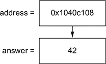
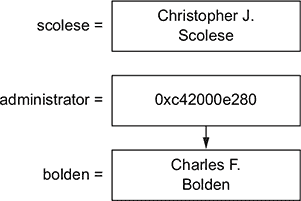
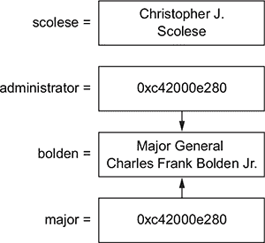
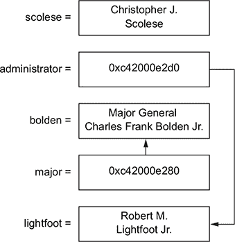

## 第 6 单元。向下进入地鼠洞

是时候动手实践，更深入地学习 Go 编程了。

你需要考虑内存的组织和共享方式，这将带来新的控制层次和责任。你会了解到 `nil` 可以是有益的，同时避免可怕的 *nil 指针解引用*。你还会看到在错误处理中表现出勤奋如何使你的程序更加可靠。

## 第 26 课。几个指针

阅读完 第 26 课 后，你将能够

+   声明和使用指针

+   理解指针和随机访问内存（RAM）之间的关系

+   知道何时使用——以及何时不使用——指针

在任何街区走一走，你很可能会遇到带有单独地址和街道标志的房屋，这些标志会指引你的方向。你可能会遇到一个关闭的商店，上面挂着道歉的标志：“抱歉，我们搬家了！”指针有点像商店橱窗里的标志，指示你前往不同的地址。


*指针* 是一个指向另一个变量地址的变量。在计算机科学中，指针是一种 *间接引用*，间接引用可以是一个强大的工具。

> *计算机科学中的所有问题都可以通过另一层间接引用来解决...*
> 
> *大卫·惠勒*

指针非常有用，但多年来它们与大量的焦虑相关联。过去的语言——特别是 C 语言——对安全性的强调很少。许多崩溃和安全漏洞都可以追溯到指针的误用。这导致了几个不向程序员暴露指针的语言的产生。

Go 确实有指针，但强调内存安全。Go 没有像 *悬垂指针* 这样的问题。这就像去你最喜欢的商店的地址，却发现它意外地被一个新赌场的停车场取代了。

如果你之前遇到过指针，深呼吸。这不会那么糟糕。如果你是第一次遇到，放松。Go 是一个学习指针的安全场所。


**考虑这一点**

就像指示访客前往新地址的商店招牌一样，指针指示计算机在哪里查找值。还有什么其他情况你会被指示去别处寻找？


### 26.1\. 和号和星号

Go 中的指针采用了 C 语言中广泛使用的语法。有两个符号需要注意，即和号（`&`）和星号（`*`），尽管星号具有双重作用，你很快就会看到。

*地址运算符*，由和号表示，确定变量在内存中的地址。变量将它们的值存储在计算机的 RAM 中，而存储值的地点被称为其 *内存地址*。以下列表以十六进制数字打印内存地址，尽管你的计算机上的地址会有所不同。

##### 列表 26.1\. 地址运算符：memory.go

```
answer := 42
fmt.Println(&answer)         *1*
```

+   ***1* 打印 0x1040c108**

这是计算机存储 42 的内存位置。幸运的是，你可以使用变量名 `answer` 来检索值，而不是使用计算机使用的内存地址。


##### **注意**

你不能取一个字面量字符串、数字或布尔值的地址。Go 编译器会对 `&42` 或 `&"another level of indirection"` 报错。


地址运算符 (`&`) 提供了一个值的内存地址。相反的操作称为 *解引用*，它提供了内存地址所引用的值。以下列表通过在 `address` 变量前加一个星号 (`*`) 来解引用 `address` 变量。

##### 列表 26.2\. 解引用运算符：memory.go

```
answer := 42
fmt.Println(&answer)       *1*

address := &answer
fmt.Println(*address)      *2*
```

+   ***1* 打印 0x1040c108**

+   ***2* 打印 42**

在前面的列表和 图 26.1 中，`address` 变量持有 `answer` 的内存地址。它不持有答案（42），但它知道在哪里可以找到它。


##### **注意**

C 中的内存地址可以通过指针算术（例如 `address++`）进行操作，但 Go 禁止不安全操作。


##### 图 26.1\. `address` 指向 `answer`




**快速检查 26.1**

> **1**
> 
> `fmt.Println(*&answer)` 对于 列表 26.2 显示了什么？
> 
> **2**
> 
> Go 编译器如何知道解引用和乘法的区别？

|  |

**QC 26.1 答案**

> **1**
> 
> 它打印 42，因为内存地址 (`&`) 被解引用 (`*`) 回到值。
> 
> **2**
> 
> 乘法是一个 *中缀* 运算符，需要两个值，而解引用则前缀一个单个变量。


#### 26.1.1\. 指针类型

指针存储内存地址。

在 列表 26.2 中的 `address` 变量是一个类型为 `*int` 的指针，如以下列表中的 `%T` 格式动词所揭示。

##### 列表 26.3\. 指针类型：type.go

```
answer := 42
address := &answer

fmt.Printf("address is a %T\n", address)      *1*
```

+   ***1* 打印地址是 *int**

`*int` 中的星号表示该类型是一个指针。在这种情况下，它可以指向其他类型为 `int` 的变量。

指针类型可以出现在任何使用类型的地方，包括变量声明、函数参数、返回类型、结构字段类型等。在以下列表中，声明 `home` 中的星号 (`*`) 表示它是一个指针类型。

##### 列表 26.4\. 声明指针：home.go

```
canada := "Canada"

var home *string
fmt.Printf("home is a %T\n", home)       *1*

home = &canada
fmt.Println(*home)                       *2*
```

+   ***1* 打印 home 是 *string**

+   ***2* 打印 Canada**


##### **提示**

在类型前加一个星号表示指针类型，而在变量名前加一个星号用于解引用变量所指向的值。


前一个列表中的 `home` 变量可以指向任何类型为 `string` 的变量。然而，Go 编译器不允许 `home` 指向任何其他类型的变量，例如 `int`。


##### **注意**

C 的类型系统很容易相信一个内存地址持有不同的类型。这在某些时候可能很有用，但 Go 再次避免了潜在的不安全操作。

|  |

**快速检查 26.2**

> **1**
> 
> 你将使用什么代码来声明一个名为 `address` 的变量，该变量可以指向整数？
> 
> **2**
> 
> 你如何在代码列表 26.4 中区分指针类型的声明和指针解引用？

| |
| --- |
| |

**QC 26.2 答案**

> **1**
> 
> `var address *int`
> 
> **2**
> 
> 在类型前加一个星号表示指针类型，而将星号加在变量名前用于解引用变量指向的值。

| |
| --- |

### 26.2\. 指针用于指向

Charles Bolden 于 2009 年 7 月 17 日成为美国国家航空航天局的管理员。他的前任是 Christopher Scolese。通过用指针表示管理员角色，以下列表可以将 `administrator` 指向任何担任该角色的人（参见图 26.2）。

##### 列表 26.5\. 美国国家航空航天局管理员：nasa.go

```
var administrator *string

scolese := "Christopher J. Scolese"
administrator = &scolese
fmt.Println(*administrator)          *1*

bolden := "Charles F. Bolden"
administrator = &bolden
fmt.Println(*administrator)          *2*
```

+   ***1* 打印 Christopher J. Scolese**

+   ***2* 打印 Charles F. Bolden**

##### 图 26.2\. `administrator` 指向 `bolden`



由于管理员变量指向 `bolden` 而不是存储副本，因此可以在一个地方修改 `bolden` 的值：

```
bolden = "Charles Frank Bolden Jr."
fmt.Println(*administrator)          *1*
```

+   ***1* 打印 Charles Frank Bolden Jr.**

还可以通过解引用 `administrator` 来间接更改 `bolden` 的值：

```
*administrator = "Maj. Gen. Charles Frank Bolden Jr."
fmt.Println(bolden)                                    *1*
```

+   ***1* 打印 Maj. Gen. Charles Frank Bolden Jr.**

将 `major` 分配给 `administrator` 将导致一个新的指针，它也指向 `bolden` 字符串（参见图 26.3）：

```
major := administrator
*major = "Major General Charles Frank Bolden Jr."
fmt.Println(bolden)                                *1*
```

+   ***1* 打印 Major General Charles Frank Bolden Jr.**

##### 图 26.3\. `administrator` 和 `major` 指向 `bolden`



`major` 和 `administrator` 指针都持有相同的内存地址，因此它们是相等的：

```
fmt.Println(administrator == major)          *1*
```

+   ***1* 打印 true**

Charles Bolden 于 2017 年 1 月 20 日被 Robert M. Lightfoot Jr. 接替。在此更改之后，`administrator` 和 `major` 不再指向相同的内存地址（参见图 26.4）：

```
lightfoot := "Robert M. Lightfoot Jr."
administrator = &lightfoot
fmt.Println(administrator == major)          *1*
```

+   ***1* 打印 false**

##### 图 26.4\. `administrator` 现在指向 `lightfoot`



将 `major` 的解引用值分配给另一个变量会创建一个字符串的副本。在创建副本后，对 `bolden` 的直接和间接修改都不会影响 `charles` 的值，反之亦然：

```
charles := *major
*major = "Charles Bolden"
fmt.Println(charles)          *1*
fmt.Println(bolden)           *2*
```

+   ***1* 打印 Major General Charles Frank Bolden Jr.**

+   ***2* 打印 Charles Bolden**

如果两个变量包含相同的字符串，它们被认为是相等的，就像以下代码中的 `charles` 和 `bolden` 一样。即使它们有不同的内存地址，这也是这种情况：

```
charles = "Charles Bolden"
fmt.Println(charles == bolden)           *1*
fmt.Println(&charles == &bolden)         *2*
```

+   ***1* 打印 true**

+   ***2* 打印 false**

在本节中，通过解引用 `administrator` 和 `major` 指针间接修改了 `bolden` 的值。这展示了指针可以做什么，尽管在这种情况下直接将值分配给 `bolden` 会更简单。

| |
| --- |

**快速检查 26.3**

> **1**
> 
> 在代码列表 26.5 中使用指针有什么好处？
> 
> **2**
> 
> 描述语句 `major := administrator` 和 `charles := *major` 的作用。

| |
| --- |
| |

**QC 26.3 答案**

> **1**
> 
> 变更可以在一个地方进行，因为`administrator`变量指向一个人而不是存储一个副本。
> 
> **2**
> 
> 变量`major`是一个新的`*string`指针，它持有与`administrator`相同的内存地址，而`charles`是一个包含`major`所指向的值的副本的字符串。


#### 26.2.1\. 指向结构体

指针经常与结构体一起使用。因此，Go 语言的设计者选择为结构体的指针提供一些人体工程学上的便利。

与字符串和数字不同，复合字面量可以前缀地址运算符。在以下列表中，`timmy`变量持有指向`person`结构的内存地址。

##### 列表 26.6\. 人员结构：struct.go

```
type person struct {
    name, superpower string
    age              int
}

timmy := &person{
    name: "Timothy",
    age:  10,
}
```

此外，访问结构体的字段时不需要解引用结构体。以下列表比编写`(*timmy).superpower`更可取。

##### 列表 26.7\. 复合字面量：struct.go

```
timmy.superpower = "flying"

fmt.Printf("%+v\n", timmy)          *1*
```

+   ***1* 打印 &{name:Timothy superpower:flying age:10}**


**快速检查 26.4**

> **1**
> 
> 地址运算符的有效用途是什么？
> 
> 1.  文字字符串：`&"Timothy"`
> 1.  
> 1.  文字整数：`&10`
> 1.  
> 1.  复合字面量：`&person{name: "Timothy"}`
> 1.  
> 1.  所有上述内容
> 1.  
> **2**
> 
> `timmy.superpower`和`(*timmy).superpower`之间有什么区别？

|  |

**QC 26.4 答案**

> **1**
> 
> 地址运算符对变量名和复合字面量有效，但对文字字符串或数字无效。
> 
> **2**
> 
> 由于 Go 自动解引用字段，因此没有功能上的差异，但`timmy.superpower`更容易阅读，因此更可取。


#### 26.2.2\. 指向数组

与结构体一样，数组的复合字面量可以前缀地址运算符（`&`）以创建指向数组的新的指针。数组也提供自动解引用，如下所示。

##### 列表 26.8\. 指向数组的指针：superpowers.go

```
superpowers := &[3]string{"flight", "invisibility", "super strength"}

fmt.Println(superpowers[0])            *1*
fmt.Println(superpowers[1:2])          *2*
```

+   ***1* 打印 flight**

+   ***2* 打印 [invisibility]**

在上一个列表中，数组在索引或切片时自动解引用。无需编写更繁琐的`(*superpowers)[0]`。


##### 注意

与 C 语言不同，Go 中的数组和指针是完全独立的类型。


切片和映射的复合字面量也可以前缀地址运算符（`&`），但没有自动解引用。


**快速检查 26.5**

> **Q1:**
> 
> 除了`superpowers`是数组的指针之外，还有其他写法可以写`(*superpowers)[2:]`吗？

|  |

**QC 26.5 答案**

> **1:**
> 
> 由于数组自动解引用，`superpowers[2:]`的写法相同。


### 26.3\. 启用修改

指针用于在函数和方法边界之间启用修改。

#### 26.3.1\. 指针作为参数

在 Go 中，函数和方法参数是通过值传递的。这意味着函数始终操作传递参数的副本。当传递指针到函数时，函数接收传递参数的内存地址的副本。通过取消引用内存地址，函数可以修改指针指向的值。

在 列表 26.9 中，声明了一个参数类型为 `*person` 的 `birthday` 函数。这允许函数体取消引用指针并修改它指向的值。与 列表 26.7 一样，不需要显式取消引用 `p` 变量来访问 `age` 字段。下面列表中的语法比 `(*p).age++` 更可取。

##### 列表 26.9\. 函数参数：birthday.go

```
type person struct {
    name, superpower string
    age              int
}

func birthday(p *person) {
    p.age++
}
```

`birthday` 函数要求调用者传递一个人的指针，如下面的列表所示。

##### 列表 26.10\. 函数参数：birthday.go

```
rebecca := person{
    name:       "Rebecca",
    superpower: "imagination",
    age:        14,
}

birthday(&rebecca)

fmt.Printf("%+v\n", rebecca)         *1*
```

+   ***1* 打印 {name:Rebecca superpower:imagination age:15}**

| |
| --- |

**快速检查 26.6**

> **1**
> 
> 什么代码会返回 Timothy 11？请参阅 列表 26.6。
> 
> 1.  `birthday(&timmy)`
> 1.  
> 1.  `birthday(timmy)`
> 1.  
> 1.  `birthday(*timmy)`
> 1.  
> **2**
> 
> 如果 `birthday(p person)` 函数不使用指针，Rebecca 会是什么年龄？

| |
| --- |
| |

**QC 26.6 答案**

> **1**
> 
> `timmy` 变量已经是指针，所以正确答案是 b. `birthday(timmy)`。
> 
> **2**
> 
> 如果 `birthday` 不使用指针，Rebecca 将永远保持 14 岁。

| |
| --- |

#### 26.3.2\. 指针接收者

方法接收者类似于参数。在下一个列表中，`birthday` 方法使用指针作为接收者，这使得方法可以修改一个人的属性。这种行为就像 列表 26.9 中的 `birthday` 函数。

##### 列表 26.11\. 指针接收者：method.go

```
type person struct {
    name string
    age  int
}

func (p *person) birthday() {
    p.age++
}
```

在下面的列表中，声明一个指针并调用 `birthday` 方法会增加 Terry 的年龄。

##### 列表 26.12\. 使用指针的方法调用：method.go

```
terry := &person{
    name: "Terry",
    age:  15,
}
terry.birthday()
fmt.Printf("%+v\n", terry)        *1*
```

+   ***1* 打印 &{name:Terry age:16}**

或者，下一个列表中的方法调用没有使用指针，但它仍然有效。Go 在使用点符号调用方法时，会自动确定变量的地址（`&`），因此不需要编写 `(&nathan).birthday()`。

##### 列表 26.13\. 无指针的方法调用：method.go

```
nathan := person{
    name: "Nathan",
    age:  17,
}
nathan.birthday()
fmt.Printf("%+v\n", nathan)           *1*
```

+   ***1* 打印 {name:Nathan age:18}**

无论是否使用指针调用，列表 26.11 中声明的 `birthday` 方法都必须指定指针接收者——否则，`age` 不会增加。

结构体通常以指针的形式传递。对于 `birthday` 方法来说，修改一个人的属性而不是创建一个全新的个人是有意义的。然而，并非每个结构体都应该被修改。标准库在 `time` 包中提供了一个很好的例子。`time.Time` 类型的方法从不使用指针接收者，而是更喜欢返回一个新的时间，如下一个列表所示。毕竟，明天是新的日子。

##### 列表 26.14\. 新的一天：day.go

```
const layout = "Mon, Jan 2, 2006"

day := time.Now()
tomorrow := day.Add(24 * time.Hour)

fmt.Println(day.Format(layout))                  *1*
fmt.Println(tomorrow.Format(layout))             *2*
```

+   ***1* 打印 Tue, Nov 10, 2009**

+   ***2* 打印 Wed, Nov 11, 2009**


##### 小贴士

你应该始终如一地使用指针接收器。如果某些方法需要指针接收器，则使用该类型的所有方法的指针接收器（参见 [golang.org/doc/faq#methods_on_values_or_pointers](http://golang.org/doc/faq#methods_on_values_or_pointers)）。

|  |

**快速检查 26.7**

> **Q1:**
> 
> 你如何知道 `time.Time` 从不使用指针接收器？

|  |

**QC 26.7 答案**

> **1:**
> 
> 列表 26.14 中的代码没有揭示 `Add` 方法是否使用指针接收器，因为点符号在这两种情况下都是相同的。最好查看 `time.Time` 方法的文档（参见 [golang.org/pkg/time/#Time](http://golang.org/pkg/time/#Time)）。


#### 26.3.3\. 内部指针

Go 提供了一个方便的功能，称为 *内部指针*，用于确定结构体内部字段的内存地址。以下列表中的 `levelUp` 函数修改了一个 `stats` 结构体，因此需要使用指针。

##### 列表 26.15\. `levelUp` 函数：interior.go

```
type stats struct {
    level             int
    endurance, health int
}

func levelUp(s *stats) {
    s.level++
    s.endurance = 42 + (14 * s.level)
    s.health = 5 * s.endurance
}
```

Go 中的地址操作符可以用来指向结构体中的一个字段，如下面的列表所示。

##### 列表 26.16\. 内部指针：interior.go

```
type character struct {
    name  string
    stats stats
}

player := character{name: "Matthias"}
levelUp(&player.stats)

fmt.Printf("%+v\n", player.stats)          *1*
```

+   ***1* 打印 {level:1 endurance:56 health:280}**

`character` 类型在结构定义中没有任何指针，但在需要时可以获取任何字段的内存地址。代码 `&player.stats` 提供了指向结构体内部的指针。


**快速检查 26.8**

> **Q1:**
> 
> 什么是内部指针？

|  |

**QC 26.8 答案**

> **1:**
> 
> 指向结构体内部字段的指针。这是通过在结构体的字段上使用地址操作符来实现的，例如 `&player.stats`。


#### 26.3.4\. 修改数组

尽管切片通常比数组更受欢迎，但在不需要更改其长度的情况下，使用数组可能是合适的。第 16 课 中的棋盘就是这样的一个例子。以下列表演示了指针如何允许函数修改数组的元素。

##### 列表 26.17\. 重置棋盘：array.go

```
func reset(board *[8][8]rune) {
    board[0][0] = 'r'
    // ...
}

func main() {
    var board [8][8]rune
    reset(&board)

    fmt.Printf("%c", board[0][0])         *1*
}
```

+   ***1* 打印 r**

在 第 20 课 中，对康威生命游戏的建议实现使用了切片，尽管世界的大小是固定的。有了指针，你可以重写生命游戏以使用数组。


**快速检查 26.9**

> **Q1:**
> 
> 在什么情况下使用数组的指针是合适的？

|  |

**QC 26.9 答案**

> **1:**
> 
> 数组适用于具有固定维度的数据，例如棋盘。除非使用指针，否则在传递给函数或方法时数组会被复制，这允许修改。


### 26.4\. 掩饰的指针

并非所有的修改都需要显式使用指针。Go 在一些内置集合的内部使用指针。

#### 26.4.1\. 地图是指针

课程 19 指出，在赋值或作为参数传递时，地图不会被复制。地图是伪装成指针的，所以指向地图是多余的。不要这样做：

```
func demolish(planets *map[string]string)        *1*
```

+   ***1* 不必要的指针**

地图的键或值可以是指针类型，但很少有必要指向地图。


**快速检查 26.10**

> **Q1:**
> 
> 地图是指针吗？

|  |

**QC 26.10 答案**

> **1:**
> 
> 是的，尽管从语法上看地图不像指针，但它们实际上是指针。无法使用非指针类型的地图。


#### 26.4.2\. 切片指向数组

课程 17 将切片描述为数组的窗口。为了指向数组中的一个元素，切片使用指针。

切片在内部表示为一个包含三个元素的结构的指针：一个指向数组的指针、切片的容量和长度。内部指针允许在将切片直接传递给函数或方法时修改底层数据。

只有在修改切片本身时（长度、容量或起始偏移量）显式指针才有用。在以下列表中，`reclassify`函数修改了`planets`切片的长度。如果`reclassify`没有利用指针，调用函数（`main`）将看不到这种变化。

##### 列表 26.18\. 修改切片：slice.go

```
func reclassify(planets *[]string) {
    *planets = (*planets)[0:8]
}

func main() {
    planets := []string{
        "Mercury", "Venus", "Earth", "Mars",
        "Jupiter", "Saturn", "Uranus", "Neptune",
        "Pluto",
    }
    reclassify(&planets)

    fmt.Println(planets)           *1*
}
```

+   ***1* 打印 [水星 金星 地球 火星 木星 土星 天王星 海王星]**

与在列表 26.18 中修改传递的切片不同，一个更干净的方法是编写`reclassify`函数以返回一个新的切片。


**快速检查 26.11**

> **Q1:**
> 
> 想要修改接收到的数据的函数和方法需要哪种数据类型的指针？

|  |

**QC 26.11 答案**

> **1:**
> 
> 结构体和数组。


### 26.5\. 指针和接口

以下列表演示了`martian`和指向`martian`的指针都满足`talker`接口。

##### 列表 26.19\. 指针和接口：martian.go

```
type talker interface {
    talk() string
}

func shout(t talker) {
    louder := strings.ToUpper(t.talk())
    fmt.Println(louder)
}

type martian struct{}

func (m martian) talk() string {
    return "nack nack"
}

func main() {
    shout(martian{})          *1*
    shout(&martian{})         *1*
}
```

+   ***1* 打印 NACK NACK**

当方法使用指针接收者时，情况就不同了，如下面的列表所示。

##### 列表 26.20\. 指针和接口：interface.go

```
type laser int

func (l *laser) talk() string {
    return strings.Repeat("pew ", int(*l))
}

func main() {
    pew := laser(2)
    shout(&pew)           *1*
}
```

+   ***1* 打印 PEW PEW**

在前面的列表中，`&pew`是`*laser`类型，它满足`shout`所需的`talker`接口。但`shout(pew)`不工作，因为在这种情况下`laser`不满足接口。


**快速检查 26.12**

> **Q1:**
> 
> 指针何时满足接口？

|  |

**QC 26.12 答案**

> **1:**
> 
> 值的指针满足该类型的非指针版本满足的所有接口。


### 26.6\. 聪明地使用指针

指针可能很有用，但它们也增加了复杂性。当值可能从多个地方更改时，代码可能更难跟踪。

当有需要时使用指针，但不要过度使用。那些不暴露指针的编程语言通常在幕后使用它们，例如在组合几个对象的一个类时。使用 Go 语言，你可以决定何时使用指针，何时**不**使用它们。


**快速检查 26.13**

> **Q1:**
> 
> 为什么不应该过度使用指针？

|  |

**QC 26.13 答案**

> **1:**
> 
> 不使用指针的代码可能更容易理解。


### 概述

+   指针存储内存地址。

+   地址运算符（`&`）提供了变量的内存地址。

+   一个指针可以通过解引用（`*`）来访问或修改它所指向的值。

+   指针是用前缀星号声明的类型，例如`*int`。

+   使用指针在函数和方法边界之间修改值。

+   指针在结构和数组中最有用。

+   映射和切片在幕后使用指针。

+   内部指针可以指向结构体内部的字段，而无需将这些字段声明为指针。

+   当有需要时使用指针，但不要过度使用它们。

让我们看看你是否理解了...

#### 实验：turtle.go

编写一个程序，使用海龟可以向上、向下、向左或向右移动。海龟应该存储一个(x, y)位置，其中正值向下和向右。使用方法来增加/减少适当的变量。一个`main`函数应该练习你编写的方法，并打印最终位置。


##### 小贴士

方法接收者将需要使用指针来操作 x 和 y 值。


## 27 课.关于 nil 的诸多讨论

在阅读第 27 课之后，你将能够

+   用无物做些事情

+   理解 nil 带来的麻烦

+   看看 Go 如何改进 nil 的故事

词语*nil*是一个名词，意思是“无”或“零”。在 Go 编程语言中，`nil`是一个零值。回想一下单元 2，一个未赋值的整数将默认为 0。空字符串是字符串的零值，依此类推。一个没有指向任何地方的指针具有`nil`值。而且，`nil`标识符也是切片、映射和接口的零值。

许多编程语言都包含了 nil 的概念，尽管它们可能称之为 NULL、null 或 None。在 2009 年 Go 语言发布之前，语言设计者 Tony Hoare 做了一次题为“Null References: The Billion Dollar Mistake”的演讲。在他的演讲中（见[mng.bz/dNzX](http://mng.bz/dNzX)），Hoare 声称自己在 1965 年发明了 null reference，并建议指向无意义的指针并不是他最聪明的想法之一。


##### 注意

Tony Hoare 在 1978 年继续发明了通信顺序进程（CSP）。他的想法是 Go 语言并发的基础，也是单元 7 的主题。


在 Go 中，nil 相对友好，并且比过去的一些语言中要少见，但仍然有一些需要注意的注意事项。nil 也有一些意外的用途，这在弗朗西斯克·坎波伊在 2016 年 GopherCon 的演讲中提到过（见[www.youtube.com/watch?v=ynoY2xz-F8s](http://www.youtube.com/watch?v=ynoY2xz-F8s)），为这个课程提供了灵感。

| |
| --- |

**考虑这一点**

考虑表示一个星座，其中每颗星星都包含指向其最近邻星星的指针。数学计算完成后，每颗星星都会指向某个地方，找到最近星星只需通过快速指针解引用即可。

但在所有计算完成之前，指针应该指向哪里呢？这就是 nil 派上用场的一个情况。nil 可以暂时替代最近的星星，直到情况明了。

还有什么情况中，一个指向空处的指针可能是有用的？

| |
| --- |

### 27.1. 空指针导致恐慌

如果一个指针没有指向任何地方，尝试解引用该指针将不会起作用，正如列表 27.1 所演示的那样。解引用空指针，程序将会崩溃。一般来说，人们都不喜欢崩溃的应用程序。

> *我称之为我的十亿美元的错误。*
> 
> *托尼·霍尔*

##### 列表 27.1. 空指针导致恐慌：panic.go

```
var nowhere *int
fmt.Println(nowhere)          *1*

fmt.Println(*nowhere)         *2*
```

+   ***1* 打印 <nil>**

+   ***2* 潜在恐慌：空指针解引用**

避免恐慌相当直接。这是一个通过`if`语句防止空指针解引用的问题，如下面的列表所示。

##### 列表 27.2. 防止恐慌：nopanic.go

```
var nowhere *int

if nowhere != nil {
    fmt.Println(*nowhere)
}
```

公平地说，程序可能因为许多原因而崩溃，而不仅仅是空指针解引用。例如，除以零也会导致恐慌，补救措施是相似的。尽管如此，考虑到过去 50 年编写过的所有软件，意外的空指针解引用可能对用户和程序员来说都是相当昂贵的。nil 的存在确实给程序员带来了更多的决策。代码是否应该检查 nil，如果是的话，检查应该在何处进行？如果值是 nil，代码应该做什么？这一切是否使*nil*成为一个坏词？


没有必要捂住耳朵或完全避开 nil。实际上，nil 可以相当有用，本节课的剩余部分将证明这一点。此外，Go 中的 nil 指针比某些其他语言中的 null 指针要少见，而且有方法可以在适当的时候避免使用它们。

| |
| --- |

**快速检查 27.1**

> **Q1:**
> 
> `*string`类型的零值是什么？

| |
| --- |
| |

**QC 27.1 答案**

> **1:**
> 
> 指针的零值是`nil`。

| |
| --- |

### 27.2. 保护你的方法

方法经常接收一个指向结构的指针，这意味着接收者可能是 nil，如下面的列表所示。无论是显式解引用指针（`*p`）还是通过访问结构体的字段（`p.age`）隐式解引用，nil 值都会导致恐慌。

##### 列表 27.3. 空接收者：method.go

```
type person struct {
    age int
}

func (p *person) birthday() {
    p.age++                     *1*
}

func main() {
    var nobody *person
    fmt.Println(nobody)         *2*

    nobody.birthday()
}
```

+   ***1* 空指针解引用**

+   ***2* 打印 <nil>**

一个关键的观察结果是，当执行 `p.age++` 行时，会引发 panic。删除该行，程序将运行。


##### 注意

与在调用方法时会导致程序立即崩溃的 Java 中等效程序相比。


即使接收器具有 `nil` 值，Go 也会愉快地调用方法。`nil` 接收器的行为与 `nil` 参数没有区别。这意味着方法可以防止 `nil` 值，如下面的列表所示。

##### 列表 27.4\. 保护子句：guard.go

```
func (p *person) birthday() {
    if p == nil {
        return
    }
    p.age++
}
```

与之前列表中在 `birthday` 方法中检查 `nil` 接收器相比。


##### 注意

在 Objective-C 中，在 `nil` 上调用方法不会崩溃，但不会调用该方法，而是返回零值。


您决定如何在 Go 中处理 `nil`。您的方法可以返回零值，或返回一个错误，或者让它崩溃。


**快速检查 27.2**

> **Q1:**
> 
> 如果 `p` 是 `nil`，访问字段（`p.age`）会做什么？

|  |

**QC 27.2 答案**

> **1:**
> 
> 如果在字段访问之前没有检查 `nil`，则会引发 panic，导致程序崩溃。


### 27.3\. `nil` 函数值

当一个变量被声明为函数类型时，其默认值为 `nil`。在下面的列表中，`fn` 具有函数类型，但没有分配给任何特定的函数。

##### 列表 27.5\. `nil` 的函数类型：fn.go

```
var fn func(a, b int) int
fmt.Println(fn == nil)        *1*
```

+   ***1* 打印 true**

如果前面的列表调用 `fn(1, 2)`，程序会因为 `fn` 没有分配给任何函数而引发 panic，即空指针解引用。

有可能检查函数值是否为 `nil` 并提供默认行为。在下一个列表中，`sort.Slice` 用于对字符串切片进行排序，其中包含一等 `less` 函数。如果为 `less` 参数传递 `nil`，则默认为按字母顺序排序的函数。

##### 列表 27.6\. 默认函数：sort.go

```
package main

import (
    "fmt"
    "sort"
)

func sortStrings(s []string, less func(i, j int) bool) {
    if less == nil {
        less = func(i, j int) bool { return s[i] < s[j] }
    }
    sort.Slice(s, less)
}

func main() {
    food := []string{"onion", "carrot", "celery"}
    sortStrings(food, nil)
    fmt.Println(food)             *1*
}
```

+   ***1* 打印 [胡萝卜 青葱 洋葱]**


**快速检查 27.3**

> **Q1:**
> 
> 在 列表 27.6 中编写一行代码以按从短到长的字符串对 `food` 进行排序。

|  |

**QC 27.3 答案**

> **1:**
> 
> ```
> sortStrings(food, func(i, j int) bool { return len(food[i]) < len(food[j]) })
> ```


### 27.4\. `nil` 切片

没有使用复合字面量或 `make` 内置函数声明的切片将具有 `nil` 值。幸运的是，`range` 关键字、`len` 内置函数和 `append` 内置函数都可以与 `nil` 切片一起使用，如下面的列表所示。

##### 列表 27.7\. 增长一个切片：slice.go

```
var soup []string
fmt.Println(soup == nil)                             *1*

for _, ingredient := range soup {
    fmt.Println(ingredient)
}

fmt.Println(len(soup))                               *2*

soup = append(soup, "onion", "carrot", "celery")
fmt.Println(soup)                                    *3*
```

+   ***1* 打印 true**

+   ***2* 打印 0**

+   ***3* 打印 [洋葱 胡萝卜 青葱]**

空切片和 `nil` 切片不等价，但它们通常可以互换使用。下面的列表将 `nil` 传递给接受切片的函数，跳过了创建空切片的步骤。

##### 列表 27.8\. 从 `nil` 开始：mirepoix.go

```
func main() {
    soup := mirepoix(nil)
    fmt.Println(soup)          *1*
}

func mirepoix(ingredients []string) []string {
    return append(ingredients, "onion", "carrot", "celery")
}
```

+   ***1* 打印 [洋葱 胡萝卜 青葱]**

每次您编写接受切片的函数时，请确保 `nil` 切片具有与空切片相同的操作。


**快速检查 27.4**

> **Q1:**
> 
> 在空切片上执行哪些操作是安全的？

|  |

**QC 27.4 答案**

> **1:**
> 
> 内置函数 `len`、`cap` 和 `append` 可以安全地与空切片一起使用，`range` 关键字也是如此。与空切片一样，直接访问空切片的元素（`soup[0]`）将导致索引越界恐慌。


### 27.5. 空映射

与切片类似，未使用复合字面量或 `make` 内置函数声明的映射具有 `nil` 的值。映射可以在为空时读取，如以下列表所示，尽管向空映射写入将导致恐慌。

##### 列表 27.9. 读取映射：map.go

```
var soup map[string]int
fmt.Println(soup == nil)            *1*

measurement, ok := soup["onion"]
if ok {
    fmt.Println(measurement)
}

for ingredient, measurement := range soup {
    fmt.Println(ingredient, measurement)
}
```

+   ***1* 打印 true**

如果一个函数只从映射中读取，则可以传递 `nil` 而不是创建一个空映射。


**快速检查 27.5**

> **Q1:**
> 
> 对空映射执行什么操作会导致恐慌？

|  |

**QC 27.5 答案**

> **1:**
> 
> 向空映射写入 (`soup["onion"] = 1`) 将导致恐慌：向空映射的条目赋值。


### 27.6. 空接口

当变量声明为接口类型但没有赋值时，其零值是 `nil`。以下列表演示了接口类型和值都是 `nil`，并且变量与 `nil` 进行比较时相等。

##### 列表 27.10. 空映射：interface.go

```
var v interface{}
fmt.Printf("%T %v %v\n", v, v, v == nil)       *1*
```

+   ***1* 打印 <nil> <nil> true**

当一个具有接口类型的变量被赋予一个值时，接口内部指向该变量的类型和值。这导致了一个令人惊讶的行为，即空值不与 `nil` 相等。接口类型和值都需要是 `nil`，变量才等于 `nil`，如以下列表所示。

##### 列表 27.11. Wat?：interface.go

```
var p *int
v = p
fmt.Printf("%T %v %v\n", v, v, v == nil)      *1*
```

+   ***1* 打印 *int <nil> false**

`%#v` 格式动词是查看类型和值的简写，同时也揭示了变量包含 `(*int)(nil)` 而不是仅仅 `<nil>`，如 列表 27.12 所示。

##### 列表 27.12. 检查 Go 表示：interface.go

```
fmt.Printf("%#v\n", v)          *1*
```

+   ***1* 打印 (*int)(nil)**

为了避免在比较接口和空值时出现意外，最好显式使用 `nil` 标识符，而不是指向包含空值的变量。


**快速检查 27.6**

> **Q1:**
> 
> 当声明 `var s fmt.Stringer` 时，`s` 的值是什么？

|  |

**QC 27.6 答案**

> **1:**
> 
> 值是 `nil`，因为 `fmt.Stringer` 是一个接口，接口的零值是 `nil`。


### 27.7. 空值的替代方案

当一个值可以是空值时，可能会倾向于使用空值。例如，整数指针 (`*int`) 可以表示零和空值。指针旨在指向，所以仅仅为了提供一个空值而使用指针不一定是最优选择。

除了使用指针外，另一种选择是声明一个包含几个方法的简单结构。这需要更多的代码，但不需要指针或空值，如以下列表所示。

##### 列表 27.13. 数字已设置：valid.go

```
type number struct {
    value int
    valid bool
}

func newNumber(v int) number {
    return number{value: v, valid: true}
}

func (n number) String() string {
    if !n.valid {
        return "not set"
    }
    return fmt.Sprintf("%d", n.value)
}

func main() {
    n := newNumber(42)
    fmt.Println(n)          *1*

    e := number{}
    fmt.Println(e)          *2*
}
```

+   ***1* 打印 42**

+   ***2* 打印 not set**


**快速检查 27.7**

> **Q1:**
> 
> 采用列表 27.13 中方法的一些优点是什么？

|  |

**QC 27.7 答案**

> **1:**
> 
> 它通过没有指针或 `nil` 值完全避免了空指针解引用。`valid` 布尔值有明确的目的，而 `nil` 的含义则不太明确。


### 摘要

+   空指针解引用会导致你的程序崩溃。

+   方法可以防止接收 `nil` 值。

+   为传递给函数的参数提供默认行为。

+   一个 `nil` 切片通常可以与空切片互换。

+   一个 `nil` 映射可以从中读取但不能写入。

+   如果一个接口看起来是 `nil`，确保类型和值都是 `nil`。

+   `nil` 不是表示“无”的唯一方式。

看看你是否明白了...

#### 实验：knights.go

一位骑士阻挡了亚瑟的道路。我们的英雄空手而归，用 `nil` 值表示 `leftHand *item`。实现一个 `character` 结构体，具有 `pickup(i *item)` 和 `give(to *character)` 等方法。然后使用你在本课程中学到的知识编写一个脚本，让亚瑟拿起一个物品并将其交给骑士，显示每个动作的适当描述。

## 课程 28。犯错误是人类的天性

阅读完课程 28 后，你将能够

+   编写文件和处理失败

+   用创意处理错误

+   创建并识别特定错误

+   保持冷静，继续前进

喊声响起。学生和老师从教室里出来，走向最近的出口，在集合点聚集。眼前没有危险，也没有东西着火。这是另一个例行的消防演习。每个人都为真正的紧急情况做好了更好的准备。

文件未找到，格式无效，服务器不可达。当出现问题时，软件会做什么？也许问题可以被解决，让操作像往常一样继续。也许最好的行动方案是安全退出，关闭门，或者作为最后的手段从四楼窗户冲出去。

制定计划很重要。考虑可能发生的错误，如何传达这些错误以及处理它们的步骤。Go 将错误处理放在首位，鼓励你思考失败以及如何处理它。就像第十次消防演习一样，错误处理有时可能感觉平淡无奇，但最终会导致可靠的软件。

本课程探讨了处理错误的一些方法，并深入探讨了错误是如何产生的。最后，它通过对比 Go 的错误处理风格与其他编程语言的风格来结束。


**考虑这一点**

在 18 世纪初，亚历山大·蒲柏创作了一首包含现在广为人知的短语的诗：“犯错误是人类的天性”。花点时间考虑这个短语以及它可能如何与计算机编程相关。

> *犯错误是人类的天性；宽恕是神圣的。*
> 
> *亚历山大·蒲柏，《批评论文：第二部分》*

我们的观点是：每个人都会犯错误。系统会失败。错误总是会发生。错误不是异常的，因此你应该预期事情可能会出错。重要的是你选择如何响应。承认错误，不要忽视它们。努力解决问题并继续前进。


### 28.1. 处理错误

在过去的编程语言中，单一返回值的限制使得错误处理变得有些晦涩。函数会重载相同的返回值来指示错误或成功的值，或者需要一个侧通道来传递错误，例如全局的 `errno` 变量。更糟糕的是，从函数到函数传递错误的机制不一致。

如同在 第 12 课 中提到的，Go 有多个返回值。虽然这不是专门针对错误处理的，但多个返回值提供了一个简单且一致的机制来将错误返回给调用函数。如果一个函数可以返回错误，惯例是使用最后一个返回值来表示错误。调用者应在调用函数后立即检查是否发生了错误。如果没有错误发生，错误值将是 `nil`。

为了演示错误处理，代码示例 28.1 调用了 `ReadDir` 函数。如果发生错误，`err` 变量不会是 `nil`，导致程序打印错误并立即退出。传递给 `os.Exit` 的非零值通知操作系统发生了错误。

如果 `ReadDir` 成功，`files` 将被分配给一个 `os.FileInfo` 切片，提供指定路径上文件和目录的信息。在这种情况下，指定了一个点，表示当前目录。

##### 列表 28.1. 文件：files.go

```
files, err := ioutil.ReadDir(".")
if err != nil {
    fmt.Println(err)
    os.Exit(1)
}

for _, file := range files {
    fmt.Println(file.Name())
}
```


##### 注意

当发生错误时，通常不应依赖其他返回值。它们可能被设置为它们类型的零值，但某些函数可能返回部分数据或完全不同的内容。


如果你将 代码示例 28.1 在 Go Playground 中运行，它将输出目录列表：

```
dev
etc
tmp
usr
```

要列出不同目录的内容，可以将 代码示例 28.1 中的当前目录（`"."`）替换为另一个目录的名称，例如 `"etc"`。列表可能包含文件和目录。你可以使用 `file.IsDir()` 来区分两者。


**快速检查 28.1**

> **1**
> 
> 修改 代码示例 28.1 以读取一个虚构的目录，例如 `"unicorns"`。会显示什么错误信息？
> 
> **2**
> 
> 如果你使用 `ReadDir` 在一个文件上，例如 `"/etc/hosts"`，而不是一个目录，会显示什么错误信息？

|  |

**QC 28.1 答案**

> **1**
> 
> open unicorns: 没有该文件或目录
> 
> **2**
> 
> readdirent: 无效参数


### 28.2. 精美的错误处理

鼓励 Gophers 考虑并处理函数返回的任何错误。用于处理错误的代码量可能会迅速增加。幸运的是，有几种方法可以减少错误处理代码的数量，而不会牺牲可靠性。

一些函数执行方程、数据转换和其他逻辑，而无需返回错误。然后有一些函数与文件、数据库和服务器进行通信。通信可能很混乱，可能会失败。减少错误处理代码的一种策略是将程序中无错误的子集与固有的错误易发代码隔离开。

但对于返回错误的代码呢？我们无法移除错误，但我们可以努力简化错误处理代码。为了演示，我们将编写一个小程序，将以下 Go 谚语写入文件，并改进错误处理，直到代码变得可接受。

> 错误是值。
> 
> 不要只是检查错误，要优雅地处理它们。
> 
> 不要恐慌。
> 
> 使零值有用。
> 
> 接口越大，抽象越弱。
> 
> `interface{}` 没有说任何事情。
> 
> Gofmt 的风格不是每个人的最爱，但 `gofmt` 是每个人的最爱。
> 
> 文档是为用户准备的。
> 
> 一点复制比一点依赖更好。
> 
> 清晰比聪明好。
> 
> 并发不是并行。
> 
> 不要通过共享内存进行通信，而要通过通信共享内存。
> 
> 通道进行编排；互斥锁进行序列化。
> 
> *罗布·派克，Go 谚语（见 go-proverbs.github.io）*

#### 28.2.1\. 写入文件

在写入文件时可能会出现许多问题。如果路径无效或存在权限问题，在开始写入之前创建文件可能会失败。一旦开始写入，设备可能会耗尽磁盘空间或被拔掉。此外，完成时必须关闭文件，以确保它成功刷新到磁盘，并避免*资源泄漏*。


##### 注意

操作系统一次只能打开有限数量的文件，因此每个打开的文件都会减少这个限制。当文件意外地被留下打开时，这种资源的浪费是泄漏的一个例子。


列表 28.2 中的主函数调用 `proverbs` 创建文件，并通过显示错误并退出处理任何错误。不同的实现可以以不同的方式处理错误，例如提示用户输入不同的路径和文件名。尽管 `proverbs` 函数可以编写为在错误时退出，但让调用者决定如何处理错误是有用的。

##### 列表 28.2\. 调用 `proverbs`：proverbs.go

```
err := proverbs("proverbs.txt")
if err != nil {
    fmt.Println(err)
    os.Exit(1)
}
```

`proverbs` 函数可能会返回一个错误，这是一个用于错误的特殊内置类型。该函数尝试创建一个文件。如果在这一点上发生错误，就没有必要关闭文件，因此它立即中止。函数的其余部分将行写入文件，并确保无论成功与否，文件都会被关闭，如下面的列表所示。

##### 列表 28.3\. 编写 Go 谚语：proverbs.go

```
func proverbs(name string) error {
    f, err := os.Create(name)
    if err != nil {
        return err
    }

    _, err = fmt.Fprintln(f, "Errors are values.")
    if err != nil {
        f.Close()
        return err
    }

    _, err = fmt.Fprintln(f, "Don't just check errors, handle them gracefully.")
    f.Close()
    return err
}
```

之前的列表中有相当多的错误处理代码——如此之多，以至于写出所有的 Go Proverbs 可能会变得相当乏味。

从积极的一面来看，处理错误的代码始终是缩进的，这使得在不需要阅读所有重复的错误处理的情况下扫描代码变得更容易。以这种方式缩进错误是 Go 社区中的一种常见模式，但我们可以在这种实现上做得更好。


**快速检查 28.2**

> **Q1:**
> 
> 为什么函数应该返回错误而不是退出程序？

|  |

**QC 28.2 答案**

> **1:**
> 
> 返回错误给调用者一个决定如何处理错误的机会。例如，程序可能决定重试而不是退出。


#### 28.2.2\. `defer` 关键字

为了确保文件正确关闭，您可以使用 `defer` 关键字。Go 确保所有延迟操作都在包含函数返回之前执行。在下面的列表中，每个跟随 `defer` 的返回语句都将导致调用 `f.Close()` 方法。

##### 列表 28.4\. `defer` 清理：defer.go

```
func proverbs(name string) error {
    f, err := os.Create(name)
    if err != nil {
        return err
    }
    defer f.Close()

    _, err = fmt.Fprintln(f, "Errors are values.")
    if err != nil {
        return err
    }

    _, err = fmt.Fprintln(f, "Don't just check errors, handle them gracefully.")
    return err
}
```


##### 注意

之前列表的行为与列表 28.3 的行为相同。在不改变行为的情况下更改代码称为 *重构*。就像润色论文的第一稿一样，重构是编写更好代码的重要技能。


您可以推迟任何函数或方法，就像多重返回值一样，`defer` 并非专门用于错误处理。但它通过减少总是需要记住清理的负担来改进错误处理。多亏了 `defer`，处理错误的代码可以专注于当前错误，而无需关注其他任何事情。

`defer` 关键字使事情变得更好一些，但在每行写入后检查错误仍然很痛苦。是时候发挥创意了！


**快速检查 28.3**

> **Q1:**
> 
> 延迟操作将在何时被调用？

|  |

**QC 28.3 答案**

> **1:**
> 
> 当从函数返回时将调用`Defer`。


#### 28.2.3\. 创造性的错误处理

2015 年 1 月，一篇关于错误处理的精彩文章在 Go 博客上发布([blog.golang.org/errors-are-values](http://blog.golang.org/errors-are-values))。文章描述了一种简单的方法，可以在不重复每行后的相同错误处理代码的情况下写入文件。

要应用此技术，您需要声明一个新的类型，我们在列表 28.5 中将其称为 `safeWriter`。如果 `safeWriter` 在写入文件时发生错误，它将存储错误而不是返回它。如果 `writeln` 发现之前已发生错误，后续尝试写入同一文件将被跳过。

##### 列表 28.5\. 存储错误值：writer.go

```
type safeWriter struct {
    w   io.Writer
    err error                                *1*
}

func (sw *safeWriter) writeln(s string) {
    if sw.err != nil {
        return                               *2*
    }
    _, sw.err = fmt.Fprintln(sw.w, s)        *3*
}
```

+   ***1* 存储第一个错误的地方**

+   ***2* 如果之前发生错误，则跳过写入**

+   ***3* 写入一行并存储任何错误**

使用 `safeWriter`，以下列表在不重复错误处理的情况下写入多行，但仍会返回发生的任何错误。

##### 列表 28.6\. 通往谚语的途径：writer.go

```
func proverbs(name string) error {
    f, err := os.Create(name)
    if err != nil {
        return err
    }
    defer f.Close()

    sw := safeWriter{w: f}
    sw.writeln("Errors are values.")
    sw.writeln("Don't just check errors, handle them gracefully.")
    sw.writeln("Don't panic.")
    sw.writeln("Make the zero value useful.")
    sw.writeln("The bigger the interface, the weaker the abstraction.")
    sw.writeln("interface{} says nothing.")
    sw.writeln("Gofmt's style is no one's favorite, yet gofmt is everyone's
favorite.")
    sw.writeln("Documentation is for users.")
    sw.writeln("A little copying is better than a little dependency.")
    sw.writeln("Clear is better than clever.")
    sw.writeln("Concurrency is not parallelism.")
    sw.writeln("Don't communicate by sharing memory, share memory by
communicating.")
    sw.writeln("Channels orchestrate; mutexes serialize.")

    return sw.err                                           *1*
}
```

+   ***1* 如果发生错误则返回错误**

这是一种更干净地写入文本文件的方法，但这不是重点。相同的技巧可以应用于创建 zip 文件或执行完全不同的任务，而大思想甚至比单一技巧还要重要：

> *...错误是值，Go 编程语言的全部力量都可以用于处理它们。*
> 
> *Rob Pike, “Errors are values” (see [blog.golang.org/errors-are-values](http://blog.golang.org/errors-are-values))*

精美的错误处理尽在你的掌握之中。


**快速检查 28.4**

> **Q1:**
> 
> 如果在 列表 28.6 写入“清晰胜过聪明”到文件时发生错误，接下来会有一系列什么事件发生？

|  |

**QC 28.4 答案**

> **1:**
> 
> 1.  错误存储在 `sw` 结构中。
> 1.  
> 1.  `writeln` 函数将被调用三次，但它将看到存储的错误，而不会尝试写入文件。
> 1.  
> 1.  存储的错误将被返回，并且 `defer` 将尝试关闭文件。


### 28.3\. 新的错误

如果一个函数接收到的参数不正确，或者发生其他错误，你可以创建并返回新的错误值来通知调用者问题。

为了演示新的错误，列表 28.7 为 Sudoku 逻辑谜题的构建奠定了基础，该谜题在一个 9 × 9 的网格上进行。网格上的每个方格可能包含从 1 到 9 的数字。此实现将使用固定大小的数组，数字零将表示空方格。

##### 列表 28.7\. Sudoku 网格：sudoku1.go

```
const rows, columns = 9, 9

// Grid is a Sudoku grid
type Grid [rows][columns]int8
```

包含错误构造函数的 `errors` 包（见 [golang.org/pkg/errors/](http://golang.org/pkg/errors/））可以接受一个字符串作为错误消息。使用它，列表 28.8 中的 `Set` 方法可以创建并返回一个“越界”错误。


##### 提示

在方法开始时验证参数可以保护方法的其他部分免受坏输入的担忧。


##### 列表 28.8\. 验证参数：sudoku1.go

```
func (g *Grid) Set(row, column int, digit int8) error {
    if !inBounds(row, column) {
        return errors.New("out of bounds")
    }

    g[row][column] = digit
    return nil
}
```

下一个列表中的 `inBounds` 函数确保 `row` 和 `column` 在网格边界内。它防止 `Set` 方法被细节拖累。

##### 列表 28.9\. 辅助函数：sudoku1.go

```
func inBounds(row, column int) bool {
    if row < 0 || row >= rows {
        return false
    }
    if column < 0 || column >= columns {
        return false
    }
    return true
}
```

最后，下一个列表中的 `main` 函数创建一个网格并显示任何由于无效放置而产生的错误。

##### 列表 28.10\. 设置数字：sudoku1.go

```
func main() {
    var g Grid
    err := g.Set(10, 0, 5)
    if err != nil {
        fmt.Printf("An error occurred: %v.\n", err)
        os.Exit(1)
    }
}
```


##### 提示

在错误消息中使用部分句子是常见的，这样在显示之前可以添加额外的文本来增强消息。


总是花时间编写有信息量的错误消息。将错误消息视为您程序的用户界面的一部分，无论是面向最终用户还是其他软件开发人员。短语“越界”是可以的，但“超出网格边界”可能更好。像“错误 37”这样的消息几乎没有任何帮助。


**快速检查 28.5**

> **Q1:**
> 
> 在函数开始时防止不良输入有什么好处？

|  |

**QC 28.5 答案**

> **1:**
> 
> 函数的其余部分不需要考虑不良输入，因为它已经进行了检查。与其让它失败（例如，“运行时错误：索引越界”）不如返回一个友好的消息。


#### 28.3.1\. 哪个错误是哪个

许多 Go 包声明并导出它们可能返回的错误变量。要将此应用于数独网格，下面的列表在包级别声明了两个错误变量。

##### 列表 28.11\. 声明错误变量：sudoku2.go

```
var (
    ErrBounds = errors.New("out of bounds")
    ErrDigit  = errors.New("invalid digit")
)
```


##### 注意

按照惯例，错误消息被分配给以单词 `Err` 开头的变量。


声明 `ErrBounds` 后，你可以修改 `Set` 方法，使其返回它而不是创建一个新的错误，如下面的列表所示。

##### 列表 28.12\. 返回错误：sudoku2.go

```
if !inBounds(row, column) {
    return ErrBounds
}
```

如果 `Set` 方法返回错误，调用者可以区分可能的错误，并针对特定错误进行不同的处理，如下面的列表所示。您可以使用 `==` 或 `switch` 语句将返回的错误与错误变量进行比较。

##### 列表 28.13\. 主函数中的哪个错误：sudoku2.go

```
var g Grid
err := g.Set(0, 0, 15)
if err != nil {
    switch err {
    case ErrBounds, ErrDigit:
        fmt.Println("Les erreurs de paramètres hors limites.")
    default:
        fmt.Println(err)
    }
    os.Exit(1)
}
```


##### 注意

`errors.New` 构造函数使用指针实现，所以前面列表中的 `switch` 语句是在比较内存地址，而不是错误消息中的文本。

|  |

**快速检查 28.6**

> **Q1:**
> 
> 编写一个 `validDigit` 函数，并使用它来确保 `Set` 方法只接受 1 到 9 之间的数字。

|  |

**QC 28.6 答案**

> **1:**
> 
> ```
> func validDigit(digit int8) bool {
>     return digit >= 1 && digit <= 9
> }
> ```
> 
> `Set` 方法应包含此附加检查：
> 
> ```
> if !validDigit(digit) {
>     return ErrDigit
> }
> ```


#### 28.3.2\. 自定义错误类型

虽然 `errors.New` 很有帮助，但有时我们希望用比简单消息更复杂的内容来表示错误。Go 给你这样的自由。

`error` 类型是一个内置接口，如下面的列表所示。任何实现了返回字符串的 `Error()` 方法的类型都将隐式满足错误接口。作为接口，您可以创建新的错误类型。

##### 列表 28.14\. `error` 接口

```
type error interface {
    Error() string
}
```

##### 多个错误

在数独中，一个数字不能放置在特定位置可能有几个原因。前面的部分确立了两个规则：行和列必须在网格内，数字必须在 1 到 9 之间。如果调用者传递多个无效参数怎么办？

而不是一次返回一个错误，`Set` 方法可以执行多个验证，并一次性返回所有错误。在 列表 28.15 中的 `SudokuError` 类型是一个 `error` 切片。它通过一个将多个错误连接成一个字符串的方法满足 `error` 接口。


##### 注意

按照惯例，像 `SudokuError` 这样的自定义错误类型以单词 `Error` 结尾。有时它们只是单词 `Error`，例如 `url` 包中的 `url.Error`。


##### 列表 28.15\. 自定义 `error` 类型：sudoku3.go

```
type SudokuError []error

// Error returns one or more errors separated by commas.
func (se SudokuError) Error() string {
    var s []string
    for _, err := range se {
        s = append(s, err.Error())         *1*
    }
    return strings.Join(s, ", ")
}
```

+   ***1* 将错误转换为字符串**

为了使用 `SudokuError`，`Set` 方法可以被修改以验证边界和数字，同时返回两个错误，如下面的列表所示。

##### 列表 28.16\. 添加错误：sudoku3.go

```
func (g *Grid) Set(row, column int, digit int8) error {    *1*
    var errs SudokuError
    if !inBounds(row, column) {
        errs = append(errs, ErrBounds)
    }
    if !validDigit(digit) {
        errs = append(errs, ErrDigit)
    }
    if len(errs) > 0 {
        return errs
    }

    g[row][column] = digit
    return nil                                            *2*
}
```

+   ***1* 返回类型是 error**

+   ***2* 返回 nil**

如果没有错误发生，`Set` 方法返回 `nil`。这并没有从 列表 28.8 中改变，但重要的是要强调它不会返回一个空的 `errs` 切片。如果你不确定为什么，请回顾前一个课程中的 nil 接口。

`Set` 方法的签名也没有从 列表 28.8 中改变。在返回错误时，始终使用 `error` 接口类型，而不是像 `SudokuError` 这样的具体类型。


**快速检查 28.7**

> **Q1:**
> 
> 如果 `Set` 方法在成功时返回一个空的 `errs` 切片会发生什么？

|  |

**QC 28.7 答案**

> **1:**
> 
> 返回的 `error` 接口不会是 `nil`。即使错误切片为空，调用者也会认为发生了错误。


##### 类型断言

因为 列表 28.16 在返回之前将 `SudokuError` 转换为 `error` 接口类型，你可能想知道如何访问单个错误。答案是使用 *类型断言*。使用类型断言，你可以将接口转换为底层具体类型。

在 列表 28.17 中的类型断言断言 `err` 是 `SudokuError` 类型，代码为 `err.(SudokuError)`。如果是，`ok` 将为真，`errs` 将是 `SudokuError`，从而可以访问此情况下的错误切片。记住，附加到 `SudokuError` 的单个错误是 `ErrBounds` 和 `ErrDigit` 变量，如果需要，可以进行比较。

##### 列表 28.17\. 类型断言：sudoku3.go

```
var g Grid
err := g.Set(10, 0, 15)
if err != nil {
    if errs, ok := err.(SudokuError); ok {
        fmt.Printf("%d error(s) occurred:\n", len(errs))
        for _, e := range errs {
            fmt.Printf("- %v\n", e)
        }
    }
    os.Exit(1)
}
```

前面的列表将输出以下错误：

```
2 error(s) occurred:
- out of bounds
- invalid digit
```


##### 注意

如果一个类型满足多个接口，类型断言也可以从一个接口转换为另一个接口。

|  |

**快速检查 28.8**

> **Q1:**
> 
> 类型断言 `err.(SudokuError)` 做什么？

|  |

**QC 28.8 答案**

> **1:**
> 
> 它尝试将 `err` 值从 `error` 接口类型转换为具体的 `SudokuError` 类型。


### 28.4\. 不要恐慌

几种语言严重依赖*异常*来传递和处理错误。Go 没有异常，但它确实有一个类似的机制，称为`panic`。当发生*panic*时，程序将崩溃，就像其他语言中未处理的异常一样。


#### 28.4.1\. 其他语言中的异常

异常在行为和实现上都与 Go 的错误值有显著差异。

如果一个函数抛出异常而没有人来捕获它，异常将向上冒泡到调用函数，然后是那个函数的调用者，依此类推，直到达到*调用栈*的顶部（例如，`main`函数）。

异常是一种可以被认为是可选的错误处理方式。通常，不处理异常不需要任何代码，而选择异常处理可能需要相当多的专用代码。这是因为异常通常使用特殊的关键字，如`try`、`catch`、`throw`、`finally`、`raise`、`rescue`、`except`等，而不是使用现有的语言特性。

Go 中的错误值提供了一个简单、灵活的替代方案，可以用来构建可靠的软件。在 Go 中忽略错误值是一个有意识的决策，对阅读代码的人来说是显而易见的。

| |
| --- |

**快速检查 28.9**

> **Q1:**
> 
> 与异常相比，Go 的错误值有哪些两个优点？

| |
| --- |
| |

**QC 28.9 答案**

> **1:**
> 
> Go 鼓励开发者考虑错误，这可以导致更可靠的软件，而异常通常默认被忽略。错误值不需要特定的关键字，这使得它们更简单，同时也更灵活。

| |
| --- |

#### 28.4.2\. 如何使用 panic

如前所述，Go 确实有一个类似于异常的机制：`panic`。在其他语言中，数独中的无效数字可能引起异常，但在 Go 中，`panic`是罕见的。

如果世界即将结束，而你又忘记了在地球上信任的毛巾，那么或许`panic`是合理的。传递给`panic`的参数可以是任何类型，而不仅仅是像这里显示的字符串：

```
panic("I forgot my towel")
```

| |
| --- |

##### 注意

尽管错误值通常比`panic`更可取，但`panic`通常比`os.Exit`更好，因为`panic`会运行任何延迟执行的函数，而`os.Exit`则不会。

| |
| --- |

在某些情况下，Go 会抛出`panic`而不是提供错误值，例如在除以零时：

```
var zero int
_ = 42 / zero           *1*
```

+   ***1* 运行时错误：整数除以零**

| |
| --- |

**快速检查 28.10**

> **Q1:**
> 
> 你的程序应该在什么情况下 panic？

| |
| --- |
| |

**QC 28.10 答案**

> **1:**
> 
> panic 应该很少发生。

| |
| --- |

#### 28.4.3\. 保持冷静，继续前进

为了防止`panic`导致程序崩溃，Go 提供了`recover`函数，如代码列表 28.18 所示。

延迟函数在函数返回之前执行，即使在 panic 的情况下也是如此。如果一个延迟函数调用了`recover`，panic 将会停止，程序将继续运行。因此，`recover`在其他语言中的`catch`、`except`和`rescue`具有类似的作用。

##### 列表 28.18\. 保持冷静，继续前进：panic.go

```
defer func() {
    if e := recover(); e != nil {          *1*
         fmt.Println(e)                    *2*
    }
}()

panic("I forgot my towel")                 *3*
```

+   ***1* 从 panic 中恢复**

+   ***2* 我忘了我的毛巾**

+   ***3* 引起 panic**

| |
| --- |

##### 注意

前面的列表使用了一个匿名函数，这是在第 14 课中介绍的主题。

| |
| --- |
| |

**快速检查 28.11**

> **Q1:**
> 
> `recover`内置函数在哪里可以使用？

| |
| --- |
| |

**QC 28.11 答案**

> **1:**
> 
> 只有延迟函数才能使用`recover`。

| |
| --- |

### 摘要

+   错误是与多个返回值和 Go 语言的其他部分交互的值。

+   如果你愿意发挥创意，处理错误有很大的灵活性。

+   通过满足`error`接口，可以实现自定义错误类型。

+   `defer`关键字有助于在函数返回之前进行清理。

+   类型断言可以将接口转换为具体类型或另一个接口。

+   不要 panic——返回一个错误代替。

让我们看看你是否掌握了这个...

#### 实验：url.go

在 Go 标准库中，有一个用于解析网络地址的函数（见[golang.org/pkg/net/url/#Parse](http://golang.org/pkg/net/url/#Parse)）。当使用无效的网络地址（例如包含空格的地址）时，显示`url.Parse`发生的错误：`https://a b.com/`。

使用`Printf`的`%#v`格式说明符来了解更多关于错误的信息。然后执行一个`*url.Error`类型断言来访问并打印底层结构的字段。

| |
| --- |

##### 注意

一个 URL，或统一资源定位符，是万维网上一个页面的地址。

| |
| --- |

## 课 29\. 顶峰：数独规则

数独是一种逻辑谜题，发生在 9 × 9 的网格上（见[en.wikipedia.org/wiki/Sudoku](http://en.wikipedia.org/wiki/Sudoku)）。每个方格可以包含从 1 到 9 的数字。数字零表示空方格。

网格被分成九个 3 × 3 的子区域。放置数字时，必须遵守某些约束。放置的数字不能出现在以下任何一种情况中：

+   它放置的水平行

+   它放置的垂直列

+   它放置的 3 × 3 子区域


使用固定大小（9 × 9）的数组来存储数独网格。如果一个函数或方法需要修改数组，请记住你需要传递一个指向数组的指针。

实现一个方法来在特定位置设置数字。如果放置数字违反了规则之一，该方法应返回一个错误。

还实现一个方法来清除一个方格中的数字。这个方法不需要遵守这些约束，因为可能有多个方格是空的（零）。

数独谜题开始时已经有一些数字被设置好了。编写一个构造函数来准备数独谜题，并使用复合字面量来指定初始值。以下是一个示例：

```
s := NewSudoku([rows][columns]int8{
    {5, 3, 0, 0, 7, 0, 0, 0, 0},
    {6, 0, 0, 1, 9, 5, 0, 0, 0},
    {0, 9, 8, 0, 0, 0, 0, 6, 0},
    {8, 0, 0, 0, 6, 0, 0, 0, 3},
    {4, 0, 0, 8, 0, 3, 0, 0, 1},
    {7, 0, 0, 0, 2, 0, 0, 0, 6},
    {0, 6, 0, 0, 0, 0, 2, 8, 0},
    {0, 0, 0, 4, 1, 9, 0, 0, 5},
    {0, 0, 0, 0, 8, 0, 0, 7, 9},
})
```

起始数字固定在位置上，不能被覆盖或清除。修改你的程序，使其能够识别哪些数字是固定的，哪些是铅笔标记的。添加一个验证，使得对于任何固定的数字，设置和清除操作都会返回错误。初始为零的数字可以被设置、覆盖和清除。

你不需要为这个练习编写数独求解器，但一定要确保所有规则都正确实现。
