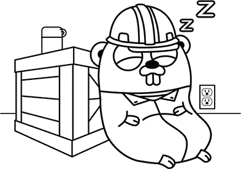
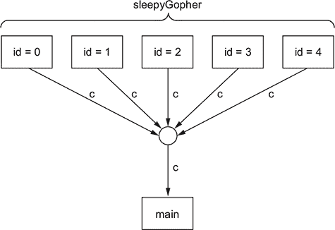

## 单元 7. 并发编程

计算机擅长同时做很多事情。你可能想让计算机加快计算速度，同时下载许多网页，或者独立控制机器的不同部分。这种一次处理几件事情的能力被称为 *并发*。

Go 对并发的方法与其他大多数编程语言不同。任何 Go 代码都可以通过在 *goroutine* 中启动它来使其并发。Goroutines 使用 *channels* 进行通信和协调，使得多个并发任务朝着同一目标工作变得简单直接。

## 第 30 课. Goroutines 和并发

阅读完 第 30 课 后，你将能够

+   启动 goroutine

+   使用通道进行通信

+   理解通道管道

看，这是一个地鼠工厂！所有的地鼠都在忙着建造东西。嗯，几乎都在。角落里有一个正在睡觉的地鼠——或者也许他正在深思。这里有一个重要的地鼠：她在向其他地鼠下达命令。他们四处跑来跑去，执行她的命令，告诉别人该做什么，并最终向她报告他们的发现。一些地鼠正在从工厂发送东西。其他地鼠正在接收从外面送来的东西。


到目前为止，我们编写的所有 Go 代码都像这个工厂里单独一只地鼠一样，忙于自己的任务，不去打扰别人。Go 程序更像是整个工厂，许多独立任务都在各自做自己的事情，但为了某个共同目标相互沟通。这些 *并发* 任务可能包括从网络服务器获取数据、计算数百万位的 π 或控制机械臂。

在 Go 中，独立运行的任务被称为 *goroutine*。在本课中，你将学习如何启动任意数量的 goroutine，并通过 *channels* 之间进行通信。Goroutines 在其他语言中类似于 *coroutines*、*fibers*、*processes* 或 *threads*，尽管它们并不完全相同。它们创建起来非常高效，Go 使得协调许多并发操作变得简单。

| |
| --- |

**考虑这一点**

考虑编写一个执行一系列操作的程序。每个操作可能需要很长时间，并且可能需要在完成之前等待某些事情发生。它可以写成简单的、顺序的代码。但如果你想在同一时间做两个或更多的这些序列呢？

例如，你可能想让程序的一部分遍历电子邮件地址列表，并为每个地址发送一封电子邮件，而另一个任务则等待接收到的电子邮件并将它们存储在数据库中。你会如何编写这样的代码？

在某些语言中，你可能需要相当大幅度地更改代码。但在 Go 中，你可以为每个独立任务使用完全相同的代码。Goroutines 允许你同时运行任意数量的操作。


### 30.1. 启动 goroutine

启动一个 goroutine 就像调用一个函数一样简单。你只需要在调用前加上`go`关键字。

列表 30.1 中的 goroutine 类似于工厂角落的睡眠刺猬。尽管如此，他在`Sleep`语句那里并没有做什么，他本可以做一些严肃的思考（计算）。当`main`函数返回时，程序中的所有 goroutine 都会立即停止，因此我们需要等待足够长的时间来看到睡眠刺猬打印他的“...打呼噜...”信息。我们将等待比必要的时间更长一点，只是为了确保。



##### 列表 30.1\. 睡眠的刺猬：sleepygopher.go

```
package main

import (
    "fmt"
    "time"
)

func main() {
    go sleepyGopher()                 *1*
    time.Sleep(4 * time.Second)       *2*
}                                     *3*

func sleepyGopher() {
    time.Sleep(3 * time.Second)       *4*
    fmt.Println("... snore ...")
}
```

+   ***1* goroutine 启动了。**

+   ***2* 等待刺猬打呼噜**

+   ***3* 当我们到达这里时，所有的 goroutine 都停止了。**

+   ***4* 刺猬在睡觉。**


**快速检查 30.1**

> **1**
> 
> 如果你想在 Go 中同时做更多的事情，你会使用什么？
> 
> **2**
> 
> 用于启动一个独立运行任务的关键字是什么？

|  |

**快速检查 30.1 答案**

> **1**
> 
> 一个 goroutine。
> 
> **2**
> 
> `go`。


### 30.2\. 多个 goroutine

每次我们使用`go`关键字时，就会启动一个新的 goroutine。所有 goroutine 看起来都是同时运行的。尽管如此，它们可能并不*技术上*同时运行，因为计算机只有有限数量的处理单元。

事实上，这些处理器通常会在处理另一个 goroutine 之前，花费一些时间在一个 goroutine 上，使用一种称为*时间共享*的技术。具体是如何发生的，这是一个只有 Go 运行时、你使用的操作系统和处理器才知道的黑暗秘密。最好总是假设不同 goroutine 中的操作可能以任何顺序运行。

列表 30.2 中的`main`函数启动了五个`sleepyGopher` goroutine。它们都睡眠三秒钟，然后打印相同的内容。

##### 列表 30.2\. 五个睡眠的刺猬：sleepygophers.go

```
package main

import (
    "fmt"
    "time"
)

func main() {
    for i := 0; i < 5; i++ {
        go sleepyGopher()
    }
    time.Sleep(4 * time.Second)
}

func sleepyGopher() {
    time.Sleep(3 * time.Second)
    fmt.Println("... snore ...")
}
```

我们可以通过向每个 goroutine 传递一个参数来找出哪些先完成。向 goroutine 传递参数就像向任何函数传递参数一样：值被复制并作为参数传递。

当你运行下一个列表时，你应该看到尽管我们按顺序从零到九启动了所有的 goroutine，但它们都在不同的时间完成。如果你在 Go 沙盒外运行这个程序，你每次都会看到不同的顺序。

##### 列表 30.3\. 确认的刺猬：identifiedgophers.go

```
func main() {
    for i := 0; i < 5; i++ {
        go sleepyGopher(i)
    }
    time.Sleep(4 * time.Second)
}

func sleepyGopher(id int) {
    time.Sleep(3 * time.Second)
    fmt.Println("... ", id, " snore ...")
}
```

这段代码有一个问题。它等待了四秒钟，而它只需要等待超过三秒钟。更重要的是，如果 goroutine 执行的任务不仅仅是睡眠，我们不知道它们需要多长时间来完成工作。我们需要一种方法让代码知道所有 goroutine 何时完成。幸运的是，Go 为我们提供了我们需要的：通道。

| |
| --- |

**快速检查 30.2**

> **问题 1:**
> 
> 不同的 goroutine 以什么顺序运行？

|  |

**快速检查 30.2 答案**

> **1:**
> 
> 任何订单。


### 30.3\. 通道

通道可以用来安全地从一个 goroutine 向另一个 goroutine 发送值。将通道想象成那些旧办公室中传递邮件的气动管道系统之一。如果你把它放进去，它就会飞到管道的另一端，然后可以被其他人取出。

与任何其他 Go 类型一样，通道可以用作变量，传递给函数，存储在结构体中，并且可以执行几乎任何其他您希望它们执行的操作。

要创建一个通道，使用 `make`，这是与创建映射和切片相同的内置函数。通道的类型在创建时指定。以下通道只能发送和接收整数值：

```
c := make(chan int)
```

一旦你有了通道，你就可以向它发送值并接收发送到它的值。你使用 *左箭头* 操作符 (`<-`) 在通道上发送或接收值。

要发送一个值，将箭头指向通道表达式，就像箭头在告诉右侧的值流入通道一样。发送操作将等待直到有东西（在另一个 goroutine 中）尝试在同一个通道上接收。在等待期间，发送者不能做任何事情，尽管所有其他 goroutine 仍然可以自由运行（假设它们没有在通道操作上等待）。以下发送了值 99：

```
c <- 99
```

要从通道接收值，箭头指向通道（它在通道的左侧）。在下面的代码中，我们从通道 `c` 接收一个值并将其赋给变量 `r`。与在通道上发送类似，接收者将等待另一个 goroutine 尝试在同一个通道上发送：

```
r := <-c
```


##### 注意

虽然通常将通道接收操作单独放在一行上，但这不是必需的。通道接收操作可以在任何可以使用其他表达式的位置使用。


列表 30.4 中的代码创建了一个通道并将其传递给五个困倦的地鼠 goroutine。然后它等待接收五个消息，每个消息对应于已启动的每个 goroutine。每个 goroutine 睡觉并发送一个标识自己的值。当执行到达 `main` 函数的末尾时，我们可以确信所有的地鼠都已经完成了睡眠，并且它可以返回而不会打扰到任何地鼠的睡眠。例如，假设我们有一个程序将一些数值计算的输出保存到在线存储中。它可能同时保存几个东西，我们不希望在所有结果都成功保存之前退出。

##### 列表 30.4\. 通过通道休眠的地鼠：simplechan.go

```
func main() {
    c := make(chan int)                                              *1*
    for i := 0; i < 5; i++ {
        go sleepyGopher(i, c)
    }
    for i := 0; i < 5; i++ {
        gopherID := <-c                                              *2*
        fmt.Println("gopher ", gopherID, " has finished sleeping")
    }
}

func sleepyGopher(id int, c chan int) {                              *3*
    time.Sleep(3 * time.Second)
    fmt.Println("... ", id, " snore ...")
    c <- id                                                          *4*
}
```

+   ***1* 创建通道以进行通信**

+   ***2* 从通道接收值**

+   ***3* 将通道作为参数声明**

+   ***4* 将值发送回主函数**

图 30.1 中的方框代表 goroutine，圆圈代表通道。从 goroutine 到通道的链接用指向通道的变量的名称标记；箭头方向表示 goroutine 使用通道的方式。当箭头指向 goroutine 时，goroutine 正在从通道中读取。

##### 图 30.1\. gopher 们一起的样子




**快速检查 30.3**

> **1**
> 
> 你会使用什么语句在名为`c`的通道上发送字符串`"hello world"`？
> 
> **2**
> 
> 你会如何接收那个值并将其分配给一个变量？

|  |

**QC 30.3 答案**

> **1**
> 
> `c <- "hello world"`
> 
> **2**
> 
> `v = <-c`


### 30.4\. 使用 select 进行通道冲浪

在前面的例子中，我们使用单个通道等待多个 goroutine。当所有 goroutine 都产生相同类型的值时，这很好，但并不总是这样。我们通常会想要等待两种或更多不同类型的值。

这的一个例子是我们正在等待通过通道的一些值，但我们不想等待太久。也许我们对我们的沉睡 gopher 有点不耐烦，经过一段时间后我们的耐心耗尽。或者我们可能想在几秒钟后超时网络请求，而不是几分钟。

幸运的是，Go 标准库提供了一个很好的函数，`time.After`，来帮助。它返回一个通道，在经过一段时间后接收一个值（发送值的 goroutine 是 Go 运行时的一部分）。

我们希望继续从沉睡的 gopher 那里接收值，直到他们全部完成睡眠或者我们的耐心耗尽。这意味着我们需要同时等待计时器通道和另一个通道。`select`语句允许我们这样做。

`select`语句看起来像在第 3 课中介绍的`switch`语句。`select`语句内部的每个`case`都包含一个通道接收或发送。`select`等待直到一个案例准备好，然后运行它及其相关的 case 语句。就像`select`同时查看两个通道，并在它们中的任何一个发生动作时采取行动一样。

以下列表使用`time.After`创建一个超时通道，然后使用`select`等待沉睡的 gopher 的通道和超时通道。

##### 列表 30.5\. 急切等待沉睡的 gopher：select1.go

```
timeout := time.After(2 * time.Second)
for i := 0; i < 5; i++ {
    select {                                                         *1*
    case gopherID := <-c:                                            *2*
        fmt.Println("gopher ", gopherID, " has finished sleeping")
    case <-timeout:                                                  *3*
        fmt.Println("my patience ran out")
        return                                                       *4*
    }
}
```

+   ***1* select 语句**

+   ***2* 等待 gopher 醒来**

+   ***3* 等待时间耗尽**

+   ***4* 放弃并返回**


##### 提示

当`select`语句中没有案例时，它将永远等待。这可能在你启动了一些你想无限期运行的 goroutine 时停止`main`函数返回时很有用。


当所有的 gopher 都恰好睡眠三秒钟时，这并不很有趣，因为我们的耐心总是在任何 gopher 醒来之前耗尽。在下一条列表中的 gopher 睡眠的时间是随机的。当你运行这个程序时，你会发现一些 gopher 按时醒来，但有些却没有。

##### 列表 30.6\. 随机睡眠的 gopher：select2.go

```
func sleepyGopher(id int, c chan int) {
    time.Sleep(time.Duration(rand.Intn(4000)) * time.Millisecond)
    c <- id
}
```


##### 提示

这种模式在你想要限制做某事所花费的时间时非常有用。通过将操作放在 goroutine 中，并在完成时通过 channel 发送信号，Go 中的任何操作都可以设置超时。

|  |

##### 注意

尽管我们已经停止等待 goroutines，但如果我们没有从`main`函数返回，它们仍然会占用内存。如果可能的话，告诉它们完成是一个好的做法。

|  |

**nil channel 无作用**

因为你需要使用`make`显式地创建 channel，你可能会想知道如果你使用了尚未“创建”的 channel 值会发生什么。与 map、slice 和 pointer 一样，channel 可以是 nil。事实上，`nil`是它们的默认零值。

如果你尝试使用 nil channel，它不会引发 panic——相反，操作（发送或接收）将永远阻塞，就像一个从未接收过或发送过任何内容的 channel。这个例外是`close`（在后面的课程中会介绍）。如果你尝试关闭一个 nil channel，它将引发 panic。

初看起来，这可能似乎并不很有用，但它可以非常有帮助。考虑一个包含`select`语句的循环。我们可能不希望在循环的每次迭代中都等待`select`中提到的所有 channel。例如，我们可能只在准备好发送值时尝试在 channel 上发送。我们可以通过使用一个只在想要发送值时才非 nil 的 channel 变量来实现这一点。


到目前为止，一切都很顺利。当我们的`main`函数在 channel 上接收时，它发现有一个 gopher 在 channel 上发送了一个值。但如果我们不小心尝试在没有任何 goroutine 可以发送时读取，或者如果我们尝试在 channel 上发送而不是接收会发生什么呢？


**快速检查 30.4**

> **1**
> 
> `time.After`返回什么类型的值？
> 
> **2**
> 
> 如果你在一个 nil channel 上发送或接收会发生什么？
> 
> **3**
> 
> `select`语句中的每个情况包含什么？

|  |

**QC 30.4 答案**

> **1**
> 
> 一个 channel。
> 
> **2**
> 
> 它将永远阻塞。
> 
> **3**
> 
> 一个 channel 操作。


### 30.5\. 阻塞和死锁

当一个 goroutine 在等待发送或接收通道上的数据时，我们称它为*阻塞*。这听起来可能和我们编写了一个永远旋转什么也不做的循环代码一样，表面上它们看起来确实一样。但如果你在你的笔记本电脑上运行一个无限循环，你可能会发现风扇开始嗡嗡作响，电脑变热，因为它做了很多工作。相比之下，一个阻塞的 goroutine 不占用任何资源（除了 goroutine 本身使用的一小部分内存）。它安静地停在那里，等待阻止它的因素停止阻止。

当一个或多个 goroutine 最终因为某些永远不会发生的事情而阻塞时，我们称之为*死锁*，你的程序通常会崩溃或挂起。死锁可能由像这样简单的事情引起：

```
func main() {
    c := make(chan int)
    <-c
}
```

在大型程序中，死锁可能涉及 goroutine 之间复杂的一系列依赖关系。

虽然理论上难以防范，但在实践中，通过坚持一些简单的指南（很快就会介绍），制作无死锁的程序并不困难。当你*确实*发现死锁时，Go 可以显示所有 goroutine 的状态，因此通常很容易找出发生了什么。


**快速检查 30.5**

> **Q1:**
> 
> 一个阻塞的 goroutine 会做什么？

|  |

**QC 30.5 答案**

> **1:**
> 
> 它什么也不做。


### 30.6. 一个地鼠装配线

到目前为止，我们的地鼠们相当懒惰。它们只是睡一会儿，然后醒来，通过它们的通道发送一个值。但这个工厂里并非所有地鼠都这样。有些地鼠在装配线上勤奋工作，从生产线上的前一个地鼠那里接收一个物品，对它进行一些处理，然后将其发送给生产线上的下一个地鼠。尽管每个地鼠完成的工作很简单，但装配线可以产生令人惊讶的复杂结果。

这种技术被称为*流水线*，它对于在不使用大量内存的情况下处理大量数据流非常有用。尽管每个 goroutine 一次可能只持有单个值，但它们可能在一段时间内处理数百万个值。流水线也很有用，因为你可以将其用作“思维工具”，帮助更容易地解决某些类型的问题。

我们已经拥有了组装 goroutine 成流水线的所有工具。Go 值沿着流水线流动，从一个 goroutine 传递到下一个。流水线中的工作者反复从其*上游*邻居那里接收一个值，对其进行一些处理，然后将结果发送到*下游*。

让我们构建一个由工人组成的装配线，这些工人处理字符串值。装配线起点的 gopher 如列表 30.7 所示——流的来源。这个 gopher 不读取值，只发送它们。在另一个程序中，这可能涉及从文件、数据库或网络中读取数据，但在这里我们只发送一些任意值。为了告诉下游的 gopher 没有更多的值，源发送一个*哨兵值*，即空字符串，以表示何时完成。

##### 列表 30.7\. 源 gopher：pipeline1.go

```
func sourceGopher(downstream chan string) {
    for _, v := range []string{"hello world", "a bad apple", "goodbye all"}
{
        downstream <- v
    }
    downstream <- ""
}
```

列表 30.8 中的 gopher 从装配线中过滤掉任何不良内容。它从其上游通道读取一个项目，并且只有当值中没有字符串`"bad"`时，才将其发送到下游通道。当它看到最后的空字符串时，过滤 gopher 停止，并确保将空字符串发送到下一个 gopher。

##### 列表 30.8\. 过滤 gopher：pipeline1.go

```
func filterGopher(upstream, downstream chan string) {
    for {
        item := <-upstream
        if item == "" {
            downstream <- ""
            return
        }
        if !strings.Contains(item, "bad") {
            downstream <- item
        }
    }
}
```

装配线末尾的 gopher——打印 gopher，如列表 30.9 所示。这个 gopher 没有下游。在另一个程序中，它可能将结果保存到文件或数据库中，或者打印它看到的值的摘要。这里的打印 gopher 打印它看到的所有值。

##### 列表 30.9\. 打印 gopher：pipeline1.go

```
func printGopher(upstream chan string) {
    for {
        v := <-upstream
        if v == "" {
            return
        }
        fmt.Println(v)
    }
}
```

让我们把我们的 gopher 工人组合起来。我们在管道中有三个阶段（源、过滤、打印），但只有两个通道。我们不需要为最后一个 gopher 启动一个新的 goroutine，因为我们想在退出整个程序之前等待它完成。当`printGopher`函数返回时，我们知道其他两个 goroutine 已经完成了它们的工作，然后我们可以从`main`返回，完成整个程序，如以下列表和图 30.2 所示。

##### 列表 30.10\. 装配：pipeline1.go

```
func main() {
    c0 := make(chan string)
    c1 := make(chan string)
    go sourceGopher(c0)
    go filterGopher(c0, c1)
    printGopher(c1)
}
```

##### 图 30.2\. Gopher 管道


我们目前拥有的管道代码存在问题。我们使用空字符串来表示没有更多的值需要处理，但如果我们想将空字符串处理成其他任何值一样呢？我们*可以*发送一个包含我们想要的字符串和一个表示是否为最后一个值的布尔字段的 struct 值。 

但有更好的方法。Go 允许我们*关闭*一个通道来表示不再发送任何值，如下所示：

```
close(c)
```

当一个通道被关闭时，你不能向其中写入任何更多的值（如果你尝试这样做，你会得到一个 panic），任何读取都会立即返回类型的零值（在这种情况下是空字符串）。


##### 注意

小心！如果你在一个循环中从关闭的通道读取，而没有检查它是否已关闭，循环将永远旋转，消耗大量的 CPU 时间。确保你知道哪些通道可能已关闭，并相应地进行检查。


我们如何判断通道是否已关闭？如下所示：

```
v, ok := <-c
```

当我们将结果分配给两个变量时，第二个变量会告诉我们是否已成功从通道读取。如果通道已关闭，则为 false。

使用这些新工具，我们可以轻松关闭整个管道。下一列表显示了管道头部的源 goroutine。

##### 列表 30.11\. 汇编：pipeline2.go

```
func sourceGopher(downstream chan string) {
    for _, v := range []string{"hello world", "a bad apple", "goodbye all"}
{
        downstream <- v
    }
    close(downstream)
}
```

下一列表显示了过滤器 goroutine 现在的样子。

##### 列表 30.12\. 汇编：pipeline2.go

```
func filterGopher(upstream, downstream chan string) {
    for {
        item, ok := <-upstream
        if !ok {
            close(downstream)
            return
        }
        if !strings.Contains(item, "bad") {
            downstream <- item
        }
    }
}
```

从通道读取直到其关闭的模式足够常见，以至于 Go 提供了一个快捷方式。如果我们在一个 `range` 语句中使用通道，它将读取通道中的值直到通道关闭。

这意味着我们的代码可以用 `range` 循环更简单地重写。以下列表实现了与之前相同的功能。

##### 列表 30.13\. 汇编：pipeline2.go

```
func filterGopher(upstream, downstream chan string) {
    for item := range upstream {
        if !strings.Contains(item, "bad") {
            downstream <- item
        }
    }
    close(downstream)
}
```

汇编线上的最后一个 gopher 读取所有消息，并依次打印，如下一列表所示。

##### 列表 30.14\. 汇编：pipeline2.go

```
func printGopher(upstream chan string) {
    for v := range upstream {
        fmt.Println(v)
    }
}
```


**快速检查 30.6**

> **1**
> 
> 当你从关闭的通道读取时，你看到了什么值？
> 
> **2**
> 
> 如何检查通道是否已关闭？

|  |

**QC 30.6 答案**

> **1**
> 
> 通道类型的零值。
> 
> **2**
> 
> 使用双值赋值语句：
> 
> ```
> v, ok := <-c
> ```


### 摘要

+   `go` 语句启动一个新的 goroutine，并与之并发运行。

+   通道用于在 goroutine 之间发送值。

+   使用 `make(chan string)` 创建一个通道。

+   `<-` 操作符从通道接收值（当在通道值之前使用时）。

+   `<-` 操作符将值发送到通道（当放置在通道值和要发送的值之间时）。

+   `close` 函数关闭一个通道。

+   `range` 语句读取通道中的所有值，直到其关闭。

让我们看看你是否掌握了这些...

#### 实验：remove-identical.go

看到相同的行重复出现是令人厌烦的。编写一个管道元素（一个 goroutine），它记住前一个值，并且只有当它与之前的不同时，才将值发送到管道的下一阶段。为了使事情更简单一些，你可以假设第一个值永远不会是空字符串。

#### 实验：split-words.go

有时候操作单词比操作句子更容易。编写一个管道元素，它接受字符串，将它们拆分成单词（你可以使用 `strings` 包中的 `Fields` 函数），并将所有单词逐个发送到下一个管道阶段。

## 第 31 课\. 并发状态

在阅读完第 31 课后，你将能够

+   保持状态安全

+   使用互斥锁和回复通道

+   使用服务循环

这里我们又回到了 gopher 工厂。忙碌的 gopher 们仍在建造东西，但有几条生产线库存不足，因此他们需要订购更多。

不幸的是，这是一个过时的工厂，只有一条通往外界的单一共享电话线。不过，所有生产线都有自己的听筒。一只地鼠拿起电话下单，但当她开始说话时，另一只地鼠拿起另一个听筒开始拨号，干扰了第一只地鼠。然后另一只也这样做，他们都非常困惑，没有人能成功下单。如果他们能同意一次只使用电话就好了！

在 Go 程序中的*共享值*有点像这个共享电话。如果有两个或更多的 goroutine 试图同时使用一个共享值，事情可能会出错。*可能*会没事。也许没有两只地鼠会同时尝试使用电话。但事情可能会以各种方式出错。

可能两只地鼠同时说话会混淆电话另一端的卖家，他们最终订购了错误的东西，或者订购的数量错误，或者订单的其他方面出了问题。无法知道——所有赌注都取消了。

这就是共享 Go 值的问题。除非我们明确知道可以使用特定类型的值进行并发，否则我们必须假设这是不允许的。这种情况被称为*竞态条件*，因为 goroutines 就像是在争夺使用这个值。

| |
| --- |

##### 备注

Go 编译器包括尝试在您的代码中查找竞态条件的功能。这非常值得使用，如果它报告了竞态，修复代码总是值得的。请参阅[golang.org/doc/articles/race_detector.html](http://golang.org/doc/articles/race_detector.html)。

| |
| --- |
| |

##### 备注

如果两个 goroutine 同时从同一事物中读取，这是可以的，但如果你在另一个写入的同时读取或写入，你会得到未定义的行为。

| |
| --- |
| |

**考虑这一点**

假设我们有一群 goroutine 在工作，爬取网页和*抓取*网页。我们可能想要跟踪哪些网页已经被访问过。让我们说我们想要跟踪每个网页的链接数量（谷歌在搜索结果中对网页进行排名时做了一些类似的事情）。

看起来我们可以在 goroutine 之间共享一个映射，它包含每个网页的链接计数。当一个 goroutine 处理一个网页时，它会增加该页面的映射条目。

然而，这样做是错误的，因为所有的 goroutine 都在同时更新映射，这会产生竞态条件。我们需要找到一种绕过它的方法。进入互斥锁。

| |
| --- |

### 31.1. 互斥锁

Back in the gopher factory, one clever gopher has a bright idea. She puts a glass jar in the middle of the factory floor that holds a single metal token. When a gopher needs to use the phone, they take the token out of the jar and keep it until the phone call has finished. Then they return the token to the jar. If there’s no token in the jar when a gopher wants to make a call, they have to wait until the token is returned.

Note that there’s nothing that physically stops a gopher from using the phone without taking the token. But if they do, there may be unintended consequences from two gophers talking over one another on the phone. Also, consider what happens if the gopher with the token forgets to return it: no other gopher will be able to use the phone until they remember to return it.


In a Go program, the equivalent of that glass jar is called a *mutex*. The word *mutex* is short for *mutual exclusion*. Goroutines can use a mutex to exclude each other from doing something at the same time. The *something* in question is up to the programmer to decide. Like the jar in the factory, the only “mutual exclusion” properties of a mutex come from the fact that we’re careful to use it whenever we access the thing we’re guarding with it.

Mutexes have two methods: `Lock` and `Unlock`. Calling `Lock` is like taking the token from the jar. We put the token back in the jar by calling `Unlock`. If any goroutine calls `Lock` while the mutex is locked, it’ll wait until it’s unlocked before locking it again.

To use the mutex properly, we need to make sure that any code accessing the shared values locks the mutex first, does whatever it needs to, then unlocks the mutex. If any code doesn’t follow this pattern, we can end up with a race condition. Because of this, mutexes are almost always kept internal to a package. The package knows what things the mutex guards, but the `Lock` and `Unlock` calls are nicely hidden behind methods or functions.

Unlike channels, Go mutexes aren’t built into the language itself. Rather, they’re available in the `sync` package. Listing 31.1 is a complete program that locks and unlocks a global mutex value. We don’t need to initialize the mutex before using it—the zero value is an unlocked mutex.

The `defer` keyword introduced in lesson 28 can help with mutexes too. Even if there are many lines of code in a function, the `Unlock` call stays next to the `Lock` call.

##### 列表 31.1\. 锁定和解锁互斥锁：mutex.go

```
package main

import "sync"                                               *1*

var mu sync.Mutex                                           *2*

func main() {
    mu.Lock()                                               *3*
    defer mu.Unlock()                                       *4*
    // The lock is held until we return from the function.
}
```

+   ***1* 导入 sync 包**

+   ***2* 声明互斥锁**

+   ***3* 锁定互斥锁**

+   ***4* 在返回前解锁互斥锁**


##### Note

The `defer` statement is particularly useful when there are multiple return statements. Without `defer`, we’d need a call to `Unlock` just before every return statement, and it would be very easy to forget one of those.


让我们实现一个类型，网络爬虫可以使用它来跟踪已访问网页的链接数量。我们将存储一个包含网页 URL 的映射，并用互斥锁保护它。列表 31.2 中的`sync.Mutex`是`struct`类型的一个成员，这是一个非常常见的模式。


##### 提示

将互斥锁的定义放在它所保护的变量上方，并包含注释，以便关联清晰，是一种良好的实践。


##### 列表 31.2\. 页面引用映射：scrape.go

```
// Visited tracks whether web pages have been visited.
// Its methods may be used concurrently from multiple goroutines.
type Visited struct {
    // mu guards the visited map.
    mu      sync.Mutex                   *1*
    visited map[string]int               *2*
}
```

+   ***1* 声明一个互斥锁**

+   ***2* 声明一个从 URL（字符串）键到整数值的映射**


##### 注意

在 Go 中，你应该假设除非明确记录，否则没有方法可以在并发中使用，就像我们在这里所做的那样。


下一个列表中的代码定义了一个`VisitLink`方法，当遇到链接时调用；它返回该链接之前遇到的次数。

##### 列表 31.3\. 访问链接：scrape.go

```
// VisitLink tracks that the page with the given URL has
// been visited, and returns the updated link count.
func (v *Visited) VisitLink(url string) int {
    v.mu.Lock()                                *1*
    defer v.mu.Unlock()                        *2*
    count := v.visited[url]
    count++
    v.visited[url] = count                     *3*
    return count
}
```

+   ***1* 锁定互斥锁**

+   ***2* 确保互斥锁已解锁**

+   ***3* 更新映射**

Go playground 不是实验竞态条件的好地方，因为它被故意保持确定性且无竞态。但你可以通过在语句之间插入`time.Sleep`调用来进行实验。

尝试修改列表 31.3，使用在第 30 课开头介绍的技术来启动几个 goroutine，它们都调用带有不同值的`VisitLink`，并尝试在不同位置插入`Sleep`语句进行实验。还尝试删除`Lock`和`Unlock`调用，看看会发生什么。

当有一个小而定义良好的状态要保护时，互斥锁的使用相当简单，并且当编写希望从多个 goroutine 同时使用的方法时，它是必不可少的工具。


**快速检查 31.1**

> **1**
> 
> 如果两个 goroutine 同时尝试更改相同的值，可能会发生什么？
> 
> **2**
> 
> 如果你在解锁之前再次尝试锁定互斥锁，会发生什么？
> 
> **3**
> 
> 如果你没有加锁就解锁会发生什么？
> 
> **4**
> 
> 同时从不同的 goroutine 调用同一类型的函数是否安全？

|  |

**QC 31.1 答案**

> **1**
> 
> 它是未定义的。程序可能会崩溃或发生其他任何事情。
> 
> **2**
> 
> 它将永远阻塞。
> 
> **3**
> 
> 它会恐慌：未加锁的互斥锁解锁。
> 
> **4**
> 
> 不，除非明确记录为这样。


#### 31.1.1\. 互斥锁陷阱

在列表 31.2 中，当互斥锁被锁定时，我们只做一件非常简单的事情：我们更新一个映射。在锁定期间我们做的越多，我们就越需要小心。如果我们锁定互斥锁等待某事，我们可能会长时间地阻止其他人。更糟糕的是，如果我们试图锁定相同的互斥锁，我们将会**死锁**——`Lock`调用将永远阻塞，因为我们永远不会在等待获取锁的同时放弃锁！

为了安全起见，请遵循以下指南：

+   尽量保持 mutex 中的代码简单。

+   对于给定的共享状态，只有一个 mutex。

Mutex 对于简单的共享状态来说很好用，但有时我们可能需要更多。在第 30 课的 gopher 工厂中，我们可能希望 gophers 能够独立行动，响应其他 gophers 的请求，但同时也随着时间的推移做自己的事情。与装配线上的 gophers 不同，这样的 gophers 不会完全响应其他 gophers 的消息，但可以决定为自己做事情。

| |
| --- |

**快速检查 31.2**

> **Q1:**
> 
> 锁定 mutex 可能存在两个潜在的问题是什么？

| |
| --- |
| |

**QC 31.2 答案**

> **1:**
> 
> 它可能会阻塞其他也试图锁定 mutex 的 goroutines；这可能导致死锁。

| |
| --- |

### 31.2. 长期工作者

考虑在火星表面驾驶探测车的任务。好奇号火星探测车上的软件被构建为一系列独立的模块，通过传递消息相互通信（见[mng.bz/Z7Xa](http://mng.bz/Z7Xa)），这与 Go 的 goroutines 非常相似。

探测车的模块负责探测车行为的各个方面。让我们尝试编写一些 Go 代码，在虚拟火星上驾驶一个（高度简化的）探测车。因为我们没有真正的引擎来驾驶，我们将通过更新一个包含探测车坐标的变量来凑合。我们希望探测车可以从地球控制，因此它需要对外部命令做出响应。

| |
| --- |

##### 注意

我们在这里构建的代码结构可以用于任何类型的长期任务，这些任务可以独立执行，例如网站轮询器或硬件设备控制器。

| |
| --- |

要驾驶探测车，我们将启动一个 goroutine，该 goroutine 将负责控制其位置。当探测车软件启动时启动 goroutine，并在关闭前保持运行。因为它持续运行并独立操作，我们将称这个 goroutine 为*工作者*。

工作者通常被编写为一个包含`select`语句的`for`循环。循环在工作者存活期间运行；`select`等待发生感兴趣的事情。在这种情况下，“感兴趣的事情”可能是一个来自外部的命令。记住，尽管工作者是独立操作的，但我们仍然希望能够控制它。或者，它可能是一个定时器事件，告诉工作者是时候移动探测车了。

这里有一个什么也不做的骨架工作者函数：

```
func worker() {
    for {
        select {
        // Wait for channels here.
        }
    }
}
```

我们可以像在之前的例子中启动 goroutines 一样启动这样的工作者：

```
go worker()
```

| |
| --- |

**事件循环和 goroutines**

一些其他编程语言使用*事件循环*——一个等待事件并当事件发生时调用注册函数的中心循环。通过提供 goroutines 作为核心概念，Go 避免了需要中心事件循环的需求。任何工作者 goroutine 都可以被视为它自己的事件循环。

| |
| --- |

我们希望我们的火星漫游车定期更新其位置。为此，我们希望驱动它的工作 goroutine 每隔一段时间醒来进行更新。我们可以使用`time.After`来实现这一点（在第 30 课中讨论过），它提供了一个在给定持续时间后接收值的通道。

列表 31.4 中的工作进程每秒打印一个值。目前，我们只是增加一个数字而不是更新位置。当我们收到计时器事件时，我们再次调用`After`，这样在下一次循环中，我们将等待一个新的计时器通道。

##### 列表 31.4\. 数字打印工作进程：printworker.go

```
func worker() {
    n := 0
    next := time.After(time.Second)           *1*
    for {
        select {
        case <-next:                          *2*
            n++
            fmt.Println(n)                    *3*
            next = time.After(time.Second)    *4*
        }
    }
}
```

+   ***1* 创建初始计时器通道**

+   ***2* 等待计时器触发**

+   ***3* 打印数字**

+   ***4* 为另一个事件创建另一个计时器通道**


##### 注意

在这个例子中，我们不需要使用`select`语句。只有一个情况的`select`与直接使用通道操作相同。但在这里我们使用`select`，因为在接下来的课程中，我们将更改代码以等待不仅仅是计时器。否则，我们可以完全避免`After`调用并使用`time.Sleep`。


现在我们已经有一个可以独立行动的工作进程，让我们通过更新位置而不是数字使其更像漫游车。方便的是，Go 的`image`包提供了一个`Point`类型，我们可以用它来表示漫游车的当前位置和方向。`Point`是一个包含 X 和 Y 坐标以及相应方法的结构。例如，`Add`方法将一个点添加到另一个点。

让我们用 X 轴表示东西方向，用 Y 轴表示南北方向。要使用`Point`，我们必须首先导入`image`包：

```
import "image"
```

每次我们在计时器通道上接收到一个值时，我们将表示当前方向的点添加到当前位置，如下一列表所示。目前，漫游车将始终从同一位置 [10, 10] 开始并向东行进，但我们将很快解决这个问题。

##### 列表 31.5\. 位置更新工作进程：positionworker.go

```
func worker() {
    pos := image.Point{X: 10, Y: 10}                   *1*
    direction := image.Point{X: 1, Y: 0}               *2*
    next := time.After(time.Second)
    for {
        select {
        case <-next:
            pos = pos.Add(direction)
            fmt.Println("current position is ", pos)   *3*
            next = time.After(time.Second)
        }
    }
}
```

+   ***1* 当前位置（初始为 [10, 10]）**

+   ***2* 当前方向（初始为 [1, 0]，向东行进）**

+   ***3* 打印当前位置**

如果一个火星漫游车只能直线行进，那就没什么用了。我们希望能够控制漫游车使其向不同方向行进，或停止它，或使其行进得更快。我们需要另一个可以用来向工作进程发送命令的通道。当工作进程在命令通道上接收到一个值时，它可以执行该命令。在 Go 中，通常将这样的通道隐藏在方法后面，因为通道被认为是实现细节。

下面的列表中的`RoverDriver`类型包含我们将用于向工作进程发送命令的通道。我们将使用一个`command`类型来保存发送的命令。

##### 列表 31.6\. `RoverDriver` 类型：rover.go

```
// RoverDriver drives a rover around the surface of Mars.
type RoverDriver struct {
    commandc chan command
}
```

我们可以将创建通道并启动工作者的逻辑封装在`NewRoverDriver`函数中，如下一列表所示。我们将定义一个`drive`方法来实现我们的工作者逻辑。虽然它是一个方法，但它将像本章前面提到的`worker`函数一样工作。作为一个方法，它能够访问`RoverDriver`结构中的任何值。

##### 列表 31.7\. 创建：rover.go

```
func NewRoverDriver() *RoverDriver {
    r := &RoverDriver{
        commandc: make(chan command),
    }
    go r.drive()
    return r
}
```

现在我们需要决定我们想要能够发送给探测车的命令。为了保持简单，让我们只允许两个命令：“向左转 90°”和“向右转 90°”，如以下列表所示。

##### 列表 31.8\. 命令类型：rover.go

```
type command int

const (
    right = command(0)
    left  = command(1)
)
```


##### 注意

通道可以是任何 Go 类型；命令类型可以是包含任意复杂命令的结构体类型。


现在我们已经定义了`RoverDriver`类型和一个创建其实例的函数，我们需要`drive`方法（将控制探测车的工作者），如列表 31.9 提供。它与之前看到的定位更新工作者几乎相同，只是它也等待在命令通道上。当它收到命令时，它会根据命令值来决定要做什么。为了了解发生了什么，我们记录了变化。

##### 列表 31.9\. `RoverDriver`工作者：rover.go

```
// drive is responsible for driving the rover. It
// is expected to be started in a goroutine.
func (r *RoverDriver) drive() {
    pos := image.Point{X: 0, Y: 0}
    direction := image.Point{X: 1, Y: 0}
    updateInterval := 250 * time.Millisecond
    nextMove := time.After(updateInterval)
    for {
        select {
        case c := <-r.commandc:              *1*
            switch c {
            case right:                      *2*
               direction = image.Point{
                    X: -direction.Y,
                    Y: direction.X,
               }
            case left:                       *3*
               direction = image.Point{
                    X: direction.Y,
                    Y: -direction.X,
               }
            }
            log.Printf("new direction %v", direction)
        case <-nextMove:
            pos = pos.Add(direction)
            log.Printf("moved to %v", pos)
            nextMove = time.After(updateInterval)
        }
    }
}
```

+   ***1* 在命令通道上等待命令**

+   ***2* 向右转**

+   ***3* 向左转**

现在我们可以通过添加控制探测车的方法来完成`RoverDriver`类型的定义，如列表 31.10 所示。我们将声明两个方法，每个命令一个。每个方法都会在`commandc`通道上发送正确的命令。例如，如果我们调用`Left`方法，它将发送一个`left`命令值，工作者将接收这个值并改变工作者的方向。


##### 注意

虽然这些方法正在控制探测车的方向，但它们没有直接访问方向值，因此不存在它们可以并发更改它并导致竞争条件的风险。这意味着我们不需要互斥锁，因为通道允许与探测车的 goroutine 通信，而不直接更改其任何值。


##### 列表 31.10\. `RoverDriver`方法：rover.go

```
// Left turns the rover left (90° counterclockwise).
func (r *RoverDriver) Left() {
    r.commandc <- left
}

// Right turns the rover right (90° clockwise).
func (r *RoverDriver) Right() {
    r.commandc <- right
}
```

现在我们有了完全功能的`RoverDriver`类型，列表 31.11 创建了一个探测车并发送了一些命令。现在它可以自由地移动了！

##### 列表 31.11\. 放手吧！rover.go

```
func main() {
    r := NewRoverDriver()
    time.Sleep(3 * time.Second)
    r.Left()
    time.Sleep(3 * time.Second)
    r.Right()
    time.Sleep(3 * time.Second)
}
```

尝试通过使用不同的定时和发送不同的命令来实验`RoverDriver`类型。

虽然我们在这里关注了一个具体的例子，但这种工作者模式可以在许多不同的情况下很有用，在这些情况下，你需要有一些长期运行的 goroutine 来控制某些东西，同时保持对外部控制的响应。


**快速检查 31.3**

> **1**
> 
> 在 Go 中，我们通常使用什么代替事件循环？
> 
> **2**
> 
> 提供了`Point`数据类型的 Go 标准库包是什么？
> 
> **3**
> 
> 你可能会使用哪些 Go 语句来实现一个长期运行的 worker goroutine？
> 
> **4**
> 
> 通道使用的内部细节是如何隐藏的？
> 
> **5**
> 
> 可以通过通道发送哪些 Go 值？

| |
| --- |
| |

**QC 31.3 答案**

> **1**
> 
> goroutine 中的循环。
> 
> **2**
> 
> `image` 包。
> 
> **3**
> 
> `for` 语句和 `select` 语句。
> 
> **4**
> 
> 在方法调用之后。
> 
> **5**
> 
> 任何值都可以通过通道发送。

| |
| --- |

### 摘要

+   除非明确标记为可以这样做，否则不要同时从多个 goroutine 访问状态。

+   使用互斥锁确保一次只有一个 goroutine 访问某个东西。

+   只用一个互斥锁来保护一块状态。

+   尽量减少在互斥锁保持期间的操作。

+   你可以将一个长生命周期的 goroutine 写作一个带有 `select` 循环的工作者。

+   在方法后面隐藏工作者的细节。

看看你是否掌握了这些...

#### 实验：positionworker.go

以 列表 31.5 为起点，修改代码，使每次移动的延迟时间增加半秒。

#### 实验：rover.go

以 `RoverDriver` 类型为起点，定义 `Start` 和 `Stop` 方法以及相关的命令，并使漫游者遵守这些命令。

## 第 32 课。火星生活

### 32.1. 可驾驶的网格

通过实现 `MarsGrid` 类型来创建一个漫游者可以驾驶的网格。你需要使用互斥锁来确保它可以同时被多个 goroutine 安全使用。它看起来可能如下所示：

```
// MarsGrid represents a grid of some of the surface
// of Mars. It may be used concurrently by different
// goroutines.
type MarsGrid struct {
    // To be done.
}

// Occupy occupies a cell at the given point in the grid. It
// returns nil if the point is already occupied or the point is
// outside the grid. Otherwise it returns a value that can be
// used to move to different places on the grid.
func (g *MarsGrid) Occupy(p image.Point) *Occupier

// Occupier represents an occupied cell in the grid.
// It may be used concurrently by different goroutines.
type Occupier struct {
    // To be done.
}

// Move moves the occupier to a different cell in the grid.
// It reports whether the move was successful
// It might fail because it was trying to move outside
// the grid or because the cell it's trying to move into
// is occupied. If it fails, the occupier remains in the same place.
func (g *Occupier) Move(p image.Point) bool
```

现在将第 31 课的漫游者示例（[kindle_split_046.html#ch31](https://kindle_split_046.html#ch31)）修改一下，使其不再只是本地更新坐标，而是使用传递给 `NewRoverDriver` 函数的 `MarsGrid` 对象。如果它触碰到网格的边缘或障碍物，它应该转向并朝另一个随机方向前进。


现在你可以通过调用 `NewRoverDriver` 来启动几个漫游者，并看到它们在网格上一起驾驶。

### 32.2. 报告发现

我们想在火星上找到生命，所以我们会派几个漫游者下去寻找，但我们需要知道何时找到生命。在网格的每个单元格中，分配一些生命可能性的概率，一个介于 0 和 1000 之间的随机数。如果一个漫游者找到一个生命值超过 900 的单元格，它可能已经找到了生命，并且必须发送一个无线电消息回地球。

不幸的是，并不总是能够立即发送消息，因为中继卫星并不总是位于地平线上。实现一个缓冲 goroutine，它接收从漫游者发送的消息，并将它们缓冲到一个切片中，直到它们可以发送回地球。

实现地球作为一个只偶尔接收消息的 goroutine（在现实中，每天可能只有几个小时，但你可能希望将间隔缩短一些）。每个消息应包含可能发现生命的单元格的坐标以及生命值本身。

你也许还想给你的每个漫游者起一个名字，并在消息中包含这个名字，这样你就能知道哪个漫游者发送了它。在漫游者打印的日志消息中包含名字也很有用，这样你可以跟踪每个漫游者的进度。

释放你的漫游者去搜索，看看它们能找到什么！
