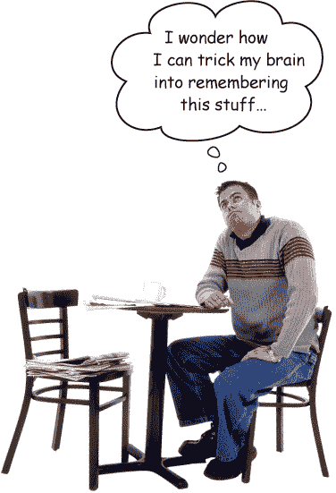
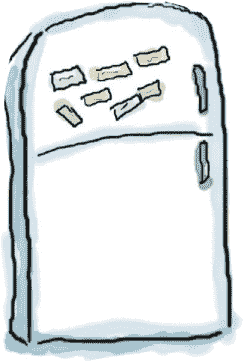

# 如何使用本书：介绍

###### 注意

在本节中，我们回答了一个迫切的问题：“那么他们为什么在 Go 书中加入了这个？”

# 这本书适合谁？

如果你可以对***所有***这些问题回答“是”：

1.  你是否有一台带有文本编辑器的计算机？

1.  你想学习一门使开发**快速**和**高效**的编程语言吗？

1.  你喜欢**刺激的晚宴谈话**胜过**枯燥乏味的学术讲座**吗？

这本书适合你。

## 谁应该远离这本书？

如果你可以回答“是”的话，至少有***一个***：

1.  **你完全不懂计算机吗？**

    （你不需要是高级用户，但你应该理解文件夹和文件，如何打开终端应用程序，以及如何使用简单的文本编辑器。）

1.  你是一位忍者摇滚明星开发者，寻找一本***参考*书籍**吗？

1.  你**害怕尝试新事物**吗？你宁愿拔牙也不愿意将条纹与格子混搭吗？你认为技术书籍如果充满了糟糕的双关语就不可能严肃吗？

本书*并不*适合你。

###### 注意

[市场部的说明：本书适合任何持有有效信用卡的人。]

# 我们知道你在想什么

“*这*怎么可能是一本关于 Go 开发的严肃书籍？”

“这些图形是什么意思？”

“我真的能够*这样*学习吗？”

# 我们知道你的大脑在想什么

你的大脑渴望新奇。它总是搜索、扫描，*等待*一些不寻常的事物。它就是这样构建的，并且帮助你保持生命。

那么你的大脑对你遇到的所有例行、普通、正常事物都做些什么呢？它*竭尽所能*阻止它们干扰大脑*真正*的工作——记录*重要*的事情。它不会费心保存无聊的事物；它们永远不会通过“这显然不重要”的过滤器。

你的大脑*如何*知道什么是重要的？假设你出去远足一天，一只老虎跳到你面前——你的头脑和身体内会发生什么？

神经元激活。情绪激增。*化学物质涌动*。

这就是你的大脑如何知道……

**这一定很重要！不要忘记了！**

但是想象一下你在家里或图书馆。这是一个安全、温暖、没有老虎的区域。你在学习。准备考试。或者试图学习一些难懂的技术主题，你的老板认为需要一周，最多 10 天。

只有一个问题。你的大脑试图帮你大忙。它试图确保这*显然*不重要的内容不会占用稀缺的资源。最好的资源应该用来存储那些真正*重要*的东西。像老虎。像火灾的危险。像你为什么不应该把派对照片发布在 Facebook 页面上。但没有简单的方法告诉你的大脑，“嘿，大脑，非常感谢你，但无论这本书有多无聊，无论我现在在情感里刻度尺上登记得有多少少，我真的*想*让你保留这些东西。”

# 元认知：思考思考的过程

如果你真的想学习，而且想更快更深入地学习，要注意你是如何注意的。思考你的思考。学习你的学习方式。

大多数人在成长过程中并未学习元认知或学习理论课程。我们*期望*学习，但很少有人*教*我们如何学习。

但我们假设如果你拿着这本书，你真的想学会如何编写 Go 程序。而且你可能不想花很多时间。如果你想运用这本书中的内容，你需要*记住*你所读的内容。而为了做到这一点，你必须*理解*它。为了从这本书中或*任何*一本书或学习经验中获得最大收益，你需要对你的大脑负责。你的大脑对*这*个内容。

诀窍是让你的大脑将你正在学习的新材料视为非常重要的事情。对你的健康至关重要。像老虎一样重要。否则，你将不断与你的大脑进行斗争，因为它竭尽全力防止新内容粘在上面。

**那么你到底*如何*让你的大脑把编程看作是一只饥饿的老虎？**

有一个缓慢、乏味的方式，还有一个更快、更有效的方式。缓慢的方式是通过纯粹的重复。显然，你知道即使是最枯燥的话题，如果你不断地把同样的东西灌输到你的大脑中，你*能够*学习和记住。通过足够的重复，你的大脑会说，“对他来说这并*不*重要，但他一直看着同样的东西*一次*又*一次*又*一次*，所以我想这必须是重要的。”

更快的方法是做***任何增加大脑活动的事情***，特别是不同*类型*的大脑活动。前一页的内容是解决方案的重要部分，它们都是已被证明有助于你的大脑运作的事物。例如，研究表明，将单词*放在*它们描述的图片中（而不是放在页面的其他地方，如标题或正文中）会导致你的大脑尝试理解单词和图片之间的关系，这会导致更多的神经元激活。更多的神经元激活=你的大脑有*更多*机会*理解*这是值得关注的事情，并可能记录下来。

对话式风格有助于，因为人们在感知到自己正在进行对话时往往更专注，因为他们期望跟上并保持自己的一部分。令人惊讶的是，你的大脑并不一定*在乎*“对话”是与你和一本书之间进行的！另一方面，如果写作风格正式而枯燥，你的大脑会把它看作你在一个房间里被动听讲座时的体验。没有必要保持清醒。

但图片和对话风格仅仅是个开始……

# 这就是我们做的事情

我们使用***图片***，因为你的大脑对视觉图像更敏感，而不是文本。就你的大脑而言，一张图片确实值千言万语。当文本和图片共同工作时，我们将文本*嵌入*到图片中，因为当文本在所指的事物*内部*时，你的大脑处理起来更有效，而不是在说明或正文中的某处。

我们使用***冗余性***，用*不同*的方式和不同的媒体类型来表达同样的内容，并涉及*多种感官*，以增加内容被编码到你大脑的多个区域的机会。

我们以***意想不到***的方式使用概念和图片，因为你的大脑对新奇事物感兴趣，我们使用带有至少*一些* ***情感*** *内容*的图片和想法，因为你的大脑倾向于关注情绪的生物化学。那些让你*感觉*到某种情绪的事物更容易记住，即使那种感觉只是一点***幽默***、***惊讶***或***兴趣***。

我们使用了个性化的、***对话式的风格***，因为当你的大脑认为你正在进行对话而不是 passively listening 时，它会更加关注。即使当你*阅读*时，你的大脑也会这样做。

我们包含***活动***，因为当你***做***事情而不是*读*关于事情时，你的大脑更容易学习和记忆。我们制作了具有挑战性但可行的练习，因为这是大多数人喜欢的方式。

我们使用***多种学习风格***，因为*你*可能更喜欢逐步的步骤，而另一个人则希望先了解大局，还有其他人只想看到一个例子。但无论你自己的学习偏好如何，*每个人*都会受益于以多种方式呈现相同内容。

我们为***你大脑的两侧***提供内容，因为你的大脑涉及的越多，你学习和记忆的可能性就越大，你能保持注意力的时间也就越长。因为一侧大脑工作通常意味着给另一侧一个休息的机会，所以你能更长时间地有效学习。

我们包含***故事***和练习，呈现***多个观点***，因为当你的大脑被迫进行评估和判断时，它更容易深入学习。

我们包含***挑战***，包括练习和提出不一定有直接答案的***问题***，因为你的大脑倾向于在需要*付出努力*时学习和记忆。想想看——你不可能仅仅通过*观察*健身房里的人来使你的*身体*变得健康。但我们尽最大努力确保当你努力工作时，是在*正确*的事情上。确保你*不会浪费额外的神经元*来处理难以理解的例子，或是解析难懂、术语繁重或过于简洁的文本。

我们使用了***人***。在故事中，例子，图片等等，因为，呃，*你*是一个人。你的大脑比对*事物*更关注*人*。

# 这是你可以做的，来驯服你的大脑

所以，我们尽了我们的一份力。剩下的就看你了。这些建议只是一个起点；倾听你的大脑，找出对你有效和无效的方法。尝试新的事物。

###### 注意

剪下来，贴在你的冰箱上。

1.  **放慢速度。你理解得越多，需要记忆的就越少。**

    不要仅仅*阅读*。停下来思考。当书问你问题时，不要直接跳到答案。想象有人真的*在*问这个问题。你让大脑深入思考的程度越深，学习和记忆的机会就越大。

1.  **做练习。写下你自己的笔记。**

    我们提供这些方法，但如果我们替你做了这些，那就像是让别人帮你做锻炼一样。而且不要仅仅*看*这些练习。**用铅笔**。有足够的证据表明，在学习过程中进行身体活动可以增加学习效果。

1.  **读“没有愚蠢问题”这本书。**

    这意味着所有的内容。它们不是可选的边栏，***它们是核心内容的一部分！*** 不要跳过它们。

1.  **在睡前读这篇文章。或者至少是最后一个具有挑战性的东西。**

    学习的一部分（特别是长期记忆的转移）发生在你放下书之后。你的大脑需要独自处理更多时间，进行更多加工。如果你在这个处理时间内加入新的东西，你刚刚学到的一些内容将会丢失。

1.  **大声说出来。**

    说话会激活大脑的不同部分。如果你试图理解某事，或者增加记忆它的机会，大声说出来。更好的是，试着向别人大声解释。你会学得更快，而且你可能会发现在阅读时并不知道的想法。

1.  **喝水。大量喝水。**

    你的大脑在充足的液体浴中工作效果最好。脱水（即使在你感觉到口渴之前）会降低认知功能。

1.  **听听你的大脑。**

    注意你的大脑是否开始过载。如果发现自己开始浅尝辄止或忘记刚刚读过的内容，那么是休息的时候了。一旦超过一定点，通过试图塞更多东西进去来学得更快是不行的，甚至可能会损害学习过程。

1.  **感受一下。**

    你的大脑需要知道这*很重要*。投入到故事中去。为照片编写你自己的标题。对一句糟糕的笑话抱怨*仍然*比毫无感觉好。

1.  **写很多代码！**

    学习开发 Go 程序的唯一方法是**多写代码**。这就是本书贯穿始终的内容。编码是一种技能，唯一精通的方法就是练习。我们将为您提供大量的练习：每章都有一些问题需要您解决。不要只是跳过它们——很多学习过程发生在解决练习时。每个练习都附有解决方案——如果卡住了，不要害怕**偷看答案**！（有时小问题会让你陷入困境。）但在查看解决方案之前，请尝试自己解决问题。确保在继续阅读书的下一部分之前使其正常运行。

# 阅读我

这是一个学习经验，不是参考书。我们有意剔除可能妨碍我们在书中当前工作的学习的一切内容。第一次阅读时，你需要从头开始，因为书中假设你已经看过和学过某些内容。

## **如果您在其他语言中做过一些编程，这将有所帮助。**

大多数开发者在学习了其他编程语言之后才接触到 Go。（他们通常是为了从其他语言中寻求避难。）我们简要介绍了基础知识，让完全的新手也能够应对，但我们不会详细讲解变量是什么，或者`if`语句如何工作。如果您之前做过一点这方面的工作，学起来会更容易。

## **我们不会涵盖每一种类型、函数和包。**

Go 自带了大量的软件包。当然，它们都很有趣，但即使这本书长度**翻倍**，我们也无法涵盖所有内容。我们的焦点是对初学者重要的核心类型和函数。我们确保您对它们有深入的理解，并自信地知道如何何时使用它们。无论如何，完成《Head First Go》后，您将能够快速掌握任何参考书中我们未涵盖的软件包。

## **这些活动是** ***必须*** **的。**

练习和活动不是额外内容；它们是书籍核心内容的一部分。其中一些有助于记忆，一些用于理解，一些将帮助您应用所学的知识。***不要跳过练习。***

## **冗余是有意义且重要的。**

Head First 书籍的一个显著区别在于我们希望您真正掌握它。我们希望您完成书籍时记住所学内容。大多数参考书籍的目标不是保持和回忆，但这本书是关于学习的，因此您会看到一些相同的概念出现多次。

## **示例代码尽可能精简。**

要在 200 行代码中寻找你需要理解的两行是很令人沮丧的。本书中的大多数示例都显示在尽可能小的上下文中，这样你要学习的部分就会清晰而简单。所以不要期望代码是强大的，甚至是完整的。这是你完成书后的*任务*。书中的示例专门用于*学习*，并不总是完全功能。

我们把所有的示例文件都放在网上供您下载。您可以在*[`headfirstgo.com/`](http://headfirstgo.com/)*找到它们。

# 致谢

***系列创始人：***

感谢**Head First**的创始人**凯西·西埃拉**和**伯特·贝茨**。我十多年前第一次接触到这个系列时就喜欢它，但从未想过我会为它写作。感谢你们创造了这种了不起的教学风格！

***在 O'Reilly：***

感谢所有使这一切成为可能的 O'Reilly 的人，特别是编辑**杰夫·布莱尔**，以及**克里斯汀·布朗**、**瑞秋·蒙纳汉**和其余的制作团队成员。

***技术审阅者：***

每个人都会犯错，但幸运的是我有技术审阅者**蒂姆·赫克曼**、**Edward Yue Shung Wong**和**斯特凡·波克曼**来找出我所有的错误。你们永远不会知道他们找出了多少问题，因为我迅速销毁了所有的证据。但他们的帮助和反馈绝对是必要的，我会永远感激！

***还有更多的感谢：***

感谢**Leo Richardson**进行额外的校对。

或许最重要的是，感谢**克里斯汀、科特尼、布莱恩、莱尼**和**杰里米**，他们的耐心和支持（已经是第二本书了）！

# O'Reilly Online Learning

近 40 年来，O'Reilly Media 提供技术和商业培训、知识和洞察，帮助公司取得成功。

我们独特的专家和创新者网络通过书籍、文章、会议以及我们的在线学习平台分享他们的知识和专业知识。O'Reilly 的在线学习平台为您提供按需访问的现场培训课程、深入学习路径、交互式编码环境以及来自 O'Reilly 和其他 200 多个出版商的大量文本和视频内容。更多信息，请访问*[`oreilly.com`](http://oreilly.com)*。
