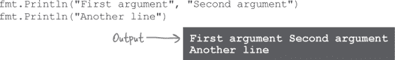
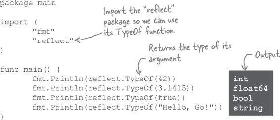
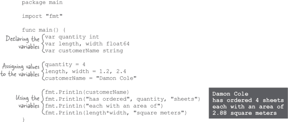
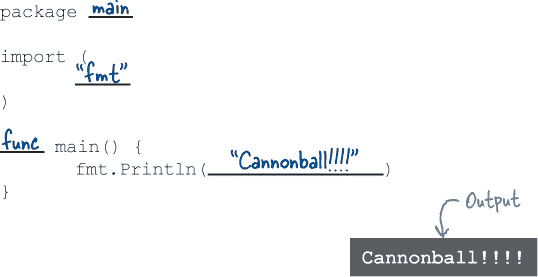

# 第一章：让我们开始吧：语法基础


**你准备好加速你的软件了吗？** 你想要一个**简单**的编程语言，**编译快**？**运行快**？让你**轻松分发**你的工作给用户？那么**你准备好使用 Go 了**！

Go 是一种专注于**简单**和**速度**的编程语言。它比其他语言更简单，因此学习起来更快。它让你利用当今多核计算机处理器的强大能力，使得你的程序运行更快。本章将向你展示所有能让**作为开发者的生活更轻松**，让**用户更快乐**的 Go 特性。

# 准备好了，开始吧！

2007 年，搜索引擎 Google 遇到了一个问题。他们必须维护数百万行代码的程序。在他们测试新更改之前，他们必须将代码编译成可运行的形式，这个过程当时需要大部分时间。不用说，这对开发者的生产力是不利的。

因此，Google 的工程师 Robert Griesemer、Rob Pike 和 Ken Thompson 为一种新语言设定了一些目标：

+   快速编译

+   更少繁琐的代码

+   未使用的内存会自动释放（垃圾回收）

+   能够同时执行多个操作的易于编写的软件（并发）

+   对多核处理器的良好支持

经过几年的努力，Google 创建了 Go：一种编写代码快速且产生的程序编译和运行速度快的语言。该项目于 2009 年转向开源许可证。现在任何人都可以免费使用。而且你应该使用它！由于其简单性和强大性，Go 正迅速赢得人们的青睐。

如果你正在编写一个命令行工具，Go 可以从同一源代码生成 Windows、macOS 和 Linux 的可执行文件。如果你正在编写一个 Web 服务器，它可以帮助你处理许多用户同时连接。无论你在写什么，它都将帮助你确保你的代码更易于维护和添加。

准备好学习更多了吗？让我们开始吧！


# Go Playground

尝试 Go 的最简单方法是在你的 Web 浏览器中访问*[`play.golang.org`](https://play.golang.org)*。在那里，Go 团队设置了一个简单的编辑器，你可以在其中输入 Go 代码并在他们的服务器上运行。结果会直接显示在你的浏览器中。


（当然，这仅在你有稳定的互联网连接时才有效。如果没有，请参阅“在你的计算机上安装 Go”了解如何直接在你的计算机上下载和运行 Go 编译器。然后使用编译器运行以下示例。）

现在让我们试一试吧！


1.  在你的浏览器中打开*[`play.golang.org`](https://play.golang.org)*。（如果你看到的与截图不太一样，不用担心；这只是说明他们自从印刷本书以来改进了网站！）

1.  删除编辑区域中的任何代码，并键入以下内容：

    ```go
    package main
    import "fmt"
    func main() {
         fmt.Println("Hello, Go!")
    }
    ```

    ###### 注意

    别担心，我们将在下一页解释所有这些内容的含义！

1.  点击格式化按钮，这将根据 Go 约定自动重新格式化你的代码。

1.  点击运行按钮。

你应该在屏幕底部看到“Hello, Go!”显示。恭喜，你刚刚运行了你的第一个 Go 程序！

翻页，我们将解释刚刚做了什么...


# 这一切都意味着什么？

你刚刚运行了你的第一个 Go 程序！现在让我们来看看这段代码，并弄清楚它实际上意味着什么...

每个 Go 文件都以`package`子句开头。一个**包**是一组执行类似操作的代码，如格式化字符串或绘制图像。`package`子句指定了此文件代码将成为其一部分的包的名称。在这种情况下，我们使用特殊的`main`包，如果要直接运行此代码（通常来自终端），则需要此包。

接下来，几乎每个 Go 文件都有一个或多个`import`语句。每个文件在其代码可以使用其他包中的代码之前都需要**import**这些包。一次性加载计算机上所有 Go 代码会导致一个庞大而缓慢的程序，因此你只需指定需要的包来导入它们。


每个 Go 文件的最后部分实际上是实际的代码，通常分割成一个或多个函数。一个**函数**是一组一个或多个代码行，你可以从程序的其他地方**调用**（运行）。当运行 Go 程序时，它会查找名为`main`的函数并首先运行它，这就是为什么我们将这个函数命名为`main`的原因。

## 典型的 Go 文件布局

你很快会习惯看到这三个部分，按照这个顺序，在你所使用的几乎每个 Go 文件中：

1.  包子句

1.  任何`import`语句

1.  实际的代码


俗话说：“万物有其位，万物有其处。” Go 是一门非常*一致*的语言。这是一件好事：你经常会发现在项目中找到特定代码的位置，而无需思考！

# 没有愚蠢的问题

**Q: 我的另一种编程语言要求每个语句以分号结束。Go 不需要吗？**

**A:** 在 Go 中，你*可以*使用分号来分隔语句，但这并非必需（事实上，这通常是不被赞同的）。

**Q: 这个格式化按钮是什么？为什么在运行代码之前我们要点击它？**

**A:** Go 编译器配备了一个名为`go fmt`的标准格式化工具。格式化按钮是`go fmt`的 Web 版本。

每当你分享你的代码时，其他的 Go 开发者都期望它遵循标准的 Go 格式。这意味着缩进和间距等将以标准的方式格式化，使每个人阅读更加轻松。在其他语言中，这通常通过依赖人们手动根据样式指南重新格式化其代码来实现，但是在 Go 中，你只需运行 `go fmt`，它就会自动为你修复一切。

我们对为本书创建的每个示例运行了格式化程序，你也应该对你的所有代码运行它！

# 如果发生了什么错误？

Go 程序必须遵循某些规则，以避免使编译器混淆。如果我们违反其中一个规则，将会收到错误消息。

假设我们忘记在第 6 行对 `Println` 函数的调用中添加括号。

如果我们尝试运行程序的这个版本，会得到一个错误：


Go 告诉我们我们需要转到哪个源代码文件和行号以便我们可以修复问题。（Go Playground 在运行之前会将你的代码保存到一个临时文件中，这就是 *prog.go* 文件名的来源。）然后它会给出错误的描述。在这种情况下，因为我们删除了括号，Go 无法知道我们正在尝试调用 `Println` 函数，因此它无法理解为什么我们要在第 6 行的末尾放置 `"Hello, Go"`。

# 打破东西是教育性的！


我们可以通过故意在不同的方式中断我们的程序来了解 Go 程序必须遵循的规则。拿这段代码示例来说，试着做一个以下的改变，并运行它。然后撤销你的改变，再试下一个。看看会发生什么！

```go
package main
import "fmt"
func main() {
       fmt.Println("Hello, Go!")}
```

###### 注意

尝试故意破坏我们的代码示例，并查看发生了什么！

| 如果你这样做... | ...它会因为...而失败 |
| --- | --- |
| 删除包声明...   ~~`package main`~~ | 每个 Go 文件必须以包声明开头。 |
| 删除导入语句...   ~~`import "fmt"`~~ | 每个 Go 文件必须导入其引用的每个包。 |
| 导入第二个（未使用的）包...   ~~`import "fmt" import "strings"`~~ | Go 文件必须仅导入其引用的包。（这有助于保持代码的快速编译！） |
| 重命名 `main` 函数...   `func ~~main~~hello` | Go 首先查找名为 `main` 的函数来运行。 |
| 将 Println 调用更改为小写...   `fmt.~~P~~println("Hello, Go!")` | Go 中一切都是大小写敏感的，所以虽然 `fmt.Println` 是有效的，但 `fmt.println` 是不存在的。 |
| 删除 Println 前的包名...   `~~fmt~~.Println("Hello, Go!")` | `Println` 函数不是 `main` 包的一部分，因此在函数调用前需要包名。 |

让我们以第一个作为例子...


# 调用函数

我们的示例包含对 `fmt` 包的 `Println` 函数的调用。要调用一个函数，输入函数名（本例中为 `Println`），然后加上一对括号。


像许多函数一样，`Println`可以接受一个或多个**参数**：你希望函数处理的值。参数出现在函数名称后的括号中。


`Println`可以不带参数调用，也可以提供多个参数。稍后我们会看到，大多数函数需要特定数量的参数。如果提供的参数太少或太多，会出现错误消息，说明期望的参数数量，需要修正代码。

# `Println`函数

当你需要查看程序正在执行的操作时，请使用`Println`函数。传递给它的任何参数将在您的终端中打印（显示），每个参数由空格分隔。

打印所有参数后，`Println`将跳到新的终端行。（这就是其名称末尾有“ln”的原因。）



# 使用其他包中的函数

我们第一个程序中的代码都属于`main`包，但`Println`函数位于`fmt`包中。（`fmt`代表“格式”）为了能够调用`Println`，我们必须首先导入包含它的包。


导入包后，我们可以通过输入包名、一个点和我们想要的函数名称访问它提供的任何函数。


这是一个调用其他包中函数的代码示例。因为我们需要导入多个包，我们切换到一种允许在`import`语句中列出多个包的备用格式，每行一个包名。


导入了`math`和`strings`包之后，我们可以使用`math.Floor`访问`math`包的`Floor`函数，使用`strings.Title`访问`strings`包的`Title`函数。

您可能已经注意到，尽管在我们的代码中包含了这两个函数调用，上面的示例却没有显示任何输出。接下来我们将看看如何修复这个问题。

# 函数返回值

在我们之前的代码示例中，我们尝试调用`math.Floor`和`strings.Title`函数，但它们没有产生任何输出：

```go
package main
import (
       "math"
       "strings"
)
func main() {
       math.Floor(2.75)
       strings.Title("head first go")
}
```

###### 注意

此程序不产生任何输出！

当调用`fmt.Println`函数时，在此之后我们不需要再与其通信。我们传递一个或多个值给`Println`打印，相信它会打印出它们。但有时程序需要能够调用函数并从中获取数据返回。因此，大多数编程语言中的函数可以有**返回值**：函数计算并返回给其调用者的值。

`math.Floor`和`strings.Title`函数都是使用返回值的示例函数。`math.Floor`函数接受一个浮点数，将其向下舍入到最接近的整数，并返回该整数。而`strings.Title`函数接受一个字符串，将其中每个单词的第一个字母大写（将其转换为“标题格式”），并返回大写的字符串。

要查看这些函数调用的结果，我们需要获取它们的返回值，并将这些返回值传递给`fmt.Println`：


一旦这个更改完成，返回值将被打印出来，我们可以看到结果。

# 池谜题


您的**任务**是从池中获取代码片段，并将它们放入空行中。**不要**多次使用相同的片段，也不需要使用所有片段。您的**目标**是编写能够运行并生成所示输出的代码。


**注意：每个池中的片段只能使用一次！**

 答案在“池谜题解答”中。

# 一个 Go 程序模板

对于接下来的代码片段，想象将它们插入到这个完整的 Go 程序中：

更好的方法是，尝试在 Go Playground 中键入这个程序，然后逐个插入片段，亲自看看它们的作用！


# 字符串

我们一直将**字符串**作为`Println`的参数传递。字符串是一系列字节，通常表示文本字符。您可以在代码中直接定义字符串，使用**字符串字面量**：双引号之间的文本，Go 将其视为字符串。


在字符串中，像换行符、制表符和其他难以包含在程序代码中的字符可以用**转义序列**来表示：反斜杠后跟表示另一个字符的字符。


| 转义序列 | 值 |
| --- | --- |
| `\n` | 换行符。 |
| `\t` | 制表符。 |
| `\"` | 双引号。 |
| `\\` | 反斜杠。 |

# 符文

虽然字符串通常用于表示一系列文本字符，但 Go 的**符文**用于表示单个字符。


字符串字面量用双引号(`"`)括起来，但**符文字面量**则用单引号(`'`)括起来。

Go 程序可以使用几乎来自地球上任何语言的任何字符，因为 Go 使用 Unicode 标准来存储符文。符文保存为数值代码，而不是字符本身，如果将符文传递给`fmt.Println`，您将在输出中看到该数值代码，而不是原始字符。


就像字符串字面量一样，符文字面量中也可以使用转义序列来表示在程序代码中难以包含的字符：


# 布尔值

**布尔**值只能是`true`或`false`两个值中的一个。它们在条件语句中特别有用，条件语句只在条件为真或假时运行代码的某些部分。（我们将在下一章节中讨论条件语句。）


# 数字

你还可以在代码中直接定义数字，这比字符串字面量更简单：只需键入数字。


正如我们将很快看到的那样，Go 将整数和浮点数视为不同的类型，因此请记住，小数点可以用来区分整数和浮点数。

# 数学运算和比较

Go 的基本数学运算符工作方式与大多数其他语言相同。`+`符号用于加法，`-`用于减法，`*`用于乘法，`/`用于除法。


你可以使用`<`和`>`来比较两个值，看一个是否小于或大于另一个。你可以使用`==`（这是*两个*等号）来判断两个值是否相等，使用`!=`（这是一个感叹号和一个等号，读作“不等于”）来判断两个值是否不相等。`<=`测试第二个值是否小于或等于第一个值，`>=`测试第二个值是否大于或等于第一个值。

比较的结果是一个布尔值，要么是`true`，要么是`false`。


# 类型

在之前的代码示例中，我们看到了`math.Floor`函数，它将浮点数向下舍入到最接近的整数，并且`strings.Title`函数，它将字符串转换为标题格式。你传递一个数字作为`Floor`函数的参数是有道理的，而将一个字符串作为`Title`函数的参数也是如此。但如果你将一个字符串传递给`Floor`，并将一个数字传递给`Title`会发生什么呢？


Go 会打印两条错误消息，每个函数调用一条，甚至程序都不会运行！

周围的世界中的事物通常可以根据它们的用途分类为不同的类型。你不会吃汽车或卡车作为早餐（因为它们是车辆），你也不会开着煎蛋卷或碗状谷物去上班（因为它们是早餐食品）。

同样地，Go 中的值都被分类为不同的**类型**，这些类型指定了值可以用于什么。整数可以用于数学运算，但字符串不能。字符串可以大写，但数字不能。依此类推。

Go 是**静态类型**的，这意味着它在程序运行之前就知道你的值的类型。函数期望它们的参数具有特定的类型，它们的返回值也有类型（可能与参数类型相同，也可能不同）。如果你在错误的地方意外使用了错误类型的值，Go 会给出错误消息。这是件好事：它能让你在用户之前发现问题！

> **Go 是静态类型的。如果在错误的地方使用了错误类型的值，Go 会提醒您。**

您可以通过将其传递给`reflect`包的`TypeOf`函数来查看任何值的类型。让我们看看我们已经见过的一些值的类型：



这些类型是用于什么的：

| 类型 | 描述 |
| --- | --- |
| `int` | 整数。保存整数值。 |
| `float64` | 浮点数。保存具有小数部分的数字。（类型名称中的`64`表示使用了 64 位数据来保存数字。这意味着`float64`值在被四舍五入之前可以相当精确，但不是无限精确。） |
| `bool` | 布尔值。只能是`true`或`false`。 |
| `string` | 字符串。通常表示文本字符的数据系列。 |

 答案在“中。

# 声明变量

在 Go 中，**变量**是包含值的存储空间。您可以使用**变量声明**为变量命名。只需使用`var`关键字，后面跟上所需的名称和变量将保存的值的类型。


一旦声明了变量，您可以使用`=`将该类型的任何值赋给它（这是*单个*等号）：

```go
quantity = 2
customerName = "Damon Cole"
```

您可以在同一语句中为多个变量分配值。只需在`=`的左侧放置多个变量名，并在右侧用逗号分隔相同数量的值即可。


一旦为变量赋值，您可以在任何需要使用原始值的上下文中使用它们：



如果您事先知道变量的值，可以在同一行声明变量并为其赋值：


您可以为现有变量分配新值，但它们需要是相同类型的值。Go 的静态类型确保您不会意外地将错误类型的值分配给变量。


如果在声明变量的同时为其赋值，通常可以省略声明中的变量类型。将赋给变量的值的类型将用作该变量的类型。


# 零值

如果声明一个变量而没有为其赋值，那么该变量将包含其类型的**零值**。对于数值类型，零值实际上是`0`：


但是对于其他类型，值`0`可能是无效的，因此该类型的零值可能是其他值。例如，`string` 类型变量的零值是空字符串，`bool` 类型变量的零值是`false`。


# 代码磁铁


一个 Go 程序在冰箱上乱七八糟地摆放着。你能否重构代码片段，使其成为一个能产生指定输出的工作程序？


 答案在 “Code Magnets Solution”。

# 短变量声明

我们提到你可以在同一行声明变量并给它们赋值：


但是，如果你在声明变量的同时知道变量的初始值，使用**短变量声明**更为典型。而不是显式声明变量类型，然后用 `=` 赋值，你可以一次完成两者，使用 `:=`。

让我们更新之前的示例以使用短变量声明：


不需要显式声明变量的类型；分配给变量的值的类型成为该变量的类型。

因为短变量声明如此方便和简洁，它们比常规声明更常用。尽管如此，你仍会偶尔看到两种形式，所以熟悉这两种形式是很重要的。

# Breaking Stuff is Educational!


拿我们使用变量的程序，尝试进行以下修改，并运行它。然后撤消你的更改并尝试下一个。看看会发生什么！


| 如果你这样做... | ...它会失败，因为... |
| --- | --- |
| 为相同变量添加第二个声明   `quantity := 4 quantity := 4` | 你只能声明一个变量。（尽管你可以随意给它赋新值。你也可以声明同名的其他变量，只要它们在不同的作用域内。我们将在下一章学习作用域。） |
| 删除短变量声明中的冒号   `quantity = 4` | 如果忘记了冒号，它将被视为赋值而不是声明，而且你不能给一个未声明的变量赋值。 |
| 给 int 变量赋一个 `string`   `quantity := 4 quantity = "a"` | 变量只能被赋予相同类型的值。 |
| 变量和值数量不匹配 `length, width := 1.2` | 每个要赋值的变量都必须提供一个值，并且每个值都必须有一个对应的变量。 |
| 移除使用变量的代码   ~~`fmt.Println(customerName)`~~ | 所有声明的变量必须在你的程序中使用。如果移除了使用变量的代码，也必须移除该声明。 |

# 命名规则

Go 有一套简单的规则适用于变量、函数和类型的名称：

+   名称必须以字母开头，并且可以有任意数量的额外字母和数字。

+   如果变量、函数或类型的名称以大写字母开头，它被视为**导出的**，可以从当前包之外的包访问。（这就是为什么 `fmt.Println` 中的 `P` 要大写：这样它可以从 `main` 包或任何其他包使用。）如果变量/函数/类型名称以小写字母开头，它被视为**未导出的**，只能在当前包内访问。


这些是语言强制执行的唯一规则。但 Go 社区也遵循一些额外的约定：

+   如果名称由多个单词组成，则从第一个单词开始，每个单词后面的单词应大写，并且它们应该以不加空格连接在一起，如 `topPrice`、`RetryConnection` 等。（如果要将名称导出到包外，则仅应将名称的第一个字母大写。）这种风格通常称为*驼峰式*，因为大写字母看起来像骆驼的驼峰。

+   当名称的含义在上下文中是显而易见的时，Go 社区的惯例是缩写它：使用 `i` 替代 `index`，`max` 替代 `maximum` 等。（然而，在 Head First 我们认为，在学习新语言时，没有什么是显而易见的，所以在本书中我们*不会*遵循这种惯例。）


> **只有以大写字母开头的变量、函数或类型的名称才被视为导出的：可以从当前包之外的包访问。**

# 转换

在 Go 中，数学和比较操作要求包含的值是相同类型的。如果它们不是，则在尝试运行代码时会出错。


给变量赋新值也是如此。如果被赋值的值的类型与变量声明的类型不匹配，你将会得到一个错误。


解决方法是使用**类型转换**，它允许您将一个值从一种类型转换为另一种类型。您只需在要转换的值的括号中立即提供要转换为的类型。


结果是所需类型的新值。当我们在整数变量中的值上调用 `TypeOf`，然后在将其转换为 `float64` 后再次调用时，我们得到的就是这个：


让我们更新我们失败的代码示例，在任何数学运算或与其他 `float64` 值比较之前将 `int` 值转换为 `float64`：


现在数学运算和比较都能正常工作了！

现在让我们尝试在将其分配给 `float64` 变量之前将 `int` 转换为 `float64`：


再次确认转换完成后，分配就成功了。

在进行转换时，请注意它们可能如何改变结果值。例如，`float64`变量可以存储分数值，但`int`变量则不能。当您将`float64`转换为`int`时，小数部分将被简单地丢弃！这可能会影响您对结果值进行的任何操作。


只要你小心，转换对于使用 Go 是至关重要的。它们允许原本不兼容的类型一起工作。

# 在您的计算机上安装 Go

Go Playground 是尝试该语言的好方法。但它的实际用途有限。例如，您无法使用它来处理文件。它也没有办法从终端获取用户输入，而这对我们即将开发的程序非常重要。

因此，在结束本章之前，让我们在您的计算机上下载并安装 Go。别担心，Go 团队已经非常简化了这个过程！在大多数操作系统上，您只需运行一个安装程序，就可以完成安装。


1.  在您的 Web 浏览器中访问*[`golang.org`](https://golang.org)*。

1.  点击下载链接。

1.  选择适合您操作系统（OS）的安装包。下载应会自动开始。

1.  访问您操作系统的安装说明页面（下载开始后可能会自动跳转），按照页面上的指导进行操作。

1.  打开一个新的终端或命令提示符窗口。

1.  在提示符处键入`**go version**`并按下回车键或 Enter 键确认 Go 是否已安装。您应该会看到安装的 Go 版本信息。

# 编译 Go 代码

我们与 Go Playground 的互动主要是键入代码并神秘地运行它。现在我们实际上在您的计算机上安装了 Go，是时候更仔细地了解它的工作原理了。

计算机实际上不能直接运行 Go 代码。在此之前，我们需要获取源代码文件并**编译**它：将其转换为 CPU 可以执行的二进制格式。


让我们尝试使用我们新的 Go 安装程序编译和运行之前的“Hello, Go!”示例。


1.  使用您喜欢的文本编辑器，将我们之前的“Hello, Go!”代码保存在一个名为*hello.go*的纯文本文件中。

1.  打开一个新的终端或命令提示符窗口。

1.  在终端中，切换到保存*hello.go*的目录。

1.  运行`**go fmt hello.go**`来清理代码格式。（这一步骤不是必需的，但无论如何都是一个好主意。）

1.  运行`**go build hello.go**`来编译源代码。这将在当前目录中添加一个可执行文件。在 macOS 或 Linux 上，可执行文件将命名为*hello*。在 Windows 上，可执行文件将命名为*hello.exe*。

1.  运行可执行文件。在 macOS 或 Linux 上，输入`**./hello**`（意思是“在当前目录中运行名为`hello`的程序”）。在 Windows 上，只需输入`**hello.exe**`。


# Go 工具

安装 Go 后，会在命令提示符中添加一个名为*go*的可执行文件。*go*可执行文件为您提供访问各种命令的权限，包括：

| 命令 | 描述 |
| --- | --- |
| `go build` | 将源代码文件编译成二进制文件。 |
| `go run` | 编译并运行程序，而不保存可执行文件。 |
| `go fmt` | 使用 Go 标准格式重新格式化源文件。 |
| `go version` | 显示当前 Go 版本。 |

我们刚刚尝试了`go fmt`命令，该命令会按照标准 Go 格式重新格式化您的代码。它相当于 Go Playground 网站上的格式化按钮。我们建议在创建每个源文件后运行`go fmt`。

###### 注意

大多数编辑器可以设置为在每次保存文件时自动运行 go fmt！请参阅[`blog.golang.org/go-fmt-your-code`](https://blog.golang.org/go-fmt-your-code)。

我们还使用`go build`命令将代码编译成可执行文件。像这样的可执行文件可以分发给用户，即使他们没有安装 Go，他们也能运行它们。

但我们还没有尝试过`go run`命令。现在让我们来试试吧。

# 使用“go run”快速试验代码

`go run`命令编译并运行源文件，而不会将可执行文件保存到当前目录。这对于快速尝试简单程序非常有用。让我们用它来运行我们的*hello.go*示例。


1.  打开新的终端或命令提示窗口。

1.  在终端中，切换到保存*hello.go*的目录。

1.  输入`**go run hello.go**`并按 Enter/Return 键。 （该命令在所有操作系统上都相同。）


您将立即看到程序输出。如果对源代码进行更改，您不必进行单独的编译步骤；只需使用`go run`运行代码，即可立即查看结果。在编写小型程序时，`go run`是一个很方便的工具！

# 您的 Go 工具箱


**至此为止，第一章就讲完了！您已经把函数调用和类型添加到了您的工具箱中。**

###### 注意

**函数调用**

函数是程序中可以从其他位置调用的代码块。

在调用函数时，可以使用参数为函数提供数据。

###### 注意

**类型**

Go 中的值被分类为不同的类型，这些类型指定了值可以用于什么。

数学操作和不同类型之间的比较不允许，但如果需要，可以将值转换为新类型。

Go 变量只能存储其声明类型的值。

# 池谜题解决方案



# 代码磁铁解决方案


