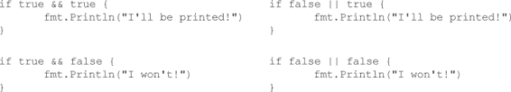
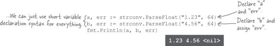
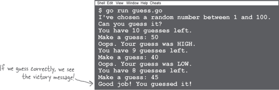

# 第二章：哪些代码将会接下来运行？：条件语句和循环


**每个程序都有仅在特定情况下适用的部分**。“如果出现错误，则应运行此代码。否则，应运行其他代码。” 几乎每个程序包含应仅在某个*条件*为真时运行的代码。因此，几乎每种编程语言都提供了**条件语句**，让您可以确定是否运行代码段。Go 也不例外。

你可能还需要使您的一些代码运行*重复*。像大多数语言一样，Go 提供了可以多次运行代码段的**循环**。我们将在本章学习如何同时使用条件语句和循环！

# 调用方法

在 Go 中，可以定义**方法**：与给定类型的值相关联的函数。Go 方法有点像您可能在其他语言中附加到“对象”的方法，但它们稍微简单一些。

我们将详细讨论方法如何在第九章中工作。但我们需要使用一些方法来使本章的示例工作，所以让我们现在看一些调用方法的简短示例。

`time` 包有一个 `Time` 类型，表示日期（年、月和日）和时间（时、分、秒等）。每个 `time.Time` 值都有一个 `Year` 方法，返回年份。下面的代码使用此方法打印当前年份：


`time.Now` 函数返回当前日期和时间的新 `Time` 值，我们将其存储在 `now` 变量中。然后，我们在 `now` 引用的值上调用 `Year` 方法：


`Year` 方法返回一个整数年份，然后我们将其打印出来。

> **方法是与特定类型的值相关联的函数**。

`strings` 包中有一个 `Replacer` 类型，它可以搜索字符串中的子字符串，并将每个出现的子字符串替换为另一个字符串。下面的代码用字母 `o` 替换了字符串中的每个 `#` 符号：


`strings.NewReplacer` 函数接受两个参数，第一个是要替换的字符串（`"#"`），第二个是要替换为的字符串（`"o"`），并返回一个 `strings.Replacer`。当我们将字符串传递给 `Replacer` 值的 `Replace` 方法时，它将返回一个已进行替换的字符串。


**点号指示点右侧的东西属于左侧的东西**。

与我们早些时候看到的函数属于*包*不同，方法属于一个单独的*值*。这个值是出现在点号左侧的内容。


# 取得好成绩

在本章中，我们将探讨 Go 的一些特性，这些特性让您可以根据条件决定是否运行一些代码。让我们看一个可能需要这种能力的情况...

我们需要编写一个程序，允许学生输入他们的百分比成绩，并告诉他们是否通过了。通过或失败遵循一个简单的规则：60%或更高的成绩为通过，低于 60%为失败。因此，如果用户输入的百分比是 60 或更高，我们的程序将需要给出一种响应；否则给出另一种响应。

# 注释

让我们创建一个新文件，*pass_fail.go*，来保存我们的程序。我们将处理之前程序中遗漏的一个细节，并在顶部添加一个描述程序功能的描述。


大多数 Go 程序在其源代码中包含了描述程序功能的注释，这些注释供维护程序的人阅读。编译器会忽略这些**注释**。

最常见的注释形式是用两个斜杠字符（`//`）标记的。从斜杠开始到行末的所有内容都视为注释的一部分。`//` 注释可以单独出现在一行上，也可以跟随在代码行后面。

```go
// The total number of widgets in the system.
var TotalCount int // Can only be a whole number.
```

不太常用的注释形式是**块注释**，跨越多行。块注释以`/*`开头，以`*/`结束，两者之间的所有内容（包括换行）都是注释的一部分。

```go
/*
Package widget includes all the functions used
for processing widgets.
*/
```

# 获取用户的成绩

现在让我们向我们的 *pass_fail.go* 程序添加一些实际的代码。它首先需要做的是允许用户输入一个百分比成绩。我们希望他们输入一个数字并按回车，我们将把他们输入的数字存储在一个变量中。让我们添加处理此操作的代码。（*注意：此代码将不能按照显示的方式编译，我们稍后会讨论原因！*）


首先，我们需要让用户知道输入内容，因此我们使用`fmt.Print`函数显示一个提示。 （与`Println`函数不同，`Print`在打印消息后不会跳到新的终端行，这使我们可以保持提示和用户输入在同一行上。）

接下来，我们需要一种方法从程序的*标准输入*中读取（接收和存储）输入，所有键盘输入都将进入这里。行`reader := bufio.NewReader(os.Stdin)`在变量`reader`中存储了一个能够执行此操作的`bufio.Reader`。


要实际获取用户的输入，我们在`Reader`上调用`ReadString`方法。`ReadString`方法需要一个标志输入结束的符文（字符），我们希望读取用户按下回车键之前的所有内容，因此我们给`ReadString`传递一个换行符符文。

一旦我们获取了用户的输入，我们就简单地将其打印出来。

那就是计划，但是如果我们试图编译或运行这个程序，我们将会得到一个错误：


# 函数或方法的多返回值

我们试图读取用户的键盘输入，但是出现了错误。编译器在这行代码中报告了一个问题：


问题在于 `ReadString` 方法试图返回*两个*值，但我们只提供了*一个*变量来接收值。

在大多数编程语言中，函数和方法只能有一个返回值，但在 Go 语言中，它们可以返回任意数量的值。在 Go 语言中多返回值的最常见用法是返回额外的错误值，可以通过它来查找函数或方法执行过程中是否出现了问题。以下是一些例子：


**Go 语言不允许我们声明变量而不使用它**。

Go 语言要求每个被*声明*的变量在程序中必须被*使用*。如果我们添加了一个 `err` 变量但没有检查它，我们的代码就无法编译通过。未使用的变量通常表示程序中可能存在的错误，这是 Go 语言帮助你检测和修复错误的一个例子！


# 选项 1：使用空白标识符忽略错误返回值

`ReadString` 方法除了返回用户输入的值外，还返回一个第二个值，我们需要对这第二个值做些处理。我们尝试添加第二个变量并忽略它，但我们的代码仍然无法编译通过。


当我们有一个通常会被赋值给变量但我们不打算使用的值时，可以使用 Go 语言的**空白标识符**。将值赋给空白标识符实际上是将其丢弃（同时也向读者明确表明你正在这样做）。要使用空白标识符，在赋值语句中简单地输入一个下划线（ `_` ）字符，替代你通常会输入的变量名。

让我们试着用空白标识符替代我们以前的 `err` 变量：


现在我们来尝试这个变化。在你的终端中，切换到保存了 *pass_fail.go* 文件的目录，并使用以下命令运行程序：


当你在提示符处输入一个成绩（或任何其他字符串）并按 Enter 键时，你输入的内容将被回显给你。我们的程序正在工作！

# 选项 2：处理错误


**这是真的。如果真的发生错误，这个程序就不会告诉我们！**

如果我们从 `ReadString` 方法得到一个错误，空白标识符将会忽略这个错误，并且我们的程序会继续运行，可能会带来无效的数据。


在这种情况下，如果出现错误，最好通知用户并停止程序。

`log` 包中有一个 `Fatal` 函数可以同时执行这两个操作：向终端记录消息并停止程序运行。在这里，`Fatal`表示报告一个“致命”的错误，即会“杀死”你的程序。

让我们去掉空白标识符，将其替换为 `err` 变量，这样我们再次记录错误。然后，我们将使用 `Fatal` 函数记录错误并停止程序。


但如果我们尝试运行这个更新后的程序，我们会发现有一个新问题...

# 条件语句

如果我们的程序在从键盘读取输入时遇到问题，我们已设置程序报告错误并停止运行。但现在，即使一切正常，它也停止运行！


像`ReadString`这样的函数和方法返回一个值为**nil**的错误，这基本上意味着“没有任何内容”。换句话说，如果`err`是`nil`，那么没有错误。但是我们的程序设置为简单地报告`nil`错误！我们*应该*的是只有在`err`变量的值不是`nil`时才退出程序。

我们可以通过**条件语句**来实现这一点：这些语句会导致仅在满足条件时执行一个代码块（一个或多个被`{}`大括号包围的语句）。


表达式被评估，如果结果为`true`，则执行条件块中的代码。如果结果为`false`，则跳过条件块。


与大多数其他语言一样，Go 支持条件中的多个分支。这些语句采用`if`...`else if`...`else`的形式。

```go
if grade == 100 {
       fmt.Println("Perfect!")
} else if grade >= 60 {
       fmt.Println("You pass.")
} else {
       fmt.Println("You fail!")
}
```

条件语句依赖于布尔表达式（一个评估为`true`或`false`的表达式），以决定它们包含的代码是否应该被执行。


当你需要仅在条件*false*时执行代码时，可以使用`!`，布尔取反运算符，它可以将`true`变为`false`，或者将`false`变为`true`。


如果你想只在两个条件*都*为真时运行一些代码，你可以使用`&&`（“和”）运算符。如果你希望在两个条件*之一*为真时运行，你可以使用`||`（“或”）运算符。



# 没有愚蠢的问题

**Q: 我的另一种编程语言要求`**if**`语句的条件必须用括号括起来。Go 也是这样吗？**

**A:** 不是，并且事实上，`go fmt`工具会删除您添加的任何括号，除非您用它们来设置操作顺序。

# 有条件地记录致命错误

即使我们的成绩评估程序成功从键盘读取输入，也会报告错误并退出。


我们知道如果`err`变量的值为`nil`，那么从键盘读取是成功的。既然我们知道了`if`语句，让我们尝试更新我们的代码，只有当`err`不是`nil`时才记录错误并退出。


如果我们重新运行我们的程序，我们会看到它又开始工作了。现在，如果在读取用户输入时有任何错误，我们也会看到这些错误！


# 代码磁铁


冰箱上有一个打印文件大小的 Go 程序。它调用`os.Stat`函数，该函数返回一个`os.FileInfo`值，可能还有一个错误值。然后它调用`FileInfo`值上的`Size`方法以获取文件大小。

但原始程序使用`_`空白标识符来忽略从`os.Stat`返回的错误值。如果发生错误（例如文件不存在），这将导致程序失败。

重构额外的代码片段，使其功能与原始程序完全相同，但还要检查来自`os.Stat`的错误。如果`os.Stat`返回的错误不是`nil`，则应报告错误并退出程序。丢弃带有`_`空白标识符的磁铁；它在最终程序中不会被使用。


 答案在“代码磁铁解决方案”中。

# 避免名称遮蔽


```go
fmt.Print("Enter a grade: ")
reader := bufio.NewReader(os.Stdin)
input, err := reader.ReadString('\n')
if err != nil {
       log.Fatal(err)
}
```

**命名一个变量为`**error**`是一个坏主意，因为它会遮蔽名为`**error**`的类型的名称**。

当您声明一个变量时，应确保它与任何现有的函数、包、类型或其他变量名称不同。如果在封闭作用域中存在同名内容（我们稍后会讨论作用域），则您的变量将**遮蔽**它——即优先使用它。而这往往是件坏事。

在这里，我们声明了一个名为`int`的变量，它遮蔽了一个类型名称，一个名为`append`的变量，它遮蔽了一个内置函数名称（我们将在第六章中看到`append`函数），以及一个名为`fmt`的变量，它遮蔽了一个导入的包名称。这些名称可能会让人感到尴尬，但它们本身并不会引发任何错误...


...但是，如果我们尝试访问变量遮蔽的类型、函数或包，将会获取变量中的值而不是预期的类型。在这种情况下，会导致编译错误：


为了避免自己和其他开发者的混淆，您应尽可能避免名称遮蔽。在这种情况下，修复问题就像选择与变量名不冲突的名称一样简单：


正如我们将在第三章中看到的那样，Go 语言有一个名为`error`的内置类型。因此，当声明用于保存错误的变量时，我们使用`err`而不是`error`的名称——我们希望避免用变量名遮蔽`error`类型的名称。


如果您将变量命名为`error`，您的代码可能仍然能够工作。也就是说，直到您忘记`error`类型名被遮蔽，并尝试使用该类型时，实际获取的是变量。不要冒这个风险；为您的错误变量使用名称`err`！

# 将字符串转换为数字

条件语句还允许我们评估输入的成绩。让我们添加一个 `if`/`else` 语句来确定成绩是及格还是不及格。如果输入的百分比成绩为 60 或更高，我们将将状态设置为 `"passing"`。否则，设置为 `"failing"`。

```go
// package and import statements omitted
func main() {
       fmt.Print("Enter a grade: ")
       reader := bufio.NewReader(os.Stdin)
       input, err := reader.ReadString('\n')
       if err != nil {
              log.Fatal(err)
       }
       if input >= 60 {
              status := "passing"
       } else {
              status := "failing"
       }
}
```

但是，按其当前形式，这会导致编译错误。


问题在于：键盘输入的 `input` 被读取为字符串。Go 只能将数字与其他数字进行比较；我们无法将数字与字符串进行比较。而且，从 `string` 直接转换为数字没有直接的类型转换：


我们需要解决一对问题：

+   `input` 字符串仍然在末尾具有换行符，因为用户输入时按 Enter 键。我们需要将其去除。

+   字符串的剩余部分需要转换为浮点数。

从 `input` 字符串末尾去除换行符将很容易。`strings` 包有一个 `TrimSpace` 函数，将从字符串开头和末尾去除所有空白字符（换行符、制表符和普通空格）。


因此，我们可以通过将其传递给 `TrimSpace` 来去除 `input` 上的换行符，并将返回值分配回 `input` 变量。

```go
input = strings.TrimSpace(input)
```

现在 `input` 字符串中应该只剩下用户输入的数字。我们可以使用 `strconv` 包的 `ParseFloat` 函数将其转换为 `float64` 值。


您将 `ParseFloat` 传递给要转换为数字的字符串，以及结果应具有的精度位数。因为我们要转换为 `float64` 值，所以传递数字 `64`。（除了 `float64`，Go 还提供了不那么精确的 `float32` 类型，但除非有充分的理由，否则不应使用。）

`ParseFloat` 将字符串转换为数字，并作为 `float64` 值返回。像 `ReadString` 一样，它还有一个第二个返回值，即错误，除非有某些问题转换字符串（例如，无法转换为数字的字符串。我们不知道 `"hello"` 的数字等价物...）

让我们更新 *pass_fail.go*，调用 `TrimSpace` 和 `ParseFloat`：


首先，我们向 `import` 部分添加适当的包。我们添加代码以从 `input` 字符串中删除换行符。然后将 `input` 传递给 `ParseFloat`，并将生成的 `float64` 值存储在新变量 `grade` 中。

就像我们在 `ReadString` 中所做的那样，我们测试 `ParseFloat` 是否返回错误值。如果返回错误，我们报告错误并停止程序。

最后，我们更新条件语句，以测试 `grade` 中的数字，而不是 `input` 中的字符串。这应该修复由于比较字符串与数字而导致的错误。

如果我们尝试运行更新后的程序，就不再会出现`类型不匹配的字符串和整数`错误。看起来我们已经解决了那个问题。但是还有几个错误需要解决。接下来我们会看看这些。


# 块

我们已将用户的成绩输入转换为`float64`值，并将其添加到条件语句中以确定是否通过或失败。但我们又遇到了几个编译错误：


正如我们之前看到的，像`status`这样声明一个变量，而后不使用它是 Go 语言中的一个错误。我们得到错误两次似乎有些奇怪，但现在先不管它。我们将在`Println`中添加一个调用，打印给定的百分比成绩和`status`的值。


但是现在我们又得到了一个*新*的错误，说在我们的`Println`语句中尝试使用`status`变量时未定义！出了什么问题？

Go 代码可以被划分为**块**，代码段。块通常用花括号(`{}`)括起来，虽然在源代码文件和包级别也有块。块可以嵌套在彼此内部。


函数体和条件语句的主体也都是块。理解这一点将对解决我们在`status`变量上的问题至关重要…

# 块和变量作用域

每个你声明的变量都有一个**作用域**：它在代码中“可见”的一部分。声明的变量可以在其作用域内的任何地方访问，但如果你尝试在该作用域之外访问它，就会收到一个错误。

变量的作用域包括它声明的块及其嵌套在其中的任何块。


以上是代码中变量的作用域：

+   `packageVar`的作用域是整个`main`包。你可以在包中定义的任何函数内部的任何地方访问`packageVar`。

+   `functionVar`的作用域是它所声明的整个函数，包括该函数内部嵌套的`if`块。

+   `conditionalVar`的作用域仅限于`if`块。当我们在`if`块的闭合`}`后尝试访问`conditionalVar`时，将会收到一个错误，提示`conditionalVar`未定义！

现在我们理解了变量作用域，我们可以解释为什么我们的`status`变量在评分程序中未定义了。我们在条件块中声明了`status`。（事实上，我们声明了两次，因为有两个单独的块。这就是为什么我们会得到两个`status declared and not used`错误。）但是后来我们试图在那些块的*外部*访问`status`，此时它已经不在作用域内了。


解决方案是将`status`变量的声明移出条件块，并移到函数块顶部。这样一来，`status`变量将在嵌套的条件块内部和函数块的末尾都可以访问。


# 我们已完成评分程序！

就这样！我们的*pass_fail.go*程序已经准备就绪！让我们再看一下完整的代码：


你可以随意运行完成的程序多次。输入低于 60 的百分比成绩，它将报告不及格状态。输入超过 60 的成绩，它将报告及格状态。看起来一切正常运行！


# 短变量声明中只有一个变量必须是新的


的确，当在同一作用域内声明同名变量两次时，我们会得到一个编译错误：


但只要短变量声明中至少有一个变量名是新的，就是允许的。新变量名被视为声明，现有变量名被视为赋值。


有一个特殊处理的原因：很多 Go 函数返回多个值。如果你因为想重用其中一个变量而不得不单独声明所有变量会很麻烦。


相反，Go 允许你为所有东西使用短变量声明，即使对于*一个*变量，它实际上是一个赋值操作。



# 让我们来制作一个游戏

我们将通过制作一个简单的游戏来结束本章。如果听起来有些艰巨，不用担心；你已经学会了大部分你将需要的技能！在此过程中，我们将学习关于*循环*的知识，这将允许玩家进行多次回合。

让我们看看我们需要做的所有事情：


###### 注意

这个例子首次出现在《Head First Ruby》中。（另一本你也应该买的好书！）它非常成功，所以我们在这里再次使用它。


###### 图 2-1\. 加里·理查德特 游戏设计师

让我们创建一个名为*guess.go*的新源文件。

看起来我们的第一个要求是生成一个随机数。让我们开始吧！

# 包名与导入路径

`math/rand`包有一个`Intn`函数可以为我们生成一个随机数，所以我们需要导入`math/rand`。然后我们将调用`rand.Intn`来生成随机数。


**一个是包的导入路径，另一个是包的名称**。

当我们说`math/rand`时，我们指的是包的*导入路径*，而不是*名称*。**导入路径**只是一个唯一的字符串，用于标识一个包，并在`import`语句中使用。导入了包之后，可以用其包名引用它。

到目前为止，我们使用的每个包的导入路径都与包名相同。以下是一些示例：

| 导入路径 | 包名 |
| --- | --- |
| `"fmt"` | `fmt` |
| `"log"` | `log` |
| `"strings"` | `strings` |

但导入路径和包名不一定相同。许多 Go 包属于类似的类别，如压缩或复杂数学。因此，它们被分组到类似的导入路径前缀下，如 `"archive/"` 或 `"math/"`。（可以把它们想象成硬盘驱动器上目录的路径。）

| 导入路径 | 包名 |
| --- | --- |
| `"archive"` | `archive` |
| `"archive/tar"` | `tar` |
| `"archive/zip"` | `zip` |
| `"math"` | `math` |
| `"math/cmplx"` | `cmplx` |
| `"math/rand"` | `rand` |

虽然 Go 语言不要求包名与其导入路径有任何关系，但按照惯例，导入路径的最后（或唯一）段也用作包名。因此，如果导入路径是 `"archive"`，包名将是 `archive`，如果导入路径是 `"archive/zip"`，包名将是 `zip`。

| 导入路径 | 包名 |
| --- | --- |
| `"archive"` | archive |
| `"archive/tar"` | `tar` |
| `"archive/zip"` | `zip` |
| `"math"` | `math` |
| `"math/cmplx"` | cmplx |
| `"math/rand"` | rand |

所以，这就是为什么我们的 `import` 语句使用路径 `"math/rand"`，但我们的 `main` 函数只使用包名 `rand`。


# 生成一个随机数

将一个数字传递给 `rand.Intn`，它将返回一个介于 `0` 和你提供的数字之间的随机整数。换句话说，如果我们传递一个参数 `100`，我们将得到一个在 0 到 99 范围内的随机数。由于我们需要的是 1 到 100 范围内的数，我们将随机值加 `1`。我们将结果存储在变量 `target` 中。稍后我们会进一步处理 `target`，但现在我们只需打印它。


如果我们现在尝试运行程序，我们将得到一个随机数。但我们每次都只得到*相同*的随机数！问题在于，计算机生成的随机数并不是真正随机的。但有一种方法可以增加这种随机性……


为了获得不同的随机数，我们需要向 `rand.Seed` 函数传递一个值。这将“种子”随机数生成器，即给它一个值，它将用来生成其他随机值。但如果我们继续给它相同的种子值，它将一直给我们相同的随机值，我们将回到原点。

我们之前看到 `time.Now` 函数会给我们一个代表当前日期和时间的 `Time` 值。我们可以用它来获得每次运行程序时都不同的种子值。


函数 `rand.Seed` 需要一个整数作为参数，所以我们不能直接传递一个 `Time` 值。相反，我们在 `Time` 上调用 `Unix` 方法，它会将其转换为一个整数（具体来说，它会转换为 Unix 时间格式，这是一个自 1970 年 1 月 1 日以来的秒数整数。但你不必真正记住这些。）我们将这个整数传递给 `rand.Seed`。

我们还添加了几个`Println`调用，让用户知道我们选择了一个随机数。但除此之外，我们可以保留其余代码，包括对`rand.Intn`的调用。播种生成器应该是我们需要做的唯一更改。

现在，每次运行我们的程序，我们都会看到我们的消息，以及一个随机数。看起来我们的更改是成功的！


# 从键盘获取一个整数

我们的第一个要求已完成！接下来我们需要通过键盘获取用户的猜测。

这应该与我们为分级程序从键盘读取百分比成绩时的方式基本相同。


只有一个区别：我们需要将输入转换为`int`（因为我们的猜数字游戏只使用整数）。因此，我们将从键盘读取的字符串传递给`strconv`包的`Atoi`（字符串转整数）函数，而不是它的`ParseFloat`函数。`Atoi`将返回一个整数作为其返回值。（就像`ParseFloat`一样，如果无法转换字符串，`Atoi`也可能会给我们一个错误。如果发生这种情况，我们再次报告错误并退出。）


# 将猜测与目标进行比较

另一个要求完成了。接下来将很容易...我们只需要将用户的猜测与随机生成的数字进行比较，并告诉他们猜测是高还是低。


如果`guess`小于`target`，我们需要打印一条消息说猜测偏低。*否则，如果*`guess`大于`target`，我们应该打印一条消息说猜测偏高。听起来我们需要一个`if`...`else if`语句。我们将在`main`函数中的其他代码下面添加它。


现在尝试从终端运行我们更新后的程序。它仍然设置为每次运行时打印`target`，这对于调试很有用。只需输入一个低于`target`的数字，你应该会被告知你的猜测偏低。如果重新运行程序，你将得到一个新的`target`值。输入一个高于该值的数字，你将被告知你的猜测偏高。


# 循环

又一个要求完成了！让我们看看下一个。


目前，玩家只能猜一次，但我们需要允许他们最多猜`10`次。

提示玩家猜测的代码已经就位。我们只需要*多次*运行它。我们可以使用**循环**来重复执行一段代码。如果你使用过其他编程语言，你可能遇到过循环。当你需要一条或多条语句重复执行时，你将它们放在循环内部。


循环总是以`for`关键字开头。在一种常见的循环中，`for`后面跟着三个控制循环的代码段：

+   一个初始化语句，通常用于初始化一个变量

+   一个条件表达式，确定何时退出循环

+   后置语句在每次循环迭代后运行

通常，初始化语句用于初始化变量，条件表达式使循环在变量达到特定值之前继续运行，后置语句用于更新该变量的值。例如，在此片段中，`t` 变量初始化为 `3`，条件为 `t > 0` 时循环继续运行，并且后置语句每次循环时从 `t` 减去 `1`。最终，`t` 达到 `0` 时循环结束。


`++` 和 `--` 语句经常用作循环后置语句。每次评估它们时，`++` 将 `1` 添加到变量的值，而 `--` 将 `1` 减去。


`++` 和 `--` 在循环中使用时，便于计数向上或向下。


Go 还包括赋值运算符 `+=` 和 `-=`。它们获取变量中的值，添加或减去另一个值，然后将结果重新赋给变量。


`+=` 和 `-=` 可以在循环中使用，以便按照除 `1` 外的增量计数。


当循环结束时，执行将恢复到循环块后面的语句。但只要条件表达式评估为`true`，循环将继续进行。这可能被滥用；以下是永远运行的循环示例和根本不会运行的循环示例：


# 初始化语句和后置语句是可选的

如果愿意，您可以从 `for` 循环中省略初始化和后置语句，仅留下条件表达式（尽管您仍然需要确保条件最终评估为 `false`，否则您可能会遇到无限循环的问题）。


# 循环和作用域

就像条件语句一样，循环块内声明的任何变量的作用域仅限于该块（尽管初始化语句、条件表达式和后置语句也可视为该作用域的一部分）。


就像条件语句一样，在循环的控制语句和块之前声明的任何变量*仍然*在循环内的作用域内，并且在循环退出后*仍然*在作用域内。


# 破坏东西是教育性的！


这是一个使用循环计数到 `3` 的程序。尝试进行以下更改并运行它。然后撤消您的更改并尝试下一个。看看会发生什么！


| 如果你这样做... | ...它会中断，因为... |
| --- | --- |
| 在 `for` 关键字后加上括号 `for (x := 1; x <= 3; x++)` | 某些其他语言要求在 `for` 循环的控制语句周围加上括号，但是 Go 不仅不需要它们，而且*禁止*使用它们。 |
| 从初始化语句`x = 1`中删除`:` | 除非你正在给封闭作用域中已声明的变量赋值（通常情况下不会这样），初始化语句必须是一个*声明*，而不是一个*赋值*。 |
| 从条件表达式`x < 3`中移除`=` | 当`x`达到`3`时，表达式`x < 3`变为`false`（而`x <= 3`仍然为`true`）。因此，循环只会计数到`2`。 |
| 反转条件表达式`x >= 3`中的比较 | 因为条件在循环开始时已经是`false`（`x`被初始化为`1`，比`3`*小*），所以循环永远不会运行。 |
| 将后置语句从`x++`改为`x--` `x--` | `x`变量将从`1`开始递减（`1`、`0`、`-1`、`-2`等），并且由于它永远不会大于`3`，因此循环永远不会结束。 |
| 将`fmt.Println(x)`语句移到循环块之外 | 在初始化语句或循环块内声明的变量只在循环块内有效。 |

# 在我们的猜测游戏中使用循环

我们的游戏仍然只提示用户一次猜测。让我们在提示用户猜测并告知他们是否太低或太高的代码周围添加一个循环，以便用户可以猜测 10 次。

我们将使用一个名为`guesses`的`int`变量来跟踪玩家已经猜测的次数。在循环的初始化语句中，我们将`guesses`初始化为`0`。每次循环迭代时，我们将`guesses`加`1`，当`guesses`达到`10`时，我们将停止循环。

我们还将在循环块的顶部添加一个`Println`语句，告诉用户剩余的猜测次数。


现在我们的循环已经就位，如果再次运行游戏，我们将被询问 10 次猜测的内容！


由于用于提示猜测并声明是否过高或过低的代码位于循环内部，因此它会被重复运行。经过 10 次猜测后，循环（和游戏）将结束。

但是即使玩家猜对了，循环也总是运行 10 次！修复这个问题将是我们的下一个要求。

# 使用“continue”和“break”跳过循环的部分

辛苦部分已经完成！我们只剩下几个要求需要完成。

目前，提示用户猜测的循环总是运行 10 次。即使玩家猜对了，我们也不告诉他们，并且我们不停止循环。我们的下一个任务是修复这个问题。


Go 语言提供了两个控制循环流程的关键字。第一个是`continue`，立即跳到循环的下一次迭代，而不执行循环块中的任何其他代码。


在上述示例中，字符串`"after continue"`永远不会被打印，因为`continue`关键字总是在第二次调用`Println`之前跳回循环顶部。

第二个关键字，`break`，立即中断循环。循环块内部的代码不再执行，也不再进行进一步的迭代。执行转移到循环后的第一个语句。


在循环的第一次迭代中，字符串 `"before break"` 被打印出来，但是 `break` 语句立即中断了循环，没有打印 `"after break"` 字符串，并且不再运行循环（尽管通常还会再运行两次）。执行转而移到循环后的语句。

`break` 关键字似乎适用于我们当前的问题：当玩家猜测正确时，我们需要中断循环。让我们在游戏中尝试使用它...

# 退出我们的猜测循环

我们正在使用 `if`...`else if` 条件语句来告诉玩家他们猜测的状态。如果玩家猜测的数字太高或太低，我们目前会打印一条消息告诉他们。

如果猜测既不太高*也*不太低，那么它必须是正确的。因此，让我们在条件语句上添加一个 `else` 分支，在猜测正确的情况下运行。在 `else` 分支的块内部，我们会告诉玩家他们猜对了，并使用 `break` 语句来停止猜测循环。


现在，当玩家猜测正确时，他们将看到一条祝贺的消息，并且循环将在不再完全重复 10 次的情况下退出。


又完成了另一个要求！

# 揭示目标


我们离成功*如此*近！只剩下一个要求了！

如果玩家猜测了 10 次仍未找到目标数字，则循环将退出。在这种情况下，我们需要打印一条消息告诉他们输了，并告诉他们目标是什么。

但是，如果玩家猜对了，我们*也*会退出循环。我们不希望在玩家已经赢得胜利时说他们输了！

因此，在我们的猜测循环之前，我们将声明一个 `success` 变量，它保存一个布尔值。（我们需要在循环之前声明它，以便在循环结束后仍然在范围内。）我们将 `success` 初始化为默认值 `false`。然后，如果玩家猜对了，我们将 `success` 设置为 `true`，表示我们不需要打印失败消息。


在循环之后，我们添加了一个 `if` 块来打印失败消息。但是 `if` 块只有在条件为 `true` 时才会执行，我们只想在 `success` 为 `false` 时打印失败消息。因此，我们添加了布尔取反运算符（`!`）。正如我们之前看到的，`!` 将 `true` 变为 `false`，将 `false` 变为 `true`。

结果是，如果 `success` 是 `false`，则会打印失败消息，但如果 `success` 是 `true`，则不会打印。

# 最后的润色


恭喜，这是最后一个要求！

让我们处理一些代码的最后问题，然后试试我们的游戏！

首先，正如我们提到的，每个 Go 程序顶部通常添加一条注释来描述其功能。现在让我们添加一条。


我们的程序还通过在每次游戏开始时打印目标数字来鼓励作弊者。让我们删除执行此操作的 `Println` 调用。


我们终于准备好尝试运行我们的完整代码了！

首先，我们故意用尽猜测次数以确保目标数字被显示...


然后我们将尝试成功猜测。

我们的游戏运行得很顺利！



# 恭喜，您的游戏已完成！


使用条件和循环，您已在 Go 中编写了一个完整的游戏！请为自己倒一杯冷饮——您赢得了它！

> **这是我们完整的 guess.go 源代码！**


# 你的 Go 工具箱


**这就是第二章的全部内容！您已将条件和循环添加到您的工具箱中**。


###### 注意

**循环**

循环使一段代码重复执行。

一种常见的循环以关键字“for”开头，后跟初始化语句以初始化变量，条件表达式以确定何时退出循环，并且后置语句在每次循环迭代之后运行。

# 代码磁铁解决方案


一个打印文件大小的 Go 程序挂在冰箱上。它调用 `os.Stat` 函数，该函数返回一个 `os.FileInfo` 值和可能的错误。然后它调用 `FileInfo` 值上的 `Size` 方法来获取文件大小。

最初的程序使用 `_` 空标识符来忽略 `os.Stat` 中的错误值。如果发生错误（例如文件不存在），这会导致程序失败。

你的任务是重建额外的代码片段，使得程序像原始程序一样运行，但还要检查 `os.Stat` 的错误。如果 `os.Stat` 的错误不为 `nil`，则应报告错误并退出程序。


