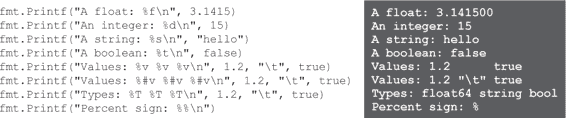
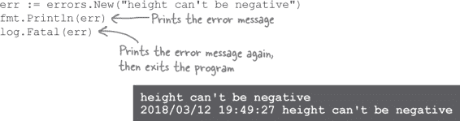
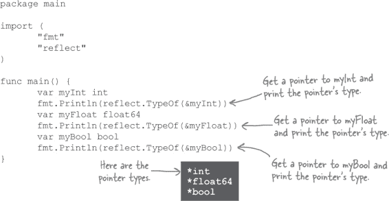

# 第三章。请打电话给我：函数


**你一直都在错过**。你已经像专业人士一样调用函数了。但是你能调用的函数只有 Go 为你定义的那些。现在轮到你了。我们将向你展示如何创建自己的函数。我们将学习如何声明带有和不带参数的函数。我们将声明返回单个值的函数，并学习如何返回多个值，以便在发生错误时指示。我们还将学习**指针**，它们允许我们进行更高效的内存管理。

# 一些重复的代码

假设我们需要计算涂料涂抹若干墙壁所需的量。制造商称每升涂料可以覆盖 10 平方米。因此，我们需要将每堵墙的宽度（以米为单位）乘以其高度，得到其面积，然后除以 10 得到所需的涂料升数。


这样做虽然可行，但存在几个问题：

+   计算结果似乎有微小的误差，并且打印出来的浮点数值显得异常精确。我们实际上只需要几位小数的精度。

+   即使现在也有相当多的重复代码。随着我们添加更多的墙壁，这个问题会变得更糟。

对于这两个问题都需要一些解释，所以现在先来看看第一个问题...

这些计算略有偏差，因为计算机上的普通浮点数算术略微不精确。（通常是几百万亿分之几。）造成这种情况的原因有点复杂，这里不便深究，但这个问题并非 Go 所独有。

但只要我们在显示之前将数字四舍五入到一个合理的精度，那就没问题。让我们稍作停顿，看看一个可以帮助我们做到这一点的函数。


# 使用 Printf 和 Sprintf 格式化输出


Go 中的浮点数保持着高度的精确度。当你想要显示它们时，这可能会有些麻烦：


为了处理这类格式化问题，`fmt` 包提供了 `Printf` 函数。`Printf` 代表“**打印**，带有**格式化**”。它接受一个字符串，并在其中插入一个或多个值，以特定的方式格式化。然后打印出结果字符串。


`Sprintf` 函数（也是 `fmt` 包的一部分）与 `Printf` 函数的工作方式几乎一样，唯一的区别是它返回格式化后的字符串而不是直接打印出来。


看起来 `Printf` 和 `Sprintf` *可以* 帮助我们限制所显示的值的正确位数。问题在于，*如何*？首先，为了能够有效地使用 `Printf` 函数，我们需要了解它的两个特性：

+   格式化动词（上述字符串中的 `%0.2f` 是一个动词）

+   值的宽度（这是动词中间的 `0.2`）

# 格式化动词


`Printf` 的第一个参数是一个字符串，将用于格式化输出。大部分字符串的格式化方式与其显示的方式完全一样。然而，任何百分号（`%`）都将被视为格式化动词的开始，这部分字符串将被替换为特定格式的值。其余的参数被用作这些动词的值。


百分号后面的字母表示要使用的动词。最常见的动词包括：

| 动词 | 输出 |
| --- | --- |
| %f | 浮点数 |
| %d | 十进制整数 |
| %s | 字符串 |
| %t | 布尔值（`true` 或 `false`） |
| %v | 任意值（根据提供的值的类型选择适当的格式） |
| %#v | 任意值，格式化为 Go 程序代码中的形式 |
| %T | 提供的值的类型（`int`、`string`等） |
| %% | 字面上的百分号 |



顺便提一下，我们确保在每个格式化字符串的末尾添加一个换行符 `\n` 转义序列。这是因为与 `Println` 不同，`Printf` 不会为我们自动添加换行符。


我们特别想指出 `%#v` 格式化动词。因为它打印值的方式类似于它们在 Go 代码中的显示方式，而不是它们通常的显示方式，因此 `%#v` 可以显示出在 `%v` 中隐藏的一些值。例如，在这段代码中，`%#v` 显示了一个空字符串、一个制表符和一个换行符，这些在使用 `%v` 打印时是看不到的。我们将在本书的后续部分更多地使用 `%#v`！


# 格式化值的宽度

因此，`%f` 格式化动词适用于浮点数。我们可以在我们的程序中使用 `%f` 格式化所需的油漆量。


看起来我们的值被四舍五入到一个合理的数字。但是它仍然显示小数点后的六位，这对于我们当前的目的来说实在太多了。

对于这样的情况，格式化动词允许您指定格式化值的*宽度*。

假设我们想要在一个纯文本表格中格式化一些数据。我们需要确保格式化后的值填充到最小的空格数，以便列对齐。

您可以在百分号后指定格式化动词的最小宽度。如果与该动词匹配的参数比最小宽度短，它将填充空格，直到达到最小宽度。


# 格式化小数位数的宽度


现在我们来到了今天任务中重要的部分：您可以使用值的宽度来指定浮点数的精度（显示的数字位数）。这是格式：


整个数字的最小宽度包括小数位和小数点。如果包括小数点，则较短的数字将在开始处用空格填充，直到达到这个宽度。如果省略小数点，则永远不会添加空格。

小数点后的宽度是要显示的小数位数。如果给出了更精确的数字，它将四舍五入（向上或向下）以适应给定的小数位数。

这里快速演示了各种宽度值的效果：


上述格式`"%.2f"`，可以将任意精度的浮点数四舍五入到两位小数。（它也不会添加任何不必要的填充。）让我们尝试一下，用我们程序中过于精确的值来计算油漆体积。


现在更易读了。看起来`Printf`函数可以为我们格式化数字。让我们回到我们的油漆计算器程序，并应用我们在那里学到的东西。


# 在我们的油漆计算器中使用 Printf

现在我们有了一个`Printf`动词`"%.2f"`，它将允许我们将浮点数四舍五入到两位小数。让我们更新我们的油漆数量计算程序来使用它。


最后，我们得到了合理的输出！浮点运算引入的微小不精确性已被四舍五入消除。


**好主意。Go 允许我们声明自己的函数，因此也许我们应该将这段代码移到一个函数中**。

正如我们在第一章开头提到的，函数是一组或多组可以从程序中的其他位置调用的代码行。我们的程序有两组看起来非常相似的行：


让我们看看能否将这两个代码部分转换为一个单一的函数。

# 声明函数

简单的函数声明可能看起来像这样：


声明以`func`关键字开头，后跟您希望函数具有的名称，一对括号`()`，然后是包含函数代码的块。

一旦声明了函数，你可以在包的其他地方简单地输入其名称，后跟一对括号，即可调用它。这样做时，函数块中的代码将被执行。


注意，当我们调用`sayHi`时，我们不需要输入包名和点号再输入函数名。当调用当前包中定义的函数时，不应指定包名。（键入`main.sayHi()`将导致编译错误。）

函数名称的规则与变量名称的规则相同：

+   名称必须以字母开头，后跟任意数量的其他字母和数字。（如果违反此规则，将会得到编译错误。）

+   函数名以大写字母开头的函数是*导出*的，可以在当前包之外使用。如果只需在当前包内使用函数，应以小写字母开头命名。

+   多个单词的名称应使用`camelCase`。


# 声明函数参数

如果希望调用函数时包含参数，必须声明一个或多个参数。**参数**是函数内部局部变量，在调用函数时设置其值。


可以在函数声明的括号内部声明一个或多个参数，用逗号分隔。与任何变量一样，需要为每个声明的参数提供一个名称，后跟一个类型（`float64`、`bool`等）。

> **参数是函数内部局部变量，在调用函数时设置其值。**

如果函数定义了参数，则在调用函数时需要传递匹配的参数集。运行函数时，每个参数将设置为对应参数中值的副本。然后在函数块中使用这些参数值。


# 在我们的油漆计算器中使用函数

现在我们知道如何声明自己的函数了，让我们看看能否消除油漆计算器中的重复。


我们将代码移到名为`paintNeeded`的函数中来计算油漆的量。我们将不再使用单独的`width`和`height`变量，而是将它们作为函数参数传入。然后，在我们的`main`函数中，我们只需为需要涂料的每面墙调用`paintNeeded`函数。


不再重复的代码，如果我们想要计算额外墙壁所需的涂料，只需添加更多对`paintNeeded`的调用。这样更加清晰！

# 函数和变量作用域

我们的`paintNeeded`函数在其函数块内声明了一个`area`变量：


与条件和循环块一样，函数块内声明的变量仅在该函数块内可见。因此，如果我们尝试在`paintNeeded`函数外部访问`area`变量，将会得到编译错误：


但是，与条件和循环块一样，声明在函数块*外部*的变量将在该块内可见。这意味着我们可以在包级别声明一个变量，并在该包中的任何函数中访问它。


# 函数返回值

假设我们想要计算所有需要涂料的墙壁的总量。我们无法使用当前的`paintNeeded`函数来实现这一点；它只是打印出量然后将其丢弃！


因此，让我们修改`paintNeeded`函数来返回一个值。然后，调用它的人可以打印这个量，进行额外的计算，或者做其他他们需要做的事情。

函数总是返回特定类型的值（仅限该类型）。要声明函数返回一个值，需在函数声明的参数后面添加返回值类型。然后在函数块中使用`return`关键字，后跟你想要返回的值。


调用函数的人可以将返回值分配给变量，直接传递给另一个函数，或者以其他方式处理它们。


当`return`语句执行时，函数立即退出，不再运行其后面的任何代码。你可以结合`if`语句使用它，在条件下退出函数，避免运行剩余的代码（由于错误或其他条件）。


这意味着，如果你包括一个不属于`if`块的`return`语句，可能有代码在任何情况下都不会运行。这几乎肯定表明代码中存在错误，因此 Go 通过要求任何声明返回类型的函数必须以`return`语句结束来帮助你检测这种情况。以其他任何语句结尾都会导致编译错误。


如果你的返回值类型与声明的返回类型不匹配，你也会得到编译错误。


# 在我们的涂料计算器中使用返回值

现在我们知道如何使用函数返回值了，让我们看看是否能更新我们的涂料程序，除了每面墙需要的量之外，还打印总共需要的涂料量。

我们将更新`paintNeeded`函数以返回所需的量。我们将在`main`函数中使用该返回值，既用于打印当前墙壁的量，又用于添加到`total`变量，以跟踪所需的总涂料量。


它奏效了！返回值使我们的`main`函数能够决定如何处理计算出的量，而不是依赖于`paintNeeded`函数来打印它。

# 破坏事物是教育性的！


这是我们更新后的`paintNeeded`函数版本，它返回一个值。尝试进行以下变更之一并尝试编译它。然后撤销您的更改并尝试下一个。看看会发生什么！

```go
func paintNeeded(width float64, height float64) float64 {
       area := width * height
       return area / 10.0
}
```

| 如果你这样做... | ...它会崩溃，因为... |
| --- | --- |
| 移除`return`语句：`func paintNeeded(width float64, height float64) float64 { area := width * height ~~return area / 10.0~~ }` | 如果函数声明了返回类型，Go 要求它包含一个`return`语句。 |
| 在`return`语句*之后*添加一行：`func paintNeeded(width float64, height float64) float64 { area := width * height return area / 10.0 fmt.Println(area / 10.0) }` | 如果函数声明了返回类型，Go 要求其最后一个语句必须是一个`return`语句。 |
| 删除返回类型声明：`func paintNeeded(width float64, height float64) float64 { area := width * height return area / 10.0 }` | Go 不允许返回未声明的值。 |
| 更改返回值的类型：`func paintNeeded(width float64, height float64) float64 { area := width * height return int(area / 10.0) }` | Go 要求返回值的类型与声明的类型匹配。 |

# `paintNeeded`函数需要错误处理


函数`paintNeeded`似乎不知道传递给它的参数是无效的。它继续在计算中使用了这个无效的参数，并返回了一个无效的结果。这是一个问题——即使你知道一个商店可以购买负数升的油漆，你真的想把它应用到你的房子上吗？我们需要一种方法来检测无效的参数并报告错误。

在第二章中，我们看到了几个不同的函数，除了它们的主要返回值外，还返回一个指示是否存在错误的第二个值。例如，`strconv.Atoi`函数尝试将字符串转换为整数。如果转换成功，它将返回一个`nil`的错误值，表示我们的程序可以继续执行。但如果错误值不是`nil`，则表示字符串无法转换为数字。在这种情况下，我们选择打印错误值并退出程序。


如果我们在调用`paintNeeded`函数时想要做同样的事情，我们将需要两样东西：

+   创建表示错误的值的能力

+   返回`paintNeeded`的额外值的能力

让我们开始弄清楚这个问题吧！

# 错误值

在我们能够从`paintNeeded`函数中返回一个错误值之前，我们需要一个错误值来返回。错误值是指具有名为`Error`并返回字符串的方法的任何值。创建一个最简单的方法是将字符串传递给`errors`包的`New`函数，它将返回一个新的错误值。如果你在该错误值上调用`Error`方法，你将得到你传递给`errors.New`的字符串。


但是，如果你将错误值传递给`fmt`或`log`包中的函数，你可能不需要调用它的`Error`方法。`fmt`和`log`中的函数已经被编写成检查传递给它们的值是否具有`Error`方法，并在需要时打印`Error`的返回值。



如果需要格式化数字或其他值以在错误消息中使用，可以使用`fmt.Errorf`函数。它将值插入到格式字符串中，类似于`fmt.Printf`或`fmt.Sprintf`，但不是打印或返回一个字符串，而是返回一个错误值。


# 声明多个返回值

现在我们需要一种方式来指定我们的`paintNeeded`函数将返回一个错误值和所需油漆的量。

要为函数声明多个返回值，请在函数声明中的第二组括号中放置返回值类型（在函数参数的括号之后），用逗号分隔。（如果只有一个返回值，返回值周围的括号是可选的，但如果有多个返回值，则是必需的。）

从那时起，当调用该函数时，你需要考虑额外的返回值，通常是通过将它们赋值给额外的变量来处理。


如果为返回值提供名称可以使其更清晰，类似于参数名称。命名返回值的主要目的是作为程序员阅读代码的文档。


# 使用多个返回值与我们的`paintNeeded`函数

正如我们在上一页看到的那样，可以返回任意类型的多个值。但多返回值的最常见用途是返回主要的返回值，后面跟着一个额外的值，指示函数是否遇到错误。如果没有问题，额外的值通常设为`nil`，如果发生错误则设为错误值。

我们将遵循`paintNeeded`函数的这一约定。我们声明它返回两个值，一个`float64`和一个`error`。（错误值的类型是`error`。）在函数块中的第一件事是检查参数是否有效。如果`width`或`height`参数小于`0`，我们将返回油漆量为`0`（这是无意义的，但我们必须返回一些东西），并且通过调用`fmt.Errorf`生成一个错误值。在函数开始时检查错误使我们可以通过调用`return`轻松地跳过函数代码的其余部分，如果有问题的话。

如果参数没有问题，我们将像以前一样继续计算和返回油漆量。函数代码中的唯一区别是，我们返回第二个值`nil`与油漆量一起，以表示没有错误。


在`main`函数中，我们添加第二个变量来记录来自`paintNeeded`的错误值。我们打印错误（如果有的话），然后打印油漆量。

如果我们向`paintNeeded`传递一个无效的参数，我们将得到一个错误返回值，并打印该错误。但我们还会得到`0`作为涂料量。（正如我们所说，当有错误时，这个值是无意义的，但我们必须对第一个返回值使用*某些东西*。）因此，我们最终打印出了消息“0.00 升液体需要”！我们需要修复这个问题...

# 总是处理错误！

当我们向`paintNeeded`传递无效的参数时，我们会得到一个错误值，我们将其打印供用户查看。但我们还得到了一个（无效的）涂料量，我们也将其打印了出来！


当函数返回一个错误值时，通常也必须返回一个主要的返回值。但是伴随错误值返回的任何其他返回值应被视为不可靠，并被忽略。

当你调用一个返回错误值的函数时，重要的是在继续之前测试该值是否为`nil`。如果它不是`nil`，意味着有一个必须处理的错误。

*如何*处理错误取决于具体情况。在我们的`paintNeeded`函数的情况下，最好只是跳过当前计算，并继续执行程序的其余部分：


但由于这是一个如此简短的程序，你可以调用`log.Fatal`来显示错误消息并退出程序。


重要的是要记住，你应该始终检查返回值，看看是否*有*错误。在那一点上，你对错误的处理方式由你决定！

# 破解东西是教育性的！


这是一个计算数字平方根的程序。但是如果将负数传递给`squareRoot`函数，它将返回一个错误值。做出以下一种修改并尝试编译它。然后撤销你的修改并尝试下一种。看看会发生什么！

```go
package main

import (
       "fmt"
       "math"
)
func squareRoot(number float64) (float64, error) {
       if number < 0 {
              return 0, fmt.Errorf("can't get square root of negative number")
       }
       return math.Sqrt(number), nil
}

func main() {
       root, err := squareRoot(-9.3)
       if err != nil {
              fmt.Println(err)
       } else {
              fmt.Printf("%0.3f", root)
       }
}
```

| 如果你这样做... | ...它会破解因为... |
| --- | --- |
| 移除一个`return`的参数：`return math.Sqrt(number)~~, nil~~` | `return`语句中的参数数量必须始终与函数声明中的返回值数量匹配。 |
| 移除其中一个变量的返回值赋值：`root~~, err~~ := squareRoot(-9.3)` | 如果你使用了函数的任何返回值，Go 要求你使用所有的返回值。 |
| 移除使用其中一个返回值的代码：`root, err := squareRoot(-9.3) ~~if err != nil {~~ ~~fmt.Println(err)~~ ~~} else {~~ fmt.Printf("%0.3f", root) ~~}~~` | Go 要求你使用你声明的每一个变量。这实际上是一个非常有用的特性，特别是在处理错误返回值时，它有助于防止意外忽略错误。 |

# 池难题


你的**任务**是从池中选择代码片段，并将它们放入代码中的空白行中。**不要**重复使用同一个片段，并且不需要使用所有片段。你的**目标**是编写能够运行并产生所示输出的代码。


**注意：每个池中的片段只能使用一次！**

 答案在 “池谜题解答”。

# 函数参数接收参数的副本

正如我们提到的，当你调用声明了参数的函数时，需要为调用提供参数。每个参数中的值都被*复制*到对应的参数变量中。（执行此操作的编程语言有时被称为“传值”。）

> **Go 是一种“传值”语言；函数参数接收函数调用中参数的一个副本。**

在大多数情况下这没问题。但是如果你想将变量的值传递给函数，并以某种方式*更改*该值，你会遇到麻烦。函数只能更改其参数中值的*副本*，而不能更改原始值。因此，在函数内部进行的任何更改都不会在函数外部可见！

这是我们之前展示的 `double` 函数的更新版本。它接受一个数字，将其乘以 2，并打印结果。（它使用 `*=` 运算符，工作方式与 `+=` 相同，但它将变量的值乘以而不是加上。）


假设我们想要将打印加倍值的语句从 `double` 函数移回调用它的函数中。这是行不通的，因为 `double` 只会修改它的*值副本*。回到调用函数时，我们将得到原始值，而不是加倍后的值！


我们需要一种方法，允许函数改变变量原始值，而不是副本。为了学会如何做到这一点，我们需要再次偏离函数，学习关于*指针*的内容。


# 指针


你可以使用 `&`（一个&符号）来获取变量的*地址*，这是 Go 的“地址”运算符。例如，这段代码初始化一个变量，打印其值，然后打印变量的地址...


我们可以获取任何类型变量的地址。请注意，每个变量的地址都是不同的。


那么这些“地址”究竟是什么？嗯，如果你想在拥挤的城市中找到特定的房子，你会使用它的地址...


就像城市一样，计算机为程序设置的内存是一个拥挤的地方。它充满了变量值：布尔值、整数、字符串等。就像房屋的地址一样，如果你有一个变量的地址，你可以用它来找到该变量包含的值。


代表变量地址的值被称为**指针**，因为它们*指向*变量所在的位置。


# 指针类型


指针的类型写作`*`符号，后面跟着指针指向的变量的类型。例如，指向`int`变量的指针的类型会写作`*int`（你可以把它读作“pointer to `int`”）。

我们可以使用`reflect.TypeOf`函数来显示上一个程序中指针的类型：



我们可以声明变量来持有指针。指针变量只能持有同一类型值的指针，因此一个变量可能只能持有`*int`指针，只能持有`*float64`指针，等等。


与其他类型一样，如果你将立即给指针变量赋值，可以使用简短的变量声明：


# 获取或更改指针指向的值


你可以通过在代码中指定`*`操作符之前的指针来获取指针引用的变量的值。例如，要获取`myIntPointer`的值，你可以输入`*myIntPointer`。（关于如何读取`*`没有官方共识，但我们喜欢将其发音为“value at”，所以`*myIntPointer`就是“value at `myIntPointer`”。）


`*`操作符也可以用来更新指针指向的值：


在上面的代码中，`*myIntPointer = 8` 访问了`myIntPointer`指向的变量（即`myInt`变量），并给它赋了一个新值。因此不仅更新了`*myIntPointer`的值，也更新了`myInt`的值。

# 代码磁铁


一个使用指针变量的 Go 程序在冰箱上被打乱了。你能重组代码片段，使之成为一个可以产生给定输出的工作程序吗？

程序应该将`myInt`声明为整数变量，将`myIntPointer`声明为整数指针变量。然后应该给`myInt`赋一个值，并将`myInt`的指针赋给`myIntPointer`。最后，应该打印`myIntPointer`的值。


 答案在“代码磁铁解决方案”。

# 使用指针与函数


可以从函数中返回指针；只需声明函数的返回类型为指针类型即可。


（顺便说一句，与其他一些语言不同，在 Go 中，返回一个指向函数内部局部变量的指针是可以的。尽管该变量不再在作用域内，只要你仍然拥有指针，Go 就会确保你仍然可以访问该值。）

你也可以将指针作为参数传递给函数。只需指定一个或多个参数的类型应为指针类型。


确保只有在函数声明它将接受指针时才使用指针作为参数。如果尝试将一个值直接传递给期望指针的函数，会导致编译错误。


现在你已经了解如何在 Go 语言中使用指针的基础知识。我们已经准备结束我们的迂回，并修复我们的`double`函数！


# 使用指针修复我们的“double”函数

我们有一个`double`函数，它接受一个`int`值并将其乘以 2。我们希望能够传递一个值并使该值加倍。但是正如我们所学到的，Go 语言是按值传递的，这意味着函数参数接收来自调用者的任何参数的*副本*。我们的函数将其值加倍并保持原始值不变！


这就是我们为了学习指针而进行的迂回之处。如果我们向函数传递一个指针，然后在该指针处更改值，这些更改仍将在函数外部生效！

我们只需要做一些小改动就能让它正常工作。在`double`函数中，我们需要更新`number`参数的类型，使其接受`*int`而不是`int`。然后我们需要修改函数代码以更新`number`指针的值，而不是直接更新一个变量。最后，在`main`函数中，我们只需要更新对`double`的调用，传递一个指针而不是直接值。


当我们运行这个更新后的代码时，将会传递指向`amount`变量的指针给`double`函数。`double`函数将会取该指针处的值并将其加倍，从而改变`amount`变量的值。当我们返回`main`函数并打印`amount`变量时，我们将看到我们加倍后的值！

在本章中，你已经学到了如何编写自己的函数。这些功能的一些好处现在可能还不太明显。别担心——随着我们在后面章节中编写更复杂的程序，你所学到的一切将会派上用场！

# 你的 Go 工具箱


**至此，第三章就结束了！你已经在工具箱中添加了函数声明和指针。**


# 池子难题解决方案


# 代码磁铁解决方案


