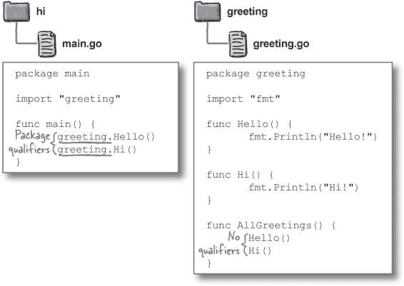
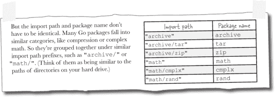

# 第四章：代码包


**是时候开始组织了**。到目前为止，我们一直将所有代码混合放在一个文件中。随着程序变得越来越大和复杂，这很快就会变得一团糟。

在本章中，我们将向你展示如何创建你自己的**包**，以帮助将相关的代码放在一个地方。但包不仅仅是用于组织的好工具。包是在程序之间*分享代码*的一种简便方式。它们也是向其他开发者*分享代码*的简便方式。

# 不同的程序，同一个函数

我们编写了两个程序，每个程序中都有一个相同的函数副本，这让维护变得头疼…

在这一页上，我们有一个来自第二章的新版本的*pass_fail.go*程序。从键盘读取成绩的代码已经移动到一个新的`getFloat`函数中。`getFloat`返回用户键入的浮点数，除非出现错误，否则返回`0`和一个错误值。如果返回错误，程序会报告并退出；否则，它会像以前一样报告成绩是否及格。


在这一页上，我们有一个新的*tocelsius.go*程序，允许用户输入华氏温度，并将其转换为摄氏温度。

注意，在*tocelsius.go*中的`getFloat`函数与*pass_fail.go*中的`getFloat`函数是完全相同的。


# 使用包在程序之间共享代码


```go
func getFloat() (float64, error) {
       reader := bufio.NewReader(os.Stdin)
       input, err := reader.ReadString('\n')
       if err != nil {
              return 0, err
       }
       input = strings.TrimSpace(input)
       number, err := strconv.ParseFloat(input, 64)
       if err != nil {
             return 0, err
       }
       return number, nil
}
```

**实际上，我们可以做一些事情——我们可以将共享的函数移到一个新的包中！**

Go 允许我们定义自己的包。正如我们在第一章中讨论的那样，包是一组做类似事情的代码。`fmt` 包格式化输出，`math` 包处理数字，`strings` 包处理字符串，等等。我们已经在多个程序中使用了每个包中的函数。

能够在程序之间使用相同的代码是包存在的主要原因之一。如果你的代码的某些部分被多个程序共享，你应该考虑将它们移到包中。

> **如果你的代码的某些部分被多个程序共享，你应该考虑将它们移到包中。**

# Go 工作空间目录保存包代码

Go 工具在计算机上的一个特殊目录（文件夹）中寻找包代码，这个目录称为**工作空间**。默认情况下，工作空间是当前用户主目录中名为*go*的目录。

工作空间目录包含三个子目录：

+   *bin*，它包含编译后的二进制可执行程序。（我们稍后在本章还会更多地讨论*bin*。）

+   *pkg*，它包含编译后的二进制包文件。（我们稍后在本章还会更多地讨论*pkg*。）

+   *src*，它包含 Go 源代码。

在 *src* 中，每个包的代码都存在于自己单独的子目录中。按照惯例，子目录的名称应与包名称相同（因此 `gizmo` 包的代码将放在 *gizmo* 子目录中）。

每个包目录应该包含一个或多个源代码文件。文件名不重要，但应以 *.go* 扩展名结尾。


# 没有愚蠢的问题

**Q: 你说一个包文件夹可以包含多个文件。每个文件应该放什么？**

**A:** 你想要的任何内容！你可以将一个包的所有代码放在一个文件中，或者在多个文件之间进行拆分。无论哪种方式，它们都将成为同一个包的一部分。

# 创建一个新的包

让我们尝试在工作空间中设置我们自己的包。我们将创建一个简单的包，名为 `greeting`，用于打印各种语言的问候语。

Go 安装时不会默认创建工作空间目录，因此您需要自己创建。首先进入您的主目录。（在大多数 Windows 系统上，路径为 *C:\Users\<yourname>*，在 Mac 上为 */Users/<yourname>*，在大多数 Linux 系统上为 */home/<yourname>*。）在主目录中，创建一个名为 *go* 的目录——这将是我们的新工作空间目录。在 *go* 目录中，创建一个名为 *src* 的目录。

最后，我们需要一个目录来存放我们的包代码。按照惯例，包的目录应与包的名称相同。因为我们的包将被命名为 `greeting`，所以您应该为目录使用这个名称。

我们知道，这似乎是很多嵌套的目录（实际上，我们很快将进一步嵌套它们）。但请相信我们，一旦您建立了自己的包集合以及来自他人的包，这种结构将帮助您保持代码的组织性。


更重要的是，这种结构有助于 Go 工具找到代码。因为它始终位于 *src* 目录中，Go 工具确切知道在哪里查找导入包的代码。

您的下一步是在 *greeting* 目录中创建一个文件，并将其命名为 *greeting.go*。文件应包含以下代码。稍后我们将详细讨论它，但现在我们想让您注意几点…

就像我们迄今为止的所有 Go 源代码文件一样，此文件以 `package` 行开头。但不同于其他文件的是，这段代码不属于 `main` 包；它属于名为 `greeting` 的包。


还要注意两个函数定义。它们与我们迄今为止见过的其他函数没有太大不同。但因为我们希望这些函数可以在 `greeting` 包外部访问，所以请注意我们将它们的名称首字母大写，以便导出这些函数。

# 将我们的包导入到程序中

现在让我们尝试在程序中使用我们的新包。


在你的工作区目录中，在*src*子目录中，创建另一个名为*hi*的子目录。（我们不一定要将可执行程序的代码存储在工作区中，但这是一个好主意。）

然后，在你的新*hi*目录中，我们需要创建另一个源文件。我们可以将文件命名为任何我们想要的名称，只要以*.go*扩展名结尾，但由于这将是一个可执行命令，我们将其命名为*main.go*。将下面的代码保存在文件中。

就像每个 Go 源代码文件一样，这段代码以一个`package`行开始。但因为我们打算将其作为一个可执行命令，我们需要使用一个`main`的包名。通常，包名应该与其所在目录的名称匹配，但`main`包是这个规则的一个例外。


接下来，我们需要导入`greeting`包，以便我们可以使用它的函数。Go 工具会在工作区的*src*目录中与`import`语句中的名称匹配的文件夹中查找包代码。为了告诉 Go 在工作区内的*src/greeting*目录中查找代码，我们使用`import "greeting"`。 

最后，因为这是一个可执行文件的代码，我们需要一个`main`函数，当程序运行时将被调用。在`main`中，我们调用了`greeting`包中定义的两个函数。两个调用都在包名和一个点之前，这样 Go 就知道这些函数属于哪个包。


我们已经准备好了；让我们尝试运行程序。在你的终端或命令提示符窗口中，使用`**cd**`命令切换到工作区目录中的*src/hi*目录。（路径会根据你的主目录位置而变化。）然后，使用`**go run main.go**`来运行程序。

当它看到`import "greeting"`这一行时，Go 将在你工作区的*src*目录中的*greeting*目录中查找包源代码。该代码被编译和导入，我们就能调用`greeting`包的函数了！

# 包使用相同的文件布局

还记得我们在第一章中谈到的几乎每个 Go 源代码文件都有的三个部分吗？


这个规则对我们*main.go*文件中的`main`包当然也适用。在我们的代码中，你可以看到一个`package`子句，后面是一个导入部分，然后是我们包的实际代码。


除了`main`之外的包遵循相同的格式。你可以看到我们的*greeting.go*文件也有一个包子句，导入部分，以及最后的实际包代码。


# 破坏东西是教育性的！


拿出我们的`greeting`包的代码，以及导入它的程序的代码。尝试做出以下一项更改并运行它。然后撤销你的更改并尝试下一个。看看会发生什么！


# 池谜题

你的**任务**是从池中提取代码片段，并将其放入空白行中。**不要**重复使用同一段落，也不需要使用所有的段落。你的**目标**是在 Go 工作空间中设置一个 `calc` 包，以便在 *main.go* 中使用 `calc` 的函数。


**注意：每个来自池中的片段只能使用一次！**

 在 “池子难题解决方案” 中有答案。

# 包命名约定

使用包的开发者需要在每次调用来自该包的函数时输入其名称（例如 `fmt.Printf`、`fmt.Println`、`fmt.Print` 等）。为了尽可能简化这个过程，包名称应遵循几个规则：

+   包名应全小写。

+   如果含义相当明显，名称应缩写（例如 `fmt`）。

+   如果可能的话，应该是一个单词。如果需要两个单词，它们*不应*用下划线分隔，并且第二个单词*不应*大写。（`strconv` 包就是一个例子。）

+   导入的包名称可能与局部变量名称冲突，因此不要使用包用户可能也想使用的名称。（例如，如果 `fmt` 包被命名为 `format`，那么任何导入该包的人在命名局部变量 `format` 时都会面临冲突风险。）

# 包限定符

当访问来自不同包的导出函数、变量或类似内容时，需要通过输入包名称来限定函数或变量的名称。然而，当访问在*当前*包中定义的函数或变量时，不应限定包名称。

在我们的 *main.go* 文件中，因为我们的代码在 `main` 包中，我们需要指定 `Hello` 和 `Hi` 函数来自 `greeting` 包，通过输入 `**greeting.Hello**` 和 `**greeting.Hi**`。



假设我们从 `greeting` 包中的另一个函数中调用了 `Hello` 和 `Hi` 函数。在那里，我们只需输入 `Hello` 和 `Hi`（不带包名限定符），因为我们将从定义它们的同一包中调用这些函数。

# 将我们的共享代码移动到一个包中

现在我们了解了如何向 Go 工作空间添加包，我们终于可以将我们的 `getFloat` 函数移动到一个包中，这样我们的 *pass_fail.go* 和 *tocelsius.go* 程序都可以使用它。


让我们命名我们的包为 `keyboard`，因为它从键盘读取用户输入。我们将在工作空间的 *src* 目录下创建一个名为 *keyboard* 的新目录。

接下来，我们将在 *keyboard* 目录中创建一个源代码文件。我们可以任意命名它，但我们将其命名为包名：*keyboard.go*。

文件顶部，我们需要一个 `package` 子句，并指定包名称为：`keyboard`。

然后，因为这是一个单独的文件，我们需要一个`import`语句来引入我们代码中使用的所有包：`bufio`、`os`、`strconv`和`strings`。（我们需要排除`fmt`和`log`包，因为它们仅在*pass_fail.go*和*tocelsius.go*文件中使用。）


最后，我们可以直接复制旧的`getFloat`函数的代码。但我们需要确保将函数重命名为`GetFloat`，因为除非其名称的第一个字母大写，否则它不会被导出。

现在*pass_fail.go*程序可以更新以使用我们的新`keyboard`包。


因为我们要移除旧的`getFloat`函数，所以需要移除未使用的`bufio`、`os`、`strconv`和`strings`导入项。我们将导入新的`keyboard`包。

在我们的`main`函数中，我们将不再调用旧的`getFloat`，而是调用新的`keyboard.GetFloat`函数。其余代码保持不变。

如果我们运行更新后的程序，我们将看到与之前相同的输出。


我们可以对*tocelsius.go*程序进行相同的更新。

我们更新了导入项，移除了旧的`getFloat`，并调用`keyboard.GetFloat`代替。

而且，如果我们运行更新后的程序，将会得到与之前相同的输出。但这次，我们不再依赖于冗余的函数代码，而是在我们的新包中使用共享函数！

# 常量

许多包会导出**常量**：这些是从不改变的命名值。

常量声明看起来很像变量声明，有名称、可选类型和常量值。但规则略有不同：

+   不再使用`var`关键字，而是使用`const`关键字。

+   常量在声明时必须赋值；不能像变量那样稍后再赋值。

+   变量可以使用`:=`短变量声明语法，但常量没有类似的语法。


就像变量声明一样，您可以省略类型，类型将从被赋值的值中推断出来：


*变量*的值可以*变化*，但*常量*的值必须*恒定*。试图给常量赋予新值将导致编译错误。这是一种安全特性：常量应该用于*不应*变化的值。


如果您的程序包含“硬编码”的文字值，特别是这些值在多个地方使用，您应考虑将它们替换为常量（即使程序没有分成多个包）。这是一个包含两个函数的包，两者都使用整数字面值`7`表示一周有几天：


通过用常量`DaysInWeek`替换文字值，我们可以说明它们的含义。（其他开发人员看到`DaysInWeek`这个名称，立即知道我们不是随意选择数字`7`来在函数中使用。）而且，如果以后添加更多函数，可以通过引用`DaysInWeek`来避免不一致性。

注意，我们将常量声明在任何函数之外，即在包级别。虽然可以在函数内部声明常量，但那将限制其作用域仅在该函数的块中。更典型的做法是在包级别声明常量，以便所有函数都可以访问它们。


像变量和函数一样，以大写字母开头的常量是导出的，我们可以通过限定其名称从其他包中访问它们。在这里，程序使用`dates`包中的`DaysInWeek`常量，并将常量名称限定为`dates.DaysInWeek`。


# 嵌套的包目录和导入路径

当您使用 Go 提供的像`fmt`和`strconv`这样的包时，包名通常与其导入路径相同（即在`import`语句中使用的字符串）。但正如我们在第二章中看到的那样，情况并非总是如此……



有些包集合通过导入路径前缀进行分组，例如`"archive/"`和`"math/"`。我们说这些前缀可以类比于硬盘上的目录路径……这并非巧合。这些导入路径前缀确实是使用目录创建的！


您可以在 Go 工作空间中的一个目录中嵌套类似的包组。

例如，假设我们想要添加其他语言的问候包。如果直接将它们全部放在*src*目录下，会很快变得混乱。但如果将新包放置在*greeting*目录下，它们将会整齐地分组在一起。

将包放置在*greeting*目录下也会影响它们的导入路径。如果`dansk`包直接存储在*src*下，其导入路径将是`"dansk"`。但将其放置在*greeting*目录下，则其导入路径变为`"greeting/dansk"`。将`deutsch`包移动到*greeting*目录下，其导入路径变为`"greeting/deutsch"`。原始的*greeting*包仍然可以通过导入路径`"greeting"`访问，只要其源代码文件直接存储在*greeting*目录下（而非子目录）。

假设我们有一个`deutsch`包嵌套在*greeting*包目录下，并且其代码看起来像这样：


让我们更新我们的*hi/main.go*代码，以便也使用`deutsch`包。因为它是嵌套在*greeting*目录下，我们需要使用引入路径`"greeting/deutsch"`。但一旦导入了它，我们将只使用包名`deutsch`来引用它。


与以前一样，我们通过使用`**cd**`命令切换到工作空间目录中的*src/hi*目录来运行我们的代码。然后，我们使用`**go run main.go**`来运行程序。我们将在输出中看到对`deutsch`包函数调用的结果。


# 使用“go install”安装程序可执行文件

当我们使用`go run`时，Go 必须编译程序及其所有依赖的包，然后才能执行它。当完成后，它会丢弃已编译的代码。

在第一章中，我们向您展示了`go build`命令，它会编译并保存一个可执行的二进制文件（即使没有安装 Go 也可以执行的文件）在当前目录。但是过度使用可能会在随机且不方便的位置使您的 Go 工作空间混乱。

`go install`命令还会将可执行程序的编译二进制版本保存在一个定义良好且易于访问的地方：Go 工作空间中的*bin*目录。只需将`go install`命令提供的目录名称设置为*src*中包含可执行程序代码的目录（即以`package main`开头的.go 文件）。程序将被编译，并在此标准目录中存储可执行文件。

###### 注意

（确保将“go install”中的目录名称传递给“src”，而不是.go 文件的名称！默认情况下，“go install”未设置为直接处理.go 文件。）

让我们尝试为我们的*hi/main.go*程序安装一个可执行文件。与以前一样，从终端，我们键入`**go install**`，一个空格，然后是*src*目录中我们的一个文件夹的名称（`**hi**`）。无论您从哪个目录执行此操作，`go`工具都将在*src*目录中查找该目录。


当 Go 看到*hi*目录中的文件包含`package main`声明时，它会知道这是一个可执行程序的代码。它将编译一个可执行文件，并将其存储在 Go 工作空间中名为*bin*的目录中。（如果该目录不存在，将自动创建*bin*目录。）

与`go build`命令不同，后者将可执行文件命名为基于其所依据的.go 文件。`go install`将可执行文件命名为包含代码的目录名称。由于我们编译了*hi*目录的内容，可执行文件将命名为`hi`（或在 Windows 上为`hi.exe`）。


现在，您可以使用`**cd**`命令切换到 Go 工作空间中的*bin*目录。一旦在*bin*中，您可以通过键入`**./hi**`（或在 Windows 上为`**hi.exe**`）来运行可执行文件。

###### 注意

您还可以将工作空间的“bin”目录添加到系统的“PATH”环境变量中。然后，您就可以从系统的任何位置运行“bin”中的可执行文件！最近的 Mac 和 Windows 安装程序会自动为您更新“PATH”。

# 使用 GOPATH 环境变量更改工作空间

当讨论 Go 工作空间时，您可能会看到各种网站上的开发者谈论“设置您的`GOPATH`”。`GOPATH`是 Go 工具用来查找工作空间位置的环境变量。大多数 Go 开发人员将所有代码保存在单个工作空间中，并且不更改其默认位置。但是，如果需要，您可以使用`GOPATH`将工作空间移动到其他目录。

**环境变量**允许您存储和检索值，有点像 Go 变量，但由操作系统维护，而不是 Go。通过设置环境变量，您可以配置一些程序，包括 Go 工具。

假设，您不是在您的主目录中，而是在硬盘根目录下的*code*目录中设置了`greeting`包。现在，您想运行依赖于`greeting`的*main.go*文件。


但是，您收到的错误消息显示找不到`greeting`包，因为`go`工具仍在查找您主目录中的*go*目录：


# 设置 GOPATH

如果您的代码存储在默认位置以外的目录中，则需要配置`go`工具以查找正确的位置。您可以通过设置`GOPATH`环境变量来实现这一点。如何设置取决于您的操作系统。

## 在 Mac 或 Linux 系统中：

可以使用`export`命令设置环境变量。在终端提示符下输入：

```go
export GOPATH="/code"
```

对于硬盘根目录中名为*code*的目录，您将需要使用路径“`/code`”。如果代码位于其他位置，可以替换不同的路径。

## 在 Windows 系统中：

您可以使用`set`命令设置环境变量。在命令提示符下输入：

```go
set GOPATH="C:\code"
```

对于硬盘根目录中名为*code*的目录，您将需要使用路径“`C:\code`”。如果代码位于其他位置，可以替换不同的路径。

完成后，`go run`应立即开始使用您指定的工作区目录（其他 Go 工具也是如此）。这意味着会找到`greeting`库，并且程序会运行！


请注意，上述方法仅为*当前*终端/命令提示符窗口设置`GOPATH`。每次打开新窗口都需要重新设置。但是，如果需要，可以永久设置环境变量。对于每个操作系统，设置方法不同，我们无法在此处详细介绍。如果您在喜欢的搜索引擎中输入“环境变量”后跟上您的操作系统名称，结果应包含有用的说明。

# 发布包

我们对我们的`keyboard`包使用得如此频繁，我们想知道其他人是否也会觉得它有用。


让我们在 GitHub 上创建一个仓库来保存我们的代码，这是一个流行的代码共享网站。这样，其他开发者可以下载并在他们自己的项目中使用它！我们的 GitHub 用户名是`headfirstgo`，我们将仓库命名为*keyboard*，因此它的 URL 将是：

*[`github.com/headfirstgo/keyboard`](https://github.com/headfirstgo/keyboard)*

我们将仅上传*keyboard.go*文件到仓库，而不将其嵌套在任何目录中。


嗯，这是一个合理的担忧。在 Go 工作空间的*src*目录中只能有一个名为*keyboard*的目录，因此看起来我们只能有一个名为`keyboard`的包！


让我们试试吧：我们将把我们的包移动到一个代表它托管的 URL 的目录结构中。在我们的*src*目录中，我们将创建另一个名为*[github.com](http://github.com)*的目录。在其中，我们将创建一个名为*headfirstgo*的目录。然后，我们将从*src*目录中将我们的*keyboard*包目录移动到*headfirstgo*目录中。

尽管将包移动到新的子目录中会更改其*导入路径*，但不会更改包*名称*。由于包本身仅包含名称的引用，因此我们不必对包代码进行任何更改！


然而，我们确实需要更新依赖于我们包的程序，因为包导入路径已更改。因为我们将每个子目录命名为包托管 URL 的一部分，所以我们的新导入路径看起来很像那个 URL：

```go
"github.com/headfirstgo/keyboard"
```

我们只需要更新每个程序中的`import`语句。因为包名相同，代码中对包的引用将保持不变。


做出这些更改后，依赖于我们的`keyboard`包的所有程序应该正常工作。

顺便说一句，我们希望能够因为使用域名和路径来确保包导入路径的唯一性而得到这个想法的荣誉，但实际上并不是我们想出来的。从一开始，Go 社区就一直在使用这种包命名标准。类似的思想在像 Java 这样的语言中已经使用了几十年了。

# 使用“go get”下载和安装包

使用包的托管 URL 作为导入路径还有另一个好处。`go`工具还有一个名为`go get`的子命令，可以自动为您下载和安装包。

我们已经设置了一个包含我们之前在以下 URL 中展示给您的*greeting*包的 Git 仓库

*[`github.com/headfirstgo/greeting`](https://github.com/headfirstgo/greeting)*

这意味着只要安装了 Go 的任何计算机，您都可以在终端中输入以下命令：

`go get github.com/headfirstgo/greeting`

###### 注意

（注意：“go get”安装后仍然可能无法找到 Git。如果出现这种情况，请尝试关闭旧的终端或命令提示符窗口，然后打开一个新的。）

这是 `go get` 后跟着的存储库 URL，但是省略了 “scheme” 部分（即 “https://”）。 `go` 工具将连接到 *[github.com](http://github.com)*，下载 */headfirstgo/greeting* 路径下的 Git 存储库，并将其保存在你的 Go 工作空间的 *src* 目录中。（注意：如果你的系统没有安装 Git，则在运行 `go get` 命令时会提示你安装它。只需按照屏幕上的指示操作。 `go get` 命令还可以与 Subversion、Mercurial 和 Bazaar 存储库一起使用。）

`go get` 命令将自动创建所需的子目录来设置适当的导入路径（如 *github.com* 目录，*headfirstgo* 目录等）。保存在 *src* 目录中的包将如下所示：


有了保存在 Go 工作空间中的包，它们就可以在程序中使用了。你可以通过像这样的 `import` 语句来使用 `greeting`、`dansk` 和 `deutsch` 包：

```go
import (
       "github.com/headfirstgo/greeting"
       "github.com/headfirstgo/greeting/dansk"
       "github.com/headfirstgo/greeting/deutsch")
```

`go get` 命令也适用于其他包。如果你之前没有我们展示过的 `keyboard` 包，这个命令会帮你安装它：

`go get github.com/headfirstgo/keyboard`

实际上，`go get` 命令适用于任何已经在托管服务上正确设置的包，无论作者是谁。你只需要运行 `go get` 并提供包的导入路径即可。该工具将查看路径中对应于主机地址的部分，连接到该主机，并下载由其余导入路径表示的 URL 处的包。这使得使用其他开发者的代码变得非常简单！

# 使用 “go doc” 阅读包文档


**你可以使用 `**go doc**` 命令来显示任何包或函数的文档。**

通过将其导入路径传递给 `go doc`，你可以获取包的文档。例如，我们可以通过运行 `go doc strconv` 来获取 `strconv` 包的信息。


输出包括包名和导入路径（在这种情况下它们是一样的），包的整体描述，以及包导出的所有函数列表。

你也可以使用 `go doc` 通过在包名后面提供函数名来获取特定函数的详细信息。假设我们在 `strconv` 包的函数列表中看到了 `ParseFloat` 函数，并且想要了解更多信息。我们可以使用 `go doc strconv ParseFloat` 来查看它的文档。

你将会得到该函数的描述和它的功能：


第一行看起来就像代码中的函数声明。它包括函数名称，后面跟着包含其参数名称和类型（如果有的话）的括号。如果有返回值，那些将出现在参数后面。

然后是详细描述函数做什么以及开发人员在使用它时需要的其他信息。

我们可以通过将其导入路径提供给`go doc`，以相同的方式获取我们`keyboard`包的文档。让我们看看是否有任何内容能帮助我们潜在的用户。从终端运行：

```go
go doc github.com/headfirstgo/keyboard
```

`go doc`工具能够从代码中推导出基本信息，如包名和导入路径。但是由于没有包描述，因此这并不那么有帮助。


请求`GetFloat`函数的信息也得不到描述：


# 使用文档注释为您的包文档

`go doc`工具会根据检查代码添加有用的信息到其输出中。包名和导入路径将被自动添加。函数名称、参数和返回类型也是如此。

但是`go doc`并非魔法。如果您希望用户看到包或函数意图的文档，您需要自己添加。

幸运的是，这很容易做到：你只需在你的代码之前立即添加**文档注释**。出现在包声明或函数声明之前的普通 Go 注释将被视为文档注释，并将显示在`go doc`的输出中。

让我们尝试为`keyboard`包添加文档注释。在*keyboard.go*文件的顶部，在`package`行之前，我们将添加一个注释描述该包的功能。在`GetFloat`声明之前，我们将添加几行注释描述该函数。


下次我们为包运行`go doc`时，它将找到`package`行前的注释并将其转换为包描述。当我们为`GetFloat`函数运行`go doc`时，我们将看到基于我们在`GetFloat`声明之前添加的注释行的描述。


能够通过`go doc`显示文档使安装包的开发人员感到高兴。


文档注释还能让开发人员在处理包代码时感到愉快！它们是普通的注释，所以很容易添加。您可以在修改代码时轻松地参考它们。


添加文档注释时有一些约定要遵循：

+   注释应该是完整的句子。

+   包注释应以“Package”开头，后跟包名称：

    ```go
    // Package mypackage enables widget management.
    ```

+   函数注释应以它们描述的函数名称开头：

    ```go
    // MyFunction converts widgets to gizmos.
    ```

+   你可以通过将其缩进来包含代码示例在你的评论中。

+   除了代码示例的缩进外，不要添加额外的标点符号用于强调或格式化。文档注释将显示为普通文本，并且应以此方式格式化。

# 在网页浏览器中查看文档

如果你更喜欢在网页浏览器而不是终端中查看文档，还有其他查看包文档的方法。

最简单的方法是在你喜欢的搜索引擎中键入“golang”后跟你想要的包名称。（“Golang”通常用于搜索有关 Go 语言的内容，因为“go”是一个太普通的词，无法过滤掉无关的结果。）如果我们想要`fmt`包的文档，我们可以搜索“golang fmt”：


结果应该包含以 HTML 格式提供 Go 文档的站点。如果你搜索 Go 标准库中的一个包（比如`fmt`），顶部结果之一可能来自* golang.org*，这是由 Go 开发团队运行的站点。文档的内容将与`go doc`工具的输出基本相同，包括包名称、导入路径和描述。


HTML 文档的一个主要优势是包的函数列表中的每个函数名都是一个方便的可点击链接，可以直接跳转到函数文档。


但内容与在终端中运行`go doc`看到的内容完全相同。一切都基于代码中相同简单的文档注释。

# 使用“godoc”将 HTML 文档提供给自己

*golang.org* 网站文档部分使用的是相同的软件，实际上也可以在*你的*计算机上使用。这个工具叫做`godoc`（不要与`go doc`命令混淆），它会随着 Go 的安装自动安装。`godoc` 工具基于你的主 Go 安装和工作区中的代码生成 HTML 文档，包含一个可以与浏览器共享生成页面的 Web 服务器。（别担心，默认设置下，`godoc` 不会接受来自除你自己之外的任何计算机的连接。）


要在 Web 服务器模式下运行`godoc`，我们将在终端中输入`godoc`命令（再次强调，不要与`go doc`混淆），然后加上一个特殊选项：`-http=:6060`。

然后，在`godoc`运行时，你可以在浏览器中输入 URL：

```go
http://localhost:6060/pkg
```

...输入到你的网页浏览器地址栏中并按 Enter 键。你的浏览器将连接到你自己的计算机，`godoc`服务器将以 HTML 页面响应。你将看到安装在你计算机上的所有包的列表。


列表中的每个包名称都是指向该包文档的链接。点击它，你会看到与在* golang.org* 上看到的相同的包文档。


# “godoc”服务器包含*你的*包！

如果我们继续浏览本地`godoc`服务器的包列表，我们会看到一些有趣的内容：我们的`keyboard`包！


除了来自 Go 标准库的包之外，`godoc`工具还为你的 Go 工作区中的任何包构建 HTML 文档。这些可以是你安装的第三方包，也可以是你自己编写的包。

点击*keyboard*链接，你将进入包的文档页面。文档中将包含我们代码中的任何文档注释！


当你准备停止`godoc`服务器时，回到你的终端窗口，然后按住 Ctrl 键并按 C 键。你会回到系统提示符。


Go 使得文档化你的包变得简单，这使得包更容易分享，进而使其他开发者更容易使用。这只是使包成为代码共享的一个更好方式的又一特性！

# 你的 Go 工具箱


**这就是第四章的内容！你已经向你的工具箱添加了包。**


# 池谜题解答

你的**任务**是从池中获取代码片段，并将它们放入空白行中。**不要**重复使用同一个片段，并且你不需要使用所有的片段。你的**目标**是在 Go 工作区内设置一个`calc`包，以便在*main.go*中使用`calc`的函数。


