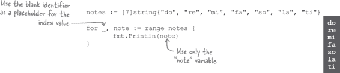

# 第五章：列表：数组

**许多程序处理各种列表。**地址列表。电话号码列表。产品列表。Go 语言内置了*两种*存储列表的方法。本章将介绍第一种：**数组**。您将学习如何创建数组，如何填充数据以及如何再次获取这些数据。然后，您将学习如何处理数组中的所有元素，首先是*使用`for`循环的困难方式*，然后是*使用`for`...`range`循环的简单方式*。

# 数组保存值的集合

一位当地餐馆老板面临一个问题。他需要知道未来一周需要订购多少牛肉。如果他订购太多，多余的将会浪费掉。如果他订购不足，他将不得不告诉顾客他无法做出他们最喜欢的菜肴。

他会记录过去三周使用的肉量数据。他需要一个程序来帮助他大致确定需要订购多少肉。

这应该足够简单：我们可以通过将三个金额相加并除以 3 来计算平均值。平均值应该能很好地估计需要订购的量。

第一个问题将是存储示例值。如果我们想稍后平均更多值，声明三个单独的变量将是一种痛苦。但是，与大多数编程语言一样，Go 提供了一种完美解决这种情况的数据结构...

**数组**是一组共享相同类型的值。将其视为一个有隔间的药盒 —— 您可以分别存储和检索每个隔间中的药丸，但也很容易将整个容器一起携带。

数组保存的值称为其**元素**。您可以有一个字符串数组，一个布尔数组，或者任何其他 Go 类型的数组（甚至是数组的数组）。您可以将整个数组存储在单个变量中，然后访问您需要的数组中的任何元素。

数组保存特定数量的元素，不能增长或缩小。要声明一个变量来保存数组，您需要在方括号（`[]`）中指定它保存的元素数，然后是数组保存的元素类型。

要设置数组元素的值或稍后检索值，您需要一种指定您要的元素的方法。数组中的元素从 0 开始编号。元素的编号称为其**索引**。

例如，如果您想制作一个音阶上音符名称的数组，第一个音符将分配给索引`0`，第二个音符将在索引`1`处，依此类推。索引在方括号中指定。

这是一个整数数组：

这是一个`time.Time`值的数组：

# 数组中的零值

和变量一样，当创建数组时，它所包含的所有值都会被初始化为该数组所持有类型的零值。因此，一个包含`int`值的数组默认填充为零：

然而，字符串的零值是一个空字符串，因此一个包含`string`值的数组默认填充为空字符串：

即使你没有显式地为其分配一个值，零值也可以确保安全地操作数组元素。例如，在这里我们有一个整数计数器数组。我们可以增加任何一个计数器而无需先显式分配一个值，因为我们知道它们都将从`0`开始。

> **当创建数组时，它所包含的所有值都会被初始化为该数组所持有类型的零值。**

# 数组字面值

如果你事先知道数组应该包含哪些值，你可以使用**数组字面值**来初始化数组。数组字面值的开始方式与数组类型相同，使用方括号表示它将包含的元素数量，然后是其元素的类型。接着是用大括号括起来的初始值列表，每个元素的初始值应该用逗号分隔。

这些示例与我们之前展示的示例非常相似，只是不再逐个为数组元素分配值，而是使用数组字面值初始化整个数组。

使用数组字面值还可以使用`:=`进行简短的变量声明。

你可以将数组字面值分布在多行，但在你的代码中，在每个换行字符之前必须使用逗号。如果在最后一个条目之后有换行符，则甚至需要在数组字面值的最后一个条目之后使用逗号。（这种风格起初看起来有些尴尬，但它使得以后添加更多元素变得更容易。）

# “fmt”包中的函数知道如何处理数组

当你只是尝试调试代码时，你不必逐个将数组元素传递给`fmt`包中的`Println`和其他函数。只需传递整个数组。`fmt`包中有逻辑来为你格式化和打印数组。（`fmt`包还可以处理我们稍后将看到的切片、映射和其他数据结构。）

你可能还记得`Printf`和`Sprintf`函数使用的`"%#v"`动词，它将值格式化为它们在 Go 代码中出现的样子。当用`"%#v"`格式化时，数组在结果中显示为 Go 数组字面值。

# 在循环内访问数组元素

在你的代码中，你不必显式地写出你正在访问的数组元素的整数索引。你也可以使用整数变量中的值作为数组索引。

这意味着你可以使用`for`循环处理数组的元素。你可以循环遍历数组中的索引，并使用循环变量访问当前索引处的元素。

在使用变量访问数组元素时，需要小心使用哪些索引值。正如我们所述，数组包含特定数量的元素。尝试访问超出数组的索引将导致**panic**，这是程序运行时发生的错误（而不是编译时）。

通常，panic 会导致程序崩溃并向用户显示错误消息。毫无疑问，应尽量避免 panic。

# 使用“len”函数检查数组长度

编写仅访问有效数组索引的循环可能会有些容易出错。幸运的是，有几种方法可以使这个过程更加简单。

第一种方法是在访问数组之前检查数组中的实际元素数。你可以使用内置的`len`函数来做到这一点，它返回数组的长度（即它包含的元素数）。

当设置循环以处理整个数组时，可以使用`len`来确定哪些索引是安全访问的。

然而，这仍然存在错误的可能性。如果`len(notes)`返回`7`，则最高可访问的索引是`6`（因为数组索引从`0`开始，而不是`1`）。如果尝试访问索引`7`，将会导致 panic。

# 安全地使用“for...range”循环遍历数组

更安全的处理数组每个元素的方式是使用特殊的`for`...`range`循环。在`range`形式中，你提供一个变量来保存每个元素的整数索引，另一个变量来保存元素的值，以及你要遍历的数组。循环将针对数组中的每个元素运行一次，将元素的索引分配给你的第一个变量，将元素的值分配给你的第二个变量。你可以在循环块中添加代码来处理这些值。

这种形式的`for`循环没有杂乱的初始化、条件和后置表达式。因为元素值会自动分配给一个变量，所以不会出现意外访问无效数组索引的风险。由于更安全且易于阅读，因此在处理数组和其他集合时，你经常会看到`for`循环的`range`形式被使用。

这里是我们之前的代码，用`for`...`range`循环打印我们的音符数组中的每个值：

循环运行七次，每次针对`notes`数组的一个元素。对于每个元素，`index`变量被设置为元素的索引，`note`变量被设置为元素的值。然后我们打印索引和值。

# 使用“for...range”循环结合空白标识符

与往常一样，Go 要求您使用您声明的每个变量。如果我们停止使用来自我们的`for`...`range`循环的`index`变量，我们将会得到一个编译错误：

如果我们不使用保存元素值的变量，情况也是如此：

记住在第二章中，当我们调用一个带有多个返回值的函数，并且我们想忽略其中一个时？我们将该值分配给空白标识符（`_`），这会导致 Go 丢弃该值，而不会产生编译器错误...

我们可以对`for`...`range`循环中的值做同样的处理。如果我们不需要每个数组元素的索引，我们可以将其分配给空白标识符：

如果我们不需要值变量，可以将其分配给空白标识符：

# 获取数组中数字的总和

我们终于知道了一切，我们需要创建一个`float64`值的数组并计算它们的平均值。让我们取过去几周使用的牛肉量，并将它们整合到一个名为`average`的程序中。

我们首先需要做的是设置一个程序文件。在您的 Go 工作空间目录（用户主目录内的*go*目录，除非您设置了`GOPATH`环境变量），创建以下嵌套目录（如果它们不存在）。在最内层的*average*目录中，保存一个名为*main.go*的文件。

现在让我们在*main.go*文件中编写我们的程序代码。由于这将是一个可执行程序，我们的代码将属于`main`包，并位于`main`函数中。

我们首先只计算三个样本值的总和；稍后我们可以返回计算平均值。我们使用数组字面量创建一个包含三个`float64`值的数组，预先填充了以前几周的样本值。我们声明一个名为`sum`的`float64`变量来保存总和，从`0`开始。

然后我们使用`for`...`range`循环处理每个数字。我们不需要元素索引，因此使用`_`空白标识符将其丢弃。我们将每个数字添加到`sum`中。在我们计算出所有值的总和后，我们在退出前打印`sum`。

让我们尝试编译和运行我们的程序。我们将使用`go install`命令创建一个可执行文件。我们将需要向`go install`提供我们可执行文件的导入路径。如果我们使用这个目录结构...

...这意味着我们包的导入路径将是`[github.com/headfirstgo/average](http://github.com/headfirstgo/average)`。因此，从您的终端输入：

`go install github.com/headfirstgo/average`

你可以从任何目录中执行此操作。`go`工具将在你的工作空间的*src*目录中查找*[github.com/headfirstgo/average](http://github.com/headfirstgo/average)*目录，并编译其中包含的所有*.go*文件。生成的可执行文件将命名为`average`，并存储在你的 Go 工作空间的*bin*目录中。

然后，你可以使用**`cd`**命令切换到你的 Go 工作空间内的*bin*目录。一旦进入*bin*目录，你可以通过输入**`./average`**（或在 Windows 上是**`average.exe`**）来运行可执行文件。

该程序将打印出我们数组中三个值的总和并退出。

# 获取数组中数字的平均值

我们的`average`程序已经打印出了数组值的总和，现在让我们更新它以打印实际的平均值。为此，我们将总和除以数组的长度。

将数组传递给`len`函数返回一个`int`值，表示数组的长度。但由于`sum`变量中的总数是`float64`值，我们也需要将长度转换为`float64`，这样才能在数学运算中使用。我们将结果存储在`sampleCount`变量中。完成后，我们只需将`sum`除以`sampleCount`，并打印结果即可。

一旦代码更新完成，我们可以重复之前的步骤来查看新的结果：运行**`go install`**重新编译代码，切换到*bin*目录，并运行更新后的`average`可执行文件。现在，我们将看到数组中值的平均数，而不是它们的总和。

# 池谜题

你的**工作**是从池中获取代码片段，并将它们放入这段代码中的空白行中。**不要**重复使用相同的片段，也不需要使用所有的片段。你的**目标**是创建一个程序，它将打印数组元素中介于`10`和`20`之间的索引和值（应与显示的输出匹配）。

**注意：每个来自池中的片段只能使用一次！**

 答案在“池谜题解答”中。

# 读取文本文件

那是真的 — 用户必须自行编辑和编译源代码的程序并不是很用户友好。

以前，我们使用标准库的`os`和`bufio`包逐行从键盘读取数据。我们可以使用相同的包来逐行从文本文件中读取数据。让我们稍作偏离，学习如何做到这一点。

然后，我们将回来更新`average`程序，以从文本文件中读取数值。

在你喜欢的文本编辑器中，创建一个名为*data.txt*的新文件。现在，将其保存在你的 Go 工作空间目录之外的某个地方。

在文件中，输入我们的三个浮点数样本值，每行一个数字。

在我们更新程序以计算文本文件中数字的平均值之前，我们需要能够读取文件的内容。首先，让我们编写一个仅读取文件的程序，然后我们将所学的内容整合到我们的平均值程序中。

在与*data.txt*相同的目录中创建一个名为*readfile.go*的新程序。我们将只用`go run`运行*readfile.go*，所以可以将它保存在 Go 工作区目录之外。将以下代码保存在*readfile.go*中。（我们将在下一页详细查看这段代码的工作原理。）

然后，从您的终端，切换到保存了这两个文件的目录，并运行**`go run readfile.go`**。该程序将读取*data.txt*的内容，并将其打印出来。

我们的测试*readfile.go*程序成功读取了*data.txt*文件的行并将其打印出来。让我们更仔细地看看程序是如何工作的。

我们首先将要打开的文件名作为字符串传递给`os.Open`函数。`os.Open`将返回两个值：指向打开文件的`os.File`值的指针，和一个`error`值。与许多其他函数一样，如果`error`值为`nil`，表示文件成功打开；否则，表示出现错误（例如文件丢失或不可读）。如果出现错误，我们将记录错误消息并退出程序。

然后我们将`os.File`值传递给`bufio.NewScanner`函数。这将返回一个从文件中读取的`bufio.Scanner`值。

`bufio.Scanner`上的`Scan`方法设计成作为`for`循环的一部分使用。它将从文件中读取一行文本，如果成功读取数据则返回`true`，如果没有则返回`false`。如果在`for`循环的条件中使用`Scan`，则循环将继续运行，直到没有更多数据可读取为止。一旦到达文件的末尾（或出现错误），`Scan`将返回`false`，循环将退出。

在`bufio.Scanner`上调用`Scan`方法后，调用`Text`方法将返回一个包含读取数据的字符串。对于这个程序，我们只需在循环内调用`Println`来打印每一行。

循环退出后，我们已经完成了文件的操作。保持文件打开会消耗操作系统的资源，所以当程序完成文件操作时应该关闭文件。调用`os.File`上的`Close`方法可以实现这一点。与`Open`函数不同，`Close`方法只返回一个`error`值，除非发生问题，否则该值为`nil`。（与`Open`不同，`Close`只返回一个值，因为除了错误之外没有其他有用的返回值。）

当`bufio.Scanner`在扫描文件时可能会遇到错误。如果遇到错误，调用扫描器的`Err`方法将返回该错误，我们在退出前将其记录。

# 将文本文件读取到数组中

我们的*readfile.go*程序运行良好——我们能够将*data.txt*文件中的行作为字符串读取并打印出来。现在我们需要将这些字符串转换为数字并存储在数组中。让我们创建一个名为`datafile`的包来为我们完成这个任务。

在您的 Go 工作空间目录中，在*headfirstgo*目录下创建一个*datafile*目录。在*datafile*目录中，保存一个名为*floats.go*的文件。（我们将其命名为*floats.go*，因为此文件将包含从文件中读取浮点数的代码。）

在*floats.go*中，保存以下代码。其中很多内容基于我们测试的*readfile.go*程序中的代码；我们将代码相同的部分标记为灰色。我们将在下一页详细解释新代码。

我们希望能够从除了*data.txt*之外的文件中读取，因此我们将文件名作为参数接受。我们设置函数返回两个值，一个是`float64`值的数组，另一个是`error`值。像大多数返回错误的函数一样，只有当错误值为`nil`时，才应该考虑使用第一个返回值。

接下来，我们声明一个包含三个`float64`值的数组，用于保存从文件中读取的数字。

就像在*readfile.go*中一样，我们打开文件进行读取。不同之处在于，我们不是使用硬编码的字符串`"data.txt"`，而是打开传递给函数的任何文件名。如果遇到错误，我们需要返回一个数组以及错误值，因此我们只返回`numbers`数组（即使尚未为其分配任何内容）。

我们需要知道将每一行分配给哪个数组元素，因此我们创建一个变量来跟踪当前索引。

设置`bufio.Scanner`并循环遍历文件的行的代码与*readfile.go*中的代码相同。然而，循环内的代码不同：我们需要对从文件中读取的字符串调用`strconv.ParseFloat`来将其转换为`float64`，并将结果分配给数组。如果`ParseFloat`导致错误，我们需要返回该错误。如果解析成功，我们需要增加`i`，以便将下一个数字分配给下一个数组元素。

我们关闭文件并报告任何错误的代码与*readfile.go*完全相同，只是我们返回任何错误而不是直接退出程序。 如果没有错误，将到达`GetFloats`函数的末尾，并将`float64`值数组与`nil`错误一起返回。

# 更新我们的“average”程序以读取文本文件

我们准备好用从*data.txt*文件中读取的数组替换`average`程序中的硬编码数组了！

编写我们的`datafile`包是难点所在。 在主程序中，我们只需要做三件事：

+   更新我们的`import`声明以包括`datafile`和`log`包。

+   用`datafile.GetFloats("data.txt")`替换我们的硬编码数字数组。

+   检查我们是否从`GetFloats`得到了错误，并记录并退出。

所有剩余的代码都完全相同。

我们可以使用与之前相同的终端命令来编译程序：

`go install github.com/headfirstgo/average`

因为我们的程序导入了`datafile`包，所以它也会被自动编译。

我们需要将*data.txt*文件移动到 Go 工作区的*bin*子目录中。 这是因为我们将从该目录运行`average`可执行文件，并且它将在同一目录中寻找*data.txt*。 移动*data.txt*后，切换到该*bin*子目录。

当我们运行`average`可执行文件时，它将从*data.txt*中加载值到一个数组中，并用它们来计算平均值。

如果我们更改*data.txt*中的值，平均值也会随之改变。

# 我们的程序只能处理三个值！

但是有个问题——如果*data.txt*中有四行或更多行，`average`程序将会恐慌并退出！

当一个 Go 程序发生恐慌时，它会输出一个报告，其中包含问题发生的代码行的信息。 在这种情况下，问题似乎出现在*floats.go*文件的第 20 行。

如果我们查看*floats.go*的第 20 行，我们会看到那是`GetFloats`函数中将文件中的数字添加到数组的部分！

还记得之前代码示例中的错误导致程序尝试访问七元素数组的第八个元素吗？那个程序也会恐慌并退出。

我们的`GetFloats`函数中出现了相同的问题。 因为我们声明`numbers`数组只能容纳三个元素，所以它只能容纳三个元素。 当达到*data.txt*文件的第四行时，它尝试为`numbers`的*第四个*元素赋值，结果导致恐慌。

Go 中的数组大小固定；它们无法增长或缩小。但是 *data.txt* 文件可以添加用户想要添加的任意行数。我们将在下一章节看到解决这一困境的方法！

# 你的 Go 工具箱

**第五章就到这里！你已经把数组加入了你的工具箱。**

# 池谜题解答

