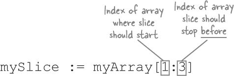
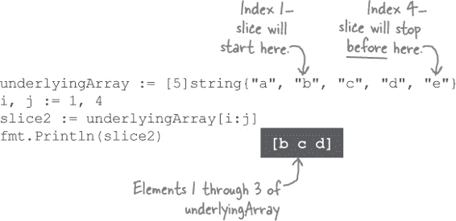
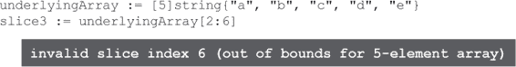
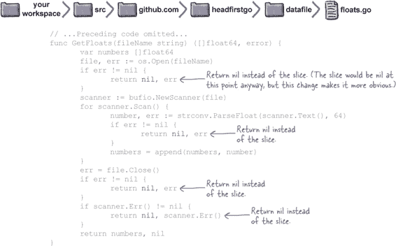
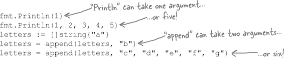

# 第六章：追加问题：切片

**我们已经学到，无法向数组添加更多元素。** 这对我们的程序来说是个真正的问题，因为我们事先不知道文件中包含多少数据。但这就是 Go **切片**派上用场的地方。切片是一种集合类型，可以动态增加项，正好可以修复我们当前的程序！我们还将看到切片如何为用户提供更简单的方式来提供*所有*程序所需的数据，并且如何帮助您编写更方便调用的函数。

# 切片

实际上*有*一种 Go 数据结构，我们可以向其中添加更多值，它被称为**切片**。与数组一样，切片由多个相同类型的元素组成。*不同于*数组的是，函数可用于允许我们将额外的元素添加到切片的末尾。

要声明一个变量，其类型为切片，请使用一对空方括号，后跟切片将容纳的元素类型。

这与声明数组变量的语法类似，只是不指定大小。

与数组变量不同，声明切片变量不会自动创建切片。为此，您可以调用内置的`make`函数。将切片的类型（应与要分配给它的变量的类型相同）和应创建的切片长度传递给`make`。

创建切片后，使用与数组相同的语法分配和检索其元素。

您不必分开声明变量并创建切片；使用带有短变量声明的`make`函数将为您推断变量的类型。

内置的`len`函数与切片一样使用，就像它与数组一样使用。只需将切片传递给`len`，它的长度将作为整数返回。

对于切片，`for`和`for`...`range`循环的工作方式与数组完全相同：

# 切片字面量

就像数组一样，如果您事先知道切片将从哪些值开始，可以使用切片字面量初始化切片。切片字面量看起来很像数组字面量，但数组字面量在方括号中有数组长度，而切片字面量的方括号是空的。然后，空括号后跟切片将容纳的元素类型，并在大括号中列出每个元素的初始值。

您不需要调用`make`函数；在代码中使用切片字面量将创建切片，并预填充它。

这些示例与我们之前展示的示例类似，只是不是逐个为切片元素分配值，而是使用切片字面量初始化整个切片。

# 池谜题

你的**任务**是从代码池中获取代码片段，并将它们放入空白行中。**不要**重复使用相同的片段，你不需要使用所有的片段。你的**目标**是创建一个能够运行并产生所示输出的程序。

**注意：每个代码池中的片段只能使用一次！**

 答案在“池谜题解答”中。

> **因为切片是建立在数组之上的。如果不了解数组，就不能理解切片的工作原理。在这里，我们将向你展示为什么……**

# 切片操作符

每个切片都建立在一个**底层数组**之上。实际上，是底层数组保存了切片的数据；切片只是对数组元素的一种（或全部）视图。

当你使用`make`函数或切片文字创建一个切片时，底层数组会自动为你创建（你无法直接访问它，除非通过切片）。但你也可以自己创建数组，然后基于它使用**切片操作符**创建一个切片。

切片操作符看起来类似于访问数组单个元素或切片的语法，不同之处在于它有两个索引：切片应该从数组的哪个索引开始，以及切片应该在数组的哪个索引之前停止。

请注意，我们强调第二个索引是切片将在哪里停止的索引。也就是说，切片应该包括元素直到第二个索引，但*不*包括第二个索引。如果你使用`underlyingArray[i:j]`作为切片操作符，生成的切片实际上将包含元素`underlyingArray[i]`到`underlyingArray[j-1]`。

###### 注意

（我们知道，这有些违反直觉。但类似的表示法在 Python 编程语言中已经使用了 20 多年，而且似乎工作得很好。）

如果你希望切片包含底层数组的最后一个元素，实际上你需要指定第二个索引，该索引比切片操作符中的数组末尾元素索引多一个。

确保不要再往前走，否则会出现错误：

切片操作符对于起始索引和停止索引都有默认值。如果省略起始索引，将使用`0`（数组的第一个元素）。

如果你省略了停止索引，那么从起始索引到底层数组末尾的所有内容都会包含在生成的切片中。

# 底层数组

正如我们所提到的，切片本身不保存任何数据；它只是对底层数组元素的一种视图。你可以把切片想象成一种显微镜，聚焦于幻灯片（即底层数组）内容的特定部分。

当您获取底层数组的切片时，您只能“看到”通过切片可见的部分数组元素。

即使可能存在多个切片指向同一个底层数组的情况。每个切片将是对其自己子集中的数组元素的视图。这些切片甚至可以重叠！

# 更改底层数组，更改切片

现在，这里有一些需要注意的事情：因为切片只是对数组内容的一种视图，如果您更改底层数组，这些更改也将在切片中*可见*！

将一个切片元素赋予一个新值将会改变底层数组中对应的元素。

如果多个切片指向同一个底层数组，对数组元素的更改将在*所有*切片中可见。

由于这些潜在问题，您可能会发现，通常最好使用`make`或切片文字创建切片，而不是创建一个数组并在其上使用切片操作符。使用`make`和切片文字，您永远不必直接操作底层数组。

# 使用“append”函数添加到切片

Go 语言提供了一个内置的`append`函数，接受一个切片和一个或多个要追加到该切片末尾的值。它返回一个新的、更大的切片，其中包含与原始切片相同的所有元素，以及添加到末尾的新元素。

您无需跟踪要分配新值的索引，也无需其他任何操作！只需使用您的切片和要添加到末尾的值(s)，调用`append`，您将得到一个新的、更长的切片。就是这么简单！

好吧，有一个注意事项...

请注意，我们确保将`append`的返回值分配回*相同*的切片变量，我们传递给`append`。这是为了避免从`append`返回的切片中可能出现的一些不一致的行为。

切片的底层数组大小不能增长。如果数组中没有足够的空间来添加元素，所有元素将被复制到一个新的、更大的数组中，并且切片将被更新以引用这个新数组。但由于所有这些操作都是在`append`函数的背后进行的，因此很难判断从`append`返回的切片是否具有与传入的切片*相同*的底层数组，还是*不同*的底层数组。如果保留了两个切片，这可能导致一些不可预测的行为。

例如，在下面，我们有四个切片，最后三个通过调用`append`创建。这里我们*没有*遵循将`append`的返回值重新分配给同一变量的约定。当我们将值分配给`s4`切片的元素时，可以看到在`s3`中反映出变化，因为`s4`和`s3`恰好共享相同的底层数组。但是这种变化*不*反映在`s2`或`s1`中，因为它们有一个*不同*的底层数组。

因此，在调用`append`时，通常只需将返回值分配回传递给`append`的同一切片变量即可。如果只存储一个切片，就不需要担心两个切片是否有相同的底层数组！

# 切片和零值

与数组一样，如果访问尚未分配值的切片元素，您将得到该类型的零值返回：

与数组不同，切片变量本身*也*有一个零值：它是`nil`。也就是说，一个尚未分配切片的切片变量将具有值`nil`。

在其他语言中，这可能需要在尝试使用之前测试变量是否实际包含切片。但在 Go 语言中，函数被有意地编写为将`nil`切片值视为如果它是一个空切片。例如，如果`len`函数被传递一个`nil`切片，它将返回`0`：

`append`函数还将`nil`切片视为空切片。如果将空切片传递给`append`，它将添加你指定的项目到切片，并返回一个包含一个项目的切片。如果将`nil`切片传递给`append`，你*同样*会得到一个包含一个项目的切片，尽管从技术上讲没有切片来“追加”项目。`append`函数会在幕后创建切片。

这意味着你通常不需要担心你是否有一个空切片或`nil`切片。你可以将它们都视为相同，你的代码会“自动工作”！

# 使用切片和“append”读取额外的文件行

现在我们了解了切片和`append`函数，终于可以修复我们的`average`程序了！记住，一旦我们在读取*data.txt*文件时添加了第四行：

我们追溯到了我们的`datafile`包的问题，该包将文件行存储在一个不能超过三个元素的数组中：

我们大部分与切片的工作都集中在了理解它们上。现在我们理解了，更新`GetFloats`函数以使用切片而不是数组并不需要太多努力。

首先，我们更新函数声明，以返回`float64`值的切片而不是数组。之前，我们将数组存储在名为`numbers`的变量中；现在我们将使用相同的变量名来保存切片。我们不会给`numbers`赋值，所以一开始它将是`nil`。

不再将文件读取的值分配给特定的数组索引，而是可以调用`append`来扩展切片（如果是`nil`则创建一个切片）并添加新值。这意味着我们可以摆脱创建和更新跟踪索引的`i`变量的代码。我们将从`ParseFloat`返回的`float64`值分配给一个新的临时变量，仅用于在检查解析错误时暂时保存它。然后将`numbers`切片和文件中的新值传递给`append`，确保将返回值重新分配给`numbers`变量。

除此之外，`GetFloats`中的代码可以保持不变——切片基本上可以无缝替代数组。

# 尝试我们改进的程序

从`GetFloats`函数返回的切片可像主程序中的数组一样直接替换，毫不费力。事实上，我们根本不需要对主程序做*任何*修改！

因为我们使用了`:=`来将`GetFloats`的返回值赋给一个变量，`numbers`变量自动从推断类型`[3]float64`（数组）切换到类型`[]float64`（切片）。并且因为`for`...`range`循环和`len`函数在处理切片时与处理数组的方式相同，因此对该代码不需要进行任何更改！

这意味着我们已经准备好尝试这些更改了！确保*data.txt*文件仍然保存在你的 Go 工作空间的*bin*子目录中，然后使用与之前相同的命令编译和运行代码。它将读取*data.txt*的所有行并显示它们的平均值。然后尝试更新*data.txt*以拥有更多或更少的行；无论如何，它都能正常工作！

# 在出错时返回一个空切片

让我们对`GetFloats`函数做一个小的改进。目前，即使出现错误，我们仍然返回`numbers`切片。这意味着我们可能会返回包含无效数据的切片：

调用`GetFloats`的代码*应该*检查返回的错误值，看看它是否不是`nil`，并忽略返回切片的内容。但实际上，如果切片包含的数据无效，为什么还要返回切片呢？让我们更新`GetFloats`，在出错时返回`nil`而不是切片。

让我们重新编译程序（包括更新后的`datafile`包）并运行它。它应该与以前一样工作。但现在我们的错误处理代码更加清晰了一些。

 答案在“。

# 命令行参数

> **还有一种方法——用户可以将数值作为命令行参数传递给程序。**

就像你可以通过向许多 Go 函数传递参数来控制它们的行为一样，你也可以向从终端或命令提示符运行的许多程序传递参数。这被称为程序的*命令行界面*。

在这本书中，你已经看到了命令行参数的使用。当我们运行`cd`（“change directory”）命令时，我们将要切换到的目录名作为参数传递给它。当我们运行`go`命令时，我们经常传递多个参数：我们想要使用的子命令（`run`、`install`等）以及我们希望子命令处理的文件或包的名称。

# 从`os.Args`切片获取命令行参数

让我们设置一个名为`average2`的新版本的`average`程序，它接受要计算平均值的数值作为命令行参数。

`os`包有一个包变量，`os.Args`，它被设置为一个字符串切片，表示当前运行的程序执行时带有的命令行参数。我们首先将简单地打印出`os.Args`切片，以查看它包含了什么内容。

在你的工作空间中*average*目录旁边创建一个名为*average2*的新目录，并在其中保存一个*main.go*文件。

然后，在*main.go*中保存以下代码。它简单地导入了`fmt`和`os`包，并将`os.Args`切片传递给`fmt.Println`。

让我们试一试。从你的终端或命令提示符中运行以下命令来编译和安装程序：

`go install github.com/headfirstgo/average2`

这将在你的 Go 工作空间的*bin*子目录中安装一个名为*average2*（在 Windows 上为*average2.exe*）的可执行文件。使用`cd`命令切换到*bin*，并输入**average2**，但还不要立即按 Enter 键。在程序名称后面，输入一个空格，然后输入一个或多个用空格分隔的参数。*然后*按 Enter 键。程序将运行并打印出`os.Args`的值。

使用不同的参数重新运行`average2`，你应该看到不同的输出。

# 切片操作符可以用在其他切片上

这运行得相当顺利，但有一个问题：可执行文件的名称被包括在`os.Args`的第一个元素中。

不过这应该很容易移除。还记得我们如何使用切片操作符获取一个包含数组除第一个元素以外的所有元素的切片吗？

切片操作符可以像在数组上一样在切片上使用。如果我们在`os.Args`上使用切片操作符`[1:]`，它将给我们一个新的切片，省略了第一个元素（索引为`0`），并包括第二个元素（索引`1`）到切片的末尾。

如果我们重新编译并重新运行`average2`，这次我们将看到输出只包括实际的命令行参数。

# 更新我们的程序以使用命令行参数

现在我们能够将命令行参数作为字符串切片获取，让我们更新`average2`程序将参数转换为实际数字，并计算它们的平均值。我们将大部分概念重用到我们原始的`average`程序和`datafile`包中学到的概念。

我们在`os.Args`上使用切片操作符来省略程序名称，并将结果切片赋给一个`arguments`变量。我们设置一个`sum`变量，它将保存我们得到的所有数字的总和。然后我们使用`for`...`range`循环来处理`arguments`切片的元素（使用`_`空白标识符来忽略元素索引）。我们使用`strconv.ParseFloat`将参数字符串转换为`float64`。如果出现错误，我们记录并退出，否则我们将当前数字添加到`sum`中。

当我们循环遍历所有参数时，我们使用`len(arguments)`来确定我们要计算平均值的数据样本数量。然后我们将`sum`除以这个样本计数以获得平均值。

保存这些更改后，我们可以重新编译并重新运行程序。它将接受您提供的数字作为参数并计算它们的平均值。无论您提供多少参数，它都能正常工作！

# 可变参数函数

现在我们了解了切片，我们可以介绍一下迄今为止我们还没有讨论过的 Go 特性。你是否注意到一些函数调用可以接受所需数量的参数？例如看看`fmt.Println`或`append`：

不过，不要尝试对任何函数都这样做！到目前为止，我们定义的所有函数，在函数定义中的参数数量和函数调用中的参数数量之间必须有*精确*匹配。任何差异都会导致编译错误。

那么`Println`和`append`是如何做到的呢？它们被声明为可变参数函数。**可变参数函数**是可以使用*不同数量*的参数调用的函数。要使函数可变参数，可以在函数声明中的最后（或唯一）函数参数的类型之前使用省略号（`...`）。

可变参数函数的最后一个参数接收可变参数作为一个切片，函数可以像处理任何其他切片一样处理它们。

这里是`twoInts`函数的可变参数版本，它可以很好地处理任意数量的参数：

这是一个类似的函数，适用于字符串。请注意，如果我们没有提供变参参数，这并不是错误；函数会接收到一个空切片。

函数可以接受一个或多个非变参参数。虽然函数调用者可以省略变参参数（导致空切片），但非变参参数总是必需的；省略它们会导致编译错误。只有在函数定义中的*最后*一个参数可以是变参；你不能把它放在必需参数的前面。

# 使用变参函数

这是一个`maximum`函数，它接受任意数量的`float64`参数，并返回其中最大的值。`maximum`的参数存储在`numbers`参数的切片中。首先，我们将当前最大值设置为`-Inf`，这是一个特殊值，表示负无穷大，通过调用`math.Inf`获得。（我们也可以从当前最大值`0`开始，但这样`maximum`将能处理负数。）然后，我们使用`for`...`range`处理`numbers`切片中的每个参数，将其与当前最大值进行比较，并在其大于当前最大值时将其设置为新的最大值。处理完所有参数后，剩余的最大值即为我们要返回的值。

这是一个`inRange`函数，它接受最小值、最大值和任意数量的额外`float64`参数。它会丢弃低于给定最小值或高于给定最大值的任何参数，返回仅包含在指定范围内的参数的切片。

# 代码磁铁

Go 程序定义并使用变参函数时会被打乱。你能重构代码片段以构建一个能够生成指定输出的工作程序吗？

 答案在 “代码磁铁解决方案” 中。

# 使用变参函数计算平均数

让我们创建一个变参的`average`函数，它可以接受任意数量的`float64`参数并返回它们的平均值。它的逻辑类似于我们的`average2`程序。我们将设置一个`sum`变量来保存参数值的总和。然后，我们将循环遍历参数的范围，将每个参数添加到`sum`中。最后，我们将`sum`除以参数数量（转换为`float64`）以获得平均值。结果是一个可以计算任意数量（或少量）数字平均值的函数。

# 将切片传递给变参函数

我们的新`average`变参函数效果非常好，我们应该尝试更新我们的`average2`程序以利用它。我们可以将`average`函数原样粘贴到我们的`average2`代码中。

在`main`函数中，我们仍然需要将每个命令行参数从`string`转换为`float64`值。我们将创建一个切片来保存结果值，并将其存储在名为`numbers`的变量中。在每个命令行参数被转换后，我们不再直接用它来计算平均值，而是将其追加到`numbers`切片中。

我们然后*尝试*将`numbers`切片传递给`average`函数。但当我们尝试编译程序时，结果出现错误……

`average`函数期望一个或多个`float64`参数，而不是一组`float64`值的*切片*……

那么现在怎么办？我们是被迫在使函数可变参数和能够将切片传递给它们之间做出选择吗？

幸运的是，Go 语言为这种情况提供了特殊的语法。在调用可变参数函数时，只需在要替代可变参数的切片后面添加省略号（`...`）即可。

所以我们只需要在调用`average`时，在`numbers`切片后面添加省略号即可。

经过这些更改，我们应该能够重新编译并运行我们的程序。它将把我们的命令行参数转换为一个`float64`值的切片，然后将该切片传递给可变参数`average`函数。

# 切片拯救了我们！

对于任何编程语言来说，处理值列表是至关重要的。通过数组和切片，您可以将数据保留在任何所需大小的集合中。而且，通过像`for`...`range`循环这样的特性，Go 语言还可以轻松处理这些集合中的数据！

# 您的 Go 工具箱

**这就是关于第六章的全部内容！您已经将切片添加到了您的工具箱中。**

# Pool Puzzle Solution

# Code Magnets Solution

